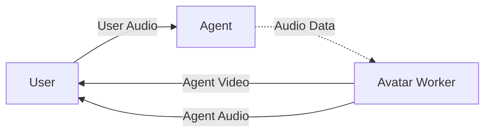

# Agents: AI Models & Integrations

LLM, STT, TTS, Realtime, and Avatar plugin references. Integrations with OpenAI, Google, Azure, AWS, SpaceXAI, and Groq.

- **Total pages in this section**: 132
- **Successful retrieves**: 132
- **API References / Placeholders**: 0

## Table of Contents

1. [agents/models/](#page-1) (✓)
2. [agents/models/pipelines/](#page-2) (✓)
3. [agents/models/inference/](#page-3) (✓)
4. [agents/models/llm/](#page-4) (✓)
5. [agents/models/stt/](#page-5) (✓)
6. [agents/models/tts/](#page-6) (✓)
7. [agents/models/realtime/](#page-7) (✓)
8. [agents/models/avatar/](#page-8) (✓)
9. [agents/integrations/openai](#page-9) (✓)
10. [agents/integrations/google](#page-10) (✓)
11. [agents/integrations/azure](#page-11) (✓)
12. [agents/integrations/aws](#page-12) (✓)
13. [agents/integrations/spacexai](#page-13) (✓)
14. [agents/integrations/groq](#page-14) (✓)
15. [agents/integrations/cerebras](#page-15) (✓)
16. [agents/models/llm/livekit](#page-16) (✓)
17. [agents/models/llm/deepseek](#page-17) (✓)
18. [agents/models/llm/gemini](#page-18) (✓)
19. [agents/models/llm/kimi](#page-19) (✓)
20. [agents/models/llm/openai](#page-20) (✓)
21. [agents/models/llm/spacexai](#page-21) (✓)
22. [agents/models/llm/anthropic](#page-22) (✓)
23. [agents/models/llm/aws](#page-23) (✓)
24. [agents/models/llm/baseten](#page-24) (✓)
25. [agents/models/llm/cerebras](#page-25) (✓)
26. [agents/models/llm/fireworks](#page-26) (✓)
27. [agents/models/llm/groq](#page-27) (✓)
28. [agents/models/llm/langchain](#page-28) (✓)
29. [agents/models/llm/letta](#page-29) (✓)
30. [agents/models/llm/mistralai](#page-30) (✓)
31. [agents/models/llm/ollama](#page-31) (✓)
32. [agents/models/llm/azure-openai](#page-32) (✓)
33. [agents/models/llm/openrouter](#page-33) (✓)
34. [agents/models/llm/ovhcloud](#page-34) (✓)
35. [agents/models/llm/perplexity](#page-35) (✓)
36. [agents/models/llm/sarvam](#page-36) (✓)
37. [agents/models/llm/telnyx](#page-37) (✓)
38. [agents/models/llm/together](#page-38) (✓)
39. [agents/models/llm/openai-compatible-llms](#page-39) (✓)
40. [agents/models/stt/assemblyai](#page-40) (✓)
41. [agents/models/stt/cartesia](#page-41) (✓)
42. [agents/models/stt/deepgram](#page-42) (✓)
43. [agents/models/stt/elevenlabs](#page-43) (✓)
44. [agents/models/stt/gemini](#page-44) (✓)
45. [agents/models/stt/spacexai](#page-45) (✓)
46. [agents/models/stt/speechmatics](#page-46) (✓)
47. [agents/models/stt/aws](#page-47) (✓)
48. [agents/models/stt/azure](#page-48) (✓)
49. [agents/models/stt/azure-openai](#page-49) (✓)
50. [agents/models/stt/baseten](#page-50) (✓)
51. [agents/models/stt/clova](#page-51) (✓)
52. [agents/models/stt/fal](#page-52) (✓)
53. [agents/models/stt/gladia](#page-53) (✓)
54. [agents/models/stt/gnani](#page-54) (✓)
55. [agents/models/stt/google](#page-55) (✓)
56. [agents/models/stt/gradium](#page-56) (✓)
57. [agents/models/stt/groq](#page-57) (✓)
58. [agents/models/stt/inworld](#page-58) (✓)
59. [agents/models/stt/mistralai](#page-59) (✓)
60. [agents/models/stt/nvidia](#page-60) (✓)
61. [agents/models/stt/openai](#page-61) (✓)
62. [agents/models/stt/ovhcloud](#page-62) (✓)
63. [agents/models/stt/sarvam](#page-63) (✓)
64. [agents/models/stt/simplismart](#page-64) (✓)
65. [agents/models/stt/slng](#page-65) (✓)
66. [agents/models/stt/smallestai](#page-66) (✓)
67. [agents/models/stt/soniox](#page-67) (✓)
68. [agents/models/stt/spitch](#page-68) (✓)
69. [agents/models/stt/keyterms/](#page-69) (✓)
70. [agents/models/tts/cartesia](#page-70) (✓)
71. [agents/models/tts/deepgram](#page-71) (✓)
72. [agents/models/tts/elevenlabs](#page-72) (✓)
73. [agents/models/tts/fishaudio](#page-73) (✓)
74. [agents/models/tts/gradium](#page-74) (✓)
75. [agents/models/tts/inworld](#page-75) (✓)
76. [agents/models/tts/rime](#page-76) (✓)
77. [agents/models/tts/spacexai](#page-77) (✓)
78. [agents/models/tts/asyncai](#page-78) (✓)
79. [agents/models/tts/aws](#page-79) (✓)
80. [agents/models/tts/azure](#page-80) (✓)
81. [agents/models/tts/azure-openai](#page-81) (✓)
82. [agents/models/tts/baseten](#page-82) (✓)
83. [agents/models/tts/cambai](#page-83) (✓)
84. [agents/models/tts/gemini](#page-84) (✓)
85. [agents/models/tts/gnani](#page-85) (✓)
86. [agents/models/tts/google](#page-86) (✓)
87. [agents/models/tts/groq](#page-87) (✓)
88. [agents/models/tts/hume](#page-88) (✓)
89. [agents/models/tts/kokoro](#page-89) (✓)
90. [agents/models/tts/lmnt](#page-90) (✓)
91. [agents/models/tts/minimax](#page-91) (✓)
92. [agents/models/tts/mistralai](#page-92) (✓)
93. [agents/models/tts/murf](#page-93) (✓)
94. [agents/models/tts/neuphonic](#page-94) (✓)
95. [agents/models/tts/nvidia](#page-95) (✓)
96. [agents/models/tts/openai](#page-96) (✓)
97. [agents/models/tts/resemble](#page-97) (✓)
98. [agents/models/tts/respeecher](#page-98) (✓)
99. [agents/models/tts/sarvam](#page-99) (✓)
100. [agents/models/tts/simplismart](#page-100) (✓)
101. [agents/models/tts/slng](#page-101) (✓)
102. [agents/models/tts/smallestai](#page-102) (✓)
103. [agents/models/tts/soniox](#page-103) (✓)
104. [agents/models/tts/speechify](#page-104) (✓)
105. [agents/models/tts/speechmatics](#page-105) (✓)
106. [agents/models/tts/spitch](#page-106) (✓)
107. [agents/models/tts/custom-voices/](#page-107) (✓)
108. [agents/models/tts/expressive/](#page-108) (✓)
109. [agents/models/realtime/plugins/gemini](#page-109) (✓)
110. [agents/models/realtime/plugins/nova-sonic](#page-110) (✓)
111. [agents/models/realtime/plugins/openai](#page-111) (✓)
112. [agents/models/realtime/plugins/azure-openai](#page-112) (✓)
113. [agents/models/realtime/plugins/personaplex](#page-113) (✓)
114. [agents/models/realtime/plugins/phonic](#page-114) (✓)
115. [agents/models/realtime/plugins/spacexai](#page-115) (✓)
116. [agents/models/realtime/plugins/ultravox](#page-116) (✓)
117. [agents/models/avatar/plugins/anam](#page-117) (✓)
118. [agents/models/avatar/plugins/avatario](#page-118) (✓)
119. [agents/models/avatar/plugins/avatartalk](#page-119) (✓)
120. [agents/models/avatar/plugins/bey](#page-120) (✓)
121. [agents/models/avatar/plugins/bithuman](#page-121) (✓)
122. [agents/models/avatar/plugins/did](#page-122) (✓)
123. [agents/models/avatar/plugins/hedra](#page-123) (✓)
124. [agents/models/avatar/plugins/keyframe](#page-124) (✓)
125. [agents/models/avatar/plugins/lemonslice](#page-125) (✓)
126. [agents/models/avatar/plugins/liveavatar](#page-126) (✓)
127. [agents/models/avatar/plugins/protoface](#page-127) (✓)
128. [agents/models/avatar/plugins/runway](#page-128) (✓)
129. [agents/models/avatar/plugins/simli](#page-129) (✓)
130. [agents/models/avatar/plugins/spatius](#page-130) (✓)
131. [agents/models/avatar/plugins/tavus](#page-131) (✓)
132. [agents/models/avatar/plugins/trugen](#page-132) (✓)

---

<a name="page-1"></a>
## Page 1: agents/models/
**Original URL:** https://docs.livekit.io/agents/models/  
**Source MD URL:** https://docs.livekit.io/agents/models.md

LiveKit docs › Build Agents › Models › Overview

---

# Models overview

> Choose the right AI models for your voice agent.

## Overview

Voice agents require one or more AI models to provide understanding, intelligence, and speech. You can choose to use a high-performance STT-LLM-TTS voice pipeline constructed from multiple specialized models, or to use a realtime model with direct speech-to-speech capabilities. For a comparison of these pipeline types and guidance on when to use each one, see [Pipeline types](https://docs.livekit.io/agents/models/pipelines.md).

LiveKit Agents includes support for a wide variety of AI providers, from the largest research companies to emerging startups. You can use LiveKit Inference to access many of these models [directly through LiveKit Cloud](#inference), or you can use the open source [plugins](#plugins) to connect directly to a wider range of model providers.

## LiveKit Inference

LiveKit Inference provides access to many of the best models and providers for voice agents, including models from OpenAI, Google, AssemblyAI, Deepgram, Cartesia, Inworld, and more. LiveKit Inference is included in LiveKit Cloud, and does not require any additional plugins. It's [zero data retention](https://docs.livekit.io/agents/models/inference.md#zero-data-retention) by default, so your prompts, audio, and model outputs are never stored or used to train models.

- **[LiveKit Inference](https://docs.livekit.io/agents/models/inference.md)**: Supported models, configuration options, and billing for LiveKit Inference.

## Plugins

LiveKit Agents includes a large ecosystem of open source plugins for a variety of AI providers. Each plugin is designed to support a single provider, but may cover a range of functionality depending on the provider. For instance, the OpenAI plugin includes support for OpenAI language models, speech, transcription, and the Realtime API.

For Python, the plugins are offered as optional dependencies on the base SDK. For instance, to install the SDK with the OpenAI plugin, run the following command:

```shell
uv add "livekit-agents[openai]~=1.5"

```

For Node.js, the plugins are offered as individual packages. For instance, to install the OpenAI plugin, use the following command:

```shell
pnpm add "@livekit/agents-plugin-openai@1.x"

```

Each plugin requires that you have your own account with the provider, as well as an API key or other credentials. You can find authentication instructions in the documentation for each individual plugin.

### OpenAI API compatibility

Many providers have standardized around the OpenAI API format for chat completions and more. Support for a number of these providers is included out-of-the-box with the OpenAI plugin, and you can find specific instructions in the associated documentation. For any provider not included, you can override the API key and base URL at initialization for the LLM, STT, and TTS interfaces in the plugin.

> ❗ **API Mode for OpenAI-Compatible Endpoints**
> 
> When using OpenAI-compatible endpoints (providers with custom `base_url`), confirm you're using the API mode that matches the implementation, as mode choice varies by provider. See [API modes](https://docs.livekit.io/agents/models/llm/openai.md#api-modes) for more information.

**Python**:

```python
from livekit.plugins import openai
import os

session = AgentSession(
   llm=openai.LLM(
      model="model-name", 
      base_url="https://api.provider.com/v1", 
      api_key=os.getenv("PROVIDER_API_KEY")
   ),
    # ... stt, tts, etc ...
)

```

---

**Node.js**:

```typescript
import * as openai from '@livekit/agents-plugin-openai';

const session = new voice.AgentSession({
   llm: openai.LLM({ 
      model: "model-name", 
      baseURL: "https://api.provider.com/v1", 
      apiKey: process.env.PROVIDER_API_KEY
   }),
   // ... stt, tts, etc ...
});

```

### Contributing

The LiveKit Agents plugin framework is extensible and community-driven. Your plugin can integrate with new providers or directly load models for local inference. LiveKit especially welcomes new TTS, STT, and LLM plugins.

To learn more, see the guidelines for contributions to the [Python](https://github.com/livekit/agents/?tab=contributing-ov-file) and [Node.js](https://github.com/livekit/agents-js/?tab=contributing-ov-file) SDKs.

## Usage

Use models with the `AgentSession` class. This class accepts models in the `stt`, `tts`, and `llm` arguments. For LiveKit Inference models, use the `inference` module classes. For plugin models, use the plugin classes directly.

For instance, a simple `AgentSession` built on LiveKit Inference might look like the following:

**Python**:

```python
from livekit.agents import AgentSession, inference

session = AgentSession(
    stt=inference.STT(
        model="deepgram/flux-general",
        language="en"
    ),
    llm=inference.LLM(
        model="google/gemma-4-31b-it",
    ),
    tts="inworld/inworld-tts-2:Ashley",
)

```

---

**Node.js**:

```typescript
import { AgentSession, inference } from '@livekit/agents';

const session = new AgentSession({
    stt: new inference.STT({
        model: "deepgram/flux-general",
        language: "en"
    }),
    llm: new inference.LLM({
        model: "google/gemma-4-31b-it",
    }),
    tts: "inworld/inworld-tts-2:Ashley",
});

```

To use plugins instead, you can configure it like this:

**Python**:

```python
from livekit.agents import AgentSession
from livekit.plugins import openai, cartesia, assemblyai

# Use Responses API (recommended for direct OpenAI usage)
session = AgentSession(
    llm=openai.responses.LLM(model="gpt-5.3-chat-latest"),
    tts=cartesia.TTS(model="sonic-3", voice="9626c31c-bec5-4cca-baa8-f8ba9e84c8bc"),
    stt=assemblyai.STT(language="en"),
)

```

---

**Node.js**:

```typescript
import { AgentSession } from '@livekit/agents';
import * as openai from '@livekit/agents-plugin-openai';
import * as cartesia from '@livekit/agents-plugin-cartesia';
import * as assemblyai from '@livekit/agents-plugin-assemblyai';

const session = new AgentSession({
    llm: new openai.responses.LLM({ model: "gpt-5.3-chat-latest" }),
    tts: new cartesia.TTS({ model: "sonic-3", voice: "9626c31c-bec5-4cca-baa8-f8ba9e84c8bc" }),
    stt: new assemblyai.STT({ language: "en" }),
});

```

You can use a combination of LiveKit Inference and plugins to build your voice agent. Additionally, you can change models during a session to optimize for different use cases or conversation phases. For more information, see [Workflows](https://docs.livekit.io/agents/logic/workflows.md).

## In this section

The following guides cover all models available in LiveKit Agents, both through LiveKit Inference and additional plugins. Refer to these guides for model availability, configuration options, and usage instructions.

- **[LiveKit Inference](https://docs.livekit.io/agents/models/inference.md)**: Supported models, configuration options, and billing for LiveKit Inference.

- **[Large language models (LLM)](https://docs.livekit.io/agents/models/llm.md)**: Chat and reasoning models from the largest research companies and emerging startups.

- **[Speech-to-text (STT)](https://docs.livekit.io/agents/models/stt.md)**: Transcription models from providers including Deepgram and AssemblyAI.

- **[Text-to-speech (TTS)](https://docs.livekit.io/agents/models/tts.md)**: Speech models and custom voices from providers including Cartesia and Fish Audio.

- **[Realtime models](https://docs.livekit.io/agents/models/realtime.md)**: Speech-to-speech models including the OpenAI Realtime API and Gemini Live.

- **[Virtual avatars](https://docs.livekit.io/agents/models/avatar.md)**: Realtime video avatars from providers including Anam and Tavus.

---

This document was rendered at 2026-08-28T04:22:10.495Z.
For the latest version of this document, see [https://docs.livekit.io/agents/models.md](https://docs.livekit.io/agents/models.md).

To explore all LiveKit documentation, see [llms.txt](https://docs.livekit.io/llms.txt).

---

<a name="page-2"></a>
## Page 2: agents/models/pipelines/
**Original URL:** https://docs.livekit.io/agents/models/pipelines/  
**Source MD URL:** https://docs.livekit.io/agents/models/pipelines.md

LiveKit docs › Build Agents › Models › Pipeline types

---

# Pipeline types

> Compare the voice pipeline types supported by LiveKit Agents and pick the right one for your agent.

## Overview

LiveKit Agents supports two main voice pipeline types, plus a hybrid that combines them:

- **STT-LLM-TTS pipeline**: Three specialized models for speech recognition, language understanding, and speech synthesis.
- **Realtime model**: A single speech-to-speech model that consumes and produces audio directly.
- **Half-cascade**: A realtime model for input understanding paired with a separate TTS for output.

For most production agents, an STT-LLM-TTS pipeline is the right default. The sections below cover each option and when to choose it.

## At a glance

The following table compares the three options across the key dimensions that most often drive architecture selection. The sections below go into more depth on each one.

| Dimension | STT-LLM-TTS pipeline | Realtime model | Half-cascade |
| End-to-end latency | Moderate | Fastest | Moderate |
| Tool calling | Mature | Less mature | Less mature |
| Realtime transcription | Yes | Delayed | Delayed |
| Scripted speech (`say()`) | Yes | No | Yes |
| Prosody-aware comprehension | No | Yes | Yes |
| Expressive speech output | Depends on TTS | Built-in | Depends on TTS |
| Auditability | Full text trail | Limited | Output text only |

## STT-LLM-TTS pipeline

A pipeline (also called a sequential or cascaded pipeline) strings together three specialized models. Audio flows through them in sequence: speech-to-text (STT) transcribes the user's speech, a large language model (LLM) generates a text response, and text-to-speech (TTS) speaks the response back. Each stage has a clean interface, so you can swap any component independently or change models partway through a session.

Choose this for most production agents. It gives you full control over each stage and is the easiest path to debug and audit.

### Strengths

- **Modularity**: You can mix and match providers for STT, LLM, and TTS, and replace any stage without modifying the others.
- **Observability**: Every stage produces text or audio you can inspect, log, and audit.
- **Mature tool calling**: Text-based LLM tool calling is more mature and predictable than audio-native alternatives.
- **Realtime transcription**: STT produces interim transcripts you can stream to your frontend or store as a record of the conversation.
- **Scripted speech**: TTS reads exact text, so methods like `say()` produce predictable output.

### Considerations

- **Higher total latency**: Each stage adds latency. Streaming overlaps the stages and keeps total latency low, but a pipeline still adds more end-to-end delay than a realtime model.
- **Loss of vocal nuance**: Because STT produces text, prosody and emotional cues in the user's speech don't reach the LLM.

## Realtime models

A [realtime model](https://docs.livekit.io/agents/models/realtime.md) consumes and produces speech directly, in a single model. There's no transcription step on the way in and no separate TTS on the way out.

Choose a realtime model when latency or expressive output matter more than fine-grained control.

### Strengths

- **Lower end-to-end latency**: Combining stages into one model removes the inter-stage hand-offs.
- **Expressive output**: Generated speech can carry emotion, emphasis, and other prosodic features that text-to-speech models don't capture.
- **Richer input understanding**: The model hears prosody, tone, and other verbal cues that get lost in transcription.
- **Simpler setup**: A single model with one provider, instead of three.

### Considerations

- **Delayed transcripts**: Realtime models don't produce interim transcripts. User transcriptions can lag the agent's response. If you need live captions or transcription-driven logic, add a separate STT plugin.
- **No scripted speech**: The model follows instructions but doesn't read an exact script, so methods like `say()` aren't supported the same way they are in a pipeline.
- **Less provider flexibility**: You're committed to a single provider's model for the full speech-to-speech path.
- **Harder to audit**: Without a text trail at every stage, debugging and compliance review take more work.

For the full list of limitations, see [Considerations and limitations](https://docs.livekit.io/agents/models/realtime.md#considerations-and-limitations) on the realtime models page.

## Half-cascade architecture

A half-cascade architecture pairs a realtime model with a separate TTS. The realtime model handles speech understanding only and returns a text response, and a TTS plugin speaks that response. This combines the input-side strengths of realtime with the output-side strengths of a pipeline. For configuration details, see [Separate TTS configuration](https://docs.livekit.io/agents/models/realtime.md#separate-tts) on the realtime models page.

Choose a half-cascade when you want both realtime speech understanding and full control over what your agent says.

### Strengths

- **Realtime speech comprehension**: You keep the realtime model's ability to hear prosody and emotional cues.
- **Output control**: A separate TTS lets you read exact scripts, choose voices, and apply the same control you'd have in a pipeline.
- **Stable speech output**: A dedicated TTS avoids realtime-specific output quirks, like some realtime models defaulting to text-only output after loading long conversation histories.

### Considerations

- **Two models to manage**: You configure and operate both a realtime model and a TTS, so the setup is closer to a pipeline than a pure realtime agent.
- **Provider support varies**: Not all realtime models support a text-only response modality. Check the relevant provider page before adopting this pattern.

## Latency

Voice conversations feel natural when end-to-end response latency stays under one second. Each architecture has a different latency profile. Pipelines accumulate latency across stages but reduce it through streaming, while realtime models combine stages for a lower baseline. For a per-stage breakdown of voice agent latency, see [Sequential pipeline architecture for voice agents](https://livekit.com/blog/sequential-pipeline-architecture-voice-agents).

## Additional resources

- **[Models overview](https://docs.livekit.io/agents/models.md)**: All models supported by LiveKit Agents, including STT, LLM, TTS, realtime, and avatar.

- **[Realtime models](https://docs.livekit.io/agents/models/realtime.md)**: Configuration, considerations, and provider plugins for realtime models.

- **[Sessions](https://docs.livekit.io/agents/logic/sessions.md)**: Configure your AgentSession to use a pipeline, a realtime model, or a half-cascade.

- **[Sequential pipeline architecture for voice agents](https://livekit.com/blog/sequential-pipeline-architecture-voice-agents)**: Detailed analysis of the cascaded pipeline pattern, including per-stage latency budgets.

---

This document was rendered at 2026-08-28T04:22:12.065Z.
For the latest version of this document, see [https://docs.livekit.io/agents/models/pipelines.md](https://docs.livekit.io/agents/models/pipelines.md).

To explore all LiveKit documentation, see [llms.txt](https://docs.livekit.io/llms.txt).

---

<a name="page-3"></a>
## Page 3: agents/models/inference/
**Original URL:** https://docs.livekit.io/agents/models/inference/  
**Source MD URL:** https://docs.livekit.io/agents/models/inference.md

LiveKit docs › Build Agents › Models › LiveKit Inference

---

# LiveKit Inference

> Access the best AI models for voice agents, included in LiveKit Cloud.

## Overview


LiveKit Inference provides access to many of the best models and providers for voice agents, including models from OpenAI, Google, AssemblyAI, Deepgram, Cartesia, Fish Audio, Inworld, and more. LiveKit Inference is included in LiveKit Cloud, and does not require any additional plugins. It's [zero data retention](#zero-data-retention) by default, so your prompts, audio, and model outputs are never stored or used to train models. See the guides for [LLM](https://docs.livekit.io/agents/models/llm.md), [STT](https://docs.livekit.io/agents/models/stt.md), and [TTS](https://docs.livekit.io/agents/models/tts.md) for supported models and configuration options.

To learn more about LiveKit Inference, see the blog post [Introducing LiveKit Inference: A unified model interface for voice AI](https://blog.livekit.io/introducing-livekit-inference/).

For LiveKit Inference models, use the `inference` module classes in your `AgentSession`:

**Python**:

```python
from livekit.agents import AgentSession, inference

session = AgentSession(
    stt=inference.STT(
        model="deepgram/flux-general",
        language="en"
    ),
    llm=inference.LLM(
        model="google/gemma-4-31b-it",
    ),
    tts=inference.TTS(
        model="inworld/inworld-tts-2",
        voice="Ashley",
    ),
)

```

---

**Node.js**:

```typescript
import { AgentSession, inference } from '@livekit/agents';

const session = new AgentSession({
    stt: new inference.STT({
        model: "deepgram/flux-general",
        language: "en"
    }),
    llm: new inference.LLM({
        model: "google/gemma-4-31b-it",
    }),
    tts: new inference.TTS({
        model: "inworld/inworld-tts-2",
        voice: "Ashley",
    }),
});

```

## String descriptors

As a shortcut, you can pass a model descriptor string directly instead of using the inference classes. This is a convenient way to get started quickly.

**Python**:

```python
from livekit.agents import AgentSession

session = AgentSession(
    stt="deepgram/nova-3:en",
    llm="google/gemma-4-31b-it",
    tts="inworld/inworld-tts-2:Ashley",
)

```

---

**Node.js**:

```typescript
import { AgentSession } from '@livekit/agents';

const session = new AgentSession({
    stt: "deepgram/nova-3:en",
    llm: "google/gemma-4-31b-it",
    tts: "inworld/inworld-tts-2:Ashley",
});

```

For detailed parameter references and model-specific options, see the individual model guides for [LLM](https://docs.livekit.io/agents/models/llm.md), [STT](https://docs.livekit.io/agents/models/stt.md), and [TTS](https://docs.livekit.io/agents/models/tts.md).

## Zero data retention

LiveKit Inference is zero data retention (ZDR) by default. Your prompts, audio, and model outputs pass through only to generate a response. Neither LiveKit nor the underlying model providers log, store, or train on your data. This applies to every LLM, STT, and TTS model, on every plan, with no configuration required.

> ℹ️ **Note**
> 
> Zero data retention applies to the data you send to model providers through LiveKit Inference. It's separate from [agent observability](https://docs.livekit.io/deploy/observability/insights.md), which you can enable to retain session data in LiveKit Cloud, and from [custom voices](https://docs.livekit.io/agents/models/tts.md#custom), which store the voice sample you provide so you can reuse the clone across providers.

## Models

The following tables list all models currently available through LiveKit Inference.

- **[Pricing](https://livekit.com/pricing/inference)**: See the latest pricing for all LiveKit Inference models.

### Large language models (LLM)

> ℹ️ **Recommended for voice agents**
> 
> [Gemma 4 31B](https://docs.livekit.io/agents/models/llm/livekit.md) is the recommended default LLM. It's a latency-optimized, open-weight model served on LiveKit's infrastructure.

| Model family | Model name | Provided by |
| ------------- | ---------- | ----------- |
| DeepSeek | DeepSeek-V4 Pro | Baseten |
|   | DeepSeek-V3 **RETIRED** (retired May 1, 2026; use `openai/gpt-oss-120b`) | Baseten |
|   | DeepSeek-V3.1 **RETIRED** (retired June 17, 2026; use `deepseek-ai/deepseek-v4-pro`) | Baseten |
|   | DeepSeek-V3.2 **RETIRED** (retired March 7, 2026) | DeepSeek |
| Gemini | Gemini 3 Flash | Google |
|   | Gemini 3.1 Flash Lite | Google |
|   | Gemini 3.1 Pro | Google |
|   | Gemini 3.5 Flash | Google |
|   | Gemini 3.5 Flash Lite | Google |
|   | Gemini 3.6 Flash | Google |
|   | Gemini 3.7 Flash | Google |
|   | Gemini 2.5 Flash **DEPRECATED** (retires October 10, 2026; use `google/gemma-4-31b-it`) | Google |
|   | Gemini 2.5 Flash-Lite **DEPRECATED** (retires October 10, 2026; use `google/gemma-4-31b-it`) | Google |
|   | Gemini 2.5 Pro **DEPRECATED** (retires October 10, 2026; use `google/gemini-3.6-flash`) | Google |
|   | Gemini 2.0 Flash **RETIRED** (retired February 13, 2026; use `google/gemma-4-31b-it`) | Google |
|   | Gemini 2.0 Flash-Lite **RETIRED** (retired February 13, 2026; use `google/gemma-4-31b-it`) | Google |
|   | Gemini 3 Pro **RETIRED** (retired March 9, 2026; use `google/gemini-3.1-pro-preview`) | Google |
| Gemma | Gemma 4 31B | LiveKit |
| Kimi | Kimi K2.6 | Baseten |
|   | Kimi K2 Instruct **RETIRED** (retired March 7, 2026) | Baseten |
|   | Kimi K2.5 **RETIRED** (retired July 23, 2026; use `moonshotai/kimi-k2.6`) | Baseten |
| OpenAI | ChatGPT Latest | Azure, OpenAI |
|   | GPT-4.1 | Azure, OpenAI |
|   | GPT-4.1 mini | Azure, OpenAI |
|   | GPT-4.1 nano | Azure, OpenAI |
|   | GPT-4o | Azure, OpenAI |
|   | GPT-4o mini | Azure, OpenAI |
|   | GPT-5 | Azure, OpenAI |
|   | GPT-5 mini | Azure, OpenAI |
|   | GPT-5 nano | Azure, OpenAI |
|   | GPT-5.1 | Azure, OpenAI |
|   | GPT-5.2 | Azure, OpenAI |
|   | GPT-5.4 | Azure, OpenAI |
|   | GPT-5.4 mini | OpenAI |
|   | GPT-5.4 nano | OpenAI |
|   | GPT-5.5 | Azure, OpenAI |
|   | GPT-5.6 Luna | OpenAI |
|   | GPT-5.6 Sol | OpenAI |
|   | GPT-5.6 Terra | OpenAI |
|   | GPT OSS 120B | Baseten, Groq |
|   | GPT-5.1 Chat **RETIRED** (retired June 19, 2026; use `openai/chat-latest`) | Azure, OpenAI |
|   | GPT-5.2 Chat **RETIRED** (retired June 19, 2026; use `openai/chat-latest`) | Azure, OpenAI |
|   | GPT-5.3 Chat **RETIRED** (retired June 19, 2026; use `openai/chat-latest`) | Azure, OpenAI |
| SpaceXAI | Grok 4.20 | SpaceXAI |
|   | Grok 4.20 Reasoning | SpaceXAI |
|   | Grok 4.20 Multi-Agent | SpaceXAI |
|   | Grok 4.3 | SpaceXAI |
|   | Grok 4.5 | SpaceXAI |
|   | Grok 4.1 Fast **DEPRECATED** (retires August 15, 2026; use `xai/grok-4.3`) | SpaceXAI |
|   | Grok 4.1 Fast Reasoning **DEPRECATED** (retires August 15, 2026; use `xai/grok-4.3`) | SpaceXAI |

> ⚠️ **Retired models**
> 
> Retired models are no longer accessible. If you're using a retired model, switch to a currently available model.

### Speech-to-text (STT)

| Model family | Model name | Languages |
| -------- | -------- | --------- |
| [Deepgram](https://docs.livekit.io/agents/models/stt/deepgram.md) | Flux | English only |
|   | Flux (Multilingual) | Multilingual, 10 languages |
|   | Nova-3 | Multilingual, 48 languages |
|   | Nova-3 Medical | English only |
|   | Nova-2 | Multilingual, 33 languages |
|   | Nova-2 Conversational AI | English only |
|   | Nova-2 Medical | English only |
|   | Nova-2 Phone Call | English only |
| [AssemblyAI](https://docs.livekit.io/agents/models/stt/assemblyai.md) | Universal-3.5 Pro | 19 languages |
|   | Universal-Streaming | English only |
|   | Universal-Streaming-Multilingual | Multilingual, 6 languages |
| [Cartesia](https://docs.livekit.io/agents/models/stt/cartesia.md) | Ink 2 | English only |
|   | Ink Whisper | 100 languages |
| [Gemini](https://docs.livekit.io/agents/models/stt/gemini.md) | Gemini 3.5 Transcribe Live | 26 languages |
| [Speechmatics](https://docs.livekit.io/agents/models/stt/speechmatics.md) | Speechmatics Enhanced | 61 languages |
|   | Speechmatics Linden-1 | 61 languages |
|   | Speechmatics Standard | 61 languages |
| [SpaceXAI](https://docs.livekit.io/agents/models/stt/spacexai.md) | Speech to Text | 25 languages |
| [ElevenLabs](https://docs.livekit.io/agents/models/stt/elevenlabs.md) | Scribe v2 Realtime **DEPRECATED** (retires August 31, 2026) | 190 languages |

### Text-to-speech (TTS)

| Model family | Model ID | Languages |
| -------- | -------- | --------- |
| [Cartesia](https://docs.livekit.io/agents/models/tts/cartesia.md) | `cartesia/sonic-3` | `en`, `de`, `es`, `fr`, `ja`, `pt`, `zh`, `hi`, `ko`, `it`, `nl`, `pl`, `ru`, `sv`, `tr`, `tl`, `bg`, `ro`, `ar`, `cs`, `el`, `fi`, `hr`, `ms`, `sk`, `da`, `ta`, `uk`, `hu`, `no`, `vi`, `bn`, `th`, `he`, `ka`, `id`, `te`, `gu`, `kn`, `ml`, `mr`, `pa` |
|   | `cartesia/sonic-3-2026-01-12` | `en`, `de`, `es`, `fr`, `ja`, `pt`, `zh`, `hi`, `ko`, `it`, `nl`, `pl`, `ru`, `sv`, `tr`, `tl`, `bg`, `ro`, `ar`, `cs`, `el`, `fi`, `hr`, `ms`, `sk`, `da`, `ta`, `uk`, `hu`, `no`, `vi`, `bn`, `th`, `he`, `ka`, `id`, `te`, `gu`, `kn`, `ml`, `mr`, `pa` |
|   | `cartesia/sonic-3-latest` | `en`, `de`, `es`, `fr`, `ja`, `pt`, `zh`, `hi`, `ko`, `it`, `nl`, `pl`, `ru`, `sv`, `tr`, `tl`, `bg`, `ro`, `ar`, `cs`, `el`, `fi`, `hr`, `ms`, `sk`, `da`, `ta`, `uk`, `hu`, `no`, `vi`, `bn`, `th`, `he`, `ka`, `id`, `te`, `gu`, `kn`, `ml`, `mr`, `pa` |
|   | `cartesia/sonic-3.5` | `en`, `de`, `es`, `ja`, `pt`, `zh`, `hi`, `ko`, `nl`, `pl`, `ru`, `sv`, `tr`, `tl`, `bg`, `ro`, `ar`, `cs`, `el`, `fi`, `hr`, `ms`, `sk`, `da`, `ta`, `uk`, `hu`, `no`, `vi`, `bn`, `th`, `he`, `ka`, `id`, `te`, `gu`, `kn`, `ml`, `mr`, `pa` |
|   | `cartesia/sonic-3.5-2026-05-04` | `en`, `de`, `es`, `ja`, `pt`, `zh`, `hi`, `ko`, `nl`, `pl`, `ru`, `sv`, `tr`, `tl`, `bg`, `ro`, `ar`, `cs`, `el`, `fi`, `hr`, `ms`, `sk`, `da`, `ta`, `uk`, `hu`, `no`, `vi`, `bn`, `th`, `he`, `ka`, `id`, `te`, `gu`, `kn`, `ml`, `mr`, `pa` |
|   | `cartesia/sonic-latest` | `en`, `de`, `es`, `ja`, `pt`, `zh`, `hi`, `ko`, `nl`, `pl`, `ru`, `sv`, `tr`, `tl`, `bg`, `ro`, `ar`, `cs`, `el`, `fi`, `hr`, `ms`, `sk`, `da`, `ta`, `uk`, `hu`, `no`, `vi`, `bn`, `th`, `he`, `ka`, `id`, `te`, `gu`, `kn`, `ml`, `mr`, `pa` |
|   | `cartesia/sonic-preview` | `en`, `fr`, `de`, `es`, `ja`, `pt`, `zh`, `hi`, `it`, `ko`, `nl`, `pl`, `ru`, `sv`, `tr`, `tl`, `bg`, `ro`, `ar`, `cs`, `el`, `fi`, `hr`, `ms`, `sk`, `da`, `ta`, `uk`, `hu`, `no`, `vi`, `bn`, `th`, `he`, `ka`, `id`, `te`, `gu`, `kn`, `ml`, `mr`, `pa`, `or`, `ur` |
|   | `cartesia/sonic-2` **DEPRECATED** (retires October 20, 2026; use `cartesia/sonic-3.5`) | `en`, `fr`, `de`, `es`, `pt`, `zh`, `ja`, `ko` |
|   | `cartesia/sonic-3-2025-10-27` **DEPRECATED** (retires October 20, 2026; use `cartesia/sonic-3.5`) | `en`, `de`, `es`, `fr`, `ja`, `pt`, `zh`, `hi`, `ko`, `it`, `nl`, `pl`, `ru`, `sv`, `tr`, `tl`, `bg`, `ro`, `ar`, `cs`, `el`, `fi`, `hr`, `ms`, `sk`, `da`, `ta`, `uk`, `hu`, `no`, `vi`, `bn`, `th`, `he`, `ka`, `id`, `te`, `gu`, `kn`, `ml`, `mr`, `pa` |
|   | `cartesia/sonic-turbo` **DEPRECATED** (retires October 20, 2026; use `cartesia/sonic-3.5`) | `en`, `fr`, `de`, `es`, `pt`, `zh`, `ja`, `hi`, `ko` |
|   | `cartesia/sonic` **RETIRED** (retired June 1, 2026; use `cartesia/sonic-3`) | `en`, `fr`, `de`, `es`, `pt`, `zh`, `ja`, `hi`, `it`, `ko`, `nl`, `pl`, `ru`, `sv`, `tr` |
| [Deepgram](https://docs.livekit.io/agents/models/tts/deepgram.md) | `deepgram/aura-2` | `en`, `en-US`, `en-PH`, `en-GB`, `en-AU`, `es`, `es-CO`, `es-MX`, `es-ES`, `es-419`, `es-AR`, `nl`, `nl-NL`, `fr`, `fr-FR`, `de`, `de-DE`, `it`, `it-IT`, `ja`, `ja-JP` |
|   | `deepgram/flux-tts` | `en`, `en-US`, `en-GB`, `en-AU`, `en-IN` |
|   | `deepgram/aura` **RETIRED** (retired February 13, 2026; use `deepgram/aura-2`) | `en`, `en-US`, `en-IE`, `en-GB` |
| [Fish Audio](https://docs.livekit.io/agents/models/tts/fishaudio.md) | `fishaudio/s2-pro` | `en`, `zh`, `ja`, `de`, `fr`, `es`, `ko`, `ar`, `ru`, `nl`, `it`, `pl`, `pt` |
|   | `fishaudio/s2.1-pro` | `en`, `zh`, `ja`, `de`, `fr`, `es`, `ko`, `ar`, `ru`, `nl`, `it`, `pl`, `pt` |
|   | `fishaudio/s2.1-pro-free` | `en`, `zh`, `ja`, `de`, `fr`, `es`, `ko`, `ar`, `ru`, `nl`, `it`, `pl`, `pt` |
| [Gradium](https://docs.livekit.io/agents/models/tts/gradium.md) | `gradium/default` | `en`, `fr`, `de`, `es`, `pt` |
| [Inworld](https://docs.livekit.io/agents/models/tts/inworld.md) | `inworld/inworld-tts-1.5-max` | `en`, `zh`, `ja`, `ko`, `ru`, `it`, `es`, `pt`, `fr`, `de`, `pl`, `nl`, `hi`, `he`, `ar` |
|   | `inworld/inworld-tts-1.5-mini` | `en`, `zh`, `ja`, `ko`, `ru`, `it`, `es`, `pt`, `fr`, `de`, `pl`, `nl`, `hi`, `he`, `ar` |
|   | `inworld/inworld-tts-2` | `en`, `zh`, `ja`, `ko`, `ru`, `it`, `es`, `pt`, `fr`, `de`, `pl`, `nl`, `hi`, `he`, `ar` |
|   | `inworld/inworld-tts-1` **RETIRED** (retired June 1, 2026; use `inworld/inworld-tts-1.5-mini`) | `en`, `es`, `fr`, `ko`, `nl`, `zh`, `de`, `it`, `ja`, `pl`, `pt`, `ru`, `hi`, `he`, `ar` |
|   | `inworld/inworld-tts-1-max` **RETIRED** (retired June 1, 2026; use `inworld/inworld-tts-1.5-max`) | `en`, `es`, `fr`, `ko`, `nl`, `zh`, `de`, `it`, `ja`, `pl`, `pt`, `ru`, `hi`, `he`, `ar` |
| [Rime](https://docs.livekit.io/agents/models/tts/rime.md) | `rime/coda` | `en`, `es`, `fr`, `de`, `hi`, `ja`, `pt`, `ar` |
|   | `rime/mist` | `en` |
|   | `rime/mistv2` | `en`, `es`, `fr`, `de` |
|   | `rime/mistv3` | `en`, `es`, `fr`, `de`, `hi` |
|   | `rime/arcana` **DEPRECATED** (retires August 19, 2026; use `rime/coda`) | `en`, `es`, `fr`, `de`, `hi`, `he`, `ja`, `pt`, `ar` |
| [SpaceXAI](https://docs.livekit.io/agents/models/tts/spacexai.md) | `xai/tts-1` | `auto`, `en`, `ar-EG`, `ar-SA`, `ar-AE`, `bn`, `zh`, `fr`, `de`, `hi`, `id`, `it`, `ja`, `ko`, `pt-BR`, `pt-PT`, `ru`, `es-MX`, `es-ES`, `tr`, `vi` |
| [ElevenLabs](https://docs.livekit.io/agents/models/tts/elevenlabs.md) | `elevenlabs/eleven_flash_v2` **DEPRECATED** (retires August 31, 2026) | `en` |
|   | `elevenlabs/eleven_flash_v2_5` **DEPRECATED** (retires August 31, 2026) | `en`, `ja`, `zh`, `de`, `hi`, `fr`, `ko`, `pt`, `it`, `es`, `id`, `nl`, `tr`, `fil`, `pl`, `sv`, `bg`, `ro`, `ar`, `cs`, `el`, `fi`, `hr`, `ms`, `sk`, `da`, `ta`, `uk`, `ru`, `hu`, `no`, `vi` |
|   | `elevenlabs/eleven_multilingual_v2` **DEPRECATED** (retires August 31, 2026) | `en`, `ja`, `zh`, `de`, `hi`, `fr`, `ko`, `pt`, `it`, `es`, `id`, `nl`, `tr`, `fil`, `pl`, `sv`, `bg`, `ro`, `ar`, `cs`, `el`, `fi`, `hr`, `ms`, `sk`, `da`, `ta`, `uk`, `ru` |
|   | `elevenlabs/eleven_turbo_v2` **DEPRECATED** (retires August 31, 2026) | `en` |
|   | `elevenlabs/eleven_turbo_v2_5` **DEPRECATED** (retires August 31, 2026) | `en`, `ja`, `zh`, `de`, `hi`, `fr`, `ko`, `pt`, `it`, `es`, `id`, `nl`, `tr`, `fil`, `pl`, `sv`, `bg`, `ro`, `ar`, `cs`, `el`, `fi`, `hr`, `ms`, `sk`, `da`, `ta`, `uk`, `ru`, `hu`, `no`, `vi` |
|   | `elevenlabs/eleven_v3` **DEPRECATED** (retires August 31, 2026) | `en`, `ja`, `zh`, `de`, `hi`, `fr`, `ko`, `pt`, `it`, `es`, `id`, `nl`, `tr`, `fil`, `pl`, `sv`, `bg`, `ro`, `ar`, `cs`, `el`, `fi`, `hr`, `ms`, `sk`, `da`, `ta`, `uk`, `ru`, `hu`, `no`, `vi` |

> ⚠️ **Retired models**
> 
> Retired models are no longer accessible. If you're using a retired model, switch to a currently available model.

## Billing

LiveKit Inference billing is based on usage. Discounted rates are available on the Scale plan. Custom rates are available on the Enterprise plan. Refer to the following articles for more information on quotas, limits, and billing for LiveKit Inference. The latest pricing is always available on the [LiveKit Inference pricing page](https://livekit.com/pricing/inference).

- **[Quotas and limits](https://docs.livekit.io/deploy/admin/quotas-and-limits.md)**: Guide to quotas and limits for LiveKit Cloud plans.

- **[Billing](https://docs.livekit.io/deploy/admin/billing.md)**: Guide to LiveKit Cloud invoices and billing cycles.

---

This document was rendered at 2026-08-28T04:22:12.113Z.
For the latest version of this document, see [https://docs.livekit.io/agents/models/inference.md](https://docs.livekit.io/agents/models/inference.md).

To explore all LiveKit documentation, see [llms.txt](https://docs.livekit.io/llms.txt).

---

<a name="page-4"></a>
## Page 4: agents/models/llm/
**Original URL:** https://docs.livekit.io/agents/models/llm/  
**Source MD URL:** https://docs.livekit.io/agents/models/llm.md

LiveKit docs › Build Agents › Models › LLM › Overview

---

# Large language models (LLM) overview

> Conversational intelligence for your voice agents.

## Overview

The core reasoning, response, and orchestration of your voice agent is powered by an LLM. You can choose between a variety of models to balance performance, accuracy, and cost. In a voice agent, your LLM receives a transcript of the user's speech from an [STT](https://docs.livekit.io/agents/models/stt.md) model, and produces a text response which is turned into speech by a [TTS](https://docs.livekit.io/agents/models/tts.md) model.

You can choose a model served through LiveKit Inference, included with LiveKit Cloud. With LiveKit Inference, your agent runs on LiveKit's infrastructure to minimize latency. No separate provider API key is required, and usage and rate limits are managed through LiveKit Cloud. Use the plugin instead if you prefer to manage billing and rate limits yourself, or need access to a provider not currently available through LiveKit Inference.

### LiveKit Inference

The following models are available in [LiveKit Inference](https://docs.livekit.io/agents/models.md#inference). Refer to the guide for each model for more details on additional configuration options.

> ℹ️ **Recommended for voice agents**
> 
> [Gemma 4 31B](https://docs.livekit.io/agents/models/llm/livekit.md) is the recommended default LLM. It's a latency-optimized, open-weight model served on LiveKit's infrastructure.

| Model family | Model name | Provided by |
| ------------- | ---------- | ----------- |
| DeepSeek | DeepSeek-V4 Pro | Baseten |
|   | DeepSeek-V3 **RETIRED** (retired May 1, 2026; use `openai/gpt-oss-120b`) | Baseten |
|   | DeepSeek-V3.1 **RETIRED** (retired June 17, 2026; use `deepseek-ai/deepseek-v4-pro`) | Baseten |
|   | DeepSeek-V3.2 **RETIRED** (retired March 7, 2026) | DeepSeek |
| Gemini | Gemini 3 Flash | Google |
|   | Gemini 3.1 Flash Lite | Google |
|   | Gemini 3.1 Pro | Google |
|   | Gemini 3.5 Flash | Google |
|   | Gemini 3.5 Flash Lite | Google |
|   | Gemini 3.6 Flash | Google |
|   | Gemini 3.7 Flash | Google |
|   | Gemini 2.5 Flash **DEPRECATED** (retires October 10, 2026; use `google/gemma-4-31b-it`) | Google |
|   | Gemini 2.5 Flash-Lite **DEPRECATED** (retires October 10, 2026; use `google/gemma-4-31b-it`) | Google |
|   | Gemini 2.5 Pro **DEPRECATED** (retires October 10, 2026; use `google/gemini-3.6-flash`) | Google |
|   | Gemini 2.0 Flash **RETIRED** (retired February 13, 2026; use `google/gemma-4-31b-it`) | Google |
|   | Gemini 2.0 Flash-Lite **RETIRED** (retired February 13, 2026; use `google/gemma-4-31b-it`) | Google |
|   | Gemini 3 Pro **RETIRED** (retired March 9, 2026; use `google/gemini-3.1-pro-preview`) | Google |
| Gemma | Gemma 4 31B | LiveKit |
| Kimi | Kimi K2.6 | Baseten |
|   | Kimi K2 Instruct **RETIRED** (retired March 7, 2026) | Baseten |
|   | Kimi K2.5 **RETIRED** (retired July 23, 2026; use `moonshotai/kimi-k2.6`) | Baseten |
| OpenAI | ChatGPT Latest | Azure, OpenAI |
|   | GPT-4.1 | Azure, OpenAI |
|   | GPT-4.1 mini | Azure, OpenAI |
|   | GPT-4.1 nano | Azure, OpenAI |
|   | GPT-4o | Azure, OpenAI |
|   | GPT-4o mini | Azure, OpenAI |
|   | GPT-5 | Azure, OpenAI |
|   | GPT-5 mini | Azure, OpenAI |
|   | GPT-5 nano | Azure, OpenAI |
|   | GPT-5.1 | Azure, OpenAI |
|   | GPT-5.2 | Azure, OpenAI |
|   | GPT-5.4 | Azure, OpenAI |
|   | GPT-5.4 mini | OpenAI |
|   | GPT-5.4 nano | OpenAI |
|   | GPT-5.5 | Azure, OpenAI |
|   | GPT-5.6 Luna | OpenAI |
|   | GPT-5.6 Sol | OpenAI |
|   | GPT-5.6 Terra | OpenAI |
|   | GPT OSS 120B | Baseten, Groq |
|   | GPT-5.1 Chat **RETIRED** (retired June 19, 2026; use `openai/chat-latest`) | Azure, OpenAI |
|   | GPT-5.2 Chat **RETIRED** (retired June 19, 2026; use `openai/chat-latest`) | Azure, OpenAI |
|   | GPT-5.3 Chat **RETIRED** (retired June 19, 2026; use `openai/chat-latest`) | Azure, OpenAI |
| SpaceXAI | Grok 4.20 | SpaceXAI |
|   | Grok 4.20 Reasoning | SpaceXAI |
|   | Grok 4.20 Multi-Agent | SpaceXAI |
|   | Grok 4.3 | SpaceXAI |
|   | Grok 4.5 | SpaceXAI |
|   | Grok 4.1 Fast **DEPRECATED** (retires August 15, 2026; use `xai/grok-4.3`) | SpaceXAI |
|   | Grok 4.1 Fast Reasoning **DEPRECATED** (retires August 15, 2026; use `xai/grok-4.3`) | SpaceXAI |

> ⚠️ **Retired models**
> 
> Retired models are no longer accessible. If you're using a retired model, switch to a currently available model.

### Plugins

The LiveKit Agents framework also includes a variety of open source [plugins](https://docs.livekit.io/agents/models.md#plugins) for a wide range of LLM providers. Plugins are especially useful if you need custom or fine-tuned models. These plugins require authentication with the provider yourself, usually via an API key. You are responsible for setting up your own account and managing your own billing and credentials. The plugins are listed below, along with their availability for Python or Node.js.

| Provider | Python | Node.js |
| -------- | ------ | ------- |
| [Amazon Bedrock](https://docs.livekit.io/agents/models/llm/plugins/aws.md) | ✓ | — |
| [Anthropic](https://docs.livekit.io/agents/models/llm/plugins/anthropic.md) | ✓ | ✓ |
| [Baseten](https://docs.livekit.io/agents/models/llm/plugins/baseten.md) | ✓ | — |
| [Google Gemini](https://docs.livekit.io/agents/models/llm/plugins/gemini.md) | ✓ | ✓ |
| [Groq](https://docs.livekit.io/agents/models/llm/plugins/groq.md) | ✓ | ✓ |
| [LangChain](https://docs.livekit.io/agents/models/llm/plugins/langchain.md) | ✓ | — |
| [Mistral AI](https://docs.livekit.io/agents/models/llm/plugins/mistralai.md) | ✓ | ✓ |
| [Sarvam](https://docs.livekit.io/agents/models/llm/plugins/sarvam.md) | ✓ | — |
| [OpenAI](https://docs.livekit.io/agents/models/llm/plugins/openai.md) | ✓ | ✓ |
| [Azure OpenAI](https://docs.livekit.io/agents/models/llm/plugins/azure-openai.md) | ✓ | ✓ |
| [Cerebras](https://docs.livekit.io/agents/models/llm/plugins/cerebras.md) | ✓ | ✓ |
| [DeepSeek](https://docs.livekit.io/agents/models/llm/plugins/deepseek.md) | ✓ | ✓ |
| [Fireworks](https://docs.livekit.io/agents/models/llm/plugins/fireworks.md) | ✓ | ✓ |
| [Letta](https://docs.livekit.io/agents/models/llm/plugins/letta.md) | ✓ | — |
| [Ollama](https://docs.livekit.io/agents/models/llm/plugins/ollama.md) | ✓ | ✓ |
| [OpenRouter](https://docs.livekit.io/agents/models/llm/plugins/openrouter.md) | ✓ | — |
| [OVHCloud](https://docs.livekit.io/agents/models/llm/plugins/ovhcloud.md) | ✓ | ✓ |
| [Perplexity](https://docs.livekit.io/agents/models/llm/plugins/perplexity.md) | ✓ | ✓ |
| [SpaceXAI](https://docs.livekit.io/agents/models/llm/plugins/spacexai.md) | ✓ | ✓ |
| [Telnyx](https://docs.livekit.io/agents/models/llm/plugins/telnyx.md) | ✓ | ✓ |
| [Together AI](https://docs.livekit.io/agents/models/llm/plugins/together.md) | ✓ | ✓ |

Have another provider in mind? LiveKit is open source and welcomes [new plugin contributions](https://docs.livekit.io/agents/models.md#contribute).

## Usage

To set up an LLM in an `AgentSession`, provide the model ID to the `llm` argument. LiveKit Inference manages the connection to the model automatically. Consult the [models list](#inference) for available models.

**Python**:

```python
from livekit.agents import AgentSession, inference

session = AgentSession(
    llm=inference.LLM(model="google/gemma-4-31b-it"),
)

```

---

**Node.js**:

```typescript
import { AgentSession, inference } from '@livekit/agents';

const session = new AgentSession({
    llm: new inference.LLM({ model: "google/gemma-4-31b-it" }),
});

```

### Model parameters

The `LLM` class from the `inference` module lets you configure additional model parameters via `extra_kwargs` (Python) or `modelOptions` (Node.js). For the full parameter reference, see [Inference LLM parameters](https://docs.livekit.io/reference/agents/inference-llm-parameters.md) or your [model's](#inference) documentation. These options can also be [updated at runtime](https://docs.livekit.io/reference/agents/inference-llm-parameters.md#updating-options-at-runtime) without rebuilding the LLM.

## Advanced features

The following sections cover more advanced topics common to all LLM providers. For more detailed reference on individual provider configuration, consult the model reference or plugin documentation for that provider.

### Custom LLM

To create an entirely custom LLM, implement the [LLM node](https://docs.livekit.io/agents/build/nodes.md#llm_node) in your agent.

### Standalone usage

You can use an `LLM` instance as a standalone component with its streaming interface. It expects a [`ChatContext`](https://docs.livekit.io/agents/logic/chat-context.md) object, which contains the conversation history. The return value is a stream of `ChatChunk` objects. This interface is the same across all LLM providers, regardless of their underlying API design:

```python
from livekit.agents import ChatContext
from livekit.plugins import openai

# Use Responses API (recommended for direct OpenAI usage)
llm = openai.responses.LLM(model="gpt-4o-mini")

chat_ctx = ChatContext()
chat_ctx.add_message(role="user", content="Hello, this is a test message!")

async with llm.chat(chat_ctx=chat_ctx) as stream:
    async for chunk in stream:
        print("Received chunk:", chunk.delta)

```

#### Collecting the response

Available in:
- [x] Node.js
- [x] Python

`LLMStream` provides a `collect()` convenience method that awaits the full response and returns a `CollectedResponse` with `text`, `tool_calls` (`toolCalls` in Node.js), `usage`, and `extra` fields. It's useful for background tasks, pre-processing, or any workflow that needs LLM output outside of the voice pipeline, for example, [summarizing conversation history before a handoff](https://docs.livekit.io/agents/logic/agents-handoffs.md#summarizing-context).

The following example shows how to collect a full response and execute any tool calls it contains:

**Python**:

```python
import asyncio

from dotenv import load_dotenv
from livekit.agents import function_tool, inference, llm 

load_dotenv(".env.local")

my_llm = inference.LLM(model="google/gemma-4-31b-it")


@function_tool
async def get_weather(location: str) -> str:
    """Get the current weather for a location.

    Args:
        location: The city name to get weather for.
    """ 
    print(f"  [tool called] get_weather(location={location!r})")
    return f"The weather in {location} is sunny and 72°F."


async def main() -> None:
    tools = [get_weather]
    tool_ctx = llm.ToolContext(tools)

    chat_ctx = llm.ChatContext()
    chat_ctx.add_message(role="system", content="You are a helpful assistant.")
    chat_ctx.add_message(role="user", content="What's the weather in San Francisco?")

    # First LLM call — expect a tool call
    response = await my_llm.chat(chat_ctx=chat_ctx, tools=tools).collect()
    print(f"text: {response.text!r}")
    print(f"tool_calls: {response.tool_calls}")

    # Execute each tool call and add results to context
    for tc in response.tool_calls:
        result = await llm.execute_function_call(tc, tool_ctx)
        chat_ctx.insert(result.fnc_call)
        if result.fnc_call_out:
            chat_ctx.insert(result.fnc_call_out)

    # Second LLM call — expect a final text response
    final = await my_llm.chat(chat_ctx=chat_ctx, tools=tools).collect()
    print(f"final: {final.text!r}")


if __name__ == "__main__":
    asyncio.run(main())

```

---

**Node.js**:

```typescript
import { inference, llm } from '@livekit/agents';
import { z } from 'zod';

const myLlm = new inference.LLM({ model: 'google/gemma-4-31b-it' });

const getWeather = llm.tool({
  name: 'getWeather',
  description: 'Get the current weather for a location.',
  parameters: z.object({
    location: z.string().describe('The city name to get weather for.'),
  }),
  execute: async ({ location }) => `The weather in ${location} is sunny and 72°F.`,
});

const toolCtx = new llm.ToolContext([getWeather]);

const chatCtx = new llm.ChatContext();
chatCtx.addMessage({ role: 'system', content: 'You are a helpful assistant.' });
chatCtx.addMessage({ role: 'user', content: "What's the weather in San Francisco?" });

// First LLM call — expect a tool call
const response = await myLlm.chat({ chatCtx, toolCtx }).collect();
console.log('text:', response.text);
console.log('toolCalls:', response.toolCalls);

// Execute each tool call and add the call and its result to the context
for (const toolCall of response.toolCalls) {
  chatCtx.insert(toolCall);
  chatCtx.insert(await llm.executeToolCall(toolCall, toolCtx));
}

// Second LLM call — expect a final text response
const final = await myLlm.chat({ chatCtx, toolCtx }).collect();
console.log('final:', final.text);

```

### Vision

LiveKit Agents supports image input from URL or from [realtime video frames](https://docs.livekit.io/transport/media.md). Consult your model provider for details on compatible image types, external URL support, and other constraints. For more information, see [Images](https://docs.livekit.io/agents/multimodality/vision/images.md).

## Additional resources

The following resources cover related topics that may be useful for your application.

- **[Workflows](https://docs.livekit.io/agents/logic/workflows.md)**: How to model repeatable, accurate tasks with multiple agents.

- **[Tool definition and usage](https://docs.livekit.io/agents/build/tools.md)**: Let your agents call external tools and more.

- **[Inference pricing](https://livekit.com/pricing/inference)**: The latest pricing information for all models in LiveKit Inference.

- **[Realtime models](https://docs.livekit.io/agents/models/realtime.md)**: Realtime models like the OpenAI Realtime API, Gemini Live, and Amazon Nova Sonic.

---

This document was rendered at 2026-08-28T04:22:12.110Z.
For the latest version of this document, see [https://docs.livekit.io/agents/models/llm.md](https://docs.livekit.io/agents/models/llm.md).

To explore all LiveKit documentation, see [llms.txt](https://docs.livekit.io/llms.txt).

---

<a name="page-5"></a>
## Page 5: agents/models/stt/
**Original URL:** https://docs.livekit.io/agents/models/stt/  
**Source MD URL:** https://docs.livekit.io/agents/models/stt.md

LiveKit docs › Build Agents › Models › STT › Overview

---

# Speech-to-text (STT) models overview

> Models and plugins for realtime transcription in your voice agents.

## Overview

STT models, also known as Automated Speech Recognition (ASR) models, are used for realtime transcription or translation of spoken audio. In voice AI, they form the first of three models in the core pipeline: text is transcribed by an STT model, then processed by an [LLM](https://docs.livekit.io/agents/models/llm.md) model to generate a response which is turned back into speech using a [TTS](https://docs.livekit.io/agents/models/tts.md) model.

You can choose a model served through LiveKit Inference, included with LiveKit Cloud. With LiveKit Inference, your agent runs on LiveKit's infrastructure to minimize latency. No separate provider API key is required, and usage and rate limits are managed through LiveKit Cloud. Use the plugin instead if you prefer to manage billing and rate limits yourself, or need access to a provider not currently available through LiveKit Inference.

### LiveKit Inference

The following models are available in [LiveKit Inference](https://docs.livekit.io/agents/models.md#inference). Refer to the guide for each model for more details on additional configuration options.

| Model family | Model name | Languages |
| -------- | -------- | --------- |
| [Deepgram](https://docs.livekit.io/agents/models/stt/deepgram.md) | Flux | English only |
|   | Flux (Multilingual) | Multilingual, 10 languages |
|   | Nova-3 | Multilingual, 48 languages |
|   | Nova-3 Medical | English only |
|   | Nova-2 | Multilingual, 33 languages |
|   | Nova-2 Conversational AI | English only |
|   | Nova-2 Medical | English only |
|   | Nova-2 Phone Call | English only |
| [AssemblyAI](https://docs.livekit.io/agents/models/stt/assemblyai.md) | Universal-3.5 Pro | 19 languages |
|   | Universal-Streaming | English only |
|   | Universal-Streaming-Multilingual | Multilingual, 6 languages |
| [Cartesia](https://docs.livekit.io/agents/models/stt/cartesia.md) | Ink 2 | English only |
|   | Ink Whisper | 100 languages |
| [Gemini](https://docs.livekit.io/agents/models/stt/gemini.md) | Gemini 3.5 Transcribe Live | 26 languages |
| [Speechmatics](https://docs.livekit.io/agents/models/stt/speechmatics.md) | Speechmatics Enhanced | 61 languages |
|   | Speechmatics Linden-1 | 61 languages |
|   | Speechmatics Standard | 61 languages |
| [SpaceXAI](https://docs.livekit.io/agents/models/stt/spacexai.md) | Speech to Text | 25 languages |
| [ElevenLabs](https://docs.livekit.io/agents/models/stt/elevenlabs.md) | Scribe v2 Realtime **DEPRECATED** (retires August 31, 2026) | 190 languages |

### Plugins

The LiveKit Agents framework also includes a variety of open source [plugins](https://docs.livekit.io/agents/models.md#plugins) for a wide range of STT providers. These plugins require authentication with the provider yourself, usually via an API key. You are responsible for setting up your own account and managing your own billing and credentials. The plugins are listed below, along with their availability for Python or Node.js.

| Provider | Python | Node.js |
| -------- | ------ | ------- |
| [Amazon Transcribe](https://docs.livekit.io/agents/models/stt/plugins/aws.md) | ✓ | — |
| [AssemblyAI](https://docs.livekit.io/agents/models/stt/plugins/assemblyai.md) | ✓ | ✓ |
| [Azure AI Speech](https://docs.livekit.io/agents/models/stt/plugins/azure.md) | ✓ | — |
| [Azure OpenAI](https://docs.livekit.io/agents/models/stt/plugins/azure-openai.md) | ✓ | — |
| [Baseten](https://docs.livekit.io/agents/models/stt/plugins/baseten.md) | ✓ | — |
| [Cartesia](https://docs.livekit.io/agents/models/stt/plugins/cartesia.md) | ✓ | — |
| [Clova](https://docs.livekit.io/agents/models/stt/plugins/clova.md) | ✓ | — |
| [Deepgram](https://docs.livekit.io/agents/models/stt/plugins/deepgram.md) | ✓ | ✓ |
| [ElevenLabs](https://docs.livekit.io/agents/models/stt/plugins/elevenlabs.md) | ✓ | — |
| [fal](https://docs.livekit.io/agents/models/stt/plugins/fal.md) | ✓ | — |
| [Gemini](https://docs.livekit.io/agents/models/stt/plugins/gemini.md) | ✓ | — |
| [Gladia](https://docs.livekit.io/agents/models/stt/plugins/gladia.md) | ✓ | — |
| [Gnani](https://docs.livekit.io/agents/models/stt/plugins/gnani.md) | ✓ | — |
| [Google Cloud](https://docs.livekit.io/agents/models/stt/plugins/google.md) | ✓ | — |
| [Gradium](https://docs.livekit.io/agents/models/stt/plugins/gradium.md) | ✓ | — |
| [Groq](https://docs.livekit.io/agents/models/stt/plugins/groq.md) | ✓ | — |
| [Inworld](https://docs.livekit.io/agents/models/stt/plugins/inworld.md) | ✓ | ✓ |
| [Mistral AI](https://docs.livekit.io/agents/models/stt/plugins/mistralai.md) | ✓ | ✓ |
| [Nvidia](https://docs.livekit.io/agents/models/stt/plugins/nvidia.md) | ✓ | — |
| [OpenAI](https://docs.livekit.io/agents/models/stt/plugins/openai.md) | ✓ | ✓ |
| [OVHCloud](https://docs.livekit.io/agents/models/stt/plugins/ovhcloud.md) | ✓ | ✓ |
| [Sarvam](https://docs.livekit.io/agents/models/stt/plugins/sarvam.md) | ✓ | ✓ |
| [Simplismart](https://docs.livekit.io/agents/models/stt/plugins/simplismart.md) | ✓ | — |
| [SLNG](https://docs.livekit.io/agents/models/stt/plugins/slng.md) | ✓ | — |
| [Smallest AI](https://docs.livekit.io/agents/models/stt/plugins/smallestai.md) | ✓ | — |
| [Soniox](https://docs.livekit.io/agents/models/stt/plugins/soniox.md) | ✓ | ✓ |
| [SpaceXAI](https://docs.livekit.io/agents/models/stt/plugins/spacexai.md) | ✓ | ✓ |
| [Speechmatics](https://docs.livekit.io/agents/models/stt/plugins/speechmatics.md) | ✓ | — |
| [Spitch](https://docs.livekit.io/agents/models/stt/plugins/spitch.md) | ✓ | — |

Have another provider in mind? LiveKit is open source and welcomes [new plugin contributions](https://docs.livekit.io/agents/models.md#contribute).

## Usage

To set up STT in an `AgentSession`, use the `STT` class from the `inference` module. Consult the [models list](#inference) for available models and languages.

**Python**:

```python
from livekit.agents import AgentSession, inference

session = AgentSession(
    stt=inference.STT(
        model="deepgram/nova-3",
        language="en"
    ),
    # ... llm, tts, etc.
)

```

---

**Node.js**:

```typescript
import { AgentSession, inference } from '@livekit/agents';

const session = new AgentSession({
    stt: new inference.STT({
        model: "deepgram/nova-3",
        language: "en"
    }),
    // ... llm, tts, etc.
})

```

### Multilingual transcription

If you don't know the language of the input audio, or expect multiple languages to be used simultaneously, use a Deepgram model that supports `multi`, such as Nova-3. The languages `multi` covers vary by model. See [multilingual transcription](https://docs.livekit.io/agents/models/stt/deepgram.md#multilingual).

**Python**:

```python
from livekit.agents import AgentSession

session = AgentSession(
    stt="deepgram/nova-3:multi",
    # ... llm, tts, etc.
)

```

---

**Node.js**:

```typescript
import { AgentSession } from '@livekit/agents';

const session = new AgentSession({
    stt: "deepgram/nova-3:multi",
    // ... llm, tts, etc.
})

```

### Additional parameters

More configuration options, such as custom vocabulary, are available for each model. To set additional parameters, use the `STT` class from the `inference` module. Consult each model reference for examples and available parameters.

## Advanced features

The following sections cover more advanced topics common to all STT providers. For more detailed reference on individual provider configuration, consult the model reference or plugin documentation for that provider.

### Automatic model selection

If you don't need to use any specific model features, and are only interested in the best model available for a given language, you can specify the language alone with the special model ID `auto`. LiveKit Inference chooses the best model for the given language automatically.

**Python**:

```python
from livekit.agents import AgentSession

session = AgentSession(
    # Use the best available model for Spanish
    stt="auto:es",   
)

```

---

**Node.js**:

```typescript
import { AgentSession } from '@livekit/agents';

const session = new AgentSession({
    // Use the best available model for Spanish
    stt: "auto:es",
})

```

LiveKit Inference supports the following languages. You can pass any of these values using the [`LanguageCode`](#language-codes) type, which accepts ISO 639-1, BCP-47, ISO 639-3, language names, and other common formats.

- `en`: English
- `en-AU`: English (Australia)
- `en-CA`: English (Canada)
- `en-GB`: English (United Kingdom)
- `en-IE`: English (Ireland)
- `en-IN`: English (India)
- `en-NZ`: English (New Zealand)
- `en-US`: English (United States)
- `af`: Afrikaans
- `afr`: afr
- `am`: Amharic
- `amh`: amh
- `ar`: Arabic
- `ar_en`: ar_en
- `ar-AE`: Arabic (United Arab Emirates)
- `ar-DZ`: Arabic (Algeria)
- `ar-EG`: Arabic (Egypt)
- `ar-IQ`: Arabic (Iraq)
- `ar-IR`: Arabic (Iran)
- `ar-JO`: Arabic (Jordan)
- `ar-KW`: Arabic (Kuwait)
- `ar-LB`: Arabic (Lebanon)
- `ar-MA`: Arabic (Morocco)
- `ar-PS`: Arabic (Palestine)
- `ar-QA`: Arabic (Qatar)
- `ar-SA`: Arabic (Saudi Arabia)
- `ar-SD`: Arabic (Sudan)
- `ar-SY`: Arabic (Syria)
- `ar-TD`: Arabic (Chad)
- `ar-TN`: Arabic (Tunisia)
- `ara`: ara
- `as`: Assamese
- `asm`: asm
- `ast`: ast
- `az`: Azerbaijani
- `azj`: azj
- `ba`: Bashkir
- `be`: Belarusian
- `bel`: bel
- `ben`: ben
- `bg`: Bulgarian
- `bn`: Bengali
- `bo`: Tibetan
- `bos`: bos
- `br`: Breton
- `bs`: Bosnian
- `bul`: bul
- `ca`: Catalan
- `cat`: cat
- `ceb`: ceb
- `ces`: ces
- `cmn`: cmn
- `cmn_en`: cmn_en
- `cmn_en_ms_ta`: cmn_en_ms_ta
- `cs`: Czech
- `cy`: Welsh
- `cym`: cym
- `da`: Danish
- `da-DK`: Danish (Denmark)
- `dan`: dan
- `de`: German
- `de-AT`: German (Austria)
- `de-CH`: German (Switzerland)
- `de-DE`: German (Germany)
- `deu`: deu
- `el`: Greek
- `ell`: ell
- `en_ms`: en_ms
- `en_ta`: en_ta
- `eng`: eng
- `eo`: eo
- `es`: Spanish
- `es-419`: Spanish (Latin America)
- `es-AR`: Spanish (Argentina)
- `es-BO`: Spanish (Bolivia)
- `es-CL`: Spanish (Chile)
- `es-CO`: Spanish (Colombia)
- `es-CR`: Spanish (Costa Rica)
- `es-CU`: Spanish (Cuba)
- `es-DO`: Spanish (Dominican Republic)
- `es-EC`: Spanish (Ecuador)
- `es-ES`: Spanish (Spain)
- `es-GT`: Spanish (Guatemala)
- `es-HN`: Spanish (Honduras)
- `es-MX`: Spanish (Mexico)
- `es-NI`: Spanish (Nicaragua)
- `es-PA`: Spanish (Panama)
- `es-PE`: Spanish (Peru)
- `es-PR`: Spanish (Puerto Rico)
- `es-PY`: Spanish (Paraguay)
- `es-SV`: Spanish (El Salvador)
- `es-UY`: Spanish (Uruguay)
- `es-VE`: Spanish (Venezuela)
- `est`: est
- `et`: Estonian
- `eu`: Basque
- `fa`: Farsi
- `fas`: fas
- `ff`: ff
- `fi`: Finnish
- `fil`: Filipino
- `fin`: fin
- `fo`: Faroese
- `fr`: French
- `fr-BE`: French (Belgium)
- `fr-CA`: French (Canada)
- `fr-CH`: French (Switzerland)
- `fr-FR`: French (France)
- `fra`: fra
- `ful`: ful
- `ga`: Irish
- `gl`: Galician
- `gle`: gle
- `glg`: glg
- `gu`: Gujarati
- `guj`: guj
- `ha`: Hausa
- `hau`: hau
- `haw`: Hawaiian
- `he`: Hebrew
- `heb`: heb
- `hi`: Hindi
- `hin`: hin
- `hr`: Croatian
- `hrv`: hrv
- `ht`: Haitian
- `hu`: Hungarian
- `hun`: hun
- `hy`: Armenian
- `hye`: hye
- `ia`: ia
- `ibo`: ibo
- `id`: Indonesian
- `ig`: ig
- `ind`: ind
- `is`: Icelandic
- `isl`: isl
- `it`: Italian
- `it-CH`: Italian (Switzerland)
- `it-IT`: Italian (Italy)
- `ita`: ita
- `ja`: Japanese
- `jav`: jav
- `jpn`: jpn
- `jv`: jv
- `jw`: Javanese
- `ka`: Georgian
- `kan`: kan
- `kat`: kat
- `kaz`: kaz
- `kea`: kea
- `khm`: khm
- `kir`: kir
- `kk`: Kazakh
- `km`: Khmer
- `kn`: Kannada
- `ko`: Korean
- `ko-KR`: Korean (South Korea)
- `kor`: kor
- `ku`: ku
- `kur`: kur
- `ky`: ky
- `la`: Latin
- `lao`: lao
- `lav`: lav
- `lb`: Luxembourgish
- `lg`: lg
- `lin`: lin
- `lit`: lit
- `ln`: Lingala
- `lo`: Lao
- `lt`: Lithuanian
- `ltz`: ltz
- `lug`: lug
- `luo`: luo
- `lv`: Latvian
- `mal`: mal
- `mar`: mar
- `mg`: Malagasy
- `mi`: Maori
- `mk`: Macedonian
- `mkd`: mkd
- `ml`: Malayalam
- `mlt`: mlt
- `mn`: Mongolian
- `mon`: mon
- `mr`: Marathi
- `mri`: mri
- `ms`: Malay
- `msa`: msa
- `mt`: Maltese
- `multi`: multilingual (automatic)
- `my`: Myanmar
- `mya`: mya
- `ne`: Nepali
- `nep`: nep
- `nl`: Dutch
- `nl-BE`: Dutch (Belgium)
- `nld`: nld
- `nn`: Norwegian Nynorsk
- `no`: Norwegian
- `nor`: nor
- `nso`: nso
- `ny`: ny
- `nya`: nya
- `oc`: Occitan
- `oci`: oci
- `or`: or
- `ori`: ori
- `pa`: Punjabi
- `pan`: pan
- `pl`: Polish
- `pol`: pol
- `por`: por
- `ps`: Pashto
- `pt`: Portuguese
- `pt-BR`: Portuguese (Brazil)
- `pt-PT`: Portuguese (Portugal)
- `pus`: pus
- `ro`: Romanian
- `ron`: ron
- `ru`: Russian
- `rus`: rus
- `sa`: Sanskrit
- `sd`: Sindhi
- `si`: Sinhala
- `sk`: Slovak
- `sl`: Slovenian
- `slk`: slk
- `slv`: slv
- `sn`: Shona
- `sna`: sna
- `snd`: snd
- `so`: Somali
- `som`: som
- `spa`: spa
- `sq`: Albanian
- `sr`: Serbian
- `srp`: srp
- `su`: Sundanese
- `sv`: Swedish
- `sv-SE`: Swedish (Sweden)
- `sw`: Swahili
- `swa`: swa
- `swe`: swe
- `ta`: Tamil
- `tam`: tam
- `te`: Telugu
- `tel`: tel
- `tg`: Tajik
- `tgk`: tgk
- `th`: Thai
- `th-TH`: Thai (Thailand)
- `tha`: tha
- `tk`: Turkmen
- `tl`: Tagalog
- `tr`: Turkish
- `tt`: Tatar
- `tur`: tur
- `ug`: ug
- `uk`: Ukrainian
- `ukr`: ukr
- `umb`: umb
- `ur`: Urdu
- `urd`: urd
- `uz`: Uzbek
- `uzb`: uzb
- `vi`: Vietnamese
- `vie`: vie
- `wo`: wo
- `wol`: wol
- `xh`: xh
- `xho`: xho
- `yi`: Yiddish
- `yo`: Yoruba
- `yue`: Cantonese
- `zh`: Chinese
- `zh-CN`: Simplified Chinese (China)
- `zh-Hans`: Simplified Chinese
- `zh-Hant`: Traditional Chinese
- `zh-HK`: Traditional Chinese (Hong Kong)
- `zh-TW`: Traditional Chinese (Taiwan)
- `zho`: zho
- `zu`: zu
- `zul`: zul

### Keyterms

Improve recognition of domain-specific vocabulary, such as names, brands, and technical terms, with a single keyterm set that applies across providers. You can supply static keyterms and enable automatic detection from the live conversation. For details, see [Keyterm management](https://docs.livekit.io/agents/models/stt/keyterms.md).

### Custom STT

To create an entirely custom STT, implement the [STT node](https://docs.livekit.io/agents/build/nodes.md#stt_node) in your agent.

### Standalone usage

You can use an `STT` instance in a standalone fashion, without an `AgentSession`, using the streaming interface. Use `push_frame` to add [realtime audio frames](https://docs.livekit.io/transport/media.md) to the stream, and then consume a stream of `SpeechEvent` events as output.

Here is an example of a standalone STT app:

** Filename: `agent.py`**

```python
import asyncio

from dotenv import load_dotenv

from livekit import agents, rtc
from livekit.agents import AgentServer
from livekit.agents.stt import SpeechEventType, SpeechEvent
from typing import AsyncIterable
from livekit.plugins import (
    deepgram,
)

load_dotenv(".env.local")

server = AgentServer()

@server.rtc_session(agent_name="my-agent")
async def my_agent(ctx: agents.JobContext):
    @ctx.room.on("track_subscribed")
    def on_track_subscribed(track: rtc.RemoteTrack):
        print(f"Subscribed to track: {track.name}")

        asyncio.create_task(process_track(track))

    async def process_track(track: rtc.RemoteTrack):
        stt = deepgram.STT(model="nova-2")
        stt_stream = stt.stream()
        audio_stream = rtc.AudioStream(track)

        async with asyncio.TaskGroup() as tg:
            # Create task for processing STT stream
            stt_task = tg.create_task(process_stt_stream(stt_stream))

            # Process audio stream
            async for audio_event in audio_stream:
                stt_stream.push_frame(audio_event.frame)

            # Indicates the end of the audio stream
            stt_stream.end_input()

            # Wait for STT processing to complete
            await stt_task

    async def process_stt_stream(stream: AsyncIterable[SpeechEvent]):
        try:
            async for event in stream:
                if event.type == SpeechEventType.FINAL_TRANSCRIPT:
                    print(f"Final transcript: {event.alternatives[0].text}")
                elif event.type == SpeechEventType.INTERIM_TRANSCRIPT:
                    print(f"Interim transcript: {event.alternatives[0].text}")
                elif event.type == SpeechEventType.START_OF_SPEECH:
                    print("Start of speech")
                elif event.type == SpeechEventType.END_OF_SPEECH:
                    print("End of speech")
        finally:
            await stream.aclose()


if __name__ == "__main__":
    agents.cli.run_app(server)


```

### VAD and StreamAdapter

Some STT providers or models, such as [Whisper](https://github.com/openai/whisper), don't support streaming input. In these cases, your app must determine when a chunk of audio represents a complete segment of speech. You can do this using VAD together with the `StreamAdapter` class.

The following example modifies the previous example to use VAD and `StreamAdapter` to buffer user speech until VAD detects the end of speech:

```python
from livekit import agents, rtc
from livekit.agents import inference
from livekit.plugins import openai

async def process_track(ctx: agents.JobContext, track: rtc.Track):
  whisper_stt = openai.STT()
  vad = inference.VAD(
    model="silero",
    min_speech_duration=0.1,
    min_silence_duration=0.5,
  )
  vad_stream = vad.stream()
  # StreamAdapter buffers audio until VAD emits END_SPEAKING event
  stt = agents.stt.StreamAdapter(whisper_stt, vad_stream)
  stt_stream = stt.stream()
  ...

```

### Speaker diarization and primary speaker detection

Available in:
- [ ] Node.js
- [x] Python

Speaker diarization identifies who said what in multi-speaker audio. STT providers that support diarization label segments of speech with a speaker identifier. When enabled, you can wrap the STT with `MultiSpeakerAdapter` to detect the primary speaker and format the transcripts by speaker. It supports the following features:

- Identifies the primary speaker based on audio level (RMS). The loudest active speaker is treated as primary.
- Formats transcripts differently for primary and background speakers.
- Optionally suppresses background speakers so only the primary speaker's transcript is sent to the LLM.

Use `MultiSpeakerAdapter` when you want the agent to focus on a single speaker or differentiate transcripts by speaker. It operates on a single mixed audio track (for example, a room microphone) and requires an STT provider that supports diarization.

#### Supported STT providers

The following STT providers support diarization and can be used with `MultiSpeakerAdapter`. You must explicitly enable diarization. See the documentation for each provider for details:

- [AssemblyAI](https://docs.livekit.io/agents/models/stt/assemblyai.md#speaker-diarization)
- [Deepgram](https://docs.livekit.io/agents/models/stt/deepgram.md#speaker-diarization)
- [NVIDIA Riva](https://docs.livekit.io/agents/models/stt/nvidia.md#speaker-diarization)
- [Smallest AI](https://docs.livekit.io/agents/models/stt/smallestai.md#speaker-diarization)
- [Speechmatics](https://docs.livekit.io/agents/models/stt/speechmatics.md#speaker-diarization)
- [Soniox](https://docs.livekit.io/agents/models/stt/soniox.md#speaker-diarization)
- [SpaceXAI](https://docs.livekit.io/agents/models/stt/spacexai.md#speaker-diarization)

You can confirm diarization support by checking if the `stt.capabilities.diarization` property is set to `True`.

#### MultiSpeakerAdapter usage

You can format the primary and background transcripts differently using the `primary_format` and `background_format` parameters and the placeholders `{text}` and `{speaker_id}`.

The following example detects the primary speaker and formats the transcripts by speaker:

```python
from livekit import agents
from livekit.agents import inference

# Deepgram STT with diarization enabled
base_stt = inference.STT(
    model="deepgram/nova-3-general",
    extra_kwargs={
        "diarize": True,
    },
)

# Wrap with MultiSpeakerAdapter to detect primary speaker and format or suppress background
stt = agents.stt.MultiSpeakerAdapter(
    stt=base_stt,
    detect_primary_speaker=True,
    suppress_background_speaker=False,  # set True to send only primary speaker to the LLM
    primary_format="{text}",
    background_format="[Speaker {speaker_id}] {text}",
)

session = AgentSession(stt=stt, # ... llm, tts, etc.)

```

The following resources provide more information about using `MultiSpeakerAdapter`.

- **[Python reference](https://docs.livekit.io/reference/python/livekit/agents/stt.md#livekit.agents.stt.MultiSpeakerAdapter)**: Reference for the `MultiSpeakerAdapter` class.

### Provider-specific metadata

When you use LiveKit Inference, some STT providers include additional information with each transcript. This information is available in the `metadata` field of each `SpeechData` object in the `alternatives` list (`event.alternatives[0].metadata`). If a provider doesn't include any additional information, the field is `None` (Python) or `undefined` (Node.js).

The following providers populate `metadata` today:

| Provider | Metadata field | Contents |
| [Inworld](https://docs.livekit.io/agents/models/stt/inworld.md#voice-profile) | `metadata["voice_profile"]` | Detected attributes such as age, emotion, pitch, vocal style, accent, and gender. |
| [SpaceXAI](https://docs.livekit.io/agents/models/stt/spacexai.md#metadata) | `metadata["speech_final"]` | Whether the provider has detected the end of the current utterance. |

Any Inference provider that emits per-transcript data populates `metadata`.

To read it, access `metadata` on a transcript alternative. The following example overrides the [STT node](https://docs.livekit.io/agents/build/nodes.md#stt_node) to inspect the metadata on each final transcript. Interim transcripts can also carry metadata, so filter on the event type you need:

**Python**:

```python
from typing import AsyncIterable

from livekit import rtc
from livekit.agents import Agent, ModelSettings, stt


class MyAgent(Agent):
    async def stt_node(
        self, audio: AsyncIterable[rtc.AudioFrame], model_settings: ModelSettings
    ) -> AsyncIterable[stt.SpeechEvent]:
        async for event in Agent.default.stt_node(self, audio, model_settings):
            if event.type == stt.SpeechEventType.FINAL_TRANSCRIPT:
                alt = event.alternatives[0]
                # metadata is None unless the provider emits extra data
                if alt.metadata:
                    voice_profile = alt.metadata.get("voice_profile")
                    print(f"voice profile: {voice_profile}")
            yield event

```

---

**Node.js**:

```typescript
import { stt, voice } from '@livekit/agents';
import type { AudioFrame } from '@livekit/rtc-node';
import { ReadableStream, TransformStream } from 'stream/web';

const agent = voice.Agent.create({
  async sttNode(ctx, audio, modelSettings) {
    const events = await voice.Agent.default.sttNode(ctx.agent, audio, modelSettings);
    if (!events) return null;

    return events.pipeThrough(
      new TransformStream({
        transform(event, controller) {
          if (typeof event !== 'string' && event.type === stt.SpeechEventType.FINAL_TRANSCRIPT) {
            // metadata is typed as Record<string, unknown>, so narrow before use
            const voiceProfile = event.alternatives?.[0]?.metadata?.['voice_profile'];
            if (voiceProfile && typeof voiceProfile === 'object') {
              console.log('voice profile:', voiceProfile);
            }
          }
          controller.enqueue(event);
        },
      }),
    );
  },
});

```

### Language codes

All STT plugins and LiveKit Inference use the `LanguageCode` type for the `language` parameter. `LanguageCode` accepts any common language format and normalizes it automatically to [BCP-47](https://www.rfc-editor.org/info/bcp47). You don't need to look up the specific format each provider expects. Pass any of the following and the framework handles the conversion:

- ISO 639-1: `"en"`, `"es"`, `"fr"`
- BCP-47 with region: `"en-US"`, `"zh-Hans-CN"`
- ISO 639-3: `"eng"`, `"spa"`
- Language names: `"english"`, `"spanish"`
- Underscored variants: `"en_us"` (normalized to `"en-US"`)

For example, all of the following are equivalent:

**Python**:

```python
from livekit.agents import LanguageCode

LanguageCode("english")  # → "en"
LanguageCode("eng")      # → "en"
LanguageCode("en")       # → "en"
LanguageCode("en-US")    # → "en-US"
LanguageCode("en_us")    # → "en-US"

```

`LanguageCode` is a `str` subclass, so you can use it anywhere a string is expected. It also provides properties for extracting parts of the code:

- `.language`: Base ISO 639-1 code (for example, `"en"` from `"en-US"`).
- `.region`: Region subtag, if present (for example, `"US"` from `"en-US"`).
- `.iso`: ISO 639-1 tag with region (for example, `"zh-CN"` from `"cmn-Hans-CN"`).

---

**Node.js**:

```typescript
import { normalizeLanguage } from '@livekit/agents';

normalizeLanguage("english")  // → "en"
normalizeLanguage("eng")      // → "en"
normalizeLanguage("en")       // → "en"
normalizeLanguage("en-US")    // → "en-US"
normalizeLanguage("en_us")    // → "en-US"

```

In Node.js, `LanguageCode` is a branded `string` type. Use `normalizeLanguage()` to convert a plain string to a `LanguageCode`, and the standalone helper functions to extract parts of the code:

- `getBaseLanguage(lang)`: Base ISO 639-1 code (for example, `"en"` from `"en-US"`).
- `getLanguageRegion(lang)`: Region subtag, if present (for example, `"US"` from `"en-US"`).
- `getIsoLanguage(lang)`: ISO 639-1 tag with region (for example, `"zh-CN"` from `"cmn-Hans-CN"`).

## Additional resources

The following resources cover related topics that might be useful for your app.

- **[Text and transcriptions](https://docs.livekit.io/agents/build/text.md)**: Integrate realtime text features into your agent.

- **[Pipeline nodes](https://docs.livekit.io/agents/build/nodes.md)**: Learn how to customize the behavior of your agent by overriding nodes in the voice pipeline.

- **[Inference pricing](https://livekit.com/pricing/inference#stt)**: The latest pricing information for STT models in LiveKit Inference.

---

This document was rendered at 2026-08-28T04:22:12.128Z.
For the latest version of this document, see [https://docs.livekit.io/agents/models/stt.md](https://docs.livekit.io/agents/models/stt.md).

To explore all LiveKit documentation, see [llms.txt](https://docs.livekit.io/llms.txt).

---

<a name="page-6"></a>
## Page 6: agents/models/tts/
**Original URL:** https://docs.livekit.io/agents/models/tts/  
**Source MD URL:** https://docs.livekit.io/agents/models/tts.md

LiveKit docs › Build Agents › Models › TTS › Overview

---

# Text-to-speech (TTS) models overview

> Voices and plugins to add realtime speech to your voice agents.

## Overview

Voice agent speech is produced by a TTS model, configured with a voice profile that specifies tone, accent, and other qualitative characteristics of the speech. The TTS model runs on output from an [LLM](https://docs.livekit.io/agents/models/llm.md) model to speak the agent response to the user.

You can choose a voice model served through LiveKit Inference, included with LiveKit Cloud. With LiveKit Inference, your agent runs on LiveKit's infrastructure to minimize latency. No separate provider API key is required, and usage and rate limits are managed through LiveKit Cloud. Use the plugin instead if you prefer to manage billing and rate limits yourself, or need access to a provider not currently available through LiveKit Inference.

## LiveKit Inference

LiveKit Inference provides a curated set of TTS models with managed billing and rate limits. Each model comes with a limited selection of [Suggested voices](#voices), plus a wider selection through each provider's documentation.

### Models

The following models are available in [LiveKit Inference](https://docs.livekit.io/agents/models.md#inference). Refer to the guide for each model for more details on additional configuration options.

| Model family | Model ID | Languages |
| -------- | -------- | --------- |
| [Cartesia](https://docs.livekit.io/agents/models/tts/cartesia.md) | `cartesia/sonic-3` | `en`, `de`, `es`, `fr`, `ja`, `pt`, `zh`, `hi`, `ko`, `it`, `nl`, `pl`, `ru`, `sv`, `tr`, `tl`, `bg`, `ro`, `ar`, `cs`, `el`, `fi`, `hr`, `ms`, `sk`, `da`, `ta`, `uk`, `hu`, `no`, `vi`, `bn`, `th`, `he`, `ka`, `id`, `te`, `gu`, `kn`, `ml`, `mr`, `pa` |
|   | `cartesia/sonic-3-2026-01-12` | `en`, `de`, `es`, `fr`, `ja`, `pt`, `zh`, `hi`, `ko`, `it`, `nl`, `pl`, `ru`, `sv`, `tr`, `tl`, `bg`, `ro`, `ar`, `cs`, `el`, `fi`, `hr`, `ms`, `sk`, `da`, `ta`, `uk`, `hu`, `no`, `vi`, `bn`, `th`, `he`, `ka`, `id`, `te`, `gu`, `kn`, `ml`, `mr`, `pa` |
|   | `cartesia/sonic-3-latest` | `en`, `de`, `es`, `fr`, `ja`, `pt`, `zh`, `hi`, `ko`, `it`, `nl`, `pl`, `ru`, `sv`, `tr`, `tl`, `bg`, `ro`, `ar`, `cs`, `el`, `fi`, `hr`, `ms`, `sk`, `da`, `ta`, `uk`, `hu`, `no`, `vi`, `bn`, `th`, `he`, `ka`, `id`, `te`, `gu`, `kn`, `ml`, `mr`, `pa` |
|   | `cartesia/sonic-3.5` | `en`, `de`, `es`, `ja`, `pt`, `zh`, `hi`, `ko`, `nl`, `pl`, `ru`, `sv`, `tr`, `tl`, `bg`, `ro`, `ar`, `cs`, `el`, `fi`, `hr`, `ms`, `sk`, `da`, `ta`, `uk`, `hu`, `no`, `vi`, `bn`, `th`, `he`, `ka`, `id`, `te`, `gu`, `kn`, `ml`, `mr`, `pa` |
|   | `cartesia/sonic-3.5-2026-05-04` | `en`, `de`, `es`, `ja`, `pt`, `zh`, `hi`, `ko`, `nl`, `pl`, `ru`, `sv`, `tr`, `tl`, `bg`, `ro`, `ar`, `cs`, `el`, `fi`, `hr`, `ms`, `sk`, `da`, `ta`, `uk`, `hu`, `no`, `vi`, `bn`, `th`, `he`, `ka`, `id`, `te`, `gu`, `kn`, `ml`, `mr`, `pa` |
|   | `cartesia/sonic-latest` | `en`, `de`, `es`, `ja`, `pt`, `zh`, `hi`, `ko`, `nl`, `pl`, `ru`, `sv`, `tr`, `tl`, `bg`, `ro`, `ar`, `cs`, `el`, `fi`, `hr`, `ms`, `sk`, `da`, `ta`, `uk`, `hu`, `no`, `vi`, `bn`, `th`, `he`, `ka`, `id`, `te`, `gu`, `kn`, `ml`, `mr`, `pa` |
|   | `cartesia/sonic-preview` | `en`, `fr`, `de`, `es`, `ja`, `pt`, `zh`, `hi`, `it`, `ko`, `nl`, `pl`, `ru`, `sv`, `tr`, `tl`, `bg`, `ro`, `ar`, `cs`, `el`, `fi`, `hr`, `ms`, `sk`, `da`, `ta`, `uk`, `hu`, `no`, `vi`, `bn`, `th`, `he`, `ka`, `id`, `te`, `gu`, `kn`, `ml`, `mr`, `pa`, `or`, `ur` |
|   | `cartesia/sonic-2` **DEPRECATED** (retires October 20, 2026; use `cartesia/sonic-3.5`) | `en`, `fr`, `de`, `es`, `pt`, `zh`, `ja`, `ko` |
|   | `cartesia/sonic-3-2025-10-27` **DEPRECATED** (retires October 20, 2026; use `cartesia/sonic-3.5`) | `en`, `de`, `es`, `fr`, `ja`, `pt`, `zh`, `hi`, `ko`, `it`, `nl`, `pl`, `ru`, `sv`, `tr`, `tl`, `bg`, `ro`, `ar`, `cs`, `el`, `fi`, `hr`, `ms`, `sk`, `da`, `ta`, `uk`, `hu`, `no`, `vi`, `bn`, `th`, `he`, `ka`, `id`, `te`, `gu`, `kn`, `ml`, `mr`, `pa` |
|   | `cartesia/sonic-turbo` **DEPRECATED** (retires October 20, 2026; use `cartesia/sonic-3.5`) | `en`, `fr`, `de`, `es`, `pt`, `zh`, `ja`, `hi`, `ko` |
|   | `cartesia/sonic` **RETIRED** (retired June 1, 2026; use `cartesia/sonic-3`) | `en`, `fr`, `de`, `es`, `pt`, `zh`, `ja`, `hi`, `it`, `ko`, `nl`, `pl`, `ru`, `sv`, `tr` |
| [Deepgram](https://docs.livekit.io/agents/models/tts/deepgram.md) | `deepgram/aura-2` | `en`, `en-US`, `en-PH`, `en-GB`, `en-AU`, `es`, `es-CO`, `es-MX`, `es-ES`, `es-419`, `es-AR`, `nl`, `nl-NL`, `fr`, `fr-FR`, `de`, `de-DE`, `it`, `it-IT`, `ja`, `ja-JP` |
|   | `deepgram/flux-tts` | `en`, `en-US`, `en-GB`, `en-AU`, `en-IN` |
|   | `deepgram/aura` **RETIRED** (retired February 13, 2026; use `deepgram/aura-2`) | `en`, `en-US`, `en-IE`, `en-GB` |
| [Fish Audio](https://docs.livekit.io/agents/models/tts/fishaudio.md) | `fishaudio/s2-pro` | `en`, `zh`, `ja`, `de`, `fr`, `es`, `ko`, `ar`, `ru`, `nl`, `it`, `pl`, `pt` |
|   | `fishaudio/s2.1-pro` | `en`, `zh`, `ja`, `de`, `fr`, `es`, `ko`, `ar`, `ru`, `nl`, `it`, `pl`, `pt` |
|   | `fishaudio/s2.1-pro-free` | `en`, `zh`, `ja`, `de`, `fr`, `es`, `ko`, `ar`, `ru`, `nl`, `it`, `pl`, `pt` |
| [Gradium](https://docs.livekit.io/agents/models/tts/gradium.md) | `gradium/default` | `en`, `fr`, `de`, `es`, `pt` |
| [Inworld](https://docs.livekit.io/agents/models/tts/inworld.md) | `inworld/inworld-tts-1.5-max` | `en`, `zh`, `ja`, `ko`, `ru`, `it`, `es`, `pt`, `fr`, `de`, `pl`, `nl`, `hi`, `he`, `ar` |
|   | `inworld/inworld-tts-1.5-mini` | `en`, `zh`, `ja`, `ko`, `ru`, `it`, `es`, `pt`, `fr`, `de`, `pl`, `nl`, `hi`, `he`, `ar` |
|   | `inworld/inworld-tts-2` | `en`, `zh`, `ja`, `ko`, `ru`, `it`, `es`, `pt`, `fr`, `de`, `pl`, `nl`, `hi`, `he`, `ar` |
|   | `inworld/inworld-tts-1` **RETIRED** (retired June 1, 2026; use `inworld/inworld-tts-1.5-mini`) | `en`, `es`, `fr`, `ko`, `nl`, `zh`, `de`, `it`, `ja`, `pl`, `pt`, `ru`, `hi`, `he`, `ar` |
|   | `inworld/inworld-tts-1-max` **RETIRED** (retired June 1, 2026; use `inworld/inworld-tts-1.5-max`) | `en`, `es`, `fr`, `ko`, `nl`, `zh`, `de`, `it`, `ja`, `pl`, `pt`, `ru`, `hi`, `he`, `ar` |
| [Rime](https://docs.livekit.io/agents/models/tts/rime.md) | `rime/coda` | `en`, `es`, `fr`, `de`, `hi`, `ja`, `pt`, `ar` |
|   | `rime/mist` | `en` |
|   | `rime/mistv2` | `en`, `es`, `fr`, `de` |
|   | `rime/mistv3` | `en`, `es`, `fr`, `de`, `hi` |
|   | `rime/arcana` **DEPRECATED** (retires August 19, 2026; use `rime/coda`) | `en`, `es`, `fr`, `de`, `hi`, `he`, `ja`, `pt`, `ar` |
| [SpaceXAI](https://docs.livekit.io/agents/models/tts/spacexai.md) | `xai/tts-1` | `auto`, `en`, `ar-EG`, `ar-SA`, `ar-AE`, `bn`, `zh`, `fr`, `de`, `hi`, `id`, `it`, `ja`, `ko`, `pt-BR`, `pt-PT`, `ru`, `es-MX`, `es-ES`, `tr`, `vi` |
| [ElevenLabs](https://docs.livekit.io/agents/models/tts/elevenlabs.md) | `elevenlabs/eleven_flash_v2` **DEPRECATED** (retires August 31, 2026) | `en` |
|   | `elevenlabs/eleven_flash_v2_5` **DEPRECATED** (retires August 31, 2026) | `en`, `ja`, `zh`, `de`, `hi`, `fr`, `ko`, `pt`, `it`, `es`, `id`, `nl`, `tr`, `fil`, `pl`, `sv`, `bg`, `ro`, `ar`, `cs`, `el`, `fi`, `hr`, `ms`, `sk`, `da`, `ta`, `uk`, `ru`, `hu`, `no`, `vi` |
|   | `elevenlabs/eleven_multilingual_v2` **DEPRECATED** (retires August 31, 2026) | `en`, `ja`, `zh`, `de`, `hi`, `fr`, `ko`, `pt`, `it`, `es`, `id`, `nl`, `tr`, `fil`, `pl`, `sv`, `bg`, `ro`, `ar`, `cs`, `el`, `fi`, `hr`, `ms`, `sk`, `da`, `ta`, `uk`, `ru` |
|   | `elevenlabs/eleven_turbo_v2` **DEPRECATED** (retires August 31, 2026) | `en` |
|   | `elevenlabs/eleven_turbo_v2_5` **DEPRECATED** (retires August 31, 2026) | `en`, `ja`, `zh`, `de`, `hi`, `fr`, `ko`, `pt`, `it`, `es`, `id`, `nl`, `tr`, `fil`, `pl`, `sv`, `bg`, `ro`, `ar`, `cs`, `el`, `fi`, `hr`, `ms`, `sk`, `da`, `ta`, `uk`, `ru`, `hu`, `no`, `vi` |
|   | `elevenlabs/eleven_v3` **DEPRECATED** (retires August 31, 2026) | `en`, `ja`, `zh`, `de`, `hi`, `fr`, `ko`, `pt`, `it`, `es`, `id`, `nl`, `tr`, `fil`, `pl`, `sv`, `bg`, `ro`, `ar`, `cs`, `el`, `fi`, `hr`, `ms`, `sk`, `da`, `ta`, `uk`, `ru`, `hu`, `no`, `vi` |

> ⚠️ **Retired models**
> 
> Retired models are no longer accessible. If you're using a retired model, switch to a currently available model.

### Custom voices

You can create and use custom voices with LiveKit Inference. Upload or record a sample, and LiveKit clones it to all [supported TTS providers](https://docs.livekit.io/agents/models/tts/custom-voices.md#providers) on your plan. You can then use the clone in your agent sessions with any of those providers.

- **[Custom voices](https://docs.livekit.io/agents/models/tts/custom-voices.md)**: Create voice clones from short audio samples.

### Expressive mode

Expressive mode lets the LLM add emotion, pacing, and non-verbal sounds to your agent's speech automatically, using markup that LiveKit renders through the TTS. It's available for supported providers on LiveKit Inference.

- **[Expressive mode](https://docs.livekit.io/agents/models/tts/expressive.md)**: Add emotion, pacing, and non-verbal sounds automatically.

### Suggested voices

The following voices are good choices for overall quality and performance. Each provider has a much larger selection of voices to choose from, which you can find in their documentation. In addition to the voices below, you can choose to use other TTS provider voices through LiveKit Inference.

Click the copy icon to copy the voice ID to use in your agent session.

| Provider | Name | Description | Language | ID |
| -------- | ---- | ----------- | -------- | -------- |
| Cartesia | Blake | Energetic American adult male | `en-US` | `cartesia/sonic-3:a167e0f3-df7e-4d52-a9c3-f949145efdab` |
| Cartesia | Daniela | Calm and trusting Mexican female | `es-MX` | `cartesia/sonic-3:5c5ad5e7-1020-476b-8b91-fdcbe9cc313c` |
| Cartesia | Jacqueline | Confident, young American adult female | `en-US` | `cartesia/sonic-3:9626c31c-bec5-4cca-baa8-f8ba9e84c8bc` |
| Cartesia | Robyn | Neutral, mature Australian female | `en-AU` | `cartesia/sonic-3:f31cc6a7-c1e8-4764-980c-60a361443dd1` |
| Deepgram | Apollo | Comfortable, casual male | `en-US` | `deepgram/aura-2:apollo` |
| Deepgram | Athena | Smooth, professional female | `en-US` | `deepgram/aura-2:athena` |
| Deepgram | Odysseus | Calm, professional male | `en-US` | `deepgram/aura-2:odysseus` |
| Deepgram | Theia | Expressive, polite female | `en-AU` | `deepgram/aura-2:theia` |
| ElevenLabs | Alice | Clear and engaging, friendly British woman | `en-GB` | `elevenlabs/eleven_turbo_v2_5:Xb7hH8MSUJpSbSDYk0k2` |
| ElevenLabs | Chris | Natural and real American male | `en-US` | `elevenlabs/eleven_turbo_v2_5:iP95p4xoKVk53GoZ742B` |
| ElevenLabs | Eric | A smooth tenor Mexican male | `es-MX` | `elevenlabs/eleven_turbo_v2_5:cjVigY5qzO86Huf0OWal` |
| ElevenLabs | Jessica | Young and popular, playful American female | `en-US` | `elevenlabs/eleven_turbo_v2_5:cgSgspJ2msm6clMCkdW9` |
| Fish Audio | Adrian | Friendly, casual American male | `en-US` | `fishaudio/s2.1-pro:bf322df2096a46f18c579d0baa36f41d` |
| Fish Audio | Ethan | A curious explainer. | `en-US` | `fishaudio/s2.1-pro:536d3a5e000945adb7038665781a4aca` |
| Fish Audio | Hannah | A conversational specialist. | `en-US` | `fishaudio/s2.1-pro:9a9cf47702da476aa4629e2506d4a857` |
| Fish Audio | Jordan | A motivational speaker. | `en-US` | `fishaudio/s2.1-pro:79d0bd3e4e5444b18f7b6d89b5927bf1` |
| Fish Audio | Laura | A confident female narrator. | `en-US` | `fishaudio/s2.1-pro:e3cd384158934cc9a01029cd7d278634` |
| Fish Audio | Sarah | An engaged speaker. | `en-US` | `fishaudio/s2.1-pro:933563129e564b19a115bedd57b7406a` |
| Fish Audio | Selene | A meditative female voice. | `en-US` | `fishaudio/s2.1-pro:b347db033a6549378b48d00acb0d06cd` |
| Gradium | Harper | Modern, confident and friendly American female | `en-US` | `gradium/default:4SZHfMpw-p46Ywgs` |
| Gradium | Sterling | Warm, energetic American male with theatrical flair | `en-US` | `gradium/default:6MFfc37kq0sBjBjy` |
| Gradium | Solène | Bright, warm and enthusiastic French female | `fr-FR` | `gradium/default:YhIHaAfQ0cQPDV9R` |
| Gradium | Marius | Energetic, confident French male | `fr-FR` | `gradium/default:biuhvu17TxVKOcyy` |
| Gradium | Lorena | Warm and lively young German female | `de-DE` | `gradium/default:aBNlTApBeOlVKa23` |
| Gradium | Mats | Sparky, attentive German male | `de-DE` | `gradium/default:Kf5m22mROozoMWj3` |
| Gradium | Vera | Sweet, expressive Castilian Spanish female | `es-ES` | `gradium/default:iTQW2xFICXk8riV4` |
| Gradium | Mateo | Sparky, attentive Peninsular Spanish male | `es-ES` | `gradium/default:sVLgzKMqaptUdaY8` |
| Gradium | Bianca | Bright, welcoming Brazilian female | `pt-BR` | `gradium/default:uCqxlQCKi8sPHwG2` |
| Gradium | Mateus | Warm, friendly Brazilian male | `pt-BR` | `gradium/default:AByHrwi1S-yLzW-s` |
| Rime | Astra | Chipper, upbeat American female | `en-US` | `rime/coda:astra` |
| Rime | Celeste | Chill Gen-Z American female | `en-US` | `rime/coda:celeste` |
| Rime | Luna | Chill but excitable American female | `en-US` | `rime/coda:luna` |
| Inworld | Ashley | Warm, natural American female | `en-US` | `inworld/inworld-tts-1:Ashley` |
| Inworld | Diego | Soothing, gentle Mexican male | `es-MX` | `inworld/inworld-tts-1:Diego ` |
| Inworld | Edward | Fast-talking, emphatic American male | `en-US` | `inworld/inworld-tts-1:Edward` |
| Inworld | Olivia | Upbeat, friendly British female | `en-GB` | `inworld/inworld-tts-1:Olivia` |
| xAI | Ara | Warm, friendly | `en-US` | `xai/tts-1:ara` |
| xAI | Eve | Energetic, upbeat | `en-US` | `xai/tts-1:eve` |
| xAI | Leo | Authoritative, strong | `en-US` | `xai/tts-1:leo` |
| xAI | Rex | Confident, clear | `en-US` | `xai/tts-1:rex` |
| xAI | Sal | Smooth, balanced | `en-US` | `xai/tts-1:sal` |
| xAI | Carina | Soft, empathetic | `en-US` | `xai/tts-1:carina` |
| xAI | Zagan | Powerful, dramatic | `en-US` | `xai/tts-1:zagan` |
| xAI | Helix | Bold, dynamic | `en-US` | `xai/tts-1:helix` |
| xAI | Orion | Rich, cinematic | `en-US` | `xai/tts-1:orion` |
| xAI | Luna | Gentle, patient | `en-US` | `xai/tts-1:luna` |
| xAI | Iris | Friendly, upbeat | `en-US` | `xai/tts-1:iris` |
| xAI | Altair | Elegant, refined | `en-US` | `xai/tts-1:altair` |
| xAI | Zenith | Sharp, focused | `en-US` | `xai/tts-1:zenith` |
| xAI | Perseus | Strong, confident | `en-US` | `xai/tts-1:perseus` |
| xAI | Helios | Upbeat, energetic | `en-US` | `xai/tts-1:helios` |
| xAI | Lux | Grounded, calm | `en-US` | `xai/tts-1:lux` |
| xAI | Kepler | Inventive, forward-thinking | `en-US` | `xai/tts-1:kepler` |
| xAI | Rigel | Precise, professional | `en-US` | `xai/tts-1:rigel` |
| xAI | Cosmo | Bright, curious | `en-US` | `xai/tts-1:cosmo` |
| xAI | Celeste | Compassionate, confident | `en-US` | `xai/tts-1:celeste` |
| xAI | Ursa | Friendly, warm | `en-US` | `xai/tts-1:ursa` |
| xAI | Sirius | Quick-witted, clever | `en-US` | `xai/tts-1:sirius` |
| xAI | Lumen | Warm, articulate | `en-US` | `xai/tts-1:lumen` |
| xAI | Castor | Charismatic, down-to-earth | `en-US` | `xai/tts-1:castor` |
| xAI | Naksh | Warm, thoughtful | `en-US` | `xai/tts-1:naksh` |
| xAI | Atlas | Confident, commanding | `en-US` | `xai/tts-1:atlas` |

## Plugins

The LiveKit Agents framework includes open source [plugins](https://docs.livekit.io/agents/models.md#plugins) for a wide range of TTS providers. Use a plugin when you need provider-specific features not available through Inference, want to manage billing directly, or need a provider not currently in Inference. Plugins require your own API key and account.

| Provider | Python | Node.js |
| -------- | ------ | ------- |
| [Amazon Polly](https://docs.livekit.io/agents/models/tts/plugins/aws.md) | ✓ | — |
| [AsyncAI](https://docs.livekit.io/agents/models/tts/plugins/asyncai.md) | ✓ | — |
| [Azure AI Speech](https://docs.livekit.io/agents/models/tts/plugins/azure.md) | ✓ | — |
| [Azure OpenAI](https://docs.livekit.io/agents/models/tts/plugins/azure-openai.md) | ✓ | — |
| [Baseten](https://docs.livekit.io/agents/models/tts/plugins/baseten.md) | ✓ | — |
| [Camb.ai](https://docs.livekit.io/agents/models/tts/plugins/cambai.md) | ✓ | — |
| [Cartesia](https://docs.livekit.io/agents/models/tts/plugins/cartesia.md) | ✓ | ✓ |
| [Deepgram](https://docs.livekit.io/agents/models/tts/plugins/deepgram.md) | ✓ | ✓ |
| [ElevenLabs](https://docs.livekit.io/agents/models/tts/plugins/elevenlabs.md) | ✓ | ✓ |
| [Fish Audio](https://docs.livekit.io/agents/models/tts/plugins/fishaudio.md) | ✓ | — |
| [Gemini](https://docs.livekit.io/agents/models/tts/plugins/gemini.md) | ✓ | — |
| [Gnani](https://docs.livekit.io/agents/models/tts/plugins/gnani.md) | ✓ | — |
| [Google Cloud](https://docs.livekit.io/agents/models/tts/plugins/google.md) | ✓ | — |
| [Gradium](https://docs.livekit.io/agents/models/tts/plugins/gradium.md) | ✓ | — |
| [Groq](https://docs.livekit.io/agents/models/tts/plugins/groq.md) | ✓ | — |
| [Hume](https://docs.livekit.io/agents/models/tts/plugins/hume.md) | ✓ | — |
| [Inworld](https://docs.livekit.io/agents/models/tts/plugins/inworld.md) | ✓ | ✓ |
| [Kokoro](https://docs.livekit.io/agents/models/tts/plugins/kokoro.md) | ✓ | — |
| [LMNT](https://docs.livekit.io/agents/models/tts/plugins/lmnt.md) | ✓ | — |
| [MiniMax](https://docs.livekit.io/agents/models/tts/plugins/minimax.md) | ✓ | — |
| [Mistral AI](https://docs.livekit.io/agents/models/tts/plugins/mistralai.md) | ✓ | ✓ |
| [Murf AI](https://docs.livekit.io/agents/models/tts/plugins/murf.md) | ✓ | — |
| [Neuphonic](https://docs.livekit.io/agents/models/tts/plugins/neuphonic.md) | ✓ | ✓ |
| [Nvidia](https://docs.livekit.io/agents/models/tts/plugins/nvidia.md) | ✓ | — |
| [OpenAI](https://docs.livekit.io/agents/models/tts/plugins/openai.md) | ✓ | ✓ |
| [Resemble AI](https://docs.livekit.io/agents/models/tts/plugins/resemble.md) | ✓ | ✓ |
| [Respeecher](https://docs.livekit.io/agents/models/tts/plugins/respeecher.md) | ✓ | — |
| [Rime](https://docs.livekit.io/agents/models/tts/plugins/rime.md) | ✓ | ✓ |
| [Sarvam](https://docs.livekit.io/agents/models/tts/plugins/sarvam.md) | ✓ | ✓ |
| [Simplismart](https://docs.livekit.io/agents/models/tts/plugins/simplismart.md) | ✓ | — |
| [SLNG](https://docs.livekit.io/agents/models/tts/plugins/slng.md) | ✓ | — |
| [Smallest AI](https://docs.livekit.io/agents/models/tts/plugins/smallestai.md) | ✓ | — |
| [Soniox](https://docs.livekit.io/agents/models/tts/plugins/soniox.md) | ✓ | ✓ |
| [SpaceXAI](https://docs.livekit.io/agents/models/tts/plugins/spacexai.md) | ✓ | — |
| [Speechify](https://docs.livekit.io/agents/models/tts/plugins/speechify.md) | ✓ | — |
| [Speechmatics](https://docs.livekit.io/agents/models/tts/plugins/speechmatics.md) | ✓ | — |
| [Spitch](https://docs.livekit.io/agents/models/tts/plugins/spitch.md) | ✓ | — |

Have another provider in mind? LiveKit is open source and welcomes [new plugin contributions](https://docs.livekit.io/agents/models.md#contribute).

## TTS Usage

To set up TTS in an `AgentSession`, provide a descriptor with both the desired model and voice. LiveKit Inference manages the connection to the model automatically. Consult the [Suggested voices](#voices) list for suggested voices, or view the model reference for more voices.

**Python**:

```python
from livekit.agents import AgentSession, inference

session = AgentSession(
    tts=inference.TTS(
        model="inworld/inworld-tts-2",
        voice="Ashley",
        language="en",
    ),
    # ... llm, stt, etc.
)

```

---

**Node.js**:

```typescript
import { AgentSession, inference } from '@livekit/agents';

const session = new AgentSession({
    tts: new inference.TTS({
        model: "inworld/inworld-tts-2",
        voice: "Ashley",
        language: "en",
    }),
    // ... llm, stt, etc.
})

```

### Additional parameters

More configuration options, such as custom pronunciation, are available for each model. To set additional parameters, use the `TTS` class from the `inference` module. Consult each model reference for examples and available parameters.

### Language codes

All TTS plugins and LiveKit Inference use the `LanguageCode` type for the `language` parameter. `LanguageCode` accepts any common language format and normalizes it automatically to [BCP-47](https://www.rfc-editor.org/info/bcp47). You don't need to look up the specific format each provider expects — pass any of the following and the framework handles the conversion:

- ISO 639-1: `"en"`, `"es"`, `"fr"`
- BCP-47 with region: `"en-US"`, `"zh-Hans-CN"`
- ISO 639-3: `"eng"`, `"spa"`
- Language names: `"english"`, `"spanish"`
- Underscored variants: `"en_us"` (normalized to `"en-US"`)

For example, all of the following are equivalent:

**Python**:

```python
from livekit.agents import LanguageCode

LanguageCode("english")  # → "en"
LanguageCode("eng")      # → "en"
LanguageCode("en")       # → "en"
LanguageCode("en-US")    # → "en-US"
LanguageCode("en_us")    # → "en-US"

```

`LanguageCode` is a `str` subclass, so you can use it anywhere a string is expected. It also provides properties for extracting parts of the code:

- `.language`: Base ISO 639-1 code (e.g., `"en"` from `"en-US"`).
- `.region`: Region subtag, if present (e.g., `"US"` from `"en-US"`).
- `.iso`: ISO 639-1 tag with region (e.g., `"zh-CN"` from `"cmn-Hans-CN"`).

---

**Node.js**:

```typescript
import { normalizeLanguage } from '@livekit/agents';

normalizeLanguage("english")  // → "en"
normalizeLanguage("eng")      // → "en"
normalizeLanguage("en")       // → "en"
normalizeLanguage("en-US")    // → "en-US"
normalizeLanguage("en_us")    // → "en-US"

```

In Node.js, `LanguageCode` is a branded `string` type. Use `normalizeLanguage()` to convert a plain string to a `LanguageCode`, and the standalone helper functions to extract parts of the code:

- `getBaseLanguage(lang)`: Base ISO 639-1 code (e.g., `"en"` from `"en-US"`).
- `getLanguageRegion(lang)`: Region subtag, if present (e.g., `"US"` from `"en-US"`).
- `getIsoLanguage(lang)`: ISO 639-1 tag with region (e.g., `"zh-CN"` from `"cmn-Hans-CN"`).

### Custom TTS

To create an entirely custom TTS, implement the [TTS node](https://docs.livekit.io/agents/build/nodes.md#tts_node) in your agent.

### Standalone TTS

You can use a `TTS` instance as a standalone component by creating a stream. Use `push_text` to add text to the stream, and then consume a stream of `SynthesizedAudio` to publish as [realtime audio](https://docs.livekit.io/transport/media.md) to another participant.

Here is an example of a standalone TTS app:

** Filename: `agent.py`**

```python
import asyncio
from livekit import agents, rtc
from livekit.agents import AgentServer
from livekit.agents.tts import SynthesizedAudio
from livekit.plugins import cartesia
from typing import AsyncIterable


server = AgentServer()

@server.rtc_session(agent_name="my-agent")
async def my_agent(ctx: agents.JobContext):
    text_stream: AsyncIterable[str] = ... # you need to provide a stream of text
    audio_source = rtc.AudioSource(44100, 1)

    track = rtc.LocalAudioTrack.create_audio_track("agent-audio", audio_source)
    await ctx.room.local_participant.publish_track(track)

    tts = cartesia.TTS(model="sonic-english")
    tts_stream = tts.stream()

    # create a task to consume and publish audio frames
    asyncio.create_task(send_audio(tts_stream))

    # push text into the stream, TTS stream will emit audio frames along with events
    # indicating sentence (or segment) boundaries.
    async for text in text_stream:
        tts_stream.push_text(text)
    tts_stream.end_input()

    async def send_audio(audio_stream: AsyncIterable[SynthesizedAudio]):
        async for a in audio_stream:
            await audio_source.capture_frame(a.audio.frame)

if __name__ == "__main__":
    agents.cli.run_app(server)

```

## Additional resources

The following resources cover related topics that may be useful for your application.

- **[Agent speech docs](https://docs.livekit.io/agents/build/audio.md)**: Explore the speech capabilities and features of LiveKit Agents.

- **[Pipeline nodes](https://docs.livekit.io/agents/build/nodes.md)**: Learn how to customize the behavior of your agent by overriding nodes in the voice pipeline.

- **[Inference pricing](https://livekit.com/pricing/inference#tts)**: The latest pricing information for TTS models in LiveKit Inference.

---

This document was rendered at 2026-08-28T04:22:12.147Z.
For the latest version of this document, see [https://docs.livekit.io/agents/models/tts.md](https://docs.livekit.io/agents/models/tts.md).

To explore all LiveKit documentation, see [llms.txt](https://docs.livekit.io/llms.txt).

---

<a name="page-7"></a>
## Page 7: agents/models/realtime/
**Original URL:** https://docs.livekit.io/agents/models/realtime/  
**Source MD URL:** https://docs.livekit.io/agents/models/realtime.md

LiveKit docs › Build Agents › Models › Realtime › Overview

---

# Realtime models overview

> Guides for adding realtime model integrations to your agents.

## Overview

Realtime models are capable of consuming and producing speech directly, bypassing the need for a voice pipeline with speech-to-text and text-to-speech components. They can be better at understanding the emotional context of input speech, as well as other verbal cues that may not translate well to text transcription. Additionally, the generated speech can include similar emotional aspects and other improvements over what a text-to-speech model can produce.

You can also use supported realtime models in tandem with a [TTS](https://docs.livekit.io/agents/models/tts.md) instance of your choice, to gain the benefits of realtime speech comprehension while maintaining complete control over speech output

The agents framework includes plugins for popular realtime models out of the box. This is a new area in voice AI and LiveKit aims to support new providers as they emerge.

LiveKit is open source and welcomes [new plugin contributions](https://docs.livekit.io/agents/models.md#contribute).

### Plugins

The following table lists the available realtime model providers.

| Provider | Python | Node.js |
| -------- | ------ | ------- |
| [Amazon Nova Sonic](https://docs.livekit.io/agents/models/realtime/plugins/nova-sonic.md) | ✓ | — |
| [Azure OpenAI Realtime API](https://docs.livekit.io/agents/models/realtime/plugins/azure-openai.md) | ✓ | ✓ |
| [Gemini Live API](https://docs.livekit.io/agents/models/realtime/plugins/gemini.md) | ✓ | ✓ |
| [NVIDIA PersonaPlex](https://docs.livekit.io/agents/models/realtime/plugins/personaplex.md) | ✓ | — |
| [OpenAI Realtime API](https://docs.livekit.io/agents/models/realtime/plugins/openai.md) | ✓ | ✓ |
| [Phonic Speech-to-speech](https://docs.livekit.io/agents/models/realtime/plugins/phonic.md) | ✓ | ✓ |
| [SpaceXAI Grok Voice Agent API](https://docs.livekit.io/agents/models/realtime/plugins/spacexai.md) | ✓ | ✓ |
| [Ultravox Realtime](https://docs.livekit.io/agents/models/realtime/plugins/ultravox.md) | ✓ | — |

## Usage

Realtime model plugins have a constructor method to create a `RealtimeModel` instance. This instance can be passed directly to an `AgentSession` or `Agent` in its constructor, in place of an [LLM instance](https://docs.livekit.io/agents/models/llm.md).

** Filename: `agent.py`**

```python
from livekit.agents import AgentSession
from livekit.plugins import openai

session = AgentSession(
    llm=openai.realtime.RealtimeModel()
)

```

** Filename: `agent.ts`**

```typescript
import voice from '@livekit/agents';
import * as openai from '@livekit/agents-plugin-openai';

const session = new voice.AgentSession({
   llm: new openai.realtime.RealtimeModel()
});

```

For additional information about installing and using plugins, see the [plugins overview](https://docs.livekit.io/agents/models.md#plugins).

### Separate TTS configuration

To use a realtime model with a different [TTS instance](https://docs.livekit.io/agents/models/tts.md), configure the realtime model to use a text-only response modality and include a TTS instance in your `AgentSession` configuration. In this setup, the realtime model doesn't generate audio; all speech synthesis is handled by the configured TTS.

This is commonly referred to as a [half-cascade architecture](https://docs.livekit.io/agents/models/pipelines.md#half-cascade) (or informally as a half-duplex pipeline) and allows you to gain the benefits of realtime speech comprehension while maintaining complete control over the speech output.

** Filename: `agent.py`**

```python
session = AgentSession(
    llm=openai.realtime.RealtimeModel(modalities=["text"]), # Or other realtime model plugin
    tts="inworld/inworld-tts-2" # Or other TTS instance of your choice
)

```

** Filename: `agent.ts`**

```typescript
const session = new voice.AgentSession({
   llm: new openai.realtime.RealtimeModel(modalities=["text"]), // Or other realtime model plugin
   tts: "inworld/inworld-tts-2" // Or other TTS instance of your choice
});

```

This feature requires realtime model support for a text-only response modality. Visit the relevant provider page for details about supported features.

## Considerations and limitations

Realtime models bring great benefits due to their wider range of audio understanding and expressive output. However, they also have some limitations and considerations to keep in mind. For a side-by-side comparison of all pipeline types, see [Pipeline types](https://docs.livekit.io/agents/models/pipelines.md).

### Turn detection and VAD

In general, LiveKit recommends using the built-in turn detection capabilities of the realtime model whenever possible. Accurate turn detection relies on both VAD and context gained from realtime speech-to-text, which, as discussed in the following section, isn't available with realtime models. If you need to use the LiveKit [turn detector model](https://docs.livekit.io/agents/logic/turns/turn-detector.md), you must also add a separate STT plugin to provide the necessary interim transcripts.

### Delayed transcription

Realtime models don't provide interim transcription results, and in general the user input transcriptions can be considerably delayed and often arrive after the agent's response. If you need realtime transcriptions, you should consider an STT-LLM-TTS pipeline or add a separate STT plugin for realtime transcription.

### Scripted speech output

Realtime models don't offer a method to directly generate speech from a text script, such as with the `say` method. You can produce a response with `generate_reply(instructions='...')` and include specific instructions but the output isn't guaranteed to precisely follow any provided script. If your application requires the use of specific scripts, consider using the model [with a separate TTS instance](#separate-tts) instead.

### Loading conversation history

Current models only support loading call history in text format. This limits their ability to interpret emotional context and other verbal cues that may not translate well to text transcription. Additionally, the OpenAI Realtime API becomes more likely to respond in text only after loading extensive history, even if configured to use speech. For OpenAI, it's recommended that you use a [separate TTS instance](#separate-tts) if you need to load conversation history.

---

This document was rendered at 2026-08-28T04:22:12.122Z.
For the latest version of this document, see [https://docs.livekit.io/agents/models/realtime.md](https://docs.livekit.io/agents/models/realtime.md).

To explore all LiveKit documentation, see [llms.txt](https://docs.livekit.io/llms.txt).

---

<a name="page-8"></a>
## Page 8: agents/models/avatar/
**Original URL:** https://docs.livekit.io/agents/models/avatar/  
**Source MD URL:** https://docs.livekit.io/agents/models/avatar.md

LiveKit docs › Build Agents › Models › Virtual avatar › Overview

---

# Virtual avatar models overview

> Guides for adding virtual avatars to your agents.

## Overview

Virtual avatars add lifelike video output for your voice AI agents. You can integrate a variety of providers to LiveKit Agents with just a few lines of code.

### Plugins

The following plugins are available. Choose a plugin from this list for a step-by-step guide:

| Provider | Python | Node.js |
| -------- | ------ | ------- |
| [Anam](https://docs.livekit.io/agents/models/avatar/plugins/anam.md) | ✓ | ✓ |
| [Avatario](https://docs.livekit.io/agents/models/avatar/plugins/avatario.md) | ✓ | — |
| [AvatarTalk](https://docs.livekit.io/agents/models/avatar/plugins/avatartalk.md) | ✓ | — |
| [Beyond Presence](https://docs.livekit.io/agents/models/avatar/plugins/bey.md) | ✓ | ✓ |
| [bitHuman](https://docs.livekit.io/agents/models/avatar/plugins/bithuman.md) | ✓ | — |
| [D-ID](https://docs.livekit.io/agents/models/avatar/plugins/did.md) | ✓ | ✓ |
| [Keyframe](https://docs.livekit.io/agents/models/avatar/plugins/keyframe.md) | ✓ | — |
| [LemonSlice](https://docs.livekit.io/agents/models/avatar/plugins/lemonslice.md) | ✓ | ✓ |
| [LiveAvatar](https://docs.livekit.io/agents/models/avatar/plugins/liveavatar.md) | ✓ | — |
| [Protoface](https://docs.livekit.io/agents/models/avatar/plugins/protoface.md) | ✓ | ✓ |
| [Runway](https://docs.livekit.io/agents/models/avatar/plugins/runway.md) | ✓ | ✓ |
| [Simli](https://docs.livekit.io/agents/models/avatar/plugins/simli.md) | ✓ | — |
| [Spatius](https://docs.livekit.io/agents/models/avatar/plugins/spatius.md) | ✓ | — |
| [Tavus](https://docs.livekit.io/agents/models/avatar/plugins/tavus.md) | ✓ | ✓ |
| [TruGen](https://docs.livekit.io/agents/models/avatar/plugins/trugen.md) | ✓ | ✓ |
| [Hedra (deprecated)](https://docs.livekit.io/agents/models/avatar/plugins/hedra.md) | ✓ | ✓ |

Have another provider in mind? LiveKit is open source and welcomes [new plugin contributions](https://docs.livekit.io/agents/models.md#contribute).

## Usage

The virtual avatar plugins work with the `AgentSession` class automatically. The plugin adds a separate participant, the avatar worker, to the room. The agent session sends its audio output to the avatar worker instead of to the room, which the avatar worker uses to publish synchronized audio + video tracks to the room and the end user.

To add a virtual avatar:

1. Install the selected plugin and API keys
2. Create an `AgentSession`, as in the [voice AI quickstart](https://docs.livekit.io/agents/start/voice-ai.md)
3. Create an `AvatarSession` and configure it as necessary
4. Start the avatar session, passing in the `AgentSession` instance
5. Start the `AgentSession` with audio output disabled (the audio is sent to the avatar session instead)

### Sample code

Here is an example using [Anam](https://docs.livekit.io/agents/models/avatar/plugins/anam.md):

```python
from livekit import agents
from livekit.agents import AgentServer, AgentSession
from livekit.plugins import anam

server = AgentServer()

@server.rtc_session(agent_name="my-agent")
async def my_agent(ctx: agents.JobContext):
   session = AgentSession(
      # ... stt, llm, tts, etc.
   )

   avatar = anam.AvatarSession(
      persona_config=anam.PersonaConfig(
         name="...",  # Name of the avatar to use.
         avatarId="...",  # ID of the avatar to use.
      ),
   )

   # Start the avatar
   await avatar.start(session, room=ctx.room)

   # Wait for the avatar to join and publish its video track
   await avatar.wait_for_join()

   # Start your agent session with the user
   await session.start(
      # ... room, agent, room_options, etc....
   )

```

`wait_for_join()` waits until the avatar participant joins the room and publishes its video track. Calling it before `session.start()` ensures the avatar video is live before the agent starts speaking, which avoids a few seconds of audio with no video at the start. By default it waits up to 30 seconds and raises `asyncio.TimeoutError` if the avatar doesn't join in time. Pass `timeout=None` to wait indefinitely.

The avatar participant is removed from the room automatically when the agent job shuts down, so you don't need to clean up the avatar worker yourself.

## Avatar workers

To minimize latency, the avatar provider joins the LiveKit room directly as a secondary participant to publish synchronized audio and video to the room. In your frontend app, you must distinguish between the agent — your Python program running the `AgentSession` — and the avatar worker.



You can identify an avatar worker as a participant of kind `agent` with the attribute `lk.publish_on_behalf`. Check for these values in your frontend code to associate the worker's audio and video tracks with the agent.

```typescript
const agent = room.remoteParticipants.find(
  p => p.kind === Kind.Agent && p.attributes['lk.publish_on_behalf'] === null
);
const avatarWorker = room.remoteParticipants.find(
  p => p.kind === Kind.Agent && p.attributes['lk.publish_on_behalf'] === agent.identity
);

```

In React apps, use the [useVoiceAssistant hook](https://docs.livekit.io/reference/components/react/hook/usevoiceassistant.md) to get the correct audio and video tracks automatically:

```typescript
const {
  agent, // The agent participant
  audioTrack, // the worker's audio track
  videoTrack, // the worker's video track
} = useVoiceAssistant();

```

### Custom avatar workers

Available in:
- [ ] Node.js
- [x] Python

> ℹ️ **Note**
> 
> This section is for developers building their own remote avatar workers, typically using the [`AvatarRunner`](https://docs.livekit.io/reference/python/livekit/agents/voice/avatar.md#livekit.agents.voice.avatar.AvatarRunner) helper. To use one of the supported avatar providers instead, see [Plugins](#plugins).

A custom avatar worker can call the `lk.playback_started` RPC to signal the agent session that audio playback has actually started on the worker.

Opt in by setting `wait_playback_start=True` on [`DataStreamAudioOutput`](https://docs.livekit.io/reference/python/livekit/agents/voice/avatar.md#livekit.agents.voice.avatar.DataStreamAudioOutput):

- `False` (default): `on_playback_started` fires on the first captured frame. Timing is approximate.
- `True`: `on_playback_started` is deferred until the worker sends `lk.playback_started`. Timing reflects when audio actually started playing.

```python
from livekit.agents.voice.avatar import DataStreamAudioOutput

AVATAR_IDENTITY = "avatar_worker"

session.output.audio = DataStreamAudioOutput(
    ctx.room,
    destination_identity=AVATAR_IDENTITY,
    wait_playback_start=True,
)

```

If your worker uses `AvatarRunner`, the RPC is sent automatically the first time it forwards an audio frame. For workers that don't use `AvatarRunner`, call `notify_playback_started()` on your `DataStreamAudioReceiver` instance when playback begins.

## Avatar metrics

All avatar plugins automatically emit `AvatarMetrics` through the avatar session's `metrics_collected` event. You don't need to add any per-plugin code. These metrics report two latencies for monitoring avatar performance:

- **Join latency**: Time from the avatar session starting to the avatar participant joining the room and publishing its video track.
- **Playback latency**: Delay between the agent forwarding the first audio frame and playback starting on the avatar. A high value means the avatar is slow to begin playing the agent's audio.

For field definitions and a subscription example, see [`AvatarMetrics`](https://docs.livekit.io/deploy/observability/data.md#avatarmetrics).

## Frontend starter apps

The following [frontend starter apps](https://docs.livekit.io/agents/start/frontend.md#starter-apps) include out-of-the-box support for virtual avatars.

- **[SwiftUI Voice Agent](https://docs.livekit.io/frontends/start/starter-apps/swiftui.md)**: A native iOS, macOS, and visionOS voice AI assistant built in SwiftUI.

- **[Next.js Voice Agent](https://docs.livekit.io/frontends/start/starter-apps/react.md)**: A web voice AI assistant built with React and Next.js.

- **[Flutter Voice Agent](https://docs.livekit.io/frontends/start/starter-apps/flutter.md)**: A cross-platform voice AI assistant app built with Flutter.

- **[React Native Voice Agent](https://docs.livekit.io/frontends/start/starter-apps/react-native.md)**: A native voice AI assistant app built with React Native and Expo.

- **[Android Voice Agent](https://docs.livekit.io/frontends/start/starter-apps/android.md)**: A native Android voice AI assistant app built with Kotlin and Jetpack Compose.

- **[Agent Console](https://docs.livekit.io/agents/start/console.md)**: A virtual workbench to test your multimodal AI agent.

## Additional resources

- **[Web and mobile frontends](https://docs.livekit.io/agents/start/frontend.md)**: Guide to adding web or mobile frontends to your agent.

- **[Vision](https://docs.livekit.io/agents/multimodality/vision.md)**: Give your agent the ability to see you, too.

---

This document was rendered at 2026-08-28T04:22:12.118Z.
For the latest version of this document, see [https://docs.livekit.io/agents/models/avatar.md](https://docs.livekit.io/agents/models/avatar.md).

To explore all LiveKit documentation, see [llms.txt](https://docs.livekit.io/llms.txt).

---

<a name="page-9"></a>
## Page 9: agents/integrations/openai
**Original URL:** https://docs.livekit.io/agents/integrations/openai  
**Source MD URL:** https://docs.livekit.io/agents/integrations/openai.md

LiveKit docs › Build Agents › Partner spotlight › OpenAI › Overview

---

# OpenAI and LiveKit

> Build world-class realtime AI apps with OpenAI and LiveKit Agents.

- **[Try LiveKit.fm](https://livekit.fm/)**: Chat with OpenAI's latest models in a LiveKit demo inspired by OpenAI.fm

## OpenAI ecosystem support

[OpenAI](https://openai.com/) provides some of the most powerful AI models and services today, which integrate into LiveKit Agents in the following ways:

- **Realtime API**: A speech-to-speech realtime model with live video input.
- **GPT 4.1, GPT 5, GPT 4o, and more**: Smart and creative models for voice AI.
- **STT models**: Realtime transcription with `gpt-realtime-whisper`, plus `gpt-4o-transcribe` and `whisper-1`.
- **TTS models**: Use OpenAI's latest `gpt-4o-mini-tts` to generate lifelike speech in a voice pipeline.

OpenAI LLM models are available in LiveKit Inference with billing and integration handled automatically. The OpenAI plugin for LiveKit Agents provides support for the full [OpenAI developer platform](https://developers.openai.com/) as well as [Azure OpenAI Service](https://learn.microsoft.com/en-us/azure/ai-services/openai/overview).

## Getting started

Use the following guide to speak to your own OpenAI-powered voice AI agent in less than 10 minutes.

- **[Voice AI quickstart](https://docs.livekit.io/agents/start/voice-ai.md)**: Build your first voice AI app with the OpenAI Realtime API or GPT-4o.

## LiveKit Agents overview

LiveKit Agents is an open source framework for building realtime AI apps in Python and Node.js. It supports complex voice AI [workflows](https://docs.livekit.io/agents/logic/workflows.md) with multiple agents and discrete processing steps, and includes built-in load balancing.

LiveKit provides SIP support for [telephony integration](https://docs.livekit.io/agents/start/telephony.md) and full-featured [frontend SDKs](https://docs.livekit.io/agents/start/frontend.md) in multiple languages. It uses [WebRTC](https://docs.livekit.io/intro.md#what-is-webrtc) transport for end-user devices, enabling high-quality, low-latency realtime experiences. To learn more, see [LiveKit Agents](https://docs.livekit.io/agents.md).

## Realtime API

LiveKit Agents serves as a bridge between your frontend (connected over WebRTC) and the OpenAI Realtime API (connected over WebSockets). LiveKit automatically converts Realtime API audio response buffers to WebRTC audio streams synchronized with text, and handles business logic like interruption handling automatically. You can add your own logic within your agent, and use LiveKit features for realtime state and data to coordinate with your frontend.

Additional benefits of LiveKit Agents for the Realtime API include:

- **Noise cancellation**: One line of code to remove background noise and speakers from your input audio.
- **Telephony**: Inbound and outbound calling using SIP trunks.
- **Interruption handling**: Automatically handles context truncation on interruption.
- **Transcription sync**: Realtime API text output is synced to audio playback automatically.

```mermaid
graph LR
client[App/Phone] <==LiveKit WebRTC==> agents[Agent]
agents <==WebSocket==> rtapi[Realtime API]client <-.Realtime voice.-> agents
agents -.Synced text.-> client
agents <-.Forwarded tools.-> clientagents <-."Voice buffer".-> rtapi
rtapi -."Transcriptions".-> agents
rtapi <-."Tool calls".-> agents
```

- **[Realtime API quickstart](https://docs.livekit.io/agents/start/voice-ai.md)**: Use the Voice AI quickstart with the Realtime API to get up and running in less than 10 minutes.

- **[Web and mobile frontends](https://docs.livekit.io/agents/start/frontend.md)**: Put your agent in your pocket with a custom web or mobile app.

- **[Telephony integration](https://docs.livekit.io/agents/start/telephony.md)**: Your agent can place and receive calls with LiveKit's SIP integration.

- **[Building voice agents](https://docs.livekit.io/agents/build.md)**: Comprehensive documentation to build advanced voice AI apps with LiveKit.

- **[Recipes](https://docs.livekit.io/reference/recipes.md)**: Get inspired by LiveKit's collection of recipes and example apps.

## LiveKit Inference

Use the following code to use an OpenAI LLM in your `AgentSession`:

**Python**:

```python
from livekit.agents import AgentSession

session = AgentSession(
    llm="openai/chat-latest",
)

```

---

**Node.js**:

```typescript
import { AgentSession } from '@livekit/agents';

const session = new AgentSession({
    llm: "openai/chat-latest",
});

```

For more information, see the following guide:

- **[OpenAI in LiveKit Inference](https://docs.livekit.io/agents/models/llm/openai.md)**: Using OpenAI models with LiveKit Inference.

## OpenAI plugin documentation

The following links provide more information on each available OpenAI component in LiveKit Agents.

- **[Realtime API](https://docs.livekit.io/agents/models/realtime/plugins/openai.md)**: LiveKit Agents plugin for the OpenAI Realtime API.

- **[OpenAI Models](https://docs.livekit.io/agents/models/llm/openai.md)**: LiveKit Agents plugin for `gpt-4o`, `o1-mini`, and other OpenAI LLMs.

- **[OpenAI STT](https://docs.livekit.io/agents/models/stt/openai.md)**: LiveKit Agents plugin for `gpt-realtime-whisper`, `gpt-4o-transcribe`, and other OpenAI STT models.

- **[OpenAI TTS](https://docs.livekit.io/agents/models/tts/openai.md)**: LiveKit Agents plugin for `tts-1`, `gpt-4o-mini-tts`, and other OpenAI TTS models.

---

This document was rendered at 2026-08-28T04:22:12.129Z.
For the latest version of this document, see [https://docs.livekit.io/agents/integrations/openai.md](https://docs.livekit.io/agents/integrations/openai.md).

To explore all LiveKit documentation, see [llms.txt](https://docs.livekit.io/llms.txt).

---

<a name="page-10"></a>
## Page 10: agents/integrations/google
**Original URL:** https://docs.livekit.io/agents/integrations/google  
**Source MD URL:** https://docs.livekit.io/agents/integrations/google.md

LiveKit docs › Build Agents › Partner spotlight › Google › Overview

---

# Google AI and LiveKit

> Build world-class realtime AI apps with Google AI and LiveKit Agents.

- **[Gemini playground](https://gemini.livekit.io/)**: Play with the Gemini Live API in this LiveKit-powered playground

## Overview

This guide walks you through building a voice AI assistant with Google Gemini and LiveKit Agents. In less than 10 minutes, you have a voice assistant that you can speak to in your terminal, browser, or on the phone.

## LiveKit Agents overview

LiveKit Agents is an open source framework for building realtime AI apps in Python and Node.js. It supports complex voice AI [workflows](https://docs.livekit.io/agents/logic/workflows.md) with multiple agents and discrete processing steps, and includes built-in load balancing.

LiveKit provides SIP support for [telephony integration](https://docs.livekit.io/agents/start/telephony.md) and full-featured [frontend SDKs](https://docs.livekit.io/agents/start/frontend.md) in multiple languages. It uses [WebRTC](https://docs.livekit.io/intro.md#what-is-webrtc) transport for end-user devices, enabling high-quality, low-latency realtime experiences. To learn more, see [LiveKit Agents](https://docs.livekit.io/agents.md).

## Google AI ecosystem support

[Google AI](https://ai.google.dev/) provides some of the most powerful AI models and services today, which integrate into LiveKit Agents in the following ways:

- **Gemini Live API**: A speech-to-speech realtime model with live video input.
- **Gemini**: A family of general purpose high-performance LLMs.
- **Gemini STT**: Transcription with Gemini, available through LiveKit Inference and the Google plugin.
- **Gemini TTS**: A speech synthesis model that generates customizable speech from text.
- **Google Cloud STT and TTS**: Affordable, production-grade models for transcription and speech synthesis.

LiveKit Agents supports Google AI through the [Gemini API](https://ai.google.dev/gemini-api) and [Vertex AI](https://cloud.google.com/vertex-ai).

> ℹ️ **Google Cloud STT and TTS require separate credentials**
> 
> [Google Cloud STT](https://docs.livekit.io/agents/models/stt/google.md) (Chirp) and [Google Cloud TTS](https://docs.livekit.io/agents/models/tts/google.md) are separate Google Cloud services. They require `GOOGLE_APPLICATION_CREDENTIALS` (a service account JSON file), not the `GOOGLE_API_KEY` used by Gemini LLM, [Gemini STT](https://docs.livekit.io/agents/models/stt/gemini.md), [Gemini TTS](https://docs.livekit.io/agents/models/tts/gemini.md), or the Live API.

### Coding agent support

LiveKit is built for coding agents like [Gemini CLI](https://geminicli.com/), [Google Antigravity](https://antigravity.google/), and [Claude Code](https://claude.com/product/claude-code). These agents can build agents and frontends with the LiveKit SDKs and manage resources with the LiveKit CLI. Give your agent LiveKit expertise using the LiveKit CLI or Docs MCP server. For more information, see the [coding agents guide](https://docs.livekit.io/intro/coding-agents.md).

## Requirements

The following sections describe the minimum requirements to get started:

- LiveKit Agents requires Python >= 3.10.
- This guide uses the [uv](https://docs.astral.sh/uv/getting-started/installation/) package manager.

### LiveKit Cloud

This guide assumes you have signed up for a free [LiveKit Cloud](https://cloud.livekit.io/) account. LiveKit Cloud includes agent deployment, model inference, and realtime media transport. Create a free project and use the API keys in the following steps to get started.

While this guide assumes LiveKit Cloud, the instructions can be adapted for [self-hosting](https://docs.livekit.io/home/self-hosting/local.md) the open-source LiveKit server instead. For self-hosting in production, set up a [custom deployment](https://docs.livekit.io/agents/ops/deployment/custom.md) environment.

### LiveKit CLI

Use the LiveKit CLI to manage LiveKit API keys and deploy your agent to LiveKit Cloud.

1. Install the LiveKit CLI:

**macOS**:

Install the LiveKit CLI with [Homebrew](https://brew.sh/):

```text
brew install livekit-cli

```

---

**Linux**:

```text
curl -sSL https://get.livekit.io/cli | bash

```

> 💡 **Tip**
> 
> You can also download the latest precompiled binaries [here](https://github.com/livekit/livekit-cli/releases/latest).

---

**Windows**:

```text
winget install LiveKit.LiveKitCLI

```

> 💡 **Tip**
> 
> You can also download the latest precompiled binaries [here](https://github.com/livekit/livekit-cli/releases/latest).

---

**From Source**:

This repo uses [Git LFS](https://git-lfs.github.com/) for embedded video resources. Please ensure git-lfs is installed on your machine before proceeding.

```text
git clone github.com/livekit/livekit-cli
make install

```
2. Link your LiveKit Cloud project to the CLI:

```shell
lk cloud auth

```

This opens a browser window to authenticate and link your project to the CLI.

## AI models

Voice agents require one or more [AI models](https://docs.livekit.io/agents/models.md) to provide understanding, intelligence, and speech. LiveKit Agents supports both high-performance STT-LLM-TTS voice pipelines constructed from multiple specialized models, as well as realtime models with direct speech-to-speech capabilities.

The rest of this guide presents two options for getting started with Gemini:

**Gemini Live API**:

Use the Gemini Live API for an expressive and lifelike voice experience with a single realtime model. This is the simplest way to get started with Gemini.


| Model | Required Key |
| [Gemini Live API](https://ai.google.dev/gemini-api/docs/live) | `GOOGLE_API_KEY` |

---

**STT-LLM-TTS pipeline**:

String together three specialized Google services into a high-performance voice pipeline.


| Component | Model | Required Key |
| STT | Google Cloud STT (Chirp) | `GOOGLE_APPLICATION_CREDENTIALS` |
| LLM | Gemini 2.0 Flash | `GOOGLE_API_KEY` |
| TTS | Google Cloud TTS | `GOOGLE_APPLICATION_CREDENTIALS` |

## Setup

Use the instructions in the following sections to set up your new project.

### Project initialization

Create a new project for the voice agent.

Run the following commands to use uv to create a new project ready to use for your new voice agent:

```shell
uv init livekit-gemini-agent --bare
cd livekit-gemini-agent

```

### Install packages

**Gemini Live API**:

Install the following packages to build a voice AI agent with the Gemini Live API, noise cancellation, and [turn detection](https://docs.livekit.io/agents/logic/turns.md):

```shell
uv add \
  "livekit-agents[google]~=1.5" \
  "livekit-plugins-ai-coustics" \
  "python-dotenv"

```

---

**STT-LLM-TTS pipeline**:

Install the following packages to build a complete voice AI agent with Gemini, noise cancellation, and [turn detection](https://docs.livekit.io/agents/logic/turns.md):

```shell
uv add \
  "livekit-agents[google]~=1.5" \
  "livekit-plugins-ai-coustics" \
  "python-dotenv"

```

### Environment variables

Run the following command to load your LiveKit Cloud API keys into a `.env.local` file:

```shell
lk app env -w

```

**Gemini Live API**:

Add your Google API key from the [Google AI Studio](https://aistudio.google.com/apikey):

```shell
LIVEKIT_API_KEY=<YOUR_API_KEY>
LIVEKIT_API_SECRET=<YOUR_API_SECRET>
LIVEKIT_URL=%{wsURL}%
GOOGLE_API_KEY=<Your Google API Key>

```

---

**STT-LLM-TTS pipeline**:

Add your Google API key from the [Google AI Studio](https://aistudio.google.com/apikey). For Google Cloud STT, you also need to set up Google Cloud credentials:

```shell
LIVEKIT_API_KEY=<YOUR_API_KEY>
LIVEKIT_API_SECRET=<YOUR_API_SECRET>
LIVEKIT_URL=%{wsURL}%
GOOGLE_API_KEY=<Your Google API Key>
GOOGLE_APPLICATION_CREDENTIALS=<Path to your Google Cloud service account JSON file>

```

> ℹ️ **Google Cloud credentials**
> 
> Google Cloud STT requires a Google Cloud project with the Speech-to-Text API enabled. Create a service account key and download the JSON file. To learn more, see [Google Cloud authentication](https://cloud.google.com/docs/authentication/application-default-credentials).

### Agent code

Create a file with your agent code.

**Gemini Live API**:

** Filename: `agent.py`**

```python
from dotenv import load_dotenv

from livekit import agents
from livekit.agents import AgentServer, AgentSession, Agent, room_io
from livekit.plugins import (
    ai_coustics,
    google,
)

load_dotenv(".env.local")


class Assistant(Agent):
    def __init__(self) -> None:
        super().__init__(instructions="You are a helpful voice AI assistant powered by Gemini.")


server = AgentServer()


@server.rtc_session(agent_name="my-agent")
async def my_agent(ctx: agents.JobContext):
    session = AgentSession(
        llm=google.realtime.RealtimeModel(
            voice="Puck",
        ),
    )

    await session.start(
        room=ctx.room,
        agent=Assistant(),
        room_options=room_io.RoomOptions(
            audio_input=room_io.AudioInputOptions(
                noise_cancellation=ai_coustics.audio_enhancement(model=ai_coustics.EnhancerModel.QUAIL_VF_S),
            ),
        ),
    )

    await session.generate_reply(
        instructions="Greet the user and offer your assistance."
    )


if __name__ == "__main__":
    agents.cli.run_app(server)


```

---

**STT-LLM-TTS pipeline**:

** Filename: `agent.py`**

```python
from dotenv import load_dotenv

from livekit import agents
from livekit.agents import AgentServer, AgentSession, Agent, inference, room_io, TurnHandlingOptions
from livekit.plugins import ai_coustics, google

load_dotenv(".env.local")


class Assistant(Agent):
    def __init__(self) -> None:
        super().__init__(
            instructions="""You are a helpful voice AI assistant powered by Google.
            You eagerly assist users with their questions by providing information from your extensive knowledge.
            Your responses are concise, to the point, and without any complex formatting or punctuation including emojis, asterisks, or other symbols.
            You are curious, friendly, and have a sense of humor.""",
        )


server = AgentServer()


@server.rtc_session(agent_name="my-agent")
async def my_agent(ctx: agents.JobContext):
    session = AgentSession(
        stt=google.STT(
            model="chirp",
        ),
        llm=google.LLM(
            model="gemini-2.5-flash",
        ),
        tts=google.TTS(
            gender="female",
            voice_name="en-US-Standard-H",
        ),
        turn_handling=TurnHandlingOptions(
            turn_detection=inference.TurnDetector(),
        ),
    )

    await session.start(
        room=ctx.room,
        agent=Assistant(),
        room_options=room_io.RoomOptions(
            audio_input=room_io.AudioInputOptions(
                noise_cancellation=ai_coustics.audio_enhancement(model=ai_coustics.EnhancerModel.QUAIL_VF_S),
            ),
        ),
    )

    await session.generate_reply(
        instructions="Greet the user and offer your assistance.",
    )


if __name__ == "__main__":
    agents.cli.run_app(server)


```

## Speak to your agent

Start your agent in `console` mode to run inside your terminal:

```shell
lk agent console

```

Your agent speaks to you in the terminal, and you can speak to it as well.


## Connect to Agent Console

Start your agent in `dev` mode to connect it to LiveKit and make it available from anywhere on the internet:

```shell
lk agent dev

```

Use the [Agent Console](https://docs.livekit.io/agents/start/console.md) to interact with and debug your agent in real-time. Note that you'll need to set the **Agent name**, which should be `my-agent` for this quickstart.

## Deploy to LiveKit Cloud

From the root of your project, run the following command with the LiveKit CLI. Ensure you have linked your LiveKit Cloud project.

```shell
lk agent create

```

The CLI creates `Dockerfile`, `.dockerignore`, and `livekit.toml` files in your current directory, then registers your agent with your LiveKit Cloud project and deploys it.

After the deployment completes, you can access your agent in the [Agent Console](https://docs.livekit.io/agents/start/console.md), or continue to use the terminal `console` mode as you build and test your agent locally.

## Additional resources

The following links provide more information on each available Google component in LiveKit Agents.

- **[Gemini Vision Assistant](https://docs.livekit.io/reference/recipes/gemini_live_vision.md)**: Build a vision-aware voice assistant with Gemini Live.

- **[Gemini LLM](https://docs.livekit.io/agents/models/llm/gemini.md)**: LiveKit Agents plugin for Google Gemini models.

- **[Gemini STT](https://docs.livekit.io/agents/models/stt/gemini.md)**: Transcribe with Gemini through LiveKit Inference or the Google plugin.

- **[Gemini TTS](https://docs.livekit.io/agents/models/tts/gemini.md)**: LiveKit Agents plugin for Gemini TTS.

- **[Gemini Live API](https://docs.livekit.io/agents/models/realtime/plugins/gemini.md)**: LiveKit Agents plugin for the Gemini Live API.

- **[Google Cloud STT](https://docs.livekit.io/agents/models/stt/google.md)**: LiveKit Agents plugin for Google Cloud STT.

- **[Google Cloud TTS](https://docs.livekit.io/agents/models/tts/google.md)**: LiveKit Agents plugin for Google Cloud TTS.

---

This document was rendered at 2026-08-28T04:22:12.125Z.
For the latest version of this document, see [https://docs.livekit.io/agents/integrations/google.md](https://docs.livekit.io/agents/integrations/google.md).

To explore all LiveKit documentation, see [llms.txt](https://docs.livekit.io/llms.txt).

---

<a name="page-11"></a>
## Page 11: agents/integrations/azure
**Original URL:** https://docs.livekit.io/agents/integrations/azure  
**Source MD URL:** https://docs.livekit.io/agents/integrations/azure.md

LiveKit docs › Build Agents › Partner spotlight › Azure › Overview

---

# Azure AI Services and LiveKit

> An overview of the Azure AI integrations with LiveKit Agents.

## Azure AI ecosystem support

Microsoft's [Azure AI Services](https://azure.microsoft.com/en-us/products/ai-services) is a large collection of cutting-edge production-ready AI services, which integrate with LiveKit in the following ways:

- **Azure OpenAI**: Run OpenAI models, including the Realtime API, with the security and reliability of Azure.
- **Azure Speech**: Speech-to-text and text-to-speech services.

LiveKit Inference and the LiveKit Agents OpenAI plugin support Azure OpenAI, and the Azure plugin supports Azure Speech.

## Getting started

Use the voice AI quickstart to build a voice AI app with Azure OpenAI. Select a realtime model type and add the following components to use the Azure OpenAI Realtime API:

- **[Voice AI quickstart](https://docs.livekit.io/agents/start/voice-ai.md)**: Build your first voice AI app with Azure OpenAI.

### LiveKit Inference

Use an Azure OpenAI model in your agent session:

**Python**:

```python
from livekit.agents import AgentSession, inference

session = AgentSession(
    llm=inference.LLM(
        model="openai/chat-latest",
        provider="azure",
    ),
    # ... tts, stt, vad, turn_detection, etc.
)

```

---

**Node.js**:

```typescript
import { AgentSession, inference } from '@livekit/agents';

const session = new AgentSession({
    llm: new inference.LLM({
        model: "openai/chat-latest",
        provider: "azure",
    }),
    // ... tts, stt, vad, turn_detection, etc.
});

```

### Azure OpenAI Realtime API

Install the OpenAI plugin:

```shell
uv add "livekit-agents[openai]~=1.5"

```

Add your Azure OpenAI endpoint and API key to your `.env` file:

** Filename: `.env`**

```shell
AZURE_OPENAI_ENDPOINT=<your-azure-openai-endpoint>
AZURE_OPENAI_API_KEY=<your-azure-openai-api-key>

```

Use the `with_azure` method to connect to Azure OpenAI:

** Filename: `agent.py`**

```python
from livekit.plugins import openai

# ...

# in your entrypoint function
session = AgentSession(
    llm=openai.realtime.RealtimeModel.with_azure(
        azure_deployment="<model-deployment>",
    ),
    # ... vad, turn_detection, etc.
)

```

## LiveKit Agents overview

LiveKit Agents is an open source framework for building realtime AI apps in Python and Node.js. It supports complex voice AI [workflows](https://docs.livekit.io/agents/logic/workflows.md) with multiple agents and discrete processing steps, and includes built-in load balancing.

LiveKit provides SIP support for [telephony integration](https://docs.livekit.io/agents/start/telephony.md) and full-featured [frontend SDKs](https://docs.livekit.io/agents/start/frontend.md) in multiple languages. It uses [WebRTC](https://docs.livekit.io/intro.md#what-is-webrtc) transport for end-user devices, enabling high-quality, low-latency realtime experiences. To learn more, see [LiveKit Agents](https://docs.livekit.io/agents.md).

## Azure plugin documentation

- **[Azure OpenAI in LiveKit Inference](https://docs.livekit.io/agents/models/llm/openai.md)**: Azure OpenAI models in LiveKit Inference.

- **[Azure OpenAI Realtime API](https://docs.livekit.io/agents/models/realtime/plugins/azure-openai.md)**: Docs for Azure OpenAI Realtime API with the OpenAI plugin.

- **[Azure OpenAI LLM plugin](https://docs.livekit.io/agents/models/llm/azure-openai.md)**: Docs for Azure OpenAI LLMs with the OpenAI plugin.

- **[Azure OpenAI STT plugin](https://docs.livekit.io/agents/models/stt/azure-openai.md)**: Docs for Azure OpenAI STT with the OpenAI plugin.

- **[Azure OpenAI TTS plugin](https://docs.livekit.io/agents/models/tts/azure-openai.md)**: Docs for Azure OpenAI TTS with the OpenAI plugin.

- **[Azure Speech STT plugin](https://docs.livekit.io/agents/models/stt/azure.md)**: Docs for the Azure Speech STT plugin.

- **[Azure Speech TTS plugin](https://docs.livekit.io/agents/models/tts/azure.md)**: Docs for the Azure Speech TTS plugin.

---

This document was rendered at 2026-08-28T04:22:12.148Z.
For the latest version of this document, see [https://docs.livekit.io/agents/integrations/azure.md](https://docs.livekit.io/agents/integrations/azure.md).

To explore all LiveKit documentation, see [llms.txt](https://docs.livekit.io/llms.txt).

---

<a name="page-12"></a>
## Page 12: agents/integrations/aws
**Original URL:** https://docs.livekit.io/agents/integrations/aws  
**Source MD URL:** https://docs.livekit.io/agents/integrations/aws.md

LiveKit docs › Build Agents › Partner spotlight › AWS › Overview

---

# AWS AI and LiveKit

> An overview of the AWS AI integrations with LiveKit Agents.

## AWS AI ecosystem support

Amazon's [AWS AI](https://aws.amazon.com/ai/) is a comprehensive collection of production-ready AI services, which integrate with LiveKit in the following ways:

- **Amazon Bedrock**: Access to foundation models from leading AI companies.
- **Amazon Polly**: Text-to-speech service with lifelike voices.
- **Amazon Transcribe**: Speech-to-text service with high accuracy.
- **Amazon Nova Sonic**: Realtime, speech-to-speech model that uses a bidirectional streaming API for streaming events.

The LiveKit Agents AWS plugin supports these services for building voice AI applications.

## Getting started

Use the voice AI quickstart to build a voice AI app with AWS services. Select a pipeline model type and add the following components to use AWS AI services:

- **[Voice AI quickstart](https://docs.livekit.io/agents/start/voice-ai.md)**: Build your first voice AI app with AWS AI services.

Install the AWS plugin:

```shell
uv add "livekit-agents[aws]~=1.5"

```

Add your AWS credentials to your `.env` file:

** Filename: `.env`**

```shell
AWS_ACCESS_KEY_ID=<your-aws-access-key-id>
AWS_SECRET_ACCESS_KEY=<your-aws-secret-access-key>
AWS_REGION=<your-aws-region>

```

Use the AWS services in your application:

** Filename: `agent.py`**

```python
from livekit.plugins import aws

# ...

# in your entrypoint function
session = AgentSession(
    llm=aws.LLM(
        model="anthropic.claude-3-5-sonnet-20240620-v1:0",
    ),
    tts=aws.TTS(
        voice="Ruth",
        speech_engine="generative",
        language="en-US",
    ),
    stt=aws.STT(
        session_id="my-session-id",
        language="en-US",
    ),
    # ... vad, turn_detection, etc.
)

```

Or use Amazon Nova Sonic, a state-of-the-art speech-to-speech model:

```shell
uv add "livekit-plugins-aws[realtime]~=1.5"

```

** Filename: `agent.py`**

```python
from livekit.plugins import aws

# ...

# in your entrypoint function
session = AgentSession(
    llm=aws.realtime.RealtimeModel()
)

```

## AWS plugin documentation

- **[Amazon Bedrock LLM](https://docs.livekit.io/agents/models/llm/aws.md)**: LiveKit Agents docs for Amazon Bedrock LLM.

- **[Amazon Polly TTS](https://docs.livekit.io/agents/models/tts/aws.md)**: LiveKit Agents docs for Amazon Polly TTS.

- **[Amazon Transcribe STT](https://docs.livekit.io/agents/models/stt/aws.md)**: LiveKit Agents docs for Amazon Transcribe STT.

- **[Amazon Nova Sonic](https://docs.livekit.io/agents/models/realtime/plugins/nova-sonic.md)**: LiveKit Agents docs for the Amazon Nova Sonic speech-to-speech model.

---

This document was rendered at 2026-08-28T04:22:12.175Z.
For the latest version of this document, see [https://docs.livekit.io/agents/integrations/aws.md](https://docs.livekit.io/agents/integrations/aws.md).

To explore all LiveKit documentation, see [llms.txt](https://docs.livekit.io/llms.txt).

---

<a name="page-13"></a>
## Page 13: agents/integrations/spacexai
**Original URL:** https://docs.livekit.io/agents/integrations/spacexai  
**Source MD URL:** https://docs.livekit.io/agents/integrations/spacexai.md

LiveKit docs › Build Agents › Partner spotlight › SpaceXAI › Overview

---

# SpaceXAI and LiveKit

> Build voice AI apps with Grok and LiveKit Agents.

- **[Grok Voice Agent API playground](https://grok.livekit.io/)**: Play with the Grok Voice Agent API in this LiveKit-powered playground

## Overview

SpaceXAI's Grok models are available in LiveKit Agents through LiveKit Inference and the SpaceXAI plugin. With [LiveKit Inference](https://docs.livekit.io/agents/models/inference.md), your agent runs on LiveKit's infrastructure to minimize latency. No separate provider API key is required, and usage and rate limits are managed through LiveKit Cloud. Use the plugin instead if you want to manage your own billing and rate limits.

### Try it out

Talk to a patient intake agent running entirely on Grok. It takes a caller through a front-desk conversation at a family medicine practice: describing a symptom, routing new versus returning patients, offering appointment times, and handling a change of mind about scheduling.

**[Talk to the patient intake agent](https://xai.livekit.space/)** (live in-page demo, not available in text).

## SpaceXAI ecosystem support

LiveKit Agents supports the following [SpaceXAI](https://console.x.ai/) models and APIs:

- **[Grok Models](https://docs.livekit.io/agents/models/llm/spacexai.md)**: A family of state-of-the-art, high-performance LLMs.
- **[Grok Text to Speech API](https://docs.livekit.io/agents/models/tts/spacexai.md)**: A text-to-speech model delivering natural, expressive voices.
- **[Grok Speech to Text API](https://docs.livekit.io/agents/models/stt/spacexai.md)**: A speech-to-text model enabling low-latency, accurate transcriptions.
- **[Grok Voice Agent API](https://docs.livekit.io/agents/models/realtime/plugins/spacexai.md)**: A speech-to-speech realtime model, API compatible with OpenAI's Realtime API.

## Getting started

Use the Voice AI quickstart to build a voice AI app with Grok.

- **[Voice AI quickstart](https://docs.livekit.io/agents/start/voice-ai.md)**: Build your first voice AI app with Grok.

## LiveKit Inference

Set each stage of your `AgentSession` to a Grok model ID:

| Stage | Model ID |
| Speech-to-text | `xai/stt-1` |
| Language model | `xai/grok-4.20-0309-non-reasoning` |
| Text-to-speech | `xai/tts-1` |

**Python**:

```python
from livekit.agents import AgentSession, inference

session = AgentSession(
    stt=inference.STT(model="xai/stt-1", language="en"),
    llm=inference.LLM(model="xai/grok-4.20-0309-non-reasoning"),
    tts=inference.TTS(model="xai/tts-1", voice="carina"),
    expressive=True,
    # ... vad, turn_handling
)

```

---

**Node.js**:

```typescript
import { AgentSession, inference } from '@livekit/agents';

const session = new AgentSession({
  stt: new inference.STT({ model: 'xai/stt-1', language: 'en' }),
  llm: new inference.LLM({ model: 'xai/grok-4.20-0309-non-reasoning' }),
  tts: new inference.TTS({ model: 'xai/tts-1', voice: 'carina' }),
  expressive: true,
  // ... vad, turnHandling
});

```

### Expressive delivery

[Expressive mode](https://docs.livekit.io/agents/models/tts/expressive.md#overview) works with `xai/tts-1`, so the LLM adds pacing and non-verbal delivery inline without any prompt changes.

SpaceXAI's expressive delivery comes from prosody, non-verbal sounds, and pauses rather than a mood label, so it doesn't publish an `lk.expression` value and can't drive the [mood UI](https://docs.livekit.io/agents/models/tts/expressive.md#expression-attribute). See [SpaceXAI TTS](https://docs.livekit.io/agents/models/tts/spacexai.md#expressive-mode).

### Voices

The full SpaceXAI voice roster is available through Inference. For professional and clinical scenarios, `rigel` is precise and professional, `celeste` is compassionate and confident, and `carina` is soft and empathetic. See [SpaceXAI TTS](https://docs.livekit.io/agents/models/tts/spacexai.md#voices) for the complete list.

### Zero data retention

Traffic through LiveKit Inference to SpaceXAI runs under [zero data retention](https://docs.livekit.io/agents/models/inference.md#zero-data-retention). Your prompts, audio, and model outputs pass through only to generate a response, and neither LiveKit nor SpaceXAI logs, stores, or trains on your data.

## LiveKit Agents overview

LiveKit Agents is an open source framework for building realtime AI apps in Python and Node.js. It supports complex voice AI [workflows](https://docs.livekit.io/agents/logic/workflows.md) with multiple agents and discrete processing steps, and includes built-in load balancing.

LiveKit provides SIP support for [telephony integration](https://docs.livekit.io/agents/start/telephony.md) and full-featured [frontend SDKs](https://docs.livekit.io/agents/start/frontend.md) in multiple languages. It uses [WebRTC](https://docs.livekit.io/intro.md#what-is-webrtc) transport for end-user devices, enabling high-quality, low-latency realtime experiences. To learn more, see [LiveKit Agents](https://docs.livekit.io/agents.md).

## Additional resources

The following links provide more information on each available SpaceXAI component in LiveKit Agents.

- **[Grok LLM](https://docs.livekit.io/agents/models/llm/spacexai.md)**: LiveKit Agents plugin for Grok models.

- **[Grok TTS](https://docs.livekit.io/agents/models/tts/spacexai.md)**: LiveKit Agents plugin for Grok Text to Speech API.

- **[Grok STT](https://docs.livekit.io/agents/models/stt/spacexai.md)**: LiveKit Agents plugin for Grok Speech to Text API.

- **[Grok Voice Agent API](https://docs.livekit.io/agents/models/realtime/plugins/spacexai.md)**: LiveKit Agents plugin for Grok Voice Agent API.

- **[Expressive mode](https://docs.livekit.io/agents/models/tts/expressive.md)**: Let the LLM shape SpaceXAI delivery with prosody, sounds, and pauses automatically.

---

This document was rendered at 2026-08-28T04:22:12.160Z.
For the latest version of this document, see [https://docs.livekit.io/agents/integrations/spacexai.md](https://docs.livekit.io/agents/integrations/spacexai.md).

To explore all LiveKit documentation, see [llms.txt](https://docs.livekit.io/llms.txt).

---

<a name="page-14"></a>
## Page 14: agents/integrations/groq
**Original URL:** https://docs.livekit.io/agents/integrations/groq  
**Source MD URL:** https://docs.livekit.io/agents/integrations/groq.md

LiveKit docs › Build Agents › Partner spotlight › Groq › Overview

---

# Groq and LiveKit

> Ship lightning-fast voice AI with Groq and LiveKit Agents.

- **[Try out Groq Talk](https://groq.livekit.io/)**: See our voice assistant playground using Groq STT, LLM, and TTS

## Groq ecosystem support

[Groq](https://groq.com/) provides fast AI inference in the cloud and on-prem AI compute centers. LiveKit Agents can integrate with the following Groq services:

- **STT**: Fast and cost-effective English or multilingual transcription based on `whisper-large-v3`.
- **TTS**: Fast English and Arabic text-to-speech based on `playai-tts`.
- **LLM**: Fast inference for open models like `gpt-oss-120b` and more.

Groq LLMs are available in LiveKit Inference, with billing and integration handled automatically. The Groq plugin for LiveKit Agents also provides support for STT and TTS models.

## Getting started

Use the Voice AI quickstart to build a voice AI app with Groq. Select an STT-LLM-TTS pipeline model type and add the following components to build on Groq.

- **[Voice AI quickstart](https://docs.livekit.io/agents/start/voice-ai.md)**: Build your first voice AI app with Groq.

Use a Groq LLM to initialize your `AgentSession`:

**Python**:

```python
from livekit.agents import AgentSession

# ...

# in your entrypoint function
session = AgentSession(
    llm="groq/gpt-oss-120b",
    # ... tts, stt, vad, turn_detection, etc.
)

```

---

**Node.js**:

```typescript
import { AgentSession } from '@livekit/agents';

const session = new AgentSession({
    llm: "groq/gpt-oss-120b",
    // ... tts, stt, vad, turn_detection, etc.
});

```

## LiveKit Agents overview

LiveKit Agents is an open source framework for building realtime AI apps in Python and Node.js. It supports complex voice AI [workflows](https://docs.livekit.io/agents/logic/workflows.md) with multiple agents and discrete processing steps, and includes built-in load balancing.

LiveKit provides SIP support for [telephony integration](https://docs.livekit.io/agents/start/telephony.md) and full-featured [frontend SDKs](https://docs.livekit.io/agents/start/frontend.md) in multiple languages. It uses [WebRTC](https://docs.livekit.io/intro.md#what-is-webrtc) transport for end-user devices, enabling high-quality, low-latency realtime experiences. To learn more, see [LiveKit Agents](https://docs.livekit.io/agents.md).

## Additional resources

The following links provide more information on each available Groq component in LiveKit Agents.

- **[Groq STT plugin](https://docs.livekit.io/agents/models/stt/groq.md)**: LiveKit Agents plugin for Groq transcription models.

- **[Groq TTS plugin](https://docs.livekit.io/agents/models/tts/groq.md)**: LiveKit Agents plugin for Groq speech models.

- **[Groq LLM plugin](https://docs.livekit.io/agents/models/llm/groq.md)**: LiveKit Agents plugin for Groq LLM models.

---

This document was rendered at 2026-08-28T04:22:12.189Z.
For the latest version of this document, see [https://docs.livekit.io/agents/integrations/groq.md](https://docs.livekit.io/agents/integrations/groq.md).

To explore all LiveKit documentation, see [llms.txt](https://docs.livekit.io/llms.txt).

---

<a name="page-15"></a>
## Page 15: agents/integrations/cerebras
**Original URL:** https://docs.livekit.io/agents/integrations/cerebras  
**Source MD URL:** https://docs.livekit.io/agents/integrations/cerebras.md

LiveKit docs › Build Agents › Partner spotlight › Cerebras

---

# Cerebras and LiveKit

> Build voice AI on the world's fastest inference.

- **[Try Cerebras AI](https://cerebras.vercel.app/)**: Experience Cerebras's fast inference in a LiveKit-powered voice AI playground

## Cerebras ecosystem support

[Cerebras](https://cerebras.ai/) provides high-throughput, low-latency AI inference for open models like Qwen and GPT-OSS. Cerebras is an LLM provider and LiveKit Agents provides full support for Cerebras inference via a dedicated plugin with built-in payload optimization. Some Cerebras models are also available in LiveKit Inference, with billing and integration handled automatically.

## Getting started

Use the Voice AI quickstart to build a voice AI app with Cerebras. Select an STT-LLM-TTS pipeline model type and add the following components to build on Cerebras.

- **[Voice AI quickstart](https://docs.livekit.io/agents/start/voice-ai.md)**: Build your first voice AI app with Cerebras.

Install the Cerebras plugin:

```shell
uv add "livekit-agents[cerebras]~=1.5.2"

```

Add your Cerebras API key to your `.env` file:

** Filename: `.env`**

```shell
CEREBRAS_API_KEY=<your-cerebras-api-key>

```

Use the Cerebras LLM to initialize your `AgentSession`:

** Filename: `agent.py`**

```python
from livekit.plugins import cerebras

# ...

# in your entrypoint function
session = AgentSession(
    llm=cerebras.LLM(
        model="llama-3.3-70b",
    ),
)

```

For a full list of supported models, see the [Cerebras docs](https://inference-docs.cerebras.ai/introduction).

## LiveKit Agents overview

LiveKit Agents is an open source framework for building realtime AI apps in Python and Node.js. It supports complex voice AI [workflows](https://docs.livekit.io/agents/logic/workflows.md) with multiple agents and discrete processing steps, and includes built-in load balancing.

LiveKit provides SIP support for [telephony integration](https://docs.livekit.io/agents/start/telephony.md) and full-featured [frontend SDKs](https://docs.livekit.io/agents/start/frontend.md) in multiple languages. It uses [WebRTC](https://docs.livekit.io/intro.md#what-is-webrtc) transport for end-user devices, enabling high-quality, low-latency realtime experiences. To learn more, see [LiveKit Agents](https://docs.livekit.io/agents.md).

## Additional resources

More information about integrating Llama is available in the following article:

- **[Cerebras LLM plugin](https://docs.livekit.io/agents/models/llm/cerebras.md)**: Cerebras LLM plugin for LiveKit Agents.

---

This document was rendered at 2026-08-28T04:22:12.172Z.
For the latest version of this document, see [https://docs.livekit.io/agents/integrations/cerebras.md](https://docs.livekit.io/agents/integrations/cerebras.md).

To explore all LiveKit documentation, see [llms.txt](https://docs.livekit.io/llms.txt).

---

<a name="page-16"></a>
## Page 16: agents/models/llm/livekit
**Original URL:** https://docs.livekit.io/agents/models/llm/livekit  
**Source MD URL:** https://docs.livekit.io/agents/models/llm/livekit.md

LiveKit docs › Build Agents › Models › LLM › Hosted by LiveKit

---

# Hosted by LiveKit

> A fast, open-weight LLM hosted on LiveKit Inference and recommended as the default for voice agents.

- **[Use in Agent Builder](https://cloud.livekit.io/projects/p_/agents/builder/new?llm=google%2Fgemma-4-31b-it)**: Create a new agent in your browser using google/gemma-4-31b-it

## Overview

LiveKit hosts a fast, open-weight model through [LiveKit Inference](https://docs.livekit.io/agents/models/inference.md) and tunes the deployment for the low latency that voice agents need, making it the recommended default LLM for your agents. You don't manage a separate provider API key, and usage and rate limits are handled through LiveKit Cloud. See the [pricing page](https://livekit.com/pricing/inference#llm) for current rates.

## LiveKit Inference

Use [LiveKit Inference](https://docs.livekit.io/agents/models/inference.md) to access LiveKit's open-weight hosted models.

| Model family | Model name | Model ID |
| ------------- | ---------- | -------- |
| Gemma | Gemma 4 31B | `google/gemma-4-31b-it` |

### Usage

To use LiveKit hosted models, use the `LLM` class from the `inference` module. You can use this LLM in the [Voice AI quickstart](https://docs.livekit.io/agents/start/voice-ai.md):

**Python**:

```python
from livekit.agents import AgentSession, inference

session = AgentSession(
    llm=inference.LLM(
        model="google/gemma-4-31b-it",
        extra_kwargs={
            "max_completion_tokens": 1000
        }
    ),
    # ... tts, stt, vad, turn_handling, etc.
)

```

---

**Node.js**:

```typescript
import { AgentSession, inference } from '@livekit/agents';

const session = new AgentSession({
    llm: new inference.LLM({ 
        model: "google/gemma-4-31b-it",
        modelOptions: { 
            max_completion_tokens: 1000 
        }
    }),
    // ... tts, stt, vad, turnHandling, etc.
});

```

### Parameters

The following are parameters for configuring LiveKit open-weight hosted models with LiveKit Inference. For model behavior parameters like `temperature` and `max_completion_tokens`, see [model parameters](#model-parameters).

- **`model`** _(string)_: The model ID from the [models list](#inference).

- **`provider`** _(string)_ (optional): Set a specific provider to use for the LLM. If not set, LiveKit Inference uses the best available provider, and bills accordingly.

- **`extra_kwargs`** _(dict)_ (optional): Additional parameters to pass to the (OpenAI-compatible) Chat Completions API, such as `max_tokens` or `temperature`. See [model parameters](#model-parameters) for supported fields.

In Node.js this parameter is called `modelOptions`.

#### Model parameters

Pass the following parameters inside `extra_kwargs` (Python) or `modelOptions` (Node.js). For more details about each parameter in the list, see [Inference parameters](https://docs.livekit.io/reference/agents/inference-llm-parameters.md).

| Parameter | Type | Default | Notes |
| temperature | `float` | `1` | Controls the randomness of the model's output. Valid range: `0`-`2`. Not supported by reasoning models. |
| top_p | `float` | `1` | Alternative to `temperature`. Valid range: `0`-`1`. Not supported by reasoning models. |
| max_tokens | `int` |  | Maximum tokens to generate. Use `max_completion_tokens` for newer models. |
| max_completion_tokens | `int` |  | Maximum tokens to generate, including reasoning tokens. Preferred over `max_tokens` for newer models. |
| frequency_penalty | `float` | `0` | Reduces the model's likelihood to repeat the same line verbatim. Valid range: `-2.0`-`2.0`. Not supported by reasoning models. |
| presence_penalty | `float` | `0` | Increases the model's likelihood to talk about new topics. Valid range: `-2.0`-`2.0`. Not supported by reasoning models. |
| seed | `int` |  | Enables deterministic sampling. The system makes a best effort to return the same result for identical requests. |
| stop | `str | list[str]` |  | Sequences that stop generation. Up to 4 sequences. |
| n | `int` |  | Number of completions to generate. Not supported by reasoning models. |
| logprobs | `bool` |  | Returns log probabilities of each output token. Not supported by reasoning models. |
| top_logprobs | `int` |  | Number of most likely tokens to return at each position. Valid range: `0`-`20`. Requires `logprobs: true`. Not supported by reasoning models. |
| logit_bias | `dict[str, int]` |  | Adjusts likelihood of specified tokens appearing in the output. Not supported by reasoning models. |
| parallel_tool_calls | `bool` |  | Whether the model can make multiple tool calls in a single response. |
| tool_choice | `ToolChoice | Literal['auto', 'required', 'none']` | `"auto"` | Controls how the model uses tools. |
| reasoning_effort | `str` | `"none"` | Enables reasoning when set to any value other than `none`. Gemma doesn't support multiple reasoning levels, so unlike other reasoning models, the value itself doesn't control effort — any non-`none` string turns reasoning on. |
| add_generation_prompt | `bool` | `true` | Whether to append the assistant generation prompt to the chat template, signaling the model to begin its response. Set to `false` to omit it. Specific to open-weight models. |
| continue_final_message | `bool` | `false` | Whether to continue the final message in the conversation instead of starting a new turn. Useful for prefilling the start of the model's response. Cannot be used together with `add_generation_prompt`. Specific to open-weight models. |

### String descriptors

As a shortcut, you can also pass a [model ID](#inference) directly to the `llm` argument in your `AgentSession`:

**Python**:

```python
from livekit.agents import AgentSession

session = AgentSession(
    llm="google/gemma-4-31b-it",
    # ... tts, stt, vad, turn_handling, etc.
)

```

---

**Node.js**:

```typescript
import { AgentSession } from '@livekit/agents';

const session = new AgentSession({
    llm: "google/gemma-4-31b-it",
    // ... tts, stt, vad, turnHandling, etc.
});

```

## Additional resources

The following resources provide more information about using open-weight hosted models with LiveKit Agents.

- **[Voice AI quickstart](https://docs.livekit.io/agents/start/voice-ai.md)**: Get started with LiveKit Agents.

- **[Workflows](https://docs.livekit.io/agents/logic/workflows.md)**: How to model repeatable, accurate tasks with multiple agents.

- **[Tool definition and usage](https://docs.livekit.io/agents/build/tools.md)**: Let your agents call external tools and more.

- **[Inference pricing](https://livekit.com/pricing/inference)**: The latest pricing information for all models in LiveKit Inference.

---

This document was rendered at 2026-08-28T04:22:13.196Z.
For the latest version of this document, see [https://docs.livekit.io/agents/models/llm/livekit.md](https://docs.livekit.io/agents/models/llm/livekit.md).

To explore all LiveKit documentation, see [llms.txt](https://docs.livekit.io/llms.txt).

---

<a name="page-17"></a>
## Page 17: agents/models/llm/deepseek
**Original URL:** https://docs.livekit.io/agents/models/llm/deepseek  
**Source MD URL:** https://docs.livekit.io/agents/models/llm/deepseek.md

LiveKit docs › Build Agents › Models › LLM › DeepSeek

---

# DeepSeek LLM

> How to use DeepSeek models with LiveKit Agents.

- **[Use in Agent Builder](https://cloud.livekit.io/projects/p_/agents/builder/new?llm=deepseek-ai%2Fdeepseek-v4-pro)**: Create a new agent in your browser using deepseek-ai/deepseek-v4-pro

## Overview

DeepSeek models are available in LiveKit Agents through [LiveKit Inference](https://docs.livekit.io/agents/models/inference.md) and the [DeepSeek plugin](#plugin). With LiveKit Inference, your agent runs on LiveKit's infrastructure to minimize latency. No separate provider API key is required, and usage and rate limits are managed through LiveKit Cloud. Use the plugin instead if you want to manage your own billing and rate limits. Pricing for LiveKit Inference is available on the [pricing page](https://livekit.com/pricing/inference#llm).

## LiveKit Inference

Use [LiveKit Inference](https://docs.livekit.io/agents/models/inference.md) to access DeepSeek models without a separate DeepSeek API key.

| Model name | Model ID | Providers |
| ---------- | -------- | -------- |
| DeepSeek-V4 Pro | `deepseek-ai/deepseek-v4-pro` | `baseten` |
| DeepSeek-V3 | `deepseek-ai/deepseek-v3` **RETIRED** (retired May 1, 2026; use `openai/gpt-oss-120b`) | `baseten` |
| DeepSeek-V3.1 | `deepseek-ai/deepseek-v3.1` **RETIRED** (retired June 17, 2026; use `deepseek-ai/deepseek-v4-pro`) | `baseten` |
| DeepSeek-V3.2 | `deepseek-ai/deepseek-v3.2` **RETIRED** (retired March 7, 2026) | `deepseek` |

> ⚠️ **Retired models**
> 
> Retired models are no longer accessible. If you're using a retired model, switch to a currently available model.

### Usage

To use DeepSeek, use the `LLM` class from the `inference` module. You can use this LLM in the [Voice AI quickstart](https://docs.livekit.io/agents/start/voice-ai.md):

**Python**:

```python
from livekit.agents import AgentSession, inference

session = AgentSession(
    llm=inference.LLM(
        model="deepseek-ai/deepseek-v4-pro",
        provider="baseten",
        extra_kwargs={
            "max_tokens": 1000
        }
    ),
    # ... tts, stt, vad, turn_handling, etc.
)

```

---

**Node.js**:

```typescript
import { AgentSession, inference } from '@livekit/agents';

const session = new AgentSession({
    llm: new inference.LLM({
        model: "deepseek-ai/deepseek-v4-pro",
        provider: "baseten",
        modelOptions: {
            max_tokens: 1000
        }
    }),
    // ... tts, stt, vad, turnHandling, etc.
});

```

### Parameters

The following are parameters for configuring DeepSeek models with LiveKit Inference. For model behavior parameters like `temperature` and `max_tokens`, see [model parameters](#model-parameters).

- **`model`** _(string)_: The model ID from the [models list](#inference).

- **`provider`** _(string)_ (optional): Set a specific provider to use for the LLM. Refer to the [models list](#inference) for available providers. If not set, LiveKit Inference uses the best available provider, and bills accordingly.

- **`extra_kwargs`** _(dict)_ (optional): Additional parameters to pass to the provider's Chat Completions API, such as `max_tokens` or `temperature`. See [model parameters](#model-parameters) for supported fields.

In Node.js this parameter is called `modelOptions`.

#### Model parameters

Pass the following parameters inside `extra_kwargs` (Python) or `modelOptions` (Node.js). For more details about each parameter in the list, see [Inference parameters](https://docs.livekit.io/reference/agents/inference-llm-parameters.md).

| Parameter | Type | Default | Notes |
| temperature | `float` | `1` | Controls the randomness of the model's output. Valid range: `0`-`2`. |
| top_p | `float` | `1` | Alternative to `temperature`. Model considers the results of the tokens with `top_p` probability mass. Valid range: `0`-`1`. |
| max_tokens | `int` |  | The maximum number of tokens that can be generated in the chat completion. |
| frequency_penalty | `float` | `0` | Positive values decrease the model's likelihood to repeat the same line verbatim. Valid range: `-2.0`-`2.0`. |
| presence_penalty | `float` | `0` | Positive values increase the model's likelihood to talk about new topics. Valid range: `-2.0`-`2.0`. |
| stop | `str | list[str]` |  | List of up to 16 string sequences (for example, `["\n"]`) that cause the API to stop generating further tokens. |
| logprobs | `bool` |  | If true, returns the log probabilities of each output token. |
| top_logprobs | `int` |  | Number of most likely tokens to return at each token position with associated log probability.

Requires `logprobs: true`. Valid range: `0`-`20`. |
| tool_choice | `ToolChoice | Literal['auto', 'required', 'none']` | `"auto"` | Controls how the model uses tools. |

### String descriptors

As a shortcut, you can also pass a [model ID](#inference) string directly to the `llm` argument in your `AgentSession`:

**Python**:

```python
from livekit.agents import AgentSession

session = AgentSession(
    llm="deepseek-ai/deepseek-v4-pro",
    # ... tts, stt, vad, turn_handling, etc.
)

```

---

**Node.js**:

```typescript
import { AgentSession } from '@livekit/agents';

const session = new AgentSession({
    llm: "deepseek-ai/deepseek-v4-pro",
    // ... tts, stt, vad, turnHandling, etc.
});

```

## Plugin

LiveKit's plugin support for DeepSeek lets you connect directly to DeepSeek's API with your own API key.

Available in:
- [x] Node.js
- [x] Python

### Usage

Use the OpenAI plugin's `with_deepseek` method to set the default agent session LLM to DeepSeek:

**Python**:

```shell
uv add "livekit-agents[openai]~=1.5"

```

---

**Node.js**:

```shell
pnpm add @livekit/agents-plugin-openai@1.x

```

Set the following environment variable in your `.env` file:

```shell
DEEPSEEK_API_KEY=<your-deepseek-api-key>

```

You can use this LLM in the [Voice AI quickstart](https://docs.livekit.io/agents/start/voice-ai.md):

**Python**:

```python
from livekit.plugins import openai

session = AgentSession(
    llm=openai.LLM.with_deepseek(
        model="deepseek-chat", # this is DeepSeek-V3
    ),
)

```

---

**Node.js**:

```typescript
import * as openai from '@livekit/agents-plugin-openai';

const session = new voice.AgentSession({
   llm: openai.LLM.withDeepSeek({
    model: "deepseek-chat",  // this is DeepSeek-V3
   })
});

```

### Parameters

This section describes some of the available parameters. For a complete reference of all available parameters, see the plugin reference links in the [Additional resources](#additional-resources) section.

- **`model`** _(str | DeepSeekChatModels)_ (optional) - Default: `deepseek-chat`: DeepSeek model to use. See [models and pricing](https://api-docs.deepseek.com/quick_start/pricing) for a complete list.

- **`temperature`** _(float)_ (optional) - Default: `1.0`: Sampling temperature that controls the randomness of the model's output. Higher values make the output more random, while lower values make it more focused and deterministic. Range of valid values can vary by model.

Valid values are between `0` and `2`.

- **`parallel_tool_calls`** _(bool)_ (optional): Controls whether the model can make multiple tool calls in parallel. When enabled, the model can make multiple tool calls simultaneously, which can improve performance for complex tasks.

- **`tool_choice`** _(ToolChoice | Literal['auto', 'required', 'none'])_ (optional) - Default: `auto`: Controls how the model uses tools. String options are as follows:

- `'auto'`: Let the model decide.
- `'required'`: Force tool usage.
- `'none'`: Disable tool usage.

## Additional resources

The following links provide more information about the DeepSeek LLM integration.

- **[DeepSeek docs](https://platform.deepseek.com/docs)**: DeepSeek API documentation.

- **[Voice AI quickstart](https://docs.livekit.io/agents/start/voice-ai.md)**: Get started with LiveKit Agents and DeepSeek.

---

This document was rendered at 2026-08-28T04:22:13.212Z.
For the latest version of this document, see [https://docs.livekit.io/agents/models/llm/deepseek.md](https://docs.livekit.io/agents/models/llm/deepseek.md).

To explore all LiveKit documentation, see [llms.txt](https://docs.livekit.io/llms.txt).

---

<a name="page-18"></a>
## Page 18: agents/models/llm/gemini
**Original URL:** https://docs.livekit.io/agents/models/llm/gemini  
**Source MD URL:** https://docs.livekit.io/agents/models/llm/gemini.md

LiveKit docs › Build Agents › Partner spotlight › Google › Gemini LLM

---

# Google Gemini LLM

> How to use Google Gemini models with LiveKit Agents.

- **[Use in Agent Builder](https://cloud.livekit.io/projects/p_/agents/builder/new?llm=google%2Fgemini-3-flash-preview)**: Create a new agent in your browser using google/gemini-3-flash-preview

## Overview

Google Gemini models are available in LiveKit Agents through [LiveKit Inference](https://docs.livekit.io/agents/models/inference.md) and the [Gemini plugin](#plugin). With LiveKit Inference, your agent runs on LiveKit's infrastructure to minimize latency. No separate provider API key is required, and usage and rate limits are managed through LiveKit Cloud. Use the plugin instead if you want to manage your own billing and rate limits. Pricing for LiveKit Inference is available on the [pricing page](https://livekit.com/pricing/inference#llm).

## LiveKit Inference

Use [LiveKit Inference](https://docs.livekit.io/agents/models/inference.md) to access Gemini models without a separate Google API key.

| Model name | Model ID | Providers |
| ---------- | -------- | -------- |
| Gemini 3 Flash | `google/gemini-3-flash-preview` | `google` |
| Gemini 3.1 Flash Lite | `google/gemini-3.1-flash-lite` | `google` |
| Gemini 3.1 Pro | `google/gemini-3.1-pro-preview` | `google` |
| Gemini 3.5 Flash | `google/gemini-3.5-flash` | `google` |
| Gemini 3.5 Flash Lite | `google/gemini-3.5-flash-lite` | `google` |
| Gemini 3.6 Flash | `google/gemini-3.6-flash` | `google` |
| Gemini 3.7 Flash | `google/gemini-3.7-flash` | `google` |
| Gemini 2.5 Flash | `google/gemini-2.5-flash` **DEPRECATED** (retires October 10, 2026; use `google/gemma-4-31b-it`) | `google` |
| Gemini 2.5 Flash-Lite | `google/gemini-2.5-flash-lite` **DEPRECATED** (retires October 10, 2026; use `google/gemma-4-31b-it`) | `google` |
| Gemini 2.5 Pro | `google/gemini-2.5-pro` **DEPRECATED** (retires October 10, 2026; use `google/gemini-3.6-flash`) | `google` |
| Gemini 2.0 Flash | `google/gemini-2.0-flash` **RETIRED** (retired February 13, 2026; use `google/gemma-4-31b-it`) | `google` |
| Gemini 2.0 Flash-Lite | `google/gemini-2.0-flash-lite` **RETIRED** (retired February 13, 2026; use `google/gemma-4-31b-it`) | `google` |
| Gemini 3 Pro | `google/gemini-3-pro-preview` **RETIRED** (retired March 9, 2026; use `google/gemini-3.1-pro-preview`) | `google` |

> ⚠️ **Retired models**
> 
> Retired models are no longer accessible. If you're using a retired model, switch to a currently available model.

### Usage

To use Gemini, use the `LLM` class from the `inference` module. You can use this LLM in the [Voice AI quickstart](https://docs.livekit.io/agents/start/voice-ai.md):

**Python**:

```python
from livekit.agents import AgentSession, inference

session = AgentSession(
    llm=inference.LLM(
        model="google/gemini-3-flash-preview",
        extra_kwargs={
            "max_completion_tokens": 1000
        }
    ),
    # ... tts, stt, vad, turn_handling, etc.
)

```

---

**Node.js**:

```typescript
import { AgentSession, inference } from '@livekit/agents';

const session = new AgentSession({
    llm: new inference.LLM({ 
        model: "google/gemini-3-flash-preview", 
        modelOptions: { 
            max_completion_tokens: 1000 
        }
    }),
    // ... tts, stt, vad, turnHandling, etc.
});

```

### Parameters

The following are parameters for configuring Gemini models with LiveKit Inference. For model behavior parameters like `temperature` and `max_completion_tokens`, see [model parameters](#model-parameters).

- **`model`** _(string)_: The model ID from the [models list](#inference).

- **`provider`** _(string)_ (optional): Set a specific provider to use for the LLM. Refer to the [models list](#inference) for available providers. If not set, LiveKit Inference uses the best available provider, and bills accordingly.

- **`extra_kwargs`** _(dict)_ (optional): Additional parameters to pass to the Gemini Chat Completions API, such as `max_tokens` or `temperature`. See [model parameters](#model-parameters) for supported fields.

In Node.js this parameter is called `modelOptions`.

#### Model parameters

Pass the following parameters inside `extra_kwargs` (Python) or `modelOptions` (Node.js). For more details about each parameter in the list, see [Inference parameters](https://docs.livekit.io/reference/agents/inference-llm-parameters.md).

| Parameter | Type | Default | Notes |
| temperature | `float` | `1` | Controls the randomness of the model's output. Valid range: `0`-`2`. |
| top_p | `float` | `1` | Alternative to `temperature`. Valid range: `0`-`1`. |
| frequency_penalty | `float` | `0` | Reduces the model's likelihood to repeat tokens that have already appeared. Valid range: `-2.0`-`2.0`. |
| presence_penalty | `float` | `0` | Increases the model's likelihood to introduce new topics. Valid range: `-2.0`-`2.0`. |
| max_completion_tokens | `int` |  | Maximum number of tokens to generate. Also accepted as `max_tokens`. |
| seed | `int` |  | Enables deterministic sampling. The system makes a best effort to return the same result for identical requests. |
| stop | `str | list[str]` |  | Sequences that stop generation. |
| tool_choice | `ToolChoice | Literal['auto', 'required', 'none']` | `"auto"` | Controls how the model uses tools. |
| reasoning_effort | `"low" | "medium" | "high"` |  | Controls thinking depth. Maps to thinking token budgets of `1024`, `8192`, and `24576` respectively. Only supported by thinking-capable models. |

### String descriptors

As a shortcut, you can also pass a [model ID](#inference) directly to the `llm` argument in your `AgentSession`:

**Python**:

```python
from livekit.agents import AgentSession

session = AgentSession(
    llm="google/gemini-3-flash-preview",
    # ... tts, stt, vad, turn_handling, etc.
)

```

---

**Node.js**:

```typescript
import { AgentSession } from '@livekit/agents';

const session = new AgentSession({
    llm: "google/gemini-3-flash-preview",
    // ... tts, stt, vad, turnHandling, etc.
});

```

## Plugin

LiveKit's plugin support for Google lets you connect directly to Google's Gemini API with your own API key.

Available in:
- [x] Node.js
- [x] Python

### Installation

Install the plugin from PyPI:

**Python**:

```shell
uv add "livekit-agents[google]~=1.5"

```

---

**Node.js**:

```shell
pnpm add @livekit/agents-plugin-google@1.x

```

### Authentication

The Google plugin requires authentication based on your chosen service:

- For Vertex AI, you must set the `GOOGLE_APPLICATION_CREDENTIALS` environment variable to the path of the service account key file. For more information about mounting files as secrets when deploying to LiveKit Cloud, see [File-mounted secrets](https://docs.livekit.io/deploy/agents/secrets.md#file-mounted-secrets).
- For Google Gemini API, set the `GOOGLE_API_KEY` environment variable.

### Usage

Use Gemini within an `AgentSession` or as a standalone LLM service. For example, you can use this LLM in the [Voice AI quickstart](https://docs.livekit.io/agents/start/voice-ai.md).

**Python**:

```python
from livekit.plugins import google

session = AgentSession(
    llm=google.LLM(
        model="gemini-3-flash-preview",
    ),
    # ... tts, stt, vad, turn_handling, etc.
)

```

---

**Node.js**:

```typescript
import { voice } from '@livekit/agents';
import * as google from '@livekit/agents-plugin-google';

const session = new voice.AgentSession({
    llm: new google.LLM({
        model: "gemini-3-flash-preview",
    }),
    // ... tts, stt, vad, turnHandling, etc.
});

```

### Parameters

This section describes some of the available parameters. For a complete reference of all available parameters, see the [plugin reference](https://docs.livekit.io/reference/python/livekit/plugins/google/index.html.md#livekit.plugins.google.LLM).

- **`model`** _(ChatModels | str)_ (optional) - Default: `gemini-3-flash-preview`: ID of the model to use. For a full list, see [Gemini models](https://ai.google.dev/gemini-api/docs/models/gemini).

- **`api_key`** _(str)_ (optional) - Environment: `GOOGLE_API_KEY`: API key for Google Gemini API. In Node.js this parameter is called 'apiKey'.

- **`vertexai`** _(bool)_ (optional) - Default: `false`: True to use [Vertex AI](https://cloud.google.com/vertex-ai); false to use [Google AI](https://cloud.google.com/ai-platform/docs).

- **`project`** _(str)_ (optional) - Environment: `GOOGLE_CLOUD_PROJECT`: Google Cloud project to use (only if using Vertex AI). Required if using Vertex AI and the environment variable isn't set.

- **`location`** _(str)_ (optional) - Default: `` - Environment: `GOOGLE_CLOUD_LOCATION`: Google Cloud location to use (only if using Vertex AI). Required if using Vertex AI and the environment variable isn't set.

- **`temperature`** _(float)_ (optional): Sampling temperature that controls the randomness of the model's output. Higher values make the output more random, while lower values make it more focused and deterministic. Range of valid values can vary by model.

Valid values are between `0` and `2`. To learn more, see [`generationConfig.temperature`](https://ai.google.dev/api/generate-content#generationconfig) in the Gemini API reference.

- **`thinking_config`** _(ThinkingConfig)_ (optional): Configuration for the model's thinking mode, if supported.

Gemini 2.5 models accept a `thinkingBudget` integer (token budget for reasoning). Set to `0` to disable thinking, `-1` for dynamic thinking, or a value up to the model's maximum (24576 for Flash). Thinking can't be disabled on Gemini 2.5 Pro.

Gemini 3 models use `thinkingLevel` instead, with values `"minimal"`, `"low"`, `"medium"`, or `"high"`. For more information, see [Thinking](https://ai.google.dev/gemini-api/docs/thinking) in the Gemini API documentation. For the full type definition, see [`ThinkingConfig`](https://cloud.google.com/vertex-ai/generative-ai/docs/reference/rest/v1/GenerationConfig#ThinkingConfig) in the Vertex AI API reference.

For a usage example, see [Configure thinking](#thinking). In Node.js this parameter is called `thinkingConfig`.

- **`service_tier`** _(ServiceTier | "unspecified" | "flex" | "standard" | "priority")_ (optional): Service tier to use for the request. Routes the call to a specific Google API capacity and billing tier.

In Node.js this parameter is called `serviceTier`.

- **`top_p`** _(float)_ (optional): Nucleus sampling probability. The model considers tokens whose cumulative probability mass is below this value. Use as an alternative to `temperature` for controlling output randomness. Valid values are between `0` and `1`. The default varies by model.

In Node.js this parameter is called `topP`.

- **`media_resolution`** _(MediaResolution | Literal['MEDIA_RESOLUTION_UNSPECIFIED', 'MEDIA_RESOLUTION_LOW', 'MEDIA_RESOLUTION_MEDIUM', 'MEDIA_RESOLUTION_HIGH'])_ (optional): Token budget for image inputs. Lower values cut token cost in exchange for less visual detail. Especially relevant on Gemini 3 models, which default to a much larger per-image budget than 2.5. For exact token counts per model, see [Media resolution](https://ai.google.dev/gemini-api/docs/media-resolution).

In Node.js this parameter is called `mediaResolution`.

- **`cached_content`** _(str)_ (optional): Available in:
- [ ] Node.js
- [x] Python

Resource name of an explicit [context cache](#context-caching) to attach to every request from this LLM instance. Works with both the Gemini Developer API and Vertex AI.

For required setup and additional details, see [Context caching](#context-caching).

### Configure thinking

Gemini 3 models use `thinkingLevel` to control reasoning depth. The following example uses Gemini 3 Flash with `thinkingLevel` set to `"medium"`. You can pass `thinking_config` as a plain dict in Python or a plain object in Node.js — no extra import required.

**Python**:

```python
from livekit.plugins import google

session = AgentSession(
    llm=google.LLM(
        model="gemini-3-flash-preview",
        thinking_config={
            "thinking_level": "medium",
        },
    ),
    # ... tts, stt, vad, turn_handling, etc.
)

```

---

**Node.js**:

```typescript
import { voice } from '@livekit/agents';
import * as google from '@livekit/agents-plugin-google';

const session = new voice.AgentSession({
    llm: new google.LLM({
        model: "gemini-3-flash-preview",
        thinkingConfig: {
            thinkingLevel: "medium",
        },
    }),
    // ... tts, stt, vad, turnHandling, etc.
});

```

For Gemini 2.5 models, use `thinking_budget` (Python) or `thinkingBudget` (Node.js) with an integer token budget instead.

### Context caching

Available in:
- [ ] Node.js
- [x] Python

Attach an explicit Gemini [context cache](https://ai.google.dev/gemini-api/docs/caching) to reuse a large static prefix, such as a long system prompt or shared documents, across many requests, lowering the input token cost. The prefix must meet Gemini's minimum cache size, which varies by model. Set `cached_content` to the resource name of a cache you've already created:

```python
from google import genai
from google.genai import types
from livekit.plugins import google

# Load the large static context you want to reuse across requests.
with open("knowledge_base.md") as f:
    knowledge_base = f.read()

# Create the cache once.
# create() returns a CachedContent. Pass its server-assigned `name`
# (such as "cachedContents/abc123") to the plugin.
client = genai.Client()
cache = client.caches.create(
    model="gemini-2.5-flash",
    config=types.CreateCachedContentConfig(
        system_instruction="You are a support agent. Answer using the knowledge base.",
        contents=[knowledge_base],
        ttl="3600s",  # cache expires one hour after creation
    ),
)

session = AgentSession(
    llm=google.LLM(model="gemini-2.5-flash", cached_content=cache.name),
    # ... tts, stt, vad, turn_handling, etc.
)

```

Your app owns the cache lifecycle: create the cache, refresh its TTL, and delete it when you're done. The plugin only attaches the reference.

> 🔥 **Caution**
> 
> When you set `cached_content`, the plugin doesn't send `system_instruction`, `tools`, or `tool_config` on the request, because Gemini rejects requests that combine those fields with a cache. Put whatever the model needs, such as the system prompt and tool schemas, in the cache itself.

### Provider tools

Available in:
- [x] Node.js
- [x] Python

Google Gemini supports the following [provider tools](https://docs.livekit.io/agents/logic/tools.md#provider-tools) that enable the model to use built-in capabilities executed on the model server.

| Tool | Description | Python parameters |
| `GoogleSearch` | Search Google for up-to-date information. | `exclude_domains`, `blocking_confidence`, `time_range_filter` |
| `GoogleMaps` | Search for places and businesses using Google Maps. | `auth_config`, `enable_widget` |
| `URLContext` | Provide context from URLs. | None |
| `FileSearch` | Search file stores. | `file_search_store_names` (required), `top_k`, `metadata_filter` |
| `ToolCodeExecution` | Execute code snippets. | None |

Node.js exposes `google.GoogleSearch`, `google.GoogleMaps`, `google.URLContext`, `google.FileSearch`, `google.ToolCodeExecution`, and `google.VertexRAGRetrieval`.

Provider tools work alongside the function tools defined in your agent's codebase on the Gemini Live API and on Gemini 3 models with the Gemini Developer API. Gemini 2.x models and all models on Vertex AI accept only one kind of tool per request: if you pass both, the plugin keeps the function tools and drops the provider tools with a warning. For more information, see Google's guide to [combining built-in tools with function declarations](https://ai.google.dev/gemini-api/docs/tool-combination).

**Python**:

```python
from livekit.plugins import google

agent = MyAgent(
    llm=google.LLM(model="gemini-2.5-flash"),
    tools=[google.tools.GoogleSearch()],  # replace with any supported provider tool
)

```

---

**Node.js**:

```typescript
import { voice } from '@livekit/agents';
import * as google from '@livekit/agents-plugin-google';

const agent = voice.Agent.create({
  instructions: 'You are a helpful assistant.',
  llm: new google.LLM({ model: 'gemini-2.5-flash' }),
  tools: [new google.GoogleSearch()],
});

```

To combine a provider tool with a function tool, use a Gemini 3 model on the Gemini Developer API and give the agent both kinds of tool:

**Python**:

```python
from livekit.agents import Agent, RunContext, function_tool
from livekit.plugins import google


class MyAgent(Agent):
    def __init__(self) -> None:
        super().__init__(
            instructions="You are a helpful assistant.",
            llm=google.LLM(model="gemini-3-flash-preview"),
            tools=[google.tools.GoogleSearch()],
        )

    @function_tool()
    async def get_weather(self, context: RunContext, location: str) -> str:
        """Look up the current weather for a location.

        Args:
            location: The location to look up weather information for.
        """
        return f"The weather in {location} is sunny."

```

---

**Node.js**:

```typescript
import { voice, llm } from '@livekit/agents';
import * as google from '@livekit/agents-plugin-google';
import { z } from 'zod';

const agent = voice.Agent.create({
  instructions: 'You are a helpful assistant.',
  llm: new google.LLM({ model: 'gemini-3-flash-preview' }),
  tools: [
    new google.GoogleSearch(),
    llm.tool({
      name: 'getWeather',
      description: 'Look up the current weather for a location.',
      parameters: z.object({
        location: z.string().describe('The location to look up weather information for.'),
      }),
      execute: async ({ location }) => {
        return `The weather in ${location} is sunny.`;
      },
    }),
  ],
});

```

## Additional resources

The following resources provide more information about using Google Gemini with LiveKit Agents.

- **[Gemini docs](https://ai.google.dev/gemini-api/docs/models/gemini)**: Google Gemini documentation.

- **[Voice AI quickstart](https://docs.livekit.io/agents/start/voice-ai.md)**: Get started with LiveKit Agents and Google Gemini.

- **[Google AI ecosystem guide](https://docs.livekit.io/agents/integrations/google.md)**: Overview of the entire Google AI and LiveKit Agents integration.

---

This document was rendered at 2026-08-28T04:22:13.211Z.
For the latest version of this document, see [https://docs.livekit.io/agents/models/llm/gemini.md](https://docs.livekit.io/agents/models/llm/gemini.md).

To explore all LiveKit documentation, see [llms.txt](https://docs.livekit.io/llms.txt).

---

<a name="page-19"></a>
## Page 19: agents/models/llm/kimi
**Original URL:** https://docs.livekit.io/agents/models/llm/kimi  
**Source MD URL:** https://docs.livekit.io/agents/models/llm/kimi.md

LiveKit docs › Build Agents › Models › LLM › Kimi

---

# Kimi LLM

> How to use Kimi models with LiveKit Agents.

- **[Use in Agent Builder](https://cloud.livekit.io/projects/p_/agents/builder/new?llm=moonshotai%2Fkimi-k2.6)**: Create a new agent in your browser using moonshotai/kimi-k2.6

## Overview

Kimi models are available in LiveKit Agents through [LiveKit Inference](https://docs.livekit.io/agents/models/inference.md). Pricing is available on the [pricing page](https://livekit.com/pricing/inference#llm).

## LiveKit Inference

Use [LiveKit Inference](https://docs.livekit.io/agents/models/inference.md) to access Kimi models without a separate Moonshot API key.

| Model name | Model ID | Providers |
| ---------- | -------- | -------- |
| Kimi K2.6 | `moonshotai/kimi-k2.6` | `baseten` |
| Kimi K2 Instruct | `moonshotai/kimi-k2-instruct` **RETIRED** (retired March 7, 2026) | `baseten` |
| Kimi K2.5 | `moonshotai/kimi-k2.5` **RETIRED** (retired July 23, 2026; use `moonshotai/kimi-k2.6`) | `baseten` |

> ⚠️ **Retired models**
> 
> Retired models are no longer accessible. If you're using a retired model, switch to a currently available model.

## Usage

To use Kimi, use the `LLM` class from the `inference` module. You can use this LLM in the [Voice AI quickstart](https://docs.livekit.io/agents/start/voice-ai.md):

**Python**:

```python
from livekit.agents import AgentSession, inference

session = AgentSession(
    llm=inference.LLM(
        model="moonshotai/kimi-k2.6",
        provider="baseten",
        extra_kwargs={
            "max_completion_tokens": 1000
        }
    ),
    # ... tts, stt, vad, turn_handling, etc.
)

```

---

**Node.js**:

```typescript
import { AgentSession, inference } from '@livekit/agents';

const session = new AgentSession({
    llm: new inference.LLM({
        model: "moonshotai/kimi-k2.6",
        provider: "baseten",
        modelOptions: {
            max_completion_tokens: 1000
        }
    }),
    // ... tts, stt, vad, turnHandling, etc.
});

```

### Parameters

The following are parameters for configuring Kimi models with LiveKit Inference. For model behavior parameters like `temperature` and `max_completion_tokens`, see [model parameters](#model-parameters).

- **`model`** _(string)_: The model ID from the [models list](#inference).

- **`provider`** _(string)_ (optional): Set a specific provider to use for the LLM. Refer to the [models list](#inference) for available providers. If not set, LiveKit Inference uses the best available provider, and bills accordingly.

- **`extra_kwargs`** _(dict)_ (optional): Additional parameters to pass to the Kimi Chat Completions API, such as `max_tokens` or `temperature`. See [model parameters](#model-parameters) for supported fields.

In Node.js this parameter is called `modelOptions`.

#### Model parameters

Pass the following parameters inside `extra_kwargs` (Python) or `modelOptions` (Node.js). For more details about each parameter in the list, see [Inference parameters](https://docs.livekit.io/reference/agents/inference-llm-parameters.md).

| Parameter | Type | Default | Notes |
| temperature | `float` | Varies by model | Valid range: `0`–`1`. Not configurable for `kimi-k2.6`. |
| top_p | `float` | Varies by model | Valid range: `0`–`1`. Not configurable for `kimi-k2.6`. |
| max_completion_tokens | `int` | `1024` | Maximum number of tokens to generate. Must not exceed the remaining token budget after inputs. |
| frequency_penalty | `float` | `0` | Reduces the model's likelihood to repeat the same line verbatim. Valid range: `-2.0`–`2.0`. Not configurable for `kimi-k2.6`. |
| presence_penalty | `float` | `0` | Increases the model's likelihood to talk about new topics. Valid range: `-2.0`–`2.0`. Not configurable for `kimi-k2.6`. |
| stop | `str | list[str]` |  | Sequences that stop generation. Up to 5 sequences, each up to 32 bytes. |
| n | `int` | `1` | Number of completions to generate. Valid range: `1`–`5`. Not configurable for `kimi-k2.6`. |
| prompt_cache_key | `str` |  | Key for caching responses for similar requests. |
| safety_identifier | `str` |  | Hashed user identifier for policy violation monitoring. |

### String descriptors

As a shortcut, you can also pass a [model ID](#inference) directly to the `llm` argument in your `AgentSession`:

**Python**:

```python
from livekit.agents import AgentSession

session = AgentSession(
    llm="moonshotai/kimi-k2.6",
    # ... tts, stt, vad, turn_handling, etc.
)

```

---

**Node.js**:

```typescript
import { AgentSession } from '@livekit/agents';

const session = new AgentSession({
    llm: "moonshotai/kimi-k2.6",
    // ... tts, stt, vad, turnHandling, etc.
});

```

## Additional resources

The following links provide more information about Kimi in LiveKit Inference.

- **[Baseten Plugin](https://docs.livekit.io/agents/models/llm/baseten.md)**: Plugin to use your own Baseten account instead of LiveKit Inference.

- **[Baseten docs](https://docs.baseten.co/development/model-apis/overview)**: Baseten's official Model API documentation.

---

This document was rendered at 2026-08-28T04:22:13.228Z.
For the latest version of this document, see [https://docs.livekit.io/agents/models/llm/kimi.md](https://docs.livekit.io/agents/models/llm/kimi.md).

To explore all LiveKit documentation, see [llms.txt](https://docs.livekit.io/llms.txt).

---

<a name="page-20"></a>
## Page 20: agents/models/llm/openai
**Original URL:** https://docs.livekit.io/agents/models/llm/openai  
**Source MD URL:** https://docs.livekit.io/agents/models/llm/openai.md

LiveKit docs › Build Agents › Partner spotlight › OpenAI › OpenAI LLM

---

# OpenAI LLM models

> How to use OpenAI models with LiveKit Agents.

- **[Use in Agent Builder](https://cloud.livekit.io/projects/p_/agents/builder/new?llm=openai%2Fgpt-4.1)**: Create a new agent in your browser using openai/gpt-4.1

## Overview

OpenAI models are available in LiveKit Agents through [LiveKit Inference](https://docs.livekit.io/agents/models/inference.md) and the [OpenAI plugin](#plugin). With LiveKit Inference, your agent runs on LiveKit's infrastructure to minimize latency. No separate provider API key is required, and usage and rate limits are managed through LiveKit Cloud. Use the plugin instead if you want to manage your own billing and rate limits. Pricing for LiveKit Inference is available on the [pricing page](https://livekit.com/pricing/inference#proprietary-llms).

## LiveKit Inference

Use [LiveKit Inference](https://docs.livekit.io/agents/models/inference.md) to access OpenAI models without a separate OpenAI API key.

| Model name | Model ID | Providers |
| ---------- | -------- | -------- |
| ChatGPT Latest | `openai/chat-latest` | `azure`, `openai` |
| GPT-4.1 | `openai/gpt-4.1` | `azure`, `openai` |
| GPT-4.1 mini | `openai/gpt-4.1-mini` | `azure`, `openai` |
| GPT-4.1 nano | `openai/gpt-4.1-nano` | `azure`, `openai` |
| GPT-4o | `openai/gpt-4o` | `azure`, `openai` |
| GPT-4o mini | `openai/gpt-4o-mini` | `azure`, `openai` |
| GPT-5 | `openai/gpt-5` | `azure`, `openai` |
| GPT-5 mini | `openai/gpt-5-mini` | `azure`, `openai` |
| GPT-5 nano | `openai/gpt-5-nano` | `azure`, `openai` |
| GPT-5.1 | `openai/gpt-5.1` | `azure`, `openai` |
| GPT-5.2 | `openai/gpt-5.2` | `azure`, `openai` |
| GPT-5.4 | `openai/gpt-5.4` | `azure`, `openai` |
| GPT-5.4 mini | `openai/gpt-5.4-mini` | `openai` |
| GPT-5.4 nano | `openai/gpt-5.4-nano` | `openai` |
| GPT-5.5 | `openai/gpt-5.5` | `azure`, `openai` |
| GPT-5.6 Luna | `openai/gpt-5.6-luna` | `openai` |
| GPT-5.6 Sol | `openai/gpt-5.6-sol` | `openai` |
| GPT-5.6 Terra | `openai/gpt-5.6-terra` | `openai` |
| GPT OSS 120B | `openai/gpt-oss-120b` | `baseten`, `groq` |
| GPT-5.1 Chat | `openai/gpt-5.1-chat-latest` **RETIRED** (retired June 19, 2026; use `openai/chat-latest`) | `azure`, `openai` |
| GPT-5.2 Chat | `openai/gpt-5.2-chat-latest` **RETIRED** (retired June 19, 2026; use `openai/chat-latest`) | `azure`, `openai` |
| GPT-5.3 Chat | `openai/gpt-5.3-chat-latest` **RETIRED** (retired June 19, 2026; use `openai/chat-latest`) | `azure`, `openai` |

> ⚠️ **Retired models**
> 
> Retired models are no longer accessible. If you're using a retired model, switch to a currently available model.

### Usage

To use OpenAI, use the `LLM` class from the `inference` module. You can use this LLM in the [Voice AI quickstart](https://docs.livekit.io/agents/start/voice-ai.md):

**Python**:

```python
from livekit.agents import AgentSession, inference

session = AgentSession(
    llm=inference.LLM(
        model="openai/gpt-5-mini", 
        provider="openai",
        extra_kwargs={
            "reasoning_effort": "low"
        }
    ),
    # ... tts, stt, vad, turn_handling, etc.
)

```

---

**Node.js**:

```typescript
import { AgentSession, inference } from '@livekit/agents';

const session = new AgentSession({
    llm: new inference.LLM({ 
        model: "openai/gpt-5-mini", 
        provider: "openai",
        modelOptions: { 
            reasoning_effort: "low" 
        }
    }),
    // ... tts, stt, vad, turnHandling, etc.
});

```

### Parameters

The following are parameters for configuring OpenAI models with LiveKit Inference. For model behavior parameters like `temperature` and `reasoning_effort`, see [model parameters](#model-parameters).

- **`model`** _(string)_: The model to use for the LLM. Must be a model from OpenAI. See model IDs in the [models list](#inference).

- **`provider`** _(string)_: Must be `openai` to use OpenAI models and other parameters.

- **`extra_kwargs`** _(dict)_ (optional): Additional parameters to pass to the OpenAI Chat Completions API. See [model parameters](#model-parameters) for supported fields.

In Node.js this parameter is called `modelOptions`.

#### Model parameters

Pass the following parameters inside `extra_kwargs` (Python) or `modelOptions` (Node.js). For more details about each parameter in the list, see [Inference parameters](https://docs.livekit.io/reference/agents/inference-llm-parameters.md).

| Parameter | Type | Default | Notes |
| temperature | `float` | `1` | Controls the randomness of the model's output. Valid range: `0`-`2`. Not supported by reasoning models. |
| top_p | `float` | `1` | Alternative to `temperature`. Valid range: `0`-`1`. Not supported by reasoning models. |
| max_tokens | `int` |  | Maximum tokens to generate. Use `max_completion_tokens` for newer models. |
| max_completion_tokens | `int` |  | Maximum tokens to generate, including reasoning tokens. Preferred over `max_tokens` for newer models. |
| reasoning_effort | `"low" | "medium" | "high"` |  | Controls reasoning depth. Only supported by reasoning models (o1, o3, o4, gpt-5 prefixes). |
| frequency_penalty | `float` | `0` | Reduces the model's likelihood to repeat the same line verbatim. Valid range: `-2.0`-`2.0`. Not supported by reasoning models. |
| presence_penalty | `float` | `0` | Increases the model's likelihood to talk about new topics. Valid range: `-2.0`-`2.0`. Not supported by reasoning models. |
| seed | `int` |  | Enables deterministic sampling. The system makes a best effort to return the same result for identical requests. |
| stop | `str | list[str]` |  | Sequences that stop generation. Up to 4 sequences. |
| n | `int` |  | Number of completions to generate. Not supported by reasoning models. |
| logprobs | `bool` |  | Returns log probabilities of each output token. Not supported by reasoning models. |
| top_logprobs | `int` |  | Number of most likely tokens to return at each position. Valid range: `0`-`20`. Requires `logprobs: true`. Not supported by reasoning models. |
| logit_bias | `dict[str, int]` |  | Adjusts likelihood of specified tokens appearing in the output. Not supported by reasoning models. |
| parallel_tool_calls | `bool` |  | Whether the model can make multiple tool calls in a single response. |
| tool_choice | `ToolChoice | Literal['auto', 'required', 'none']` | `"auto"` | Controls how the model uses tools. |

### String descriptors

As a shortcut, you can also pass a [model ID](#inference) descriptor string directly to the `llm` argument in your `AgentSession`:

**Python**:

```python
from livekit.agents import AgentSession

session = AgentSession(
    llm="openai/chat-latest",
    # ... tts, stt, vad, turn_handling, etc.
)

```

---

**Node.js**:

```typescript
import { AgentSession } from '@livekit/agents';

const session = new AgentSession({
    llm: "openai/chat-latest",
    // ... tts, stt, vad, turnHandling, etc.
});

```

## Plugin

LiveKit's plugin support for OpenAI lets you connect directly to OpenAI's API with your own API key.

Available in:
- [x] Node.js
- [x] Python

> ℹ️ **OpenAI Responses API (Recommended)**
> 
> The OpenAI plugin supports the **Responses API**, which provides support for OpenAI's provider tools (`WebSearch`, `FileSearch`, `CodeInterpreter`) and is the recommended approach for direct OpenAI usage. Use `openai.responses.LLM()` to access the Responses API. The Chat Completions API is available via `openai.LLM()` and is used for OpenAI-compatible endpoints (like `openai.LLM.with_deepseek()`). See [API modes](#api-modes) for more information.

### Installation

Install the plugin:

**Python**:

```shell
uv add "livekit-agents[openai]~=1.5"

```

---

**Node.js**:

```shell
pnpm add @livekit/agents-plugin-openai@1.x

```

### Authentication

The OpenAI plugin requires an [OpenAI API key](https://platform.openai.com/api-keys).

Set `OPENAI_API_KEY` in your `.env` file.

### Usage

Use OpenAI within an `AgentSession` or as a standalone LLM service. For example, you can use this LLM in the [Voice AI quickstart](https://docs.livekit.io/agents/start/voice-ai.md).

**Python**:

```python
from livekit.plugins import openai

# Use Responses API (recommended)
session = AgentSession(
    llm=openai.responses.LLM(
        model="gpt-4.1"
    ),
    # ... tts, stt, vad, turn_handling, etc.
)

```

---

**Node.js**:

```typescript
import { voice } from '@livekit/agents';
import * as openai from '@livekit/agents-plugin-openai';

const session = new voice.AgentSession({
    llm: new openai.responses.LLM({
        model: "gpt-4.1"
    }),
    // ... tts, stt, vad, turnHandling, etc.
});

```

### API modes

The OpenAI plugin supports two API modes: **Responses API** and **Chat Completions API**.

#### Responses API (Recommended)

The Responses API is the recommended mode. It provides:

- Support for OpenAI's provider tools (`WebSearch`, `FileSearch`, `CodeInterpreter`)
- Better performance and features
- Access to the latest OpenAI capabilities
- Lower costs
- Support for [OpenAI-compatible gateways](#openai-compatible-gateway)

Use `openai.responses.LLM()` to access the Responses API:

**Python**:

```python
from livekit.plugins import openai

# Use Responses API (recommended)
session = AgentSession(
    llm=openai.responses.LLM(model="gpt-4.1"),
    # ... tts, stt, vad, turn_handling, etc.
)

```

---

**Node.js**:

```typescript
import { voice } from '@livekit/agents';
import * as openai from '@livekit/agents-plugin-openai';

// Use Responses API (recommended)
const session = new voice.AgentSession({
    llm: new openai.responses.LLM({ model: "gpt-4.1" }),
    // ... tts, stt, vad, turn_detection, etc.
});

```

#### Chat Completions API

The Chat Completions API is available via `openai.LLM()`. This API mode is used for:

- **OpenAI-compatible endpoints**: Providers like Cerebras, Fireworks, Groq, etc. use `openai.LLM.with_*()` methods which rely on the Chat Completions API format (see [OpenAI-compatible endpoints](#openai-compatible-endpoints))
- **Legacy code compatibility**: Existing code that uses `openai.LLM()` directly

> ℹ️ **For direct OpenAI usage**
> 
> For direct OpenAI platform usage, use `openai.responses.LLM()` instead of `openai.LLM()`. The Responses API provides better features and performance.

To use Chat Completions mode directly with OpenAI (not recommended for new projects):

**Python**:

```python
from livekit.plugins import openai

# Chat Completions API (use openai.responses.LLM() for new projects)
session = AgentSession(
    llm=openai.LLM(model="gpt-4.1"),
    # ... tts, stt, vad, turn_handling, etc.
)

```

---

**Node.js**:

```typescript
import { voice } from '@livekit/agents';
import * as openai from '@livekit/agents-plugin-openai';

// Chat Completions API (use openai.responses.LLM() for new projects)
const session = new voice.AgentSession({
    llm: new openai.LLM({ model: "gpt-4.1" }),
    // ... tts, stt, vad, turnHandling, etc.
});

```

#### OpenAI-compatible endpoints

When using OpenAI-compatible endpoints with providers using Chat Completions mode, you should use `openai.LLM()` with the provider's `with_*()` method. These providers include:

- Fireworks: `openai.LLM.with_fireworks()`
- Groq: `openai.LLM.with_groq()`
- Perplexity: `openai.LLM.with_perplexity()`
- Telnyx: `openai.LLM.with_telnyx()`
- Together AI: `openai.LLM.with_together()`
- SpaceXAI: `openai.LLM.with_x_ai()`
- DeepSeek: `openai.LLM.with_deepseek()`

These providers are built on the Chat Completions API format, so they use `openai.LLM()` (not `openai.responses.LLM()`). The `with_*()` methods automatically configure the correct API mode. See the individual provider documentation for specific usage examples.

### Using an OpenAI-compatible gateway

You can route the Responses API through an OpenAI-compatible gateway or proxy, such as [LiteLLM](https://docs.litellm.ai/docs/realtime), Cloudflare AI Gateway, Helicone, or Portkey. Set the `baseURL` to your gateway endpoint and set the `model` and `apiKey`:

```typescript
import { voice } from '@livekit/agents';
import * as openai from '@livekit/agents-plugin-openai';

const session = new voice.AgentSession({
    llm: new openai.responses.LLM({
        model: 'gpt-4.1',
        // Connects to wss://your-gateway.example.com/v1/responses?model=gpt-4.1
        baseURL: 'https://your-gateway.example.com/v1',
        apiKey: process.env.GATEWAY_API_KEY,
    }),
    // ... tts, stt, vad, turnHandling, etc.
});

```

The Responses API plugin connects over a WebSocket by default. When it opens the connection, it adds the `model` as a `?model=<model>` query parameter.

> ℹ️ **Update base_url for Python**
> 
> The Python plugin uses `base_url` as-is for the Responses WebSocket connection. Provide the full `wss://` URL and include the model as a `?model=` query parameter, for example `wss://your-gateway.example.com/v1/responses?model=gpt-4.1`.

### Parameters

This section describes some of the available parameters. See the plugin reference links in the [Additional resources](#additional-resources) section for a complete list of all available parameters.

- **`model`** _(string)_ (optional) - Default: `gpt-4.1`: The model to use for the LLM. For more information, see the [OpenAI documentation](https://developers.openai.com/docs/models).

- **`temperature`** _(float)_ (optional) - Default: `0.8`: Sampling temperature that controls the randomness of the model's output. Higher values make the output more random, while lower values make it more focused and deterministic. Range of valid values can vary by model.

Valid values are between `0` and `2`.

- **`tool_choice`** _(ToolChoice | Literal['auto', 'required', 'none'])_ (optional) - Default: `auto`: Controls how the model uses tools. String options are as follows:

- `'auto'`: Let the model decide.
- `'required'`: Force tool usage.
- `'none'`: Disable tool usage.

- **`verbosity`** _(Literal['low', 'medium', 'high'])_ (optional): Constrains the verbosity of the model's response. Lower values produce more concise responses while higher values produce more verbose responses.

- **`service_tier`** _("auto" | "default" | "flex" | "scale" | "priority")_ (optional): Specifies the processing tier for the request. Routes the call to a specific OpenAI capacity and billing tier.

In Node.js this parameter is called `serviceTier`.

- **`timeout`** _(httpx.Timeout | None)_ (optional) - Default: `httpx.Timeout(connect=15.0, read=5.0, write=5.0, pool=5.0)`: Available in:
- [ ] Node.js
- [x] Python

Configures connect, read, write, and pool timeouts on the underlying HTTP client. Ignored when `client` parameter is set.

### Provider tools

Available in:
- [x] Node.js
- [x] Python

OpenAI supports the following [provider tools](https://docs.livekit.io/agents/logic/tools.md#provider-tools) that enable the model to use built-in capabilities executed on the model server. These tools can be used alongside function tools defined in your agent's codebase. Provider tools require the [Responses API](#responses-api).

| Tool | Description | Python parameters | Node.js parameters |
| `WebSearch` | Search the web for up-to-date information. | `search_context_size` (`low`, `medium`, `high`), `user_location`, `filters` | `searchContextSize`, `userLocation`, `filters` |
| `FileSearch` | Search uploaded document collections via [vector stores](https://developers.openai.com/docs/guides/tools-file-search). | `vector_store_ids` (required), `filters`, `max_num_results`, `ranking_options` | `vectorStoreIds`, `filters`, `maxNumResults`, `rankingOptions` |
| `CodeInterpreter` | Execute Python code in a sandboxed environment. | `container` | `container` |

Node.js option keys are camelCase.

**Python**:

```python
from livekit.plugins import openai

agent = MyAgent(
    llm=openai.responses.LLM(model="gpt-4.1"),
    tools=[openai.tools.WebSearch()],  # replace with any supported provider tool
)

```

---

**Node.js**:

```typescript
import { voice } from '@livekit/agents';
import * as openai from '@livekit/agents-plugin-openai';

const agent = voice.Agent.create({
  instructions: 'You are a helpful assistant.',
  llm: new openai.responses.LLM({ model: 'gpt-4.1' }),
  tools: [new openai.WebSearch({ searchContextSize: 'medium' })],
});

```

## Additional resources

The following resources provide more information about using OpenAI with LiveKit Agents.

- **[OpenAI docs](https://developers.openai.com/docs)**: OpenAI platform documentation.

- **[Voice AI quickstart](https://docs.livekit.io/agents/start/voice-ai.md)**: Get started with LiveKit Agents and OpenAI.

- **[OpenAI ecosystem overview](https://docs.livekit.io/agents/integrations/openai.md)**: Overview of the entire OpenAI and LiveKit Agents integration.

---

This document was rendered at 2026-08-28T04:22:13.242Z.
For the latest version of this document, see [https://docs.livekit.io/agents/models/llm/openai.md](https://docs.livekit.io/agents/models/llm/openai.md).

To explore all LiveKit documentation, see [llms.txt](https://docs.livekit.io/llms.txt).

---

<a name="page-21"></a>
## Page 21: agents/models/llm/spacexai
**Original URL:** https://docs.livekit.io/agents/models/llm/spacexai  
**Source MD URL:** https://docs.livekit.io/agents/models/llm/spacexai.md

LiveKit docs › Build Agents › Partner spotlight › SpaceXAI › SpaceXAI LLM

---

# SpaceXAI LLM

> How to use SpaceXAI's Grok models with LiveKit Agents.

- **[Use in Agent Builder](https://cloud.livekit.io/projects/p_/agents/builder/new?llm=xai%2Fgrok-4.3)**: Create a new agent in your browser using xai/grok-4.3

## Overview

SpaceXAI's Grok models are available in LiveKit Agents through [LiveKit Inference](https://docs.livekit.io/agents/models/inference.md) and the [SpaceXAI plugin](#plugin). With LiveKit Inference, your agent runs on LiveKit's infrastructure to minimize latency. No separate provider API key is required, and usage and rate limits are managed through LiveKit Cloud. Use the plugin instead if you want to manage your own billing and rate limits. Pricing for LiveKit Inference is available on the [pricing page](https://livekit.com/pricing/inference#llm).

## LiveKit Inference

Use [LiveKit Inference](https://docs.livekit.io/agents/models/inference.md) to access Grok models without a separate SpaceXAI API key.

| Model name | Model ID | Providers |
| ---------- | -------- | -------- |
| Grok 4.20 | `xai/grok-4.20-0309-non-reasoning` | `xai` |
| Grok 4.20 Reasoning | `xai/grok-4.20-0309-reasoning` | `xai` |
| Grok 4.20 Multi-Agent | `xai/grok-4.20-multi-agent-0309` | `xai` |
| Grok 4.3 | `xai/grok-4.3` | `xai` |
| Grok 4.5 | `xai/grok-4.5` | `xai` |
| Grok 4.1 Fast | `xai/grok-4-1-fast-non-reasoning` **DEPRECATED** (retires August 15, 2026; use `xai/grok-4.3`) | `xai` |
| Grok 4.1 Fast Reasoning | `xai/grok-4-1-fast-reasoning` **DEPRECATED** (retires August 15, 2026; use `xai/grok-4.3`) | `xai` |

### Usage

To use Grok, use the `LLM` class from the `inference` module. You can use this LLM in the [Voice AI quickstart](https://docs.livekit.io/agents/start/voice-ai.md):

**Python**:

```python
from livekit.agents import AgentSession, inference

session = AgentSession(
    llm=inference.LLM(
        model="xai/grok-4.3",
        extra_kwargs={
            "max_completion_tokens": 1000
        }
    ),
    # ... tts, stt, vad, turn_handling, etc.
)

```

---

**Node.js**:

```typescript
import { AgentSession, inference } from '@livekit/agents';

const session = new AgentSession({
    llm: new inference.LLM({
        model: "xai/grok-4.3",
        modelOptions: {
            max_completion_tokens: 1000
        }
    }),
    // ... tts, stt, vad, turnHandling, etc.
});

```

### Parameters

The following are parameters for configuring Grok models with LiveKit Inference. For model behavior parameters like `temperature` and `max_completion_tokens`, see [model parameters](#model-parameters).

- **`model`** _(string)_: The model ID from the [models list](#inference).

- **`provider`** _(string)_ (optional): Set a specific provider to use for the LLM. Refer to the [models list](#inference) for available providers. If not set, LiveKit Inference uses the best available provider, and bills accordingly.

- **`extra_kwargs`** _(dict)_ (optional): Additional parameters to pass to the SpaceXAI Chat Completions API, such as `max_completion_tokens` or `temperature`. See [model parameters](#model-parameters) for supported fields.

In Node.js this parameter is called `modelOptions`.

#### Model parameters

Pass the following parameters inside `extra_kwargs` (Python) or `modelOptions` (Node.js). For more details about each parameter in the list, see [Inference parameters](https://docs.livekit.io/reference/agents/inference-llm-parameters.md).

| Parameter | Type | Default | Notes |
| temperature | `float` | `1` | Controls the randomness of the model's output. Valid range: `0`-`2`. |
| top_p | `float` | `1` | Alternative to `temperature`. Model considers the results of the tokens with `top_p` probability mass. Valid range: `0`-`1`. |
| max_completion_tokens | `int` |  | The maximum number of tokens that can be generated in the chat completion. |
| frequency_penalty | `float` | `0` | Positive values decrease the model's likelihood to repeat the same line verbatim. Valid range: `-2.0`-`2.0`. Not supported by reasoning models. |
| presence_penalty | `float` | `0` | Positive values increase the model's likelihood to talk about new topics. Valid range: `-2.0`-`2.0`. Not supported by `grok-3` or reasoning models. |
| stop | `str | list[str]` |  | Up to 4 string sequences (for example, `["\n"]`) that cause the API to stop generating further tokens. |
| logprobs | `bool` |  | If true, returns the log probabilities of each output token. |
| top_logprobs | `int` |  | Number of most likely tokens to return at each token position with associated log probability.

Requires `logprobs: true`. |
| seed | `int` |  | If specified, SpaceXAI will make a best effort to sample deterministically for repeated requests with the same seed and parameters. |
| parallel_tool_calls | `bool` | `true` | Whether the model is allowed to call multiple tools simultaneously. |
| tool_choice | `ToolChoice | Literal['auto', 'required', 'none']` | `"auto"` | Controls how the model uses tools. |

### String descriptors

As a shortcut, you can also pass a [model ID](#inference) string directly to the `llm` argument in your `AgentSession`:

**Python**:

```python
from livekit.agents import AgentSession

session = AgentSession(
    llm="xai/grok-4.3",
    # ... tts, stt, vad, turn_handling, etc.
)

```

---

**Node.js**:

```typescript
import { AgentSession } from '@livekit/agents';

const session = new AgentSession({
    llm: "xai/grok-4.3",
    // ... tts, stt, vad, turnHandling, etc.
});

```

## Plugin

LiveKit's plugin support for SpaceXAI lets you connect directly to SpaceXAI's API with your own API key. The Python plugin uses the **Responses API**, which supports SpaceXAI provider tools (`WebSearch`, `FileSearch`, `XSearch`).

The Node.js plugin uses SpaceXAI's Chat Completions endpoint via the OpenAI plugin. It does not support the Responses API or provider tools.

Available in:
- [ ] Node.js
- [ ] Python

### Installation

Install the SpaceXAI plugin to add SpaceXAI support:

**Python**:

```shell
uv add "livekit-agents[xai]~=1.5"

```

---

**Node.js**:

```shell
pnpm add @livekit/agents-plugin-openai@1.x

```

### Authentication

Set the following environment variable in your `.env` file:

```shell
XAI_API_KEY=<your-xai-api-key>

```

### Usage

Use SpaceXAI within an `AgentSession` or as a standalone LLM service. For example, you can use this LLM in the [Voice AI quickstart](https://docs.livekit.io/agents/start/voice-ai.md)

**Python**:

```python
from livekit.plugins import xai

# Use Responses API (recommended)
session = AgentSession(
    llm=xai.responses.LLM(
        model="grok-4.3",
    ),
    # ... tts, stt, vad, turn_handling, etc.
)

```

---

**Node.js**:

```typescript
import * as openai from '@livekit/agents-plugin-openai';

const session = new voice.AgentSession({
    llm: openai.LLM.withXAI({
        model: "grok-3",
    }),
    // ... tts, stt, vad, turnHandling, etc.
});

```

### Parameters

This section describes some of the available parameters. For a complete reference of all available parameters, see the plugin reference links in the [Additional resources](#additional-resources) section.

- **`model`** _(str)_ (optional) - Default: `grok-4-1-fast-non-reasoning`: Grok model to use. To learn more, see the [SpaceXAI Grok models](https://docs.x.ai/docs/models) page.

- **`temperature`** _(float)_ (optional) - Default: `1.0`: Sampling temperature that controls the randomness of the model's output. Higher values make the output more random, while lower values make it more focused and deterministic. Range of valid values can vary by model.

Valid values are between `0` and `2`. To learn more, see the optional parameters for [Responses](https://docs.x.ai/docs/api-reference#create-new-response)

- **`parallel_tool_calls`** _(bool)_ (optional): Controls whether the model can make multiple tool calls in parallel. When enabled, the model can make multiple tool calls simultaneously, which can improve performance for complex tasks.

- **`tool_choice`** _(ToolChoice | Literal['auto', 'required', 'none'])_ (optional) - Default: `auto`: Controls how the model uses tools. String options are as follows:

- `'auto'`: Let the model decide.
- `'required'`: Force tool usage.
- `'none'`: Disable tool usage.

### Provider tools

Available in:
- [ ] Node.js
- [x] Python

SpaceXAI supports the following [provider tools](https://docs.livekit.io/agents/logic/tools.md#provider-tools) that enable the model to use built-in capabilities executed on the model server. These tools can be used alongside function tools defined in your agent's codebase. Provider tools work with both the Responses API and the [Grok Voice Agent API](https://docs.livekit.io/agents/models/realtime/plugins/spacexai.md).

| Tool | Description | Parameters |
| `XSearch` | Search X (Twitter) posts. | `allowed_x_handles` |
| `WebSearch` | Search the web and browse pages. | None |
| `FileSearch` | Search uploaded document [collections](https://docs.x.ai/docs/key-information/collections). | `vector_store_ids` (required), `max_num_results` |

```python
from livekit.plugins import xai

agent = MyAgent(
    llm=xai.responses.LLM(),
    tools=[xai.XSearch(), xai.WebSearch()],  # replace with any supported provider tool
)

```

## Additional resources

The following links provide more information about the SpaceXAI Grok LLM integration.

- **[SpaceXAI docs](https://docs.x.ai/docs/overview)**: SpaceXAI Grok documentation.

- **[Voice AI quickstart](https://docs.livekit.io/agents/start/voice-ai.md)**: Get started with LiveKit Agents and SpaceXAI Grok.

- **[Grok Voice Agent API](https://docs.livekit.io/agents/models/realtime/plugins/spacexai.md)**: Use Grok Voice Agent API for low-latency voice interactions.

---

This document was rendered at 2026-08-28T04:22:13.232Z.
For the latest version of this document, see [https://docs.livekit.io/agents/models/llm/spacexai.md](https://docs.livekit.io/agents/models/llm/spacexai.md).

To explore all LiveKit documentation, see [llms.txt](https://docs.livekit.io/llms.txt).

---

<a name="page-22"></a>
## Page 22: agents/models/llm/anthropic
**Original URL:** https://docs.livekit.io/agents/models/llm/anthropic  
**Source MD URL:** https://docs.livekit.io/agents/models/llm/anthropic.md

LiveKit docs › Build Agents › Models › LLM › Additional models › Anthropic

---

# Anthropic Claude LLM plugin guide

> How to use the Anthropic Claude LLM plugin for LiveKit Agents.

Available in:
- [x] Node.js
- [x] Python

## Overview

This plugin allows you to use the [Claude API](https://claude.com/platform/api) as an LLM provider for your voice agents.

### Installation

Install the plugin:

**Python**:

```shell
uv add "livekit-agents[anthropic]~=1.6"

```

---

**Node.js**:

```shell
pnpm add @livekit/agents-plugin-anthropic

```

### Authentication

The Anthropic plugin requires an [Anthropic API key](https://console.anthropic.com/account/keys).

Set `ANTHROPIC_API_KEY` in your `.env` file.

### Usage

Use Claude within an `AgentSession` or as a standalone LLM service. For example, you can use this LLM in the [Voice AI quickstart](https://docs.livekit.io/agents/start/voice-ai.md).

**Python**:

```python
from livekit.plugins import anthropic

session = AgentSession(
    llm=anthropic.LLM(
        model="claude-sonnet-4-6",
        temperature=0.8,
    ),
    # ... tts, stt, vad, turn_handling, etc.
)

```

---

**Node.js**:

```typescript
import { voice } from '@livekit/agents';
import * as anthropic from '@livekit/agents-plugin-anthropic';

const session = new voice.AgentSession({
    llm: new anthropic.LLM({
        model: "claude-sonnet-4-6",
        temperature: 0.8,
    }),
    // ... tts, stt, vad, turnHandling, etc.
});

```

### Parameters

This section describes some of the available parameters. See the plugin reference for [Python](https://docs.livekit.io/reference/python/livekit/plugins/anthropic/index.html.md#livekit.plugins.anthropic.LLM) or [Node.js](https://docs.livekit.io/reference/agents-js/classes/plugins_agents_plugin_anthropic.LLM.html.md) for a complete list of all available parameters.

- **`model`** _(str | ChatModels)_ (optional) - Default: `claude-sonnet-4-6`: Model to use. For a full list of available models and their API IDs, see the [Model options](https://platform.claude.com/docs/en/about-claude/models/overview).

- **`max_tokens`** _(int)_ (optional) - Default: `1024`: The maximum number of tokens to generate before stopping. To learn more, see the [Anthropic API reference](https://platform.claude.com/docs/en/api/messages/create#create.max_tokens).

In Node.js this parameter is called `maxTokens` and defaults to `4096`.

- **`temperature`** _(float)_ (optional) - Default: `1`: Sampling temperature that controls the randomness of the model's output. Higher values make the output more random, while lower values make it more focused and deterministic. Range of valid values can vary by model.

Valid values are between `0` and `1`. To learn more, see the [Anthropic API reference](https://platform.claude.com/docs/en/api/messages/create#create.temperature).

- **`parallel_tool_calls`** _(bool)_ (optional): Controls whether the model can make multiple tool calls in parallel. When enabled, the model can make multiple tool calls simultaneously, which can improve performance for complex tasks.

In Node.js this parameter is called `parallelToolCalls` and defaults to `true`.

- **`tool_choice`** _(ToolChoice | Literal['auto', 'required', 'none'])_ (optional) - Default: `auto`: Controls how the model uses tools. String options are as follows:

- `'auto'`: Let the model decide.
- `'required'`: Force tool usage.
- `'none'`: Disable tool usage.
In Node.js this parameter is called `toolChoice`.

- **`timeout`** _(httpx.Timeout | None)_ (optional) - Default: `httpx.Timeout(5.0, read=30.0)`: Available in:
- [ ] Node.js
- [x] Python

Configures connect, read, write, and pool timeouts on the underlying HTTP client. Increase `read` to accommodate very large contexts or extended thinking budgets. Ignored when `client` parameter is set.

### Provider tools

Available in:
- [ ] Node.js
- [x] Python

Anthropic supports the following [provider tools](https://docs.livekit.io/agents/logic/tools.md#provider-tools) that enable the model to use built-in capabilities executed on the model server. These tools can be used alongside function tools defined in your agent's codebase.

| Tool | Description | Parameters |
| `ComputerUse` | Enable [computer use](https://docs.anthropic.com/en/docs/agents-and-tools/computer-use) to control a desktop environment. | `display_width_px` (default: 1280), `display_height_px` (default: 720), `display_number` (default: 1), `tool_version` |

```python
from livekit.plugins import anthropic

agent = MyAgent(
    llm=anthropic.LLM(model="claude-sonnet-4-6"),
    tools=[anthropic.ComputerUse(display_width_px=1280, display_height_px=720)],  # replace with any supported provider tool
)

```

## Additional resources

The following resources provide more information about using Anthropic with LiveKit Agents.

- **[Anthropic docs](https://docs.anthropic.com/en/docs/intro-to-claude)**: Anthropic Claude docs.

- **[Voice AI quickstart](https://docs.livekit.io/agents/start/voice-ai.md)**: Get started with LiveKit Agents and Anthropic.

---

This document was rendered at 2026-08-28T04:22:13.240Z.
For the latest version of this document, see [https://docs.livekit.io/agents/models/llm/anthropic.md](https://docs.livekit.io/agents/models/llm/anthropic.md).

To explore all LiveKit documentation, see [llms.txt](https://docs.livekit.io/llms.txt).

---

<a name="page-23"></a>
## Page 23: agents/models/llm/aws
**Original URL:** https://docs.livekit.io/agents/models/llm/aws  
**Source MD URL:** https://docs.livekit.io/agents/models/llm/aws.md

LiveKit docs › Build Agents › Partner spotlight › AWS › Amazon Bedrock LLM

---

# Amazon Bedrock LLM plugin guide

> How to use the Amazon Bedrock LLM plugin for LiveKit Agents.

Available in:
- [ ] Node.js
- [x] Python

## Overview

This plugin allows you to use [Amazon Bedrock](https://docs.aws.amazon.com/bedrock/latest/userguide/what-is-bedrock.html) as an LLM provider for your voice agents.

### Installation

Install the plugin from PyPI:

```shell
uv add "livekit-agents[aws]~=1.5"

```

### Authentication

The AWS plugin requires AWS credentials. Set the following environment variables in your `.env` file:

```shell
AWS_ACCESS_KEY_ID=<your-aws-access-key-id>
AWS_SECRET_ACCESS_KEY=<your-aws-secret-access-key>

```

### Usage

Use Bedrock within an `AgentSession` or as a standalone LLM service. For example, you can use this LLM in the [Voice AI quickstart](https://docs.livekit.io/agents/start/voice-ai.md).

```python
from livekit.plugins import aws

# Use default model (Amazon Nova 2 Lite)
session = AgentSession(
    llm=aws.LLM(),
    # ... tts, stt, vad, turn_handling, etc.
)

# Or specify a different model
session = AgentSession(
    llm=aws.LLM(
        model="anthropic.claude-3-5-sonnet-20240620-v1:0",
        temperature=0.8,
    ),
    # ... tts, stt, vad, turn_handling, etc.
)

```

### Parameters

This section describes some of the available parameters. For a complete reference of all available parameters, see the [plugin reference](https://docs.livekit.io/reference/python/livekit/plugins/aws/index.html.md#livekit.plugins.aws.LLM).

- **`model`** _(string | TEXT_MODEL)_ (optional) - Default: `amazon.nova-2-lite-v1:0`: The model to use for the LLM. For more information, see the documentation for the `modelId` parameter in the [Amazon Bedrock API reference](https://boto3.amazonaws.com/v1/documentation/api/latest/reference/services/bedrock-runtime/client/converse_stream.html).

- **`region`** _(string)_ (optional) - Default: `us-east-1`: The region to use for AWS API requests.

- **`temperature`** _(float)_ (optional): Sampling temperature that controls the randomness of the model's output. Higher values make the output more random, while lower values make it more focused and deterministic. Range of valid values can vary by model.

Default values vary depending on the model you select. To learn more, see [Inference request parameters and response fields for foundation models](https://docs.aws.amazon.com/bedrock/latest/userguide/model-parameters.html).

- **`tool_choice`** _([ToolChoice | Literal['auto', 'required', 'none']])_ (optional) - Default: `auto`: Controls how the model uses tools. String options are as follows:

- `'auto'`: Let the model decide.
- `'required'`: Force tool usage.
- `'none'`: Disable tool usage.

## Amazon Nova Sonic

To use Amazon Nova Sonic on AWS Bedrock, refer to the following integration guide:

- **[Amazon Nova Sonic](https://docs.livekit.io/agents/models/realtime/plugins/nova-sonic.md)**: Integration guide for the Amazon Nova Sonic speech-to-speech model on AWS Bedrock.

## Additional resources

The following links provide more information about the Amazon Bedrock LLM plugin.

- **[Python package](https://pypi.org/project/livekit-plugins-aws/)**: The `livekit-plugins-aws` package on PyPI.

- **[Plugin reference](https://docs.livekit.io/reference/python/livekit/plugins/aws/index.html.md#livekit.plugins.aws.LLM)**: Reference for the Amazon Bedrock LLM plugin.

- **[GitHub repo](https://github.com/livekit/agents/tree/main/livekit-plugins/livekit-plugins-aws)**: View the source or contribute to the LiveKit Amazon Bedrock LLM plugin.

- **[Bedrock docs](https://docs.aws.amazon.com/bedrock/latest/userguide/what-is-bedrock.html)**: Amazon Bedrock docs.

- **[Voice AI quickstart](https://docs.livekit.io/agents/start/voice-ai.md)**: Get started with LiveKit Agents and Amazon Bedrock.

- **[AWS ecosystem guide](https://docs.livekit.io/agents/integrations/aws.md)**: Overview of the entire AWS and LiveKit Agents integration.

---

This document was rendered at 2026-08-28T04:22:13.249Z.
For the latest version of this document, see [https://docs.livekit.io/agents/models/llm/aws.md](https://docs.livekit.io/agents/models/llm/aws.md).

To explore all LiveKit documentation, see [llms.txt](https://docs.livekit.io/llms.txt).

---

<a name="page-24"></a>
## Page 24: agents/models/llm/baseten
**Original URL:** https://docs.livekit.io/agents/models/llm/baseten  
**Source MD URL:** https://docs.livekit.io/agents/models/llm/baseten.md

LiveKit docs › Build Agents › Models › LLM › Additional models › Baseten

---

# Baseten LLM plugin guide

> How to use the Baseten LLM plugin for LiveKit Agents.

Available in:
- [ ] Node.js
- [x] Python

## Overview

This plugin allows you to use [Baseten](https://www.baseten.co/) as an LLM provider for your voice agents.

> 💡 **LiveKit Inference**
> 
> Some Baseten models are also available in LiveKit Inference, with billing and integration handled automatically. See [the docs](https://docs.livekit.io/agents/models/llm.md) for more information.

### Installation

Install the plugin from PyPI:

```shell
uv add "livekit-agents[baseten]~=1.5"

```

### Authentication

The Baseten plugin requires a [Baseten API key](https://app.baseten.co/settings/api-keys).

Set the following in your `.env` file:

```shell
BASETEN_API_KEY=<your-baseten-api-key>

```

### Model selection

LiveKit Agents integrates with Baseten's Model API, which supports the most popular open source LLMs with per-token billing. To use the Model API, you only need to activate the model and then copy its name.

1. Activate your desired model in the [Model API](https://app.baseten.co/model-apis/create)
2. Copy its name from your model API endpoint dialog in your [model library](https://app.baseten.co/model-apis)
3. Use the model name in the plugin (e.g. `"openai/gpt-oss-120b"`)

### Usage

Use a Baseten LLM in your `AgentSession` or as a standalone LLM service. For example, you can use this LLM in the [Voice AI quickstart](https://docs.livekit.io/agents/start/voice-ai.md).

```python
from livekit.plugins import baseten

session = AgentSession(
    llm=baseten.LLM(
        model="openai/gpt-oss-120b"
    ),
    # ... tts, stt, vad, turn_handling, etc.
)

```

### Parameters

This section describes some of the available parameters. For a complete reference of all available parameters, see the [plugin reference](https://docs.livekit.io/reference/python/livekit/plugins/baseten/index.html.md#livekit.plugins.baseten.LLM).

- **`model`** _(string)_ (optional) - Default: `meta-llama/Llama-4-Maverick-17B-128E-Instruct`: Name of the LLM model to use from the [Model API](https://docs.baseten.co/inference/model-apis/overview). See [Model selection](#model-selection) for more information.

## Additional resources

The following resources provide more information about using Baseten with LiveKit Agents.

- **[Python package](https://pypi.org/project/livekit-plugins-baseten/)**: The `livekit-plugins-baseten` package on PyPI.

- **[Plugin reference](https://docs.livekit.io/reference/python/livekit/plugins/baseten/index.html.md#livekit.plugins.baseten.LLM)**: Reference for the Baseten LLM plugin.

- **[GitHub repo](https://github.com/livekit/agents/tree/main/livekit-plugins/livekit-plugins-baseten)**: View the source or contribute to the LiveKit Baseten LLM plugin.

- **[Baseten docs](https://docs.baseten.co/)**: Baseten docs.

- **[Voice AI quickstart](https://docs.livekit.io/agents/start/voice-ai.md)**: Get started with LiveKit Agents and Baseten.

- **[Baseten TTS](https://docs.livekit.io/agents/models/tts/baseten.md)**: Baseten TTS integration guide.

- **[Baseten STT](https://docs.livekit.io/agents/models/stt/baseten.md)**: Baseten STT integration guide.

---

This document was rendered at 2026-08-28T04:22:13.255Z.
For the latest version of this document, see [https://docs.livekit.io/agents/models/llm/baseten.md](https://docs.livekit.io/agents/models/llm/baseten.md).

To explore all LiveKit documentation, see [llms.txt](https://docs.livekit.io/llms.txt).

---

<a name="page-25"></a>
## Page 25: agents/models/llm/cerebras
**Original URL:** https://docs.livekit.io/agents/models/llm/cerebras  
**Source MD URL:** https://docs.livekit.io/agents/models/llm/cerebras.md

LiveKit docs › Build Agents › Models › LLM › Additional models › Cerebras

---

# Cerebras LLM plugin guide

> How to use the Cerebras inference with LiveKit Agents.

Available in:
- [x] Node.js
- [x] Python

## Overview

This plugin allows you to use [Cerebras](https://www.cerebras.net/) as an LLM provider for your voice agents. Both the Python and Node.js plugins include built-in [payload optimization](https://inference-docs.cerebras.ai/capabilities/payload-optimization) via gzip compression and msgpack encoding for reduced TTFT on large prompts.

> 💡 **LiveKit Inference**
> 
> Some Cerebras models are also available in LiveKit Inference, with billing and integration handled automatically. See [the docs](https://docs.livekit.io/agents/models/llm.md) for more information.

## Usage

Install the plugin:

**Python**:

```shell
uv add "livekit-agents[cerebras]~=1.5"

```

---

**Node.js**:

```shell
pnpm add @livekit/agents-plugin-cerebras@1.x

```

Set the following environment variable in your `.env` file:

```shell
CEREBRAS_API_KEY=<your-cerebras-api-key>

```

Create a Cerebras LLM:

**Python**:

```python
from livekit.plugins import cerebras

session = AgentSession(
    llm=cerebras.LLM(
        model="llama3.1-8b",
    ),
    # ... tts, stt, vad, turn_handling, etc.
)

```

---

**Node.js**:

```typescript
import { LLM } from '@livekit/agents-plugin-cerebras';

const session = new voice.AgentSession({
    llm: new LLM({
        model: "llama3.1-8b",
    }),
    // ... tts, stt, vad, turnHandling, etc.
});

```

## Parameters

This section describes some of the available parameters. See the plugin reference links in the [Additional resources](#additional-resources) section for a complete list of all available parameters.

- **`model`** _(str | CerebrasChatModels)_ (optional) - Default: `llama3.1-8b`: Model to use for inference. To learn more, see [supported models](https://inference-docs.cerebras.ai/api-reference/chat-completions#param-model).

- **`gzip_compression`** _(bool)_ (optional) - Default: `true`: When enabled, request payloads are gzip-compressed before sending, which can reduce TTFT for requests with large prompts. To learn more, see [payload optimization](https://inference-docs.cerebras.ai/capabilities/payload-optimization).

- **`msgpack_encoding`** _(bool)_ (optional) - Default: `true`: When enabled, request payloads are encoded with [msgpack](https://msgpack.org/) binary format instead of JSON for additional payload size reduction.

- **`temperature`** _(float)_ (optional) - Default: `1.0`: Sampling temperature that controls the randomness of the model's output. Higher values make the output more random, while lower values make it more focused and deterministic. Range of valid values can vary by model.

Valid values are between `0` and `1.5`. To learn more, see the [Cerebras documentation](https://inference-docs.cerebras.ai/api-reference/chat-completions#param-temperature).

- **`parallel_tool_calls`** _(bool)_ (optional): Controls whether the model can make multiple tool calls in parallel. When enabled, the model can make multiple tool calls simultaneously, which can improve performance for complex tasks.

- **`tool_choice`** _(ToolChoice | Literal['auto', 'required', 'none'])_ (optional) - Default: `auto`: Controls how the model uses tools. String options are as follows:

- `'auto'`: Let the model decide.
- `'required'`: Force tool usage.
- `'none'`: Disable tool usage.

## Additional resources

The following links provide more information about the Cerebras LLM integration.

- **[Cerebras docs](https://inference-docs.cerebras.ai/)**: Cerebras inference docs.

- **[Voice AI quickstart](https://docs.livekit.io/agents/start/voice-ai.md)**: Get started with LiveKit Agents and Cerebras.

---

This document was rendered at 2026-08-28T04:22:13.277Z.
For the latest version of this document, see [https://docs.livekit.io/agents/models/llm/cerebras.md](https://docs.livekit.io/agents/models/llm/cerebras.md).

To explore all LiveKit documentation, see [llms.txt](https://docs.livekit.io/llms.txt).

---

<a name="page-26"></a>
## Page 26: agents/models/llm/fireworks
**Original URL:** https://docs.livekit.io/agents/models/llm/fireworks  
**Source MD URL:** https://docs.livekit.io/agents/models/llm/fireworks.md

LiveKit docs › Build Agents › Models › LLM › Additional models › Fireworks

---

# Fireworks AI LLM plugin guide

> How to use Fireworks AI with LiveKit Agents.

Available in:
- [x] Node.js
- [x] Python

## Overview

This plugin allows you to use [Fireworks AI](https://fireworks.ai/) as an LLM provider for your voice agents. Fireworks AI compatibility is provided by the OpenAI plugin using the Fireworks AI Chat Completions API.

## Usage

Install the OpenAI plugin to add Fireworks AI support:

**Python**:

```shell
uv add "livekit-agents[openai]~=1.5"

```

---

**Node.js**:

```shell
pnpm add @livekit/agents-plugin-openai@1.x

```

Set the following environment variable in your `.env` file:

```shell
FIREWORKS_API_KEY=<your-fireworks-api-key>

```

Create a Fireworks AI LLM using the `with_fireworks` method:

**Python**:

```python
from livekit.plugins import openai

session = AgentSession(
    llm=openai.LLM.with_fireworks(
        model="accounts/fireworks/models/llama-v3p3-70b-instruct",
    ),
    # ... tts, stt, vad, turn_handling, etc.
)

```

---

**Node.js**:

```typescript
import * as openai from '@livekit/agents-plugin-openai';

const session = new voice.AgentSession({
    llm: openai.LLM.withFireworks({
        model: "accounts/fireworks/models/llama-v3p3-70b-instruct",
    }),
    // ... tts, stt, vad, turnHandling, etc.
});

```

## Parameters

This section describes some of the available parameters. For a complete reference of all available parameters, see the plugin reference links in the [Additional resources](#additional-resources) section.

- **`model`** _(str)_ (optional) - Default: `accounts/fireworks/models/llama-v3p3-70b-instruct`: Model to use for inference. To learn more, see [supported models](https://docs.fireworks.ai/models/).

- **`temperature`** _(float)_ (optional) - Default: `1.0`: Sampling temperature that controls the randomness of the model's output. Higher values make the output more random, while lower values make it more focused and deterministic. Range of valid values can vary by model.

Valid values are between `0` and `1.5`.

- **`parallel_tool_calls`** _(bool)_ (optional): Controls whether the model can make multiple tool calls in parallel. When enabled, the model can make multiple tool calls simultaneously, which can improve performance for complex tasks.

- **`tool_choice`** _(ToolChoice | Literal['auto', 'required', 'none'])_ (optional) - Default: `auto`: Controls how the model uses tools. String options are as follows:

- `'auto'`: Let the model decide.
- `'required'`: Force tool usage.
- `'none'`: Disable tool usage.

## Additional resources

The following links provide more information about the Fireworks AI LLM integration.

- **[Fireworks AI docs](https://docs.fireworks.ai/getting-started/introduction)**: Fireworks AI API documentation.

- **[Voice AI quickstart](https://docs.livekit.io/agents/start/voice-ai.md)**: Get started with LiveKit Agents and Fireworks AI.

---

This document was rendered at 2026-08-28T04:22:13.380Z.
For the latest version of this document, see [https://docs.livekit.io/agents/models/llm/fireworks.md](https://docs.livekit.io/agents/models/llm/fireworks.md).

To explore all LiveKit documentation, see [llms.txt](https://docs.livekit.io/llms.txt).

---

<a name="page-27"></a>
## Page 27: agents/models/llm/groq
**Original URL:** https://docs.livekit.io/agents/models/llm/groq  
**Source MD URL:** https://docs.livekit.io/agents/models/llm/groq.md

LiveKit docs › Build Agents › Partner spotlight › Groq › Groq LLM

---

# Groq LLM plugin guide

> How to use the Groq LLM plugin for LiveKit Agents.

Available in:
- [x] Node.js
- [x] Python

- **[Try out Groq Talk](https://groq.livekit.io/)**: See our voice assistant playground using Groq STT, LLM, and TTS

## Overview

This plugin allows you to use [Groq](https://groq.com/) as an LLM provider for your voice agents. Groq compatibility for Node.js is provided by the OpenAI plugin using the Groq Chat Completions API.

> 💡 **LiveKit Inference**
> 
> Some Groq models are also available in LiveKit Inference, with billing and integration handled automatically. See [the docs](https://docs.livekit.io/agents/models/llm.md) for more information.

### Installation

Install the plugin:

**Python**:

```shell
uv add "livekit-agents[groq]~=1.5"

```

---

**Node.js**:

```shell
pnpm add @livekit/agents-plugin-openai@1.x

```

### Authentication

The Groq plugin requires a [Groq API key](https://console.groq.com/keys).

Set `GROQ_API_KEY` in your `.env` file.

### Usage

Use a Groq LLM in your `AgentSession` or as a standalone LLM service. For example, you can use this LLM in the [Voice AI quickstart](https://docs.livekit.io/agents/start/voice-ai.md).

**Python**:

```python
from livekit.plugins import groq

session = AgentSession(
    llm=groq.LLM(
        model="llama-3.3-70b-versatile"
    ),
    # ... tts, stt, vad, turn_handling, etc.
)

```

---

**Node.js**:

```typescript
import * as openai from '@livekit/agents-plugin-openai';

const session = new voice.AgentSession({
    llm: openai.LLM.withGroq({
        model: "llama-3.3-70b-versatile"
    }),
    // ... tts, stt, vad, turnHandling, etc.
});

```

### Parameters

This section describes some of the available parameters. For a complete reference of all available parameters, see the [plugin reference](https://docs.livekit.io/reference/python/livekit/plugins/groq/index.html.md#livekit.plugins.groq.LLM).

- **`model`** _(string)_ (optional) - Default: `llama-3.3-70b-versatile`: Name of the LLM model to use. For all options, see the [Groq model list](https://console.groq.com/docs/models).

- **`temperature`** _(float)_ (optional) - Default: `1.0`: Sampling temperature that controls the randomness of the model's output. Higher values make the output more random, while lower values make it more focused and deterministic. Range of valid values can vary by model.

- **`parallel_tool_calls`** _(bool)_ (optional): Controls whether the model can make multiple tool calls in parallel. When enabled, the model can make multiple tool calls simultaneously, which can improve performance for complex tasks.

- **`tool_choice`** _(ToolChoice | Literal['auto', 'required', 'none'])_ (optional) - Default: `auto`: Controls how the model uses tools. String options are as follows:

- `'auto'`: Let the model decide.
- `'required'`: Force tool usage.
- `'none'`: Disable tool usage.

## Additional resources

The following resources provide more information about using Groq with LiveKit Agents.

- **[Groq docs](https://console.groq.com/docs/overview)**: Groq's official API documentation.

- **[Voice AI quickstart](https://docs.livekit.io/agents/start/voice-ai.md)**: Get started with LiveKit Agents and Groq.

- **[Groq ecosystem overview](https://docs.livekit.io/agents/integrations/groq.md)**: Overview of the entire Groq and LiveKit Agents integration.

---

This document was rendered at 2026-08-28T04:22:13.283Z.
For the latest version of this document, see [https://docs.livekit.io/agents/models/llm/groq.md](https://docs.livekit.io/agents/models/llm/groq.md).

To explore all LiveKit documentation, see [llms.txt](https://docs.livekit.io/llms.txt).

---

<a name="page-28"></a>
## Page 28: agents/models/llm/langchain
**Original URL:** https://docs.livekit.io/agents/models/llm/langchain  
**Source MD URL:** https://docs.livekit.io/agents/models/llm/langchain.md

LiveKit docs › Build Agents › Models › LLM › Additional models › LangChain

---

# LangChain integration guide

> How to use LangGraph workflows and LangChain agents with LiveKit.

Available in:
- [ ] Node.js
- [x] Python

## Overview

This plugin allows you to use LangGraph and other graph-based LangChain agents as an LLM provider for your voice agents.

### Installation

Install the LiveKit LangChain plugin from PyPI:

```shell
uv add "livekit-agents[langchain]~=1.5"

```

### Usage

To use a LangGraph workflow within an `AgentSession`, compile your graph and wrap it with the `LLMAdapter`. The following example builds a single-node graph that calls a chat model and uses it as the agent's LLM. For a full agent you can run, see the [complete example](#complete-example).

```python
from typing import Annotated, TypedDict

from langchain.chat_models import init_chat_model
from langchain_core.messages import BaseMessage
from langgraph.graph import START, StateGraph
from langgraph.graph.message import add_messages

from livekit.agents import AgentSession
from livekit.plugins import langchain


class State(TypedDict):
    messages: Annotated[list[BaseMessage], add_messages]


def create_graph():
    llm = init_chat_model("openai:gpt-4.1-mini")

    def chatbot(state: State):
        return {"messages": [llm.invoke(state["messages"])]}

    builder = StateGraph(State)
    builder.add_node("chatbot", chatbot)
    builder.add_edge(START, "chatbot")
    return builder.compile()


# Use the compiled graph as the LLM
session = AgentSession(
    llm=langchain.LLMAdapter(graph=create_graph()),
    # ... stt, tts, vad, turn_handling, etc.
)

```

The `LLMAdapter` automatically converts the LiveKit chat context to [LangChain messages](https://docs.langchain.com/oss/python/langchain/messages). The mapping is as follows:

- `system` and `developer` messages to `SystemMessage`.
- `user` messages to `HumanMessage`.
- `assistant` messages to `AIMessage`.

### Parameters

This section describes the available parameters for the `LLMAdapter`. See the [plugin reference](https://docs.livekit.io/reference/python/livekit/plugins/langchain/index.html.md#livekit.plugins.langchain.LLMAdapter) for a complete list of all available parameters.

- **`graph`** _(PregelProtocol)_: The LangGraph workflow to use as an LLM. Must be a locally compiled graph. To learn more, see [Graph Definitions](https://reference.langchain.com/python/langgraph/graphs).

- **`config`** _(RunnableConfig | None)_ (optional) - Default: `None`: Configuration options for the LangGraph workflow execution. This can include runtime configuration, callbacks, and other LangGraph-specific options. To learn more, see [RunnableConfig](https://reference.langchain.com/python/langchain-core/runnables/config/RunnableConfig).

- **`context`** _(ContextT | None)_ (optional) - Default: `None`: Static runtime context passed to the graph on each invocation. Use it to supply values your nodes read at runtime, such as a user ID or feature flags. To learn more, see [Runtime context](https://docs.langchain.com/oss/python/langchain/runtime).

- **`subgraphs`** _(bool)_ (optional) - Default: `False`: Whether to stream outputs from nested subgraphs. Enable this when your graph composes other graphs and you want their tokens and custom data to reach the agent. To learn more, see [subgraphs](https://docs.langchain.com/oss/python/langgraph/use-subgraphs).

- **`stream_mode`** _(StreamMode | list[StreamMode])_ (optional) - Default: `messages`: Which LangGraph [streaming mode](#streaming-modes) the adapter consumes. Only `messages` and `custom` are supported. Other values raise a `ValueError`.

## Streaming modes

The `LLMAdapter` consumes your graph's output using [LangGraph streaming](https://docs.langchain.com/oss/python/langgraph/streaming) and forwards it to the agent's TTS in realtime. Use the `stream_mode` parameter to control which output the adapter streams. Only two modes are supported:

- `messages` (default): Streams LLM token chunks as the graph's chat model generates them. This minimizes time to first token and is the right choice for most voice agents.
- `custom`: Streams data your nodes emit explicitly with LangGraph's `get_stream_writer`. Use this to speak text that doesn't come directly from an LLM, such as a fixed acknowledgment or the result of a tool call.

To consume both at once, pass a list:

```python
llm = langchain.LLMAdapter(graph=create_graph(), stream_mode=["messages", "custom"])

```

### Stream custom data

In `custom` mode, call `get_stream_writer()` inside a node to get a writer, then pass it the data you want spoken. The adapter speaks a string directly, or the `content` field of a dictionary that includes one. It skips payloads without text content.

```python
from langchain_core.messages import AIMessage
from langgraph.config import get_stream_writer


def lookup_status(state: State):
    writer = get_stream_writer()
    writer("Let me check on that for you.")  # spoken immediately

    status = fetch_status()  # your own long-running call
    message = f"Your order status is {status}."
    writer(message)  # spoken when ready

    # Record the turn in graph state. Only the writer output is spoken.
    return {"messages": [AIMessage(content=message)]}

```

Enable `custom` mode, alone or in a list, when you construct the adapter:

```python
llm = langchain.LLMAdapter(graph=create_graph(), stream_mode=["messages", "custom"])

```

## Supported LangChain agent types

The LiveKit LangChain plugin supports [LangGraph](https://reference.langchain.com/python/langgraph/graphs) and other graph-based LangChain agents:

- [Agents](https://docs.langchain.com/oss/python/langchain/agents) built with `create_agent`.
- [Deep agents](https://docs.langchain.com/oss/python/deepagents/overview) built with `create_deep_agent`.

All of these return a `CompiledStateGraph` (Pregel-compatible), which the `LLMAdapter` accepts directly.

To add voice to an existing LangChain agent, pass the compiled graph to `LLMAdapter` and use it as the `Agent`'s LLM: `llm=langchain.LLMAdapter(graph=your_compiled_graph)`.

The plugin does not support non-graph patterns such as plain LCEL chains (`prompt | llm`) or bare chat models.

For complete examples including LangGraph, LangChain agents, and deep agents, see the [recipes page](https://docs.livekit.io/reference/recipes.md?tag=langchain).

## Complete example

The following agent uses a LangGraph workflow as its LLM. The graph handles the model call and any tool use, while the `AgentSession` handles voice orchestration such as turns and interruptions. To run it, install the plugin with the `langchain` extra and add `langchain[openai]` and `langgraph` to your dependencies.

```python
import logging
from typing import Annotated, TypedDict

from dotenv import load_dotenv
from langchain.chat_models import init_chat_model
from langchain_core.messages import BaseMessage
from langgraph.graph import START, StateGraph
from langgraph.graph.message import add_messages

from livekit import agents
from livekit.agents import (
    Agent,
    AgentServer,
    AgentSession,
    JobContext,
    inference,
)
from livekit.plugins import langchain

logger = logging.getLogger("langgraph-agent")

load_dotenv()


class State(TypedDict):
    messages: Annotated[list[BaseMessage], add_messages]


def create_graph():
    llm = init_chat_model("openai:gpt-4.1-mini")

    def chatbot(state: State):
        return {"messages": [llm.invoke(state["messages"])]}

    builder = StateGraph(State)
    builder.add_node("chatbot", chatbot)
    builder.add_edge(START, "chatbot")
    return builder.compile()


server = AgentServer()


@server.rtc_session()
async def entrypoint(ctx: JobContext):
    # Instructions and tool calls live in the LangGraph workflow, so the
    # Agent's own instructions can be left empty.
    agent = Agent(
        instructions="",
        llm=langchain.LLMAdapter(graph=create_graph()),
    )

    session = AgentSession(
        stt=inference.STT("deepgram/nova-3", language="multi"),

        tts=inference.TTS("inworld/inworld-tts-2"),

    )

    await session.start(agent=agent, room=ctx.room)
    await session.generate_reply(instructions="Ask the user how they're doing.")


if __name__ == "__main__":
    agents.cli.run_app(server)

```

## Latency

This plugin uses LangGraph's streaming mode to minimize time to first token as much as possible, but take care when porting LangChain workflows that were not originally designed for voice use cases. For more information on handling long-running operations and providing a better user experience, see the [user feedback documentation](https://docs.livekit.io/agents/logic/external-data.md#user-feedback).

## Additional resources

The following resources provide more information about using LangChain with LiveKit Agents.

- **[Python package](https://pypi.org/project/livekit-plugins-langchain/)**: The `livekit-plugins-langchain` package on PyPI.

- **[Plugin reference](https://docs.livekit.io/reference/python/livekit/plugins/langchain/index.html.md#livekit.plugins.langchain.LLMAdapter)**: Reference for the LangChain LLM adapter.

- **[GitHub repo](https://github.com/livekit/agents/tree/main/livekit-plugins/livekit-plugins-langchain)**: View the source or contribute to the LiveKit LangChain plugin.

- **[LangChain docs](https://docs.langchain.com/oss/python/langchain/overview)**: LangChain documentation and tutorials.

- **[LangGraph docs](https://docs.langchain.com/oss/python/langgraph/overview)**: LangGraph documentation for building stateful workflows.

- **[Example apps](https://docs.livekit.io/reference/recipes.md?tag=langchain)**: Examples showing LangChain integration with LiveKit.

---

This document was rendered at 2026-08-28T04:22:13.298Z.
For the latest version of this document, see [https://docs.livekit.io/agents/models/llm/langchain.md](https://docs.livekit.io/agents/models/llm/langchain.md).

To explore all LiveKit documentation, see [llms.txt](https://docs.livekit.io/llms.txt).

---

<a name="page-29"></a>
## Page 29: agents/models/llm/letta
**Original URL:** https://docs.livekit.io/agents/models/llm/letta  
**Source MD URL:** https://docs.livekit.io/agents/models/llm/letta.md

LiveKit docs › Build Agents › Models › LLM › Additional models › Letta

---

# Letta LLM plugin guide

> How to use a Letta agent for your LLM with LiveKit Agents.

Available in:
- [ ] Node.js
- [x] Python

## Overview

This plugin allows you to use [Letta](https://docs.letta.com/overview) as an LLM provider for your voice agents. Letta compatibility is provided by the OpenAI plugin using the Letta Chat Completions API.

### Installation

Install the OpenAI plugin to add Letta support:

```shell
uv add "livekit-agents[openai]~=1.5"

```

### Authentication

If your Letta server requires authentication, you need to provide an API key. Set the following environment variable in your `.env` file:

`LETTA_API_KEY`

### Usage

Use Letta LLM within an `AgentSession` or as a standalone LLM service. For example, you can use this LLM in the [Voice AI quickstart](https://docs.livekit.io/agents/start/voice-ai.md).

```python
from livekit.plugins import openai

session = AgentSession(
    llm=openai.LLM.with_letta(
        agent_id="<agent-id>",
    ),
    # ... tts, stt, vad, turn_handling, etc.
)

```

### Parameters

This section describes some of the parameters for the `with_letta` method. For a complete list of all available parameters, see the [plugin documentation](https://docs.livekit.io/reference/python/livekit/plugins/openai/index.html.md#livekit.plugins.openai.LLM.with_letta).

- **`agent_id`** _(string)_: Letta [agent ID](https://docs.letta.com/guides/ade/settings#agent-identity). Must begin with `agent-`.

- **`base_url`** _(string)_ (optional) - Default: `https://api.letta.com/v1/voice-beta`: URL of the Letta server. For example, your [self-hosted server](https://docs.letta.com/guides/selfhosting) or [Letta Cloud](https://docs.letta.com/guides/cloud/overview).

## Additional resources

The following links provide more information about the Letta LLM plugin.

- **[Python package](https://pypi.org/project/livekit-plugins-openai/)**: The `livekit-plugins-openai` package on PyPI.

- **[Plugin reference](https://docs.livekit.io/reference/python/livekit/plugins/openai/index.html.md#livekit.plugins.openai.LLM.with_letta)**: Reference for the Letta LLM plugin.

- **[GitHub repo](https://github.com/livekit/agents/tree/main/livekit-plugins/livekit-plugins-openai)**: View the source or contribute to the LiveKit OpenAI LLM plugin.

- **[Letta docs](https://docs.letta.com/)**: Letta documentation.

- **[Voice AI quickstart](https://docs.livekit.io/agents/start/voice-ai.md)**: Get started with LiveKit Agents and Letta.

---

This document was rendered at 2026-08-28T04:22:13.538Z.
For the latest version of this document, see [https://docs.livekit.io/agents/models/llm/letta.md](https://docs.livekit.io/agents/models/llm/letta.md).

To explore all LiveKit documentation, see [llms.txt](https://docs.livekit.io/llms.txt).

---

<a name="page-30"></a>
## Page 30: agents/models/llm/mistralai
**Original URL:** https://docs.livekit.io/agents/models/llm/mistralai  
**Source MD URL:** https://docs.livekit.io/agents/models/llm/mistralai.md

LiveKit docs › Build Agents › Models › LLM › Additional models › Mistral AI

---

# Mistral AI LLM plugin guide

> How to integrate Mistral AI's La Plateforme inference service with LiveKit Agents.

Available in:
- [x] Node.js
- [x] Python

## Overview

This plugin allows you to use [Mistral AI](https://mistral.ai/) as an LLM provider for your voice agents.

### Installation

Install the LiveKit Mistral AI plugin from PyPI or npm:

**Python**:

```shell
uv add "livekit-agents[mistralai]~=1.5"

```

---

**Node.js**:

```shell
pnpm add @livekit/agents-plugin-mistralai

```

### Authentication

The Mistral AI integration requires a [Mistral AI API key](https://console.mistral.ai/api-keys/).

Set the `MISTRAL_API_KEY` in your `.env` file.

### Usage

Use Mistral AI within an `AgentSession` or as a standalone LLM service. For example, you can use this LLM in the [Voice AI quickstart](https://docs.livekit.io/agents/start/voice-ai.md).

**Python**:

```python
from livekit.plugins import mistralai

session = AgentSession(
    llm=mistralai.LLM(
        model="mistral-medium-latest"
    ),
    # ... tts, stt, vad, turn_handling, etc.
)

```

---

**Node.js**:

```typescript
import * as mistralai from '@livekit/agents-plugin-mistralai';

const session = new voice.AgentSession({
    llm: new mistralai.LLM({
        model: "mistral-medium-latest",
    }),
    // ... tts, stt, vad, turnHandling, etc.
});

```

### Parameters

This section describes some of the available parameters. See the [plugin reference](https://docs.livekit.io/reference/python/livekit/plugins/mistralai.md#livekit.plugins.mistralai.LLM) for a complete list of all available parameters.

- **`model`** _(string | ChatModels)_ (optional) - Default: `ministral-8b-latest`: Which Mistral AI model to use. You can pass a string or a typed enum from `ChatModels`.

- **`temperature`** _(float)_ (optional): Sampling temperature that controls the randomness of the model's output. Higher values make the output more random, while lower values make it more focused and deterministic. Range of valid values can vary by model.

- **`top_p`** _(float)_ (optional): Nucleus sampling parameter.

- **`presence_penalty`** _(float)_ (optional): Penalize new tokens based on their presence in the text so far.

- **`frequency_penalty`** _(float)_ (optional): Penalize new tokens based on their frequency in the text so far.

- **`random_seed`** _(int)_ (optional): Random seed for reproducibility.

- **`tool_choice`** _(ToolChoice | Literal['auto', 'required', 'none'])_ (optional): Controls how the model uses tools. String options are as follows:

- `'auto'`: Let the model decide.
- `'required'`: Force tool usage.
- `'none'`: Disable tool usage.

- **`max_completion_tokens`** _(float)_ (optional): The maximum number of tokens the LLM can output.

### Provider tools

Available in:
- [ ] Node.js
- [x] Python

The Mistral Conversations API supports the following [provider tools](https://docs.livekit.io/agents/logic/tools.md#provider-tools) that enable the model to use built-in capabilities executed on the model server. These tools can be used alongside function tools defined in your agent's codebase.

| Tool | Description | Parameters |
| `WebSearch` | Search the internet for up-to-date information. | None |
| `DocumentLibrary` | Search uploaded document collections via [Libraries](https://docs.mistral.ai/studio-api/libraries#connecting-libraries-to-agents). | `library_ids` (required) |
| `CodeInterpreter` | Write and execute Python code in a sandboxed environment. | None |
| `Connector` | Access external services like Google Calendar or Notion using [Mistral Connectors](https://docs.mistral.ai/studio-api/connectors). | `connector_id` (required) |

```python
from livekit.plugins import mistralai

agent = MyAgent(
    llm=mistralai.LLM(model="mistral-medium-latest"),
    tools=[
        mistralai.tools.WebSearch(),  # replace with any supported provider tool
    ],
)

```

## Additional resources

The following resources provide more information about using Mistral AI with LiveKit Agents.

- **[Mistral AI STT docs](https://docs.livekit.io/agents/models/stt/mistralai.md)**: Mistral AI STT documentation.

- **[Mistral AI docs](https://docs.mistral.ai/)**: Mistral AI platform documentation.

- **[Voice AI quickstart](https://docs.livekit.io/agents/start/voice-ai.md)**: Get started with LiveKit Agents and Mistral AI.

---

This document was rendered at 2026-08-28T04:22:13.340Z.
For the latest version of this document, see [https://docs.livekit.io/agents/models/llm/mistralai.md](https://docs.livekit.io/agents/models/llm/mistralai.md).

To explore all LiveKit documentation, see [llms.txt](https://docs.livekit.io/llms.txt).

---

<a name="page-31"></a>
## Page 31: agents/models/llm/ollama
**Original URL:** https://docs.livekit.io/agents/models/llm/ollama  
**Source MD URL:** https://docs.livekit.io/agents/models/llm/ollama.md

LiveKit docs › Build Agents › Models › LLM › Additional models › Ollama

---

# Ollama LLM plugin guide

> How to run models locally using Ollama with LiveKit Agents.

Available in:
- [x] Node.js
- [x] Python

## Overview

This plugin allows you to use a local [Ollama](https://ollama.com/library) instance as an LLM provider for your voice agents. Ollama compatibility is provided by the OpenAI plugin using the Ollama Chat Completions API.

## Usage

Install the OpenAI plugin to add Ollama support:

```shell
uv add "livekit-agents[openai]~=1.5"

```

Create an Ollama LLM using the `with_ollama` method:

```python
from livekit.plugins import openai

session = AgentSession(
    llm=openai.LLM.with_ollama(
        model="llama3.1",
        base_url="http://localhost:11434/v1",
    ),
    # ... tts, stt, vad, turn_handling, etc.
)

```

### Parameters

This section describes some of the available parameters. See the [plugin reference](https://docs.livekit.io/reference/python/livekit/plugins/openai/index.html.md#livekit.plugins.openai.LLM.with_ollama) for a complete list of all available parameters.

- **`model`** _(string)_ (optional) - Default: `llama3.1`: Ollama model to use. For a list of available models, see [Ollama models](https://ollama.com/models).

- **`base_url`** _(string)_ (optional) - Default: `http://localhost:11434/v1`: Base URL for the Ollama API.

- **`temperature`** _(float)_ (optional): Controls the randomness of the model's output. Higher values (e.g., 0.8) make the output more random, while lower values (e.g., 0.2) make it more focused and deterministic.

## Links

The following links provide more information about the Ollama integration.

- **[Python package](https://pypi.org/project/livekit-plugins-openai/)**: The `livekit-plugins-openai` package on PyPI.

- **[Plugin reference](https://docs.livekit.io/reference/python/livekit/plugins/openai/index.html#livekit.plugins.openai.LLM.with_ollama)**: Reference for the `with_ollama` method of the OpenAI LLM plugin.

- **[GitHub repo](https://github.com/livekit/agents/tree/main/livekit-plugins/livekit-plugins-openai)**: View the source or contribute to the LiveKit OpenAI LLM plugin.

- **[Ollama docs](https://ollama.com/)**: Ollama site and documentation.

- **[Voice AI quickstart](https://docs.livekit.io/agents/start/voice-ai.md)**: Get started with LiveKit Agents and Ollama.

---

This document was rendered at 2026-08-28T04:22:13.355Z.
For the latest version of this document, see [https://docs.livekit.io/agents/models/llm/ollama.md](https://docs.livekit.io/agents/models/llm/ollama.md).

To explore all LiveKit documentation, see [llms.txt](https://docs.livekit.io/llms.txt).

---

<a name="page-32"></a>
## Page 32: agents/models/llm/azure-openai
**Original URL:** https://docs.livekit.io/agents/models/llm/azure-openai  
**Source MD URL:** https://docs.livekit.io/agents/models/llm/azure-openai.md

LiveKit docs › Build Agents › Partner spotlight › Azure › Azure OpenAI LLM

---

# Azure OpenAI LLM plugin guide

> How to use the Azure OpenAI LLM plugin for LiveKit Agents.

Available in:
- [x] Node.js
- [x] Python

## Overview

This plugin allows you to use [Azure OpenAI](https://azure.microsoft.com/en-us/products/ai-services/openai-service) as an LLM provider for your voice agents.

> 💡 **LiveKit Inference**
> 
> Azure OpenAI is also available in LiveKit Inference, with billing and integration handled automatically. See [the docs](https://docs.livekit.io/agents/models/llm/openai.md) for more information.

## Quick reference

This section includes basic usage and reference material for each API mode. For links to more detailed documentation, see [Additional resources](#additional-resources).

The Azure OpenAI plugin supports two API modes:

- The [Responses API](#responses-api) is available in Python only and is the newer endpoint with support for provider tools such as web search and file search. It is the recommended option for new Python projects when you want the latest capabilities and tooling.
- The [Chat Completions API](#chat-completions-api) is available in both Python and Node.js. Use it with Node.js or when you need the established endpoint or compatibility with existing code.

To learn more about OpenAI's different modes, see [API modes](https://docs.livekit.io/agents/models/llm/openai.md#api-modes).

### Responses API

Available in:
- [ ] Node.js
- [x] Python

The Responses API is the recommended option for Python projects.

#### Installation

Install the Azure plugin to add Azure OpenAI support:

```shell
uv add "livekit-agents[azure]~=1.5"

```

#### Authentication

Use an [Azure OpenAI API key](https://learn.microsoft.com/en-us/azure/ai-services/openai/how-to/create-resource) or a Microsoft Entra ID token. Set the following in your `.env` file:

- `AZURE_OPENAI_API_KEY` or `AZURE_OPENAI_AD_TOKEN`
- `AZURE_OPENAI_ENDPOINT`
- `OPENAI_API_VERSION`

#### Usage

Use the Azure plugin and `azure.responses.LLM()` within an `AgentSession` or as a standalone LLM. For example, you can use this LLM in the [Voice AI quickstart](https://docs.livekit.io/agents/start/voice-ai.md).

```python
from livekit.plugins import azure

session = AgentSession(
    llm=azure.responses.LLM(
        model="gpt-4o",
        azure_deployment="<model-deployment>",
        azure_endpoint="https://<endpoint>.openai.azure.com/",  # or AZURE_OPENAI_ENDPOINT
        api_version="2024-10-01-preview",  # or OPENAI_API_VERSION
    ),
    # ... tts, stt, vad, turn_detection, etc.
)

```

### Chat Completions API

Available in:
- [x] Node.js
- [x] Python

Use the Chat Completions API mode with Node.js or when you prefer the Chat Completions format.

#### Installation

Install the OpenAI plugin to add OpenAI support:

**Python**:

```shell
uv add "livekit-agents[openai]~=1.5"

```

---

**Node.js**:

```shell
pnpm add @livekit/agents-plugin-openai@1.x

```

#### Authentication

Use an [Azure OpenAI API key](https://learn.microsoft.com/en-us/azure/ai-services/openai/how-to/create-resource) or a Microsoft Entra ID token. Set the following in your `.env` file:

- `AZURE_OPENAI_API_KEY` or `AZURE_OPENAI_AD_TOKEN`
- `AZURE_OPENAI_ENDPOINT`
- `OPENAI_API_VERSION`

#### Usage

Use the Azure OpenAI plugin within an `AgentSession` or as a standalone LLM. For example, you can use this LLM in the [Voice AI quickstart](https://docs.livekit.io/agents/start/voice-ai.md).

**Python**:

```python
from livekit.plugins import openai

session = AgentSession(
    llm=openai.LLM.with_azure(
        azure_deployment="<model-deployment>",
        azure_endpoint="https://<endpoint>.openai.azure.com/", # or AZURE_OPENAI_ENDPOINT
        api_key="<api-key>", # or AZURE_OPENAI_API_KEY
        api_version="2024-10-01-preview", # or OPENAI_API_VERSION
    ),
    # ... tts, stt, vad, turn_handling, etc.
)

```

---

**Node.js**:

```typescript
import * as openai from '@livekit/agents-plugin-openai';

const session = new voice.AgentSession({
    llm: openai.LLM.withAzure({
        azureDeployment: "<model-deployment>",
        azureEndpoint: "https://<endpoint>.openai.azure.com/",  // or AZURE_OPENAI_ENDPOINT
        apiKey: "<api-key>",  // or AZURE_OPENAI_API_KEY
        apiVersion: "2024-10-01-preview",  // or OPENAI_API_VERSION
    }),
    // ... tts, stt, vad, turnHandling, etc.
});

```

## Parameters

The following parameters are commonly used. For a complete list, see the plugin reference links in the [Additional resources](#additional-resources) section.

- **`azure_deployment`** _(string)_: Name of your model deployment.

- **`azure_ad_token`** _(string)_ (optional) - Environment: `AZURE_OPENAI_AD_TOKEN`: Azure Active Directory token. Required if not using API key authentication. To learn more, see Azure's [Authentication](https://learn.microsoft.com/en-us/azure/api-management/api-management-authenticate-authorize-azure-openai) documentation.

- **`temperature`** _(float)_ (optional) - Default: `0.1`: Sampling temperature that controls the randomness of the model's output. Higher values make the output more random, while lower values make it more focused and deterministic. Range of valid values can vary by model.

Valid values are between `0` and `2`.

- **`max_completion_tokens`** _(int)_ (optional): Available in:
- [ ] Node.js
- [x] Python

Maximum number of tokens to generate in the completion.

**Required** if using o-series models (`o1`, `o3`) on Azure, which use `max_completion_tokens` instead of `max_tokens`.

- **`parallel_tool_calls`** _(bool)_ (optional): Controls whether the model can make multiple tool calls in parallel. When enabled, the model can make multiple tool calls simultaneously, which can improve performance for complex tasks.

- **`tool_choice`** _(ToolChoice | Literal['auto', 'required', 'none'])_ (optional) - Default: `auto`: Controls how the model uses tools. String options are as follows:

- `'auto'`: Let the model decide.
- `'required'`: Force tool usage.
- `'none'`: Disable tool usage.

- **`timeout`** _(httpx.Timeout | None)_ (optional) - Default: `httpx.Timeout(connect=15.0, read=5.0, write=5.0, pool=5.0)`: Available in:
- [ ] Node.js
- [x] Python

Configures connect, read, write, and pool timeouts on the underlying HTTP client.

## Additional resources

The following links provide more information about the Azure OpenAI LLM plugin.

- **[Azure OpenAI docs](https://learn.microsoft.com/en-us/azure/ai-services/openai/)**: Azure OpenAI service documentation.

- **[Voice AI quickstart](https://docs.livekit.io/agents/start/voice-ai.md)**: Get started with LiveKit Agents and Azure OpenAI.

- **[Azure ecosystem overview](https://docs.livekit.io/agents/integrations/azure.md)**: Overview of the entire Azure AI ecosystem and LiveKit Agents integration.

---

This document was rendered at 2026-08-28T04:22:13.392Z.
For the latest version of this document, see [https://docs.livekit.io/agents/models/llm/azure-openai.md](https://docs.livekit.io/agents/models/llm/azure-openai.md).

To explore all LiveKit documentation, see [llms.txt](https://docs.livekit.io/llms.txt).

---

<a name="page-33"></a>
## Page 33: agents/models/llm/openrouter
**Original URL:** https://docs.livekit.io/agents/models/llm/openrouter  
**Source MD URL:** https://docs.livekit.io/agents/models/llm/openrouter.md

LiveKit docs › Build Agents › Models › LLM › Additional models › OpenRouter

---

# OpenRouter LLM plugin guide

> How to use OpenRouter with LiveKit Agents to access 500+ AI models.

Available in:
- [ ] Node.js
- [x] Python

## Overview

This plugin allows you to use [OpenRouter](https://openrouter.ai/) as an LLM provider for your voice agents. OpenRouter provides access to hundreds of models from multiple providers through a unified API, with automatic fallback support and intelligent routing. OpenRouter compatibility is provided by the OpenAI plugin using the OpenRouter Chat Completions API.

## Usage

Install the OpenAI plugin to add OpenRouter support:

```shell
uv add "livekit-agents[openai]~=1.5"

```

### Authentication

The OpenRouter plugin requires an [OpenRouter API key](https://openrouter.ai/settings/keys).

Set `OPENROUTER_API_KEY` in your `.env` file.

Create an OpenRouter LLM using the `with_openrouter` method:

```python
from livekit.plugins import openai

session = AgentSession(
    llm=openai.LLM.with_openrouter(model="anthropic/claude-sonnet-4.5"),
    # ... tts, stt, vad, turn_handling, etc.
)

```

### Parameters

This section describes some of the available parameters. See the usage examples below and the plugin reference links in the [Additional resources](#additional-resources) section for a complete list of all available parameters.

- **`model`** _(string)_ (optional) - Default: `auto`: Model to use, for example `anthropic/claude-sonnet-4.5`. To let OpenRouter select a model, use `openrouter/auto`. For a list of available models, see [OpenRouter models](https://openrouter.ai/models).

- **`site_url`** _(string)_ (optional): Your site URL for analytics and ranking on OpenRouter. This is sent as the `HTTP-Referer` header.

- **`app_name`** _(string)_ (optional): Your app name for analytics on OpenRouter. This is sent as the `X-Title` header.

- **`fallback_models`** _(list[string])_ (optional): List of fallback models to use if the primary model is unavailable. Example: `fallback_models=["anthropic/claude-sonnet-4", "openai/gpt-5-mini"]`.

- **`provider`** _(dict)_ (optional): Provider routing preferences for fine-grained control over model selection. Can include:

- `order`: List of preferred providers in order
- `allow_fallbacks`: Whether to allow fallback to other providers
- `require_parameters`: Whether to require specific parameters
- `data_collection`: Data collection preference, either "allow" or "deny"
- `only`: List of providers to exclusively use
- `ignore`: List of providers to exclude
- `quantizations`: List of accepted quantization levels
- `sort`: Sort providers by "price", "throughput", or "latency"
- `max_price`: Maximum price per token
Refer to the [OpenRouter documentation](https://openrouter.ai/docs/features/provider-routing) for more information.

- **`plugins`** _(list[OpenRouterWebPlugin])_ (optional): List of OpenRouter plugins to enable. Currently supports web search plugin with configuration for max results and search prompts.

### Examples

The following examples demonstrate usage of various OpenRouter parameters.

Configure multiple fallback models to use if the primary model is unavailable:

```python
from livekit.plugins import openai

llm = openai.LLM.with_openrouter(
    model="openai/gpt-4o",
    fallback_models=[
        "anthropic/claude-sonnet-4",
        "openai/gpt-5-mini",
    ],
)

```

Control which providers are used for model inference:

```python
from livekit.plugins import openai

llm = openai.LLM.with_openrouter(
    model="deepseek/deepseek-chat-v3.1",
    provider={
        "order": ["novita/fp8", "gmicloud/fp8", "google-vertex"],
        "allow_fallbacks": True,
        "sort": "latency",
    },
)

```

Enable OpenRouter's web search capabilities:

```python
from livekit.plugins import openai

llm = openai.LLM.with_openrouter(
    model="google/gemini-2.5-flash-preview-09-2025",
    plugins=[
        openai.OpenRouterWebPlugin(
            max_results=5,
            search_prompt="Search for relevant information",
        )
    ],
)

```

Include site and app information for OpenRouter analytics:

```python
from livekit.plugins import openai

llm = openai.LLM.with_openrouter(
    model="openrouter/auto",
    site_url="https://myapp.com",
    app_name="My Voice Agent",
)

```

## Additional resources

The following links provide more information about the OpenRouter integration.

- **[GitHub repo](https://github.com/livekit/agents/tree/main/livekit-plugins/livekit-plugins-openai)**: View the source or contribute to the LiveKit OpenAI LLM plugin.

- **[OpenRouter docs](https://openrouter.ai/docs)**: OpenRouter API documentation and model list.

- **[Voice AI quickstart](https://docs.livekit.io/agents/start/voice-ai.md)**: Get started with LiveKit Agents and OpenRouter.

---

This document was rendered at 2026-08-28T04:22:13.378Z.
For the latest version of this document, see [https://docs.livekit.io/agents/models/llm/openrouter.md](https://docs.livekit.io/agents/models/llm/openrouter.md).

To explore all LiveKit documentation, see [llms.txt](https://docs.livekit.io/llms.txt).

---

<a name="page-34"></a>
## Page 34: agents/models/llm/ovhcloud
**Original URL:** https://docs.livekit.io/agents/models/llm/ovhcloud  
**Source MD URL:** https://docs.livekit.io/agents/models/llm/ovhcloud.md

LiveKit docs › Build Agents › Models › LLM › Additional models › OVHCloud

---

# OVHCloud LLM plugin guide

> How to use the OVHCloud LLM plugin for LiveKit Agents.

Available in:
- [x] Node.js
- [x] Python

## Overview

This plugin allows you to use [OVHCloud AI Endpoints](https://www.ovhcloud.com/en/public-cloud/ai-endpoints/) as an LLM provider for your voice agents. OVHCloud compatibility is provided by the OpenAI plugin using the Chat Completions API format.

### Installation

Install the OpenAI plugin to add OVHCloud AI Endpoints support:

**Python**:

```shell
uv add "livekit-agents[openai]~=1.5"

```

---

**Node.js**:

```shell
pnpm add @livekit/agents-plugin-openai@1.x

```

### Authentication

The OVHCloud AI Endpoints plugin requires an [API key](https://ovh.com/manager). You can generate one by creating a new Public Cloud project, then navigate to **AI Endpoints** > **API key**.

Set `OVHCLOUD_API_KEY` in your `.env` file.

### Usage

Use OVHCloud AI Endpoints LLM in your `AgentSession` or as a standalone LLM service. For example, you can use this LLM in the [Voice AI quickstart](https://docs.livekit.io/agents/start/voice-ai.md).

**Python**:

```python
from livekit.plugins import openai

session = AgentSession(
    llm=openai.LLM.with_ovhcloud(
        model="gpt-oss-120b",
    ),
    # ... tts, stt, vad, turn_handling, etc.
)

```

---

**Node.js**:

```typescript
import * as openai from '@livekit/agents-plugin-openai';

const session = new voice.AgentSession({
    llm: openai.LLM.withOVHcloud({
        model: "gpt-oss-120b",
    }),
    // ... tts, stt, vad, turnHandling, etc.
});

```

### Parameters

This section describes some of the available parameters. See the plugin reference links in the [Additional resources](#additional-resources) section for a complete list of all available parameters.

- **`model`** _(string)_ (optional) - Default: `gpt-oss-120b`: Model to use for inference. To learn more, see [supported models](https://help.ovhcloud.com/csm/en-ca-public-cloud-ai-endpoints-getting-started?id=kb_article_view&sysparm_article=KB0070726).

- **`temperature`** _(float)_ (optional) - Default: `1.0`: Controls the randomness of the model's output. Higher values, for example 0.8, make the output more random, while lower values, for example 0.2, make it more focused and deterministic.

Valid values are between `0` and `1`.

- **`parallel_tool_calls`** _(bool)_ (optional): Controls whether the model can make multiple tool calls in parallel. When enabled, the model can make multiple tool calls simultaneously, which can improve performance for complex tasks.

- **`tool_choice`** _(ToolChoice | Literal['auto', 'required', 'none'])_ (optional) - Default: `auto`: Controls how the model uses tools. Set to 'auto' to let the model decide, 'required' to force tool usage, or 'none' to turn off tool usage.

## Additional resources

The following resources provide more information about using OVHCloud AI Endpoints with LiveKit Agents.

- **[OVHCloud AI Endpoints docs](https://help.ovhcloud.com/csm/en-ca-public-cloud-ai-endpoints-getting-started?id=kb_article_view&sysparm_article=KB0070726)**: OVHCloud AI Endpoints API documentation.

- **[Voice AI quickstart](https://docs.livekit.io/agents/start/voice-ai.md)**: Get started with LiveKit Agents and OVHCloud AI Endpoints.

---

This document was rendered at 2026-08-28T04:22:13.380Z.
For the latest version of this document, see [https://docs.livekit.io/agents/models/llm/ovhcloud.md](https://docs.livekit.io/agents/models/llm/ovhcloud.md).

To explore all LiveKit documentation, see [llms.txt](https://docs.livekit.io/llms.txt).

---

<a name="page-35"></a>
## Page 35: agents/models/llm/perplexity
**Original URL:** https://docs.livekit.io/agents/models/llm/perplexity  
**Source MD URL:** https://docs.livekit.io/agents/models/llm/perplexity.md

LiveKit docs › Build Agents › Models › LLM › Additional models › Perplexity

---

# Perplexity LLM plugin guide

> How to use Perplexity LLM with LiveKit Agents.

Available in:
- [x] Node.js
- [x] Python

## Overview

This plugin allows you to use [Perplexity](https://www.perplexity.ai/) as an LLM provider for your voice agents. Python uses a dedicated `livekit-plugins-perplexity` package, and Node.js uses Perplexity through the OpenAI plugin.

The Python package provides two LLM surfaces: [chat completions](#chat-completions) (`perplexity.LLM()`) for search-augmented chat, and the [Agent API](#agent-api) (`perplexity.responses.LLM()`) for tool-calling agents. Node.js supports chat completions only.

## Installation

Install the plugin:

**Python**:

```shell
uv add "livekit-agents[perplexity]~=1.5"

```

---

**Node.js**:

```shell
pnpm add @livekit/agents-plugin-openai@1.x

```

Set the following environment variable in your `.env.local` file:

```shell
PERPLEXITY_API_KEY=<your-perplexity-api-key>

```

## Chat completions

Use `perplexity.LLM()` for Perplexity's search-augmented chat completions. This is the simpler choice when your agent doesn't need to call tools.

**Python**:

```python
from livekit.plugins import perplexity

session = AgentSession(
    llm=perplexity.LLM(
        model="sonar-pro",
    ),
    # ... tts, stt, vad, turn_handling, etc.
)

```

---

**Node.js**:

```typescript
import * as openai from '@livekit/agents-plugin-openai';

const session = new voice.AgentSession({
    llm: openai.LLM.withPerplexity({
        model: "sonar-pro",
    }),
    // ... tts, stt, vad, turnHandling, etc.
});

```

> 💡 **OpenAI plugin alternative (Python)**
> 
> If you already have the OpenAI plugin installed, you can use `openai.LLM.with_perplexity()` as an alternative. It remains supported, but the dedicated `perplexity.LLM()` is the recommended path for new code.

### Parameters

This section describes some of the available parameters. For a complete reference of all available parameters, see the plugin reference links in the [Additional resources](#additional-resources) section.

- **`model`** _(str | PerplexityChatModels)_ (optional) - Default: `sonar-pro`: Model to use for inference. To learn more, see [supported models](https://docs.perplexity.ai/guides/model-cards).

- **`temperature`** _(float)_ (optional) - Default: `1.0`: Sampling temperature that controls the randomness of the model's output. Higher values make the output more random, while lower values make it more focused and deterministic. Range of valid values can vary by model.

Valid values are between `0` and `2`.

- **`parallel_tool_calls`** _(bool)_ (optional): Controls whether the model can make multiple tool calls in parallel. When enabled, the model can make multiple tool calls simultaneously, which can improve performance for complex tasks.

- **`tool_choice`** _(ToolChoice | Literal['auto', 'required', 'none'])_ (optional) - Default: `auto`: Controls how the model uses tools. String options are as follows:

- `'auto'`: Let the model decide.
- `'required'`: Force tool usage.
- `'none'`: Disable tool usage.

## Agent API

Available in:
- [ ] Node.js
- [x] Python

`perplexity.responses.LLM()` targets Perplexity's [Agent API](https://docs.perplexity.ai/api-reference/agent-post). It supports custom function tools along with Perplexity's built-in tools, presets, and reasoning controls.

```python
from livekit.plugins import perplexity

session = AgentSession(
    llm=perplexity.responses.LLM(
        model="perplexity/sonar",
    ),
    # ... tts, stt, vad, turn_handling, etc.
)

```

### Parameters

This section describes some of the available parameters. For a complete reference of all available parameters, see the plugin reference links in the [Additional resources](#additional-resources) section.

- **`model`** _(str | PerplexityResponsesModels)_ (optional) - Default: `perplexity/sonar`: Model to use for inference. To learn more, see the [Agent API models](https://docs.perplexity.ai/docs/agent-api/models#available-models) page.

- **`temperature`** _(float)_ (optional) - Default: `1.0`: Sampling temperature that controls the randomness of the model's output. Higher values make the output more random, while lower values make it more focused and deterministic. Range of valid values can vary by model.

Valid values are between `0` and `2`.

- **`parallel_tool_calls`** _(bool)_ (optional): Controls whether the model can make multiple tool calls in parallel. When enabled, the model can make multiple tool calls simultaneously, which can improve performance for complex tasks.

- **`tool_choice`** _(ToolChoice | Literal['auto', 'required', 'none'])_ (optional) - Default: `auto`: Controls how the model uses tools. String options are as follows:

- `'auto'`: Let the model decide.
- `'required'`: Force tool usage.
- `'none'`: Disable tool usage.

## Additional resources

The following links provide more information about the Perplexity LLM integration.

- **[Perplexity docs](https://docs.perplexity.ai/docs/)**: Perplexity API documentation.

- **[Voice AI quickstart](https://docs.livekit.io/agents/start/voice-ai.md)**: Get started with LiveKit Agents and Perplexity.

---

This document was rendered at 2026-08-28T04:22:13.387Z.
For the latest version of this document, see [https://docs.livekit.io/agents/models/llm/perplexity.md](https://docs.livekit.io/agents/models/llm/perplexity.md).

To explore all LiveKit documentation, see [llms.txt](https://docs.livekit.io/llms.txt).

---

<a name="page-36"></a>
## Page 36: agents/models/llm/sarvam
**Original URL:** https://docs.livekit.io/agents/models/llm/sarvam  
**Source MD URL:** https://docs.livekit.io/agents/models/llm/sarvam.md

LiveKit docs › Build Agents › Models › LLM › Additional models › Sarvam

---

# Sarvam LLM plugin guide

> How to use the Sarvam LLM plugin for LiveKit Agents.

Available in:
- [ ] Node.js
- [x] Python

## Overview

This plugin allows you to use [Sarvam](https://www.sarvam.ai/) as an LLM provider for your voice agents. Sarvam offers OpenAI-compatible chat completions tuned for Indian languages, with support for tool calling.

### Installation

Install the plugin:

```shell
uv add "livekit-agents[sarvam]~=1.5"

```

### Authentication

The Sarvam plugin requires a [Sarvam API key](https://dashboard.sarvam.ai/).

Set `SARVAM_API_KEY` in your `.env` file.

### Usage

Use Sarvam within an `AgentSession` or as a standalone LLM service. For example, you can use this LLM in the [Voice AI quickstart](https://docs.livekit.io/agents/start/voice-ai.md).

```python
from livekit.plugins import sarvam

session = AgentSession(
    llm=sarvam.LLM(
        model="sarvam-30b",
    ),
    # ... tts, stt, vad, turn_handling, etc.
)

```

### Parameters

This section describes some of the available parameters. See the [plugin reference](https://docs.livekit.io/reference/python/livekit/plugins/sarvam/index.html.md#livekit.plugins.sarvam.LLM) for a complete list of all available parameters.

- **`model`** _(str | SarvamLLMModels)_ (optional) - Default: `sarvam-30b`: Model to use. Valid values are:

- `sarvam-m`
- `sarvam-30b`
- `sarvam-30b-16k` (deprecated by Sarvam)
- `sarvam-105b`
- `sarvam-105b-32k` (deprecated by Sarvam)
To learn more, see the [Sarvam documentation](https://docs.sarvam.ai/).

- **`temperature`** _(float)_ (optional): Sampling temperature that controls the randomness of the model's output. Higher values make the output more random, while lower values make it more focused and deterministic. Range of valid values can vary by model.

- **`tool_choice`** _(ToolChoice | Literal['auto', 'required', 'none'])_ (optional) - Default: `auto`: Controls how the model uses tools. String options are as follows:

- `'auto'`: Let the model decide.
- `'required'`: Force tool usage.
- `'none'`: Disable tool usage.

- **`wiki_grounding`** _(bool)_ (optional): Enables Retrieval-Augmented Generation (RAG). When set to `true`, the model retrieves relevant chunks from Wikipedia based on the user's question and uses them to ground its answer, improving factual accuracy for queries like educational, definitional, historical, and scientific questions. To learn more, see the [Sarvam documentation](https://docs.sarvam.ai/api-reference-docs/api-guides-tutorials/chat-completion/how-to/improve-response-factual-accuracy).

## Additional resources

The following resources provide more information about using Sarvam with LiveKit Agents.

- **[Python package](https://pypi.org/project/livekit-plugins-sarvam/)**: The `livekit-plugins-sarvam` package on PyPI.

- **[Plugin reference](https://docs.livekit.io/reference/python/livekit/plugins/sarvam/index.html.md#livekit.plugins.sarvam.LLM)**: Reference for the Sarvam LLM plugin.

- **[GitHub repo](https://github.com/livekit/agents/tree/main/livekit-plugins/livekit-plugins-sarvam)**: View the source or contribute to the LiveKit Sarvam plugin.

- **[Sarvam docs](https://docs.sarvam.ai/)**: Sarvam's full docs site.

- **[Voice AI quickstart](https://docs.livekit.io/agents/start/voice-ai.md)**: Get started with LiveKit Agents and Sarvam.

---

This document was rendered at 2026-08-28T04:22:13.460Z.
For the latest version of this document, see [https://docs.livekit.io/agents/models/llm/sarvam.md](https://docs.livekit.io/agents/models/llm/sarvam.md).

To explore all LiveKit documentation, see [llms.txt](https://docs.livekit.io/llms.txt).

---

<a name="page-37"></a>
## Page 37: agents/models/llm/telnyx
**Original URL:** https://docs.livekit.io/agents/models/llm/telnyx  
**Source MD URL:** https://docs.livekit.io/agents/models/llm/telnyx.md

LiveKit docs › Build Agents › Models › LLM › Additional models › Telnyx

---

# Telnyx LLM plugin guide

> How to use Telnyx inference with LiveKit Agents.

Available in:
- [x] Node.js
- [x] Python

## Overview

This plugin allows you to use [Telnyx](https://telnyx.com/) as an LLM provider for your voice agents. Telnyx compatibility is provided by the OpenAI plugin using the Telnyx Chat Completions API.

## Usage

Install the OpenAI plugin to add Telnyx support:

**Python**:

```shell
uv add "livekit-agents[openai]~=1.5"

```

---

**Node.js**:

```shell
pnpm add @livekit/agents-plugin-openai@1.x

```

Set the following environment variable in your `.env` file:

```shell
TELNYX_API_KEY=<your-telnyx-api-key>

```

Create a Telnyx LLM using the `with_telnyx` method:

**Python**:

```python
from livekit.plugins import openai

session = AgentSession(
    llm=openai.LLM.with_telnyx(
        model="meta-llama/Meta-Llama-3.1-70B-Instruct",
    ),
    # ... tts, stt, vad, turn_handling, etc.
)

```

---

**Node.js**:

```typescript
import * as openai from '@livekit/agents-plugin-openai';

const session = new voice.AgentSession({
    llm: openai.LLM.withTelnyx({
        model: "meta-llama/Meta-Llama-3.1-70B-Instruct",
    }),
    // ... tts, stt, vad, turnHandling, etc.
});

```

## Parameters

This section describes some of the available parameters. For a complete reference of all available parameters, see the plugin reference links in the [Additional resources](#additional-resources) section.

- **`model`** _(str | TelnyxChatModels)_ (optional) - Default: `meta-llama/Meta-Llama-3.1-70B-Instruct`: Model to use for inference. To learn more, see [supported models](https://developers.telnyx.com/docs/inference/getting-started#models).

- **`temperature`** _(float)_ (optional) - Default: `0.1`: Sampling temperature that controls the randomness of the model's output. Higher values make the output more random, while lower values make it more focused and deterministic. Range of valid values can vary by model.

Valid values are between `0` and `2`.

- **`parallel_tool_calls`** _(bool)_ (optional): Controls whether the model can make multiple tool calls in parallel. When enabled, the model can make multiple tool calls simultaneously, which can improve performance for complex tasks.

- **`tool_choice`** _(ToolChoice | Literal['auto', 'required', 'none'])_ (optional) - Default: `auto`: Controls how the model uses tools. String options are as follows:

- `'auto'`: Let the model decide.
- `'required'`: Force tool usage.
- `'none'`: Disable tool usage.

## Additional resources

The following links provide more information about the Telnyx LLM integration.

- **[Telnyx docs](https://developers.telnyx.com/docs/inference/getting-started)**: Telnyx API documentation.

- **[Voice AI quickstart](https://docs.livekit.io/agents/start/voice-ai.md)**: Get started with LiveKit Agents and Telnyx.

---

This document was rendered at 2026-08-28T04:22:13.418Z.
For the latest version of this document, see [https://docs.livekit.io/agents/models/llm/telnyx.md](https://docs.livekit.io/agents/models/llm/telnyx.md).

To explore all LiveKit documentation, see [llms.txt](https://docs.livekit.io/llms.txt).

---

<a name="page-38"></a>
## Page 38: agents/models/llm/together
**Original URL:** https://docs.livekit.io/agents/models/llm/together  
**Source MD URL:** https://docs.livekit.io/agents/models/llm/together.md

LiveKit docs › Build Agents › Models › LLM › Additional models › Together AI

---

# Together AI LLM plugin guide

> How to use Together AI Llama models with LiveKit Agents.

Available in:
- [x] Node.js
- [x] Python

## Overview

This plugin allows you to use [Together AI](https://www.together.ai/) as an LLM provider for your voice agents. Together AI compatibility is provided by the OpenAI plugin using the Together AI Chat Completions API.

## Usage

Install the OpenAI plugin to add Together AI support:

**Python**:

```shell
uv add "livekit-agents[openai]~=1.5"

```

---

**Node.js**:

```shell
pnpm add @livekit/agents-plugin-openai@1.x

```

Set the following environment variable in your `.env` file:

```shell
TOGETHER_API_KEY=<your-together-api-key>

```

Create a Together AI LLM using the `with_together` method:

**Python**:

```python
from livekit.plugins import openai

session = AgentSession(
    llm=openai.LLM.with_together(
        model="meta-llama/Meta-Llama-3.1-8B-Instruct-Turbo",
    ),
    # ... tts, stt, vad, turn_handling, etc.
)

```

---

**Node.js**:

```typescript
import * as openai from '@livekit/agents-plugin-openai';

const session = new voice.AgentSession({
    llm: openai.LLM.withTogether({
        model: "meta-llama/Meta-Llama-3.1-8B-Instruct-Turbo",
    }),
    // ... tts, stt, vad, turnHandling, etc.
});

```

## Parameters

This section describes some of the available parameters. For a complete reference of all available parameters, see the plugin reference links in the [Additional resources](#additional-resources) section.

- **`model`** _(str | TogetherChatModels)_ (optional) - Default: `meta-llama/Meta-Llama-3.1-8B-Instruct-Turbo`: Model to use for inference. To learn more, see [supported models](https://docs.together.ai/docs/inference-models).

- **`temperature`** _(float)_ (optional) - Default: `1.0`: Sampling temperature that controls the randomness of the model's output. Higher values make the output more random, while lower values make it more focused and deterministic. Range of valid values can vary by model.

Valid values are between `0` and `1`.

- **`parallel_tool_calls`** _(bool)_ (optional): Controls whether the model can make multiple tool calls in parallel. When enabled, the model can make multiple tool calls simultaneously, which can improve performance for complex tasks.

- **`tool_choice`** _(ToolChoice | Literal['auto', 'required', 'none'])_ (optional) - Default: `auto`: Controls how the model uses tools. String options are as follows:

- `'auto'`: Let the model decide.
- `'required'`: Force tool usage.
- `'none'`: Disable tool usage.

## Additional resources

The following links provide more information about the Together AI LLM integration.

- **[Together AI docs](https://docs.together.ai/intro)**: Together AI API documentation.

- **[Voice AI quickstart](https://docs.livekit.io/agents/start/voice-ai.md)**: Get started with LiveKit Agents and Together AI.

---

This document was rendered at 2026-08-28T04:22:13.411Z.
For the latest version of this document, see [https://docs.livekit.io/agents/models/llm/together.md](https://docs.livekit.io/agents/models/llm/together.md).

To explore all LiveKit documentation, see [llms.txt](https://docs.livekit.io/llms.txt).

---

<a name="page-39"></a>
## Page 39: agents/models/llm/openai-compatible-llms
**Original URL:** https://docs.livekit.io/agents/models/llm/openai-compatible-llms  
**Source MD URL:** https://docs.livekit.io/agents/models/llm/openai-compatible-llms.md

LiveKit docs › Build Agents › Models › LLM › Additional models › OpenAI-compatible LLMs

---

# OpenAI-compatible LLMs

> Connect to any OpenAI-compatible LLM provider in your voice agents.

## Overview

Many LLM providers expose an API that's compatible with OpenAI's format, which means LiveKit's OpenAI plugin can connect to them without a separate integration. For popular providers, the plugin includes convenience methods that pre-configure the endpoint for you. For any other compatible provider, you can pass a `base_url` directly.

These providers use the Chat Completions API format via `openai.LLM()`. If you're connecting directly to OpenAI's platform, use `openai.responses.LLM()` instead. To learn more, see [OpenAI API modes](https://docs.livekit.io/agents/models/llm/openai.md#api-modes) for details on the Responses API.

## Installation

Install the OpenAI plugin to use any of these providers:

**Python**:

```bash
uv add "livekit-agents[openai]~=1.5"

```

---

**Node.js**:

```bash
pnpm add @livekit/agents-plugin-openai@1.x

```

## Convenience methods

The OpenAI plugin includes wrapper methods for the following providers. Use these when available to handle endpoint configuration automatically:

| Provider | Python | Node.js |
| [Azure](https://docs.livekit.io/agents/models/llm/azure-openai.md) | [`with_azure()`](https://docs.livekit.io/reference/python/livekit/plugins/openai/index.html.md#livekit.plugins.openai.LLM.with_azure) | [`withAzure()`](https://docs.livekit.io/reference/agents-js/classes/plugins_agents_plugin_openai.LLM.html.md#withAzure) |
| CometAPI | [`with_cometapi()`](https://docs.livekit.io/reference/python/livekit/plugins/openai/index.html.md#livekit.plugins.openai.LLM.with_cometapi) |  |
| [DeepSeek](https://docs.livekit.io/agents/models/llm/deepseek.md) | [`with_deepseek()`](https://docs.livekit.io/reference/python/livekit/plugins/openai/index.html.md#livekit.plugins.openai.LLM.with_deepseek) | [`withDeepSeek()`](https://docs.livekit.io/reference/agents-js/classes/plugins_agents_plugin_openai.LLM.html.md#withDeepSeek) |
| [Fireworks](https://docs.livekit.io/agents/models/llm/fireworks.md) | [`with_fireworks()`](https://docs.livekit.io/reference/python/livekit/plugins/openai/index.html.md#livekit.plugins.openai.LLM.with_fireworks) | [`withFireworks()`](https://docs.livekit.io/reference/agents-js/classes/plugins_agents_plugin_openai.LLM.html.md#withFireworks) |
| [Groq](https://docs.livekit.io/agents/models/llm/groq.md) |  | [`withGroq()`](https://docs.livekit.io/reference/agents-js/classes/plugins_agents_plugin_openai.LLM.html.md#withGroq) |
| [Letta](https://docs.livekit.io/agents/models/llm/letta.md) | [`with_letta()`](https://docs.livekit.io/reference/python/livekit/plugins/openai/index.html.md#livekit.plugins.openai.LLM.with_letta) |  |
| Meta |  | [`withMeta()`](https://docs.livekit.io/reference/agents-js/classes/plugins_agents_plugin_openai.LLM.html.md#withMeta) |
| Nebius | [`with_nebius()`](https://docs.livekit.io/reference/python/livekit/plugins/openai/index.html.md#livekit.plugins.openai.LLM.with_nebius) |  |
| [OpenRouter](https://docs.livekit.io/agents/models/llm/openrouter.md) | [`with_openrouter()`](https://docs.livekit.io/reference/python/livekit/plugins/openai/index.html.md#livekit.plugins.openai.LLM.with_openrouter) |  |
| [OVHCloud](https://docs.livekit.io/agents/models/llm/ovhcloud.md) | [`with_ovhcloud()`](https://docs.livekit.io/reference/python/livekit/plugins/openai/index.html.md#livekit.plugins.openai.LLM.with_ovhcloud) | [`withOVHcloud()`](https://docs.livekit.io/reference/agents-js/classes/plugins_agents_plugin_openai.LLM.html.md#withOVHcloud) |
| [Perplexity](https://docs.livekit.io/agents/models/llm/perplexity.md) | [`with_perplexity()`](https://docs.livekit.io/reference/python/livekit/plugins/openai/index.html.md#livekit.plugins.openai.LLM.with_perplexity) | [`withPerplexity()`](https://docs.livekit.io/reference/agents-js/classes/plugins_agents_plugin_openai.LLM.html.md#withPerplexity) |
| Sambanova | [`with_sambanova()`](https://docs.livekit.io/reference/python/livekit/plugins/openai/index.html.md#livekit.plugins.openai.LLM.with_sambanova) |  |
| [Telnyx](https://docs.livekit.io/agents/models/llm/telnyx.md) | [`with_telnyx()`](https://docs.livekit.io/reference/python/livekit/plugins/openai/index.html.md#livekit.plugins.openai.LLM.with_telnyx) | [`withTelnyx()`](https://docs.livekit.io/reference/agents-js/classes/plugins_agents_plugin_openai.LLM.html.md#withTelnyx) |
| [Together](https://docs.livekit.io/agents/models/llm/together.md) | [`with_together()`](https://docs.livekit.io/reference/python/livekit/plugins/openai/index.html.md#livekit.plugins.openai.LLM.with_together) | [`withTogether()`](https://docs.livekit.io/reference/agents-js/classes/plugins_agents_plugin_openai.LLM.html.md#withTogether) |
| [SpaceXAI](https://docs.livekit.io/agents/models/llm/spacexai.md) | [`with_x_ai()`](https://docs.livekit.io/reference/python/livekit/plugins/openai/index.html.md#livekit.plugins.openai.LLM.with_x_ai) | [`withXAI()`](https://docs.livekit.io/reference/agents-js/classes/plugins_agents_plugin_openai.LLM.html.md#withXAI) |

## Using a custom endpoint

For providers that don't have a convenience method, but expose an OpenAI-compatible API, pass their endpoint and API key directly to the `openai.LLM` constructor:

**Python**:

```python
from livekit.plugins import openai

session = AgentSession(
    llm=openai.LLM(
        model="your-model-name",
        base_url="https://your-provider.com/v1",
        api_key="your-api-key",
    ),
    # ... tts, stt, vad, turn_detection, etc.
)

```

---

**Node.js**:

```typescript
import * as openai from '@livekit/agents-plugin-openai';

const session = new voice.AgentSession({
    llm: new openai.LLM({
        model: 'your-model-name',
        baseURL: 'https://your-provider.com/v1',
        apiKey: 'your-api-key',
    }),
    // ... tts, stt, vad, turn_detection, etc.
});

```

---

This document was rendered at 2026-08-28T04:22:13.412Z.
For the latest version of this document, see [https://docs.livekit.io/agents/models/llm/openai-compatible-llms.md](https://docs.livekit.io/agents/models/llm/openai-compatible-llms.md).

To explore all LiveKit documentation, see [llms.txt](https://docs.livekit.io/llms.txt).

---

<a name="page-40"></a>
## Page 40: agents/models/stt/assemblyai
**Original URL:** https://docs.livekit.io/agents/models/stt/assemblyai  
**Source MD URL:** https://docs.livekit.io/agents/models/stt/assemblyai.md

LiveKit docs › Build Agents › Models › STT › AssemblyAI

---

# AssemblyAI STT

> How to use AssemblyAI STT with LiveKit Agents.

- **[Use in Agent Builder](https://cloud.livekit.io/projects/p_/agents/builder/new?stt=assemblyai%2Funiversal-3-5-pro)**: Create a new agent in your browser using assemblyai/universal-3-5-pro

## Overview

AssemblyAI speech-to-text is available in LiveKit Agents through [LiveKit Inference](https://docs.livekit.io/agents/models/inference.md) and the [AssemblyAI plugin](#plugin). With LiveKit Inference, your agent runs on LiveKit's infrastructure to minimize latency. No separate provider API key is required, and usage and rate limits are managed through LiveKit Cloud. Use the plugin instead if you want to manage your own billing and rate limits. Pricing for LiveKit Inference is available on the [pricing page](https://livekit.com/pricing/inference#stt).

## LiveKit Inference

Use [LiveKit Inference](https://docs.livekit.io/agents/models/inference.md) to access AssemblyAI STT without a separate AssemblyAI API key.

| Model name | Model ID | Languages |
| -------- | -------- | --------- |
| Universal-3.5 Pro | `assemblyai/universal-3-5-pro` | `en`, `en-US`, `en-GB`, `en-AU`, `en-CA`, `en-IN`, `en-NZ`, `es`, `es-ES`, `es-MX`, `es-AR`, `es-CO`, `es-CL`, `es-PE`, `es-VE`, `es-EC`, `es-GT`, `es-CU`, `es-BO`, `es-DO`, `es-HN`, `es-PY`, `es-SV`, `es-NI`, `es-CR`, `es-PA`, `es-UY`, `es-PR`, `fr`, `fr-FR`, `fr-CA`, `fr-BE`, `fr-CH`, `de`, `de-DE`, `de-AT`, `de-CH`, `it`, `it-IT`, `it-CH`, `pt`, `pt-BR`, `pt-PT`, `tr`, `nl`, `sv`, `no`, `da`, `fi`, `hi`, `vi`, `ar`, `he`, `ja`, `ur`, `zh` |
| Universal-Streaming | `assemblyai/universal-streaming` | `en`, `en-US` |
| Universal-Streaming-Multilingual | `assemblyai/universal-streaming-multilingual` | `multi`, `en`, `en-US`, `en-GB`, `en-AU`, `en-CA`, `en-IN`, `en-NZ`, `es`, `es-ES`, `es-MX`, `es-AR`, `es-CO`, `es-CL`, `es-PE`, `es-VE`, `es-EC`, `es-GT`, `es-CU`, `es-BO`, `es-DO`, `es-HN`, `es-PY`, `es-SV`, `es-NI`, `es-CR`, `es-PA`, `es-UY`, `es-PR`, `fr`, `fr-FR`, `fr-CA`, `fr-BE`, `fr-CH`, `de`, `de-DE`, `de-AT`, `de-CH`, `it`, `it-IT`, `it-CH`, `pt`, `pt-BR`, `pt-PT` |

### Usage

To use AssemblyAI, use the `STT` class from the `inference` module:

**Python**:

```python
from livekit.agents import AgentSession, inference

session = AgentSession(
    stt=inference.STT(
        model="assemblyai/universal-3-5-pro", 
        language="en"
    ),
    # ... llm, tts, vad, turn_handling, etc.
)

```

---

**Node.js**:

```typescript
import { AgentSession, inference } from '@livekit/agents';

const session = new AgentSession({
    stt: new inference.STT({ 
        model: "assemblyai/universal-3-5-pro", 
        language: "en" 
    }),
    // ... llm, tts, vad, turnHandling, etc.
});

```

### Parameters

- **`model`** _(string)_: The model to use for the STT. See [model IDs](#inference) for available models.

- **`language`** _(LanguageCode)_ (optional): [Language code](https://docs.livekit.io/agents/models/stt.md#language-codes) for the transcription. If not set, the provider default applies. Universal-3.5 Pro and Universal-Streaming Multilingual automatically detect the spoken language and code-switch between supported languages.

- **`extra_kwargs`** _(dict)_ (optional): Additional parameters to pass to the AssemblyAI streaming API. Supported fields depend on the selected model. See [model parameters](#model-parameters) for supported fields.

In Node.js this parameter is called `modelOptions`.

#### Model parameters

Pass the following parameters inside `extra_kwargs` (Python) or `modelOptions` (Node.js).

**All models:**

| Parameter | Type | Default | Notes |
| keyterms_prompt | `list[str]` |  | List of terms to boost recognition accuracy for. |
| language_detection | `bool` | `True` | Whether to include `language_code` and `language_confidence` in turn messages. Universal-Streaming English defaults to `False`. |
| inactivity_timeout | `float` |  | Duration of inactivity in seconds before the session closes. |
| min_turn_silence | `int` | `100` | Minimum duration of silence in milliseconds before the model checks for end of turn. For Universal-3.5 Pro this triggers the punctuation-based EOT check. Universal-Streaming uses it as the confident-EOT silence floor. Replaces the deprecated `min_end_of_turn_silence_when_confident`. |
| max_turn_silence | `int` |  | Maximum duration of silence in milliseconds allowed in a turn before end of turn is triggered. |
| vad_threshold | `float` | `0.3` | Confidence threshold for classifying audio frames as silence. Frames below this value are considered silent. Increase in noisy environments. Universal-Streaming defaults to `0.4`.

Valid range: `0.0`–`1.0`. |
| domain | `string` |  | Enables domain-specific recognition. Set to `medical-v1` to use AssemblyAI's [Medical Mode](https://www.assemblyai.com/docs/streaming/medical-mode). Works with all streaming models. Supported languages: English, Spanish, German, French. Other languages are ignored with a warning. |
| speaker_labels | `bool` | `False` | Set to `True` to enable [speaker diarization](#speaker-diarization). |
| max_speakers | `int` |  | Maximum number of speakers to detect when `speaker_labels` is enabled. If not set, AssemblyAI detects the number of speakers automatically. |

**Model-specific parameters:**

**Universal-3.5 Pro**:

| Parameter | Type | Default | Notes |
| prompt | `str` |  | Natural-language context about the audio (domain, topic, scenario). When not set, a default prompt optimized for turn detection is used. Mutually exclusive with the model's behavioral instructions, which are managed by AssemblyAI. |
| mode | `str` | `balanced` | Accuracy/latency preset: `min_latency` (fastest time-to-text), `balanced` (recommended for voice agents), or `max_accuracy` (highest accuracy, for note-taking and post-call transcription). The model applies its own per-mode tuning. Silence, partials, and VAD knobs you set explicitly take precedence over the mode's defaults. |
| agent_context | `str` |  | Your agent's most recent spoken reply (TTS text), used to bias transcription of the user's next turn. See [Conversation context](#conversation-context). Max 1750 characters. |
| previous_context_n_turns | `int` | `3` | Maximum number of prior conversation entries carried forward as context for each transcription. The default is applied server-side. `0` disables automatic context carryover. See [Conversation context](#conversation-context). |
| voice_focus | `str` |  | Noise suppression that isolates the primary voice before audio reaches the model. Set to `near-field` (headsets, handsets, close-talking mics) or `far-field` (conference rooms, laptop/drive-thru mics, distant capture). |
| voice_focus_threshold | `float` |  | How aggressively background audio is suppressed when `voice_focus` is set (higher is more aggressive). Only takes effect alongside `voice_focus`. Valid range: `0.0`–`1.0`. |
| continuous_partials | `bool` | `True` | Emit a non-final partial transcript approximately every 3 seconds while speech continues, regardless of silence. Useful for long, uninterrupted turns. The first partial still arrives at the early-partial timing controlled by `interruption_delay`. When `speaker_labels` is enabled, the server disables continuous partials by default. |
| interruption_delay | `int` |  | Milliseconds before the first early partial is emitted. Lower values produce a faster time-to-first-token for barge-in, and higher values produce more confident first partials. The default is mode-dependent and set by the server based on the `mode` preset.

Valid range: `0`–`1000`. |

> ℹ️ **Prompt and Keyterms Prompt**
> 
> You can use `prompt` and `keyterms_prompt` together in the same streaming request. When you use `keyterms_prompt`, your boosted words are appended to the default prompt (or your custom `prompt` if provided) automatically.

---

**Universal-Streaming**:

| Parameter | Type | Default | Notes |
| format_turns | `bool` | `False` | Whether to return formatted final transcripts. |
| end_of_turn_confidence_threshold | `float` | `0.01` | Confidence threshold for determining the end of a turn. LiveKit Inference lowers this from AssemblyAI's server default of `0.4` to minimize latency. |

### String descriptors

As a shortcut, you can also pass a [model ID](#inference) string directly to the `stt` argument in your `AgentSession`:

**Python**:

```python
from livekit.agents import AgentSession

session = AgentSession(
    stt="assemblyai/universal-3-5-pro:en",
    # ... llm, tts, vad, turn_handling, etc.
)

```

---

**Node.js**:

```typescript
import { AgentSession } from '@livekit/agents';

const session = new AgentSession({
    stt: "assemblyai/universal-3-5-pro:en",
    // ... llm, tts, vad, turnHandling, etc.
});

```

### Turn detection

**Universal-3.5 Pro**:

Universal-3.5 Pro uses **punctuation-based turn detection**. It checks for terminal punctuation (`.` `?` `!`) after periods of silence rather than using a confidence score. To use this for [turn detection](https://docs.livekit.io/agents/logic/turns.md), set `turn_detection="stt"` in the turn handling options.

**Default parameter differences:** The LiveKit plugin defaults to `min_turn_silence=100` and `max_turn_silence=100`. The AssemblyAI API defaults are `min_turn_silence=100` and `max_turn_silence=1000`. When using `turn_detection="stt"`, explicitly set `max_turn_silence=1000` to restore AssemblyAI's intended behavior.

**Endpointing delay is additive in STT mode:** LiveKit's default `min_delay` (0.5 seconds) in the turn handling endpointing options is applied on top of AssemblyAI's own endpointing. Set `endpointing.min_delay` to `0` in the turn handling options to avoid extra latency. AssemblyAI's `min_turn_silence` and `max_turn_silence` already control the timing.

**VAD threshold alignment:** Universal-3.5 Pro defaults to a `vad_threshold` of `0.3`. Set LiveKit's Silero `activation_threshold` to `0.3` as well to ensure consistent barge-in behavior.

**Tuning guidance:** Experiment with `min_turn_silence` and `max_turn_silence`. Settings can vary depending on your use case. Increase `min_turn_silence` if brief pauses cause the speculative EOT check to fire too early, ending turns on terminal punctuation before the user has finished speaking. Increase `max_turn_silence` if the forced turn end is cutting off users mid-thought.

For a detailed guide on configuring Universal-3.5 Pro with LiveKit, including entity splitting tradeoffs, VAD threshold alignment, and prompt engineering, see the [AssemblyAI LiveKit guide](https://www.assemblyai.com/docs/voice-agents/livekit-u3-rt-pro).

**Python**:

```python
session = AgentSession(
    turn_handling=TurnHandlingOptions(
        turn_detection="stt",
        endpointing={"min_delay": 0},
    ),
    stt=inference.STT(
        model="assemblyai/universal-3-5-pro",
        extra_kwargs={
            "min_turn_silence": 100,
            "max_turn_silence": 1000,
            "vad_threshold": 0.3,
        }
    ),
    vad=inference.VAD(model="silero", activation_threshold=0.3),
    # ... llm, tts, etc.
)

```

---

**Node.js**:

```typescript
import { AgentSession, inference } from '@livekit/agents';

const session = new AgentSession({
    turnHandling: {
        turnDetection: 'stt',
        endpointing: { minDelay: 0 },
    },
    stt: new inference.STT({
        model: 'assemblyai/universal-3-5-pro',
        modelOptions: {
            min_turn_silence: 100,
            max_turn_silence: 1000,
            vad_threshold: 0.3,
        },
    }),
    vad: new inference.VAD({ model: 'silero', activationThreshold: 0.3 }),
    // ... llm, tts, etc.
});

```

---

**Universal-Streaming**:

AssemblyAI includes a custom phrase endpointing model that uses both audio and linguistic information to detect turn boundaries. To use this model for [turn detection](https://docs.livekit.io/agents/logic/turns.md), set `turn_detection="stt"` in the turn handling options. The session's bundled VAD continues to handle interruption detection, so the agent stays responsive while the STT determines turn boundaries.

**Python**:

```python
session = AgentSession(
    turn_handling=TurnHandlingOptions(
        turn_detection="stt",
    ),
    stt=inference.STT(
        model="assemblyai/universal-streaming",
        language="en"
    ),
    # ... llm, tts, etc.
)

```

---

**Node.js**:

```typescript
import { AgentSession, inference } from '@livekit/agents';

const session = new AgentSession({
    turnHandling: {
        turnDetection: 'stt',
    },
    stt: new inference.STT({
        model: 'assemblyai/universal-streaming',
        language: 'en',
    }),
    // ... llm, tts, etc.
});

```

## Plugin

LiveKit's plugin support for AssemblyAI lets you connect directly to AssemblyAI's API with your own API key.

Available in:
- [x] Node.js
- [x] Python

### Installation

Install the plugin:

**Python**:

```shell
uv add "livekit-agents[assemblyai]~=1.6"

```

---

**Node.js**:

```shell
pnpm add @livekit/agents-plugin-assemblyai@1.x

```

### Authentication

The AssemblyAI plugin requires an [AssemblyAI API key](https://www.assemblyai.com/docs/api-reference/overview#authentication).

Set `ASSEMBLYAI_API_KEY` in your `.env` file.

### Usage

Use AssemblyAI STT in an `AgentSession` or as a standalone transcription service. For example, you can use this STT in the [Voice AI quickstart](https://docs.livekit.io/agents/start/voice-ai.md).

**Python**:

```python
from livekit.agents import inference
from livekit.plugins import assemblyai

session = AgentSession(
    stt=assemblyai.STT(
        model="universal-3-5-pro",
        min_turn_silence=100,
        max_turn_silence=1000,
        vad_threshold=0.3,
    ),
    vad=inference.VAD(model="silero", activation_threshold=0.3),
    # ... llm, tts, etc.
)

```

---

**Node.js**:

```typescript
import { voice } from '@livekit/agents';
import * as assemblyai from '@livekit/agents-plugin-assemblyai';
import * as silero from '@livekit/agents-plugin-silero';

const session = new voice.AgentSession({
    stt: new assemblyai.STT({
        speechModel: 'universal-3-5-pro',
        minTurnSilence: 100,
        maxTurnSilence: 1000,
        vadThreshold: 0.3,
    }),
    vad: await silero.VAD.load({ activationThreshold: 0.3 }),
    // ... llm, tts, etc.
});

```

### Parameters

This section describes some of the available parameters. See the [plugin reference](https://docs.livekit.io/reference/python/livekit/plugins/assemblyai/index.html.md#livekit.plugins.assemblyai.STT) for a complete list of all available parameters.

#### Shared parameters

These parameters apply to all AssemblyAI streaming models.

- **`model`** _(string)_ (optional) - Default: `universal-3-5-pro`: STT model to use. Accepted options are `universal-3-5-pro`, `u3-rt-pro`, `u3-rt-pro-beta-1`, `universal-streaming-english`, and `universal-streaming-multilingual`.

- **`keyterms_prompt`** _(list[str])_ (optional): List of terms to boost recognition for.

- **`vad_threshold`** _(float)_ (optional) - Default: `0.3`: AssemblyAI's internal Silero VAD onset threshold. Universal-Streaming defaults to `0.4`. For best results, align this with LiveKit's Silero `activation_threshold`.

- **`language_detection`** _(bool)_ (optional) - Default: `true`: Whether to include `language_code` and `language_confidence` in turn messages. Universal-Streaming English defaults to `false`.

- **`min_turn_silence`** _(int)_ (optional) - Default: `100`: The minimum duration of silence (in milliseconds) before the model checks for end of turn. The LiveKit plugin defaults this to `100` for **all** streaming models. Replaces the deprecated `min_end_of_turn_silence_when_confident`. See the following model-specific sections for how each model uses this parameter.

- **`max_turn_silence`** _(int)_ (optional): The maximum duration of silence (in milliseconds) allowed in a turn before end of turn is triggered. See the following model-specific sections for defaults.

- **`speaker_labels`** _(bool)_ (optional): Enable speaker diarization. When set to `True`, each transcript event includes a `speaker_id` identifying the speaker (`"A"`, `"B"`, etc.). Short utterances under ~1 second return `speaker_id=None`. Use with [`MultiSpeakerAdapter`](https://docs.livekit.io/agents/models/stt.md#speaker-diarization) to detect the primary speaker or format transcripts by speaker.

- **`max_speakers`** _(int)_ (optional): Maximum number of speakers to detect. If not set, AssemblyAI detects the number of speakers automatically.

- **`domain`** _(string)_ (optional): Enables domain-specific recognition. Set to `medical-v1` to use AssemblyAI's [Medical Mode](https://www.assemblyai.com/docs/streaming/medical-mode) for improved accuracy on medical terminology such as medication names, procedures, conditions, and dosages. Works with all streaming models.

#### Model-specific parameters

**Universal-3.5 Pro**:

These parameters are supported only by `universal-3-5-pro`. Passing any of them with a Universal-Streaming model (for example, `universal-streaming-english`) raises a `ValueError`.

- **`min_turn_silence`** _(int)_ (optional) - Default: `100`: Milliseconds of silence before a speculative end-of-turn check. When the check fires, the model looks for terminal punctuation (`.` `?` `!`) to decide whether the turn has ended. If no terminal punctuation is found, a partial is emitted and the turn continues.

This parameter replaces the now deprecated `min_end_of_turn_silence_when_confident`.

- **`max_turn_silence`** _(int)_ (optional) - Default: `100`: Maximum milliseconds of silence before the turn is forced to end, regardless of punctuation. The LiveKit plugin defaults to `100`. When using `turn_detection="stt"`, set this to `1000` to match AssemblyAI's API default.

- **`prompt`** _(string)_ (optional): Natural-language context about the audio (domain, topic, scenario, conversation details) used to improve transcription accuracy. When not provided, a default prompt optimized for turn detection is used automatically. The transcription behavior (verbatim handling, punctuation, formatting) is built in and managed by AssemblyAI. `prompt` provides context, not behavioral or formatting instructions.

**Note:** Start without a prompt to establish baseline performance, then add context only for domain vocabulary the model gets wrong.

- **`mode`** _(string)_ (optional) - Default: `balanced`: Accuracy/latency preset forwarded to the model. Accepted values:

- `min_latency`: fastest time-to-text.
- `balanced`: recommended for voice agents (server default).
- `max_accuracy`: highest accuracy, best for note-taking and post-call transcription.
The model applies its own per-mode silence tuning. To let that tuning take effect, the plugin suppresses its default `100` ms `min_turn_silence` and `max_turn_silence` windows when a mode is set. Values you pass explicitly for `min_turn_silence` or `max_turn_silence` still take precedence over the mode's defaults. Set at construction (connect) time only.

- **`language_codes`** _(str | list[str])_ (optional): Available in:
- [ ] Node.js
- [x] Python

The languages you expect to hear. Steering improves accuracy for those languages, and the model still code-switches between them. Leave it unset for full multilingual detection across every supported language.

Accepts a single code (`"es"`) or a list (`["en", "es"]`), written as an ISO 639-1 code (`"en"`), a BCP-47 tag (`"en-US"`), or a language name (`"english"`). The plugin normalizes each entry to a bare ISO 639-1 code and drops duplicates. More than 10 unique codes raises a `ValueError`. Update the set mid-session with `update_options()`, and pass an empty list (or `"multi"` on its own) to return to full multilingual detection.

- **`agent_context`** _(string)_ (optional): Free-text describing your agent's most recent spoken reply, used to bias transcription of the user's next turn. Can be set at construction or updated per turn via `update_options(agent_context=...)`. Max 1750 characters. See [Conversation context](#conversation-context).

- **`previous_context_n_turns`** _(int)_ (optional) - Default: `3`: Maximum number of prior conversation entries (finalized user transcripts plus any `agent_context` values) carried forward as context for each transcription. The default is applied server-side. Set to `0` to disable automatic context carryover entirely. Valid range: `0`–`100`. Set at construction (connect) time only. It cannot be changed via `update_options()`. See [Conversation context](#conversation-context).

- **`voice_focus`** _(string)_ (optional): Voice Focus isolates the primary voice and suppresses background noise (chatter, keyboard clicks, fan hum, room echo) before audio reaches the model. Set to `near-field` for headsets, handsets, and close-talking microphones, or `far-field` for conference rooms, laptop mics, and other distant-mic setups. Set at construction (connect) time only. See AssemblyAI's [Voice Focus docs](https://www.assemblyai.com/docs/streaming/voice-focus).

- **`voice_focus_threshold`** _(float)_ (optional): Controls how aggressively background audio is suppressed (higher is more aggressive). Only takes effect alongside `voice_focus`. Valid range: `0.0`–`1.0`. Set at construction (connect) time only.

> 💡 **Using prompts**
> 
> Test without a prompt first to establish a baseline. You can use `prompt` and [`keyterms_prompt`](#keyterms_prompt) together, and boosted terms are appended to the prompt automatically. See AssemblyAI's [Prompting and Keyterms guide](https://www.assemblyai.com/docs/streaming/prompting-and-keyterms).

- **`continuous_partials`** _(bool)_ (optional) - Default: `True`: Available in:
- [ ] Node.js
- [x] Python

When `True`, the model emits additional partial transcripts at a steady ~3 second cadence during long turns, on top of the baseline partials emitted at the first-partial point (`interruption_delay`) and at each `min_turn_silence` silence period. Useful for long, uninterrupted turns where silence-based partials don't fire often enough for downstream consumers. The default is applied server-side. When `speaker_labels` is enabled, the server disables continuous partials by default so turns break cleanly at speaker changes. Can be updated mid-session via `update_options()`.

- **`interruption_delay`** _(int)_ (optional): Available in:
- [ ] Node.js
- [x] Python

How soon (in milliseconds) the first early partial is emitted. Lower values produce a faster time-to-first-token for barge-in, and higher values produce more confident first partials. The default is mode-dependent and set by the server based on the `mode` preset. Can be updated mid-session via `update_options()`.

Valid range: `0`–`1000`. The server adds a fixed 256 ms on top of this value, so `0` yields an effective delay of 256 ms and `500` yields 756 ms.

---

**Universal-Streaming**:

- **`end_of_turn_confidence_threshold`** _(float)_ (optional) - Default: `0.4`: The confidence threshold to use when determining if the end of a turn has been reached. Not applicable to Universal-3.5 Pro.

- **`min_end_of_turn_silence_when_confident`** _(int)_ (optional): The minimum duration of silence (in milliseconds) required to detect end of turn when confident.

**Deprecated:** This parameter has been renamed to `min_turn_silence`. Use `min_turn_silence` instead. Note that the LiveKit plugin defaults `min_turn_silence` to `100` for **all** streaming models (not just Universal-3.5 Pro), so the effective default is `100` ms.

- **`max_turn_silence`** _(int)_ (optional) - Default: `1280`: The maximum duration of silence (in milliseconds) allowed in a turn before end of turn is triggered.

- **`format_turns`** _(bool)_ (optional) - Default: `false`: Whether to return formatted final transcripts. Not applicable to Universal-3.5 Pro (always returns formatted transcripts).

### Turn detection

**Universal-3.5 Pro**:

Universal-3.5 Pro uses **punctuation-based turn detection**. It checks for terminal punctuation (`.` `?` `!`) after periods of silence rather than using a confidence score. To use this for [turn detection](https://docs.livekit.io/agents/logic/turns.md), set `turn_detection="stt"` in the turn handling options.

**Default parameter differences:** The LiveKit plugin defaults to `min_turn_silence=100` and `max_turn_silence=100`. The AssemblyAI API defaults are `min_turn_silence=100` and `max_turn_silence=1000`. When using `turn_detection="stt"`, explicitly set `max_turn_silence=1000` to restore AssemblyAI's intended behavior.

**Endpointing delay is additive in STT mode:** LiveKit's default `min_delay` (0.5 seconds) in the turn handling endpointing options is applied on top of AssemblyAI's own endpointing. Set `endpointing.min_delay` to `0` in the turn handling options to avoid extra latency. AssemblyAI's `min_turn_silence` and `max_turn_silence` already control the timing.

**VAD threshold alignment:** Universal-3.5 Pro defaults to a `vad_threshold` of `0.3`. Set LiveKit's Silero `activation_threshold` to `0.3` as well to ensure consistent barge-in behavior.

**Tuning guidance:** Experiment with `min_turn_silence` and `max_turn_silence`. Settings can vary depending on your use case. Increase `min_turn_silence` if brief pauses cause the speculative EOT check to fire too early, ending turns on terminal punctuation before the user has finished speaking. Increase `max_turn_silence` if the forced turn end is cutting off users mid-thought.

**Python**:

```python
session = AgentSession(
    turn_handling=TurnHandlingOptions(
        turn_detection="stt",
        endpointing={"min_delay": 0},
    ),
    stt=assemblyai.STT(
        model="universal-3-5-pro",
        min_turn_silence=100,
        max_turn_silence=1000,
        vad_threshold=0.3,
    ),
    vad=inference.VAD(model="silero", activation_threshold=0.3),
    # ... llm, tts, etc.
)

```

---

**Node.js**:

```typescript
import { inference, voice } from '@livekit/agents';
import * as assemblyai from '@livekit/agents-plugin-assemblyai';

const session = new voice.AgentSession({
    turnHandling: {
        turnDetection: 'stt',
        endpointing: { minDelay: 0 },
    },
    stt: new assemblyai.STT({
        speechModel: 'universal-3-5-pro',
        minTurnSilence: 100,
        maxTurnSilence: 1000,
        vadThreshold: 0.3,
    }),
    vad: new inference.VAD({ model: 'silero', activationThreshold: 0.3 }),
    // ... llm, tts, etc.
});

```

You can also use LiveKit's [audio turn detector](https://docs.livekit.io/agents/logic/turns/turn-detector.md#audio-turn-detector) instead of `turn_detection="stt"`. It operates directly on audio, so it doesn't depend on transcript timing. When you do rely on transcript-based detection (`turn_detection="stt"`), the plugin defaults (`min_turn_silence=100`, `max_turn_silence=100`) are tuned to finalize transcripts as fast as possible. Raising these values (for example, 200–300 ms) can reduce over-segmentation.

For a detailed guide on configuring Universal-3.5 Pro with LiveKit, including entity splitting tradeoffs, VAD threshold alignment, and prompt engineering, see the [AssemblyAI LiveKit guide](https://www.assemblyai.com/docs/voice-agents/livekit-u3-rt-pro).

---

**Universal-Streaming**:

AssemblyAI Universal-Streaming includes a custom phrase endpointing model that uses both audio and linguistic information to detect turn boundaries. To use this model for [turn detection](https://docs.livekit.io/agents/logic/turns.md), set `turn_detection="stt"` in the turn handling options. The session's bundled VAD continues to handle interruption detection, so the agent stays responsive while the STT determines turn boundaries.

**Python**:

```python
session = AgentSession(
    turn_handling=TurnHandlingOptions(
        turn_detection="stt",
    ),
    stt=assemblyai.STT(
      model="universal-streaming-english",
      end_of_turn_confidence_threshold=0.4,
      min_turn_silence=400,
      max_turn_silence=1280,
    ),
    # ... llm, tts, etc.
)

```

---

**Node.js**:

```typescript
import { voice } from '@livekit/agents';
import * as assemblyai from '@livekit/agents-plugin-assemblyai';

const session = new voice.AgentSession({
    turnHandling: {
        turnDetection: 'stt',
    },
    stt: new assemblyai.STT({
        speechModel: 'universal-streaming-english',
        endOfTurnConfidenceThreshold: 0.4,
        minTurnSilence: 400,
        maxTurnSilence: 1280,
    }),
    // ... llm, tts, etc.
});

```

### Session information

When a WebSocket session starts, AssemblyAI sends a `Begin` event that includes a session ID and expiry timestamp. The plugin exposes the following information on the `SpeechStream` object:

| Field | Description |
| `session_id` (Python) / `sessionId` (Node.js) | UUID string identifying the transcription session. The session ID is also logged automatically at INFO level. Share it with AssemblyAI support when troubleshooting transcription issues. |
| `expires_at` (Python) / `expiresAt` (Node.js) | Unix timestamp indicating when the session expires. |

**Python**:

```python
stream = stt.stream()
async for event in stream:
    # session_id is set before any speech events arrive
    print(stream.session_id)   # e.g. "676d673c-83fc-4d8a-bd95-bfe23b1c5a50"
    print(stream.expires_at)   # e.g. 1773775624

```

---

**Node.js**:

```typescript
const stream = stt.stream();
for await (const event of stream) {
    // sessionId is set before any speech events arrive
    console.log(stream.sessionId);  // e.g. "676d673c-83fc-4d8a-bd95-bfe23b1c5a50"
    console.log(stream.expiresAt);  // e.g. 1773775624
}

```

These properties are `None` (Python) or `null` (Node.js) until the `Begin` event is received from AssemblyAI, which happens shortly after the stream starts.

The session ID is also automatically logged:

```bash
AssemblyAI session started id=676d673c-83fc-4d8a-bd95-bfe23b1c5a50 expires_at=1773775624

```

## Keyterms

AssemblyAI supports keyterm prompting on all streaming models. To manage keyterms across providers, or detect them automatically from the conversation, see [Keyterm management](https://docs.livekit.io/agents/models/stt/keyterms.md). To set AssemblyAI's `keyterms_prompt` parameter directly, use the [model parameters](#model-parameters).

## Conversation context

Universal-3.5 Pro includes prior conversation turns as context for each transcription. Speech models rely on surrounding words to choose between similar-sounding interpretations of audio, and a short reply like "yes" or "7pm" has no surrounding words of its own. Prior turns fill that gap. If the agent just asked what time works, "7pm" is the more likely transcription of an ambiguous short reply. Context is per-session, and closing the stream clears it.

### Automatic context carryover

By default, the model carries prior **finalized** turns forward as context for the next turn. This is on automatically and requires no configuration. The number of prior entries carried forward is controlled by `previous_context_n_turns` (server default `3`). Set it to `0` at construction time to disable carryover entirely.

### Agent context

`agent_context` is a single string holding what the agent just said. The model uses it to bias transcription of the user's next turn. For example, when the agent asks for the user's email address, the model is more likely to produce "user@acme.com" than a literal "user at acme dot com" transcription.

With an `AgentSession`, this is automatic and on by default for Universal-3.5 Pro: after each agent turn, the reply replaces the current `agent_context` value, truncated to its last 1750 characters if the reply is longer. You can still set the value yourself with `update_options(agent_context=...)`, but the next agent reply overwrites it. To turn the forwarding off, pass `stt_context_options={"forward_chat_context": False}` to the `AgentSession`.

Outside of an `AgentSession`, you manage the value yourself. Set `agent_context` at construction to seed an opening greeting, then call `update_options(agent_context=...)` after each agent reply. Each value replaces the previous one instead of adding to it, and the maximum length is 1750 characters.

**LiveKit Inference**:

**Python**:

```python
from livekit.agents import inference

stt = inference.STT(
    model="assemblyai/universal-3-5-pro",
    extra_kwargs={
        "agent_context": "Hi! Thanks for calling Acme. How can I help today?",
        "previous_context_n_turns": 3,
    },
)

```

---

**Node.js**:

```typescript
import { inference } from '@livekit/agents';

const stt = new inference.STT({
    model: 'assemblyai/universal-3-5-pro',
    modelOptions: {
        agent_context: "Hi! Thanks for calling Acme. How can I help today?",
        previous_context_n_turns: 3,
    },
});

```

---

**Plugin**:

**Python**:

```python
from livekit.plugins import assemblyai

stt = assemblyai.STT(
    model="universal-3-5-pro",
    agent_context="Hi! Thanks for calling Acme. How can I help today?",
    previous_context_n_turns=3,
)

# After each agent reply, update the context for the next user turn.
stt.update_options(agent_context="Sure, what's the email on the account?")

```

---

**Node.js**:

```typescript
import * as assemblyai from '@livekit/agents-plugin-assemblyai';

const stt = new assemblyai.STT({
    speechModel: 'universal-3-5-pro',
    agentContext: "Hi! Thanks for calling Acme. How can I help today?",
    previousContextNTurns: 3,
});

// After each agent reply, update the context for the next user turn.
stt.updateOptions({ agentContext: "Sure, what's the email on the account?" });

```

For more detail on how Universal-3.5 Pro uses conversation context, see AssemblyAI's [LiveKit agent context example](https://www.assemblyai.com/docs/voice-agents/livekit-u3-rt-pro#wiring-agent-context-with-conversation_item_added).

## Speaker diarization

Enable speaker diarization so the STT assigns a speaker identifier to each word or segment. When enabled, transcript events include a `speaker_id`, and the STT reports `capabilities.diarization = True`.

With diarization enabled, you can wrap the AssemblyAI STT with [`MultiSpeakerAdapter`](https://docs.livekit.io/agents/models/stt.md#speaker-diarization) for primary speaker detection and transcript formatting.

Enable speaker diarization in the `STT` constructor:

**LiveKit Inference**:

**Python**:

```python
stt = inference.STT(
    model="assemblyai/universal-3-5-pro",
    extra_kwargs={
        "speaker_labels": True,
    },
)

```

---

**Node.js**:

```typescript
const stt = new inference.STT({
    model: 'assemblyai/universal-3-5-pro',
    modelOptions: {
        speaker_labels: true,
    },
});

```

---

**Plugin**:

**Python**:

```python
stt = assemblyai.STT(
    model="universal-3-5-pro",
    speaker_labels=True,
)

```

---

**Node.js**:

```typescript
const stt = new assemblyai.STT({
    speechModel: 'universal-3-5-pro',
    speakerLabels: true,
});

```

> 🔥 **Caution**
> 
> The Node.js plugin sends `speakerLabels` to AssemblyAI, but speaker labels are not yet surfaced on transcript events. To get speaker IDs in Node.js, use LiveKit Inference.

Speaker labels are assigned alphabetically (`"A"`, `"B"`, etc.) per session. Short utterances under ~1 second return `speaker_id=None`.

## Additional resources

The following resources provide more information about using AssemblyAI with LiveKit Agents.

- **[AssemblyAI docs](https://www.assemblyai.com/docs/streaming/select-the-speech-model)**: AssemblyAI's full docs for streaming speech-to-text.

- **[Voice AI quickstart](https://docs.livekit.io/agents/start/voice-ai.md)**: Get started with LiveKit Agents and AssemblyAI.

- **[AssemblyAI LiveKit guide](https://www.assemblyai.com/docs/voice-agents/livekit-u3-rt-pro)**: Guide to using AssemblyAI Universal-3.5 Pro STT with LiveKit.

---

This document was rendered at 2026-08-28T04:22:13.433Z.
For the latest version of this document, see [https://docs.livekit.io/agents/models/stt/assemblyai.md](https://docs.livekit.io/agents/models/stt/assemblyai.md).

To explore all LiveKit documentation, see [llms.txt](https://docs.livekit.io/llms.txt).

---

<a name="page-41"></a>
## Page 41: agents/models/stt/cartesia
**Original URL:** https://docs.livekit.io/agents/models/stt/cartesia  
**Source MD URL:** https://docs.livekit.io/agents/models/stt/cartesia.md

LiveKit docs › Build Agents › Models › STT › Cartesia

---

# Cartesia STT

> How to use Cartesia STT with LiveKit Agents.

- **[Use in Agent Builder](https://cloud.livekit.io/projects/p_/agents/builder/new?stt=cartesia%2Fink-whisper)**: Create a new agent in your browser using cartesia/ink-whisper

## Overview

Cartesia speech-to-text is available in LiveKit Agents through [LiveKit Inference](https://docs.livekit.io/agents/models/inference.md) and the [Cartesia plugin](#plugin). With LiveKit Inference, your agent runs on LiveKit's infrastructure to minimize latency. No separate provider API key is required, and usage and rate limits are managed through LiveKit Cloud. Use the plugin instead if you want to manage your own billing and rate limits. Pricing for LiveKit Inference is available on the [pricing page](https://livekit.com/pricing/inference#stt).

## LiveKit Inference

Use [LiveKit Inference](https://docs.livekit.io/agents/models/inference.md) to access Cartesia STT without a separate Cartesia API key.

| Model name | Model ID | Languages |
| -------- | -------- | --------- |
| Ink 2 | `cartesia/ink-2` | `en` |
| Ink Whisper | `cartesia/ink-whisper` | `en`, `zh`, `de`, `es`, `ru`, `ko`, `fr`, `ja`, `pt`, `tr`, `pl`, `ca`, `nl`, `ar`, `sv`, `it`, `id`, `hi`, `fi`, `vi`, `he`, `uk`, `el`, `ms`, `cs`, `ro`, `da`, `hu`, `ta`, `no`, `th`, `ur`, `hr`, `bg`, `lt`, `la`, `mi`, `ml`, `cy`, `sk`, `te`, `fa`, `lv`, `bn`, `sr`, `az`, `sl`, `kn`, `et`, `mk`, `br`, `eu`, `is`, `hy`, `ne`, `mn`, `bs`, `kk`, `sq`, `sw`, `gl`, `mr`, `pa`, `si`, `km`, `sn`, `yo`, `so`, `af`, `oc`, `ka`, `be`, `tg`, `sd`, `gu`, `am`, `yi`, `lo`, `uz`, `fo`, `ht`, `ps`, `tk`, `nn`, `mt`, `sa`, `lb`, `my`, `bo`, `tl`, `mg`, `as`, `tt`, `haw`, `ln`, `ha`, `ba`, `jw`, `su`, `yue` |

### Usage

To use Cartesia, use the `STT` class from the `inference` module:

**Python**:

```python
from livekit.agents import AgentSession, inference

session = AgentSession(
    stt=inference.STT(
        model="cartesia/ink-whisper", 
        language="en"
    ),
    # ... tts, stt, vad, turn_handling, etc.
)

```

---

**Node.js**:

```typescript
import { AgentSession, inference } from '@livekit/agents';

const session = new AgentSession({
    stt: new inference.STT({ 
        model: "cartesia/ink-whisper", 
        language: "en" 
    }),
    // ... tts, stt, vad, turnHandling, etc.
});

```

### Parameters

- **`model`** _(string)_: The model to use for the STT.

- **`language`** _(LanguageCode)_ (optional): [Language code](https://docs.livekit.io/agents/models/stt.md#language-codes) for the transcription. If not set, the provider default applies.

- **`extra_kwargs`** _(dict)_ (optional): Additional parameters to pass to the Cartesia STT API. See [model parameters](#model-parameters) for supported fields.

In Node.js this parameter is called `modelOptions`.

#### Model parameters

Pass the following parameters inside `extra_kwargs` (Python) or `modelOptions` (Node.js):

| Parameter | Type | Default | Notes |
| min_volume | `float` |  | Minimum input volume level required to start transcription. |
| max_silence_duration_secs | `float` |  | Maximum duration of silence in seconds before ending a transcription segment. |

### String descriptors

As a shortcut, you can also pass a [model ID](#inference) string directly to the `stt` argument in your `AgentSession`:

**Python**:

```python
from livekit.agents import AgentSession

session = AgentSession(
    stt="cartesia/ink-whisper:en",
    # ... tts, stt, vad, turn_handling, etc.
)

```

---

**Node.js**:

```typescript
import { AgentSession } from '@livekit/agents';

const session = new AgentSession({
    stt: "cartesia/ink-whisper:en",
    // ... tts, stt, vad, turnHandling, etc.
});

```

## Plugin

LiveKit's plugin support for Cartesia lets you connect directly to Cartesia's STT API with your own API key. For Node.js, use [LiveKit Inference](#inference).

Available in:
- [ ] Node.js
- [x] Python

### Installation

Install the plugin from PyPI:

```shell
uv add "livekit-agents[cartesia]~=1.5"

```

### Authentication

The Cartesia plugin requires a [Cartesia API key](https://play.cartesia.ai/keys).

Set `CARTESIA_API_KEY` in your `.env` file.

### Usage

Use Cartesia STT in an `AgentSession` or as a standalone transcription service. For example, you can use this STT in the [Voice AI quickstart](https://docs.livekit.io/agents/start/voice-ai.md).

The plugin defaults to the `ink-2` model, which detects the end of turn on its own. Set `turn_detection="stt"` so the session uses those signals to know when the user stops speaking:

```python
from livekit.plugins import cartesia

session = AgentSession(
   stt=cartesia.STT(),  # defaults to ink-2
   turn_handling={
      "turn_detection": "stt",
   },
   # ... llm, tts, etc.
)

```

> ℹ️ **Langauge support**
> 
> `ink-2` supports English only. To transcribe other languages, pass `model="ink-whisper"` explicitly. Setting a non-English `language` without a `model` automatically selects `ink-whisper`.

> 🔀 **Behavior change: Migrating from ink-whisper**
> 
> As of `livekit-agents` 1.5.15, `cartesia.STT()` defaults to `ink-2` instead of `ink-whisper`, which changes two behaviors:
> 
> - `update_options(model=...)` has no effect. Set the model when you construct the `STT` instance instead.
> - Word-aligned transcripts aren't supported. Use `ink-whisper` if your app depends on them.

### Parameters

This section describes some of the available parameters. See the [plugin reference](https://docs.livekit.io/reference/python/livekit/plugins/cartesia/index.html.md#livekit.plugins.cartesia.STT) for a complete list of all available parameters.

- **`model`** _(string)_ (optional) - Default: `ink-2`: Selected model to use for STT. Defaults to `ink-2` for English and to `ink-whisper` for other languages. See [Cartesia STT models](https://docs.cartesia.ai/build-with-cartesia/models/stt) for supported values.

- **`language`** _(LanguageCode)_ (optional) - Default: `en`: [Language code](https://docs.livekit.io/agents/models/stt.md#language-codes) for the input audio. For supported languages, see [Cartesia STT models](https://docs.cartesia.ai/build-with-cartesia/models/stt).

## Additional resources

The following resources provide more information about using Cartesia with LiveKit Agents.

- **[Python package](https://pypi.org/project/livekit-plugins-cartesia/)**: The `livekit-plugins-cartesia` package on PyPI.

- **[Plugin reference](https://docs.livekit.io/reference/python/livekit/plugins/cartesia/index.html.md#livekit.plugins.cartesia.STT)**: Reference for the Cartesia STT plugin.

- **[GitHub repo](https://github.com/livekit/agents/tree/main/livekit-plugins/livekit-plugins-cartesia)**: View the source or contribute to the LiveKit Cartesia STT plugin.

- **[Cartesia docs](https://docs.cartesia.ai/build-with-cartesia/models/stt)**: Cartesia STT docs.

- **[Voice AI quickstart](https://docs.livekit.io/agents/start/voice-ai.md)**: Get started with LiveKit Agents and Cartesia STT.

- **[Cartesia TTS](https://docs.livekit.io/agents/models/tts/cartesia.md)**: Guide to the Cartesia TTS plugin with LiveKit Agents.

---

This document was rendered at 2026-08-28T04:22:13.416Z.
For the latest version of this document, see [https://docs.livekit.io/agents/models/stt/cartesia.md](https://docs.livekit.io/agents/models/stt/cartesia.md).

To explore all LiveKit documentation, see [llms.txt](https://docs.livekit.io/llms.txt).

---

<a name="page-42"></a>
## Page 42: agents/models/stt/deepgram
**Original URL:** https://docs.livekit.io/agents/models/stt/deepgram  
**Source MD URL:** https://docs.livekit.io/agents/models/stt/deepgram.md

LiveKit docs › Build Agents › Models › STT › Deepgram

---

# Deepgram STT

> How to use Deepgram STT with LiveKit Agents.

- **[Use in Agent Builder](https://cloud.livekit.io/projects/p_/agents/builder/new?stt=deepgram%2Fflux-general-en)**: Create a new agent in your browser using deepgram/flux-general-en

## Overview

Deepgram speech-to-text is available in LiveKit Agents through [LiveKit Inference](https://docs.livekit.io/agents/models/inference.md) and the [Deepgram plugin](#plugin). With LiveKit Inference, your agent runs on LiveKit's infrastructure to minimize latency. No separate provider API key is required, and usage and rate limits are managed through LiveKit Cloud. Use the plugin instead if you want to manage your own billing and rate limits. Pricing for LiveKit Inference is available on the [pricing page](https://livekit.com/pricing/inference#stt).

## LiveKit Inference

Use [LiveKit Inference](https://docs.livekit.io/agents/models/inference.md) to access Deepgram STT without a separate Deepgram API key.

| Model name | Model ID | Languages |
| -------- | -------- | --------- |
| Flux | `deepgram/flux-general-en` | `en` |
| Flux (Multilingual) | `deepgram/flux-general-multi` | `multi`, `en`, `es`, `fr`, `de`, `hi`, `ru`, `pt`, `ja`, `it`, `nl` |
| Nova-3 | `deepgram/nova-3` | `ar`, `ar-AE`, `ar-SA`, `ar-QA`, `ar-KW`, `ar-SY`, `ar-LB`, `ar-PS`, `ar-JO`, `ar-EG`, `ar-SD`, `ar-TD`, `ar-MA`, `ar-DZ`, `ar-TN`, `ar-IQ`, `ar-IR`, `be`, `bn`, `bs`, `bg`, `ca`, `hr`, `cs`, `da`, `da-DK`, `nl`, `nl-BE`, `en`, `en-US`, `en-AU`, `en-GB`, `en-IN`, `en-NZ`, `et`, `fi`, `fr`, `fr-CA`, `de`, `de-CH`, `el`, `he`, `hi`, `hu`, `id`, `it`, `ja`, `kn`, `ko`, `ko-KR`, `lv`, `lt`, `mk`, `ms`, `mr`, `no`, `fa`, `pl`, `pt`, `pt-BR`, `pt-PT`, `ro`, `ru`, `sr`, `sk`, `sl`, `es`, `es-419`, `sv`, `sv-SE`, `tl`, `ta`, `te`, `tr`, `uk`, `ur`, `vi`, `zh`, `zh-CN`, `zh-Hans`, `zh-TW`, `zh-Hant`, `zh-HK`, `multi` |
| Nova-3 Medical | `deepgram/nova-3-medical` | `en`, `en-US`, `en-AU`, `en-CA`, `en-GB`, `en-IE`, `en-IN`, `en-NZ` |
| Nova-2 | `deepgram/nova-2` | `multi`, `bg`, `ca`, `zh`, `zh-CN`, `zh-Hans`, `zh-TW`, `zh-Hant`, `zh-HK`, `cs`, `da`, `da-DK`, `nl`, `nl-BE`, `en`, `en-US`, `en-AU`, `en-GB`, `en-NZ`, `en-IN`, `et`, `fi`, `fr`, `fr-CA`, `de`, `de-CH`, `el`, `hi`, `hu`, `id`, `it`, `ja`, `ko`, `ko-KR`, `lv`, `lt`, `ms`, `no`, `pl`, `pt`, `pt-BR`, `pt-PT`, `ro`, `ru`, `sk`, `es`, `es-419`, `sv`, `sv-SE`, `th`, `th-TH`, `tr`, `uk`, `vi` |
| Nova-2 Conversational AI | `deepgram/nova-2-conversationalai` | `en`, `en-US` |
| Nova-2 Medical | `deepgram/nova-2-medical` | `en`, `en-US` |
| Nova-2 Phone Call | `deepgram/nova-2-phonecall` | `en`, `en-US` |

For Nova-3 and Nova-2, the `multi` language code covers a smaller set of languages than the model's monolingual support. See [Multilingual transcription](#multilingual) for more information.

### Usage

To use Deepgram, use the `STT` class from the `inference` module:

**Python**:

```python
from livekit.agents import AgentSession, inference

session = AgentSession(
    stt=inference.STT(
        model="deepgram/flux-general",
        language="en"
    ),
    # ... llm, tts, vad, turn_handling, etc.
)

```

---

**Node.js**:

```typescript
import { AgentSession, inference } from '@livekit/agents';

const session = new AgentSession({
    stt: new inference.STT({
        model: "deepgram/flux-general",
        language: "en"
    }),
    // ... llm, tts, vad, turnHandling, etc.
});

```

### Parameters

- **`model`** _(string)_: The model to use for the STT. See [model IDs](#inference) for available models.

- **`language`** _(LanguageCode)_ (optional): [Language code](https://docs.livekit.io/agents/models/stt.md#language-codes) for the transcription. If not set, the provider default applies. Set it to `multi` with supported models for [multilingual transcription](#multilingual).

- **`extra_kwargs`** _(dict)_ (optional): Additional parameters to pass to the Deepgram STT API. Supported fields depend on the selected model. See [model parameters](#model-parameters) for supported fields.

In Node.js this parameter is called `modelOptions`.

#### Model parameters

Pass the following parameters inside `extra_kwargs` (Python) or `modelOptions` (Node.js). Supported fields depend on the selected model.

**Nova models**:

| Parameter | Type | Default | Notes |
| filler_words | `bool` | `True` | Whether to include filler words (um, uh, etc.) in the transcript. |
| interim_results | `bool` | `True` | Whether to return in-progress transcription results before the final transcript. Disabling this reduces the number of messages but increases latency. |
| endpointing | `int` | `25` | Milliseconds of silence before a turn is considered complete. |
| punctuate | `bool` | `True` | Whether to add punctuation and capitalization to the transcript. |
| smart_format | `bool` |  | Whether to apply smart formatting to numbers, dates, currency, URLs, and other entities. |
| keywords | `list[tuple[str, float]]` |  | List of keyword/boost pairs to improve recognition of specific terms. Each entry is a `(keyword, boost_factor)` tuple. Supported by Nova-2 models. |
| keyterm | `str | list[str]` |  | One or more terms to boost recognition accuracy for. Supported by Nova-3 models. |
| profanity_filter | `bool` |  | Whether to replace profanity in the transcript with asterisks. |
| numerals | `bool` |  | Whether to convert spoken numbers to numerical digits (for example, "four score" → "4 score"). |
| mip_opt_out | `bool` | `False` | Opt out of the [Deepgram Model Improvement Program](https://dpgr.am/deepgram-mip). Check Deepgram docs for pricing impact before setting to `True`. |
| vad_events | `bool` | `False` | Whether to emit voice activity detection events when speech starts and ends. |
| diarize | `bool` |  | Whether to identify and label individual speakers in the transcript. |
| dictation | `bool` |  | Whether to convert spoken punctuation commands (for example, "period", "comma") into punctuation marks. |
| detect_language | `bool` |  | Whether to automatically detect the spoken language. Detection results are included in the transcript response. |
| no_delay | `bool` | `True` | Whether to return transcription results as quickly as possible without waiting for additional audio context. |
| utterance_end | `bool` |  | Whether to emit an event when an utterance ends based on silence. Requires `interim_results: True`. |
| redact | `str | list[str]` |  | Redact sensitive information from the transcript. Accepted values include `"pci"` (credit card numbers), `"numbers"`, and `"ssn"`. |
| replace | `str | list[str]` |  | Swap terms in the transcript. Each entry uses the format `"find:replace"` (for example, `"LiveKit:Livekit"`). |
| search | `str | list[str]` |  | One or more terms to search for in the transcript. Matches are returned with their position and confidence in the response. |
| tag | `str | list[str]` |  | Label requests for identification in Deepgram usage reports. |
| channels | `int` |  | Number of independent audio channels in the submitted audio. Use when processing multi-channel recordings. |
| version | `str` |  | Version of the model to use (for example, `"latest"` or a specific date string). |
| callback | `str` |  | URL to call when transcription is complete. Primarily applicable to non-streaming (batch) requests. |
| callback_method | `str` |  | HTTP method to use when calling `callback` (for example, `"post"` or `"put"`). |
| extra | `str` |  | Additional URL-encoded query parameters to forward to the Deepgram API. |

---

**Flux models**:

| Parameter | Type | Default | Notes |
| eager_eot_threshold | `float` | `0.5` | End-of-turn confidence required to fire an eager end-of-turn event. Valid range: `0.3`–`0.9`. |
| eot_threshold | `float` |  | End-of-turn confidence required to finish a turn. Valid range: `0.5`–`0.9`. |
| eot_timeout_ms | `int` |  | A turn is finished after this many milliseconds of silence, regardless of EOT confidence. |
| keyterm | `str | list[str]` |  | One or more terms to boost recognition accuracy for. |
| mip_opt_out | `bool` | `False` | Opt out of the [Deepgram Model Improvement Program](https://dpgr.am/deepgram-mip). Check Deepgram docs for pricing impact before setting to `True`. |
| detect_language | `bool` |  | Whether to automatically detect the spoken language. |
| tag | `str | list[str]` |  | Label requests for identification in Deepgram usage reports. |

### Multilingual transcription

Deepgram Flux (Multilingual), Nova-3, and Nova-2 support multilingual transcription. In this mode, the model automatically detects the language of each segment of speech and can accurately transcribe multiple languages in the same audio stream.

Multilingual transcription is billed at a different rate than monolingual transcription. Refer to the [pricing page](https://livekit.com/pricing/inference#stt) for more information.

To enable multilingual transcription on supported models, set the language to `multi`.  To learn which languages each models supports in this mode, see the [Deepgram languages overview](https://developers.deepgram.com/docs/models-languages-overview).

### String descriptors

As a shortcut, you can also pass a [model ID](#inference) string directly to the `stt` argument in your `AgentSession`:

**Python**:

```python
from livekit.agents import AgentSession

session = AgentSession(
    stt="deepgram/flux-general:en",
    # ... llm, tts, vad, turn_handling, etc.
)

```

---

**Node.js**:

```typescript
import { AgentSession } from '@livekit/agents';

const session = new AgentSession({
    stt: "deepgram/flux-general:en",
    // ... llm, tts, vad, turnHandling, etc.
});

```

### Colocation of model and agent

LiveKit Inference includes an integrated deployment of Deepgram models in Mumbai, India, delivering significantly lower latency for voice agents serving users in India and surrounding regions. By reducing the round-trip to external API endpoints, this regional deployment with co-located STT and agent improves response times, resulting in more responsive and natural-feeling conversations.

#### Automatic routing

LiveKit Inference automatically routes requests to the regional deployment when your configuration matches one of the supported models and languages below. No code changes or configuration are required. For other configurations, requests are routed to Deepgram's API.

#### Supported configurations

| Model | Supported languages |
| `deepgram/nova-3-general` | English (`en`), Hindi (`hi`), Multilingual (`multi`) |
| `deepgram/nova-2-general` | English (`en`), Hindi (`hi`) |
| `deepgram/flux-general` | English (`en`) |

For example, to use Hindi transcription with Nova-3:

**Python**:

```python
from livekit.agents import AgentSession

session = AgentSession(
    stt="deepgram/nova-3-general:hi",
    # ... llm, tts, etc.
)

```

---

**Node.js**:

```typescript
import { AgentSession } from '@livekit/agents';

const session = new AgentSession({
    stt: "deepgram/nova-3-general:hi",
    // ... llm, tts, etc.
});

```

### Turn detection

Deepgram Flux includes a custom phrase endpointing model that uses both acoustic and semantic cues. To use this model for [turn detection](https://docs.livekit.io/agents/logic/turns.md), set `turn_detection="stt"` in the turn handling options. The session's bundled VAD continues to handle interruption detection, so the agent stays responsive while the STT determines turn boundaries.

```python
session = AgentSession(
    turn_handling=TurnHandlingOptions(
        turn_detection="stt",
    ),
    stt=inference.STT(
        model="deepgram/flux-general",
        language="en"
    ),
    # ... llm, tts, etc.
)

```

## Plugin

LiveKit's plugin support for Deepgram lets you connect directly to Deepgram's API with your own API key.

Available in:
- [x] Node.js
- [x] Python

### Installation

Install the plugin from PyPI or npm:

**Python**:

```shell
uv add "livekit-agents[deepgram]~=1.5"

```

---

**Node.js**:

```shell
pnpm add @livekit/agents-plugin-deepgram@1.x

```

### Authentication

The Deepgram plugin requires a [Deepgram API key](https://console.deepgram.com/).

Set `DEEPGRAM_API_KEY` in your `.env` file.

### Nova-3 and other models

Use the **`STT`** class for Nova-3 and other Deepgram models. It connects to Deepgram's `/listen/v1` websocket API for realtime streaming STT.

#### Usage

**Python**:

```python
from livekit.plugins import deepgram

session = AgentSession(
   stt=deepgram.STT(
      model="nova-3",
      language="en",
   ),
   # ... llm, tts, etc.
)

```

---

**Node.js**:

```typescript
import * as deepgram from '@livekit/agents-plugin-deepgram';

const session = new voice.AgentSession({
    stt: new deepgram.STT({
        model: "nova-3",
        language: "en",
    }),
    // ... llm, tts, etc.
});

```

#### Parameter reference

This section describes the key parameters for the Deepgram STT plugin. See the [plugin reference](https://docs.livekit.io/reference/python/livekit/plugins/deepgram/index.html.md#livekit.plugins.deepgram.STT) for a complete list of all available parameters.

- **`model`** _(string)_ (optional) - Default: `nova-3`: The Deepgram model to use for speech recognition. Use `STTv2` for the Flux model. See the [Model Options](https://developers.deepgram.com/docs/model) page for available models.

- **`keyterm`** _(str | list[str])_ (optional) - Default: `[]`: One or more terms to boost recognition accuracy for. Supported by Nova-3 models.

- **`enable_diarization`** _(bool)_ (optional) - Default: `false`: Set to `True` to enable [speaker diarization](#speaker-diarization).

### Deepgram Flux

Use the **`STTv2`** class for the Flux model. It connects to Deepgram's `/listen/v2` websocket API, which is designed for turn-based conversational audio. Currently, the only available model is Flux in English.

#### Usage

Use `STTv2` in an `AgentSession` or as a standalone transcription service. For example, you can use this STT in the [Voice AI quickstart](https://docs.livekit.io/agents/start/voice-ai.md).

**Python**:

```python
from livekit.plugins import deepgram

session = AgentSession(
   stt=deepgram.STTv2(
      model="flux-general-en",
      eager_eot_threshold=0.4,
   ),
   # ... llm, tts, etc.
)

```

---

**Node.js**:

```typescript
import * as deepgram from '@livekit/agents-plugin-deepgram';

const session = new voice.AgentSession({
    stt: new deepgram.STTv2({
        model: "flux-general-en",
        eagerEotThreshold: 0.4,
    }),
    // ... llm, tts, etc.
});

```

#### Parameter reference

STTv2 exposes parameters specific to Deepgram's v2 API. For the full list of STTv2 parameters, see the plugin reference in [Additional resources](#additional-resources).

- **`model`** _(string)_ (optional) - Default: `flux-general-en`: Defines the AI model used to process submitted audio. Currently, only the Flux model is available (`flux-general-en`). Use `STT` for the Nova-3 or Nova-2 models.

- **`eager_eot_threshold`** _(float)_ (optional): End-of-turn confidence required to fire an eager end-of-turn event. Valid range: 0.3–0.9.

- **`eot_threshold`** _(float)_ (optional): End-of-turn confidence required to finish a turn. Valid range: 0.5–0.9.

- **`eot_timeout_ms`** _(number)_ (optional): A turn is finished after this much time has passed after speech, regardless of EOT confidence.

- **`keyterm`** _(str | list[str])_ (optional) - Default: `[]`: Keyterm prompting can improve recognition of specialized terminology. Pass multiple keyterms to boost recognition of each.

- **`mip_opt_out`** _(boolean)_ (optional): Opts out requests from the [Deepgram Model Improvement Program](https://dpgr.am/deepgram-mip). Check Deepgram docs for pricing impact before setting to true.

- **`tags`** _(string)_ (optional): Label your requests for identification during usage reporting.

- **`language_hint`** _(list[str])_ (optional) - Default: `[]`: Language codes that bias the model toward the expected languages. Only `flux-general-multi` supports this parameter, and the plugin logs a warning if you set it on any other model.

#### Updating options

Available in:
- [ ] Node.js
- [x] Python

Call `update_options` on the `STTv2` instance to change settings mid-session. The plugin applies `eager_eot_threshold`, `eot_threshold`, `eot_timeout_ms`, `keyterm`, and `language_hint` to the open connection, so the change takes effect without interrupting the turn in progress. It sends only the values you pass, and every other setting keeps its current value.

```python
stt = deepgram.STTv2(model="flux-general-en")

session = AgentSession(
    stt=stt,
    # ... llm, tts, etc.
)

# Later in the session, wait longer before ending a turn and boost new terminology.
stt.update_options(
    eot_threshold=0.85,
    keyterm=["LiveKit", "Deepgram"],
)

```

Passing `keyterm` replaces the whole keyterm list rather than adding to it. If you also use [keyterm management](https://docs.livekit.io/agents/models/stt/keyterms.md), the plugin merges the automatically detected terms back in. The `eager_eot_threshold` value must be less than or equal to `eot_threshold`, which defaults to `0.7`, and a higher value raises a `ValueError`.

The `model`, `sample_rate`, `mip_opt_out`, and `tags` parameters can't be changed on an open connection. Passing any of them reconnects the stream instead, and the new connection carries every current option.

#### Turn detection

Deepgram Flux includes a custom phrase endpointing model that uses both acoustic and semantic cues. To use this model for [turn detection](https://docs.livekit.io/agents/logic/turns.md), set `turn_detection="stt"` in the turn handling options. The session's bundled VAD continues to handle interruption detection, so the agent stays responsive while the STT determines turn boundaries.

**Python**:

```python
session = AgentSession(
    turn_handling=TurnHandlingOptions(
        turn_detection="stt",
    ),
    stt=deepgram.STTv2(
        model="flux-general-en",
        eager_eot_threshold=0.4,
    ),
    # ... llm, tts, etc.
)

```

---

**Node.js**:

```typescript
const session = new voice.AgentSession({
    stt: new deepgram.STTv2({
        model: "flux-general-en",
        eagerEotThreshold: 0.4,
    }),
    turnHandling: {
        turnDetection: "stt",
    },
    // ... llm, tts, etc.
});

```

## Keyterms

Deepgram supports keyterm prompting on Nova-3 and Flux models. To manage keyterms across providers, or detect them automatically from the conversation, see [Keyterm management](https://docs.livekit.io/agents/models/stt/keyterms.md). To set Deepgram's `keyterm` parameter directly, use the [model parameters](#model-parameters).

## Speaker diarization

You can enable [speaker diarization](https://developers.deepgram.com/docs/diarization) so the STT assigns a speaker identifier to each word or segment. When enabled, transcript events include a `speaker_id`, and the STT reports `capabilities.diarization = True`.

With diarization enabled, you can wrap the Deepgram STT with [`MultiSpeakerAdapter`](https://docs.livekit.io/agents/models/stt.md#speaker-diarization) for primary speaker detection and transcript formatting.

Enable speaker diarization in the `STT` constructor:

**LiveKit Inference**:

```python
stt=inference.STT(
    model="deepgram/nova-3-general",
    extra_kwargs={
        "diarize": True,
    },
)

```

---

**Plugin**:

```python
stt = deepgram.STT(
   model="nova-3",
   language="en",
   enable_diarization=True,
)

```

## Additional resources

The following resources provide more information about using Deepgram with LiveKit Agents.

- **[Deepgram docs](https://developers.deepgram.com/docs)**: Deepgram's full docs site.

- **[Voice AI quickstart](https://docs.livekit.io/agents/start/voice-ai.md)**: Get started with LiveKit Agents and Deepgram.

- **[Deepgram TTS](https://docs.livekit.io/agents/models/tts/deepgram.md)**: Guide to the Deepgram TTS plugin with LiveKit Agents.

---

This document was rendered at 2026-08-28T04:22:13.452Z.
For the latest version of this document, see [https://docs.livekit.io/agents/models/stt/deepgram.md](https://docs.livekit.io/agents/models/stt/deepgram.md).

To explore all LiveKit documentation, see [llms.txt](https://docs.livekit.io/llms.txt).

---

<a name="page-43"></a>
## Page 43: agents/models/stt/elevenlabs
**Original URL:** https://docs.livekit.io/agents/models/stt/elevenlabs  
**Source MD URL:** https://docs.livekit.io/agents/models/stt/elevenlabs.md

LiveKit docs › Build Agents › Models › STT › ElevenLabs

---

# ElevenLabs STT

> How to use ElevenLabs STT with LiveKit Agents.

> ⚠️ **ElevenLabs is retiring from LiveKit Inference**
> 
> ElevenLabs models stop working through LiveKit Inference on August 31, 2026. The [ElevenLabs plugin](#plugin) still works with your own ElevenLabs account, but it's Python only. To stay on LiveKit Inference, switch to another provider from [STT models](https://docs.livekit.io/agents/models/stt.md). This is a one-line change to the model string.

## Overview

ElevenLabs speech-to-text is available in LiveKit Agents through [LiveKit Inference](https://docs.livekit.io/agents/models/inference.md) and the [ElevenLabs plugin](#plugin). With LiveKit Inference, your agent runs on LiveKit's infrastructure to minimize latency. No separate provider API key is required, and usage and rate limits are managed through LiveKit Cloud. Use the plugin instead if you want to manage your own billing and rate limits. Pricing for LiveKit Inference is available on the [pricing page](https://livekit.com/pricing/inference#stt).

## LiveKit Inference

Use [LiveKit Inference](https://docs.livekit.io/agents/models/inference.md) to access ElevenLabs STT without a separate ElevenLabs API key.

| Model name | Model ID | Languages |
| -------- | -------- | --------- |
| Scribe v2 Realtime | `elevenlabs/scribe_v2_realtime` **DEPRECATED** (retires August 31, 2026) | `af`, `afr`, `am`, `amh`, `ar`, `ara`, `as`, `asm`, `az`, `azj`, `be`, `bel`, `bg`, `bul`, `bn`, `ben`, `bs`, `bos`, `my`, `mya`, `ca`, `cat`, `cs`, `ces`, `ny`, `nya`, `cy`, `cym`, `da`, `dan`, `de`, `deu`, `el`, `ell`, `en`, `eng`, `es`, `spa`, `et`, `est`, `fa`, `fas`, `ff`, `ful`, `fi`, `fin`, `fr`, `fra`, `ga`, `gle`, `gl`, `glg`, `lg`, `lug`, `ka`, `kat`, `gu`, `guj`, `ha`, `hau`, `he`, `heb`, `hi`, `hin`, `hr`, `hrv`, `hu`, `hun`, `hy`, `hye`, `id`, `ind`, `ig`, `ibo`, `is`, `isl`, `it`, `ita`, `ja`, `jpn`, `jv`, `jav`, `kk`, `kaz`, `km`, `khm`, `kn`, `kan`, `ko`, `kor`, `ku`, `kur`, `ky`, `kir`, `lb`, `ltz`, `ln`, `lin`, `lo`, `lao`, `lt`, `lit`, `lv`, `lav`, `mi`, `mri`, `mk`, `mkd`, `ml`, `mal`, `mn`, `mon`, `mr`, `mar`, `ms`, `msa`, `mt`, `mlt`, `ne`, `nep`, `nl`, `nld`, `no`, `nor`, `oc`, `oci`, `or`, `ori`, `pa`, `pan`, `pl`, `pol`, `ps`, `pus`, `pt`, `por`, `ro`, `ron`, `ru`, `rus`, `sr`, `srp`, `sd`, `snd`, `sk`, `slk`, `sl`, `slv`, `sn`, `sna`, `so`, `som`, `sv`, `swe`, `sw`, `swa`, `ta`, `tam`, `te`, `tel`, `tg`, `tgk`, `th`, `tha`, `tr`, `tur`, `uk`, `ukr`, `ur`, `urd`, `uz`, `uzb`, `vi`, `vie`, `wo`, `wol`, `xh`, `xho`, `zh`, `zho`, `zu`, `zul`, `ast`, `ceb`, `fil`, `kea`, `luo`, `nso`, `umb`, `yue` |

### Usage

To use ElevenLabs, use the `STT` class from the `inference` module:

**Python**:

```python
from livekit.agents import AgentSession, inference

session = AgentSession(
    stt=inference.STT(
        model="elevenlabs/scribe_v2_realtime",
        language="en"
    ),
    # ... llm, tts, vad, turn_handling, etc.
)

```

---

**Node.js**:

```typescript
import { AgentSession, inference } from '@livekit/agents';

const session = new AgentSession({
    stt: new inference.STT({
        model: "elevenlabs/scribe_v2_realtime",
        language: "en"
    }),
    // ... llm, tts, vad, turnHandling, etc.
});

```

### Parameters

- **`model`** _(string)_: The model to use for the STT.

- **`language`** _(LanguageCode)_ (optional): [Language code](https://docs.livekit.io/agents/models/stt.md#language-codes) for the transcription.

- **`extra_kwargs`** _(dict)_ (optional): Additional parameters to pass to the ElevenLabs STT API. See [model parameters](#model-parameters) for supported fields.

In Node.js this parameter is called `modelOptions`.

#### Model parameters

Pass the following parameters inside `extra_kwargs` (Python) or `modelOptions` (Node.js):

| Parameter | Type | Default | Notes |
| commit_strategy | `"manual" | "vad"` |  | Controls when audio chunks are committed for transcription. |
| include_timestamps | `bool` |  | Whether to include word-level timestamps in transcription results. |
| vad_silence_threshold_secs | `float` |  | Duration of silence in seconds that triggers end-of-speech detection. |
| vad_threshold | `float` |  | Sensitivity threshold for voice activity detection. |
| min_speech_duration_ms | `int` |  | Minimum duration of speech in milliseconds required to start a transcription segment. |
| min_silence_duration_ms | `int` |  | Minimum duration of silence in milliseconds required to end a transcription segment. |
| language_code | `str` |  | BCP-47 language code for transcription. When set, disables automatic language detection. |

### Multilingual transcription

ElevenLabs Scribe 2 Realtime supports multilingual transcription for over 90 languages with automatic language detection.

### String descriptors

As a shortcut, you can also pass a [model ID](#inference) string directly to the `stt` argument in your `AgentSession`:

**Python**:

```python
from livekit.agents import AgentSession

session = AgentSession(
    stt="elevenlabs/scribe_v2_realtime:en",
    # ... tts, stt, vad, turn_handling, etc.
)

```

---

**Node.js**:

```typescript
import { AgentSession } from '@livekit/agents';

const session = new AgentSession({
    stt: "elevenlabs/scribe_v2_realtime:en",
    // ... tts, stt, vad, turnHandling, etc.
});

```

## Plugin

LiveKit's plugin support for ElevenLabs lets you connect directly to ElevenLabs' STT API with your own API key.

Available in:
- [ ] Node.js
- [x] Python

### Installation

Install the plugin from PyPI:

```shell
uv add "livekit-agents[elevenlabs]~=1.5"

```

### Authentication

The ElevenLabs plugin requires an [ElevenLabs API key](https://elevenlabs.io/app/settings/api-keys).

Set `ELEVEN_API_KEY` in your `.env` file.

### Usage

Use ElevenLabs STT in an `AgentSession` or as a standalone transcription service. For example, you can use this STT in the [Voice AI quickstart](https://docs.livekit.io/agents/start/voice-ai.md).

```python
from livekit.plugins import elevenlabs

session = AgentSession(
   stt=elevenlabs.STT(
      model_id="scribe_v2_realtime",
   ),
   # ... llm, tts, etc.
)

```

### Parameters

This section describes some of the available parameters. See the plugin reference links in the [Additional resources](#additional-resources) section for more details.

- **`model_id`** _(string)_ (optional) - Default: `scribe_v2_realtime`: The ElevenLabs model to use for speech recognition.

- **`keyterms`** _(list[str])_ (optional): A list of keywords or phrases to bias transcription toward, such as product names, technical terms, or other domain-specific vocabulary. Use this to improve recognition accuracy.

Each keyterm can contain at most 5 words and must be fewer than 50 characters. A maximum of 100 keyterms is supported. Only supported with Scribe v2 batch recognition — not compatible with `scribe_v2_realtime`. Usage incurs additional costs from ElevenLabs. For details, see [keyterms](https://elevenlabs.io/docs/api-reference/speech-to-text/convert#request.body.keyterms.keyterms).

You can also set this at runtime with `update_options(keyterms=[...])`.

- **`no_verbatim`** _(bool)_ (optional) - Default: `False`: When `True`, the model removes filler words, false starts, and disfluencies from the transcript, producing cleaner output. Supported for both Scribe v2 batch recognition and `scribe_v2_realtime`.

You can also set this at runtime with `update_options(no_verbatim=...)`. On a realtime stream, changing it reconnects the WebSocket.

## Additional resources

The following resources provide more information about using ElevenLabs with LiveKit Agents.

- **[ElevenLabs docs](https://elevenlabs.io/docs)**: ElevenLabs' full docs site.

- **[Voice AI quickstart](https://docs.livekit.io/agents/start/voice-ai.md)**: Get started with LiveKit Agents and ElevenLabs.

- **[ElevenLabs TTS](https://docs.livekit.io/agents/models/tts/elevenlabs.md)**: Guide to the ElevenLabs TTS plugin with LiveKit Agents.

---

This document was rendered at 2026-08-28T04:22:13.452Z.
For the latest version of this document, see [https://docs.livekit.io/agents/models/stt/elevenlabs.md](https://docs.livekit.io/agents/models/stt/elevenlabs.md).

To explore all LiveKit documentation, see [llms.txt](https://docs.livekit.io/llms.txt).

---

<a name="page-44"></a>
## Page 44: agents/models/stt/gemini
**Original URL:** https://docs.livekit.io/agents/models/stt/gemini  
**Source MD URL:** https://docs.livekit.io/agents/models/stt/gemini.md

LiveKit docs › Build Agents › Models › STT › Gemini

---

# Gemini STT

> How to use Gemini speech-to-text with LiveKit Agents.

## Overview

Gemini speech-to-text is available in LiveKit Agents through [LiveKit Inference](https://docs.livekit.io/agents/models/inference.md) and the [Google plugin](#plugin). With LiveKit Inference, your agent runs on LiveKit's infrastructure to minimize latency. No separate provider API key is required, and usage and rate limits are managed through LiveKit Cloud. Use the plugin instead if you want to manage your own billing and rate limits. Pricing for LiveKit Inference is available on the [pricing page](https://livekit.com/pricing/inference#stt).

The two paths reach different Gemini APIs:

- LiveKit Inference serves Gemini Transcribe Live, a streaming transcription model on the Gemini Live API. It emits interim and final transcripts as the user speaks.
- The plugin transcribes with a Gemini multimodal model through `generate_content`. That API is non-streaming, so each transcript covers a complete segment of speech detected by a VAD.

For a realtime voice pipeline, prefer LiveKit Inference. Use the plugin when you need a specific Gemini model, your own Google credentials, or control over the transcription prompt.

## LiveKit Inference

Use [LiveKit Inference](https://docs.livekit.io/agents/models/inference.md) to access Gemini Transcribe Live without a separate Google API key.

| Model ID | Description |
| google/gemini-3.5-transcribe-live | Streaming transcription on the Gemini Live API. |

Gemini Transcribe Live returns the transcript text and the recognized language. It doesn't return word timings, per-word confidence, or speaker labels.

### Usage

To use Gemini Transcribe Live, use the `STT` class from the `inference` module:

**Python**:

```python
from livekit.agents import AgentSession, inference

session = AgentSession(
    stt=inference.STT(
        model="google/gemini-3.5-transcribe-live",
        language="en"
    ),
    # ... llm, tts, vad, turn_handling, etc.
)

```

---

**Node.js**:

```typescript
import { AgentSession, inference } from '@livekit/agents';

const session = new AgentSession({
    stt: new inference.STT({
        model: "google/gemini-3.5-transcribe-live",
        language: "en"
    }),
    // ... llm, tts, vad, turnHandling, etc.
});

```

### Parameters

- **`model`** _(string)_: The model to use for the STT. See [model IDs](#inference) for available models.

- **`language`** _(LanguageCode)_ (optional): [Language code](https://docs.livekit.io/agents/models/stt.md#language-codes) for the transcription. Leave it unset to let the model identify the language automatically. See [Multilingual transcription](#multilingual).

- **`extra_kwargs`** _(dict)_ (optional): Additional parameters to pass to the model. See [model parameters](#model-parameters) for supported fields. Unrecognized keys are rejected when the session starts.

In Node.js this parameter is called `modelOptions`.

#### Model parameters

Pass the following parameters inside `extra_kwargs` (Python) or `modelOptions` (Node.js):

| Parameter | Type | Notes |
| custom_vocabulary | `list[str]` | Phrases to bias recognition toward, such as product names, proper nouns, and jargon. Up to 1000 entries of up to 200 characters each. |
| language_codes | `list[str]` | BCP-47 codes that limit recognition. This is the multi-language form of `language` and takes precedence over it. Up to 32 entries. |

The following example pins recognition to English and Spanish and biases it toward two product names:

```python
from livekit.agents import AgentSession, inference

session = AgentSession(
    stt=inference.STT(
        model="google/gemini-3.5-transcribe-live",
        extra_kwargs={
            "language_codes": ["en-US", "es-ES"],
            "custom_vocabulary": ["LiveKit", "Agents Playground"],
        },
    ),
    # ... llm, tts, vad, turn_handling, etc.
)

```

### Multilingual transcription

Gemini Transcribe Live identifies the spoken language on its own, and it continues to transcribe when the speaker changes language during the conversation. Leave both `language` and `language_codes` unset to use this behavior.

To limit detection to a known set of languages, pass `language_codes` in `extra_kwargs`. The model still detects the language, but only from the set you give it.

The model supports `ar`, `cs`, `da`, `de`, `el`, `en`, `es`, `fi`, `fr`, `he`, `hi`, `id`, `it`, `ja`, `ko`, `nl`, `no`, `pl`, `pt`, `ru`, `sv`, `th`, `tr`, `uk`, `vi`, and `zh`.

### String descriptors

As a shortcut, you can also pass a [model ID](#inference) string directly to the `stt` argument in your `AgentSession`:

**Python**:

```python
from livekit.agents import AgentSession

session = AgentSession(
    stt="google/gemini-3.5-transcribe-live:en",
    # ... llm, tts, vad, turn_handling, etc.
)

```

---

**Node.js**:

```typescript
import { AgentSession } from '@livekit/agents';

const session = new AgentSession({
    stt: "google/gemini-3.5-transcribe-live:en",
    // ... llm, tts, vad, turnHandling, etc.
});

```

### Regional availability

Gemini Transcribe Live is served from a single global deployment because Google publishes no regional Live API endpoints. A session that pins its inference request to a specific region doesn't route to this model.

## Plugin

LiveKit's plugin support for Google lets you transcribe with a Gemini multimodal model using your own Google credentials.

Available in:
- [ ] Node.js
- [x] Python

### Installation

Install the plugin from PyPI:

```shell
uv add "livekit-agents[google]~=1.5"

```

### Authentication

Authenticate with one of the following methods:

- For the Gemini API, set the `api_key` argument or the `GOOGLE_API_KEY` environment variable.
- For Vertex AI, set `vertexai=True` and name a project with the `project` argument or the `GOOGLE_CLOUD_PROJECT` environment variable. Credentials come from `GOOGLE_APPLICATION_CREDENTIALS` or the `credentials` argument. For more information about mounting files as secrets when deploying to LiveKit Cloud, see [File-mounted secrets](https://docs.livekit.io/deploy/agents/secrets.md#file-mounted-secrets).

### Usage

Use Gemini STT in an `AgentSession` or as a standalone transcription service. For example, you can use this STT in the [Voice AI quickstart](https://docs.livekit.io/agents/start/voice-ai.md).

Gemini transcription is non-streaming, so the session needs a VAD to decide when a segment of speech is complete. `AgentSession` wraps the STT in `StreamAdapter` for you when a VAD is configured:

```python
from livekit.agents import AgentSession, inference
from livekit.plugins import google

session = AgentSession(
    stt=google.STT(
        model="gemini-2.5-flash",
    ),
    vad=inference.VAD(model="silero"),
    # ... llm, tts, etc.
)

```

Without a VAD, the session raises an error. To use the STT outside of an `AgentSession`, wrap it in [`StreamAdapter`](https://docs.livekit.io/agents/models/stt.md#vad-and-streamadapter) yourself.

### Parameters

This section describes the parameters that apply to Gemini transcription. See the [plugin reference](https://docs.livekit.io/reference/python/livekit/plugins/google/index.html.md#livekit.plugins.google.STT) for a complete list of all available parameters.

- **`model`** _(GeminiSTTModels | string)_: The Gemini model to transcribe with. A model name that doesn't start with `gemini-` selects the [Google Cloud STT](https://docs.livekit.io/agents/models/stt/google.md) backend instead.

Supported values are `gemini-3.5-flash`, `gemini-3-pro-preview`, `gemini-3-flash-preview`, `gemini-2.5-flash`, `gemini-2.5-pro`, `gemini-2.5-flash-lite`, and `gemini-2.0-flash-001`.

- **`api_key`** _(string)_ (optional) - Environment: `GOOGLE_API_KEY`: Gemini API key. Not used with Vertex AI.

- **`vertexai`** _(bool)_ (optional) - Default: `False`: Whether to use Vertex AI instead of the Gemini API. Falls back to the `GOOGLE_GENAI_USE_VERTEXAI` environment variable.

- **`project`** _(string)_ (optional) - Environment: `GOOGLE_CLOUD_PROJECT`: Google Cloud project to use for Vertex AI.

- **`location`** _(string)_ (optional) - Default: `global`: Google Cloud region to use for Vertex AI, such as `"us-central1"`. The default of `"global"` falls back to the `GOOGLE_CLOUD_LOCATION` environment variable, then to `"us-central1"`.

- **`credentials`** _(Credentials)_ (optional): A `google.auth` credentials object to use for Vertex AI. Ignored for the Gemini API.

- **`languages`** _(LanguageCode)_ (optional) - Default: `en-US`: [Language code](https://docs.livekit.io/agents/models/stt.md#language-codes) for the input audio. The plugin passes the first code to the model as part of the transcription prompt.

- **`prompt`** _(string)_ (optional): Replaces the built-in transcription prompt sent to the model. Use it to change how the model handles disfluencies, formatting, or non-speech audio. The default prompt asks for a verbatim transcript with no commentary or formatting.

- **`temperature`** _(float)_ (optional): Sampling temperature for transcription. Leave it unset to use the model default.

### Unsupported options

The Gemini backend shares the `google.STT` class with Google Cloud STT, but it doesn't accept the Cloud Speech recognition options. The plugin logs a warning and ignores `adaptation`, `keywords`, `denoiser_config`, `endpointing_sensitivity`, `speech_start_timeout`, and `speech_end_timeout`. Word time offsets and `use_streaming` are always off.

A single instance can't switch between the two backends. Passing a model from the other backend to `update_options` raises an error, so create a new `STT` instance instead.

## Additional resources

The following resources provide more information about using Gemini STT with LiveKit Agents.

- **[Gemini audio docs](https://ai.google.dev/gemini-api/docs/audio)**: Gemini Developer API docs for audio understanding.

- **[Voice AI quickstart](https://docs.livekit.io/agents/start/voice-ai.md)**: Get started with LiveKit Agents and Gemini STT.

- **[Google Cloud STT](https://docs.livekit.io/agents/models/stt/google.md)**: Use Chirp and the other Google Cloud STT models instead.

- **[Google ecosystem guide](https://docs.livekit.io/agents/integrations/google.md)**: Overview of the entire Google AI and LiveKit Agents integration.

---

This document was rendered at 2026-08-28T04:22:13.511Z.
For the latest version of this document, see [https://docs.livekit.io/agents/models/stt/gemini.md](https://docs.livekit.io/agents/models/stt/gemini.md).

To explore all LiveKit documentation, see [llms.txt](https://docs.livekit.io/llms.txt).

---

<a name="page-45"></a>
## Page 45: agents/models/stt/spacexai
**Original URL:** https://docs.livekit.io/agents/models/stt/spacexai  
**Source MD URL:** https://docs.livekit.io/agents/models/stt/spacexai.md

LiveKit docs › Build Agents › Partner spotlight › SpaceXAI › SpaceXAI STT

---

# SpaceXAI STT

> How to use SpaceXAI STT with LiveKit Agents.

- **[Use in Agent Builder](https://cloud.livekit.io/projects/p_/agents/builder/new?stt=xai%2Fstt-1)**: Create a new agent in your browser using xai/stt-1

## Overview

SpaceXAI speech-to-text is available in LiveKit Agents through [LiveKit Inference](https://docs.livekit.io/agents/models/inference.md) and the [SpaceXAI plugin](#plugin). With LiveKit Inference, your agent runs on LiveKit's infrastructure to minimize latency. No separate provider API key is required, and usage and rate limits are managed through LiveKit Cloud. Use the plugin instead if you want to manage your own billing and rate limits. Pricing for LiveKit Inference is available on the [pricing page](https://livekit.com/pricing/inference#stt).

## LiveKit Inference

Use [LiveKit Inference](https://docs.livekit.io/agents/models/inference.md) to access SpaceXAI STT without a separate SpaceXAI API key.

| Model name | Model ID | Languages |
| -------- | -------- | --------- |
| Speech to Text | `xai/stt-1` | `en`, `ar`, `cs`, `da`, `nl`, `fr`, `de`, `hi`, `id`, `it`, `ja`, `ko`, `ms`, `fa`, `pl`, `pt`, `ro`, `ru`, `es`, `sv`, `th`, `tr`, `vi`, `fil`, `mk` |

### Usage

To use SpaceXAI, use the `STT` class from the `inference` module:

**Python**:

```python
from livekit.agents import AgentSession, inference

session = AgentSession(
    stt=inference.STT(
        model="xai/stt-1",
        language="en"
    ),
    # ... llm, tts, vad, turn_handling, etc.
)

```

---

**Node.js**:

```typescript
import { AgentSession, inference } from '@livekit/agents';

const session = new AgentSession({
    stt: new inference.STT({
        model: "xai/stt-1",
        language: "en"
    }),
    // ... llm, tts, vad, turnHandling, etc.
});

```

### Parameters

- **`model`** _(string)_: The model to use for the STT. See [model IDs](#inference) for available models.

- **`language`** _(LanguageCode)_ (optional): [Language code](https://docs.livekit.io/agents/models/stt.md#language-codes) for the transcription. If not set, the provider default applies.

- **`extra_kwargs`** _(dict)_ (optional): Additional parameters to pass to the SpaceXAI STT API. See [model parameters](#model-parameters) for supported fields.

In Node.js this parameter is called `modelOptions`.

#### Model parameters

Pass the following parameters inside `extra_kwargs` (Python) or `modelOptions` (Node.js):

| Parameter | Type | Default | Notes |
| diarize | `bool` | `False` | Set to `True` to enable [speaker diarization](#speaker-diarization). |
| endpointing | `int` |  | Duration of silence in milliseconds before an utterance is considered final. Valid range: `0`–`5000`. |
| format | `bool` |  | Whether to apply inverse text normalization (for example, `"one hundred dollars"` → `"$100"`). Requires [`language`](#language) to be set. |
| interim_results | `bool` | `True` | Whether to return in-progress transcription results before the final transcript. Disable to reduce the number of messages at the cost of higher latency. |

### String descriptors

As a shortcut, you can also pass a [model ID](#inference) string directly to the `stt` argument in your `AgentSession`:

**Python**:

```python
from livekit.agents import AgentSession

session = AgentSession(
    stt="xai/stt-1:en",
    # ... llm, tts, vad, turn_handling, etc.
)

```

---

**Node.js**:

```typescript
import { AgentSession } from '@livekit/agents';

const session = new AgentSession({
    stt: "xai/stt-1:en",
    // ... llm, tts, vad, turnHandling, etc.
});

```

### Metadata

When you use SpaceXAI STT through LiveKit Inference, transcript events expose the provider's `speech_final` flag on `metadata["speech_final"]`. For details on reading provider-specific metadata, see [Provider-specific metadata](https://docs.livekit.io/agents/models/stt.md#provider-metadata) on the STT overview.

## Plugin

LiveKit's plugin support for SpaceXAI lets you connect directly to SpaceXAI's STT API with your own API key.

Available in:
- [ ] Node.js
- [ ] Python

### Installation

Install the plugin from PyPI or npm:

**Python**:

```shell
uv add "livekit-agents[xai]~=1.5"

```

---

**Node.js**:

```shell
pnpm add @livekit/agents-plugin-xai

```

### Authentication

The SpaceXAI plugin requires an [SpaceXAI API key](https://console.x.ai/).

Set `XAI_API_KEY` in your `.env` file.

### Usage

Use SpaceXAI STT in an `AgentSession` or as a standalone transcription service. For example, you can use this STT in the [Voice AI quickstart](https://docs.livekit.io/agents/start/voice-ai.md).

**Python**:

```python
from livekit.plugins import xai

session = AgentSession(
    stt=xai.STT(
        language="en",
    ),
    # ... llm, tts, etc.
)

```

---

**Node.js**:

```typescript
import * as xai from '@livekit/agents-plugin-xai';

const session = new voice.AgentSession({
    stt: new xai.STT({
        language: "en",
    }),
    // ... llm, tts, etc.
});

```

### Parameters

This section describes some of the available parameters. See the plugin reference links in the [Additional resources](#additional-resources) section for a complete list of all available parameters.

- **`api_key`** _(string)_ - Environment: `XAI_API_KEY`: SpaceXAI API key.

- **`language`** _(string)_ (optional) - Default: `en`: BCP-47 language code for transcription (for example, `"en"`, `"fr"`, `"de"`).

- **`enable_interim_results`** _(bool)_ (optional) - Default: `True`: Whether to return in-progress transcription results before the final transcript. Disable to reduce the number of messages at the cost of higher latency.

In Node.js this parameter is called `interimResults`.

- **`enable_diarization`** _(bool)_ (optional) - Default: `False`: Set to `True` to enable [speaker diarization](#speaker-diarization).

In Node.js this parameter is called `enableDiarization`.

## Speaker diarization

Enable speaker diarization so the STT assigns a speaker identifier to each word or segment. When enabled, transcript events include a `speaker_id`, and the STT reports `capabilities.diarization = True`.

With diarization enabled, you can wrap the SpaceXAI STT with [`MultiSpeakerAdapter`](https://docs.livekit.io/agents/models/stt.md#speaker-diarization) for primary speaker detection and transcript formatting.

Enable speaker diarization in the `STT` constructor:

**LiveKit Inference**:

```python
stt = inference.STT(
    model="xai/stt-1",
    extra_kwargs={
        "diarize": True,
    },
)

```

---

**Plugin**:

```python
stt = xai.STT(
    enable_diarization=True,
)

```

## Additional resources

The following resources provide more information about using SpaceXAI with LiveKit Agents.

- **[SpaceXAI docs](https://docs.x.ai/developers/model-capabilities/audio/speech-to-text)**: SpaceXAI STT docs.

- **[Voice AI quickstart](https://docs.livekit.io/agents/start/voice-ai.md)**: Get started with LiveKit Agents and SpaceXAI STT.

- **[SpaceXAI and LiveKit](https://docs.livekit.io/agents/integrations/spacexai.md)**: Guide to the SpaceXAI and LiveKit Agents integration.

---

This document was rendered at 2026-08-28T04:22:13.453Z.
For the latest version of this document, see [https://docs.livekit.io/agents/models/stt/spacexai.md](https://docs.livekit.io/agents/models/stt/spacexai.md).

To explore all LiveKit documentation, see [llms.txt](https://docs.livekit.io/llms.txt).

---

<a name="page-46"></a>
## Page 46: agents/models/stt/speechmatics
**Original URL:** https://docs.livekit.io/agents/models/stt/speechmatics  
**Source MD URL:** https://docs.livekit.io/agents/models/stt/speechmatics.md

LiveKit docs › Build Agents › Models › STT › Speechmatics

---

# Speechmatics STT

> How to use Speechmatics STT with LiveKit Agents.

- **[Use in Agent Builder](https://cloud.livekit.io/projects/p_/agents/builder/new?stt=speechmatics%2Flinden-1)**: Create a new agent in your browser using speechmatics/linden-1

## Overview

Speechmatics speech-to-text is available in LiveKit Agents through [LiveKit Inference](https://docs.livekit.io/agents/models/inference.md) and the [Speechmatics plugin](#plugin). With LiveKit Inference, your agent runs on LiveKit's infrastructure to minimize latency. No separate provider API key is required, and usage and rate limits are managed through LiveKit Cloud. Use the plugin instead if you want to manage your own billing and rate limits. Pricing for LiveKit Inference is available on the [pricing page](https://livekit.com/pricing/inference#stt).

## LiveKit Inference

Use [LiveKit Inference](https://docs.livekit.io/agents/models/inference.md) to access Speechmatics STT without a separate Speechmatics API key.

| Model name | Model ID | Languages |
| -------- | -------- | --------- |
| Speechmatics Enhanced | `speechmatics/enhanced` | `ar`, `ar_en`, `ba`, `be`, `bg`, `bn`, `ca`, `cmn`, `cmn_en`, `cmn_en_ms_ta`, `cs`, `cy`, `da`, `de`, `el`, `en`, `en_ms`, `en_ta`, `eo`, `es`, `et`, `eu`, `fa`, `fi`, `fr`, `ga`, `gl`, `he`, `hi`, `hr`, `hu`, `ia`, `id`, `it`, `ja`, `ko`, `lt`, `lv`, `mn`, `mr`, `ms`, `mt`, `nl`, `no`, `pl`, `pt`, `ro`, `ru`, `sk`, `sl`, `sv`, `sw`, `ta`, `th`, `tl`, `tr`, `ug`, `uk`, `ur`, `vi`, `yue` |
| Speechmatics Linden-1 | `speechmatics/linden-1` | `ar`, `ar_en`, `ba`, `be`, `bg`, `bn`, `ca`, `cmn`, `cmn_en`, `cmn_en_ms_ta`, `cs`, `cy`, `da`, `de`, `el`, `en`, `en_ms`, `en_ta`, `eo`, `es`, `et`, `eu`, `fa`, `fi`, `fr`, `ga`, `gl`, `he`, `hi`, `hr`, `hu`, `ia`, `id`, `it`, `ja`, `ko`, `lt`, `lv`, `mn`, `mr`, `ms`, `mt`, `nl`, `no`, `pl`, `pt`, `ro`, `ru`, `sk`, `sl`, `sv`, `sw`, `ta`, `th`, `tl`, `tr`, `ug`, `uk`, `ur`, `vi`, `yue` |
| Speechmatics Standard | `speechmatics/standard` | `ar`, `ar_en`, `ba`, `be`, `bg`, `bn`, `ca`, `cmn`, `cmn_en`, `cmn_en_ms_ta`, `cs`, `cy`, `da`, `de`, `el`, `en`, `en_ms`, `en_ta`, `eo`, `es`, `et`, `eu`, `fa`, `fi`, `fr`, `ga`, `gl`, `he`, `hi`, `hr`, `hu`, `ia`, `id`, `it`, `ja`, `ko`, `lt`, `lv`, `mn`, `mr`, `ms`, `mt`, `nl`, `no`, `pl`, `pt`, `ro`, `ru`, `sk`, `sl`, `sv`, `sw`, `ta`, `th`, `tl`, `tr`, `ug`, `uk`, `ur`, `vi`, `yue` |

The `speechmatics/linden-1` model is the recommended choice for most agents. Unlike `enhanced` and `standard`, it detects end of speech server-side, so your agent doesn't need to run a VAD. See [Voice activity detection](#vad).

### Usage

To use Speechmatics, use the `STT` class from the `inference` module:

**Python**:

```python
from livekit.agents import AgentSession, inference

session = AgentSession(
    stt=inference.STT(
        model="speechmatics/linden-1",
        language="en"
    ),
    # ... llm, tts, vad, turn_handling, etc.
)

```

---

**Node.js**:

```typescript
import { AgentSession, inference } from '@livekit/agents';

const session = new AgentSession({
    stt: new inference.STT({
        model: "speechmatics/linden-1",
        language: "en"
    }),
    // ... llm, tts, vad, turnHandling, etc.
});

```

### Voice activity detection

The `speechmatics/linden-1` model detects the end of speech server-side, so your agent doesn't need VAD. The `vad` parameter is ignored.

The `speechmatics/enhanced` and `speechmatics/standard` models don't detect end of speech server-side, so LiveKit Inference relies on a VAD running in your agent. The SDK runs the VAD on incoming audio locally, and when the speaker stops, it signals the LiveKit Inference gateway to flush the final transcript.

For those models, the framework loads a [Silero VAD](https://docs.livekit.io/agents/logic/turns/vad.md) for you by default. To use a different VAD, pass one with the `vad` parameter:

**Python**:

```python
from livekit.agents import AgentSession, inference
from livekit.plugins import silero

session = AgentSession(
    stt=inference.STT(
        model="speechmatics/enhanced",
        vad=silero.VAD.load(),  # optional; the framework loads one if omitted
    ),
    # ... llm, tts, etc.
)

```

---

**Node.js**:

```typescript
import { AgentSession, inference } from '@livekit/agents';
import * as silero from '@livekit/agents-plugin-silero';

const session = new AgentSession({
    stt: new inference.STT({
        model: "speechmatics/enhanced",
        vad: await silero.VAD.load(),  // optional; the framework loads one if omitted
    }),
    // ... llm, tts, etc.
});

```

### Parameters

- **`model`** _(string)_: The model to use for the STT. See [model IDs](#inference) for available models.

- **`language`** _(LanguageCode)_ (optional): [Language code](https://docs.livekit.io/agents/models/stt.md#language-codes) for the transcription. If not set, the provider default applies.

- **`vad`** _(VAD)_ (optional): Voice activity detector used to detect end of speech. Set this parameter to override the default Silero VAD.

This parameter is ignored when used with `speechmatics/linden-1`, which detects the end of speech server-side. See [Voice activity detection](#vad).

- **`extra_kwargs`** _(dict)_ (optional): Additional parameters to pass to the Speechmatics STT API. See [model parameters](#model-parameters) for supported fields.

In Node.js this parameter is called `modelOptions`.

#### Model parameters

Pass the following parameters inside `extra_kwargs` (Python) or `modelOptions` (Node.js):

| Parameter | Type | Default | Notes |
| domain | `string` |  | Domain-specific language pack for improved accuracy in a vertical, for example `finance`. |
| output_locale | `string` |  | BCP-47 locale that controls output formatting conventions, such as spelling and number formats. |
| max_delay | `float` | `1.0` | Maximum delay in seconds between the end of a spoken word and the final transcript. Valid range `0.7`–`4.0`. Lower values reduce latency but can reduce accuracy. |
| max_delay_mode | `string` |  | How `max_delay` is applied. `flexible` lets the model exceed the delay to finish recognizing entities such as numbers; `fixed` enforces the delay strictly. |
| diarization | `string` | `none` | Speaker diarization mode: `none`, `speaker`, `channel`, or `channel_and_speaker`. Any value other than `none` enables diarization. See [Speaker diarization](#speaker-diarization). |
| speaker_sensitivity | `float` |  | Sensitivity of speaker detection, from `0.0` to `1.0`. Higher values help distinguish speakers with similar voices. Applies when `diarization` is set to `speaker`. |
| max_speakers | `int` |  | Maximum number of speakers to detect when diarization is enabled. |
| prefer_current_speaker | `bool` | `false` | When diarization is enabled, reduces the likelihood of switching between similar-sounding speakers. |
| enable_partials | `bool` | `true` | Emit interim transcript results before the final transcript. |
| enable_entities | `bool` |  | Enable entity detection and formatting, such as numbers, dates, and currencies. See the [Speechmatics entities docs](https://docs.speechmatics.com/features/entities). |
| punctuation_overrides | `dict` |  | Override default punctuation behavior, such as the set of permitted punctuation marks. |
| additional_vocab | `list[dict]` |  | Custom vocabulary to boost recognition of domain-specific words. Each entry is a dict with a `content` field and optional `sounds_like` pronunciation variants. |
| end_of_utterance_silence_trigger | `float` |  | Duration of silence in seconds that triggers the end of an utterance and emits a final transcript. |
| audio_filtering_config | `dict` |  | Advanced audio filtering configuration passed through to Speechmatics, such as a volume threshold. |
| transcript_filtering_config | `dict` |  | Advanced transcript filtering configuration passed through to Speechmatics. |

For more details on these options, see the [Speechmatics real-time API reference](https://docs.speechmatics.com/rt-api-ref).

## Plugin

The Speechmatics plugin connects directly to the Speechmatics API with your own API key. The plugin is available for Python only; for Node.js, use [LiveKit Inference](#inference).

Available in:
- [ ] Node.js
- [x] Python

### Installation

Install the plugin from PyPI:

```shell
uv add "livekit-agents[speechmatics,silero]~=1.5"

```

> ℹ️ **Silero VAD dependency**
> 
> The default turn detection mode (`EXTERNAL`) uses an external VAD, so this command includes the `silero` extra to install [Silero VAD](https://pypi.org/project/livekit-plugins-silero/). For details and other modes, see [Turn detection](#turn-detection).

### Authentication

The Speechmatics plugin requires an [API key](https://docs.speechmatics.com/introduction/authentication).

Set `SPEECHMATICS_API_KEY` in your `.env` file.

### Usage

Use Speechmatics STT in an `AgentSession` or as a standalone transcription service. For example, you can use this STT in the [Voice AI quickstart](https://docs.livekit.io/agents/start/voice-ai.md).

```python
from livekit.plugins import speechmatics

session = AgentSession(
    stt=speechmatics.STT(),
    # ... llm, tts, etc.
)

```

### Turn detection

The `turn_detection_mode` parameter sets which component detects the end of a turn. It supports four modes:

| Mode | Detection method |
| `EXTERNAL` (default) | An external VAD. Works with LiveKit's [turn detection](https://docs.livekit.io/agents/logic/turns.md). |
| `ADAPTIVE` | Speechmatics' own voice activity detection and the pace of speech. |
| `SMART_TURN` | A Speechmatics machine learning model. |
| `FIXED` | A fixed period of silence, set by the `end_of_utterance_silence_trigger` parameter. |

The default `EXTERNAL` mode needs no extra configuration, as shown in the [Usage](#plugin-usage) example.

> ℹ️ **Silero VAD in EXTERNAL mode**
> 
> In `EXTERNAL` mode, the plugin loads Silero VAD automatically. To use a different VAD, pass it as the `vad` parameter. To provide the end-of-turn signal yourself, pass `vad=None`.

To have Speechmatics detect the end of a turn instead, set `turn_detection_mode` to `ADAPTIVE`, `SMART_TURN`, or `FIXED`, and set `turn_detection="stt"` in the turn handling options:

```python
from livekit.agents import AgentSession, TurnHandlingOptions
from livekit.plugins import speechmatics

session = AgentSession(
    stt=speechmatics.STT(
        turn_detection_mode=speechmatics.TurnDetectionMode.ADAPTIVE,
    ),
    turn_handling=TurnHandlingOptions(
        turn_detection="stt",
    ),
    # ... llm, tts, etc.
)

```

### Parameters

This section describes the key parameters for the Speechmatics STT plugin. See the [plugin reference](https://docs.livekit.io/reference/python/livekit/plugins/speechmatics/index.html.md#livekit.plugins.speechmatics.STT) for a complete list of all available parameters.

- **`operating_point`** _(string)_ (optional) - Default: `enhanced`: Operating point to use for the transcription. This parameter balances accuracy, speed, and resource usage. To learn more, see [Operating points](https://docs.speechmatics.com/speech-to-text/#operating-points).

- **`language`** _(LanguageCode)_ (optional) - Default: `en`: [Language code](https://docs.livekit.io/agents/models/stt.md#language-codes) for the input audio. All languages are global, meaning that regardless of which language you select, the system can recognize different dialects and accents. For the full list, see [Supported Languages](https://docs.speechmatics.com/introduction/supported-languages).

- **`include_partials`** _(bool)_ (optional) - Default: `true`: Include partial transcripts in the output. Partial transcripts allow you to receive preliminary transcriptions and update as more context is available until the higher-accuracy [final transcript](https://docs.speechmatics.com/rt-api-ref#addtranscript) is returned. Partials are returned faster but without any post-processing such as formatting. When enabled, the STT service emits `INTERIM_TRANSCRIPT` events.

- **`enable_diarization`** _(bool)_ (optional) - Default: `true`: Enable speaker diarization. When enabled, spoken words are attributed to unique speakers. You can use the `speaker_sensitivity` parameter to adjust the sensitivity of diarization. To learn more, see [Speaker diarization](#speaker-diarization).

- **`max_delay`** _(number)_ (optional) - Default: `1.0`: The maximum delay in seconds between the end of a spoken word and returning the final transcript results. Lower values can have an impact on accuracy.

- **`end_of_utterance_silence_trigger`** _(float)_ (optional): The duration of silence in seconds that triggers end of utterance. The delay is used to wait for any further transcribed words before emitting `FINAL_TRANSCRIPT` events.

- **`turn_detection_mode`** _(TurnDetectionMode)_ (optional) - Default: `TurnDetectionMode.EXTERNAL`: Sets which component detects the end of a turn. Defaults to `TurnDetectionMode.EXTERNAL`, which uses an external VAD and works with LiveKit's [turn detection](https://docs.livekit.io/agents/logic/turns.md). See [Turn detection](#turn-detection) for the available modes and examples.

- **`speaker_active_format`** _(string)_ (optional): Formatter for speaker identification in transcription output. The following attributes are available:

- `{speaker_id}`: The ID of the speaker.
- `{text}`: The text spoken by the speaker.
By default, if speaker diarization is enabled and this parameter is not set, the transcription output is _not_ formatted for speaker identification.

The system instructions for the language model might need to include any necessary instructions to handle the formatting. To learn more, see [Speaker diarization](#speaker-diarization).

- **`speaker_sensitivity`** _(float)_ (optional) - Default: `0.5`: Sensitivity of speaker detection. Valid values are between `0` and `1`. Higher values increase sensitivity and can help when two or more speakers have similar voices. To learn more, see [Speaker sensitivity](https://docs.speechmatics.com/speech-to-text/features/diarization#speaker-sensitivity).

The `enable_diarization` parameter must be set to `True` for this parameter to take effect.

- **`prefer_current_speaker`** _(bool)_ (optional) - Default: `false`: When speaker diarization is enabled and this is set to `True`, it reduces the likelihood of switching between similar sounding speakers. To learn more, see [Prefer current speaker](https://docs.speechmatics.com/speech-to-text/features/diarization#prefer-current-speaker).

## Keyterms

Speechmatics supports keyterms through the `additional_vocab` parameter, available with Speechmatics models on [LiveKit Inference](https://docs.livekit.io/agents/models/inference.md). To manage keyterms across providers, or detect them automatically from the conversation, see [Keyterm management](https://docs.livekit.io/agents/models/stt/keyterms.md).

## Speaker diarization

You can enable speaker diarization to attribute speech to individual speakers. When enabled, the STT reports `capabilities.diarization = True`, and the transcription output can include speaker information through the `speaker_id` and `text` attributes.

With diarization enabled, wrap the Speechmatics STT with [`MultiSpeakerAdapter`](https://docs.livekit.io/agents/models/stt.md#speaker-diarization) to detect the primary speaker and format transcripts by speaker.

Enable diarization in the `STT` constructor. LiveKit Inference uses a string `diarization` mode, while the plugin uses the boolean `enable_diarization`:

**LiveKit Inference**:

```python
stt = inference.STT(
    model="speechmatics/linden-1",
    extra_kwargs={
        # "none", "speaker", "channel", or "channel_and_speaker"
        "diarization": "speaker",
    },
)

```

---

**Plugin**:

```python
stt = speechmatics.STT(
    enable_diarization=True,
    speaker_active_format="<{speaker_id}>{text}</{speaker_id}>",
)

```

With the plugin, use `speaker_active_format` to format speaker output. For example:

- `<{speaker_id}>{text}</{speaker_id}>` produces `<S1>Hello</S1>`.
- `[Speaker {speaker_id}] {text}` produces `[Speaker S1] Hello`.

## Additional resources

The following resources provide more information about using Speechmatics with LiveKit Agents.

- **[Python package](https://pypi.org/project/livekit-plugins-speechmatics/)**: The `livekit-plugins-speechmatics` package on PyPI.

- **[Plugin reference](https://docs.livekit.io/reference/python/livekit/plugins/speechmatics/index.html.md#livekit.plugins.speechmatics.STT)**: Reference for the Speechmatics STT plugin.

- **[GitHub repo](https://github.com/livekit/agents/tree/main/livekit-plugins/livekit-plugins-speechmatics)**: View the source or contribute to the LiveKit Speechmatics STT plugin.

- **[Speechmatics docs](https://docs.speechmatics.com/introduction/)**: Speechmatics STT docs.

- **[Voice AI quickstart](https://docs.livekit.io/agents/start/voice-ai.md)**: Get started with LiveKit Agents and Speechmatics STT.

---

This document was rendered at 2026-08-28T04:22:13.486Z.
For the latest version of this document, see [https://docs.livekit.io/agents/models/stt/speechmatics.md](https://docs.livekit.io/agents/models/stt/speechmatics.md).

To explore all LiveKit documentation, see [llms.txt](https://docs.livekit.io/llms.txt).

---

<a name="page-47"></a>
## Page 47: agents/models/stt/aws
**Original URL:** https://docs.livekit.io/agents/models/stt/aws  
**Source MD URL:** https://docs.livekit.io/agents/models/stt/aws.md

LiveKit docs › Build Agents › Partner spotlight › AWS › Amazon Transcribe STT

---

# Amazon Transcribe plugin guide

> How to use the Amazon Transcribe STT plugin for LiveKit Agents.

Available in:
- [ ] Node.js
- [x] Python

## Overview

This plugin allows you to use [Amazon Transcribe](https://docs.aws.amazon.com/transcribe/latest/dg/what-is.html) as an STT provider for your voice agents.

### Installation

Install the plugin from PyPI:

```shell
uv add "livekit-agents[aws]~=1.5"

```

### Authentication

The Amazon Transcribe plugin requires an [AWS API key](https://docs.aws.amazon.com/general/latest/gr/aws-sec-cred-types.html).

Set the following environment variables in your `.env` file:

```shell
AWS_ACCESS_KEY_ID=<aws-access-key-id>
AWS_SECRET_ACCESS_KEY=<aws-secret-access-key>
AWS_DEFAULT_REGION=<aws-deployment-region>

```

### Usage

Use Amazon Transcribe STT in an `AgentSession` or as a standalone transcription service. For example, you can use this STT in the [Voice AI quickstart](https://docs.livekit.io/agents/start/voice-ai.md).

```python
from livekit.plugins import aws

session = AgentSession(
   stt = aws.STT(
      session_id="my-session-id",
      language="en-US",
      vocabulary_name="my-vocabulary",
      vocab_filter_name="my-vocab-filter",
      vocab_filter_method="mask",
   ),
   # ... llm, tts, etc.
)

```

### Multilingual

For multilingual scenarios, the plugin can auto-detect the language at the start of the stream or detect switches between languages mid-stream. Pick the simplest mode that fits your use case. Auto-detection is more flexible than a fixed language but less reliable, especially with short utterances or specialized vocabulary.

#### Single-language auto-detection

Detects the language once at the start of the session and uses it for all transcripts. Use this when the language is unknown at the start of the session but stable for its duration. Provide between 2 and 12 candidate language codes:

```python
from livekit.plugins import aws

session = AgentSession(
   stt = aws.STT(
      identify_language=True,
      language_options="en-US,es-US,fr-FR",
   ),
   # ... llm, tts, etc.
)

```

#### Mid-stream language switching

Detects language switches per segment of speech. Use this when speakers may switch languages mid-conversation, like multilingual customer support. Each final transcript reports the detected language:

```python
from livekit.plugins import aws

session = AgentSession(
   stt = aws.STT(
      identify_multiple_languages=True,
      language_options="en-US,es-US,fr-FR,de-DE,ja-JP,ko-KR,zh-HK,pt-BR,hi-IN,vi-VN,pl-PL,ru-RU",
   ),
   # ... llm, tts, etc.
)

```

#### Multilingual turn detection

Pairs mid-stream switching with the [audio turn detector](https://docs.livekit.io/agents/logic/turns/turn-detector.md#audio-turn-detector) so end-of-turn predictions adapt to the language of each segment.

```python
from livekit.agents import inference
from livekit.plugins import aws

session = AgentSession(
   stt = aws.STT(
      identify_multiple_languages=True,
      language_options="en-US,es-US,fr-FR",
   ),
   turn_detection=inference.TurnDetector(),
   # ... llm, tts, etc.
)

```

### Parameters

This section describes some of the available parameters. See the [plugin reference](https://docs.livekit.io/reference/python/livekit/plugins/aws/index.html.md#livekit.plugins.aws.STT) for a complete list of all available parameters.

- **`speech_region`** _(string)_ (optional) - Default: `us-east-1` - Environment: `AWS_DEFAULT_REGION`: The region of the AWS deployment. Required if the environment variable isn't set.

- **`language`** _(LanguageCode)_ (optional) - Default: `en-US`: [Language code](https://docs.livekit.io/agents/models/stt.md#language-codes) for the audio. Ignored when `identify_language` or `identify_multiple_languages` is enabled. For a full list of supported languages, see the [Supported languages](https://docs.aws.amazon.com/transcribe/latest/dg/supported-languages.html) page.

- **`identify_language`** _(bool)_ (optional) - Default: `False`: Enable automatic detection of a single dominant language for the stream. Provide candidate languages with `language_options`. Cannot be combined with `identify_multiple_languages`.

- **`identify_multiple_languages`** _(bool)_ (optional) - Default: `False`: Detect language switches mid-stream so the agent can transcribe each segment in the spoken language. Provide candidate languages with `language_options`. Cannot be combined with `identify_language`.

- **`language_options`** _(string)_ (optional): Comma-separated list of expected [language codes](https://docs.aws.amazon.com/transcribe/latest/dg/lang-id-stream.html) (between 2 and 12 codes). Required when `identify_language` or `identify_multiple_languages` is enabled.

- **`preferred_language`** _(string)_ (optional): A language code from `language_options` that biases detection toward this language. Only applies when `identify_language` or `identify_multiple_languages` is enabled.

- **`vocabulary_names`** _(string)_ (optional): Comma-separated list of per-language custom vocabulary names that map to the codes in `language_options`. Use when different candidate languages have different vocabularies. Only applies when `identify_language` or `identify_multiple_languages` is enabled.

- **`vocabulary_filter_names`** _(string)_ (optional): Comma-separated list of per-language custom vocabulary filter names that map to the codes in `language_options`. Only applies when `identify_language` or `identify_multiple_languages` is enabled.

- **`vocabulary_name`** _(string)_ (optional) - Default: `None`: Name of the custom vocabulary you want to use when processing your transcription. To learn more, see [Custom vocabularies](https://docs.aws.amazon.com/transcribe/latest/dg/custom-vocabulary.html).

- **`session_id`** _(string)_ (optional): Name for your transcription session. If left empty, Amazon Transcribe generates an ID and returns it in the response.

- **`vocab_filter_name`** _(string)_ (optional) - Default: `None`: Name of the custom vocabulary filter that you want to use when processing your transcription. To learn more, see [Using custom vocabulary filters to delete, mask, or flag words](https://docs.aws.amazon.com/transcribe/latest/dg/vocabulary-filtering.html).

- **`vocab_filter_method`** _(string)_ (optional) - Default: `None`: Display method for the vocabulary filter. To learn more, see [Using custom vocabulary filters to delete, mask, or flag words](https://docs.aws.amazon.com/transcribe/latest/dg/vocabulary-filtering.html).

## Additional resources

The following resources provide more information about using Amazon Transcribe with LiveKit Agents.

- **[Python package](https://pypi.org/project/livekit-plugins-aws/)**: The `livekit-plugins-aws` package on PyPI.

- **[Plugin reference](https://docs.livekit.io/reference/python/livekit/plugins/aws/index.html.md#livekit.plugins.aws.STT)**: Reference for the Amazon Transcribe STT plugin.

- **[GitHub repo](https://github.com/livekit/agents/tree/main/livekit-plugins/livekit-plugins-aws)**: View the source or contribute to the LiveKit Amazon Transcribe STT plugin.

- **[AWS docs](https://docs.aws.amazon.com/transcribe/latest/dg/what-is.html)**: Amazon Transcribe's full docs site.

- **[Voice AI quickstart](https://docs.livekit.io/agents/start/voice-ai.md)**: Get started with LiveKit Agents and Amazon Transcribe.

---

This document was rendered at 2026-08-28T04:22:13.491Z.
For the latest version of this document, see [https://docs.livekit.io/agents/models/stt/aws.md](https://docs.livekit.io/agents/models/stt/aws.md).

To explore all LiveKit documentation, see [llms.txt](https://docs.livekit.io/llms.txt).

---

<a name="page-48"></a>
## Page 48: agents/models/stt/azure
**Original URL:** https://docs.livekit.io/agents/models/stt/azure  
**Source MD URL:** https://docs.livekit.io/agents/models/stt/azure.md

LiveKit docs › Build Agents › Partner spotlight › Azure › Azure AI Speech STT

---

# Azure Speech STT plugin guide

> How to use the Azure Speech STT plugin for LiveKit Agents.

Available in:
- [ ] Node.js
- [x] Python

## Overview

This plugin allows you to use [Azure Speech](https://learn.microsoft.com/en-us/azure/ai-services/speech-service/overview) as an STT provider for your voice agents.

### Installation

Install the plugin from PyPI:

```shell
uv add "livekit-agents[azure]~=1.5"

```

### Authentication

The Azure Speech plugin requires an [Azure Speech key](https://learn.microsoft.com/en-us/azure/ai-services/speech-service/get-started-speech-to-text?tabs=macos,terminal&pivots=programming-language-python#prerequisites).

Set the following environment variables in your `.env` file:

```shell
AZURE_SPEECH_KEY=<azure-speech-key>
AZURE_SPEECH_REGION=<azure-speech-region>
AZURE_SPEECH_HOST=<azure-speech-host>

```

### Usage

Use Azure Speech STT in an `AgentSession` or as a standalone transcription service. For example, you can use this STT in the [Voice AI quickstart](https://docs.livekit.io/agents/start/voice-ai.md).

```python
from livekit.plugins import azure

azure_stt = stt.STT(
  speech_key="<speech_service_key>",
  speech_region="<speech_service_region>",
)

```

> ℹ️ **Note**
> 
> To create an instance of `azure.STT`, one of the following options must be met:
> 
> - `speech_host` must be set, _or_
> - `speech_key` _and_ `speech_region` must both be set, _or_
> - `speech_auth_token` _and_ `speech_region` must both be set

### Parameters

This section describes some of the available parameters. See the [plugin reference](https://docs.livekit.io/reference/python/livekit/plugins/azure/index.html.md#livekit.plugins.azure.STT) for a complete list of all available parameters.

- **`speech_key`** _(string)_ (optional) - Environment: `AZURE_SPEECH_KEY`: Azure Speech speech-to-text key. To learn more, see [Azure Speech prerequisites](https://learn.microsoft.com/en-us/azure/ai-services/speech-service/get-started-speech-to-text?tabs=macos,terminal&pivots=programming-language-python#prerequisites).

- **`speech_region`** _(string)_ (optional) - Environment: `AZURE_SPEECH_REGION`: Azure Speech speech-to-text region. To learn more, see [Azure Speech prerequisites](https://learn.microsoft.com/en-us/azure/ai-services/speech-service/get-started-speech-to-text#prerequisites).

- **`speech_host`** _(string)_ (optional) - Environment: `AZURE_SPEECH_HOST`: Azure Speech endpoint.

- **`speech_auth_token`** _(string)_ (optional): Azure Speech authentication token.

- **`languages`** _(list[LanguageCode])_ (optional): List of potential source [language codes](https://docs.livekit.io/agents/models/stt.md#language-codes). To learn more, see [Standard locale names](https://learn.microsoft.com/en-us/globalization/locale/standard-locale-names).

## Additional resources

The following resources provide more information about using Azure Speech with LiveKit Agents.

- **[Python package](https://pypi.org/project/livekit-plugins-azure/)**: The `livekit-plugins-azure` package on PyPI.

- **[Plugin reference](https://docs.livekit.io/reference/python/livekit/plugins/azure/index.html.md#livekit.plugins.azure.STT)**: Reference for the Azure Speech STT plugin.

- **[GitHub repo](https://github.com/livekit/agents/tree/main/livekit-plugins/livekit-plugins-azure)**: View the source or contribute to the LiveKit Azure Speech STT plugin.

- **[Azure Speech docs](https://learn.microsoft.com/en-us/azure/ai-services/speech-service/overview)**: Azure Speech's full docs site.

- **[Voice AI quickstart](https://docs.livekit.io/agents/start/voice-ai.md)**: Get started with LiveKit Agents and Azure Speech.

- **[Azure ecosystem guide](https://docs.livekit.io/agents/integrations/azure.md)**: Overview of the entire Azure AI and LiveKit Agents integration.

---

This document was rendered at 2026-08-28T04:22:13.494Z.
For the latest version of this document, see [https://docs.livekit.io/agents/models/stt/azure.md](https://docs.livekit.io/agents/models/stt/azure.md).

To explore all LiveKit documentation, see [llms.txt](https://docs.livekit.io/llms.txt).

---

<a name="page-49"></a>
## Page 49: agents/models/stt/azure-openai
**Original URL:** https://docs.livekit.io/agents/models/stt/azure-openai  
**Source MD URL:** https://docs.livekit.io/agents/models/stt/azure-openai.md

LiveKit docs › Build Agents › Partner spotlight › Azure › Azure OpenAI STT

---

# Azure OpenAI STT plugin guide

> How to use the Azure OpenAI STT plugin for LiveKit Agents.

Available in:
- [ ] Node.js
- [x] Python

## Overview

This plugin allows you to use [Azure OpenAI](https://azure.microsoft.com/en-us/products/ai-services/openai-service/) as an STT provider for your voice agents.

### Installation

Support for Azure OpenAI STT is available in the `openai` plugin.

Install the plugin from PyPI:

```shell
uv add "livekit-agents[openai]~=1.5"

```

### Authentication

The Azure OpenAI STT requires [authentication](https://learn.microsoft.com/en-us/azure/api-management/api-management-authenticate-authorize-azure-openai) using an API key or a managed identity.

Set the following environment variables in your `.env` file:

```shell
AZURE_OPENAI_API_KEY=<azure-openai-api-key>
AZURE_OPENAI_AD_TOKEN=<azure-openai-ad-token>
AZURE_OPENAI_ENDPOINT=<azure-openai-endpoint>

```

### Usage

Use Azure OpenAI STT within an `AgentSession` or as a standalone transcription service. For example, you can use this STT in the [Voice AI quickstart](https://docs.livekit.io/agents/start/voice-ai.md).

```python
from livekit.plugins import openai

session = AgentSession(
  stt = openai.STT.with_azure(
    model="gpt-4o-transcribe",
  ),
  # ... llm, tts, etc.
)

```

### Parameters

This section describes some of the available parameters. For a complete reference of all available parameters, see the [plugin reference](https://docs.livekit.io/reference/python/livekit/plugins/openai/index.html.md#livekit.plugins.openai.STT.with_azure).

- **`language`** _(LanguageCode)_ (optional) - Default: `en`: [Language code](https://docs.livekit.io/agents/models/stt.md#language-codes) for the transcription.

- **`model`** _(STTModels | string)_ (optional) - Default: `gpt-4o-mini-transcribe`: ID of the model to use for speech-to-text.

- **`prompt`** _(string)_ (optional): Initial prompt to guide the transcription.

- **`azure_endpoint`** _(string)_ (optional) - Environment: `AZURE_OPENAI_ENDPOINT`: Azure OpenAI endpoint in the following format: `https://{your-resource-name}.openai.azure.com`.

- **`azure_deployment`** _(string)_ (optional): Name of your model deployment.

- **`api_version`** _(string)_ (optional) - Environment: `OPENAI_API_VERSION`: OpenAI REST API version used for the request.

- **`api_key`** _(string)_ (optional) - Environment: `AZURE_OPENAI_API_KEY`: Azure OpenAI API key.

- **`azure_ad_token`** _(string)_ (optional) - Environment: `AZURE_OPENAI_AD_TOKEN`: Azure Active Directory token.

- **`organization`** _(string)_ (optional) - Environment: `OPENAI_ORG_ID`: OpenAI organization ID.

- **`project`** _(string)_ (optional) - Environment: `OPENAI_PROJECT_ID`: OpenAI project ID.

## Additional resources

The following resources provide more information about using Azure OpenAI with LiveKit Agents.

- **[Python package](https://pypi.org/project/livekit-plugins-openai/)**: The `livekit-plugins-openai` package on PyPI.

- **[Plugin reference](https://docs.livekit.io/reference/python/livekit/plugins/openai/index.html.md#livekit.plugins.openai.STT.with_azure)**: Reference for the Azure OpenAI STT plugin.

- **[GitHub repo](https://github.com/livekit/agents/tree/main/livekit-plugins/livekit-plugins-openai)**: View the source or contribute to the LiveKit Azure OpenAI plugin.

- **[Azure OpenAI](https://learn.microsoft.com/en-us/azure/ai-services/openai/)**: Azure OpenAI documentation.

- **[Voice AI quickstart](https://docs.livekit.io/agents/start/voice-ai.md)**: Get started with LiveKit Agents and Azure OpenAI.

- **[Azure ecosystem guide](https://docs.livekit.io/agents/integrations/azure.md)**: Overview of the entire Azure AI and LiveKit Agents integration.

---

This document was rendered at 2026-08-28T04:22:13.480Z.
For the latest version of this document, see [https://docs.livekit.io/agents/models/stt/azure-openai.md](https://docs.livekit.io/agents/models/stt/azure-openai.md).

To explore all LiveKit documentation, see [llms.txt](https://docs.livekit.io/llms.txt).

---

<a name="page-50"></a>
## Page 50: agents/models/stt/baseten
**Original URL:** https://docs.livekit.io/agents/models/stt/baseten  
**Source MD URL:** https://docs.livekit.io/agents/models/stt/baseten.md

LiveKit docs › Build Agents › Models › STT › Additional models › Baseten

---

# Baseten STT plugin guide

> How to use the Baseten STT plugin for LiveKit Agents.

Available in:
- [ ] Node.js
- [x] Python

## Overview

This plugin allows you to use [Baseten](https://www.baseten.co/) as an STT provider for your voice agents.

### Installation

Install the plugin from PyPI:

```shell
uv add "livekit-agents[baseten]~=1.6"

```

### Authentication

The Baseten plugin requires a [Baseten API key](https://app.baseten.co/settings/api-keys).

Set the following in your `.env` file:

```shell
BASETEN_API_KEY=<your-baseten-api-key>

```

### Model deployment

You must deploy a websocket-based STT model to Baseten to use it with LiveKit Agents. The plugin supports two model families, selected with the `model` parameter:

| `model` | Deployment | Notes |
| `whisper` (default) | [Whisper Large V3 Turbo Streaming](https://www.baseten.co/library/whisper-large-v3-turbo-streaming/) | Realtime streaming Whisper. |
| `qwen3-asr` | [Qwen3-ASR 1.7B Streaming](https://www.baseten.co/library/qwen3-asr-1-7b-streaming/) | Streaming Qwen3-ASR, with optional word-level alignment. |

The two families use different wire protocols and aren't interchangeable, so set `model` to match the deployment you created. The standard, non-streaming Whisper deployments in the Baseten library aren't suitable for realtime use. Deploy one of the streaming models in the table.

Your model endpoint may show as an HTTP URL such as `https://model-<id>.api.baseten.co/environments/production/predict`. The domain is correct but you must change the protocol to `wss` and the path to `/environments/production/websocket` to use it as the `model_endpoint` parameter:

```
wss://model-<your-model-id>.api.baseten.co/environments/production/websocket

```

Note the `model-` prefix on the hostname. Instead of building the URL yourself, pass `model_id` (or `chain_id` for a chain deployment) and the plugin constructs it for you.

### Usage

Use Baseten STT within an `AgentSession` or as a standalone transcription service. For example, you can use this STT in the [Voice AI quickstart](https://docs.livekit.io/agents/start/voice-ai.md).

```python
from livekit.plugins import baseten

session = AgentSession(
   # Streaming Whisper, the default model.
   stt=baseten.STT(model_id="<your-model-id>"),
   # ... llm, tts, etc.
)

```

To use Qwen3-ASR instead, set `model`:

```python
stt=baseten.STT(model="qwen3-asr", model_id="<your-model-id>")

```

Detection across all supported languages is unreliable on the one- to two-second utterances typical of telephony. Restrict detection to the languages your agent supports instead. This needs Baseten Whisper runtime v0.5.0 or newer:

```python
stt=baseten.STT(
   model_id="<your-model-id>",
   language="auto",
   language_options=["en", "de"],
)

```

### Parameters

This section describes some of the available parameters. See the [plugin reference](https://docs.livekit.io/reference/python/livekit/plugins/baseten/index.html.md#livekit.plugins.baseten.STT) for a complete list of all available parameters.

- **`model`** _(STTModels)_ (optional) - Default: `whisper`: Which deployment protocol to use: `whisper` or `qwen3-asr`. The two aren't interchangeable. See [Model deployment](#model-deployment).

- **`model_endpoint`** _(string)_ (optional) - Environment: `BASETEN_MODEL_ENDPOINT`: The endpoint URL for your deployed model. You can find this in your Baseten dashboard. Note that this must be a websocket URL (starts with `wss://`). Takes priority over `model_id` and `chain_id`. See [Model deployment](#model-deployment) for more details.

- **`model_id`** _(string)_ (optional): Baseten truss model ID. The plugin builds the endpoint URL for you. Ignored when `model_endpoint` is set.

- **`chain_id`** _(string)_ (optional): Baseten chain ID. The plugin builds the endpoint URL for you. Ignored when `model_endpoint` is set.

- **`language`** _(LanguageCode)_ (optional): [Language code](https://docs.livekit.io/agents/models/stt.md#language-codes) for the input audio. For `whisper`, this is a BCP-47 code and defaults to `en`; use `auto` for detection. For `qwen3-asr`, it's a Qwen3-ASR canonical language name such as `English` or `Cantonese`, or `auto` (the default). Forcing a language on `qwen3-asr` also sets the output language and can translate, so use it only to pin what's actually spoken.

- **`language_options`** _(list[LanguageCode])_ (optional) - Default: `[]`: Restrict automatic detection to this set of language codes, such as `["en", "de"]`. This is usually more accurate than `auto`. Requires Baseten Whisper runtime v0.5.0 or newer. Empty, the default, leaves detection unrestricted. `whisper` only.

- **`enable_partial_transcripts`** _(bool)_ (optional) - Default: `True`: Emit interim transcripts while the speaker is still talking.

- **`partial_transcript_interval_s`** _(float)_ (optional): Interval in seconds between partial transcript updates. Defaults to `1.0` for `whisper` and `0.5` for `qwen3-asr`, matching each deployment's own default.

- **`final_transcript_max_duration_s`** _(int)_ (optional) - Default: `30`: Maximum seconds of audio before the server forces a final transcript.

- **`show_word_timestamps`** _(bool)_ (optional): Include word-level timestamps. Defaults to on for `whisper` and off for `qwen3-asr`, whose aligner is opt-in on the deployment (`STREAM_ALIGNER=mms`).

- **`encoding`** _(string)_ (optional) - Default: `pcm_s16le`: Audio encoding: `pcm_s16le` or `pcm_mulaw`. `whisper` only.

- **`buffer_size_seconds`** _(float)_ (optional) - Default: `0.032`: Audio buffer size in seconds. `whisper` only.

- **`sample_rate`** _(int)_ (optional) - Default: `16000`: Audio sample rate in Hz. `whisper` only. `qwen3-asr` always uses 16 kHz PCM16.

- **`vad_threshold`** _(float)_ (optional) - Default: `0.5`: Server-side voice activity detection threshold, from `0.0` to `1.0`.

- **`vad_min_silence_duration_ms`** _(int)_ (optional): Minimum duration of silence in milliseconds to consider speech ended. Defaults to `300` for `whisper` and `500` for `qwen3-asr`.

- **`vad_speech_pad_ms`** _(int)_ (optional): Duration in milliseconds to pad speech segments. Defaults to `30` for `whisper` and `100` for `qwen3-asr`.

## Additional resources

The following resources provide more information about using Baseten with LiveKit Agents.

- **[Python package](https://pypi.org/project/livekit-plugins-baseten/)**: The `livekit-plugins-baseten` package on PyPI.

- **[Plugin reference](https://docs.livekit.io/reference/python/livekit/plugins/baseten/index.html.md#livekit.plugins.baseten.STT)**: Reference for the Baseten STT plugin.

- **[GitHub repo](https://github.com/livekit/agents/tree/main/livekit-plugins/livekit-plugins-baseten)**: View the source or contribute to the LiveKit Baseten STT plugin.

- **[Baseten docs](https://docs.baseten.co/)**: Baseten's full docs site.

- **[Voice AI quickstart](https://docs.livekit.io/agents/start/voice-ai.md)**: Get started with LiveKit Agents and Baseten.

- **[Baseten TTS](https://docs.livekit.io/agents/models/tts/baseten.md)**: Guide to the Baseten TTS plugin with LiveKit Agents.

---

This document was rendered at 2026-08-28T04:22:13.498Z.
For the latest version of this document, see [https://docs.livekit.io/agents/models/stt/baseten.md](https://docs.livekit.io/agents/models/stt/baseten.md).

To explore all LiveKit documentation, see [llms.txt](https://docs.livekit.io/llms.txt).

---

<a name="page-51"></a>
## Page 51: agents/models/stt/clova
**Original URL:** https://docs.livekit.io/agents/models/stt/clova  
**Source MD URL:** https://docs.livekit.io/agents/models/stt/clova.md

LiveKit docs › Build Agents › Models › STT › Additional models › Clova

---

# CLOVA STT plugin guide

> How to use the Clova STT plugin for LiveKit Agents.

Available in:
- [ ] Node.js
- [x] Python

## Overview

This plugin allows you to use [CLOVA Speech Recognition](https://guide.ncloud-docs.com/docs/en/csr-overview) as an STT provider for your voice agents.

### Installation

Install the plugin from PyPI:

```shell
uv add "livekit-agents[clova]~=1.5"

```

### Authentication

The CLOVA plugin requires the following keys, which can be set as environment variables or passed to the constructor.

```shell
CLOVA_STT_SECRET_KEY=<your-api-key>
CLOVA_STT_INVOKE_URL=<your-invoke-url>

```

### Usage

Create a CLOVA STT to use within an `AgentSession` or as a standalone transcription service. For example, you can use this STT in the [Voice AI quickstart](https://docs.livekit.io/agents/start/voice-ai.md).

```python
from livekit.plugins import clova

session = AgentSession(
    stt = clova.STT(
      word_boost=["LiveKit"],
    ),
    # ... llm, tts, etc.
)

```

### Parameters

This section describes some of the available parameters. See the [plugin reference](https://docs.livekit.io/reference/python/livekit/plugins/clova/index.html.md#livekit.plugins.clova.STT) for a complete list of all available parameters.

- **`language`** _(ClovaSttLanguages)_ (optional) - Default: `en-US`: Speech recognition language. Clova supports English, Korean, Japanese, and Chinese. Valid values are `ko-KR`, `en-US`, `enko`, `ja`, `zh-cn`, `zh-tw`.

## Additional resources

The following resources provide more information about using CLOVA with LiveKit Agents.

- **[Python package](https://pypi.org/project/livekit-plugins-clova/)**: The `livekit-plugins-clova` package on PyPI.

- **[Plugin reference](https://docs.livekit.io/reference/python/livekit/plugins/clova/index.html.md#livekit.plugins.clova.STT)**: Reference for the CLOVA STT plugin.

- **[GitHub repo](https://github.com/livekit/agents/tree/main/livekit-plugins/livekit-plugins-clova)**: View the source or contribute to the LiveKit CLOVA STT plugin.

- **[CLOVA docs](https://guide.ncloud-docs.com/docs/en/csr-overview)**: CLOVA's full docs site.

- **[Voice AI quickstart](https://docs.livekit.io/agents/start/voice-ai.md)**: Get started with LiveKit Agents and CLOVA.

---

This document was rendered at 2026-08-28T04:22:13.530Z.
For the latest version of this document, see [https://docs.livekit.io/agents/models/stt/clova.md](https://docs.livekit.io/agents/models/stt/clova.md).

To explore all LiveKit documentation, see [llms.txt](https://docs.livekit.io/llms.txt).

---

<a name="page-52"></a>
## Page 52: agents/models/stt/fal
**Original URL:** https://docs.livekit.io/agents/models/stt/fal  
**Source MD URL:** https://docs.livekit.io/agents/models/stt/fal.md

LiveKit docs › Build Agents › Models › STT › Additional models › fal

---

# fal STT plugin guide

> How to use the fal STT plugin for LiveKit Agents.

Available in:
- [ ] Node.js
- [x] Python

## Overview

This plugin allows you to use [fal](https://fal.ai/) as an STT provider for your voice agents.

### Installation

Install the plugin from PyPI:

```shell
uv add "livekit-agents[fal]~=1.5"

```

### Authentication

The fal plugin requires a [fal API key](https://fal.ai/dashboard/keys).

Set `FAL_KEY` in your `.env` file.

### Usage

Use fal STT in an `AgentSession` or as a standalone transcription service. For example, you can use this STT in the [Voice AI quickstart](https://docs.livekit.io/agents/start/voice-ai.md).

```python
from livekit.plugins import fal

session = AgentSession(
   stt = fal.STT(
      language="de",
   ),
   # ... llm, tts, etc.
)

```

### Parameters

This section describes some of the available parameters. See the [plugin reference](https://docs.livekit.io/reference/python/livekit/plugins/fal/index.html.md#livekit.plugins.fal.STT) for a complete list of all available parameters.

- **`language`** _(LanguageCode)_ (optional) - Default: `en`: [Language code](https://docs.livekit.io/agents/models/stt.md#language-codes) for speech recognition.

## Additional resources

The following resources provide more information about using fal with LiveKit Agents.

- **[Python package](https://pypi.org/project/livekit-plugins-fal/)**: The `livekit-plugins-fal` package on PyPI.

- **[Plugin reference](https://docs.livekit.io/reference/python/livekit/plugins/fal/index.html.md#livekit.plugins.fal.STT)**: Reference for the fal STT plugin.

- **[GitHub repo](https://github.com/livekit/agents/tree/main/livekit-plugins/livekit-plugins-fal)**: View the source or contribute to the LiveKit fal STT plugin.

- **[fal docs](https://fal.ai/docs)**: fal's full docs site.

- **[Voice AI quickstart](https://docs.livekit.io/agents/start/voice-ai.md)**: Get started with LiveKit Agents and fal.

---

This document was rendered at 2026-08-28T04:22:13.519Z.
For the latest version of this document, see [https://docs.livekit.io/agents/models/stt/fal.md](https://docs.livekit.io/agents/models/stt/fal.md).

To explore all LiveKit documentation, see [llms.txt](https://docs.livekit.io/llms.txt).

---

<a name="page-53"></a>
## Page 53: agents/models/stt/gladia
**Original URL:** https://docs.livekit.io/agents/models/stt/gladia  
**Source MD URL:** https://docs.livekit.io/agents/models/stt/gladia.md

LiveKit docs › Build Agents › Models › STT › Additional models › Gladia

---

# Gladia STT plugin guide

> How to use the Gladia STT plugin for LiveKit Agents.

Available in:
- [ ] Node.js
- [x] Python

## Overview

This plugin allows you to use [Gladia](https://gladia.io/) as an STT provider for your voice agents.

### Installation

Install the plugin from PyPI:

```shell
uv add "livekit-agents[gladia]~=1.5"

```

### Authentication

The Gladia plugin requires a [Gladia API key](https://app.gladia.io/account).

Set `GLADIA_API_KEY` in your `.env` file.

### Initialization

Use Gladia STT in an `AgentSession` or as a standalone transcription service. For example, you can use this STT in the [Voice AI quickstart](https://docs.livekit.io/agents/start/voice-ai.md).

```python
from livekit.plugins import gladia

session = AgentSession(
    stt = gladia.STT(),
    # ... llm, tts, etc.
)

```

### Realtime translation

To use realtime translation, set `translation_enabled` to `True` and specify the expected audio languages in `languages` and the desired target language in `translation_target_languages`.

For example, to transcribe and translate a mixed English and French audio stream into English, set the following options:

```python
gladia.STT(
    translation_enabled=True,
    languages=["en", "fr"],
    translation_target_languages=["en"]
)

```

Note that if you specify more than one target language, the plugin emits a separate transcription event for each. When used in an `AgentSession`, this adds each transcription to the conversation history, in order, which might confuse the LLM.

### Updating options

Use the `update_options` method to configure the STT on the fly:

```python

gladia_stt = gladia.STT()

gladia_stt.update_options(
    languages=["ja", "en"],
    translation_enabled=True,
    translation_target_languages=["fr"]
)

```

### Parameters

This section describes some of the available parameters. See the [plugin reference](https://docs.livekit.io/reference/python/livekit/plugins/gladia/index.html.md#livekit.plugins.gladia.STT) for a complete list of all available parameters.

- **`languages`** _(list[string])_ (optional) - Default: `[]`: List of languages to use for transcription. If empty, Gladia will auto-detect the language.

- **`code_switching`** _(bool)_ (optional) - Default: `false`: Enable switching between languages during recognition.

- **`translation_enabled`** _(bool)_ (optional) - Default: `false`: Enable real-time translation.

- **`translation_target_languages`** _(list[string])_ (optional) - Default: `[]`: List of target languages for translation.

## Additional resources

The following resources provide more information about using Gladia with LiveKit Agents.

- **[Python package](https://pypi.org/project/livekit-plugins-gladia/)**: The `livekit-plugins-gladia` package on PyPI.

- **[Plugin reference](https://docs.livekit.io/reference/python/livekit/plugins/gladia/index.html.md#livekit.plugins.gladia.STT)**: Reference for the Gladia STT plugin.

- **[GitHub repo](https://github.com/livekit/agents/tree/main/livekit-plugins/livekit-plugins-gladia)**: View the source or contribute to the LiveKit Gladia STT plugin.

- **[Gladia documentation](https://docs.gladia.io/)**: Gladia's full docs site.

- **[Voice AI quickstart](https://docs.livekit.io/agents/start/voice-ai.md)**: Get started with LiveKit Agents and Gladia.

---

This document was rendered at 2026-08-28T04:22:13.564Z.
For the latest version of this document, see [https://docs.livekit.io/agents/models/stt/gladia.md](https://docs.livekit.io/agents/models/stt/gladia.md).

To explore all LiveKit documentation, see [llms.txt](https://docs.livekit.io/llms.txt).

---

<a name="page-54"></a>
## Page 54: agents/models/stt/gnani
**Original URL:** https://docs.livekit.io/agents/models/stt/gnani  
**Source MD URL:** https://docs.livekit.io/agents/models/stt/gnani.md

LiveKit docs › Build Agents › Models › STT › Additional models › Gnani

---

# Gnani STT plugin guide

> How to use the Gnani STT plugin for LiveKit Agents.

Available in:
- [ ] Node.js
- [x] Python

## Overview

This plugin allows you to use [Gnani](https://gnani.ai/) as an STT provider for your voice agents. Gnani provides high-accuracy speech recognition for Indian languages, including multilingual and code-switching scenarios, with both batch recognition and realtime WebSocket streaming.

### Installation

Install the plugin from PyPI:

```shell
uv add "livekit-agents[gnani]~=1.6"

```

### Authentication

The Gnani plugin requires a [Gnani API key](https://app.gnani.ai/).

Set `GNANI_API_KEY` in your `.env` file:

```shell
GNANI_API_KEY=<your-gnani-api-key>

```

### Usage

Use Gnani STT in an `AgentSession` or as a standalone transcription service. For example, you can use this STT in the [Voice AI quickstart](https://docs.livekit.io/agents/start/voice-ai.md).

```python
from livekit.agents import AgentSession
from livekit.plugins import gnani

session = AgentSession(
   stt=gnani.STT(
      language="en-IN",
      sample_rate=16000,
   ),
   # ... llm, tts, etc.
)

```

### Parameters

This section describes some of the available parameters. See the [plugin reference](https://docs.livekit.io/reference/python/livekit/plugins/gnani/index.html.md#livekit.plugins.gnani.STT) for a complete list of all available parameters.

- **`language`** _(string)_ (optional) - Default: `en-IN`: [Language code](https://docs.livekit.io/agents/models/stt.md#language-codes) for the input audio. You can override it per call with `recognize(language=...)` or `stream(language=...)`. Supported languages vary by mode:

- **Streaming (WebSocket)**: `bn-IN`, `en-IN`, `gu-IN`, `hi-IN`, `kn-IN`, `ml-IN`, `mr-IN`, `pa-IN`, `ta-IN`, `te-IN`.
- **Batch (REST)**: All streaming languages, plus `en-IN,hi-IN` for English-Hindi bilingual transcription.
For the authoritative list, see [Supported languages](https://docs.gnani.ai/api/STT/stt-websocket#supported-languages) in the Gnani docs.

- **`sample_rate`** _(integer)_ (optional) - Default: `16000`: Input audio sample rate in Hz. Supported values: `8000`, `16000`, `44100`, and `48000`.

- **`use_streaming`** _(boolean)_ (optional) - Default: `true`: Use WebSocket streaming when `true` (the default), or REST recognition when `false`. REST mode requires a VAD in the pipeline; LiveKit wraps the STT with `StreamAdapter` automatically.

- **`format`** _(string)_ (optional) - Default: `verbatim`: Output transcript format, applied to both batch and streaming modes:

- `verbatim`: the raw transcript, with spoken words written out as they're said (for example, "twenty five dollars on may third").
- `transcribe`: enables inverse text normalization (ITN), which converts spoken-form numbers, dates, times, and currency into their conventional written form (for example, "$25 on May 3").
Set `itn_native_numerals` to render digits in the language's native script when `format` is `transcribe`.

- **`preferred_language`** _(string)_ (optional) - Default: `None`: Bias results toward a single language in multilingual scenarios by passing a language code (for example, `hi-IN`). Applies to batch recognition.

- **`itn_native_numerals`** _(boolean)_ (optional) - Default: `false`: Render digits in the native script of the detected language instead of Arabic numerals. Applies when `format` is `transcribe`.

## Additional resources

The following resources provide more information about using Gnani with LiveKit Agents.

- **[Python package](https://pypi.org/project/livekit-plugins-gnani/)**: The `livekit-plugins-gnani` package on PyPI.

- **[Plugin reference](https://docs.livekit.io/reference/python/livekit/plugins/gnani/index.html.md#livekit.plugins.gnani.STT)**: Reference for the Gnani STT plugin.

- **[GitHub repo](https://github.com/livekit/agents/tree/main/livekit-plugins/livekit-plugins-gnani)**: View the source or contribute to the LiveKit Gnani STT plugin.

- **[Gnani site](https://gnani.ai/)**: Gnani's official site and product documentation.

- **[PCM specification](https://docs.gnani.ai/api/STT/stt-websocket#pcm-specification)**: Realtime streaming PCM audio specification for Gnani STT.

- **[Voice AI quickstart](https://docs.livekit.io/agents/start/voice-ai.md)**: Get started with LiveKit Agents and Gnani.

- **[Gnani TTS](https://docs.livekit.io/agents/models/tts/gnani.md)**: Guide to the Gnani TTS plugin with LiveKit Agents.

---

This document was rendered at 2026-08-28T04:22:13.534Z.
For the latest version of this document, see [https://docs.livekit.io/agents/models/stt/gnani.md](https://docs.livekit.io/agents/models/stt/gnani.md).

To explore all LiveKit documentation, see [llms.txt](https://docs.livekit.io/llms.txt).

---

<a name="page-55"></a>
## Page 55: agents/models/stt/google
**Original URL:** https://docs.livekit.io/agents/models/stt/google  
**Source MD URL:** https://docs.livekit.io/agents/models/stt/google.md

LiveKit docs › Build Agents › Partner spotlight › Google › Google Cloud STT

---

# Google Cloud STT plugin guide

> How to use the Google Cloud STT plugin for LiveKit Agents.

Available in:
- [ ] Node.js
- [x] Python

## Overview

This plugin allows you to use [Google Cloud STT](https://cloud.google.com/speech-to-text) as an STT provider for your voice agents.

### Installation

Install the plugin from PyPI:

```shell
uv add "livekit-agents[google]~=1.5"

```

### Authentication

Google Cloud credentials must be provided by one of the following methods:

- Passed in the `credentials_info` dictionary.
- Saved in a file referenced by `credentials_file` (`GOOGLE_APPLICATION_CREDENTIALS` environment variable).
- Application Default Credentials. To learn more, see [How Application Default Credentials works](https://cloud.google.com/docs/authentication/application-default-credentials)

### Usage

Use a Google Cloud STT in an `AgentSession` or as a standalone transcription service. For example, you can use this STT in the [Voice AI quickstart](https://docs.livekit.io/agents/start/voice-ai.md).

```python
from livekit.plugins import google

session = AgentSession(
  stt = google.STT(
    model="chirp",
    spoken_punctuation=False,
  ),
  # ... llm, tts, etc.
)

```

### Parameters

This section describes some of the available parameters. See the [plugin reference](https://docs.livekit.io/reference/python/livekit/plugins/google/index.html.md#livekit.plugins.google.STT) for a complete list of all available parameters.

- **`languages`** _(LanguageCode)_ (optional) - Default: `en-US`: [Language code](https://docs.livekit.io/agents/models/stt.md#language-codes) for the input audio. For a full list of supported languages, see [Speech-to-text supported languages](https://cloud.google.com/speech-to-text/docs/speech-to-text-supported-languages).

- **`spoken_punctuation`** _(boolean)_ (optional) - Default: `True`: Replace spoken punctuation with punctuation characters in text.

- **`model`** _(SpeechModels | string)_ (optional) - Default: `long`: Model to use for speech-to-text. To learn more, see [Select a transcription model](https://cloud.google.com/speech-to-text/docs/transcription-model).

- **`denoiser_config`** _(DenoiserConfig)_ (optional): Noise reduction configuration for the audio stream. Accepts a `cloud_speech_v2.DenoiserConfig` object. Only supported with v2 models (such as `chirp`, `chirp_2`, and `chirp_3`). See [Google Cloud DenoiserConfig reference](https://cloud.google.com/python/docs/reference/speech/latest/google.cloud.speech_v2.types.DenoiserConfig).

- **`endpointing_sensitivity`** _(EndpointingSensitivity)_ (optional): Controls the trade-off between latency and accuracy when detecting end of speech. Only supported with the `chirp_3` model. See [Google Cloud endpointing sensitivity documentation](https://cloud.google.com/speech-to-text/docs/models/chirp-3#adjust_endpointing_sensitivity).

- **`adaptation`** _(SpeechAdaptation)_ (optional): Speech adaptation that biases transcription toward specific words and phrases, such as proper nouns and domain-specific terms. Accepts a `cloud_speech_v2.SpeechAdaptation` for v2 models or `resource_v1.SpeechAdaptation` for v1 models — the type must match the model version. If both `adaptation` and `keywords` are set, `keywords` is ignored. See [Speech adaptation](https://cloud.google.com/speech-to-text/docs/adaptation-model) in the Google Cloud docs.

- **`credentials_info`** _(array)_ (optional): Key-value pairs of authentication credential information.

- **`credentials_file`** _(string)_ (optional): Path to a credential file for Google Cloud. Supports any credential type recognized by the `google-auth` library, including service account keys, authorized user credentials, external account credentials, and impersonated service account credentials.

## Keyterms

The Google plugin applies keyterms as a recognition boost, when no custom `adaptation` is set. To manage keyterms across providers, or detect them automatically from the conversation, see [Keyterm management](https://docs.livekit.io/agents/models/stt/keyterms.md).

## Additional resources

The following resources provide more information about using Google Cloud with LiveKit Agents.

- **[Python package](https://pypi.org/project/livekit-plugins-google/)**: The `livekit-plugins-google` package on PyPI.

- **[Plugin reference](https://docs.livekit.io/reference/python/livekit/plugins/google/index.html.md#livekit.plugins.google.STT)**: Reference for the Google Cloud STT plugin.

- **[GitHub repo](https://github.com/livekit/agents/tree/main/livekit-plugins/livekit-plugins-google)**: View the source or contribute to the LiveKit Google Cloud STT plugin.

- **[Google Cloud docs](https://cloud.google.com/speech-to-text/docs)**: Google Cloud STT docs.

- **[Voice AI quickstart](https://docs.livekit.io/agents/start/voice-ai.md)**: Get started with LiveKit Agents and Google Cloud STT.

- **[Google ecosystem guide](https://docs.livekit.io/agents/integrations/google.md)**: Overview of the entire Google AI and LiveKit Agents integration.

---

This document was rendered at 2026-08-28T04:22:13.555Z.
For the latest version of this document, see [https://docs.livekit.io/agents/models/stt/google.md](https://docs.livekit.io/agents/models/stt/google.md).

To explore all LiveKit documentation, see [llms.txt](https://docs.livekit.io/llms.txt).

---

<a name="page-56"></a>
## Page 56: agents/models/stt/gradium
**Original URL:** https://docs.livekit.io/agents/models/stt/gradium  
**Source MD URL:** https://docs.livekit.io/agents/models/stt/gradium.md

LiveKit docs › Build Agents › Models › STT › Additional models › Gradium

---

# Gradium STT plugin guide

> How to use the Gradium STT plugin for LiveKit Agents.

Available in:
- [ ] Node.js
- [x] Python

## Overview

This plugin allows you to use [Gradium](https://gradium.ai) as an STT provider for your voice agents.

### Installation

Install the plugin from PyPI:

```shell
uv add "livekit-agents[gradium]~=1.5"


```

### Authentication

The Gradium plugin requires a [Gradium API key](https://studio.gradium.ai/platform/api-keys).

Set `GRADIUM_API_KEY` in your `.env` file.

### Usage

Use Gradium STT in an `AgentSession` or as a standalone transcription service. For example, you can use this STT in the [Voice AI quickstart](https://docs.livekit.io/agents/start/voice-ai.md).

```python
from livekit.plugins import gradium

session = AgentSession(
    stt = gradium.STT(),
    # ... llm, tts, etc.
)


```

### Parameters

This section describes some of the available parameters. See the [plugin reference](https://docs.livekit.io/reference/python/livekit/plugins/gradium/index.html.md#livekit.plugins.gradium.STT) for a complete list of all available parameters.

- **`temperature`** _(string)_ (optional) - Default: `None`: The temperature to be used for decoding, defaults to None aka greedy sampling.

- **`language`** _(string)_ (optional) - Default: `en`: BCP-47 language code for transcription. Override it per stream with `stt.stream(language="...")`, which applies to that stream only and leaves the instance default unchanged.

- **`model_name`** _(string)_ (optional) - Default: `default`: Gradium STT model to use.

## Additional resources

The following resources provide more information about using Gradium with LiveKit Agents.

- **[Python package](https://pypi.org/project/livekit-plugins-gradium/)**: The `livekit-plugins-gradium` package on PyPI.

- **[Plugin reference](https://docs.livekit.io/reference/python/livekit/plugins/gradium/index.html.md#livekit.plugins.gradium.STT)**: Reference for the Gradium STT plugin.

- **[Gradium docs](https://gradium.ai/api_docs.html)**: Gradium API documentation.

- **[Gradium TTS](https://docs.livekit.io/agents/models/tts/gradium.md)**: Guide to the Gradium TTS plugin with LiveKit Agents.

---

This document was rendered at 2026-08-28T04:22:13.558Z.
For the latest version of this document, see [https://docs.livekit.io/agents/models/stt/gradium.md](https://docs.livekit.io/agents/models/stt/gradium.md).

To explore all LiveKit documentation, see [llms.txt](https://docs.livekit.io/llms.txt).

---

<a name="page-57"></a>
## Page 57: agents/models/stt/groq
**Original URL:** https://docs.livekit.io/agents/models/stt/groq  
**Source MD URL:** https://docs.livekit.io/agents/models/stt/groq.md

LiveKit docs › Build Agents › Partner spotlight › Groq › Groq STT

---

# Groq STT plugin guide

> How to use the Groq STT plugin for LiveKit Agents.

Available in:
- [ ] Node.js
- [x] Python

- **[Try Groq transcription](https://groq-stt.livekit.io/)**: Experience Groq's fast STT in a LiveKit-powered playground

## Overview

This plugin allows you to use [Groq](https://groq.com/) as an STT provider for your voice agents.

### Installation

Install the plugin from PyPI:

**Python**:

```shell
uv add "livekit-agents[groq]~=1.5"

```

---

**Node.js**:

For Node.js, support for Groq STT is available using the OpenAI plugin.

```shell
pnpm add @livekit/agents-plugin-openai@1.x

```

### Authentication

The Groq plugin requires a [Groq API key](https://console.groq.com/keys).

Set `GROQ_API_KEY` in your `.env` file.

### Usage

Use Groq STT in your `AgentSession` or as a standalone transcription service. For example, you can use this STT in the [Voice AI quickstart](https://docs.livekit.io/agents/start/voice-ai.md).

**Python**:

```python
from livekit.plugins import groq
   
session = AgentSession(
   stt=groq.STT(
      model="whisper-large-v3-turbo",
      language="en",
   ),
   # ... tts, llm, vad, turn_handling, etc.
)

```

---

**Node.js**:

```typescript
import * as openai from '@livekit/agents-plugin-openai';

const session = new voice.AgentSession({
    stt: openai.STT.withGroq({
        model: 'whisper-large-v3-turbo',
    }),
    // ... tts, llm, vad, turnHandling, etc.
});

```

### Parameters

This section describes some of the available parameters. See the plugin reference links in the [Additional resources](#additional-resources) section for a complete list of all available parameters.

- **`model`** _(string)_ (optional) - Default: `whisper-large-v3-turbo`: Name of the STT model to use. For help with model selection, see the [Groq STT documentation](https://console.groq.com/docs/speech-to-text).

- **`language`** _(LanguageCode)_ (optional) - Default: `en`: [Language code](https://docs.livekit.io/agents/models/stt.md#language-codes) for the input audio.

- **`prompt`** _(string)_ (optional): Prompt to guide the model's style or specify how to spell unfamiliar words. 224 tokens max.

## Additional resources

The following resources provide more information about using Groq with LiveKit Agents.

- **[Groq docs](https://console.groq.com/docs/speech-to-text)**: Groq STT docs.

- **[Voice AI quickstart](https://docs.livekit.io/agents/start/voice-ai.md)**: Get started with LiveKit Agents and Groq STT.

- **[Groq ecosystem guide](https://docs.livekit.io/agents/integrations/groq.md)**: Overview of the entire Groq and LiveKit Agents integration.

---

This document was rendered at 2026-08-28T04:22:13.619Z.
For the latest version of this document, see [https://docs.livekit.io/agents/models/stt/groq.md](https://docs.livekit.io/agents/models/stt/groq.md).

To explore all LiveKit documentation, see [llms.txt](https://docs.livekit.io/llms.txt).

---

<a name="page-58"></a>
## Page 58: agents/models/stt/inworld
**Original URL:** https://docs.livekit.io/agents/models/stt/inworld  
**Source MD URL:** https://docs.livekit.io/agents/models/stt/inworld.md

LiveKit docs › Build Agents › Models › STT › Additional models › Inworld

---

# Inworld STT plugin guide

> How to use the Inworld STT plugin for LiveKit Agents.

Available in:
- [x] Node.js
- [x] Python

## Overview

This plugin allows you to use [Inworld](https://inworld.ai/) as an STT provider for your voice agents.

### Installation

Install the plugin:

**Python**:

```shell
uv add "livekit-agents[inworld]~=1.5"

```

---

**Node.js**:

```shell
pnpm add @livekit/agents-plugin-inworld@1.x

```

### Authentication

The Inworld plugin requires a Base64-encoded [Inworld API key](https://platform.inworld.ai/login).

Set `INWORLD_API_KEY` in your `.env` file.

### Usage

Use Inworld STT in an `AgentSession` or as a standalone transcription service. For example, you can use this STT in the [Voice AI quickstart](https://docs.livekit.io/agents/start/voice-ai.md).

**Python**:

```python
from livekit.agents import AgentSession
from livekit.plugins import inworld

session = AgentSession(
   stt=inworld.STT(
      model="inworld/inworld-stt-1",
      language="en-US",
   ),
   # ... llm, tts, etc.
)

```

---

**Node.js**:

```typescript
import { voice } from '@livekit/agents';
import * as inworld from '@livekit/agents-plugin-inworld';

const session = new voice.AgentSession({
    stt: new inworld.STT({
        model: "inworld/inworld-stt-1",
        language: "en-US",
    }),
    // ... llm, tts, etc.
});

```

### Parameters

This section describes commonly used parameters. See the plugin reference links in the [Additional resources](#additional-resources) section for a complete list of all available parameters.

- **`model`** _(string)_ (optional) - Default: `inworld/inworld-stt-1`: The Inworld STT model to use. Inworld serves several models through the same API, including `inworld/inworld-stt-1`, `assemblyai/universal-streaming-multilingual`, and `soniox/stt-rt-v4`. See the [Inworld STT docs](https://docs.inworld.ai/docs/stt) for the current list of supported models.

- **`language`** _(LanguageCode)_ (optional) - Default: `en-US`: [Language code](https://docs.livekit.io/agents/models/stt.md#language-codes) for the input audio. See the [Inworld STT docs](https://docs.inworld.ai/docs/stt) for supported languages.

- **`sample_rate`** _(integer)_ (optional) - Default: `16000`: Input audio sample rate in Hz.

- **`num_channels`** _(integer)_ (optional) - Default: `1`: Number of audio channels in the input stream.

- **`enable_voice_profile`** _(boolean)_ (optional) - Default: `true`: Enables voice profiling, which detects speaker characteristics such as age, gender, emotion, and accent on each transcript.

- **`voice_profile_top_n`** _(integer)_ (optional) - Default: `1`: Number of top voice profile results to return per category when `enable_voice_profile` is set.

- **`vad_threshold`** _(float)_ (optional): Voice activity detection sensitivity. If unset, Inworld applies its own default.

- **`min_end_of_turn_silence_when_confident`** _(integer)_ (optional) - Default: `200`: Minimum silence, in milliseconds, required to end a turn when the model is confident the speaker has finished.

- **`end_of_turn_confidence_threshold`** _(float)_ (optional) - Default: `0.3`: Confidence threshold used to decide when a turn has ended.

Valid range: `0.0`–`1.0`

## Voice profile

When voice profiling is enabled (the default), each transcript exposes the detected voice profile on the `metadata` field, with attributes such as age, emotion, pitch, vocal style, accent, and gender. In Python, read it from `metadata["voice_profile"]`. In Node.js, read it from `metadata.voiceProfile`. Use [`voice_profile_top_n`](#parameters) to control how many results are returned per category, or disable it with the [`enable_voice_profile`](#parameters) parameter.

For an example of reading `metadata` from transcript events, see [Provider-specific metadata](https://docs.livekit.io/agents/models/stt.md#provider-metadata) on the STT overview.

## Additional resources

The following resources provide more information about using Inworld with LiveKit Agents.

- **[Inworld STT docs](https://docs.inworld.ai/docs/stt)**: Inworld's speech-to-text documentation.

- **[Voice AI quickstart](https://docs.livekit.io/agents/start/voice-ai.md)**: Get started with LiveKit Agents and Inworld STT.

- **[Inworld TTS](https://docs.livekit.io/agents/models/tts/inworld.md)**: Guide to the Inworld TTS plugin with LiveKit Agents.

---

This document was rendered at 2026-08-28T04:22:13.636Z.
For the latest version of this document, see [https://docs.livekit.io/agents/models/stt/inworld.md](https://docs.livekit.io/agents/models/stt/inworld.md).

To explore all LiveKit documentation, see [llms.txt](https://docs.livekit.io/llms.txt).

---

<a name="page-59"></a>
## Page 59: agents/models/stt/mistralai
**Original URL:** https://docs.livekit.io/agents/models/stt/mistralai  
**Source MD URL:** https://docs.livekit.io/agents/models/stt/mistralai.md

LiveKit docs › Build Agents › Models › STT › Additional models › Mistral AI

---

# Mistral STT plugin guide

> How to use the Mistral STT plugin for LiveKit Agents.

Available in:
- [x] Node.js
- [x] Python

## Overview

This plugin allows you to use [Voxtral](https://mistral.ai/news/voxtral) as an STT provider for your voice agents.

### Installation

Install the LiveKit Mistral AI plugin from PyPI or npm:

**Python**:

```shell
uv add "livekit-agents[mistralai]~=1.5"

```

---

**Node.js**:

```shell
pnpm add @livekit/agents-plugin-mistralai

```

### Authentication

The Mistral AI integration requires a [Mistral AI API key](https://console.mistral.ai/api-keys/).

Set the `MISTRAL_API_KEY` in your `.env` file.

### Usage

Use Mistral AI STT in your `AgentSession` or as a standalone transcription service. For example, you can use this STT in the [Voice AI quickstart](https://docs.livekit.io/agents/start/voice-ai.md).

**Python**:

```python
from livekit.plugins import mistralai

session = AgentSession(
    stt=mistralai.STT(
        model="voxtral-mini-latest"   
    ),
    # ... llm, tts, etc.
)

```

---

**Node.js**:

```typescript
import * as mistralai from '@livekit/agents-plugin-mistralai';

const session = new voice.AgentSession({
    stt: new mistralai.STT({
        model: "voxtral-mini-latest"
    }),
    // ... llm, tts, etc.
});

```

### Parameters

This section describes some of the available parameters. See the [plugin reference](https://docs.livekit.io/reference/python/livekit/plugins/mistralai.md#livekit.plugins.mistralai.STT) for a complete list of all available parameters.

- **`model`** _(string)_ (optional) - Default: `voxtral-mini-latest`: Name of the Voxtral STT model to use.

- **`language`** _(string)_ (optional): The language code to use for better transcription accuracy if already known. Only used with batch models.

- **`context_bias`** _(list[str])_ (optional): Words or phrases to guide the model toward good spelling or names or domain-specific vocabulary. Up to 100 items can be provided. Only used with batch models.

- **`target_streaming_delay_ms`** _(int)_ (optional): Target streaming delay in milliseconds for realtime mode. Only used with realtime models.

- **`vad`** _(vad.VAD)_ (optional): Voice Activity Detector used to trigger audio flush for realtime models (which lack server-side endpointing). When not provided, Silero VAD is auto-loaded with default settings. Only used with realtime models.

## Additional resources

The following resources provide more information about using Mistral AI with LiveKit Agents.

- **[Mistral AI platform docs](https://docs.mistral.ai/)**: Mistral AI platform documentation.

- **[Voice AI quickstart](https://docs.livekit.io/agents/start/voice-ai.md)**: Get started with LiveKit Agents and Mistral AI.

---

This document was rendered at 2026-08-28T04:22:13.644Z.
For the latest version of this document, see [https://docs.livekit.io/agents/models/stt/mistralai.md](https://docs.livekit.io/agents/models/stt/mistralai.md).

To explore all LiveKit documentation, see [llms.txt](https://docs.livekit.io/llms.txt).

---

<a name="page-60"></a>
## Page 60: agents/models/stt/nvidia
**Original URL:** https://docs.livekit.io/agents/models/stt/nvidia  
**Source MD URL:** https://docs.livekit.io/agents/models/stt/nvidia.md

LiveKit docs › Build Agents › Models › STT › Additional models › Nvidia

---

# NVIDIA Riva STT plugin guide

> How to use the NVIDIA Riva STT plugin for LiveKit Agents.

Available in:
- [ ] Node.js
- [x] Python

## Overview

This plugin allows you to use [NVIDIA Riva](https://www.nvidia.com/en-us/ai-data-science/products/riva/) as an STT provider for your voice agents.

### Installation

Install the plugin from PyPI:

```shell
uv add "livekit-agents[nvidia]~=1.5"

```

### Authentication

The NVIDIA Riva plugin supports two authentication methods:

1. **NVIDIA API Key**: Set `NVIDIA_API_KEY` in your `.env` file to use NVIDIA's cloud services.
2. **Self-Hosted NVIDIA Riva Server**: Deploy your own NVIDIA Riva server and configure the plugin to communicate with it using the `server` parameter.

### Usage

Use NVIDIA Riva STT in an `AgentSession` or as a standalone transcription service. For example, you can use this STT in the [Voice AI quickstart](https://docs.livekit.io/agents/start/voice-ai.md).

```python
from livekit.plugins import nvidia

session = AgentSession(
   stt=nvidia.STT(
      language_code="en-US",
   ),
   # ... llm, tts, etc.
)

```

### Parameters

This section describes some of the available parameters. See the [plugin reference](https://docs.livekit.io/reference/python/livekit/plugins/nvidia/index.html.md#livekit.plugins.nvidia.STT) for a complete list of all available parameters.

- **`language_code`** _(string)_ (optional) - Default: `en-US`: [Language code](https://docs.livekit.io/agents/models/stt.md#language-codes) for speech recognition. See [NVIDIA Riva documentation](https://docs.nvidia.com/deeplearning/riva/user-guide/docs/asr/asr-overview.html) for a complete list of supported languages.

- **`model`** _(string)_ (optional) - Default: `parakeet-1.1b-en-US-asr-streaming-silero-vad-sortformer`: The NVIDIA Riva ASR model to use. The default model supports streaming with VAD and speaker diarization. See [NVIDIA Riva documentation](https://docs.nvidia.com/deeplearning/riva/user-guide/docs/asr/asr-overview.html) for available models.

- **`server`** _(string)_ (optional) - Default: `grpc.nvcf.nvidia.com:443`: The address of your NVIDIA Riva server. Defaults to NVIDIA's cloud service. Set this to a local address when using a self-hosted Riva NIM service.

- **`enable_diarization`** _(bool)_ (optional) - Default: `false`: Set to `True` to enable [speaker diarization](#speaker-diarization).

- **`max_speaker_count`** _(int)_ (optional) - Default: `0`: Maximum number of speakers to detect. Set to `0` for automatic detection.

### Speaker diarization

You can enable speaker diarization so the STT assigns a speaker identifier to each transcript event. When enabled, the STT reports `capabilities.diarization = True`.

With diarization enabled, you can wrap the NVIDIA Riva STT with [`MultiSpeakerAdapter`](https://docs.livekit.io/agents/models/stt.md#speaker-diarization) for primary speaker detection and transcript formatting.

Enable speaker diarization by setting `enable_diarization=True` in the `STT` constructor:

```python
stt = nvidia.STT(
   language_code="en-US",
   enable_diarization=True,
   max_speaker_count=4,
)

```

## Additional resources

The following resources provide more information about using NVIDIA Riva with LiveKit Agents.

- **[Python package](https://pypi.org/project/livekit-plugins-nvidia/)**: The `livekit-plugins-nvidia` package on PyPI.

- **[Plugin reference](https://docs.livekit.io/reference/python/livekit/plugins/nvidia/index.html.md#livekit.plugins.nvidia.STT)**: Reference for the NVIDIA Riva STT plugin.

- **[GitHub repo](https://github.com/livekit/agents/tree/main/livekit-plugins/livekit-plugins-nvidia)**: View the source or contribute to the LiveKit NVIDIA Riva STT plugin.

- **[NVIDIA Riva docs](https://www.nvidia.com/en-us/ai-data-science/products/riva/)**: NVIDIA Riva's official documentation and product page.

- **[Voice AI quickstart](https://docs.livekit.io/agents/start/voice-ai.md)**: Get started with LiveKit Agents and NVIDIA Riva.

- **[NVIDIA Riva TTS](https://docs.livekit.io/agents/models/tts/nvidia.md)**: Guide to the NVIDIA Riva TTS plugin with LiveKit Agents.

---

This document was rendered at 2026-08-28T04:22:13.672Z.
For the latest version of this document, see [https://docs.livekit.io/agents/models/stt/nvidia.md](https://docs.livekit.io/agents/models/stt/nvidia.md).

To explore all LiveKit documentation, see [llms.txt](https://docs.livekit.io/llms.txt).

---

<a name="page-61"></a>
## Page 61: agents/models/stt/openai
**Original URL:** https://docs.livekit.io/agents/models/stt/openai  
**Source MD URL:** https://docs.livekit.io/agents/models/stt/openai.md

LiveKit docs › Build Agents › Partner spotlight › OpenAI › OpenAI STT

---

# OpenAI STT plugin guide

> How to use the OpenAI STT plugin for LiveKit Agents.

Available in:
- [x] Node.js
- [x] Python

## Overview

This plugin allows you to use [OpenAI](https://developers.openai.com) as an STT provider for your voice agents.

### Installation

Install the plugin from PyPI:

**Python**:

```shell
uv add "livekit-agents[openai]~=1.5"

```

---

**Node.js**:

```shell
pnpm add @livekit/agents-plugin-openai@1.x

```

### Authentication

The OpenAI plugin requires an [OpenAI API key](https://platform.openai.com/api-keys).

Set `OPENAI_API_KEY` in your `.env` file.

### Usage

Use OpenAI STT in an `AgentSession` or as a standalone transcription service. For example, you can use this STT in the [Voice AI quickstart](https://docs.livekit.io/agents/start/voice-ai.md).

**Python**:

```python
from livekit.plugins import openai

session = AgentSession(
  stt = openai.STT(
    model="gpt-4o-mini-transcribe",
  ),
  # ... llm, tts, etc.
)

```

---

**Node.js**:

```typescript
import { inference, voice } from '@livekit/agents';
import * as openai from '@livekit/agents-plugin-openai';

const vad = new inference.VAD({ model: 'silero' });

const session = new voice.AgentSession({
    stt: new openai.STT({
        model: 'gpt-realtime-whisper',
        vad,
    }),
    // ... llm, tts, etc.
});

```

> 💡 **VAD requirement**
> 
> The `gpt-realtime-whisper` model doesn't support server-side turn detection. You must pass a `vad` instance so the plugin can commit the audio buffer at end-of-speech.

> ℹ️ **Default model change in Node.js**
> 
> In `@livekit/agents-plugin-openai@1.4.1`, the default model for `openai.STT` changed from `whisper-1` to `gpt-realtime-whisper`, which streams transcription over a WebSocket. To restore the previous behavior, set `useRealtime: false`:
> 
> ```typescript
> const stt = new openai.STT({ useRealtime: false });
> 
> ```

### Using an OpenAI-compatible gateway

Available in:
- [x] Node.js
- [ ] Python

Realtime transcription streams over a WebSocket, which you can route through an OpenAI-compatible gateway or proxy, such as [LiteLLM](https://docs.litellm.ai/docs/realtime), Cloudflare AI Gateway, Helicone, or Portkey. Set the `baseURL` to your gateway endpoint and set the `apiKey`:

```typescript
import { voice } from '@livekit/agents';
import * as openai from '@livekit/agents-plugin-openai';
import * as silero from '@livekit/agents-plugin-silero';

const vad = await silero.VAD.load();

const session = new voice.AgentSession({
    stt: new openai.STT({
        model: 'gpt-realtime-whisper',
        // Connects to wss://your-gateway.example.com/v1/realtime?intent=transcription&model=gpt-realtime-whisper
        baseURL: 'https://your-gateway.example.com/v1',
        apiKey: process.env.GATEWAY_API_KEY,
        vad,
    }),
    // ... llm, tts, etc.
});

```

The plugin adds the model as a `?model=` query parameter on the connection URL when the host isn't `api.openai.com`, so the gateway can route each connection to the correct model. An `https://` base URL maps to `wss://`, and `http://` maps to `ws://`.

Connecting directly to OpenAI omits the `?model=` parameter by design. In that case, the plugin sends the model in the session configuration instead.

### Parameters

This section describes some of the available parameters. See the plugin reference links in the [Additional resources](#additional-resources) section for a complete list of all available parameters.

- **`model`** _(WhisperModels | string)_ (optional) - Default: `gpt-4o-mini-transcribe | gpt-realtime-whisper`: Model to use for transcription. See OpenAI's documentation for a list of [supported models](https://developers.openai.com/docs/models#transcription).

Default model varies by SDK:

- Python: `gpt-4o-mini-transcribe`
- Node.js: `gpt-realtime-whisper`

- **`language`** _(LanguageCode)_ (optional) - Default: `en`: [Language code](https://docs.livekit.io/agents/models/stt.md#language-codes) for the input audio. See OpenAI's documentation for a list of [supported languages](https://developers.openai.com/docs/guides/speech-to-text#supported-languages).

- **`useRealtime`** _(boolean)_ (optional) - Default: `true`: Available in:
- [x] Node.js
- [ ] Python

When `true`, streams transcription over the OpenAI Realtime WebSocket. Set to `false` to use the standard REST transcription API with `whisper-1`.

- **`vad`** _(VAD)_ (optional): Available in:
- [x] Node.js
- [ ] Python

A VAD instance for client-side end-of-speech detection. Required when using `gpt-realtime-whisper`, because this model doesn't support server-side turn detection.

## Additional resources

The following resources provide more information about using OpenAI with LiveKit Agents.

- **[OpenAI docs](https://developers.openai.com/docs/guides/speech-to-text)**: OpenAI STT docs.

- **[Voice AI quickstart](https://docs.livekit.io/agents/start/voice-ai.md)**: Get started with LiveKit Agents and OpenAI STT.

- **[OpenAI ecosystem guide](https://docs.livekit.io/agents/integrations/openai.md)**: Overview of the entire OpenAI and LiveKit Agents integration.

---

This document was rendered at 2026-08-28T04:22:13.649Z.
For the latest version of this document, see [https://docs.livekit.io/agents/models/stt/openai.md](https://docs.livekit.io/agents/models/stt/openai.md).

To explore all LiveKit documentation, see [llms.txt](https://docs.livekit.io/llms.txt).

---

<a name="page-62"></a>
## Page 62: agents/models/stt/ovhcloud
**Original URL:** https://docs.livekit.io/agents/models/stt/ovhcloud  
**Source MD URL:** https://docs.livekit.io/agents/models/stt/ovhcloud.md

LiveKit docs › Build Agents › Models › STT › Additional models › OVHCloud

---

# OVHCloud STT plugin guide

> How to use the OVHCloud STT plugin for LiveKit Agents.

Available in:
- [x] Node.js
- [x] Python

## Overview

This plugin allows you to use [OVHCloud AI Endpoints](https://www.ovhcloud.com/en/public-cloud/ai-endpoints/) as an STT provider for your voice agents.

### Installation

Install the OpenAI plugin to add OVHCloud AI Endpoints support:

**Python**:

```shell
uv add "livekit-agents[openai]~=1.5"

```

---

**Node.js**:

```shell
pnpm add @livekit/agents-plugin-openai@1.x

```

### Authentication

The OVHCloud AI Endpoints plugin requires an [API key](https://ovh.com/manager). You can generate one by creating a new Public Cloud project, then navigate to **AI Endpoints** > **API key**.

Set `OVHCLOUD_API_KEY` in your `.env` file.

### Usage

Use OVHCloud AI Endpoints STT in your `AgentSession` or as a standalone transcription service. For example, you can use this STT in the [Voice AI quickstart](https://docs.livekit.io/agents/start/voice-ai.md).

**Python**:

```python
from livekit.plugins import openai
session = AgentSession(
   stt=openai.STT.with_ovhcloud(
      model="whisper-large-v3-turbo",
      language="en",
   ),
   # ... tts, llm, vad, turn_handling, etc.
)

```

---

**Node.js**:

```typescript
import * as openai from '@livekit/agents-plugin-openai';
const session = new voice.AgentSession({
    stt: new openai.STT.withOVHcloud(
        model: "whisper-large-v3-turbo"
    ),
    // ... tts, llm, vad, turnHandling, etc.
});

```

### Parameters

This section describes some of the available parameters. See the plugin reference links in the [Additional resources](#additional-resources) section for a complete list of all available parameters.

- **`model`** _(string)_ (optional) - Default: `whisper-large-v3-turbo`: Name of the STT model to use. For help with model selection, see the [OVHCloud AI Endpoints STT documentation](https://help.ovhcloud.com/csm/en-gb-public-cloud-ai-endpoints-audio-models?id=kb_article_view&sysparm_article=KB0072728).

- **`language`** _(LanguageCode)_ (optional) - Default: `en`: [Language code](https://docs.livekit.io/agents/models/stt.md#language-codes) for the input audio.

- **`prompt`** _(string)_ (optional): Prompt to guide the model's style or specify how to spell unfamiliar words. 224 tokens max.

## Additional resources

The following resources provide more information about using OVHCloud AI Endpoints with LiveKit Agents.

- **[OVHCloud AI Endpoints docs](https://help.ovhcloud.com/csm/en-gb-public-cloud-ai-endpoints-audio-models?id=kb_article_view&sysparm_article=KB0072728)**: OVHCloud AI Endpoints STT docs.

- **[Voice AI quickstart](https://docs.livekit.io/agents/start/voice-ai.md)**: Get started with LiveKit Agents and OVHCloud AI Endpoints STT.

---

This document was rendered at 2026-08-28T04:22:13.669Z.
For the latest version of this document, see [https://docs.livekit.io/agents/models/stt/ovhcloud.md](https://docs.livekit.io/agents/models/stt/ovhcloud.md).

To explore all LiveKit documentation, see [llms.txt](https://docs.livekit.io/llms.txt).

---

<a name="page-63"></a>
## Page 63: agents/models/stt/sarvam
**Original URL:** https://docs.livekit.io/agents/models/stt/sarvam  
**Source MD URL:** https://docs.livekit.io/agents/models/stt/sarvam.md

LiveKit docs › Build Agents › Models › STT › Additional models › Sarvam

---

# Sarvam STT plugin guide

> How to use the Sarvam STT plugin for LiveKit Agents.

Available in:
- [x] Node.js
- [x] Python

## Overview

Use the Sarvam STT plugin to add speech recognition for Indian languages, English, and code-mixed audio to your LiveKit Agents. It fits voice agents that need broad Indic coverage with low-latency transcription, plus the option to translate, transliterate, output verbatim text, or return code-mixed transcripts.

For new voice agents, start with `saaras:v3` and set the language explicitly.

### Authentication

The Sarvam plugin requires a [Sarvam API key](https://docs.sarvam.ai/).

Set `SARVAM_API_KEY` in your `.env` file:

```shell
SARVAM_API_KEY=<your-sarvam-api-key>

```

### Installation

Install the plugin:

**Python**:

```shell
uv add "livekit-agents[sarvam]~=1.5"

```

---

**Node.js**:

```shell
pnpm add @livekit/agents-plugin-sarvam@1.x

```

### Usage

Use Sarvam STT in an `AgentSession` or as a standalone transcription service. For example, you can use this STT in the [Voice AI quickstart](https://docs.livekit.io/agents/start/voice-ai.md).

For most LiveKit voice agents, start with the following settings. Explicit configuration keeps examples, debugging, and production rollouts predictable.

- `language`: Set the expected input language, for example `en-IN` or `hi-IN`.
- `model`: Use `saaras:v3` for the latest Sarvam STT model with broader language support and mode control.
- `mode`: Use `transcribe` unless you specifically need translation, transliteration, verbatim output, or code-mixed output.
- `sample_rate`: Use `16000` for Python streaming sessions unless your audio pipeline requires a different rate.

**Python**:

```python
from livekit.agents import AgentSession
from livekit.plugins import sarvam

session = AgentSession(
   stt=sarvam.STT(
      language="en-IN",
      model="saaras:v3",
      mode="transcribe",  # default
      sample_rate=16000,
      high_vad_sensitivity=True,
      flush_signal=True,
   ),
   # ... llm, tts, etc.
)

```

---

**Node.js**:

```typescript
import { voice } from '@livekit/agents';
import * as sarvam from '@livekit/agents-plugin-sarvam';

const session = new voice.AgentSession({
    stt: new sarvam.STT({
        languageCode: "en-IN",
        model: "saaras:v3",
        mode: "transcribe",  // default
    }),
    // ... llm, tts, etc.
});

```

### Parameters

This section describes commonly used parameters. See the plugin reference links in the [Additional resources](#additional-resources) section for a complete list of all available parameters.

- **`language`** _(LanguageCode)_ (optional) - Default: `en-IN`: [Language code](https://docs.livekit.io/agents/models/stt.md#language-codes) for the input audio. Language support varies by model:

- `saaras:v3` supports the full set of plugin-supported languages: `as-IN`, `bn-IN`, `brx-IN`, `doi-IN`, `en-IN`, `gu-IN`, `hi-IN`, `kn-IN`, `kok-IN`, `ks-IN`, `mai-IN`, `ml-IN`, `mni-IN`, `mr-IN`, `ne-IN`, `od-IN`, `pa-IN`, `sa-IN`, `sat-IN`, `sd-IN`, `ta-IN`, `te-IN`, `unknown`, and `ur-IN`.
- `saarika:v2.5` and `saaras:v2.5` support `bn-IN`, `en-IN`, `gu-IN`, `hi-IN`, `kn-IN`, `ml-IN`, `mr-IN`, `od-IN`, `pa-IN`, `ta-IN`, `te-IN`, and `unknown`.
See [Sarvam's language-code documentation](https://docs.sarvam.ai/api-reference-docs/speech-to-text/transcribe#request.body.language_code.language_code) for the list of supported languages.

In Node.js this parameter is called `languageCode`.

- **`model`** _(string)_ (optional) - Default: `saarika:v2.5`: The Sarvam STT model to use. Valid values are:

- `saarika:v2.5`
- `saaras:v2.5`
- `saaras:v3`
`saaras:v3` is the latest model and the recommended default for new voice agents because it supports advanced mode control and broader language coverage.

The Python plugin automatically selects Sarvam's translate endpoint for `saaras:v2.5`; other models use the standard speech-to-text endpoint.

- **`mode`** _(string)_ (optional) - Default: `transcribe`: The transcription mode for `saaras:v3`. Valid values are:

- `transcribe`: Return a standard transcription in the source language.
- `translate`: Translate the spoken input.
- `verbatim`: Preserve more of the speaker's exact wording.
- `translit`: Return transliterated output.
- `codemix`: Optimize for code-mixed speech.
Only `saaras:v3` supports mode selection.

- **`sample_rate`** _(integer)_ (optional) - Default: `16000`: Available in:
- [ ] Node.js
- [x] Python

Input audio sample rate used for streaming sessions. Must be greater than `0`.

- **`high_vad_sensitivity`** _(boolean)_ (optional): Available in:
- [ ] Node.js
- [x] Python

Enables Sarvam's high VAD sensitivity option for streaming transcription. Set to `True` if your agent needs to detect softer or shorter utterances.

- **`flush_signal`** _(boolean)_ (optional): Available in:
- [ ] Node.js
- [x] Python

Sends Sarvam's `flush_signal` streaming option when set.

- **`input_audio_codec`** _(string)_ (optional): Available in:
- [ ] Node.js
- [x] Python

Input audio encoding for streaming sessions. When set, it's included in the WebSocket URL and used as the audio message encoding. If omitted, the Python plugin uses `audio/wav` for streaming audio messages.

#### Fine-grained VAD options

Available in:
- [ ] Node.js
- [x] Python

The following fine-grained VAD parameters are sent to Sarvam only when `model` is `saaras:v3`. If unset, Sarvam applies its own defaults.

Tune these only after validating the default behavior with your target microphone, room, telephony, or browser audio path. Changing several VAD values at once can make it harder to understand why an agent starts listening too early, misses short utterances, or waits too long before finalizing a turn.

- **`positive_speech_threshold`** _(float)_ (optional): If a frame's speech probability is above this value (range `0.0` to `1.0`), the plugin treats it as speech.

- **`negative_speech_threshold`** _(float)_ (optional): If a frame's speech probability falls below this value (range `0.0` to `1.0`), the plugin treats it as silence.

- **`min_speech_frames`** _(integer)_ (optional): How many consecutive speech frames the plugin requires before opening a new speech segment.

- **`first_turn_min_speech_frames`** _(integer)_ (optional): How many speech frames are needed to recognize the first user turn in a session.

- **`negative_frames_count`** _(integer)_ (optional): How many silence frames within the window close out an in-progress speech segment.

- **`negative_frames_window`** _(integer)_ (optional): Window size, in frames, over which silence frames are counted toward end-of-speech.

- **`start_speech_volume_threshold`** _(float)_ (optional): Audio volume floor, in dB. Frames quieter than this are ignored for speech detection.

- **`interrupt_min_speech_frames`** _(integer)_ (optional): How many speech frames are required before incoming audio is treated as a barge-in.

- **`pre_speech_pad_frames`** _(integer)_ (optional): Audio frames included ahead of the detected speech start so the beginning of an utterance is not cut off.

- **`num_initial_ignored_frames`** _(integer)_ (optional): Audio frames discarded at the very start of the WebSocket stream.

### Troubleshooting

The following sections include common issues and their solutions.

#### Unsupported language or model combination

If the plugin rejects your configuration, check that the selected `language`, `model`, and `mode` are compatible. `mode` selection is supported only with `saaras:v3`.

#### No or delayed transcripts

Check the audio path first:

- Confirm that the LiveKit participant is publishing audio.
- Confirm that the agent session is using Sarvam as the configured `stt` provider.
- Use `sample_rate=16000` unless your audio pipeline requires another value.
- Try disabling custom VAD options and retest with the defaults.

#### Short utterances are missed

For short commands, names, or interruptions, test `high_vad_sensitivity=True` in Python. If you are using fine-grained VAD options, tune one value at a time and validate with representative audio.

#### Transcripts are in the wrong language or script

Set the language explicitly instead of relying on defaults. If your use case involves translation, transliteration, or code-mixed output, use `saaras:v3` and set the corresponding `mode`.

## Additional resources

The following resources provide more information about using Sarvam with LiveKit Agents.

- **[Sarvam docs](https://docs.sarvam.ai/)**: Sarvam's full docs site.

- **[Sarvam STT API reference](https://docs.sarvam.ai/api-reference-docs/speech-to-text/transcribe)**: Sarvam's speech-to-text API documentation.

- **[Voice AI quickstart](https://docs.livekit.io/agents/start/voice-ai.md)**: Get started with LiveKit Agents and Sarvam.

- **[Sarvam TTS](https://docs.livekit.io/agents/models/tts/sarvam.md)**: Guide to the Sarvam TTS plugin with LiveKit Agents.

---

This document was rendered at 2026-08-28T04:22:13.661Z.
For the latest version of this document, see [https://docs.livekit.io/agents/models/stt/sarvam.md](https://docs.livekit.io/agents/models/stt/sarvam.md).

To explore all LiveKit documentation, see [llms.txt](https://docs.livekit.io/llms.txt).

---

<a name="page-64"></a>
## Page 64: agents/models/stt/simplismart
**Original URL:** https://docs.livekit.io/agents/models/stt/simplismart  
**Source MD URL:** https://docs.livekit.io/agents/models/stt/simplismart.md

LiveKit docs › Build Agents › Models › STT › Additional models › Simplismart

---

# Simplismart STT plugin guide

> How to use the Simplismart STT plugin for LiveKit Agents.

Available in:
- [ ] Node.js
- [x] Python

## Overview

This plugin allows you to use [Simplismart](https://www.simplismart.ai) as an STT provider for your voice agents.

### Installation

Install the plugin from PyPI:

```shell
uv add "livekit-agents[simplismart]~=1.5"

```

### Authentication

The Simplismart plugin requires a [Simplismart API key](https://docs.simplismart.ai/model-suite/settings/api-keys).

Set `SIMPLISMART_API_KEY` in your `.env` file.

### Usage

Use Simplismart STT in an `AgentSession` or as a standalone transcription service. For example, you can use this STT in the [Voice AI quickstart](https://docs.livekit.io/agents/start/voice-ai.md).

```python
from livekit.plugins import simplismart

session = AgentSession(
    stt = simplismart.STT(),
    # ... vad, llm, tts, etc.
)

```

### Parameters

This section describes some of the available parameters. See the [plugin reference](https://docs.livekit.io/reference/python/livekit/plugins/simplismart/stt.html.md) for a complete list of all available parameters.

- **`model`** _(str | STTModels)_ (optional) - Default: `openai/whisper-large-v3-turbo`: Model identifier for the backend STT model. Examples include `openai/whisper-large-v3-turbo`. See plugin reference for full list.

- **`language`** _(LanguageCode)_ (optional) - Default: `en`: [Language code](https://docs.livekit.io/agents/models/stt.md#language-codes) for the transcription.

- **`task`** _(Literal['transcribe', 'translate'])_ (optional) - Default: `transcribe`: Operation to perform. `transcribe` converts speech to text in the original language, and `translate` translates into English.

- **`without_timestamps`** _(bool)_ (optional) - Default: `true`: If true, disables timestamp generation in transcripts.

- **`min_speech_duration_ms`** _(int)_ (optional) - Default: `0`: Minimum duration (ms) for a valid speech segment.

- **`temperature`** _(float)_ (optional) - Default: `0.0`: Decoding temperature (affects randomness).

- **`multilingual`** _(bool)_ (optional) - Default: `false`: Whether to permit multilingual recognition.

## Additional resources

The following resources provide more information about using Simplismart with LiveKit Agents.

- **[Python package](https://pypi.org/project/livekit-plugins-simplismart/)**: The `livekit-plugins-simplismart` package on PyPI.

- **[Plugin reference](https://docs.livekit.io/reference/python/livekit/plugins/simplismart/index.html.md#livekit.plugins.simplismart.STT)**: Reference for the Simplismart STT plugin.

- **[GitHub repo](https://github.com/livekit/agents/tree/main/livekit-plugins/livekit-plugins-simplismart)**: View the source or contribute to the LiveKit Simplismart STT plugin.

- **[Simplismart docs](https://docs.simplismart.ai/)**: Simplismart's documentation.

- **[Voice AI quickstart](https://docs.livekit.io/agents/start/voice-ai.md)**: Get started with LiveKit Agents and Simplismart.

---

This document was rendered at 2026-08-28T04:22:13.679Z.
For the latest version of this document, see [https://docs.livekit.io/agents/models/stt/simplismart.md](https://docs.livekit.io/agents/models/stt/simplismart.md).

To explore all LiveKit documentation, see [llms.txt](https://docs.livekit.io/llms.txt).

---

<a name="page-65"></a>
## Page 65: agents/models/stt/slng
**Original URL:** https://docs.livekit.io/agents/models/stt/slng  
**Source MD URL:** https://docs.livekit.io/agents/models/stt/slng.md

LiveKit docs › Build Agents › Models › STT › Additional models › SLNG

---

# SLNG STT plugin guide

> How to use the SLNG STT plugin for LiveKit Agents.

Available in:
- [ ] Node.js
- [x] Python

## Overview

[SLNG](https://slng.ai/) is a third-party gateway that proxies STT requests to underlying providers (such as Deepgram and Sarvam) through a unified API. The plugin streams audio to the gateway over WebSocket through SLNG's Unmute Bridge, and routes requests across regions using a single API key.

### Installation

Install the plugin:

```shell
uv add "livekit-agents[slng]~=1.6"

```

### Authentication

The SLNG plugin requires a SLNG API key. Sign up at [slng.ai](https://slng.ai/) to get one.

Set `SLNG_API_KEY` in your `.env` file.

### Usage

Use SLNG STT in an `AgentSession` or as a standalone transcription service. For example, you can use this STT in the [Voice AI quickstart](https://docs.livekit.io/agents/start/voice-ai.md). Pass a model identifier or a `connections` fallback chain.

```python
from livekit.plugins import slng

session = AgentSession(
   stt=slng.STT(
      model="deepgram/nova:3",
   ),
   # ... llm, tts, etc.
)

```

### Parameters

This section describes some of the available parameters. See the [plugin reference](https://docs.livekit.io/reference/python/livekit/plugins/slng/index.html.md) for a complete list of all available parameters.

- **`api_key`** _(string)_ (optional) - Environment: `SLNG_API_KEY`: SLNG API key. Required if the environment variable isn't set.

- **`model`** _(string)_ (optional): The SLNG model identifier in `<provider>/<model>[:variant]` format. You must provide either `model` or `connections`. For a list of supported provider and model identifiers, see the [SLNG documentation](https://docs.slng.ai/).

- **`connections`** _(list[str | STTConnectionConfig])_ (optional): An ordered fallback chain. Each entry is a model identifier, a bridge endpoint URL, or an `STTConnectionConfig`. The plugin uses the first entry as the primary and falls back to a later entry when a connection fails, replaying buffered audio onto the new connection.

- **`provider_api_key`** _(string)_ (optional): Forwards a provider credential to the gateway as the `X-Slng-Provider-Key` header, so you can use your own key with external providers.

- **`slng_base_url`** _(string)_ (optional) - Default: `api.slng.ai`: The SLNG gateway host. Override this only if you need to use a custom deployment.

- **`region_override`** _(string | list[str])_ (optional): Pin requests to one or more SLNG regions, as a single region code or a priority-ordered list. Sent to the gateway as the `X-Region-Override` header. For supported region codes, see the [SLNG documentation](https://docs.slng.ai/voice-agents#agent-regions).

- **`world_part_override`** _(string)_ (optional): Constrain routing to a broad geographic zone (for example, `eu`, `na`, or `ap`) when an exact region isn't required. Sent to the gateway as the `X-World-Part-Override` header. `region_override` takes precedence if you set both.

- **`language`** _(string)_ (optional) - Default: `en`: Language code for the input audio. The plugin sends this value to the model as given, so use the exact code the model expects (for example, BCP-47 `hi-IN` for Sarvam). Supported values depend on the selected model.

- **`final_timeout_s`** _(float | None)_ (optional) - Default: `None`: Sets a watchdog timeout, in seconds. If a provider stalls without returning a final transcript, the plugin recovers the stream instead of waiting indefinitely. Disabled by default. The watchdog starts only when the plugin is notified that the user stopped speaking, so it has no effect unless you configure [end-of-turn finalization](#end-of-turn-finalization).

### End-of-turn finalization

For the lowest turn latency, tell the plugin when the user stops speaking. It then signals the gateway to finalize immediately, so the provider returns the final transcript instead of waiting for its own endpointing. Attach the STT to your session:

```python
stt = slng.STT(model="deepgram/nova:3")
session = AgentSession(
   stt=stt,
   # ... llm, tts, etc.
)

stt.attach_to_session(session)

```

Or forward the user state change yourself:

```python
@session.on("user_state_changed")
def _on_user_state_changed(ev):
    stt.notify_user_state(ev.new_state)

```

### Updating options

To change recognition options during a session, call `update_options`. It accepts `language`, `enable_partial_transcripts`, `enable_diarization`, `buffer_size_seconds`, and the VAD parameters (`vad_threshold`, `vad_min_silence_duration_ms`, `vad_speech_pad_ms`). Changes propagate to the active recognition stream:

```python
session.stt.update_options(vad_threshold=0.6)

```

### Plugin events

The plugin emits `slng_event` notifications for gateway session IDs and fallback activity. Each event is a `PluginEvent` with `name`, `component`, `level`, and `data` fields.

```python
stt = slng.STT(model="deepgram/nova:3")

@stt.on("slng_event")
def _on_slng_event(ev):
    print(f"{ev.component} {ev.name}: {ev.data}")

```

## Additional resources

The following resources provide more information about using SLNG with LiveKit Agents.

- **[Python package](https://pypi.org/project/livekit-plugins-slng/)**: The `livekit-plugins-slng` package on PyPI.

- **[Plugin reference](https://docs.livekit.io/reference/python/livekit/plugins/slng/index.html.md)**: Reference for the SLNG plugin.

- **[GitHub repo](https://github.com/livekit/agents/tree/main/livekit-plugins/livekit-plugins-slng)**: View the source or contribute to the LiveKit SLNG plugin.

- **[SLNG docs](https://docs.slng.ai/)**: SLNG's full docs site.

- **[Voice AI quickstart](https://docs.livekit.io/agents/start/voice-ai.md)**: Get started with LiveKit Agents and SLNG.

- **[SLNG TTS](https://docs.livekit.io/agents/models/tts/slng.md)**: Guide to the SLNG TTS plugin with LiveKit Agents.

---

This document was rendered at 2026-08-28T04:22:13.675Z.
For the latest version of this document, see [https://docs.livekit.io/agents/models/stt/slng.md](https://docs.livekit.io/agents/models/stt/slng.md).

To explore all LiveKit documentation, see [llms.txt](https://docs.livekit.io/llms.txt).

---

<a name="page-66"></a>
## Page 66: agents/models/stt/smallestai
**Original URL:** https://docs.livekit.io/agents/models/stt/smallestai  
**Source MD URL:** https://docs.livekit.io/agents/models/stt/smallestai.md

LiveKit docs › Build Agents › Models › STT › Additional models › Smallest AI

---

# Smallest AI STT plugin guide

> How to use the Smallest AI Pulse STT plugin for LiveKit Agents.

Available in:
- [ ] Node.js
- [x] Python

## Overview

This plugin allows you to use the [Smallest AI](https://smallest.ai/) Pulse platform as an STT provider for your voice agents.

### Installation

Install the plugin from PyPI:

```shell
uv add "livekit-agents[smallestai]~=1.5"

```

### Authentication

The Smallest AI plugin requires an [API key](https://app.smallest.ai/dashboard/api-keys).

Set `SMALLEST_API_KEY` in your `.env` file.

### Usage

Use Smallest AI STT in an `AgentSession` or as a standalone transcription service. For example, you can use this STT in the [Voice AI quickstart](https://docs.livekit.io/agents/start/voice-ai.md).

```python
from livekit.plugins import smallestai

session = AgentSession(
    stt=smallestai.STT(
        language="en",
    ),
    # ... llm, tts, etc.
)

```

### Parameters

This section describes some of the available parameters. See the [plugin reference](https://docs.livekit.io/reference/python/livekit/plugins/smallestai/index.html.md#livekit.plugins.smallestai.STT) for a complete list of all available parameters.

- **`model`** _(string)_ (optional) - Default: `pulse`: The STT model to use. Currently `pulse` is the only available model.

- **`language`** _(string)_ (optional) - Default: `en`: [Language code](https://docs.livekit.io/agents/models/stt.md#language-codes) for the input audio. Set to `multi` to enable automatic language detection. See [Smallest AI documentation](https://docs.smallest.ai/waves/model-cards/speech-to-text/pulse) for a complete list of supported languages.

- **`word_timestamps`** _(bool)_ (optional) - Default: `true`: Include per-word `start` and `end` timestamps and confidence scores in transcripts.

- **`diarize`** _(bool)_ (optional) - Default: `false`: Set to `true` to enable [speaker diarization](#speaker-diarization).

- **`eou_timeout_ms`** _(int)_ (optional) - Default: `0`: Milliseconds of silence before the server considers an utterance complete and emits a final transcript. Set to `0` to disable server-side end-of-utterance detection, which is recommended when using LiveKit's built-in turn detection to minimize latency. Otherwise, supported values range from `100` to `10000`.

### Speaker diarization

To assign a speaker identifier to each transcribed word, set `diarize=True`. When enabled, each word includes a speaker ID and the STT reports `capabilities.diarization=True`.

```python
from livekit.plugins import smallestai

session = AgentSession(
    stt=smallestai.STT(
        language="en",
        diarize=True,
    ),
    # ... llm, tts, etc.
)

```

To detect the primary speaker and format transcripts by speaker, see [Speaker diarization and primary speaker detection](https://docs.livekit.io/agents/models/stt.md#speaker-diarization).

## Additional resources

The following resources provide more information about using Smallest AI with LiveKit Agents.

- **[Smallest AI Pulse docs](https://docs.smallest.ai/waves/documentation/speech-to-text-pulse/quickstart)**: Smallest AI's Pulse STT documentation.

- **[Smallest AI TTS](https://docs.livekit.io/agents/models/tts/smallestai.md)**: Guide to the Smallest AI TTS plugin with LiveKit Agents.

- **[Voice AI quickstart](https://docs.livekit.io/agents/start/voice-ai.md)**: Get started with LiveKit Agents and Smallest AI STT.

---

This document was rendered at 2026-08-28T04:22:13.691Z.
For the latest version of this document, see [https://docs.livekit.io/agents/models/stt/smallestai.md](https://docs.livekit.io/agents/models/stt/smallestai.md).

To explore all LiveKit documentation, see [llms.txt](https://docs.livekit.io/llms.txt).

---

<a name="page-67"></a>
## Page 67: agents/models/stt/soniox
**Original URL:** https://docs.livekit.io/agents/models/stt/soniox  
**Source MD URL:** https://docs.livekit.io/agents/models/stt/soniox.md

LiveKit docs › Build Agents › Models › STT › Additional models › Soniox

---

# Soniox STT plugin guide

> How to use the Soniox STT plugin for LiveKit Agents.

Available in:
- [x] Node.js
- [x] Python

## Overview

This plugin allows you to use [Soniox](https://soniox.com/) as an STT provider for your voice agents.

### Installation

Install the plugin:

**Python**:

```shell
uv add "livekit-agents[soniox]~=1.5"

```

---

**Node.js**:

```shell
pnpm add @livekit/agents-plugin-soniox@1.x

```

### Authentication

The Soniox plugin requires an API key from the [Soniox console](https://console.soniox.com/).

Set `SONIOX_API_KEY` in your `.env` file.

### Usage

Use Soniox STT in an `AgentSession` or as a standalone transcription service. For example, you can use this STT in the [Voice AI quickstart](https://docs.livekit.io/agents/start/voice-ai.md).

Configure Soniox STT options when you create the `STT` instance:

**Python**:

```python
from livekit.plugins import soniox

session = AgentSession(
   stt=soniox.STT(
      params=soniox.STTOptions(
         model="stt-rt-v5",
         language_hints=["en"]
      )
   ),
# ... llm, tts, etc.
)

```

---

**Node.js**:

```typescript
import { voice } from '@livekit/agents';
import * as soniox from '@livekit/agents-plugin-soniox';

const session = new voice.AgentSession({
   stt: new soniox.STT({
      model: 'stt-rt-v4',
      languageHints: ['en'],
   }),
   // ... llm, tts, etc.
});

```

### Speaker diarization

You can enable [speaker diarization](https://soniox.com/docs/stt/concepts/speaker-diarization) so the STT assigns a speaker identifier to each word or segment. When enabled, each token includes a `speaker` field and the STT reports `capabilities.diarization=True`.

The following example enables speaker diarization:

**Python**:

```python
from livekit.plugins import soniox

session = AgentSession(
   stt=soniox.STT(
      params=soniox.STTOptions(
         model="stt-rt-v5",
         language_hints=["en"],
         enable_speaker_diarization=True,
      )
   ),
# ... llm, tts, etc.
)

```

---

**Node.js**:

```typescript
import { voice } from '@livekit/agents';
import * as soniox from '@livekit/agents-plugin-soniox';

const session = new voice.AgentSession({
   stt: new soniox.STT({
      model: 'stt-rt-v4',
      languageHints: ['en'],
      enableSpeakerDiarization: true,
   }),
   // ... llm, tts, etc.
});

```

You can use `MultiSpeakerAdapter` to detect the primary speaker and format the transcripts by speaker. To learn more, see [Speaker diarization and primary speaker detection](https://docs.livekit.io/agents/models/stt.md#speaker-diarization).

### Realtime translation

To use [realtime translation](https://soniox.com/docs/stt/rt/real-time-translation), pass a `TranslationConfig` to `STTOptions`. Soniox supports two translation modes: one-way and two-way.

#### One-way translation

To translate from any detected language into a single target language, set `type` to `"one_way"` and specify the target language. For example, to translate any spoken language into English:

**Python**:

```python
from livekit.plugins import soniox

session = AgentSession(
   stt=soniox.STT(
      params=soniox.STTOptions(
         model="stt-rt-v5",
         translation=soniox.TranslationConfig(
            type="one_way",
            target_language="en",
         ),
      )
   ),
   # ... llm, tts, etc.
)

```

---

**Node.js**:

```typescript
import { voice } from '@livekit/agents';
import * as soniox from '@livekit/agents-plugin-soniox';

const session = new voice.AgentSession({
   stt: new soniox.STT({
      model: 'stt-rt-v4',
      translation: {
         type: 'one_way',
         targetLanguage: 'en',
      },
   }),
   // ... llm, tts, etc.
});

```

#### Two-way translation

To translate back and forth between two languages, set `type` to `"two_way"` and specify the two languages. For example, to translate between English and Spanish:

**Python**:

```python
from livekit.plugins import soniox

session = AgentSession(
   stt=soniox.STT(
      params=soniox.STTOptions(
         model="stt-rt-v5",
         translation=soniox.TranslationConfig(
            type="two_way",
            language_a="en",
            language_b="es",
         ),
      )
   ),
   # ... llm, tts, etc.
)

```

---

**Node.js**:

```typescript
import { voice } from '@livekit/agents';
import * as soniox from '@livekit/agents-plugin-soniox';

const session = new voice.AgentSession({
   stt: new soniox.STT({
      model: 'stt-rt-v4',
      translation: {
         type: 'two_way',
         languageA: 'en',
         languageB: 'es',
      },
   }),
   // ... llm, tts, etc.
});

```

When translation is active, the first `SpeechData` in the `alternatives` list of each `SpeechEvent` (`alternatives[0]`) contains the translated text in the `text` field, and `language` holds the dominant target language.

#### Per-language segments

`SpeechData` splits the transcript by language. `source_languages` lists the language of each spoken segment and `source_texts` holds the matching text. In translation mode, `target_languages` and `target_texts` do the same for the translated output. In Node.js, the fields are `sourceLanguages`, `sourceTexts`, `targetLanguages`, and `targetTexts`.

For example, two-way English and Spanish translation of the spoken phrase `"No hablo español, but I speak English."` produces:

```python
text = "I don't speak Spanish, pero hablo inglés."
source_languages = ["es", "en"]
source_texts = ["No hablo español, ", "but I speak English."]
target_languages = ["en", "es"]
target_texts = ["I don't speak Spanish, ", "pero hablo inglés."]

```

Outside translation mode, `source_languages` and `source_texts` identify the language of each segment in code-switched audio.

### Endpoint detection

Soniox uses [endpoint detection](https://soniox.com/docs/stt/rt/endpoint-detection) to detect when a speech segment has ended and finalize its transcript. It identifies an endpoint as speech followed by enough silence. Finalizing sooner reduces latency, while waiting longer gives the model more context for accuracy. Three options let you tune this tradeoff:

- `max_endpoint_delay_ms` sets the maximum time Soniox waits after speech stops before it finalizes a segment.
- `endpoint_sensitivity` adjusts how readily the model commits an endpoint, where higher values finalize sooner.
- `endpoint_latency_adjustment_level` trades accuracy for lower endpoint latency, where higher values reduce latency.

`endpoint_sensitivity` and `endpoint_latency_adjustment_level` require the `stt-rt-v5` model. Earlier models reject them. `endpoint_sensitivity` is available in Python only.

The following example tunes all three options. Set `model` to `stt-rt-v5` because endpoint-related options require it:

**Python**:

```python
from livekit.plugins import soniox

session = AgentSession(
   stt=soniox.STT(
      params=soniox.STTOptions(
         model="stt-rt-v5",
         max_endpoint_delay_ms=2000,
         endpoint_sensitivity=0.5,
         endpoint_latency_adjustment_level=2,
      )
   ),
# ... llm, tts, etc.
)

```

---

**Node.js**:

```typescript
import { voice } from '@livekit/agents';
import * as soniox from '@livekit/agents-plugin-soniox';

const session = new voice.AgentSession({
   stt: new soniox.STT({
      model: 'stt-rt-v5',
      maxEndpointDelayMs: 2000,
      endpointLatencyAdjustmentLevel: 2,
   }),
   // ... llm, tts, etc.
});

```

### Parameters

This section describes some of the available options. See the [STTOptions reference](https://docs.livekit.io/reference/python/livekit/plugins/soniox/index.html.md#livekit.plugins.soniox.STTOptions) for a complete list.

In Python, pass these as an `STTOptions` object via the `params` argument. In Node.js, pass them directly to the `STT` constructor using their camelCase names (for example, `languageHints`, `enableSpeakerDiarization`).

- **`model`** _(string)_ (optional): The Soniox STT model to use. Defaults to `stt-rt-v5` in Python and `stt-rt-v4` in Node.js. See [documentation](https://soniox.com/docs/stt/models) for a complete list of supported models.

- **`context`** _(ContextObject | string)_ (optional) - Default: `None`: Free-form text, or a structured `ContextObject`, that provides additional context or vocabulary to bias transcription towards domain-specific terms.

- **`enable_language_identification`** _(boolean)_ (optional) - Default: `true`: When `true`, Soniox attempts to identify the language of the input audio.

- **`enable_speaker_diarization`** _(boolean)_ (optional) - Default: `false`: Set to `True` to enable [speaker diarization](#speaker-diarization).

- **`max_endpoint_delay_ms`** _(int)_ (optional): Maximum delay in milliseconds between when speech stops and Soniox finalizes an endpoint. Range: `500` to `3000`. Defaults to `2000` in Python and `500` in Node.js. See [endpoint detection](#endpoint-detection).

- **`endpoint_sensitivity`** _(float)_ (optional) - Default: `None`: Available in:
- [ ] Node.js
- [x] Python

How readily the model commits an endpoint, from `-1.0` to `1.0`. Higher values finalize sooner. Leave unset to use the Soniox default. Requires the `stt-rt-v5` model. See [endpoint detection](#endpoint-detection).

- **`endpoint_latency_adjustment_level`** _(int)_ (optional) - Default: `None`: How aggressively the model reduces endpoint latency, from `0` to `3`. Higher values reduce latency but can emit more endpoints and slightly reduce accuracy. Leave unset to use the Soniox default. Requires the `stt-rt-v5` model. See [endpoint detection](#endpoint-detection).

- **`translation`** _(TranslationConfig)_ (optional) - Default: `None`: Enable realtime translation. See [realtime translation](#realtime-translation) for details and examples.

## Additional resources

The following resources provide more information about using Soniox with LiveKit Agents.

- **[Python package](https://pypi.org/project/livekit-plugins-soniox/)**: The `livekit-plugins-soniox` package on PyPI.

- **[Node.js package](https://www.npmjs.com/package/@livekit/agents-plugin-soniox)**: The `@livekit/agents-plugin-soniox` package on npm.

- **[Plugin reference](https://docs.livekit.io/reference/python/livekit/plugins/soniox/index.html.md)**: Reference for the Soniox STT plugin.

- **[GitHub repo](https://github.com/livekit/agents/tree/main/livekit-plugins/livekit-plugins-soniox)**: View the source or contribute to the LiveKit Soniox STT plugin.

- **[Soniox docs](https://soniox.com/docs)**: Soniox's full docs site.

- **[Voice AI quickstart](https://docs.livekit.io/agents/start/voice-ai.md)**: Get started with LiveKit Agents and Soniox.

---

This document was rendered at 2026-08-28T04:22:13.705Z.
For the latest version of this document, see [https://docs.livekit.io/agents/models/stt/soniox.md](https://docs.livekit.io/agents/models/stt/soniox.md).

To explore all LiveKit documentation, see [llms.txt](https://docs.livekit.io/llms.txt).

---

<a name="page-68"></a>
## Page 68: agents/models/stt/spitch
**Original URL:** https://docs.livekit.io/agents/models/stt/spitch  
**Source MD URL:** https://docs.livekit.io/agents/models/stt/spitch.md

LiveKit docs › Build Agents › Models › STT › Additional models › Spitch

---

# Spitch STT plugin guide

> How to use the Spitch STT plugin for LiveKit Agents.

Available in:
- [ ] Node.js
- [x] Python

## Overview

This plugin allows you to use [Spitch](https://spitch.app/) as an STT provider for your voice agents.

### Installation

Install the plugin from PyPI:

```shell
uv add "livekit-agents[spitch]~=1.5"

```

### Authentication

The Spitch plugin requires a [Spitch API key](https://docs.spitch.app/keys).

Set `SPITCH_API_KEY` in your `.env` file.

### Usage

Use Spitch STT in an `AgentSession` or as a standalone transcription service. For example, you can use this STT in the [Voice AI quickstart](https://docs.livekit.io/agents/start/voice-ai.md).

```python
from livekit.plugins import spitch

session = AgentSession(
   stt=spitch.STT(
      language="en",
   ),
   # ... llm, tts, etc.
)

```

### Parameters

This section describes some of the available parameters. See the [plugin reference](https://docs.livekit.io/reference/python/livekit/plugins/spitch/index.html.md#livekit.plugins.spitch.STT) for a complete list of all available parameters.

- **`language`** _(LanguageCode)_ (optional) - Default: `en`: [Language code](https://docs.livekit.io/agents/models/stt.md#language-codes) for the input speech. For supported languages, see the [Spitch documentation](https://docs.spitch.app/).

## Additional resources

The following resources provide more information about using Spitch with LiveKit Agents.

- **[Python package](https://pypi.org/project/livekit-plugins-spitch/)**: The `livekit-plugins-spitch` package on PyPI.

- **[Plugin reference](https://docs.livekit.io/reference/python/livekit/plugins/spitch/index.html.md#livekit.plugins.spitch.STT)**: Reference for the Spitch STT plugin.

- **[GitHub repo](https://github.com/livekit/agents/tree/main/livekit-plugins/livekit-plugins-spitch)**: View the source or contribute to the LiveKit Spitch STT plugin.

- **[Spitch docs](https://docs.spitch.app/)**: Spitch's official documentation.

- **[Voice AI quickstart](https://docs.livekit.io/agents/start/voice-ai.md)**: Get started with LiveKit Agents and Spitch.

- **[Spitch TTS](https://docs.livekit.io/agents/models/tts/spitch.md)**: Guide to the Spitch TTS plugin with LiveKit Agents.

---

This document was rendered at 2026-08-28T04:22:13.705Z.
For the latest version of this document, see [https://docs.livekit.io/agents/models/stt/spitch.md](https://docs.livekit.io/agents/models/stt/spitch.md).

To explore all LiveKit documentation, see [llms.txt](https://docs.livekit.io/llms.txt).

---

<a name="page-69"></a>
## Page 69: agents/models/stt/keyterms/
**Original URL:** https://docs.livekit.io/agents/models/stt/keyterms/  
**Source MD URL:** https://docs.livekit.io/agents/models/stt/keyterms.md

LiveKit docs › Build Agents › Models › STT › Capabilities › Keyterm management

---

# Keyterm management

> Improve STT recognition of domain-specific vocabulary across providers, with optional automatic detection.

Available in:
- [x] Node.js
- [x] Python

## Overview

Keyterms improve recognition of distinctive words such as names, brands, products, places, and technical terms that the STT is most likely to misspell. In specialized domains, getting these few terms right often matters more than general transcription accuracy, and a wrong spelling can break a downstream response or tool call.

LiveKit Agents manages one keyterm set for the session and applies it to whichever STT you use, so you configure keyterms once instead of learning each provider's parameter. This works with models served through [LiveKit Inference](https://docs.livekit.io/agents/models/inference.md) and with STT plugins.

Supply keyterms as static terms you set ahead of time, as terms detected automatically from the live conversation, or both.

## Static keyterms

Pass a list of terms in `stt_context_options` (`keytermsOptions` in Node.js) on the `AgentSession`. These terms are applied for the entire session and are never removed by detection:

**Python**:

```python
from livekit.agents import AgentSession, STTContextOptions, inference

session = AgentSession(
    stt=inference.STT(model="deepgram/nova-3", language="en"),
    stt_context_options=STTContextOptions(
        keyterms=["LiveKit", "Acme Corp"],
    ),
    # ... llm, tts, etc.
)

```

---

**Node.js**:

```typescript
import { AgentSession, inference } from '@livekit/agents';

const session = new AgentSession({
    stt: new inference.STT({ model: "deepgram/nova-3", language: "en" }),
    keytermsOptions: {
        keyterms: ["LiveKit", "Acme Corp"],
    },
    // ... llm, tts, etc.
});

```

Keyterm state is owned by the session, so it survives agent handoffs within the same session.

## Automatic keyterm detection

When you don't know the vocabulary ahead of time, enable automatic detection. A background LLM reads the recent conversation transcript once per user turn (by default) and extracts distinctive spellings, such as a caller's name or a product mentioned during the call. The default detection model runs on [LiveKit Inference](https://docs.livekit.io/agents/models/inference.md), so no extra setup is required.

Detection is precision-focused. A wrong keyterm degrades recognition for the rest of the call with no recovery, so a term is applied only after the transcript corroborates it (for example, a spell-out the agent accepts, or the agent's own confident use of the term). Terms that aren't corroborated are tracked as candidates without affecting recognition, and dropped if they're never confirmed. When detection is uncertain, it changes nothing.

Enable automatic detection by setting `enabled` inside `keyterm_detection` (`keytermDetection` in Node.js):

**Python**:

```python
from livekit.agents import AgentSession, STTContextOptions, inference

session = AgentSession(
    stt=inference.STT(model="deepgram/nova-3", language="en"),
    stt_context_options=STTContextOptions(
        keyterms=["LiveKit"],
        keyterm_detection={
            "enabled": True,
            "turn_interval": 1,
        },
    ),
    # ... llm, tts, etc.
)

```

---

**Node.js**:

```typescript
import { AgentSession, inference } from '@livekit/agents';

const session = new AgentSession({
    stt: new inference.STT({ model: "deepgram/nova-3", language: "en" }),
    keytermsOptions: {
        keyterms: ["LiveKit"],
        keytermDetection: {
            enabled: true,
            turnInterval: 1,
        },
    },
    // ... llm, tts, etc.
});

```

Detection requires an STT that supports keyterms. If the STT doesn't, detection doesn't run, and LiveKit Agents logs a warning. See [Supported providers](#providers) for the current list.

### Detection options

Set these keys inside `keyterm_detection`. Node.js uses the camelCase equivalents (for example, `turn_interval` becomes `turnInterval`):

- **`enabled`** _(bool)_ (optional) - Default: `False`: Whether to run the background detector. Static keyterms still apply when detection is off.

- **`llm`** _(LLM | str | None)_ (optional) - Default: `None`: LLM used for extraction. When unset, a built-in detection model (`google/gemma-4-31b-it`) on LiveKit Inference is used. Pass an `LLM` instance or a model string to override. The agent's own LLM isn't used.

- **`turn_interval`** _(int)_ (optional) - Default: `1`: Run a detection pass once per this many user turns. Increase it to run detection less often and reduce LLM calls.

- **`max_keyterms`** _(int | None)_ (optional) - Default: `None`: Cap on the number of confirmed detected keyterms. When the number of confirmed terms exceeds the cap, detection drops the oldest first. Defaults to no cap.

- **`instructions`** _(str | None)_ (optional) - Default: `None`: Override the built-in extraction prompt.

- **`timeout`** _(float)_ (optional) - Default: `10.0`: Maximum time a single detection pass may run before it's dropped, making no change to the keyterms. Python takes seconds (default `10.0`). Node.js takes milliseconds (default `10000`). Raise it if a slow detection `llm` needs longer.

## Read and update keyterms

Read the effective keyterm set, static terms plus any confirmed detected terms, from the session:

**Python**:

```python
print(session.keyterms)

```

---

**Node.js**:

```typescript
console.log(session.keyterms);

```

Replace the static keyterms mid-session with `update_options` (`updateOptions` in Node.js). Auto-detected terms are left in place:

**Python**:

```python
session.update_options(keyterms=["LiveKit", "Acme Corp"])

```

---

**Node.js**:

```typescript
session.updateOptions({ keyterms: ["LiveKit", "Acme Corp"] });

```

## Supported providers

Keyterm management applies to any STT that supports keyterms. LiveKit Agents maps its managed keyterms into each provider's native parameter for you:

| Provider | Native parameter | Available through |
| [Deepgram](https://docs.livekit.io/agents/models/stt/deepgram.md) | `keyterm` | LiveKit Inference, plugin |
| [AssemblyAI](https://docs.livekit.io/agents/models/stt/assemblyai.md) | `keyterms_prompt` | LiveKit Inference, plugin |
| [Speechmatics](https://docs.livekit.io/agents/models/stt/speechmatics.md) | `additional_vocab` | LiveKit Inference |

Other keyterm-capable STT plugins also receive the managed set. For example, the Google plugin applies the terms as a recognition boost, when no custom `adaptation` is set.

For STTs that don't support keyterms, LiveKit Agents ignores the managed terms and logs a warning.

To bypass the managed set on a keyterm-capable provider and pass its native parameter yourself, use `extra_kwargs` (`modelOptions` in Node.js). See the [Deepgram](https://docs.livekit.io/agents/models/stt/deepgram.md) and [AssemblyAI](https://docs.livekit.io/agents/models/stt/assemblyai.md) pages for per-provider parameters.

## Additional resources

- **[STT models overview](https://docs.livekit.io/agents/models/stt.md)**: Browse all available STT models and providers.

- **[Deepgram STT](https://docs.livekit.io/agents/models/stt/deepgram.md)**: Model parameters and keyterm support for Deepgram.

- **[AssemblyAI STT](https://docs.livekit.io/agents/models/stt/assemblyai.md)**: Model parameters and keyterm support for AssemblyAI.

---

This document was rendered at 2026-08-28T04:22:13.724Z.
For the latest version of this document, see [https://docs.livekit.io/agents/models/stt/keyterms.md](https://docs.livekit.io/agents/models/stt/keyterms.md).

To explore all LiveKit documentation, see [llms.txt](https://docs.livekit.io/llms.txt).

---

<a name="page-70"></a>
## Page 70: agents/models/tts/cartesia
**Original URL:** https://docs.livekit.io/agents/models/tts/cartesia  
**Source MD URL:** https://docs.livekit.io/agents/models/tts/cartesia.md

LiveKit docs › Build Agents › Models › TTS › Cartesia

---

# Cartesia TTS

> How to use Cartesia TTS with LiveKit Agents.

- **[Use in Agent Builder](https://cloud.livekit.io/projects/p_/agents/builder/new?tts=cartesia%2Fsonic-3)**: Create a new agent in your browser using cartesia/sonic-3

## Overview

Cartesia text-to-speech is available in LiveKit Agents through [LiveKit Inference](https://docs.livekit.io/agents/models/inference.md) and the [Cartesia plugin](#plugin). With LiveKit Inference, your agent runs on LiveKit's infrastructure to minimize latency. No separate provider API key is required, and usage and rate limits are managed through LiveKit Cloud. Use the plugin instead if you want to manage your own billing and rate limits. Pricing for LiveKit Inference is available on the [pricing page](https://livekit.com/pricing/inference#tts).

## LiveKit Inference

Use [LiveKit Inference](https://docs.livekit.io/agents/models/inference.md) to access Cartesia TTS without a separate Cartesia API key.

| Model ID | Languages |
| -------- | --------- |
| `cartesia/sonic-3` | `en`, `de`, `es`, `fr`, `ja`, `pt`, `zh`, `hi`, `ko`, `it`, `nl`, `pl`, `ru`, `sv`, `tr`, `tl`, `bg`, `ro`, `ar`, `cs`, `el`, `fi`, `hr`, `ms`, `sk`, `da`, `ta`, `uk`, `hu`, `no`, `vi`, `bn`, `th`, `he`, `ka`, `id`, `te`, `gu`, `kn`, `ml`, `mr`, `pa` |
| `cartesia/sonic-3-2026-01-12` | `en`, `de`, `es`, `fr`, `ja`, `pt`, `zh`, `hi`, `ko`, `it`, `nl`, `pl`, `ru`, `sv`, `tr`, `tl`, `bg`, `ro`, `ar`, `cs`, `el`, `fi`, `hr`, `ms`, `sk`, `da`, `ta`, `uk`, `hu`, `no`, `vi`, `bn`, `th`, `he`, `ka`, `id`, `te`, `gu`, `kn`, `ml`, `mr`, `pa` |
| `cartesia/sonic-3-latest` | `en`, `de`, `es`, `fr`, `ja`, `pt`, `zh`, `hi`, `ko`, `it`, `nl`, `pl`, `ru`, `sv`, `tr`, `tl`, `bg`, `ro`, `ar`, `cs`, `el`, `fi`, `hr`, `ms`, `sk`, `da`, `ta`, `uk`, `hu`, `no`, `vi`, `bn`, `th`, `he`, `ka`, `id`, `te`, `gu`, `kn`, `ml`, `mr`, `pa` |
| `cartesia/sonic-3.5` | `en`, `de`, `es`, `ja`, `pt`, `zh`, `hi`, `ko`, `nl`, `pl`, `ru`, `sv`, `tr`, `tl`, `bg`, `ro`, `ar`, `cs`, `el`, `fi`, `hr`, `ms`, `sk`, `da`, `ta`, `uk`, `hu`, `no`, `vi`, `bn`, `th`, `he`, `ka`, `id`, `te`, `gu`, `kn`, `ml`, `mr`, `pa` |
| `cartesia/sonic-3.5-2026-05-04` | `en`, `de`, `es`, `ja`, `pt`, `zh`, `hi`, `ko`, `nl`, `pl`, `ru`, `sv`, `tr`, `tl`, `bg`, `ro`, `ar`, `cs`, `el`, `fi`, `hr`, `ms`, `sk`, `da`, `ta`, `uk`, `hu`, `no`, `vi`, `bn`, `th`, `he`, `ka`, `id`, `te`, `gu`, `kn`, `ml`, `mr`, `pa` |
| `cartesia/sonic-latest` | `en`, `de`, `es`, `ja`, `pt`, `zh`, `hi`, `ko`, `nl`, `pl`, `ru`, `sv`, `tr`, `tl`, `bg`, `ro`, `ar`, `cs`, `el`, `fi`, `hr`, `ms`, `sk`, `da`, `ta`, `uk`, `hu`, `no`, `vi`, `bn`, `th`, `he`, `ka`, `id`, `te`, `gu`, `kn`, `ml`, `mr`, `pa` |
| `cartesia/sonic-preview` | `en`, `fr`, `de`, `es`, `ja`, `pt`, `zh`, `hi`, `it`, `ko`, `nl`, `pl`, `ru`, `sv`, `tr`, `tl`, `bg`, `ro`, `ar`, `cs`, `el`, `fi`, `hr`, `ms`, `sk`, `da`, `ta`, `uk`, `hu`, `no`, `vi`, `bn`, `th`, `he`, `ka`, `id`, `te`, `gu`, `kn`, `ml`, `mr`, `pa`, `or`, `ur` |
| `cartesia/sonic-2` **DEPRECATED** (retires October 20, 2026; use `cartesia/sonic-3.5`) | `en`, `fr`, `de`, `es`, `pt`, `zh`, `ja`, `ko` |
| `cartesia/sonic-3-2025-10-27` **DEPRECATED** (retires October 20, 2026; use `cartesia/sonic-3.5`) | `en`, `de`, `es`, `fr`, `ja`, `pt`, `zh`, `hi`, `ko`, `it`, `nl`, `pl`, `ru`, `sv`, `tr`, `tl`, `bg`, `ro`, `ar`, `cs`, `el`, `fi`, `hr`, `ms`, `sk`, `da`, `ta`, `uk`, `hu`, `no`, `vi`, `bn`, `th`, `he`, `ka`, `id`, `te`, `gu`, `kn`, `ml`, `mr`, `pa` |
| `cartesia/sonic-turbo` **DEPRECATED** (retires October 20, 2026; use `cartesia/sonic-3.5`) | `en`, `fr`, `de`, `es`, `pt`, `zh`, `ja`, `hi`, `ko` |
| `cartesia/sonic` **RETIRED** (retired June 1, 2026; use `cartesia/sonic-3`) | `en`, `fr`, `de`, `es`, `pt`, `zh`, `ja`, `hi`, `it`, `ko`, `nl`, `pl`, `ru`, `sv`, `tr` |

> ⚠️ **Retired models**
> 
> Retired models are no longer accessible. If you're using a retired model, switch to a currently available model.

### Usage

To use Cartesia, use the `TTS` class from the `inference` module:

**Python**:

```python
from livekit.agents import AgentSession, inference

session = AgentSession(
    tts=inference.TTS(
        model="cartesia/sonic-3", 
        voice="9626c31c-bec5-4cca-baa8-f8ba9e84c8bc", 
        language="en",
        extra_kwargs={
            "speed": 1.5,
            "volume": 1.2,
            "emotion": "excited"
        }
    ),
    # ... tts, stt, vad, turn_handling, etc.
)

```

---

**Node.js**:

```typescript
import { AgentSession, inference } from '@livekit/agents';

const session = new AgentSession({
    tts: new inference.TTS({
        model: "cartesia/sonic-3", 
        voice: "9626c31c-bec5-4cca-baa8-f8ba9e84c8bc", 
        language: "en",
        modelOptions: {
            speed: 1.5,
            volume: 1.2,
            emotion: "excited"
        }
    }),
    // ... tts, stt, vad, turnHandling, etc.
});

```

### Parameters

- **`model`** _(string)_: The model ID from the [models list](#inference).

- **`voice`** _(string)_: See [voices](#voices) for guidance on selecting a voice.

- **`language`** _(LanguageCode)_ (optional): [Language code](https://docs.livekit.io/agents/models/tts.md#language-codes) for the input text. If not set, the model default applies.

- **`extra_kwargs`** _(dict)_ (optional): Additional parameters to pass to the Cartesia TTS API. See [model parameters](#model-parameters) for supported fields.

In Node.js this parameter is called `modelOptions`.

#### Model parameters

Pass the following parameters inside `extra_kwargs` (Python) or `modelOptions` (Node.js):

| Parameter | Type | Default | Notes |
| emotion | `str` |  | Emotion control string. See [Emotion Controls](https://docs.cartesia.ai/build-with-cartesia/sonic-3/volume-speed-emotion#emotion-controls-beta) for supported values. |
| speed | `"slow" | "normal" | "fast" | float` |  | Speed of speech. Either a preset string or a numeric multiplier. See [Speed and Volume Controls](https://docs.cartesia.ai/build-with-cartesia/sonic-3/volume-speed-emotion#speed-and-volume-controls) for more information. |
| volume | `float` |  | Volume of speech. See [Speed and Volume Controls](https://docs.cartesia.ai/build-with-cartesia/sonic-3/volume-speed-emotion#speed-and-volume-controls) for more information. |
| duration | `float` |  | Target duration in seconds for the generated audio. |
| max_buffer_delay_ms | `int` |  | Maximum buffer delay in milliseconds before flushing a chunk. |
| add_timestamps | `bool` |  | Whether to include word-level timestamps in the response. |
| add_phoneme_timestamps | `bool` |  | Whether to include phoneme-level timestamps in the response. |
| use_normalized_timestamps | `bool` |  | Whether to return timestamps in normalized form. |

### Voices

LiveKit Inference supports all of the default "Cartesia Voices" available in the Cartesia API. You can explore the available voices in the [Cartesia voice library](https://play.cartesia.ai/voices) (free account required), and use the voice by copying its ID into your LiveKit agent session.

> ℹ️ **Custom & community voices**
> 
> Pre-existing custom Cartesia voices are not available through LiveKit Inference. To use these, create your own Cartesia account and use the [Cartesia plugin](https://docs.livekit.io/agents/models/tts/cartesia.md#plugin). To create a new custom voice through LiveKit, see [Custom voices](https://docs.livekit.io/agents/models/tts/custom-voices.md).

The following is a small sample of the Cartesia voices available in LiveKit Inference.

| Provider | Name | Description | Language | ID |
| -------- | ---- | ----------- | -------- | -------- |
| Cartesia | Blake | Energetic American adult male | `en-US` | `cartesia/sonic-3:a167e0f3-df7e-4d52-a9c3-f949145efdab` |
| Cartesia | Daniela | Calm and trusting Mexican female | `es-MX` | `cartesia/sonic-3:5c5ad5e7-1020-476b-8b91-fdcbe9cc313c` |
| Cartesia | Jacqueline | Confident, young American adult female | `en-US` | `cartesia/sonic-3:9626c31c-bec5-4cca-baa8-f8ba9e84c8bc` |
| Cartesia | Robyn | Neutral, mature Australian female | `en-AU` | `cartesia/sonic-3:f31cc6a7-c1e8-4764-980c-60a361443dd1` |

### String descriptors

As a shortcut, you can also pass a descriptor with the [model ID](#inference) and voice directly to the `tts` argument in your `AgentSession`:

**Python**:

```python
from livekit.agents import AgentSession

session = AgentSession(
    tts="cartesia/sonic-3:9626c31c-bec5-4cca-baa8-f8ba9e84c8bc",
    # ... llm, stt, vad, turn_handling, etc.
)

```

---

**Node.js**:

```typescript
import { AgentSession } from '@livekit/agents';

const session = new AgentSession({
    tts: "cartesia/sonic-3:9626c31c-bec5-4cca-baa8-f8ba9e84c8bc",
    // ... llm, stt, vad, turnHandling, etc.
});

```

## Plugin

LiveKit's plugin support for Cartesia lets you connect directly to Cartesia's TTS API with your own API key.

Available in:
- [x] Node.js
- [x] Python

### Installation

Install the plugin from PyPI:

**Python**:

```shell
uv add "livekit-agents[cartesia]~=1.5"

```

---

**Node.js**:

```shell
pnpm add @livekit/agents-plugin-cartesia@1.x

```

### Authentication

The Cartesia plugin requires a [Cartesia API key](https://play.cartesia.ai/keys).

Set `CARTESIA_API_KEY` in your `.env` file.

### Usage

Use Cartesia TTS within an `AgentSession` or as a standalone speech generator. For example, you can use this TTS in the [Voice AI quickstart](https://docs.livekit.io/agents/start/voice-ai.md).

**Python**:

```python
from livekit.plugins import cartesia

session = AgentSession(
   tts=cartesia.TTS(
      model="sonic-3",
      voice="f786b574-daa5-4673-aa0c-cbe3e8534c02",
   )
   # ... llm, stt, etc.
)

```

---

**Node.js**:

```typescript
import * as cartesia from '@livekit/agents-plugin-cartesia';

const session = new voice.AgentSession({
    tts: new cartesia.TTS({
        model: "sonic-3",
        voice: "f786b574-daa5-4673-aa0c-cbe3e8534c02",
    }),
    // ... llm, stt, etc.
});

```

### Parameters

This section describes some of the available parameters. See the plugin reference links in the [Additional resources](#additional-resources) section for a complete list of all available parameters.

- **`model`** _(string)_ (optional) - Default: `sonic-3`: ID of the model to use for generation. See [supported models](https://docs.cartesia.ai/build-with-cartesia/models/tts).

- **`voice`** _(string | list[float])_ (optional) - Default: `f786b574-daa5-4673-aa0c-cbe3e8534c02`: ID of the voice to use for generation, or an embedding array. See [official documentation](https://docs.cartesia.ai/api-reference/tts/tts#send.Generation%20Request.voice).

- **`language`** _(LanguageCode)_ (optional) - Default: `en`: [Language code](https://docs.livekit.io/agents/models/tts.md#language-codes) for the input text. For a list of languages supported by model, see [supported models](https://docs.cartesia.ai/build-with-cartesia/models/tts).

- **`emotion`** _(string | list[string])_ (optional): Emotion of the speech. Pass a single value or a list of values. See [Emotion Controls](https://docs.cartesia.ai/build-with-cartesia/sonic-3/volume-speed-emotion#emotion-controls-beta) in the Cartesia docs for supported values.

- **`speed`** _(float)_ (optional) - Default: `1`: Speed of the speech. For `sonic-3`, the valid range is `0.6` to `1.5`. See [Speed and Volume Controls](https://docs.cartesia.ai/build-with-cartesia/sonic-3/volume-speed-emotion#speed-and-volume-controls) in the Cartesia docs.

- **`volume`** _(float)_ (optional) - Default: `1`: Volume of the speech. For `sonic-3`, the valid range is `0.5` to `2.0`. See [Speed and Volume Controls](https://docs.cartesia.ai/build-with-cartesia/sonic-3/volume-speed-emotion#speed-and-volume-controls) in the Cartesia docs.

- **`pronunciation_dict_id`** _(string)_ (optional): ID of a Cartesia pronunciation dictionary to apply when generating speech. Only supported for `sonic-3` models. To learn more, see [Custom pronunciations](https://docs.cartesia.ai/build-with-cartesia/sonic-3/custom-pronunciations) in the Cartesia docs.

In Node.js this parameter is called `pronunciationDictId`.

## Customizing pronunciation

Cartesia supports two approaches for customizing how `sonic-3` pronounces specific words. For full syntax details, see [Custom pronunciations](https://docs.cartesia.ai/build-with-cartesia/sonic-3/custom-pronunciations) in the Cartesia docs.

### Inline phoneme overrides

Insert `<<ˈ|IPA|symbols>>` syntax directly into the text the model speaks. Each `<<...>>` block is a pronunciation override expressed as `|`-separated International Phonetic Alphabet (IPA) symbols, with `ˈ` marking primary stress. Use this for one-off corrections of brand names or technical terms. For a Python example using `text_transforms.replace()`, see the [text transforms guide](https://docs.livekit.io/agents/multimodality/text.md#text-transforms).

### Pronunciation dictionaries

Create a reusable pronunciation dictionary in Cartesia's dashboard and pass its ID to the `pronunciation_dict_id` plugin parameter. Use this when you have many terms or want to share pronunciations across agents.

## Expressive mode

Cartesia's Sonic models work with [expressive mode](https://docs.livekit.io/agents/models/tts/expressive.md), where the LLM marks up its replies and LiveKit renders the delivery. Cartesia can set an emotional tone (for example excited, sad, angry, or calm), adjust pacing and volume, and insert pauses. Cartesia doesn't produce non-verbal sounds like laughs or sighs.

Turn it on with `expressive=True` on your `AgentSession`. To adjust the delivery, see [Customization](https://docs.livekit.io/agents/models/tts/expressive.md#customization). For static, whole-utterance control instead, set the `emotion`, `speed`, and `volume` [model parameters](#model-parameters) directly.

## Transcription timing

Cartesia TTS supports aligned transcription forwarding, which improves transcription synchronization in your frontend. Set `use_tts_aligned_transcript=True` in your `AgentSession` configuration to enable this feature. To learn more, see [the docs](https://docs.livekit.io/agents/build/text.md#tts-aligned-transcriptions).

## Additional resources

The following resources provide more information about using Cartesia with LiveKit Agents.

- **[Expressive mode](https://docs.livekit.io/agents/models/tts/expressive.md)**: Let the LLM add emotion, pacing, and pauses to Cartesia speech automatically.

- **[Cartesia docs](https://docs.cartesia.ai/build-with-cartesia/models/tts)**: Cartesia TTS docs.

- **[Voice AI quickstart](https://docs.livekit.io/agents/start/voice-ai.md)**: Get started with LiveKit Agents and Cartesia TTS.

- **[Cartesia STT](https://docs.livekit.io/agents/models/stt/cartesia.md)**: Guide to the Cartesia STT plugin with LiveKit Agents.

- **[Prompting voice agents to sound more realistic](https://livekit.com/blog/prompting-voice-agents-to-sound-more-realistic)**: Tips for using emotion tagging and prompt design to make voice agents sound natural.

---

This document was rendered at 2026-08-28T04:22:13.791Z.
For the latest version of this document, see [https://docs.livekit.io/agents/models/tts/cartesia.md](https://docs.livekit.io/agents/models/tts/cartesia.md).

To explore all LiveKit documentation, see [llms.txt](https://docs.livekit.io/llms.txt).

---

<a name="page-71"></a>
## Page 71: agents/models/tts/deepgram
**Original URL:** https://docs.livekit.io/agents/models/tts/deepgram  
**Source MD URL:** https://docs.livekit.io/agents/models/tts/deepgram.md

LiveKit docs › Build Agents › Models › TTS › Deepgram

---

# Deepgram TTS

> How to use Deepgram TTS with LiveKit Agents.

- **[Use in Agent Builder](https://cloud.livekit.io/projects/p_/agents/builder/new?tts=deepgram%2Faura-2)**: Create a new agent in your browser using deepgram/aura-2

## Overview

Deepgram text-to-speech is available in LiveKit Agents through [LiveKit Inference](https://docs.livekit.io/agents/models/inference.md) and the [Deepgram plugin](#plugin). With LiveKit Inference, your agent runs on LiveKit's infrastructure to minimize latency. No separate provider API key is required, and usage and rate limits are managed through LiveKit Cloud. Use the plugin instead if you want to manage your own billing and rate limits. Pricing for LiveKit Inference is available on the [pricing page](https://livekit.com/pricing/inference#tts).

## LiveKit Inference

Use [LiveKit Inference](https://docs.livekit.io/agents/models/inference.md) to access Deepgram TTS without a separate Deepgram API key.

| Model ID | Languages |
| -------- | --------- |
| `deepgram/aura-2` | `en`, `en-US`, `en-PH`, `en-GB`, `en-AU`, `es`, `es-CO`, `es-MX`, `es-ES`, `es-419`, `es-AR`, `nl`, `nl-NL`, `fr`, `fr-FR`, `de`, `de-DE`, `it`, `it-IT`, `ja`, `ja-JP` |
| `deepgram/flux-tts` | `en`, `en-US`, `en-GB`, `en-AU`, `en-IN` |
| `deepgram/aura` **RETIRED** (retired February 13, 2026; use `deepgram/aura-2`) | `en`, `en-US`, `en-IE`, `en-GB` |

> ⚠️ **Retired models**
> 
> Retired models are no longer accessible. If you're using a retired model, switch to a currently available model.

### Usage

To use Deepgram, use the `TTS` class from the `inference` module:

**Python**:

```python
from livekit.agents import AgentSession, inference

session = AgentSession(
    tts=inference.TTS(
        model="deepgram/aura-2",
        voice="athena",
        language="en"
    ),
    # ... stt, llm, vad, turn_handling, etc.
)

```

---

**Node.js**:

```typescript
import { AgentSession, inference } from '@livekit/agents';

const session = new AgentSession({
    tts: new inference.TTS({
        model: "deepgram/aura-2",
        voice: "athena",
        language: "en"
    }),
    // ... stt, llm, vad, turnHandling, etc.
});

```

### Parameters

- **`model`** _(string)_: The model ID from the [models list](#inference).

- **`voice`** _(string)_: See [voices](#voices) for guidance on selecting a voice.

- **`language`** _(LanguageCode)_ (optional): [Language code](https://docs.livekit.io/agents/models/tts.md#language-codes) for the input text. If not set, the model default applies.

- **`extra_kwargs`** _(dict)_ (optional): Additional parameters to pass to the Deepgram TTS API. See [model parameters](#model-parameters) for supported fields.

In Node.js this parameter is called `modelOptions`.

#### Model parameters

Pass the following parameters inside `extra_kwargs` (Python) or `modelOptions` (Node.js):

| Parameter | Type | Default | Notes |
| mip_opt_out | `bool` | `False` | Opt out of the [Deepgram Model Improvement Program](https://dpgr.am/deepgram-mip). |

### Voices

LiveKit Inference supports Deepgram Aura voices. You can explore the available voices in the [Deepgram voice library](https://developers.deepgram.com/docs/tts-models), and use the voice by copying its name into your LiveKit agent session.

The following is a small sample of the Deepgram voices available in LiveKit Inference.

| Provider | Name | Description | Language | ID |
| -------- | ---- | ----------- | -------- | -------- |
| Deepgram | Apollo | Comfortable, casual male | `en-US` | `deepgram/aura-2:apollo` |
| Deepgram | Athena | Smooth, professional female | `en-US` | `deepgram/aura-2:athena` |
| Deepgram | Odysseus | Calm, professional male | `en-US` | `deepgram/aura-2:odysseus` |
| Deepgram | Theia | Expressive, polite female | `en-AU` | `deepgram/aura-2:theia` |

### String descriptors

As a shortcut, you can also pass a descriptor with the [model ID](#inference) and voice directly to the `tts` argument in your `AgentSession`:

**Python**:

```python
from livekit.agents import AgentSession

session = AgentSession(
    tts="deepgram/aura-2:athena",
    # ... stt, llm, vad, turn_handling, etc.
)

```

---

**Node.js**:

```typescript
import { AgentSession } from '@livekit/agents';

const session = new AgentSession({
    tts: "deepgram/aura-2:athena",
    // ... stt, llm, vad, turnHandling, etc.
});

```

## Plugin

LiveKit's plugin support for Deepgram lets you connect directly to Deepgram's TTS API with your own API key. The plugin provides two TTS classes with separate voices and API endpoints. Use the `TTS` class for Deepgram's established Aura voices on `/v1/speak`. Use the `TTSv2` class for the newer Flux voices on `/v2/speak`.

### Installation

Install the plugin:

**Python**:

```shell
uv add "livekit-agents[deepgram]~=1.5"

```

---

**Node.js**:

```shell
pnpm add @livekit/agents-plugin-deepgram@1.x

```

### Authentication

The Deepgram plugin requires a [Deepgram API key](https://console.deepgram.com/).

Set `DEEPGRAM_API_KEY` in your `.env` file.

### Aura

The **`TTS`** class covers Deepgram's Aura-2 and Aura-1 voices.

Available in:
- [x] Node.js
- [x] Python

#### Usage

Use Deepgram Aura TTS within an `AgentSession` or as a standalone speech generator. For example, you can use this TTS in the [Voice AI quickstart](https://docs.livekit.io/agents/start/voice-ai.md).

**Python**:

```python
from livekit.plugins import deepgram

session = AgentSession(
   tts=deepgram.TTS(
      model="aura-2-asteria-en",
   )
   # ... llm, stt, etc.
)

```

---

**Node.js**:

```typescript
import * as deepgram from '@livekit/agents-plugin-deepgram';

const session = new voice.AgentSession({
    tts: new deepgram.TTS({
        model: "aura-2-asteria-en",
    }),
    // ... llm, stt, etc.
});

```

#### Parameter reference

This section describes some of the available parameters. See the [plugin reference](https://docs.livekit.io/reference/python/livekit/plugins/deepgram/index.html.md#livekit.plugins.deepgram.TTS) for a complete list of all available parameters.

- **`model`** _(string)_ (optional) - Default: `aura-2-andromeda-en`: ID of the model to use for generation. Use `TTSv2` for Deepgram's Flux voices. To learn more, see [supported models](https://developers.deepgram.com/docs/tts-models).

### Flux

The **`TTSv2`** class covers Deepgram's Flux voices.

Available in:
- [ ] Node.js
- [x] Python

#### Usage

Use `TTSv2` within an `AgentSession` or as a standalone speech generator. For example, you can use this TTS in the [Voice AI quickstart](https://docs.livekit.io/agents/start/voice-ai.md).

```python
from livekit.plugins import deepgram

session = AgentSession(
   tts=deepgram.TTSv2(
      model="flux-alexis-en",
   ),
   # ... llm, stt, etc.
)

```

#### Parameter reference

This section describes some of the available parameters. See the plugin reference in [Additional resources](#additional-resources) for a complete list of all available parameters.

- **`model`** _(string)_ (optional) - Default: `flux-alexis-en`: The Flux TTS model to use. Model names follow the `flux-{voice}-{language}` format, so any available Flux voice works without a plugin update. See [Flux TTS](https://developers.deepgram.com/docs/flux-tts/overview) in the Deepgram docs for available voices.

- **`mip_opt_out`** _(bool)_ (optional) - Default: `false`: Opt out of the [Deepgram Model Improvement Program](https://dpgr.am/deepgram-mip). Check Deepgram docs for pricing impact before setting to `True`.

## Prompting

Deepgram supports filler words and natural pauses through prompting. To learn more, see [Text to Speech Prompting](https://developers.deepgram.com/docs/text-to-speech-prompting).

## Additional resources

The following resources provide more information about using Deepgram with LiveKit Agents.

- **[Python package](https://pypi.org/project/livekit-plugins-deepgram/)**: The `livekit-plugins-deepgram` package on PyPI.

- **[Plugin reference](https://docs.livekit.io/reference/python/livekit/plugins/deepgram/index.html.md#livekit.plugins.deepgram.TTS)**: Reference for the Deepgram TTS plugin.

- **[GitHub repo](https://github.com/livekit/agents/tree/main/livekit-plugins/livekit-plugins-deepgram)**: View the source or contribute to the LiveKit Deepgram TTS plugin.

- **[Deepgram docs](https://developers.deepgram.com/docs)**: Deepgram's full docs site.

- **[Voice AI quickstart](https://docs.livekit.io/agents/start/voice-ai.md)**: Get started with LiveKit Agents and Deepgram.

- **[Deepgram STT](https://docs.livekit.io/agents/models/stt/deepgram.md)**: Guide to the Deepgram STT plugin with LiveKit Agents.

---

This document was rendered at 2026-08-28T04:22:13.721Z.
For the latest version of this document, see [https://docs.livekit.io/agents/models/tts/deepgram.md](https://docs.livekit.io/agents/models/tts/deepgram.md).

To explore all LiveKit documentation, see [llms.txt](https://docs.livekit.io/llms.txt).

---

<a name="page-72"></a>
## Page 72: agents/models/tts/elevenlabs
**Original URL:** https://docs.livekit.io/agents/models/tts/elevenlabs  
**Source MD URL:** https://docs.livekit.io/agents/models/tts/elevenlabs.md

LiveKit docs › Build Agents › Models › TTS › ElevenLabs

---

# ElevenLabs TTS

> How to use ElevenLabs TTS with LiveKit Agents.

> ⚠️ **ElevenLabs is retiring from LiveKit Inference**
> 
> ElevenLabs models stop working through LiveKit Inference on August 31, 2026. The [ElevenLabs plugin](#plugin) still works with your own ElevenLabs account. To stay on LiveKit Inference, switch to one of the [other TTS providers](https://docs.livekit.io/agents/models/tts.md), which cover a range of low-latency, expressive, and dependable options. Voice IDs are specific to each provider, so select a new voice.

## Overview

ElevenLabs text-to-speech is available in LiveKit Agents through [LiveKit Inference](https://docs.livekit.io/agents/models/inference.md) and the [ElevenLabs plugin](#plugin). With LiveKit Inference, your agent runs on LiveKit's infrastructure to minimize latency. No separate provider API key is required, and usage and rate limits are managed through LiveKit Cloud. Use the plugin instead if you want to manage your own billing and rate limits. Pricing for LiveKit Inference is available on the [pricing page](https://livekit.com/pricing/inference#tts).

## LiveKit Inference

Use [LiveKit Inference](https://docs.livekit.io/agents/models/inference.md) to access ElevenLabs TTS without a separate ElevenLabs API key.

| Model ID | Languages |
| -------- | --------- |
| `elevenlabs/eleven_flash_v2` **DEPRECATED** (retires August 31, 2026) | `en` |
| `elevenlabs/eleven_flash_v2_5` **DEPRECATED** (retires August 31, 2026) | `en`, `ja`, `zh`, `de`, `hi`, `fr`, `ko`, `pt`, `it`, `es`, `id`, `nl`, `tr`, `fil`, `pl`, `sv`, `bg`, `ro`, `ar`, `cs`, `el`, `fi`, `hr`, `ms`, `sk`, `da`, `ta`, `uk`, `ru`, `hu`, `no`, `vi` |
| `elevenlabs/eleven_multilingual_v2` **DEPRECATED** (retires August 31, 2026) | `en`, `ja`, `zh`, `de`, `hi`, `fr`, `ko`, `pt`, `it`, `es`, `id`, `nl`, `tr`, `fil`, `pl`, `sv`, `bg`, `ro`, `ar`, `cs`, `el`, `fi`, `hr`, `ms`, `sk`, `da`, `ta`, `uk`, `ru` |
| `elevenlabs/eleven_turbo_v2` **DEPRECATED** (retires August 31, 2026) | `en` |
| `elevenlabs/eleven_turbo_v2_5` **DEPRECATED** (retires August 31, 2026) | `en`, `ja`, `zh`, `de`, `hi`, `fr`, `ko`, `pt`, `it`, `es`, `id`, `nl`, `tr`, `fil`, `pl`, `sv`, `bg`, `ro`, `ar`, `cs`, `el`, `fi`, `hr`, `ms`, `sk`, `da`, `ta`, `uk`, `ru`, `hu`, `no`, `vi` |
| `elevenlabs/eleven_v3` **DEPRECATED** (retires August 31, 2026) | `en`, `ja`, `zh`, `de`, `hi`, `fr`, `ko`, `pt`, `it`, `es`, `id`, `nl`, `tr`, `fil`, `pl`, `sv`, `bg`, `ro`, `ar`, `cs`, `el`, `fi`, `hr`, `ms`, `sk`, `da`, `ta`, `uk`, `ru`, `hu`, `no`, `vi` |

### Usage

To use ElevenLabs, use the `TTS` class from the `inference` module:

**Python**:

```python
from livekit.agents import AgentSession, inference

session = AgentSession(
    tts=inference.TTS(
        model="elevenlabs/eleven_turbo_v2_5", 
        voice="Xb7hH8MSUJpSbSDYk0k2", 
        language="en"
    ),
    # ... llm, stt, vad, turn_handling, etc.
)

```

---

**Node.js**:

```typescript
import { AgentSession, inference } from '@livekit/agents';

const session = new AgentSession({
    tts: new inference.TTS({
        model: "elevenlabs/eleven_turbo_v2_5", 
        voice: "Xb7hH8MSUJpSbSDYk0k2", 
        language: "en" 
    }),
    // ... llm, stt, vad, turnHandling, etc.
});

```

### Parameters

- **`model`** _(string)_: The model ID from the [models list](#inference).

- **`voice`** _(string)_: See [voices](#voices) for guidance on selecting a voice.

- **`language`** _(LanguageCode)_ (optional): [Language code](https://docs.livekit.io/agents/models/tts.md#language-codes) for the input text. If not set, the model default applies.

- **`extra_kwargs`** _(dict)_ (optional): Additional parameters to pass to the ElevenLabs TTS API. See [model parameters](#model-parameters) for supported fields.

In Node.js this parameter is called `modelOptions`.

#### Model parameters

Pass the following parameters inside `extra_kwargs` (Python) or `modelOptions` (Node.js):

| Parameter | Type | Default | Notes |
| inactivity_timeout | `int` | `60` | Seconds of inactivity before the session closes. Valid range: `5`–`180`. |
| apply_text_normalization | `"auto" | "off" | "on"` | `"auto"` | Whether to normalize text before synthesis (expand numbers, abbreviations, etc.). For language-specific rules, see `apply_language_text_normalization`. |
| apply_language_text_normalization | `bool` |  | Whether to apply language-specific text normalization rules. Helps with proper pronunciation in supported languages. Distinct from `apply_text_normalization`, which controls general normalization. |
| auto_mode | `bool` |  | Enable auto mode for optimized streaming. Reduces latency by automatically determining chunk sizes. |
| enable_logging | `bool` |  | Whether to enable request logging on the ElevenLabs side. |
| enable_ssml_parsing | `bool` |  | Whether to parse SSML tags in the input text. Allows [custom pronunciation](#customizing-pronunciation) using SSML. |
| sync_alignment | `bool` |  | Whether to return word-level alignment data with each audio chunk. |
| language_code | `str` |  | Language code for the output audio (for example, `"en"`, `"fr"`). Overrides the top-level `language` parameter for the ElevenLabs API call. |
| stability | `float` |  | Voice stability. Higher values produce more consistent output; lower values allow more expressive variation. Valid range: `0`–`1`. |
| similarity_boost | `float` |  | How closely the output should match the original voice. Higher values increase similarity but might introduce artifacts. Valid range: `0`–`1`. |
| style | `float` |  | Style strength of the voice. Valid range: `0`–`1`. |
| speed | `float` |  | Speaking speed. Valid range: `0.25`–`4`. |
| use_speaker_boost | `bool` |  | Whether to boost speaker clarity and target speaker similarity. |
| chunk_length_schedule | `list[float]` |  | List of chunk sizes in characters that controls when audio is flushed during streaming. Valid values per entry: `50`–`500`. |
| preferred_alignment | `str` |  | Preferred alignment mode for word-level timestamps. |

### Voices

LiveKit Inference supports all of the default voices available in the ElevenLabs API. You can explore the available voices in the [ElevenLabs voice library](https://elevenlabs.io/app/default-voices) (free account required), and use the voice by copying its ID into your LiveKit agent session.

> ℹ️ **Custom & community voices**
> 
> Pre-existing custom and community ElevenLabs voices are not available through LiveKit Inference. To use these, create your own ElevenLabs account and use the [ElevenLabs plugin](https://docs.livekit.io/agents/models/tts/elevenlabs.md#plugin).

The following is a small sample of the ElevenLabs voices available in LiveKit Inference.

| Provider | Name | Description | Language | ID |
| -------- | ---- | ----------- | -------- | -------- |
| ElevenLabs | Alice | Clear and engaging, friendly British woman | `en-GB` | `elevenlabs/eleven_turbo_v2_5:Xb7hH8MSUJpSbSDYk0k2` |
| ElevenLabs | Chris | Natural and real American male | `en-US` | `elevenlabs/eleven_turbo_v2_5:iP95p4xoKVk53GoZ742B` |
| ElevenLabs | Eric | A smooth tenor Mexican male | `es-MX` | `elevenlabs/eleven_turbo_v2_5:cjVigY5qzO86Huf0OWal` |
| ElevenLabs | Jessica | Young and popular, playful American female | `en-US` | `elevenlabs/eleven_turbo_v2_5:cgSgspJ2msm6clMCkdW9` |

### String descriptors

As a shortcut, you can also pass a descriptor with the [model ID](#inference) and voice directly to the `tts` argument in your `AgentSession`:

**Python**:

```python
from livekit.agents import AgentSession

session = AgentSession(
    tts="elevenlabs/eleven_turbo_v2_5:Xb7hH8MSUJpSbSDYk0k2",
    # ... llm, stt, vad, turn_handling, etc.
)

```

---

**Node.js**:

```typescript
import { AgentSession } from '@livekit/agents';

const session = new AgentSession({
    tts: "elevenlabs/eleven_turbo_v2_5:Xb7hH8MSUJpSbSDYk0k2",
    // ... tts, stt, vad, turnHandling, etc.
});

```

## Plugin

LiveKit's plugin support for ElevenLabs lets you connect directly to ElevenLabs' TTS API with your own API key.

Available in:
- [x] Node.js
- [x] Python

### Installation

Install the plugin from PyPI:

**Python**:

```shell
uv add "livekit-agents[elevenlabs]~=1.5"

```

---

**Node.js**:

```shell
pnpm add @livekit/agents-plugin-elevenlabs@1.x

```

### Authentication

The ElevenLabs plugin requires an [ElevenLabs API key](https://elevenlabs.io/app/settings/api-keys).

Set `ELEVEN_API_KEY` in your `.env` file.

### Usage

Use ElevenLabs TTS within an `AgentSession` or as a standalone speech generator. For example, you can use this TTS in the [Voice AI quickstart](https://docs.livekit.io/agents/start/voice-ai.md).

**Python**:

```python
from livekit.plugins import elevenlabs

session = AgentSession(
   tts=elevenlabs.TTS(
      voice_id="ODq5zmih8GrVes37Dizd",
      model="eleven_multilingual_v2"
   )
   # ... llm, stt, etc.
)

```

---

**Node.js**:

```typescript
import * as elevenlabs from '@livekit/agents-plugin-elevenlabs';

const session = new voice.AgentSession({
    tts: new elevenlabs.TTS({
      voiceId: "ODq5zmih8GrVes37Dizd",
      model: "eleven_multilingual_v2"
    }),
    // ... llm, stt, etc.
});

```

### Parameters

This section describes some of the parameters you can set when you create an ElevenLabs TTS. See the plugin reference links in the [Additional resources](#additional-resources) section for a complete list of all available parameters.

- **`model`** _(string)_ (optional) - Default: `eleven_flash_v2_5`: ID of the model to use for generation. To learn more, see the [ElevenLabs documentation](https://elevenlabs.io/docs/api-reference/text-to-speech/convert#/docs/api-reference/text-to-speech/convert#request.body.model_id).

- **`voice_id`** _(string)_ (optional) - Default: `EXAVITQu4vr4xnSDxMaL`: ID of the voice to use for generation. To learn more, see the [ElevenLabs documentation](https://elevenlabs.io/docs/api-reference/text-to-speech/convert).

- **`voice_settings`** _(VoiceSettings)_ (optional): Voice configuration. To learn more, see the [ElevenLabs documentation](https://elevenlabs.io/docs/api-reference/text-to-speech/convert#request.body.voice_settings).

- - **`stability`** _(float)_ (optional):
- - **`similarity_boost`** _(float)_ (optional):
- - **`style`** _(float)_ (optional):
- - **`use_speaker_boost`** _(bool)_ (optional):
- - **`speed`** _(float)_ (optional):

- **`language`** _(LanguageCode)_ (optional) - Default: `en`: [Language code](https://docs.livekit.io/agents/models/tts.md#language-codes) for the output audio. To learn more, see the [ElevenLabs documentation](https://elevenlabs.io/docs/api-reference/text-to-speech/convert#request.body.language_code).

- **`streaming_latency`** _(int)_ (optional) - Default: `3`: Latency in seconds for streaming.

- **`enable_ssml_parsing`** _(bool)_ (optional) - Default: `false`: Enable Speech Synthesis Markup Language (SSML) parsing for input text. Set to `true` to [customize pronunciation](#customizing-pronunciation) using SSML.

- **`chunk_length_schedule`** _(list[int])_ (optional) - Default: `[80, 120, 200, 260]`: Schedule for chunk lengths. Valid values range from `50` to `500`.

## SSML and audio tags

ElevenLabs supports SSML and audio tags for more natural-sounding speech, including custom pronunciation, pauses, non-verbal sounds, and emotional delivery. SSML tags require `enable_ssml_parsing=true`.

- For custom pronunciation of specific words with SSML `phoneme` tags, see [Pronunciation](https://elevenlabs.io/docs/best-practices/prompting#pronunciation) in the ElevenLabs docs.
- For prompting techniques that incorporate these tags into agent responses, see [Voice realism](https://docs.livekit.io/agents/start/prompting.md#voice-realism) in the prompting guide.

## Transcription timing

ElevenLabs TTS supports aligned transcription forwarding, which improves transcription synchronization in your frontend. Set `use_tts_aligned_transcript=True` in your `AgentSession` configuration to enable this feature. To learn more, see [the docs](https://docs.livekit.io/agents/build/text.md#tts-aligned-transcriptions).

## Additional resources

The following resources provide more information about using ElevenLabs with LiveKit Agents.

- **[ElevenLabs docs](https://elevenlabs.io/docs)**: ElevenLabs TTS docs.

- **[Voice AI quickstart](https://docs.livekit.io/agents/start/voice-ai.md)**: Get started with LiveKit Agents and ElevenLabs TTS.

---

This document was rendered at 2026-08-28T04:22:13.726Z.
For the latest version of this document, see [https://docs.livekit.io/agents/models/tts/elevenlabs.md](https://docs.livekit.io/agents/models/tts/elevenlabs.md).

To explore all LiveKit documentation, see [llms.txt](https://docs.livekit.io/llms.txt).

---

<a name="page-73"></a>
## Page 73: agents/models/tts/fishaudio
**Original URL:** https://docs.livekit.io/agents/models/tts/fishaudio  
**Source MD URL:** https://docs.livekit.io/agents/models/tts/fishaudio.md

LiveKit docs › Build Agents › Models › TTS › Fish Audio

---

# Fish Audio TTS

> How to use the Fish Audio TTS plugin for LiveKit Agents.

- **[Use in Agent Builder](https://cloud.livekit.io/projects/p_/agents/builder/new?tts=fishaudio%2Fs2.1-pro)**: Create a new agent in your browser using fishaudio/s2.1-pro

## Overview

Fish Audio text-to-speech is available in LiveKit Agents through [LiveKit Inference](https://docs.livekit.io/agents/models/inference.md) and the [Fish Audio plugin](#plugin). With LiveKit Inference, your agent runs on LiveKit's infrastructure to minimize latency. No separate provider API key is required, and usage and rate limits are managed through LiveKit Cloud. Use the plugin instead if you want to manage your own billing and rate limits. Pricing for LiveKit Inference is available on the [pricing page](https://livekit.com/pricing/inference#tts).

This plugin allows you to use [Fish Audio](https://fish.audio/) as a TTS provider for your voice agents.

## LiveKit Inference

Use [LiveKit Inference](https://docs.livekit.io/agents/models/inference.md) to access Fish Audio TTS without a separate Fish Audio API key.

| Model ID | Languages |
| -------- | --------- |
| `fishaudio/s2-pro` | `en`, `zh`, `ja`, `de`, `fr`, `es`, `ko`, `ar`, `ru`, `nl`, `it`, `pl`, `pt` |
| `fishaudio/s2.1-pro` | `en`, `zh`, `ja`, `de`, `fr`, `es`, `ko`, `ar`, `ru`, `nl`, `it`, `pl`, `pt` |
| `fishaudio/s2.1-pro-free` | `en`, `zh`, `ja`, `de`, `fr`, `es`, `ko`, `ar`, `ru`, `nl`, `it`, `pl`, `pt` |

### Usage

To use Fish Audio, use the `TTS` class from the `inference` module:

**Python**:

```python
from livekit.agents import AgentSession, inference

session = AgentSession(
    tts=inference.TTS(
        model="fishaudio/s2.1-pro",
        voice="b347db033a6549378b48d00acb0d06cd",
        language="en",
        extra_kwargs={
            "speed": 1.5,
            "volume": 1.2,
        }
    ),
    # ... tts, stt, vad, turn_handling, etc.
)

```

---

**Node.js**:

```typescript
import { AgentSession, inference } from '@livekit/agents';

const session = new AgentSession({
    tts: new inference.TTS({
        model: "fishaudio/s2.1-pro",
        voice: "b347db033a6549378b48d00acb0d06cd",
        language: "en",
        modelOptions: {
            speed: 1.5,
            volume: 1.2,
        }
    }),
    // ... tts, stt, vad, turnHandling, etc.
});

```

### Parameters

- **`model`** _(string)_: The model ID from the [models list](#inference).

- **`voice`** _(string)_: See [voices](#voices) for guidance on selecting a voice.

- **`language`** _(LanguageCode)_ (optional): [Language code](https://docs.livekit.io/agents/models/tts.md#language-codes) for the input text. If not set, the model default applies.

- **`extra_kwargs`** _(dict)_ (optional): Additional parameters to pass to the Fish Audio TTS API. See [model parameters](#model-parameters) for supported fields.

In Node.js this parameter is called `modelOptions`.

#### Model parameters

Pass the following parameters inside `extra_kwargs` (Python) or `modelOptions` (Node.js):

| Parameter | Type | Default | Notes |
| latency | `"low" | "normal" | "balanced"` | `"balanced"` | Latency-quality trade-off. normal: best quality, balanced: reduced latency, low: lowest latency. |
| temperature | `float` | `0.7` | Sampling temperature that controls the randomness of the model's output. Higher values make the output more random, while lower values make it more focused and deterministic. Range of valid values can vary by model.

 Valid values are between `0.0` and `1.0`. |
| top_p | `float` | `0.7` | Nucleus sampling probability mass. Valid range: `0.0` to `1.0`. |
| speed | `float` | `1.0` | Speaking rate multiplier. Valid range: `0.5` to `2.0`. `1.0` = normal speed, `0.5` = half speed, `2.0` = double speed. Useful for adjusting pacing without regenerating audio. |
| volume | `float` | `0.0` | Volume adjustment in decibels (dB). `0` = no change, positive values = louder, negative values = quieter. |
| normalize | `boolean` | `True` | Normalizes text for numbers, dates and currency. Only available on English and Chinese. |
| normalize_loudness | `boolean` | `True` | Normalizes output loudness for more consistent volume. |
| chunk_length | `int` | `300` | Maximum number of characters per chunk for long text. Text longer than this will be split into multiple chunks and synthesized separately. Valid range: `100` to `300`. |
| min_chunk_length | `int` | `50` | Minimum number of characters before starting a new chunk. Valid range: `0` to `100`. |
| max_new_tokens | `int` | `1024` | Maximum number of audio tokens generated per text chunk. |
| condition_on_previous_chunks | `boolean` | `True` | Uses previously generated audio as context for later chunks to improve consistency. |
| early_stop_threshold | `float` | `1.0` | Early-stopping threshold used during batching. Valid range: `0.0` to `1.0`. |

### Voices

LiveKit Inference supports all of the default "Fish Audio Voices" available in the Fish Audio API. You can explore the available voices in the [Fish Audio voice library](https://fish.audio/app/discovery/) (free account required), and use the voice by copying its ID into your LiveKit agent session.

> ℹ️ **Custom & community voices**
> 
> Pre-existing custom Fish Audio voices are not available through LiveKit Inference. To use these, create your own Fish Audio account and use the [Fish Audio plugin](#plugin). To create a new custom voice through LiveKit, see [Custom voices](https://docs.livekit.io/agents/models/tts/custom-voices.md).

The following is a small sample of the Fish Audio voices available in LiveKit Inference.

| Provider | Name | Description | Language | ID |
| -------- | ---- | ----------- | -------- | -------- |
| Fish Audio | Adrian | Friendly, casual American male | `en-US` | `fishaudio/s2.1-pro:bf322df2096a46f18c579d0baa36f41d` |
| Fish Audio | Ethan | A curious explainer. | `en-US` | `fishaudio/s2.1-pro:536d3a5e000945adb7038665781a4aca` |
| Fish Audio | Hannah | A conversational specialist. | `en-US` | `fishaudio/s2.1-pro:9a9cf47702da476aa4629e2506d4a857` |
| Fish Audio | Jordan | A motivational speaker. | `en-US` | `fishaudio/s2.1-pro:79d0bd3e4e5444b18f7b6d89b5927bf1` |
| Fish Audio | Laura | A confident female narrator. | `en-US` | `fishaudio/s2.1-pro:e3cd384158934cc9a01029cd7d278634` |
| Fish Audio | Sarah | An engaged speaker. | `en-US` | `fishaudio/s2.1-pro:933563129e564b19a115bedd57b7406a` |
| Fish Audio | Selene | A meditative female voice. | `en-US` | `fishaudio/s2.1-pro:b347db033a6549378b48d00acb0d06cd` |

### String descriptors

As a shortcut, you can also pass a descriptor with the [model ID](#inference) and voice directly to the `tts` argument in your `AgentSession`:

**Python**:

```python
from livekit.agents import AgentSession

session = AgentSession(
    tts="fishaudio/s2.1-pro:b347db033a6549378b48d00acb0d06cd",
    # ... llm, stt, vad, turn_handling, etc.
)

```

---

**Node.js**:

```typescript
import { AgentSession } from '@livekit/agents';

const session = new AgentSession({
    tts: "fishaudio/s2.1-pro:b347db033a6549378b48d00acb0d06cd",
    // ... llm, stt, vad, turnHandling, etc.
});

```

## Plugin

LiveKit's plugin support for Fish Audio lets you connect directly to Fish Audio's TTS API with your own API key.

Available in:
- [ ] Node.js
- [x] Python

### Installation

Install the plugin:

**Python**:

```shell
uv add "livekit-agents[fishaudio]~=1.6"

```

---

**Node.js**:

```shell
pnpm add @livekit/agents-plugin-fishaudio@1.x

```

### Authentication

The Fish Audio plugin requires an API key from [Fish Audio](https://fish.audio/go-api/).

Set `FISH_API_KEY` in your `.env.local` file.

### Usage

Use Fish Audio TTS within an `AgentSession` or as a standalone speech generator. For example, you can use this TTS in the [Voice AI quickstart](https://docs.livekit.io/agents/start/voice-ai.md).

**Python**:

```python
from livekit.plugins import fishaudio

session = AgentSession(
    tts=fishaudio.TTS(
        model="s2.1-pro",
        voice_id="933563129e564b19a115bedd57b7406a",
    ),
    # ... llm, stt, etc.
)

```

---

**Node.js**:

```typescript
import * as fishaudio from '@livekit/agents-plugin-fishaudio';

const session = new AgentSession({
    tts: new fishaudio.TTS({
        model: "s2.1-pro",
        voiceId: "933563129e564b19a115bedd57b7406a",
    }),
    // ... llm, stt, etc.
});

```

The plugin enables Fish Audio's quality-guard reliability feature on every request. This server-side feature is always on and has no opt-out.

### Voices

Fish Audio identifies each voice by a reference ID. Browse the [Fish Audio playground](https://fish.audio/app/discovery/) to find a voice, or create your own custom voice model, then copy its ID into the `voice_id` parameter.

### Parameters

This section describes some of the available parameters. See the [plugin reference](https://docs.livekit.io/reference/python/v1/livekit/plugins/fishaudio.md) for a complete list of all available parameters.

In Node.js, use the equivalent option names, such as `voiceId`, `latencyMode`, and `topP`.

- **`model`** _(string)_ (optional) - Default: `s2.1-pro`: Fish Audio TTS model to use. Set to `s1`, `s2-pro`, or `s2.1-pro`.

- **`voice_id`** _(string)_ (optional): ID of the voice (reference ID) to use. Defaults to a built-in voice. See [Voices](#plugin-voices) to find or create voice IDs.

- **`output_format`** _(string)_ (optional) - Default: `wav`: Available in:
- [ ] Node.js
- [x] Python

Audio output format. Set to `wav`, `pcm`, `mp3`, or `opus`.

- **`latency_mode`** _(string)_ (optional) - Default: `balanced`: Tradeoff between synthesis latency and quality. Set to `normal`, `balanced`, or `low`.

- **`speed`** _(float)_ (optional): Speaking rate multiplier from `0.5` to `2.0`, where `1.0` is normal. Lower values slow speech down and higher values speed it up. When unset, the voice uses its natural pace.

- **`volume`** _(float)_ (optional): Loudness adjustment in decibels from `-20` to `20`, where `0` is the voice's natural level. Positive values make speech louder and negative values make it quieter. When unset, the level stays the same.

- **`temperature`** _(float)_ (optional) - Default: `0.7`: Sampling temperature from `0` to `1`. Higher values produce more varied, expressive speech and lower values are more stable and consistent.

- **`top_p`** _(float)_ (optional) - Default: `0.7`: Nucleus sampling probability mass from `0` to `1`. Lower values keep the output to the most likely results and higher values allow more variety.

- **`normalize`** _(boolean)_ (optional) - Default: `True`: Whether to normalize written-form text such as numbers, dates, and abbreviations into spoken form before synthesis.

- **`normalize_loudness`** _(boolean)_ (optional): Whether to normalize output loudness for more consistent volume. Supported only on the S2-Pro models (`s2-pro` and `s2.1-pro`). On `s1`, the plugin drops it and logs a warning. When unset, Fish Audio enables it by default.

- **`max_new_tokens`** _(int)_ (optional): Maximum number of audio tokens generated per text chunk. When unset, Fish Audio's default of `1024` applies.

- **`min_chunk_length`** _(int)_ (optional): Minimum number of characters before the text is split into a new chunk, from `0` to `100`. When unset, Fish Audio's default of `50` applies.

- **`condition_on_previous_chunks`** _(boolean)_ (optional): Whether to use previously generated audio as context for later chunks to keep the voice consistent. When unset, Fish Audio enables it by default.

- **`early_stop_threshold`** _(float)_ (optional): Early stopping threshold used during batch processing, from `0` to `1`. When unset, Fish Audio's default of `1.0` applies.

## Expressive mode

Fish Audio's `s2.1-pro` works with [expressive mode](https://docs.livekit.io/agents/models/tts/expressive.md), where the LLM marks up its replies and LiveKit renders the delivery. Fish sets an emotional tone, adds emphasis, inserts pauses, and produces non-verbal sounds such as laughs and throat-clears.

Turn it on with `expressive=True` on your `AgentSession`. To adjust the delivery, see [Customization](https://docs.livekit.io/agents/models/tts/expressive.md#customization).

## Additional resources

The following resources provide more information about using Fish Audio with LiveKit Agents.

- **[Expressive mode](https://docs.livekit.io/agents/models/tts/expressive.md)**: Let the LLM add emotion, pacing, and non-verbal sounds to Fish Audio speech automatically.

- **[Python package](https://pypi.org/project/livekit-plugins-fishaudio/)**: The `livekit-plugins-fishaudio` package on PyPI.

- **[Plugin reference](https://docs.livekit.io/reference/python/v1/livekit/plugins/fishaudio.md)**: Reference for the Fish Audio TTS plugin.

- **[GitHub repo](https://github.com/livekit/agents/tree/main/livekit-plugins/livekit-plugins-fishaudio)**: View the source or contribute to the LiveKit Fish Audio TTS plugin.

- **[Fish Audio docs](https://docs.fish.audio/)**: Fish Audio's full docs site.

---

This document was rendered at 2026-08-28T04:22:13.750Z.
For the latest version of this document, see [https://docs.livekit.io/agents/models/tts/fishaudio.md](https://docs.livekit.io/agents/models/tts/fishaudio.md).

To explore all LiveKit documentation, see [llms.txt](https://docs.livekit.io/llms.txt).

---

<a name="page-74"></a>
## Page 74: agents/models/tts/gradium
**Original URL:** https://docs.livekit.io/agents/models/tts/gradium  
**Source MD URL:** https://docs.livekit.io/agents/models/tts/gradium.md

LiveKit docs › Build Agents › Models › TTS › Gradium

---

# Gradium TTS

> How to use the Gradium TTS with LiveKit Agents.

Available in:
- [ ] Node.js
- [x] Python

- **[Use in Agent Builder](https://cloud.livekit.io/projects/p_/agents/builder/new?tts=gradium%2Fdefault)**: Create a new agent in your browser using gradium/default

## Overview

Gradium text-to-speech is available in LiveKit Agents through [LiveKit Inference](https://docs.livekit.io/agents/models/inference.md) and the [Gradium plugin](#plugin). With LiveKit Inference, your agent runs on LiveKit's infrastructure to minimize latency. No separate provider API key is required, and usage and rate limits are managed through LiveKit Cloud. Use the plugin instead if you want to manage your own billing and rate limits. Pricing for LiveKit Inference is available on the [pricing page](https://livekit.com/pricing/inference#tts).

Gradium streams natural-sounding speech in English, French, German, Spanish, and Portuguese, with regional accent coverage in each language. Built-in text normalization handles the hard cases like phone numbers, dates, alphanumeric codes, and URLs that voice agents hit constantly. See [Customizing pronunciation](https://docs.gradium.ai/guides/text-to-speech#pronunciation-dictionaries).

## LiveKit Inference

Use [LiveKit Inference](https://docs.livekit.io/agents/models/inference.md) to access Gradium TTS without a separate Gradium API key.

| Model ID | Languages |
| -------- | --------- |
| `gradium/default` | `en`, `fr`, `de`, `es`, `pt` |

### Usage

To use Gradium, use the `TTS` class from the `inference` module:

**Python**:

```python
from livekit.agents import AgentSession, inference

session = AgentSession(
    tts=inference.TTS(
        model="gradium/default",
        voice="4SZHfMpw-p46Ywgs",
        language="en"
    ),
    # ... llm, stt, vad, turn_handling, etc.
)

```

---

**Node.js**:

```typescript
import { AgentSession, inference } from '@livekit/agents';

const session = new AgentSession({
    tts: new inference.TTS({
        model: "gradium/default",
        voice: "4SZHfMpw-p46Ywgs",
        language: "en" 
    }),
    // ... llm, stt, vad, turnHandling, etc.
});

```

### Parameters

- **`model`** _(string)_: The model ID from the [models list](#inference).

- **`voice`** _(string)_: See [voices](#voices) for guidance on selecting a voice.

- **`language`** _(LanguageCode)_ (optional): [Language code](https://docs.livekit.io/agents/models/tts.md#language-codes) for the input text. If not set, the default for the voice default applies. Gradium uses this to select the text-normalization rules for phone numbers, dates, and other structured text.

- **`extra_kwargs`** _(dict)_ (optional): Additional parameters to pass to the Gradium TTS API. See [model parameters](#model-parameters) for supported fields.

In Node.js this parameter is called `modelOptions`.

#### Model parameters

Pass the following parameters inside `extra_kwargs` (Python) or `modelOptions` (Node.js):

| Parameter | Type | Default | Notes |
| temperature | `float` | `0.7` | Sampling temperature that controls the randomness of the model's output. Higher values make the output more random, while lower values make it more focused and deterministic. Range of valid values can vary by model.

 Valid values are between `0.0` and `1.4`. |
| cfg_coef | `float` | `2.0` | Voice similarity. Higher values stay closer to the target voice; very high values can introduce artifacts. Valid values are between `1.0` and `4.0`. |
| padding_bonus | `float` | `0.0` | Speech speed. Negative values are faster, positive values are slower. Valid values are between `-4.0` and `4.0`. |
| rewrite_rules | `string` |  | Rules for reading structured text such as phone numbers, dates, codes, and email addresses correctly. Pass a language code preset such as `"en"`, or use a custom comma-separated list of rule names. See [Customizing pronunciation](#customizing-pronunciation) below. |
| pronunciation_id | `string` |  | A pronunciation dictionary ID, applied for the whole session. See [Customizing pronunciation](#customizing-pronunciation) below. |

To learn more, see [Voice settings](https://docs.gradium.ai/guides/voice-settings) in the Gradium docs.

### Voices

LiveKit Inference supports all of the flagship voices available in the Gradium API. Alongside standard American, British, and Irish English, the catalog includes regional accents like Québécois French, Bavarian, Austrian German, Castilian, Mexican Spanish, and Brazilian and European Portuguese so you can match a voice to the region and accent your agent serves. Explore the available voices in the [Gradium voice library](https://docs.gradium.ai/guides/voices/flagship-voices), and use the voice by copying its ID into your LiveKit agent session.

> ℹ️ **Custom & community voices**
> 
> Pre-existing custom and community Gradium voices are not available through LiveKit Inference. To use these, create your own Gradium account and use the [Gradium plugin](https://docs.livekit.io/agents/models/tts/gradium.md#plugin).

The following is a small sample of the Gradium voices available in LiveKit Inference.

| Provider | Name | Description | Language | ID |
| -------- | ---- | ----------- | -------- | -------- |
| Gradium | Harper | Modern, confident and friendly American female | `en-US` | `gradium/default:4SZHfMpw-p46Ywgs` |
| Gradium | Sterling | Warm, energetic American male with theatrical flair | `en-US` | `gradium/default:6MFfc37kq0sBjBjy` |
| Gradium | Solène | Bright, warm and enthusiastic French female | `fr-FR` | `gradium/default:YhIHaAfQ0cQPDV9R` |
| Gradium | Marius | Energetic, confident French male | `fr-FR` | `gradium/default:biuhvu17TxVKOcyy` |
| Gradium | Lorena | Warm and lively young German female | `de-DE` | `gradium/default:aBNlTApBeOlVKa23` |
| Gradium | Mats | Sparky, attentive German male | `de-DE` | `gradium/default:Kf5m22mROozoMWj3` |
| Gradium | Vera | Sweet, expressive Castilian Spanish female | `es-ES` | `gradium/default:iTQW2xFICXk8riV4` |
| Gradium | Mateo | Sparky, attentive Peninsular Spanish male | `es-ES` | `gradium/default:sVLgzKMqaptUdaY8` |
| Gradium | Bianca | Bright, welcoming Brazilian female | `pt-BR` | `gradium/default:uCqxlQCKi8sPHwG2` |
| Gradium | Mateus | Warm, friendly Brazilian male | `pt-BR` | `gradium/default:AByHrwi1S-yLzW-s` |

### String descriptors

As a shortcut, you can also pass a descriptor with the [model ID](#inference) and voice directly to the `tts` argument in your `AgentSession`:

**Python**:

```python
from livekit.agents import AgentSession

session = AgentSession(
    tts="gradium/default:4SZHfMpw-p46Ywgs",
    # ... llm, stt, vad, turn_handling, etc.
)

```

---

**Node.js**:

```typescript
import { AgentSession } from '@livekit/agents';

const session = new AgentSession({
    tts: "gradium/default:4SZHfMpw-p46Ywgs",
    // ... tts, stt, vad, turnHandling, etc.
});

```

## Plugin

This plugin allows you to use [Gradium](https://gradium.ai) as a TTS provider for your voice agents.

### Installation

Install the plugin from PyPI:

```shell
pip install "livekit-agents[gradium]~=1.6"

```

### Authentication

The Gradium plugin requires a [Gradium API key](https://studio.gradium.ai/platform/api-keys).

Set `GRADIUM_API_KEY` in your `.env` file.

### Usage

Use Gradium TTS within an `AgentSession` or as a standalone speech generator. For example, you can use this TTS in the [Voice AI quickstart](https://docs.livekit.io/agents/start/voice-ai.md).

```python
from livekit.plugins import gradium

session = AgentSession(
    tts=gradium.TTS(),
    # ... llm, stt, etc.
)

```

### Parameters

This section describes some of the available parameters. See the [plugin reference](https://docs.livekit.io/reference/python/v1/livekit/plugins/gradium.md) for a complete list of all available parameters.

- **`voice_id`** _(string)_ (optional) - Default: `4SZHfMpw-p46Ywgs`: Gradium TTS voice id to use.

- **`model_name`** _(string)_ (optional) - Default: `default`: Gradium TTS model to use. Set to `gradium-tts-beta` to try Gradium's newest model.

- **`pronunciation_id`** _(string)_ (optional): ID of a Gradium pronunciation dictionary to apply when generating speech. To learn more, see [Pronunciation Dictionaries](https://docs.gradium.ai/guides/text-to-speech#pronunciation-dictionaries).

- **`json_config`** _(dict[str, Any])_ (optional): Defines advanced options for Gradium TTS such as speed, rewrite rules, and more. For available options, see the [Gradium API docs](https://gradium.ai/api_docs.html#tag/Documentation/Advanced-Options).

- **`model_name`** _(string)_ (optional) - Default: `default`: Gradium TTS model to use.

## Customizing pronunciation

Gradium supports two approaches for controlling how specific text is spoken. To learn more, see [Text rewriting rules](https://docs.gradium.ai/guides/text-rewriting) and [Voice settings](https://docs.gradium.ai/guides/voice-settings) in the Gradium docs.

### Text rewriting rules

Voice agents spend much of their time reading back text that was never written to be spoken: phone numbers, dates, order codes, number plates, and email addresses. Gradium normalizes these before synthesis, so the LLM does not have to spell them out. Pass a language code to `rewrite_rules` to enable the rules for that language:

**Python**:

```python
from livekit.agents import AgentSession, inference

session = AgentSession(
    tts=inference.TTS(
        model="gradium/default",
        voice="4SZHfMpw-p46Ywgs",
        extra_kwargs={
            "rewrite_rules": "en",
        },
    ),
    # ... llm, stt, vad, turn_handling, etc.
)

```

---

**Node.js**:

```typescript
import { AgentSession, inference } from '@livekit/agents';

const session = new AgentSession({
    tts: new inference.TTS({
        model: "gradium/default",
        voice: "4SZHfMpw-p46Ywgs",
        modelOptions: {
            rewrite_rules: "en",
        },
    }),
    // ... llm, stt, vad, turnHandling, etc.
});

```

Presets are available for each supported language: `en`, `fr`, `de`, `es`, and `pt`. To apply a subset instead of a whole preset, pass a comma-separated list of individual rule names. For the current rules and what each one covers, see [Text rewriting rules](https://docs.gradium.ai/guides/text-rewriting) in the Gradium docs.

### Pronunciation dictionaries

Create a reusable pronunciation dictionary in Gradium for brand names, product names, and domain-specific terms, then pass its ID in `pronunciation_id`. Each rule maps a written form to the way it should be spoken. For example, a rule can rewrite `"Gradium"` as `"Grey-dee-um"`. The dictionary applies for the whole session, so every mention is consistent. Use this when you have many terms or want to share pronunciations across agents. Create and manage dictionaries in [Gradium Studio](https://studio.gradium.ai/) or with the [pronunciations API](https://docs.gradium.ai/api-reference/endpoint/create-pronunciation).

## Additional resources

The following resources provide more information about using Gradium with LiveKit Agents.

- **[Python package](https://pypi.org/project/livekit-plugins-gradium/)**: The `livekit-plugins-gradium` package on PyPI.

- **[Plugin reference](https://docs.livekit.io/reference/python/v1/livekit/plugins/gradium.md)**: Reference for the Gradium TTS plugin.

- **[GitHub repo](https://github.com/livekit/agents/tree/main/livekit-plugins/livekit-plugins-gradium)**: View the source or contribute to the LiveKit Gradium TTS plugin.

- **[Voice AI quickstart](https://docs.livekit.io/agents/start/voice-ai.md)**: Get started with LiveKit Agents and Gradium TTS.

- **[Gradium docs](https://gradium.ai/)**: Gradium API documentation.

- **[Gradium STT](https://docs.livekit.io/agents/models/stt/gradium.md)**: Guide to the Gradium STT plugin with LiveKit Agents.

---

This document was rendered at 2026-08-28T04:22:13.787Z.
For the latest version of this document, see [https://docs.livekit.io/agents/models/tts/gradium.md](https://docs.livekit.io/agents/models/tts/gradium.md).

To explore all LiveKit documentation, see [llms.txt](https://docs.livekit.io/llms.txt).

---

<a name="page-75"></a>
## Page 75: agents/models/tts/inworld
**Original URL:** https://docs.livekit.io/agents/models/tts/inworld  
**Source MD URL:** https://docs.livekit.io/agents/models/tts/inworld.md

LiveKit docs › Build Agents › Models › TTS › Inworld

---

# Inworld TTS

> How to use Inworld TTS with LiveKit Agents.

- **[Use in Agent Builder](https://cloud.livekit.io/projects/p_/agents/builder/new?tts=inworld%2Finworld-tts-2)**: Create a new agent in your browser using inworld/inworld-tts-2

## Overview

Inworld text-to-speech is available in LiveKit Agents through [LiveKit Inference](https://docs.livekit.io/agents/models/inference.md) and the [Inworld plugin](#plugin). With LiveKit Inference, your agent runs on LiveKit's infrastructure to minimize latency. No separate provider API key is required, and usage and rate limits are managed through LiveKit Cloud. Use the plugin instead if you want to manage your own billing and rate limits. Pricing for LiveKit Inference is available on the [pricing page](https://livekit.com/pricing/inference#tts).

## LiveKit Inference

Use [LiveKit Inference](https://docs.livekit.io/agents/models/inference.md) to access Inworld TTS without a separate Inworld API key.

| Model ID | Languages |
| -------- | --------- |
| `inworld/inworld-tts-1.5-max` | `en`, `zh`, `ja`, `ko`, `ru`, `it`, `es`, `pt`, `fr`, `de`, `pl`, `nl`, `hi`, `he`, `ar` |
| `inworld/inworld-tts-1.5-mini` | `en`, `zh`, `ja`, `ko`, `ru`, `it`, `es`, `pt`, `fr`, `de`, `pl`, `nl`, `hi`, `he`, `ar` |
| `inworld/inworld-tts-2` | `en`, `zh`, `ja`, `ko`, `ru`, `it`, `es`, `pt`, `fr`, `de`, `pl`, `nl`, `hi`, `he`, `ar` |
| `inworld/inworld-tts-1` **RETIRED** (retired June 1, 2026; use `inworld/inworld-tts-1.5-mini`) | `en`, `es`, `fr`, `ko`, `nl`, `zh`, `de`, `it`, `ja`, `pl`, `pt`, `ru`, `hi`, `he`, `ar` |
| `inworld/inworld-tts-1-max` **RETIRED** (retired June 1, 2026; use `inworld/inworld-tts-1.5-max`) | `en`, `es`, `fr`, `ko`, `nl`, `zh`, `de`, `it`, `ja`, `pl`, `pt`, `ru`, `hi`, `he`, `ar` |

> ⚠️ **Retired models**
> 
> Retired models are no longer accessible. If you're using a retired model, switch to a currently available model.

### Usage

To use Inworld, use the `TTS` class from the `inference` module:

**Python**:

```python
from livekit.agents import AgentSession, inference

session = AgentSession(
    tts=inference.TTS(
        model="inworld/inworld-tts-2", 
        voice="Ashley", 
        language="en"
    ),
    # ... llm, stt, vad, turn_handling, etc.
)

```

---

**Node.js**:

```typescript
import { AgentSession, inference } from '@livekit/agents';

const session = new AgentSession({
    tts: new inference.TTS({
        model: "inworld/inworld-tts-2",
        voice: "Ashley", 
        language: "en" 
    }),
    // ... llm, stt, vad, turnHandling, etc.
});

```

### Parameters

- **`model`** _(string)_: The model ID from the [models list](#inference).

- **`voice`** _(string)_: See [voices](#voices) for guidance on selecting a voice.

- **`language`** _(LanguageCode)_ (optional): [Language code](https://docs.livekit.io/agents/models/tts.md#language-codes) for the input text. If not set, the model uses the voice's default language and auto-detects the language for text normalization. To learn more, see [Language support](https://docs.inworld.ai/tts/capabilities/multilingual).

- **`extra_kwargs`** _(dict)_ (optional): Additional parameters to pass to the Inworld TTS API. See [model parameters](#model-parameters) for supported fields.

In Node.js this parameter is called `modelOptions`.

#### Model parameters

Pass the following parameters inside `extra_kwargs` (Python) or `modelOptions` (Node.js):

| Parameter | Type | Default | Notes |
| speaking_rate | `float` |  | Speaking rate multiplier. `1.0` is normal speed. Valid range: `0.5`–`1.5`. |
| temperature | `float` |  | Controls randomness in the generated voice. Higher values produce more variation. Valid range: `0`–`2`. Ignored on `inworld-tts-2`, where you control variation with `delivery_mode` instead. |
| delivery_mode | `"DELIVERY_MODE_UNSPECIFIED" | "STABLE" | "BALANCED" | "CREATIVE"` |  | `inworld-tts-2` only. Controls variation in the output. Defaults to `BALANCED`. |
| timestamp_type | `"TIMESTAMP_TYPE_UNSPECIFIED" | "WORD" | "CHARACTER"` |  | Granularity of timestamps returned with the audio. |
| apply_text_normalization | `"APPLY_TEXT_NORMALIZATION_UNSPECIFIED" | "ON" | "OFF"` |  | Whether to normalize text before synthesis (expand numbers, abbreviations, etc.). |

### Voices

LiveKit Inference supports all of the default voices available in the Inworld API. You can explore the available voices in the [Inworld TTS Playground](https://docs.inworld.ai/docs/tts/tts-playground) (free account required), and use the voice by copying its name into your LiveKit agent session.

> ℹ️ **Custom & community voices**
> 
> Pre-existing custom Inworld voices are not available through LiveKit Inference. To use these, create your own Inworld account and use the [Inworld plugin](https://docs.livekit.io/agents/models/tts/inworld.md#plugin). To create a new custom voice through LiveKit, see [Custom voices](https://docs.livekit.io/agents/models/tts/custom-voices.md).

The following is a small sample of the Inworld voices available in LiveKit Inference.

| Provider | Name | Description | Language | ID |
| -------- | ---- | ----------- | -------- | -------- |
| Inworld | Ashley | Warm, natural American female | `en-US` | `inworld/inworld-tts-1:Ashley` |
| Inworld | Diego | Soothing, gentle Mexican male | `es-MX` | `inworld/inworld-tts-1:Diego ` |
| Inworld | Edward | Fast-talking, emphatic American male | `en-US` | `inworld/inworld-tts-1:Edward` |
| Inworld | Olivia | Upbeat, friendly British female | `en-GB` | `inworld/inworld-tts-1:Olivia` |

### String descriptors

As a shortcut, you can also pass a descriptor with the [model ID](#inference) and voice directly to the `tts` argument in your `AgentSession`:

**Python**:

```python
from livekit.agents import AgentSession

session = AgentSession(
    tts="inworld/inworld-tts-2:Ashley",
    # ... llm, stt, vad, turn_handling, etc.
)

```

---

**Node.js**:

```typescript
import { AgentSession } from '@livekit/agents';

const session = new AgentSession({
    tts: "inworld/inworld-tts-2:Ashley",
    // ... llm, stt, vad, turnHandling, etc.
});

```

## Plugin

LiveKit's plugin support for Inworld lets you connect directly to Inworld's TTS API with your own API key.

Available in:
- [x] Node.js
- [x] Python

### Installation

Install the plugin from PyPI:

**Python**:

```shell
uv add "livekit-agents[inworld]~=1.5"

```

---

**Node.js**:

```shell
pnpm add @livekit/agents-plugin-inworld@1.x

```

### Authentication

The Inworld plugin requires a Base64-encoded [Inworld API key](https://platform.inworld.ai/login).

Set `INWORLD_API_KEY` in your `.env` file.

### Usage

Use Inworld TTS within an `AgentSession` or as a standalone speech generator. For example, you can use this TTS in the [Voice AI quickstart](https://docs.livekit.io/agents/start/voice-ai.md).

**Python**:

```python
from livekit.plugins import inworld

session = AgentSession(
   tts=inworld.TTS(model="inworld-tts-2", voice="Ashley")
   # ... llm, stt, etc.
)

```

---

**Node.js**:

```typescript
import * as inworld from '@livekit/agents-plugin-inworld';

const session = new voice.AgentSession({
    tts: new inworld.TTS({
        model: "inworld-tts-2",
        voice: "Ashley",
    }),
    // ... llm, stt, etc.
});

```

### Parameters

This section describes some of the available parameters. See the [plugin reference](https://docs.livekit.io/reference/python/livekit/plugins/inworld/index.html.md#livekit.plugins.inworld.TTS) for a complete list of all available parameters.

- **`model`** _(string)_ (optional) - Default: `"inworld-tts-1.5-max"`: ID of the model to use for generation. See [supported models](https://docs.inworld.ai/docs/models#tts).

- **`voice`** _(string)_ (optional) - Default: `"Ashley"`: ID of the voice to use for generation. Use the [List voices API endpoint](https://docs.inworld.ai/api-reference/ttsAPI/texttospeech/list-voices) for possible values.

- **`language`** _(string)_ (optional): BCP-47 language tag (for example, `"en-US"`, `"fr-FR"`, `"ja-JP"`) specifying the language the voice should speak in. If not set, the model uses the voice's default language and auto-detects the language for text normalization. To learn more, see [Language support](https://docs.inworld.ai/tts/capabilities/multilingual).

- **`temperature`** _(float)_ (optional) - Default: `1.1`: Controls randomness in the output. Recommended to set between 0.6 and 1.1. See [docs](https://docs.inworld.ai/docs/tts/tts#additional-configurations).

This parameter is ignored on `inworld-tts-2`. Use [`delivery_mode`](#delivery_mode) to control output variation on that model.

- **`delivery_mode`** _("DELIVERY_MODE_UNSPECIFIED" | "STABLE" | "BALANCED" | "CREATIVE")_ (optional) - Default: `BALANCED`: Controls variation in the output. You can also set this at runtime with `update_options(delivery_mode="CREATIVE")`.

This parameter applies only to `inworld-tts-2`, which ignores [`temperature`](#temperature).

- **`speaking_rate`** _(float)_ (optional) - Default: `1.0`: Controls how fast the voice speaks. 1.0 is the normal native speed, while 0.5 is half the normal speed and 1.5 is 1.5x faster than the normal speed. See [docs](https://docs.inworld.ai/docs/tts/tts#additional-configurations).

- **`text_normalization`** _(string)_ (optional) - Default: `ON`: Controls text normalization. When "ON", numbers, dates, and abbreviations are expanded (e.g., "Dr." -> "Doctor"). When "OFF", text is read exactly as written. See [docs](https://docs.inworld.ai/docs/tts/tts#additional-configurations).

## Expressive mode

Inworld's `inworld-tts-2` works with [expressive mode](https://docs.livekit.io/agents/models/tts/expressive.md), where the LLM marks up its replies and LiveKit renders the delivery. Inworld takes free-form delivery directions in plain English (for example "say playfully" or "sound concerned"), produces non-verbal sounds such as laughs and sighs, and inserts pauses.

Turn it on with `expressive=True` on your `AgentSession`. To adjust the delivery, see [Customization](https://docs.livekit.io/agents/models/tts/expressive.md#customization).

## Customizing pronunciation

Inworld TTS supports customizing pronunciation. To learn more, see [Custom Pronunciation guide](https://docs.inworld.ai/docs/tts/capabilities/custom-pronunciation).

## Additional resources

The following resources provide more information about using Inworld with LiveKit Agents.

- **[Expressive mode](https://docs.livekit.io/agents/models/tts/expressive.md)**: Let the LLM add emotion, pacing, and non-verbal sounds to Inworld speech automatically.

- **[Python package](https://pypi.org/project/livekit-plugins-inworld/)**: The `livekit-plugins-inworld` package on PyPI.

- **[Plugin reference](https://docs.livekit.io/reference/python/livekit/plugins/inworld/index.html.md#livekit.plugins.inworld.TTS)**: Reference for the Inworld TTS plugin.

- **[GitHub repo](https://github.com/livekit/agents/tree/main/livekit-plugins/livekit-plugins-inworld)**: View the source or contribute to the LiveKit Inworld TTS plugin.

- **[Inworld docs](https://docs.inworld.ai/docs/introduction)**: Inworld TTS docs.

- **[Inworld STT](https://docs.livekit.io/agents/models/stt/inworld.md)**: Guide to the Inworld STT plugin with LiveKit Agents.

---

This document was rendered at 2026-08-28T04:22:13.765Z.
For the latest version of this document, see [https://docs.livekit.io/agents/models/tts/inworld.md](https://docs.livekit.io/agents/models/tts/inworld.md).

To explore all LiveKit documentation, see [llms.txt](https://docs.livekit.io/llms.txt).

---

<a name="page-76"></a>
## Page 76: agents/models/tts/rime
**Original URL:** https://docs.livekit.io/agents/models/tts/rime  
**Source MD URL:** https://docs.livekit.io/agents/models/tts/rime.md

LiveKit docs › Build Agents › Models › TTS › Rime

---

# Rime TTS

> How to use Rime TTS with LiveKit Agents.

- **[Use in Agent Builder](https://cloud.livekit.io/projects/p_/agents/builder/new?tts=rime%2Fcoda)**: Create a new agent in your browser using rime/coda

## Overview

Rime text-to-speech is available in LiveKit Agents through [LiveKit Inference](https://docs.livekit.io/agents/models/inference.md) and the [Rime plugin](#plugin). With LiveKit Inference, your agent runs on LiveKit's infrastructure to minimize latency. No separate provider API key is required, and usage and rate limits are managed through LiveKit Cloud. Use the plugin instead if you want to manage your own billing and rate limits. Pricing for LiveKit Inference is available on the [pricing page](https://livekit.com/pricing/inference#tts).

## LiveKit Inference

Use [LiveKit Inference](https://docs.livekit.io/agents/models/inference.md) to access Rime TTS without a separate Rime API key.

| Model ID | Languages |
| -------- | --------- |
| `rime/coda` | `en`, `es`, `fr`, `de`, `hi`, `ja`, `pt`, `ar` |
| `rime/mist` | `en` |
| `rime/mistv2` | `en`, `es`, `fr`, `de` |
| `rime/mistv3` | `en`, `es`, `fr`, `de`, `hi` |
| `rime/arcana` **DEPRECATED** (retires August 19, 2026; use `rime/coda`) | `en`, `es`, `fr`, `de`, `hi`, `he`, `ja`, `pt`, `ar` |

### Usage

To use Rime, use the `TTS` class from the `inference` module:

**Python**:

```python
from livekit.agents import AgentSession, inference

session = AgentSession(
    tts=inference.TTS(
        model="rime/coda",
        voice="celeste",
        language="en"
    ),
    # ... tts, stt, vad, turn_handling, etc.
)

```

---

**Node.js**:

```typescript
import { AgentSession, inference } from '@livekit/agents';

const session = new AgentSession({
    tts: new inference.TTS({
        model: "rime/coda",
        voice: "celeste",
        language: "en"
    }),
    // ... tts, stt, vad, turnHandling, etc.
});

```

### Parameters

- **`model`** _(string)_: The model ID from the [models list](#inference).

- **`voice`** _(string)_: See [voices](#voices) for guidance on selecting a voice.

- **`language`** _(LanguageCode)_ (optional): [Language code](https://docs.livekit.io/agents/models/tts.md#language-codes) for the input text. The framework automatically converts to the format expected by the Rime API.

- **`extra_kwargs`** _(dict)_ (optional): Additional parameters to pass to the Rime TTS API. See [model parameters](#model-parameters) for supported fields.

In Node.js this parameter is called `modelOptions`.

#### Model parameters

Pass the following parameters inside `extra_kwargs` (Python) or `modelOptions` (Node.js). Each parameter applies only to the models listed in the **Models** column.

| Parameter | Type | Default | Models | Notes |
| speed_alpha | `float` | `1.0` | `coda`, `mist`, `mistv2`, `mistv3` | Speed multiplier. Values less than `1.0` produce faster speech; values greater than `1.0` produce slower speech. |
| pause_between_brackets | `bool` | `False` | `mist`, `mistv2`, `mistv3` | Whether to insert a pause at bracket positions in the text. |
| phonemize_between_brackets | `bool` | `False` | `mist`, `mistv2`, `mistv3` | Whether to interpret text between brackets as phonemes for [custom pronunciation](https://docs.rime.ai/api-reference/custom-pronunciation). |
| inline_speed_alpha | `str` |  | `mist`, `mistv2`, `mistv3` | Comma-separated list of speed multipliers applied inline to segments of text. |
| no_text_normalization | `bool` | `False` | `mist`, `mistv2`, `mistv3` | Whether to skip text normalization (disabling expansion of numbers, abbreviations, etc.). Might reduce latency but can affect pronunciation of digits and abbreviations. |
| time_scale_factor | `float` | `1.0` | `coda`, `mistv3` | Controls audio playback speed. Values greater than `1.0` slow the audio; values less than `1.0` speed it up. Serialized as `timeScaleFactor` to match the Rime API. |

### Voices

LiveKit Inference supports all of the voices available in the Rime API. You can view the default voices and explore the wider set in the API in the [Rime voices documentation](https://docs.rime.ai/api-reference/voices), and use the voice by copying its name into your LiveKit agent session.

The following is a small sample of the Rime voices available in LiveKit Inference.

| Provider | Name | Description | Language | ID |
| -------- | ---- | ----------- | -------- | -------- |
| Rime | Astra | Chipper, upbeat American female | `en-US` | `rime/coda:astra` |
| Rime | Celeste | Chill Gen-Z American female | `en-US` | `rime/coda:celeste` |
| Rime | Luna | Chill but excitable American female | `en-US` | `rime/coda:luna` |

### String descriptors

As a shortcut, you can also pass a descriptor with the [model ID](#inference) and voice directly to the `tts` argument in your `AgentSession`:

**Python**:

```python
from livekit.agents import AgentSession

session = AgentSession(
    tts="rime/coda:celeste",
    # ... llm, stt, vad, turn_handling, etc.
)

```

---

**Node.js**:

```typescript
import { AgentSession } from '@livekit/agents';

const session = new AgentSession({
    tts: "rime/coda:celeste",
    // ... tts, stt, vad, turnHandling, etc.
});

```

## Plugin

LiveKit's plugin support for Rime lets you connect directly to Rime's TTS API with your own API key.

Available in:
- [x] Node.js
- [x] Python

### Installation

Install the plugin:

**Python**:

```shell
uv add "livekit-agents[rime]~=1.5"

```

---

**Node.js**:

```shell
pnpm add @livekit/agents-plugin-rime@1.x

```

### Authentication

The Rime plugin requires a [Rime API key](https://rime.ai/).

Set `RIME_API_KEY` in your `.env` file.

### Usage

Use Rime TTS within an `AgentSession` or as a standalone speech generator. For example, you can use this TTS in the [Voice AI quickstart](https://docs.livekit.io/agents/start/voice-ai.md).

**Python**:

```python
from livekit.plugins import rime

session = AgentSession(
   tts=rime.TTS(
      model="coda",
      speaker="celeste",
      speed_alpha=0.9,
   ),
   # ... llm, stt, etc.
)

```

---

**Node.js**:

```typescript
import * as rime from '@livekit/agents-plugin-rime';

const session = new voice.AgentSession({
    tts: new rime.TTS({
      modelId: "coda",
      speaker: "celeste",
      speedAlpha: 0.9,
    }),
    // ... llm, tts, etc.
});

```

#### WebSocket streaming

By default, the plugin synthesizes speech over Rime's HTTP API. Set `use_websocket=True` to opt into WebSocket streaming, which lowers latency and emits word-level timestamps for [TTS-aligned transcriptions](https://docs.livekit.io/agents/multimodality/text.md#tts-aligned-transcriptions). Streaming and aligned transcripts are enabled automatically when WebSocket mode is active.

**Python**:

```python
from livekit.plugins import rime

session = AgentSession(
   tts=rime.TTS(
      model="coda",
      speaker="celeste",
      use_websocket=True,
      segment="bySentence",
   ),
   # ... llm, stt, etc.
)

```

---

**Node.js**:

```typescript
import * as rime from '@livekit/agents-plugin-rime';

const session = new voice.AgentSession({
    tts: new rime.TTS({
      modelId: "coda",
      speaker: "celeste",
      useWebsocket: true,
      segment: "bySentence",
    }),
    // ... llm, tts, etc.
});

```

### Parameters

This section describes some of the available parameters. See the [plugin reference](https://docs.livekit.io/reference/python/livekit/plugins/rime/index.html.md#livekit.plugins.rime.TTS) for a complete list of all available parameters.

> ℹ️ **Coda model**
> 
> When `model="coda"`, the default speaker is `lyra`. The `coda` model ignores Rime parameters such as `reduce_latency`, `pause_between_brackets`, `phonemize_between_brackets`, `temperature`, `top_p`, and `repetition_penalty`.

- **`model`** _(string)_ (optional) - Default: `coda`: ID of the model to use. To learn more, see [Models](https://docs.rime.ai/api-reference/models).

- **`speaker`** _(string)_ (optional): ID of the voice to use for speech generation. If unset, the SDK selects a default voice based on the model. To learn more, see [Voices](https://docs.rime.ai/api-reference/voices).

- **`audio_format`** _(TTSEncoding)_ (optional) - Default: `pcm`: Audio format to use. Valid values are: `pcm` and `mp3`.

- **`sample_rate`** _(integer)_ (optional) - Default: `16000`: Sample rate of the generated audio. Set this rate to best match your application needs. To learn more, see [Recommendations for reducing response time](https://docs.rime.ai/api-reference/latency#recommendations-for-reducing-response-time).

- **`speed_alpha`** _(float)_ (optional) - Default: `1.0`: Adjusts the speed of speech. Lower than `1.0` results in faster speech while higher than `1.0` results in slower speech. Supported on all models, and the only speed control that works over WebSocket streaming.

- **`time_scale_factor`** _(float)_ (optional) - Default: `1.0`: Controls audio playback speed. Values greater than `1.0` slow the audio while values less than `1.0` speed it up. Supported on the `coda` and `mistv3` models only. Passing it with `mistv2` raises an error. It applies to HTTP synthesis only; Rime ignores it over WebSocket streaming, where `speed_alpha` is the only speed control.

In Node.js, this parameter is called `timeScaleFactor`.

- **`reduce_latency`** _(boolean)_ (optional) - Default: `false`: When set to `true`, turns off text normalization to reduce the amount of time spent preparing input text for TTS inference. This might result in the mispronunciation of digits and abbreviations. Supported on `mistv2` only. To learn more, see [Recommendations for reducing response time](https://docs.rime.ai/api-reference/latency#recommendations-for-reducing-response-time).

- **`phonemize_between_brackets`** _(boolean)_ (optional) - Default: `false`: When set to `true`, allows the use of custom pronunciation strings in text. To learn more, see [Custom pronunciation](https://docs.rime.ai/api-reference/custom-pronunciation). Supported on the mist models (`mist`, `mistv2`, `mistv3`) only.

- **`api_key`** _(string)_ (optional) - Environment: `RIME_API_KEY`: Rime API Key. Required if the environment variable isn't set.

- **`use_websocket`** _(boolean)_ (optional) - Default: `false`: Opts into WebSocket streaming. When `false`, the plugin uses Rime's HTTP API. WebSocket mode enables streaming and word-level timestamps automatically. To learn more, see [WebSockets](https://docs.rime.ai/docs/websockets).

In Node.js, this parameter is called `useWebsocket`.

- **`base_url`** _(string)_ (optional): Overrides the Rime endpoint URL. Defaults to `https://users.rime.ai/v1/rime-tts` for HTTP synthesis and `wss://users-ws.rime.ai` for WebSocket streaming. Passing a `ws://` or `wss://` URL sets `use_websocket=True`.

In Node.js, this parameter is called `baseURL`.

- **`segment`** _(string)_ (optional) - Default: `bySentence`: Requires `use_websocket=True`. Controls server-side text segmentation:

- `"bySentence"` (default) synthesizes at sentence boundaries.
- `"immediate"` synthesizes as soon as text arrives in the buffer.
- `"never"` waits for explicit flush commands.
To learn more, see [Segment values](https://docs.rime.ai/docs/websockets-segment).

- **`tokenizer`** _(SentenceTokenizer)_ (optional): Requires `use_websocket=True`. Client-side sentence tokenizer used to split text into sentences before streaming to Rime. Defaults to the SDK's built-in sentence tokenizer.

## Customizing pronunciation

Rime TTS supports customizing pronunciation. To learn more, see [Custom Pronunciation guide](https://docs.rime.ai/api-reference/custom-pronunciation).

## Additional resources

The following resources provide more information about using Rime with LiveKit Agents.

- **[Rime docs](https://docs.rime.ai)**: Rime TTS docs.

- **[Voice AI quickstart](https://docs.livekit.io/agents/start/voice-ai.md)**: Get started with LiveKit Agents and Rime TTS.

---

This document was rendered at 2026-08-28T04:22:13.765Z.
For the latest version of this document, see [https://docs.livekit.io/agents/models/tts/rime.md](https://docs.livekit.io/agents/models/tts/rime.md).

To explore all LiveKit documentation, see [llms.txt](https://docs.livekit.io/llms.txt).

---

<a name="page-77"></a>
## Page 77: agents/models/tts/spacexai
**Original URL:** https://docs.livekit.io/agents/models/tts/spacexai  
**Source MD URL:** https://docs.livekit.io/agents/models/tts/spacexai.md

LiveKit docs › Build Agents › Partner spotlight › SpaceXAI › SpaceXAI TTS

---

# SpaceXAI TTS

> How to use SpaceXAI TTS with LiveKit Agents.

- **[Use in Agent Builder](https://cloud.livekit.io/projects/p_/agents/builder/new?tts=xai%2Ftts-1)**: Create a new agent in your browser using xai/tts-1

## Overview

SpaceXAI TTS is available in LiveKit Agents through [LiveKit Inference](https://docs.livekit.io/agents/models/inference.md) and the [SpaceXAI plugin](#plugin). With LiveKit Inference, your agent runs on LiveKit's infrastructure to minimize latency. No separate provider API key is required, and usage and rate limits are managed through LiveKit Cloud. Use the plugin instead if you want to manage your own billing and rate limits. Pricing for LiveKit Inference is available on the [pricing page](https://livekit.com/pricing/inference#tts).

## LiveKit Inference

Use [LiveKit Inference](https://docs.livekit.io/agents/models/inference.md) to access SpaceXAI TTS without a separate SpaceXAI API key.

| Model ID | Languages |
| -------- | --------- |
| `xai/tts-1` | `auto`, `en`, `ar-EG`, `ar-SA`, `ar-AE`, `bn`, `zh`, `fr`, `de`, `hi`, `id`, `it`, `ja`, `ko`, `pt-BR`, `pt-PT`, `ru`, `es-MX`, `es-ES`, `tr`, `vi` |

### Usage

To use SpaceXAI, use the `TTS` class from the `inference` module:

**Python**:

```python
from livekit.agents import AgentSession, inference

session = AgentSession(
    tts=inference.TTS(
        model="xai/tts-1", 
        voice="ara", 
        language="en"
    ),
    # ... stt, llm, vad, turn_handling, etc.
)

```

---

**Node.js**:

```typescript
import { AgentSession, inference } from '@livekit/agents';
const session = new AgentSession({
    tts: new inference.TTS({
        model: "xai/tts-1",
        voice: "ara",
    }),
    // ... stt, llm, vad, turnHandling, etc.
});

```

### Parameters

- **`model`** _(string)_: The model ID from the [models list](#inference).

- **`voice`** _(string)_: The voice ID used for speech generation. For guidance on selecting a voice, see [voices](#voices).

- **`language`** _(string)_ (optional): Language code for the input text. If not set, the model default applies.

### Voices

The following is a sample of the SpaceXAI voices available in LiveKit Inference. For a complete list of voices, see the [SpaceXAI TTS documentation](https://docs.x.ai/developers/model-capabilities/audio/text-to-speech).

| Provider | Name | Description | Language | ID |
| -------- | ---- | ----------- | -------- | -------- |
| xAI | Ara | Warm, friendly | `en-US` | `xai/tts-1:ara` |
| xAI | Eve | Energetic, upbeat | `en-US` | `xai/tts-1:eve` |
| xAI | Leo | Authoritative, strong | `en-US` | `xai/tts-1:leo` |
| xAI | Rex | Confident, clear | `en-US` | `xai/tts-1:rex` |
| xAI | Sal | Smooth, balanced | `en-US` | `xai/tts-1:sal` |
| xAI | Carina | Soft, empathetic | `en-US` | `xai/tts-1:carina` |
| xAI | Zagan | Powerful, dramatic | `en-US` | `xai/tts-1:zagan` |
| xAI | Helix | Bold, dynamic | `en-US` | `xai/tts-1:helix` |
| xAI | Orion | Rich, cinematic | `en-US` | `xai/tts-1:orion` |
| xAI | Luna | Gentle, patient | `en-US` | `xai/tts-1:luna` |
| xAI | Iris | Friendly, upbeat | `en-US` | `xai/tts-1:iris` |
| xAI | Altair | Elegant, refined | `en-US` | `xai/tts-1:altair` |
| xAI | Zenith | Sharp, focused | `en-US` | `xai/tts-1:zenith` |
| xAI | Perseus | Strong, confident | `en-US` | `xai/tts-1:perseus` |
| xAI | Helios | Upbeat, energetic | `en-US` | `xai/tts-1:helios` |
| xAI | Lux | Grounded, calm | `en-US` | `xai/tts-1:lux` |
| xAI | Kepler | Inventive, forward-thinking | `en-US` | `xai/tts-1:kepler` |
| xAI | Rigel | Precise, professional | `en-US` | `xai/tts-1:rigel` |
| xAI | Cosmo | Bright, curious | `en-US` | `xai/tts-1:cosmo` |
| xAI | Celeste | Compassionate, confident | `en-US` | `xai/tts-1:celeste` |
| xAI | Ursa | Friendly, warm | `en-US` | `xai/tts-1:ursa` |
| xAI | Sirius | Quick-witted, clever | `en-US` | `xai/tts-1:sirius` |
| xAI | Lumen | Warm, articulate | `en-US` | `xai/tts-1:lumen` |
| xAI | Castor | Charismatic, down-to-earth | `en-US` | `xai/tts-1:castor` |
| xAI | Naksh | Warm, thoughtful | `en-US` | `xai/tts-1:naksh` |
| xAI | Atlas | Confident, commanding | `en-US` | `xai/tts-1:atlas` |

### String descriptors

As a shortcut, you can also pass a descriptor with the [model ID](#inference) and voice directly to the `tts` argument in your `AgentSession`:

**Python**:

```python
from livekit.agents import AgentSession

session = AgentSession(
    tts="xai/tts-1:ara",
    # ... llm, stt, vad, turn_handling, etc.
)

```

---

**Node.js**:

```typescript
import { AgentSession } from '@livekit/agents';

const session = new AgentSession({
    tts: "xai/tts-1:ara",
    // ... llm, stt, vad, turnHandling, etc.
});

```

## Plugin

Use the SpaceXAI plugin to connect directly to SpaceXAI's TTS API with your own API key. For Node.js, use [LiveKit Inference](#inference) instead.

Available in:
- [ ] Node.js
- [ ] Python

### Installation

Install the plugin from PyPI:

```shell
uv add "livekit-agents[xai]~=1.5"

```

### Authentication

The SpaceXAI plugin requires an [SpaceXAI API key](https://console.x.ai/).

Set `XAI_API_KEY` in your `.env` file.

### Usage

Use SpaceXAI TTS in an `AgentSession` or as a standalone speech generator. For example, you can use this TTS in the [Voice AI quickstart](https://docs.livekit.io/agents/start/voice-ai.md).

**Python**:

```python
from livekit.plugins import xai

session = AgentSession(
  tts = xai.TTS(
    voice="ara",
  ),
  # ... llm, stt, etc.
)

```

### Parameters

This section describes some of the available parameters. See the plugin reference links in the [Additional resources](#additional-resources) section for a complete list of all available parameters.

- **`voice`** _(GrokVoices | string)_ (optional) - Default: `ara`: The voice ID used for speech generation.

- **`optimize_streaming_latency`** _(int)_ (optional): Latency optimization level for streaming synthesis. `0`: No optimization, best audio quality. `1`: Lower time-to-first-audio with minor quality tradeoff. `2`: Lowest time-to-first-audio with more noticeable quality tradeoff.

- **`speed`** _(float)_ (optional): Speaking-rate multiplier for generated audio, where `1.0` is normal speed. Values below `1.0` slow down speech, values above `1.0` speed it up. Range: `0.7` to `1.5`.

- **`text_normalization`** _(bool)_ (optional): Whether to normalize written-form text such as numbers, abbreviations, and symbols into spoken form before synthesis.

## Speech tags

SpaceXAI TTS supports speech tags that add expressive delivery to synthesized speech. There are two categories of tags:

- **Inline tags** insert a vocal expression at a specific point in the text. For example, a `[pause]` tag can create a short pause, while a `[laugh]` tag can add laughter.
- **Wrapping tags** modify how a section of text is delivered. For example, `<whisper>a secret</whisper>` delivers the text in a whispered voice, while `<slow>text</slow>` is spoken at a slower pace.

Tags can be combined for layered effects:

```markdown
So I walked in and [pause] there it was. [laugh]

I need to tell you something. <whisper>It is a secret.</whisper>

<slow><soft>Goodnight, sleep well.</soft></slow>

```

For a complete list of tags and examples, see the [SpaceXAI speech tags documentation](https://docs.x.ai/developers/model-capabilities/audio/text-to-speech#speech-tags).

## Expressive mode

SpaceXAI TTS works with [expressive mode](https://docs.livekit.io/agents/models/tts/expressive.md). Set `expressive=True` on your `AgentSession` and the LLM adds the [speech tags](#speech-tags) above automatically, shaping delivery through prosody, non-verbal sounds, and pauses. To adjust the delivery, see [Customization](https://docs.livekit.io/agents/models/tts/expressive.md#customization).

SpaceXAI's expressive delivery comes from prosody, non-verbal sounds, and pauses rather than a mood label, so it doesn't publish an `lk.expression` mood. Its speech is expressive, but it can't drive the [mood UI](https://docs.livekit.io/agents/models/tts/expressive.md#expression-attribute). For prompting techniques you can apply by hand, see [Voice realism](https://docs.livekit.io/agents/start/prompting.md#voice-realism).

## Additional resources

The following resources provide more information about using SpaceXAI with LiveKit Agents.

- **[Expressive mode](https://docs.livekit.io/agents/models/tts/expressive.md)**: Let the LLM shape SpaceXAI delivery with prosody, sounds, and pauses automatically.

- **[SpaceXAI docs](https://docs.x.ai/developers/model-capabilities/audio/text-to-speech)**: SpaceXAI TTS docs.

- **[Voice AI quickstart](https://docs.livekit.io/agents/start/voice-ai.md)**: Get started with LiveKit Agents and SpaceXAI TTS.

- **[Prompting voice agents to sound more realistic](https://livekit.com/blog/prompting-voice-agents-to-sound-more-realistic)**: Tips for using emotion tagging and prompt design to make voice agents sound natural.

---

This document was rendered at 2026-08-28T04:22:13.757Z.
For the latest version of this document, see [https://docs.livekit.io/agents/models/tts/spacexai.md](https://docs.livekit.io/agents/models/tts/spacexai.md).

To explore all LiveKit documentation, see [llms.txt](https://docs.livekit.io/llms.txt).

---

<a name="page-78"></a>
## Page 78: agents/models/tts/asyncai
**Original URL:** https://docs.livekit.io/agents/models/tts/asyncai  
**Source MD URL:** https://docs.livekit.io/agents/models/tts/asyncai.md

LiveKit docs › Build Agents › Models › TTS › Additional models › AsyncAI

---

# AsyncAI TTS plugin guide

> How to use the AsyncAI TTS plugin for LiveKit Agents.

Available in:
- [ ] Node.js
- [x] Python

## Overview

This plugin allows you to use [AsyncAI](https://async.com/ai-voices) as a TTS provider for your voice agents.

### Installation

Install the plugin from PyPI:

**Python**:

```shell
uv add "livekit-agents[asyncai]~=1.5"

```

### Authentication

The AsyncAI plugin requires an [AsyncAI API key](https://docs.async.com/getting-started-with-the-async-voice-api-990331m0#get-your-api-key).

Set `ASYNCAI_API_KEY` in your `.env` file.

### Usage

Use AsyncAI TTS within an `AgentSession` or as a standalone speech generator. For example, you can use this TTS in the [Voice AI quickstart](https://docs.livekit.io/agents/start/voice-ai.md).

**Python**:

```python
from livekit.plugins import asyncai

session = AgentSession(
   tts=asyncai.TTS(
      model="async_flash_v1.0",
   )
   # ... llm, stt, etc.
)

```

### Parameters

This section describes some of the parameters you can set when you create an AsyncAI TTS. See the plugin reference links in the [Additional resources](#additional-resources) section for a complete list of all available parameters.

- **`model`** _(str | TTSModels)_ (optional) - Default: `async_flash_v1.0`: The AsyncAI TTS model to use. Defaults to "async_flash_v1.0". To learn more, see the [AsyncAI documentation](https://docs.async.com/text-to-speech-stream-16699696e0).

- **`voice`** _(str)_ (optional) - Default: `e0f39dc4-f691-4e78-bba5-5c636692cc04`: Voice identifier to use for generation. See the [voice library](https://async.com/developer/voice-library) for available voice IDs.

- **`language`** _(LanguageCode)_ (optional) - Default: `None`: [Language code](https://docs.livekit.io/agents/models/tts.md#language-codes) for synthesis. For supported languages, see the [AsyncAI documentation](https://docs.async.com/text-to-speech-stream-16699696e0).

## Additional resources

The following resources provide more information about using AsyncAI with LiveKit Agents.

- **[AsyncAI docs](https://docs.async.com/welcome-to-async-voice-api-990330m0)**: AsyncAI TTS docs.

- **[Voice AI quickstart](https://docs.livekit.io/agents/start/voice-ai.md)**: Get started with LiveKit Agents and AsyncAI TTS.

---

This document was rendered at 2026-08-28T04:22:13.780Z.
For the latest version of this document, see [https://docs.livekit.io/agents/models/tts/asyncai.md](https://docs.livekit.io/agents/models/tts/asyncai.md).

To explore all LiveKit documentation, see [llms.txt](https://docs.livekit.io/llms.txt).

---

<a name="page-79"></a>
## Page 79: agents/models/tts/aws
**Original URL:** https://docs.livekit.io/agents/models/tts/aws  
**Source MD URL:** https://docs.livekit.io/agents/models/tts/aws.md

LiveKit docs › Build Agents › Partner spotlight › AWS › Amazon Polly TTS

---

# Amazon Polly TTS plugin guide

> How to use the Amazon Polly TTS plugin for LiveKit Agents.

Available in:
- [ ] Node.js
- [x] Python

## Overview

This plugin allows you to use [Amazon Polly](https://aws.amazon.com/polly/) as a TTS provider for your voice agents.

### Installation

Install the plugin from PyPI:

```shell
uv add "livekit-agents[aws]~=1.5"

```

### Authentication

The Amazon Polly plugin requires an [AWS API key](https://docs.aws.amazon.com/general/latest/gr/aws-sec-cred-types.html).

Set the following environment variables in your `.env` file:

```shell
AWS_ACCESS_KEY_ID=<aws-access-key-id>
AWS_SECRET_ACCESS_KEY=<aws-secret-access-key>
AWS_DEFAULT_REGION=<aws-deployment-region>

```

### Usage

Use an Amazon Polly TTS within an `AgentSession` or as a standalone speech generator. For example, you can use this TTS in the [Voice AI quickstart](https://docs.livekit.io/agents/start/voice-ai.md).

```python
from livekit.plugins import aws

session = AgentSession(
   tts=aws.TTS(
      voice="Ruth",
      speech_engine="generative",
      language="en-US",
   ),
   # ... llm, stt, etc.
)

```

### Parameters

This section describes some of the parameters. See the [plugin reference](https://docs.livekit.io/reference/python/livekit/plugins/aws/tts.html.md) for a complete list of all available parameters.

- **`voice`** _(TTSModels)_ (optional) - Default: `Ruth`: Voice to use for the synthesis. For a full list, see [Available voices](https://docs.aws.amazon.com/polly/latest/dg/available-voices.html).

- **`language`** _(LanguageCode)_ (optional): [Language code](https://docs.livekit.io/agents/models/tts.md#language-codes) for the Synthesize Speech request. This is only necessary if using a bilingual voice, such as Aditi, which can be used for either Indian English (en-IN) or Hindi (hi-IN). To learn more, see [Languages in Amazon Polly](https://docs.aws.amazon.com/polly/latest/dg/supported-languages.html).

- **`speech_engine`** _(TTSSpeechEngine)_ (optional) - Default: `generative`: The voice engine to use for the synthesis. Valid values are `standard`, `neural`, `long-form`, and `generative`. To learn more, see [Amazon Polly voice engines](https://docs.aws.amazon.com/polly/latest/dg/voice-engines-polly.html).

- **`text_type`** _(TTSTextType)_ (optional) - Default: `text`: The type of text to synthesize. Valid values are `text` or `ssml`. Use `ssml` to synthesize speech from SSML-enhanced text. To learn more, see [Controlling speech and pronunciation](#pronunciation).

## Controlling speech and pronunciation

Amazon Polly supports Speech Synthesis Markup Language (SSML) for customizing generated speech. To learn more, see [Generating speech from SSML documents](https://docs.aws.amazon.com/polly/latest/dg/ssml.html) and [Supported SSML tags](https://docs.aws.amazon.com/polly/latest/dg/supportedtags.html).

## Additional resources

The following resources provide more information about using Amazon Polly with LiveKit Agents.

- **[Python package](https://pypi.org/project/livekit-plugins-aws/)**: The `livekit-plugins-aws` package on PyPI.

- **[Plugin reference](https://docs.livekit.io/reference/python/livekit/plugins/aws/index.html.md#livekit.plugins.aws.TTS)**: Reference for the Amazon Polly TTS plugin.

- **[GitHub repo](https://github.com/livekit/agents/tree/main/livekit-plugins/livekit-plugins-aws)**: View the source or contribute to the LiveKit Amazon Polly TTS plugin.

- **[AWS docs](https://docs.aws.amazon.com/polly/latest/dg/what-is.html)**: Amazon Polly's full docs site.

- **[Voice AI quickstart](https://docs.livekit.io/agents/start/voice-ai.md)**: Get started with LiveKit Agents and Amazon Polly.

---

This document was rendered at 2026-08-28T04:22:13.781Z.
For the latest version of this document, see [https://docs.livekit.io/agents/models/tts/aws.md](https://docs.livekit.io/agents/models/tts/aws.md).

To explore all LiveKit documentation, see [llms.txt](https://docs.livekit.io/llms.txt).

---

<a name="page-80"></a>
## Page 80: agents/models/tts/azure
**Original URL:** https://docs.livekit.io/agents/models/tts/azure  
**Source MD URL:** https://docs.livekit.io/agents/models/tts/azure.md

LiveKit docs › Build Agents › Partner spotlight › Azure › Azure AI Speech TTS

---

# Azure Speech TTS plugin guide

> How to use the Azure Speech TTS plugin for LiveKit Agents.

Available in:
- [ ] Node.js
- [x] Python

## Overview

This plugin allows you to use [Azure Speech](https://learn.microsoft.com/en-us/azure/ai-services/speech-service/overview) as a TTS provider for your voice agents.

### Installation

Install the plugin from PyPI:

```shell
uv add "livekit-agents[azure]~=1.5"

```

### Authentication

The Azure Speech plugin requires an [Azure Speech key](https://learn.microsoft.com/en-us/azure/ai-services/speech-service/get-started-speech-to-text?tabs=macos,terminal&pivots=programming-language-python#prerequisites).

Set the following environment variables in your `.env` file:

```shell
AZURE_SPEECH_KEY=<azure-speech-key>
AZURE_SPEECH_REGION=<azure-speech-region>
AZURE_SPEECH_HOST=<azure-speech-host>

```

### Usage

Use an Azure Speech TTS within an `AgentSession` or as a standalone speech generator. For example, you can use this TTS in the [Voice AI quickstart](https://docs.livekit.io/agents/start/voice-ai.md).

```python
from livekit.plugins import azure

session = AgentSession(
    tts=azure.TTS(
        speech_key="<speech_service_key>",
        speech_region="<speech_service_region>",
    ),
    # ... llm, stt, etc.
)

```

> ℹ️ **Note**
> 
> To create an instance of `azure.TTS`, one of the following options must be met:
> 
> - `speech_host` must be set, _or_
> - `speech_key` _and_ `speech_region` must both be set, _or_
> - `speech_auth_token` _and_ `speech_region` must both be set.

### Parameters

This section describes some of the available parameters. See the [plugin reference](https://docs.livekit.io/reference/python/livekit/plugins/azure/index.html.md#livekit.plugins.azure.TTS) for a complete list of all available parameters.

- **`voice`** _(string)_ (optional): Voice for text-to-speech. To learn more, see [Select synthesis language and voice](https://learn.microsoft.com/en-us/azure/ai-services/speech-service/how-to-speech-synthesis#select-synthesis-language-and-voice).

- **`language`** _(LanguageCode)_ (optional): [Language code](https://docs.livekit.io/agents/models/tts.md#language-codes) for the input text. To learn more, see [Select synthesis language and voice](https://learn.microsoft.com/en-us/azure/ai-services/speech-service/how-to-speech-synthesis#select-synthesis-language-and-voice).

- **`prosody`** _(ProsodyConfig)_ (optional): Specify changes to pitch, rate, and volume for the speech output. To learn more, see [Adjust prosody](https://learn.microsoft.com/en-us/azure/ai-services/speech-service/speech-synthesis-markup-voice#adjust-prosody).

- **`speech_key`** _(string)_ (optional) - Environment: `AZURE_SPEECH_KEY`: Azure Speech speech-to-text key. To learn more, see [Azure Speech prerequisites](https://learn.microsoft.com/en-us/azure/ai-services/speech-service/get-started-speech-to-text#prerequisites).

- **`speech_region`** _(string)_ (optional) - Environment: `AZURE_SPEECH_REGION`: Azure Speech speech-to-text region. To learn more, see [Azure Speech prerequisites](https://learn.microsoft.com/en-us/azure/ai-services/speech-service/get-started-speech-to-text#prerequisites).

- **`speech_host`** _(string)_ (optional) - Environment: `AZURE_SPEECH_HOST`: Azure Speech endpoint.

- **`speech_auth_token`** _(string)_ (optional): Azure Speech authentication token.

## Controlling speech and pronunciation

Azure Speech TTS supports Speech Synthesis Markup Language (SSML) for customizing generated speech. To learn more, see [SSML overview](https://learn.microsoft.com/en-us/azure/ai-services/speech-service/speech-synthesis-markup).

## Additional resources

The following resources provide more information about using Azure Speech with LiveKit Agents.

- **[Python package](https://pypi.org/project/livekit-plugins-azure/)**: The `livekit-plugins-azure` package on PyPI.

- **[Plugin reference](https://docs.livekit.io/reference/python/livekit/plugins/azure/index.html.md#livekit.plugins.azure.TTS)**: Reference for the Azure Speech TTS plugin.

- **[GitHub repo](https://github.com/livekit/agents/tree/main/livekit-plugins/livekit-plugins-azure)**: View the source or contribute to the LiveKit Azure Speech TTS plugin.

- **[Azure Speech docs](https://learn.microsoft.com/en-us/azure/ai-services/speech-service/overview)**: Azure Speech's full docs site.

- **[Voice AI quickstart](https://docs.livekit.io/agents/start/voice-ai.md)**: Get started with LiveKit Agents and Azure Speech.

- **[Azure ecosystem guide](https://docs.livekit.io/agents/integrations/azure.md)**: Overview of the entire Azure AI and LiveKit Agents integration.

---

This document was rendered at 2026-08-28T04:22:13.793Z.
For the latest version of this document, see [https://docs.livekit.io/agents/models/tts/azure.md](https://docs.livekit.io/agents/models/tts/azure.md).

To explore all LiveKit documentation, see [llms.txt](https://docs.livekit.io/llms.txt).

---

<a name="page-81"></a>
## Page 81: agents/models/tts/azure-openai
**Original URL:** https://docs.livekit.io/agents/models/tts/azure-openai  
**Source MD URL:** https://docs.livekit.io/agents/models/tts/azure-openai.md

LiveKit docs › Build Agents › Partner spotlight › Azure › Azure OpenAI TTS

---

# Azure OpenAI TTS plugin guide

> How to use the Azure OpenAI TTS plugin for LiveKit Agents.

Available in:
- [ ] Node.js
- [x] Python

## Overview

This plugin allows you to use [Azure OpenAI](https://azure.microsoft.com/en-us/products/ai-services/openai-service/) as a TTS provider for your voice agents.

### Installation

Support for Azure OpenAI TTS is available in the `openai` plugin.

Install the plugin from PyPI:

```shell
uv add "livekit-agents[openai]~=1.5"

```

### Authentication

The Azure OpenAI TTS requires [authentication](https://learn.microsoft.com/en-us/azure/api-management/api-management-authenticate-authorize-azure-openai) using an API key or a managed identity.

Set the following environment variables in your `.env` file:

```shell
AZURE_OPENAI_API_KEY=<azure-openai-api-key>
AZURE_OPENAI_AD_TOKEN=<azure-openai-ad-token>
AZURE_OPENAI_ENDPOINT=<azure-openai-endpoint>

```

### Usage

Use Azure OpenAI TTS within an `AgentSession` or as a standalone speech generator. For example, you can use this TTS in the [Voice AI quickstart](https://docs.livekit.io/agents/start/voice-ai.md).

```python
from livekit.plugins import openai

session = AgentSession(
   tts=openai.TTS.with_azure(
      model="gpt-4o-mini-tts",
      voice="coral",
   )
   # ... llm, stt, etc.
)

```

### Parameters

This section describes some of the available parameters. For a complete reference of all available parameters, see the [plugin reference](https://docs.livekit.io/reference/python/livekit/plugins/openai/index.html.md#livekit.plugins.openai.TTS.create_azure_client).

- **`model`** _(string)_ (optional) - Default: `gpt-4o-mini-tts`: ID of the model to use for TTS. To learn more, see [Text to speech models](https://learn.microsoft.com/en-us/azure/ai-services/openai/concepts/models?tabs=global-standard%2Cstandard-audio#text-to-speech-models-preview).

- **`voice`** _(string)_ (optional) - Default: `ash`: OpenAI text-to-speech voice. To learn more, see the list of supported voices for `voice` in the [Azure documentation](https://learn.microsoft.com/en-us/azure/ai-services/openai/reference-preview#createspeechrequest).

- **`instructions`** _(string)_ (optional) - Default: ``: Instructions to control tone, style, and other characteristics of the speech.

- **`azure_endpoint`** _(string)_ (optional) - Environment: `AZURE_OPENAI_ENDPOINT`: Azure OpenAI endpoint in the following format: `https://{your-resource-name}.openai.azure.com`.

- **`azure_deployment`** _(string)_ (optional): Name of your model deployment.

- **`api_version`** _(string)_ (optional) - Environment: `OPENAI_API_VERSION`: OpenAI REST API version used for the request.

- **`api_key`** _(string)_ (optional) - Environment: `AZURE_OPENAI_API_KEY`: Azure OpenAI API key.

- **`azure_ad_token`** _(string)_ (optional) - Environment: `AZURE_OPENAI_AD_TOKEN`: Azure Active Directory token.

- **`organization`** _(string)_ (optional) - Environment: `OPENAI_ORG_ID`: OpenAI organization ID.

- **`project`** _(string)_ (optional) - Environment: `OPENAI_PROJECT_ID`: OpenAI project ID.

## Additional resources

The following resources provide more information about using Azure OpenAI with LiveKit Agents.

- **[Python package](https://pypi.org/project/livekit-plugins-openai/)**: The `livekit-plugins-openai` package on PyPI.

- **[Plugin reference](https://docs.livekit.io/reference/python/livekit/plugins/openai/index.html.md#livekit.plugins.openai.TTS.with_azure)**: Reference for the Azure OpenAI TTS plugin.

- **[GitHub repo](https://github.com/livekit/agents/tree/main/livekit-plugins/livekit-plugins-openai)**: View the source or contribute to the LiveKit Azure OpenAI plugin.

- **[Azure OpenAI](https://learn.microsoft.com/en-us/azure/ai-services/openai/)**: Azure OpenAI documentation.

- **[Voice AI quickstart](https://docs.livekit.io/agents/start/voice-ai.md)**: Get started with LiveKit Agents and Azure OpenAI.

- **[Azure ecosystem guide](https://docs.livekit.io/agents/integrations/azure.md)**: Overview of the entire Azure AI and LiveKit Agents integration.

---

This document was rendered at 2026-08-28T04:22:13.805Z.
For the latest version of this document, see [https://docs.livekit.io/agents/models/tts/azure-openai.md](https://docs.livekit.io/agents/models/tts/azure-openai.md).

To explore all LiveKit documentation, see [llms.txt](https://docs.livekit.io/llms.txt).

---

<a name="page-82"></a>
## Page 82: agents/models/tts/baseten
**Original URL:** https://docs.livekit.io/agents/models/tts/baseten  
**Source MD URL:** https://docs.livekit.io/agents/models/tts/baseten.md

LiveKit docs › Build Agents › Models › TTS › Additional models › Baseten

---

# Baseten TTS plugin guide

> How to use the Baseten TTS plugin for LiveKit Agents.

Available in:
- [ ] Node.js
- [x] Python

## Overview

This plugin allows you to use [Baseten](https://www.baseten.co/) as a TTS provider for your voice agents.

### Installation

Install the plugin from PyPI:

```shell
uv add "livekit-agents[baseten]~=1.6"

```

### Authentication

The Baseten plugin requires a [Baseten API key](https://app.baseten.co/settings/api-keys).

Set the following in your `.env` file:

```shell
BASETEN_API_KEY=<your-baseten-api-key>

```

### Model deployment

You must deploy a TTS model to Baseten to use it with LiveKit Agents. The plugin supports two model families, selected with the `model` parameter:

| `model` | Deployment | Notes |
| `orpheus` (default) | [Orpheus](https://www.baseten.co/library/orpheus-tts/) | Preset voices such as `tara`. HTTP or websocket. |
| `qwen3-tts` | Qwen3-TTS 12Hz Base Streaming, [0.6B](https://www.baseten.co/library/qwen3-tts-12hz-base-streaming-0-6b/) or [1.7B](https://www.baseten.co/library/qwen3-tts-12hz-base-streaming-1-7b/) | Requires a websocket endpoint. Voices are clones that you register. |

The two families use different wire protocols and aren't interchangeable, so set `model` to match the deployment you created. Your deployment includes a private model endpoint URL to provide to the LiveKit Agents integration.

Baseten model endpoints come in two forms, HTTP and websocket.

For `orpheus`, the plugin selects its mode from the URL scheme:

- `https://` endpoints use HTTP synthesis. The agent sends the full text in a single request and receives the audio in the response.
- `wss://` endpoints use websocket streaming. The agent streams words to the model as the LLM generates them, and the model streams audio back as it produces it. This significantly reduces latency for voice agents. Streaming requires a websocket-capable [Baseten TTS deployment](https://www.baseten.co/library/tag/text-to-speech/).

When `model_endpoint` starts with `wss://`, the plugin reports `capabilities.streaming=True` and the agent uses streaming synthesis. Otherwise the plugin falls back to HTTP synthesis. No further configuration is needed to switch between the two.

`qwen3-tts` is websocket only. It also accepts `model_id` or `chain_id`, which build the endpoint URL for you.

### Usage

Use Baseten TTS within an `AgentSession` or as a standalone speech generator. For example, you can use this TTS in the [Voice AI quickstart](https://docs.livekit.io/agents/start/voice-ai.md).

```python
from livekit.plugins import baseten

session = AgentSession(
   # Pass a wss:// URL for websocket streaming, or an https:// URL for HTTP synthesis.
   tts=baseten.TTS(
      model_endpoint="<your-model-endpoint>",
      voice="tara",
   )
   # ... llm, stt, etc.
)

```

To use Qwen3-TTS instead, set `model` and name a registered voice clone:

```python
tts=baseten.TTS(model="qwen3-tts", model_id="<your-model-id>", voice="<your-voice>")

```

#### Qwen3-TTS voices

The Qwen3-TTS Base checkpoint ships no built-in speakers, so there's no equivalent of the Orpheus `tara` voice. Register a clone from 10 to 20 seconds of clean speech, then pass its name as `voice`:

```python
from livekit.plugins.baseten import register_voice

await register_voice(
    model_endpoint="wss://model-<id>.api.baseten.co/environments/production/websocket",
    name="my_voice",
    ref_audio_path="./reference.wav",
    ref_text="Transcript of the reference audio.",
)

```

Use `list_voices` to see which voices a replica currently has.

The server stores uploaded voices on the container's local disk, so a voice registered at runtime lives on one replica and is lost when that container restarts. For anything beyond single-replica testing, bake the reference audio into the deployment with `REQUIRED_VOICES`, or pass `ref_audio` and `ref_text` to clone inline on each session.

### Parameters

This section describes some of the available parameters. See the [plugin reference](https://docs.livekit.io/reference/python/livekit/plugins/baseten/index.html.md#livekit.plugins.baseten.TTS) for a complete list of all available parameters.

- **`model`** _(TTSModels)_ (optional) - Default: `orpheus`: Which deployment protocol to use: `orpheus` or `qwen3-tts`. The two aren't interchangeable. See [Model deployment](#model-deployment).

- **`model_endpoint`** _(string)_ (optional) - Environment: `BASETEN_MODEL_ENDPOINT`: The endpoint URL for your deployed model, found in your Baseten dashboard. Pass a `wss://` URL to enable realtime websocket streaming, or an `https://` URL for HTTP synthesis. HTTP synthesis is `orpheus` only.

- **`model_id`** _(string)_ (optional): Baseten truss model ID. The plugin builds the websocket endpoint URL for you. `qwen3-tts` only. For `orpheus`, pass `model_endpoint`.

- **`chain_id`** _(string)_ (optional): Baseten chain ID. The plugin builds the websocket endpoint URL for you. `qwen3-tts` only. For `orpheus`, pass `model_endpoint`.

- **`voice`** _(string)_ (optional): The voice to use for speech synthesis. Defaults to `tara` for `orpheus`. Required for `qwen3-tts`, where it names a registered voice clone.

- **`language`** _(LanguageCode)_ (optional): [Language code](https://docs.livekit.io/agents/models/tts.md#language-codes) for the output audio. Defaults to `en` for `orpheus` and `Auto` for `qwen3-tts`.

- **`temperature`** _(float)_ (optional) - Default: `0.6`: Controls the randomness of the generated speech. Higher values make the output more random. `orpheus` only.

- **`max_tokens`** _(int)_ (optional) - Default: `2000`: Maximum number of tokens to generate per request. `orpheus` websocket synthesis only.

- **`buffer_size`** _(int)_ (optional) - Default: `10`: Number of words per chunk streamed to the model. Smaller values reduce time-to-first-audio at the cost of slightly more overhead. `orpheus` websocket synthesis only.

- **`word_timestamps`** _(bool)_ (optional) - Default: `False`: Forward word-level alignment to LiveKit as a timed transcript. `qwen3-tts` only.

The following parameters apply to `qwen3-tts` only. See the [plugin reference](https://docs.livekit.io/reference/python/livekit/plugins/baseten/index.html.md#livekit.plugins.baseten.TTS) for details:

- **`task_type`**: `Base` for the voice-cloning checkpoint; `CustomVoice` and `VoiceDesign` deployments expose preset speaker names.
- **`instructions`**: Style prompt for `CustomVoice` and `VoiceDesign` deployments.
- **`max_new_tokens`**: Cap on audio tokens per sentence.
- **`initial_codec_chunk_frames`**: First-chunk size. Larger values trade time-to-first-audio for onset quality.
- **`x_vector_only_mode`**: Condition on the speaker embedding alone and skip in-context learning from the reference.
- **`ref_audio`** and **`ref_text`**: Reference clip for inline cloning, as an HTTP URL or local path, plus its transcript.
- **`extra_config`**: Merged into `session.config` last.

## Additional resources

The following resources provide more information about using Baseten with LiveKit Agents.

- **[Python package](https://pypi.org/project/livekit-plugins-baseten/)**: The `livekit-plugins-baseten` package on PyPI.

- **[Plugin reference](https://docs.livekit.io/reference/python/livekit/plugins/baseten/index.html.md#livekit.plugins.baseten.TTS)**: Reference for the Baseten TTS plugin.

- **[GitHub repo](https://github.com/livekit/agents/tree/main/livekit-plugins/livekit-plugins-baseten)**: View the source or contribute to the LiveKit Baseten TTS plugin.

- **[Baseten docs](https://docs.baseten.co/)**: Baseten's full docs site.

- **[Voice AI quickstart](https://docs.livekit.io/agents/start/voice-ai.md)**: Get started with LiveKit Agents and Baseten.

- **[Baseten STT](https://docs.livekit.io/agents/models/stt/baseten.md)**: Guide to the Baseten STT plugin with LiveKit Agents.

---

This document was rendered at 2026-08-28T04:22:13.799Z.
For the latest version of this document, see [https://docs.livekit.io/agents/models/tts/baseten.md](https://docs.livekit.io/agents/models/tts/baseten.md).

To explore all LiveKit documentation, see [llms.txt](https://docs.livekit.io/llms.txt).

---

<a name="page-83"></a>
## Page 83: agents/models/tts/cambai
**Original URL:** https://docs.livekit.io/agents/models/tts/cambai  
**Source MD URL:** https://docs.livekit.io/agents/models/tts/cambai.md

LiveKit docs › Build Agents › Models › TTS › Additional models › Camb.ai

---

# Camb.ai TTS plugin guide

> How to use the Camb.ai TTS plugin for LiveKit Agents.

Available in:
- [ ] Node.js
- [x] Python

## Overview

This plugin allows you to use [Camb.ai](https://www.camb.ai/text-to-speech/english) as a TTS provider for your voice agents.

### Installation

Install the plugin from PyPI:

**Python**:

```bash
pip install "livekit-agents[cambai]~=1.5"

```

### Authentication

The Camb.ai plugin requires a [Camb.ai API key](https://studio.camb.ai/public/onboarding).

Set `CAMB_API_KEY` in your `.env` file.

### Usage

Use Camb.ai TTS in an `AgentSession` or as a standalone speech generator. For example, you can use this TTS in the [Voice AI quickstart](https://docs.livekit.io/agents/start/voice-ai.md).

**Python**:

```python
from livekit.plugins import cambai

session = AgentSession(
  tts = cambai.TTS(
    model="mars-flash",
    voice=147320,
  ),
  # ... llm, stt, etc.
)

```

### Parameters

This section describes some of the available parameters. See the plugin reference links in the [Additional resources](#additional-resources) section for a complete list of all available parameters.

- **`model`** _(SpeechModel)_ (optional) - Default: `mars-flash`: ID of the model to use for speech generation. To learn more, see [official documentation](https://docs.camb.ai/tutorials/direct-api#request-parameters).

- **`voice`** _(int)_ (optional) - Default: `147320`: ID of the voice used for speech generation. To retrieve available voice IDs, see [official documentation](https://docs.camb.ai/tutorials/direct-api#listing-voices).

## Additional resources

The following resources provide more information about using Camb.ai with LiveKit Agents.

- **[Camb.ai docs](https://docs.camb.ai/tutorials/direct-api)**: Camb.ai TTS docs.

- **[Voice AI quickstart](https://docs.livekit.io/agents/start/voice-ai.md)**: Get started with LiveKit Agents and Camb.ai TTS.

---

This document was rendered at 2026-08-28T04:22:13.818Z.
For the latest version of this document, see [https://docs.livekit.io/agents/models/tts/cambai.md](https://docs.livekit.io/agents/models/tts/cambai.md).

To explore all LiveKit documentation, see [llms.txt](https://docs.livekit.io/llms.txt).

---

<a name="page-84"></a>
## Page 84: agents/models/tts/gemini
**Original URL:** https://docs.livekit.io/agents/models/tts/gemini  
**Source MD URL:** https://docs.livekit.io/agents/models/tts/gemini.md

LiveKit docs › Build Agents › Partner spotlight › Google › Gemini TTS

---

# Gemini TTS plugin guide

> How to use the Gemini TTS plugin for LiveKit Agents.

Available in (BETA):
- [x] Node.js
- [x] Python

## Overview

This plugin allows you to use [Gemini TTS](https://ai.google.dev/gemini-api/docs/speech-generation) as a TTS provider for your voice agents.

### Installation

Install the plugin from PyPI:

**Python**:

```shell
uv add "livekit-agents[google]~=1.5"

```

---

**Node.js**:

```shell
pnpm add @livekit/agents-plugin-google@1.x

```

### Authentication

Credentials must be provided by one of the following methods:

- For Vertex AI, you must set the `GOOGLE_APPLICATION_CREDENTIALS` environment variable to the path of the service account key file. For more information about mounting files as secrets when deploying to LiveKit Cloud, see [File-mounted secrets](https://docs.livekit.io/deploy/agents/secrets.md#file-mounted-secrets).
- To use Gemini API: Set the `api_key` argument or the `GOOGLE_API_KEY` environment variable.

### Usage

Use a Gemini TTS in an `AgentSession` or as a standalone speech generator. For example, you can use this TTS in the [Voice AI quickstart](https://docs.livekit.io/agents/start/voice-ai.md).

**Python**:

```python
from livekit.agents import AgentSession
from livekit.plugins import google

session = AgentSession(
    tts=google.beta.GeminiTTS(
        model="gemini-3.1-flash-tts-preview",
        voice_name="Zephyr",
        instructions="Speak in a friendly and engaging tone.",
    ),
    # ... llm, stt, etc.
)

```

---

**Node.js**:

```typescript
import * as google from '@livekit/agents-plugin-google';
import { voice } from '@livekit/agents';

const session = new voice.AgentSession({
    tts: new google.beta.TTS({
        model: 'gemini-3.1-flash-tts-preview',
        voiceName: 'Zephyr',
        instructions: 'Speak in a friendly and engaging tone.',
    }),
    // ... llm, stt, etc.
});

```

### Parameters

This section describes some of the available parameters. See the plugin reference links in the [Additional resources](#additional-resources) section for a complete list of all available parameters.

- **`model`** _(string)_ (optional) - Default: `gemini-3.1-flash-tts-preview`: The model to use for speech generation. For a list of models, see [Supported models](https://ai.google.dev/gemini-api/docs/speech-generation#supported-models).

- **`voice_name`** _(string)_ (optional) - Default: `Kore`: The prebuilt voice used to synthesize speech. For supported voices, see [Voice options](https://ai.google.dev/gemini-api/docs/speech-generation#voices). In Node.js this parameter is called `voiceName`.

- **`instructions`** _(string)_ (optional): Prompt to control the style, tone, accent, and pace. To learn more, see [Controlling speech style with prompts](https://ai.google.dev/gemini-api/docs/speech-generation#controllable). Defaults to `Say the text with a proper tone, don't omit or add any words`.

- **`customPronunciations`** _(CustomPronunciations)_ (optional): Available in:
- [x] Node.js
- [ ] Python

Pronunciation instructions for the Gemini model. Pass an object with a `pronunciations` array, where each entry specifies a `phrase`, `pronunciation`, and optional `phoneticEncoding`. These instructions are formatted as prompt text sent to the Gemini model alongside the speech generation request.

```typescript
const tts = new google.beta.TTS({
    model: 'gemini-3.1-flash-tts-preview',
    voiceName: 'Aoede',
    customPronunciations: {
        pronunciations: [
            {
                phrase: 'LiveKit',
                pronunciation: 'Live Kit',
            },
            {
                phrase: 'gRPC',
                pronunciation: 'gee arr pee see',
                phoneticEncoding: 'IPA', // optional
            },
        ],
    },
});

```

## Additional resources

The following resources provide more information about using Gemini TTS with LiveKit Agents.

- **[Gemini TTS docs](https://ai.google.dev/gemini-api/docs/speech-generation)**: Gemini Developer API docs for TTS.

- **[Voice AI quickstart](https://docs.livekit.io/agents/start/voice-ai.md)**: Get started with LiveKit Agents and Gemini TTS.

- **[Google ecosystem guide](https://docs.livekit.io/agents/integrations/google.md)**: Overview of the entire Google AI and LiveKit Agents integration.

---

This document was rendered at 2026-08-28T04:22:13.825Z.
For the latest version of this document, see [https://docs.livekit.io/agents/models/tts/gemini.md](https://docs.livekit.io/agents/models/tts/gemini.md).

To explore all LiveKit documentation, see [llms.txt](https://docs.livekit.io/llms.txt).

---

<a name="page-85"></a>
## Page 85: agents/models/tts/gnani
**Original URL:** https://docs.livekit.io/agents/models/tts/gnani  
**Source MD URL:** https://docs.livekit.io/agents/models/tts/gnani.md

LiveKit docs › Build Agents › Models › TTS › Additional models › Gnani

---

# Gnani TTS plugin guide

> How to use the Gnani TTS plugin for LiveKit Agents.

Available in:
- [ ] Node.js
- [x] Python

## Overview

This plugin allows you to use [Gnani](https://gnani.ai/) as a TTS provider for your voice agents. Gnani provides low-latency, natural-sounding speech synthesis for Indian languages, with batch and streaming synthesis over REST, Server-Sent Events (SSE), and WebSocket.

### Installation

Install the plugin from PyPI:

```shell
uv add "livekit-agents[gnani]~=1.6"

```

### Authentication

The Gnani plugin requires a [Gnani API key](https://app.gnani.ai/).

Set `GNANI_API_KEY` in your `.env` file:

```shell
GNANI_API_KEY=<your-gnani-api-key>

```

### Usage

Use Gnani TTS within an `AgentSession` or as a standalone speech generator. For example, you can use this TTS in the [Voice AI quickstart](https://docs.livekit.io/agents/start/voice-ai.md).

```python
from livekit.agents import AgentSession
from livekit.plugins import gnani

session = AgentSession(
   tts=gnani.TTS(
      voice="Pranav",
      model="timbre-v2.0",
      sample_rate=16000,
   ),
   # ... llm, stt, etc.
)

```

### Parameters

This section describes some of the available parameters. See the [plugin reference](https://docs.livekit.io/reference/python/livekit/plugins/gnani/index.html.md#livekit.plugins.gnani.TTS) for a complete list of all available parameters.

- **`voice`** _(string)_ (optional) - Default: `Pranav`: Voice to use for synthesis. The available voices depend on the model you select. `timbre-v2.0` offers four voices: `Pranav`, `Kaveri`, `Shubhra`, and `Deepak`. `timbre-v2.5` offers 42 voices across Hindi, English, Tamil, Telugu, Kannada, Malayalam, Marathi, Bengali, Gujarati, Punjabi, and Hinglish (for example, `Nalini` or `Arjun`). Pass a voice that belongs to the model you set. For the authoritative list, see [Available voices](https://docs.gnani.ai/api/TTS/tts-inference#available-voices) in the Gnani docs.

- **`model`** _(string)_ (optional) - Default: `timbre-v2.0`: The Gnani TTS model to use. One of `timbre-v2.0` or `timbre-v2.5`. Each model has its own voice catalog, so set `voice` to match. The `language` parameter is only honored by `timbre-v2.5`.

- **`language`** _(string)_ (optional) - Default: `None`: Language code for the generated speech, honored by the `timbre-v2.5` model only. Supported values: `auto`, `bn-IN`, `en-IN`, `gu-IN`, `hi-IN`, `kn-IN`, `ml-IN`, `mr-IN`, `pa-IN`, `ta-IN`, `te-IN`. Use `auto` to detect the language from the input text. For the authoritative list, see [Supported languages](https://docs.gnani.ai/api/TTS/tts-inference#supported-languages) in the Gnani docs.

- **`sample_rate`** _(integer)_ (optional) - Default: `16000`: Output sample rate in Hz. Supported values: `8000`, `16000`, `22050`, `44100`.

- **`encoding`** _(string)_ (optional) - Default: `linear_pcm`: Output audio encoding. Supported values: `linear_pcm`, `oggopus`.

- **`container`** _(string)_ (optional) - Default: `wav`: Output audio container. Supported values: `raw`, `mp3`, `wav`, `ogg`.

- **`num_channels`** _(integer)_ (optional) - Default: `1`: Number of audio channels in the output.

- **`bitrate`** _(string)_ (optional) - Default: `None`: Audio bitrate for compressed output formats. Supported values: `96k`, `128k`, `192k`. Only applies to the `mp3` and `ogg` containers.

- **`synthesize_method`** _(string)_ (optional) - Default: `rest`: Transport used for batch synthesis through `synthesize()`. One of `rest` (single-request HTTP), `sse` (chunked Server-Sent Events for lower latency), or `websocket` (lowest latency). Realtime streaming through `stream()` always uses WebSocket, regardless of this setting.

## Additional resources

The following resources provide more information about using Gnani with LiveKit Agents.

- **[Python package](https://pypi.org/project/livekit-plugins-gnani/)**: The `livekit-plugins-gnani` package on PyPI.

- **[Plugin reference](https://docs.livekit.io/reference/python/livekit/plugins/gnani/index.html.md#livekit.plugins.gnani.TTS)**: Reference for the Gnani TTS plugin.

- **[GitHub repo](https://github.com/livekit/agents/tree/main/livekit-plugins/livekit-plugins-gnani)**: View the source or contribute to the LiveKit Gnani TTS plugin.

- **[Gnani site](https://gnani.ai/)**: Gnani's official site and product documentation.

- **[Voice AI quickstart](https://docs.livekit.io/agents/start/voice-ai.md)**: Get started with LiveKit Agents and Gnani.

- **[Gnani STT](https://docs.livekit.io/agents/models/stt/gnani.md)**: Guide to the Gnani STT plugin with LiveKit Agents.

---

This document was rendered at 2026-08-28T04:22:13.832Z.
For the latest version of this document, see [https://docs.livekit.io/agents/models/tts/gnani.md](https://docs.livekit.io/agents/models/tts/gnani.md).

To explore all LiveKit documentation, see [llms.txt](https://docs.livekit.io/llms.txt).

---

<a name="page-86"></a>
## Page 86: agents/models/tts/google
**Original URL:** https://docs.livekit.io/agents/models/tts/google  
**Source MD URL:** https://docs.livekit.io/agents/models/tts/google.md

LiveKit docs › Build Agents › Partner spotlight › Google › Google Cloud TTS

---

# Google Cloud TTS integration guide

> How to use the Google Cloud TTS plugin for LiveKit Agents.

Available in:
- [ ] Node.js
- [x] Python

## Overview

This plugin allows you to use [Google Cloud TTS](https://cloud.google.com/text-to-speech) as a TTS provider for your voice agents.

### Installation

Install the plugin from PyPI:

```shell
uv add "livekit-agents[google]~=1.5"

```

### Authentication

Google Cloud credentials must be provided by one of the following methods:

- Passed in the `credentials_info` dictionary.
- Saved in a file referenced by `credentials_file` (`GOOGLE_APPLICATION_CREDENTIALS` environment variable).
- Application Default Credentials. To learn more, see [How Application Default Credentials works](https://cloud.google.com/docs/authentication/application-default-credentials)

### Usage

Use a Google Cloud TTS in an `AgentSession` or as a standalone speech generator. For example, you can use this TTS in the [Voice AI quickstart](https://docs.livekit.io/agents/start/voice-ai.md).

```python
from livekit.plugins import google

session = AgentSession(
  tts = google.TTS(
    gender="female",
    voice_name="en-US-Standard-H",
  ),
  # ... llm, stt, etc.
)

```

### Parameters

This section describes some of the available parameters. See the [plugin reference](https://docs.livekit.io/reference/python/livekit/plugins/google/index.html.md#livekit.plugins.google.TTS) for a complete list of all available parameters.

- **`language`** _(SpeechLanguages | string)_ (optional) - Default: `en-US`: Specify output language. For a full list of languages, see [Supported voices and languages](https://cloud.google.com/text-to-speech/docs/voices).

- **`gender`** _(Gender | string)_ (optional) - Default: `neutral`: Voice gender. Valid values are `male`, `female`, and `neutral`.

- **`voice_name`** _(string)_ (optional): Name of the voice to use for speech. For a full list of voices, see [Supported voices and languages](https://cloud.google.com/text-to-speech/docs/voices).

- **`voice_cloning_key`** _(string)_ (optional): Voice cloning key to use a custom, cloned voice. This is a text string that represents your voice data. To learn more, see [Chirp 3: Instant custom voice](https://cloud.google.com/text-to-speech/docs/chirp3-instant-custom-voice).

- **`credentials_info`** _(array)_ (optional): Key-value pairs of authentication credential information.

- **`credentials_file`** _(string)_ (optional): Path to a credential file for Google Cloud. Supports any credential type recognized by the `google-auth` library, including service account keys, authorized user credentials, external account credentials, and impersonated service account credentials.

## Customizing speech

Google Cloud TTS supports Speech Synthesis Markup Language (SSML) to customize pronunciation and speech. To learn more, see the [SSML reference](https://cloud.google.com/text-to-speech/docs/ssml).

## Additional resources

The following resources provide more information about using Google Cloud with LiveKit Agents.

- **[Python package](https://pypi.org/project/livekit-plugins-google/)**: The `livekit-plugins-google` package on PyPI.

- **[Plugin reference](https://docs.livekit.io/reference/python/livekit/plugins/google/index.html.md#livekit.plugins.google.TTS)**: Reference for the Google Cloud TTS plugin.

- **[GitHub repo](https://github.com/livekit/agents/tree/main/livekit-plugins/livekit-plugins-google)**: View the source or contribute to the LiveKit Google Cloud TTS plugin.

- **[Google Cloud docs](https://cloud.google.com/text-to-speech/docs)**: Google Cloud TTS docs.

- **[Voice AI quickstart](https://docs.livekit.io/agents/start/voice-ai.md)**: Get started with LiveKit Agents and Google Cloud TTS.

- **[Google ecosystem guide](https://docs.livekit.io/agents/integrations/google.md)**: Overview of the entire Google AI and LiveKit Agents integration.

---

This document was rendered at 2026-08-28T04:22:13.902Z.
For the latest version of this document, see [https://docs.livekit.io/agents/models/tts/google.md](https://docs.livekit.io/agents/models/tts/google.md).

To explore all LiveKit documentation, see [llms.txt](https://docs.livekit.io/llms.txt).

---

<a name="page-87"></a>
## Page 87: agents/models/tts/groq
**Original URL:** https://docs.livekit.io/agents/models/tts/groq  
**Source MD URL:** https://docs.livekit.io/agents/models/tts/groq.md

LiveKit docs › Build Agents › Partner spotlight › Groq › Groq TTS

---

# Groq TTS plugin guide

> How to use the Groq TTS plugin for LiveKit Agents.

Available in:
- [ ] Node.js
- [x] Python

## Overview

This plugin allows you to use [Groq](https://groq.com/) as a TTS provider for your voice agents.

### Installation

Install the plugin from PyPI:

```shell
uv add "livekit-agents[groq]~=1.5"

```

### Authentication

The Groq plugin requires a [Groq API key](https://console.groq.com/keys).

Set `GROQ_API_KEY` in your `.env` file.

### Usage

Use Groq TTS in your `AgentSession` or as a standalone speech generator. For example, you can use this TTS in the [Voice AI quickstart](https://docs.livekit.io/agents/start/voice-ai.md).

```python
from livekit.plugins import groq
   
session = AgentSession(
   tts=groq.TTS(
      model="playai-tts",
      voice="Arista-PlayAI",
   ),
   # ... stt, llm, vad, turn_handling, etc.
)

```

### Parameters

This section describes some of the available parameters. See the [plugin reference](https://docs.livekit.io/reference/python/livekit/plugins/groq/index.html.md#livekit.plugins.groq.TTS) for a complete list of all available parameters.

- **`model`** _(TTSModel | string)_ (optional) - Default: `playai-tts`: Name of the TTS model. For a full list, see [Models](https://console.groq.com/docs/models).

- **`voice`** _(string)_ (optional) - Default: `Arista-PlayAI`: Name of the voice. For a full list, see [English](https://console.groq.com/docs/text-to-speech#available-english-voices) and [Arabic](https://console.groq.com/docs/text-to-speech#available-arabic-voices) voices.

## Additional resources

The following resources provide more information about using Groq with LiveKit Agents.

- **[Python package](https://pypi.org/project/livekit-plugins-groq/)**: The `livekit-plugins-groq` package on PyPI.

- **[Plugin reference](https://docs.livekit.io/reference/python/livekit/plugins/groq/index.html.md#livekit.plugins.groq.TTS)**: Reference for the Groq TTS plugin.

- **[GitHub repo](https://github.com/livekit/agents/tree/main/livekit-plugins/livekit-plugins-groq)**: View the source or contribute to the LiveKit Groq TTS plugin.

- **[Groq docs](https://console.groq.com/docs/text-to-speech)**: Groq TTS docs.

- **[Voice AI quickstart](https://docs.livekit.io/agents/start/voice-ai.md)**: Get started with LiveKit Agents and Groq TTS.

- **[Groq ecosystem guide](https://docs.livekit.io/agents/integrations/groq.md)**: Overview of the entire Groq and LiveKit Agents integration.

---

This document was rendered at 2026-08-28T04:22:13.903Z.
For the latest version of this document, see [https://docs.livekit.io/agents/models/tts/groq.md](https://docs.livekit.io/agents/models/tts/groq.md).

To explore all LiveKit documentation, see [llms.txt](https://docs.livekit.io/llms.txt).

---

<a name="page-88"></a>
## Page 88: agents/models/tts/hume
**Original URL:** https://docs.livekit.io/agents/models/tts/hume  
**Source MD URL:** https://docs.livekit.io/agents/models/tts/hume.md

LiveKit docs › Build Agents › Models › TTS › Additional models › Hume

---

# Hume TTS plugin guide

> How to use the Hume TTS plugin for LiveKit Agents.

Available in:
- [ ] Node.js
- [x] Python

## Overview

This plugin allows you to use [Hume](https://hume.ai/) as a TTS provider for your voice agents.

### Installation

Install the plugin from PyPI:

```shell
uv add "livekit-agents[hume]~=1.5"

```

## Authentication

The Hume plugin requires a [Hume API key](https://platform.hume.ai/settings/keys).

Set `HUME_API_KEY` in your `.env` file.

### Usage

Use Hume TTS within an `AgentSession` or as a standalone speech generator. For example, you can use this TTS in the [Voice AI quickstart](https://docs.livekit.io/agents/start/voice-ai.md).

```python
from livekit.plugins import hume

session = AgentSession(
   tts=hume.TTS(
      voice=hume.VoiceByName(name="Colton Rivers", provider=hume.VoiceProvider.hume),
      description="The voice exudes calm, serene, and peaceful qualities, like a gentle stream flowing through a quiet forest.",
   )
   # ... llm, stt, etc.
)

```

### Parameters

This section describes some of the available parameters. See the [plugin reference](https://docs.livekit.io/reference/python/livekit/plugins/hume/index.html.md#livekit.plugins.hume.TTS) for a complete list of all available parameters.

- **`voice`** _(VoiceByName | VoiceById)_ (optional): The voice, specified by name or id, to be used. When no voice is specified, a novel voice will be [generated based on the text and optionally provided description](https://dev.hume.ai/docs/text-to-speech-tts/voices#specify-a-voice-or-dont).

- **`description`** _(string)_ (optional): Natural language instructions describing how the synthesized speech should sound, including but not limited to tone, intonation, pacing, and accent. If a Voice is specified in the request, this description serves as [acting](https://dev.hume.ai/docs/text-to-speech-tts/acting-instructions) instructions. If no Voice is specified, a new voice is generated [based on this description](https://dev.hume.ai/docs/text-to-speech-tts/prompting).

- **`speed`** _(float)_ (optional) - Default: `1.0`: Adjusts the relative speaking rate on a non-linear scale from 0.25 (much slower) to 3.0 (much faster), where 1.0 represents normal speaking pace.

- **`instant_mode`** _(bool)_ (optional) - Default: `true`: Enables ultra-low latency streaming, reducing time to first chunk. Recommended for real-time applications. Only for streaming endpoints. With this enabled, requests incur 10% higher cost.

Instant mode is automatically enabled when a voice is specified in the request.

## Updating utterance options

To change the values during the session, use the `update_options` method. It accepts the same parameters as the TTS constructor. The new values take effect on the next utterance:

```python
session.tts.update_options(
   voice=hume.VoiceByName(name="Colton Rivers", provider=hume.VoiceProvider.hume),
   description="The voice exudes calm, serene, and peaceful qualities, like a gentle stream flowing through a quiet forest.",
   speed=2,
)

```

## Additional resources

The following resources provide more information about using Hume with LiveKit Agents.

- **[Python package](https://pypi.org/project/livekit-plugins-hume/)**: The `livekit-plugins-hume` package on PyPI.

- **[Plugin reference](https://docs.livekit.io/reference/python/livekit/plugins/hume/index.html.md#livekit.plugins.hume.TTS)**: Reference for the Hume TTS plugin.

- **[Hume docs](https://dev.hume.ai/docs/text-to-speech-tts)**: Hume docs.

- **[Voice AI quickstart](https://docs.livekit.io/agents/start/voice-ai.md)**: Get started with LiveKit Agents and Hume TTS.

---

This document was rendered at 2026-08-28T04:22:13.908Z.
For the latest version of this document, see [https://docs.livekit.io/agents/models/tts/hume.md](https://docs.livekit.io/agents/models/tts/hume.md).

To explore all LiveKit documentation, see [llms.txt](https://docs.livekit.io/llms.txt).

---

<a name="page-89"></a>
## Page 89: agents/models/tts/kokoro
**Original URL:** https://docs.livekit.io/agents/models/tts/kokoro  
**Source MD URL:** https://docs.livekit.io/agents/models/tts/kokoro.md

LiveKit docs › Build Agents › Models › TTS › Additional models › Kokoro

---

# Kokoro TTS plugin guide

> How to run Kokoro TTS locally with LiveKit Agents.

Available in:
- [ ] Node.js
- [x] Python

## Overview

Kokoro is an open-weight TTS model you can run locally. [Kokoro-FastAPI](https://github.com/remsky/Kokoro-FastAPI) wraps it in an OpenAI-compatible endpoint, which the OpenAI plugin connects to directly.

### Installation

Install the OpenAI plugin to add Kokoro support:

```shell
uv add "livekit-agents[openai]~=1.5"

```

### Usage

Run Kokoro-FastAPI, then point `openai.TTS` at its OpenAI-compatible endpoint. For example, you can use this TTS in the [Voice AI quickstart](https://docs.livekit.io/agents/start/voice-ai.md):

```python
from livekit.plugins import openai

session = AgentSession(
    tts=openai.TTS(
        model="kokoro",
        voice="af_alloy",
        api_key="not-needed",
        base_url="http://localhost:8880/v1",
        response_format="wav",
    ),
    # ... llm, stt, vad, turn_detection, etc.
)

```

### Parameters

This section describes the parameters used to connect to a Kokoro-FastAPI server. See the [plugin reference](https://docs.livekit.io/reference/python/livekit/plugins/openai/index.html.md#livekit.plugins.openai.TTS) for a complete list of all available parameters.

- **`model`** _(string)_ (optional): Model to use for speech generation. Set to `kokoro` to use the Kokoro model served by Kokoro-FastAPI.

- **`voice`** _(string)_ (optional): Kokoro voice name, such as `af_alloy`. For the full list of available voices, see the [Kokoro-FastAPI documentation](https://github.com/remsky/Kokoro-FastAPI).

- **`base_url`** _(string)_ (optional): URL of your Kokoro-FastAPI server's OpenAI-compatible endpoint. Kokoro-FastAPI listens on `http://localhost:8880/v1` by default.

- **`api_key`** _(string)_ (optional): Kokoro-FastAPI doesn't require authentication, but the OpenAI client rejects an empty value. Set any non-empty placeholder, such as `not-needed`.

- **`response_format`** _(string)_ (optional): Audio format returned by the server. Kokoro-FastAPI supports several formats, such as `wav`.

## Additional resources

The following resources provide more information about using Kokoro with LiveKit Agents.

- **[Kokoro-FastAPI](https://github.com/remsky/Kokoro-FastAPI)**: Run Kokoro locally behind an OpenAI-compatible endpoint.

- **[OpenAI TTS plugin](https://docs.livekit.io/agents/models/tts/openai.md)**: The OpenAI TTS plugin that powers this integration.

- **[Python plugin reference](https://docs.livekit.io/reference/python/livekit/plugins/openai/index.html.md#livekit.plugins.openai.TTS)**: Reference for the OpenAI TTS plugin.

- **[Voice AI quickstart](https://docs.livekit.io/agents/start/voice-ai.md)**: Get started with LiveKit Agents and Kokoro.

---

This document was rendered at 2026-08-28T04:22:13.906Z.
For the latest version of this document, see [https://docs.livekit.io/agents/models/tts/kokoro.md](https://docs.livekit.io/agents/models/tts/kokoro.md).

To explore all LiveKit documentation, see [llms.txt](https://docs.livekit.io/llms.txt).

---

<a name="page-90"></a>
## Page 90: agents/models/tts/lmnt
**Original URL:** https://docs.livekit.io/agents/models/tts/lmnt  
**Source MD URL:** https://docs.livekit.io/agents/models/tts/lmnt.md

LiveKit docs › Build Agents › Models › TTS › Additional models › LMNT

---

# LMNT TTS plugin guide

> How to use the LMNT TTS plugin for LiveKit Agents.

Available in:
- [ ] Node.js
- [x] Python

## Overview

This plugin allows you to use [LMNT](https://lmnt.com/) as a TTS provider for your voice agents.

### Installation

Install the plugin from PyPI:

```shell
uv add "livekit-agents[lmnt]~=1.5"

```

### Authentication

The LMNT plugin requires an [LMNT API key](https://app.lmnt.com/account).

Set `LMNT_API_KEY` in your `.env` file.

### Usage

Use LMNT TTS within an `AgentSession` or as a standalone speech generator. For example, you can use this TTS in the [Voice AI quickstart](https://docs.livekit.io/agents/start/voice-ai.md).

```python
from livekit.plugins import lmnt

session = AgentSession(
   tts=lmnt.TTS(
      voice="leah",
   )
   # ... llm, stt, etc.
)

```

### Parameters

This section describes some of the parameters you can set when you create an LMNT TTS. See the [plugin reference](https://docs.livekit.io/reference/python/livekit/plugins/lmnt/index.html.md#livekit.plugins.lmnt.TTS) for a complete list of all available parameters.

- **`model`** _(string)_ (optional) - Default: `blizzard`: The model to use for synthesis. Refer to the [LMNT models guide](https://docs.lmnt.com/guides/models) for possible values.

- **`voice`** _(string)_ (optional) - Default: `leah`: The voice ID to use. Find or create new voices in the [LMNT voice library](https://app.lmnt.com/voice-library).

- **`language`** _(LanguageCode)_ (optional): [Language code](https://docs.livekit.io/agents/models/tts.md#language-codes) for the generated speech. See the [LMNT API documentation](https://docs.lmnt.com/api-reference/speech/synthesize-speech-bytes#body-language) for supported languages.

- **`temperature`** _(float)_ (optional): Influences how expressive and emotionally varied the speech becomes. Lower values (like 0.3) create more neutral, consistent speaking styles. Higher values (like 1.0) allow for more dynamic emotional range and speaking styles.

- **`top_p`** _(float)_ (optional): Controls the stability of the generated speech. A lower value (like 0.3) produces more consistent, reliable speech. A higher value (like 0.9) gives more flexibility in how words are spoken, but might occasionally produce unusual intonations or speech patterns.

## Additional resources

The following resources provide more information about using LMNT with LiveKit Agents.

- **[Python package](https://pypi.org/project/livekit-plugins-lmnt/)**: The `livekit-plugins-lmnt` package on PyPI.

- **[Plugin reference](https://docs.livekit.io/reference/python/livekit/plugins/lmnt/index.html.md#livekit.plugins.lmnt.TTS)**: Reference for the LMNT TTS plugin.

- **[GitHub repo](https://github.com/livekit/agents/tree/main/livekit-plugins/livekit-plugins-lmnt)**: View the source or contribute to the LiveKit LMNT TTS plugin.

- **[LMNT docs](https://docs.lmnt.com/)**: LMNT API documentation.

- **[Voice AI quickstart](https://docs.livekit.io/agents/start/voice-ai.md)**: Get started with LiveKit Agents and LMNT TTS.

---

This document was rendered at 2026-08-28T04:22:13.919Z.
For the latest version of this document, see [https://docs.livekit.io/agents/models/tts/lmnt.md](https://docs.livekit.io/agents/models/tts/lmnt.md).

To explore all LiveKit documentation, see [llms.txt](https://docs.livekit.io/llms.txt).

---

<a name="page-91"></a>
## Page 91: agents/models/tts/minimax
**Original URL:** https://docs.livekit.io/agents/models/tts/minimax  
**Source MD URL:** https://docs.livekit.io/agents/models/tts/minimax.md

LiveKit docs › Build Agents › Models › TTS › Additional models › MiniMax

---

# MiniMax TTS plugin guide

> How to use the MiniMax TTS plugin for LiveKit Agents.

Available in:
- [ ] Node.js
- [x] Python

## Overview

This plugin allows you to use [MiniMax](https://www.minimax.io/) as a TTS provider for your voice agents.

### Installation

Install the plugin from PyPI:

```bash
pip install "livekit-agents[minimax]~=1.5"

```

### Authentication

The MiniMax plugin requires a [MiniMax API key](https://platform.minimax.io/user-center/basic-information/interface-key).

Set `MINIMAX_API_KEY` in your `.env` file.

### Usage

Use MiniMax TTS within an `AgentSession` or as a standalone speech generator. For example, you can use this TTS in the [Voice AI quickstart](https://docs.livekit.io/agents/start/voice-ai.md).

```python
from livekit.plugins import minimax

session = AgentSession(
    tts=minimax.TTS(
    ),
    # ... llm, stt, etc.
)

```

### Parameters

This section describes some of the available parameters. See the [plugin reference](https://docs.livekit.io/reference/python/livekit/plugins/minimax.md) for a complete list of all available parameters.

- **`model`** _(TTSModel | string)_ (optional) - Default: `speech-02-turbo`: MiniMax TTS model to use. To learn more, see [TTS model options](https://platform.minimax.io/docs/guides/models-intro#audio).

- **`voice`** _(TTSVoice | string)_ (optional) - Default: `socialmedia_female_2_v1`: MiniMax TTS voice to use.

- **`emotion`** _(TTSEmotion | string)_ (optional) - Default: `None`: Control emotional tone for speech. Valid values are `happy`, `sad`, `angry`, `fearful`, `disgusted`, `surprised`, `neutral`, and `fluent`. Only `speech-2.6-*` models accept `fluent`.

- **`speed`** _(float)_ (optional): Speech speed where higher values speak faster. Range is `0.5` to `2.0`.

- **`pronunciation_dict`** _(dict[str, list[str]])_ (optional): Defines the pronunciation rules for specific characters or symbols. Read more in the [MiniMax API documentation](https://platform.minimax.io/docs/api-reference/speech-t2a-http#body-pronunciation-dict).

- **`text_normalization`** _(bool)_ (optional) - Default: `false`: Set to `true` to enable text normalization. This improves the pronunciation of numbers and dates, but adds a small amount of latency. Read more in the [MiniMax API reference](https://platform.minimax.io/docs/api-reference/speech-t2a-http).

## Additional resources

The following resources provide more information about using MiniMax with LiveKit Agents.

- **[Python package](https://pypi.org/project/livekit-plugins-minimax-ai/)**: The `livekit-plugins-minimax-ai` package on PyPI.

- **[Plugin reference](https://docs.livekit.io/reference/python/livekit/plugins/minimax.md)**: Reference for the MiniMax TTS plugin.

- **[MiniMax docs](https://platform.minimax.io/docs/guides/quickstart)**: MiniMax Open Platform documentation.

- **[Voice AI quickstart](https://docs.livekit.io/agents/start/voice-ai.md)**: Get started with LiveKit Agents and MiniMax TTS.

---

This document was rendered at 2026-08-28T04:22:13.935Z.
For the latest version of this document, see [https://docs.livekit.io/agents/models/tts/minimax.md](https://docs.livekit.io/agents/models/tts/minimax.md).

To explore all LiveKit documentation, see [llms.txt](https://docs.livekit.io/llms.txt).

---

<a name="page-92"></a>
## Page 92: agents/models/tts/mistralai
**Original URL:** https://docs.livekit.io/agents/models/tts/mistralai  
**Source MD URL:** https://docs.livekit.io/agents/models/tts/mistralai.md

LiveKit docs › Build Agents › Models › TTS › Additional models › Mistral AI

---

# Mistral TTS plugin guide

> How to use the Mistral TTS plugin for LiveKit Agents.

Available in:
- [x] Node.js
- [x] Python

## Overview

This plugin allows you to use [Voxtral](https://mistral.ai/news/voxtral-tts) as a TTS provider for your voice agents.

### Installation

Install the LiveKit Mistral AI plugin from PyPI or npm:

**Python**:

```shell
uv add "livekit-agents[mistralai]~=1.5"

```

---

**Node.js**:

```shell
pnpm add @livekit/agents-plugin-mistralai

```

### Authentication

The Mistral plugin requires a [Mistral AI API key](https://console.mistral.ai/api-keys).

Set `MISTRAL_API_KEY` in your `.env` file.

### Usage

Use Mistral TTS within an `AgentSession` or as a standalone speech generator. For example, you can use this TTS in the [Voice AI quickstart](https://docs.livekit.io/agents/start/voice-ai.md).

**Python**:

```python
from livekit.plugins import mistralai

session = AgentSession(
    tts=mistralai.TTS(
    ),
    # ... llm, stt, etc.
)

```

---

**Node.js**:

```typescript
import * as mistralai from '@livekit/agents-plugin-mistralai';

const session = new voice.AgentSession({
    stt: new mistralai.TTS({
    }),
    // ... llm, stt, etc.
});

```

### Parameters

This section describes some of the available parameters. See the [plugin reference](https://docs.livekit.io/reference/python/livekit/plugins/mistralai.md#livekit.plugins.mistralai.TTS) for a complete list of all available parameters.

- **`model`** _(TTSModels | string)_ (optional) - Default: `voxtral-mini-tts-latest`: Voxtral TTS model to use. To learn more, see [TTS model options](https://docs.mistral.ai/models/model-cards/voxtral-tts-26-03).

- **`voice`** _(TTSVoices | string)_ (optional) - Default: `en_paul_neutral`: Voxtral TTS voice to use.

- **`ref_audio`** _(str)_ (optional): Base64-encoded audio sample for zero-shot voice cloning. Mutually exclusive with `voice`.

- **`response_format`** _(RESPONSE_FORMAT)_ (optional): The audio format of synthesized speech, between `mp3`, `wav`, `pcm`, `opus` or `flac`. Defaults to `mp3`.

## Additional resources

The following resources provide more information about using Mistral with LiveKit Agents.

- **[Mistral docs](https://docs.mistral.ai/capabilities/audio/)**: Mistral audio documentation.

- **[Voice AI quickstart](https://docs.livekit.io/agents/start/voice-ai.md)**: Get started with LiveKit Agents and Mistral TTS.

---

This document was rendered at 2026-08-28T04:22:13.938Z.
For the latest version of this document, see [https://docs.livekit.io/agents/models/tts/mistralai.md](https://docs.livekit.io/agents/models/tts/mistralai.md).

To explore all LiveKit documentation, see [llms.txt](https://docs.livekit.io/llms.txt).

---

<a name="page-93"></a>
## Page 93: agents/models/tts/murf
**Original URL:** https://docs.livekit.io/agents/models/tts/murf  
**Source MD URL:** https://docs.livekit.io/agents/models/tts/murf.md

LiveKit docs › Build Agents › Models › TTS › Additional models › Murf AI

---

# Murf AI TTS plugin guide

> How to use the Murf AI TTS plugin for LiveKit Agents.

Available in:
- [ ] Node.js
- [x] Python

## Overview

This plugin allows you to use [Murf AI](https://murf.ai/) as a TTS provider for your voice agents.

### Installation

Install the plugin from PyPI:

```shell
uv add "livekit-agents[murf]~=1.5"

```

## Authentication

The Murf AI plugin requires a [Murf AI API key](https://murf.ai/api/signup).

Set `MURF_API_KEY` in your .env file.

### Usage

Use Murf AI TTS within an AgentSession or as a standalone speech generator. For example, you can use this TTS in the [Voice AI quickstart](https://docs.livekit.io/agents/start/voice-ai.md).

```python
from livekit.plugins import murf

session = AgentSession(
   tts=murf.TTS(
      voice="en-US-matthew",
      style="Conversational",
      model="FALCON",
   )
   # ... llm, stt, etc.
)

```

### Parameters

This section describes some of the available parameters. See the [plugin reference](https://docs.livekit.io/reference/python/livekit/plugins/murf/index.html.md#livekit.plugins.murf.TTS) for a complete list of all available parameters.

- **`model`** _(string)_ (optional) - Default: `FALCON`: The Murf AI TTS model to use. Valid values are:

- `FALCON`
- `GEN2`

- **`voice`** _(string)_ (optional) - Default: `en-US-matthew`: The voice ID from Murf AI's voice library. Voice IDs follow the format `{locale}-{name}`. Refer to the [Murf AI API docs](https://murf.ai/api/docs/voices-styles/voice-library) for a complete list of available voices.

- **`style`** _(string)_ (optional) - Default: `Conversation`: The voice style to apply. Refer to the [Murf AI API docs](https://murf.ai/api/docs/voices-styles/voice-library) for a complete list of available styles.

- **`locale`** _(string)_ (optional): The locale for synthesis, for example `en-US` or `fr-FR`. If not provided, the locale is inferred from the voice ID. See the [Murf AI API docs](https://murf.ai/api/docs/voices-styles/voice-library) for a complete list of supported locales.

- **`speed`** _(int)_ (optional): Controls the speech speed. Positive values increase speed, negative values decrease it. Valid range: `-50` to `50`.

- **`pitch`** _(int)_ (optional): Controls the speech pitch. Positive values raise pitch, negative values lower it. Valid range: `-50` to `50`.

## Additional resources

The following resources provide more information about using Murf AI with LiveKit Agents.

- **[Python package](https://pypi.org/project/livekit-plugins-murf/)**: The `livekit-plugins-murf` package on PyPI.

- **[Plugin reference](https://docs.livekit.io/reference/python/livekit/plugins/murf/index.html.md#livekit.plugins.murf.TTS)**: Reference for the Murf AI TTS plugin.

- **[Murf AI API docs](https://murf.ai/api/docs/introduction/overview)**: Murf AI's full API documentation.

- **[Voice AI quickstart](https://docs.livekit.io/agents/start/voice-ai.md)**: Get started with LiveKit Agents and Murf AI TTS.

---

This document was rendered at 2026-08-28T04:22:13.945Z.
For the latest version of this document, see [https://docs.livekit.io/agents/models/tts/murf.md](https://docs.livekit.io/agents/models/tts/murf.md).

To explore all LiveKit documentation, see [llms.txt](https://docs.livekit.io/llms.txt).

---

<a name="page-94"></a>
## Page 94: agents/models/tts/neuphonic
**Original URL:** https://docs.livekit.io/agents/models/tts/neuphonic  
**Source MD URL:** https://docs.livekit.io/agents/models/tts/neuphonic.md

LiveKit docs › Build Agents › Models › TTS › Additional models › Neuphonic

---

# Neuphonic TTS plugin guide

> How to use the Neuphonic TTS plugin for LiveKit Agents.

Available in:
- [x] Node.js
- [x] Python

## Overview

This plugin allows you to use [Neuphonic](https://neuphonic.com/) as a TTS provider for your voice agents.

### Installation

Install the plugin from PyPI:

```shell
uv add "livekit-agents[neuphonic]~=1.5"

```

### Authentication

The Neuphonic plugin requires a [Neuphonic API key](https://app.neuphonic.com/apikey).

Set `NEUPHONIC_API_TOKEN` in your `.env` file.

### Usage

Use Neuphonic TTS within an `AgentSession` or as a standalone speech generator. For example, you can use this TTS in the [Voice AI quickstart](https://docs.livekit.io/agents/start/voice-ai.md).

```python
from livekit.plugins import neuphonic

session = AgentSession(
   tts=neuphonic.TTS(
      voice_id="fc854436-2dac-4d21-aa69-ae17b54e98eb"
   ),
   # ... llm, stt, etc.
)

```

### Parameters

This section describes some of the available parameters. See the [plugin reference](https://docs.livekit.io/reference/python/livekit/plugins/neuphonic/index.html.md#livekit.plugins.neuphonic.TTS) for a complete list of all available parameters.

- **`voice_id`** _(string)_: ID of the voice to use for generation.

- **`speed`** _(float)_ (optional) - Default: `1`: Speed of generated speech.

- **`model`** _(string)_ (optional) - Default: `neu_hq`: ID of the model to use for generation.

- **`lang_code`** _(string)_ (optional) - Default: `en`: Language code for the generated speech.

## Additional resources

The following resources provide more information about using Neuphonic with LiveKit Agents.

- **[Python package](https://pypi.org/project/livekit-plugins-neuphonic/)**: The `livekit-plugins-neuphonic` package on PyPI.

- **[Plugin reference](https://docs.livekit.io/reference/python/livekit/plugins/neuphonic/index.html.md#livekit.plugins.neuphonic.TTS)**: Reference for the Neuphonic TTS plugin.

- **[GitHub repo](https://github.com/livekit/agents/tree/main/livekit-plugins/livekit-plugins-neuphonic)**: View the source or contribute to the LiveKit Neuphonic TTS plugin.

- **[Neuphonic documentation](https://docs.neuphonic.com/)**: Neuphonic's full documentation.

- **[Voice AI quickstart](https://docs.livekit.io/agents/start/voice-ai.md)**: Get started with LiveKit Agents and Neuphonic TTS.

---

This document was rendered at 2026-08-28T04:22:13.951Z.
For the latest version of this document, see [https://docs.livekit.io/agents/models/tts/neuphonic.md](https://docs.livekit.io/agents/models/tts/neuphonic.md).

To explore all LiveKit documentation, see [llms.txt](https://docs.livekit.io/llms.txt).

---

<a name="page-95"></a>
## Page 95: agents/models/tts/nvidia
**Original URL:** https://docs.livekit.io/agents/models/tts/nvidia  
**Source MD URL:** https://docs.livekit.io/agents/models/tts/nvidia.md

LiveKit docs › Build Agents › Models › TTS › Additional models › Nvidia

---

# NVIDIA Riva TTS plugin guide

> How to use the NVIDIA Riva TTS plugin for LiveKit Agents.

Available in:
- [ ] Node.js
- [x] Python

## Overview

This plugin allows you to use [NVIDIA Riva](https://www.nvidia.com/en-us/ai-data-science/products/riva/) as a TTS provider for your voice agents.

### Installation

Install the plugin from PyPI:

```shell
uv add "livekit-agents[nvidia]~=1.5"

```

### Authentication

The NVIDIA Riva plugin supports two authentication methods:

1. **NVIDIA API Key**: Set `NVIDIA_API_KEY` in your `.env` file to use NVIDIA's cloud services.
2. **Self-Hosted NVIDIA Riva Server**: Deploy your own NVIDIA Riva server and configure the plugin to communicate with it using the `server` parameter and setting `use_ssl=False`.

### Usage

Use NVIDIA Riva TTS in an `AgentSession` or as a standalone speech generator. For example, you can use this TTS in the [Voice AI quickstart](https://docs.livekit.io/agents/start/voice-ai.md).

```python
from livekit.plugins import nvidia

session = AgentSession(
   tts=nvidia.TTS(
      voice="Magpie-Multilingual.EN-US.Leo",
      language_code="en-US",
   ),
   # ... llm, stt, etc.
)

```

### Parameters

This section describes some of the available parameters. See the [plugin reference](https://docs.livekit.io/reference/python/livekit/plugins/nvidia/index.html.md#livekit.plugins.nvidia.TTS) for a complete list of all available parameters.

- **`voice`** _(string)_ (optional) - Default: `Magpie-Multilingual.EN-US.Leo`: The NVIDIA Riva TTS voice to use. Use the `list_voices()` method to get available voices for your language. See [NVIDIA Riva documentation](https://docs.nvidia.com/deeplearning/riva/user-guide/docs/tts/tts-overview.html) for more information about available voices.

- **`language_code`** _(string)_ (optional) - Default: `en-US`: BCP-47 language code for the speech synthesis language. Common values include `en-US`, `es-ES`, `fr-FR`, `de-DE`, `zh-CN`, `ja-JP`, and more. See [NVIDIA Riva documentation](https://docs.nvidia.com/deeplearning/riva/user-guide/docs/tts/tts-overview.html) for a complete list of supported languages.

- **`server`** _(string)_ (optional) - Default: `grpc.nvcf.nvidia.com:443`: The URI of your NVIDIA Riva server. If you're using NVIDIA's cloud services, leave this as the default. For self-hosted servers, provide your server URI.

- **`function_id`** _(string)_ (optional) - Default: `877104f7-e885-42b9-8de8-f6e4c6303969`: The NVIDIA Cloud Functions function ID for TTS. Only required when using NVIDIA's cloud services.

- **`use_ssl`** _(boolean)_ (optional) - Default: `True`: Whether to use SSL/TLS for the connection. Set to `False` when using a self-hosted NVIDIA Riva server without SSL.

## Additional resources

The following resources provide more information about using NVIDIA Riva with LiveKit Agents.

- **[Python package](https://pypi.org/project/livekit-plugins-nvidia/)**: The `livekit-plugins-nvidia` package on PyPI.

- **[Plugin reference](https://docs.livekit.io/reference/python/livekit/plugins/nvidia/index.html.md#livekit.plugins.nvidia.TTS)**: Reference for the NVIDIA Riva TTS plugin.

- **[GitHub repo](https://github.com/livekit/agents/tree/main/livekit-plugins/livekit-plugins-nvidia)**: View the source or contribute to the LiveKit NVIDIA Riva TTS plugin.

- **[NVIDIA Riva docs](https://www.nvidia.com/en-us/ai-data-science/products/riva/)**: NVIDIA Riva's official documentation and product page.

- **[Voice AI quickstart](https://docs.livekit.io/agents/start/voice-ai.md)**: Get started with LiveKit Agents and NVIDIA Riva.

- **[NVIDIA Riva STT](https://docs.livekit.io/agents/models/stt/nvidia.md)**: Guide to the NVIDIA Riva STT plugin with LiveKit Agents.

---

This document was rendered at 2026-08-28T04:22:13.955Z.
For the latest version of this document, see [https://docs.livekit.io/agents/models/tts/nvidia.md](https://docs.livekit.io/agents/models/tts/nvidia.md).

To explore all LiveKit documentation, see [llms.txt](https://docs.livekit.io/llms.txt).

---

<a name="page-96"></a>
## Page 96: agents/models/tts/openai
**Original URL:** https://docs.livekit.io/agents/models/tts/openai  
**Source MD URL:** https://docs.livekit.io/agents/models/tts/openai.md

LiveKit docs › Build Agents › Partner spotlight › OpenAI › OpenAI TTS

---

# OpenAI TTS plugin guide

> How to use the OpenAI TTS plugin for LiveKit Agents.

Available in:
- [x] Node.js
- [x] Python

- **[Try LiveKit.fm](https://livekit.fm/)**: Chat with OpenAI's latest `gpt-4o-mini-tts` model in a LiveKit demo inspired by OpenAI.fm

## Overview

This plugin allows you to use [OpenAI TTS](https://developers.openai.com/docs/guides/text-to-speech) as a TTS provider for your voice agents.

### Installation

Install the plugin from PyPI:

**Python**:

```bash
pip install "livekit-agents[openai]~=1.5"

```

---

**Node.js**:

```bash
pnpm add @livekit/agents-plugin-openai@1.x

```

### Authentication

The OpenAI plugin requires an [OpenAI API key](https://platform.openai.com/api-keys).

Set `OPENAI_API_KEY` in your `.env` file.

### Usage

Use OpenAI TTS in an `AgentSession` or as a standalone speech generator. For example, you can use this TTS in the [Voice AI quickstart](https://docs.livekit.io/agents/start/voice-ai.md).

**Python**:

```python
from livekit.plugins import openai

session = AgentSession(
  tts = openai.TTS(
    model="gpt-4o-mini-tts",
    voice="ash",
    instructions="Speak in a friendly and conversational tone.",
  ),
  # ... llm, stt, etc.
)

```

---

**Node.js**:

```typescript
import * as openai from '@livekit/agents-plugin-openai';

const session = new voice.AgentSession({
    tts: new openai.TTS({
        model: "gpt-4o-mini-tts",
        voice: "ash",
        instructions: "Speak in a friendly and conversational tone.",
    }),
    // ... llm, stt, etc.
});

```

### Parameters

This section describes some of the available parameters. See the plugin reference links in the [Additional resources](#additional-resources) section for a complete list of all available parameters.

- **`model`** _(TTSModels | string)_ (optional) - Default: `gpt-4o-mini-tts`: ID of the model to use for speech generation. To learn more, see [TTS models](https://developers.openai.com/docs/models#tts).

- **`voice`** _(TTSVoice | string)_ (optional) - Default: `ash`: ID of the voice used for speech generation. To learn more, see [TTS voice options](https://developers.openai.com/docs/guides/text-to-speech#voice-options).

- **`instructions`** _(string)_ (optional) - Default: ``: Instructions to control tone, style, and other characteristics of the speech. Does not work with `tts-1` or `tts-1-hd` models.

## Additional resources

The following resources provide more information about using OpenAI with LiveKit Agents.

- **[OpenAI docs](https://developers.openai.com/docs/guides/text-to-speech)**: OpenAI TTS docs.

- **[Voice AI quickstart](https://docs.livekit.io/agents/start/voice-ai.md)**: Get started with LiveKit Agents and OpenAI TTS.

- **[OpenAI ecosystem guide](https://docs.livekit.io/agents/integrations/openai.md)**: Overview of the entire OpenAI and LiveKit Agents integration.

---

This document was rendered at 2026-08-28T04:22:13.973Z.
For the latest version of this document, see [https://docs.livekit.io/agents/models/tts/openai.md](https://docs.livekit.io/agents/models/tts/openai.md).

To explore all LiveKit documentation, see [llms.txt](https://docs.livekit.io/llms.txt).

---

<a name="page-97"></a>
## Page 97: agents/models/tts/resemble
**Original URL:** https://docs.livekit.io/agents/models/tts/resemble  
**Source MD URL:** https://docs.livekit.io/agents/models/tts/resemble.md

LiveKit docs › Build Agents › Models › TTS › Additional models › Resemble AI

---

# Resemble AI TTS plugin guide

> How to use the Resemble AI TTS plugin for LiveKit Agents.

Available in:
- [x] Node.js
- [x] Python

## Overview

This plugin allows you to use [Resemble AI](https://resemble.ai/) as a TTS provider for your voice agents.

### Installation

Install the plugin from PyPI:

```shell
uv add "livekit-agents[resemble]~=1.5"

```

## Authentication

The Resemble AI plugin requires a [Resemble AI API key](https://app.resemble.ai/account/api).

Set `RESEMBLE_API_KEY` in your `.env` file.

### Usage

Use Resemble AI TTS within an `AgentSession` or as a standalone speech generator. For example, you can use this TTS in the [Voice AI quickstart](https://docs.livekit.io/agents/start/voice-ai.md).

```python
from livekit.plugins import resemble

session = AgentSession(
   tts=resemble.TTS(
      voice_uuid="55592656",
   )
   # ... llm, stt, etc.
)

```

### Parameters

This section describes some of the available parameters. See the [plugin reference](https://docs.livekit.io/reference/python/livekit/plugins/resemble/index.html.md#livekit.plugins.resemble.TTS) for a complete list of all available parameters.

- **`voice_uuid`** _(string)_ - Default: `55592656`: ID of the voice to use.

## Customizing pronunciation

Resemble AI supports custom pronunciation with Speech Synthesis Markup Language (SSML), an XML-based markup language that gives you granular control over speech output. With SSML, you can leverage XML tags to craft audio content that delivers a more natural and engaging listening experience. To learn more, see [SSML](https://docs.app.resemble.ai/docs/getting_started/ssml).

## Additional resources

The following resources provide more information about using Resemble AI with LiveKit Agents.

- **[Python package](https://pypi.org/project/livekit-plugins-resemble/)**: The `livekit-plugins-resemble` package on PyPI.

- **[Plugin reference](https://docs.livekit.io/reference/python/livekit/plugins/resemble/index.html.md#livekit.plugins.resemble.TTS)**: Reference for the Resemble AI TTS plugin.

- **[Resemble AI docs](https://docs.app.resemble.ai)**: Resemble AI docs.

- **[Voice AI quickstart](https://docs.livekit.io/agents/start/voice-ai.md)**: Get started with LiveKit Agents and Resemble AI TTS.

---

This document was rendered at 2026-08-28T04:22:14.026Z.
For the latest version of this document, see [https://docs.livekit.io/agents/models/tts/resemble.md](https://docs.livekit.io/agents/models/tts/resemble.md).

To explore all LiveKit documentation, see [llms.txt](https://docs.livekit.io/llms.txt).

---

<a name="page-98"></a>
## Page 98: agents/models/tts/respeecher
**Original URL:** https://docs.livekit.io/agents/models/tts/respeecher  
**Source MD URL:** https://docs.livekit.io/agents/models/tts/respeecher.md

LiveKit docs › Build Agents › Models › TTS › Additional models › Respeecher

---

# Respeecher TTS plugin guide

> How to use the Respeecher TTS plugin for LiveKit Agents.

Available in:
- [ ] Node.js
- [x] Python

## Overview

This plugin allows you to use [Respeecher](https://www.respeecher.com/) as a TTS provider for your voice agents. Respeecher provides English and Ukrainian voices. It requires informed consent from voice owners before using their vocal data, and is a founding partner in the Partnership on AI's [Responsible Practices for Synthetic Media](https://syntheticmedia.partnershiponai.org/).

### Installation

Install the plugin from PyPI:

```shell
uv add "livekit-agents[respeecher]~=1.5"

```

### Authentication

The Respeecher plugin requires an API key from [Respeecher](https://www.respeecher.com/).

Set `RESPEECHER_API_KEY` in your `.env` file.

### Usage

Use Respeecher TTS within an `AgentSession` or as a standalone speech generator. For example, you can use this TTS in the [Voice AI quickstart](https://docs.livekit.io/agents/start/voice-ai.md).

```python
from livekit.plugins import respeecher

session = AgentSession(
    tts=respeecher.TTS(
        model="/public/tts/en-rt",
        voice_id="samantha",
    ),
    # ... llm, stt, etc.
)

```

### Models

Respeecher provides the following models. Each model has a default voice, used when you don't set `voice_id`.

| Model ID | Language | Default voice |
| `/public/tts/en-rt` | English | `samantha` |
| `/public/tts/ua-rt` | Ukrainian | `olesia-conversation` |

### Voice discovery

Each model has a different set of voices. Use the module-level `list_voices` helper to discover the voice IDs available for a model:

```python
from livekit.plugins import respeecher

voices = await respeecher.list_voices(model="/public/tts/en-rt")
for voice in voices:
    print(voice.id)

```

### Parameters

This section describes some of the available parameters. See the [plugin reference](https://docs.livekit.io/reference/python/v1/livekit/plugins/respeecher.md) for a complete list of all available parameters.

- **`model`** _(string)_ (optional) - Default: `/public/tts/en-rt`: Respeecher TTS model to use. See the [Models](#models) table for available options.

- **`voice_id`** _(string)_ (optional): ID of the voice to use. Defaults to a model-specific voice (see the [Models](#models) table). Use [`list_voices`](#voice-discovery) to discover the IDs available for the chosen model.

- **`voice_settings`** _(VoiceSettings)_ (optional): Optional voice settings. Set `sampling_params` to control synthesis quality. See the [Respeecher sampling params guide](https://space.respeecher.com/docs/api/tts/sampling-params-guide) for details.

## Additional resources

The following resources provide more information about using Respeecher with LiveKit Agents.

- **[Python package](https://pypi.org/project/livekit-plugins-respeecher/)**: The `livekit-plugins-respeecher` package on PyPI.

- **[Plugin reference](https://docs.livekit.io/reference/python/v1/livekit/plugins/respeecher.md)**: Reference for the Respeecher TTS plugin.

- **[GitHub repo](https://github.com/livekit/agents/tree/main/livekit-plugins/livekit-plugins-respeecher)**: View the source or contribute to the LiveKit Respeecher TTS plugin.

- **[Respeecher docs](https://space.respeecher.com/docs)**: Respeecher's full docs site.

---

This document was rendered at 2026-08-28T04:22:13.989Z.
For the latest version of this document, see [https://docs.livekit.io/agents/models/tts/respeecher.md](https://docs.livekit.io/agents/models/tts/respeecher.md).

To explore all LiveKit documentation, see [llms.txt](https://docs.livekit.io/llms.txt).

---

<a name="page-99"></a>
## Page 99: agents/models/tts/sarvam
**Original URL:** https://docs.livekit.io/agents/models/tts/sarvam  
**Source MD URL:** https://docs.livekit.io/agents/models/tts/sarvam.md

LiveKit docs › Build Agents › Models › TTS › Additional models › Sarvam

---

# Sarvam TTS plugin guide

> How to use the Sarvam TTS plugin for LiveKit Agents.

Available in:
- [x] Node.js
- [x] Python

## Overview

Use the Sarvam TTS plugin to synthesize Indian-language and English speech in LiveKit Agents. It provides natural Indic voices, low-latency turn-taking, configurable speaking style, and production audio formats for browser, mobile, and telephony use cases.

For new voice agents, start with `bulbul:v3`, set `target_language_code` explicitly, and choose a [speaker](#speakers) that is compatible with the selected model.

### Authentication

The Sarvam plugin requires a [Sarvam API key](https://dashboard.sarvam.ai/key-management).

Set `SARVAM_API_KEY` in your `.env` file:

```shell
SARVAM_API_KEY=<your-sarvam-api-key>

```

### Installation

Install the plugin:

**Python**:

```shell
uv add "livekit-agents[sarvam]~=1.5"

```

---

**Node.js**:

```shell
pnpm add @livekit/agents-plugin-sarvam@1.x

```

### Usage

Use Sarvam TTS within an `AgentSession` or as a standalone speech generator. For example, you can use this TTS in the [Voice AI quickstart](https://docs.livekit.io/agents/start/voice-ai.md).

For most LiveKit voice agents, begin with the following settings. Explicit configuration makes voice quality, latency, and deployment behavior easier to reproduce across environments.

- `target_language_code` / `targetLanguageCode`: Set the language your agent should speak, for example `hi-IN` or `en-IN`.
- `model`: Use `bulbul:v3`.
- `speaker`: Use a speaker supported by the selected model. The default is `shubh` for `bulbul:v3`.
- `speech_sample_rate` / `sampleRate`: Use `22050` for general voice agent audio; use `8000` only when your downstream path requires narrowband telephony audio.
- `pace`: Start at `1.0`, then tune after listening to full agent turns.

**Python**:

```python
from livekit.agents import AgentSession
from livekit.plugins import sarvam

session = AgentSession(
   tts=sarvam.TTS(
      target_language_code="hi-IN",
      model="bulbul:v3",
      speaker="shubh",
      speech_sample_rate=22050,
      pace=1.0,
      output_audio_bitrate="128k",
      output_audio_codec="mp3",
      min_buffer_size=50,
      max_chunk_length=150,
      send_completion_event=True,
   ),
   # ... llm, stt, etc.
)

```

---

**Node.js**:

```typescript
import { voice } from '@livekit/agents';
import * as sarvam from '@livekit/agents-plugin-sarvam';

const session = new voice.AgentSession({
    tts: new sarvam.TTS({
        targetLanguageCode: "hi-IN",
        model: "bulbul:v3",
        speaker: "shubh",
        pace: 1.0,
        temperature: 0.6,
    }),
    // ... llm, stt, etc.
});

```

### Parameters

This section describes commonly used parameters. See the plugin reference links in the [Additional resources](#additional-resources) section for a complete list of all available parameters.

- **`target_language_code`** _(LanguageCode)_: The language for synthesized speech. In Node.js, this parameter is called `targetLanguageCode`.

Set this explicitly instead of relying on defaults. The text you send to TTS should match the selected target language and script for the most predictable output.

See [Sarvam's target-language documentation](https://docs.sarvam.ai/api-reference-docs/text-to-speech/convert#request.body.target_language_code) for the list of supported languages.

- **`model`** _(string)_ (optional) - Default: `bulbul:v3`: The Sarvam TTS model to use. Valid values are:

- `bulbul:v3`
- `bulbul:v2`
Use `bulbul:v3` for new voice agent builds unless you need a `bulbul:v2`-only option such as `pitch`, `loudness`, or `enable_preprocessing`.

The default model for Node.js is `bulbul:v2`.

- **`speaker`** _(string)_ (optional) - Default: `varies by model`: The voice to use for synthesis. Defaults depend on the selected model:

- `shubh` for `bulbul:v3`
- `anushka` for `bulbul:v2`
Speakers are validated for model compatibility. If synthesis fails after changing `model` or `speaker`, check that the speaker is supported by that model. See [Speakers](#speakers) for the full list of available voices per model.

- **`pace`** _(float)_ (optional) - Default: `1.0`: Speech rate multiplier. Valid range: `0.3` to `3.0`.

- **`temperature`** _(float)_ (optional) - Default: `0.6`: Controls output randomness. Valid range: `0.01` to `2.0`. Only sent if `model` is `bulbul:v3` or `bulbul:v3-beta`; ignored for `bulbul:v2`.

- **`pitch`** _(float)_ (optional) - Default: `0.0`: Voice pitch adjustment. Accepted range: `-0.75` to `0.75`. Values outside this range are silently adjusted to the nearest boundary by the Python plugin, which also logs a warning. Included in synthesis payload for `bulbul:v2`.

- **`dict_id`** _(string)_ (optional): Custom pronunciation dictionary ID. Only available for the `bulbul:v3` model. Create and manage dictionaries using the [Pronunciation Dictionary API](https://docs.sarvam.ai/api-reference-docs/pronunciation-dictionary/create).

In Node.js this parameter is called `dictId`.

- **`loudness`** _(float)_ (optional) - Default: `1.0`: Volume multiplier. Valid range: `0.5` to `2.0`. Included in synthesis payload for `bulbul:v2`.

- **`enable_preprocessing`** _(boolean)_ (optional) - Default: `false`: Controls whether normalization of English words and numeric entities, for example, numbers and dates, is performed.

This option is only valid if `model` is `bulbul:v2` and is ignored for other models.

In Node.js this parameter is called `enablePreprocessing`.

- **`speech_sample_rate`** _(int)_ (optional) - Default: `22050`: Output sample rate in Hz. Supported values: `8000`, `16000`, `22050`, `24000`, `32000`, `44100`, and `48000`.

In Node.js this parameter is called `sampleRate`.

- **`output_audio_bitrate`** _(string)_ (optional) - Default: `128k`: Available in:
- [ ] Node.js
- [x] Python

Output audio bitrate. Allowed values: `32k`, `64k`, `96k`, `128k`, `192k`.

- **`output_audio_codec`** _(string)_ (optional) - Default: `mp3`: Available in:
- [ ] Node.js
- [x] Python

Output audio codec. Allowed values are `aac`, `alaw`, `flac`, `linear16`, `mp3`, `mulaw`, `opus`, and `wav`. The Python plugin decodes `mulaw` and `alaw` to 16-bit PCM before emitting audio frames.

- **`min_buffer_size`** _(integer)_ (optional) - Default: `50`: Minimum character length that triggers buffer flushing for TTS model processing. Valid range: `30` to `200`.

- **`max_chunk_length`** _(integer)_ (optional) - Default: `150`: Maximum length for sentence splitting. Valid range: `50` to `500`.

- **`dict_id`** _(string)_ (optional): Custom pronunciation dictionary ID. Only sent when `model` is `bulbul:v3`.

- **`enable_cached_responses`** _(boolean)_ (optional): Enables Sarvam's cached responses beta option. Only sent when `model` is `bulbul:v2`.

- **`send_completion_event`** _(boolean)_ (optional) - Default: `true`: Controls whether the Sarvam WebSocket URL requests explicit completion events for streaming synthesis.

### Speakers

Speaker availability depends on the selected model. The following lists show all speakers supported by the Python plugin. The Node.js plugin supports additional `bulbul:v3` speakers not listed here. For the most up-to-date list, see [How to change the speaker](https://docs.sarvam.ai/api-reference-docs/api-guides-tutorials/text-to-speech/how-to/change-the-speaker-voice).

#### bulbul:v3

The default speaker is `shubh`.

**Female:** `amelia`, `ishita`, `kavitha`, `kavya`, `neha`, `pooja`, `priya`, `ritu`, `roopa`, `rupali`, `shruti`, `shreya`, `simran`, `sophia`, `suhani`, `tanya`.

**Male:** `aayan`, `aditya`, `advait`, `amit`, `ashutosh`, `dev`, `kabir`, `manan`, `rahul`, `ratan`, `rohan`, `shubh`, `sumit`, `varun`.

#### bulbul:v2

The default speaker is `anushka`.

**Female:** `anushka`, `arya`, `manisha`, `vidya`.

**Male:** `abhilash`, `hitesh`, `karun`.

### Troubleshooting

Common issues and solutions for the Sarvam TTS plugin.

#### Unsupported speaker or model

If the plugin rejects your configuration, check the `model` and `speaker` combination. Speaker availability depends on the selected model, and some parameters are model-specific.

#### Audio starts too slowly

For streaming voice agents, review chunking and buffering first:

- Reduce `min_buffer_size` gradually if the agent waits too long before speaking.
- Reduce `max_chunk_length` if long LLM responses are delaying synthesis.
- Keep punctuation in the generated text so the TTS system can split speech naturally.
- Avoid changing several latency-related settings at once.

#### Speech sounds rushed, slow, or unnatural

Start with `pace=1.0` and `temperature=0.6`, then tune one setting at a time. If the agent speaks long paragraphs, consider splitting the LLM response into shorter, conversational sentences before it reaches TTS.

#### Output format does not match your media path

Check `speech_sample_rate`, `output_audio_codec`, and `output_audio_bitrate`. Browser playback, mobile playback, and telephony paths often need different formats. For phone calls, confirm whether your provider expects `8000` Hz audio, `mulaw`, `alaw`, or linear PCM.

#### Pronunciations are inconsistent

For `bulbul:v3`, use `dict_id` when you need consistent pronunciations for names, brands, product terms, acronyms, or domain-specific words, provided you have an existing Sarvam TTS pronunciation dictionary.

## Additional resources

The following resources provide more information about using Sarvam with LiveKit Agents.

- **[Sarvam docs](https://docs.sarvam.ai/)**: Sarvam's full docs site.

- **[Sarvam TTS API reference](https://docs.sarvam.ai/api-reference-docs/text-to-speech/convert)**: Sarvam's text-to-speech API documentation.

- **[Voice AI quickstart](https://docs.livekit.io/agents/start/voice-ai.md)**: Get started with LiveKit Agents and Sarvam.

- **[Sarvam STT](https://docs.livekit.io/agents/models/stt/sarvam.md)**: Guide to the Sarvam STT plugin with LiveKit Agents.

---

This document was rendered at 2026-08-28T04:22:14.307Z.
For the latest version of this document, see [https://docs.livekit.io/agents/models/tts/sarvam.md](https://docs.livekit.io/agents/models/tts/sarvam.md).

To explore all LiveKit documentation, see [llms.txt](https://docs.livekit.io/llms.txt).

---

<a name="page-100"></a>
## Page 100: agents/models/tts/simplismart
**Original URL:** https://docs.livekit.io/agents/models/tts/simplismart  
**Source MD URL:** https://docs.livekit.io/agents/models/tts/simplismart.md

LiveKit docs › Build Agents › Models › TTS › Additional models › Simplismart

---

# Simplismart TTS plugin guide

> How to use the Simplismart TTS plugin for LiveKit Agents.

Available in:
- [ ] Node.js
- [x] Python

## Overview

This plugin allows you to use [Simplismart](https://www.simplismart.ai/) as a TTS provider for your voice agents. Simplismart hosts multiple TTS model families: Orpheus (the default) and Qwen 3. Orpheus models run on Simplismart's shared inference endpoint, while Qwen 3 TTS runs on a dedicated deployment you create.

### Installation

Install the plugin from PyPI:

**Python**:

```shell
uv add "livekit-agents[simplismart]~=1.5"

```

### Authentication

The Simplismart plugin requires a [Simplismart API key](https://docs.simplismart.ai/model-suite/settings/api-keys).

Set `SIMPLISMART_API_KEY` in your `.env` file.

## Orpheus models

Orpheus models run on Simplismart's shared inference endpoint.

### Usage

Use Simplismart TTS within an `AgentSession` or as a standalone speech generator. For example, you can use this TTS in the [Voice AI quickstart](https://docs.livekit.io/agents/start/voice-ai.md).

**Python**:

```python
from livekit.plugins import simplismart

session = AgentSession(
   tts=simplismart.TTS(
      model="canopylabs/orpheus-3b-0.1-ft",
      voice="tara",
   )
   # ... llm, stt, etc.
)

```

### Parameters

This section describes some of the parameters for Orpheus models. For a complete list, see the [plugin reference](https://docs.livekit.io/reference/python/livekit/plugins/simplismart/index.html.md#livekit.plugins.simplismart.TTS).

- **`model`** _(str | TTSModels)_ (optional) - Default: `canopylabs/orpheus-3b-0.1-ft`: Model identifier for the backend TTS model. Examples include `canopylabs/orpheus-3b-0.1-ft` and `maya-research/Veena`.

- **`voice`** _(str)_ (optional) - Default: `tara`: Voice identifier to use for generation.

- **`temperature`** _(float)_ (optional) - Default: `0.7`: Controls the randomness in the model output. Lower values make output more deterministic.

- **`top_p`** _(float)_ (optional) - Default: `0.9`: Nucleus sampling probability threshold. Limits the sampling pool of predicted tokens.

- **`repetition_penalty`** _(float)_ (optional) - Default: `1.5`: Penalty applied to repeated text to reduce repetition.

- **`max_tokens`** _(int)_ (optional) - Default: `1000`: Maximum number of output tokens allowed in the synthesized speech.

## Qwen 3 TTS

Qwen 3 TTS runs on a dedicated Simplismart deployment.

### Model deployment

Deploy the `qwen-tts` model from your Simplismart dashboard before using it with LiveKit Agents. Your deployment includes a model endpoint URL. Pass this URL as `base_url`, including the `/v1/audio/speech` path. Authenticate with the same `SIMPLISMART_API_KEY`.

### Usage

Set `model="qwen-tts"` to use the Qwen request format and the default `Chelsie` voice. Pass `language` and `leading_silence` to configure Qwen-specific behavior.

**Python**:

```python
from livekit.plugins import simplismart

session = AgentSession(
   tts=simplismart.TTS(
      model="qwen-tts",
      voice="Chelsie",
      base_url="https://<your-deployment-endpoint>/v1/audio/speech",
      language="English",
      leading_silence=True,
   )
   # ... llm, stt, etc.
)

```

### Parameters

This section describes some of the parameters for Qwen 3 TTS. For a complete list, see the [plugin reference](https://docs.livekit.io/reference/python/livekit/plugins/simplismart/index.html.md#livekit.plugins.simplismart.TTS).

- **`base_url`** _(str)_: Endpoint URL for your deployed model. Takes the shape `https://<your-deployment-endpoint>/v1/audio/speech`. Find your deployment endpoint in your Simplismart dashboard.

- **`model`** _(str | TTSModels)_ (optional): Model identifier for the backend TTS model. Set to `qwen-tts` to use Qwen 3 TTS.

- **`voice`** _(str)_ (optional) - Default: `Chelsie`: Voice identifier to use for generation.

- **`language`** _(str)_ (optional) - Default: `English`: Language for synthesis.

- **`leading_silence`** _(bool)_ (optional) - Default: `True`: Whether to include leading silence in the generated audio.

## Additional resources

The following resources provide more information about using Simplismart with LiveKit Agents.

- **[Simplismart docs](https://docs.simplismart.ai/)**: Simplismart TTS docs.

- **[Voice AI quickstart](https://docs.livekit.io/agents/start/voice-ai.md)**: Get started with LiveKit Agents and Simplismart TTS.

---

This document was rendered at 2026-08-28T04:22:14.041Z.
For the latest version of this document, see [https://docs.livekit.io/agents/models/tts/simplismart.md](https://docs.livekit.io/agents/models/tts/simplismart.md).

To explore all LiveKit documentation, see [llms.txt](https://docs.livekit.io/llms.txt).

---

<a name="page-101"></a>
## Page 101: agents/models/tts/slng
**Original URL:** https://docs.livekit.io/agents/models/tts/slng  
**Source MD URL:** https://docs.livekit.io/agents/models/tts/slng.md

LiveKit docs › Build Agents › Models › TTS › Additional models › SLNG

---

# SLNG TTS plugin guide

> How to use the SLNG TTS plugin for LiveKit Agents.

Available in:
- [ ] Node.js
- [x] Python

## Overview

[SLNG](https://slng.ai/) is a third-party gateway that proxies TTS requests to underlying providers (such as Deepgram and Rime) through a unified API. The plugin streams synthesized audio over WebSocket through SLNG's Unmute Bridge, and routes requests across regions using a single API key.

### Installation

Install the plugin:

```shell
uv add "livekit-agents[slng]~=1.6"

```

### Authentication

The SLNG plugin requires a SLNG API key. Sign up at [slng.ai](https://slng.ai/) to get one.

Set `SLNG_API_KEY` in your `.env` file.

### Usage

Use SLNG TTS in an `AgentSession` or as a standalone speech generator. For example, you can use this TTS in the [Voice AI quickstart](https://docs.livekit.io/agents/start/voice-ai.md). Pass a model identifier or a `connections` fallback chain, along with a `voice`.

```python
from livekit.plugins import slng

session = AgentSession(
   tts=slng.TTS(
      model="deepgram/aura:2",
      voice="aura-2-thalia-en",
   ),
   # ... llm, stt, etc.
)

```

### Parameters

This section describes some of the available parameters. See the [plugin reference](https://docs.livekit.io/reference/python/livekit/plugins/slng/index.html.md) for a complete list of all available parameters.

- **`api_key`** _(string)_ (optional) - Environment: `SLNG_API_KEY`: SLNG API key. Required if the environment variable isn't set.

- **`model`** _(string)_ (optional): The SLNG model identifier in `<provider>/<model>[:variant]` format. You must provide either `model` or `connections`. For a list of supported provider and model identifiers, see the [SLNG documentation](https://docs.slng.ai/).

- **`voice`** _(string)_: The provider-native voice identifier to synthesize with. Valid values depend on the selected model and provider. For supported voices, see the [SLNG documentation](https://docs.slng.ai/).

- **`connections`** _(list[str | TTSConnectionConfig])_ (optional): An ordered fallback chain. Each entry is a model identifier, a bridge endpoint URL, or a `TTSConnectionConfig`. The plugin uses the first entry as the primary and falls back to later entries before the first audio of a segment.

- **`provider_api_key`** _(string)_ (optional): Forwards a provider credential to the gateway as the `X-Slng-Provider-Key` header, so you can use your own key with external providers.

- **`slng_base_url`** _(string)_ (optional) - Default: `api.slng.ai`: The SLNG gateway host. Override this only if you need to use a custom deployment.

- **`region_override`** _(string | list[str])_ (optional): Pin requests to one or more SLNG regions, as a single region code or a priority-ordered list. Sent to the gateway as the `X-Region-Override` header. For the supported region codes, see the [SLNG documentation](https://docs.slng.ai/voice-agents#agent-regions).

- **`world_part_override`** _(string)_ (optional): Constrain routing to a broad geographic zone (for example, `eu`, `na`, or `ap`) when an exact region isn't required. Sent to the gateway as the `X-World-Part-Override` header. `region_override` takes precedence if you set both.

- **`language`** _(string)_ (optional) - Default: `en`: Language code for the input text. The plugin sends this value to the model as given, so use the exact code the model expects (for example, a BCP-47 code such as `es-ES`). Supported values depend on the selected model.

- **`speed`** _(float)_ (optional) - Default: `1.0`: Speed multiplier for the generated audio.

### Updating options

To change synthesis options during a session, call `update_options`. It accepts `voice`, `language`, and `speed`. Changes close the current connection pool and take effect on the next utterance:

```python
session.tts.update_options(speed=1.25)

```

### Plugin events

The plugin emits `slng_event` notifications for gateway session IDs and fallback activity. Each event is a `PluginEvent` with `name`, `component`, `level`, and `data` fields.

```python
tts = slng.TTS(model="deepgram/aura:2", voice="aura-2-thalia-en")

@tts.on("slng_event")
def _on_slng_event(ev):
    print(f"{ev.component} {ev.name}: {ev.data}")

```

## Additional resources

The following resources provide more information about using SLNG with LiveKit Agents.

- **[Python package](https://pypi.org/project/livekit-plugins-slng/)**: The `livekit-plugins-slng` package on PyPI.

- **[Plugin reference](https://docs.livekit.io/reference/python/livekit/plugins/slng/index.html.md)**: Reference for the SLNG plugin.

- **[GitHub repo](https://github.com/livekit/agents/tree/main/livekit-plugins/livekit-plugins-slng)**: View the source or contribute to the LiveKit SLNG plugin.

- **[SLNG docs](https://docs.slng.ai/)**: SLNG's full docs site.

- **[Voice AI quickstart](https://docs.livekit.io/agents/start/voice-ai.md)**: Get started with LiveKit Agents and SLNG.

- **[SLNG STT](https://docs.livekit.io/agents/models/stt/slng.md)**: Guide to the SLNG STT plugin with LiveKit Agents.

---

This document was rendered at 2026-08-28T04:22:14.053Z.
For the latest version of this document, see [https://docs.livekit.io/agents/models/tts/slng.md](https://docs.livekit.io/agents/models/tts/slng.md).

To explore all LiveKit documentation, see [llms.txt](https://docs.livekit.io/llms.txt).

---

<a name="page-102"></a>
## Page 102: agents/models/tts/smallestai
**Original URL:** https://docs.livekit.io/agents/models/tts/smallestai  
**Source MD URL:** https://docs.livekit.io/agents/models/tts/smallestai.md

LiveKit docs › Build Agents › Models › TTS › Additional models › Smallest AI

---

# Smallest AI TTS plugin guide

> How to use the Smallest AI Waves TTS plugin for LiveKit Agents.

Available in:
- [ ] Node.js
- [x] Python

## Overview

This plugin allows you to use the [Smallest AI](https://smallest.ai/text-to-speech) Waves platform as a TTS provider for your voice agents.

### Installation

Install the plugin from PyPI:

```shell
uv add "livekit-agents[smallestai]~=1.5"

```

### Authentication

The Smallest AI plugin requires an [API key](https://console.smallest.ai/apikeys).

Set `SMALLEST_API_KEY` in your `.env` file.

### Usage

Use Smallest AI TTS within an `AgentSession` or as a standalone speech generator. For example, you can use this TTS in the [Voice AI quickstart](https://docs.livekit.io/agents/start/voice-ai.md).

```python
from livekit.plugins import smallestai

session = AgentSession(
    tts=smallestai.TTS(
        model="lightning_v3.1_pro",
        voice_id="meher",
    ),
    # ... llm, stt, etc.
)

```

### Parameters

This section describes some of the available parameters. See the [plugin reference](https://docs.livekit.io/reference/python/livekit/plugins/smallestai/index.html.md) for a complete list of all available parameters.

- **`model`** _("lightning_v3.1" | "lightning_v3.1_pro")_ (optional) - Default: `lightning_v3.1_pro`: Model to use. `lightning_v3.1_pro` provides a curated set of American, British, and Indian voices. `lightning_v3.1` is the standard model with 217 voices across 12 languages. For the full list of models and voices, see the [Smallest AI docs](https://docs.smallest.ai/waves/documentation/getting-started/introduction).

- **`voice_id`** _(string)_ (optional): The voice ID for synthesis. Pair Pro voices with `lightning_v3.1_pro` and standard voices with `lightning_v3.1`. Defaults to `meher` for `lightning_v3.1_pro` and `sophia` for `lightning_v3.1`. For the full list of voices, see the [Pro](https://docs.smallest.ai/waves/model-cards/text-to-speech/lightning-v-3-1-pro) and [standard](https://docs.smallest.ai/waves/model-cards/text-to-speech/lightning-v-3-1) model cards.

- **`language`** _(string)_ (optional) - Default: `en`: Language of the synthesized speech. Use `auto` for automatic detection and mid-sentence language switching. `lightning_v3.1_pro` supports `en`, `hi`, and `auto` only.

- **`speed`** _(number)_ (optional) - Default: `1.0`: Speech rate, from `0.5` to `2.0`.

- **`sample_rate`** _(number)_ (optional) - Default: `24000`: Target audio sample rate in Hz. Both models render natively at 44.1 kHz, so requesting `44100` avoids downsampling. Supported rates are 8000, 16000, 24000, and 44100. Match the rate to the rest of your audio pipeline to avoid resampling artifacts.

- **`output_format`** _("pcm" | "mp3" | "wav" | "ulaw" | "alaw")_ (optional) - Default: `pcm`: Encoding format for synthesized audio. Applies to HTTP `synthesize()` calls only. WebSocket streaming, which the agent pipeline uses, always returns PCM.

- **`word_timestamps`** _(bool)_ (optional) - Default: `false`: Request per-word timing over WebSocket streaming. The plugin sends the timings as timed transcript entries with the audio. This parameter doesn't apply to HTTP `synthesize()` calls. Only these English and Hindi voices return word events: `meher`, `devansh`, `kartik`, `maithili`, `liam`, and `avery`.

## Additional resources

The following resources provide more information about using Smallest AI with LiveKit Agents.

- **[Python package](https://pypi.org/project/livekit-plugins-smallestai/)**: The `livekit-plugins-smallestai` package on PyPI.

- **[Plugin reference](https://docs.livekit.io/reference/python/livekit/plugins/smallestai/index.html.md)**: Reference for the Smallest AI TTS plugin.

- **[GitHub repo](https://github.com/livekit/agents/tree/main/livekit-plugins/livekit-plugins-smallestai)**: View the source or contribute to the LiveKit Smallest AI TTS plugin.

- **[Smallest AI docs](https://docs.smallest.ai/waves/documentation/getting-started/introduction)**: Smallest AI's Waves TTS docs.

- **[Smallest AI STT](https://docs.livekit.io/agents/models/stt/smallestai.md)**: Guide to the Smallest AI Pulse STT plugin with LiveKit Agents.

- **[Voice AI quickstart](https://docs.livekit.io/agents/start/voice-ai.md)**: Get started with LiveKit Agents and Smallest AI TTS.

---

This document was rendered at 2026-08-28T04:22:14.092Z.
For the latest version of this document, see [https://docs.livekit.io/agents/models/tts/smallestai.md](https://docs.livekit.io/agents/models/tts/smallestai.md).

To explore all LiveKit documentation, see [llms.txt](https://docs.livekit.io/llms.txt).

---

<a name="page-103"></a>
## Page 103: agents/models/tts/soniox
**Original URL:** https://docs.livekit.io/agents/models/tts/soniox  
**Source MD URL:** https://docs.livekit.io/agents/models/tts/soniox.md

LiveKit docs › Build Agents › Models › TTS › Additional models › Soniox

---

# Soniox TTS plugin guide

> How to use the Soniox TTS plugin for LiveKit Agents.

Available in:
- [x] Node.js
- [x] Python

## Overview

This plugin allows you to use [Soniox](https://soniox.com/) as a TTS provider for your voice agents.

### Installation

Install the plugin:

**Python**:

```shell
uv add "livekit-agents[soniox]~=1.5"

```

---

**Node.js**:

```shell
pnpm add @livekit/agents-plugin-soniox@1.x

```

### Authentication

The Soniox plugin requires an API key from the [Soniox console](https://console.soniox.com/).

Set `SONIOX_API_KEY` in your `.env` file.

### Usage

Use Soniox TTS within an `AgentSession` or as a standalone speech generator. For example, you can use this TTS in the [Voice AI quickstart](https://docs.livekit.io/agents/start/voice-ai.md).

**Python**:

```python
from livekit.plugins import soniox

session = AgentSession(
   tts=soniox.TTS(),
   # ... llm, stt, etc.
)

```

---

**Node.js**:

```typescript
import { voice } from '@livekit/agents';
import * as soniox from '@livekit/agents-plugin-soniox';

const session = new voice.AgentSession({
   tts: new soniox.TTS(),
   // ... llm, stt, etc.
});

```

### Parameters

This section describes some of the available parameters. See the plugin reference links in the [Additional resources](#additional-resources) section for a complete list of all available parameters.

- **`model`** _(string)_ (optional) - Default: `tts-rt-v1-preview`: Soniox TTS model to use. See [documentation](https://soniox.com/docs/tts/models) for a complete list of supported models.

- **`voice`** _(string)_ (optional) - Default: `Maya`: Voice to use for synthesis. For available options, see the [Soniox TTS voices list](https://soniox.com/docs/tts/concepts/voices).

- **`language`** _(string)_ (optional) - Default: `en`: Language code for the input text (such as "en", "es", "fr"). For supported values, see the [Soniox TTS languages list](https://soniox.com/docs/tts/concepts/languages).

- **`speed`** _(float)_ (optional) - Default: `1.0`: Speaking rate, where `1.0` is normal. Values below `1.0` slow speech down and above `1.0` speed it up. Valid range is `0.7` to `1.3`.

## Additional resources

The following resources provide more information about using Soniox with LiveKit Agents.

- **[Soniox docs](https://soniox.com/docs)**: Soniox's full docs site.

---

This document was rendered at 2026-08-28T04:22:14.062Z.
For the latest version of this document, see [https://docs.livekit.io/agents/models/tts/soniox.md](https://docs.livekit.io/agents/models/tts/soniox.md).

To explore all LiveKit documentation, see [llms.txt](https://docs.livekit.io/llms.txt).

---

<a name="page-104"></a>
## Page 104: agents/models/tts/speechify
**Original URL:** https://docs.livekit.io/agents/models/tts/speechify  
**Source MD URL:** https://docs.livekit.io/agents/models/tts/speechify.md

LiveKit docs › Build Agents › Models › TTS › Additional models › Speechify

---

# Speechify TTS plugin guide

> How to use the Speechify TTS plugin for LiveKit Agents.

Available in:
- [ ] Node.js
- [x] Python

## Overview

This plugin allows you to use [Speechify](https://speechify.com) as a TTS provider for your voice agents.

### Installation

Install the plugin from PyPI:

```shell
uv add "livekit-agents[speechify]~=1.5"

```

## Authentication

The Speechify plugin requires a [Speechify API key](https://console.sws.speechify.com).

Set `SPEECHIFY_API_KEY` in your .env file.

### Usage

Use Speechify TTS within an AgentSession or as a standalone speech generator. For example, you can use this TTS in the [Voice AI quickstart](https://docs.livekit.io/agents/start/voice-ai.md).

```python
from livekit.plugins import speechify

session = AgentSession(
   tts=speechify.TTS(
      model="simba-english",
      voice_id="jack",
   )
   # ... llm, stt, etc.
)

```

### Parameters

This section describes some of the available parameters. See the [plugin reference](https://docs.livekit.io/reference/python/livekit/plugins/speechify/index.html.md#livekit.plugins.speechify.TTS) for a complete list of all available parameters.

- **`voice_id`** _(string)_ - Default: `jack`: ID of the voice to be used for synthesizing speech. Refer to `list_voices()` method in the [plugin reference](https://docs.livekit.io/reference/python/livekit/plugins/speechify/index.html.md#livekit.plugins.speechify.TTS.list_voices).

- **`model`** _(string)_ (optional): ID of the model to use for generation. Use `simba-english` or `simba-multilingual`. To learn more, see [supported models](https://docs.sws.speechify.com/tts/text-to-speech/get-started/models).

- **`language`** _(LanguageCode)_ (optional): [Language code](https://docs.livekit.io/agents/models/tts.md#language-codes) for the input text. See [supported languages](https://docs.sws.speechify.com/tts/text-to-speech/features/language-support) for the full list.

- **`encoding`** _(string)_ (optional) - Default: `wav_48000`: Audio encoding to use. Choose between `wav_48000`, `mp3_24000`, `ogg_24000` or `aac_24000`.

- **`loudness_normalization`** _(boolean)_ (optional): Determines whether to normalize the audio loudness to a standard level. When enabled, loudness normalization aligns the audio output to the following standards: Integrated loudness: -14 LUFS True peak: -2 dBTP Loudness range: 7 LU If disabled, the audio loudness will match the original loudness of the selected voice, which may vary significantly and be either too quiet or too loud. Enabling loudness normalization can increase latency due to additional processing required for audio level adjustments.

- **`text_normalization`** _(boolean)_ (optional): Determines whether to normalize the text. If enabled, it will transform numbers, dates, etc. into words. For example, "55" is normalized into "fifty five". This can increase latency due to additional processing required for text normalization.

## Customizing pronunciation

Speechify supports custom pronunciation with Speech Synthesis Markup Language (SSML), an XML-based markup language that gives you granular control over speech output. With SSML, you can leverage XML tags to craft audio content that delivers a more natural and engaging listening experience. To learn more, see [SSML](https://docs.sws.speechify.com/tts/text-to-speech/features/ssml).

## Additional resources

The following resources provide more information about using Speechify with LiveKit Agents.

- **[Python package](https://pypi.org/project/livekit-plugins-speechify/)**: The `livekit-plugins-speechify` package on PyPI.

- **[Plugin reference](https://docs.livekit.io/reference/python/livekit/plugins/speechify/index.html.md#livekit.plugins.speechify.TTS)**: Reference for the Speechify TTS plugin.

- **[Speechify docs](https://docs.sws.speechify.com/tts/overview/welcome)**: Speechify docs.

- **[Voice AI quickstart](https://docs.livekit.io/agents/start/voice-ai.md)**: Get started with LiveKit Agents and Speechify TTS.

---

This document was rendered at 2026-08-28T04:22:14.063Z.
For the latest version of this document, see [https://docs.livekit.io/agents/models/tts/speechify.md](https://docs.livekit.io/agents/models/tts/speechify.md).

To explore all LiveKit documentation, see [llms.txt](https://docs.livekit.io/llms.txt).

---

<a name="page-105"></a>
## Page 105: agents/models/tts/speechmatics
**Original URL:** https://docs.livekit.io/agents/models/tts/speechmatics  
**Source MD URL:** https://docs.livekit.io/agents/models/tts/speechmatics.md

LiveKit docs › Build Agents › Models › TTS › Additional models › Speechmatics

---

# Speechmatics TTS plugin guide

> How to use the Speechmatics TTS plugin for LiveKit Agents.

Available in:
- [ ] Node.js
- [x] Python

## Overview

This plugin allows you to use [Speechmatics](https://www.speechmatics.com/) as a TTS provider for your voice agents. The plugin uses the Speechmatics preview TTS API and doesn't support streaming.

## Quick reference

This section includes a brief overview of the Speechmatics TTS plugin. For more information, see [Additional resources](#additional-resources).

### Installation

Install the plugin from PyPI:

```shell
uv add "livekit-agents[speechmatics]~=1.5"

```

### Authentication

The Speechmatics plugin requires a [Speechmatics API key](https://docs.speechmatics.com/introduction/authentication).

Set `SPEECHMATICS_API_KEY` in your `.env` file.

### Usage

Use Speechmatics TTS within an `AgentSession` or as a standalone speech generator. For example, you can use this TTS in the [Voice AI quickstart](https://docs.livekit.io/agents/start/voice-ai.md).

```python
from livekit.plugins import speechmatics

session = AgentSession(
   tts=speechmatics.TTS(
      voice="sarah",
   ),
   # ... llm, stt, etc.
)

```

### Parameters

This section describes some of the available parameters. See the [plugin reference](https://docs.livekit.io/reference/python/livekit/plugins/speechmatics/index.html.md#livekit.plugins.speechmatics.TTS) for a complete list of all available parameters.

- **`voice`** _(string)_ (optional) - Default: `sarah`: Voice model to use for synthesis. Valid values: `sarah`, `theo`, and `megan`.

## Additional resources

The following resources provide more information about using Speechmatics TTS with LiveKit Agents.

- **[Python package](https://pypi.org/project/livekit-plugins-speechmatics/)**: The `livekit-plugins-speechmatics` package on PyPI.

- **[Plugin reference](https://docs.livekit.io/reference/python/livekit/plugins/speechmatics/index.html.md#livekit.plugins.speechmatics.TTS)**: Reference for the Speechmatics TTS plugin.

- **[GitHub repo](https://github.com/livekit/agents/tree/main/livekit-plugins/livekit-plugins-speechmatics)**: View the source or contribute to the LiveKit Speechmatics TTS plugin.

- **[Speechmatics docs](https://docs.speechmatics.com/)**: Speechmatics documentation.

- **[Voice AI quickstart](https://docs.livekit.io/agents/start/voice-ai.md)**: Get started with LiveKit Agents and Speechmatics TTS.

---

This document was rendered at 2026-08-28T04:22:14.062Z.
For the latest version of this document, see [https://docs.livekit.io/agents/models/tts/speechmatics.md](https://docs.livekit.io/agents/models/tts/speechmatics.md).

To explore all LiveKit documentation, see [llms.txt](https://docs.livekit.io/llms.txt).

---

<a name="page-106"></a>
## Page 106: agents/models/tts/spitch
**Original URL:** https://docs.livekit.io/agents/models/tts/spitch  
**Source MD URL:** https://docs.livekit.io/agents/models/tts/spitch.md

LiveKit docs › Build Agents › Models › TTS › Additional models › Spitch

---

# Spitch TTS plugin guide

> How to use the Spitch TTS plugin for LiveKit Agents.

Available in:
- [ ] Node.js
- [x] Python

## Overview

This plugin allows you to use [Spitch](https://spitch.app/) as a TTS provider for your voice agents.

### Installation

Install the plugin from PyPI:

```shell
uv add "livekit-agents[spitch]~=1.5"

```

### Authentication

The Spitch plugin requires a [Spitch API key](https://docs.spitch.app/keys).

Set `SPITCH_API_KEY` in your `.env` file.

### Usage

Use Spitch TTS within an `AgentSession` or as a standalone speech generator. For example, you can use this TTS in the [Voice AI quickstart](https://docs.livekit.io/agents/start/voice-ai.md).

```python
from livekit.plugins import spitch

session = AgentSession(
   tts=spitch.TTS(
      language="en",
      voice="lina",
   )
   # ... llm, stt, etc.
)

```

### Parameters

This section describes some of the available parameters. See the [plugin reference](https://docs.livekit.io/reference/python/livekit/plugins/spitch/index.html.md#livekit.plugins.spitch.TTS) for a complete list of all available parameters.

- **`language`** _(LanguageCode)_ (optional) - Default: `en`: [Language code](https://docs.livekit.io/agents/models/tts.md#language-codes) for the generated speech. Spitch has strong support for African languages. To learn more, see [Spitch speech generation](https://docs.spitch.app/features/speech).

- **`voice`** _(string)_ (optional) - Default: `lina`: Voice to use for synthesis. For supported values, see [Spitch voices](https://docs.spitch.app/concepts/voices).

## Additional resources

The following resources provide more information about using Spitch with LiveKit Agents.

- **[Python package](https://pypi.org/project/livekit-plugins-spitch/)**: The `livekit-plugins-spitch` package on PyPI.

- **[Plugin reference](https://docs.livekit.io/reference/python/livekit/plugins/spitch/index.html.md#livekit.plugins.spitch.TTS)**: Reference for the Spitch TTS plugin.

- **[GitHub repo](https://github.com/livekit/agents/tree/main/livekit-plugins/livekit-plugins-spitch)**: View the source or contribute to the LiveKit Spitch TTS plugin.

- **[Spitch docs](https://docs.spitch.app/)**: Spitch's official documentation.

- **[Voice AI quickstart](https://docs.livekit.io/agents/start/voice-ai.md)**: Get started with LiveKit Agents and Spitch.

- **[Spitch STT](https://docs.livekit.io/agents/models/stt/spitch.md)**: Guide to the Spitch STT plugin with LiveKit Agents.

---

This document was rendered at 2026-08-28T04:22:14.078Z.
For the latest version of this document, see [https://docs.livekit.io/agents/models/tts/spitch.md](https://docs.livekit.io/agents/models/tts/spitch.md).

To explore all LiveKit documentation, see [llms.txt](https://docs.livekit.io/llms.txt).

---

<a name="page-107"></a>
## Page 107: agents/models/tts/custom-voices/
**Original URL:** https://docs.livekit.io/agents/models/tts/custom-voices/  
**Source MD URL:** https://docs.livekit.io/agents/models/tts/custom-voices.md

LiveKit docs › Build Agents › Models › TTS › Capabilities › Custom voices

---

# Custom voices

> Create voice clones from audio samples and use them with supported TTS providers in LiveKit Inference.

## Overview

The custom voices feature lets you create a voice clone from a short audio clip. Upload or record a sample, and LiveKit clones it to all [supported TTS providers](#providers) on your plan. You can then use the clone in your agent sessions with any of those providers.

Custom voices are available on paid LiveKit Cloud plans. You create and manage voice clones in the [LiveKit Cloud dashboard](https://cloud.livekit.io). Once created, use them in your agent code with [LiveKit Inference](https://docs.livekit.io/agents/models/inference.md). No separate provider API keys are required.

### Supported providers

Voice clones are automatically created on the following TTS providers:

| Provider | Noise removal | Plan required |
| [Cartesia](https://docs.livekit.io/agents/models/tts/cartesia.md) | Yes (audio enhancement) | Ship or higher |
| [Inworld](https://docs.livekit.io/agents/models/tts/inworld.md) | Yes | Ship or higher |
| [Fish Audio](https://docs.livekit.io/agents/models/tts/fishaudio.md) | Yes (audio enhancement) | Ship or higher |

When you create a voice clone, LiveKit clones it to all providers your plan supports. You can then use the voice with any TTS model from those providers. For complete limits by plan, see [Quotas and limits](https://docs.livekit.io/deploy/admin/quotas-and-limits.md#custom-voice-limits).

### Supported languages

The following languages are supported for voice clone input audio. Select the language that matches the speech in your audio sample:

| Code | Language | Code | Language |
| `en` | English | `hi` | Hindi |
| `fr` | French | `it` | Italian |
| `de` | German | `ko` | Korean |
| `es` | Spanish | `nl` | Dutch |
| `pt` | Portuguese | `pl` | Polish |
| `zh` | Chinese | `ru` | Russian |
| `ja` | Japanese | `ar` | Arabic |

## Create a voice clone

Create voice clones from the [LiveKit Cloud dashboard](https://cloud.livekit.io):

1. Open your project in the dashboard.
2. Navigate to **Voices** > **Custom voices** in the sidebar.
3. Click **Create voice clone**.
4. Choose **Upload file** or **Record audio**:- **Upload**: Drag and drop or browse for an audio file. Supported formats: MP3, WAV, OGG, or WEBM. Maximum file size: 4 MB.
- **Record**: Click **Start recording** and speak clearly for about 10 seconds. A sample script is provided in the dialog.
5. Optionally trim the audio using the waveform trimmer.
6. Enter a **voice name** and select the **language** spoken in the audio.
7. Optionally enable **Remove background noise** if your audio has ambient noise. This may slightly affect voice quality.
8. Click **Upload and clone voice**.
9. Review the consent items, check **I provide consent to the above items**, and click **Continue**.

The voice is cloned to all supported providers in parallel. Processing typically takes under a minute. Once ready, the clone appears in your voices list with its status and a unique voice ID (for example, `v_RT5PsNhXvMaB`).

> 💡 **Tip**
> 
> For tips on getting the best results, see [Audio requirements](#audio).

## Use a voice clone

Once a voice clone is ready, use its voice ID (the `v_*` identifier) in your agent session, just like any other voice. LiveKit Inference automatically routes the request to the correct provider.

In [Agent Builder](https://livekit.com/products/agent-builder), open the **Models & Voice** tab, set voice type to **Custom**, and pick your cloned voice and TTS model.

**Python**:

```python
from livekit.agents import AgentSession, inference

session = AgentSession(
    tts=inference.TTS(
        model="inworld/inworld-tts-2",
        voice="v_RT5PsNhXvMaB",
    ),
    # ... llm, stt, etc.
)

```

---

**Node.js**:

```typescript
import { AgentSession, inference } from '@livekit/agents';

const session = new AgentSession({
    tts: new inference.TTS({
        model: "inworld/inworld-tts-2",
        voice: "v_RT5PsNhXvMaB",
    }),
    // ... llm, stt, etc.
});

```

You can also use the string descriptor shortcut:

**Python**:

```python
from livekit.agents import AgentSession

session = AgentSession(
    tts="inworld/inworld-tts-2:v_RT5PsNhXvMaB",
    # ... llm, stt, etc.
)

```

---

**Node.js**:

```typescript
import { AgentSession } from '@livekit/agents';

const session = new AgentSession({
    tts: "inworld/inworld-tts-2:v_RT5PsNhXvMaB",
    // ... llm, stt, etc.
});

```

### Using different TTS models

A voice clone works with any TTS model from a provider it was cloned to. For example, if your voice was cloned to both Cartesia and Inworld, you can switch between models:

**Python**:

```python
from livekit.agents import inference

# Use with Cartesia
tts_cartesia = inference.TTS(
    model="cartesia/sonic-3",
    voice="v_RT5PsNhXvMaB",
)

# Use with Inworld
tts_inworld = inference.TTS(
    model="inworld/inworld-tts-1.5-max",
    voice="v_RT5PsNhXvMaB",
)

```

---

**Node.js**:

```typescript
import { inference } from '@livekit/agents';

// Use with Cartesia
const ttsCartesia = new inference.TTS({
    model: "cartesia/sonic-3",
    voice: "v_RT5PsNhXvMaB",
});

// Use with Inworld
const ttsInworld = new inference.TTS({
    model: "inworld/inworld-tts-1.5-max",
    voice: "v_RT5PsNhXvMaB",
});

```

LiveKit Inference automatically resolves the voice ID to the correct provider-specific voice for the model you selected.

### Automatic fallback

Because each voice is cloned to every provider your plan supports, LiveKit Inference automatically falls back to another provider if the primary one is unavailable. No configuration is required. If the provider for the model you selected fails, the session continues on another provider where the clone is ready. Each provider was trained on the same audio sample, so the voice stays recognizable across providers, though each provider's model has its own characteristics so the output isn't identical.

## Manage voice clones

You can preview, re-clone, and delete voice clones from the voice detail page in the dashboard. Voice clones are scoped to a single project and can't be shared across projects.

### Preview a clone

On the voice detail page, select a TTS model and enter custom text to hear how the clone sounds. Each provider's model produces a slightly different rendition of the same voice, so use the preview to pick the one you prefer.

### Voice status

Each voice clone has an overall status and per-provider status:

| Status | Description |
| **Active** | Voice is ready and available for use. |
| **Processing** | Voice is being cloned. This typically takes under a minute. |
| **Partial** | Voice is ready on some providers but failed on others. The voice is still usable with the providers where it succeeded. |
| **Failed** | Cloning failed on all providers. |

### Re-clone a voice

If a voice failed to clone on a specific provider, or if new providers become available, you can re-clone the voice. On the voice detail page in the dashboard, open the provider menu and select **Re-clone voice with provider**.

### Delete a clone

To delete a voice clone, open the voice detail page in the dashboard and click **Delete voice clone**. This permanently removes the voice from all TTS providers and cannot be undone.

## Audio requirements

For the best results when creating a voice clone:

- **Duration**: About 10 seconds of speech. The audio trimmer in the dashboard lets you adjust the selection.
- **Quality**: Use a clear recording with minimal background noise. A quiet room or headset microphone works well.
- **Content**: Speak naturally with your normal pace and intonation. Avoid whispering or exaggerated expression.
- **Format**: MP3, WAV, OGG, or WEBM. Maximum file size: 4 MB.

> ℹ️ **Note**
> 
> The **Remove background noise** option can help with noisy recordings, but may slightly alter the voice characteristics. For the best results, start with a clean recording.

### Audio retention

LiveKit stores your audio sample so the voice can be re-cloned to new providers and models as they're added. Recordings are deleted 12 months after the voice clone was last used, or immediately if you delete the clone.

## Billing and limits

Creating a voice clone is free. Synthesis is billed at the standard [LiveKit Inference TTS rate](https://livekit.com/pricing/inference#tts), the same as any other voice. The number of voice clones you can create and the available providers depend on your plan. For details on limits by plan, see [Quotas and limits](https://docs.livekit.io/deploy/admin/quotas-and-limits.md#custom-voice-limits).

## Additional resources

- **[TTS models overview](https://docs.livekit.io/agents/models/tts.md)**: Browse all available TTS models and voices.

- **[Audio customization](https://docs.livekit.io/agents/multimodality/audio/customization.md)**: Customize pronunciation, caching, and speech volume.

- **[Quotas and limits](https://docs.livekit.io/deploy/admin/quotas-and-limits.md#custom-voice-limits)**: Voice clone quotas and provider availability by plan.

---

This document was rendered at 2026-08-28T04:22:14.069Z.
For the latest version of this document, see [https://docs.livekit.io/agents/models/tts/custom-voices.md](https://docs.livekit.io/agents/models/tts/custom-voices.md).

To explore all LiveKit documentation, see [llms.txt](https://docs.livekit.io/llms.txt).

---

<a name="page-108"></a>
## Page 108: agents/models/tts/expressive/
**Original URL:** https://docs.livekit.io/agents/models/tts/expressive/  
**Source MD URL:** https://docs.livekit.io/agents/models/tts/expressive.md

LiveKit docs › Build Agents › Models › TTS › Capabilities › Expressive mode

---

# Expressive mode

> Add emotion, pacing, and non-verbal sounds to your agent's speech automatically.

## Overview

Expressive mode lets the LLM control how your agent _sounds_, not only what it says. Turn it on with a single flag and the framework tells the LLM which delivery tags the active TTS understands, so it adds emotion, pacing, and non-verbal sounds like breaths or laughs inline with its reply. LiveKit renders those tags through the TTS and strips them from the transcript, so the effect lands in the audio while your chat UI stays clean.

The goal is _appropriate_ emotion, not maximum emotion: the agent matches the register of the moment, brightening at good news and easing off at bad. It runs on [LiveKit Inference](https://docs.livekit.io/agents/models/inference.md), works with any LLM, and keeps improving as the underlying TTS models do.

### Try it out

Give the agent good news or bad news and hear its delivery shift to match. Toggle expressive mode off for the flat version, or switch voices to compare.

> ℹ️ **Pipeline agents only**
> 
> Expressive mode applies to STT-LLM-TTS pipeline agents. It does not apply to realtime (speech-to-speech) models, which handle expressive delivery natively.

### How it works

Expressive mode is a translation layer between your LLM and your TTS. When it's on, the framework:

1. **Injects the provider's markup guide** into the LLM prompt, so the model emits inline delivery tags for emotion, pacing, and non-verbal sounds, chosen from the conversation.
2. **Normalizes and converts the markup** into the provider's native dialect, fixing common mistakes like a tag that isn't self-closed before it reaches the TTS.
3. **Batches sentences into larger chunks** before synthesis, so the TTS keeps a consistent emotion across the turn instead of resetting each sentence.
4. **Strips the tags from the transcript**, so users and chat history see clean text while the TTS receives the marked-up version.

The active provider determines the available delivery tags, so switching providers changes them automatically.

### Supported providers

Expressive mode requires an `inference.TTS` whose model declares a markup dialect. The following providers support it, and each provider's page describes what its delivery covers:

| Provider | Models |
| [Fish Audio](https://docs.livekit.io/agents/models/tts/fishaudio.md#expressive-mode) | `s2.1-pro` |
| [Inworld](https://docs.livekit.io/agents/models/tts/inworld.md#expressive-mode) | `inworld-tts-2` |
| [Cartesia](https://docs.livekit.io/agents/models/tts/cartesia.md#expressive-mode) | Sonic models |
| [SpaceXAI](https://docs.livekit.io/agents/models/tts/spacexai.md#expressive-mode) | `tts-1` (audio only, no `lk.expression` mood) |

## Enable expressive mode

Set `expressive=True` on your `AgentSession`. Expressive mode runs on LiveKit Inference, so your `tts` must be an `inference.TTS` from a [supported provider](#supported-providers). It stays off for any unsupported provider.

**Python**:

```python
from livekit.agents import AgentSession, inference

session = AgentSession(
    stt=inference.STT(model="deepgram/nova-3", language="multi"),
    llm=inference.LLM(model="google/gemma-4-31b-it"),
    tts=inference.TTS(model="fishaudio/s2.1-pro", voice="b347db033a6549378b48d00acb0d06cd"),
    expressive=True,
    # ... vad, turn_detection
)

```

---

**Node.js**:

```typescript
import { voice, inference } from '@livekit/agents';

const session = new voice.AgentSession({
  stt: new inference.STT({ model: 'deepgram/nova-3', language: 'multi' }),
  llm: new inference.LLM({ model: 'google/gemma-4-31b-it' }),
  tts: new inference.TTS({ model: 'fishaudio/s2.1-pro', voice: 'b347db033a6549378b48d00acb0d06cd' }),
  expressive: true,
  // ... vad, turnDetection
});

```

That's the whole setup. Your prompt still owns _what_ the agent says, while expressive mode owns _how_ it sounds, so keep delivery instructions out of your prompt and let expressive mode handle them.

## Customization

Setting `expressive=True` lets the agent use the provider's full range of expression, chosen to fit the conversation. To narrow or extend that range, pass an `ExpressiveOptions` dictionary instead of `True`. There are two controls: `speech_steering` for delivery and non-verbal sounds, and custom prompt instructions for editing what the LLM is told directly.

### Steer delivery and sounds

Use `speech_steering` to adjust delivery and non-verbal sounds:

**Python**:

```python
session = AgentSession(
    # ... stt, llm, tts
    expressive={
        "speech_steering": {
            "disfluencies": False,
            "nonverbal_sounds": {"laughing": False},
            "pace": "slow",
        },
    },
)

```

---

**Node.js**:

```typescript
const session = new voice.AgentSession({
  // ... stt, llm, tts
  expressive: {
    speechSteering: {
      disfluencies: false,
      nonverbalSounds: { laughing: false },
      pace: 'slow',
    },
  },
});

```

The LLM already matches its delivery to the moment, so most keys are opt-out: set `disfluencies` or `nonverbal_sounds` only to take an option away. `pace` sets the overall rate.

In Node.js, `speech_steering` and `nonverbal_sounds` are camelCase (`speechSteering`, `nonverbalSounds`).

`speech_steering` accepts:

- **`disfluencies`** _(bool)_ (optional): Whether the agent can use filler words such as "um" and "uh". On by default. Set `False` to opt out.

- **`nonverbal_sounds`** _(bool | NonverbalOptions)_ (optional): Which non-verbal sounds the agent can make. `True`, or omitting the key, keeps the provider's full set. `False` disables all of them. A dictionary toggles individual categories, and omitted categories stay on: `laughing`, `breathing`, `sighing`, `crying`, `vocalizing` (humming or sung delivery), `mouth_sounds` (tsk, tongue-click, lip-smack), and `reflex_sounds` (cough, throat-clear, yawn). Each provider renders only the sounds it supports.

- **`pace`** _(string)_ (optional): Overall speaking rate. Set to `slow`, `normal`, or `fast`.

### Customize the prompt

For full control, `ExpressiveOptions` also accepts `tts_instructions_append` (`ttsInstructionsAppend` in Node.js) to add your own rules to the default markup guide, or `tts_instructions_template` (`ttsInstructionsTemplate` in Node.js) to replace it entirely:

**Python**:

```python
session = AgentSession(
    # ... stt, llm, tts
    expressive={
        "tts_instructions_append": "Keep laughter rare, and never sound sarcastic.",
    },
)

```

---

**Node.js**:

```typescript
const session = new voice.AgentSession({
  // ... stt, llm, tts
  expressive: {
    ttsInstructionsAppend: 'Keep laughter rare, and never sound sarcastic.',
  },
});

```

## Read the mood in your frontend

If your app shows the agent's state, like a visualizer or a mood indicator, expressive mode hands the frontend the current mood alongside the transcript. The agent normalizes each delivery to one of eleven moods before publishing it, so you switch on a fixed set rather than free-form text.

### Using the useAgentExpression hook

In React, the `useAgentExpression` hook returns the current `mood` and the provider's raw `expression` text behind it:

```tsx
import { useAgentExpression } from '@livekit/components-react';

function MoodBadge() {
  const { mood, expression } = useAgentExpression();
  return <span>{mood ?? 'neutral'}</span>;
}

```

`mood` is one of eleven fixed values, so you can switch on it. An unrecognized label falls back to `calm`, and the mood clears two agent turns after the last expression. `expression` is the provider's own wording, best for display rather than switching on.

To drive an audio visualizer's color from the mood, see [Expressive Agents](https://docs.livekit.io/frontends/agents-ui/audio-visualizer/expression.md).

### Reading the attribute directly

When you're not using the React hook (for example, a vanilla JS or non-React client), read the `lk.expression` attribute off the text stream directly. One value is published per segment, on both the opening and closing header, so it's available as soon as the agent starts speaking:

```typescript
room.registerTextStreamHandler('lk.transcription', async (reader, participant) => {
  const expression = reader.info.attributes?.['lk.expression'];
  if (expression) {
    // e.g. { expression: 'excited', mood: 'excited' }
    const { mood } = JSON.parse(expression);
    updateMoodIndicator(mood);
  }
  for await (const chunk of reader) {
    appendTranscript(chunk); // clean, tag-free text
  }
});

```

Fish Audio, Inworld, and Cartesia all publish `lk.expression`. SpaceXAI steers delivery through prosody and sound tags only, so its speech is expressive but it publishes no expression.

## Additional resources

- **[Voice realism](https://docs.livekit.io/agents/start/prompting.md#voice-realism)**: Shape delivery by hand with prompting techniques that work on any provider.

- **[Audio customization](https://docs.livekit.io/agents/multimodality/audio/customization.md)**: Customize pronunciation, adjust speech volume, and cache TTS responses.

- **[Prompting voice agents to sound more realistic](https://livekit.com/blog/prompting-voice-agents-to-sound-more-realistic)**: Tips for using emotion tagging and prompt design to make voice agents sound natural.

---

This document was rendered at 2026-08-28T04:22:14.091Z.
For the latest version of this document, see [https://docs.livekit.io/agents/models/tts/expressive.md](https://docs.livekit.io/agents/models/tts/expressive.md).

To explore all LiveKit documentation, see [llms.txt](https://docs.livekit.io/llms.txt).

---

<a name="page-109"></a>
## Page 109: agents/models/realtime/plugins/gemini
**Original URL:** https://docs.livekit.io/agents/models/realtime/plugins/gemini  
**Source MD URL:** https://docs.livekit.io/agents/models/realtime/plugins/gemini.md

LiveKit docs › Build Agents › Partner spotlight › Google › Gemini Live API

---

# Gemini Live API plugin

> How to use the Gemini Live API with LiveKit Agents.

Available in:
- [x] Node.js
- [x] Python

- **[Try the playground](https://gemini.livekit.io/)**: Chat with a voice assistant built with LiveKit and the Gemini Live API

## Overview

Google's [Gemini Live API](https://ai.google.dev/gemini-api/docs/live) enables low-latency, two-way interactions that use text, audio, and video input, with audio and text output. LiveKit's Google plugin includes a `RealtimeModel` class that allows you to use this API to create agents with natural, human-like voice conversations.

### Installation

Install the Google plugin:

**Python**:

```shell
uv add "livekit-agents[google]~=1.5"

```

---

**Node.js**:

```shell
pnpm add "@livekit/agents-plugin-google@1.x"

```

### Authentication

The Google plugin requires authentication based on your chosen service:

- For Vertex AI, you must set the `GOOGLE_APPLICATION_CREDENTIALS` environment variable to the path of the service account key file. For more information about mounting files as secrets when deploying to LiveKit Cloud, see [File-mounted secrets](https://docs.livekit.io/deploy/agents/secrets.md#file-mounted-secrets).
- For the Google Gemini API, set the `GOOGLE_API_KEY` environment variable.

### Usage

Use the Gemini Live API within an `AgentSession`. For example, you can use it in the [Voice AI quickstart](https://docs.livekit.io/agents/start/voice-ai.md).

**Python**:

```python
from livekit.plugins import google

session = AgentSession(
    llm=google.realtime.RealtimeModel(
        voice="Puck",
        temperature=0.8,
        instructions="You are a helpful assistant",
    ),
)

```

---

**Node.js**:

```typescript
import * as google from '@livekit/agents-plugin-google';

const session = new voice.AgentSession({
   llm: new google.beta.realtime.RealtimeModel({
      model: "gemini-2.5-flash-native-audio-preview-12-2025",
      voice: "Puck",
      temperature: 0.8,
      instructions: "You are a helpful assistant",
   }),
});

```

### Parameters

This section describes some of the available parameters. For a complete reference of all available parameters, see the plugin reference links in the [Additional resources](#additional-resources) section.

- **`instructions`** _(string)_ (optional): System instructions to better control the model's output and specify tone and sentiment of responses. To learn more, see [System instructions](https://ai.google.dev/gemini-api/docs/live#system-instructions).

- **`model`** _(LiveAPIModels | string)_ - Default: `gemini-2.5-flash`: Live API model to use.

- **`api_key`** _(string)_ - Environment: `GOOGLE_API_KEY`: Google Gemini API key.

- **`voice`** _(Voice | string)_ - Default: `Puck`: Name of the Gemini Live API voice. For a full list, see [Voices](https://ai.google.dev/gemini-api/docs/live#change-voices).

- **`modalities`** _(list[Modality])_ (optional) - Default: `["AUDIO"]`: List of response modalities to use. Set to `["TEXT"]` to use the model in text-only mode with a [separate TTS plugin](#separate-tts).

- **`vertexai`** _(boolean)_ - Default: `false`: If set to true, use Vertex AI.

- **`project`** _(string)_ (optional) - Environment: `GOOGLE_CLOUD_PROJECT`: Google Cloud project ID to use for the API (if `vertexai=True`). By default, it uses the project in the service account key file (set using the `GOOGLE_APPLICATION_CREDENTIALS` environment variable).

- **`location`** _(string)_ (optional) - Environment: `GOOGLE_CLOUD_LOCATION`: Google Cloud location to use for the API (if `vertexai=True`). By default, it uses the location from the service account key file or `us-central1`.

- **`thinking_config`** _(ThinkingConfig)_ (optional): Configuration for the model's thinking mode, if supported. For more information, see [Thinking](#thinking).

- **`enable_affective_dialog`** _(boolean)_ (optional) - Default: `false`: Enable affective dialog on supported native audio models. Not supported on Gemini 3.1 models. For more information, see [Affective dialog](https://ai.google.dev/gemini-api/docs/live-guide#affective-dialog).

- **`proactivity`** _(boolean)_ (optional) - Default: `false`: Enable proactive audio, where the model can decide not to respond to certain inputs. Requires a native audio model. Not supported on Gemini 3.1 models. For more information, see [Proactive audio](https://ai.google.dev/gemini-api/docs/live-guide#proactive-audio).

- **`media_resolution`** _(MediaResolution | Literal['MEDIA_RESOLUTION_UNSPECIFIED', 'MEDIA_RESOLUTION_LOW', 'MEDIA_RESOLUTION_MEDIUM', 'MEDIA_RESOLUTION_HIGH'])_ (optional): Token budget per image or video frame. Lower values cut token cost in exchange for less visual detail. Especially relevant on Gemini 3 models, which default to a larger token budget than 2.5. For exact token counts per model, see [Media resolution](https://ai.google.dev/gemini-api/docs/media-resolution).

## Gemini 3.1 compatibility

> 🔥 **Caution**
> 
> `gemini-3.1-flash-live-preview` has known compatibility limitations with LiveKit Agents. A long-term fix is being investigated, but for now some features don't work with this model. This section documents the current state.

Gemini 3.1 Flash Live Preview restricts `send_client_content` to initial history seeding only. After the first model turn, the model rejects `send_client_content` with a 1007 error. `generate_reply()`, `update_instructions()`, and `update_chat_ctx()` are not compatible with 3.1 models. The plugin logs a warning and the call is ignored. The session still stores the updated values internally, but the changes aren't sent to the model mid-session.

Because `update_instructions()` is not supported mid-session, agent handoffs that use `session.update_agent()` are also affected. Multi-agent architectures that rely on switching agents with different instructions during a session don't work with 3.1 models at this time.

Basic voice conversations, tool calling, and audio I/O work normally with 3.1.

### Other breaking changes

These changes also apply when migrating from Gemini 2.5 to 3.1:

- Affective dialog and proactive audio are not supported. Remove these options from your configuration.
- Asynchronous function calling is not supported. The model pauses and waits for your tool response before continuing.
- The `thinkingConfig` parameter uses `thinkingLevel` (options: `"minimal"`, `"low"`, `"medium"`, `"high"`) instead of `thinkingBudget`. The default is `"minimal"` for lowest latency.

### Migrating from 2.5 to 3.1

To use the 3.1 model, update the model parameter:

**Python**:

```python
session = AgentSession(
    llm=google.realtime.RealtimeModel(
        model="gemini-3.1-flash-live-preview",
        voice="Puck",
        instructions="You are a helpful assistant",
    ),
)

```

---

**Node.js**:

```typescript
const session = new voice.AgentSession({
   llm: new google.beta.realtime.RealtimeModel({
      model: "gemini-3.1-flash-live-preview",
      voice: "Puck",
      instructions: "You are a helpful assistant",
   }),
});

```

Additional changes when migrating:

- Remove `enable_affective_dialog` and `proactivity` parameters if set.
- Replace `thinkingBudget` with `thinkingLevel` in your `thinking_config`.
- `generate_reply()`, `update_instructions()`, and `update_chat_ctx()` are not compatible with 3.1. Calls are ignored with a warning.

For the full list of changes, see [Google's migration guide](https://ai.google.dev/gemini-api/docs/models/gemini-3.1-flash-live-preview#migrating).

## Provider tools

See [Gemini LLM provider tools](https://docs.livekit.io/agents/models/llm/gemini.md#provider-tools) for more information about tools that enable the model to use built-in capabilities executed on the model server.

## Turn detection

The Gemini Live API includes built-in VAD-based turn detection, enabled by default. To use LiveKit's [audio turn detector](https://docs.livekit.io/agents/logic/turns/turn-detector.md#audio-turn-detector) instead, configure the model to disable automatic activity detection. The audio turn detector operates directly on audio, so no separate STT model is required.

**Python**:

```python
from google.genai import types
from livekit.agents import AgentSession, TurnHandlingOptions, inference

session = AgentSession(
   turn_handling=TurnHandlingOptions(
      turn_detection=inference.TurnDetector(),
   ),
   llm=google.realtime.RealtimeModel(
      realtime_input_config=types.RealtimeInputConfig(
         automatic_activity_detection=types.AutomaticActivityDetection(
            disabled=True,
         ),
      ),
   ),
)

```

---

**Node.js**:

```typescript
import { inference } from '@livekit/agents';
import * as google from '@livekit/agents-plugin-google';

const session = new voice.AgentSession({
   llm: new google.beta.realtime.RealtimeModel({
      model: "gemini-2.5-flash-native-audio-preview-12-2025",
      realtimeInputConfig: {
         automaticActivityDetection: {
            disabled: true,
         },
      },
   }),
   turnHandling: {
      turnDetection: new inference.TurnDetector(),
   },
});

```

## Thinking

Native audio Gemini models support thinking. You can configure its behavior with the `thinking_config` parameter. Note that Gemini 3.1 uses `thinkingLevel` instead of `thinkingBudget` — see [Gemini 3.1 compatibility](#gemini-3-1-compatibility) for details.

By default, the model's thoughts are forwarded like other transcripts. To disable this, set `include_thoughts=False`:

**Python**:

```python
from google.genai import types

# ...

session = AgentSession(
    llm=google.realtime.RealtimeModel(
        thinking_config=types.ThinkingConfig(
            include_thoughts=False,
        ),
    ),
)

```

---

**Node.js**:

```typescript
import * as google from '@livekit/agents-plugin-google';

// ...

const session = new voice.AgentSession({
   llm: new google.beta.realtime.RealtimeModel({
      thinkingConfig: {
         includeThoughts: false,
      },
   }),
});

```

For other available parameters, such as `thinking_budget`, see the [Gemini thinking docs](https://ai.google.dev/gemini-api/docs/thinking).

## Video input

Available in:
- [ ] Node.js
- [x] Python

The Gemini Live API supports live video input. When enabled, the agent receives frames from the user's camera or screen share and streams them natively within the Gemini realtime protocol alongside the audio session.

To enable video, set `video_input=True` in your `RoomOptions`:

** Filename: `agent.py`**

```python
class VideoAssistant(Agent):
    def __init__(self) -> None:
        super().__init__(
            instructions="You are a helpful voice assistant with live video input from your user.",
            llm=google.realtime.RealtimeModel(
                voice="Puck",
                temperature=0.8,
            ),
        )

server = AgentServer()

@server.rtc_session(agent_name="my-agent")
async def my_agent(ctx: JobContext):
    session = AgentSession()

    await session.start(
        agent=VideoAssistant(),
        room=ctx.room,
        room_options=room_io.RoomOptions(
            video_input=True,
        ),
    )

```

** Filename: `Required imports`**

```python
from livekit.agents import (
    Agent,
    AgentServer,
    AgentSession,
    JobContext,
    room_io,
)
from livekit.plugins import google

```

By default, the agent samples one frame per second while the user speaks and one frame every three seconds otherwise. To control the frame rate, pass a [`video_sampler`](https://docs.livekit.io/agents/logic/sessions.md#video_sampler) to the `AgentSession`.

For more details on video input configuration, see [Live video input](https://docs.livekit.io/agents/multimodality/vision/video.md#live-video-input).

## Usage with separate TTS

> ℹ️ **Note**
> 
> Please refer to [this open Google issue](https://github.com/googleapis/python-genai/issues/1780) and note that this architecture only works with non-native-audio models.

You can combine Gemini Live API and a separate [TTS instance](https://docs.livekit.io/agents/models/tts.md) to build a half-cascade architecture. This configuration allows you to gain the benefits of realtime speech comprehension while maintaining complete control over the speech output.

**Python**:

```python
from google.genai.types import Modality

session = AgentSession(
    llm=google.realtime.RealtimeModel(modalities=[Modality.TEXT]),
    tts="inworld/inworld-tts-2",
)

```

---

**Node.js**:

```typescript

import * as google from '@livekit/agents-plugin-google';

const session = new voice.AgentSession({
   llm: new google.beta.realtime.RealtimeModel({
      model: "gemini-2.5-flash-native-audio-preview-12-2025",
      modalities: [google.types.Modality.TEXT],
   }),
   tts: "inworld/inworld-tts-2",
});

```

## Additional resources

The following resources provide more information about using Gemini with LiveKit Agents.

- **[Gemini docs](https://ai.google.dev/gemini-api/docs/live)**: Gemini Live API documentation.

- **[Voice AI quickstart](https://docs.livekit.io/agents/start/voice-ai.md)**: Get started with LiveKit Agents and Gemini Live API.

- **[Google AI ecosystem guide](https://docs.livekit.io/agents/integrations/google.md)**: Overview of the entire Google AI and LiveKit Agents integration.

- **[Gemini Live vision assistant](https://docs.livekit.io/reference/recipes/gemini_live_vision.md)**: Build a vision-aware voice assistant with Gemini Live.

---

This document was rendered at 2026-08-28T04:22:15.648Z.
For the latest version of this document, see [https://docs.livekit.io/agents/models/realtime/plugins/gemini.md](https://docs.livekit.io/agents/models/realtime/plugins/gemini.md).

To explore all LiveKit documentation, see [llms.txt](https://docs.livekit.io/llms.txt).

---

<a name="page-110"></a>
## Page 110: agents/models/realtime/plugins/nova-sonic
**Original URL:** https://docs.livekit.io/agents/models/realtime/plugins/nova-sonic  
**Source MD URL:** https://docs.livekit.io/agents/models/realtime/plugins/nova-sonic.md

LiveKit docs › Build Agents › Partner spotlight › AWS › Amazon Nova Sonic

---

# Amazon Nova Sonic integration guide

> How to use the Amazon Nova Sonic model with LiveKit Agents.

Available in:
- [ ] Node.js
- [x] Python

## Overview

Amazon [Nova Sonic](https://aws.amazon.com/ai/generative-ai/nova/speech/) is a state-of-the-art speech-to-speech model with a bidirectional audio streaming API. Nova Sonic processes and responds to realtime speech as it occurs, enabling natural, human-like conversational experiences. LiveKit's AWS plugin includes support for both Nova Sonic 1.0 and Nova Sonic 2.0 on AWS Bedrock.

### Installation

Install the AWS plugin from PyPI with the `realtime` extra:

```shell
uv add "livekit-plugins-aws[realtime]"

```

### Authentication

The AWS plugin requires AWS credentials. Set the following environment variables in your `.env` file:

```shell
AWS_ACCESS_KEY_ID=<your-aws-access-key-id>
AWS_SECRET_ACCESS_KEY=<your-aws-secret-access-key>

```

### Usage

Use the Nova Sonic API within an `AgentSession`. For example, you can use it in the [Voice AI quickstart](https://docs.livekit.io/agents/start/voice-ai.md).

```python
from livekit.plugins import aws

# Nova Sonic 2.0 (default) - supports text input and 16 voices
session = AgentSession(
    llm=aws.realtime.RealtimeModel(),
)

# Or explicitly specify version
session = AgentSession(
    llm=aws.realtime.RealtimeModel.with_nova_sonic_2(
        voice="tiffany",
        turn_detection="MEDIUM"
    ),
)

# Nova Sonic 1.0 - audio-only, 11 voices
session = AgentSession(
    llm=aws.realtime.RealtimeModel.with_nova_sonic_1(
        voice="matthew"
    ),
)

```

### Parameters

This section describes some of the available parameters. For a complete reference of all available parameters, see the [plugin reference](https://docs.livekit.io/reference/python/livekit/plugins/aws/experimental/realtime/realtime_model.html.md#livekit.plugins.aws.experimental.realtime.realtime_model.RealtimeModel).

- **`model`** _(string)_ (optional) - Default: `"amazon.nova-2-sonic-v1:0"`: Bedrock model ID for realtime inference. Use `"amazon.nova-sonic-v1:0"` for Nova Sonic 1.0.

- **`modalities`** _(string)_ (optional) - Default: `"mixed"`: Input/output mode. Valid values are:

- `"mixed"` enables audio and text input (Nova Sonic 2.0 only).
- `"audio"` enables audio-only (Nova Sonic 1.0).

- **`voice`** _(string)_ (optional) - Default: `"tiffany"`: Name of the Nova Sonic API voice. Nova Sonic 2.0 supports 16 voices across 8 languages. Nova Sonic 1.0 supports 11 voices. For a full list, see [Voices](https://docs.aws.amazon.com/nova/latest/userguide/available-voices.html).

- **`turn_detection`** _(string)_ (optional) - Default: `"MEDIUM"`: Turn-taking sensitivity. Valid values are `"HIGH"`, `"MEDIUM"`, and `"LOW"`. To learn more, see [Turn detection sensitivity](#turn-detection).

- **`region`** _(string)_ (optional) - Default: `"us-east-1"`: AWS region of the Bedrock runtime endpoint. Defaults to `"us-east-1"`.

- **`generate_reply_timeout`** _(float)_ (optional) - Default: `10.0`: Timeout in seconds for `generate_reply()` calls. This is the maximum time to wait before aborting the request.

## Turn detection sensitivity

Nova Sonic includes built-in VAD-based turn detection with configurable sensitivity:

- "HIGH": Fast responses, detects pauses quickly. Might interrupt slower speakers.
- "MEDIUM": Balanced turn-taking. Recommended for most use cases.
- "LOW": Patient, waits longer before responding. Best for thoughtful or hesitant speakers.

Configure turn detection when creating the model:

```python
session = AgentSession(
    llm=aws.realtime.RealtimeModel.with_nova_sonic_2(
        turn_detection="MEDIUM"
    ),
)

```

## Text input with Nova Sonic 2.0

Nova Sonic 2.0 supports text input via the `generate_reply()` method, enabling programmatic agent responses. This is useful for having the agent speak first, providing instructions, or simulating user input. Use `modalities="mixed"` to enable text input.

### Parameters

- **`instructions`** _(string)_ (optional): Instructions for the agent to use for the reply. This is sent as a system prompt to guide the model's response.

- **`user_input`** _(string)_ (optional): User input to respond to. This is sent as a user message to the model and added to Nova's conversation context.

### Examples

Make the agent greet users when they join:

```python
class Assistant(Agent):
    async def on_enter(self):
        await self.session.generate_reply(
            instructions="Greet the user warmly and introduce your capabilities"
        )

```

Send instructions to the agent to generate a response:

```python
await session.generate_reply(
    instructions="Greet the user and ask how you can help"
)

```

Send user input to the agent to generate a response:

```python
await session.generate_reply(
    user_input="Hello, I need help with my account"
)

```

### Timeout configuration

Configure a timeout for `generate_reply()` calls:

```python
session = AgentSession(
    llm=aws.realtime.RealtimeModel.with_nova_sonic_2(
        generate_reply_timeout=15.0  # seconds
    ),
)

```

## Function calling

To use [function tools](https://docs.livekit.io/agents/build/tools.md) with Nova Sonic, define tools with the `@function_tool` decorator and register them on your `Agent`. Nova Sonic invokes them during the conversation and incorporates the results into its spoken response.

Tool results are sent back to Nova Sonic in JSON format, so return a string or any JSON-serializable value such as a `dict`:

```python
from livekit.agents import ToolError, function_tool

@function_tool
async def get_weather(city: str, units: str = "fahrenheit") -> dict[str, str | int] | ToolError:
    """Retrieve the current weather for a city.

    Args:
        city: The city to get the weather for.
        units: Temperature units, either 'celsius' or 'fahrenheit'.
    """
    try:
        weather = await fetch_weather(city, units)
    except Exception as e:
        # After receiving this error, Nova Sonic will inform the user that the request wasn't successful and to try again
        return ToolError(f"Could not get weather for {city}: {e}")

    return {"city": city, "temperature": weather.temperature, "units": units}

```

When a tool returns (or raises) a `ToolError`, the message is delivered to Nova Sonic as `{"error": "<message>"}`, allowing the model to recover gracefully.

## Additional resources

The following resources provide more information about using Nova Sonic with LiveKit Agents.

- **[Python package](https://pypi.org/project/livekit-plugins-aws/)**: The `livekit-plugins-aws` package on PyPI.

- **[Plugin reference](https://docs.livekit.io/reference/python/livekit/plugins/aws/experimental/realtime/index.html.md)**: Reference for the Nova Sonic integration.

- **[GitHub repo](https://github.com/livekit/agents/tree/main/livekit-plugins/livekit-plugins-aws/livekit/plugins/aws/)**: View the source or contribute to the LiveKit AWS plugin.

- **[Nova Sonic docs](https://docs.aws.amazon.com/nova/latest/userguide/speech.html)**: Nova Sonic API documentation.

- **[Voice AI quickstart](https://docs.livekit.io/agents/start/voice-ai.md)**: Get started with LiveKit Agents and Amazon Nova Sonic.

- **[AWS AI ecosystem guide](https://docs.livekit.io/agents/integrations/aws.md)**: Overview of the entire AWS AI and LiveKit Agents integration.

---

This document was rendered at 2026-08-28T04:22:15.654Z.
For the latest version of this document, see [https://docs.livekit.io/agents/models/realtime/plugins/nova-sonic.md](https://docs.livekit.io/agents/models/realtime/plugins/nova-sonic.md).

To explore all LiveKit documentation, see [llms.txt](https://docs.livekit.io/llms.txt).

---

<a name="page-111"></a>
## Page 111: agents/models/realtime/plugins/openai
**Original URL:** https://docs.livekit.io/agents/models/realtime/plugins/openai  
**Source MD URL:** https://docs.livekit.io/agents/models/realtime/plugins/openai.md

LiveKit docs › Build Agents › Partner spotlight › OpenAI › Realtime API

---

# OpenAI Realtime API plugin guide

> How to use the OpenAI Realtime API with LiveKit Agents.

Available in:
- [x] Node.js
- [x] Python

## Overview

OpenAI's Realtime API enables low-latency, multimodal interactions with realtime text, audio, image, and video features. Use LiveKit's OpenAI plugin to create an agent that uses the Realtime API.

> ℹ️ **Note**
> 
> Using Azure OpenAI? See our [Azure OpenAI Realtime API guide](https://docs.livekit.io/agents/models/realtime/plugins/azure-openai.md).

### Installation

Install the OpenAI plugin:

**Python**:

```shell
uv add "livekit-agents[openai]~=1.5"

```

---

**Node.js**:

```shell
pnpm add "@livekit/agents-plugin-openai@1.x"

```

### Authentication

The OpenAI plugin requires an [OpenAI API key](https://platform.openai.com/api-keys).

Set `OPENAI_API_KEY` in your `.env` file.

### Usage

Use the OpenAI Realtime API within an `AgentSession`. For example, you can use it in the [Voice AI quickstart](https://docs.livekit.io/agents/start/voice-ai.md).

**Python**:

```python
from livekit.plugins import openai

session = AgentSession(
    llm=openai.realtime.RealtimeModel(voice="marin"),
)

```

---

**Node.js**:

```typescript
import * as openai from '@livekit/agents-plugin-openai';

const session = new voice.AgentSession({
   llm: new openai.realtime.RealtimeModel({ voice: "marin" }),
});

```

### Parameters

This section describes some of the available parameters. For a complete reference of all available parameters, see the plugin reference links in the [Additional resources](#additional-resources) section.

- **`model`** _(str)_ (optional) - Default: `'gpt-realtime'`: ID of the Realtime model to use. For a list of available models, see the [Models](https://developers.openai.com/docs/models).

- **`voice`** _(str)_ (optional) - Default: `'marin'`: Voice to use for speech generation. For a list of available voices, see [Voice options](https://developers.openai.com/docs/guides/realtime-conversations#voice-options).

- **`temperature`** _(float)_ (optional) - Default: `0.8`: Sampling temperature that controls the randomness of the model's output. Higher values make the output more random, while lower values make it more focused and deterministic. Range of valid values can vary by model.

Valid values are between `0.6` and `1.2`. To learn more, see [temperature](https://developers.openai.com/api/reference/resources/realtime/subresources/sessions/methods/create#(resource)%20realtime.sessions%20%3E%20(method)%20create%20%3E%20(params)%200%20%3E%20(param)%20temperature%20%3E%20(schema)).

- **`turn_detection`** _(TurnDetection | None)_ (optional): Configuration for turn detection, see the section on [Turn detection](#turn-detection) for more information.

- **`modalities`** _(list[str])_ (optional) - Default: `['text', 'audio']`: List of response modalities to use for the session. Set to `['text']` to use the model in text-only mode with a [separate TTS plugin](#separate-tts).

- **`reasoning`** _(RealtimeReasoning | None)_ (optional) - Default: `None`: Reasoning configuration for reasoning-capable models, with no effect on models without reasoning support. Set the `effort` field to control how much the model reasons before responding. For the available values, see OpenAI's [reasoning effort guide](https://developers.openai.com/api/docs/guides/realtime-models-prompting#set-reasoning-effort). In Python you can also pass `reasoning` to `update_options()` to change it mid-session.

## Turn detection

OpenAI's Realtime API includes [voice activity detection (VAD)](https://developers.openai.com/docs/guides/realtime-vad) to automatically detect when a user has started or stopped speaking. This feature is enabled by default.

There are two modes for VAD:

- **Semantic VAD** (default): Uses a semantic classifier to detect when the user has finished speaking based on their words.
- **Server VAD**: Uses periods of silence to automatically chunk the audio.

### Semantic VAD

Semantic VAD is the default mode. It uses a classifier to determine when the user is done speaking based on their words. This mode is less likely to interrupt users mid-sentence or chunk transcripts prematurely.

**Python**:

```python
from livekit.plugins.openai import realtime
from openai.types.beta.realtime.session import TurnDetection

session = AgentSession(
    llm=realtime.RealtimeModel(
        turn_detection=TurnDetection(
            type="semantic_vad",
            eagerness="medium",
            create_response=True,
            interrupt_response=True,
        )
    ),
)

```

---

**Node.js**:

```typescript
import * as openai from '@livekit/agents-plugin-openai';

const session = new voice.AgentSession({
   llm: new openai.realtime.RealtimeModel({
      turnDetection: {
         type: 'semantic_vad',
         eagerness: 'medium',
         create_response: true,
         interrupt_response: true,
      },
   }),
});

```

The `eagerness` property controls how quickly the model responds:

- `auto` (default) - Equivalent to `medium`.
- `low` - Lets users take their time speaking.
- `high` - Chunks audio as soon as possible.
- `medium` - Balanced approach.

For more information about turn detection in general, see the [Turn detection guide](https://docs.livekit.io/agents/logic/turns.md).

### Server VAD

Server VAD can be configured with the following properties:

**Python**:

```python
from livekit.plugins.openai import realtime
from openai.types.beta.realtime.session import TurnDetection

session = AgentSession(
    llm=realtime.RealtimeModel(
        turn_detection=TurnDetection(
            type="server_vad",
            threshold=0.5,
            prefix_padding_ms=300,
            silence_duration_ms=500,
            create_response=True,
            interrupt_response=True,
        )
    ),
)

```

---

**Node.js**:

```typescript
import * as openai from '@livekit/agents-plugin-openai';

const session = new voice.AgentSession({
   llm: new openai.realtime.RealtimeModel({
      turnDetection: {
         type: 'server_vad',
         threshold: 0.5,
         prefix_padding_ms: 300,
         silence_duration_ms: 500,
         create_response: true,
         interrupt_response: true,
      },
   }),
});

```

- `threshold`: Higher values require louder audio to activate, better for noisy environments.
- `prefix_padding_ms`: Amount of audio to include before detected speech.
- `silence_duration_ms`: Duration of silence to detect speech stop (shorter = faster turn detection).

## Video input

Available in:
- [ ] Node.js
- [x] Python

The OpenAI Realtime API supports live video input. When enabled, the agent receives frames from the user's camera or screen share and sends each frame to the model as an image message.

To enable video, set `video_input=True` in your `RoomOptions`:

** Filename: `agent.py`**

```python
class VideoAssistant(Agent):
    def __init__(self) -> None:
        super().__init__(
            instructions="You are a helpful voice assistant with live video input from your user.",
            llm=openai.realtime.RealtimeModel(voice="marin"),
        )

server = AgentServer()

@server.rtc_session(agent_name="my-agent")
async def my_agent(ctx: JobContext):
    session = AgentSession()

    await session.start(
        agent=VideoAssistant(),
        room=ctx.room,
        room_options=room_io.RoomOptions(
            video_input=True,
        ),
    )

```

** Filename: `Required imports`**

```python
from livekit.agents import (
    Agent,
    AgentServer,
    AgentSession,
    JobContext,
    room_io,
)
from livekit.plugins import openai

```

By default, the agent samples one frame per second while the user speaks and one frame every three seconds otherwise. To control the frame rate, pass a [`video_sampler`](https://docs.livekit.io/agents/logic/sessions.md#video_sampler) to the `AgentSession`.

For more details on video input configuration, see [Live video input](https://docs.livekit.io/agents/multimodality/vision/video.md#live-video-input).

## Usage with separate TTS

To use the OpenAI Realtime API with a different [TTS instance](https://docs.livekit.io/agents/models/tts.md), configure it with a text-only response modality and include a TTS instance in your `AgentSession` configuration. This configuration allows you to gain the benefits of realtime speech comprehension while maintaining complete control over the speech output.

**Python**:

```python
session = AgentSession(
    llm=openai.realtime.RealtimeModel(modalities=["text"]),
    tts="inworld/inworld-tts-2" # Or other TTS instance of your choice
)

```

---

**Node.js**:

```typescript
import * as openai from '@livekit/agents-plugin-openai';

const session = new voice.AgentSession({
   llm: new openai.realtime.RealtimeModel({ 
      modalities: ["text"]
   }),
   tts: "inworld/inworld-tts-2", // Or other TTS instance of your choice
});

```

## Loading conversation history

If you load conversation history into the model, it might respond with text output even if configured for audio response. To work around this issue, use the model [with a separate TTS instance](#separate-tts) and text-only response modality. You can use the [Azure OpenAI TTS plugin](https://docs.livekit.io/agents/models/tts/azure-openai.md) to continue using the same voices supported by the Realtime API.

For additional workaround options, see the OpenAI [thread](https://community.openai.com/t/trouble-loading-previous-messages-with-realtime-api) on this topic.

## Additional resources

The following resources provide more information about using OpenAI with LiveKit Agents.

- **[Voice AI quickstart](https://docs.livekit.io/agents/start/voice-ai.md)**: Build a simple realtime model voice assistant using the OpenAI Realtime API in less than 10 minutes.

- **[OpenAI docs](https://developers.openai.com/docs/guides/realtime)**: OpenAI Realtime API documentation.

- **[OpenAI ecosystem overview](https://docs.livekit.io/agents/integrations/openai.md)**: Overview of the entire OpenAI and LiveKit Agents integration.

---

This document was rendered at 2026-08-28T04:22:15.663Z.
For the latest version of this document, see [https://docs.livekit.io/agents/models/realtime/plugins/openai.md](https://docs.livekit.io/agents/models/realtime/plugins/openai.md).

To explore all LiveKit documentation, see [llms.txt](https://docs.livekit.io/llms.txt).

---

<a name="page-112"></a>
## Page 112: agents/models/realtime/plugins/azure-openai
**Original URL:** https://docs.livekit.io/agents/models/realtime/plugins/azure-openai  
**Source MD URL:** https://docs.livekit.io/agents/models/realtime/plugins/azure-openai.md

LiveKit docs › Build Agents › Partner spotlight › Azure › Azure OpenAI Realtime API

---

# Azure OpenAI Realtime API and LiveKit

> How to use the Azure OpenAI Realtime API with LiveKit Agents.

Available in:
- [x] Node.js
- [x] Python

## Overview

[Azure OpenAI](https://learn.microsoft.com/en-us/azure/ai-services/openai/) provides an implementation of OpenAI's Realtime API that enables low-latency, multimodal interactions with realtime audio and text processing through Azure's managed service. Use LiveKit's Azure OpenAI plugin to create an agent that uses the Realtime API.

> ℹ️ **Note**
> 
> Using the OpenAI platform instead of Azure? See our [OpenAI Realtime API guide](https://docs.livekit.io/agents/models/realtime/plugins/openai.md).

### Installation

Install the OpenAI plugin from PyPI:

**Python**:

```shell
uv add "livekit-agents[openai]~=1.5"

```

---

**Node.js**:

```shell
pnpm add @livekit/agents-plugin-openai@1.x

```

### Authentication

The Azure OpenAI plugin requires an [Azure OpenAI API key](https://learn.microsoft.com/en-us/azure/ai-services/openai/how-to/create-resource) and your Azure OpenAI endpoint.

Set the following environment variables in your `.env` file:

```shell
AZURE_OPENAI_API_KEY=<your-azure-openai-api-key>
AZURE_OPENAI_ENDPOINT=<your-azure-openai-endpoint>

```

### Usage

Use the Azure OpenAI Realtime API within an `AgentSession`:

**Python**:

```python
from livekit.plugins import openai

session = AgentSession(
    llm=openai.realtime.RealtimeModel.with_azure(
        azure_deployment="<model-deployment>",
        azure_endpoint="wss://<endpoint>.openai.azure.com/",
        api_key="<api-key>",
    ),
)

```

---

**Node.js**:

```typescript
import * as openai from '@livekit/agents-plugin-openai';

const session = new voice.AgentSession({
    llm: openai.realtime.RealtimeModel.withAzure({
        azureDeployment: "<model-deployment>",
        azureEndpoint: "wss://<endpoint>.openai.azure.com/",
        apiKey: "<api-key>",
    }),
});

```

For a more comprehensive agent example, see the [Voice AI quickstart](https://docs.livekit.io/agents/start/voice-ai.md).

### Preview API deployments

Azure deprecated the preview Realtime API on April 30, 2026. The `api_version` parameter and `OPENAI_API_VERSION` environment variable target the preview API and are no longer supported. Migrate to a GA deployment to avoid service disruption. To learn more, see Microsoft's [Realtime API migration guide](https://learn.microsoft.com/en-us/azure/foundry/openai/how-to/realtime-audio-preview-api-migration-guide).

### Parameters

This section describes the Azure-specific parameters. For a complete list of all available parameters, see the plugin reference links in the [Additional resources](#additional-resources) section.

- **`azure_deployment`** _(string)_: Name of your model deployment.

- **`entra_token`** _(string)_ (optional): Microsoft Entra ID authentication token. Required if not using API key authentication. To learn more see Azure's [Authentication](https://learn.microsoft.com/en-us/azure/ai-services/openai/realtime-audio-reference#authentication) documentation.

- **`voice`** _(string)_ (optional) - Default: `marin`: Voice to use for speech. To learn more, see [Voice options](https://developers.openai.com/docs/guides/text-to-speech#voice-options).

- **`temperature`** _(float)_ (optional) - Default: `1.0`: Sampling temperature that controls the randomness of the model's output. Higher values make the output more random, while lower values make it more focused and deterministic. Range of valid values can vary by model.

Valid values are between `0` and `2`. To learn more, see [chat completions](https://developers.openai.com/api/reference/resources/chat/subresources/completions/methods/create#(resource)%20chat.completions%20%3E%20(method)%20create%20%3E%20(params)%200.non_streaming%20%3E%20(param)%20temperature%20%3E%20(schema)).

- **`instructions`** _(string)_ (optional) - Default: ``: Initial system instructions.

- **`modalities`** _(list[api_proto.Modality])_ (optional) - Default: `["text", "audio"]`: Modalities to use, such as ["text", "audio"]. Set to `["text"]` to use the model in text-only mode with a [separate TTS plugin](#separate-tts).

- **`turn_detection`** _(TurnDetection | None)_ (optional): Configuration for turn detection, see the section on [Turn detection](#turn-detection) for more information.

## Turn detection

The Azure OpenAI Realtime API includes [voice activity detection (VAD)](https://learn.microsoft.com/en-us/azure/ai-services/openai/realtime-audio-reference#realtimeturndetection) to automatically detect when a user has started or stopped speaking. This feature is enabled by default

There is one supported mode for VAD:

- **Server VAD** (default) - Uses periods of silence to automatically chunk the audio

### Server VAD

Server VAD is the default mode and can be configured with the following properties:

**Python**:

```python
from livekit.plugins.openai import realtime
from openai.types.beta.realtime.session import TurnDetection

session = AgentSession(
    llm=realtime.RealtimeModel(
        turn_detection=TurnDetection(
            type="server_vad",
            threshold=0.5,
            prefix_padding_ms=300,
            silence_duration_ms=200,
            create_response=True,
            interrupt_response=True,
        )
    ),
    # ... vad, tts, stt, etc.
)

```

---

**Node.js**:

```typescript
import * as openai from '@livekit/agents-plugin-openai';

const session = new voice.AgentSession({
   llm: new openai.realtime.RealtimeModel({
      turnDetection: {
         type: 'server_vad',
         threshold: 0.5,
         prefix_padding_ms: 300,
         silence_duration_ms: 200,
         create_response: true,
         interrupt_response: true,
      },
   }),
});

```

- `threshold`: Higher values require louder audio to activate, better for noisy environments.
- `prefix_padding_ms`: Amount of audio to include before detected speech.
- `silence_duration_ms`: Duration of silence to detect speech stop (shorter = faster turn detection).

## Usage with separate TTS

To use the Azure OpenAI Realtime API with a different [TTS instance](https://docs.livekit.io/agents/models/tts.md), configure it with a text-only response modality and include a TTS instance in your `AgentSession` configuration. This configuration allows you to gain the benefits of direct speech understanding while maintaining complete control over the speech output.

**Python**:

```python
session = AgentSession(
    llm=openai.realtime.RealtimeModel.with_azure(
        # ... endpoint and auth params ...,
        modalities=["text"]
    ),
    tts="inworld/inworld-tts-2" # Or other TTS instance of your choice
)

```

---

**Node.js**:

```typescript
import * as openai from '@livekit/agents-plugin-openai';

const session = new voice.AgentSession({
    llm: openai.realtime.RealtimeModel.withAzure({
        // ... endpoint and auth params ...,
        modalities: ["text"]
    }),
    tts: "inworld/inworld-tts-2", // Or other TTS instance of your choice
});

```

## Loading conversation history

If you load conversation history into the model, it might respond with text output even if configured for audio response. To work around this issue, use the model [with a separate TTS instance](#separate-tts) and text-only response modality. You can use the [Azure OpenAI TTS plugin](https://docs.livekit.io/agents/models/tts/azure-openai.md) to continue using the same voices supported by the Realtime API.

For additional workaround options, see the OpenAI [thread](https://community.openai.com/t/trouble-loading-previous-messages-with-realtime-api) on this topic.

## Additional resources

The following resources provide more information about using Azure OpenAI with LiveKit Agents.

- **[Azure OpenAI docs](https://learn.microsoft.com/en-us/azure/ai-services/openai/)**: Azure OpenAI service documentation.

- **[Voice AI quickstart](https://docs.livekit.io/agents/start/voice-ai.md)**: Get started with LiveKit Agents and Azure OpenAI.

- **[Azure ecosystem overview](https://docs.livekit.io/agents/integrations/azure.md)**: Overview of the entire Azure AI ecosystem and LiveKit Agents integration.

---

This document was rendered at 2026-08-28T04:22:15.675Z.
For the latest version of this document, see [https://docs.livekit.io/agents/models/realtime/plugins/azure-openai.md](https://docs.livekit.io/agents/models/realtime/plugins/azure-openai.md).

To explore all LiveKit documentation, see [llms.txt](https://docs.livekit.io/llms.txt).

---

<a name="page-113"></a>
## Page 113: agents/models/realtime/plugins/personaplex
**Original URL:** https://docs.livekit.io/agents/models/realtime/plugins/personaplex  
**Source MD URL:** https://docs.livekit.io/agents/models/realtime/plugins/personaplex.md

LiveKit docs › Build Agents › Models › Realtime › NVIDIA PersonaPlex

---

# NVIDIA PersonaPlex plugin guide

> How to use the NVIDIA PersonaPlex realtime model with LiveKit Agents.

Available in:
- [ ] Node.js
- [x] Python

> 🔥 **Experimental feature**
> 
> The PersonaPlex realtime model integration is experimental and the API might change in a future release.

## Overview

[PersonaPlex](https://research.nvidia.com/labs/adlr/personaplex/) is a full-duplex speech-to-speech model from NVIDIA. It listens and speaks simultaneously, enabling natural conversational flow with interruptions and backchannels.

### Installation

Install the NVIDIA plugin:

```shell
uv add "livekit-plugins-nvidia[personaplex]"

```

### Authentication

PersonaPlex connects to a self-hosted server. Set the server URL as an environment variable in your `.env` file:

```shell
PERSONAPLEX_URL=ws://localhost:8998

```

If `PERSONAPLEX_URL` isn't set, the plugin defaults to `localhost:8998`.

### Usage

Use PersonaPlex in an `AgentSession`. For example, you can use it in the [Voice AI quickstart](https://docs.livekit.io/agents/start/voice-ai.md).

```python
from livekit.plugins import nvidia

session = AgentSession(
    llm=nvidia.realtime.RealtimeModel(
        text_prompt="You are a helpful voice AI assistant.",
    ),
)

```

PersonaPlex uses `text_prompt` on the model for system instructions. Agent-level `instructions` aren't forwarded to PersonaPlex, so set your instructions here instead.

### Parameters

This section describes some of the available parameters. For a complete reference of all available parameters, see the [plugin reference](https://docs.livekit.io/reference/python/livekit/plugins/nvidia/experimental/realtime/realtime_model.html.md#livekit.plugins.nvidia.experimental.realtime.realtime_model.RealtimeModel).

- **`base_url`** _(str)_ (optional) - Default: `"localhost:8998"`: WebSocket URL of the PersonaPlex server. If not set, reads from the `PERSONAPLEX_URL` environment variable.

- **`voice`** _(str)_ (optional) - Default: `"NATF2"`: Voice to use for speech output. For a full list, see [Voices](https://github.com/NVIDIA/personaplex?tab=readme-ov-file#voices).

- **`text_prompt`** _(str)_ (optional) - Default: `"You are a helpful assistant."`: System instruction for the model.

- **`seed`** _(int)_ (optional): Seed for reproducible generation. See NVIDIA's [prompting guide](https://github.com/NVIDIA/personaplex?tab=readme-ov-file#prompting-guide).

- **`silence_threshold_ms`** _(int)_ (optional) - Default: `500`: Duration of silence in milliseconds before the model finalizes a generation.

## Considerations

PersonaPlex has some differences from other realtime model plugins:

- **Self-hosted only.** Deploy a PersonaPlex server separately. See the [NVIDIA PersonaPlex GitHub repo](https://github.com/NVIDIA/personaplex) for setup instructions.
- **No tool calling.** PersonaPlex doesn't support function calling or tools.
- **No user transcription.** PersonaPlex doesn't provide transcriptions of user speech. If you need to log or display what the user said, add a separate [STT plugin](https://docs.livekit.io/agents/models/stt.md).
- **No conversation history.** Loading prior conversation context isn't supported. Each session starts fresh.
- **Client-side silence detection only.** Turn detection relies on the `silence_threshold_ms` parameter (default 500ms). There's no server-side turn detection or VAD integration.
- **Audio only.** Video input isn't supported.

## Additional resources

The following resources provide more information about using PersonaPlex with LiveKit Agents.

- **[Python package](https://pypi.org/project/livekit-plugins-nvidia/)**: The `livekit-plugins-nvidia` package on PyPI.

- **[Plugin reference](https://docs.livekit.io/reference/python/livekit/plugins/nvidia/experimental/realtime/realtime_model.html.md#livekit.plugins.nvidia.experimental.realtime.realtime_model.RealtimeModel)**: Reference for the PersonaPlex integration.

- **[GitHub repo](https://github.com/livekit/agents/tree/main/livekit-plugins/livekit-plugins-nvidia)**: View the source or contribute to the LiveKit NVIDIA plugin.

- **[PersonaPlex research](https://research.nvidia.com/labs/adlr/personaplex/)**: NVIDIA's PersonaPlex research page and paper.

- **[PersonaPlex model](https://github.com/NVIDIA/personaplex)**: PersonaPlex server source code and deployment instructions.

- **[Voice AI quickstart](https://docs.livekit.io/agents/start/voice-ai.md)**: Get started with LiveKit Agents and PersonaPlex.

---

This document was rendered at 2026-08-28T04:22:15.672Z.
For the latest version of this document, see [https://docs.livekit.io/agents/models/realtime/plugins/personaplex.md](https://docs.livekit.io/agents/models/realtime/plugins/personaplex.md).

To explore all LiveKit documentation, see [llms.txt](https://docs.livekit.io/llms.txt).

---

<a name="page-114"></a>
## Page 114: agents/models/realtime/plugins/phonic
**Original URL:** https://docs.livekit.io/agents/models/realtime/plugins/phonic  
**Source MD URL:** https://docs.livekit.io/agents/models/realtime/plugins/phonic.md

LiveKit docs › Build Agents › Models › Realtime › Phonic Speech-to-speech

---

# Phonic plugin guide

> How to use the Phonic Realtime model with LiveKit Agents.

Available in:
- [x] Node.js
- [x] Python

## Overview

The [Phonic](https://phonic.co/) Live Conversation API is built for the voice agent experience. Use LiveKit's Phonic plugin to build a reliable speech-to-speech voice agent with intelligent tool calling.

### Installation

Install the Phonic plugin:

**Python**:

```shell
uv add "livekit-agents[phonic]~=1.5"

```

---

**Node.js**:

```shell
pnpm add "@livekit/agents-plugin-phonic@1.x"

```

### Authentication

The Phonic plugin requires an API key which can be accessed on the Phonic console's [API keys](https://phonic.co/api-keys) page. Set `PHONIC_API_KEY` as a variable in your `.env` file.

### Usage

Use Phonic in an `AgentSession`. For example, you can use it in the [Voice AI quickstart](https://docs.livekit.io/agents/start/voice-ai-quickstart.md).

**Python**:

```python
from livekit.plugins import phonic

session = AgentSession(
   llm=phonic.realtime.RealtimeModel(voice="sabrina"),
)

```

---

**Node.js**:

```typescript
import * as phonic from '@livekit/agents-plugin-phonic';

const session = new voice.AgentSession({
   llm: new phonic.realtime.RealtimeModel({ voice: "sabrina" }),
});

```

### Parameters

This section describes some of the available parameters. For a complete reference of all available parameters, see the [plugin reference](https://docs.livekit.io/reference/python/livekit/plugins/phonic.md#livekit.plugins.phonic).

- **`phonic_agent`** _(str)_ (optional): Phonic agent name.

- **`voice`** _(str)_ (optional): Phonic voice to use from the [available voices](https://github.com/livekit/agents/blob/main/livekit-plugins/livekit-plugins-phonic/README.md#configuration).

- **`welcome_message`** _(str)_ (optional): The message the agent says when the session starts. Ignored when `generate_welcome_message` is `True`.

- **`generate_welcome_message`** _(bool)_ (optional): Whether to auto-generate the welcome message (ignores `welcome_message`).

- **`min_words_to_interrupt`** _(int)_ (optional): Minimum number of words the user must say before interrupting the agent. Useful for reducing false interruptions from short utterances like "uh" or "hmm." For example, setting this to `2` means single-word utterances don't trigger an interruption.

## Initiating speech

Available in:
- [ ] Node.js
- [x] Python

Phonic supports [`session.say()`](https://docs.livekit.io/agents/multimodality/audio.md#session-say) to speak a predefined message. Unlike other realtime models, no separate TTS plugin is required.

## Additional resources

The following resources provide more information about using Phonic with LiveKit Agents.

- **[Phonic Realtime docs](https://docs.phonic.co/docs/get-started/overview)**: Phonic documentation.

- **[Voice AI quickstart](https://docs.livekit.io/agents/start/voice-ai-quickstart.md)**: Get started with LiveKit Agents and Phonic.

---

This document was rendered at 2026-08-28T04:22:15.700Z.
For the latest version of this document, see [https://docs.livekit.io/agents/models/realtime/plugins/phonic.md](https://docs.livekit.io/agents/models/realtime/plugins/phonic.md).

To explore all LiveKit documentation, see [llms.txt](https://docs.livekit.io/llms.txt).

---

<a name="page-115"></a>
## Page 115: agents/models/realtime/plugins/spacexai
**Original URL:** https://docs.livekit.io/agents/models/realtime/plugins/spacexai  
**Source MD URL:** https://docs.livekit.io/agents/models/realtime/plugins/spacexai.md

LiveKit docs › Build Agents › Partner spotlight › SpaceXAI › Grok Voice Agent API

---

# SpaceXAI Grok Voice Agent API plugin guide

> How to use SpaceXAI's Grok Voice Agent API with LiveKit Agents.

Available in:
- [ ] Node.js
- [ ] Python

- **[Use in Agent Builder](https://cloud.livekit.io/projects/p_/agents/builder/new?llm=xai%2Fgrok-4.3&tts=xai%2Fgrok-4.3&ttsVoice=Ara&modelMode=realtime)**: Create a new agent in your browser using xai/grok-4.3

## Overview

The [Grok Voice Agent API](https://docs.x.ai/docs/guides/voice) enables low-latency, two-way voice interactions using Grok models. LiveKit's SpaceXAI plugin includes a `RealtimeModel` class that allows you to create agents with natural, human-like voice conversations.

Grok Voice Agent API is compatible with OpenAI's Realtime API.

### Installation

Install the SpaceXAI plugin:

**Python**:

```shell
uv add "livekit-agents[xai]~=1.5"

```

---

**Node.js**:

```shell
pnpm add "@livekit/agents-plugin-xai@1.x"

```

### Authentication

The SpaceXAI plugin requires an [SpaceXAI API key](https://console.x.ai/).

Set `XAI_API_KEY` in your `.env` file.

### Usage

Use the Grok Voice Agent API within an `AgentSession`. For example, you can use it in the [Voice AI quickstart](https://docs.livekit.io/agents/start/voice-ai.md).

**Python**:

```python
from livekit.agents import AgentSession
from livekit.plugins import xai

session = AgentSession(
    llm=xai.realtime.RealtimeModel(voice="Ara"),
)

```

---

**Node.js**:

```typescript
import { voice } from '@livekit/agents';
import * as xai from '@livekit/agents-plugin-xai';

const session = new voice.AgentSession({
   llm: new xai.realtime.RealtimeModel({ voice: "Ara" }),
});

```

### Parameters

This section describes some of the available parameters. For a complete reference of all available parameters, see the plugin reference links in the [Additional resources](#additional-resources) section.

- **`model`** _(str)_ (optional) - Default: `'grok-voice-think-fast-1.0'`: Model ID for the Grok Voice Agent API. For the full list, see [the SpaceXAI documentation](https://docs.x.ai/developers/model-capabilities/audio/voice-agent#model-selection).

- **`voice`** _(str)_ (optional) - Default: `'ara'`: Voice to use for speech generation. For a list of available voices, see [Available voices](https://docs.x.ai/docs/guides/voice/agent#available-voices).

- **`api_key`** _(str)_ - Environment: `XAI_API_KEY`: SpaceXAI API key.

- **`turn_detection`** _(TurnDetection | None)_ (optional): Configuration for turn detection. Server VAD is enabled by default with the following settings: `threshold=0.5`, `prefix_padding_ms=300`, `silence_duration_ms=200`.

## Tools

> ℹ️ **Note**
> 
> `ProviderTools` are only available in Python.

SpaceXAI supports **provider tools** that enable the model to use built-in capabilities executed on the model server. These tools can be used alongside function tools defined in your agent's codebase.

Available tools include:

- `XSearch`: Perform keyword search, semantic search, user search, and thread fetch on X
- `WebSearch`: Search the web and browse pages
- `FileSearch`: Search uploaded knowledge bases ([collections](https://docs.x.ai/docs/key-information/collections)) on SpaceXAI

For example, the following code shows an agent that retrieves top trending topics and passes them to a function tool for summarization.

```python
from livekit.agents import Agent, AgentSession, RunContext
from livekit.plugins import xai

class MyAgent(Agent):
    def __init__(self):
        super().__init__(
            instructions="you are an AI assistant that have the capability of searching X",
            llm=xai.realtime.RealtimeModel(),
            tools=[xai.realtime.XSearch()],
        )

    @function_tool
    async def summarize_trending_topics(self, context: RunContext, topics: list[str]) -> str:
        """Summarizes the trending topics, which are provided by other tools.
        
        Args:
            topics: The trending topics on X
        """

        if len(topics) > 3:
            topics = topics[:3]
        
        return f"The top three topics are: {topics}"

```

## Turn detection

The Grok Voice Agent API includes built-in VAD-based turn detection, enabled by default with optimized settings:

**Python**:

```python
from livekit.agents import AgentSession
from livekit.plugins import xai
from openai.types.beta.realtime.session import TurnDetection

session = AgentSession(
    llm=xai.RealtimeModel(
        turn_detection=TurnDetection(
            type="server_vad",
            threshold=0.5,
            prefix_padding_ms=300,
            silence_duration_ms=200,
            create_response=True,
            interrupt_response=True,
        )
    ),
)

```

---

**Node.js**:

```typescript
import { voice } from '@livekit/agents';
import * as xai from '@livekit/agents-plugin-xai';

const session = new voice.AgentSession({
   llm: new xai.realtime.RealtimeModel({ 
        turnDetection: {
            type: 'server_vad',
            threshold: 0.5,
            prefix_padding_ms: 300,
            silence_duration_ms: 200,
            create_response: true,
            interrupt_response: true,
        },
    }),
});

```

- `threshold` — higher values require louder audio to activate, better for noisy environments.
- `prefix_padding_ms` — amount of audio to include before detected speech.
- `silence_duration_ms` — duration of silence to detect speech stop (shorter = faster turn detection).

## Additional resources

The following resources provide more information about using SpaceXAI with LiveKit Agents.

- **[Grok Voice Agent API docs](https://docs.x.ai/docs/guides/voice)**: Grok Voice Agent API documentation.

- **[Voice AI quickstart](https://docs.livekit.io/agents/start/voice-ai.md)**: Get started with LiveKit Agents and SpaceXAI.

- **[SpaceXAI LLM plugin](https://docs.livekit.io/agents/models/llm/spacexai.md)**: Use SpaceXAI Grok as an LLM provider for your agents.

---

This document was rendered at 2026-08-28T04:22:15.696Z.
For the latest version of this document, see [https://docs.livekit.io/agents/models/realtime/plugins/spacexai.md](https://docs.livekit.io/agents/models/realtime/plugins/spacexai.md).

To explore all LiveKit documentation, see [llms.txt](https://docs.livekit.io/llms.txt).

---

<a name="page-116"></a>
## Page 116: agents/models/realtime/plugins/ultravox
**Original URL:** https://docs.livekit.io/agents/models/realtime/plugins/ultravox  
**Source MD URL:** https://docs.livekit.io/agents/models/realtime/plugins/ultravox.md

LiveKit docs › Build Agents › Models › Realtime › Ultravox Realtime

---

# Ultravox plugin guide

> How to use the Ultravox Realtime model with LiveKit Agents.

Available in:
- [ ] Node.js
- [x] Python

## Overview

The Ultravox Realtime API combines STT, LLM, and TTS into a single connection. Use LiveKit's Ultravox plugin with this plugin to create an agent quickly without needing to wire up multiple providers.

### Installation

Install the Ultravox plugin:

```shell
uv add "livekit-agents[ultravox]"

```

### Authentication

The Ultravox plugin requires an API key which can be accessed on the Ultravox console's [Settings](https://api.ultravox.ai/settings) page. Set `ULTRAVOX_API_KEY` as a variable in your `.env` file.

### Usage

Use Ultravox in an `AgentSession`. For example, you can use it in the [Voice AI quickstart](https://docs.livekit.io/agents/start/voice-ai.md).

```python
from livekit.plugins import ultravox

session = AgentSession(
   llm=ultravox.realtime.RealtimeModel(),
)

```

### Logging

You can optionally enable debug logs (disabled by default):

```shell
LK_ULTRAVOX_DEBUG=true lk agent dev

```

### Parameters

This section describes some of the available parameters. For a complete reference of all available parameters, see the [plugin reference](https://docs.livekit.io/reference/python/livekit/plugins/ultravox.md#livekit.plugins.ultravox).

- **`voice`** _(str)_ - Default: `Mark`: Ultravox voice to use from the [available voices](https://app.ultravox.ai/voices).

- **`time_exceeded_message`** _(str)_ (optional): Message to play when max duration is reached.

## Additional resources

The following resources provide more information about using Ultravox with LiveKit Agents.

- **[Python package](https://pypi.org/project/livekit-plugins-ultravox/)**: The `livekit-plugins-ultravox` package on PyPI.

- **[Plugin reference](https://docs.livekit.io/reference/python/livekit/plugins/ultravox.md#livekit.plugins.ultravox)**: Reference for the Ultravox plugin.

- **[GitHub repo](https://github.com/livekit/agents/tree/main/livekit-plugins/livekit-plugins-ultravox)**: View the source or contribute to the LiveKit Ultravox plugin.

- **[Ultravox Realtime docs](https://docs.ultravox.ai/overview)**: Ultravox documentation.

- **[Voice AI quickstart](https://docs.livekit.io/agents/start/voice-ai.md)**: Get started with LiveKit Agents and Ultravox.

---

This document was rendered at 2026-08-28T04:22:15.686Z.
For the latest version of this document, see [https://docs.livekit.io/agents/models/realtime/plugins/ultravox.md](https://docs.livekit.io/agents/models/realtime/plugins/ultravox.md).

To explore all LiveKit documentation, see [llms.txt](https://docs.livekit.io/llms.txt).

---

<a name="page-117"></a>
## Page 117: agents/models/avatar/plugins/anam
**Original URL:** https://docs.livekit.io/agents/models/avatar/plugins/anam  
**Source MD URL:** https://docs.livekit.io/agents/models/avatar/plugins/anam.md

LiveKit docs › Build Agents › Models › Virtual avatar › Anam

---

# Anam virtual avatar integration guide

> How to use the Anam virtual avatar plugin for LiveKit Agents.

Available in:
- [x] Node.js
- [x] Python

## Overview

[Anam](https://anam.ai/) provides lifelike avatars for realtime conversational AI. You can use the open source Anam integration for LiveKit Agents to enable seamless integration of Anam avatars into your voice AI app.

[Video: Avatar: Evelyn](https://static.livekit.io/video/docs-avatar-demos/demo-anam.mp4)

### Installation

**Python**:

```shell
uv add "livekit-agents[anam]~=1.5"

```

---

**Node.js**:

```shell
pnpm add @livekit/agents-plugin-anam

```

### Authentication

The Anam plugin requires an [Anam API key](https://lab.anam.ai/api-keys).

Set `ANAM_API_KEY` in your `.env` file.

### Usage

Use the plugin in an `AgentSession`. For example, you can use this avatar in the [Voice AI quickstart](https://docs.livekit.io/agents/start/voice-ai.md).

**Python**:

```python
from livekit import agents
from livekit.agents import AgentServer, AgentSession
from livekit.plugins import anam

server = AgentServer()

@server.rtc_session(agent_name="my-agent")
async def my_agent(ctx: agents.JobContext):
   session = AgentSession(
      # ... stt, llm, tts, etc.
   )

   avatar = anam.AvatarSession(
      persona_config=anam.PersonaConfig(
         name="...",  # Name of the avatar to use.
         avatarId="...",  # ID of the avatar to use. See "Avatar setup" for details.
      ),
   )

   # Start the avatar and wait for it to join
   await avatar.start(session, room=ctx.room)

   # Start your agent session with the user
   await session.start(
      # ... room, agent, room_options, etc....
   )

```

---

**Node.js**:

```typescript
import { voice } from '@livekit/agents';
import * as anam from '@livekit/agents-plugin-anam';

const session = new voice.AgentSession({
   // ... stt, llm, tts, etc.
});

const avatar = new anam.AvatarSession({
   personaConfig: {
      name: "...",  // Name of the avatar to use.
      avatarId: "...",  // ID of the avatar to use. See "Avatar setup" for details.
   },
});

// Start the avatar and wait for it to join
await avatar.start(session, room);

// Start your agent session with the user
await session.start(
   // ... room, agent, room_options, etc.
);

```

Preview the avatar in the [Agent Console](https://docs.livekit.io/agents/start/console.md) or a frontend [starter app](https://docs.livekit.io/agents/start/frontend.md#starter-apps) that you build.

### Avatar setup

You can use stock avatars provided by Anam or create your own custom avatars using Anam Lab.

- **Stock Avatars**: Browse a collection of ready-to-use avatars in the [Avatar Gallery](https://docs.anam.ai/resources/avatar-gallery).
- **Custom Avatars**: Create your own personalized avatar using [Anam Lab](https://lab.anam.ai/avatars).

To use a stock avatar, copy the avatar ID from the gallery and use it in your `PersonaConfig`. For custom avatars, create them in the lab and use the generated avatar ID.

### Director notes

Available in:
- [ ] Node.js
- [x] Python

Director notes set a baseline expressive style for the avatar and control how strongly it performs that style.

> ℹ️ **Cara 4 avatars only**
> 
> Director notes apply only to avatars using the Cara 4 model.

To use director notes, set `avatarModel` to `cara-4` and pass a `DirectorNotes` object to your `PersonaConfig`:

```python
from livekit.plugins import anam

avatar = anam.AvatarSession(
   persona_config=anam.PersonaConfig(
      name="...",
      avatarId="...",
      avatarModel="cara-4",
      directorNotes=anam.DirectorNotes(
         presetStyle="warm",
         expressivity=0.7,
      ),
   ),
)

```

Choose a built-in style with `presetStyle` or provide your own with `customStylePrompt`. For the full list of preset styles, see [Anam director notes](https://anam.ai/docs/personas/director-notes).

### AI disclosure

Available in:
- [ ] Node.js
- [x] Python

Anam can render a burnt-in watermark on the avatar video to visually disclose that the video is AI-generated. This helps you meet AI transparency obligations such as those under EU AI Act Article 50, which requires disclosing synthetic content to users.

The watermark is off by default. Set `show_ai_avatar_disclosure` to `True` on `SessionOptions` to turn it on:

```python
from livekit.plugins import anam

avatar = anam.AvatarSession(
   persona_config=anam.PersonaConfig(
      name="...",
      avatarId="...",
   ),
   session_options=anam.SessionOptions(
      show_ai_avatar_disclosure=True,
   ),
)

```

> ℹ️ **You are responsible for your own compliance**
> 
> The watermark is one transparency measure. LiveKit and Anam don't provide legal advice, so confirm what your use case requires under any applicable regulations.

### Parameters

This section describes some of the available parameters. See the [plugin reference](https://docs.livekit.io/reference/python/livekit/plugins/anam/index.html.md#livekit.plugins.anam.AvatarSession) for a complete list of all available parameters.

- **`persona_config`** _(anam.PersonaConfig)_ (optional): Configuration for the avatar to use.

- - **`name`** _(string)_: Name of the avatar to use. See [Avatar setup](#avatar-setup) for details.
- - **`avatarId`** _(string)_: ID of the avatar to use. See [Avatar setup](#avatar-setup) for details.
- - **`avatarModel`** _(string)_ (optional): Avatar model version, for example `cara-4`. Required to use [director notes](#director-notes). Omit to use the avatar's default model.
- - **`directorNotes`** _(anam.DirectorNotes)_ (optional): Baseline expressive style for the avatar. Cara 4 only. See [Director notes](#director-notes).
- - **`presetStyle`** _(string)_ (optional): A built-in expressive style, such as `warm` or `happy`. Mutually exclusive with `customStylePrompt`.
- - **`customStylePrompt`** _(string)_ (optional): A free-form expressive style prompt. Mutually exclusive with `presetStyle`.
- - **`expressivity`** _(float)_ (optional): How strongly the avatar performs the style, from `0` to `1`. Omit to use Anam's default.

- **`avatar_participant_name`** _(string)_ (optional) - Default: `anam-avatar-agent`: The participant name to use for the avatar.

- **`session_options`** _(anam.SessionOptions)_ (optional): Per-session output options. Omit to use the avatar model's default output size. See Anam's [video options guide](https://anam.ai/docs/personas/session/video) for each avatar model's default and supported sizes. In Node.js, use `sessionOptions` with `videoWidth` and `videoHeight`.

- - **`video_width`** _(int)_ (optional) - Default: `None`: Output video width in pixels. Set together with `video_height` (both or neither). Supported pairs are model-dependent, and Anam rejects an unsupported pair with an HTTP 400.
- - **`video_height`** _(int)_ (optional) - Default: `None`: Output video height in pixels. Set together with `video_width`.
- - **`show_ai_avatar_disclosure`** _(bool)_ (optional) - Default: `None`: Render a burnt-in watermark disclosing that the video is AI-generated. Omit to use Anam's default (no watermark). See [AI disclosure](#ai-disclosure).

## Additional resources

The following resources provide more information about using Anam with LiveKit Agents.

- **[Anam API docs](https://docs.anam.ai/third-party-integrations/livekit)**: Anam's LiveKit integration docs.

- **[Agent Console](https://docs.livekit.io/agents/start/console.md)**: A virtual workbench to test your avatar agent.

- **[Frontend starter apps](https://docs.livekit.io/agents/start/frontend.md#starter-apps)**: Ready-to-use frontend apps with avatar support.

---

This document was rendered at 2026-08-28T04:22:15.702Z.
For the latest version of this document, see [https://docs.livekit.io/agents/models/avatar/plugins/anam.md](https://docs.livekit.io/agents/models/avatar/plugins/anam.md).

To explore all LiveKit documentation, see [llms.txt](https://docs.livekit.io/llms.txt).

---

<a name="page-118"></a>
## Page 118: agents/models/avatar/plugins/avatario
**Original URL:** https://docs.livekit.io/agents/models/avatar/plugins/avatario  
**Source MD URL:** https://docs.livekit.io/agents/models/avatar/plugins/avatario.md

LiveKit docs › Build Agents › Models › Virtual avatar › Avatario

---

# Avatario Realtime Avatar integration guide

> How to use the Avatario virtual avatar plugin for LiveKit Agents.

Available in:
- [ ] Node.js
- [x] Python

## Overview

[Avatario's](https://avatario.ai/) Realtime Avatars let you create your own avatar that can participate in live, interactive conversations. You can use the open-source Avatario integration for LiveKit Agents in your voice AI app.

[Video: Avatar: 6d47156b-0cff-4ec5-8628-a0fc9e1e2899](https://static.livekit.io/video/docs-avatar-demos/demo-avatario.mp4)

### Installation

Install the plugin from PyPI:

```shell
uv add "livekit-agents[avatario]~=1.5"

```

### Authentication

The Avatario plugin requires an [Avatario API key](https://avatario.ai/docs/authentication).

Set `AVATARIO_API_KEY` in your `.env` file.

### Avatar setup

The Avatario plugin requires an avatar ID, which can either be set as the `AVATARIO_AVATAR_ID` environment variable or as the `avatar_id` argument in the avatar session. You can choose an avatar on the Avatario [dashboard](https://avatario.ai/dashboard/).

### Usage

Use the plugin in an `AgentSession`. For example, you can use this avatar in the [Voice AI quickstart](https://docs.livekit.io/agents/start/voice-ai.md).

```python
from livekit import agents
from livekit.agents import AgentServer, AgentSession
from livekit.plugins import avatario

server = AgentServer()

@server.rtc_session(agent_name="my-agent")
async def my_agent(ctx: agents.JobContext):
   session = AgentSession(
      # ... stt, llm, tts, etc.
   )

   avatar = avatario.AvatarSession(
      avatar_id="...",  # ID of the Avatario avatar to use. See "Avatar setup" for details.
   )

   # Start the avatar and wait for it to join
   await avatar.start(session, room=ctx.room)

   # Start your agent session with the user
   await session.start(
      # ... room, agent, room_options, etc....
   )

```

Preview the avatar in the [Agent Console](https://docs.livekit.io/agents/start/console.md) or a frontend [starter app](https://docs.livekit.io/agents/start/frontend.md#starter-apps) that you build.

### Parameters

This section describes some of the available parameters. See the [plugin reference](https://docs.livekit.io/reference/python/livekit/plugins/avatario/index.html.md#livekit.plugins.avatario.AvatarSession) for a complete list of all available parameters.

- **`avatar_id`** _(string)_ (optional): ID of the Avatario avatar to use. See [Avatar setup](#avatar) for details.

- **`avatar_participant_name`** _(string)_ (optional) - Default: `avatario-avatar-agent`: The name of the participant to use for the avatar.

## Additional resources

The following resources provide more information about using Avatario with LiveKit Agents.

- **[Python package](https://pypi.org/project/livekit-plugins-avatario/)**: The `livekit-plugins-avatario` package on PyPI.

- **[Plugin reference](https://docs.livekit.io/reference/python/livekit/plugins/avatario/index.html.md)**: Reference for the Avatario avatar plugin.

- **[GitHub repo](https://github.com/livekit/agents/tree/main/livekit-plugins/livekit-plugins-avatario)**: View the source or contribute to the LiveKit Avatario avatar plugin.

- **[Avatario API docs](https://avatario.ai/docs)**: Avatario's API docs.

- **[Agent Console](https://docs.livekit.io/agents/start/console.md)**: A virtual workbench to test your avatar agent.

- **[Frontend starter apps](https://docs.livekit.io/agents/start/frontend.md#starter-apps)**: Ready-to-use frontend apps with avatar support.

---

This document was rendered at 2026-08-28T04:22:15.716Z.
For the latest version of this document, see [https://docs.livekit.io/agents/models/avatar/plugins/avatario.md](https://docs.livekit.io/agents/models/avatar/plugins/avatario.md).

To explore all LiveKit documentation, see [llms.txt](https://docs.livekit.io/llms.txt).

---

<a name="page-119"></a>
## Page 119: agents/models/avatar/plugins/avatartalk
**Original URL:** https://docs.livekit.io/agents/models/avatar/plugins/avatartalk  
**Source MD URL:** https://docs.livekit.io/agents/models/avatar/plugins/avatartalk.md

LiveKit docs › Build Agents › Models › Virtual avatar › AvatarTalk

---

# AvatarTalk Realtime Avatar integration guide

> How to use the AvatarTalk virtual avatar plugin for LiveKit Agents.

Available in:
- [ ] Node.js
- [x] Python

## Overview

[AvatarTalk's](https://avatartalk.ai/) Realtime Avatars let you create your own avatar that can participate in live, interactive conversations. You can use the open-source AvatarTalk integration for LiveKit Agents in your voice AI app.

## Quick reference

This section includes a basic usage example and some reference material. For links to more detailed documentation, see [Additional resources](#additional-resources).

### Installation

Install the plugin from PyPI:

```shell
uv add "livekit-plugins-avatartalk~=1.5"

```

### Authentication

The AvatarTalk plugin requires a [AvatarTalk API key](https://avatartalk.ai/users/register).

Set `AVATARTALK_API_KEY` in your `.env` file.

### Avatar setup

The AvatarTalk plugin accepts an avatar ID, which can either be set as the `AVATARTALK_AVATAR` environment variable or as the `avatar` argument in the avatar session. You can choose an avatar on the AvatarTalk [dashboard](https://avatartalk.ai/dashboard/).

You may also set the avatar's emotion, which can be set either as the `AVATARTALK_EMOTION` environment variable or as the `emotion` argument passed to the `AvatarSession`.

### Usage

Use the plugin in an `AgentSession`. For example, you can use this avatar in the [Voice AI quickstart](https://docs.livekit.io/agents/start/voice-ai.md).

```python
from livekit import agents
from livekit.agents import AgentServer, AgentSession
from livekit.plugins import avatartalk

server = AgentServer()

@server.rtc_session(agent_name="my-agent")
async def my_agent(ctx: agents.JobContext):
   session = AgentSession(
      # ... stt, llm, tts, etc.
   )

   avatar = avatartalkAvatarSession(
      avatar="...",  # ID of the AvatarTalk avatar to use. See "Avatar setup" for details.
   )

   # Start the avatar and wait for it to join
   await avatar.start(session, room=ctx.room)

   # Start your agent session with the user
   await session.start(
      # ... room, agent, room_options, etc....
   )

```

Preview the avatar in the [Agent Console](https://docs.livekit.io/agents/start/console.md) or a frontend [starter app](https://docs.livekit.io/agents/start/frontend.md#starter-apps) that you build.

### Parameters

This section describes some of the available parameters. See the [plugin reference](https://docs.livekit.io/reference/python/livekit/plugins/avatartalk/index.html.md#livekit.plugins.avatartalk.AvatarSession) for a complete list of all available parameters.

- **`avatar`** _(string)_ (optional) - Default: `japanese_man`: ID of the AvatarTalk avatar to use. See [Avatar setup](#avatar) for details.

- **`emotion`** _(string)_ (optional) - Default: `expressive`: The avatar's emotion for the session. See [Avatar setup](#avatar) for details.

- **`avatar_participant_name`** _(string)_ (optional) - Default: `avatartalk-agent`: The name of the participant to use for the avatar.

## Additional resources

The following resources provide more information about using AvatarTalk with LiveKit Agents.

- **[Python package](https://pypi.org/project/livekit-plugins-avatartalk/)**: The `livekit-plugins-avatartalk` package on PyPI.

- **[Plugin reference](https://docs.livekit.io/reference/python/livekit/plugins/avatartalk/index.html.md)**: Reference for the AvatarTalk avatar plugin.

- **[GitHub repo](https://github.com/livekit/agents/tree/main/livekit-plugins/livekit-plugins-avatartalk)**: View the source or contribute to the LiveKit AvatarTalk avatar plugin.

- **[AvatarTalk API docs](https://github.com/avatartalk-ai/avatartalk-examples/blob/main/API.md)**: AvatarTalk's API docs.

- **[Agent Console](https://docs.livekit.io/agents/start/console.md)**: A virtual workbench to test your avatar agent.

- **[Frontend starter apps](https://docs.livekit.io/agents/start/frontend.md#starter-apps)**: Ready-to-use frontend apps with avatar support.

---

This document was rendered at 2026-08-28T04:22:15.712Z.
For the latest version of this document, see [https://docs.livekit.io/agents/models/avatar/plugins/avatartalk.md](https://docs.livekit.io/agents/models/avatar/plugins/avatartalk.md).

To explore all LiveKit documentation, see [llms.txt](https://docs.livekit.io/llms.txt).

---

<a name="page-120"></a>
## Page 120: agents/models/avatar/plugins/bey
**Original URL:** https://docs.livekit.io/agents/models/avatar/plugins/bey  
**Source MD URL:** https://docs.livekit.io/agents/models/avatar/plugins/bey.md

LiveKit docs › Build Agents › Models › Virtual avatar › Beyond Presence

---

# Beyond Presence virtual avatar integration guide

> How to use the Beyond Presence virtual avatar plugin for LiveKit Agents.

Available in:
- [x] Node.js
- [x] Python

## Overview

[Beyond Presence](https://www.beyondpresence.ai/) provides hyper-realistic interactive avatars for conversational video AI agents. You can use the open source Beyond Presence integration for LiveKit Agents to add virtual avatars to your voice AI app.

[Video: Avatar: 694c83e2-8895-4a98-bd16-56332ca3f449](https://static.livekit.io/video/docs-avatar-demos/demo-bey.mp4)

### Installation

**Python**:

```shell
uv add "livekit-agents[bey]~=1.5"

```

---

**Node.js**:

```shell
pnpm add @livekit/agents-plugin-bey

```

### Authentication

The Beyond Presence plugin requires a [Beyond Presence API key](https://docs.bey.dev/api-key).

Set `BEY_API_KEY` in your `.env` file.

### Usage

Use the plugin in an `AgentSession`. For example, you can use this avatar in the [Voice AI quickstart](https://docs.livekit.io/agents/start/voice-ai.md).

**Python**:

```python
from livekit.plugins import bey

session = AgentSession(
   # ... stt, llm, tts, etc.
)

avatar = bey.AvatarSession(
    avatar_id="...",  # ID of the Beyond Presence avatar to use
)

# Start the avatar and wait for it to join
await avatar.start(session, room=ctx.room)

# Start your agent session with the user
await session.start(
    room=ctx.room,
)

```

---

**Node.js**:

```typescript
import { voice } from '@livekit/agents';
import * as bey from '@livekit/agents-plugin-bey';

const session = new voice.AgentSession({
   // ... stt, llm, tts, etc.
});

const avatar = new bey.AvatarSession({
    avatarId: "...",  // ID of the Beyond Presence avatar to use
});

// Start the avatar and wait for it to join
await avatar.start(session, room);

// Start your agent session with the user
await session.start();

```

Preview the avatar in the [Agent Console](https://docs.livekit.io/agents/start/console.md) or a frontend [starter app](https://docs.livekit.io/agents/start/frontend.md#starter-apps) that you build.

### Parameters

This section describes some of the available parameters. See the [plugin reference](https://docs.livekit.io/reference/python/livekit/plugins/bey/index.html.md#livekit.plugins.bey.AvatarSession) for a complete list of all available parameters.

- **`avatar_id`** _(string)_ (optional) - Default: `b9be11b8-89fb-4227-8f86-4a881393cbdb`: ID of the Beyond Presence avatar to use.

- **`avatar_participant_identity`** _(string)_ (optional) - Default: `bey-avatar-agent`: The identity of the participant to use for the avatar.

- **`avatar_participant_name`** _(string)_ (optional) - Default: `bey-avatar-agent`: The name of the participant to use for the avatar.

## Additional resources

The following resources provide more information about using Beyond Presence with LiveKit Agents.

- **[Beyond Presence docs](https://docs.bey.dev/get-started)**: Beyond Presence's full docs site.

- **[Agent Console](https://docs.livekit.io/agents/start/console.md)**: A virtual workbench to test your avatar agent.

- **[Frontend starter apps](https://docs.livekit.io/agents/start/frontend.md#starter-apps)**: Ready-to-use frontend apps with avatar support.

---

This document was rendered at 2026-08-28T04:22:15.734Z.
For the latest version of this document, see [https://docs.livekit.io/agents/models/avatar/plugins/bey.md](https://docs.livekit.io/agents/models/avatar/plugins/bey.md).

To explore all LiveKit documentation, see [llms.txt](https://docs.livekit.io/llms.txt).

---

<a name="page-121"></a>
## Page 121: agents/models/avatar/plugins/bithuman
**Original URL:** https://docs.livekit.io/agents/models/avatar/plugins/bithuman  
**Source MD URL:** https://docs.livekit.io/agents/models/avatar/plugins/bithuman.md

LiveKit docs › Build Agents › Models › Virtual avatar › bitHuman

---

# bitHuman virtual avatar integration guide

> How to use the bitHuman virtual avatar plugin for LiveKit Agents.

Available in:
- [ ] Node.js
- [x] Python

## Overview

[bitHuman](https://www.bithuman.ai/) provides realtime virtual avatars that you can run either locally or in the cloud. You can use the open source bitHuman integration for LiveKit Agents to add virtual avatars to your voice AI app.

[Video: Avatar: A70MXC2074](https://static.livekit.io/video/docs-avatar-demos/demo-bithuman.mp4)

### Installation

Install the plugin from PyPI:

```shell
uv add "livekit-agents[bithuman]~=1.5"

```

If you plan to use cloud-hosted models with images, also install the LiveKit images dependency, which includes Pillow version 10.3 and above:

```shell
uv add "livekit-agents[images]"

```

### Authentication

The bitHuman plugin requires a [bitHuman API Secret](https://www.bithuman.ai/#api-keys).

Set `BITHUMAN_API_SECRET` in your `.env` file.

### Avatar setup

The bitHuman plugin supports three ways to set up avatars:

- pass `.imx` model files
- pass an image directly using PIL image objects or a source image path/URL
- pass bitHuman avatar IDs

#### Pass model files

Create and download a bitHuman `.imx` file from the [bitHuman console](https://www.bithuman.ai/#library) or download a [prebuilt model](https://www.bithuman.ai/#live). You can pass the model path to the avatar session or set the `BITHUMAN_MODEL_PATH` environment variable.

> ℹ️ **Note**
> 
> Agents consume more CPU when using `.imx` models directly.

#### Pass image directly

Pass an image directly in the `avatar_image` parameter using PIL image objects or a source image path/URL.

```python
from PIL import Image
from livekit.plugins import bithuman

bithuman_avatar = bithuman.AvatarSession(
    avatar_image=Image.open(os.path.join(os.path.dirname(__file__), "avatar.jpg")),
)

```

The image can come from anywhere, including your local filesystem, a remote URL, [uploaded in realtime from your frontend](https://docs.livekit.io/transport/data/byte-streams.md#sending-files) or generated by an external API or AI model.

#### Pass avatar ID

You can use an existing avatar by passing the `avatar_id` parameter to the plugin. You can find the ID in the [bitHuman console](https://www.bithuman.ai/#library) in the description of the avatar on the **Library** page.

### Usage

You can use the bitHuman plugin in an `AgentSession`. For example, you can use this avatar in the [Voice AI quickstart](https://docs.livekit.io/agents/start/voice-ai.md).

Preview the avatar in the [Agent Console](https://docs.livekit.io/agents/start/console.md) or a frontend [starter app](https://docs.livekit.io/agents/start/frontend.md#starter-apps) that you build.

The following code uses a local bitHuman `.imx` model.

```python
from livekit.plugins import bithuman

session = AgentSession(
   # ... stt, llm, tts, etc.
)

avatar = bithuman.AvatarSession(
    model_path="./albert_einstein.imx", # This example uses a demo model installed in the current directory
)

# Start the avatar and wait for it to join
await avatar.start(session, room=ctx.room)

# Start your agent session with the user
await session.start(
    room=ctx.room,
)

```

The following code uses an image or avatar ID.

```python
from livekit.agents import room_io
from livekit.plugins import bithuman
from PIL import Image

avatar = bithuman.AvatarSession(
    avatar_image=Image.open("avatar.jpg").convert("RGB"), # This example uses an image in the current directory.
    # or: avatar_id="your-avatar-id" # You can also use an existing avatar ID.
)

await avatar.start(session, room=ctx.room)

await session.start(
    room=ctx.room,
    room_options=room_io.RoomOptions(audio_output=False),
)

```

### Parameters

This section describes some of the available parameters. See the [plugin reference](https://docs.livekit.io/reference/python/livekit/plugins/bithuman/index.html.md#livekit.plugins.bithuman.AvatarSession) for a complete list of all available parameters.

- **`model`** _(string | Literal['essence', 'expression'])_: Model to use. `expression` provides dynamic expressions and emotional responses. `essence` uses predefined actions and expressions.

- **`model_path`** _(string)_ (optional) - Environment: `BITHUMAN_MODEL_PATH`: Path to the bitHuman `.imx` model.

- **`avatar_image`** _(PIL.Image.Image | str)_ (optional): Avatar image to use. Pass a PIL image (`Image.open("avatar.jpg")`) or a string (local path to the image).

- **`avatar_id`** _(string)_ (optional): The avatar ID from bitHuman.

## Additional resources

The following resources provide more information about using bitHuman with LiveKit Agents.

- **[Python package](https://pypi.org/project/livekit-plugins-bithuman/)**: The `livekit-plugins-bithuman` package on PyPI.

- **[Plugin reference](https://docs.livekit.io/reference/python/livekit/plugins/bithuman.md)**: Reference for the bitHuman avatar plugin.

- **[GitHub repo](https://github.com/livekit/agents/tree/main/livekit-plugins/livekit-plugins-bithuman)**: View the source or contribute to the LiveKit bitHuman avatar plugin.

- **[bitHuman docs](https://docs.bithuman.ai)**: bitHuman's full API docs site.

- **[Agent Console](https://docs.livekit.io/agents/start/console.md)**: A virtual workbench to test your avatar agent.

- **[Frontend starter apps](https://docs.livekit.io/agents/start/frontend.md#starter-apps)**: Ready-to-use frontend apps with avatar support.

---

This document was rendered at 2026-08-28T04:22:15.880Z.
For the latest version of this document, see [https://docs.livekit.io/agents/models/avatar/plugins/bithuman.md](https://docs.livekit.io/agents/models/avatar/plugins/bithuman.md).

To explore all LiveKit documentation, see [llms.txt](https://docs.livekit.io/llms.txt).

---

<a name="page-122"></a>
## Page 122: agents/models/avatar/plugins/did
**Original URL:** https://docs.livekit.io/agents/models/avatar/plugins/did  
**Source MD URL:** https://docs.livekit.io/agents/models/avatar/plugins/did.md

LiveKit docs › Build Agents › Models › Virtual avatar › D-ID

---

# D-ID Realtime Avatar integration guide

> How to use the D-ID virtual avatar plugin for LiveKit Agents.

Available in:
- [x] Node.js
- [x] Python

## Overview

[D-ID's](https://www.d-id.com/) Realtime Avatars let you create your own avatar that can participate in live, interactive conversations. You can use the open source D-ID integration for LiveKit Agents in your voice AI app.

[Video: Avatar: Mia Sport](https://static.livekit.io/video/docs-avatar-demos/demo-did.mp4)

### Installation

**Python**:

```shell
uv add "livekit-agents[did]~=1.5"

```

---

**Node.js**:

```shell
pnpm add @livekit/agents-plugin-did

```

### Authentication

The D-ID plugin requires a [D-ID API key](https://docs.d-id.com/reference/basic-authentication).

Set `DID_API_KEY` in your `.env` file.

### Usage

Use the plugin in an `AgentSession`. For example, you can use this avatar in the [Voice AI quickstart](https://docs.livekit.io/agents/start/voice-ai.md).

**Python**:

```python
from livekit import agents
from livekit.agents import AgentServer, AgentSession
from livekit.plugins import did

server = AgentServer()

@server.rtc_session(agent_name="my-agent")
async def my_agent(ctx: agents.JobContext):
   session = AgentSession(
      # ... stt, llm, tts, etc.
   )

   avatar = did.AvatarSession(
      agent_id="...",  # ID of the D-ID avatar to use. See "Avatar setup" for details.
   )

   # Start the avatar and wait for it to join
   await avatar.start(session, room=ctx.room)

   # Start your agent session with the user
   await session.start(
      # ... room, agent, room_options, etc....
   )

```

---

**Node.js**:

```typescript
import { voice } from '@livekit/agents';
import * as did from '@livekit/agents-plugin-did';

const session = new voice.AgentSession({
   // ... stt, llm, tts, etc.
});

const avatar = new did.AvatarSession({
   agentId: "...",  // ID of the D-ID avatar to use. See "Avatar setup" for details.
});

// Start the avatar and wait for it to join
await avatar.start(session, room);

// Start your agent session with the user
await session.start(
   // ... room, agent, room_options, etc.
);

```

Preview the avatar in [Agent Console](https://docs.livekit.io/agents/start/console.md) or a frontend [starter app](https://docs.livekit.io/agents/start/frontend.md#starter-apps) that you build.

### Avatar setup

This plugin only supports v4 avatars (type: expressive). To retrieve an agent ID, create a new agent:

```shell
curl -X POST https://api.d-id.com/agents \
  -H "Authorization: Basic <YOUR_API_KEY>" \
  -H "Content-Type: application/json" \
  -d '{
    "presenter": {
      "type": "expressive",
      "presenter_id": "public_mia_elegant@avt_TJ0Tq5"
    },
    "preview_name": "My Expressive Agent"
  }'

```

Use the agent ID from the response as the `agent_id` parameter in the plugin.

### Parameters

This section describes some of the available parameters. See the [plugin reference](https://docs.livekit.io/reference/python/livekit/plugins/did/index.html.md#livekit.plugins.did.AvatarSession) for a complete list of all available parameters.

- **`agent_id`** _(string)_ (optional): ID of the D-ID avatar to use. See [Avatar setup](#avatar-setup) for details.

- **`avatar_participant_name`** _(string)_ (optional) - Default: `did-avatar-agent`: The name of the participant to use for the avatar.

## Additional resources

The following resources provide more information about using D-ID with LiveKit Agents.

- **[D-ID API docs](https://docs.d-id.com/docs/quickstart)**: D-ID's API docs.

- **[Agents Console](https://docs.livekit.io/agents/start/console.md)**: A virtual workbench to test your avatar agent.

- **[Frontend starter apps](https://docs.livekit.io/agents/start/frontend.md#starter-apps)**: Ready-to-use frontend apps with avatar support.

---

This document was rendered at 2026-08-28T04:22:15.751Z.
For the latest version of this document, see [https://docs.livekit.io/agents/models/avatar/plugins/did.md](https://docs.livekit.io/agents/models/avatar/plugins/did.md).

To explore all LiveKit documentation, see [llms.txt](https://docs.livekit.io/llms.txt).

---

<a name="page-123"></a>
## Page 123: agents/models/avatar/plugins/hedra
**Original URL:** https://docs.livekit.io/agents/models/avatar/plugins/hedra  
**Source MD URL:** https://docs.livekit.io/agents/models/avatar/plugins/hedra.md

LiveKit docs › Build Agents › Models › Virtual avatar › Hedra

---

# Hedra Realtime Avatar integration guide

> How to use the Hedra virtual avatar plugin for LiveKit Agents.

Available in:
- [x] Node.js
- [x] Python

> ⚠️ **Deprecated**
> 
> Hedra sunset their Realtime Avatar product on April 15, 2026. This plugin no longer functions. Browse [12+ other avatar integrations](https://docs.livekit.io/agents/models/avatar.md) instead.

## Overview

[Hedra's](https://hedra.ai/) Realtime Avatars let you create your own avatar that can participate in live, interactive conversations. You can use the open source Hedra integration for LiveKit Agents in your voice AI app.

- **[Hedra avatar examples](https://github.com/livekit-examples/python-agents-examples/tree/main/complex-agents/avatars/hedra)**: Multiple full-stack examples showing creative uses of Hedra Realtime Avatars with LiveKit Agents.

### Installation

**Python**:

```shell
uv add "livekit-agents[hedra]~=1.5"

```

---

**Node.js**:

```shell
pnpm add @livekit/agents-plugin-hedra

```

> ℹ️ **Python only**
> 
> If you plan to upload images directly, also install the LiveKit images dependency, which includes Pillow version 10.3 and above:
> 
> ```shell
> uv add "livekit-agents[images]"
> 
> ```

### Authentication

The Hedra plugin requires a [Hedra API key](https://www.hedra.com/api-profile).

Set `HEDRA_API_KEY` in your `.env` file.

### Usage

Use the plugin in an `AgentSession`. For example, you can use this avatar in the [Voice AI quickstart](https://docs.livekit.io/agents/start/voice-ai.md).

**Python**:

```python
from livekit import agents
from livekit.agents import AgentServer, AgentSession
from livekit.plugins import hedra

server = AgentServer()

@server.rtc_session(agent_name="my-agent")
async def my_agent(ctx: agents.JobContext):
   session = AgentSession(
      # ... stt, llm, tts, etc.
   )

   avatar = hedra.AvatarSession(
      avatar_id="...",  # ID of the Hedra avatar to use. See "Avatar setup" for details.
   )

   # Start the avatar and wait for it to join
   await avatar.start(session, room=ctx.room)

   # Start your agent session with the user
   await session.start(
      # ... room, agent, room_options, etc....
   )

```

---

**Node.js**:

```typescript
import { voice } from '@livekit/agents';
import * as hedra from '@livekit/agents-plugin-hedra';

const session = new voice.AgentSession({
   // ... stt, llm, tts, etc.
});

const avatar = new hedra.AvatarSession({
   avatarId: "...",  // ID of the avatar to use. See "Avatar setup" for details.
});

// Start the avatar and wait for it to join
await avatar.start(session, room);

// Start your agent session with the user
await session.start(
   // ... room, agent, room_options, etc.
);

```

Preview the avatar in the [Agent Console](https://docs.livekit.io/agents/start/console.md) or a frontend [starter app](https://docs.livekit.io/agents/start/frontend.md#starter-apps) that you build.

### Avatar setup

The Hedra plugin requires a source image asset from which to generate the avatar. Avatars render as 512x512px square videos. Hedra automatically centers and crops around the face within the provided image. Hedra supports humanoid faces, in a range of styles from photorealistic to animated.

You can specify the avatar image by ID or by passing an image directly.

#### Pass avatar ID

To use an existing avatar, pass the `avatar_id` parameter to the plugin. You can find the ID in the Hedra web studio or upload it using the Hedra API.

##### Web studio

Generate or upload an image in the [Hedra web studio](https://www.hedra.com/app/image). To find the ID to pass as `avatar_id`, download the image from the [library](https://www.hedra.com/app/library). The avatar ID is the filename of the downloaded image, minus the extension.

##### API upload

To upload an image with the Hedra API, first create a new asset:

```shell
curl -X POST \
  -H "X-API-Key: <your-api-key>" \
  -H "Content-Type: application/json" \
  -d '{"type":"image","name":"<your-avatar-name>"}' \
  https://api.hedra.com/web-app/public/assets

```

The response includes an asset `id`, which you need for the next step.

Then upload the image:

```shell
curl -X POST \
  -H "X-API-Key: <your-api-key>" \
  -H "Content-Type: multipart/form-data" \
  -F "file=@<your-local-image-path>" \
  https://api.hedra.com/web-app/public/assets/<your-asset-id>/upload

```

You can now use the asset ID in the Hedra plugin as the `avatar_id`.

#### Pass image directly

To upload a new image directly in the plugin, pass it to the `AvatarSession`:

**Python**:

```python
from PIL import Image

# Create a PIL Image object
avatar_image = Image.open("/path/to/image.jpg")

# Pass the custom image to the avatar session
avatar = hedra.AvatarSession(
   avatar_image=avatar_image,
)

```

---

**Node.js**:

```typescript
import fs from 'node:fs';

// Read an image file
const imageBuffer = fs.readFileSync('path/to/avatar.jpg');

// Create an avatar session with a custom image
const avatar = new hedra.AvatarSession({
  avatarImage: {
    data: imageBuffer,
    mimeType: 'image/jpeg',
    filename: 'avatar.jpg',
  },
});

```

The plugin uploads the image to Hedra and uses it for the avatar session. The image can come from anywhere, including your local filesystem, a remote URL, [uploaded in realtime from your frontend](https://docs.livekit.io/transport/data/byte-streams.md#sending-files), or generated by an external API or AI model.

### Parameters

This section describes some of the available parameters. See the [plugin reference](https://docs.livekit.io/reference/python/livekit/plugins/hedra/index.html.md#livekit.plugins.hedra.AvatarSession) for a complete list of all available parameters.

- **`avatar_id`** _(string)_ (optional): ID of the Hedra avatar to use. See [Avatar setup](#avatar-setup) for details.

- **`avatar_image`** _(string)_ (optional): PIL `Image` object to use for the avatar. See [Image upload](#image-upload) for details.

- **`avatar_participant_name`** _(string)_ (optional) - Default: `hedra-avatar-agent`: The name of the participant to use for the avatar.

## Additional resources

The following resources provide more information about using Hedra with LiveKit Agents.

- **[Hedra API docs](https://api.hedra.com/web-app/redoc)**: Hedra's API docs.

- **[Agent Console](https://docs.livekit.io/agents/start/console.md)**: A virtual workbench to test your avatar agent.

- **[Frontend starter apps](https://docs.livekit.io/agents/start/frontend.md#starter-apps)**: Ready-to-use frontend apps with avatar support.

---

This document was rendered at 2026-08-28T04:22:15.747Z.
For the latest version of this document, see [https://docs.livekit.io/agents/models/avatar/plugins/hedra.md](https://docs.livekit.io/agents/models/avatar/plugins/hedra.md).

To explore all LiveKit documentation, see [llms.txt](https://docs.livekit.io/llms.txt).

---

<a name="page-124"></a>
## Page 124: agents/models/avatar/plugins/keyframe
**Original URL:** https://docs.livekit.io/agents/models/avatar/plugins/keyframe  
**Source MD URL:** https://docs.livekit.io/agents/models/avatar/plugins/keyframe.md

LiveKit docs › Build Agents › Models › Virtual avatar › Keyframe

---

# Keyframe virtual avatar integration guide

> How to use the Keyframe virtual avatar plugin for LiveKit Agents.

Available in:
- [ ] Node.js
- [x] Python

## Overview

[Keyframe Labs](https://keyframelabs.com/) provides hyper-realistic, emotionally expressive avatars that can participate in live, interactive conversations. You can use the open source Keyframe integration for LiveKit Agents to enable seamless integration of Keyframe avatars into your voice AI app.

[Video: Avatar: Lyra](https://static.livekit.io/video/docs-avatar-demos/demo-keyframe.mp4)

## Quick reference

This section includes a basic usage example and some reference material. For links to more detailed documentation, see [Additional resources](#additional-resources).

### Installation

```shell
uv add "livekit-agents[keyframe]~=1.5"

```

### Authentication

The Keyframe plugin requires a [Keyframe API key](https://platform.keyframelabs.com).

Set `KEYFRAME_API_KEY` in your `.env` file.

### Persona setup

The Keyframe plugin requires a persona, a pre-configured avatar identity. You can specify the persona by ID or by slug, passed by `persona_id` or `persona_slug` respectively. You must provide exactly one of these.

#### Persona slug

A slug is a human-readable identifier in the format `"public:<persona_name>"`. Browse available public personas at the [Keyframe platform](https://platform.keyframelabs.com).

```python
avatar = keyframe.AvatarSession(
    persona_slug="public:cosmo_persona-1.5-live",
)

```

#### Persona ID

A persona ID is a UUID that uniquely identifies a persona. You can find persona IDs in the [Keyframe platform](https://platform.keyframelabs.com).

```python
avatar = keyframe.AvatarSession(
    persona_id="ab85a2a0-0555-428d-87b2-ff3019a58b93",
)

```

### Usage

Use the plugin in an `AgentSession`. For example, you can use this avatar in the [Voice AI quickstart](https://docs.livekit.io/agents/start/voice-ai.md).

```python
from livekit import agents
from livekit.agents import AgentServer, AgentSession
from livekit.plugins import keyframe

server = AgentServer()

@server.rtc_session(agent_name="my-agent")
async def my_agent(ctx: agents.JobContext):
    session = AgentSession(
        # ... stt, llm, tts, etc.
    )

    avatar = keyframe.AvatarSession(
        persona_slug="public:cosmo_persona-1.5-live",  # or use persona_id. See "Persona setup" for details.
    )

    # Start the avatar and wait for it to join
    await avatar.start(session, room=ctx.room)

    # Start your agent session with the user
    await session.start(
        # ... room, agent, room_options, etc.
    )

```

Preview the avatar in the [Agent Console](https://docs.livekit.io/agents/start/console.md) or a frontend [starter app](https://docs.livekit.io/agents/start/frontend.md#starter-apps) that you build.

### Emotion control

> ℹ️ **persona-1.5-live models only**
> 
> Emotion control is only available for personas powered by `persona-1.5-live`.

The Keyframe plugin supports dynamic emotion control. You can change the avatar's facial expression at any time during a conversation using `set_emotion()`:

```python
await avatar.set_emotion("happy")  # "neutral", "happy", "sad", "angry"

```

To let the LLM control the avatar's expression automatically, register it as a function tool on your agent:

```python
from livekit.agents import Agent, RunContext, function_tool
from livekit.plugins.keyframe import Emotion

class AvatarAgent(Agent):
    def __init__(self, avatar: keyframe.AvatarSession) -> None:
        super().__init__(
            instructions=(
                "You are a friendly voice assistant with an avatar. "
                "Use the set_emotion tool to change your facial expression "
                "whenever the conversation mood shifts."
            ),
        )
        self._avatar = avatar

    @function_tool()
    async def set_emotion(self, context: RunContext, emotion: Emotion) -> str:
        """Set the avatar's facial expression to match the conversation mood.

        Args:
            emotion: The emotion to express. One of 'neutral', 'happy', 'sad', or 'angry'.
        """
        await self._avatar.set_emotion(emotion)
        return f"Emotion set to {emotion}"

```

### Parameters

This section describes some of the available parameters. See the [plugin reference](https://docs.livekit.io/reference/python/livekit/plugins/keyframe/index.html.md#livekit.plugins.keyframe.AvatarSession) for a complete list of all available parameters.

- **`api_key`** _(string)_: Keyframe API key. Defaults to the `KEYFRAME_API_KEY` environment variable.

- **`persona_id`** _(string)_ (optional): UUID of the Keyframe persona to use. Mutually exclusive with `persona_slug`. See [Persona setup](#persona-setup) for details.

- **`persona_slug`** _(string)_ (optional): Slug identifier for a Keyframe persona (e.g. `"public:cosmo_persona-1.5-live"`). Mutually exclusive with `persona_id`. See [Persona setup](#persona-setup) for details.

## Additional resources

The following resources provide more information about using Keyframe with LiveKit Agents.

- **[Python package](https://pypi.org/project/livekit-plugins-keyframe/)**: The `livekit-plugins-keyframe` package on PyPI.

- **[Plugin reference](https://docs.livekit.io/reference/python/livekit/plugins/keyframe/index.html.md)**: Reference for the Keyframe avatar plugin.

- **[GitHub repo](https://github.com/livekit/agents/tree/main/livekit-plugins/livekit-plugins-keyframe)**: View the source or contribute to the LiveKit Keyframe avatar plugin.

- **[Keyframe docs](https://docs.keyframelabs.com/)**: Keyframe's full docs site.

- **[Agent Console](https://docs.livekit.io/agents/start/console.md)**: A virtual workbench to test your avatar agent.

- **[Frontend starter apps](https://docs.livekit.io/agents/start/frontend.md#starter-apps)**: Ready-to-use frontend apps with avatar support.

---

This document was rendered at 2026-08-28T04:22:15.773Z.
For the latest version of this document, see [https://docs.livekit.io/agents/models/avatar/plugins/keyframe.md](https://docs.livekit.io/agents/models/avatar/plugins/keyframe.md).

To explore all LiveKit documentation, see [llms.txt](https://docs.livekit.io/llms.txt).

---

<a name="page-125"></a>
## Page 125: agents/models/avatar/plugins/lemonslice
**Original URL:** https://docs.livekit.io/agents/models/avatar/plugins/lemonslice  
**Source MD URL:** https://docs.livekit.io/agents/models/avatar/plugins/lemonslice.md

LiveKit docs › Build Agents › Models › Virtual avatar › LemonSlice

---

# LemonSlice virtual avatar integration guide

> How to use the LemonSlice virtual avatar plugin for LiveKit Agents.

Available in:
- [x] Node.js
- [x] Python

## Overview

[LemonSlice](https://lemonslice.com?utm_source=livekit) provides realtime avatars in any style, from lifelike humans to cartoon mascots and animals. You can use the open source LemonSlice integration for LiveKit Agents to seamlessly add virtual avatars to your voice AI app.

[Video: Avatar: custom source image](https://static.livekit.io/video/docs-avatar-demos/demo-lemonslice.mp4)

### Installation

**Python**:

```shell
uv add "livekit-agents[lemonslice]~=1.5"

```

---

**Node.js**:

```shell
pnpm add @livekit/agents-plugin-lemonslice

```

### Authentication

The LemonSlice plugin requires a [LemonSlice API key](https://lemonslice.com/agents/api?utm_source=livekit).

Set `LEMONSLICE_API_KEY` in your `.env` file.

### Avatar setup

The LemonSlice plugin requires one of three sources to start an avatar session: an image URL set by `agent_image_url`, an in-memory image set by `agent_image`, or an agent ID set by `agent_id`. Only one of these parameters can be configured.

#### Agent Image URL

The LemonSlice plugin accepts a source image URL from which to generate the avatar. The avatars render as 368x560 pixel videos. LemonSlice will automatically center-crop your image to the target aspect ratio if the dimensions do not match the expected values. LemonSlice supports a wide range of faces, from humanoid to animal, and styles from photorealistic to animated. Best results are achieved with anthropomorphic images where the face and mouth are clearly identifiable. The image URL must be publicly accessible and return an image/* content type.

#### Agent image

To use an image you generate or already hold in memory, pass a [PIL](https://python-pillow.org/) `Image` as `agent_image` instead of hosting it at a URL. The plugin uploads the image to LemonSlice directly. Pillow ships with the plugin, so you don't need to install it separately. The same image guidance as [Agent Image URL](#agent-image-url) applies: best results come from anthropomorphic images with a clearly identifiable face and mouth.

```python
from pathlib import Path
from PIL import Image

avatar = lemonslice.AvatarSession(
    agent_image=Image.open(Path(__file__).parent / "avatar.jpg"),
    agent_prompt="Be expressive in your movements and use your hands while talking.",
)

```

#### Agent ID

To use an existing LemonSlice agent as your avatar, set the `agent_id` in `AvatarSession`. You can find the agent ID in the [LemonSlice agent dashboard](https://lemonslice.com?utm_source=livekit/agents). You can also create new LemonSlice agents through the [agent creation flow](https://lemonslice.com/agents/create?utm_source=livekit) by specifying an image.

> ℹ️ **Note**
> 
> LiveKit TTS settings will supersede selected voices and personalities configured for the LemonSlice agent.

### Usage

Use the plugin in an `AgentSession`. For example, you can use this avatar in the [Voice AI quickstart](https://docs.livekit.io/agents/start/voice-ai.md).

**Python**:

```python
from livekit import agents
from livekit.agents import AgentServer, AgentSession
from livekit.plugins import lemonslice

server = AgentServer() 

@server.rtc_session(agent_name="my-agent")
async def my_agent(ctx: agents.JobContext):
    session = AgentSession(
        # ... stt, llm, tts, etc.
    ) 
    
    avatar = lemonslice.AvatarSession(
        # Publicly accessible image URL for the avatar
        agent_image_url="...",
        # Prompt to guide the avatar's movements
        agent_prompt="Be expressive in your movements and use your hands while talking."
    )
    
    # Start the avatar and wait for it to join
    await avatar.start(session, room=ctx.room)
    
    # Start your agent session with the user
    await session.start(
        # ... room, agent, room_options, etc....
    )

```

---

**Node.js**:

```typescript
import { voice } from '@livekit/agents';
import * as lemonslice from '@livekit/agents-plugin-lemonslice';

const session = new voice.AgentSession({
    // Add STT, LLM, TTS, and other components here
});

const avatar = new lemonslice.AvatarSession({
  agentImageUrl: 'publicly-accessible-image-url',
  apiKey: 'your-lemonslice-api-key', // or set LEMONSLICE_API_KEY env var
});

// Start the avatar and wait for it to join
await avatar.start(session, room);

// Start your agent session with the user
await session.start(
    // ... room, agent, room_options, etc.
);

```

Preview the avatar in the [Agent Console](https://docs.livekit.io/agents/start/console.md) or a frontend [starter app](https://docs.livekit.io/agents/start/frontend.md#starter-apps) that you build.

### Parameters

This section describes some of the available parameters. See the [plugin reference](https://docs.livekit.io/reference/python/livekit/plugins/lemonslice/index.html.md#livekit.plugins.lemonslice.AvatarSession) for a complete list of all available parameters.

- **`agent_image_url`** _(string)_ (optional): Publicly accessible image url for the avatar. See [Agent Image Setup](#agent-image-url) for details.

- **`agent_image`** _(Image)_ (optional): An in-memory PIL image for the avatar. See [Agent image setup](#agent-image) for details.

- **`agent_id`** _(string)_ (optional): The ID of the LemonSlice agent to use. See [Agent ID Setup](#agent-id) for details.

- **`agent_prompt`** _(string)_ (optional): A high-level system prompt that subtly influences the avatar's movements, expressions, and emotional demeanor. This prompt is best used to suggest general affect or behavior (e.g., "feel excited" or "look sad") rather than precise or deterministic actions.

- **`idle_timeout`** _(int)_ (optional): Idle timeout in seconds. The avatar will leave the session if this timeout is hit. Defaults to 60 seconds. If a negative number is provided, the session will have no idle timeout.

## Third-party meeting platforms

Send a LemonSlice avatar into a Zoom, Google Meet, Microsoft Teams, or Webex meeting. The avatar joins through a LemonSlice-managed relay that streams the meeting's mixed audio into your agent's STT and publishes the avatar's audio and video into the call.

**Python**:

```python
avatar = lemonslice.AvatarSession(
    agent_image_url="...",
)

# Start the avatar and wait for it to join
await avatar.start(session, room=ctx.room)

# Send the avatar into the meeting
await avatar.join_meeting(
    "https://zoom.us/j/123456789?pwd=abcdef",
    bot_name="Support Agent",
    listen_to_meeting_chat=True,
)

# Start the agent session using meeting audio as input
await session.start(
    agent=agent,
    room=ctx.room,
    room_options=avatar.room_options(),
)

```

---

**Node.js**:

```typescript
const avatar = new lemonslice.AvatarSession({
  agentImageUrl: 'publicly-accessible-image-url',
});

// Start the avatar and wait for it to join
await avatar.start(session, ctx.room);

// Send the avatar into the meeting
await avatar.joinMeeting('https://zoom.us/j/123456789?pwd=abcdef', {
  botName: 'Support Agent',
  listenToMeetingChat: true,
});

// Start the agent session using meeting audio as input
await session.start({
  agent,
  room: ctx.room,
  ...avatar.roomOptions(),
});

```

The avatar leaves the meeting when the avatar session closes. To remove the avatar but keep the session active, call `leave_meeting` (Python) or `leaveMeeting` (Node.js).

For meeting URL formats by platform and end-to-end examples, see [Send your avatar to a Zoom call](https://lemonslice.com/docs/reference/zoom-meetings?utm_source=livekit) in the LemonSlice docs.

### Meeting parameters

- **`meeting_url`** _(string)_: URL of the meeting to join.

- **`bot_name`** _(string)_ (optional): Display name for the avatar in the meeting. LemonSlice assigns a name if you omit this parameter. The chat relay also uses this name to skip the avatar's own messages, and it expects `LemonSlice Avatar` by default. Set `bot_name` unless you disable [`listen_to_meeting_chat`](#listen_to_meeting_chat). In Node.js this parameter is called `botName`.

- **`listen_to_meeting_chat`** _(boolean)_ (optional) - Default: `True`: Relay meeting chat messages into the agent session as user input. Each message interrupts the agent and triggers a reply. The relay skips messages from [`bot_name`](#bot_name). Set to `False` to ignore meeting chat. In Node.js this parameter is called `listenToMeetingChat`.

## Additional resources

The following resources provide more information about using LemonSlice with LiveKit Agents.

- **[LemonSlice docs](https://lemonslice.com/docs/self-managed/integrations/livekit-agent-integration?utm_source=livekit)**: LemonSlice's full docs site.

- **[Agent Console](https://docs.livekit.io/agents/start/console.md)**: A virtual workbench to test your avatar agent.

- **[Frontend starter apps](https://docs.livekit.io/agents/start/frontend.md#starter-apps)**: Ready-to-use frontend apps with avatar support.

---

This document was rendered at 2026-08-28T04:22:15.795Z.
For the latest version of this document, see [https://docs.livekit.io/agents/models/avatar/plugins/lemonslice.md](https://docs.livekit.io/agents/models/avatar/plugins/lemonslice.md).

To explore all LiveKit documentation, see [llms.txt](https://docs.livekit.io/llms.txt).

---

<a name="page-126"></a>
## Page 126: agents/models/avatar/plugins/liveavatar
**Original URL:** https://docs.livekit.io/agents/models/avatar/plugins/liveavatar  
**Source MD URL:** https://docs.livekit.io/agents/models/avatar/plugins/liveavatar.md

LiveKit docs › Build Agents › Models › Virtual avatar › LiveAvatar

---

# LiveAvatar virtual avatar integration guide

> How to use the LiveAvatar virtual avatar plugin for LiveKit Agents.

Available in:
- [ ] Node.js
- [x] Python

## Overview

[LiveAvatar](https://www.liveavatar.com/) by [HeyGen](https://www.heygen.com/) provides dynamic real-time avatars that naturally interact with users. You can use the open source LiveAvatar integration for LiveKit Agents to add virtual avatars to your voice AI app.

[Video: Avatar: June](https://static.livekit.io/video/docs-avatar-demos/demo-liveavatar.mp4)

### Installation

Install the plugin from PyPI:

```shell
uv add "livekit-agents[liveavatar]~=1.5"

```

### Authentication

The LiveAvatar plugin requires a [LiveAvatar API key](https://docs.liveavatar.com/docs/api-key-configuration).

Set `LIVEAVATAR_API_KEY` in your `.env` file.

### Avatar setup

The LiveAvatar plugin requires an avatar ID, which can either be set as the `LIVEAVATAR_AVATAR_ID` environment variable or passed in the avatar session. You can choose either a public avatar or create your own on the LiveAvatar [dashboard](https://app.liveavatar.com/home).

Select an avatar ID for the following steps.

### Usage

Use the plugin in an `AgentSession`. For example, you can use this avatar in the [Voice AI quickstart](https://docs.livekit.io/agents/start/voice-ai.md).

```python
from livekit import agents
from livekit.agents import AgentServer, AgentSession
from livekit.plugins import liveavatar

server = AgentServer()

@server.rtc_session(agent_name="my-agent")
async def my_agent(ctx: agents.JobContext):
   session = AgentSession(
      # ... stt, llm, tts, etc.
   )

   avatar = liveavatar.AvatarSession(
      avatar_id="...",  # ID of the LiveAvatar avatar to use
   )

   # Start the avatar and wait for it to join
   await avatar.start(session, room=ctx.room)

   # Start your agent session with the user
   await session.start(
      # ... room, agent, room_options, etc....
   )

```

Preview the avatar in the [Agent Console](https://docs.livekit.io/agents/start/console.md) or a frontend [starter app](https://docs.livekit.io/agents/start/frontend.md#starter-apps) that you build.

### Parameters

This section describes some of the available parameters. See the [plugin reference](https://docs.livekit.io/reference/python/livekit/plugins/liveavatar/index.html.md#livekit.plugins.liveavatar.AvatarSession) for a complete list of all available parameters.

- **`avatar_id`** _(string)_: ID of the LiveAvatar avatar to use. See [Avatar setup](#avatar) for details.

- **`video_quality`** _(string | Literal['very_high', 'high', 'medium', 'low'])_ (optional): Quality of the avatar video stream. Lower values reduce bandwidth.

## Additional resources

The following resources provide more information about using LiveAvatar with LiveKit Agents.

- **[Python package](https://pypi.org/project/livekit-plugins-liveavatar/)**: The `livekit-plugins-liveavatar` package on PyPI.

- **[Plugin reference](https://docs.livekit.io/reference/python/livekit/plugins/liveavatar/index.html.md)**: Reference for the LiveAvatar avatar plugin.

- **[GitHub repo](https://github.com/livekit/agents/tree/main/livekit-plugins/livekit-plugins-liveavatar)**: View the source or contribute to the LiveKit LiveAvatar avatar plugin.

- **[LiveAvatar docs](https://docs.liveavatar.com/)**: LiveAvatar's full docs site.

- **[Agent Console](https://docs.livekit.io/agents/start/console.md)**: A virtual workbench to test your avatar agent.

- **[Frontend starter apps](https://docs.livekit.io/agents/start/frontend.md#starter-apps)**: Ready-to-use frontend apps with avatar support.

---

This document was rendered at 2026-08-28T04:22:15.811Z.
For the latest version of this document, see [https://docs.livekit.io/agents/models/avatar/plugins/liveavatar.md](https://docs.livekit.io/agents/models/avatar/plugins/liveavatar.md).

To explore all LiveKit documentation, see [llms.txt](https://docs.livekit.io/llms.txt).

---

<a name="page-127"></a>
## Page 127: agents/models/avatar/plugins/protoface
**Original URL:** https://docs.livekit.io/agents/models/avatar/plugins/protoface  
**Source MD URL:** https://docs.livekit.io/agents/models/avatar/plugins/protoface.md

LiveKit docs › Build Agents › Models › Virtual avatar › Protoface

---

# Protoface virtual avatar integration guide

> How to use the Protoface virtual avatar plugin for LiveKit Agents.

Available in:
- [x] Node.js
- [x] Python

## Overview

[Protoface](https://protoface.com/) provides virtual avatars that can participate in live, interactive conversations. You can use the open source Protoface integration for LiveKit Agents to add virtual avatars to your voice AI app.

[Video: Avatar: Sarah](https://static.livekit.io/video/docs-avatar-demos/demo-protoface.mp4)

## Quick reference

This section includes a basic usage example and some reference material. For links to more detailed documentation, see [Additional resources](#additional-resources).

### Installation

**Python**:

```shell
uv add "livekit-agents[protoface]~=1.6"

```

---

**Node.js**:

```shell
pnpm add @livekit/agents-plugin-protoface

```

### Authentication

The Protoface plugin requires a [Protoface API key](https://protoface.com/).

Set `PROTOFACE_API_KEY` in your `.env` file.

### Usage

Use the plugin in an `AgentSession`. For example, you can use this avatar in the [Voice AI quickstart](https://docs.livekit.io/agents/start/voice-ai.md).

**Python**:

```python
from livekit import agents
from livekit.agents import AgentServer, AgentSession
from livekit.plugins import protoface

server = AgentServer()

@server.rtc_session(agent_name="my-agent")
async def my_agent(ctx: agents.JobContext):
    session = AgentSession(
        # ... stt, llm, tts, etc.
    )

    avatar = protoface.AvatarSession(
        avatar_id="av_stock_001",  # ID of the Protoface avatar to use
    )

    # Start the avatar and wait for it to join
    await avatar.start(session, room=ctx.room)

    # Start your agent session with the user
    await session.start(
        # ... room, agent, room_options, etc.
    )

```

---

**Node.js**:

```typescript
import { voice } from '@livekit/agents';
import * as protoface from '@livekit/agents-plugin-protoface';

const session = new voice.AgentSession({
   // ... stt, llm, tts, etc.
});

const avatar = new protoface.AvatarSession({
   avatarId: 'av_stock_001',  // ID of the Protoface avatar to use
});

// Start the avatar and wait for it to join
await avatar.start(session, room);

// Start your agent session with the user
await session.start({
   // ... room, agent, room_options, etc.
});

```

Preview the avatar in the [Agent Console](https://docs.livekit.io/agents/start/console.md) or a frontend [starter app](https://docs.livekit.io/agents/start/frontend.md#starter-apps) that you build.

### Parameters

This section describes some of the available parameters. See the [plugin reference](https://docs.livekit.io/reference/python/livekit/plugins/protoface/index.html.md#livekit.plugins.protoface.AvatarSession) for a complete list of all available parameters.

- **`avatar_id`** _(string)_ (optional) - Default: `av_stock_001`: ID of the Protoface avatar to use. Learn more in the [Protoface documentation](https://docs.protoface.com/guides/avatars).

- **`api_key`** _(string)_ (optional): Protoface API key. Defaults to the `PROTOFACE_API_KEY` environment variable.

- **`max_duration_seconds`** _(int)_ (optional): Maximum session duration in seconds. Protoface applies the lower of this value and your account plan limit.

- **`avatar_participant_identity`** _(string)_ (optional) - Default: `protoface-avatar-agent`: The identity of the participant to use for the avatar.

- **`avatar_participant_name`** _(string)_ (optional) - Default: `protoface-avatar-agent`: The name of the participant to use for the avatar.

## Additional resources

The following resources provide more information about using Protoface with LiveKit Agents.

- **[Protoface docs](https://docs.protoface.com/)**: Protoface's full docs site.

- **[Agent Console](https://docs.livekit.io/agents/start/console.md)**: A virtual workbench to test your avatar agent.

- **[Frontend starter apps](https://docs.livekit.io/agents/start/frontend.md#starter-apps)**: Ready-to-use frontend apps with avatar support.

---

This document was rendered at 2026-08-28T04:22:15.807Z.
For the latest version of this document, see [https://docs.livekit.io/agents/models/avatar/plugins/protoface.md](https://docs.livekit.io/agents/models/avatar/plugins/protoface.md).

To explore all LiveKit documentation, see [llms.txt](https://docs.livekit.io/llms.txt).

---

<a name="page-128"></a>
## Page 128: agents/models/avatar/plugins/runway
**Original URL:** https://docs.livekit.io/agents/models/avatar/plugins/runway  
**Source MD URL:** https://docs.livekit.io/agents/models/avatar/plugins/runway.md

LiveKit docs › Build Agents › Models › Virtual avatar › Runway

---

# Runway Characters integration guide

> How to use the Runway virtual avatar plugin for LiveKit Agents.

Available in:
- [x] Node.js
- [x] Python

## Overview

[Runway Characters](https://runwayml.com/product/characters) provides photorealistic and animated characters with full conversational expressiveness. You can use the open source Runway integration for LiveKit Agents to add digital avatars to your voice AI app.

[Video: Avatar: music-superstar](https://static.livekit.io/video/docs-avatar-demos/demo-runway.mp4)

### Installation

**Python**:

```shell
uv add "livekit-agents[runway]~=1.5"

```

---

**Node.js**:

```shell
pnpm add @livekit/agents-plugin-runway

```

### Authentication

The Runway plugin requires a [Runway API key](https://docs.dev.runwayml.com/guides/setup/#create-a-key).

Set `RUNWAYML_API_SECRET` in your `.env` file.

### Avatar setup

The Runway plugin requires either a custom avatar ID or preset avatar ID. They are mutually exclusive and can be passed in the avatar session via `avatar_id` and `preset_id` respectively. You can browse and create characters in the Runway [developer portal](https://dev.runwayml.com/).

Select either an avatar ID or preset avatar ID for the following steps.

> ℹ️ **Note**
> 
> LiveKit TTS settings will supersede selected voices and personalities configured for the Runway character.

### Usage

Use the plugin in an `AgentSession`. For example, you can use this avatar in the [Voice AI quickstart](https://docs.livekit.io/agents/start/voice-ai.md).

**Python**:

```python
from livekit import agents
from livekit.agents import AgentServer, AgentSession
from livekit.plugins import runway

server = AgentServer()

@server.rtc_session(agent_name="my-agent")
async def my_agent(ctx: agents.JobContext):
    session = AgentSession(
        # ... stt, llm, tts, etc.
    )

    avatar = runway.AvatarSession(
        avatar_id="...",  # ID of the custom Runway character to use
    )

    # Start the avatar and wait for it to join
    await avatar.start(session, room=ctx.room)

    # Start your agent session with the user
    await session.start(
        # ... room, agent, room_options, etc....
    )

```

---

**Node.js**:

```typescript
import { voice } from '@livekit/agents';
import * as runway from '@livekit/agents-plugin-runway';

const session = new voice.AgentSession({
   // ... stt, llm, tts, etc.
});

const avatar = new runway.AvatarSession({
   avatarId: '...',  // ID of the custom Runway character to use
});

// Start the avatar and wait for it to join
await avatar.start(session, room);

// Start your agent session with the user
await session.start({
   // ... room, agent, room_options, etc.
});

```

Preview the avatar in the [Agent Console](https://docs.livekit.io/agents/start/console.md) or a frontend [starter app](https://docs.livekit.io/agents/start/frontend.md#starter-apps) that you build.

### Parameters

This section describes some of the available parameters. See the [plugin reference](https://docs.livekit.io/reference/python/livekit/plugins/runway/index.html.md#livekit.plugins.runway.AvatarSession) for a complete list of all available parameters.

- **`avatar_id`** _(string)_ (optional): ID of the custom Runway character to use. See [Avatar setup](#avatar) for details.

- **`max_duration`** _(string)_ (optional): Maximum session duration in seconds.

- **`preset_id`** _(string)_ (optional): ID of the preset Runway character to use. See [Avatar setup](#avatar) for details.

## Additional resources

The following resources provide more information about using Runway with LiveKit Agents.

- **[Runway docs](https://docs.dev.runwayml.com/)**: Runway's full docs site.

- **[Agent Console](https://docs.livekit.io/agents/start/console.md)**: A virtual workbench to test your avatar agent.

- **[Frontend starter apps](https://docs.livekit.io/agents/start/frontend.md#starter-apps)**: Ready-to-use frontend apps with avatar support.

---

This document was rendered at 2026-08-28T04:22:15.835Z.
For the latest version of this document, see [https://docs.livekit.io/agents/models/avatar/plugins/runway.md](https://docs.livekit.io/agents/models/avatar/plugins/runway.md).

To explore all LiveKit documentation, see [llms.txt](https://docs.livekit.io/llms.txt).

---

<a name="page-129"></a>
## Page 129: agents/models/avatar/plugins/simli
**Original URL:** https://docs.livekit.io/agents/models/avatar/plugins/simli  
**Source MD URL:** https://docs.livekit.io/agents/models/avatar/plugins/simli.md

LiveKit docs › Build Agents › Models › Virtual avatar › Simli

---

# Simli virtual avatar integration guide

> How to use the Simli virtual avatar plugin for LiveKit Agents.

Available in:
- [ ] Node.js
- [x] Python

## Overview

[Simli](https://simli.com/) provides realtime low-latency video avatars. You can use the open source Simli integration for LiveKit Agents to add virtual avatars to your voice AI app.

[Video: Face: d2a5c7c6-fed9-4f55-bcb3-062f7cd20103](https://static.livekit.io/video/docs-avatar-demos/demo-simli.mp4)

### Installation

Install the plugin from PyPI:

```shell
uv add "livekit-agents[simli]~=1.5"

```

### Authentication

The Simli plugin requires a [Simli API key](https://app.simli.com/apikey).

Set `SIMLI_API_KEY` in your `.env` file.

### Usage

Use the plugin in an `AgentSession`. For example, you can use this avatar in the [Voice AI quickstart](https://docs.livekit.io/agents/start/voice-ai.md).

```python
from livekit import agents
from livekit.agents import AgentServer, AgentSession
from livekit.plugins import simli

server = AgentServer()

@server.rtc_session(agent_name="my-agent")
async def my_agent(ctx: agents.JobContext):
   session = AgentSession(
      # ... stt, llm, tts, etc.
   )

   avatar = simli.AvatarSession(
      simli_config=simli.SimliConfig(
         api_key=os.getenv("SIMLI_API_KEY"),
         face_id="...",  # ID of the Simli face to use for your avatar. See "Face setup" for details.
      ),
   )

   # Start the avatar and wait for it to join
   await avatar.start(session, room=ctx.room)

   # Start your agent session with the user
   await session.start(
      # ... room, agent, room_options, etc....
   )

```

Preview the avatar in the [Agent Console](https://docs.livekit.io/agents/start/console.md) or a frontend [starter app](https://docs.livekit.io/agents/start/frontend.md#starter-apps) that you build.

### Face setup

The Simli plugin requires a face from which to generate the avatar. You can choose a face from the [default library](https://app.simli.com/create/from-existing) or [upload your own](https://app.simli.com/faces).

Include the face ID in the `SimliConfig` when you create the `AvatarSession`.

### Emotions

Simli supports [configurable emotions](https://docs.simli.com/emotions). Pass an `emotion_id` to the `SimliConfig` when you create the `AvatarSession`.

### Parameters

This section describes some of the available parameters. See the [plugin reference](https://docs.livekit.io/reference/python/livekit/plugins/simli/index.html.md#livekit.plugins.simli.AvatarSession) for a complete list of all available parameters.

- **`simli_config`** _(simli.SimliConfig)_ (optional): Configuration for the Simli face to use.

- - **`face_id`** _(string)_: ID of the Simli face to use. See [Face setup](#face-setup) for details.
- - **`emotion_id`** _(string)_: ID of the Simli emotion to use. See [Emotions](#emotions) for details.

- **`avatar_participant_name`** _(string)_ (optional) - Default: `simli-avatar-agent`: The name of the participant to use for the avatar.

## Additional resources

The following resources provide more information about using Simli with LiveKit Agents.

- **[Python package](https://pypi.org/project/livekit-plugins-simli/)**: The `livekit-plugins-simli` package on PyPI.

- **[Plugin reference](https://docs.livekit.io/reference/python/livekit/plugins/simli/index.html.md)**: Reference for the Simli avatar plugin.

- **[GitHub repo](https://github.com/livekit/agents/tree/main/livekit-plugins/livekit-plugins-simli)**: View the source or contribute to the LiveKit Simli avatar plugin.

- **[Simli API docs](https://docs.simli.com/)**: Simli's API docs.

- **[Agent Console](https://docs.livekit.io/agents/start/console.md)**: A virtual workbench to test your avatar agent.

- **[Frontend starter apps](https://docs.livekit.io/agents/start/frontend.md#starter-apps)**: Ready-to-use frontend apps with avatar support.

---

This document was rendered at 2026-08-28T04:22:15.840Z.
For the latest version of this document, see [https://docs.livekit.io/agents/models/avatar/plugins/simli.md](https://docs.livekit.io/agents/models/avatar/plugins/simli.md).

To explore all LiveKit documentation, see [llms.txt](https://docs.livekit.io/llms.txt).

---

<a name="page-130"></a>
## Page 130: agents/models/avatar/plugins/spatius
**Original URL:** https://docs.livekit.io/agents/models/avatar/plugins/spatius  
**Source MD URL:** https://docs.livekit.io/agents/models/avatar/plugins/spatius.md

LiveKit docs › Build Agents › Models › Virtual avatar › Spatius

---

# Spatius virtual avatar integration guide

> How to use the Spatius virtual avatar plugin for LiveKit Agents.

Available in:
- [ ] Node.js
- [x] Python

## Overview

[Spatius](https://www.spatius.ai/?utm_source=livekit) provides realtime avatars that render on the client using 3D Gaussian splatting. You can use the open source Spatius integration for LiveKit Agents to add virtual avatars to your voice AI app.

[Video: Avatar: Clara](https://static.livekit.io/video/docs-avatar-demos/demo-spatius.mp4)

Unlike other avatar providers, Spatius renders on the client instead of publishing conventional avatar video. As a result, it can't preview in the [Agent Console](https://docs.livekit.io/agents/start/console.md) or the LiveKit Playground, and your frontend must use the Spatius client SDK to display the avatar. See [Client-side rendering](#client-side-rendering) for details.

### Installation

Install the plugin from PyPI:

```shell
uv add "livekit-agents[spatius]~=1.6"

```

### Authentication

The Spatius plugin requires an API key and an app ID, both created in [Spatius Studio](https://app.spatius.ai/apps?utm_source=livekit). The API key is a server-side secret. Keep it on your backend and never expose it in client code.

Set the following in your `.env` file:

```shell
SPATIUS_API_KEY=<your-spatius-api-key>
SPATIUS_APP_ID=<your-spatius-app-id>

```

By default, the plugin connects to the `us-west` region. To use a different region, set `SPATIUS_REGION` in your `.env` file.

### Avatar setup

The Spatius plugin requires an avatar ID, which selects the avatar character to load. Browse the available avatars in the [Avatar Library](https://app.spatius.ai/avatars/library?utm_source=livekit) and copy an avatar ID.

Set the ID as the `SPATIUS_AVATAR_ID` environment variable or pass it to the `AvatarSession` as the `avatar_id` parameter.

### Usage

Use the Spatius plugin in an `AgentSession`. For example, you can use this avatar in the [Voice AI quickstart](https://docs.livekit.io/agents/start/voice-ai.md).

```python
from livekit import agents
from livekit.agents import AgentServer, AgentSession
from livekit.plugins import spatius

server = AgentServer()

@server.rtc_session(agent_name="my-agent")
async def my_agent(ctx: agents.JobContext):
    session = AgentSession(
        # ... stt, llm, tts, etc.
    )

    avatar = spatius.AvatarSession(
        avatar_id="...",  # ID of the Spatius avatar to use. See "Avatar setup" for details.
    )

    # Start the avatar and wait for it to join
    await avatar.start(session, room=ctx.room)

    # Start your agent session with the user
    await session.start(
        # ... room, agent, room_options, etc....
    )

```

To render the avatar for your users, integrate the Spatius client SDK in your frontend.

### Client-side rendering

Spatius renders the avatar on the client rather than sending conventional server-rendered video. The avatar joins the room as a separate participant, but its video track carries motion data in otherwise black frames. A standard video renderer displays a black screen, so your frontend must use the Spatius client SDK and its LiveKit adapter to decode the track and render the avatar.

Because the [Agent Console](https://docs.livekit.io/agents/start/console.md) and the LiveKit Playground use a standard video renderer, they show a black frame instead of the avatar. Use a frontend that integrates the Spatius client SDK to see the avatar.

For a working implementation, see the Spatius [client integration guide](https://docs.spatius.ai/livekit-agents/client?utm_source=livekit) and the [reference frontend](https://github.com/spatius-ai/spatius-avatar-demo/tree/main/platform-integrations/livekit-agents-demo/livekit-agents-reference-demo).

### Parameters

This section describes some of the available parameters. See the [plugin reference](https://docs.livekit.io/reference/python/livekit/plugins/spatius/index.html.md#livekit.plugins.spatius.AvatarSession) for a complete list of all available parameters.

- **`avatar_id`** _(string)_ - Environment: `SPATIUS_AVATAR_ID`: ID of the Spatius avatar to use. See [Avatar setup](#avatar-setup) for details.

- **`region`** _(string)_ (optional) - Default: `us-west` - Environment: `SPATIUS_REGION`: Spatius region to connect to.

- **`audio_format`** _(AudioFormat | str)_ (optional): Audio format sent to Spatius. Use `AudioFormat.PCM_S16LE` for raw 16-bit PCM or `AudioFormat.OGG_OPUS` for Ogg Opus. Defaults to `AudioFormat.PCM_S16LE`.

- **`sample_rate`** _(int)_ (optional): Audio sample rate in Hz. Defaults to the TTS sample rate, or `24000` when the plugin can't detect it.

## Additional resources

The following resources provide more information about using Spatius with LiveKit Agents.

- **[Python package](https://pypi.org/project/livekit-plugins-spatius/)**: The `livekit-plugins-spatius` package on PyPI.

- **[Plugin reference](https://docs.livekit.io/reference/python/livekit/plugins/spatius.md)**: Reference for the Spatius avatar plugin.

- **[GitHub repo](https://github.com/livekit/agents/tree/main/livekit-plugins/livekit-plugins-spatius)**: View the source or contribute to the LiveKit Spatius avatar plugin.

- **[Spatius docs](https://docs.spatius.ai/?utm_source=livekit)**: Spatius's full documentation site.

- **[Client integration guide](https://docs.spatius.ai/livekit-agents/client?utm_source=livekit)**: Render the Spatius avatar in your frontend.

---

This document was rendered at 2026-08-28T04:22:15.864Z.
For the latest version of this document, see [https://docs.livekit.io/agents/models/avatar/plugins/spatius.md](https://docs.livekit.io/agents/models/avatar/plugins/spatius.md).

To explore all LiveKit documentation, see [llms.txt](https://docs.livekit.io/llms.txt).

---

<a name="page-131"></a>
## Page 131: agents/models/avatar/plugins/tavus
**Original URL:** https://docs.livekit.io/agents/models/avatar/plugins/tavus  
**Source MD URL:** https://docs.livekit.io/agents/models/avatar/plugins/tavus.md

LiveKit docs › Build Agents › Models › Virtual avatar › Tavus

---

# Tavus virtual avatar integration guide

> How to use the Tavus virtual avatar plugin for LiveKit Agents.

Available in:
- [x] Node.js
- [x] Python

## Overview

[Tavus](https://tavus.io/) provides hyper-realistic interactive avatars for conversational video AI agents. You can use the open source Tavus integration for LiveKit Agents to add virtual avatars to your voice AI app.

- **[Tavus demo](https://www.youtube.com/watch?v=iuX5PDP73bQ)**: A video showcasing an educational AI agent that uses Tavus to create an interactive study partner.

[Video: Replica: r3f427f43c9d, Persona: paaee96e4f87](https://static.livekit.io/video/docs-avatar-demos/demo-tavus.mp4)

### Installation

**Python**:

```shell
uv add "livekit-agents[tavus]~=1.5"

```

---

**Node.js**:

```shell
pnpm add @livekit/agents-plugin-tavus

```

### Authentication

The Tavus plugin requires a [Tavus API key](https://docs.tavus.io/api-reference/authentication#get-the-api-key).

Set `TAVUS_API_KEY` in your `.env` file.

### Faces and PALs

A Tavus avatar combines a [face](https://docs.tavus.io/sections/faces/overview) and a Personified Application Layer ([PAL](https://docs.tavus.io/sections/conversational-video-interface/pal/overview)). The face is the on-screen likeness and voice. The PAL is the conversational configuration: it sets the agent's behavior and the LiveKit transport, and carries a default face. The face overrides the PAL's default face when you set one. Choose each with the `face_id` and `pal_id` parameters, or omit either to fall back to a default.

#### Using faces

By default, the avatar uses the PAL's default face. To use a specific appearance, set `face_id` to a stock or custom face:

- Browse Tavus's [stock faces](https://docs.tavus.io/sections/faces/stock-faces) and copy the ID of one you like.
- Train a [custom face](https://docs.tavus.io/sections/faces/which-training-path) from a short video or an image.

#### Using PALs

By default, the plugin uses a stock PAL already configured for LiveKit Agents, which covers most apps. To define your own conversational configuration, create a PAL and pass its ID as `pal_id`. A PAL used with LiveKit Agents must set `pipeline_mode` to `echo` and define a `livekit` transport layer. The following `curl` command creates one using the [Create PAL endpoint](https://docs.tavus.io/api-reference/pals/create-pal):

```shell
curl --request POST \
  --url https://tavusapi.com/v2/pals \
  -H "Content-Type: application/json" \
  -H "x-api-key: <api-key>" \
  -d '{
    "pal_name": "My PAL",
    "default_face_id": "<face-id>",
    "pipeline_mode": "echo",
    "layers": {
        "transport": {
            "transport_type": "livekit"
        }
    }
}'

```

In Node.js, you can also create a PAL in code with `TavusAPI`:

```typescript
import { TavusAPI } from '@livekit/agents-plugin-tavus';

const tavus = new TavusAPI(); // reads TAVUS_API_KEY
const palId = await tavus.createPal({ defaultFaceId: '<face-id>' });

```

### Usage

Use the plugin in an `AgentSession`. For example, you can use this avatar in the [Voice AI quickstart](https://docs.livekit.io/agents/start/voice-ai.md).

**Python**:

```python
from livekit import agents
from livekit.agents import AgentServer, AgentSession
from livekit.plugins import tavus

server = AgentServer()

@server.rtc_session(agent_name="my-agent")
async def my_agent(ctx: agents.JobContext):
   session = AgentSession(
      # ... stt, llm, tts, etc.
   )

   avatar = tavus.AvatarSession(
      # Both are optional. Omit to use a default stock PAL.
      face_id="...",  # ID of the Tavus face to use
      pal_id="...",  # ID of the Tavus PAL to use (see preceding section for configuration details)
   )

   # Start the avatar and wait for it to join
   await avatar.start(session, room=ctx.room)

   # Start your agent session with the user
   await session.start(
      # ... room, agent, room_options, etc....
   )

```

---

**Node.js**:

```typescript
import { voice } from '@livekit/agents';
import * as tavus from '@livekit/agents-plugin-tavus';

const session = new voice.AgentSession({
    // Add STT, LLM, TTS, and other components here
});

const avatar = new tavus.AvatarSession({
  // Both are optional. Omit to use a default stock PAL.
  faceId: '...', // ID of the Tavus face to use
  palId: '...', // ID of the Tavus PAL to use (see preceding section for configuration details)
});

// Start the avatar and wait for it to join
await avatar.start(session, room);

// Start your agent session with the user
await session.start(
    // ... room, agent, room_options, etc.
);

```

Preview the avatar in the [Agent Console](https://docs.livekit.io/agents/start/console.md) or a frontend [starter app](https://docs.livekit.io/agents/start/frontend.md#starter-apps) that you build.

### Parameters

This section describes some of the available parameters. See the [plugin reference](https://docs.livekit.io/reference/python/livekit/plugins/tavus/index.html.md#livekit.plugins.tavus.AvatarSession) for a complete list of all available parameters.

- **`face_id`** _(string)_ (optional): ID of the Tavus face to use. Omit to use the default stock PAL's face. See [Faces and PALs](#face-pal) for details.

- **`pal_id`** _(string)_ (optional): ID of the Tavus PAL to use. Omit to use a default stock PAL. See [Faces and PALs](#face-pal) for details.

- **`avatar_participant_name`** _(string)_ (optional) - Default: `Tavus-avatar-agent`: The name of the participant to use for the avatar.

## Additional resources

The following resources provide more information about using Tavus with LiveKit Agents.

- **[Tavus docs](https://docs.tavus.io/)**: Tavus's full docs site.

- **[Agent Console](https://docs.livekit.io/agents/start/console.md)**: A virtual workbench to test your avatar agent.

- **[Frontend starter apps](https://docs.livekit.io/agents/start/frontend.md#starter-apps)**: Ready-to-use frontend apps with avatar support.

---

This document was rendered at 2026-08-28T04:22:15.893Z.
For the latest version of this document, see [https://docs.livekit.io/agents/models/avatar/plugins/tavus.md](https://docs.livekit.io/agents/models/avatar/plugins/tavus.md).

To explore all LiveKit documentation, see [llms.txt](https://docs.livekit.io/llms.txt).

---

<a name="page-132"></a>
## Page 132: agents/models/avatar/plugins/trugen
**Original URL:** https://docs.livekit.io/agents/models/avatar/plugins/trugen  
**Source MD URL:** https://docs.livekit.io/agents/models/avatar/plugins/trugen.md

LiveKit docs › Build Agents › Models › Virtual avatar › TruGen

---

# TruGen.AI realtime avatar integration guide

> How to use the TruGen.AI realtime avatar plugin for LiveKit Agents.

Available in:
- [x] Node.js
- [x] Python

## Overview

[TruGen](https://www.trugen.ai/) enables developers and enterprises to build realtime AI video applications that support low-latency, bidirectional audio and video interactions between users and AI agents. You can use the open source TruGen integration for LiveKit Agents to add realtime avatars to your voice AI app.

[Video: Avatar: Chloe](https://static.livekit.io/video/docs-avatar-demos/demo-trugen.mp4)

### Installation

**Python**:

```shell
uv add "livekit-agents[trugen]~=1.5"

```

---

**Node.js**:

```shell
pnpm add @livekit/agents-plugin-trugen

```

### Authentication

The TruGen.AI plugin requires a [TruGen API key](https://app.trugen.ai).

Set `TRUGEN_API_KEY` in your `.env` file.

### Usage

Use the plugin in an `AgentSession`. For example, you can use this avatar in the [Voice AI quickstart](https://docs.livekit.io/agents/start/voice-ai.md).

**Python**:

```python
from livekit import agents
from livekit.agents import AgentServer, AgentSession
from livekit.plugins import trugen

server = AgentServer()

@server.rtc_session()
async def my_agent(ctx: agents.JobContext):
   session = AgentSession(
      # ... stt, llm, tts, etc.
   )

   avatar = trugen.AvatarSession(
      avatar_id="...",  # ID of the TruGen stock avatar to use
   )

   # Start the avatar and wait for it to join
   await avatar.start(session, room=ctx.room)

   # Start your agent session with the user
   await session.start(
      # ... room, agent, room_options, etc....
   )

```

---

**Node.js**:

```typescript
import { voice } from '@livekit/agents';
import * as trugen from '@livekit/agents-plugin-trugen';

const session = new voice.AgentSession({
   // ... stt, llm, tts, etc.
});

const avatar = new trugen.AvatarSession({
   avatarId: '...',  // ID of the TruGen stock avatar to use
});

// Start the avatar and wait for it to join
await avatar.start(session, room);

// Start your agent session with the user
await session.start({
   // ... room, agent, room_options, etc.
});

```

Preview the avatar in the [Agent Console](https://docs.livekit.io/agents/start/console.md) or a frontend [starter app](https://docs.livekit.io/agents/start/frontend.md#starter-apps) that you build.

### Parameters

This section describes some of the available parameters. See the [plugin reference](https://docs.livekit.io/reference/python/livekit/plugins/trugen/index.html.md#livekit.plugins.trugen.AvatarSession) for a complete list of all available parameters.

- **`avatar_id`** _(string)_ (optional) - Default: `7d881c1b`: ID of the TruGen stock avatar to use. Learn more at [Stock Avatars](https://docs.trugen.ai/docs/avatars/overview).

- **`avatar_participant_identity`** _(string)_ (optional) - Default: `trugen-avatar`: The identity of the participant to use for the avatar.

- **`avatar_participant_name`** _(string)_ (optional) - Default: `Trugen Avatar`: The name of the participant to use for the avatar.

## Additional resources

The following resources provide more information about using TruGen.AI realtime avatars with LiveKit Agents.

- **[TruGen.AI docs](https://docs.trugen.ai)**: TruGen.AI Docs

- **[Agent Console](https://docs.livekit.io/agents/start/console.md)**: A virtual workbench to test your avatar agent.

- **[Frontend starter apps](https://docs.livekit.io/agents/start/frontend.md#starter-apps)**: Ready-to-use frontend apps with avatar support.

---

This document was rendered at 2026-08-28T04:22:15.910Z.
For the latest version of this document, see [https://docs.livekit.io/agents/models/avatar/plugins/trugen.md](https://docs.livekit.io/agents/models/avatar/plugins/trugen.md).

To explore all LiveKit documentation, see [llms.txt](https://docs.livekit.io/llms.txt).

---

