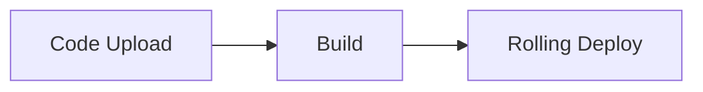

# Deployment & Operations

Managing agent deployments, secrets, logging, log drains, tracing, sandboxes, and billing.

- **Total pages in this section**: 25
- **Successful retrieves**: 25
- **API References / Placeholders**: 0

## Table of Contents

1. [deploy/](#page-1) (✓)
2. [deploy/agents/](#page-2) (✓)
3. [deploy/observability/](#page-3) (✓)
4. [deploy/admin/](#page-4) (✓)
5. [deploy/agents/quickstart/](#page-5) (✓)
6. [deploy/agents/managing-deployments/](#page-6) (✓)
7. [deploy/agents/deployments/](#page-7) (✓)
8. [deploy/agents/secrets/](#page-8) (✓)
9. [deploy/agents/logs/](#page-9) (✓)
10. [deploy/agents/log-drains/](#page-10) (✓)
11. [deploy/agents/builds/](#page-11) (✓)
12. [deploy/custom/deployments/](#page-12) (✓)
13. [deploy/observability/insights/](#page-13) (✓)
14. [deploy/observability/data/](#page-14) (✓)
15. [deploy/observability/tracing/](#page-15) (✓)
16. [deploy/observability/pii-redaction/](#page-16) (✓)
17. [deploy/admin/regions/](#page-17) (✓)
18. [deploy/admin/sandbox/](#page-18) (✓)
19. [deploy/admin/firewall/](#page-19) (✓)
20. [deploy/admin/quotas-and-limits/](#page-20) (✓)
21. [deploy/admin/billing/](#page-21) (✓)
22. [deploy/admin/analytics-api/](#page-22) (✓)
23. [deploy/admin/regions/endpoints](#page-23) (✓)
24. [deploy/admin/regions/region-pinning](#page-24) (✓)
25. [deploy/admin/regions/agent-deployment](#page-25) (✓)

---

<a name="page-1"></a>
## Page 1: deploy/
**Original URL:** https://docs.livekit.io/deploy/  
**Source MD URL:** https://docs.livekit.io/deploy.md

LiveKit docs › Manage & Deploy › Get Started › Introduction

---

# Introduction

> Deploy, manage, and monitor your LiveKit applications with a comprehensive suite of tools and flexible hosting options.

## Overview

LiveKit provides tools for deploying, managing, and monitoring your realtime apps in production. Whether you choose the fully managed LiveKit Cloud or deploy to custom environments, you have access to testing frameworks, observability tools, and deployment options that ensure your apps are reliable, scalable, and maintainable.

Deploying with LiveKit means you can focus on building your app while LiveKit handles the complexity of WebRTC infrastructure, scaling, and global distribution. You can test and validate your agents, monitor their behavior in production, and deploy to the infrastructure that best fits your needs.

## Key concepts

Understand these core concepts to deploy and manage effective LiveKit applications.

### Observability

Monitor and analyze your agent's behavior with comprehensive observability tools. Use built-in LiveKit Cloud insights to view transcripts, traces, logs, and audio recordings, or collect custom data with data hooks for integration with external systems.

- **[Observability overview](https://docs.livekit.io/deploy/observability.md)**: Learn how to monitor and analyze your agents with observability tools.

### Agent deployment

Deploy your agents to LiveKit Cloud to run them on LiveKit's global network and infrastructure. LiveKit Cloud provides automatic scaling and load balancing, ensuring capacity for new sessions up to the limits of your plan.

- **[Deploying agents overview](https://docs.livekit.io/deploy/agents.md)**: Learn how to deploy your agents to LiveKit Cloud.

## Getting started

Choose your deployment path to get started:

- **[Deploy agents to LiveKit Cloud](https://docs.livekit.io/deploy/agents.md)**: Deploy your agents to LiveKit Cloud's fully managed infrastructure.

- **[Monitor your agents](https://docs.livekit.io/deploy/observability.md)**: Set up observability to monitor and analyze your agent sessions.

## Additional resources

For complete deployment documentation, API references, and advanced topics, see the [Reference](https://docs.livekit.io/reference.md) section.

- **[Agent CLI reference](https://docs.livekit.io/reference/developer-tools/livekit-cli/agent.md)**: Complete CLI reference for deploying agents to LiveKit Cloud.

- **[Server APIs](https://docs.livekit.io/reference.md#server-apis)**: API reference for managing LiveKit servers and deployments.

- **[Events and error handling](https://docs.livekit.io/reference/agents/events.md)**: Learn about LiveKit events and how to handle errors in your deployments.

---

This document was rendered at 2026-08-28T04:22:10.233Z.
For the latest version of this document, see [https://docs.livekit.io/deploy.md](https://docs.livekit.io/deploy.md).

To explore all LiveKit documentation, see [llms.txt](https://docs.livekit.io/llms.txt).

---

<a name="page-2"></a>
## Page 2: deploy/agents/
**Original URL:** https://docs.livekit.io/deploy/agents/  
**Source MD URL:** https://docs.livekit.io/deploy/agents.md

LiveKit docs › Manage & Deploy › Agent deployment › Overview

---

# Agent deployment overview

> Overview of deploying agents, including deployment management, secrets, builds, logs, and monitoring.

## Overview

Deploy your agents to LiveKit Cloud to run them on LiveKit's global network and infrastructure. LiveKit Cloud provides automatic scaling and load balancing, ensuring capacity for new sessions up to the limits of your plan. Deploy your agent with a single LiveKit CLI command.

> ℹ️ **Note**
> 
> For deployments to other environments, see [Self-hosted deployments](https://docs.livekit.io/deploy/custom/deployments.md).

### Dashboard

The LiveKit Cloud dashboard provides a view into the status of your deployed and self-hosted agents.

- **Realtime metrics**: Monitor session count, agent status, and more.
- **Error tracking**: Identify and diagnose errors in agent sessions.
- **Usage and limits**: Track usage, billing, and limits.

- **[Agents dashboard](https://cloud.livekit.io/projects/p_/agents)**: Monitor and manage your deployed agents in the LiveKit Cloud dashboard.

## Agent deployment quickstart

New to deploying agents? Follow the quickstart guide to deploy your first agent to LiveKit Cloud.

- **[Agent deployment quickstart](https://docs.livekit.io/deploy/agents/quickstart.md)**: Quickstart guide for deploying your first agent to LiveKit Cloud.

## Deployment management

Use the LiveKit CLI to configure, deploy, and manage your agent deployments. The deployment management page covers configuration, deploying new versions, rolling back, and understanding cold starts.

- **[Deployment management](https://docs.livekit.io/deploy/agents/managing-deployments.md)**: Configure, deploy, and manage your agent deployments.

## Secrets management

Securely store and manage sensitive information like API keys, database credentials, and authentication tokens for your agent deployments. LiveKit Cloud encrypts and securely injects these values into your agent containers at runtime.

- **[Secrets management](https://docs.livekit.io/deploy/agents/secrets.md)**: Securely manage API keys and other sensitive data.

## Logs

Monitor and debug your deployed agents with runtime, build, and session logs.

- **[Logs](https://docs.livekit.io/deploy/agents/logs.md)**: View and collect logs from your deployed agents.

## Log drains

For agents deployed to LiveKit Cloud, forward runtime logs to an external monitoring service like Datadog, CloudWatch, Sentry, or New Relic for centralized search, alerting, and long-term retention. [Agent Observability](https://docs.livekit.io/deploy/observability/insights.md) stores per-session logs, but server-level events like crashes and startup failures happen outside of any session and are only accessible through a log drain.

- **[Log drains](https://docs.livekit.io/deploy/agents/log-drains.md)**: Set up log forwarding to your monitoring stack.

## Builds and Dockerfiles

Configure the build process for your agent containers, including Dockerfile setup, build context, and build timeouts. LiveKit Cloud builds container images based on your code and Dockerfile.

- **[Builds and Dockerfiles](https://docs.livekit.io/deploy/agents/builds.md)**: Guide to the LiveKit Cloud build process, plus Dockerfile templates and resources.

---

This document was rendered at 2026-08-28T04:22:10.508Z.
For the latest version of this document, see [https://docs.livekit.io/deploy/agents.md](https://docs.livekit.io/deploy/agents.md).

To explore all LiveKit documentation, see [llms.txt](https://docs.livekit.io/llms.txt).

---

<a name="page-3"></a>
## Page 3: deploy/observability/
**Original URL:** https://docs.livekit.io/deploy/observability/  
**Source MD URL:** https://docs.livekit.io/deploy/observability.md

LiveKit docs › Manage & Deploy › Agent Observability › Overview

---

# Observability overview

> An overview of observability features for LiveKit Agents.

## Overview

Monitor and analyze your agent's behavior with comprehensive observability tools. Use built-in LiveKit Cloud insights to view transcripts, traces, logs, and audio recordings, or collect custom data with data hooks for integration with external systems.

> ℹ️ **Note**
> 
> Agent observability is only available for LiveKit Cloud projects. It works for agents deployed to LiveKit Cloud and for self-hosted agents that connect to LiveKit Cloud media servers. It doesn't work with self-hosted media servers or entirely self-hosted deployments.

## Observability components

Monitor agent sessions, collect metrics, and analyze behavior with these observability tools.

| Component | Description | Use cases |
| **Insights in LiveKit Cloud** | Built-in observability stack in LiveKit Cloud with transcripts, traces, logs, and audio recordings in a unified timeline for each agent session. | Viewing session transcripts, analyzing agent behavior, and debugging issues. |
| **PII redaction** | Remove personally identifiable information from session transcripts, audio, and telemetry before it's stored in LiveKit Cloud. | Reducing exposure of sensitive data in stored session recordings. |
| **Data hooks** | Collect session recordings, transcripts, metrics, and other data within the LiveKit Agents SDK for custom logging and integration with external systems. | Custom data collection, integration with external observability tools, and exporting data to your own systems. |
| **Export traces** | Export the OpenTelemetry traces from each session to any compatible backend, such as [Langfuse](https://langfuse.com/), using the LiveKit Agents SDK. | Tracing agent behavior in third-party LLM observability tools. |
| **Log drains** (LiveKit Cloud) | Forward runtime logs (stdout/stderr) from agents deployed to LiveKit Cloud to external monitoring services like Datadog, CloudWatch, Sentry, and New Relic. | Server-level logging, crash debugging, cross-replica log aggregation, and long-term retention. |
| **Logs** | View runtime, build, and session logs for your deployed agents using the LiveKit CLI or the Cloud dashboard. | Tailing runtime logs, viewing build output, and accessing per-session logs. |

## In this section

- **[Insights in LiveKit Cloud](https://docs.livekit.io/deploy/observability/insights.md)**: View transcripts, traces, logs, and audio recordings in LiveKit Cloud.

- **[Data hooks](https://docs.livekit.io/deploy/observability/data.md)**: Collect metrics, session reports, and recordings within the Agents SDK.

- **[Export traces](https://docs.livekit.io/deploy/observability/tracing.md)**: Export session traces to any OpenTelemetry-compatible backend.

- **[PII redaction](https://docs.livekit.io/deploy/observability/pii-redaction.md)**: Redact personally identifiable information from stored agent observability data.

---

This document was rendered at 2026-08-28T04:22:10.517Z.
For the latest version of this document, see [https://docs.livekit.io/deploy/observability.md](https://docs.livekit.io/deploy/observability.md).

To explore all LiveKit documentation, see [llms.txt](https://docs.livekit.io/llms.txt).

---

<a name="page-4"></a>
## Page 4: deploy/admin/
**Original URL:** https://docs.livekit.io/deploy/admin/  
**Source MD URL:** https://docs.livekit.io/deploy/admin.md

LiveKit docs › Manage & Deploy › Administration › Overview

---

# Administration overview

> Manage your project regions, firewalls, and quotas.

## Overview

Manage your LiveKit Cloud project with administration tools for configuring access controls, monitoring usage, and managing billing.

> ⚠️ **Deprecation notice**
> 
> LiveKit Sandbox is deprecated. Use [Agent Console](https://docs.livekit.io/agents/start/console.md) to test and debug agents, and use the [development token server](https://docs.livekit.io/frontends/build/authentication/development-token-server.md) for frontend development and testing.
> 
> Existing sandboxes continue to work during the transition, but don't use Sandbox for new projects.

### Workspaces (Enterprise)

Enterprise customers use workspaces to group projects under shared billing and quotas. At project creation, workspace admins choose either default access (each workspace member joins the project with their workspace role) or custom access (the admin selects which workspace members can access the project and their roles). Only workspace admins can manage workspace-level settings.

## Administration topics

Learn more about managing your LiveKit deployment with these topics.

| Component | Description | Use cases |
| **Regions** | Configure and manage regional traffic and agent deployments for improved latency and redundancy, or to comply with local regulatory restrictions and meet data residency requirements. | Deploying agents in multiple regions, optimizing latency, managing regional deployments, and regulatory compliance. |
| **Sandbox** | Deprecated hosted apps for prototyping. Creation is disabled during the deprecation period. | Viewing and deleting existing sandbox apps. |
| **Configuring firewalls** | Configure firewall rules to control access to your LiveKit Cloud rooms and restrict connections based on IP addresses or ranges. | Securing rooms, restricting access by location, and implementing IP-based access controls. |
| **Quotas & limits** | Understand LiveKit Cloud quotas, limits, and how usage is calculated across different plans and features. | Planning capacity, understanding billing, and optimizing resource usage. |
| **Billing** | Manage your LiveKit Cloud billing, view usage, update payment methods, and understand how charges are calculated. | Managing subscriptions, viewing usage, and understanding costs. |
| **Analytics API** | Access usage, performance, and quality metrics programmatically through the Analytics API for integration with your own systems. | Building custom dashboards, monitoring usage, and integrating metrics into existing tools. |

## In this section

Manage your LiveKit Cloud project settings and configuration.

- **[Regions](https://docs.livekit.io/deploy/admin/regions.md)**: Configure and manage regional traffic and agent deployments.

- **[Sandbox](https://docs.livekit.io/deploy/admin/sandbox.md)**: View deprecation guidance for existing sandbox apps.

- **[Development token server](https://docs.livekit.io/frontends/build/authentication/development-token-server.md)**: Generate development tokens from LiveKit Cloud.

- **[Configuring firewalls](https://docs.livekit.io/deploy/admin/firewall.md)**: Configure firewall rules to control access to your rooms.

- **[Quotas & limits](https://docs.livekit.io/deploy/admin/quotas-and-limits.md)**: Understand quotas, limits, and usage calculations.

- **[Billing](https://docs.livekit.io/deploy/admin/billing.md)**: Manage your LiveKit Cloud billing and subscriptions.

- **[Analytics API](https://docs.livekit.io/deploy/admin/analytics-api.md)**: Access usage and performance metrics programmatically.

---

This document was rendered at 2026-08-28T04:22:10.518Z.
For the latest version of this document, see [https://docs.livekit.io/deploy/admin.md](https://docs.livekit.io/deploy/admin.md).

To explore all LiveKit documentation, see [llms.txt](https://docs.livekit.io/llms.txt).

---

<a name="page-5"></a>
## Page 5: deploy/agents/quickstart/
**Original URL:** https://docs.livekit.io/deploy/agents/quickstart/  
**Source MD URL:** https://docs.livekit.io/deploy/agents/quickstart.md

LiveKit docs › Manage & Deploy › Agent deployment › Quickstart

---

# Agent deployment quickstart

> Quickstart guide for deploying your first agent to LiveKit Cloud.

## Overview

Follow these steps to deploy your first agent to LiveKit Cloud.

## Prerequisites

This guide assumes that you already have:

- The latest version of the [LiveKit CLI](https://docs.livekit.io/reference/developer-tools/livekit-cli.md)
- A [LiveKit Cloud](https://cloud.livekit.io) project
- A working agent. Create one using the [Voice AI quickstart](https://docs.livekit.io/agents/start/voice-ai.md) or one of the following starter templates:

- **[Python starter template](https://github.com/livekit-examples/agent-starter-python)**: A ready-to-deploy voice AI agent built with Python.

- **[Node.js starter template](https://github.com/livekit-examples/agent-starter-node)**: A ready-to-deploy voice AI agent built with Node.js.

## Deploy your agent

Use the following steps with the LiveKit CLI to deploy your agent.

1. Navigate to your project directory:

```shell
cd your-agent-project

```
2. Authenticate with LiveKit Cloud:

```shell
lk cloud auth

```

This opens a browser window to link your LiveKit Cloud project to the CLI. If you've already authenticated and have linked projects, use `lk project list` to list all linked projects. Then, set the default project for agent deployment with `lk project set-default "<project-name>"`.
3. Deploy your agent:

```shell
lk agent create

```

This registers your agent with LiveKit Cloud and assigns a unique ID. The ID is written to a new [`livekit.toml`](https://docs.livekit.io/deploy/agents/managing-deployments.md#toml) file along with the associated project and other default configuration. If you don't already have a `Dockerfile`, the CLI creates one for you.

Next, the CLI uploads your agent code to the LiveKit Cloud build service, builds an image from your Dockerfile, and then deploys it to your LiveKit Cloud project. See the [Builds and Dockerfiles](https://docs.livekit.io/deploy/agents/builds.md) guide for details on the build process, logs, and templates.

Deployment preserves the agent's [dispatch name](https://docs.livekit.io/agents/server/agent-dispatch.md#dispatch-name) from the source code, so the AGENT-NAME you set during `lk agent init` is what you use to target the agent for explicit dispatch.

Your agent is now deployed to LiveKit Cloud and is ready to handle requests. To inspect its behavior in detail, start a debugging session in the [Agent Console](https://docs.livekit.io/agents/start/console.md). To start building an interface for your users, explore [custom frontends](https://docs.livekit.io/agents/start/frontend.md) or [telephony integration](https://docs.livekit.io/agents/start/telephony.md).

## Monitor status and logs

Use the CLI to monitor the [status](https://docs.livekit.io/reference/developer-tools/livekit-cli/agent.md#status) and [logs](https://docs.livekit.io/reference/developer-tools/livekit-cli/agent.md#logs) of your agent.

1. Monitor agent status:

```shell
lk agent status

```

This shows status, replica count, and other details for your running agent.
2. Tail agent logs:

```shell
lk agent logs

```

This shows a live tail of the logs for the new instance of your deployed agent.

## Next steps

Now that your agent is deployed, learn about:

- [Deploying new versions](https://docs.livekit.io/deploy/agents/managing-deployments.md#deploy) of your agent
- [Managing secrets](https://docs.livekit.io/deploy/agents/secrets.md) for your deployment
- [Monitoring logs](https://docs.livekit.io/deploy/agents/logs.md) and debugging issues
- [Configuring builds](https://docs.livekit.io/deploy/agents/builds.md) and Dockerfiles

---

This document was rendered at 2026-08-28T04:22:12.186Z.
For the latest version of this document, see [https://docs.livekit.io/deploy/agents/quickstart.md](https://docs.livekit.io/deploy/agents/quickstart.md).

To explore all LiveKit documentation, see [llms.txt](https://docs.livekit.io/llms.txt).

---

<a name="page-6"></a>
## Page 6: deploy/agents/managing-deployments/
**Original URL:** https://docs.livekit.io/deploy/agents/managing-deployments/  
**Source MD URL:** https://docs.livekit.io/deploy/agents/managing-deployments.md

LiveKit docs › Manage & Deploy › Agent deployment › Deployment management

---

# Deployment management

> Configure, deploy, and manage your agent deployments using the LiveKit CLI.

## Overview

Use the LiveKit CLI to configure, deploy, and manage your agent deployments. This guide covers deployment configuration, deploying new versions, rolling back, and understanding cold starts.

## Configuration

The `livekit.toml` file contains your agent's deployment configuration. The CLI automatically looks for this file in the current directory, and uses it when any `lk agent` commands are run in that directory.

** Filename: `livekit.toml`**

```toml
[project]
  subdomain = "<my-project-subdomain>"

[agent]
  id = "<agent-id>"

```

To generate a new `livekit.toml` file, run:

```shell
lk agent config

```

## Deploying new versions

To deploy a new version of your agent, run the following command:

```shell
lk agent deploy

```

LiveKit Cloud builds a container image that includes your agent code. The new version is pushed to production using a rolling deployment strategy. The rolling deployment allows new instances to serve new sessions, while existing instances are given up to 1 hour to complete active sessions. This ensures your new version is deployed without user interruptions or service downtime.



When you run `lk agent deploy`, LiveKit Cloud follows this process:

1. **Build**: The CLI uploads your code and builds a container image from your Dockerfile. See [Builds and Dockerfiles](https://docs.livekit.io/deploy/agents/builds.md) for more information.
2. **Deploy**: New agent instances with your updated code are deployed alongside existing instances.
3. **Route new sessions**: New agent requests are routed to new instances once they're considered [healthy](#health-checks).
4. **Graceful shutdown**: Old instances stop accepting new sessions, while remaining active for up to 1 hour to complete any active sessions.
5. **Autoscale**: New instances are automatically scaled up and down to meet demand.

### Health checks

LiveKit Cloud only removes old agent instances after the new agent's [health check endpoint](https://docs.livekit.io/agents/server/options.md#health-check) starts passing. This ensures that if the new agent doesn't start correctly or starts slowly, the old agent instances can still serve new traffic.

LiveKit Cloud allows 5 minutes for the health check to start passing for a new agent instance. If you're not seeing requests routed to the new agent version, make sure the `prewarm` function doesn't take longer than 5 minutes to complete.

## Deploy with GitHub Actions

To deploy from CI instead of running `lk agent deploy` by hand, use the [`livekit/deploy-action`](https://github.com/livekit/deploy-action) GitHub Action. Use it to deploy your agent whenever code is pushed to your main branch.

1. Add the following secrets to your GitHub repository (navigate to **Settings** → **Secrets and variables** → **Actions**):

| Secret | Description |
| `LIVEKIT_URL` | Your LiveKit Cloud URL, for example `wss://your-project.livekit.cloud`. |
| `LIVEKIT_API_KEY` | Your LiveKit Cloud API key. |
| `LIVEKIT_API_SECRET` | Your LiveKit Cloud API secret. |
| `SECRET_LIST` | Comma-separated agent secrets, for example `OPENAI_API_KEY=sk-xxx,AUTH_TOKEN=abc123`. |

1. Add a workflow file at `.github/workflows/deploy.yml` that deploys on push.

The follow example deploys your agent whenever code is pushed to your main branch in the `voice-agent` directory:

```yaml
name: Deploy agent
on:
  push:
    branches:
      - main
    paths:
      - 'voice-agent/**'

jobs:
  deploy:
    runs-on: ubuntu-latest
    concurrency:
      group: deploy-${{ github.ref_name }}
      cancel-in-progress: true

    steps:
      - uses: actions/checkout@v4

      - name: Deploy LiveKit Cloud agent
        uses: livekit/deploy-action@v2
        env:
          LIVEKIT_URL: ${{ secrets.LIVEKIT_URL }}
          LIVEKIT_API_KEY: ${{ secrets.LIVEKIT_API_KEY }}
          LIVEKIT_API_SECRET: ${{ secrets.LIVEKIT_API_SECRET }}
          SECRET_LIST: ${{ secrets.SECRET_LIST }}
        with:
          OPERATION: deploy
          WORKING_DIRECTORY: voice-agent

```

To require manual approval before a deploy, run the job under a [GitHub environment](https://docs.github.com/en/actions/deployment/targeting-different-environments/using-environments-for-deployment) with required reviewers.

#### Action inputs

The GitHub action accepts the following inputs, set under the `with` key:

| Input | Description | Required | Default |
| `OPERATION` | Operation to perform: `create`, `deploy`, `status`, `status-retry`. | Yes | `status` |
| `WORKING_DIRECTORY` | Directory containing the agent configuration. | No | `.` |
| `REGION` | Region to deploy to. Defaults to the nearest region. | No | `""` |
| `SLACK_TOKEN` | Slack bot token for deploy notifications. | No | `""` |
| `SLACK_CHANNEL` | Slack channel for notifications, for example `#general`. | No | `""` |
| `TIMEOUT` | Timeout for the `status-retry` operation. | No | `5m` |

## Rolling back

You can quickly rollback to a previous version of your agent, without a rebuild, by using the following command:

```shell
lk agent rollback

```

Rollback operates in the same rolling manner as a normal deployment.

> ℹ️ **Paid plan required**
> 
> Instant rollback is available only on paid LiveKit Cloud plans. Users on free plans should revert their code to an earlier version and then redeploy.

## Cold start

On the **Build (free) plan**, production agents can be scaled down to zero replicas after all active sessions end. When a new user connects, the instance does a "cold start" to serve them, which adds 10 to 20 seconds before the agent joins the room. On paid plans (Ship and Scale), production agents stay warm. For more info, see the [Quotas and limits](https://docs.livekit.io/deploy/admin/quotas-and-limits.md#agent-cold-starts) guide.

[Non-production deployments](https://docs.livekit.io/deploy/agents/deployments.md) always scale to zero when idle, on every plan, and cold-start on the next request.

---

This document was rendered at 2026-08-28T04:22:27.207Z.
For the latest version of this document, see [https://docs.livekit.io/deploy/agents/managing-deployments.md](https://docs.livekit.io/deploy/agents/managing-deployments.md).

To explore all LiveKit documentation, see [llms.txt](https://docs.livekit.io/llms.txt).

---

<a name="page-7"></a>
## Page 7: deploy/agents/deployments/
**Original URL:** https://docs.livekit.io/deploy/agents/deployments/  
**Source MD URL:** https://docs.livekit.io/deploy/agents/deployments.md

LiveKit docs › Manage & Deploy › Agent deployment › Non-production deployments

---

# Non-production deployments

> Run additional non-production copies of an agent alongside production using the LiveKit CLI.

Available in (BETA):
- [ ] Node.js
- [ ] Python

## Overview

A deployment is an additional named copy of an existing agent. Each deployment runs the same agent image as production under a different name. Use deployments to stage changes, test against real infrastructure, or share preview builds without affecting the version your users connect to.

> ❗ **Non-production deployments are in beta**
> 
> Non-production deployments are a beta feature, available on the [Ship plan or higher](#quotas). The CLI surface, quotas, and behavior described here might change.

> ℹ️ **Deployments vs. deployment management**
> 
> This page is about non-production deployments. To learn how to configure, deploy, and roll back agents in general, see [Deployment management](https://docs.livekit.io/deploy/agents/managing-deployments.md).

Every agent has a reserved deployment named `production`, which is created automatically. You can't create or delete a deployment named `production`, and it's the default target when you omit the `--deployment` flag. Non-production deployments are additional copies that you create, test, and delete as needed.

### Deployment names

A deployment name must satisfy the following requirements.

- Start and end with an alphanumeric character.
- Contain only alphanumeric characters, `-`, `_`, and `.`.
- Be a maximum of 63 characters long.

If you omit the deployment name, commands target `production`. Invalid names are rejected with an error rather than being dispatched to production.

> ℹ️ **Version requirements**
> 
> Deployments require the `livekit-agents` Python SDK 1.6 or later and an up-to-date [LiveKit CLI](https://docs.livekit.io/reference/developer-tools/livekit-cli.md#updates). Earlier versions don't register the agent worker under its deployment, so dispatches that target a non-production deployment won't reach the agent.

## When to use a deployment

Use a deployment when you want a copy of your agent with the following characteristics:

- The same image as production.
- Isolated from production traffic.
- Can be created and torn down without a production redeploy.
- Sleeps when idle and only costs compute while awake.

Common cases are a `staging` deployment that mirrors production for pre-release testing, or a short-lived `dev` deployment for a single change.

> ❗ **Requires Ship plan or higher**
> 
> Non-production deployments are only available on the **Ship** plan or higher. To upgrade, see the [pricing](https://livekit.com/pricing) page for details. For per-plan deployment limits, see [Quotas](#quotas).

## Lifecycle

Non-production deployments behave differently from the `production` deployment:

| Behavior | Production | Non-production deployment |
| Startup | Stays warm on paid plans | Always cold-booted |
| Idle | Stays running on paid plans | Sleeps |
| Incoming session while asleep | N/A | Wakes on demand |
| Redeploy | Drains in-flight sessions | Immediately disconnects active sessions |
| Rollback | Drains in-flight sessions | Not supported |

When a non-production deployment is idle, it scales to zero and sleeps. The next request for that deployment wakes it, which adds a short cold-start delay before the first session connects. On paid plans (Ship and Scale), `production` stays warm and doesn't scale to zero; on the Build (free) plan, `production` also scales to zero when idle. See [Cold start](https://docs.livekit.io/deploy/agents/managing-deployments.md#cold-start) for details.

> ⚠️ **No drain period for non-production redeploys**
> 
> There is no drain period when restarting or redeploying a non-production deployment. These actions immediately disconnect active sessions. Rollback isn't supported for non-production deployments — only `production` can be rolled back, and production redeploys and rollbacks drain normally, giving active sessions up to 1 hour to complete. Use non-production deployments only for traffic that can tolerate interruptions.

### Billing

Compute is billed only while a deployment is awake. Sleeping deployments don't incur any costs. Deployment compute is included in the parent agent's compute usage.

## Quotas

Each plan allows a fixed number of non-production deployments per agent. The `production` deployment doesn't count against this quota.

| Plan | Non-production deployments per agent |
| Build (free) | 0 |
| Ship | 2 |
| Scale | 5 |
| Enterprise | 5 (customizable) |

A deployment counts against the quota whether it's awake or sleeping. To free a deployment, delete it with [`lk agent delete --deployment <name>`](https://docs.livekit.io/reference/developer-tools/livekit-cli/agent.md#delete).

## Branch on deployment name at runtime

LiveKit Cloud sets the `LIVEKIT_AGENT_DEPLOYMENT` environment variable on every agent's containers, regardless of which deployment it runs in. A non-production deployment sets it to the deployment name (for example, `staging`); the `production` deployment sets it to an empty string. You can read this variable at runtime to branch on the current deployment. For example, you can use it to select a deployment-specific secret.

Secrets are shared so each deployment of an agent has access to the same set of secret keys. To vary behavior or credentials per deployment, read the `LIVEKIT_AGENT_DEPLOYMENT` environment variable at runtime and branch based on its value.

A common pattern is to prefix secret keys by deployment (for example, `STAGING_OPENAI_API_KEY`, `DEV_OPENAI_API_KEY`) and selecting the appropriate key in code.

**Python**:

```python
import os

from livekit.agents import JobContext


def resolve_openai_key() -> str:
    # Empty string means production.
    deployment = os.environ.get("LIVEKIT_AGENT_DEPLOYMENT", "")

    if deployment == "staging":
        return os.environ["STAGING_OPENAI_API_KEY"]
    if deployment == "dev":
        return os.environ["DEV_OPENAI_API_KEY"]
    return os.environ["OPENAI_API_KEY"]


async def entrypoint(ctx: JobContext):
    openai_key = resolve_openai_key()
    # ... configure your agent with openai_key

```

---

**Node.js**:

```typescript
function resolveOpenAIKey(): string {
  // Empty string means production.
  const deployment = process.env.LIVEKIT_AGENT_DEPLOYMENT ?? '';

  if (deployment === 'staging') {
    return process.env.STAGING_OPENAI_API_KEY!;
  }
  if (deployment === 'dev') {
    return process.env.DEV_OPENAI_API_KEY!;
  }
  return process.env.OPENAI_API_KEY!;
}

const openaiKey = resolveOpenAIKey();
// ... configure your agent with openaiKey

```

> ℹ️ **Per-deployment secrets planned for future release**
> 
> Isolated, per-deployment secrets are planned for a future release. Until then, use the [shared secret prefix convention](#env-var) described in this section.

## Walkthrough

This walkthrough creates an agent, deploys a `staging` copy, promotes it to production, then tears it down. It assumes you already have a [working agent](https://docs.livekit.io/agents/start/voice-ai.md) and are familiar with the [LiveKit CLI](https://docs.livekit.io/reference/developer-tools/livekit-cli.md).

1. Create the agent from your agent project directory. This also creates the reserved `production` deployment:

```shell
lk agent create .

```
2. Deploy a `staging` copy from the same working directory. This builds and pushes the image under the `staging` deployment:

```shell
lk agent deploy --deployment staging

```
3. Exercise the deployment by dispatching to it (see [Dispatch to a deployment](#dispatch-to-a-deployment)). The first request wakes the deployment from sleep.
4. When the change looks good, promote the `staging` image to production with no rebuild:

```shell
lk agent promote --deployment staging

```
5. Delete the `staging` deployment to make room for another deployment. Omitting `--deployment` would delete the whole agent, so always pass the name:

```shell
lk agent delete --deployment staging

```

> 🔥 **Deleting the whole agent**
> 
> `lk agent delete` without `--deployment` deletes the **entire agent**, including production. To remove only a non-production deployment, always pass `--deployment <name>`.

## Dispatch to a deployment

Deployment is an optional field anywhere you specify an agent. Omit it to target `production`. For the full dispatch reference, see [Agent dispatch](https://docs.livekit.io/agents/server/agent-dispatch.md#deployments).

For example, dispatch to a deployment from a token:

```shell
lk token create --join --open meet --agent steve-agent --deployment staging

```

The agent worker itself needs no code change to register under a deployment — the LiveKit CLI sets `LIVEKIT_AGENT_DEPLOYMENT` on the deployment's containers automatically.

## Observability

In V1, **only the `production` deployment emits metrics** to [Agent Observability](https://docs.livekit.io/deploy/observability/insights.md). Per-deployment metrics are planned. To debug a non-production deployment, use [logs](https://docs.livekit.io/deploy/agents/logs.md):

```shell
lk agent logs --deployment staging --log-type deploy

```

> ℹ️ **Managing deployments in the dashboard**
> 
> Deployments are created and managed through the LiveKit CLI. In the dashboard, you can select a deployment when dispatching through the [Agent Console](https://docs.livekit.io/agents/start/console.md) and [SIP dispatch rules](https://docs.livekit.io/telephony/accepting-calls/dispatch-rule.md).

## Continuous integration

The [`livekit/deploy-action`](https://github.com/livekit/deploy-action) GitHub Action deploys to the `production` deployment. It doesn't accept a deployment name, so to deploy a non-production deployment from CI, run the [LiveKit CLI](https://docs.livekit.io/reference/developer-tools/livekit-cli/agent.md#deploy) directly with `--deployment`:

```yaml
name: Deploy staging
on:
  pull_request:

jobs:
  deploy:
    runs-on: ubuntu-latest
    env:
      LIVEKIT_API_KEY: ${{ secrets.LIVEKIT_API_KEY }}
      LIVEKIT_API_SECRET: ${{ secrets.LIVEKIT_API_SECRET }}
    steps:
      - uses: actions/checkout@v4
      - run: curl -sSL https://get.livekit.io/cli | bash
      - run: lk agent deploy --deployment staging

```

## FAQ

Frequently asked questions about deployments and agents.

### Does this affect the production agent?

No. Production keeps its own lifecycle, resources, and traffic. Creating, deploying, or deleting a non-production deployment never changes production.

### Are secrets isolated between deployments?

No. All deployments of an agent share the same secrets. Use the `LIVEKIT_AGENT_DEPLOYMENT` environment variable to branch on the deployment name and use a prefix convention (for example `STAGING_OPENAI_API_KEY`) to vary credentials per deployment. Per-deployment secrets are planned for a future release.

### What happens when a deployment is idle?

It sleeps (that is, scales to zero) and incurs no billing costs while sleeping. The next request wakes it on demand, resulting in a short cold-start delay before the first session connects.

### Does redeploy drain in-flight sessions on a non-production deployment?

No. There is no drain period for non-production deployments, so restart and redeploy immediately disconnect active sessions. Rollback isn't supported for non-production deployments. The `production` deployment drains on redeploy and rollback as expected.

### Can free-tier customers use deployments?

No. Deployments are available on the **Ship** plan or higher. The Build plan allows zero non-production deployments. To upgrade, see the [pricing](https://livekit.com/pricing) page for details.

### Are there per-deployment secrets?

Per-deployment secrets are planned for a future release. In the meantime, you can use the [shared-secret prefix](#env-var) convention to use different secrets for different deployments.

### Where can I get help?

Ask questions and share what you're building in the [LiveKit community forum](https://community.livekit.io). Direct email support from the LiveKit team is available to projects on the **Ship** plan or higher. To compare plans and the support each one includes, see the [pricing](https://livekit.com/pricing) page.

---

This document was rendered at 2026-08-28T04:22:12.205Z.
For the latest version of this document, see [https://docs.livekit.io/deploy/agents/deployments.md](https://docs.livekit.io/deploy/agents/deployments.md).

To explore all LiveKit documentation, see [llms.txt](https://docs.livekit.io/llms.txt).

---

<a name="page-8"></a>
## Page 8: deploy/agents/secrets/
**Original URL:** https://docs.livekit.io/deploy/agents/secrets/  
**Source MD URL:** https://docs.livekit.io/deploy/agents/secrets.md

LiveKit docs › Manage & Deploy › Agent deployment › Secrets management

---

# Secrets management

> Manage secrets for your LiveKit Cloud agent deployments.

## Overview

Secrets are secure variables and files that can store sensitive information like API keys, database credentials, and authentication tokens. LiveKit Cloud encrypts, stores, and securely injects these values into your agent containers at runtime. Most secrets are injected as environment variables, but you can also [mount files as secrets](#file-mounted-secrets) if needed.

> ℹ️ **Keep secrets out of version control**
> 
> Use a `.env.local` file to store secrets for your local development environment, and a tool such as [python-dotenv](https://github.com/theskumar/python-dotenv) to load them as environment variables.
> 
> Add `.env` and `.env.*` files to your `.gitignore`, and ensure that all sensitive values are loaded from environment variables rather than included in source code.
> 
> The starter projects for [Python](https://github.com/livekit-examples/agent-starter-python) and [Node.js](https://github.com/livekit-examples/agent-starter-node) both implement these best practices by default.

## Managing secrets

Initial secrets are set when the [`create`](https://docs.livekit.io/reference/developer-tools/livekit-cli/agent.md#create) command is run. You can update secrets at any time with [`update-secrets`](https://docs.livekit.io/reference/developer-tools/livekit-cli/agent.md#update-secrets).  Updating secrets triggers a rolling restart of the agent, to ensure new sessions start with the updated secrets.

### Secrets file

If you don't pass any arguments, the LiveKit CLI looks for an environment, and prompts you to load the secrets from that file to your agent.

The CLI looks for the following environment files:

- `.env`
- `.env.local`
- `.env.production`

You can explicitly specify a secrets file with the `--secrets-file` option. The file must contain one secret per line, in `KEY=value` format.

```shell
lk agent create --secrets-file=path/to/secrets.env

```

The CLI copies all values from the file, [except for LiveKit Cloud credentials](#livekit-credentials).

### Using the secrets flag

You can provide each secret individually with the CLI using the `--secrets` flag. Pass the secret in `KEY=value` format. To pass multiple secrets, use multiple `--secrets` flags.

```shell
lk agent update-secrets --secrets "SECRET_A=foo" --secrets "SECRET_B=bar"

```

### Overwriting all secrets

By default, the CLI adds or updates the provided secrets, while leaving other existing secrets as-is. To delete all existing secrets and replace them with the provided secrets, use the `--overwrite` flag.

```shell
lk agent update-secrets --secrets-file=new-secrets.env --overwrite

```

### Listing secrets

To list all secrets for an agent, use `lk agent secrets`. You can see the names, creation date, and last updated date for each secret. The secret values, however, aren't displayed and can't be retrieved from the CLI.

## Limitations

The following limitations apply to all secrets.

### Secret names

Secret names have the following restrictions:

- Must contain only letters, numbers, and underscores.
- Must not exceed 70 characters in length.
- Are case sensitive.

LiveKit recommends that you use only uppercase letters and underscores for secret names, but this is not required.

### Secret values

Secret values have a maximum size of 16KB. They are stored in encrypted form, and can't be retrieved from the CLI or dashboard. The values are provided at runtime to your agent as plain environment variables.

### LiveKit secrets

LiveKit Cloud provides the following environment variables automatically, to ensure your agent connects to its associated LiveKit Cloud project:

- `LIVEKIT_URL` - Your LiveKit Cloud server URL
- `LIVEKIT_API_KEY` - An API key for your project
- `LIVEKIT_API_SECRET` - An API secret for your project

These values are auto-generated by LiveKit Cloud and can't be set or modified as secrets.

## File-mounted secrets

In certain cases, you might need to load an entire file as a secret, and make it available in your agent's environment as a local file. For example, providers such as Google use JSON files for authentication credentials.

Use `--secret-mount ./path/to/filename` to mount a local file as a secret when creating or updating secrets. The file is mounted in the agent container at `/etc/secrets/<filename>`, preserving its original filename.

For example, the following command adds a secret file at `/etc/secrets/google-application-credentials.json` in the agent container:

```shell
lk agent update-secrets --secret-mount ./google-application-credentials.json

```

## Additional resources

The following guides cover additional topics for managing secrets in LiveKit Cloud.

- **[Agent CLI reference](https://docs.livekit.io/reference/developer-tools/livekit-cli/agent.md)**: Reference for the agent deployment commands in the LiveKit CLI.

---

This document was rendered at 2026-08-28T04:22:12.228Z.
For the latest version of this document, see [https://docs.livekit.io/deploy/agents/secrets.md](https://docs.livekit.io/deploy/agents/secrets.md).

To explore all LiveKit documentation, see [llms.txt](https://docs.livekit.io/llms.txt).

---

<a name="page-9"></a>
## Page 9: deploy/agents/logs/
**Original URL:** https://docs.livekit.io/deploy/agents/logs/  
**Source MD URL:** https://docs.livekit.io/deploy/agents/logs.md

LiveKit docs › Manage & Deploy › Agent deployment › Logs

---

# Log collection

> Monitor and debug your deployed agents with comprehensive logging.

## Overview

LiveKit Cloud provides realtime logging for your deployed agents, helping you monitor performance, debug issues, and understand your agent's behavior in production. Logs are collected from all phases of your agent's lifecycle — from build to runtime — and can be forwarded to external monitoring services such as [Datadog](https://www.datadoghq.com/), [CloudWatch](https://aws.amazon.com/cloudwatch/), [Sentry](https://sentry.io/), and [New Relic](https://newrelic.com/). You can also view some logs with the LiveKit CLI.

## Log types

LiveKit Cloud collects two types of logs for your agents:

- **Runtime logs**: Your agent's app logs, including stdout, stderr, and any other logging you implement.
- **Build logs**: Output from the container build process, including Dockerfile execution and dependency installation.

## Follow runtime logs

Use the LiveKit CLI to follow logs from your deployed agents in realtime.

```shell
lk agent logs

```

This command continuously streams logs from the latest running instance of your agent. It also includes a short snapshot of recent logs.

> ℹ️ **Single instance**
> 
> The LiveKit CLI only shows logs from the newest agent server instance of your agent, which can include multiple jobs. All logs from this agent server are included, but it is not a comprehensive view of all logs from all instances for agents running at scale. To collect logs from all instances, use an external logging service by using the [Forward runtime logs](#forward-runtime-logs) feature.

## View build logs

Use the LiveKit CLI to view the Docker build logs from the currently deployed version of your agent.

```shell
lk agent logs --log-type=build

```

This command prints the logs to stdout, but does not perform a live tail.

Build logs from more versions of your agent are available in the [LiveKit Cloud dashboard](https://cloud.livekit.io/projects/p_/agents).

## View runtime logs

Runtime logs are available as part of the [Agent observability](https://docs.livekit.io/deploy/observability/insights.md) feature in the LiveKit Cloud dashboard.

## Forward runtime logs

Forward your agent logs to external monitoring services for long-term storage, advanced analytics, and integration with your existing observability stack.

The currently supported destinations are Datadog, CloudWatch, Sentry, and New Relic.

### Datadog integration

Add a [Datadog](https://docs.livekit.io/deploy/agents/secrets.md) client token as a [secret](https://docs.livekit.io/deploy/agents/secrets.md) to automatically enable log forwarding. If your account is in a region other than `us1`, you can also set the region. All runtime logs are automatically forwarded to your Datadog account.

```shell
lk agent update-secrets --secrets "DATADOG_TOKEN=your-client-token"

```

- **`DATADOG_TOKEN`** _(string)_: Your Datadog [client token](https://docs.datadoghq.com/account_management/api-app-keys/#client-tokens).

- **`DATADOG_REGION`** _(string)_ (optional) - Default: `us1`: Your Datadog region. Supported regions are `us1`, `us3`, `us5`, `us1-fed`, `eu`, and `ap1`.

#### Log fields

The following log fields are set in Datadog for all log lines sent from LiveKit Cloud:

| Field | Value | Description |
| host | <agent-server-id> | A unique identifier for the specific agent server instance emitting the log. |
| source | <agent-id> | The ID of the agent, as in `livekit.toml` and the dashboard. |
| service | `"cloud.livekit.io"` |  |
| stream | `stdout` or `stderr` | Indicates whether the log originated from stdout or stderr. |

### CloudWatch integration

Add a [CloudWatch](https://docs.livekit.io/deploy/agents/secrets.md) `AWS_ACCESS_KEY_ID` and `AWS_SECRET_ACCESS_KEY` as [secrets](https://docs.livekit.io/deploy/agents/secrets.md) to automatically enable log forwarding. The AWS region defaults to `us-west-2`, you can set it by setting the `AWS_REGION` secret. All runtime logs are automatically forwarded to your CloudWatch account.

```shell
lk agent update-secrets --secrets "AWS_ACCESS_KEY_ID=your-access-key-id" --secrets "AWS_SECRET_ACCESS_KEY=your-secret-access-key"

```

- **`AWS_ACCESS_KEY_ID`** _(string)_: Your AWS [access key ID](https://docs.aws.amazon.com/general/latest/gr/aws-sec-cred-types.html).

- **`AWS_SECRET_ACCESS_KEY`** _(string)_: Your AWS [secret access key](https://docs.aws.amazon.com/general/latest/gr/aws-sec-cred-types.html).

- **`AWS_REGION`** _(string)_ (optional) - Default: `us-west-2`: Your AWS region. See the [AWS regions](https://docs.aws.amazon.com/global-infrastructure/latest/regions/aws-regions.html) page for a list of all supported regions.

### Sentry integration

Add a [Sentry](https://docs.livekit.io/deploy/agents/secrets.md) `SENTRY_DSN` as a [secret](https://docs.livekit.io/deploy/agents/secrets.md) to automatically enable log forwarding. All runtime logs are automatically forwarded to your Sentry account.

```shell
lk agent update-secrets --secrets "SENTRY_DSN=your-sentry-dsn"

```

- **`SENTRY_DSN`** _(string)_: Your Sentry [DSN](https://docs.sentry.io/product/sentry-basics/dsn-explainer/).

### New Relic integration

Add a [New Relic](https://docs.livekit.io/deploy/agents/secrets.md) `NEW_RELIC_LICENSE_KEY` as a [secret](https://docs.livekit.io/deploy/agents/secrets.md) to automatically enable log forwarding. All runtime logs are automatically forwarded to your New Relic account.

```shell
lk agent update-secrets --secrets "NEW_RELIC_LICENSE_KEY=your-license-key"

```

- **`NEW_RELIC_LICENSE_KEY`** _(string)_: Your New Relic [license key](https://docs.newrelic.com/docs/apis/intro-apis/new-relic-api-keys/).

## Log levels

Your agent server configuration determines the log levels that are collected and forwarded. The default log level is `info`. To use a different value, set the log level in your Dockerfile:

```dockerfile
CMD ["python", "agent.py", "start", "--log-level=debug"]

```

You can also set the log level with the `LIVEKIT_LOG_LEVEL` environment variable, which is useful when you want to adjust verbosity without rebuilding your image. Set it as a [secret](https://docs.livekit.io/deploy/agents/secrets.md):

```shell
lk agent update-secrets --secrets "LIVEKIT_LOG_LEVEL=debug"

```

For more information on log levels, see the [agent server options](https://docs.livekit.io/agents/server/options.md#log-levels) page.

## Log retention

Agent build logs are stored indefinitely for the most recently deployed version. To learn about runtime log retention, see the [Agent Observability](https://docs.livekit.io/deploy/observability/insights/#retention-window) page.

## Additional resources

The following resources may be helpful to design a logging strategy for your agent:

- **[Agent observability](https://docs.livekit.io/deploy/observability.md)**: Guide to monitoring your agent's behavior in production.

- **[Agent server options](https://docs.livekit.io/agents/server/options.md)**: Learn how to configure your agent server.

- **[Secrets management](https://docs.livekit.io/deploy/agents/secrets.md)**: Learn how to securely manage API keys for log forwarding.

- **[Agent CLI reference](https://docs.livekit.io/reference/developer-tools/livekit-cli/agent.md)**: Reference for the agent deployment commands in the LiveKit CLI.

---

This document was rendered at 2026-08-28T04:22:12.236Z.
For the latest version of this document, see [https://docs.livekit.io/deploy/agents/logs.md](https://docs.livekit.io/deploy/agents/logs.md).

To explore all LiveKit documentation, see [llms.txt](https://docs.livekit.io/llms.txt).

---

<a name="page-10"></a>
## Page 10: deploy/agents/log-drains/
**Original URL:** https://docs.livekit.io/deploy/agents/log-drains/  
**Source MD URL:** https://docs.livekit.io/deploy/agents/log-drains.md

LiveKit docs › Manage & Deploy › Agent deployment › Log drains

---

# Log drains

> Forward runtime logs from agents deployed to LiveKit Cloud to external monitoring services like Datadog, CloudWatch, Sentry, New Relic, Splunk, Google Cloud, and syslog-compatible endpoints.

## Overview

Log drains let you forward runtime logs to your existing monitoring stack. Use a log drain to collect all of your agent's runtime logs — including server-level events like crashes, startup errors, and dispatch failures. This gives you centralized search, alerting, long-term retention, and visibility across all replicas. Log drains are available for agents deployed to LiveKit Cloud.

Log drains forward **runtime logs only** — the raw stdout and stderr output from your agent process. They don't include traces, build logs, transcripts, or audio recordings. For those, use the following:

- **Traces**: Export directly from your agent code. See [Export traces](https://docs.livekit.io/deploy/observability/tracing.md).
- **Transcripts, audio, and session data**: Available through [Agent Observability](https://docs.livekit.io/deploy/observability/insights.md) in the LiveKit Cloud dashboard.
- **Build logs**: Available in the [LiveKit CLI](https://docs.livekit.io/deploy/agents/logs.md#build-logs) and the Cloud dashboard.

Log forwarding runs in a sidecar process alongside your agent — it's invisible to your agent code. The `lk agent logs` CLI command only tails logs from a single agent server instance. If your agent runs at scale across multiple replicas, a log drain is the only way to see logs from all instances.

## Supported destinations

Runtime logs can be forwarded to the following external monitoring services. The table lists the required configuration for each destination:

| Destination | Required secrets | Optional secrets |
| [Datadog](#datadog) | `DATADOG_TOKEN` | `DATADOG_REGION` (default: `us1`) |
| [CloudWatch](#cloudwatch) | `AWS_ACCESS_KEY_ID`, `AWS_SECRET_ACCESS_KEY` | `AWS_REGION` (default: `us-west-2`) |
| [Sentry](#sentry) | `SENTRY_DSN` |  |
| [New Relic](#new-relic) | `NEW_RELIC_LICENSE_KEY` |  |
| [Splunk](#splunk) | `LOGS_ENABLE_SPLUNK`, `SPLUNK_HEC_TOKEN`, `SPLUNK_HEC_URL` | `SPLUNK_INDEX`, `SPLUNK_SOURCETYPE`, `SPLUNK_SOURCE` |
| [Google Cloud](#google-cloud) | `LOGS_ENABLE_GCP`, `GOOGLE_CLOUD_PROJECT`, `GOOGLE_APPLICATION_CREDENTIALS` |  |
| [Syslog](#syslog) | `SYSLOG_ENDPOINT` | `SYSLOG_TOKEN` |

## Datadog integration

Automatically forward all runtime logs to your Datadog account. Add a Datadog client token as a [secret](https://docs.livekit.io/deploy/agents/secrets.md) to enable log forwarding. If your account is in a region other than `us1`, you can also set the region.

Use the following command to set your Datadog secret:

```shell
lk agent update-secrets --secrets "DATADOG_TOKEN=your-client-token" --secrets "DATADOG_REGION=us1"

```

- **`DATADOG_TOKEN`** _(string)_: Your Datadog [client token](https://docs.datadoghq.com/account_management/api-app-keys/#client-tokens).

- **`DATADOG_REGION`** _(string)_ (optional) - Default: `us1`: Your Datadog region. Supported regions are `us1`, `us3`, `us5`, `us1-fed`, `eu`, and `ap1`.

#### Log fields

The following log fields are set in Datadog for all log lines sent from LiveKit Cloud:

| Field | Value | Description |
| host | <worker-id> | A unique identifier for the specific agent server instance emitting the log. |
| source | <agent-id> | The ID of the agent, as in `livekit.toml` and the dashboard. |
| service | `"cloud.livekit.io"` |  |
| stream | `stdout` or `stderr` | Indicates whether the log originated from stdout or stderr. |

#### Troubleshooting Datadog

If logs aren't appearing in Datadog, confirm `DATADOG_REGION` matches your Datadog account's region (defaults to `us1`).

## CloudWatch integration

Automatically forward all runtime logs to your CloudWatch account. Add your AWS access key ID and secret access key as [secrets](https://docs.livekit.io/deploy/agents/secrets.md) to enable log forwarding. The AWS region defaults to `us-west-2` — set the `AWS_REGION` secret to use a different region.

Use the following command to set your CloudWatch secrets:

```shell
lk agent update-secrets --secrets "AWS_ACCESS_KEY_ID=your-access-key-id" --secrets "AWS_SECRET_ACCESS_KEY=your-secret-access-key" --secrets "AWS_REGION=us-west-2"

```

- **`AWS_ACCESS_KEY_ID`** _(string)_: Your AWS [access key ID](https://docs.aws.amazon.com/general/latest/gr/aws-sec-cred-types.html).

- **`AWS_SECRET_ACCESS_KEY`** _(string)_: Your AWS [secret access key](https://docs.aws.amazon.com/general/latest/gr/aws-sec-cred-types.html).

- **`AWS_REGION`** _(string)_ (optional) - Default: `us-west-2`: Your AWS region. See the [AWS regions](https://docs.aws.amazon.com/global-infrastructure/latest/regions/aws-regions.html) page for a list of all supported regions.

#### Log fields

The following log fields are set in CloudWatch for all log lines sent from LiveKit Cloud:

| Field | Value | Description |
| logGroupName | <agent-id> | The CloudWatch log group, named with your agent ID. |
| logStreamName | <worker-id> | A unique identifier for the specific agent server instance emitting the log. |
| message | Log line content | The raw log output from your agent process. |

#### Troubleshooting CloudWatch

If logs aren't appearing in CloudWatch, check the following:

- Confirm the `AWS_REGION` secret matches the region you're viewing in the AWS console (defaults to `us-west-2`).
- Confirm the IAM user has `logs:CreateLogGroup`, `logs:CreateLogStream`, and `logs:PutLogEvents` permissions.
- Logs appear under the log group `<agent-id>`. The log group is created automatically on first write — if it doesn't exist, logs haven't been delivered yet.

## Sentry integration

Automatically forward all runtime logs to your Sentry account. Add your Sentry DSN as a [secret](https://docs.livekit.io/deploy/agents/secrets.md) to enable log forwarding.

Use the following command to set your Sentry secret:

```shell
lk agent update-secrets --secrets "SENTRY_DSN=your-sentry-dsn"

```

- **`SENTRY_DSN`** _(string)_: Your Sentry [DSN](https://docs.sentry.io/product/sentry-basics/dsn-explainer/).

#### Log fields

The following log fields are set in Sentry for all log lines sent from LiveKit Cloud:

| Field | Value | Description |
| agent_id | <agent-id> | The ID of the agent, as in `livekit.toml` and the dashboard. |
| worker_id | <worker-id> | A unique identifier for the specific agent server instance emitting the log. |
| hostname | `livekit.hosted.agents` | Constant service identifier. |

## New Relic integration

Automatically forward all runtime logs to your New Relic account. Add your New Relic license key as a [secret](https://docs.livekit.io/deploy/agents/secrets.md) to enable log forwarding.

Use the following command to set your New Relic secret:

```shell
lk agent update-secrets --secrets "NEW_RELIC_LICENSE_KEY=your-license-key"

```

- **`NEW_RELIC_LICENSE_KEY`** _(string)_: Your New Relic [license key](https://docs.newrelic.com/docs/apis/intro-apis/new-relic-api-keys/).

#### Log fields

The following log fields are set in New Relic for all log lines sent from LiveKit Cloud:

| Field | Value | Description |
| agentId | <agent-id> | The ID of the agent, as in `livekit.toml` and the dashboard. |
| workerId | <worker-id> | A unique identifier for the specific agent server instance emitting the log. |
| hostname | `livekit.hosted.agents` | Constant service identifier. |
| message | Log line content | The raw log output from your agent process. |
| level | Log level string | The log level extracted from the log line (for example, `info`, `error`, `warn`). |
| stream | `stdout` or `stderr` | Indicates whether the log originated from stdout or stderr. |

## Splunk integration

Automatically forward all runtime logs to your Splunk instance using the HTTP Event Collector (HEC). Add your HEC token, endpoint URL, and the `LOGS_ENABLE_SPLUNK` flag as [secrets](https://docs.livekit.io/deploy/agents/secrets.md) to enable log forwarding.

Use the following command to set your Splunk secrets:

```shell
lk agent update-secrets --secrets "LOGS_ENABLE_SPLUNK=1" --secrets "SPLUNK_HEC_TOKEN=your-hec-token" --secrets "SPLUNK_HEC_URL=https://<your-instance>.splunkcloud.com:8088"

```

- **`LOGS_ENABLE_SPLUNK`** _(string)_: Set to `1` to enable Splunk log forwarding. Required even when the HEC token and URL are set.

- **`SPLUNK_HEC_TOKEN`** _(string)_: Your Splunk [HTTP Event Collector token](https://docs.splunk.com/Documentation/Splunk/latest/Data/UsetheHTTPEventCollector).

- **`SPLUNK_HEC_URL`** _(string)_: Your Splunk HEC endpoint URL, including the port. For example, `https://<your-instance>.splunkcloud.com:8088`.

- **`SPLUNK_INDEX`** _(string)_ (optional): The Splunk index to send events to. If not set, events are sent to the default index configured for your HEC token.

- **`SPLUNK_SOURCETYPE`** _(string)_ (optional) - Default: `_json`: The Splunk [source type](https://docs.splunk.com/Documentation/Splunk/latest/Data/Whysourcetypesmatter) assigned to log events. Controls how Splunk parses and formats the data.

- **`SPLUNK_SOURCE`** _(string)_ (optional) - Default: `livekit:cloud-agents`: The Splunk [source](https://docs.splunk.com/Documentation/Splunk/latest/Data/Aboutdefaultfields) field for log events. Identifies where the data originated.

#### Log fields

Each log line is sent as a JSON event to the HEC endpoint. The following top-level HEC fields are set for every event:

| Field | Value | Description |
| host | <worker-id> | A unique identifier for the specific agent server instance emitting the log. |
| source | Value of `SPLUNK_SOURCE`, or `livekit:cloud-agents` | Identifies the source of the log events. |
| sourcetype | Value of `SPLUNK_SOURCETYPE`, or `_json` | The Splunk source type assigned to log events. |

The event body contains the following fields:

| Field | Value | Description |
| message | Log line content | The raw log output from your agent process. |
| stream | `stdout` or `stderr` | Indicates whether the log originated from stdout or stderr. |
| level | Log level string | The log level extracted from the log line (for example, `info`, `error`, `warn`). |
| agent_id | <agent-id> | The ID of the agent, as in `livekit.toml` and the dashboard. |
| worker_id | <worker-id> | A unique identifier for the specific agent server instance emitting the log. |
| hostname | `livekit.hosted.agents` | Constant service identifier. |

#### Troubleshooting Splunk

If logs aren't appearing in Splunk, check the following:

- Confirm `LOGS_ENABLE_SPLUNK` is set. Without this secret, the integration stays disabled even if the HEC token and URL are configured.
- Confirm `SPLUNK_HEC_URL` includes the correct port (typically `8088` for HEC).
- Confirm the HEC token has permission to write to the target index.

## Google Cloud integration

Automatically forward all runtime logs to [Google Cloud Logging](https://cloud.google.com/logging/docs). Mount a service account JSON key as a [file-mounted secret](https://docs.livekit.io/deploy/agents/secrets.md#file-mounted-secrets), then set the project ID and credentials path.

Use the following command to set your Google Cloud secrets. The `--secret-mount` flag uploads your local credentials file to `/etc/secrets/google-application-credentials.json` in the agent container:

```shell
lk agent update-secrets --secrets "LOGS_ENABLE_GCP=1" --secrets "GOOGLE_CLOUD_PROJECT=your-project-id" --secrets "GOOGLE_APPLICATION_CREDENTIALS=/etc/secrets/google-application-credentials.json" --secret-mount ./google-application-credentials.json

```

- **`LOGS_ENABLE_GCP`** _(string)_: Set to any non-empty string to enable Google Cloud log forwarding. Required even when the project ID and credentials are set.

To disable, you can [overwrite all secrets](https://docs.livekit.io/deploy/agents/secrets.md#overwriting-all-secrets) or delete the secret in LiveKit Cloud. Select your agent from the [Agents dashboard](https://cloud.livekit.io/projects/p_/agents) and see **Secrets** in **Agent configuration**.

- **`GOOGLE_CLOUD_PROJECT`** _(string)_: Your Google Cloud [project ID](https://cloud.google.com/resource-manager/docs/creating-managing-projects).

- **`GOOGLE_APPLICATION_CREDENTIALS`** _(string)_: Path to the service account JSON key inside the agent container. After mounting with `--secret-mount`, this is `/etc/secrets/google-application-credentials.json`. The service account needs the [Logs Writer](https://cloud.google.com/logging/docs/access-control#logging.writer) role (`roles/logging.logWriter`).

#### Troubleshooting Google Cloud

If logs aren't appearing in Cloud Logging, check the following:

- Confirm `LOGS_ENABLE_GCP` is set to `1`. If this isn't set, the integration is disabled.
- Confirm `GOOGLE_APPLICATION_CREDENTIALS` matches the mounted path (`/etc/secrets/<filename>`).
- Confirm the service account has the `roles/logging.logWriter` role on the target project.

## Syslog integration

Automatically forward all runtime logs to any syslog-compatible endpoint over TCP+TLS. This supports any service or infrastructure that accepts syslog input, including Papertrail, Mezmo (LogDNA), and syslog-ng. Add the syslog endpoint as a [secret](https://docs.livekit.io/deploy/agents/secrets.md) to enable log forwarding.

Use the following command to set your syslog secrets:

```shell
lk agent update-secrets --secrets "SYSLOG_ENDPOINT=logs.example.com:6514" --secrets "SYSLOG_TOKEN=your-token"

```

- **`SYSLOG_ENDPOINT`** _(string)_: The host and port of your syslog receiver. For example, `logs.example.com:6514`. The connection always uses TCP with TLS 1.2 or higher.

- **`SYSLOG_TOKEN`** _(string)_ (optional): An authentication token prepended to each syslog message. Some providers (such as Papertrail) require this to route logs to the correct account.

#### Message format

Messages follow [RFC 5424](https://datatracker.ietf.org/doc/html/rfc5424) with a newline terminator:

```
[SYSLOG_TOKEN ]<PRI>1 TIMESTAMP HOSTNAME APPNAME PROCID MSGID STRUCTURED-DATA MSG\n

```

| Field | Value | Description |
| SYSLOG_TOKEN | Token value | The provided token, followed by a space. Omitted when `SYSLOG_TOKEN` is not set. |
| PRI | Facility × 8 + severity | Facility is always 1 (user-level). Severity is defined in the [severity mapping](#severity-mapping) below. |
| TIMESTAMP | RFC 3339 timestamp | The time the log line was emitted. |
| HOSTNAME | <agent-id> | The ID of the agent, as in `livekit.toml` and the dashboard. |
| APPNAME | `livekit.hosted.agents` | Constant identifier for LiveKit Cloud agent logs. |
| PROCID | <worker-id> | A unique identifier for the specific agent server instance emitting the log. |
| MSGID | `-` | Not used. |
| STRUCTURED-DATA | `-` | Not used. |
| MSG | Log line content | The decoded log line from the agent process. |

Example message with a token:

```
my-api-key <14>1 2026-01-15T10:30:00Z CA_abcd1234 livekit.hosted.agents CAW_zyxw9876 - - hello world

```

#### Severity mapping

Agent log levels are mapped to RFC 5424 severity values:

| Agent level | Syslog severity | Numeric |
| `panic`, `fatal` | Critical | 2 |
| `error` | Error | 3 |
| `warn`, `warning` | Warning | 4 |
| `info` | Informational | 6 |
| `debug`, `trace` | Debug | 7 |

Unrecognized levels default to Informational (6).

#### Troubleshooting syslog

If logs aren't appearing at your syslog endpoint, check the following:

- Confirm `SYSLOG_ENDPOINT` is in `host:port` format (for example, `logs.example.com:6514`).
- Confirm your receiver supports TCP+TLS on the configured port.

---

This document was rendered at 2026-08-28T04:22:12.296Z.
For the latest version of this document, see [https://docs.livekit.io/deploy/agents/log-drains.md](https://docs.livekit.io/deploy/agents/log-drains.md).

To explore all LiveKit documentation, see [llms.txt](https://docs.livekit.io/llms.txt).

---

<a name="page-11"></a>
## Page 11: deploy/agents/builds/
**Original URL:** https://docs.livekit.io/deploy/agents/builds/  
**Source MD URL:** https://docs.livekit.io/deploy/agents/builds.md

LiveKit docs › Manage & Deploy › Agent deployment › Builds and Dockerfiles

---

# Builds and Dockerfiles

> Guide to the LiveKit Cloud build process, Dockerfile templates, and uploading your own container images.

## Build process

LiveKit Cloud builds container images for your agents based on your code and Dockerfile, when you run `lk agent create` or `lk agent deploy`. This build occurs on the LiveKit Cloud build service. The process is as follows:

1. **Gather files:** The CLI prepares a build context from your working directory, which is the directory you run the command from. To use a different directory, pass it explicitly, for example `lk agent deploy /path/to/code`.
2. **Exclusions:** The build context excludes `.env.*` files and any files matched by `.dockerignore` or `.gitignore`.
3. **Upload:** The CLI uploads the prepared build context to the LiveKit Cloud build service.
4. **Build:** The build service uses your Dockerfile to create the container image, streaming logs to the CLI.

After the build is complete, deployment begins. See [Deploying new versions](https://docs.livekit.io/deploy/agents/managing-deployments.md#deploy) for more information.

To view build logs, see [Build logs](https://docs.livekit.io/deploy/agents/logs.md#build-logs).

### Build timeout

Builds have a maximum duration of 10 minutes. Builds exceeding this limit are terminated and the deployment fails.

### Build context size limit

The build context upload has a maximum size of 1 GB. If your build context exceeds this limit, the CLI returns an error similar to the following:

```
unable to deploy agent: multipart upload failed: failed to upload tarball:
400: Your proposed upload exceeds the maximum allowed size.

```

To reduce the size of your build context, add a `.dockerignore` or `.gitignore` file to exclude files that aren't needed for the build. Common sources of large build contexts include:

- Model weights or other large assets checked into the repository. Download these during the image build instead. See [Assets and models](#dockerfile) for more information.
- Large datasets or media files used for testing or evaluation.
- Virtual environments (`.venv/`, `venv/`, `node_modules/`).

See the [templates section](#templates) for recommended `.dockerignore` files.

## Dockerfile

Most projects can use the default Dockerfile generated by the LiveKit CLI, which is based on the [templates at the end of this section](#templates).

To create your own Dockerfile or modify the templates, refer to the following requirements and best practices:

- **Base image**: Use a glibc-based image such as Debian or Ubuntu. Alpine (musl) is not supported.- LiveKit recommends using `-slim` images, which contain only the essential system packages for your runtime.
- **CA certificates**: The LiveKit SDKs need the system CA bundle to reach LiveKit Cloud. Slim Python base images include it. Slim Node base images don't, so the Node.js [template](#templates) installs `ca-certificates`. Without it, `Room.connect()` errors with `failed to retrieve region info`.
- **Unprivileged user**: Do not run as the root user.
- **Working directory**: Set an explicit `WORKDIR` (for example, `/app`).
- **Dependencies and caching**:- Copy lockfiles and manifests first, install dependencies, then copy the rest of the source to maximize cache reuse.
- Pin versions and use lockfiles.
- **System packages and layers**:- Install required build tools up front.
- Clean package lists (for example, `/var/lib/apt/lists`) to keep layers small.
- **Build time limit**: Keep total build duration under 10 minutes; long builds fail due to the [build timeout](#timeout).
- **Secrets and configuration**:- Do not copy `.env*` files or include secrets in the image.
- Use LiveKit Cloud [secrets management](https://docs.livekit.io/deploy/agents/secrets.md) to inject any necessary secrets at runtime.
- Do not set `LIVEKIT_URL`, `LIVEKIT_API_KEY`, or `LIVEKIT_API_SECRET` environment variables. These are injected at runtime by LiveKit Cloud.
- **Startup command**: Provide a fixed `ENTRYPOINT`/`CMD` that directly launches the agent using the `start` command, without backgrounding or wrapper scripts.

### Tips for Python projects

- Use the [uv](https://docs.astral.sh/uv/) package manager: This modern Rust-based package manager is faster than pip, and supports [lockfiles](https://docs.astral.sh/uv/concepts/projects/sync/).
- The recommended base image for uv-based projects is `ghcr.io/astral-sh/uv:python3.11-bookworm-slim` (or another Python version).
- The recommended base image for pip-based projects is `python:3.11-slim` (or another Python version).
- Check your `uv.lock` file into source control. This ensures everyone on your team is using the same dependencies.
- Install dependencies with `uv sync --locked`. This ensures that the dependencies in production always match your lockfile.
- Set `UV_COMPILE_BYTECODE=1` in your Dockerfile. This compiles Python source to bytecode during install, reducing agent cold-start time.

### Tips for Node.js projects

- Use the [pnpm](https://pnpm.io/) package manager: This modern package manager is faster and more efficient than npm, and it's the recommended way to manage Node.js dependencies.
- The recommended base image for pnpm-based projects is `node:24-slim` (or another Node.js version).

### Templates

These templates are automatically created by the LiveKit CLI to match your project type. They support both Python and Node.js projects.

The most up-to-date version of these templates is always available in the LiveKit CLI [examples folder](https://github.com/livekit/livekit-cli/tree/main/pkg/agentfs/examples).

**Python**:

This template is offered for both [uv](https://docs.astral.sh/uv/) and [pip](https://pip.pypa.io/en/stable/).

It assumes that your agent entrypoint is in `agent.py`. You can modify this path as needed.

** Filename: `Dockerfile`**

```dockerfile
# syntax=docker/dockerfile:1

# Use the official UV Python base image with Python 3.11 on Debian Bookworm
# UV is a fast Python package manager that provides better performance than pip
# We use the slim variant to keep the image size smaller while still having essential tools
ARG PYTHON_VERSION=3.13
FROM ghcr.io/astral-sh/uv:python${PYTHON_VERSION}-bookworm-slim AS base

# Keeps Python from buffering stdout and stderr to avoid situations where
# the application crashes without emitting any logs due to buffering.
ENV PYTHONUNBUFFERED=1

# Compile Python source to bytecode (.pyc) during install so the first import
# doesn't pay the compilation cost. This reduces agent cold-start time at the
# expense of a slightly longer build.
ENV UV_COMPILE_BYTECODE=1

# --- Build stage ---
# Install dependencies, build native extensions, and prepare the application
FROM base AS build

# Install build dependencies required for Python packages with native extensions
# gcc: C compiler needed for building Python packages with C extensions
# g++: C++ compiler needed for building Python packages with C++ extensions
# python3-dev: Python development headers needed for compilation
# We clean up the apt cache after installation to keep the image size down
RUN apt-get update && apt-get install -y \
    gcc \
    g++ \
    python3-dev \
  && rm -rf /var/lib/apt/lists/*

# Create a new directory for our application code
# And set it as the working directory
WORKDIR /app

# Copy just the dependency files first, for more efficient layer caching
COPY pyproject.toml uv.lock ./

# Install Python dependencies using UV's lock file
# --locked ensures we use exact versions from uv.lock for reproducible builds
# This creates a virtual environment and installs all dependencies
# Ensure your uv.lock file is checked in for consistency across environments
RUN uv sync --locked

# Copy all remaining application files into the container
# This includes source code, configuration files, and dependency specifications
# (Excludes files specified in .dockerignore)
COPY . .

# --- Production stage ---
# Build tools (gcc, g++, python3-dev) are not included in the final image
FROM base

# Create a non-privileged user that the app will run under.
# See https://docs.docker.com/build/building/best-practices/#user
ARG UID=10001
RUN adduser \
    --disabled-password \
    --gecos "" \
    --home "/app" \
    --shell "/sbin/nologin" \
    --uid "${UID}" \
    appuser

WORKDIR /app

# Copy the application and virtual environment with correct ownership in a single layer
# This avoids expensive recursive chown and excludes build tools from the final image
COPY --from=build --chown=appuser:appuser /app /app

# Switch to the non-privileged user for all subsequent operations
# This improves security by not running as root
USER appuser

# Run the application using UV
# UV will activate the virtual environment and run the agent.
# The "start" command tells the worker to connect to LiveKit and begin waiting for jobs.
CMD ["uv", "run", "agent.py", "start"]

```

** Filename: `.dockerignore`**

```text
# Project tests
test/
tests/
eval/
evals/

# Python bytecode and artifacts
__pycache__/
*.py[cod]
*.pyo
*.pyd
*.egg-info/
dist/
build/

# Virtual environments
.venv/
venv/

# Caches and test output
.cache/
.pytest_cache/
.ruff_cache/
coverage/

# Logs and temp files
*.log
*.gz
*.tgz
.tmp
.cache

# Environment variables
.env
.env.*

# VCS, editor, OS
.git
.gitignore
.gitattributes
.github/
.idea/
.vscode/
.DS_Store

# Project docs and misc
README.md
CONTRIBUTING.md
LICENSE

# Coding agent files
.claude/
.codex/
.cursor/
.windsurf/
.gemini/
.cline/
.clinerules
.clinerules/
.aider*
.cursorrules
.cursorignore
.cursorindexingignore
.clineignore
.codeiumignore
.geminiignore
.windsurfrules
CLAUDE.md
AGENTS.md
GEMINI.md
.github/copilot-instructions.md
.github/personal-instructions.md
.github/instructions/

```

** Filename: `Dockerfile`**

```dockerfile
# syntax=docker/dockerfile:1

# Use the official Python base image with Python 3.11
# We use the slim variant to keep the image size smaller while still having essential tools
ARG PYTHON_VERSION=3.11
FROM python:${PYTHON_VERSION}-slim AS base

# Keeps Python from buffering stdout and stderr to avoid situations where
# the application crashes without emitting any logs due to buffering.
ENV PYTHONUNBUFFERED=1

# Disable pip version check to speed up builds
ENV PIP_DISABLE_PIP_VERSION_CHECK=1

# --- Build stage ---
# Install dependencies, build native extensions, and prepare the application
FROM base AS build

# Install build dependencies required for Python packages with native extensions
# gcc: C compiler needed for building Python packages with C extensions
# g++: C++ compiler needed for building Python packages with C++ extensions
# python3-dev: Python development headers needed for compilation
# We clean up the apt cache after installation to keep the image size down
RUN apt-get update && apt-get install -y \
    gcc \
    g++ \
    python3-dev \
  && rm -rf /var/lib/apt/lists/*

# Create a new directory for our application code
# And set it as the working directory
WORKDIR /app

# Copy just the dependency files first, for more efficient layer caching
COPY requirements.txt ./

# Create a virtual environment and install Python dependencies
# The venv keeps dependencies in /app so they can be copied to the production stage
RUN python -m venv .venv
ENV PATH="/app/.venv/bin:$PATH"
RUN pip install --no-cache-dir -r requirements.txt

# Copy all remaining application files into the container
# This includes source code, configuration files, and dependency specifications
# (Excludes files specified in .dockerignore)
COPY . .

# --- Production stage ---
# Build tools (gcc, g++, python3-dev) are not included in the final image
FROM base

# Create a non-privileged user that the app will run under.
# See https://docs.docker.com/build/building/best-practices/#user
ARG UID=10001
RUN adduser \
    --disabled-password \
    --gecos "" \
    --home "/app" \
    --shell "/sbin/nologin" \
    --uid "${UID}" \
    appuser

WORKDIR /app

# Copy the application and virtual environment with correct ownership in a single layer
# This avoids expensive recursive chown and excludes build tools from the final image
COPY --from=build --chown=appuser:appuser /app /app

# Activate virtual environment
ENV PATH="/app/.venv/bin:$PATH"

# Switch to the non-privileged user for all subsequent operations
# This improves security by not running as root
USER appuser

# Run the application
# The "start" command tells the worker to connect to LiveKit and begin waiting for jobs.
CMD ["python", "agent.py", "start"]

```

** Filename: `.dockerignore`**

```text
# Project tests
test/
tests/
eval/
evals/

# Python bytecode and artifacts
__pycache__/
*.py[cod]
*.pyo
*.pyd
*.egg-info/
dist/
build/

# Virtual environments
.venv/
venv/

# Caches and test output
.cache/
.pytest_cache/
.ruff_cache/
coverage/

# Logs and temp files
*.log
*.gz
*.tgz
.tmp
.cache

# Environment variables
.env
.env.*

# VCS, editor, OS
.git
.gitignore
.gitattributes
.github/
.idea/
.vscode/
.DS_Store

# Project docs and misc
README.md
CONTRIBUTING.md
LICENSE

# Coding agent files
.claude/
.codex/
.cursor/
.windsurf/
.gemini/
.cline/
.clinerules
.clinerules/
.aider*
.cursorrules
.cursorignore
.cursorindexingignore
.clineignore
.codeiumignore
.geminiignore
.windsurfrules
CLAUDE.md
AGENTS.md
GEMINI.md
.github/copilot-instructions.md
.github/personal-instructions.md
.github/instructions/

```

---

**Node.js**:

This template uses [pnpm](https://pnpm.io/) and TypeScript but can be modified for other environments.

The Dockerfile assumes that your project contains a `start` script that runs your entrypoint. See the `package.json` file template for an example.

** Filename: `Dockerfile`**

```dockerfile
# syntax=docker/dockerfile:1

# Use the official Node.js v24 base image
# We use the slim variant to keep the image size smaller while still having essential tools
ARG NODE_VERSION=24
FROM node:${NODE_VERSION}-slim AS base

# Configure pnpm installation directory and ensure it is on PATH
ENV PNPM_HOME="/pnpm"
ENV PATH="$PNPM_HOME:$PATH"

# Install ca-certificates (the system CA bundle used for TLS), then clean
# the apt cache. Required by the LiveKit SDK: the native Rust core reads
# the system trust store at runtime, which the slim base image doesn't ship.
# --no-install-recommends keeps the image minimal.
RUN apt-get update -qq && apt-get install --no-install-recommends -y ca-certificates && rm -rf /var/lib/apt/lists/*

# Pin pnpm version for reproducible builds
RUN npm install -g pnpm@10

# --- Build stage ---
# Install dependencies, build the project, and prepare production assets
FROM base AS build

# Create a new directory for our application code
# And set it as the working directory
WORKDIR /app

# Copy just the dependency files first, for more efficient layer caching
COPY package.json pnpm-lock.yaml ./

# Install dependencies using pnpm
# --frozen-lockfile ensures we use exact versions from pnpm-lock.yaml for reproducible builds
RUN pnpm install --frozen-lockfile

# Copy all remaining application files into the container
# This includes source code, configuration files, and dependency specifications
# (Excludes files specified in .dockerignore)
COPY . .

# Remove dev dependencies for a leaner production image
RUN pnpm prune --prod

# --- Production stage ---
FROM base

# Create a non-privileged user that the app will run under
# See https://docs.docker.com/build/building/best-practices/#user
ARG UID=10001
RUN adduser \
    --disabled-password \
    --gecos "" \
    --home "/app" \
    --shell "/sbin/nologin" \
    --uid "${UID}" \
    appuser

WORKDIR /app

# Copy the built application with correct ownership in a single layer
# This avoids expensive recursive chown operations on node_modules
COPY --from=build --chown=appuser:appuser /app /app

USER appuser

# Set Node.js to production mode
ENV NODE_ENV=production

# Run the application
# The "start" command tells the worker to connect to LiveKit and begin waiting for jobs.
# Your package.json must contain a "start" script, such as `"start": "node src/agent.ts start"`
CMD [ "pnpm", "start" ]

```

** Filename: `.dockerignore`**

```text
# Project tests
**/*.test.ts
**/*.spec.ts
__tests__/
tests/
evals/

# Node.js dependencies
node_modules
npm-debug.log
yarn-error.log
pnpm-debug.log

# Build outputs
dist/
build/
coverage/

# Logs and temp files
*.log
*.gz
*.tgz
.tmp
.cache

# Environment variables
.env
.env.*

# VCS, editor, OS
.git
.gitignore
.gitattributes
.github/
.idea/
.vscode/
.DS_Store

# Project docs and misc
README.md
CONTRIBUTING.md
LICENSE

# Coding agent files
.claude/
.codex/
.cursor/
.windsurf/
.gemini/
.cline/
.clinerules
.clinerules/
.aider*
.cursorrules
.cursorignore
.cursorindexingignore
.clineignore
.codeiumignore
.geminiignore
.windsurfrules
CLAUDE.md
AGENTS.md
GEMINI.md
.github/copilot-instructions.md
.github/personal-instructions.md
.github/instructions/

```

** Filename: `package.json`**

```json
{
  "scripts": {
    // ... other scripts ...
    "start": "node src/agent.ts start"
  },
  // ... other config ...
}

```

## Bring your own container

Instead of uploading a build context for LiveKit Cloud to build, you can build the image yourself and upload it when creating or deploying an agent. This is useful if the build requires private dependencies, build-time credentials, or other steps that can't run on the LiveKit Cloud build service.

> ℹ️ **Enterprise only**
> 
> Uploading a prebuilt container is only available on the Enterprise plan. To enable it for your project, [contact the sales team](https://livekit.io/contact-sales).

Your image must still follow the [Dockerfile](#dockerfile) requirements and best practices, including using an unprivileged user, a fixed startup command, and no `LIVEKIT_URL`, `LIVEKIT_API_KEY`, or `LIVEKIT_API_SECRET` environment variables. Inject runtime secrets with LiveKit Cloud [secrets management](https://docs.livekit.io/deploy/agents/secrets.md).

### Upload a local image

Pass a local image reference with `--image`. The CLI uploads the image to LiveKit Cloud:

```shell
lk agent create --image localImage:tag
lk agent deploy --image localImage:tag

```

### Upload an image tarball

Pass a Docker image tarball with `--image-tar`:

```shell
lk agent create --image-tar ./image.tar
lk agent deploy --image-tar ./image.tar

```

Create a tarball from a local image with `docker save`:

```shell
docker save localImage:tag -o image.tar

```

---

This document was rendered at 2026-08-28T04:22:12.313Z.
For the latest version of this document, see [https://docs.livekit.io/deploy/agents/builds.md](https://docs.livekit.io/deploy/agents/builds.md).

To explore all LiveKit documentation, see [llms.txt](https://docs.livekit.io/llms.txt).

---

<a name="page-12"></a>
## Page 12: deploy/custom/deployments/
**Original URL:** https://docs.livekit.io/deploy/custom/deployments/  
**Source MD URL:** https://docs.livekit.io/deploy/custom/deployments.md

LiveKit docs › Manage & Deploy › Agent deployment › Self-hosted deployments

---

# Self-hosted deployments

> Guide to running LiveKit agents on your own infrastructure.

## Overview

LiveKit agents are ready to deploy to any container orchestration system such as Kubernetes. The framework uses a worker pool model and job dispatch is automatically balanced by LiveKit server across available agent servers. The agent servers themselves spawn a new sub-process for each job, and that job is where your code and agent participant run.

## Project setup

Deploying to your own infrastructure generally requires a simple `Dockerfile` that builds and runs an agent server, and a deployment platform that scales your agent server pool based on load.

The following starter projects each include a working Dockerfile and CI configuration.

- **[Python Voice Agent](https://github.com/livekit-examples/agent-starter-python)**: A production-ready voice AI starter project for Python.

- **[Node.js Voice Agent](https://github.com/livekit-examples/agent-starter-node)**: A production-ready voice AI starter project for Node.js.

## Where to deploy

LiveKit Agents run as containers, so you can deploy them to LiveKit Cloud or to any Kubernetes cluster or similar container orchestration platform.

- **[LiveKit Cloud](https://docs.livekit.io/deploy/agents.md)**: Run your agent on the same network and infrastructure that serves LiveKit Cloud, with builds, deployment, and scaling handled for you.

## Networking

Agent servers use a WebSocket connection to register with LiveKit server and accept incoming jobs. This means that agent servers do not need to expose any inbound hosts or ports to the public internet.

You may optionally expose a private [health check endpoint](https://docs.livekit.io/agents/server/options.md#health-check) for monitoring, but this is not required for normal operation. The default health check server listens on `http://0.0.0.0:8081/`. You can configure the host and port in the `AgentServer` constructor.

## Environment variables

It is best to configure your agent server with environment variables for secrets like API keys. In addition to the LiveKit variables, you are likely to need additional keys for external services your agent depends on.

For instance, an agent built with the [Voice AI quickstart](https://docs.livekit.io/agents/start/voice-ai.md) needs the following keys at a minimum:

** Filename: `.env`**

```shell
DEEPGRAM_API_KEY=<Your Deepgram API Key>
OPENAI_API_KEY=<Your OpenAI API Key>
CARTESIA_API_KEY=<Your Cartesia API Key>
LIVEKIT_API_KEY=<YOUR_API_KEY>
LIVEKIT_API_SECRET=<YOUR_API_SECRET>
LIVEKIT_URL=%{wsURL}%

```

> ❗ **Project environments**
> 
> It's recommended to use a separate LiveKit instance for staging, production, and development environments. This ensures you can continue working on your agent locally without accidentally processing real user traffic.
> 
> In LiveKit Cloud, make a separate project for each environment. Each has a unique URL, API key, and secret.
> 
> For self-hosted LiveKit server, use a separate deployment for staging and production and a local server for development.

## Storage

Agent server and job processes have no particular storage requirements beyond the size of the Docker image itself (typically less than 1GB). 10GB of ephemeral storage should be more than enough to account for this and any temporary storage needs your app has.

## Memory and CPU

Memory and CPU requirements vary significantly based on the specific details of your app. For instance, agents that use [enhanced noise cancellation](https://docs.livekit.io/transport/media/noise-cancellation.md) or the [LiveKit turn detector](https://docs.livekit.io/agents/logic/turns/turn-detector.md) require more CPU and memory than those that don't. In some cases, the memory requirements might exceed the amount available on a cloud provider's free tier.

LiveKit recommends 4 cores and 8GB per agent server as a starting rule for most voice AI apps. This agent server can handle 10-25 concurrent jobs, depending on the components in use.

> ℹ️ **Real world load test results**
> 
> LiveKit ran a load test to evaluate the memory and CPU requirements of a typical voice-to-voice app.
> 
> - 30 agents each placed in their own LiveKit Cloud room.
> - 30 simulated user participants, one in each room.
> - Each simulated participant published looping speech audio to the agents.
> - Each agent subscribed to the incoming audio of the user and ran the Silero VAD plugin.
> - Each agent published their own audio (simple looping sine wave).
> - One additional user participant with a corresponding voice AI agent to ensure subjective quality of service.
> 
> This test ran all agents on a single 4-Core, 8GB machine. This machine reached peak usage of:
> 
> - CPU: ~3.8 cores utilized
> - Memory: ~2.8GB used

## Rollout

Agent servers stop accepting jobs upon `SIGINT` or `SIGTERM`. Any job still running on the agent server continues to run to completion. It's important that you configure a large enough grace period such that your jobs can finish without interrupting the user experience.

Voice AI apps might require a 10+ minute grace period to allow for conversations to finish.

Different deployment platforms have different ways of setting this grace period. In Kubernetes, it's the `terminationGracePeriodSeconds` field in the pod spec.

Consult your deployment platform's documentation for more information.

## Load balancing

LiveKit server includes a built-in balanced job distribution system. This system performs round-robin distribution with a single-assignment principle that ensures each job is assigned to only one agent server. If an agent server fails to accept the job within a predetermined timeout period, the job is sent to another available agent server instead.

LiveKit Cloud additionally exercises geographic affinity to prioritize matching users and agent servers that are geographically closest to each other. This ensures the lowest possible latency between users and agents.

## Agent server availability

Agent server availability is defined by the `load_fnc` and `load_threshold` parameters in the `AgentServer` constructor. The `load_fnc` must return a value between 0 and 1, indicating how busy the agent server is. `load_threshold` is the load value above which the agent server stops accepting new jobs.

The default `load_fnc` is overall CPU utilization, and the default `load_threshold` is `0.7`.

In a custom deployment, you can override `load_fnc` and `load_threshold` to match the scaling behavior of your environment and application.

## Autoscaling

To handle variable traffic patterns, add an autoscaling strategy to your deployment platform. Your autoscaler should use the same underlying metrics as your `load_fnc` (the default is CPU utilization) but should scale up at a _lower_ threshold than your agent server's `load_threshold`. This ensures continuity of service by adding new agent servers before existing ones go out of service. For example, if your `load_threshold` is `0.7`, you should scale up at `0.5`.

Since voice agents are typically long running tasks (relative to typical web requests), rapid increases in load are more likely to be sustained. In technical terms: spikes are less spikey. For your autoscaling configuration, you should consider _reducing_ cooldown/stabilization periods when scaling up. When scaling down, consider _increasing_ cooldown/stabilization periods because agent servers take time to drain.

For example, if deploying on Kubernetes using a Horizontal Pod Autoscaler, see [stabilizationWindowSeconds](https://kubernetes.io/docs/tasks/run-application/horizontal-pod-autoscale/#default-behavior).

## LiveKit Cloud dashboard

You can use LiveKit Cloud for media transport and agent observability regardless of whether your agents are deployed to a custom environment. See the [Agent observability](https://docs.livekit.io/deploy/observability/insights.md) guide for more information.

## Job crashes

Job crashes are written to agent server logs for monitoring. If a job process crashes, it doesn't affect the agent server or other jobs. If the agent server crashes, all child jobs are terminated.

---

This document was rendered at 2026-08-28T04:22:12.303Z.
For the latest version of this document, see [https://docs.livekit.io/deploy/custom/deployments.md](https://docs.livekit.io/deploy/custom/deployments.md).

To explore all LiveKit documentation, see [llms.txt](https://docs.livekit.io/llms.txt).

---

<a name="page-13"></a>
## Page 13: deploy/observability/insights/
**Original URL:** https://docs.livekit.io/deploy/observability/insights/  
**Source MD URL:** https://docs.livekit.io/deploy/observability/insights.md

LiveKit docs › Manage & Deploy › Agent Observability › Insights in LiveKit Cloud

---

# Agent insights in LiveKit Cloud

> View audio recordings, transcripts, traces, and logs in LiveKit Cloud.

## Overview

LiveKit Cloud includes a built-in observability stack optimized for voice agents. It includes transcripts, traces, and logs in a unified timeline with actual audio recordings for each of your agent sessions. This gives you access to comprehensive insights on your agent's behavior and user experience.

[Video: LiveKit Agents Observability](https://www.youtube.com/watch?v=LAXpS14bzW4)

## Availability

Agent observability is available on all LiveKit Cloud plans, and works for agents deployed to LiveKit Cloud and for self-hosted agents that connect to LiveKit Cloud media servers. It does not work with self-hosted media servers or entirely self-hosted deployments. For complete information on pricing, see the [LiveKit Cloud pricing page](https://livekit.com/pricing).

To enable agent observability, ensure the following conditions are met:

1. The **Agent observability** feature is enabled within the **Data and privacy** section in your [project's settings](https://cloud.livekit.io/projects/p_/settings/project).
2. Your agent uses the latest version of the LiveKit Agents SDK- Python SDK version 1.3.0 or higher
- Node.js SDK version 1.0.18 or higher
- Or the [LiveKit Agent Builder](https://docs.livekit.io/agents/start/builder.md)

Agent observability is found in the **Agent insights** tab in your [project's sessions dashboard](https://cloud.livekit.io/projects/p_/sessions).

## Observation events

The timeline for each agent session combines transcripts, traces, logs, audio clips, and the per-event metrics emitted by the LiveKit Agents SDK. Trace data streams in while the session runs, while transcripts and recordings are uploaded once the session wraps up.

### Transcripts

Turn-by-turn transcripts for the user and agent. Tool calls and handoffs also appear in the timeline so you can correlate them with traces and logs. These events are enriched with additional metadata and metrics in the detail pane of the timeline.

### Session traces and metrics

Traces capture the execution flow of a session, broken into spans for every stage of the voice pipeline. Each span is enriched with metrics (token counts, durations, speech identifiers, and more) that you can inspect in the **Details** panel of the LiveKit Cloud timeline.

Session traces include events including user and agent turns, STT-LLM-TTS pipeline steps, tool calls, and more. Each event is enriched with relevant metrics and other metadata, available in the detail pane of the timeline.

### Logs

Runtime logs from the agent server are uploaded to LiveKit Cloud and available in the session timeline. LiveKit Cloud collects whatever your agent server emits, so the log level you configure for the agent server is also the level collected for observability. By default, this is `info` and higher.

To change it, set the `LIVEKIT_LOG_LEVEL` environment variable, pass `log_level` (Python) or `logLevel` (Node.js) to `ServerOptions`, or use the `--log-level` CLI flag. See [Log levels](https://docs.livekit.io/agents/server/options.md#log-levels) for details.

These logs only cover activity within a session. Server-level events that happen outside of a session (such as crashes, startup failures, and dispatch errors) aren't captured here. To collect those, set up a [log drain](https://docs.livekit.io/deploy/agents/log-drains.md).

## Audio recordings

Audio recordings are collected for each agent session, and are available for playback in the browser, as well as for download. They are collected locally, and uploaded to LiveKit Cloud after the session ends along with the transcripts. Recordings include both the agent and the user audio.

If [noise cancellation](https://docs.livekit.io/transport/media/noise-cancellation.md) is enabled, user audio recording is collected after noise cancellation is applied. The recording reflects what the STT or realtime model heard.

## Retention window

All agent observability data is subject to a **30-day retention window**. Data older than 30 days is automatically deleted from LiveKit Cloud.

### Model improvement program

Projects on the free LiveKit Cloud **Build** plan are included in the LiveKit model improvement program. This means that some anonymized session data may be retained by LiveKit for longer than the 30-day retention window, for the purposes of improving models such as the [LiveKit turn detector](https://docs.livekit.io/agents/logic/turns/turn-detector.md). Projects on paid plans, including **Ship**, **Scale**, and **Enterprise**, are not included in the program and their data is fully deleted after the 30-day retention window.

This program concerns LiveKit's retention of agent observability data only. Models you call through LiveKit Inference are [zero data retention](https://docs.livekit.io/agents/models/inference.md#zero-data-retention) on every plan: model providers don't retain or train on the data you send them.

### PII redaction

To remove personally identifiable information from session transcripts, audio, and telemetry before it's stored, enable [PII redaction](https://docs.livekit.io/deploy/observability/pii-redaction.md) for your project. Redaction is bundled with agent observability at no additional cost and is off by default.

## Sharing sessions with LiveKit support

You can share insights for a specific agent session with LiveKit support. When sharing is enabled, LiveKit support staff can access the session timeline, transcripts, traces, logs, and audio recordings to help troubleshoot issues.

> ℹ️ **LiveKit support availability**
> 
> LiveKit support is only available for projects on the **Ship** plan or higher. To learn more about the different plans, see the [pricing page](https://livekit.com/pricing).

To enable or disable sharing with LiveKit support, follow these steps:

1. Sign in to the LiveKit Cloud dashboard and navigate to the [**Sessions**](https://cloud.livekit.io/projects/p_/sessions) page.
2. Select the session you want to share.
3. Select the **Agent insights** tab → select **Share**.
4. Select **Allow LiveKit support to access this page** to turn sharing with LiveKit support on or off.
5. Select **Copy link** to copy the share link to the clipboard.
6. Email the link to LiveKit support.

The sharing link for a session remains active until the session's [retention period](#retention-window) ends. To stop sharing the session before then, you must disable it explicitly by repeating the previous steps.

> ℹ️ **Sharing doesn't change the retention window**
> 
> Sharing a session with LiveKit support doesn't extend the [retention window](#retention-window). The session data is deleted when the retention period ends and the sharing link expires.

## Session recording options

The `record` parameter on `AgentSession.start()` controls which observability data is collected and uploaded for that session: audio, transcripts, traces, and logs. You can disable everything, keep the default (everything on), or opt out of specific categories.

- **Record everything (default):** Pass `record=True` or omit `record`. Audio, transcripts, traces, and logs are all collected and uploaded.
- **Record nothing:** Pass `record=False` to disable upload of audio, transcripts, traces, and logs for the entire session.
- **Granular control:** Pass an options object to enable or disable each category independently. Omitted keys default to `True`, so you only need to specify what to turn off.
- **PII redaction:** Include the `redaction` key to apply [PII redaction](https://docs.livekit.io/deploy/observability/pii-redaction.md) to the session. If omitted, it defaults to your project's PII redaction setting rather than `True`.

The granular options are:

| Option | Description |
| `audio` | Session audio recording (agent and user). |
| `transcript` | Turn-by-turn transcripts. |
| `traces` | Pipeline execution traces and metrics. |
| `logs` | Runtime logs from the agent server. |
| `redaction` | Apply [PII redaction](https://docs.livekit.io/deploy/observability/pii-redaction.md) to the session. Defaults to your project's PII redaction setting. |

**Python**:

```python
# Record everything (default)
await session.start(agent, record=True)

# Record nothing
await session.start(agent, record=False)

# Granular: record audio but disable traces, logs, and transcript
await session.start(
    agent,
    record={"audio": True, "traces": False, "logs": False, "transcript": False},
)

# Force PII redaction on for this session, even if the project hasn't enabled it
await session.start(agent, record={"redaction": True})

```

---

**Node.js**:

```typescript
// Record everything (default)
await session.start({ agent, record: true });

// Record nothing
await session.start({ agent, record: false });

// Granular: record audio but disable traces, logs, and transcript
await session.start({
  agent,
  record: { audio: true, traces: false, logs: false, transcript: false },
});

// Force PII redaction on for this session, even if the project hasn't enabled it
await session.start({ agent, record: { redaction: true } });

```

> ℹ️ **Redaction override semantics**
> 
> The `redaction` option can only turn redaction on for a session, never off. Set it to `true` to redact a session even when the project setting is off. When omitted or `false`, the session follows the project setting, and a session can't turn off redaction for a project that has it turned on.

Redaction is effectively on if either the project setting or the session enables it:

| Project setting | Session `record.redaction` | Effective redaction |
| Off | omitted or `false` | Off |
| On | omitted or `false` | On |
| Off | `true` | On |
| On | `true` | On |

## Additional resources

- **[Data hooks](https://docs.livekit.io/deploy/observability/data.md)**: Collect metrics locally, export traces via OpenTelemetry, and build custom integrations.

- **[Log drains](https://docs.livekit.io/deploy/agents/log-drains.md)**: Forward runtime logs to external services for server-level visibility.

- **[Logs](https://docs.livekit.io/deploy/agents/logs.md)**: View runtime and build logs with the CLI.

- **[PII redaction](https://docs.livekit.io/deploy/observability/pii-redaction.md)**: Redact personally identifiable information from stored agent observability data.

---

This document was rendered at 2026-08-28T04:22:12.326Z.
For the latest version of this document, see [https://docs.livekit.io/deploy/observability/insights.md](https://docs.livekit.io/deploy/observability/insights.md).

To explore all LiveKit documentation, see [llms.txt](https://docs.livekit.io/llms.txt).

---

<a name="page-14"></a>
## Page 14: deploy/observability/data/
**Original URL:** https://docs.livekit.io/deploy/observability/data/  
**Source MD URL:** https://docs.livekit.io/deploy/observability/data.md

LiveKit docs › Manage & Deploy › Agent Observability › Data hooks

---

# Data hooks

> Collect session recordings, transcripts, metrics, and other data within the LiveKit Agents SDK.

## Overview

The LiveKit Agents SDK includes access to extensive detail about each session, which you can collect locally and integrate with other systems. For information about data collected in LiveKit Cloud, see the [Insights in LiveKit Cloud](https://docs.livekit.io/deploy/observability/insights.md) overview. To choose which observability data is collected per session (audio, transcript, traces, logs), see [Session recording options](https://docs.livekit.io/deploy/observability/insights.md#recording-options).

## Session transcripts and reports

Session transcripts, logs, and history are available in the [Agent insights](https://docs.livekit.io/deploy/observability/insights.md) tab for each session. It provides a unified timeline that combines turn-by-turn transcripts (including tool calls and handoffs), traces capturing the execution flow of each stage in the voice pipeline, runtime logs from the agent server, and audio recordings that you can play back or download directly in the browser. All of this data streams in realtime during the session, with transcripts and recordings uploaded once the session completes.

If you need to collect data locally, you can use the following to build live dashboards, save conversation history, or create a detailed session report:

- The `session.history` object contains the full conversation. Use this to persist a [transcript](#conversation-history) after the session ends.
- SDKs emit events as turns progress, for example, `conversation_item_added` and `user_input_transcribed`. Use these to build live dashboards.
- A [session report](#session-reports) gathers identifiers, history, events, and recording metadata in one JSON payload. Use this to create a structured post-session artifact.

### Conversation history

The `session.history` object contains the full conversation. While you can use it to persist a transcript after the session ends, it's an advanced use case and _not_ recommended for most applications.

> 🔥 **Realtime model transcript delays**
> 
> When using a realtime model without a separate STT plugin, `session.history` transcripts might be incomplete or arrive after the agent has already responded. For details and workarounds, see [Delayed transcription](https://docs.livekit.io/agents/models/realtime.md#delayed-transcription).

Instead, view the conversation history in the [Agent insights](https://docs.livekit.io/deploy/observability/insights.md) tab for each session. It includes turn-by-turn transcripts, tool calls, handoffs, audio recordings, and more. The following screenshot shows a portion of a conversation history in Agent insights with a tool call:


To create a live dashboard or collect conversation history as it happens, subscribe to the `conversation_item_added` event. For more information, see [conversation_item_added](https://docs.livekit.io/reference/agents/events.md#conversation_item_added).

To collect the complete conversation history when a session ends, read [`session.history`](https://docs.livekit.io/agents/logic/chat-context.md) in a [`close` event](https://docs.livekit.io/reference/agents/events.md#close) handler.

### Session reports

Call `ctx.make_session_report()` inside the `on_session_end` callback to capture a structured `SessionReport` with identifiers, conversation history, events, recording metadata, and agent configuration.

> ℹ️ **Self-hosted deployment compatibility**
> 
> `make_session_report()` and `to_dict()` run entirely in your agent process from data already collected by the SDK. They don't make requests to LiveKit Cloud, so the same code works for self-hosted deployments.

** Filename: `agent.py`**

```python
import json
from datetime import datetime
from livekit.agents import JobContext, AgentServer

server = AgentServer()

async def on_session_end(ctx: JobContext) -> None:
    report = ctx.make_session_report()
    report_dict = report.to_dict()

    current_date = datetime.now().strftime("%Y%m%d_%H%M%S")
    filename = f"/tmp/session_report_{ctx.room.name}_{current_date}.json"

    with open(filename, 'w') as f:
        json.dump(report_dict, f, indent=2)

    print(f"Session report for {ctx.room.name} saved to {filename}")

@server.rtc_session(agent_name="my-agent", on_session_end=on_session_end)
async def entrypoint(ctx: JobContext):
    await ctx.connect()
    # ...

```

** Filename: `agent.ts`**

```ts
import { defineAgent, type JobContext } from '@livekit/agents';
import { writeFile } from 'node:fs/promises';

const onSessionEnd = async (ctx: JobContext) => {
  const report = ctx.makeSessionReport();

  const currentDate = new Date().toISOString().replace(/[:.]/g, '-').slice(0, -5);
  const filename = `/tmp/session_report_${ctx.room.name}_${currentDate}.json`;

  await writeFile(filename, JSON.stringify(report, null, 2));

  console.log(`Session report for ${ctx.room.name} saved to ${filename}`);
};

export default defineAgent({
  entry: async (ctx: JobContext) => {
    await ctx.connect();
    // ...

    ctx.addShutdownCallback(async () => {
      await onSessionEnd(ctx);
    });
  },
});

```

These examples use `print()` and `console.log` for clarity. In production, use a structured logger such as Python's standard `logging` module so report records are searchable alongside the rest of your agent logs.

The report includes fields such as:

- Job, room, and participant identifiers
- Complete conversation history with timestamps
- All session events (transcription, speech detection, handoffs, etc.)
- Audio recording metadata and paths (when recording is enabled)
- Agent session options and configuration

> ℹ️ **Note**
> 
> The per-message `llm_node_ttft` and `tts_node_ttfb` fields in session reports are only populated by the STT-LLM-TTS pipeline. These fields are always empty when using a realtime model.

#### Session report lifecycle

The SDK calls your `on_session_end` callback after the voice pipeline closes. At this point, `session.history` and all metrics are finalized. After your callback returns, the SDK uploads its own telemetry and cleans up resources.

1. The agent connects to the room and begins the voice pipeline.
2. When the session ends (for example, the participant disconnects), the SDK fires the `on_session_end` callback.
3. Inside `on_session_end`, call `ctx.make_session_report()` to collect all session data into a single `SessionReport` object.
4. After `on_session_end` returns, the SDK flushes telemetry to LiveKit Cloud (traces, logs, recordings) and cleans up resources.

> ℹ️ **Session end timeout**
> 
> `session_end_timeout` (default 5 minutes) bounds how long your `on_session_end` callback can run. If your post-session work (such as writing a report or calling an external API) might exceed this limit, increase `session_end_timeout` in your `WorkerOptions`. The separate `shutdown_process_timeout` (default 10 seconds) bounds the overall job process shutdown after all callbacks complete. See the [JobContext reference](https://docs.livekit.io/reference/agents/job-context.md) for details.

## Record audio or video

Audio recordings are automatically collected and uploaded to LiveKit Cloud for each session. These files are recorded after background voice cancellation (BVC) is applied and are available for playback and download on the [Agent insights](https://docs.livekit.io/deploy/observability/insights.md) tab for the session.

If you need to have more fine-grained control over audio recordings and don't require BVC, or want to record both audio and video, you can use [LiveKit Egress](https://docs.livekit.io/transport/media/ingress-egress/egress.md) to capture audio and video directly to your storage provider. The simplest pattern is to start a [room composite recorder](https://docs.livekit.io/transport/media/ingress-egress/egress/composite-recording.md) when your agent joins the room.

** Filename: `agent.py`**

```python
from livekit import api

async def entrypoint(ctx: JobContext):
    req = api.RoomCompositeEgressRequest(
        room_name=ctx.room.name,
        audio_only=True,
        file_outputs=[
            api.EncodedFileOutput(
                file_type=api.EncodedFileType.OGG,
                filepath="livekit/my-room-test.ogg",
                s3=api.S3Upload(
                    bucket=os.getenv("AWS_BUCKET_NAME"),
                    region=os.getenv("AWS_REGION"),
                    access_key=os.getenv("AWS_ACCESS_KEY_ID"),
                    secret=os.getenv("AWS_SECRET_ACCESS_KEY"),
                ),
            )
        ],
    )

    lkapi = api.LiveKitAPI()
    await lkapi.egress.start_room_composite_egress(req)
    await lkapi.aclose()
    # ... continue with your agent logic

```

** Filename: `agent.ts`**

```ts
import {
  LiveKitAPI,
  EncodedFileOutput,
  EncodedFileType,
  EncodingOptionsPreset,
} from 'livekit-server-sdk';

// Reads LIVEKIT_URL, LIVEKIT_API_KEY, and LIVEKIT_API_SECRET from the environment
// (a wss:// URL is converted to https:// internally).
const api = new LiveKitAPI();

const output = new EncodedFileOutput({
  fileType: EncodedFileType.MP4,
  filepath: 'livekit/my-room-test.mp4',
  output: {
    case: 's3',
    value: {
      accessKey: process.env.AWS_ACCESS_KEY_ID,
      secret: process.env.AWS_SECRET_ACCESS_KEY,
      bucket: process.env.AWS_BUCKET_NAME,
      region: process.env.AWS_REGION,
      forcePathStyle: true,
    },
  },
});

export default defineAgent({
  entry: async (ctx: JobContext) => {
    await api.egress.startRoomCompositeEgress(
      ctx.room.name ?? 'open-room',
      output,
      {
        layout: 'grid',
        encodingOptions: EncodingOptionsPreset.H264_1080P_30,
        audioOnly: false,
      },
    );

    // ... continue with your agent logic
  },
});

```

## Metrics and usage data

The Agents SDK provides four surfaces for collecting metrics and usage data, each scoped differently. Pick the surface that matches the granularity your use case needs.

| Scope | Surface | Use for |
| Per component | Per-plugin `metrics_collected` event | Latency and usage for a single STT, LLM, TTS, or VAD call. Subscribe on the plugin instance, for example `llm.on("metrics_collected", ...)`. See [Metrics reference](#metrics-reference). |
| Per turn | `ChatMessage.metrics` (`MetricsReport`) | Latency breakdowns for one user or agent turn. See [Per-turn latency](#per-turn-latency). |
| Per session, live | `session_usage_updated` event and `session.usage` | Cumulative per-model token and duration totals, updated as the session runs. See [Session usage](#session-usage). |
| Per session, final | `SessionReport` from `ctx.make_session_report()` | Single end-of-session snapshot with identifiers, history, events, and model usage. See [Session reports](#session-reports). |

> ℹ️ **Note**
> 
> A session-level `metrics_collected` event also exists but is deprecated. The per-plugin event described above is not deprecated. See [Subscribe to metrics events (deprecated)](#metrics-collected) for migration guidance.

Per-turn latency and session usage are also included in LiveKit Cloud [Agent insights](https://docs.livekit.io/deploy/observability/insights.md).

### Per-turn latency

Every `ChatMessage` in the conversation history includes a `metrics` field containing a `MetricsReport` with latency measurements for that turn. The available fields depend on the message role.

#### User messages

**Python**:

| Field | Description |
| `transcription_delay` | Time (in seconds) to obtain the transcript after the user stopped speaking. |
| `end_of_turn_delay` | Time (in seconds) between end of speech and the decision to end the user's turn. |
| `on_user_turn_completed_delay` | Time (in seconds) to execute the `Agent.on_user_turn_completed` callback. |

---

**Node.js**:

| Field | Description |
| `transcriptionDelay` | Time (in seconds) to obtain the transcript after the user stopped speaking. |
| `endOfTurnDelay` | Time (in seconds) between end of speech and the decision to end the user's turn. |
| `onUserTurnCompletedDelay` | Time (in seconds) to execute the `Agent.onUserTurnCompleted` callback. |

#### Assistant messages

**Python**:

| Field | Description |
| `llm_node_ttft` | Time (in seconds) for the LLM to return the first token. |
| `tts_node_ttfb` | Time (in seconds) for the TTS to return the first audio chunk after receiving the first text token. |
| `playback_latency` | Time (in seconds) between forwarding the first audio frame and the `AudioOutput` reporting playback started. |
| `e2e_latency` | Time (in seconds) from when the user stopped speaking to when the agent began responding. |

---

**Node.js**:

| Field | Description |
| `llmNodeTtft` | Time (in seconds) for the LLM to return the first token. |
| `ttsNodeTtfb` | Time (in seconds) for the TTS to return the first audio chunk after receiving the first text token. |
| `playbackLatency` | Time (in seconds) between forwarding the first audio frame and the `AudioOutput` reporting playback started. |
| `e2eLatency` | Time (in seconds) from when the user stopped speaking to when the agent began responding. |

> ℹ️ **Note**
> 
> `llm_node_ttft` and `tts_node_ttfb` are only populated by the STT-LLM-TTS pipeline. These fields are empty when using a realtime model. `playback_latency` is near-zero unless a remote avatar worker is in the chain and reports playback via the `lk.playback_started` RPC. See [Custom avatar workers](https://docs.livekit.io/agents/models/avatar.md#custom-avatar-workers) for details.

#### Both roles

**Python**:

| Field | Description |
| `started_speaking_at` | Timestamp when speaking began. |
| `stopped_speaking_at` | Timestamp when speaking ended. |

---

**Node.js**:

| Field | Description |
| `startedSpeakingAt` | Timestamp when speaking began. |
| `stoppedSpeakingAt` | Timestamp when speaking ended. |

Per-turn metrics are available from the conversation history or from the `conversation_item_added` event. The following example subscribes to the event and logs end-to-end latency:

**Python**:

```python
from livekit.agents import ConversationItemAddedEvent
from livekit.agents.llm import ChatMessage

@session.on("conversation_item_added")
def on_conversation_item_added(ev: ConversationItemAddedEvent):
    if not isinstance(ev.item, ChatMessage):
        return
    m = ev.item.metrics
    if ev.item.role == "assistant" and m.get("e2e_latency") is not None:
        print(f"E2E latency: {m['e2e_latency']:.3f}s")

```

---

**Node.js**:

```ts
import { voice } from '@livekit/agents';

session.on(voice.AgentSessionEventTypes.ConversationItemAdded, (ev) => {
  const m = ev.item.metrics;
  if (ev.item.role === 'assistant' && m?.e2eLatency !== undefined) {
    console.log(`E2E latency: ${m.e2eLatency.toFixed(3)}s`);
  }
});

```

### Session usage

Subscribe to the `session_usage_updated` event to receive per-model usage data for cost estimation or billing exports. The event fires whenever new usage data is available during a session.

**Python**:

```python
from livekit.agents import SessionUsageUpdatedEvent

@session.on("session_usage_updated")
def on_session_usage_updated(ev: SessionUsageUpdatedEvent):
    for usage in ev.usage.model_usage:
        print(f"{usage.provider}/{usage.model}: {usage}")

```

---

**Node.js**:

```ts
import { voice } from '@livekit/agents';

session.on(voice.AgentSessionEventTypes.SessionUsageUpdated, (ev) => {
  for (const usage of ev.usage.modelUsage) {
    console.log(`${usage.provider}/${usage.model}:`, usage);
  }
});

```

You can also access cumulative usage at any time through `session.usage`:

**Python**:

```python
# ctx is the JobContext from your entrypoint function
async def log_usage():
    for usage in session.usage.model_usage:
        print(f"{usage.provider}/{usage.model}: {usage}")

ctx.add_shutdown_callback(log_usage)

```

---

**Node.js**:

```ts
const logUsage = async () => {
  for (const usage of session.usage.modelUsage) {
    console.log(`${usage.provider}/${usage.model}:`, usage);
  }
};

ctx.addShutdownCallback(logUsage);

```

Each entry in the `model_usage` list is a cumulative usage summary for a single model and provider combination. The entry type depends on the pipeline component (`LLMModelUsage`, `TTSModelUsage`, `STTModelUsage`, or `InterruptionModelUsage`), each with the fields listed in the following sections.

#### LLMModelUsage

**Python**:

| Field | Description |
| `provider` | Provider name (for example, `openai`, `anthropic`). |
| `model` | Model name (for example, `gpt-4o`, `claude-3-5-sonnet`). |
| `input_tokens` | Total input tokens. |
| `input_cached_tokens` | Input tokens served from cache. |
| `input_cached_audio_tokens` | Input audio tokens served from cache (multimodal models). |
| `input_cached_text_tokens` | Input text tokens served from cache. |
| `input_cached_image_tokens` | Input image tokens served from cache (multimodal models). |
| `input_audio_tokens` | Input audio tokens (multimodal models). |
| `input_text_tokens` | Input text tokens. |
| `input_image_tokens` | Input image tokens (multimodal models). |
| `output_tokens` | Total output tokens. |
| `output_audio_tokens` | Output audio tokens (multimodal models). |
| `output_text_tokens` | Output text tokens. |
| `session_duration` | Session connection duration in seconds (for session-based billing). |

---

**Node.js**:

| Field | Description |
| `provider` | Provider name (for example, `openai`, `anthropic`). |
| `model` | Model name (for example, `gpt-4o`, `claude-3-5-sonnet`). |
| `inputTokens` | Total input tokens. |
| `inputCachedTokens` | Input tokens served from cache. |
| `inputCachedAudioTokens` | Input audio tokens served from cache (multimodal models). |
| `inputCachedTextTokens` | Input text tokens served from cache. |
| `inputCachedImageTokens` | Input image tokens served from cache (multimodal models). |
| `inputAudioTokens` | Input audio tokens (multimodal models). |
| `inputTextTokens` | Input text tokens. |
| `inputImageTokens` | Input image tokens (multimodal models). |
| `outputTokens` | Total output tokens. |
| `outputAudioTokens` | Output audio tokens (multimodal models). |
| `outputTextTokens` | Output text tokens. |
| `sessionDurationMs` | Session connection duration in milliseconds (for session-based billing). |

#### TTSModelUsage

**Python**:

| Field | Description |
| `provider` | Provider name (for example, `elevenlabs`, `cartesia`). |
| `model` | Model name (for example, `eleven_turbo_v2`, `sonic`). |
| `input_tokens` | Input text tokens (for token-based TTS billing). |
| `output_tokens` | Output audio tokens (for token-based TTS billing). |
| `characters_count` | Number of characters synthesized (for character-based billing). |
| `audio_duration` | Duration of generated audio in seconds. |

---

**Node.js**:

| Field | Description |
| `provider` | Provider name (for example, `elevenlabs`, `cartesia`). |
| `model` | Model name (for example, `eleven_turbo_v2`, `sonic`). |
| `inputTokens` | Input text tokens (for token-based TTS billing). |
| `outputTokens` | Output audio tokens (for token-based TTS billing). |
| `charactersCount` | Number of characters synthesized (for character-based billing). |
| `audioDurationMs` | Duration of generated audio in milliseconds. |

#### STTModelUsage

**Python**:

| Field | Description |
| `provider` | Provider name (for example, `deepgram`, `assemblyai`). |
| `model` | Model name (for example, `nova-2`, `best`). |
| `input_tokens` | Input audio tokens (for token-based STT billing). |
| `output_tokens` | Output text tokens (for token-based STT billing). |
| `audio_duration` | Duration of processed audio in seconds. |

---

**Node.js**:

| Field | Description |
| `provider` | Provider name (for example, `deepgram`, `assemblyai`). |
| `model` | Model name (for example, `nova-2`, `best`). |
| `inputTokens` | Input audio tokens (for token-based STT billing). |
| `outputTokens` | Output text tokens (for token-based STT billing). |
| `audioDurationMs` | Duration of processed audio in milliseconds. |

> ℹ️ **Note**
> 
> Python durations are in seconds; Node.js durations are in milliseconds.

#### InterruptionModelUsage

**Python**:

| Field | Description |
| `provider` | Provider name (for example, `livekit`). |
| `model` | Model name (for example, `adaptive`). |
| `total_requests` | Total requests sent to the interruption detection model. |

---

**Node.js**:

| Field | Description |
| `provider` | Provider name (for example, `livekit`). |
| `model` | Model name (for example, `adaptive`). |
| `totalRequests` | Total requests sent to the interruption detection model. |

### Subscribe to metrics events (deprecated)

> 🔥 **Deprecated**
> 
> The session-level `metrics_collected` event is deprecated. Use [`session_usage_updated`](https://docs.livekit.io/reference/agents/events.md#session_usage_updated) for usage tracking and [`ChatMessage.metrics`](https://docs.livekit.io/reference/python/livekit/agents/llm.md#ChatMessage) for per-turn latency. Per-plugin `metrics_collected` events are not deprecated.

**Python**:

```python
from livekit.agents import metrics, MetricsCollectedEvent

@session.on("metrics_collected")
def _on_metrics_collected(ev: MetricsCollectedEvent):
    metrics.log_metrics(ev.metrics)

```

---

**Node.js**:

```ts
import { voice, metrics } from '@livekit/agents';

session.on(voice.AgentSessionEventTypes.MetricsCollected, (ev) => {
  metrics.logMetrics(ev.metrics);
});

```

### Aggregate usage (deprecated)

> 🔥 **Deprecated**
> 
> `UsageCollector` and `UsageSummary` are deprecated. Use [`session.usage`](#session-usage) for cumulative per-model usage instead.

**Python**:

```python
from livekit.agents import metrics, MetricsCollectedEvent

@session.on("metrics_collected")
def _on_metrics_collected(ev: MetricsCollectedEvent):
    metrics.log_metrics(ev.metrics)

async def log_usage():
    logger.info(f"Usage: {session.usage}")

ctx.add_shutdown_callback(log_usage)

```

---

**Node.js**:

```ts
import { voice, metrics } from '@livekit/agents';

session.on(voice.AgentSessionEventTypes.MetricsCollected, (ev) => {
  metrics.logMetrics(ev.metrics);
});

const logUsage = async () => {
  console.log(`Usage: ${JSON.stringify(session.usage)}`);
};

ctx.addShutdownCallback(logUsage);

```

### Metrics reference

Each metrics event is included in the LiveKit Cloud trace spans and surfaced as JSON in the dashboard. These metrics are emitted by individual pipeline plugins (STT, LLM, TTS, VAD, etc.) and can be consumed through per-plugin `metrics_collected` listeners. Use the tables in the following sections when you emit the data elsewhere.


#### Voice-activity-detection (VAD)

`VADMetrics` is emitted periodically by the VAD model as it processes audio. It provides visibility into the VAD's operational performance, including how much time it spends idle versus performing inference operations and how many inference operations it completes. This data can be useful for diagnosing latency in speech turn detection.

**Python**:

| Metric | Description |
| `idle_time` | The amount of time (seconds) the VAD spent idle, not performing inference. |
| `inference_duration_total` | The total amount of time (seconds) spent on VAD inference operations. |
| `inference_count` | The number of VAD inference operations performed. |

---

**Node.js**:

| Metric | Description |
| `idleTimeMs` | The amount of time (milliseconds) the VAD spent idle, not performing inference. |
| `inferenceDurationTotalMs` | The total amount of time (milliseconds) spent on VAD inference operations. |
| `inferenceCount` | The number of VAD inference operations performed. |

#### Speech-to-text (STT)

`STTMetrics` is emitted after the STT model processes the audio input. This metrics event is only available when an STT component is configured (Realtime APIs do not emit it).

**Python**:

| Metric | Description |
| `audio_duration` | The duration (seconds) of the audio input received by the STT model. |
| `duration` | For non-streaming STT, the amount of time (seconds) it took to create the transcript. Always `0` for streaming STT. |
| `streamed` | `True` if the STT is in streaming mode. |

---

**Node.js**:

| Metric | Description |
| `audioDurationMs` | The duration (milliseconds) of the audio input received by the STT model. |
| `durationMs` | For non-streaming STT, the amount of time (milliseconds) it took to create the transcript. Always `0` for streaming STT. |
| `streamed` | `true` if the STT is in streaming mode. |

#### End-of-utterance (EOU)

`EOUMetrics` is emitted when the user is determined to have finished speaking. It includes metrics related to end-of-turn detection and transcription latency.

EOU metrics are available in Realtime APIs when `turn_detection` is set to VAD or LiveKit's turn detector plugin. When using server-side turn detection, `EOUMetrics` is not emitted.

**Python**:

| Metric | Description |
| `end_of_utterance_delay` | Time (in seconds) from the end of speech (as detected by VAD) to the point when the user's turn is considered complete. This includes any `transcription_delay`. |
| `transcription_delay` | Time (in seconds) between the end of speech and when the final transcript is available. |
| `on_user_turn_completed_delay` | Time (in seconds) taken to execute the `on_user_turn_completed` callback. |
| `speech_id` | A unique identifier indicating the user's turn. Not present when end-of-utterance fires without a detected speech segment. |

---

**Node.js**:

| Metric | Description |
| `endOfUtteranceDelayMs` | Time (in milliseconds) from the end of speech (as detected by VAD) to the point when the user's turn is considered complete. This includes any `transcriptionDelayMs`. |
| `transcriptionDelayMs` | Time (milliseconds) between the end of speech and when the final transcript is available. |
| `onUserTurnCompletedDelayMs` | Time (in milliseconds) taken to invoke the `Agent.onUserTurnCompleted` callback. |
| `lastSpeakingTimeMs` | Timestamp (milliseconds) of when the user last stopped speaking. |
| `speechId` | A unique identifier indicating the user's turn. Not present when end-of-utterance fires without a detected speech segment. |

#### LLM

`LLMMetrics` is emitted after each LLM inference completes. Tool calls that run after the initial completion emit their own `LLMMetrics` events.

**Python**:

| Metric | Description |
| `duration` | The amount of time (seconds) it took for the LLM to generate the entire completion. |
| `completion_tokens` | The number of tokens generated by the LLM in the completion. |
| `prompt_tokens` | The number of tokens provided in the prompt sent to the LLM. |
| `prompt_cached_tokens` | The number of cached tokens in the input prompt. |
| `speech_id` | A unique identifier representing a turn in the user input. Not present for proactive agent responses, tool-call follow-ups, or other completions not tied to a user speech turn. |
| `total_tokens` | Total token usage for the completion. |
| `tokens_per_second` | The rate of token generation (tokens/second) by the LLM to generate the completion. |
| `ttft` | The amount of time (seconds) that it took for the LLM to generate the first token of the completion. |

---

**Node.js**:

| Metric | Description |
| `durationMs` | The amount of time (milliseconds) it took for the LLM to generate the entire completion. |
| `completionTokens` | The number of tokens generated by the LLM in the completion. |
| `promptTokens` | The number of tokens provided in the prompt sent to the LLM. |
| `promptCachedTokens` | The number of cached tokens in the input prompt. |
| `speechId` | A unique identifier representing a turn in the user input. Not present for proactive agent responses, tool-call follow-ups, or other completions not tied to a user speech turn. |
| `totalTokens` | Total token usage for the completion. |
| `tokensPerSecond` | The rate of token generation (tokens/second) by the LLM to generate the completion. |
| `ttftMs` | The amount of time (milliseconds) that it took for the LLM to generate the first token of the completion. |

#### Realtime model

`RealtimeModelMetrics` is emitted after each response from a realtime model. It replaces `LLMMetrics` in agents that use a realtime model instead of an STT-LLM-TTS pipeline.

**Python**:

| Metric | Description |
| `duration` | The amount of time (seconds) it took to receive the full response from the model. |
| `session_duration` | The total connection time (seconds) for session-based billing. |
| `ttft` | Time to first audio token (seconds). Returns `-1` if the model did not generate audio tokens. Unlike `LLMMetrics.ttft`, this value can be negative. |
| `input_tokens` | Total number of input tokens. |
| `output_tokens` | Total number of output tokens. |
| `total_tokens` | Total token usage for the response. |
| `tokens_per_second` | The rate of output token generation (tokens/second). |
| `input_token_details` | Breakdown of input tokens by modality: `audio_tokens`, `text_tokens`, `image_tokens`, `cached_tokens`, and `cached_tokens_details` (further split by modality). |
| `output_token_details` | Breakdown of output tokens by modality: `text_tokens`, `audio_tokens`, `image_tokens`. |

---

**Node.js**:

| Metric | Description |
| `durationMs` | The amount of time (milliseconds) it took to receive the full response from the model. |
| `sessionDurationMs` | The total connection time (milliseconds) for session-based billing. Not present for providers that don't use session-based billing. |
| `ttftMs` | Time to first audio token (milliseconds). Returns `-1` if the model did not generate audio tokens. Unlike `LLMMetrics.ttftMs`, this value can be negative. |
| `inputTokens` | Total number of input tokens. |
| `outputTokens` | Total number of output tokens. |
| `totalTokens` | Total token usage for the response. |
| `tokensPerSecond` | The rate of output token generation (tokens/second). |
| `inputTokenDetails` | Breakdown of input tokens by modality: `audioTokens`, `textTokens`, `imageTokens`, `cachedTokens`, and `cachedTokenDetails` (further split by modality). |
| `outputTokenDetails` | Breakdown of output tokens by modality: `textTokens`, `audioTokens`, `imageTokens`. |

#### Text-to-speech (TTS)

`TTSMetrics` is emitted after the TTS model generates speech from text input.

**Python**:

| Metric | Description |
| `audio_duration` | The duration (seconds) of the audio output generated by the TTS model. |
| `characters_count` | The number of characters in the text input to the TTS model. |
| `duration` | The amount of time (seconds) it took for the TTS model to generate the entire audio output. |
| `ttfb` | The amount of time (seconds) that it took for the TTS model to generate the first byte of its audio output. |
| `speech_id` | An identifier linking to a user's turn. Not present for speech synthesized independently of a user turn, such as a proactive greeting or `say()` call. |
| `streamed` | `True` if the TTS is in streaming mode. |

---

**Node.js**:

| Metric | Description |
| `audioDurationMs` | The duration (milliseconds) of the audio output generated by the TTS model. |
| `charactersCount` | The number of characters in the text input to the TTS model. |
| `durationMs` | The amount of time (milliseconds) it took for the TTS model to generate the entire audio output. |
| `ttfbMs` | The amount of time (milliseconds) that it took for the TTS model to generate the first byte of its audio output. |
| `speechId` | An identifier linking to a user's turn. Not present for speech synthesized independently of a user turn, such as a proactive greeting or `say()` call. |
| `streamed` | `true` if the TTS is in streaming mode. |

#### Interruption detection

`InterruptionMetrics` is emitted when the adaptive interruption model processes overlapping speech. Interruption metrics are only available when the [adaptive interruption handling](https://docs.livekit.io/agents/logic/turns/adaptive-interruption-handling.md) is enabled. Use it to monitor detection latency and request volume for the model.

**Python**:

| Metric | Description |
| `total_duration` | Latest Round Trip Time (RTT) for the inference, in seconds. |
| `prediction_duration` | Latest time taken for inference on the model side, in seconds. |
| `detection_delay` | Latest total time from the onset of overlapping speech to the final prediction, in seconds. |
| `num_interruptions` | Number of interruptions detected for this event. |
| `num_backchannels` | Number of non-interrupting speech events (backchannels) detected for this event. Overlapping speech that the agent itself ended is inconclusive, so it counts as neither an interruption nor a backchannel. |
| `num_requests` | Number of requests sent to the interruption detection model for this event. |

---

**Node.js**:

| Metric | Description |
| `totalDuration` | Latest Round Trip Time (RTT) for the inference, in milliseconds. |
| `predictionDuration` | Latest time taken for inference on the model side, in milliseconds. |
| `detectionDelay` | Latest total time from the onset of overlapping speech to the final prediction, in milliseconds. |
| `numInterruptions` | Number of interruptions detected for this event. |
| `numBackchannels` | Number of non-interrupting speech events (backchannels) detected for this event. Overlapping speech that the agent itself ended is inconclusive, so it counts as neither an interruption nor a backchannel. |
| `numRequests` | Number of requests sent to the interruption detection model for this event. |

#### Virtual avatar

`AvatarMetrics` reports latency for [virtual avatar](https://docs.livekit.io/agents/models/avatar.md) agents. Every avatar plugin emits it automatically, with no extra code.

The avatar session emits `AvatarMetrics` through its `metrics_collected` event in two situations, each populating a different set of fields:

- A join event is emitted once, when the avatar participant joins the room and publishes its video track. It includes the session start and avatar join timestamps. Their difference is the avatar join latency.
- A playback event is emitted for each assistant turn that has a playback latency measurement. It includes the playback latency. This is the same measurement as the [playback latency field on assistant messages](#assistant-messages), reported as a separate event.

**Python**:

| Metric | Description |
| `timestamp` | Emission time, in epoch seconds. |
| `playback_latency` | Time (in seconds) between forwarding the first audio frame to the avatar and playback starting. Set on playback events, `0` on the join event. |
| `session_started_time` | Time (epoch seconds) the avatar session started. Present on the join event. |
| `avatar_joined_time` | Time (epoch seconds) the avatar participant joined and published its video track. Present on the join event. |
| `metadata` | Provider and model metadata, including `model_provider`. |

---

**Node.js**:

| Metric | Description |
| `timestamp` | Emission time, in epoch milliseconds. |
| `playbackLatencyMs` | Time (in milliseconds) between forwarding the first audio frame to the avatar and playback starting. Present on playback events. |
| `sessionStartedAt` | Time (epoch milliseconds) the avatar session started. Present on the join event. |
| `avatarJoinedAt` | Time (epoch milliseconds) the avatar participant joined and published its video track. Present on the join event. |
| `metadata` | Provider and model metadata, including `modelProvider`. |

The playback latency reflects actual playback start only when the avatar worker reports timing via the `lk.playback_started` RPC, and is otherwise approximate. For details, see [Custom avatar workers](https://docs.livekit.io/agents/models/avatar.md#custom-avatar-workers).

Subscribe to the `metrics_collected` event on the avatar session to consume these metrics:

**Python**:

```python
# `avatar` is the AvatarSession you created (see the virtual avatar overview)
@avatar.on("metrics_collected")
def _on_avatar_metrics(m):
    if m.session_started_time and m.avatar_joined_time:
        join_latency = m.avatar_joined_time - m.session_started_time
        print(f"Avatar joined in {join_latency:.3f}s")
    if m.playback_latency:
        print(f"Playback latency: {m.playback_latency:.3f}s")

```

---

**Node.js**:

```ts
// `avatar` is the AvatarSession you created (see the virtual avatar overview)
avatar.on('metrics_collected', (m) => {
  if (m.sessionStartedAt !== undefined && m.avatarJoinedAt !== undefined) {
    console.log(`Avatar joined in ${m.avatarJoinedAt - m.sessionStartedAt}ms`);
  }
  if (m.playbackLatencyMs !== undefined) {
    console.log(`Playback latency: ${m.playbackLatencyMs}ms`);
  }
});

```

### Measure conversation latency

Total conversation latency is the time it takes for the agent to respond to a user's utterance. The simplest way to get this is from `e2e_latency` in [`ChatMessage.metrics`](#per-turn-latency).

For a more granular breakdown, approximate total latency by summing individual pipeline metrics:

**Python**:

```python
total_latency = eou.end_of_utterance_delay + llm.ttft + tts.ttfb

```

---

**Node.js**:

```ts
const totalLatency = eou.endOfUtteranceDelayMs + llm.ttftMs + tts.ttfbMs;

```

#### Correlate pipeline metrics by turn

If you need to track latency for individual pipeline stages (EOU, LLM, TTS) separately — for example, to build a per-stage latency dashboard — use `speech_id` to correlate metrics across events for the same user turn.

> ℹ️ **Note**
> 
> Metrics where `speech_id` is `None` aren't tied to a user turn (for example, proactive greetings or `say()` calls). The examples below skip these.

**Python**:

```python
from collections import defaultdict
from livekit.agents import metrics, MetricsCollectedEvent
from livekit.agents.metrics import EOUMetrics, LLMMetrics, TTSMetrics

turn_metrics: dict[str, dict[str, float]] = defaultdict(dict)

@session.on("metrics_collected")
def _on_metrics_collected(ev: MetricsCollectedEvent):
    metrics.log_metrics(ev.metrics)

    m = ev.metrics
    sid = getattr(m, "speech_id", None)
    if sid is None:
        return

    if isinstance(m, EOUMetrics):
        turn_metrics[sid]["eou_delay"] = m.end_of_utterance_delay
    elif isinstance(m, LLMMetrics):
        turn_metrics[sid]["llm_ttft"] = m.ttft
    elif isinstance(m, TTSMetrics):
        turn_metrics[sid]["tts_ttfb"] = m.ttfb

async def log_turn_latencies():
    for sid, parts in turn_metrics.items():
        total = sum(parts.values())
        logger.info(f"Turn {sid}: {parts} total={total:.3f}s")

ctx.add_shutdown_callback(log_turn_latencies)

```

---

**Node.js**:

```ts
import { voice, metrics } from '@livekit/agents';

const turnMetrics = new Map<string, Record<string, number>>();

session.on(voice.AgentSessionEventTypes.MetricsCollected, (ev) => {
  metrics.logMetrics(ev.metrics);

  const m = ev.metrics;
  const sid = 'speechId' in m ? m.speechId : undefined;
  if (!sid) return;

  if (!turnMetrics.has(sid)) turnMetrics.set(sid, {});
  const parts = turnMetrics.get(sid)!;

  if (m.type === 'eou_metrics') {
    parts.eouDelay = m.endOfUtteranceDelayMs;
  } else if (m.type === 'llm_metrics') {
    parts.llmTtft = m.ttftMs;
  } else if (m.type === 'tts_metrics') {
    parts.ttsTtfb = m.ttfbMs;
  }
});

ctx.addShutdownCallback(async () => {
  for (const [sid, parts] of turnMetrics) {
    const total = Object.values(parts).reduce((a, b) => a + b, 0);
    console.log(`Turn ${sid}:`, parts, `total=${total.toFixed(1)}ms`);
  }
});

```

## OpenTelemetry integration

Export the OpenTelemetry spans from each session to any compatible backend, such as Langfuse. For setup steps and a complete agent example, see [Export traces](https://docs.livekit.io/deploy/observability/tracing.md).

## Additional resources

- **[Agent insights](https://docs.livekit.io/deploy/observability/insights.md)**: View transcripts, traces, logs, and audio recordings in LiveKit Cloud.

- **[Log drains](https://docs.livekit.io/deploy/agents/log-drains.md)**: Forward runtime logs (stdout/stderr) to external monitoring services.

- **[Logs](https://docs.livekit.io/deploy/agents/logs.md)**: View runtime and build logs with the CLI.

---

This document was rendered at 2026-08-28T04:22:12.395Z.
For the latest version of this document, see [https://docs.livekit.io/deploy/observability/data.md](https://docs.livekit.io/deploy/observability/data.md).

To explore all LiveKit documentation, see [llms.txt](https://docs.livekit.io/llms.txt).

---

<a name="page-15"></a>
## Page 15: deploy/observability/tracing/
**Original URL:** https://docs.livekit.io/deploy/observability/tracing/  
**Source MD URL:** https://docs.livekit.io/deploy/observability/tracing.md

LiveKit docs › Manage & Deploy › Agent Observability › Export traces

---

# Export traces

> Export agent traces to any OpenTelemetry-compatible backend.

## Overview

Available in:
- [x] Node.js
- [x] Python

LiveKit Agents instruments each session with OpenTelemetry traces: the same spans that power [Agent insights in LiveKit Cloud](https://docs.livekit.io/deploy/observability/insights.md). Set a tracer provider to export these spans to any OpenTelemetry-compatible backend.

The following example sends spans to [Langfuse](https://langfuse.com/), an open-source LLM observability platform. The same approach works for any backend that accepts traces over the OpenTelemetry Protocol (OTLP). To learn more, see [Other backends](#other-backends).

## Set environment variables

Create an API key pair in your Langfuse project settings, then add the following to your agent's `.env.local` file:

- `LANGFUSE_PUBLIC_KEY`: The public key for your Langfuse project.
- `LANGFUSE_SECRET_KEY`: The secret key for your Langfuse project.
- `LANGFUSE_BASE_URL`: The URL for your Langfuse instance, such as `https://cloud.langfuse.com` (EU) or `https://us.cloud.langfuse.com` (United States).

The example script reads these variables to build the OTLP endpoint and authentication headers that the exporter sends to Langfuse. To export to a different backend, set those values directly instead. See [Other backends](#other-backends).

## Trace a complete agent

Both examples send the `x-langfuse-ingestion-version` header to opt into Langfuse's realtime ingestion. Without it, spans can take up to 10 minutes to appear.

**Python**:

Call `setup_langfuse` before the session starts so the agent's spans route to Langfuse. Pass `metadata` to set attributes on every span. For example, set `langfuse.session.id` to the room name to group all of a session's spans together in Langfuse:

```python
import base64
import os

from dotenv import load_dotenv
from opentelemetry.sdk.trace import TracerProvider
from opentelemetry.util.types import AttributeValue

from livekit.agents import (
    Agent,
    AgentServer,
    AgentSession,
    JobContext,
    cli,
    inference,
)
from livekit.agents.telemetry import set_tracer_provider

load_dotenv(".env.local")


def setup_langfuse(metadata: dict[str, AttributeValue] | None = None) -> TracerProvider:
    from opentelemetry.exporter.otlp.proto.http.trace_exporter import OTLPSpanExporter
    from opentelemetry.sdk.trace.export import BatchSpanProcessor

    public_key = os.environ.get("LANGFUSE_PUBLIC_KEY")
    secret_key = os.environ.get("LANGFUSE_SECRET_KEY")
    base_url = os.environ.get("LANGFUSE_BASE_URL")

    if not public_key or not secret_key or not base_url:
        raise ValueError("LANGFUSE_PUBLIC_KEY, LANGFUSE_SECRET_KEY, and LANGFUSE_BASE_URL must be set")

    langfuse_auth = base64.b64encode(f"{public_key}:{secret_key}".encode()).decode()
    os.environ["OTEL_EXPORTER_OTLP_ENDPOINT"] = f"{base_url.rstrip('/')}/api/public/otel"
    os.environ["OTEL_EXPORTER_OTLP_HEADERS"] = (
        f"Authorization=Basic {langfuse_auth},x-langfuse-ingestion-version=4"
    )

    trace_provider = TracerProvider()
    trace_provider.add_span_processor(BatchSpanProcessor(OTLPSpanExporter()))
    set_tracer_provider(trace_provider, metadata=metadata)
    return trace_provider


class Assistant(Agent):
    def __init__(self) -> None:
        super().__init__(
            instructions="You are a helpful voice AI assistant.",
            llm=inference.LLM(model="openai/gpt-5.2-chat-latest"),
        )


server = AgentServer()


@server.rtc_session(agent_name="my-agent")
async def entrypoint(ctx: JobContext):
    # Route spans to Langfuse before the session starts.
    trace_provider = setup_langfuse(metadata={"langfuse.session.id": ctx.room.name})

    # Flush any remaining spans before the process exits.
    async def flush_trace():
        trace_provider.force_flush()

    ctx.add_shutdown_callback(flush_trace)

    session = AgentSession(
        stt=inference.STT(model="deepgram/nova-3", language="multi"),

        tts=inference.TTS(model="inworld/inworld-tts-2"),

        preemptive_generation=True,
    )

    await session.start(agent=Assistant(), room=ctx.room)
    await ctx.connect()


if __name__ == "__main__":
    cli.run_app(server)

```

For a larger example with fallback models and metrics logging, see the [OpenTelemetry trace example on GitHub](https://github.com/livekit/agents/blob/main/examples/voice_agents/otel_trace.py).

---

**Node.js**:

Install the OpenTelemetry SDK and an OTLP trace exporter alongside `@livekit/agents`:

```bash
pnpm add @opentelemetry/api @opentelemetry/sdk-trace-node @opentelemetry/exporter-trace-otlp-http

```

Call `setupLangfuse` before the session starts so the agent's spans route to Langfuse. Pass `metadata` to set attributes on every span. For example, set `langfuse.session.id` to the room name to group all of a session's spans together in Langfuse:

```typescript
import {
  type JobContext,
  ServerOptions,
  cli,
  defineAgent,
  inference,
  telemetry,
  voice,
} from '@livekit/agents';
import { type Attributes } from '@opentelemetry/api';
import { OTLPTraceExporter } from '@opentelemetry/exporter-trace-otlp-http';
import { BatchSpanProcessor, NodeTracerProvider } from '@opentelemetry/sdk-trace-node';
import dotenv from 'dotenv';
import { fileURLToPath } from 'node:url';

dotenv.config({ path: '.env.local' });

function setupLangfuse(metadata?: Attributes): NodeTracerProvider {
  const publicKey = process.env.LANGFUSE_PUBLIC_KEY;
  const secretKey = process.env.LANGFUSE_SECRET_KEY;
  const baseUrl = process.env.LANGFUSE_BASE_URL;

  if (!publicKey || !secretKey || !baseUrl) {
    throw new Error('LANGFUSE_PUBLIC_KEY, LANGFUSE_SECRET_KEY, and LANGFUSE_BASE_URL must be set');
  }

  const auth = Buffer.from(`${publicKey}:${secretKey}`).toString('base64');
  const traceExporter = new OTLPTraceExporter({
    url: `${baseUrl.replace(/\/$/, '')}/api/public/otel/v1/traces`,
    headers: { Authorization: `Basic ${auth}`, 'x-langfuse-ingestion-version': '4' },
  });

  // A provider takes its span processors at construction. Include a FanoutSpanProcessor and
  // hand its `add` method to setTracerProvider so the framework can attach the processor that
  // applies `metadata` to every span.
  const fanout = new telemetry.FanoutSpanProcessor();
  const traceProvider = new NodeTracerProvider({
    spanProcessors: [new BatchSpanProcessor(traceExporter), fanout],
  });

  traceProvider.register();
  telemetry.setTracerProvider(traceProvider, {
    metadata,
    registerSpanProcessor: (processor) => fanout.add(processor),
  });
  return traceProvider;
}

export default defineAgent({
  entry: async (ctx: JobContext) => {
    // Route spans to Langfuse before the session starts.
    const traceProvider = setupLangfuse({ 'langfuse.session.id': ctx.room.name });

    // Flush any remaining spans before the process exits.
    ctx.addShutdownCallback(async () => {
      await traceProvider.shutdown();
    });

    const session = new voice.AgentSession({
      stt: new inference.STT({ model: 'deepgram/nova-3', language: 'multi' }),
      llm: new inference.LLM({ model: 'openai/gpt-5.2-chat-latest' }),
      tts: new inference.TTS({
        model: 'inworld/inworld-tts-2',
        voice: 'Ashley',
      }),
    });

    await session.start({
      agent: voice.Agent.create({ instructions: 'You are a helpful voice AI assistant.' }),
      room: ctx.room,
    });

    await ctx.connect();
  },
});

cli.runApp(new ServerOptions({ agent: fileURLToPath(import.meta.url), agentName: 'my-agent' }));

```

`registerSpanProcessor` also keeps [Agent insights in LiveKit Cloud](https://docs.livekit.io/deploy/observability/insights.md) working: with LiveKit Cloud tracing enabled, the framework registers its own exporter on your provider, so spans reach both Langfuse and LiveKit Cloud. Without it, the framework turns off Cloud tracing and logs a warning.

For a larger example with fallback models and metrics logging, see the [OpenTelemetry trace example on GitHub](https://github.com/livekit/agents-js/blob/main/examples/src/otel_trace.ts).

## Other backends

The preceding pattern works for any backend that accepts OpenTelemetry traces over OTLP. To export elsewhere, point the exporter at the OTLP endpoint for that backend and set the authentication it requires:

- `OTEL_EXPORTER_OTLP_ENDPOINT`: The OTLP HTTP endpoint for the backend.
- `OTEL_EXPORTER_OTLP_HEADERS`: Any authentication headers the backend requires, such as an API key.

The rest of the agent stays the same: build a tracer provider, add a batch span processor with an OTLP exporter, and pass the provider to `set_tracer_provider` (Python) or `telemetry.setTracerProvider` (Node.js) before the session starts.

In Node.js you can also pass `url` and `headers` to the exporter instead of setting environment variables, as the preceding example does. The `url` option is used as-is, while `OTEL_EXPORTER_OTLP_ENDPOINT` has `/v1/traces` appended to it.

## Additional resources

- **[Insights in LiveKit Cloud](https://docs.livekit.io/deploy/observability/insights.md)**: View transcripts, traces, logs, and audio recordings in LiveKit Cloud.

- **[Data hooks](https://docs.livekit.io/deploy/observability/data.md)**: Collect metrics, session reports, and recordings within the Agents SDK.

---

This document was rendered at 2026-08-28T04:22:12.317Z.
For the latest version of this document, see [https://docs.livekit.io/deploy/observability/tracing.md](https://docs.livekit.io/deploy/observability/tracing.md).

To explore all LiveKit documentation, see [llms.txt](https://docs.livekit.io/llms.txt).

---

<a name="page-16"></a>
## Page 16: deploy/observability/pii-redaction/
**Original URL:** https://docs.livekit.io/deploy/observability/pii-redaction/  
**Source MD URL:** https://docs.livekit.io/deploy/observability/pii-redaction.md

LiveKit docs › Manage & Deploy › Agent Observability › PII redaction

---

# PII redaction

> Remove personally identifiable information from agent session data before it's stored in LiveKit Cloud.

## Overview

PII redaction removes personally identifiable information (PII) from agent session data before that data is stored in LiveKit Cloud. Each transcript is scanned by an LLM and PII is redacted from the transcript, audio, and telemetry.

> 🔥 **Data outside LiveKit Cloud isn't redacted**
> 
> Redaction applies only to session data stored in LiveKit Cloud. Data your agent collects or exports on its own still contains raw PII. For details, see [Coverage and accuracy](#coverage).

Redaction is a project-level setting that applies to every session in the project once [turned on](#enable). It's included with agent observability at no additional cost, with no separate plan requirement or metering, and is off by default for every project. When redaction is turned on, LiveKit Cloud detects PII and redacts it from the following:

- Session transcripts
- Session audio
- Dashboard transcript
- Telemetry

> ℹ️ **LiveKit Cloud only**
> 
> PII redaction is part of [agent observability](https://docs.livekit.io/deploy/observability/insights.md) and is available only for LiveKit Cloud projects. It works for agents deployed to LiveKit Cloud and for self-hosted agents that connect to LiveKit Cloud media servers. It isn't supported with self-hosted media servers or fully self-hosted deployments.

## How detection works

LiveKit Cloud scans each transcript with an LLM through the LiveKit inference gateway and redacts detected PII. The detection models run with [zero data retention](https://docs.livekit.io/agents/models/inference.md#zero-data-retention): providers don't retain or train on the transcript content sent for detection. It automatically falls back through a chain of alternate models if the primary model is unavailable. If all models fail, the session recording upload is rejected with a retryable error, and no unredacted content is stored for projects with redaction turned on.

Redaction runs during recording upload after the session ends and doesn't affect live sessions.

> 🔥 **Redaction is best effort**
> 
> Model-based detection substantially reduces PII exposure but doesn't guarantee complete removal. Redaction is not a replacement for handling sensitive data carefully in your own app.

## Turn on PII redaction

Turn on redaction per project in the **PII redaction** section of your [**Observability settings**](https://cloud.livekit.io/projects/p_/settings/observability) page.

After you set the switch to **On** for PII redaction, the default [categories](#categories) are automatically selected. You can customize the selections to redact more or fewer categories.

> 💡 **Turning off redaction**
> 
> To stop redacting, set the **PII redaction** switch to **Off** rather than deselecting all categories.

If you turn off redaction after it's been turned on, the stored category selection is kept. When you turn redaction back on, it restores the previous selection.

> ℹ️ **Override redaction per session**
> 
> Redaction is a project-level setting, but you can also turn it on for a single session without changing the project setting, using the `record: { redaction: true }` option on `AgentSession.start()`. This is useful for previewing redaction before you enable it project-wide. See [Session recording options](https://docs.livekit.io/deploy/observability/insights.md#recording-options).

## Redaction categories

LiveKit Cloud recognizes 41 PII categories across 10 groups. By default, 36 are turned on. The other five — `date`, `language`, `organization`, `political_affiliation`, and `religion` — are off by default and must be explicitly turned on. These categories are excluded by default because they generally pose less risk when retained, and redacting them can remove content you want to keep. For example, redacting `organization` masks your own company or brand name, and redacting `date` removes scheduling context such as appointment times, so these categories are left to your discretion.

Some categories include more specific subtypes. For example, `name` includes `name_given` and `name_family`, and `location` includes `location_address`, `location_city`, `location_state`, `location_country`, `location_zip`, and `location_coordinate`. The detection model might tag a span with either the parent category or one of its subtypes, so custom selections should include both the parent category and all of its subtypes.

| Group | Categories | In default set |
| Name | `name`, `name_given`, `name_family` | All |
| Contact | `email_address`, `phone_number` | All |
| Demographics | `age`, `dob`, `education_level`, `occupation`, `origin`, `language`, `political_affiliation`, `religion` | All except `language`, `political_affiliation`, `religion` |
| Credentials | `username`, `password` | All |
| Network | `url`, `ip_address` | All |
| Organization | `organization` | None |
| Financial | `bank_account`, `routing_number`, `swift_code`, `credit_card`, `credit_card_expiration`, `cvv` | All |
| Location | `location`, `location_address`, `location_city`, `location_state`, `location_country`, `location_zip`, `location_coordinate` | All |
| Date | `date` | None |
| Identifiers | `account_number`, `driver_license`, `government_id`, `passport_number`, `ssn`, `license_plate`, `vehicle_id`, `healthcare_number`, `numerical_pii` | All |

## How redacted content is represented

Redaction changes how session data is stored, displayed in [Agent insights](https://docs.livekit.io/deploy/observability/insights.md), and exported through telemetry. The representation depends on the data path.

### Session transcripts

Detected PII spans in the chat history are replaced with self-closing markers, `<redaction type="..."/>`, before the recording is saved to storage. The `type` is the detected PII category, for example, `<redaction type="email_address"/>`. In [Agent insights](https://docs.livekit.io/deploy/observability/insights.md), these markers appear as redaction bars labeled with the PII type rather than as raw markup.

If an assistant transcript contains expressive TTS markup (LiveKit's `<expr>` tags), redaction preserves the markup structure and removes only the PII in the spoken text.

### Session audio

Audio segments replace redacted content with a beep tone. The waveform shown in the dashboard is generated from the redacted audio.

### Dashboard transcript

Only the redacted version of the transcript is available in [Agent insights](https://docs.livekit.io/deploy/observability/insights.md). Raw transcript content is never displayed or stored for projects with redaction turned on.

### Telemetry

OpenTelemetry (OTLP) logs and traces have two kinds of attributes removed: those tagged as PII (any attribute key with a `pii` segment, such as `lk.pii.chat_ctx`) and the GenAI content attributes that hold conversation text (`content` and `tool_calls`). Structural metadata such as token counts, durations, model names, and roles is kept.

## Considerations

Keep the following behaviors and limitations in mind before you turn on PII redaction and rely on it.

### Coverage and accuracy

Redaction reduces PII exposure, but it has limits on how accurate it is and on what it covers:

- **Best-effort detection.** Redaction is LLM-based and substantially reduces PII exposure, but it doesn't guarantee complete removal.
- **English-only detection.** Redaction detects PII in English-language transcripts only. Non-English transcripts aren't redacted.
- **Redaction applies only to new sessions.** Redaction affects only sessions recorded after you turn it on. Recordings already stored in LiveKit Cloud aren't redacted retroactively.
- **Covered data paths.** Redaction covers the session recording chat history and audio, the dashboard transcript, and OTLP log and trace attributes. In telemetry, PII-flagged and LLM message-content attributes (raw dialogue) are dropped entirely rather than redacted span by span.
- **Only data stored in LiveKit Cloud is redacted.** Redaction runs in LiveKit Cloud during recording upload, so it doesn't cover data your agent collects or exports on its own. Raw PII can still be present in [data you collect locally](https://docs.livekit.io/deploy/observability/data.md) (such as `session.history` or [session reports](https://docs.livekit.io/deploy/observability/data.md#session-reports)), in OTLP traces you [export directly to your own backend](https://docs.livekit.io/deploy/observability/tracing.md), and in [LiveKit Egress](https://docs.livekit.io/transport/media/ingress-egress/egress.md) recordings written to your own storage.

> 🔥 **Some identifiers are never redacted**
> 
> Redaction cleans transcript, audio, and telemetry content, but it doesn't sanitize identifiers such as participant identity and room name. These are recorded in logs and traces throughout LiveKit and aren't redacted. Do not put PII in these fields. For details, see [Access tokens & grants](https://docs.livekit.io/frontends/reference/tokens-grants.md).

### Requirements

Some redaction behavior depends on session recording and your SDK version:

- **Dashboard transcript requires session recording.** For projects with redaction turned on, the dashboard transcript is generated from the redacted session recording. If [session recording](https://docs.livekit.io/deploy/observability/insights.md#recording-options) is turned off or the recording upload doesn't complete, no transcript is generated for that session.
- **Audio redaction requires the transcript.** Redacting audio depends on the session transcript to locate spoken PII. If a project has redaction turned on and a session records audio without the transcript, the client raises an error. Keep transcript recording enabled whenever you record audio.
- **Audio redaction requires timing metadata.** Muting redacted audio relies on speaking timestamps in the session recording, provided by Python SDK 1.3.1 or later and Node.js SDK 1.0.38 or later. On older versions, redacted turns have their text redacted but their audio left unchanged.
- **Audio redaction doesn't support realtime models.** [Realtime models](https://docs.livekit.io/agents/models/realtime.md) don't produce accurate timestamps for user transcripts, so LiveKit Cloud can't locate spoken PII in the audio. To use redaction with a realtime model, turn off [audio recording](https://docs.livekit.io/deploy/observability/insights.md#recording-options) for the session. Transcript redaction still applies.

### Performance and reliability

Redaction adds time to recording uploads and fails safe if detection can't complete:

- **Added upload latency.** Detection runs synchronously during recording upload and can add a few seconds to a few minutes, depending on the transcript length. Live sessions are unaffected.
- **Fail-closed.** If detection fails after all model fallbacks, the upload is rejected with a retryable error, and no unredacted content is stored.

## Additional resources

- **[Agent insights](https://docs.livekit.io/deploy/observability/insights.md)**: View transcripts, traces, logs, and audio recordings in LiveKit Cloud.

- **[Data hooks](https://docs.livekit.io/deploy/observability/data.md)**: Collect metrics, session reports, and recordings within the Agents SDK.

- **[Zero data retention](https://docs.livekit.io/agents/models/inference.md#zero-data-retention)**: Model providers don't retain or train on data sent through LiveKit Inference.

---

This document was rendered at 2026-08-28T04:22:12.331Z.
For the latest version of this document, see [https://docs.livekit.io/deploy/observability/pii-redaction.md](https://docs.livekit.io/deploy/observability/pii-redaction.md).

To explore all LiveKit documentation, see [llms.txt](https://docs.livekit.io/llms.txt).

---

<a name="page-17"></a>
## Page 17: deploy/admin/regions/
**Original URL:** https://docs.livekit.io/deploy/admin/regions/  
**Source MD URL:** https://docs.livekit.io/deploy/admin/regions.md

LiveKit docs › Manage & Deploy › Administration › Regions › Overview

---

# Regions

> Configure and manage regional deployments or restrictions.

## Overview

LiveKit is a globally distributed service and regions represent geographic locations where services run. Users of LiveKit apps connect to the closest server, or _edge_, to minimize latency and improve the overall realtime experience.

Using default regions and allowing LiveKit to route traffic to the closest server is typically the best approach. However, in some cases, you might need to make explicit decisions about region assignment, or restrict traffic to a specific region.

## Regions topics

Learn more about managing regions for your LiveKit apps with these topics.

| Component | Description | Use cases |
| [Region pinning](https://docs.livekit.io/deploy/admin/regions/region-pinning.md) | Isolate traffic to a specific region to comply with local regulatory restrictions or meet data residency requirements. | Meeting data residency requirements and isolating data to specific regions. |
| [Regions, regional endpoints, and static IPs](https://docs.livekit.io/deploy/admin/regions/endpoints.md) | Reach a specific region with regional endpoints, and allowlist LiveKit Cloud traffic with static IP ranges. | Connecting to specific regions and allowlisting traffic in a firewall. |
| [Agent deployment](https://docs.livekit.io/deploy/admin/regions/agent-deployment.md) | Configure and manage agent deployments across multiple regions. | Deploying agents in multiple regions, optimizing latency, and managing regional deployments. |
| [Region pinning for telephony](https://docs.livekit.io/telephony/features/region-pinning.md) | Isolate telephony traffic to a specific region to comply with local regulatory restrictions. | Complying with local telephony regulations and isolating data to specific regions. T |

---

This document was rendered at 2026-08-28T04:22:12.342Z.
For the latest version of this document, see [https://docs.livekit.io/deploy/admin/regions.md](https://docs.livekit.io/deploy/admin/regions.md).

To explore all LiveKit documentation, see [llms.txt](https://docs.livekit.io/llms.txt).

---

<a name="page-18"></a>
## Page 18: deploy/admin/sandbox/
**Original URL:** https://docs.livekit.io/deploy/admin/sandbox/  
**Source MD URL:** https://docs.livekit.io/deploy/admin/sandbox.md

LiveKit docs › Manage & Deploy › Administration › Sandbox

---

# Sandbox

> Rapidly prototype your apps and share them with others, cutting out the boilerplate.

## Overview

> ⚠️ **Deprecation notice**
> 
> LiveKit Sandbox is deprecated, and some functionality may already be removed or disabled. Use [Agent Console](https://docs.livekit.io/agents/start/console.md) to test and debug agents, and use the [development token server](https://docs.livekit.io/frontends/build/authentication/development-token-server.md) for frontend development and testing.
> 
> Existing sandboxes continue to work during the transition, but don't use Sandbox for new projects. You can still view and delete existing sandbox apps in LiveKit Cloud.

[LiveKit Sandboxes](https://cloud.livekit.io/projects/p_/sandbox) are hosted components that help you prototype your ideas without having to copy and paste code or manage deployments. They're integrated with our CLI, and ready to work with your LiveKit account out of the box. You can use a sandbox to:

- Build and customize an AI voice assistant you can share with others, without building and deploying a frontend.
- Prototype a mobile or web app without having to set up and deploy a backend server with a token endpoint.
- Set up video conferencing rooms with a single click, and share the link with friends and colleagues.

## Getting started

For new projects, use one of the supported workflows instead:

- Use [Agent Console](https://docs.livekit.io/agents/start/console.md) to test agents, inspect sessions, and share agent debugging links.
- Use the [development token server](https://docs.livekit.io/frontends/build/authentication/development-token-server.md) to generate development tokens for frontend apps without running a backend.

Sandbox creation is disabled. You can still use the Sandbox page to view and delete existing sandbox apps.

1. Create a LiveKit Cloud account and [Install the LiveKit CLI](https://docs.livekit.io/reference/developer-tools/livekit-cli.md).
2. If you're setting up the CLI for the first time, authenticate with your LiveKit Cloud account:

```shell
lk cloud auth

```
3. Navigate to the [Sandbox](https://cloud.livekit.io/projects/p_/sandbox) page to view or delete existing sandboxes, or enable the token server from [Settings](https://cloud.livekit.io/projects/p_/settings/project).

## Moving to production

When you're ready to move on from the prototyping stage and own the code yourself, every existing sandbox app can be cloned to your local machine, ready for customization. The quickest way to create a new agent project is via the [LiveKit CLI](https://docs.livekit.io/reference/developer-tools/livekit-cli.md):

```shell
lk agent init my-agent --template agent-starter-python

```

You'll notice this is similar to the process for cloning agents and other local templates. That's because all sandboxes, and many other templates at [github.com/livekit-examples](https://github.com/livekit-examples), are simple git repositories with a few conventions around environment variables that make them ready to work with your LiveKit account and the CLI.

## Community templates

If you're interested in creating and sharing your own templates with the larger community of LiveKit users, check out the [Template Index](https://github.com/livekit-examples/index) repository for more information on contributing.

---

This document was rendered at 2026-08-28T04:22:12.326Z.
For the latest version of this document, see [https://docs.livekit.io/deploy/admin/sandbox.md](https://docs.livekit.io/deploy/admin/sandbox.md).

To explore all LiveKit documentation, see [llms.txt](https://docs.livekit.io/llms.txt).

---

<a name="page-19"></a>
## Page 19: deploy/admin/firewall/
**Original URL:** https://docs.livekit.io/deploy/admin/firewall/  
**Source MD URL:** https://docs.livekit.io/deploy/admin/firewall.md

LiveKit docs › Manage & Deploy › Administration › Configuring firewalls

---

# Configuring firewalls

> Learn how to configure firewalls for LiveKit Cloud.

## Corporate firewalls

LiveKit uses WebSocket and WebRTC to transmit data and media. All transmissions are encrypted with [TLS](https://en.wikipedia.org/wiki/Transport_Layer_Security) and [DTLS](https://en.wikipedia.org/wiki/Datagram_Transport_Layer_Security).

LiveKit Cloud requires access to a few domains in order to establish a connection. If you are behind a corporate firewall, please ensure outbound traffic is allowed to the following addresses and ports:

| Host | Port | Purpose |
| *.livekit.cloud | TCP: 443 | Signal connection over secure WebSocket |
| *.turn.livekit.cloud | TCP: 443 | [TURN](https://en.wikipedia.org/wiki/Traversal_Using_Relays_around_NAT)/TLS. Used when UDP connection isn't viable |
| *.host.livekit.cloud | UDP: 3478 | TURN/UDP servers that assist in establishing connectivity |
| all hosts (recommended) | UDP: 50000-60000 | UDP connection for WebRTC |
| all hosts (recommended) | TCP: 7881 | TCP connection for WebRTC |

In order to obtain the best audio and video quality, LiveKit recommends allowing access to the UDP ports listed above. Additionally, please ensure UDP hole-punching is enabled (or disable symmetric NAT). This helps machines behind the firewall to establish a direct connection to a LiveKit Cloud media server.

## Minimum requirements

If wildcard hostnames are not allowed by your firewall or security policy, the following are the minimum set of hostnames required to connect to LiveKit Cloud:

| Host | Port |
| `<your-subdomain>.livekit.cloud` | TCP 443 |
| `<your-subdomain>.turn.livekit.cloud` | TCP 443 |
| `<your-subdomain>.osaopaulo1a.production.livekit.cloud` | TCP 443 |
| `<your-subdomain>.osaopaulo1b.production.livekit.cloud` | TCP 443 |
| `<your-subdomain>.oashburn1a.production.livekit.cloud` | TCP 443 |
| `<your-subdomain>.oashburn1b.production.livekit.cloud` | TCP 443 |
| `<your-subdomain>.omarseille1a.production.livekit.cloud` | TCP 443 |
| `<your-subdomain>.omarseille1b.production.livekit.cloud` | TCP 443 |
| `<your-subdomain>.otokyo1a.production.livekit.cloud` | TCP 443 |
| `<your-subdomain>.otokyo1b.production.livekit.cloud` | TCP 443 |
| `<your-subdomain>.ophoenix1a.production.livekit.cloud` | TCP 443 |
| `<your-subdomain>.ophoenix1b.production.livekit.cloud` | TCP 443 |
| `<your-subdomain>.olondon1a.production.livekit.cloud` | TCP 443 |
| `<your-subdomain>.olondon1b.production.livekit.cloud` | TCP 443 |
| `<your-subdomain>.ochicago1a.production.livekit.cloud` | TCP 443 |
| `<your-subdomain>.ochicago1b.production.livekit.cloud` | TCP 443 |
| `<your-subdomain>.osingapore1a.production.livekit.cloud` | TCP 443 |
| `<your-subdomain>.osingapore1b.production.livekit.cloud` | TCP 443 |
| `<your-subdomain>.odubai1a.production.livekit.cloud` | TCP 443 |
| `<your-subdomain>.odubai1b.production.livekit.cloud` | TCP 443 |
| `<your-subdomain>.ohyderabad1a.production.livekit.cloud` | TCP 443 |
| `<your-subdomain>.ohyderabad1b.production.livekit.cloud` | TCP 443 |
| `<your-subdomain>.ojohannesburg1a.production.livekit.cloud` | TCP 443 |
| `<your-subdomain>.ojohannesburg1b.production.livekit.cloud` | TCP 443 |
| `<your-subdomain>.omumbai1a.production.livekit.cloud` | TCP 443 |
| `<your-subdomain>.omumbai1b.production.livekit.cloud` | TCP 443 |
| `<your-subdomain>.ofrankfurt1a.production.livekit.cloud` | TCP 443 |
| `<your-subdomain>.ofrankfurt1b.production.livekit.cloud` | TCP 443 |
| `<your-subdomain>.ojerusalem1a.production.livekit.cloud` | TCP 443 |
| `<your-subdomain>.ojerusalem1b.production.livekit.cloud` | TCP 443 |
| `<your-subdomain>.osydney1a.production.livekit.cloud` | TCP 443 |
| `<your-subdomain>.osydney1b.production.livekit.cloud` | TCP 443 |
| `<your-subdomain>.ozurich1a.production.livekit.cloud` | TCP 443 |
| `<your-subdomain>.ozurich1b.production.livekit.cloud` | TCP 443 |
| `<your-subdomain>.osanjose1a.production.livekit.cloud` | TCP 443 |
| `<your-subdomain>.osanjose1b.production.livekit.cloud` | TCP 443 |
| `<your-subdomain>.ojeddah1a.production.livekit.cloud` | TCP 443 |
| `<your-subdomain>.ojeddah1b.production.livekit.cloud` | TCP 443 |
| `<your-subdomain>.oosaka1a.production.livekit.cloud` | TCP 443 |
| `<your-subdomain>.oosaka1b.production.livekit.cloud` | TCP 443 |
| `<your-subdomain>.omontreal1a.production.livekit.cloud` | TCP 443 |
| `<your-subdomain>.omontreal1b.production.livekit.cloud` | TCP 443 |
| `<your-subdomain>.otoronto1a.production.livekit.cloud` | TCP 443 |
| `<your-subdomain>.otoronto1b.production.livekit.cloud` | TCP 443 |
| `<your-subdomain>.oqueretaro1a.production.livekit.cloud` | TCP 443 |
| `<your-subdomain>.oqueretaro1b.production.livekit.cloud` | TCP 443 |

> ℹ️ **Note**
> 
> This list of domains is subject to change. Last updated 2026-07-21.

## Static IPs

Static IP ranges are available for the Canada, EU, India, Japan, and US regions, and apply to realtime, SIP signaling and media, and webhook traffic. For the ranges, the services they cover, regional endpoints, and answers to common questions, see [Static IPs](https://docs.livekit.io/deploy/admin/regions/endpoints.md#static-ips) in the **Regions, regional endpoints, and static IPs** topic.

---

This document was rendered at 2026-08-28T04:22:12.354Z.
For the latest version of this document, see [https://docs.livekit.io/deploy/admin/firewall.md](https://docs.livekit.io/deploy/admin/firewall.md).

To explore all LiveKit documentation, see [llms.txt](https://docs.livekit.io/llms.txt).

---

<a name="page-20"></a>
## Page 20: deploy/admin/quotas-and-limits/
**Original URL:** https://docs.livekit.io/deploy/admin/quotas-and-limits/  
**Source MD URL:** https://docs.livekit.io/deploy/admin/quotas-and-limits.md

LiveKit docs › Manage & Deploy › Administration › Quotas & limits

---

# Quotas and limits

> Per-project quotas and metered resources for LiveKit Cloud plans.

## Overview

LiveKit Cloud applies **quotas** to each project — limits on concurrency, request rates, session durations, and other per-project operations. When a quota is reached, new operations of that kind fail until conditions allow them again (closing an existing session, waiting for the rate limit window to reset, or deleting an existing item). Most features are also **metered**: you're billed per unit of consumption, with an included monthly allowance on each plan. Higher-tier plans receive higher limits and larger allowances.

Limits serve different purposes across the platform. Concurrency and rate limits keep the platform stable under load. Time and size limits cap individual sessions, recordings, and uploads so a single workload can't consume the platform indefinitely. Per-plan limits on features like custom voices and observability retention reflect what's included with each plan tier.

For projects on the free Build plan, the included allowance acts as a hard cap — after you exceed it, new requests fail rather than incurring overage charges. Free projects also share allowances and limits across all of a user's free projects; creating additional projects doesn't increase the total. Included allowances reset on the first day of each calendar month and don't roll over.

You can view the current limits on your project at any time in the [LiveKit Cloud](https://cloud.livekit.io) dashboard by navigating to **Settings** and selecting the **Project** tab. Refer to the latest [pricing page](https://livekit.com/pricing) for current numbers on each plan. Enterprise customers can negotiate [an Enterprise plan](#enterprise-plans) with significantly higher limits in exchange for an annual commitment.

> ℹ️ **Workspace quotas (Enterprise)**
> 
> On the Enterprise plan, quotas are managed at the workspace level.

## WebRTC transport

LiveKit Cloud transports realtime media between participants using WebRTC. The [Ingress](https://docs.livekit.io/transport/media/ingress-egress/ingress.md) and [Egress](https://docs.livekit.io/transport/media/ingress-egress/egress.md) services let you push external streams into a room or record and forward streams out. The following limits apply to these services.

### Concurrency limits

The following table shows the default concurrency limits on the Build plan.

| Type | Definition | Free limit |
| Participant | Total number of connected agents and end-users across all [rooms](https://docs.livekit.io/intro/basics/rooms-participants-tracks.md). | 100 participants |
| Ingress request | An active session of the [Ingress service](https://docs.livekit.io/transport/media/ingress-egress/ingress.md) transcoding an incoming stream. | 2 requests |
| Egress request | An active session of the [Egress service](https://docs.livekit.io/transport/media/ingress-egress/egress.md) recording a composite stream or single track. | 2 requests |

### Media subscription limits

Each active participant can only subscribe to a limited number of individual media tracks at once. The following table shows the default limits for all plan types.

| Track type | Limit |
| Video | 100 |
| Audio | 100 |

For high volume video use cases, consider using pagination and [selective subscriptions](https://docs.livekit.io/transport/media/subscribe.md#selective-subscription) to keep the number of subscriptions within these limits.

### Egress time limits

The LiveKit Cloud [Egress service](https://docs.livekit.io/transport/media/ingress-egress/egress.md) has time limits, which vary based on the output type. The following table shows the default limits for all plan types.

| Egress output | Time limit |
| File output (MP4, OGG, WebM) | 3 hours |
| HLS segments | 12 hours |
| HLS/RTMP streaming | 12 hours |
| Raw single stream (track) | 12 hours |

When these time limits are reached, any active egress ends with a `LIMIT_REACHED` status. The recorded data, however, is still sent to your configured output destinations.

You can listen for this status change using the `egress_ended` [webhook](https://docs.livekit.io/intro/basics/rooms-participants-tracks/webhooks-events.md).

## LiveKit Inference

[LiveKit Inference](https://docs.livekit.io/agents/models.md) serves STT, TTS, and LLM models. STT and TTS run over persistent WebSocket connections, while LLM is exposed as a stateless HTTP API. Each model type has its own kind of limit.

### STT and TTS concurrency limits

STT and TTS connections to LiveKit Inference each have their own concurrency limit. The following table shows the defaults on the Build plan.

| Type | Definition | Free limit |
| LiveKit Inference STT | Active STT connections to LiveKit Inference [models](https://docs.livekit.io/agents/models/stt.md). | 5 connections |
| LiveKit Inference TTS | Active TTS connections to LiveKit Inference [models](https://docs.livekit.io/agents/models.md). | 5 connections |

### LLM rate limits

Because applications vary in their request rate and token usage, LLM usage has two rate limits instead of a single concurrency cap: requests per minute (RPM) and tokens per minute (TPM). Both are enforced in a sliding 60-second window — if either is reached, new requests fail. The goal is to support the same effective concurrency as STT and TTS.

The following table shows the default rate limits on the Build plan. For rate limits on paid plans, refer to the latest [pricing](https://livekit.com/pricing).

| Limit type | Definition | Free limit |
| LLM requests | Individual requests to a LiveKit Inference [LLM model](https://docs.livekit.io/agents/models/llm.md), including [tool responses](https://docs.livekit.io/agents/build/tools.md) and [preemptive generations](https://docs.livekit.io/agents/build/audio.md#preemptive-generation). | 100 requests per minute |
| LLM tokens | Input and output tokens used in requests to a LiveKit Inference [LLM model](https://docs.livekit.io/agents/models/llm.md), including [tool responses](https://docs.livekit.io/agents/build/tools.md) and [preemptive generations](https://docs.livekit.io/agents/build/audio.md#preemptive-generation). | 600,000 tokens per minute |

### Custom voice limits

[Custom voices](https://docs.livekit.io/agents/models/tts/custom-voices.md) availability and limits vary by plan. The following table shows which operations are available on each plan and the maximum number of voice clones per project.

| Operation | Build (free) | Ship | Scale | Enterprise |
| View voices | Yes | Yes | Yes | Yes |
| Delete voice | Yes | Yes | Yes | Yes |
| Create clone | No | Yes (limit 20) | Yes (limit 50) | Yes (limit 50) |
| Re-clone to provider | No | Yes | Yes | Yes |
| Use voice clone (TTS) | No | Yes | Yes | Yes |

> ℹ️ **Note**
> 
> Voice clone limits are per project. Each clone counts toward the limit regardless of how many providers it is cloned to. When the limit is reached, you must delete an existing clone before creating a new one.
> 
> View and delete operations are available on the Build plan so that users who downgrade from a paid plan can still manage their existing voices.

Usage of voice clones for TTS synthesis is billed at standard [LiveKit Inference TTS rates](https://livekit.com/pricing/inference#tts), the same as any other voice.

## Agent deployment

Agents [deployed](https://docs.livekit.io/deploy/agents.md) to LiveKit Cloud are subject to concurrency limits, a build-size limit on each deployment, free-tier allowances for the adaptive interruption handling and audio turn detection models, and cold-start delays on the Build plan.

### Agent session concurrency

An [agent session](https://docs.livekit.io/deploy/agents.md) is an actively connected agent running on LiveKit Cloud. Build plan projects can run up to 5 agent sessions concurrently.

### Build context size

The build context uploaded during `lk agent deploy` has a maximum size of 1 GB. Use `.dockerignore` or `.gitignore` to exclude unnecessary files. See [Builds and Dockerfiles](https://docs.livekit.io/deploy/agents/builds.md#size-limit) for more information.

### Adaptive interruption handling

Usage of the [adaptive interruption handling](https://docs.livekit.io/agents/logic/turns/adaptive-interruption-handling.md) model is free for all agents deployed to LiveKit Cloud. For local development and testing, every plan includes 40,000 free requests per month. Each 100 ms of overlapping speech audio is counted as one request.

### Audio turn detection

Usage of the full [turn detector model](https://docs.livekit.io/agents/logic/turns/turn-detector.md) (`v1`) is free for all agents deployed to LiveKit Cloud. For local development and testing, every plan includes 7,500 free requests per month. When the allowance is exhausted, the session [falls back](https://docs.livekit.io/agents/logic/turns/turn-detector.md#audio-fallback) to the local `v1-mini` model automatically.

### Agent cold starts

Projects on the Build plan might have their deployed agents shut down after all active sessions end. The agent automatically starts again when a new session begins. This can cause up to 10 to 20 seconds of delay before the agent joins the room.

## Agent observability

Agents continuously stream observability events while connected to a session. Audio recordings are collected locally, and uploaded after the session ends.

### Event and audio rate limits

The following table shows the limits placed on the volume of observability events and recordings produced across all sessions, per minute.

| Limit type | Definition | Free limit |
| Agent observability events | Individual transcripts, observations, and logs streamed to LiveKit Cloud. | 1,000 events per minute |
| Agent audio recordings | Audio session recordings collected locally and uploaded to LiveKit Cloud. | 5 minutes of audio per minute |

### Retention window

In addition to the rate limits above, all agent observability data is subject to a **30-day retention window**. See the [agent observability guide](https://docs.livekit.io/deploy/observability/insights.md#retention-window) for more information.

## API rate limits

All projects have a [Server API](https://docs.livekit.io/reference/other/roomservice-api.md) rate limit of 1,000 requests per minute. This applies to requests such as to the `RoomService` or `EgressService`, not to SDK methods like joining a room or sending data packets. Requests to [LiveKit Inference](https://docs.livekit.io/agents/models.md#inference) have their [own rate limits](#livekit-inference).

## Requesting limit increases

Customers on the Scale plan can request an increase for specific limits in their [project settings](https://cloud.livekit.io/projects/p_/settings/project).

## Metered resources

Most features of LiveKit Cloud are metered — you're billed by the unit of resource you consume. Every plan ships with an **included monthly allowance** for each metered resource. On paid plans, usage beyond the included allowance is billed incrementally at the plan's published rate. On the free Build plan, the included allowance is a hard cap and new requests fail after it's exceeded.

The following table defines each metered resource and shows the included allowance on the free Build plan.

| Resource | Definition | Free allowance |
| Agent session minutes | Active time that an agent [deployed](https://docs.livekit.io/deploy/agents.md) to LiveKit Cloud is connected to a WebRTC or Telephony session. | 1,000 minutes |
| Agent observability events | Individual transcripts, observations, and logs in agent observability. | 100,000 events |
| Agent audio recordings | Audio session recordings for agent observability. | 1,000 minutes |
| LiveKit Inference | Aggregated usage for all LiveKit Inference [models](https://docs.livekit.io/agents/models.md), at current [pricing](https://livekit.com/pricing/inference). | $2.50 |
| US local number rental | Monthly rental for a LiveKit Phone Number. | 1 number |
| US local inbound minutes | Inbound minutes to a US local number. | 50 minutes |
| US toll-free number rental | Monthly rental for a toll-free LiveKit Phone Number. | 0 numbers |
| US toll-free inbound minutes | Inbound minutes to a US toll-free number. | 0 minutes |
| Third-party SIP minutes | Time that a single caller is connected to LiveKit Cloud via a third-party [SIP](https://docs.livekit.io/telephony.md) trunk. | 1,000 minutes |
| WebRTC participant minutes | Time that a single user is connected to LiveKit Cloud via a [LiveKit SDK](https://docs.livekit.io/intro/basics/connect.md). | 5,000 |
| Downstream data transfer GB | The total data transferred out of LiveKit Cloud during a session, including [media tracks](https://docs.livekit.io/transport/media.md) and [data packets](https://docs.livekit.io/transport/data.md). | 50 GB |
| Transcode minutes | Time spent transcoding an incoming stream with the [Ingress service](https://docs.livekit.io/transport/media/ingress-egress/ingress.md) or a composite stream with the [Egress service](https://docs.livekit.io/transport/media/ingress-egress/egress.md). | 60 minutes |
| Track egress minutes | Time spent transcoding a single track with the [Egress service](https://docs.livekit.io/transport/media/ingress-egress/egress/track.md). | 60 minutes |

> 💡 **Inference credits**
> 
> The monthly included allowance for LiveKit Inference is expressed in **credits**, measured in USD. These credits can be used for any combination of supported [models](https://docs.livekit.io/agents/models.md). Unused credits do not roll over to the next month.

## Enterprise plans

Enterprise plans can be configured with custom limits well above the published Build, Ship, and Scale numbers. They come with an annual commitment so that LiveKit can provision the necessary capacity in advance. [Contact the sales team](https://livekit.io/contact-sales) with your project details.

---

This document was rendered at 2026-08-28T04:22:12.368Z.
For the latest version of this document, see [https://docs.livekit.io/deploy/admin/quotas-and-limits.md](https://docs.livekit.io/deploy/admin/quotas-and-limits.md).

To explore all LiveKit documentation, see [llms.txt](https://docs.livekit.io/llms.txt).

---

<a name="page-21"></a>
## Page 21: deploy/admin/billing/
**Original URL:** https://docs.livekit.io/deploy/admin/billing/  
**Source MD URL:** https://docs.livekit.io/deploy/admin/billing.md

LiveKit docs › Manage & Deploy › Administration › Billing

---

# LiveKit Cloud billing

> Guide to LiveKit Cloud invoices and billing cycles.

## Pricing

Refer to the following pages for current pricing information:

- **[LiveKit Cloud pricing](https://livekit.com/pricing)**: Current pricing, limits, and quotas for LiveKit Cloud plans.

- **[LiveKit Inference pricing](https://livekit.com/pricing/inference)**: Current pricing for LiveKit Inference models.

> ⚠️ **Prohibited usage**
> 
> Attempting to manipulate or circumvent billing through any means violates the LiveKit [Terms of Service](https://livekit.io/legal/terms-of-service). If suspicious activity is detected, your account may be suspended or terminated.

## Resource metering

All LiveKit Cloud pricing plans include usage-based pricing, metered by resource consumption. The following sections provide more information about how each specific type of resource is metered. For information on quotas and limits, see the [Quotas and limits](https://docs.livekit.io/deploy/admin/quotas-and-limits.md) guide.

> ℹ️ **Rounding up**
> 
> Each individual resource usage is rounded up to the minimum increment prior to summation. For example, a data transfer of 0.001 GB is billed as 0.01 GB, and one of 0.011 GB is billed as 0.02 GB.

### Realtime media and data

LiveKit Cloud transport services, including [WebRTC media](https://docs.livekit.io/transport/media.md), [SIP trunking](https://docs.livekit.io/telephony/start/sip-trunk-setup.md), [Stream import](https://docs.livekit.io/transport/media/ingress-egress/ingress.md), and [Recording and export](https://docs.livekit.io/transport/media/ingress-egress/egress.md), are metered on a combination of **time** and **data transfer**. The following table shows the units and minimum increments for each resource.

| Resource type | Unit | Minimum increment |
| Time | Second | 1 second |
| Data transfer | GB | 0.01 GB |

WebRTC media and SIP trunking sessions have a 10-second minimum per session. Stream import, recording, and export are metered from the first second.

### Agent deployment

Agents deployed to LiveKit Cloud are metered by **agent session time**, in increments of 1 second with a 10-second minimum per session. This reflects the amount of time the agent is actively connected to a WebRTC or SIP-based session.

Metering starts after the agent connects to the room. Metering stops when either the room ends or the agent disconnects, whichever occurs first. If an agent receives a job but never connects to the room, no metering occurs.

To explicitly end a session and stop metering, call `ctx.shutdown()` in your entrypoint function:

**Python**:

```python
async def entrypoint(ctx: JobContext):
    try:
        await ctx.connect()
        # ... agent logic ...
    except Exception as e:
        logger.error(f"Error: {e}")
        ctx.shutdown()

```

---

**Node.js**:

```typescript
export default defineAgent({
  entry: async (ctx: JobContext) => {
    try {
      await ctx.connect();
      // ... agent logic ...
    } catch (e) {
      logger.error(`Error: ${e}`);
      ctx.shutdown();
    }
  },
});

```

### Agent observability

Agent observability is metered in two ways. First, by [events](https://docs.livekit.io/deploy/observability/insights.md#events), which include individual transcripts, observations, and logs. Second, by [recorded audio](https://docs.livekit.io/deploy/observability/insights.md#audio), in increments of 1 second with a 10-second minimum per session.

The following table shows the units and minimum increments for each resource.

| Resource type | Unit | Minimum increment |
| Transcripts, observations, and logs | Event | 1 event |
| Recorded audio | Second | 1 second |

### LiveKit Inference

LiveKit Inference usage is metered by **tokens**, **time**, or **characters**, depending on the specific resource, according to the following table.

| Model type | Unit | Minimum increment |
| STT | Seconds (connection time) | 1 second |
| LLM | Tokens (input and output) | 1 token |
| TTS | Characters (text) | 1 character |

### LiveKit Phone Numbers

LiveKit Phone Numbers are metered by the **minute** of inbound call time, plus a small fixed monthly fee per number. The following table shows the units and minimum increments for each resource.

| Resource type | Unit | Minimum increment |
| Inbound call time | Minute | 1 minute |
| Number rental | Monthly rental | 1 number |

## Invoices

LiveKit Cloud invoices are issued at the end of each month. The invoice total is based on resource consumption and the project's selected plan. No invoice is issued for projects with no amount due.

### Workspace billing (Enterprise)

Enterprise customers receive one invoice per workspace at the end of each month, billed for aggregate resource consumption across all projects in the workspace. Workspace admins can download past invoices on the [workspace billing page](https://cloud.livekit.io/projects/p_/settings/workspace/billing).

### Downloading invoices

Past monthly invoices are available on the project's [billing page](https://cloud.livekit.io/projects/p_/billing) for project admins. Click the **View Invoices** link in the **Statements** section to download the invoice.

---

This document was rendered at 2026-08-28T04:22:12.416Z.
For the latest version of this document, see [https://docs.livekit.io/deploy/admin/billing.md](https://docs.livekit.io/deploy/admin/billing.md).

To explore all LiveKit documentation, see [llms.txt](https://docs.livekit.io/llms.txt).

---

<a name="page-22"></a>
## Page 22: deploy/admin/analytics-api/
**Original URL:** https://docs.livekit.io/deploy/admin/analytics-api/  
**Source MD URL:** https://docs.livekit.io/deploy/admin/analytics-api.md

LiveKit docs › Manage & Deploy › Administration › Analytics API

---

# Analytics API

> Get information about your LiveKit Cloud sessions and participants

## Generate an access token for Analytics requests

Analytics API requests are authorized with a LiveKit [token](https://docs.livekit.io/frontends/authentication/tokens.md) with the `roomList` [grant](https://docs.livekit.io/frontends/authentication/tokens.md#grants-and-permissions).

> ℹ️ **Note**
> 
> Analytics API is only available to LiveKit Cloud customers with a [Scale plan or higher](https://livekit.com/pricing).

**LiveKit CLI**:

```shell
lk token create \
  --api-key $LIVEKIT_API_KEY \
  --api-secret $LIVEKIT_SECRET_KEY \
  --list \
  --valid-for 24h

```

> 💡 **Tip**
> 
> To streamline your workflow with the [CLI](https://docs.livekit.io/reference/developer-tools/livekit-cli.md), add your projects using the command `lk project add`. This approach spares you from repeatedly entering your `--url`, `--api-key`, and `--api-secret` for each command you execute.

---

**Node.js**:

```js
const at = new AccessToken(apiKey, apiSecret, { ttl: 60 * 60 * 24 });
at.addGrant({ roomList: true });

```

## List sessions

To make a request, you'll need to know your project id, which you can see in the URL for your project dashboard. It's the part after `/projects/` that starts with `p_`.

**Shell**:

```shell
curl -H "Authorization: Bearer $TOKEN" \
  "https://cloud-api.livekit.io/api/project/$PROJECT_ID/sessions"

```

---

**Node.js**:

```js
async function listLiveKitSessions() {
  const endpoint = `https://cloud-api.livekit.io/api/project/${PROJECT_ID}/sessions/`;
  try {
    const response = await fetch(endpoint, {
      method: 'GET',
      headers: {
        Authorization: `Bearer ${token}`,
        'Content-Type': 'application/json',
      },
    });

    if (!response.ok) throw new Error('Network response was not ok');

    const data = await response.json();
    console.log(data); // or do whatever you like here
  } catch (error) {
    console.log('There was a problem:', error.message);
  }
}

listLiveKitSessions();

```

This will return a JSON object like this:

```json
{
  sessions: [
    {
      sessionId,     // string
      roomName,      // string
      createdAt,     // Timestamp
      endedAt,       // Timestamp
      lastActive,    // Timestamp
      bandwidthIn,   // bytes of bandwidth uploaded
      bandwidthOut,  // bytes of bandwidth downloaded
      egress,        // 0 = never started, 1 = active, 2 = ended
      numParticipants,        // int
      numActiveParticipants,  // int
      connectionCounts: {
        attempts,    // int
        success      // int
      },
    },
    // ...
  ]
}

```

### Query parameters

- **`limit`** _(int)_: You can limit the number of returned sessions by adding the limit query parameter like `?limit=100`.

> 🔥 **Caution**
> 
> Higher `limit` values may result in a timeout from the Analytics API.

- **`page`** _(int)_: You can page through the results by adding `?page=n&limit=100` to the endpoint URL to get the `n`th page of results with `100` sessions per page. Pagination starts from `0`.

- **`start`** _(string)_: Specify the start date for the request time range in the format `YYYY-MM-DD`. Sessions starting on the specified start date will be included in the response.

> ℹ️ **Note**
> 
> The start date must be within 7 days of the current date.

- **`end`** _(string)_: Specify the end date for the request time range using the format `YYYY-MM-DD`. Sessions up to and including this end date will be included in the response.

#### Examples

```shell
# Get the first page and limit the number of sessions to 100.
curl -H "Authorization: Bearer $TOKEN" \
  "https://cloud-api.livekit.io/api/project/$PROJECT_ID/sessions\
  ?page=0&limit=100"


# Fetch sessions from a specified time range.
curl -H "Authorization: Bearer $TOKEN" \
  "https://cloud-api.livekit.io/api/project/$PROJECT_ID/sessions\
  ?start=2024-01-12&end=2024-01-13"

```

## List session details

To get more details about a specific session, you can use the session_id returned from the list sessions request.

**Shell**:

```shell
curl -H "Authorization: Bearer $TOKEN" \
  "cloud-api.livekit.io/api/project/$PROJECT_ID/sessions/$SESSION_ID"

```

---

**Node.js**:

```js
async function getLiveKitSessionDetails() {
  const endpoint = `https://cloud-api.livekit.io/api/project/${PROJECT_ID}/sessions/${SESSION_ID}`;
  try {
    const response = await fetch(endpoint, {
      method: 'GET',
      headers: {
        Authorization: `Bearer ${token}`,
        'Content-Type': 'application/json',
      },
    });

    if (!response.ok) throw new Error('Network response was not ok');

    const data = await response.json();
    console.log(data); // or do whatever you like here
  } catch (error) {
    console.log('There was a problem:', error.message);
  }
}

getLiveKitSessionDetails();

```

This will return a JSON object like this:

```json
{
  roomId,            // string
  roomName,          // string
  bandwidth,         // billable bytes of bandwidth used
  startTime,         // Timestamp (e.g., "2025-09-29T13:59:40Z")
  endTime,           // Timestamp (e.g., "2025-09-29T14:59:40Z")
  numParticipants,   // int
  connectionMinutes, // int: billable number of connection minutes for this session
  quality: [
    {
      timestamp: // Timestamp (e.g., "2025-09-25T16:46:00Z")
      value:     // int
    },
    // ...
  ],
  publishBps: [
    {
      timestamp: // Timestamp (e.g., "2025-09-25T16:46:00Z")
      value:     // int
    },
    // ...
  ]
  participants: [
    {
      participantIdentity, // string
      participantName,     // string
      roomId,              // string
      joinedAt,            // Timestamp (e.g., "2025-09-29T13:59:40Z")
      leftAt,              // Timestamp (e.g., "2025-09-29T14:59:40Z")
      location,            // string
      region,              // string
      connectionType,      // string (e.g., "UDP")
      connectionTimeMs,    // int
      deviceModel,         // string (e.g., "Mac")
      os,                  // string (e.g., "mac os x 10.15.7")
      browser,             // string (e.g., "Chrome 140.0.0")
      sdkVersion,          // string (e.g., "JS 2.15.7")
      publishedSources: {
        cameraTrack,       // boolean
        microphoneTrack,   // boolean
        screenShareTrack,  // boolean
        screenShareAudio,  // boolean
      },
      sessions: [
        {
          participantId, // string
          joinedAt,      // Timestamp (e.g., "2025-09-29T13:59:40Z")
          leftAt,        // Timestamp (e.g., "2025-09-29T14:59:40Z")
        },
        // ...
      ],
    },
    // ...
  ]
}

```

`Timestamp` objects are [Protobuf Timestamps](https://protobuf.dev/reference/protobuf/google.protobuf/#timestamp).

---

This document was rendered at 2026-08-28T04:22:12.375Z.
For the latest version of this document, see [https://docs.livekit.io/deploy/admin/analytics-api.md](https://docs.livekit.io/deploy/admin/analytics-api.md).

To explore all LiveKit documentation, see [llms.txt](https://docs.livekit.io/llms.txt).

---

<a name="page-23"></a>
## Page 23: deploy/admin/regions/endpoints
**Original URL:** https://docs.livekit.io/deploy/admin/regions/endpoints  
**Source MD URL:** https://docs.livekit.io/deploy/admin/regions/endpoints.md

LiveKit docs › Manage & Deploy › Administration › Regions › Regions & static IPs

---

# Regions, regional endpoints, and static IPs

> Available LiveKit Cloud regions, endpoints, and static IP ranges.

## Overview

LiveKit Cloud is available in multiple regions around the world. Some deployments require traffic to remain within a specific region or use predictable IP ranges for firewall rules, compliance, or data residency requirements. This topic describes the available regions, static IP ranges, and the services to which they apply.

| Region feature | Supported services | Use cases |
| [Region groups for protocol-based region pinning](#region-groups) | Realtime SDKs | Meet compliance or data residency requirements. |
| [Region-based endpoints](#region-based-endpoints) | SIP | Comply with local telephony regulations or data residency requirements. |
| [Destination country for outbound calls](#destination-country) | SIP | Comply with local telephony regulations or data residency requirements. |
| [Static IP ranges](#static-ips) | Realtime, SIP signaling and media, and webhooks | Allowlist traffic in a firewall without using wildcard domains. |
| [Agent deployment regions](#agent-deployments) | Agents | Deploy agents to specific regions to optimize latency. |

## Region groups for protocol-based region pinning

A region group is a named group of LiveKit Cloud locations. You can pin a project to a region group to keep its realtime traffic within a specific area for compliance or data residency requirements.

Regions with more than one location offer automatic **in-region redundancy**: if one location has an outage, traffic reroutes to another location within the same region. Single-location regions keep traffic in region but don't have in-region redundancy, so they can't offer the same availability guarantees.

The following region groups are available for [protocol-based region pinning](https://docs.livekit.io/deploy/admin/regions/region-pinning.md) with realtime SDKs:

| ID | Name | Locations | Location count | In-region redundancy |
| `us` | United States | US Central, US East 1, US West | 3 | ✅ |
| `asia` | Asia Pacific | Japan, Singapore | 2 | ✅ |
| `eu` | Europe | France, Germany | 2 | ✅ |
| `india` | India | Mumbai, South India | 2 | ✅ |
| `me` | Middle East | Saudi Arabia, UAE | 2 | ✅ |
| `africa` | Africa | South Africa | 1 |  |
| `aus` | Australia | Australia | 1 |  |
| `il` | Israel | Israel | 1 |  |
| `sa` | South America | Brazil | 1 |  |
| `uk` | United Kingdom | UK | 1 |  |

> ℹ️ **Last updated**
> 
> This list of regions is subject to change. Last updated 2026-05-14.

> 🔥 **Region codes differ between realtime and telephony**
> 
> SIP telephony uses its own set of region codes, which don't always match the region codes in the preceding table. Most notably, `sa` means South America (Brazil) for protocol-based region pinning, but Saudi Arabia for telephony. For the telephony region codes, see [Region-based endpoints for SIP](#region-based-endpoints).

## Region-based endpoints for SIP

By default, SIP endpoints are global and LiveKit routes each call through the region closest to its origination point. A region-based endpoint directs traffic only to nodes within a single region instead. Use one to keep inbound calls inside a specific region, for example to comply with local telephony regulations or data residency requirements.

The endpoint format is as follows:

```
{sip_subdomain}.{region_name}.sip.livekit.cloud

```

Where `{sip_subdomain}` is your LiveKit SIP URI subdomain and `{region_name}` is one of the following regions:

| Region name | Region locations |
| `eu` | France, Germany |
| `india` | India |
| `sa` | Saudi Arabia |
| `us` | US Central, US East B, US West B |
| `japan` | Japan |
| `aus` | Australia |
| `uk` | United Kingdom |
| `canada` | Canada |

> ℹ️ **Note**
> 
> This list of regions is subject to change. Last updated 2026-03-13.

## Destination country for outbound calls

You can limit outbound calls to a specific region by setting the `destination_country` parameter. When `destination_country` is set, outbound calls originate from a server within the specified country. To learn more about how this parameter works, see [Outbound calls](https://docs.livekit.io/telephony/features/region-pinning.md#outbound-calls) in the **Region pinning for telephony** topic.

The following table includes the list of supported regions and two-letter [country codes](https://en.wikipedia.org/wiki/ISO_3166-1_alpha-2) for the `destination_country` parameter:

| Country code | Locations |
| `ae` | Dubai, UAE |
| `au` | Sydney, Australia |
| `br` | São Paulo, Brazil |
| `ca` | Montreal, Canada; Toronto, Canada |
| `de` | Frankfurt, Germany |
| `fr` | Marseille, France |
| `gb` | London, United Kingdom |
| `il` | Jerusalem, Israel |
| `in` | Hyderabad, India; Mumbai, India |
| `jp` | Osaka, Japan; Tokyo, Japan |
| `sa` | Jeddah, Saudi Arabia |
| `sg` | Singapore |
| `us` | Ashburn, Virginia, USA; Chicago, Illinois, USA; Phoenix, Arizona, USA |
| `za` | Johannesburg, South Africa |

## Static IPs

Static IP ranges let you allowlist LiveKit Cloud traffic in a firewall without using wildcard domains. They're currently available for the following regions:

| Region | IP blocks |
| Canada | `143.223.88.0/21` `161.115.160.0/19` `153.57.128.0/18` |
| EU | `143.223.88.0/21` `161.115.160.0/19` `153.57.128.0/18` |
| India | `143.223.88.0/21` `161.115.160.0/19` `153.57.128.0/18` |
| Japan | `143.223.88.0/21` `161.115.160.0/19` `153.57.128.0/18` |
| US | `143.223.88.0/21` `161.115.160.0/19` `153.57.128.0/18` |

> ℹ️ **Other regions**
> 
> All other regions must use wildcard domains. See [Configuring firewalls](https://docs.livekit.io/deploy/admin/firewall.md) for the required hostnames.

Static IPs apply to the following services:

- Realtime
- SIP signaling and media
- Webhooks

### Seeing IPs outside the expected region

LiveKit's default DNS address, like `<subdomain>.livekit.cloud`, resolves to the cluster closest to the connecting client. If the client is outside a region with static IPs, that cluster might not be covered by the [static IP](#static-ips) ranges above.

To force connections into a covered region, connect using regional addresses:

- `<subdomain>.canada.rtc.livekit.cloud`
- `<subdomain>.eu.rtc.livekit.cloud`
- `<subdomain>.india.rtc.livekit.cloud`
- `<subdomain>.japan.rtc.livekit.cloud`
- `<subdomain>.us.rtc.livekit.cloud`

The same region prefix works for service-specific subdomains, including `*.eu.turn.livekit.cloud` and `*.eu.sip.livekit.cloud`. Region DNS only exists with a service in the name; there is no `eu.livekit.cloud` without a service prefix.

For example, if your project is region-pinned to the US and an end user connects from London, the default `<subdomain>.livekit.cloud` lookup might resolve to a London cluster outside the static IP range. Pointing the client to `wss://<subdomain>.us.rtc.livekit.cloud` keeps the connection on US infrastructure and inside the static range.

For details on protocol-level region selection, see [Region pinning](https://docs.livekit.io/deploy/admin/regions/region-pinning.md).

### Static IP coverage for TURN

In regions with static IPs, traffic for all services, including TURN, egresses from the static IP ranges as long as the client connects via a regional endpoint such as `*.eu.turn.livekit.cloud`.

Outside those regions, traffic for TURN and other services egresses from cluster IPs that aren't part of the static guarantee.

## Agent deployment regions

An [agent deployment](https://docs.livekit.io/deploy/admin/regions/agent-deployment.md) is isolated to a single region, but you can deploy an agent to multiple regions. The following regions are currently available for agent deployments:

| Region code | Geographic location |
| `us-east` | Ashburn, Virginia, USA |
| `eu-central` | Frankfurt, Germany |
| `ap-south` | Mumbai, India |

## Additional resources

The following topics provide more information about regions, endpoints, and firewalls.

- **[Region pinning](https://docs.livekit.io/deploy/admin/regions/region-pinning.md)**: Restrict realtime traffic to a region with protocol-based region pinning.

- **[Region pinning for telephony](https://docs.livekit.io/telephony/features/region-pinning.md)**: Restrict inbound and outbound SIP traffic to a region.

- **[Configuring firewalls](https://docs.livekit.io/deploy/admin/firewall.md)**: Allowlist the hosts and ports required to connect to LiveKit Cloud.

- **[Agent deployment](https://docs.livekit.io/deploy/admin/regions/agent-deployment.md)**: Deploy agents to specific regions to optimize latency.

---

This document was rendered at 2026-08-28T04:22:14.086Z.
For the latest version of this document, see [https://docs.livekit.io/deploy/admin/regions/endpoints.md](https://docs.livekit.io/deploy/admin/regions/endpoints.md).

To explore all LiveKit documentation, see [llms.txt](https://docs.livekit.io/llms.txt).

---

<a name="page-24"></a>
## Page 24: deploy/admin/regions/region-pinning
**Original URL:** https://docs.livekit.io/deploy/admin/regions/region-pinning  
**Source MD URL:** https://docs.livekit.io/deploy/admin/regions/region-pinning.md

LiveKit docs › Manage & Deploy › Administration › Regions › Region pinning

---

# Region pinning

> Learn how to isolate LiveKit traffic to a specific region.

## Overview

Region pinning restricts network traffic to a specific geographical region. Use this feature to comply with local telephony regulations or data residency requirements.

There are two options for restricting traffic to a specific region:

- **Protocol-based region pinning**

Signaling and transport protocols include region selection. Use this option with LiveKit realtime SDKs.
- **Region-based endpoint**

Clients connect to a region-specific endpoint. Use this option for telephony applications. To learn more, see [Region pinning for telephony](https://docs.livekit.io/telephony/features/region-pinning.md).

> ℹ️ **Agent deployment regions**
> 
> Region pinning only applies to LiveKit Cloud network traffic. To manage the regions where your agents themselves are deployed, see [Agent deployment regions](https://docs.livekit.io/deploy/admin/regions/agent-deployment.md).

## Protocol-based region pinning

In protocol-based region pinning, region selection information is embedded in the initial signaling and transport messages. When pinning is enabled, if the initial connection is routed to a server outside the allowed regions, the request is rejected. The client then retries the connection using a server in one of the pinned regions.

Region pinning is available for customers on the [Scale plan](https://livekit.com/pricing) or higher.

> 🔥 **Protocol-based region pinning only works with LiveKit realtime SDKs**
> 
> For SIP requests, the server rejects the connection and doesn't retry it. Use [region-based endpoints](https://docs.livekit.io/telephony/features/region-pinning.md#region-based-endpoint) for SIP.

> ℹ️ **When to use protocol-based region pinning**
> 
> When connecting with LiveKit realtime SDKs or when regional data residency (for example, GDPR compliance) is required.

## Enable protocol-based region pinning

LiveKit must enable region pinning for your project. To request region pinning, sign in to [LiveKit Cloud](https://cloud.livekit.io) and select the **Support** option in the menu.

## Considerations

When you enable region pinning, you turn off automatic failover to the nearest region in the case of an outage.

## Available regions

Protocol-based region pinning uses the region group codes, such as `us`, `eu`, and `india`. For the full list of supported region groups, including locations and in-region redundancy, see [Region groups for protocol-based region pinning](https://docs.livekit.io/deploy/admin/regions/endpoints.md#region-groups).

## Additional resources

The following additional topics provide more information about regions and region pinning.

- **[Regions, regional endpoints, static IPs](https://docs.livekit.io/deploy/admin/regions/endpoints.md)**: Regions, endpoints, and static IP addresses for connecting to LiveKit Cloud.

- **[Region pinning for telephony](https://docs.livekit.io/telephony/features/region-pinning.md)**: Restrict inbound and outbound SIP traffic to a region.

- **[Agent deployment](https://docs.livekit.io/deploy/admin/regions/agent-deployment.md)**: Deploy agents to specific regions to optimize latency and manage regional deployments.

---

This document was rendered at 2026-08-28T04:22:14.082Z.
For the latest version of this document, see [https://docs.livekit.io/deploy/admin/regions/region-pinning.md](https://docs.livekit.io/deploy/admin/regions/region-pinning.md).

To explore all LiveKit documentation, see [llms.txt](https://docs.livekit.io/llms.txt).

---

<a name="page-25"></a>
## Page 25: deploy/admin/regions/agent-deployment
**Original URL:** https://docs.livekit.io/deploy/admin/regions/agent-deployment  
**Source MD URL:** https://docs.livekit.io/deploy/admin/regions/agent-deployment.md

LiveKit docs › Manage & Deploy › Administration › Regions › Agent deployment

---

# Agent deployment

> Configure and manage agent deployments across multiple regions.

## Overview

When you deploy agents on LiveKit Cloud, each agent is assigned to a specific region. This region assignment determines where the agent's compute resources run and cannot be changed after creation. By default, users connect to the agent deployment in the region closest to them, minimizing network latency and ensuring responsive interactions.

For global apps, you can deploy the same agent to multiple regions. This provides redundancy and ensures users worldwide experience low latency by connecting to their nearest deployment. You can also control region assignment explicitly using agent dispatch to route users to specific regional deployments based on your app's requirements.

## Deployment regions

Each agent deployment is isolated to a single region, which you must select during the first deployment. For the current list of available regions, see [Agent deployment regions](https://docs.livekit.io/deploy/admin/regions/endpoints.md#agent-deployments).

Region assignment is immutable, and cannot be changed after agent creation.

## Multi-region deployments

To deploy an agent in multiple regions, use `lk agent create` once per region. To keep track of the deployments, add the region to the configuration filename. For instance, these commands deploy a new agent to both `us-east` and `eu-central` regions:

```shell
lk agent create --region us-east --config livekit.us-east.toml
lk agent create --region eu-central --config livekit.eu-central.toml

```

Now you can deploy the agent to each region as needed by specifying the appropriate configuration file:

```shell
lk agent deploy --config livekit.us-east.toml
lk agent deploy --config livekit.eu-central.toml

```

By default, users connect to the agent in the region closest to them. In some cases, if agents are at capacity, users may connect to an agent in a different region. For fine-grained control over which regions users connect to, set a separate agent name for each region and use [explicit dispatch](https://docs.livekit.io/agents/server/agent-dispatch.md) to directly assign users to the appropriate agent.

## Moving an agent to a new region

To move an existing agent to a new region, you should follow the preceding steps for [multi-region deployments](#multi-region-deployments) to add a deployment in the new region. Then, you can delete the agent in the old region using `lk agent delete`, specifying the old agent's ID or configuration file.

---

This document was rendered at 2026-08-28T04:22:14.083Z.
For the latest version of this document, see [https://docs.livekit.io/deploy/admin/regions/agent-deployment.md](https://docs.livekit.io/deploy/admin/regions/agent-deployment.md).

To explore all LiveKit documentation, see [llms.txt](https://docs.livekit.io/llms.txt).

---

