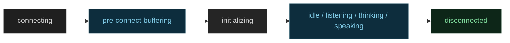
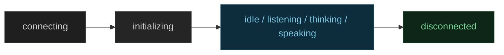

# Frontend Development

React voice agent quickstart, cross-platform starter apps (iOS, Android, Flutter, React Native, Unity), session management, and auth tokens.

- **Total pages in this section**: 29
- **Successful retrieves**: 28
- **API References / Placeholders**: 1

## Table of Contents

1. [frontends/](#page-1) (✓)
2. [components-android/index.html](#page-2) (✗)
3. [frontends/build/](#page-3) (✓)
4. [frontends/agents-ui/](#page-4) (✓)
5. [frontends/start/react-quickstart/](#page-5) (✓)
6. [frontends/start/starter-apps/](#page-6) (✓)
7. [frontends/build/sessions/](#page-7) (✓)
8. [frontends/build/authentication/](#page-8) (✓)
9. [frontends/build/agent-state/](#page-9) (✓)
10. [frontends/build/media-data/](#page-10) (✓)
11. [frontends/build/virtual-avatars/](#page-11) (✓)
12. [frontends/build/hardware/](#page-12) (✓)
13. [frontends/agents-ui/media-controls/](#page-13) (✓)
14. [frontends/agents-ui/chat/](#page-14) (✓)
15. [frontends/reference/tokens-grants/](#page-15) (✓)
16. [frontends/start/starter-apps/react/](#page-16) (✓)
17. [frontends/start/starter-apps/swiftui/](#page-17) (✓)
18. [frontends/start/starter-apps/android/](#page-18) (✓)
19. [frontends/start/starter-apps/flutter/](#page-19) (✓)
20. [frontends/start/starter-apps/react-native/](#page-20) (✓)
21. [frontends/start/starter-apps/web-embed/](#page-21) (✓)
22. [frontends/start/starter-apps/unity/](#page-22) (✓)
23. [frontends/build/authentication/development-token-server/](#page-23) (✓)
24. [frontends/build/authentication/endpoint/](#page-24) (✓)
25. [frontends/build/authentication/custom/](#page-25) (✓)
26. [frontends/build/hardware/esp32/](#page-26) (✓)
27. [frontends/agents-ui/audio-visualizer/prebuilt/](#page-27) (✓)
28. [frontends/agents-ui/audio-visualizer/custom/](#page-28) (✓)
29. [frontends/agents-ui/audio-visualizer/expression/](#page-29) (✓)

---

<a name="page-1"></a>
## Page 1: frontends/
**Original URL:** https://docs.livekit.io/frontends/  
**Source MD URL:** https://docs.livekit.io/frontends.md

LiveKit docs › Agent Frontends › Get Started › Introduction

---

# Agent Frontends

> Build a custom web or mobile frontend for your LiveKit Agent.

## Overview

LiveKit provides open-source SDKs and UI components for all major web and mobile platforms. Use these tools to build a custom frontend for your voice or video agent.

Your frontend connects to your agent using [WebRTC](https://docs.livekit.io/transport.md), which is the gold standard for reliable realtime media and data even in challenging network environments. The LiveKit SDKs make it easy to use cameras, microphones, and more to build any kind of realtime frontend you need.

## Get started

LiveKit has high-quality starter apps for all major web and mobile platforms, which are the easiest way to get started with a custom voice agent frontend. If you prefer, you can also follow the quickstart guide for React.

- **[Starter apps](https://docs.livekit.io/frontends/start/starter-apps.md)**: Open-source starter apps for React, SwiftUI, Android, Flutter, React Native, and web embed.

- **[React voice AI quickstart](https://docs.livekit.io/frontends/start/react-quickstart.md)**: Build a voice AI frontend with React in less than 10 minutes.

## Building frontends

Learn the core concepts for building a production-ready agent frontend.

- **[Session management](https://docs.livekit.io/frontends/build/sessions.md)**: Use Session APIs to manage room connections and agent lifecycle automatically.

- **[Authentication](https://docs.livekit.io/frontends/build/authentication.md)**: Generate and manage JWT tokens for connecting your frontend to LiveKit.

- **[Agent state](https://docs.livekit.io/frontends/build/agent-state.md)**: Track and respond to agent state changes in your frontend.

- **[Realtime media and data](https://docs.livekit.io/frontends/build/media-data.md)**: Work with audio, video, text streams, and data in your agent frontend.

- **[Virtual avatars](https://docs.livekit.io/frontends/build/virtual-avatars.md)**: Give your agent a visual presence with a virtual avatar.

## UI components

Pre-built component libraries for popular frontend frameworks that handle session management, media controls, audio visualization, and chat.

- **[UI components](https://docs.livekit.io/frontends/agents-ui.md)**: Learn about the available component libraries for React, Swift, Android, and Flutter.

## Reference

Complete SDK documentation, API references, and advanced topics.

- **[LiveKit SDKs](https://docs.livekit.io/reference.md#livekit-sdks)**: Complete documentation for all LiveKit client SDKs.

- **[UI component SDKs](https://docs.livekit.io/reference.md#ui-components)**: API references and examples for React, Swift, Android, and Flutter components.

- **[Tokens & grants](https://docs.livekit.io/frontends/reference/tokens-grants.md)**: Reference documentation for access tokens, grants, and permissions.

---

This document was rendered at 2026-08-28T04:22:10.222Z.
For the latest version of this document, see [https://docs.livekit.io/frontends.md](https://docs.livekit.io/frontends.md).

To explore all LiveKit documentation, see [llms.txt](https://docs.livekit.io/llms.txt).

---

<a name="page-2"></a>
## Page 2: components-android/index.html
**Original URL:** https://docs.livekit.io/components-android/index.html  
**Source MD URL:** https://docs.livekit.io/components-android/index.html.md

> [!NOTE]
> API Reference or page content could not be fetched as raw markdown.
> View the live content directly at the original URL: [https://docs.livekit.io/components-android/index.html](https://docs.livekit.io/components-android/index.html).
> Detail: Failed with status code 404


---

<a name="page-3"></a>
## Page 3: frontends/build/
**Original URL:** https://docs.livekit.io/frontends/build/  
**Source MD URL:** https://docs.livekit.io/frontends/build.md

LiveKit docs › Agent Frontends › Building Frontends › Overview

---

# Building agent frontends

> Detailed guides to building great frontends for voice and video AI.

## Overview

This section covers the core concepts for building a production-ready agent frontend. Your frontend starts a session, authenticates, and then communicates with the agent through realtime media and data while tracking agent state to drive the UI.

## In this section

| Topic | What it covers | Role in the flow |
| **[Session management](https://docs.livekit.io/frontends/build/sessions.md)** | Creating, starting, and ending agent sessions with the `Session` API. | Entry point. Orchestrates token fetching, room connection, and agent dispatch. |
| **[Authentication](https://docs.livekit.io/frontends/build/authentication.md)** | Generating and managing JWT tokens via `TokenSource` types (sandbox, endpoint, custom, literal). | Provides the credentials that sessions use to connect to a room and dispatch an agent. |
| **[Agent state](https://docs.livekit.io/frontends/build/agent-state.md)** | Reading agent lifecycle states (connecting, listening, thinking, speaking) and state getters. | Drives UI updates so your frontend reflects what the agent is doing at any moment. |
| **[Realtime media and data](https://docs.livekit.io/frontends/build/media-data.md)** | Audio, video, text streams, byte streams, state synchronization, and RPC. | The communication layer between your frontend and the agent during a session. |
| **[Virtual avatars](https://docs.livekit.io/frontends/build/virtual-avatars.md)** | Rendering a visual avatar driven by agent audio output. | Optional. Adds a visual presence to voice agents using a standard video track. |

---

This document was rendered at 2026-08-28T04:22:10.187Z.
For the latest version of this document, see [https://docs.livekit.io/frontends/build.md](https://docs.livekit.io/frontends/build.md).

To explore all LiveKit documentation, see [llms.txt](https://docs.livekit.io/llms.txt).

---

<a name="page-4"></a>
## Page 4: frontends/agents-ui/
**Original URL:** https://docs.livekit.io/frontends/agents-ui/  
**Source MD URL:** https://docs.livekit.io/frontends/agents-ui.md

LiveKit docs › Agent Frontends › Agents UI Components › Overview

---

# Agents UI components

> Polished Shadcn components for rapid development of voice agent frontends.


## Overview

[Agents UI](https://docs.livekit.io/reference/components/agents-ui.md) is a component library built on top of [Shadcn](https://ui.shadcn.com/) and [AI Elements](https://ai-sdk.dev/elements) to accelerate the creation of agentic applications built with LiveKit's realtime platform. It provides pre-built components for controlling IO, managing sessions, rendering transcripts, visualizing audio streams, and more.

## Installation

You can install Agents UI components using the Shadcn CLI. First, set up shadcn in your project and add the Agents UI registry:

```bash
npx shadcn@latest init
npx shadcn@latest registry add @agents-ui

```

Then install components individually:

```bash
npx shadcn@latest add @agents-ui/{component-name}

```

Or install every Agents UI component at once with:

```bash
npx shadcn@latest add @agents-ui/all

```

> ℹ️ **Note**
> 
> The `nextjs-api-token-route` helper is excluded from `@agents-ui/all`. Add it separately if you need it for your Next JS application.

After installation, components are available in your project's `components/agents-ui` directory with full source code that you can customize.

- **[Agents UI reference](https://docs.livekit.io/reference/components/agents-ui.md)**: Complete reference documentation for Agents UI components.

- **[GitHub repository](https://github.com/livekit/components-js/tree/main/packages/shadcn)**: Open source Agents UI component code.

## Other UI component SDKs

LiveKit also provides component libraries for other frameworks. While these are not agents-specific, they include useful components for building realtime applications:

| Framework | Description |
| **[React components](https://docs.livekit.io/reference/components/react.md)** | Low-level React components and hooks for building realtime audio and video applications with LiveKit's platform primitives. |
| **[Swift components](https://livekit.github.io/components-swift/documentation/livekitcomponents)** | SwiftUI components for iOS, macOS, visionOS, and tvOS applications with native platform integration. |
| **[Android components](https://docs.livekit.io/reference/components/android.md)** | Jetpack Compose components for Android applications with Material Design integration. |
| **[Flutter components](https://github.com/livekit/components-flutter)** | Flutter widgets for cross-platform mobile and desktop applications. |

## In this section

Agents UI organizes components into the following categories. Each category page explains what the components do, when to use them, and includes live previews.

| Category | What it includes | When to use |
| **[Media controls](https://docs.livekit.io/frontends/agents-ui/media-controls.md)** | AgentControlBar, AgentTrackControl, AgentTrackToggle, AgentDisconnectButton, StartAudioButton | Give users control over microphone, camera, session disconnect, and browser audio playback. |
| **[Audio visualizer](https://docs.livekit.io/frontends/agents-ui/audio-visualizer.md)** | AgentAudioVisualizerBar, Grid, Radial, Wave, Aura | Give your voice agent a visual presence with animated visualizations driven by audio data and agent state. |
| **[Chat components](https://docs.livekit.io/frontends/agents-ui/chat.md)** | AgentChatTranscript, AgentChatIndicator | Display realtime conversation transcripts, text messages, and typing indicators. |

---

This document was rendered at 2026-08-28T04:22:10.234Z.
For the latest version of this document, see [https://docs.livekit.io/frontends/agents-ui.md](https://docs.livekit.io/frontends/agents-ui.md).

To explore all LiveKit documentation, see [llms.txt](https://docs.livekit.io/llms.txt).

---

<a name="page-5"></a>
## Page 5: frontends/start/react-quickstart/
**Original URL:** https://docs.livekit.io/frontends/start/react-quickstart/  
**Source MD URL:** https://docs.livekit.io/frontends/start/react-quickstart.md

LiveKit docs › Agent Frontends › Get Started › React voice agent quickstart

---

# React voice AI quickstart

> Build a voice AI frontend with React in less than 10 minutes.

## Overview

This guide walks you through building a voice AI frontend using React and the LiveKit React components library. In less than 10 minutes, you'll have a working frontend that connects to your agent and allows users to have voice conversations through their browser.

## Starter projects

The simplest way to get your first agent running is with the following starter projects. Click "Use this template" in the top right to create a new repo on GitHub, then follow the instructions in the project's README.

- **[Next.js Voice Agent](https://docs.livekit.io/frontends/start/starter-apps/react.md)**: Ready-to-go React starter project. Clone a repo with all the code you need to get started.

- **[Web Embed Voice Agent](https://docs.livekit.io/frontends/start/starter-apps/web-embed.md)**: Ready-to-go web embed starter project. Clone a repo with all the code you need to get started.

## Requirements

The following sections describe the minimum requirements to build a React frontend for your voice AI agent.

### LiveKit Cloud account

This guide assumes you have signed up for a free [LiveKit Cloud](https://cloud.livekit.io/) account. Create a free project to get started with your voice AI application.

### Agent backend

You need a LiveKit agent running on the backend that is configured for your LiveKit Cloud project. Follow the [Voice AI quickstart](https://docs.livekit.io/agents/start/voice-ai.md) to create and deploy your agent.

### Token server

This guide uses the LiveKit Cloud token server for ease of use. Enable it from your project's [Settings](https://cloud.livekit.io/projects/p_/settings/project) page by toggling **Token server** on, then copy the sandbox ID.

For production usage, you should set up a dedicated token server implementation. See the [authentication](https://docs.livekit.io/frontends/build/authentication.md) guide for more details.

## Setup

Use the instructions in the following sections to set up your new React frontend project.

### Create React project

Create a new React project using your preferred method:

**pnpm**:

```shell
pnpm create vite@latest my-agent-app --template react-ts
cd my-agent-app

```

---

**npm**:

```shell
npm create vite@latest my-agent-app -- --template react-ts
cd my-agent-app

```

### Install packages

Install the LiveKit SDK and React components:

**pnpm**:

```shell
pnpm add @livekit/components-react @livekit/components-styles livekit-client

```

---

**npm**:

```shell
npm install @livekit/components-react @livekit/components-styles livekit-client --save

```

### Add agent frontend code

Replace the contents of your `src/App.tsx` file with the following code:

> ℹ️ **Note**
> 
> Update the `sandboxId` with your own token server ID from your project's [Settings](https://cloud.livekit.io/projects/p_/settings/project) page, and set the `agentName` to match your deployed agent's name.

** Filename: `src/App.tsx`**

```tsx
'use client';
import { useEffect, useRef } from 'react';
import {
  ControlBar,
  RoomAudioRenderer,
  useSession,
  SessionProvider,
  useAgent,
  BarVisualizer,
} from '@livekit/components-react';
import { TokenSource, TokenSourceConfigurable, TokenSourceFetchOptions } from 'livekit-client';
import '@livekit/components-styles';

const tokenSource = TokenSource.sandboxTokenServer('%{firstDevelopmentTokenServerName}%');

export default function App() {
  const session = useSession(tokenSource, { agentName: 'my-agent-name' });

  // Connect to session
  useEffect(() => {
    session.start();
    return () => {
      session.end();
    };
  }, []);

  return (
    <SessionProvider session={session}>
      <div data-lk-theme="default" style={{ height: '100vh' }}>
        {/* Your custom component with basic video agent functionality. */}
        <MyAgentView />
        {/* Controls for the user to start/stop audio and disconnect from the session */}
        <ControlBar controls={{ microphone: true, camera: false, screenShare: false }} />
        {/* The RoomAudioRenderer takes care of room-wide audio for you. */}
        <RoomAudioRenderer />
      </div>
    </SessionProvider>
  );
}

function MyAgentView() {
  const agent = useAgent();
  return (
    <div style={{ height: '350px' }}>
      <p>Agent state: {agent.state}</p>
      {/* Renders a visualizer for the agent's audio track */}
      {agent.canListen && (
        <BarVisualizer track={agent.microphoneTrack} state={agent.state} barCount={5} />
      )}
    </div>
  );
}

```

## Run your application

Start the development server:

**pnpm**:

```shell
pnpm dev

```

---

**npm**:

```shell
npm run dev

```

Open your browser to the URL shown in the terminal (typically `http://localhost:5173`). You should see your agent frontend with controls to enable your microphone and speak with your agent.

## Next steps

The following resources help you build on your React agent frontend.

- **[Authentication](https://docs.livekit.io/frontends/build/authentication.md)**: Set up production token generation for your frontend.

- **[UI components](https://docs.livekit.io/frontends/agents-ui.md)**: Add pre-built components for media controls, visualizers, and chat.

- **[Session management](https://docs.livekit.io/frontends/build/sessions.md)**: Learn how Session APIs manage room connections and agent lifecycle.

---

This document was rendered at 2026-08-28T04:22:10.872Z.
For the latest version of this document, see [https://docs.livekit.io/frontends/start/react-quickstart.md](https://docs.livekit.io/frontends/start/react-quickstart.md).

To explore all LiveKit documentation, see [llms.txt](https://docs.livekit.io/llms.txt).

---

<a name="page-6"></a>
## Page 6: frontends/start/starter-apps/
**Original URL:** https://docs.livekit.io/frontends/start/starter-apps/  
**Source MD URL:** https://docs.livekit.io/frontends/start/starter-apps.md

LiveKit docs › Agent Frontends › Get Started › Starter apps › Overview

---

# Starter apps

> Open-source starter apps to get up and running quickly on your preferred platform.

## Overview

Clone a starter app to get up and running quickly on your preferred platform. Each app is open source under the MIT License. The mobile apps require a hosted token server and can use the [development token server](https://docs.livekit.io/frontends/build/authentication/development-token-server.md) for testing purposes.


## Available starter apps

Each starter app has a dedicated guide with installation instructions, screenshots, and links to the source code:

- **[Next.js Voice Agent](https://docs.livekit.io/frontends/start/starter-apps/react.md)**: A web voice AI assistant built with React and Next.js.

- **[SwiftUI Voice Agent](https://docs.livekit.io/frontends/start/starter-apps/swiftui.md)**: A native iOS, macOS, and visionOS voice AI assistant built in SwiftUI.

- **[Android Voice Agent](https://docs.livekit.io/frontends/start/starter-apps/android.md)**: A native Android voice AI assistant app built with Kotlin and Jetpack Compose.

- **[Flutter Voice Agent](https://docs.livekit.io/frontends/start/starter-apps/flutter.md)**: A cross-platform voice AI assistant app built with Flutter.

- **[React Native Voice Agent](https://docs.livekit.io/frontends/start/starter-apps/react-native.md)**: A native voice AI assistant app built with React Native and Expo.

- **[Web Embed Voice Agent](https://docs.livekit.io/frontends/start/starter-apps/web-embed.md)**: A voice AI agent that can be embedded in any web page.

- **[Unity Voice Agent](https://docs.livekit.io/frontends/start/starter-apps/unity.md)**: A cross-platform voice AI assistant app built with Unity.

## Next steps

Once you have a starter app running, explore these resources to customize your frontend:

- **[Building frontends](https://docs.livekit.io/frontends/build.md)**: Learn about sessions, authentication, media, and more.

- **[UI components](https://docs.livekit.io/frontends/agents-ui.md)**: Pre-built components for media controls, visualizers, and chat.

---

This document was rendered at 2026-08-28T04:22:10.917Z.
For the latest version of this document, see [https://docs.livekit.io/frontends/start/starter-apps.md](https://docs.livekit.io/frontends/start/starter-apps.md).

To explore all LiveKit documentation, see [llms.txt](https://docs.livekit.io/llms.txt).

---

<a name="page-7"></a>
## Page 7: frontends/build/sessions/
**Original URL:** https://docs.livekit.io/frontends/build/sessions/  
**Source MD URL:** https://docs.livekit.io/frontends/build/sessions.md

LiveKit docs › Agent Frontends › Building Frontends › Session management

---

# Session management

> Use Session APIs to manage room connections and agent lifecycle in your frontend.

## Overview

Building an agent frontend requires coordinating several moving parts: fetching authentication tokens, connecting to a room, dispatching an agent, and then interacting with it through media, data, and state APIs. The `Session` API handles this orchestration for you, giving you a single entry point that manages the full lifecycle of a 1:1 agent interaction.

Without `Session`, you need to generate tokens manually, call `Room.connect`, set up agent dispatch configuration, and manage cleanup yourself. `Session` wraps all of this into a simple start/end interface while still giving you access to lower-level APIs when needed.

`Session` is available on Web, Swift, Kotlin, Flutter, and React Native.

> ℹ️ **Note**
> 
> If you're using a platform that doesn't yet support Session APIs, you can use manual token generation and connect directly with `Room.connect`. See [Token creation](https://docs.livekit.io/frontends/reference/tokens-grants.md) for details.

## Session lifecycle

A session has four stages:

1. **Create**: Initialize a session with a `TokenSource` and options including the agent name. You can target a specific [agent deployment](https://docs.livekit.io/agents/server/agent-dispatch.md#deployments) with the `deployment` option. Otherwise, leave it empty to target production. `TokenSource` handles token fetching, caching, and refreshing — see the [Authentication](https://docs.livekit.io/frontends/build/authentication.md) guide for setup.
2. **Start**: Call `session.start()` to fetch a token, connect to a room, and dispatch the agent.
3. **Interact**: The agent joins the room and begins the conversation. Your frontend can access agent state, media tracks, transcriptions, and data through the session.
4. **End**: Call `session.end()` to disconnect from the room and clean up resources.

## What you get inside a session

Once a session is started and the agent has joined, your frontend has access to the full set of realtime APIs for interacting with the agent.

### Agent state

The agent moves through a lifecycle of states — connecting, listening, thinking, speaking — that your frontend can observe. Use these states to drive UI updates, like showing a visual indicator when the agent is thinking or disabling the microphone when the agent is speaking. State getters like `canListen` and `isFinished` simplify common UI decisions. See [Agent state](https://docs.livekit.io/frontends/build/agent-state.md) for details.

### Media tracks

Your frontend and agent exchange audio and video over media tracks. A simple voice agent subscribes to the user's microphone and publishes its own audio. Agents with vision capabilities can subscribe to the user's camera or screen share. See [Realtime media and data](https://docs.livekit.io/frontends/build/media-data.md) for details.

### Session messages

The session exposes a unified list of messages you can use to build chat panels and message lists. Your SDK provides a Session Messages API that gives you the list and a way to send new chat messages.

The following examples show how to render the message list and send user messages on each platform.

**React**:

```tsx
'use client';

import { useState } from 'react';
import { useAgent, useSessionMessages } from '@livekit/components-react';
import { AgentChatTranscript } from '@/components/agents-ui/agent-chat-transcript';

function ChatInterface({ session }) {
  const { state } = useAgent(session);
  const { messages, send, isSending } = useSessionMessages(session);
  const [chatMessage, setChatMessage] = useState('');

  return (
    <>
      <AgentChatTranscript agentState={state} messages={messages} />
      <div>
        <input
          type="text"
          value={chatMessage}
          onChange={(e) => setChatMessage(e.target.value)}
        />
        <button
          disabled={isSending}
          onClick={() => {
            send(chatMessage);
            setChatMessage('');
          }}
        >
          {isSending ? 'Sending' : 'Send'}
        </button>
      </div>
    </>
  );
}

```

---

**Swift**:

```swift
// In a SwiftUI view with access to your session:
ForEach(session.messages) { message in
  switch message.content {
  case let .agentTranscript(text),
       let .userTranscript(text),
       let .userInput(text):
    Text(text)
  }
}

TextField("Message", text: $inputText)
Button("Send") {
  Task {
    await session.send(text: inputText)
    inputText = ""
  }
}

```

---

**Android**:

```kotlin
val sessionMessages = rememberSessionMessages()

LazyColumn {
  items(items = sessionMessages.messages) { message ->
    Text(message.message)
  }
}

val messageState = rememberTextFieldState()
TextField(state = messageState)
Button(onClick = {
  coroutineScope.launch {
    sessionMessages.send(messageState.text.toString())
    messageState.clearText()
  }
}) {
  Text("Send")
}

```

---

**Flutter**:

```dart
// session.messages is the list; session.sendText() sends user messages
ListView.builder(
  itemCount: session.messages.length,
  itemBuilder: (context, index) {
    final message = session.messages[index];
    return Text(message.content.text);
  },
)

TextField(
  controller: _controller,
  onSubmitted: (text) async {
    await session.sendText(text);
    _controller.clear();
  },
)

```

#### Chat messages

Messages that the user or agent types (rather than speaks) appear in the session messages list. Use the Session Messages API's `send()` method to post new messages from the user. The agent can add messages on its side via the same channel.

#### Transcriptions

Transcriptions of agent and user speech are included in the session messages list. They also exist as raw text streams for captions or custom UIs. See [Text streams](https://docs.livekit.io/transport/data/text-streams.md) for details.

### Data and state synchronization

Beyond media and transcriptions, your frontend and agent can exchange arbitrary data. Use byte streams for files and images, RPC for request-response interactions, and state synchronization for shared key-value data that stays in sync across participants. See [Realtime media and data](https://docs.livekit.io/frontends/build/media-data.md#data) for an overview.

## Session lifecycle examples

The following examples show how to create a session, start it (connect and dispatch the agent), and end it on each platform.

**React**:

```tsx
'use client';
import { useEffect } from 'react';
import { useSession, SessionProvider } from '@livekit/components-react';
import { TokenSource } from 'livekit-client';

const tokenSource = TokenSource.sandboxTokenServer('%{firstDevelopmentTokenServerName}%');

export function App() {
  const session = useSession(tokenSource, { agentName: 'my-agent' });

  useEffect(() => {
    session.start();
    return () => {
      session.end();
    };
  }, []);

  return (
    <SessionProvider session={session}>
      {/* Your app components */}
    </SessionProvider>
  );
}

```

---

**Swift**:

```swift
import LiveKitComponents

let tokenSource = SandboxTokenSource(id: "%{firstDevelopmentTokenServerName}%")
let session = Session.withAgent("my-agent", tokenSource: tokenSource)

// Start the session
await session.start()

// End the session
await session.end()

```

---

**Android**:

```kotlin
val tokenSource = remember {
    TokenSource.fromSandboxTokenServer("%{firstDevelopmentTokenServerName}%")
}
val session = rememberSession(tokenSource = tokenSource)

LaunchedEffect(Unit) {
    session.start()
}

// End the session when done
session.end()

```

---

**Flutter**:

```dart
import 'package:livekit_client/livekit_client.dart' as sdk;

final tokenSource = sdk.SandboxTokenSource(sandboxId: "%{firstDevelopmentTokenServerName}%");
final session = sdk.Session.fromConfigurableTokenSource(
  tokenSource,
  const TokenRequestOptions(agentName: "my-agent"),
);

await session.start();

// End the session when done
await session.end();

```

## Target a deployment

To dispatch your agent from a specific [deployment](https://docs.livekit.io/agents/server/agent-dispatch.md#deployments), set the deployment option when you create the session. Leave it empty to target the production deployment. The option is named `deployment` on Web and React Native, and `agentDeployment` on Swift, Android, and Flutter.

**React**:

```tsx
const session = useSession(tokenSource, {
  agentName: 'my-agent',
  deployment: 'staging',
});

```

---

**Swift**:

```swift
// `withAgent` doesn't take a deployment, so build the session with `tokenOptions`:
let session = Session(
    tokenSource: tokenSource,
    tokenOptions: TokenRequestOptions(agentName: "my-agent", agentDeployment: "staging")
)

```

---

**Android**:

```kotlin
val session = rememberSession(
    tokenSource = tokenSource,
    options = SessionOptions(
        tokenRequestOptions = TokenRequestOptions(
            agentName = "my-agent",
            agentDeployment = "staging",
        ),
    ),
)

```

---

**Flutter**:

```dart
final session = sdk.Session.fromConfigurableTokenSource(
  tokenSource,
  const TokenRequestOptions(agentName: "my-agent", agentDeployment: "staging"),
);

```

---

**React Native**:

```tsx
const session = useSession(tokenSource, {
  agentName: 'my-agent',
  deployment: 'staging',
});

```

## End-to-end encryption

Use E2EE when content needs to stay fully encrypted from sender to receiver so that no intermediaries (including LiveKit servers) can access or modify it. Sessions can be configured with end-to-end encryption at creation time, where both media tracks and data channels are encrypted with keys distributed by you that the server never sees. See the [Encryption overview](https://docs.livekit.io/transport/encryption.md) for details.

**React**:

```tsx
'use client';
import { useEffect, useState } from 'react';
import { useSession, SessionProvider } from '@livekit/components-react';
import { TokenSource } from 'livekit-client';

const tokenSource = TokenSource.sandboxTokenServer('%{firstDevelopmentTokenServerName}%');

export function App() {
  const [worker] = useState(() => {
    if (typeof window === 'undefined') {
      return null;
    }
    return new Worker(new URL('livekit-client/e2ee-worker', import.meta.url));
  });

  const session = useSession(tokenSource, {
    agentName: 'my-agent',
    encryption: worker ? { key: 'your-shared-key', worker } : undefined,
  });

  useEffect(() => {
    session.start();
    return () => {
      session.end();
    };
  }, []);

  return (
    <SessionProvider session={session}>
      {/* Your app components */}
    </SessionProvider>
  );
}

```

---

**Swift**:

```swift
import LiveKitComponents

let tokenSource = SandboxTokenSource(id: "%{firstDevelopmentTokenServerName}%")
let session = Session.withAgent(
    "my-agent",
    tokenSource: tokenSource,
    options: SessionOptions(encryption: .sharedKey("your-shared-key"))
)

await session.start()

```

---

**Android**:

```kotlin
val tokenSource = remember {
    TokenSource.fromSandboxTokenServer("%{firstDevelopmentTokenServerName}%")
}
val session = rememberSession(
    tokenSource = tokenSource,
    options = SessionOptions(encryption = E2EEOptions(sharedKey = "your-shared-key")),
)

LaunchedEffect(Unit) {
    session.start()
}

```

---

**Flutter**:

```dart
import 'package:livekit_client/livekit_client.dart' as sdk;

final tokenSource = sdk.SandboxTokenSource(sandboxId: "%{firstDevelopmentTokenServerName}%");
final session = sdk.Session.withAgent(
  "my-agent",
  tokenSource: tokenSource,
  options: sdk.SessionOptions(
    encryption: await sdk.E2EEOptions.sharedKey("your-shared-key"),
  ),
);

await session.start();

```

---

**React Native**:

```tsx
import { useEffect } from 'react';
import { useSession, SessionProvider } from '@livekit/components-react';
import { useRNE2EEManager } from '@livekit/react-native';
import { TokenSource } from 'livekit-client';

const tokenSource = TokenSource.sandboxTokenServer('%{firstDevelopmentTokenServerName}%');

export function App() {
  const { e2eeManager } = useRNE2EEManager({ sharedKey: 'your-shared-key' });

  const session = useSession(tokenSource, {
    agentName: 'my-agent',
    encryption: { e2eeManager: e2eeManager },
  });

  useEffect(() => {
    session.start();
    return () => {
      session.end();
    };
  }, []);

  return (
    <SessionProvider session={session}>
      {/* Your app components */}
    </SessionProvider>
  );
}

```

### Toggling encryption at runtime

Call `setEncryptionEnabled` on the session to turn E2EE on or off after the session is started. A common use is downgrading an encrypted session to an unencrypted one when a participant joins without encryption support, so the rest of the room can still communicate with them. Encryption must be configured via the `encryption` option at session creation.

**React**:

```tsx
await session.setEncryptionEnabled(false);

```

---

**Swift**:

```swift
session.setEncryptionEnabled(false)

```

---

**Android**:

```kotlin
session.setEncryptionEnabled(false)

```

---

**Flutter**:

```dart
await session.setEncryptionEnabled(false);

```

---

**React Native**:

```tsx
await session.setEncryptionEnabled(false);

```

> ℹ️ **Info**
> 
> The `encryption` option on `SessionOptions` covers the shared-key case. For custom key providers (per-participant keys, MLS/MEGOLM-style rotation, etc.), pass a pre-built `Room` configured with your own key provider — see [Using a custom key provider](https://docs.livekit.io/transport/encryption/start.md#custom-key-provider) for more information.

## Using AgentSessionProvider

If you're building with [Agents UI](https://docs.livekit.io/frontends/agents-ui.md) components, the `AgentSessionProvider` component wraps the session from `useSession` and provides session context to all child components. Agents UI components like `AgentControlBar`, `AgentChatTranscript`, and the audio visualizers require this provider as an ancestor.

```tsx
'use client';
import { useSession } from '@livekit/components-react';
import { AgentSessionProvider } from '@/components/agents-ui/agent-session-provider';
import { TokenSource } from 'livekit-client';

const tokenSource = TokenSource.sandboxTokenServer('%{firstDevelopmentTokenServerName}%');

export function App() {
  const session = useSession(tokenSource, { agentName: 'my-agent' });

  return (
    <AgentSessionProvider session={session}>
      {/* Agents UI components can access session context here */}
    </AgentSessionProvider>
  );
}

```

- **[AgentSessionProvider reference](https://docs.livekit.io/reference/components/agents-ui/component/agent-session-provider.md)**: Full API reference and props documentation.

## Next steps

- **[Authentication](https://docs.livekit.io/frontends/build/authentication.md)**: Configure token generation for development and production.

- **[Agent state](https://docs.livekit.io/frontends/build/agent-state.md)**: Track agent lifecycle states to drive your UI.

- **[Realtime media and data](https://docs.livekit.io/frontends/build/media-data.md)**: Work with audio, video, transcriptions, and data inside a session.

- **[UI components](https://docs.livekit.io/frontends/agents-ui.md)**: Add pre-built components for session management, media, and chat.

---

This document was rendered at 2026-08-28T04:22:10.960Z.
For the latest version of this document, see [https://docs.livekit.io/frontends/build/sessions.md](https://docs.livekit.io/frontends/build/sessions.md).

To explore all LiveKit documentation, see [llms.txt](https://docs.livekit.io/llms.txt).

---

<a name="page-8"></a>
## Page 8: frontends/build/authentication/
**Original URL:** https://docs.livekit.io/frontends/build/authentication/  
**Source MD URL:** https://docs.livekit.io/frontends/build/authentication.md

LiveKit docs › Agent Frontends › Building Frontends › Authentication › Overview

---

# Authentication

> How to manage and use tokens to authenticate your frontend app

## Overview

Your frontend app uses a JWT access token to authenticate with LiveKit and specify which agent to dispatch. Generating a token requires API keys so it must be created on a backend server, sent to the frontend, and then provided to the session for connection.  To simplify this process, the session API utilizes a `TokenSource` abstraction that handles the details for you. The SDKs ship with a few different types of `TokenSource` to make it easy to get started and move to production.

### TokenSource

`TokenSource` abstracts away token fetching, caching, and refreshing, and integrates with [Session](https://docs.livekit.io/frontends/build/sessions.md) for automatic room connection and agent dispatch. The following types of `TokenSource` are available:

| Type | Description |
| **Token server** | LiveKit Cloud generates tokens for you, which is useful for development and testing but insecure in production. |
| **Endpoint** | Provide a standardized token endpoint on your own backend, with your own authentication headers, and let LiveKit manage the token lifecycle. |
| **Custom** | Provide your own custom asynchronous token generation mechanism. |
| **Literal** | Directly provide tokens that you have generated and fetched yourself. |

For lower-level control, you can generate tokens manually and use `Room.connect` directly. See [Tokens & grants](https://docs.livekit.io/frontends/reference/tokens-grants.md) for more information on token generation.

### Authentication flow

Authentication has three main steps:

1. **Token generation**: Your backend or the LiveKit Cloud token server generates a JWT token that includes agent dispatch information.
2. **Frontend connection**: Your frontend uses the token to connect to a LiveKit room. With `Session`, this happens automatically -- `TokenSource` fetches the token and `Session` handles the connection.
3. **Agent dispatch**: LiveKit reads the agent dispatch information and assigns the specified agent to the room. To target a specific [agent deployment](https://docs.livekit.io/agents/server/agent-dispatch.md#deployments), include a deployment alongside the agent name; leave it empty to target production.

The diagram below shows the different paths you can take for token generation, and how they fit into the flow:

```mermaid
flowchart TD
Start([Frontend App]) --> Choose{Choose token<br/>generation method}Choose -->|Development| Sandbox[Token Server<br/>LiveKit Cloud]
Choose -->|Production| Endpoint[Your Token Endpoint<br/>Standardized format]
Choose -->|Production| Custom[Custom <br/>Existing infrastructure]
Choose -->|Manual| Manual[Generate tokens<br/>yourself]Sandbox --> TokenSourceAPI[]
Endpoint --> TokenSourceAPI
Custom --> TokenSourceAPI
Manual --> Direct[Room.connect<br/>Direct connection]TokenSourceAPI --> Token[Get JWT Token<br/>with agent dispatch]
Direct --> TokenToken --> Connect[Connect to<br/>LiveKit Room]
Connect --> Agent[Agent joins<br/>and starts conversation]
```

## Choose a workflow

Pick a token generation approach based on where you are in development.

### Development workflow

Use LiveKit Cloud's token server for quick development and testing. No backend code needed. Your frontend uses a token server `TokenSource`.

- **[Development token server](https://docs.livekit.io/frontends/build/authentication/development-token-server.md)**: Get detailed setup instructions and frontend code examples for all platforms.

### Production workflow

For production, build a standardized token endpoint or use your existing token generation infrastructure with a custom `TokenSource`.

#### Token endpoints

Build your own token endpoint for production use. Your backend generates tokens that include agent dispatch, and your frontend uses an endpoint `TokenSource`.

- **[Token endpoints](https://docs.livekit.io/frontends/build/authentication/endpoint.md)**: Get the endpoint format, implementation guide, and production-ready backend examples.

#### Custom token generation

If you already have a token generation mechanism, use a custom `TokenSource` to integrate it with `Session`. You get token caching and automatic refreshing while using your existing infrastructure.

- **[Custom token generation](https://docs.livekit.io/frontends/build/authentication/custom.md)**: Learn how to integrate your existing token generation with Session APIs.

### Alternative: Manual token generation

If you prefer to generate tokens yourself and use `Room.connect` directly, you skip `Session` entirely and handle room connection and agent lifecycle yourself. You must include agent dispatch information when you create the token.

- **[Tokens & grants](https://docs.livekit.io/frontends/reference/tokens-grants.md)**: Learn about token structure, grants, permissions, and how to create tokens manually.

---

This document was rendered at 2026-08-28T04:22:10.946Z.
For the latest version of this document, see [https://docs.livekit.io/frontends/build/authentication.md](https://docs.livekit.io/frontends/build/authentication.md).

To explore all LiveKit documentation, see [llms.txt](https://docs.livekit.io/llms.txt).

---

<a name="page-9"></a>
## Page 9: frontends/build/agent-state/
**Original URL:** https://docs.livekit.io/frontends/build/agent-state/  
**Source MD URL:** https://docs.livekit.io/frontends/build/agent-state.md

LiveKit docs › Agent Frontends › Building Frontends › Agent state

---

# Agent state

> Track and respond to agent state changes in your frontend.

## Overview

Agents move through a lifecycle of states: connecting, listening, thinking, speaking, and eventually disconnecting or failing. Your frontend can read that state to show the right UI -- for example, when a user can talk, when an agent is busy, or if something has gone wrong. The agent publishes its state as the `lk.agent.state` participant attribute.

For most UI decisions you should use [state getters](#using-state-getters), which are booleans like `canListen` and `isFinished`, rather than raw state, so your UI stays correct as the SDK evolves.

## Agent states

State comes from two places. The agent SDK reports what the agent is doing (for example, listening or speaking), and the client reports connection and terminal outcomes. The following table defines each state.

| State | Description |
| `connecting` | The client is connecting to the room. The agent is not yet in the loop. |
| `pre-connect-buffering` | The app is connecting and may buffer user input before the connection is ready. Used for [instant connect](https://docs.livekit.io/agents/multimodality/audio.md#instant-connect). Can be disabled so the client goes straight to the active states. |
| `initializing` | The agent is connecting and setting up. |
| `idle` | The agent is connected but idle (waiting for user input). |
| `listening` | The agent is actively listening to the user. |
| `thinking` | The agent is processing input or performing actions. |
| `speaking` | The agent is producing audio output. |
| `disconnected` | The user disconnected cleanly. This is the normal success outcome after ending a session. |
| `failed` | The session entered an error state. Check the platform's failure API such as `failureReasons` for details. |

### Lifecycles

The following diagrams show the lifecycle of an agent with or without [instant connect](https://docs.livekit.io/agents/multimodality/audio.md#instant-connect) enabled. The flow can end in `failed` from any state, such as if the agent never connects or leaves the room unexpectedly during the conversation.

#### With instant connect

In this flow, the agent connects, buffers input, initializes, and then can listen, think, speak, and eventually disconnect.



#### Without instant-connect

In this flow, the agent connects, initializes, and then can listen, think, speak, and eventually disconnect. It doesn't buffer input before the connection is ready.



### Disconnected vs failed

The `disconnected` state is the successful status of a call ending. It means the user connected, then disconnected, and everything shut down correctly.

The `failed` state is the error status of a call ending. It means the state machine hit an error, such as connection or agent errors. When state is `failed`, use the platform's failure property like `failureReasons` to surface or handle the issues.

## Using state getters

Use state getters for UI decisions to accommodate new states as they're added over time. State getters are booleans over raw state so your UI stays correct as the SDK evolves.

> ℹ️ **Info**
> 
> Only use raw states when you need to show a specific state in the UI, such as "Pre-connect buffering…" or "Connecting…" messages.

State getters and their associated descriptions and states can be found in the following table.

| Getter | Description | Associated states |
| `canListen` | The user can speak. Input is accepted (including while the agent is thinking or speaking). | `pre-connect-buffering`, `listening`, `thinking`, `speaking` |
| `isConnected` | The session is connected to the room. | `listening`, `thinking`, `speaking` |
| `isPending` | The agent is in a transitional phase (connecting or setting up). | `connecting`, `initializing`, `idle` |
| `isFinished` | The session has reached a terminal outcome. | `disconnected`, `failed` |

## Accessing agent state

The following examples show how to read state and getters for each platform.

**React**:

Use the `useAgent` hook to access the agent's state and getters:

```tsx
import { useAgent } from '@livekit/components-react';

function AgentStatus() {
  const agent = useAgent();
  return (
    <>
      {agent.canListen && (
        <div>
          <p>Agent ready!</p>
          <p>Agent is in state {agent.state}</p>

          {/* Show chat panel or other agent specific ui elements here */}
        </div>
      )}

      {agent.isFinished && (
        agent.failureReasons?.length > 0 ? (
          <p>Agent failed: {agent.failureReasons.join(', ')}</p>
        ) : (
          <p>Agent disconnected.</p>
        )
      )}
    </>
  );
}

```

---

**Swift**:

Access the agent from the session and use its state getters. The session's `agent` property exposes `canListen`, `isFinished`, `agentState`, and `error`:

```swift
@EnvironmentObject var session: Session

var body: some View {
    let agent = session.agent

    if agent.canListen {
        VStack {
            Text("Agent ready!")
            Text("Agent is in state \(String(describing: agent.agentState ?? .initializing))")
            // Show chat panel or other agent-specific UI here
        }
    }

    if agent.isFinished {
        if let error = agent.error {
            Text("Agent failed: \(error.localizedDescription)")
        } else {
            Text("Agent disconnected.")
        }
    }
}

```

---

**Android**:

Use the `rememberAgent` composable to access the agent's state and getters.

```kotlin
@Composable
fun AgentStatus() {
    val agent = rememberAgent()

    if (agent.canListen) {
        Column {
            Text("Agent ready!")
            Text("Agent is in state ${agent.agentState.name}")
            // Show chat panel or other agent-specific UI here
        }
    }

    if (agent.isFinished) {
        if (agent.failureReasons.isNotEmpty()) {
            Text("Agent failed: ${agent.failureReasons.joinToString(", ")}")
        } else {
            Text("Agent disconnected.")
        }
    }
}

```

## Custom state

The built-in agent states cover the agent's lifecycle, but your application may need to share additional state between the frontend and agent. For example, you might want to display which tool the agent is currently using, show a list of items the agent has found, or let the user toggle agent behavior from the UI.

For this kind of application-specific state, use LiveKit's state synchronization and RPC features. State synchronization keeps key-value data in sync across participants, while RPC lets you call methods on the agent or frontend from the other side.

- **[State synchronization](https://docs.livekit.io/transport/data/state.md)**: Share custom state between your frontend and agent.

- **[RPC](https://docs.livekit.io/transport/data/rpc.md)**: Define and call methods on your agent or your frontend from the other side.

---

This document was rendered at 2026-08-28T04:22:10.959Z.
For the latest version of this document, see [https://docs.livekit.io/frontends/build/agent-state.md](https://docs.livekit.io/frontends/build/agent-state.md).

To explore all LiveKit documentation, see [llms.txt](https://docs.livekit.io/llms.txt).

---

<a name="page-10"></a>
## Page 10: frontends/build/media-data/
**Original URL:** https://docs.livekit.io/frontends/build/media-data/  
**Source MD URL:** https://docs.livekit.io/frontends/build/media-data.md

LiveKit docs › Agent Frontends › Building Frontends › Realtime media and data

---

# Realtime media and data

> Work with audio, video, text streams, and data in your agent frontend.

## Overview

Once a [session](https://docs.livekit.io/frontends/build/sessions.md) is established and the agent has joined the room, your frontend and agent communicate over [WebRTC](https://docs.livekit.io/transport.md). LiveKit's transport layer handles two broad categories of realtime communication:

- **[Media](https://docs.livekit.io/transport/media.md)**: Audio and video tracks for continuous streams like microphone input and agent speech output.
- **[Data](https://docs.livekit.io/transport/data.md)**: Text streams, byte streams, RPC, state synchronization, and data packets for everything else — transcriptions, files, method calls, and shared state.

A simple voice agent uses media tracks for audio and text streams for transcriptions. A more complex agent might add byte streams for image sharing, RPC for triggering actions, and state synchronization for custom UI state. The sections below walk through each of these and link to the full transport documentation.

## Media tracks

Your agent can subscribe to the user's microphone and camera tracks, and publish its own audio and video. A simple voice agent subscribes to the user's microphone track and publishes its own audio. A more complex agent with vision capabilities can subscribe to video from the user's camera or shared screen.

- **[Media tracks](https://docs.livekit.io/transport/media.md)**: Use the microphone, speaker, cameras, and screenshare with your agent.

## Text and transcriptions

Text transcriptions of agent and user speech are available as text streams. You can use these to build chat interfaces, display captions, or process conversation history.

- **[Text streams](https://docs.livekit.io/transport/data/text-streams.md)**: Send and receive realtime text and transcriptions.

## Data sharing

Share images, files, or any other kind of data between your frontend and your agent using byte streams or data packets.

- **[Byte streams](https://docs.livekit.io/transport/data/byte-streams.md)**: Send and receive images, files, or any other data.

- **[Data packets](https://docs.livekit.io/transport/data/packets.md)**: Low-level API for sending and receiving any kind of data.

## Agent state

As media and data flow between your frontend and agent, the agent moves through a lifecycle of states — connecting, listening, thinking, speaking, and eventually disconnecting. Your frontend can read these states to drive the UI, for example showing a visual indicator when the agent is thinking or enabling the microphone when the agent is ready to listen. For most UI decisions, use state getters like `canListen` and `isFinished` rather than raw state values.

- **[Agent state](https://docs.livekit.io/frontends/build/agent-state.md)**: Track and respond to agent state changes in your frontend.

## State and control

Beyond built-in agent state, your agent and your frontend can share custom state and call methods on each other. Use state synchronization for key-value data that stays in sync across participants, and RPC for request-response interactions like triggering an agent action or fetching data on demand.

- **[State synchronization](https://docs.livekit.io/transport/data/state.md)**: Share custom state between your frontend and agent.

- **[RPC](https://docs.livekit.io/transport/data/rpc.md)**: Define and call methods on your agent or your frontend from the other side.

---

This document was rendered at 2026-08-28T04:22:10.966Z.
For the latest version of this document, see [https://docs.livekit.io/frontends/build/media-data.md](https://docs.livekit.io/frontends/build/media-data.md).

To explore all LiveKit documentation, see [llms.txt](https://docs.livekit.io/llms.txt).

---

<a name="page-11"></a>
## Page 11: frontends/build/virtual-avatars/
**Original URL:** https://docs.livekit.io/frontends/build/virtual-avatars/  
**Source MD URL:** https://docs.livekit.io/frontends/build/virtual-avatars.md

LiveKit docs › Agent Frontends › Building Frontends › Virtual avatars

---

# Virtual avatars

> Give your agent a visual presence with a virtual avatar.

## Overview

Give your agent a visual presence with a virtual avatar from a supported provider. The avatar video is rendered just like any other video track, and the [starter apps](https://docs.livekit.io/frontends/start/starter-apps.md) include built-in support.

## How it works

Virtual avatar plugins run alongside your agent and generate a video stream based on the agent's audio output. The avatar video is published as a track in the LiveKit room, and your frontend renders it just like any other video track using the LiveKit SDKs.

This means your existing frontend code for handling video tracks works with virtual avatars without modification.

## Supported providers

LiveKit provides avatar plugins for several providers. Each plugin handles the integration with the avatar service and publishes the resulting video to the room.

- **[Virtual avatars](https://docs.livekit.io/agents/integrations/avatar.md)**: See the full list of supported avatar providers and learn how to integrate them with your agent.

## Rendering avatars in your frontend

Since avatar video is published as a standard video track, you can render it using the same components and APIs you use for any other video. Use the component SDKs or the lower-level track APIs to display the avatar in your UI.

- **[Media tracks](https://docs.livekit.io/transport/media.md)**: Learn how to subscribe to and render video tracks in your frontend.

- **[UI components](https://docs.livekit.io/frontends/agents-ui.md)**: Pre-built components for rendering media in your agent frontend.

---

This document was rendered at 2026-08-28T04:22:11.153Z.
For the latest version of this document, see [https://docs.livekit.io/frontends/build/virtual-avatars.md](https://docs.livekit.io/frontends/build/virtual-avatars.md).

To explore all LiveKit documentation, see [llms.txt](https://docs.livekit.io/llms.txt).

---

<a name="page-12"></a>
## Page 12: frontends/build/hardware/
**Original URL:** https://docs.livekit.io/frontends/build/hardware/  
**Source MD URL:** https://docs.livekit.io/frontends/build/hardware.md

LiveKit docs › Agent Frontends › Building Frontends › Hardware & devices › Overview

---

# Hardware & devices frontends

> Integrate your agents with embedded devices, ESP32 microcontrollers, and other hardware platforms.

## Overview

LiveKit Agents integrate with physical devices to enable hardware-based agent interactions. A variety of platforms are supported, from embedded Linux systems to ESP32 microcontrollers.

## Supported platforms

LiveKit provides SDKs for building hardware frontends that connect embedded devices and microcontrollers to agents. These SDKs handle audio capture, playback, and realtime communication, making it straightforward to integrate agents into physical products and IoT devices.

### Embedded Linux

Use the Python SDK or Rust SDK to interface with local audio capture and playback devices and connect to an agent. Both SDKs support AEC (acoustic echo cancellation) to ensure audio played through speakers doesn't get picked up again by the microphone.

#### Python SDK

The [LiveKit Python SDK](https://github.com/livekit/python-sdks) publishes audio and video tracks to a room. It includes a `MediaDevices` helper class that simplifies setting up capture and playback devices.

#### Rust SDK

The [LiveKit Rust SDK](https://github.com/livekit/rust-sdks) publishes audio and video tracks to a room.

### ESP32 microcontrollers

The [LiveKit ESP32 SDK](https://github.com/livekit/client-sdk-esp32) enables ESP32 S3 and P4 series microcontrollers to connect to LiveKit and interact with an agent from low-cost embedded devices.

ESP32 devices must have audio capture from both the microphone and the speaker output to use AEC features.

For supported chips, development boards, and the SDK architecture, see [ESP32 microcontrollers](https://docs.livekit.io/frontends/build/hardware/esp32.md).

---

This document was rendered at 2026-08-28T04:22:10.973Z.
For the latest version of this document, see [https://docs.livekit.io/frontends/build/hardware.md](https://docs.livekit.io/frontends/build/hardware.md).

To explore all LiveKit documentation, see [llms.txt](https://docs.livekit.io/llms.txt).

---

<a name="page-13"></a>
## Page 13: frontends/agents-ui/media-controls/
**Original URL:** https://docs.livekit.io/frontends/agents-ui/media-controls/  
**Source MD URL:** https://docs.livekit.io/frontends/agents-ui/media-controls.md

LiveKit docs › Agent Frontends › Agents UI Components › Media controls

---

# Media controls

> Components for controlling microphone, camera, session actions, and other media in agent frontends.

## Overview

Media control components give users control over their audio and video inputs, session actions, and browser audio playback. They handle the details of track management, mute/unmute state, and device switching so you can focus on layout and design.

Most voice agent apps need at least a microphone toggle and a way to disconnect. `AgentControlBar` bundles common controls into a single component for quick setup, while the individual components like `AgentTrackToggle` and `AgentDisconnectButton` let you build custom layouts with full control over placement and styling.

## Components

### AgentControlBar

The quickest way to add media controls. `AgentControlBar` renders a complete set of controls for voice agent applications — microphone toggle, disconnect button, and optional extras — in a single, pre-styled component. Use this when you want standard controls without building a custom layout.

**AgentControlBar** preview:

```tsx
'use client';

import { useSession } from '@livekit/components-react';
import { TokenSource } from 'livekit-client';
import { AgentSessionProvider } from '@/components/agents-ui/agent-session-provider';
import { AgentControlBar } from '@/components/agents-ui/agent-control-bar';

const TOKEN_SOURCE = TokenSource.endpoint('/api/token');

export function Controls() {
  const session = useSession(TOKEN_SOURCE);

  return (
    <AgentSessionProvider session={session}>
      <AgentControlBar
        variant="livekit"
        isChatOpen={false}
        isConnected={true}
        controls={{
          microphone: true,
          camera: true,
          screenShare: true,
          chat: true,
          leave: true,
        }}
      />
    </AgentSessionProvider>
  );
}
```

- **[AgentControlBar reference](https://docs.livekit.io/reference/components/agents-ui/component/agent-control-bar.md)**: Full API reference, props documentation, and variant examples.

### AgentTrackControl

Renders controls for an individual media track, including mute/unmute and device selection. Use this when you need more granular control over specific tracks than what `AgentControlBar` provides, for example, to place the microphone toggle in a header and the camera control in a sidebar.

- **[AgentTrackControl reference](https://docs.livekit.io/reference/components/agents-ui/component/agent-track-control.md)**: Full API reference and props documentation.

### AgentTrackToggle

A single toggle button for enabling or disabling a specific media track — typically the microphone or camera. This is the simplest building block for custom control layouts where you only need an on/off switch without device selection.

- **[AgentTrackToggle reference](https://docs.livekit.io/reference/components/agents-ui/component/agent-track-toggle.md)**: Full API reference and props documentation.

### AgentDisconnectButton

A button that disconnects from the current agent session when clicked. Place it alongside your other controls to give users a clear way to end the conversation. If you're using `AgentControlBar` with the `leave` control enabled, this is already included.

- **[AgentDisconnectButton reference](https://docs.livekit.io/reference/components/agents-ui/component/agent-disconnect-button.md)**: Full API reference and props documentation.

### StartAudioButton

Handles the browser autoplay restriction for audio. Browsers require a user gesture before playing audio, so this component renders a button that starts audio playback when clicked. Most agent apps need this — without it, users may not hear the agent speak until they interact with the page.

- **[StartAudioButton reference](https://docs.livekit.io/reference/components/agents-ui/component/start-audio-button.md)**: Full API reference and props documentation.

## Related

These guides cover the concepts behind media controls and related components.

- **[Realtime media and data](https://docs.livekit.io/frontends/build/media-data.md)**: Learn about media tracks and how agents communicate with frontends.

- **[Session management](https://docs.livekit.io/frontends/build/sessions.md)**: Manage room connections and the agent lifecycle in your frontend.

---

This document was rendered at 2026-08-28T04:22:10.978Z.
For the latest version of this document, see [https://docs.livekit.io/frontends/agents-ui/media-controls.md](https://docs.livekit.io/frontends/agents-ui/media-controls.md).

To explore all LiveKit documentation, see [llms.txt](https://docs.livekit.io/llms.txt).

---

<a name="page-14"></a>
## Page 14: frontends/agents-ui/chat/
**Original URL:** https://docs.livekit.io/frontends/agents-ui/chat/  
**Source MD URL:** https://docs.livekit.io/frontends/agents-ui/chat.md

LiveKit docs › Agent Frontends › Agents UI Components › Chat components

---

# Chat components

> Components for displaying transcriptions and chat messages in agent frontends.

## Overview

Chat components display the conversation between a user and an agent in realtime. They render two types of content: speech transcriptions (what the agent and user say, converted to text) and text messages (typed input sent through chat). As the conversation progresses, the transcript updates automatically with new messages, and an indicator shows when the agent is processing or composing a response.

> 💡 **Session messages**
> 
> The message list (transcriptions and chat) comes from the session. Read more in the [Session messages](https://docs.livekit.io/frontends/build/sessions.md#session-messages) section.

**AgentChatTranscript** preview:

```tsx
'use client';

import {
  useAgent,
  useSession,
  useSessionContext,
  useSessionMessages,
} from '@livekit/components-react';
import { TokenSource } from 'livekit-client';
import { AgentSessionProvider } from '@/components/agents-ui/agent-session-provider';
import { AgentChatTranscript } from '@/components/agents-ui/agent-chat-transcript';

const TOKEN_SOURCE = TokenSource.endpoint('/api/token');

export function Demo() {
  const { state } = useAgent();
  const session = useSessionContext();
  const { messages } = useSessionMessages(session);

  return <AgentChatTranscript agentState={state} messages={messages} />;
}

export default function DemoWrapper() {
  const session = useSession(TOKEN_SOURCE);

  return (
    <AgentSessionProvider session={session}>
      <Demo />
    </AgentSessionProvider>
  );
}
```

## Components

### AgentChatTranscript

Renders the full conversation history between the user and agent, including both speech transcriptions and text messages. Messages appear in realtime as they're spoken or sent, with the transcript automatically scrolling to show the latest content. Use this as the primary chat interface in your agent frontend.

The component integrates with LiveKit's [text streams](https://docs.livekit.io/transport/data/text-streams.md) to receive transcription data, so it works automatically within an `AgentSessionProvider` context — no manual data fetching or state management required.

- **[AgentChatTranscript reference](https://docs.livekit.io/reference/components/agents-ui/component/agent-chat-transcript.md)**: Full API reference and props documentation.

### AgentChatIndicator

Displays a typing or thinking indicator when the agent is processing input or composing a response. This gives users visual feedback during pauses in the conversation, for example, while the agent is calling an external tool or generating a long response. The indicator responds to the agent's [state](https://docs.livekit.io/frontends/build/agent-state.md), appearing automatically during thinking and speaking phases.

- **[AgentChatIndicator reference](https://docs.livekit.io/reference/components/agents-ui/component/agent-chat-indicator.md)**: Full API reference and props documentation.

## Related

These guides cover the underlying data systems that chat components build on.

- **[Text streams](https://docs.livekit.io/transport/data/text-streams.md)**: Learn about realtime text and transcription streams.

- **[Media controls](https://docs.livekit.io/frontends/agents-ui/media-controls.md)**: Add microphone, camera, and session controls alongside your chat UI.

---

This document was rendered at 2026-08-28T04:22:10.979Z.
For the latest version of this document, see [https://docs.livekit.io/frontends/agents-ui/chat.md](https://docs.livekit.io/frontends/agents-ui/chat.md).

To explore all LiveKit documentation, see [llms.txt](https://docs.livekit.io/llms.txt).

---

<a name="page-15"></a>
## Page 15: frontends/reference/tokens-grants/
**Original URL:** https://docs.livekit.io/frontends/reference/tokens-grants/  
**Source MD URL:** https://docs.livekit.io/frontends/reference/tokens-grants.md

LiveKit docs › Agent Frontends › Reference › Tokens & grants

---

# Access tokens & grants

> Reference documentation for access tokens, grants, and permissions.

## Overview

For a LiveKit SDK to successfully connect to the server, it must pass an access token with the request. This token encodes the identity of a participant, name of the room, capabilities (for example, publishing audio, video, or data), and permissions (for example, permission to moderate a room). Access tokens are JWT-based and signed with your API secret to prevent forgery.

> 🔥 **Don't put PII in identity or room name**
> 
> Participant identity and room name are recorded in logs and traces throughout LiveKit and its infrastructure, and aren't removed by [PII redaction](https://docs.livekit.io/deploy/observability/pii-redaction.md). Don't put personally identifiable information (such as real names, phone numbers, or email addresses) in these fields. Use an opaque identifier such as a UUID, and map it to user data in your own backend.

Access tokens also carry an expiration time, after which the server rejects connections with that token. Expiration time only impacts the initial connection, and not subsequent reconnects. To learn more, see [Token refresh](#token-refresh).

For guidance on generating tokens in your frontend or backend, see:

- **[Authentication overview](https://docs.livekit.io/frontends/build/authentication.md)**: Learn about `TokenSource` and the recommended authentication workflows.

- **[Custom token generation](https://docs.livekit.io/frontends/build/authentication/custom.md)**: Create tokens programmatically with server SDKs.

## Access token structure

Access tokens are JWTs that contain participant identity, room information, and permissions. When decoded, a token's payload includes standard JWT fields and LiveKit-specific grants.

The following example shows the decoded body of a join token:

```json
{
  "exp": 1621657263,
  "iss": "APIMmxiL8rquKztZEoZJV9Fb",
  "sub": "myidentity",
  "nbf": 1619065263,
  "video": {
    "room": "myroom",
    "roomJoin": true
  },
  "metadata": ""
}

```

| field | description |
| `exp` | Expiration time of token |
| `iss` | API key used to issue this token |
| `sub` | Unique identity for the participant |
| `nbf` | Start time that the token becomes valid |
| `video` | Video grant, including room permissions (see below) |
| `metadata` | Participant metadata |
| `attributes` | Participant attributes (key/value pairs of strings) |
| `sip` | SIP grant |

## Grants and permissions

Grants define what a participant can do in a room or with LiveKit services. Tokens can include video grants, SIP grants, and room configurations.

### Video grant

Room permissions are specified in the `video` field of a decoded join token.

This field may contain one or more of the following properties:

| field | type | description |
| `roomCreate` | boolean | Permission to create or delete rooms |
| `roomList` | boolean | Permission to list available rooms |
| `roomJoin` | boolean | Permission to join a room |
| `roomAdmin` | boolean | Permission to moderate a room |
| `roomRecord` | boolean | Permission to use Egress service |
| `ingressAdmin` | boolean | Permission to use Ingress service |
| `room` | string | Name of the room, required if join or admin is set |
| `canPublish` | boolean | Allow participant to publish tracks |
| `canPublishData` | boolean | Allow participant to publish data to the room |
| `canPublishSources` | string | Requires `canPublish` to be true. When set, only listed sources can be published. (camera, microphone, screen_share, screen_share_audio) |
| `canSubscribe` | boolean | Allow participant to subscribe to tracks |
| `canUpdateOwnMetadata` | boolean | Allow participant to update its own metadata |
| `hidden` | boolean | Hide participant from others in the room |
| `kind` | string | [Type of participant](https://docs.livekit.io/intro/basics/rooms-participants-tracks/participants.md#types-of-participants) (standard, ingress, egress, sip, agent, or connector). This field is typically set by LiveKit internals. |
| `destinationRoom` | string | Name of the room a participant can be [forwarded](https://docs.livekit.io/intro/basics/rooms-participants-tracks/participants.md#forwardparticipant) to. |

#### Creating a subscribe-only token

This example shows how to create a token where the participant can only subscribe (and not publish) into the room:

```json
{
  ...
  "video": {
    "room": "myroom",
    "roomJoin": true,
    "canSubscribe": true,
    "canPublish": false,
    "canPublishData": false
  }
}

```

#### Creating a camera-only token

This example shows how to create a token where the participant can publish camera tracks, but disallow other sources:

```json
{
  ...
  "video": {
    "room": "myroom",
    "roomJoin": true,
    "canSubscribe": true,
    "canPublish": true,
    "canPublishSources": ["camera"]
  }
}

```

### SIP grant

To interact with the SIP service, permission must be granted in the `sip` field of the JWT.

This field may contain the following properties:

| field | type | description |
| `admin` | boolean | Permission to manage SIP trunks and dispatch rules. |
| `call` | boolean | Permission to make SIP calls via `CreateSIPParticipant`. |

#### Creating a token with SIP grants

This example shows how to create a token where the participant can manage SIP trunks and dispatch rules, and make SIP calls:

**Node.js**:

```typescript
import { AccessToken, SIPGrant, VideoGrant } from 'livekit-server-sdk';

const roomName = 'name-of-room';
const participantName = 'user-name';

const at = new AccessToken('api-key', 'secret-key', {
  identity: participantName,
});

const sipGrant: SIPGrant = { 
  admin: true,
  call: true,
};  

const videoGrant: VideoGrant = { 
  room: roomName,
  roomJoin: true,
};  

at.addGrant(sipGrant);
at.addGrant(videoGrant);

const token = await at.toJwt();
console.log('access token', token);

```

---

**Python**:

```python
from livekit import api
import os

token = api.AccessToken(os.environ['LIVEKIT_API_KEY'],
                        os.environ['LIVEKIT_API_SECRET']) \
    .with_identity("identity") \
    .with_name("name") \
    .with_grants(api.VideoGrants(
        room_join=True,
        room="my-room")) \
    .with_sip_grants(api.SIPGrants(
        admin=True,
        call=True)).to_jwt()

```

---

**Ruby**:

```ruby
require 'livekit'

token = LiveKit::AccessToken.new(api_key: 'yourkey', api_secret: 'yoursecret')
token.identity = 'participant-identity'
token.name = 'participant-name'

token.video_grant=(LiveKit::VideoGrant.from_hash(roomJoin: true,
                                                 room: 'room-name'))
token.sip_grant=(LiveKit::SIPGrant.from_hash(admin: true, call: true))

puts token.to_jwt

```

---

**Go**:

```go
import (
  "time"

  "github.com/livekit/protocol/auth"
)

func getJoinToken(apiKey, apiSecret, room, identity string) (string, error) {

  at := auth.NewAccessToken(apiKey, apiSecret)

  videoGrant := &auth.VideoGrant{
    RoomJoin:     true,
    Room:         room,
  }

  sipGrant := &auth.SIPGrant{
    Admin:     true,
    Call:      true,
  }

  at.SetSIPGrant(sipGrant).
    SetVideoGrant(videoGrant).
    SetIdentity(identity).
    SetValidFor(time.Hour)

  return at.ToJWT()
}

```

---

**Kotlin**:

```kotlin
import io.livekit.server.AccessToken
import io.livekit.server.RoomJoin
import io.livekit.server.RoomName
import io.livekit.server.SIPAdmin
import io.livekit.server.SIPCall

val token = AccessToken(System.getenv("LIVEKIT_API_KEY"), System.getenv("LIVEKIT_API_SECRET"))
token.identity = "participant-identity"
token.name = "participant-name"

token.addGrants(RoomJoin(true), RoomName("room-name"))
token.addSIPGrants(SIPAdmin(true), SIPCall(true))

println(token.toJwt())

```

---

**Rust**:

```rust
use livekit_api::access_token;
use std::env;

fn create_token() -> Result<String, access_token::AccessTokenError> {
    let api_key = env::var("LIVEKIT_API_KEY").expect("LIVEKIT_API_KEY is not set");
    let api_secret = env::var("LIVEKIT_API_SECRET").expect("LIVEKIT_API_SECRET is not set");

    let token = access_token::AccessToken::with_api_key(&api_key, &api_secret)
        .with_identity("rust-bot")
        .with_name("Rust Bot")
        .with_grants(access_token::VideoGrants {
             room_join: true,
             room: "my-room".to_string(),
             ..Default::default()
        })
        .with_sip_grants(access_token::SIPGrants {
            admin: true,
            call: true
        })
        .to_jwt();
    return token
}

```

### Room configuration

You can create an access token for a user that includes room configuration options. The configuration is applied only when the room is first created. If the room already exists, LiveKit ignores the configuration in the token. This is useful for [explicitly dispatching an agent](https://docs.livekit.io/agents/server/agent-dispatch.md) when the room is created.

For the full list of `RoomConfiguration` fields, see [RoomConfiguration](https://docs.livekit.io/reference/server/server-apis.md#roomconfiguration).

#### Creating a token with room configuration

**Node.js**:

For a full example of explicit agent dispatch, see the [example](https://github.com/livekit/node-sdks/blob/main/examples/agent-dispatch/index.ts) in GitHub.

```typescript
import { AccessToken, SIPGrant, VideoGrant } from 'livekit-server-sdk';
import { RoomAgentDispatch, RoomConfiguration } from '@livekit/protocol';

const roomName = 'name-of-room';
const participantName = 'user-name';
const agentName = 'my-agent';

const at = new AccessToken('api-key', 'secret-key', {
  identity: participantName,
});

const videoGrant: VideoGrant = { 
  room: roomName,
  roomJoin: true,
};  

at.addGrant(videoGrant);
at.roomConfig = new RoomConfiguration (
  agents: [
    new RoomAgentDispatch({
      agentName: "test-agent",
      metadata: "test-metadata",
      // deployment: "staging", // Optional; empty = production
    })
  ]
);

const token = await at.toJwt();
console.log('access token', token);

```

---

**Python**:

For a full example of explicit agent dispatch, see the [example](https://github.com/livekit/python-sdks/blob/main/examples/agent_dispatch.py) in GitHub.

```python
from livekit import api
import os

token = api.AccessToken(os.environ['LIVEKIT_API_KEY'],
                        os.environ['LIVEKIT_API_SECRET']) \
    .with_identity("identity") \
    .with_name("name") \
    .with_grants(api.VideoGrants(
        room_join=True,
        room="my-room")) \
        .with_room_config(
            api.RoomConfiguration(
                agents=[
                    api.RoomAgentDispatch(
                        agent_name="test-agent", metadata="test-metadata"
                    )
                ],
            ),
        ).to_jwt()

```

---

**Ruby**:

```ruby
require 'livekit'

token = LiveKit::AccessToken.new(api_key: 'yourkey', api_secret: 'yoursecret')
token.identity = 'participant-identity'
token.name = 'participant-name'

token.video_grant=(LiveKit::VideoGrant.new(roomJoin: true,
                                           room: 'room-name'))
token.room_config=(LiveKit::Proto::RoomConfiguration.new(
    max_participants: 10,
    agents: [LiveKit::Proto::RoomAgentDispatch.new(
      agent_name: "test-agent",
      metadata: "test-metadata",
    )]
  )
)

puts token.to_jwt

```

---

**Go**:

```go
import (
  "time"

  "github.com/livekit/protocol/auth"
  "github.com/livekit/protocol/livekit"
)

func getJoinToken(apiKey, apiSecret, room, identity string) (string, error) {

  at := auth.NewAccessToken(apiKey, apiSecret)

  videoGrant := &auth.VideoGrant{
    RoomJoin:     true,
    Room:         room,
  }

  roomConfig := &livekit.RoomConfiguration{
    Agents: []*livekit.RoomAgentDispatch{{
      AgentName: "test-agent",
      Metadata:  "test-metadata",
      // Deployment: "staging", // Optional; empty = production
    }},
  }

  at.SetVideoGrant(videoGrant).
    SetRoomConfig(roomConfig).
    SetIdentity(identity).
    SetValidFor(time.Hour)

  return at.ToJWT()
}

```

---

**Kotlin**:

```kotlin
import io.livekit.server.AccessToken
import io.livekit.server.RoomJoin
import io.livekit.server.RoomName
import livekit.LivekitAgentDispatch
import livekit.LivekitRoom.RoomConfiguration

val token = AccessToken(System.getenv("LIVEKIT_API_KEY"), System.getenv("LIVEKIT_API_SECRET"))
token.identity = "participant-identity"
token.name = "participant-name"

token.addGrants(RoomJoin(true), RoomName("room-name"))

token.roomConfiguration = with(RoomConfiguration.newBuilder()) {
    maxParticipants = 10
    addAgents(
        LivekitAgentDispatch.RoomAgentDispatch.newBuilder()
            .setAgentName("test-agent")
            .setMetadata("test-metadata")
            .build()
    )
    build()
}

println(token.toJwt())

```

---

**Rust**:

```rust
use livekit_api::access_token;
use std::env;

fn create_token() -> Result<String, access_token::AccessTokenError> {
    let api_key = env::var("LIVEKIT_API_KEY").expect("LIVEKIT_API_KEY is not set");
    let api_secret = env::var("LIVEKIT_API_SECRET").expect("LIVEKIT_API_SECRET is not set");

    let token = access_token::AccessToken::with_api_key(&api_key, &api_secret)
        .with_identity("rust-bot")
        .with_name("Rust Bot")
        .with_grants(access_token::VideoGrants {
             room_join: true,
             room: "my-room".to_string(),
             ..Default::default()
        })
        .with_room_config(livekit::RoomConfiguration {
            agents: [livekit::AgentDispatch{
              name: "my-agent",
              // deployment: "staging".to_string(), // Optional; empty = production
            }]
        })  
        .to_jwt();
    return token
}

```

## Token lifecycle

Tokens have a lifecycle that includes refresh and permission updates during a session.

### Token refresh

LiveKit server proactively issues refreshed tokens to connected clients, ensuring they can reconnect if disconnected. Refreshed tokens expire after 10 minutes or the remaining lifetime of the original token, whichever is longer. This lets clients with long-lived tokens reconnect successfully after extended network drops.

Tokens are also automatically refreshed when there are changes to a participant's name, permissions, or metadata.

### Token revocation

When a participant's permissions are updated or they are removed from a room, their existing token is automatically revoked. This prevents the participant from using an old, cached token to reconnect with outdated permissions.

> ℹ️ **Cloud-only feature**
> 
> Token revocation is only available on LiveKit Cloud. For [self-hosted deployments](#self-hosted), see the following section.

Token revocation works by tracking the token's not-before (`nbf`) timestamp. When permissions change or a participant is removed, the server records the current time as the revocation cutoff and applies a one-minute buffer. Any subsequent connection attempts with tokens issued before this cutoff are rejected.

This security feature ensures:

- Removed participants cannot immediately rejoin with their existing token.
- Permission revocations take effect immediately, even for reconnections.
- Participants must request a new token to reconnect.

You can also revoke the token of a participant who has already left the room by calling `RemoveParticipant` with their identity. By default, the API returns a `participant does not exist` error, but the token is still revoked. Pass `revoke_token_ts` to set the revocation cutoff to a specific moment (for example, an event in your own app's timeline) and receive a successful response instead.

To learn more, see [Remove participant](https://docs.livekit.io/intro/basics/rooms-participants-tracks/participants.md#removeparticipant) and [Setting an explicit revocation cutoff](https://docs.livekit.io/intro/basics/rooms-participants-tracks/participants.md#removeparticipant-revoke-token-ts).

#### Self-hosted deployments

For self-hosted deployments, removing a participant or updating their permissions doesn't invalidate the participant's existing token. To prevent a participant from rejoining the same room or using a token with outdated permissions, generate access tokens with a short Time-To-Live (TTL).

When you remove a participant, do not generate a new token for the same participant via your application's backend.

### Updating permissions

A participant's permissions can be updated at any time, even after they've already connected. This is useful in applications where the participant's role could change during the session, such as in a participatory livestream.

It's possible to issue a token with `canPublish: false` initially, and then update it to `canPublish: true` during the session. Permissions can be changed with the [`UpdateParticipant`](https://docs.livekit.io/intro/basics/rooms-participants-tracks/participants.md#updating-participant-permissions) server API.

---

This document was rendered at 2026-08-28T04:22:11.007Z.
For the latest version of this document, see [https://docs.livekit.io/frontends/reference/tokens-grants.md](https://docs.livekit.io/frontends/reference/tokens-grants.md).

To explore all LiveKit documentation, see [llms.txt](https://docs.livekit.io/llms.txt).

---

<a name="page-16"></a>
## Page 16: frontends/start/starter-apps/react/
**Original URL:** https://docs.livekit.io/frontends/start/starter-apps/react/  
**Source MD URL:** https://docs.livekit.io/frontends/start/starter-apps/react.md

LiveKit docs › Agent Frontends › Get Started › Starter apps › React

---

# React starter app

> A full-featured React voice agent starter app built with Next.js and Agents UI.

## Overview

The React voice agent starter app is a full-featured voice AI frontend built with [Next.js](https://nextjs.org/) and [Agents UI](https://docs.livekit.io/frontends/agents-ui.md) components. It provides a production-ready foundation for building web-based voice agent experiences.


## Features

- Voice conversation with audio visualizer
- Session management with connect and disconnect controls
- Text chat and transcription display
- Token server support for quick development

## Get started

Clone the repository and install dependencies:

```shell
git clone https://github.com/livekit-examples/agent-starter-react.git
cd agent-starter-react
pnpm install

```

Copy the example environment file and add your LiveKit credentials:

```shell
cp .env.example .env.local

```

Start the development server:

```shell
pnpm dev

```

Open [http://localhost:3000](http://localhost:3000) to use the app.

## Source code

- **[Next.js Voice Agent](https://github.com/livekit-examples/agent-starter-react)**: A web voice AI assistant built with React and Next.js.

---

This document was rendered at 2026-08-28T04:22:12.424Z.
For the latest version of this document, see [https://docs.livekit.io/frontends/start/starter-apps/react.md](https://docs.livekit.io/frontends/start/starter-apps/react.md).

To explore all LiveKit documentation, see [llms.txt](https://docs.livekit.io/llms.txt).

---

<a name="page-17"></a>
## Page 17: frontends/start/starter-apps/swiftui/
**Original URL:** https://docs.livekit.io/frontends/start/starter-apps/swiftui/  
**Source MD URL:** https://docs.livekit.io/frontends/start/starter-apps/swiftui.md

LiveKit docs › Agent Frontends › Get Started › Starter apps › SwiftUI

---

# SwiftUI starter app

> A native iOS and macOS voice agent starter app built with SwiftUI.

## Overview

The SwiftUI voice agent starter app is a native Apple platform frontend for voice AI agents, built with [SwiftUI](https://developer.apple.com/xcode/swiftui/) and [LiveKit Swift components](https://github.com/livekit/components-swift). It supports iOS, macOS, visionOS, and tvOS.

## Features

- Native SwiftUI interface with audio visualizer
- Session management with connect and disconnect controls
- Token server support for quick development

## Get started

Clone the repository:

```shell
git clone https://github.com/livekit-examples/agent-starter-swift.git
cd agent-starter-swift

```

Open the project in Xcode:

```shell
open agent-starter-swift.xcodeproj

```

Update the configuration with your LiveKit credentials, then build and run the app on your target device or simulator.

## Source code

- **[SwiftUI Voice Agent](https://github.com/livekit-examples/agent-starter-swift)**: A native iOS, macOS, and visionOS voice AI assistant built in SwiftUI.

---

This document was rendered at 2026-08-28T04:22:12.422Z.
For the latest version of this document, see [https://docs.livekit.io/frontends/start/starter-apps/swiftui.md](https://docs.livekit.io/frontends/start/starter-apps/swiftui.md).

To explore all LiveKit documentation, see [llms.txt](https://docs.livekit.io/llms.txt).

---

<a name="page-18"></a>
## Page 18: frontends/start/starter-apps/android/
**Original URL:** https://docs.livekit.io/frontends/start/starter-apps/android/  
**Source MD URL:** https://docs.livekit.io/frontends/start/starter-apps/android.md

LiveKit docs › Agent Frontends › Get Started › Starter apps › Android

---

# Android starter app

> A native Android voice agent starter app built with Jetpack Compose.

## Overview

The Android voice agent starter app is a native Android frontend for voice AI agents, built with [Jetpack Compose](https://developer.android.com/compose) and [LiveKit Android components](https://github.com/livekit/components-android). It provides a Material Design interface for voice agent interactions.

## Features

- Native Android interface with audio visualizer
- Session management with connect and disconnect controls
- Token server support for quick development

## Get started

Clone the repository:

```shell
git clone https://github.com/livekit-examples/agent-starter-android.git
cd agent-starter-android

```

Open the project in Android Studio, update the configuration with your LiveKit credentials, then build and run the app on your target device or emulator.

## Source code

- **[Android Voice Agent](https://github.com/livekit-examples/agent-starter-android)**: A native Android voice AI assistant app built with Kotlin and Jetpack Compose.

---

This document was rendered at 2026-08-28T04:22:12.425Z.
For the latest version of this document, see [https://docs.livekit.io/frontends/start/starter-apps/android.md](https://docs.livekit.io/frontends/start/starter-apps/android.md).

To explore all LiveKit documentation, see [llms.txt](https://docs.livekit.io/llms.txt).

---

<a name="page-19"></a>
## Page 19: frontends/start/starter-apps/flutter/
**Original URL:** https://docs.livekit.io/frontends/start/starter-apps/flutter/  
**Source MD URL:** https://docs.livekit.io/frontends/start/starter-apps/flutter.md

LiveKit docs › Agent Frontends › Get Started › Starter apps › Flutter

---

# Flutter starter app

> A cross-platform voice agent starter app built with Flutter.

## Overview

The Flutter voice agent starter app is a cross-platform frontend for voice AI agents, built with [Flutter](https://flutter.dev/) and [LiveKit Flutter components](https://github.com/livekit/components-flutter). It runs on iOS, Android, web, and desktop from a single codebase.

## Features

- Cross-platform Flutter interface with audio visualizer
- Session management with connect and disconnect controls
- Token server support for quick development

## Get started

Clone the repository:

```shell
git clone https://github.com/livekit-examples/agent-starter-flutter.git
cd agent-starter-flutter

```

Install dependencies:

```shell
flutter pub get

```

Update the configuration with your LiveKit credentials, then run the app:

```shell
flutter run

```

## Source code

- **[Flutter Voice Agent](https://github.com/livekit-examples/agent-starter-flutter)**: A cross-platform voice AI assistant app built with Flutter.

---

This document was rendered at 2026-08-28T04:22:12.445Z.
For the latest version of this document, see [https://docs.livekit.io/frontends/start/starter-apps/flutter.md](https://docs.livekit.io/frontends/start/starter-apps/flutter.md).

To explore all LiveKit documentation, see [llms.txt](https://docs.livekit.io/llms.txt).

---

<a name="page-20"></a>
## Page 20: frontends/start/starter-apps/react-native/
**Original URL:** https://docs.livekit.io/frontends/start/starter-apps/react-native/  
**Source MD URL:** https://docs.livekit.io/frontends/start/starter-apps/react-native.md

LiveKit docs › Agent Frontends › Get Started › Starter apps › React Native

---

# React Native starter app

> A cross-platform mobile voice agent starter app built with React Native.

## Overview

The React Native voice agent starter app is a cross-platform mobile frontend for voice AI agents, built with [React Native](https://reactnative.dev/) and the LiveKit React Native SDK. It runs on both iOS and Android from a single JavaScript codebase.

## Features

- Cross-platform mobile interface with audio visualizer
- Session management with connect and disconnect controls
- Token server support for quick development

## Get started

Clone the repository:

```shell
git clone https://github.com/livekit-examples/agent-starter-react-native.git
cd agent-starter-react-native

```

Install dependencies:

```shell
npm install

```

For iOS, install CocoaPods:

```shell
cd ios && pod install && cd ..

```

Update the configuration with your LiveKit credentials, then run the app:

**iOS**:

```shell
npx react-native run-ios

```

---

**Android**:

```shell
npx react-native run-android

```

## Source code

- **[React Native Voice Agent](https://github.com/livekit-examples/agent-starter-react-native)**: A native voice AI assistant app built with React Native and Expo.

---

This document was rendered at 2026-08-28T04:22:12.448Z.
For the latest version of this document, see [https://docs.livekit.io/frontends/start/starter-apps/react-native.md](https://docs.livekit.io/frontends/start/starter-apps/react-native.md).

To explore all LiveKit documentation, see [llms.txt](https://docs.livekit.io/llms.txt).

---

<a name="page-21"></a>
## Page 21: frontends/start/starter-apps/web-embed/
**Original URL:** https://docs.livekit.io/frontends/start/starter-apps/web-embed/  
**Source MD URL:** https://docs.livekit.io/frontends/start/starter-apps/web-embed.md

LiveKit docs › Agent Frontends › Get Started › Starter apps › Web embed

---

# Web embed starter app

> An embeddable voice agent widget for any website.

## Overview

The web embed voice agent starter app is a lightweight, embeddable voice agent widget that you can add to any website. It provides a compact interface for voice agent interactions that can be embedded as a floating widget or inline component.

> 💡 **Tip**
> 
> Agents deployed on LiveKit Cloud include the hosted [Agent Embed Widget](https://docs.livekit.io/agents/start/embed.md). Use it when you don't need to build or host a custom frontend.

## Features

- Lightweight embeddable widget for any website
- Audio visualizer and session controls
- Token server support for quick development
- Customizable appearance and positioning

## Get started

Clone the repository:

```shell
git clone https://github.com/livekit-examples/agent-starter-embed
cd agent-starter-web-embed

```

Install dependencies:

```shell
pnpm install

```

Update the configuration with your LiveKit credentials, then start the development server:

```shell
pnpm dev

```

## Source code

- **[Web Embed Voice Agent](https://github.com/livekit-examples/agent-starter-embed)**: A voice AI agent that can be embedded in any web page.

---

This document was rendered at 2026-08-28T04:22:12.472Z.
For the latest version of this document, see [https://docs.livekit.io/frontends/start/starter-apps/web-embed.md](https://docs.livekit.io/frontends/start/starter-apps/web-embed.md).

To explore all LiveKit documentation, see [llms.txt](https://docs.livekit.io/llms.txt).

---

<a name="page-22"></a>
## Page 22: frontends/start/starter-apps/unity/
**Original URL:** https://docs.livekit.io/frontends/start/starter-apps/unity/  
**Source MD URL:** https://docs.livekit.io/frontends/start/starter-apps/unity.md

LiveKit docs › Agent Frontends › Get Started › Starter apps › Unity

---

# Unity starter app

> A voice agent starter app built with Unity.

## Overview

The Unity voice agent starter app is a preconfigured Unity project, built with the [LiveKit Unity SDK](https://github.com/livekit/client-sdk-unity). It supports macOS, Windows, Linux, iOS, and Android.

To talk to an agent, the app needs a token to connect to a LiveKit room and dispatch an agent. The project is already configured to automatically connect to the same agent you can try on the [LiveKit homepage](https://www.livekit.com).

## Features

- Session management with audio setup
- Dialogue transcription log
- Token server support for quick development

## Get started

Clone the repository:

```shell
git clone https://github.com/livekit/client-sdk-unity.git

```

Open the project at `./Samples~/Agents` in Unity. Press play and talk to the agent.

## Source code

- **[Unity Voice Agent](https://github.com/livekit/client-sdk-unity/tree/main/Samples~/Agents)**: A cross-platform voice AI assistant app built with Unity.

---

This document was rendered at 2026-08-28T04:22:12.534Z.
For the latest version of this document, see [https://docs.livekit.io/frontends/start/starter-apps/unity.md](https://docs.livekit.io/frontends/start/starter-apps/unity.md).

To explore all LiveKit documentation, see [llms.txt](https://docs.livekit.io/llms.txt).

---

<a name="page-23"></a>
## Page 23: frontends/build/authentication/development-token-server/
**Original URL:** https://docs.livekit.io/frontends/build/authentication/development-token-server/  
**Source MD URL:** https://docs.livekit.io/frontends/build/authentication/development-token-server.md

LiveKit docs › Agent Frontends › Building Frontends › Authentication › Development token server

---

# Development token server

> Get started quickly with LiveKit Cloud's development token server.

> ⚠️ **Development only**
> 
> The token server is for development and testing only. It's not suitable for production, since any frontend app can request a token with any permissions and no restrictions.

## Overview

LiveKit Cloud's development token server generates tokens for you with no backend code required. When you're ready for production, migrate to [endpoint token generation](https://docs.livekit.io/frontends/build/authentication/endpoint.md).

> ℹ️ **Sandbox deprecation**
> 
> LiveKit Sandbox is deprecated, but the token server remains available as a standalone project setting. Some SDK APIs still refer to `Sandbox` and related terms because the token server was originally part of Sandbox.

## Enable the token server

1. Open your project's [Settings](https://cloud.livekit.io/projects/p_/settings/project) page in LiveKit Cloud.
2. Find the **Development token server** toggle and switch it on. LiveKit Cloud automatically creates a token server for your project.


1. Copy the **Token server ID** displayed below the toggle. Use this value in your frontend code.

## Use the development token server

Configure a development token source in your app with your token server ID:

> 💡 **Agent dispatch**
> 
> The token server accepts `agent_name` in token requests, along with an optional [`deployment`](https://docs.livekit.io/agents/server/agent-dispatch.md#deployments). When using Session APIs, you can provide the agent name and deployment at runtime, and they're automatically included in token requests. Leave the deployment empty to target the production deployment. See the [Authentication overview](https://docs.livekit.io/frontends/build/authentication.md) for more information.

**JavaScript**:

```typescript
import { Room, TokenSource } from 'livekit-client';

// Create the TokenSource
const tokenSource = TokenSource.developmentTokenServer("%{firstDevelopmentTokenServerName}%");

// Fetch a token (cached and automatically refreshed as needed)
// For agent applications, include agentName in the fetch options
const { serverUrl, participantToken } = await tokenSource.fetch({
  roomName: "room name to join",
  agentName: "my-agent-name", // Optional: for agent dispatch
  // deployment: "staging", // Optional; empty = production
});

// Use the generated token to connect to a room
const room = new Room();
room.connect(serverUrl, participantToken);

```

---

**React**:

```typescript
import { TokenSource } from 'livekit-client';
import { useSession, SessionProvider } from '@livekit/components-react';

// Create the TokenSource
const tokenSource = TokenSource.developmentTokenServer("%{firstDevelopmentTokenServerName}%");

export const MyPage = () => {
  const session = useSession(tokenSource, {
    roomName: "room name to join",
    agentName: "my-agent-name" // Optional: for agent dispatch
  });

  // Start the session when the component mounts, and end the session when the component unmounts
  useEffect(() => {
    session.start();
    return () => {
      session.end();
    };
  }, []);

  return (
    <SessionProvider session={session}>
      <MyComponent />
    </SessionProvider>
  )
}

export const MyComponent = () => {
  // Access the session available via the context to build your app
  // ie, show a list of all camera tracks:
  const cameraTracks = useTracks([Track.Source.Camera], {onlySubscribed: true});
  return (
    <>
      {cameraTracks.map((trackReference) => {
        return (
          <VideoTrack {...trackReference} />
        )
      })}
    </>
  )
}

```

---

**Swift**:

```swift
import LiveKitComponents

@main
struct SessionApp: App {
    let session = Session.withAgent("my-agent", tokenSource: DevelopmentTokenSource(id: "%{firstDevelopmentTokenServerName}%"))

    var body: some Scene {
        WindowGroup {
            ContentView()
                .environmentObject(session)
                .alert(session.error?.localizedDescription ?? "Error", isPresented: .constant(session.error != nil)) {
                    Button(action: session.dismissError) { Text("OK") }
                }
                .alert(session.agent.error?.localizedDescription ?? "Error", isPresented: .constant(session.agent.error != nil)) {
                    AsyncButton(action: session.end) { Text("OK") }
                }
        }
    }
}

struct ContentView: View {
    @EnvironmentObject var session: Session

    var body: some View {
        if session.isConnected {
            AsyncButton(action: session.end) {
                Text("Disconnect")
            }

            Text(String(describing: session.agent.agentState))
        } else {
            AsyncButton(action: session.start) {
                Text("Connect")
            }
        }
    }
}

```

---

**Android**:

```kotlin
val tokenSource = remember {
    TokenSource.fromDevelopmentTokenServer("%{firstDevelopmentTokenServerName}%").cached()
}
val session = rememberSession(
    tokenSource = tokenSource,
    options = SessionOptions(
        tokenRequestOptions = TokenRequestOptions(agentName = "my-agent-name") // Optional: for agent dispatch
    )
)

Column {
    SessionScope(session = session) { session ->
        val coroutineScope = rememberCoroutineScope()
        var shouldConnect by remember { mutableStateOf(false) }

        LaunchedEffect(shouldConnect) {
            if (shouldConnect) {

                val result = session.start()

                // Handle if the session fails to connect.
                if (result.isFailure) {
                    Toast.makeText(context, "Error connecting to the session.", Toast.LENGTH_SHORT).show()
                    shouldConnect = false
                }
            } else {
                session.end()
            }
        }
        Button(onClick = { shouldConnect = !shouldConnect }) {
            Text(
                if (shouldConnect) {
                    "Disconnect"
                } else {
                    "Connect"
                }
            )
        }
    }
}

```

---

**Flutter**:

```dart
import 'package:livekit_client/livekit_client.dart' as sdk;

final tokenSource = sdk.DevelopmentTokenSource(id: "%{firstDevelopmentTokenServerName}%");
final session = sdk.Session.withAgent("my-agent-name", tokenSource: tokenSource);

/* ... */

await session.start();

// Use session to further build out your application.

```

---

**React Native**:

```typescript
import { TokenSource } from 'livekit-client';
import { useSession, SessionProvider } from '@livekit/components-react';

// Create the TokenSource
const tokenSource = TokenSource.developmentTokenServer("%{firstDevelopmentTokenServerName}%");

export const MyPage = () => {
  const session = useSession(tokenSource, {
    roomName: "room name to join",
    agentName: "my-agent-name" // Optional: for agent dispatch
  });

  // Start the session when the component mounts, and end the session when the component unmounts
  useEffect(() => {
    session.start();
    return () => {
      session.end();
    };
  }, []);

  return (
    <SessionProvider session={session}>
      {/* render the rest of your application here */}
    </SessionProvider>
  )
}

```

---

**Rust**:

```rust
let token_server_id = "%{firstDevelopmentTokenServerName}%".to_string();

let options = TokenSourceFetchOptions::new()
    .with_agent_name("my-agent-name");

let development_token_server =
    livekit_token_source::development_token_server(token_server_id.clone());
let response = match development_token_server.fetch(&options).await {
    Ok(response) => response,
    Err(error) => {
        eprintln!("development token server fetch failed: {error}");
        return;
    }
};

let room_options = RoomOptions::default();
let (room, mut room_events) =
    match Room::connect(&response.server_url, &response.participant_token, room_options).await
    {
        Ok(connection) => connection,
        Err(error) => {
            eprintln!("failed to connect to room: {error}");
            return;
        }
    };
println!("connected to room: {}", room.name());

```

---

**C++**:

```cpp
auto token_source = livekit::DevelopmentTokenSource::create("%{firstDevelopmentTokenServerName}%");

livekit::TokenRequestOptions request_options;
request_options.agent_name = "my-agent-name";

const auto credentials = token_source->fetch(request_options).get();
if (!credentials) {
  std::cerr << "Failed to fetch credentials: " << credentials.error().message << "\n";
  return false;
}

livekit::Room room;
if (!room.connect(credentials.value().server_url, credentials.value().participant_token, livekit::RoomOptions())) {
  std::cerr << "Failed to connect to room\n";
  return false;
}
std::cout << "Connected to room: " << room.roomInfo().name << " (development token source)\n";

```

---

**Unity**:

```cs
IEnumerator ConnectToRoom(Room room)
{
    var tokenSource = TokenSource.DevelopmentTokenServer("%{firstDevelopmentTokenServerName}%");

    var fetch = tokenSource.FetchConnectionDetails(new TokenSourceFetchOptions());
    yield return fetch;

    var details = fetch.Result;
    yield return room.Connect(details.ServerUrl, details.ParticipantToken, new RoomOptions());
}

```

---

This document was rendered at 2026-08-28T04:22:12.487Z.
For the latest version of this document, see [https://docs.livekit.io/frontends/build/authentication/development-token-server.md](https://docs.livekit.io/frontends/build/authentication/development-token-server.md).

To explore all LiveKit documentation, see [llms.txt](https://docs.livekit.io/llms.txt).

---

<a name="page-24"></a>
## Page 24: frontends/build/authentication/endpoint/
**Original URL:** https://docs.livekit.io/frontends/build/authentication/endpoint/  
**Source MD URL:** https://docs.livekit.io/frontends/build/authentication/endpoint.md

LiveKit docs › Agent Frontends › Building Frontends › Authentication › Token endpoints

---

# Endpoint token generation

> Implement a LiveKit standardized token endpoint.

## Overview

Build your own token endpoint for production use. Your backend generates JWT tokens, and your frontend uses an endpoint `TokenSource` to fetch them. By following the standard endpoint format below, the same endpoint works with all LiveKit client SDKs. You must add your own custom header-based authentication to the endpoint to ensure that your endpoint is secure.

This is the production alternative to the [development token server](https://docs.livekit.io/frontends/build/authentication/development-token-server.md).

### Endpoint schema

Your endpoint reads these fields from the request body and encodes the relevant attributes into the token. For fields clients aren't allowed to set, return a 4xx status code.

#### Request

A `POST` request with a JSON body containing any of these fields:

- **`room_name`** _(string)_ (optional): Room to join. Created on first join if it doesn't exist.

- **`participant_identity`** _(string)_ (optional): Participant identity. Surfaces as `LocalParticipant.identity` on the client.

- **`participant_name`** _(string)_ (optional): Display name. Surfaces as `LocalParticipant.name` on the client.

- **`room_config`** _(RoomConfiguration)_ (optional): Room-level config including agent dispatch info. See [Tokens & grants](https://docs.livekit.io/frontends/reference/tokens-grants.md).

- **`participant_metadata`** _(string)_ (optional): Your app's payload. Surfaces as `participant.metadata` on the client.

- **`participant_attributes`** _(map<string, string>)_ (optional): Your app's payload. Surfaces as `participant.attributes` on the client.

> 💡 **Agent dispatch**
> 
> When `room_config` is provided with agent dispatch information, you should pass it directly to the access token builder. The client SDKs automatically package agent information (like `agent_name`, `agent_metadata`, and the optional [`deployment`](https://docs.livekit.io/agents/server/agent-dispatch.md#deployments)) into `room_config` before sending the request, so your endpoint implementation only needs to pass `room_config` to the token builder. This is essential for 1:1 agent applications. See the examples below for how to implement this.

#### Response

A `201 Created` response with a JSON body containing these fields:

- **`server_url`** _(string)_: Room connection URL.

- **`participant_token`** _(string)_: Room connection token.

## Use an endpoint-based TokenSource

This guide walks you through setting up a server to generate room connection credentials.

### Sending authentication headers

If your token endpoint is protected (for example, with JWT or API key validation), the client must send credentials when requesting a token. Pass custom request options when creating the `TokenSource` so that each token request includes the required headers.

In JavaScript and TypeScript, `TokenSource.endpoint` accepts an optional second argument ([RequestInit](https://developer.mozilla.org/en-US/docs/Web/API/RequestInit)). Use the `headers` property to add an `Authorization` header or other auth headers. Swift, Kotlin, and Flutter also support custom headers on their endpoint `TokenSource` (see the examples in step 2 below).

1. Install the LiveKit Server SDK:

**Go**:

```go
// go.mod
module example_server

go 1.21

require (
  github.com/livekit/protocol v1.11.0
)

```

```shell
go mod init example_server
go get github.com/livekit/protocol

```

---

**Node.js**:

```shell
# yarn:
yarn add livekit-server-sdk

# npm:
npm install livekit-server-sdk --save

```

---

**Ruby**:

```ruby
# Add to your Gemfile
gem 'livekit-server-sdk'

```

---

**Python**:

```shell
uv add livekit-api fastapi uvicorn

```

---

**Rust**:

```toml
# Cargo.toml
[package]
name = "example_server"
version = "0.1.0"
edition = "2021"

[dependencies]
livekit-api = "0.2.0"
# Remaining deps are for the example server
warp = "0.3"
serde = { version = "1.0", features = ["derive"] }
serde_json = "1.0"
tokio = { version = "1", features = ["full"] }

```

---

**PHP**:

```shell
composer require agence104/livekit-server-sdk

```
2. Create a new file named `development.env` with your connection URL, API key, and secret:

```shell
export LIVEKIT_URL=%{wsURL}%
export LIVEKIT_API_KEY=<YOUR_API_KEY>
export LIVEKIT_API_SECRET=<YOUR_API_SECRET>

```
3. Create a server to host an endpoint at `/getToken`, following the token endpoint specification:

**Go**:

```go
// server.go
package main

import (
  "encoding/json"
  "log"
  "net/http"
  "os"

  "github.com/livekit/protocol/auth"
  "github.com/livekit/protocol/livekit"
)

type TokenSourceRequest struct {
  RoomName              string                     `json:"room_name"`
  ParticipantName       string                     `json:"participant_name"`
  ParticipantIdentity   string                     `json:"participant_identity"`
  ParticipantMetadata   string                     `json:"participant_metadata"`
  ParticipantAttributes map[string]string          `json:"participant_attributes"`
  RoomConfig            *livekit.RoomConfiguration `json:"room_config"`
}

type TokenSourceResponse struct {
  ServerURL        string `json:"server_url"`
  ParticipantToken string `json:"participant_token"`
}

func getJoinToken(body TokenSourceRequest) string {
  at := auth.NewAccessToken(os.Getenv("LIVEKIT_API_KEY"), os.Getenv("LIVEKIT_API_SECRET"))

  // If this room doesn't exist, it'll be automatically created when
  // the first participant joins
  roomName := body.RoomName
  if roomName == "" {
    roomName = "quickstart-room"
  }
  grant := &auth.VideoGrant{
    RoomJoin: true,
    Room:     roomName,
  }
  at.AddGrant(grant)

  if body.RoomConfig != nil {
    at.SetRoomConfig(body.RoomConfig)
  }

  // Participant related fields.
  // `participantIdentity` will be available as LocalParticipant.identity
  // within the livekit-client SDK
  if body.ParticipantIdentity != "" {
    at.SetIdentity(body.ParticipantIdentity)
  } else {
    at.SetIdentity("quickstart-identity")
  }
  if body.ParticipantName != "" {
    at.SetName(body.ParticipantName)
  } else {
    at.SetName("quickstart-username")
  }
  if len(body.ParticipantMetadata) > 0 {
    at.SetMetadata(body.ParticipantMetadata)
  }
  if len(body.ParticipantAttributes) > 0 {
    at.SetAttributes(body.ParticipantAttributes)
  }

  token, _ := at.ToJWT()
  return token
}

func main() {
  http.HandleFunc("/getToken", func(w http.ResponseWriter, r *http.Request) {
    defer r.Body.Close()

    // Declare a new Person struct to hold the decoded data
    var body TokenSourceRequest

    // Create a JSON decoder and decode the request body into the struct
    err := json.NewDecoder(r.Body).Decode(&body)
    if err != nil {
      http.Error(w, err.Error(), http.StatusBadRequest)
      return
    }

    b, _ := json.Marshal(TokenSourceResponse{
      ServerURL:        os.Getenv("LIVEKIT_URL"),
      ParticipantToken: getJoinToken(body),
    })
    w.Write(b)
  })

  log.Fatal(http.ListenAndServe(":3000", nil))
}

```

---

**Node.js**:

```js
// server.js
import express from 'express';
import { AccessToken } from 'livekit-server-sdk';
import { RoomAgentDispatch, RoomConfiguration } from '@livekit/protocol';

const app = express();
const port = 3000;

app.use(express.json());

app.post('/getToken', async (req, res) => {
  const body = req.body;

  // If this room doesn't exist, it'll be automatically created when
  // the first participant joins
  const roomName = body.room_name ?? 'quickstart-room';

  // Participant related fields. 
  // `participantIdentity` will be available as LocalParticipant.identity
  // within the livekit-client SDK
  const participantIdentity = body.participant_identity ?? 'quickstart-identity';
  const participantName = body.participant_name ?? 'quickstart-username';
  const participantMetadata = body.participant_metadata ?? '';
  const participantAttributes = body.participant_attributes ?? {};

  const at = new AccessToken(process.env.LIVEKIT_API_KEY, process.env.LIVEKIT_API_SECRET, {
    identity: participantIdentity,
    name: participantName,
    metadata: participantMetadata,
    attributes: participantAttributes,

    // Token to expire after 10 minutes
    ttl: '10m',
  });
  at.addGrant({ roomJoin: true, room: roomName });

  if (body.room_config) {
    at.roomConfig = new RoomConfiguration(body.room_config);
  }

  const participantToken = await at.toJwt();

 res.send({ server_url: process.env.LIVEKIT_URL, participant_token: participantToken });
});

app.listen(port, () => {
  console.log(`Server listening on port ${port}`);
});

```

---

**Ruby**:

```ruby
# server.rb
require 'livekit'
require 'sinatra'
require 'json'

set :port, 3000

def create_token(body)
  token = LiveKit::AccessToken.new(api_key: ENV['LIVEKIT_API_KEY'], api_secret: ENV['LIVEKIT_API_SECRET'])

  # If this room doesn't exist, it'll be automatically created when
  # the first participant joins
  room_name = body["room_name"] || 'quickstart-room';
  token.add_grant(roomJoin: true, room: room_name)

  token.room_config = body["room_config"] || {};

  # Participant related fields. 
  # `participantIdentity` will be available as LocalParticipant.identity
  # within the livekit-client SDK
  token.identity = body["participant_identity"] || "quickstart-identity"
  token.name = body["participant_name"] || "quickstart-username"
  if body["participant_metadata"]
    token.metadata = body["participant_metadata"]
  end
  if body["participant_attributes"]
    token.attributes = body["participant_attributes"]
  end

  token.to_jwt
end

post '/getToken' do
  request.body.rewind # (in case it was already read)
  body_text = request.body.read
  body = body_text.empty? ? {} : JSON.parse(body_text)

  content_type :json
  JSON.generate({ "server_url" => ENV['LIVEKIT_URL'], "participant_token" => create_token(body) })
end

```

---

**Python**:

```python
# server.py
import os
from livekit import api
from fastapi import FastAPI, Request
import uvicorn

app = FastAPI()

@app.post('/getToken')
async def get_token(request: Request):
    body = await request.json()

    token = api.AccessToken(os.environ['LIVEKIT_API_KEY'], os.environ['LIVEKIT_API_SECRET'])

    # If this room doesn't exist, it'll be automatically created when
    # the first participant joins
    room_name = body.get('room_name') or 'quickstart-room'
    token = token.with_grants(api.VideoGrants(room_join=True, room=room_name))

    if body.get('room_config'):
        token = token.with_room_config(body['room_config'])

    # Participant related fields.
    # `participantIdentity` will be available as LocalParticipant.identity
    # within the livekit-client SDK
    token = token.with_identity(body.get('participant_identity') or 'quickstart-identity')
    token = token.with_name(body.get('participant_name') or 'quickstart-username')
    if body.get('participant_metadata'):
        token = token.with_metadata(body['participant_metadata'])
    if body.get('participant_attributes'):
        token = token.with_attributes(body['participant_attributes'])

    return {
        'server_url': os.environ['LIVEKIT_URL'],
        'participant_token': token.to_jwt()
    }

if __name__ == '__main__':
    uvicorn.run(app, port=3000)

```

---

**Rust**:

```rust
// src/main.rs

use livekit_api::access_token;
use warp::Filter;
use serde::{Serialize, Deserialize};
use std::env;
use std::collections::HashMap;

#[derive(Deserialize)]
struct TokenSourceRequest {
  #[serde(default)]
  room_name: Option<String>,
  #[serde(default)]
  participant_name: Option<String>,
  #[serde(default)]
  participant_identity: Option<String>,
  #[serde(default)]
  participant_metadata: Option<String>,
  #[serde(default)]
  participant_attributes: HashMap<String, String>,
  #[serde(default)]
  room_config: Option<livekit_protocol::RoomConfiguration>,
}

#[derive(Serialize)]
struct TokenSourceResponse {
  server_url: String,
  participant_token: String,
}

#[tokio::main]
async fn main() {
    let server_url = env::var("LIVEKIT_URL").expect("LIVEKIT_URL is not set");

    // Define the route
    let create_token_route = warp::path("getToken")
        .and(warp::body::json())
        .map(|body: TokenSourceRequest| {
            let participant_token = create_token(body).unwrap();
            warp::reply::json(&TokenSourceResponse { server_url, participant_token })
        });

    // Start the server
    warp::serve(create_token_route).run(([127, 0, 0, 1], 3000)).await;
}

// Token creation function
fn create_token(body: TokenSourceRequest) -> Result<String, access_token::AccessTokenError> {
  let api_key = env::var("LIVEKIT_API_KEY").expect("LIVEKIT_API_KEY is not set");
  let api_secret = env::var("LIVEKIT_API_SECRET").expect("LIVEKIT_API_SECRET is not set");

  let mut token = access_token::AccessToken::with_api_key(&api_key, &api_secret);

  // If this room doesn't exist, it'll be automatically created when
  // the first participant joins
  let room_name = body.room_name.unwrap_or_else(|| "quickstart-room".to_string());
  token = token.with_grants(access_token::VideoGrants {
    room_join: true,
    room: room_name,
    ..Default::default()
  });

  if let Some(room_config) = body.room_config {
    token = token.with_room_config(room_config);
  }

  // Participant related fields. 
  // `participantIdentity` will be available as LocalParticipant.identity
  // within the livekit-client SDK
  token = token
      .with_identity(body.participant_identity.unwrap_or_else(|| "quickstart-identity".to_string()))
      .with_name(body.participant_name.unwrap_or_else(|| "quickstart-username".to_string()));
  if let Some(participant_metadata) = body.participant_metadata {
      token = token.with_metadata(participant_metadata);
  }
  if !body.participant_attributes.is_empty() {
      token = token.with_attributes(body.participant_attributes);
  }

  token.to_jwt()
}

```

---

**PHP**:

```php
// Note: This example assumes the server is accessible on port 3000 to match the client SDK examples.
// If using Apache/Nginx (typically ports 80/8080), configure your web server to proxy requests
// to port 3000, or update the client SDK examples to use your server's port.

// Get the incoming JSON request body
$rawBody = file_get_contents('php://input');
$body = json_decode($rawBody, true);

// Validate that we have valid JSON
if (json_last_error() !== JSON_ERROR_NONE) {
  http_response_code(400);
  echo json_encode(['error' => 'Invalid JSON in request body']);
  exit;
}

// Define the token options.
$tokenOptions = (new AccessTokenOptions())
  // Participant related fields. 
  // `participantIdentity` will be available as LocalParticipant.identity
  // within the livekit-client SDK
  ->setIdentity($body['participant_identity'] ?? 'quickstart-identity')
  ->setName($body['participant_name'] ?? 'quickstart-username');

if (!empty($body["participant_metadata"])) {
  $tokenOptions = $tokenOptions->setMetadata($body["participant_metadata"]);
}
if (!empty($body["participant_attributes"])) {
  $tokenOptions = $tokenOptions->setAttributes($body["participant_attributes"]);
}

// Define the video grants.
$roomName = $body['room_name'] ?? 'quickstart-room';
$videoGrant = (new VideoGrant())
  ->setRoomJoin()
  // If this room doesn't exist, it'll be automatically created when
  // the first participant joins
  ->setRoomName($roomName);


$token = (new AccessToken(getenv('LIVEKIT_API_KEY'), getenv('LIVEKIT_API_SECRET')))
  ->init($tokenOptions)
  ->setGrant($videoGrant);

if (!empty($body["room_config"])) {
  $token = $token->setRoomConfig($body["room_config"]);
}

echo json_encode([
  'server_url' => getenv('LIVEKIT_URL'),
  'participant_token' => $token->toJwt()
]);

```
4. Load the environment variables and run the server:

**Go**:

```shell
$ source development.env
$ go run server.go

```

---

**Node.js**:

```shell
$ source development.env
$ node server.js

```

---

**Ruby**:

```shell
$ source development.env
$ ruby server.rb

```

---

**Python**:

```shell
$ source development.env
$ python server.py

```

---

**Rust**:

```shell
$ source development.env
$ cargo r src/main.rs

```

---

**PHP**:

```shell
$ source development.env
$ php server.php

```

> ℹ️ **Custom token permissions**
> 
> See the [Tokens & grants](https://docs.livekit.io/frontends/reference/tokens-grants.md) page for more information on how to generate tokens with custom permissions.
5. Consume your endpoint with a `TokenSource`:

**JavaScript**:

```typescript
import { Room, TokenSource } from 'livekit-client';

// Create the TokenSource. Pass a second argument to send custom headers (e.g. for endpoint auth).
const tokenSource = TokenSource.endpoint("http://localhost:3000/getToken", {
  // TODO: Add your authentication here
  // headers: {
  //   Authorization: `Bearer ${getUserAuthToken()}`,
  // },
});

// Generate a new token
const { serverUrl, participantToken } = await tokenSource.fetch({ roomName: "room name to join" });

// Use the generated token to connect to a room
const room = new Room();
room.connect(serverUrl, participantToken);

```

---

**React**:

```typescript
import { TokenSource } from 'livekit-client';
import { useSession, SessionProvider } from '@livekit/components-react';

// Create the TokenSource with auth headers so your protected endpoint can validate the request.
const tokenSource = TokenSource.endpoint("http://localhost:3000/getToken", {
  // TODO: Add your authentication here
  // headers: {
  //   Authorization: `Bearer ${getUserAuthToken()}`,
  // },
});

export const MyPage = () => {
  const session = useSession(tokenSource, { roomName: "room name to join" });

  // Start the session when the component mounts, and end the session when the component unmounts
  useEffect(() => {
    session.start();
    return () => {
      session.end();
    };
  }, []);

  return (
    <SessionProvider session={session}>
      <MyComponent />
    </SessionProvider>
  )
}

export const MyComponent = () => {
  // Access the session available via the context to build your app
  // ie, show a list of all camera tracks:
  const cameraTracks = useTracks([Track.Source.Camera], {onlySubscribed: true});
  return (
    <>
      {cameraTracks.map((trackReference) => {
        return (
          <VideoTrack {...trackReference} />
        )
      })}
    </>
  )
}

```

---

**Swift**:

```swift
import LiveKitComponents

struct MyEndpointTokenSource: EndpointTokenSource {
    let url: URL
    let headers: [String: String]
}

@main
struct SessionApp: App {
    let session: Session

    init() {
        let tokenSource = MyEndpointTokenSource(
            url: URL(string: "http://localhost:3000/getToken")!,
            headers: ["Authorization": "Bearer \(getUserAuthToken())"]  // your app's auth token
        ).cached()
        session = Session(tokenSource: tokenSource, tokenOptions: TokenRequestOptions())
    }

    var body: some Scene {
        WindowGroup {
            ContentView()
                .environmentObject(session)
                .alert(session.error?.localizedDescription ?? "Error", isPresented: .constant(session.error != nil)) {
                    Button(action: session.dismissError) { Text("OK") }
                }
                .alert(session.agent.error?.localizedDescription ?? "Error", isPresented: .constant(session.agent.error != nil)) {
                    AsyncButton(action: session.end) { Text("OK") }
                }
        }
    }
}

struct ContentView: View {
    @EnvironmentObject var session: Session

    var body: some View {
        if session.isConnected {
            AsyncButton(action: session.end) {
                Text("Disconnect")
            }
            
            Text(String(describing: session.agent.agentState))
        } else {
            AsyncButton(action: session.start) {
                Text("Connect")
            }
        }
    }
}

```

---

**Android**:

```kotlin
val tokenRequestOptions = remember { TokenRequestOptions(roomName = "customRoom") }
val tokenSource = remember {
    TokenSource.fromEndpoint(
        url = "http://localhost:3000/getToken",
        headers = mapOf("Authorization" to "Bearer ${getUserAuthToken()}"),
    ).cached()
}
val session = rememberSession(
    tokenSource = tokenSource,
    options = SessionOptions(
        tokenRequestOptions = tokenRequestOptions
    )
)

Column {
    SessionScope(session = session) { session ->
        val coroutineScope = rememberCoroutineScope()
        var shouldConnect by remember { mutableStateOf(false) }

        LaunchedEffect(shouldConnect) {
            if (shouldConnect) {

                val result = session.start()

                // Handle if the session fails to connect.
                if (result.isFailure) {
                    Toast.makeText(context, "Error connecting to the session.", Toast.LENGTH_SHORT).show()
                    shouldConnect = false
                }
            } else {
                session.end()
            }
        }
        Button(onClick = { shouldConnect = !shouldConnect }) {
            Text(
                if (shouldConnect) {
                    "Disconnect"
                } else {
                    "Connect"
                }
            )
        }
    }
}

```

---

**Flutter**:

```dart
import 'package:livekit_client/livekit_client.dart' as sdk;
import 'package:livekit_components/livekit_components.dart' as components;

class MyApp extends StatefulWidget {
  @override
  State<MyApp> createState() => _MyAppState();
}

class _MyAppState extends State<MyApp> {
  final tokenSource = sdk.EndpointTokenSource(
    url: Uri.parse("http://localhost:3000/getToken"),
    headers: {'Authorization': 'Bearer ${getUserAuthToken()}'},
  );
  late final session = sdk.Session.fromConfigurableTokenSource(tokenSource);

  @override
  void dispose() {
    session.dispose();
    super.dispose();
  }

  @override
  Widget build(BuildContext context) {
    return components.SessionContext(
      session: session,
      child: ListenableBuilder(
        listenable: session,
        builder: (context, _) {
          if (session.error != null) {
            return AlertDialog(
              title: Text('Error'),
              content: Text(session.error!.message),
              actions: [
                TextButton(
                  onPressed: session.dismissError,
                  child: Text('OK'),
                ),
              ],
            );
          }

          if (session.isConnected) {
            return ElevatedButton(
              onPressed: () => session.end(),
              child: Text('Disconnect'),
            );
          } else {
            return ElevatedButton(
              onPressed: () => session.start(),
              child: Text('Connect'),
            );
          }
        },
      ),
    );
  }
}

```

---

**React Native**:

```typescript
import { TokenSource } from 'livekit-client';
import { useSession, SessionProvider } from '@livekit/components-react';

// Create the TokenSource with auth headers for your protected endpoint.
const tokenSource = TokenSource.endpoint("http://localhost:3000/getToken", {
  // TODO: Add your authentication here
  // headers: {
  //   Authorization: `Bearer ${getUserAuthToken()}`,
  // },
});

export const MyPage = () => {
  const session = useSession(tokenSource, { roomName: "room name to join" });

  // Start the session when the component mounts, and end the session when the component unmounts
  useEffect(() => {
    session.start();
    return () => {
      session.end();
    };
  }, []);

  return (
    <SessionProvider session={session}>
      {/* render the rest of your application here */}
    </SessionProvider>
  )
}

```

---

**Unity**:

```cs
IEnumerator ConnectToRoom(Room room)
{
    // Add auth headers for your protected endpoint.
    var headers = new[] { new StringPair { key = "Authorization", value = "Bearer <your token>" } };
    var tokenSource = new TokenSourceEndpoint("http://localhost:3000/getToken", headers);

    var fetch = tokenSource.FetchConnectionDetails(new TokenSourceFetchOptions());
    yield return fetch;

    var details = fetch.Result;
    yield return room.Connect(details.ServerUrl, details.ParticipantToken, new RoomOptions());
}

```

## Production endpoint examples

These complete, production-ready token endpoint implementations follow the standard endpoint format and include agent dispatch support. Each example is copy-paste ready — you can bring it into your backend, add your authentication layer (for example, JWT validation, session checks), and drop it into your app.

**Next.js (App Router)**:

Complete example using Next.js App Router with TypeScript:

```typescript
// app/api/token/route.ts
import { NextRequest, NextResponse } from 'next/server';
import { AccessToken } from 'livekit-server-sdk';
import { RoomAgentDispatch, RoomConfiguration } from '@livekit/protocol';

export async function POST(request: NextRequest) {
  try {
    const body = await request.json();
    
    // TODO: Add your authentication here
    // const user = await authenticateRequest(request);
    // if (!user) {
    //   return NextResponse.json({ error: 'Unauthorized' }, { status: 401 });
    // }

    const apiKey = process.env.LIVEKIT_API_KEY;
    const apiSecret = process.env.LIVEKIT_API_SECRET;
    const serverUrl = process.env.LIVEKIT_URL;

    if (!apiKey || !apiSecret || !serverUrl) {
      return NextResponse.json(
        { error: 'Server configuration error' },
        { status: 500 }
      );
    }

    const roomName = body.room_name || `room-${Date.now()}`;
    const participantIdentity = body.participant_identity || `user-${Date.now()}`;
    const participantName = body.participant_name || 'User';
    const roomConfig = body.room_config;

    const at = new AccessToken(apiKey, apiSecret, {
      identity: participantIdentity,
      name: participantName,
      metadata: body.participant_metadata || '',
      attributes: body.participant_attributes || {},
      ttl: '10m',
    });

    at.addGrant({
      roomJoin: true,
      room: roomName,
      canPublish: true,
      canSubscribe: true,
    });

    if (roomConfig) {
      at.roomConfig = new RoomConfiguration(roomConfig);
    }

    const participantToken = await at.toJwt();

    return NextResponse.json(
      {
        server_url: serverUrl,
        participant_token: participantToken,
      },
      { status: 201 }
    );
  } catch (error) {
    console.error('Token generation error:', error);
    return NextResponse.json(
      { error: 'Failed to generate token' },
      { status: 500 }
    );
  }
}

```

---

**Django**:

Complete example using Django with REST framework:

```python
# views.py or api/views.py
from django.http import JsonResponse
from django.views.decorators.csrf import csrf_exempt
from django.views.decorators.http import require_http_methods
import json
import os
import time
from livekit import api
from livekit.api import RoomAgentDispatch, RoomConfiguration

@csrf_exempt
@require_http_methods(["POST"])
def get_token(request):
    try:
        body = json.loads(request.body)
        
        # TODO: Add your authentication here
        # from django.contrib.auth.decorators import login_required
        # @login_required
        # user = request.user
        
        # NOTE: The below is fine for a self contained example, but consider making these environment
        # variables django settings instead: https://docs.djangoproject.com/en/6.0/topics/settings/
        api_key = os.getenv('LIVEKIT_API_KEY')
        api_secret = os.getenv('LIVEKIT_API_SECRET')
        server_url = os.getenv('LIVEKIT_URL')
        
        if not all([api_key, api_secret, server_url]):
            return JsonResponse(
                {'error': 'Server configuration error'},
                status=500
            )
        
        room_name = body.get('room_name') or f'room-{int(time.time())}'
        participant_identity = body.get('participant_identity') or f'user-{int(time.time())}'
        participant_name = body.get('participant_name') or 'User'
        room_config = body.get('room_config')
        
        token = api.AccessToken(api_key, api_secret) \
            .with_identity(participant_identity) \
            .with_name(participant_name) \
            .with_grants(api.VideoGrants(
                room_join=True,
                room=room_name,
                can_publish=True,
                can_subscribe=True,
            ))
        
        if body.get('participant_metadata'):
            token = token.with_metadata(body['participant_metadata'])
        if body.get('participant_attributes'):
            token = token.with_attributes(body['participant_attributes'])
        if body.get('room_config'):
            token = token.with_room_config(body['room_config'])
        
        participant_token = token.to_jwt()
        
        return JsonResponse(
            {
                'server_url': server_url,
                'participant_token': participant_token,
            },
            status=201
        )
    except Exception as e:
        print(f'Token generation error: {e}')
        return JsonResponse(
            {'error': 'Failed to generate token'},
            status=500
        )

```

Add to your `urls.py`:

```python
from django.urls import path
from .views import get_token

urlpatterns = [
    path('api/token', get_token, name='get_token'),
]

```

---

**FastAPI**:

Complete example using FastAPI:

```python
# main.py or api/token.py
from fastapi import FastAPI, HTTPException, Request
from pydantic import BaseModel
from typing import Optional, Dict
import os
import time
from livekit import api

app = FastAPI()

class TokenRequest(BaseModel):
    room_name: Optional[str] = None
    participant_identity: Optional[str] = None
    participant_name: Optional[str] = None
    participant_metadata: Optional[str] = None
    participant_attributes: Optional[Dict[str, str]] = None
    room_config: Optional[dict] = None

@app.post("/api/token", status_code=201)
async def get_token(request: TokenRequest):
    try:
        # TODO: Add your authentication here
        # from fastapi import Depends, Header
        # async def verify_token(authorization: str = Header(...)):
        #     # Verify JWT or session token
        #     pass
        # Then add: token_data: dict = Depends(verify_token)
        
        api_key = os.getenv('LIVEKIT_API_KEY')
        api_secret = os.getenv('LIVEKIT_API_SECRET')
        server_url = os.getenv('LIVEKIT_URL')
        
        if not all([api_key, api_secret, server_url]):
            raise HTTPException(
                status_code=500,
                detail='Server configuration error'
            )
        
        room_name = request.room_name or f'room-{int(time.time())}'
        participant_identity = request.participant_identity or f'user-{int(time.time())}'
        participant_name = request.participant_name or 'User'
        
        token = api.AccessToken(api_key, api_secret) \
            .with_identity(participant_identity) \
            .with_name(participant_name) \
            .with_grants(api.VideoGrants(
                room_join=True,
                room=room_name,
                can_publish=True,
                can_subscribe=True,
            ))
        
        if request.participant_metadata:
            token = token.with_metadata(request.participant_metadata)
        if request.participant_attributes:
            token = token.with_attributes(request.participant_attributes)
        if request.room_config:
            token = token.with_room_config(request.room_config)
        
        participant_token = token.to_jwt()
        
        return {
            'server_url': server_url,
            'participant_token': participant_token,
        }
    except Exception as e:
        print(f'Token generation error: {e}')
        raise HTTPException(
            status_code=500,
            detail='Failed to generate token'
        )

```

---

**Ruby on Rails**:

Complete example using Ruby on Rails:

```ruby
# app/controllers/token_controller.rb
class TokenController < ApplicationController
  skip_before_action :verify_authenticity_token
  before_action :authenticate_request # TODO: Add your authentication

  def create
    begin
      api_key = ENV['LIVEKIT_API_KEY']
      api_secret = ENV['LIVEKIT_API_SECRET']
      server_url = ENV['LIVEKIT_URL']

      unless api_key && api_secret && server_url
        return render json: { error: 'Server configuration error' }, status: 500
      end

      room_name = params[:room_name] || "room-#{Time.now.to_i}"
      participant_identity = params[:participant_identity] || "user-#{Time.now.to_i}"
      participant_name = params[:participant_name] || 'User'

      token = LiveKit::AccessToken.new(
        api_key: api_key,
        api_secret: api_secret
      )
      token.identity = participant_identity
      token.name = participant_name
      token.metadata = params[:participant_metadata] if params[:participant_metadata]
      token.attributes = params[:participant_attributes] if params[:participant_attributes]

      token.video_grant = LiveKit::VideoGrant.from_hash(
        roomJoin: true,
        room: room_name,
        canPublish: true,
        canSubscribe: true
      )

      # If room_config is provided, pass it directly to the token builder.
      # The client SDKs automatically package agent dispatch information into room_config.
      token.room_config = params[:room_config] if params[:room_config]

      participant_token = token.to_jwt

      render json: {
        server_url: server_url,
        participant_token: participant_token
      }, status: 201
    rescue => e
      Rails.logger.error "Token generation error: #{e.message}"
      Rails.logger.error e.backtrace.join("\n")
      render json: { error: 'Failed to generate token' }, status: 500
    end
  end

  private

  def authenticate_request
    # TODO: Add your authentication logic here
    # For example:
    # token = request.headers['Authorization']&.split(' ')&.last
    # @current_user = User.find_by_token(token)
    # unless @current_user
    #   render json: { error: 'Unauthorized' }, status: 401
    # end
  end
end

```

Add to your `config/routes.rb`:

```ruby
Rails.application.routes.draw do
  post '/api/token', to: 'token#create'
end

```

---

**Spring Boot (Java)**:

Complete example using Spring Boot:

```java
// TokenController.java
package com.example.api;

import io.livekit.server.*;
import org.springframework.beans.factory.annotation.Value;
import org.springframework.http.HttpStatus;
import org.springframework.http.ResponseEntity;
import org.springframework.web.bind.annotation.*;
import java.time.Instant;
import java.util.HashMap;
import java.util.Map;

@RestController
@RequestMapping("/api")
public class TokenController {

    @Value("${livekit.api.key}")
    private String apiKey;

    @Value("${livekit.api.secret}")
    private String apiSecret;

    @Value("${livekit.url}")
    private String serverUrl;

    @PostMapping("/token")
    public ResponseEntity<?> getToken(@RequestBody TokenRequest request) {
        try {
            // TODO: Add your authentication here
            // @PreAuthorize("isAuthenticated()")
            // Authentication auth = SecurityContextHolder.getContext().getAuthentication();
            
            String roomName = request.getRoomName() != null 
                ? request.getRoomName() 
                : "room-" + Instant.now().getEpochSecond();
            
            String participantIdentity = request.getParticipantIdentity() != null
                ? request.getParticipantIdentity()
                : "user-" + Instant.now().getEpochSecond();
            
            String participantName = request.getParticipantName() != null
                ? request.getParticipantName()
                : "User";

            AccessToken token = new AccessToken(apiKey, apiSecret);
            token.setIdentity(participantIdentity);
            token.setName(participantName);
            
            if (request.getParticipantMetadata() != null) {
                token.setMetadata(request.getParticipantMetadata());
            }
            if (request.getParticipantAttributes() != null) {
                token.setAttributes(request.getParticipantAttributes());
            }

            VideoGrant videoGrant = new VideoGrant();
            videoGrant.setRoomJoin(true);
            videoGrant.setRoom(roomName);
            videoGrant.setCanPublish(true);
            videoGrant.setCanSubscribe(true);
            token.addGrant(videoGrant);

            // If room_config is provided, pass it directly to the token builder.
            // The client SDKs automatically package agent dispatch information into room_config.
            if (request.getRoomConfig() != null) {
                token.setRoomConfig(request.getRoomConfig());
            }

            String participantToken = token.toJwt();

            Map<String, String> response = new HashMap<>();
            response.put("server_url", serverUrl);
            response.put("participant_token", participantToken);

            return ResponseEntity.status(HttpStatus.CREATED).body(response);
        } catch (Exception e) {
            System.err.println("Token generation error: " + e.getMessage());
            return ResponseEntity.status(HttpStatus.INTERNAL_SERVER_ERROR)
                .body(Map.of("error", "Failed to generate token"));
        }
    }

    // Request DTO
    public static class TokenRequest {
        private String roomName;
        private String participantIdentity;
        private String participantName;
        private String participantMetadata;
        private Map<String, String> participantAttributes;
        private RoomConfiguration roomConfig;

        // Getters and setters
        public String getRoomName() { return roomName; }
        public void setRoomName(String roomName) { this.roomName = roomName; }
        
        public String getParticipantIdentity() { return participantIdentity; }
        public void setParticipantIdentity(String participantIdentity) { 
            this.participantIdentity = participantIdentity; 
        }
        
        public String getParticipantName() { return participantName; }
        public void setParticipantName(String participantName) { 
            this.participantName = participantName; 
        }
        
        public String getParticipantMetadata() { return participantMetadata; }
        public void setParticipantMetadata(String participantMetadata) { 
            this.participantMetadata = participantMetadata; 
        }
        
        public Map<String, String> getParticipantAttributes() { return participantAttributes; }
        public void setParticipantAttributes(Map<String, String> participantAttributes) { 
            this.participantAttributes = participantAttributes; 
        }
        
        public RoomConfiguration getRoomConfig() { return roomConfig; }
        public void setRoomConfig(RoomConfiguration roomConfig) { 
            this.roomConfig = roomConfig; 
        }
    }
}

```

### Adding authentication

All examples include a `TODO` comment where you should add your authentication layer. Common approaches include:

- **JWT validation**: Verify a JWT token from your authentication service
- **Session validation**: Check for a valid user session
- **API key validation**: Validate an API key in the request headers
- **OAuth verification**: Verify OAuth tokens

Here's an example of adding JWT authentication to the Next.js example:

```typescript
import { verify } from 'jsonwebtoken';

export async function POST(request: NextRequest) {
  try {
    // Extract and verify JWT from Authorization header
    const BEARER_TOKEN_PREFIX = 'Bearer ';
    const authHeader = request.headers.get('Authorization');
    if (!authHeader?.startsWith(BEARER_TOKEN_PREFIX)) {
      return NextResponse.json({ error: 'Unauthorized' }, { status: 401 });
    }

    const token = authHeader.substring(BEARER_TOKEN_PREFIX.length);
    const user = verify(token, process.env.JWT_SECRET!) as { userId: string };
    
    // Continue with token generation...
    const body = await request.json();
    // ...
  } catch (error) {
    // Continue with existing error handling logic here
  }
}

```

---

This document was rendered at 2026-08-28T04:22:12.495Z.
For the latest version of this document, see [https://docs.livekit.io/frontends/build/authentication/endpoint.md](https://docs.livekit.io/frontends/build/authentication/endpoint.md).

To explore all LiveKit documentation, see [llms.txt](https://docs.livekit.io/llms.txt).

---

<a name="page-25"></a>
## Page 25: frontends/build/authentication/custom/
**Original URL:** https://docs.livekit.io/frontends/build/authentication/custom/  
**Source MD URL:** https://docs.livekit.io/frontends/build/authentication/custom.md

LiveKit docs › Agent Frontends › Building Frontends › Authentication › Custom token generation

---

# Custom token generation

> Use a pre-existing token generation mechanism with LiveKit SDKs.

## Overview

If you already have a way of generating LiveKit tokens and don't want to use the [development token server](https://docs.livekit.io/frontends/build/authentication/development-token-server.md) or [endpoint token generation](https://docs.livekit.io/frontends/build/authentication/endpoint.md), you can use a custom `TokenSource`. This allows you to provide your own token generation mechanism, with automatic token fetching, caching, and refreshing included.

> 💡 **Agent dispatch**
> 
> When using a custom `TokenSource` with agent applications, agent information (for example, `agentName`, `agentMetadata`, and [`deployment`](https://docs.livekit.io/agents/server/agent-dispatch.md#deployments)) is available in the options parameter. The deployment option is named `deployment` on Web and React Native, and `agentDeployment` on Swift, Android, and Flutter. If your custom token generation function calls a standard token endpoint, you should package this agent information into `room_config` (the deployment maps to `deployment` on `RoomAgentDispatch`) before sending the request. The endpoint will then pass `room_config` directly to the access token builder. See the examples below for platform-specific syntax.

### Caching tokens

`TokenSource.custom` refetches cached tokens when they expire, or when the input parameters passed into the `fetch` method change.

If you'd like to avoid the automatic caching behavior or handle it manually, see [`TokenSource.literal`](https://github.com/livekit/client-sdk-js?tab=readme-ov-file#tokensourceliteral).

## Use a custom TokenSource

This example shows how to use a custom `TokenSource` to connect to a LiveKit room.

**JavaScript**:

```typescript
import { Room, TokenSource } from 'livekit-client';

const LIVEKIT_URL = "%{wsURL}%";

// Create the TokenSource
const tokenSource = TokenSource.custom(async (options) => {
  // Run your custom token generation logic, using values in `options` as inputs
  // `options` includes: roomName, participantName, agentName, deployment, etc.
  // For agent applications, if calling a standard endpoint, package agent info into roomConfig
  const participantToken = await customTokenGenerationFunction(
    options.roomName, 
    options.participantName, 
    options.agentName, // Available when using Session APIs with agentName
    /* etc */
  );

  return { serverUrl: LIVEKIT_URL, participantToken };
});

// Generate a new token (cached and automatically refreshed as needed)
const { serverUrl, participantToken } = await tokenSource.fetch({ roomName: "room name to join" });

// Use the generated token to connect to a room
const room = new Room();
room.connect(serverUrl, participantToken);

```

---

**React**:

```typescript
import { TokenSource } from 'livekit-client';
import { useSession, SessionProvider } from '@livekit/components-react';

const LIVEKIT_URL = "%{wsURL}%";

// Create the TokenSource
// 
// If your TokenSource.custom relies on other dependencies other than `options`, be
// sure to wrap it in a `useMemo` so that the reference stays stable.
const tokenSource = TokenSource.custom(async (options) => {
  // Run your custom token generation logic, using values in `options` as inputs
  // `options` includes: roomName, participantName, agentName, deployment, etc.
  // For agent applications, if calling a standard endpoint, package agent info into roomConfig
  const participantToken = await customTokenGenerationFunction(
    options.roomName, 
    options.participantName, 
    options.agentName, // Available when using Session APIs with agentName
    /* etc */
  );

  return { serverUrl: LIVEKIT_URL, participantToken };
});

export const MyPage = () => {
  const session = useSession(tokenSource, { roomName: "room name to join" });

  // Start the session when the component mounts, and end the session when the component unmounts
  useEffect(() => {
    session.start();
    return () => {
      session.end();
    };
  }, []);

  return (
    <SessionProvider session={session}>
      <MyComponent />
    </SessionProvider>
  )
}

export const MyComponent = () => {
  // Access the session available via the context to build your app
  // ie, show a list of all camera tracks:
  const cameraTracks = useTracks([Track.Source.Camera], {onlySubscribed: true});
  return (
    <>
      {cameraTracks.map((trackReference) => {
        return (
          <VideoTrack {...trackReference} />
        )
      })}
    </>
  )
}

```

---

**Swift**:

```swift
import LiveKitComponents

let LIVEKIT_URL = URL(string: "%{wsURL}%")!

public struct MyTokenSource: TokenSourceConfigurable {}

public extension MyTokenSource {
    func fetch(_ options: TokenRequestOptions) async throws -> TokenSourceResponse {
        // Run your custom token generation logic, using values in `options` as inputs
        // `options` includes: roomName, participantName, agentName, agentDeployment, etc.
        // For agent applications, if calling a standard endpoint, package agent info into roomConfig
        let participantToken = await customTokenGenerationFunction(
            options.roomName, 
            options.participantName, 
            options.agentName, // Available when using Session APIs with agentName
            /* etc */
        )

        return TokenSourceResponse(serverURL: LIVEKIT_URL, participantToken: participantToken)
    }
}

@main
struct SessionApp: App {
    let session = Session(tokenSource: MyTokenSource())

    var body: some Scene {
        WindowGroup {
            ContentView()
                .environmentObject(session)
                .alert(session.error?.localizedDescription ?? "Error", isPresented: .constant(session.error != nil)) {
                    Button(action: session.dismissError) { Text("OK") }
                }
                .alert(session.agent.error?.localizedDescription ?? "Error", isPresented: .constant(session.agent.error != nil)) {
                    AsyncButton(action: session.end) { Text("OK") }
                }
        }
    }
}

struct ContentView: View {
    @EnvironmentObject var session: Session

    var body: some View {
        if session.isConnected {
            AsyncButton(action: session.end) {
                Text("Disconnect")
            }

            Text(String(describing: session.agent.agentState))
        } else {
            AsyncButton(action: session.start) {
                Text("Connect")
            }
        }
    }
}

```

---

**Android**:

```kotlin
val LIVEKIT_URL = "%{wsURL}%"

val tokenSource = remember {
    TokenSource.fromCustom { options ->
        // Run your custom token generation logic, using values in `options` as inputs
        // `options` includes: roomName, participantName, agentName, agentDeployment, etc.
        // For agent applications, if calling a standard endpoint, package agent info into roomConfig
        var participantToken = customTokenGenerationFunction(
            options.roomName, 
            options.participantName, 
            options.agentName, // Available when using Session APIs with agentName
            /* etc */
        )
        return@fromCustom Result.success(TokenSourceResponse(LIVEKIT_URL, participantToken))
    }
}
val session = rememberSession(
    tokenSource = tokenSource
)

Column {
    SessionScope(session = session) { session ->
        val coroutineScope = rememberCoroutineScope()
        var shouldConnect by remember { mutableStateOf(false) }

        LaunchedEffect(shouldConnect) {
            if (shouldConnect) {

                val result = session.start()

                // Handle if the session fails to connect.
                if (result.isFailure) {
                    Toast.makeText(context, "Error connecting to the session.", Toast.LENGTH_SHORT).show()
                    shouldConnect = false
                }
            } else {
                session.end()
            }
        }
        Button(onClick = { shouldConnect = !shouldConnect }) {
            Text(
                if (shouldConnect) {
                    "Disconnect"
                } else {
                    "Connect"
                }
            )
        }

        // Agent provides state information about the agent participant.
        val agent = rememberAgent()
        Text(agent.agentState.name)

        // SessionMessages handles all transcriptions and chat messages
        val sessionMessages = rememberSessionMessages()

        LazyColumn {
            items(items = sessionMessages.messages) { message ->
                Text(message.message)
            }
        }

        val messageState = rememberTextFieldState()
        TextField(state = messageState)
        Button(onClick = {
            coroutineScope.launch {
                sessionMessages.send(messageState.text.toString())
                messageState.clearText()
            }
        }) {
            Text("Send")
        }
    }
}

```

---

**Flutter**:

```dart
import 'package:livekit_client/livekit_client.dart' as sdk;

final LIVEKIT_URL = "%{wsURL}%";

final tokenSource = sdk.CustomTokenSource((options) async {
  // Run your custom token generation logic, using values in `options` as inputs
  // `options` includes: roomName, participantName, agentName, agentDeployment, etc.
  // For agent applications, if calling a standard endpoint, package agent info into roomConfig
  final participantToken = await customTokenGenerationFunction(
    options.roomName, 
    options.participantName, 
    options.agentName, // Available when using Session APIs with agentName
    /* etc */
  );

  return TokenSourceResponse(serverUrl: LIVEKIT_URL, participantToken: participantToken);
});
final session = sdk.Session.fromConfigurableTokenSource(
  tokenSource,
  const TokenRequestOptions()
);

/* ... */

await session.start();

// Use session to further build out your application.

```

---

**React Native**:

```typescript
import { TokenSource } from 'livekit-client';
import { useSession, SessionProvider } from '@livekit/components-react';

const LIVEKIT_URL = "%{wsURL}%";

// Create the TokenSource
// 
// If your TokenSource.custom relies on other dependencies other than `options`, be
// sure to wrap it in a `useMemo` so that the reference stays stable.
const tokenSource = TokenSource.custom(async (options) => {
  // Run your custom token generation logic, using values in `options` as inputs
  // `options` includes: roomName, participantName, agentName, deployment, etc.
  // For agent applications, if calling a standard endpoint, package agent info into roomConfig
  const participantToken = await customTokenGenerationFunction(
    options.roomName, 
    options.participantName, 
    options.agentName, // Available when using Session APIs with agentName
    /* etc */
  );

  return { serverUrl: LIVEKIT_URL, participantToken };
});

export const MyPage = () => {
  const session = useSession(tokenSource, { roomName: "room name to join" });

  // Start the session when the component mounts, and end the session when the component unmounts
  useEffect(() => {
    session.start();
    return () => {
      session.end();
    };
  }, []);

  return (
    <SessionProvider session={session}>
      {/* render the rest of your application here */}
    </SessionProvider>
  )
}

```

---

**Unity**:

```cs
async Task<ConnectionDetails> CustomTokenFunction()
{
    // Exchange this for any custom function to generate a token
    return new ConnectionDetails { ServerUrl = "<your server url>", ParticipantToken = "<your token>" };
}

IEnumerator ConnectToRoom(Room room)
{
    var tokenSource = new TokenSourceCustom(CustomTokenFunction);
    var fetch = tokenSource.FetchConnectionDetails();
    yield return fetch;

    var details = fetch.Result;
    yield return room.Connect(details.ServerUrl, details.ParticipantToken, new RoomOptions());
}

```

## Manual token creation

If you need to create tokens programmatically on the backend (for example, to power a custom `TokenSource` or to use `Room.connect` directly), use the server SDK methods below.

> ℹ️ **Using Session APIs**
> 
> If you're building a 1:1 agent application using Session APIs, token creation is handled automatically by your `TokenSource`. Use the examples below only if you're implementing your own token endpoint or using manual token generation.

**LiveKit CLI**:

```shell
lk token create \
  --api-key <KEY> \
  --api-secret <SECRET> \
  --identity <NAME> \
  --room <ROOM_NAME> \
  --join \
  --valid-for 1h

```

---

**Node.js**:

```typescript
import { AccessToken, VideoGrant } from 'livekit-server-sdk';
import { RoomAgentDispatch, RoomConfiguration } from '@livekit/protocol';

const roomName = 'name-of-room';
const participantName = 'user-name';
const agentName = 'my-agent'; // Optional: for agent dispatch

const at = new AccessToken('api-key', 'secret-key', {
  identity: participantName,
});

const videoGrant: VideoGrant = {
  room: roomName,
  roomJoin: true,
  canPublish: true,
  canSubscribe: true,
};

at.addGrant(videoGrant);

// Optional: Add agent dispatch for 1:1 agent applications
if (agentName) {
  at.roomConfig = new RoomConfiguration({
    agents: [
      new RoomAgentDispatch({
        agentName,
        // deployment: 'staging', // Optional; empty = production
      })
    ]
  });
}

const token = await at.toJwt();
console.log('access token', token);

```

---

**Python**:

```python
from livekit import api
import os

agent_name = "my-agent"  # Optional: for agent dispatch

token = api.AccessToken(os.environ['LIVEKIT_API_KEY'], os.environ['LIVEKIT_API_SECRET']) \
    .with_identity("identity") \
    .with_name("name") \
    .with_grants(api.VideoGrants(
        room_join=True,
        room="my-room",
    ))

# Optional: Add agent dispatch for 1:1 agent applications
if agent_name:
    token = token.with_room_config(
        api.RoomConfiguration(
            agents=[
                api.RoomAgentDispatch(
                    agent_name=agent_name
                )
            ],
        ),
    )

token = token.to_jwt()

```

---

**Ruby**:

```ruby
require 'livekit'

token = LiveKit::AccessToken.new(api_key: 'yourkey', api_secret: 'yoursecret')
token.identity = 'participant-identity'
token.name = 'participant-name'
token.video_grant=(LiveKit::VideoGrant.from_hash(roomJoin: true,
                                                 room: 'room-name'))

# Optional: Add agent dispatch for 1:1 agent applications
agent_name = 'my-agent'
if agent_name
  token.room_config = LiveKit::Proto::RoomConfiguration.new(
    agents: [
      LiveKit::Proto::RoomAgentDispatch.new(
        agent_name: agent_name
      )
    ]
  )
end

puts token.to_jwt

```

---

**Go**:

```go
import (
  "time"

  "github.com/livekit/protocol/auth"
  "github.com/livekit/protocol/livekit"
)

func getJoinToken(apiKey, apiSecret, room, identity string, agentName string) (string, error) {
  canPublish := true
  canSubscribe := true

  at := auth.NewAccessToken(apiKey, apiSecret)
  grant := &auth.VideoGrant{
    RoomJoin:     true,
    Room:         room,
    CanPublish:   &canPublish,
    CanSubscribe: &canSubscribe,
  }
  at.SetVideoGrant(grant).
     SetIdentity(identity).
     SetValidFor(time.Hour)

  // Optional: Add agent dispatch for 1:1 agent applications
  if agentName != "" {
    roomConfig := &livekit.RoomConfiguration{
      Agents: []*livekit.RoomAgentDispatch{{
        AgentName: agentName,
        // Deployment: "staging", // Optional; empty = production
      }},
    }
    at.SetRoomConfig(roomConfig)
  }

  return at.ToJWT()
}

```

---

**Kotlin**:

```kotlin
import io.livekit.server.AccessToken
import io.livekit.server.RoomJoin
import io.livekit.server.RoomName
import livekit.LivekitAgentDispatch
import livekit.LivekitRoom.RoomConfiguration

val agentName = "my-agent" // Optional: for agent dispatch

val token = AccessToken(System.getenv("LIVEKIT_API_KEY"), System.getenv("LIVEKIT_API_SECRET"))
token.identity = "identity"
token.name = "name"
token.addGrants(RoomJoin(true), RoomName("my-room"))

// Optional: Add agent dispatch for 1:1 agent applications
if (agentName.isNotEmpty()) {
    token.roomConfiguration = with(RoomConfiguration.newBuilder()) {
        addAgents(
            LivekitAgentDispatch.RoomAgentDispatch.newBuilder()
                .setAgentName(agentName)
                .build()
        )
        build()
    }
}

println(token.toJwt())

```

---

**Rust**:

```rust
use livekit_api::access_token;
use std::env;

fn create_token(agent_name: Option<String>) -> Result<String, access_token::AccessTokenError> {
   let api_key = env::var("LIVEKIT_API_KEY").expect("LIVEKIT_API_KEY is not set");
   let api_secret = env::var("LIVEKIT_API_SECRET").expect("LIVEKIT_API_SECRET is not set");

   let mut token = access_token::AccessToken::with_api_key(&api_key, &api_secret)
      .with_identity("identity")
      .with_name("name")
      .with_grants(access_token::VideoGrants {
         room_join: true,
         room: "my-room".to_string(),
         ..Default::default()
      });

   // Optional: Add agent dispatch for 1:1 agent applications
   if let Some(agent_name) = agent_name {
       token = token.with_room_config(livekit::RoomConfiguration {
           agents: vec![livekit::AgentDispatch {
               agent_name,
               // deployment: "staging".to_string(), // Optional; empty = production
           }],
       });
   }

   token.to_jwt()
}

```

### Agent dispatch in tokens

For 1:1 agent applications, you can include agent dispatch information in your tokens. This tells LiveKit which agent to automatically dispatch when a participant joins the room.

> 💡 **Using Session APIs**
> 
> When using the [Session APIs](https://docs.livekit.io/frontends/build/sessions.md), you can provide the agent name and an optional [deployment](https://docs.livekit.io/agents/server/agent-dispatch.md#deployments) at runtime. The Session API automatically packages agent information into `room_config` and includes it in token requests to your backend. Your token endpoint must accept `room_config` and pass it directly to the access token builder. This is the recommended approach for most applications.

**For manual token generation**: If you're generating tokens manually (not using Session APIs), you must include the agent dispatch information when you create the token. You cannot change the agent name at runtime with this approach unless you communicate it outside of LiveKit's abstractions.

For complete reference on token structure, grants, and permissions, see [Tokens & grants](https://docs.livekit.io/frontends/reference/tokens-grants.md).

---

This document was rendered at 2026-08-28T04:22:12.505Z.
For the latest version of this document, see [https://docs.livekit.io/frontends/build/authentication/custom.md](https://docs.livekit.io/frontends/build/authentication/custom.md).

To explore all LiveKit documentation, see [llms.txt](https://docs.livekit.io/llms.txt).

---

<a name="page-26"></a>
## Page 26: frontends/build/hardware/esp32/
**Original URL:** https://docs.livekit.io/frontends/build/hardware/esp32/  
**Source MD URL:** https://docs.livekit.io/frontends/build/hardware/esp32.md

LiveKit docs › Agent Frontends › Building Frontends › Hardware & devices › ESP32 microcontrollers

---

# ESP32 microcontrollers

> Connect low-cost embedded processors to LiveKit servers for streaming video, audio, and data.

## Overview

The [ESP32 SDK](https://github.com/livekit/client-sdk-esp32) makes it possible to connect low-cost microcontrollers to LiveKit servers, so you can stream video, audio and data, and connect to voice and video AI agents.

This SDK supports audio streaming with the Opus codec and video streaming with the H.264 codec, as well as RPCs for interacting with hardware peripherals via AI agents.

Note that the ESP32 SDK has several important limitations. It supports only ESP32-S3 and ESP32-P4 chips. Media publishing and subscription support is limited as follows:

- **Publishing**: Supports up to 1 video track and 1 audio track.
- **Subscribing**: Supports 1 audio track. Video track subscriptions are not currently supported.

> 🔥 **Video resolution limits**
> 
> For supported video resolutions for each chip, refer to [this blog post](https://developer.espressif.com/blog/2025/07/esp-h264-use-tips/). These numbers are theoretical maximums and do not take into account the overhead introduced by the LiveKit SDK.

## Use cases

The ESP32 SDK supports a variety of use cases for connected devices:

- Voice AI enabled devices- Children's interactive toys
- Smart assistant devices
- AI enabled security cameras
- Video doorbell systems
- Agent-enabled kiosks
- Teleoperation of robots or drones

## Desktop comparison

The ESP32 SDK is designed for resource-constrained embedded devices and differs from desktop SDKs in several important ways to optimize for memory and processing constraints.

### Low-level capture and render

To allow the SDK to support any ESP32-based board, it delegates the responsibility of configuring the capture and render pipelines to your application.

### Room state management

On other platforms, LiveKit retains room and participant state internally. In contrast, the ESP32 SDK maintains minimal state internally to reduce allocations your application might not need. Instead, mid-level events are dispatched to your application when changes occur, most notably, `on_participant_info` and `on_room_info`. When an update is received, your application can copy any fields it needs to retain; the event payload is deallocated after the handler returns.

## Architecture

The ESP32 LiveKit SDK is built on top of core components from the Espressif ecosystem and is designed to be agnostic to the A/V peripherals on the board.

### Underlying components

The ESP32 SDK is built on top of these core capture and render components:

- [`esp_capture`](https://components.espressif.com/components/espressif/esp_capture/): Handles capture from A/V input peripherals: camera and microphone (via audio codec)
- [`av_render`](https://components.espressif.com/components/tempotian/av_render/versions/0.9.1/readme): Handles rendering to A/V output peripherals: display and speaker (via audio codec)

Together, these components enable capture/render from a wide range of hardware and interfaces (for example, I2S, SPI, MIPI, USB).

### SDK design

The LiveKit SDK itself is agnostic to the A/V peripherals on the board. When initializing a room, you provide pre-configured capture and render handles for the hardware available on your board using `esp_capture_handle_t` and `av_render_handle_t`, respectively.

### Accessing A/V peripherals

To configure a capture and render handle, you'll need to obtain handles for the A/V peripherals available through your board. There are two options for this:

- **Use a BSP (board support package)**: A board support package handles initialization of and provides access to onboard peripherals. Pre-made BSPs for popular Espressif and M5Stack development boards live in [`esp-bsp`](https://github.com/espressif/esp-bsp). Waveshare also maintains BSPs for their board in [this repo](https://github.com/waveshareteam/Waveshare-ESP32-components/tree/781c68164378de68654a7bcd9a301dfded067a96). For custom boards, you can fork one of the existing BSPs and modify as necessary to support custom peripherals and pin assignments. Recommended for production.
- **Use the Espressif codec_board component**: The `codec_board` component provides out-of-the-box configuration for many popular development boards. Available at [`codec_board`](https://components.espressif.com/components/tempotian/codec_board/). Useful for rapid development and easily running the same application on multiple boards.

## Development boards

To get started with the ESP32 SDK, you'll need a suitable development board equipped with the media peripherals required for your application.

Supported development boards:

| Manufacturer | Name | Chip |
| Espressif | [Korvo-2](https://docs.espressif.com/projects/esp-adf/en/latest/design-guide/dev-boards/user-guide-esp32-s3-korvo-2.html) | ESP32-S3 |
| Espressif | [Box-3](https://www.espressif.com/en/dev-board/esp32-s3-box-3-en) | ESP32-S3 |
| Espressif | [VoCat](https://docs.espressif.com/projects/esp-dev-kits/en/latest/esp32s3/esp-vocat/) | ESP32-S3 |
| Espressif | [P4-Function-EV-Board](https://docs.espressif.com/projects/esp-dev-kits/en/latest/esp32p4/esp32-p4-function-ev-board/user_guide.html) | ESP32-P4 |
| M5Stack | [Tab5](https://shop.m5stack.com/products/m5stack-tab5-iot-development-kit-esp32-p4?srsltid=AfmBOorUE3zKJYWZUGMkAAhWfBmGsiW5FmnvR0XwL5dmT6dNN2FCabZ2) | ESP32-P4 |
| DFRobot | [FireBeetle 2](https://www.dfrobot.com/product-2915.html?srsltid=AfmBOopcrAkzANCkeXX05aDUIIuPd_xQasDzquc6FTDlI08i9IDVdYdr) | ESP32-P4 |
| Waveshare | [AMOLED Touch Watch](https://www.waveshare.com/product/esp32-s3-touch-amoled-2.06.htm) | ESP32-S3 |

---

This document was rendered at 2026-08-28T04:22:12.558Z.
For the latest version of this document, see [https://docs.livekit.io/frontends/build/hardware/esp32.md](https://docs.livekit.io/frontends/build/hardware/esp32.md).

To explore all LiveKit documentation, see [llms.txt](https://docs.livekit.io/llms.txt).

---

<a name="page-27"></a>
## Page 27: frontends/agents-ui/audio-visualizer/prebuilt/
**Original URL:** https://docs.livekit.io/frontends/agents-ui/audio-visualizer/prebuilt/  
**Source MD URL:** https://docs.livekit.io/frontends/agents-ui/audio-visualizer/prebuilt.md

LiveKit docs › Agent Frontends › Agents UI Components › Audio visualizers › Prebuilt

---

# Audio visualizer

> Components for visualizing agent and user audio in your frontend.

## Overview

Audio visualizer components give your voice agent a visual presence in your application. They render animated visualizations driven by two inputs: the audio track's volume levels and the agent's current state (listening, thinking, speaking). This combination means the visualizer responds naturally to conversation flow — animating during speech, settling during silence, and reflecting state transitions like thinking pauses.

**AgentAudioVisualizerAll** preview:

```tsx
'use client';

import { useAgent, useSession } from '@livekit/components-react';
import { TokenSource } from 'livekit-client';
import { AgentSessionProvider } from '@/components/agents-ui/agent-session-provider';
// Swap this import for any of the five visualizers. They take the same props.
import { AgentAudioVisualizerBar } from '@/components/agents-ui/agent-audio-visualizer-bar';

const TOKEN_SOURCE = TokenSource.endpoint('/api/token');

export function Demo() {
  const { microphoneTrack, state } = useAgent();

  return (
    <AgentAudioVisualizerBar
      size="lg"
      barCount={5}
      state={state}
      audioTrack={microphoneTrack}
    />
  );
}

export default function DemoWrapper() {
  const session = useSession(TOKEN_SOURCE);

  return (
    <AgentSessionProvider session={session}>
      <Demo />
    </AgentSessionProvider>
  );
}
```

## Choosing a visualizer

Agents UI includes five visualizer variants, each with a distinct visual style. All share the same props interface (`audioTrack`, `state`, `size`), so you can swap between them without changing your code.

| Component | Style | Best for |
| [**AgentAudioVisualizerBar**](https://docs.livekit.io/reference/components/agents-ui/component/agent-audio-visualizer-bar.md) | Vertical bars that react to audio levels. | Clean, minimal interfaces. Configurable bar count and size. |
| [**AgentAudioVisualizerGrid**](https://docs.livekit.io/reference/components/agents-ui/component/agent-audio-visualizer-grid.md) | A grid of cells that pulse with audio. | Compact layouts where a subtle pattern works well. |
| [**AgentAudioVisualizerRadial**](https://docs.livekit.io/reference/components/agents-ui/component/agent-audio-visualizer-radial.md) | A circular visualization that expands outward. | Centered, prominent agent displays. |
| [**AgentAudioVisualizerWave**](https://docs.livekit.io/reference/components/agents-ui/component/agent-audio-visualizer-wave.md) | A flowing waveform line. | Horizontal layouts or inline with text. |
| [**AgentAudioVisualizerAura**](https://docs.livekit.io/reference/components/agents-ui/component/agent-audio-visualizer-aura.md) | A glowing, organic aura designed in partnership with Unicorn Studio. | Premium, immersive experiences with a distinctive look. |

## React example

Install a visualizer from Agents UI. This also installs all necessary dependencies, like `@livekit/components-react`.

```bash
pnpm dlx shadcn@latest add @agents-ui/agent-audio-visualizer-bar

```

Call the `useAgent` hook and pass the `audioTrack` and `state` to the component. `useAgent` must be called within an `AgentSessionProvider` context.

```tsx
'use client';

import { useAgent } from '@livekit/components-react';
import { AgentAudioVisualizerBar } from '@/components/agents-ui/agent-audio-visualizer-bar';

export function Demo() {
  const { microphoneTrack, state } = useAgent();

  return (
    <AgentAudioVisualizerBar
      size="lg"
      state={state}
      barCount={5}
      audioTrack={microphoneTrack}
    />
  );
}

```

Check out the [AgentControlBar](https://docs.livekit.io/reference/components/agents-ui/component/agent-control-bar.md), which provides a simple set of common UI controls for voice agent applications, and additional [audio visualizer components](https://docs.livekit.io/reference/components/agents-ui.md#audio-visualizers).

## Other platform visualizers

The LiveKit component SDKs for SwiftUI, Android Compose, and Flutter also include audio visualizer components.

**Swift**:

First install the components package from [https://github.com/livekit/components-swift](https://github.com/livekit/components-swift).

Then use the `AgentBarAudioVisualizer` view to display the agent's audio and state:

```swift
struct AgentView: View {
    // Load the room from the environment
    @EnvironmentObject private var room: Room

    // Find the first agent participant in the room
    private var agentParticipant: RemoteParticipant? {
        for participant in room.remoteParticipants.values {
            if participant.kind == .agent {
                return participant
            }
        }
        
        return nil
    }

    // Reads the agent state property
    private var agentState: AgentState {
        agentParticipant?.agentState ?? .initializing
    }

    var body: some View {
          AgentBarAudioVisualizer(audioTrack: agentParticipant?.firstAudioTrack, agentState: agentState, barColor: .primary, barCount: 5)
              .id(agentParticipant?.firstAudioTrack?.id)
    }
}

```

---

**Android**:

First install the components package from [https://github.com/livekit/components-android](https://github.com/livekit/components-android).

Then use the `rememberVoiceAssistant` and `VoiceAssistantBarVisualizer` composables to display the visualizer, assuming you are within a `RoomScope` composable already.

```kotlin
import androidx.compose.foundation.layout.fillMaxWidth
import androidx.compose.foundation.layout.padding
import androidx.compose.runtime.Composable
import androidx.compose.ui.Modifier
import androidx.compose.ui.unit.dp
import io.livekit.android.compose.state.rememberVoiceAssistant
import io.livekit.android.compose.ui.audio.VoiceAssistantBarVisualizer

@Composable
fun AgentAudioVisualizer(modifier: Modifier = Modifier) {
    // Get the voice assistant instance
    val voiceAssistant = rememberVoiceAssistant()
    
    // Display the audio visualization
    VoiceAssistantBarVisualizer(
        voiceAssistant = voiceAssistant,
        modifier = modifier
            .padding(8.dp)
            .fillMaxWidth()
    )
}

```

---

**Flutter**:

First install the components package from [https://github.com/livekit/components-flutter](https://github.com/livekit/components-flutter).

```shell
flutter pub add livekit_components

```

Enable audio visualization when creating the `Room`:

```dart
// Enable audio visualization when creating the Room
final room = Room(roomOptions: const RoomOptions(enableVisualizer: true));

```

Then use the `SoundWaveformWidget` to display the agent's audio visualization, assuming you're using a `RoomContext`:

```dart
import 'package:flutter/material.dart';
import 'package:livekit_client/livekit_client.dart';
import 'package:livekit_components/livekit_components.dart' hide ParticipantKind;
import 'package:provider/provider.dart';

/// Shows a simple audio visualizer for an agent participant
class AgentView extends StatelessWidget {
  const AgentView({super.key});

  @override
  Widget build(BuildContext context) {
    return Consumer<RoomContext>(
      builder: (context, roomContext, child) {
        // Find the agent participant in the room
        final agentParticipant = roomContext.room.remoteParticipants.values
            .where((p) => p.kind == ParticipantKind.AGENT)
            .firstOrNull;
        
        if (agentParticipant == null) {
          return const SizedBox.shrink();
        }
        
        // Get the agent's audio track for visualization
        final audioTrack = agentParticipant.audioTrackPublications
            .firstOrNull?.track as AudioTrack?;
            
        if (audioTrack == null) {
          return const SizedBox.shrink();
        }
        
        // Show the waveform visualization
        return SoundWaveformWidget(
          audioTrack: audioTrack,
          options: AudioVisualizerOptions(
            width: 32,
            minHeight: 32,
            maxHeight: 256,
            color: Theme.of(context).colorScheme.primary,
            count: 7,
          ),
        );
      },
    );
  }
}

```

## Related

See the full API reference for each visualizer variant, including interactive previews and prop documentation.

- **[Build a custom visualizer](https://docs.livekit.io/frontends/agents-ui/audio-visualizer/custom.md)**: Create your own shader-based audio visualizers with custom animations.

- **[AgentAudioVisualizerBar](https://docs.livekit.io/reference/components/agents-ui/component/agent-audio-visualizer-bar.md)**: Bar-style audio visualization reference.

- **[AgentAudioVisualizerGrid](https://docs.livekit.io/reference/components/agents-ui/component/agent-audio-visualizer-grid.md)**: Grid-style audio visualization reference.

- **[AgentAudioVisualizerRadial](https://docs.livekit.io/reference/components/agents-ui/component/agent-audio-visualizer-radial.md)**: Radial audio visualization reference.

- **[AgentAudioVisualizerWave](https://docs.livekit.io/reference/components/agents-ui/component/agent-audio-visualizer-wave.md)**: Wave-form audio visualization reference.

- **[AgentAudioVisualizerAura](https://docs.livekit.io/reference/components/agents-ui/component/agent-audio-visualizer-aura.md)**: Aura audio visualization reference.

---

This document was rendered at 2026-08-28T04:22:12.580Z.
For the latest version of this document, see [https://docs.livekit.io/frontends/agents-ui/audio-visualizer/prebuilt.md](https://docs.livekit.io/frontends/agents-ui/audio-visualizer/prebuilt.md).

To explore all LiveKit documentation, see [llms.txt](https://docs.livekit.io/llms.txt).

---

<a name="page-28"></a>
## Page 28: frontends/agents-ui/audio-visualizer/custom/
**Original URL:** https://docs.livekit.io/frontends/agents-ui/audio-visualizer/custom/  
**Source MD URL:** https://docs.livekit.io/frontends/agents-ui/audio-visualizer/custom.md

LiveKit docs › Agent Frontends › Agents UI Components › Audio visualizers › Custom

---

# Build custom audio visualizers

> Build shader-based visualizers that react to voice and agent state in realtime.

**AgentAudioVisualizerCustom** preview:

```tsx
'use client';

import React, { type ComponentProps } from 'react';
import { type AgentState, type TrackReferenceOrPlaceholder } from '@livekit/components-react';
import { cva } from 'class-variance-authority';
import { type LocalAudioTrack, type RemoteAudioTrack } from 'livekit-client';

import { cn } from '@/lib/shadcn/utils';
import { ReactShaderToy } from '@/components/agents-ui/react-shader-toy';
import { useCustomVisualizer } from '@/hooks/agents-ui/use-agent-audio-visualizer-custom';

function hexToRgb(hexColor: string): [number, number, number] {
  const rgbColor = hexColor.trim().match(/^#([0-9a-fA-F]{2})([0-9a-fA-F]{2})([0-9a-fA-F]{2})$/);

  if (rgbColor) {
    const [, r, g, b] = rgbColor;
    return [r, g, b].map((c) => parseInt(c ?? '0', 16) / 255) as [number, number, number];
  }

  return [0, 0.7, 1]; // Default cyan
}

const shaderSource = `
const float TAU = 6.28318;
const int NUM_PARTICLES = 100;

float hash(float n) {
  return fract(sin(n) * 43758.5453123);
}

void mainImage(out vec4 fragColor, in vec2 fragCoord) {
  vec2 uv = fragCoord / iResolution.xy;
  float aspect = iResolution.x / iResolution.y;

  vec2 pos = uv - 0.5;
  pos.x *= aspect;

  float radius = 0.15 + 0.25 * uIntensity;

  float particleRadius = 2.0 / iResolution.y;
  float blur = 1.0 / iResolution.y;

  float minDist = 1e6;
  for (int i = 0; i < NUM_PARTICLES; i++) {
    float fi = float(i);
    float speedVar = 0.7 + 0.6 * hash(fi * 2.3) * (0.5 + uComplexity);
    float wobble = (0.04 + 0.12 * uComplexity) * sin(iTime * 1.5 + fi * 4.1);
    float angle = hash(fi * 1.1) * TAU - iTime * uSpeed * 0.25 * speedVar + wobble;
    float rBob = 1.0 + (0.02 + 0.06 * uComplexity) * sin(iTime * 2.2 + fi * 3.7);
    vec2 pPos = radius * rBob * vec2(cos(angle), sin(angle));
    float d = length(pos - pPos);
    minDist = min(minDist, d);
  }

  float particle = 1.0 - smoothstep(particleRadius - blur, particleRadius + blur, minDist);

  vec3 color = uColor * particle * uIntensity;
  fragColor = vec4(color, particle * uIntensity);
}`;

interface CustomShaderProps {
  color: string;
  speed: number;
  intensity: number;
  complexity: number;
}

function CustomShader({
  color,
  speed = 5.0,
  intensity = 1.0,
  complexity = 0.5,
  ref,
  className,
  ...props
}: CustomShaderProps & ComponentProps<'div'>) {
  return (
    <div ref={ref} className={className} {...props}>
      <ReactShaderToy
        fs={shaderSource}
        uniforms={{
          uColor: { type: '3fv', value: hexToRgb(color) },
          uSpeed: { type: '1f', value: speed },
          uIntensity: { type: '1f', value: intensity },
          uComplexity: { type: '1f', value: complexity },
        }}
        onError={(error) => {
          console.error('Shader error:', error);
        }}
        onWarning={(warning) => {
          console.warn('Shader warning:', warning);
        }}
        style={{ width: '100%', height: '100%' }}
      />
    </div>
  );
}

export const CustomVisualizerVariants = cva(['aspect-square'], {
  variants: {
    size: {
      icon: 'size-[24px]',
      sm: 'size-[56px]',
      md: 'size-[112px]',
      lg: 'size-[224px]',
      xl: 'size-[448px]',
    },
  },
  defaultVariants: {
    size: 'lg',
  },
});

export interface AgentAudioVisualizerCustomProps {
  /**
   * The size of the visualizer.
   *
   * @defaultValue 'lg'
   */
  size?: 'icon' | 'sm' | 'md' | 'lg' | 'xl';
  /**
   * Agent state
   *
   * @default 'connecting'
   */
  state?: AgentState;
  /** The color of the visualizer in hexidecimal format. */
  color?: `#${string}`;
  /** The complexity of the visualizer. */
  complexity?: number;
  /** The audio track to visualize. Can be a local/remote audio track or a track reference. */
  audioTrack?: LocalAudioTrack | RemoteAudioTrack | TrackReferenceOrPlaceholder;
}

/**
 * An shader-based audio visualizer that responds to agent state and audio levels. Displays an
 * animated elliptical aura that reacts to the current agent state (connecting, thinking, speaking,
 * etc.) and audio volume when speaking.
 *
 * @example
 *
 * ```tsx
 * <AgentAudioVisualizerCustom size="md" state="speaking" audioTrack={agentAudioTrack} />;
 * ```
 *
 * @extends ComponentProps<'div'>
 */
export function AgentAudioVisualizerCustom({
  size = 'lg',
  state = 'connecting',
  color = '#000000',
  complexity = 0.5,
  audioTrack,
  className,
  ref,
  ...props
}: AgentAudioVisualizerCustomProps & ComponentProps<'div'>) {
  const { intensity, speed } = useCustomVisualizer(
    state,
    audioTrack as LocalAudioTrack | RemoteAudioTrack | undefined,
  );

  return (
    <CustomShader
      ref={ref}
      color={color}
      speed={speed}
      intensity={intensity}
      complexity={complexity}
      className={cn(CustomVisualizerVariants({ size }), className)}
      {...props}
    />
  );
}
```

## Overview

Build your own shader-based audio visualizers that react to voice and agent state in realtime. Start with an existing visualizer like aura, customize the WebGL shader code, and wire it up with smooth animations. This guide shows you how to create visual effects that bring your voice agent to life.

## Architecture

Audio visualizers use a three-layer architecture that separates concerns and keeps your code clean:

- **Component layer** — React component with standard props like `state`, `audioTrack`, `size`, and `color`.
- **Hook layer** — Custom hook that handles animation values and responds to agent state changes.
- **Shader layer** — GLSL fragment shader that renders the visual effect with WebGL.

## Start from an existing visualizer

The aura visualizer is a good starting point for custom shaders. Copy the component and hook to your project:

```bash
pnpm dlx shadcn@latest add @agents-ui/agent-audio-visualizer-aura

```

This installs three files:

- `components/agents-ui/agent-audio-visualizer-aura.tsx` - Main component and shader
- `hooks/agents-ui/use-agent-audio-visualizer-aura.ts` - Animation hook
- `components/agents-ui/react-shader-toy.tsx` - WebGL shader renderer

## Customize the shader code

### Shader structure

Shaders are written in GLSL and embedded as template strings. The code follows ShaderToy conventions with a `mainImage` function that runs for every pixel:

```glsl
void mainImage(out vec4 fragColor, in vec2 fragCoord) {
  // Transform fragment coordinates to UV space (0-1)
  vec2 uv = fragCoord / iResolution.xy;
  
  // Center the coordinates (-0.5 to 0.5)
  vec2 pos = uv - 0.5;
  
  // Your shader code here
  
  // Output final color with alpha
  fragColor = vec4(color, alpha);
}

```

### Built-in uniforms

The shader renderer gives you ShaderToy-compatible values you can use right away:

- `iTime` - Elapsed time in seconds (float).
- `iResolution` - Canvas resolution in pixels (vec2).
- `iMouse` - Mouse position and click state (vec4).
- `iFrame` - Frame count (int).
- `iDate` - Current date and time (vec4).

### Modify the visual effect

Edit the shader code to create your own look. Here's how to turn the circular aura into a pulsing grid:

```glsl
void mainImage(out vec4 fragColor, in vec2 fragCoord) {
  vec2 uv = fragCoord / iResolution.xy;
  float aspect = iResolution.x / iResolution.y;

  vec2 pos = uv - 0.5;
  pos.x *= aspect;

  float radius = 0.15 + 0.25 * uIntensity;

  float particleRadius = 2.0 / iResolution.y;
  float blur = 1.0 / iResolution.y;

  float minDist = 1e6;
  for (int i = 0; i < NUM_PARTICLES; i++) {
    float fi = float(i);
    float speedVar = 0.7 + 0.6 * hash(fi * 2.3) * (0.5 + uComplexity);
    float wobble = (0.04 + 0.12 * uComplexity) * sin(iTime * 1.5 + fi * 4.1);
    float angle = hash(fi * 1.1) * TAU - iTime * uSpeed * 0.25 * speedVar + wobble;
    float rBob = 1.0 + (0.02 + 0.06 * uComplexity) * sin(iTime * 2.2 + fi * 3.7);
    vec2 pPos = radius * rBob * vec2(cos(angle), sin(angle));
    float d = length(pos - pPos);
    minDist = min(minDist, d);
  }

  float particle = 1.0 - smoothstep(particleRadius - blur, particleRadius + blur, minDist);

  vec3 color = uColor * particle * uIntensity;
  fragColor = vec4(color, particle * uIntensity);
}

```

### Helper functions

Use constants and helper functions to help clarify and document your code:

```glsl
const float TAU = 6.28318;
const int NUM_PARTICLES = 100;

float hash(float n) {
  return fract(sin(n) * 43758.5453123);
}

```

## Add custom uniforms

Pass values from React to your shader using uniforms. Control speed, scale, color, and any other parameter you want to animate.

### Define uniform types

Add your uniforms to the `ReactShaderToy` component's `uniforms` prop:

```tsx
<ReactShaderToy
  fs={shaderSource}
  uniforms={{
    uColor: { type: '3fv', value: hexToRgb(color) },
    uSpeed: { type: '1f', value: speed },
    uIntensity: { type: '1f', value: intensity },
    uComplexity: { type: '1f', value: complexity },
  }}
/>

```

### Uniform type reference

Map JavaScript types to GLSL types:

| Type | GLSL | JavaScript |
| `'1f'` | `float` | `number` |
| `'2f'` | `vec2` | `[number, number]` |
| `'3f'` / `'3fv'` | `vec3` | `[number, number, number]` |
| `'4f'` / `'4fv'` | `vec4` | `[number, number, number, number]` |
| `'1i'` | `int` | `number` |
| `'Matrix2fv'` | `mat2` | `number[]` (length 4) |
| `'Matrix3fv'` | `mat3` | `number[]` (length 9) |
| `'Matrix4fv'` | `mat4` | `number[]` (length 16) |

> ❗ **Important**
> 
> `ReactShaderToy` declares your custom uniforms for you, so don't add them in your shader code. Declaring them in both places will cause your shader to fail to compile.

### Add component props

Make your visualizer configurable by exposing uniforms as React props:

```tsx
interface CustomShaderProps {
  color: string;
  speed: number;
  intensity: number;
  complexity: number;
}

function CustomShader({
  color,
  speed = 5.0,
  intensity = 1.0,
  complexity = 0.5,
  ref,
  className,
  ...props
}: CustomShaderProps & ComponentProps<'div'>) {
  return (
    <div ref={ref} className={className} {...props}>
      <ReactShaderToy
        fs={shaderSource}
        uniforms={{
          uColor: { type: '3fv', value: hexToRgb(color) },
          uSpeed: { type: '1f', value: speed },
          uIntensity: { type: '1f', value: intensity },
          uComplexity: { type: '1f', value: complexity },
        }}
        onError={(error) => {
          console.error('Shader error:', error);
        }}
        onWarning={(warning) => {
          console.warn('Shader warning:', warning);
        }}
        style={{ width: '100%', height: '100%' }}
      />
    </div>
  );
}

```

## Animate with Motion values

Use Framer Motion to create smooth transitions between agent states and respond to audio in realtime. The visualizer pulses when the agent is thinking, reacts to volume when speaking, and settles when idle.

### Create the animation hook

Build a custom hook to manage motion values and react to agent state changes:

```tsx
import { useCallback, useEffect, useRef, useState } from 'react';
import { animate, useMotionValue, useMotionValueEvent } from 'motion/react';
import type { AgentState } from '@livekit/components-react';

function useAnimatedValue<T>(initialValue: T) {
  const [value, setValue] = useState(initialValue);
  const motionValue = useMotionValue(initialValue);
  const controlsRef = useRef<AnimationPlaybackControlsWithThen | null>(null);
  
  useMotionValueEvent(motionValue, 'change', (value) => setValue(value));

  const animateFn = useCallback(
    (targetValue: T | T[], transition: ValueAnimationTransition) => {
      controlsRef.current = animate(motionValue, targetValue, transition);
    },
    [motionValue],
  );

  return { value, motionValue, controls: controlsRef, animate: animateFn };
}

export function useCustomVisualizer(
  state: AgentState,
  audioTrack?: LocalAudioTrack | RemoteAudioTrack
) {
  const { value: intensity, animate: animateIntensity } = useAnimatedValue(1.0);
  const { value: speed, animate: animateSpeed } = useAnimatedValue(5.0);
  
  const volume = useTrackVolume(audioTrack, {
    fftSize: 512,
    smoothingTimeConstant: 0.55,
  });

  return { intensity, speed, volume };
}

```

### Respond to agent state

Map each agent state to specific animation values:

```tsx
useEffect(() => {
  switch (state) {
    case 'idle':
    case 'disconnected':
      animateIntensity(0.3, transition);
      animateSpeed(1, { duration: 0 });
      return;

    case 'listening':
      // Gentle pulsing
      animateIntensity([0.5, 0.8], pulseTransition);
      animateSpeed(2.5, { duration: 0 });
      return;

    case 'thinking':
    case 'connecting':
      // Rapid pulsing
      animateIntensity([0.25, 0.5], pulseTransition);
      animateSpeed(4.0, { duration: 0 });
      return;

    case 'speaking':
      // Fast animation
      animateSpeed(2.5, { duration: 0 });
      return;
  }
}, [state, animateIntensity, animateSpeed]);

```

### Respond to audio volume

Update values instantly when audio volume changes:

```tsx
useEffect(() => {
  if (state === 'speaking' && volume > 0) {
    // Use duration: 0 for instant updates
    animateIntensity(0.3 + 0.7 * volume, { duration: 0 });
  }
}, [state, volume, animateIntensity]);

```

### Connect hook to component

Wire up the hook in your component and pass animated values to the shader:

```tsx
export function CustomAudioVisualizer({
  size = 'lg',
  state = 'connecting',
  color = '#000000',
  complexity = 0.5,
  audioTrack,
  className,
  ref,
  ...props
}: CustomVisualizerProps & ComponentProps<'div'>) {
  const { intensity, speed } = useCustomVisualizer(
    state,
    audioTrack as LocalAudioTrack | RemoteAudioTrack | undefined,
  );

  return (
    <CustomShader
      ref={ref}
      color={color}
      speed={speed}
      intensity={intensity}
      complexity={complexity}
      className={className}
      {...props}
    />
  );
}

```

## Standard props

Keep your visualizer consistent with the rest of Agents UI. These props let developers swap visualizers without changing code:

### Required props

```tsx
export interface CustomVisualizerProps {
  /**
   * Current agent state.
   *
   * @defaultValue 'connecting'
   */
  state?: AgentState;
  
  /**
   * Audio track to visualize. Can be a local/remote audio track or a track reference.
   */
  audioTrack?: LocalAudioTrack | RemoteAudioTrack | TrackReferenceOrPlaceholder;
  
  /**
   * Size of the visualizer.
   *
   * @defaultValue 'lg'
   */
  size?: 'icon' | 'sm' | 'md' | 'lg' | 'xl';
  
  /**
   * Primary color in hexadecimal format.
   *
   * @defaultValue '#000000'
   */
  color?: `#${string}`;

  /** 
   * The complexity of the visualizer.
   *
   * @defaultValue 0.5
   */
  complexity?: number;
}

```

### Size variants

Use `cva` from `class-variance-authority` to define size variants:

```tsx
import { cva } from 'class-variance-authority';

export const CustomVisualizerVariants = cva(['aspect-square'], {
  variants: {
    size: {
      icon: 'h-[24px]',
      sm: 'h-[56px]',
      md: 'h-[112px]',
      lg: 'h-[224px]',
      xl: 'h-[448px]',
    },
  },
  defaultVariants: {
    size: 'lg',
  },
});

```

Apply variants to your component:

```tsx
export function CustomAudioVisualizer({
  size = 'lg',
  state = 'connecting',
  color = '#000000',
  complexity = 0.5,
  audioTrack,
  className,
  ref,
  ...props
}: CustomVisualizerProps & ComponentProps<'div'>) {
  const { intensity, speed } = useCustomVisualizer(
    state,
    audioTrack as LocalAudioTrack | RemoteAudioTrack | undefined,
  );

  return (
    <CustomShader
      ref={ref}
      color={color}
      speed={speed}
      intensity={intensity}
      complexity={complexity}
      className={cn(CustomVisualizerVariants({ size }), className)}
      {...props}
    />
  );

```

### Color conversion

Convert hex colors to RGB arrays for shader uniforms:

```tsx
function hexToRgb(hexColor: string): [number, number, number] {
  const rgbColor = hexColor.match(/^#([0-9a-fA-F]{2})([0-9a-fA-F]{2})([0-9a-fA-F]{2})$/);
  
  if (rgbColor) {
    const [, r, g, b] = rgbColor;
    return [r, g, b].map(c => parseInt(c, 16) / 255) as [number, number, number];
  }
  
  return [0, 0, 0]; // Default black
}

```

## Usage example

Put it all together:

```tsx
'use client';

import { useAgent } from '@livekit/components-react';
import { CustomAudioVisualizer } from '@/components/agents-ui/custom-audio-visualizer';

export function VoiceAgentInterface() {
  const { audioTrack, state } = useAgent();

  return (
    <CustomAudioVisualizer
      size="lg"
      state={state}
      complexity={0.75}
      audioTrack={audioTrack}
    />
  );
}

```

## Performance tips

Target 60fps for smooth animations. A few optimizations make a big difference:

- **Cache texture lookups** when you sample the same texture multiple times.
- **Use math tricks** like `mix()`, `step()`, and `smoothstep()` instead of branching with `if` statements.
- **Limit expensive ops** like `sin()`, `cos()`, and `sqrt()` inside loops.
- **Set precision to mediump** on mobile to balance quality and performance.
- **Test on real devices** to see how your shader performs where it matters.

## Related

- **[Audio visualizer overview](https://docs.livekit.io/frontends/agents-ui/audio-visualizer.md)**: Overview of all visualizer variants and usage examples.

- **[AgentAudioVisualizerAura](https://docs.livekit.io/reference/components/agents-ui/component/agent-audio-visualizer-aura.md)**: Reference implementation of a shader-based visualizer.

- **[Agent state](https://docs.livekit.io/frontends/build/agent-state.md)**: Learn about agent state transitions and lifecycle.

---

This document was rendered at 2026-08-28T04:22:12.602Z.
For the latest version of this document, see [https://docs.livekit.io/frontends/agents-ui/audio-visualizer/custom.md](https://docs.livekit.io/frontends/agents-ui/audio-visualizer/custom.md).

To explore all LiveKit documentation, see [llms.txt](https://docs.livekit.io/llms.txt).

---

<a name="page-29"></a>
## Page 29: frontends/agents-ui/audio-visualizer/expression/
**Original URL:** https://docs.livekit.io/frontends/agents-ui/audio-visualizer/expression/  
**Source MD URL:** https://docs.livekit.io/frontends/agents-ui/audio-visualizer/expression.md

LiveKit docs › Agent Frontends › Agents UI Components › Audio visualizers › Expression

---

# Expressive Agents

> Drive your audio visualizer's color from the agent's emotional delivery in realtime.

Available in (BETA):
- [ ] Node.js
- [ ] Python

**AudioVisualizerMood** preview:

```tsx
'use client';

import { useEffect, useState } from 'react';
import { animate, useMotionValue, useMotionValueEvent, useTransform } from 'motion/react';
import chroma from 'chroma-js';
import { type AgentState, type AgentMood } from '@livekit/components-react';
import { type LocalAudioTrack, type RemoteAudioTrack } from 'livekit-client';
import { useTheme } from 'next-themes';

import { AgentAudioVisualizerAura } from '@/components/agents-ui/agent-audio-visualizer-aura';

// Hue carries valence (warm for bright moments, cool for heavy ones); saturation carries
// intensity, so a quiet mood never out-shouts a strong one.
const MOOD_COLORS: Record<AgentMood, `#${string}`> = {
  angry: '#F5222D',
  excited: '#FF7A45',
  happy: '#FFC53D',
  playful: '#F759AB',
  surprised: '#B37FEB',
  anxious: '#D46B08',
  hopeful: '#52C41A',
  empathetic: '#36CFC9',
  curious: '#6600FF',
  sad: '#2F54EB',
  calm: '#1FD5F9',
};

// Shown when the agent hasn't expressed anything recently.
const NEUTRAL_COLOR: `#${string}` = '#1FD5F9';

function useMoodColor(
  mood: AgentMood | null,
  moodColors: Record<AgentMood, `#${string}`>,
): `#${string}` {
  const targetColor = mood ? moodColors[mood] : NEUTRAL_COLOR;
  const colorProgress = useMotionValue<string>(targetColor);
  const hexColor = useTransform(colorProgress, (latestRgba) => chroma(latestRgba).hex());
  const [color, setColor] = useState<`#${string}`>(targetColor);

  useMotionValueEvent(hexColor, 'change', (latestHex) => setColor(`#${latestHex.slice(1)}`));

  useEffect(() => {
    const controls = animate(colorProgress, targetColor, { duration: 1, ease: 'linear' });
    return () => controls.stop();
  }, [targetColor, colorProgress]);

  return color;
}

interface VoiceAgentInterfaceProps {
  size?: 'icon' | 'sm' | 'md' | 'lg' | 'xl';
  state?: AgentState;
  mood: AgentMood | null;
  audioTrack?: LocalAudioTrack | RemoteAudioTrack;
}

export function VoiceAgentInterface({
  size = 'lg',
  state = 'connecting',
  mood,
  audioTrack,
}: VoiceAgentInterfaceProps) {
  const color = useMoodColor(mood, MOOD_COLORS);
  const { resolvedTheme } = useTheme();
  const themeMode =
    resolvedTheme === 'light' || resolvedTheme === 'dark' ? resolvedTheme : undefined;

  return (
    <div className="relative inline-flex">
      <AgentAudioVisualizerAura
        size={size}
        state={state}
        color={color}
        audioTrack={audioTrack}
        themeMode={themeMode}
      />
      <span
        className="absolute inset-0 flex items-center justify-center font-mono text-sm capitalize"
        style={{ color }}
      >
        {mood ?? 'neutral'}
      </span>
    </div>
  );
}
```

## Overview

[Expressive mode](https://docs.livekit.io/agents/models/tts/expressive.md) lets your agent's speech carry emotion and publishes the mood behind that delivery to every connected client. The `useAgentExpression` hook reads that mood in React. Map it to a color and pass it to any [audio visualizer](https://docs.livekit.io/frontends/agents-ui/audio-visualizer.md)'s `color` prop. No special mood component is needed: use [`AgentAudioVisualizerAura`](https://docs.livekit.io/reference/components/agents-ui/component/agent-audio-visualizer-aura.md) (or any variant) with a color you compute yourself. The visualizer then shifts hue as the conversation shifts tone, brightening on good news and cooling on bad.

> ❗ **Requires expressive mode**
> 
> `useAgentExpression` needs your agent running [expressive mode](https://docs.livekit.io/agents/models/tts/expressive.md) with a [provider that publishes mood](https://docs.livekit.io/agents/models/tts/expressive.md#supported-providers). Without it, `mood` stays `null`.

## Start from an existing visualizer

This guide colors the aura visualizer, but the same `color` prop works on any variant. Copy the component and hook to your project:

```bash
pnpm dlx shadcn@latest add @agents-ui/agent-audio-visualizer-aura

```

## Read the agent's mood

Call `useAgentExpression` from a component inside your `AgentSessionProvider`. It returns the current `mood` and the provider's raw `expression` text behind it:

```tsx
import { useAgentExpression } from '@livekit/components-react';

function MoodLabel() {
  const { mood, expression } = useAgentExpression();

  return <span title={expression ?? undefined}>{mood ?? 'neutral'}</span>;
}

```

`mood` is one of eleven normalized values (`excited`, `happy`, `playful`, `curious`, `surprised`, `hopeful`, `empathetic`, `sad`, `angry`, `anxious`, or `calm`), or `null` when the agent hasn't expressed anything recently. An unrecognized label from the provider falls back to `calm`.

Each mood decays back to `null` two agent turns after the agent stops expressing it, so your UI settles instead of freezing on the first thing the agent ever said. See [Customize mood decay](#mood-decay) to change that window.

## Map mood to color

Every visualizer in Agents UI accepts a `color` prop, so a mood-to-color map is enough to drive one. Use warm colors for bright moods and cool ones for heavy moods, keeping subdued moods less saturated so they don't overpower stronger ones:

```tsx
import type { AgentMood } from '@livekit/components-react';

const MOOD_COLORS: Record<AgentMood, `#${string}`> = {
  angry: '#F5222D',
  excited: '#FF7A45',
  happy: '#FFC53D',
  playful: '#F759AB',
  surprised: '#B37FEB',
  anxious: '#D46B08',
  hopeful: '#52C41A',
  empathetic: '#36CFC9',
  curious: '#6600FF',
  sad: '#2F54EB',
  calm: '#1FD5F9',
};

// Shown when the agent hasn't expressed anything recently.
const NEUTRAL_COLOR: `#${string}` = '#1FD5F9';

```

The palette is yours to pick. Swap in your brand colors, or map moods you don't want to distinguish onto the same value.

## Animate the color transition

Snapping straight to the target color reads as a glitch. Hold the color in a Motion value, animate it toward the target with `animate`, and convert each tick to hex with `chroma-js`:

```tsx
import { useEffect, useState } from 'react';
import { animate, useMotionValue, useMotionValueEvent, useTransform } from 'motion/react';
import chroma from 'chroma-js';
import type { AgentMood } from '@livekit/components-react';

function useMoodColor(
  mood: AgentMood | null,
  moodColors: Record<AgentMood, `#${string}`>,
): `#${string}` {
  const targetColor = mood ? moodColors[mood] : NEUTRAL_COLOR;
  const colorProgress = useMotionValue<string>(targetColor);
  const hexColor = useTransform(colorProgress, (latestRgba) => chroma(latestRgba).hex());
  const [color, setColor] = useState<`#${string}`>(targetColor);

  useMotionValueEvent(hexColor, 'change', (latestHex) => setColor(`#${latestHex.slice(1)}`));

  useEffect(() => {
    const controls = animate(colorProgress, targetColor, { duration: 1, ease: 'linear' });
    return () => controls.stop();
  }, [targetColor, colorProgress]);

  return color;
}

```

`animate` interpolates smoothly from the current color to the target, producing intermediate `rgba()` values. Each frame is converted back to hex with `chroma-js`, then copied into React state so the visualizer's `color` prop updates as the animation runs.

## Wire it into your visualizer

Pass the computed color straight into [`AgentAudioVisualizerAura`](https://docs.livekit.io/reference/components/agents-ui/component/agent-audio-visualizer-aura.md) alongside `state` and `audioTrack` from your session hooks. The same `color` prop works on any variant:

```tsx
'use client';

import { useAgent, useAgentExpression } from '@livekit/components-react';
import { AgentAudioVisualizerAura } from '@/components/agents-ui/agent-audio-visualizer-aura';

export function VoiceAgentInterface() {
  const { microphoneTrack, state } = useAgent();
  const { mood } = useAgentExpression();
  const color = useMoodColor(mood, MOOD_COLORS);

  return (
    <AgentAudioVisualizerAura size="lg" state={state} color={color} audioTrack={microphoneTrack} />
  );
}

```

## Customize mood decay

By default, a mood survives two agent turns before decaying back to `null`. Pass `ttlTurns` to hold it longer, or set it to `0` to disable decay entirely and keep the last expressed mood until a new one arrives:

```tsx
const { mood } = useAgentExpression({ ttlTurns: 4 });

```

## Show the raw expression

`expression` is the TTS provider's own wording behind the mood. It's free-form and provider-specific, so it's better suited to a tooltip or a log line than a `switch` statement:

```tsx
function MoodCaption() {
  const { mood, expression } = useAgentExpression();

  return <p>{expression ?? (mood ? `feeling ${mood}` : 'neutral')}</p>;
}

```

## Related

- **[Expressive mode](https://docs.livekit.io/agents/models/tts/expressive.md)**: Turn on emotional delivery in your agent's speech with a single flag.

- **[Audio visualizer overview](https://docs.livekit.io/frontends/agents-ui/audio-visualizer.md)**: Compare visualizer variants and their shared props.

- **[Build custom audio visualizers](https://docs.livekit.io/frontends/agents-ui/audio-visualizer/custom.md)**: Build your own shader-based visualizer to pair with mood-driven color.

- **[AgentAudioVisualizerAura](https://docs.livekit.io/reference/components/agents-ui/component/agent-audio-visualizer-aura.md)**: Reference for the aura visualizer used in this guide.

---

This document was rendered at 2026-08-28T04:22:12.594Z.
For the latest version of this document, see [https://docs.livekit.io/frontends/agents-ui/audio-visualizer/expression.md](https://docs.livekit.io/frontends/agents-ui/audio-visualizer/expression.md).

To explore all LiveKit documentation, see [llms.txt](https://docs.livekit.io/llms.txt).

---

