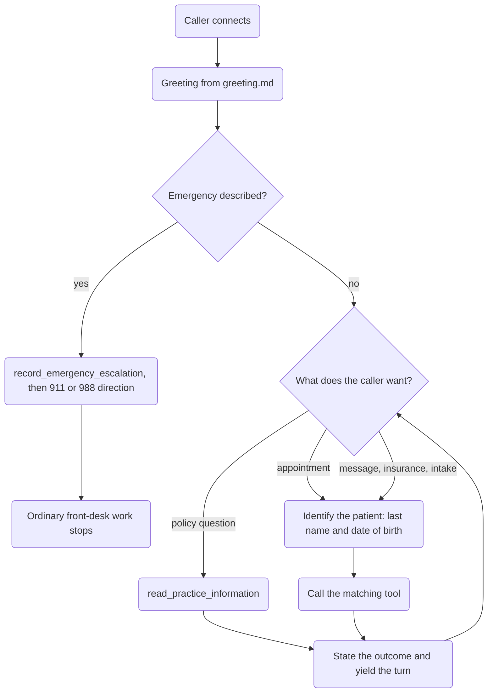

# Reference: Recipes & Workflows

Step-by-step developer recipes, including translators, IVR menus, content filters, and recording consent.

- **Total pages in this section**: 32
- **Successful retrieves**: 31
- **API References / Placeholders**: 1

## Table of Contents

1. [reference/recipes/](#page-1) (✗)
2. [reference/recipes/context_variables](#page-2) (✓)
3. [reference/recipes/interrupt_user](#page-3) (✓)
4. [reference/recipes/llm_powered_content_filter](#page-4) (✓)
5. [reference/recipes/simple_content_filter](#page-5) (✓)
6. [reference/recipes/replacing_llm_output](#page-6) (✓)
7. [reference/recipes/metrics_llm](#page-7) (✓)
8. [reference/recipes/http_mcp_client](#page-8) (✓)
9. [reference/recipes/uninterruptable](#page-9) (✓)
10. [reference/recipes/changing_language](#page-10) (✓)
11. [reference/recipes/transcriber](#page-11) (✓)
12. [reference/recipes/pipeline_translator](#page-12) (✓)
13. [reference/recipes/tts_translator](#page-13) (✓)
14. [reference/recipes/metrics_stt](#page-14) (✓)
15. [reference/recipes/metrics_vad](#page-15) (✓)
16. [reference/recipes/ivr-navigator](#page-16) (✓)
17. [reference/recipes/company-directory](#page-17) (✓)
18. [reference/recipes/recording-consent](#page-18) (✓)
19. [reference/recipes/make_call](#page-19) (✓)
20. [reference/recipes/sip_lifecycle](#page-20) (✓)
21. [reference/recipes/answer_call](#page-21) (✓)
22. [reference/recipes/survey_caller](#page-22) (✓)
23. [reference/recipes/tts_comparison](#page-23) (✓)
24. [reference/recipes/metrics_tts](#page-24) (✓)
25. [reference/recipes/playing_audio](#page-25) (✓)
26. [reference/recipes/repeater](#page-26) (✓)
27. [reference/recipes/gemini_live_vision](#page-27) (✓)
28. [reference/recipes/pi_zero_transcriber](#page-28) (✓)
29. [reference/recipes/spacexai-patient-intake](#page-29) (✓)
30. [reference/recipes/restaurant-agent](#page-30) (✓)
31. [reference/recipes/moviefone](#page-31) (✓)
32. [reference/recipes/metrics_realtime](#page-32) (✓)

---

<a name="page-1"></a>
## Page 1: reference/recipes/
**Original URL:** https://docs.livekit.io/reference/recipes/  
**Source MD URL:** https://docs.livekit.io/reference/recipes.md

> [!NOTE]
> API Reference or page content could not be fetched as raw markdown.
> View the live content directly at the original URL: [https://docs.livekit.io/reference/recipes/](https://docs.livekit.io/reference/recipes/).
> Detail: Failed with status code 404


---

<a name="page-2"></a>
## Page 2: reference/recipes/context_variables
**Original URL:** https://docs.livekit.io/reference/recipes/context_variables  
**Source MD URL:** https://docs.livekit.io/reference/recipes/context_variables.md

LiveKit docs › Recipes › Advanced LLM › Context Variables

---

# Context Variables

> Shows how to give an agent context about the user using simple variables.

This example shows how to personalize an agent's instructions with user-specific variables. The example injects name, age, and city into the prompt before the session starts.

## Prerequisites

- Add a `.env.local` in this directory with your LiveKit credentials:```
LIVEKIT_URL=your_livekit_url
LIVEKIT_API_KEY=your_api_key
LIVEKIT_API_SECRET=your_api_secret

```
- Install dependencies:```bash
pip install "livekit-agents" python-dotenv

```

## Load environment, logging, and define an AgentServer

Start by loading your environment variables and setting up logging. Define an `AgentServer` which wraps your application and handles the worker lifecycle.

```python
import logging
from dotenv import load_dotenv
from livekit.agents import JobContext, Agent, AgentSession, AgentServer, cli, inference

load_dotenv(".env.local")

logger = logging.getLogger("context-variables")
logger.setLevel(logging.INFO)

server = AgentServer()

```

## Create an agent that accepts context

Build a lightweight agent that formats its instructions with values from a dictionary. If context is passed, the prompt is customized before the agent starts.

```python
class ContextAgent(Agent):
    def __init__(self, context_vars=None) -> None:
        instructions = """
            You are a helpful agent. The user's name is {name}.
            They are {age} years old and live in {city}.
        """

        if context_vars:
            instructions = instructions.format(**context_vars)

        super().__init__(instructions=instructions)

    async def on_enter(self):
        self.session.generate_reply()

```

## Define the RTC session entrypoint

Create the context variables dictionary with user-specific data, then pass it to the agent when starting the session.

```python
@server.rtc_session(agent_name="my-agent")
async def entrypoint(ctx: JobContext):
    ctx.log_context_fields = {"room": ctx.room.name}

    context_variables = {
        "name": "Shayne",
        "age": 35,
        "city": "Toronto"
    }

    session = AgentSession(
        stt=inference.STT(model="deepgram/nova-3-general"),
        llm=inference.LLM(model="google/gemma-4-31b-it"),

        tts=inference.TTS(model="inworld/inworld-tts-2", voice="Ashley"),

        preemptive_generation=True,
    )

    await session.start(agent=ContextAgent(context_vars=context_variables), room=ctx.room)
    await ctx.connect()

```

## Run the server

```python
if __name__ == "__main__":
    cli.run_app(server)

```

## Run it

```bash
lk agent console context_variables.py

```

## How it works

1. Load environment variables and set up logging.
2. Format the agent's instructions with user-specific context variables.
3. Generate an immediate greeting using the personalized prompt when the agent enters.

## Full example

```python
import logging
from dotenv import load_dotenv
from livekit.agents import JobContext, Agent, AgentSession, AgentServer, cli, inference

load_dotenv(".env.local")

logger = logging.getLogger("context-variables")
logger.setLevel(logging.INFO)


class ContextAgent(Agent):
    def __init__(self, context_vars=None) -> None:
        instructions = """
            You are a helpful agent. The user's name is {name}.
            They are {age} years old and live in {city}.
        """

        if context_vars:
            instructions = instructions.format(**context_vars)

        super().__init__(instructions=instructions)

    async def on_enter(self):
        self.session.generate_reply()


server = AgentServer()


@server.rtc_session(agent_name="my-agent")
async def entrypoint(ctx: JobContext):
    ctx.log_context_fields = {"room": ctx.room.name}

    context_variables = {
        "name": "Shayne",
        "age": 35,
        "city": "Toronto"
    }

    session = AgentSession(
        stt=inference.STT(model="deepgram/nova-3-general"),
        llm=inference.LLM(model="google/gemma-4-31b-it"),

        tts=inference.TTS(model="inworld/inworld-tts-2", voice="Ashley"),

        preemptive_generation=True,
    )

    await session.start(agent=ContextAgent(context_vars=context_variables), room=ctx.room)
    await ctx.connect()


if __name__ == "__main__":
    cli.run_app(server)

```

---

This document was rendered at 2026-08-28T04:22:10.560Z.
For the latest version of this document, see [https://docs.livekit.io/reference/recipes/context_variables.md](https://docs.livekit.io/reference/recipes/context_variables.md).

To explore all LiveKit documentation, see [llms.txt](https://docs.livekit.io/llms.txt).

---

<a name="page-3"></a>
## Page 3: reference/recipes/interrupt_user
**Original URL:** https://docs.livekit.io/reference/recipes/interrupt_user  
**Source MD URL:** https://docs.livekit.io/reference/recipes/interrupt_user.md

LiveKit docs › Recipes › Advanced LLM › Interrupt User

---

# Interrupt User

> Shows how to interrupt the user if they've spoken too much.

In this recipe you will interrupt a user who keeps talking. The agent counts sentences in the live transcript; when the buffer gets too long, it cuts in with `session.say` and disables interruptions for its response.

## Prerequisites

- Add a `.env.local` in this directory with your LiveKit credentials:```
LIVEKIT_URL=your_livekit_url
LIVEKIT_API_KEY=your_api_key
LIVEKIT_API_SECRET=your_api_secret

```
- Install dependencies:```bash
pip install "livekit-agents" python-dotenv

```

## Load configuration and logging

Load environment variables and configure logging for transcript debugging. We also initialize the `AgentServer`.

```python
import logging
import asyncio
import re
from dotenv import load_dotenv
from livekit.agents import JobContext, cli, Agent, AgentSession, AgentServer
from livekit.plugins import openai, deepgram
from livekit.agents.llm import ChatContext, ChatMessage

load_dotenv(".env.local")

logger = logging.getLogger("interrupt-user")
logger.setLevel(logging.INFO)

server = AgentServer()

```

## Define entrypoint

Inside the `rtc_session`, we configure the `AgentSession` with STT, LLM, and TTS.

```python
@server.rtc_session(agent_name="my-agent")
async def entrypoint(ctx: JobContext):
    session = AgentSession(
        stt=deepgram.STT(),
        llm=openai.responses.LLM(),
        tts=openai.TTS(),
    )
    agent = Agent(
        instructions="You are a helpful agent that politely interrupts users when they talk too much.",
    )
    # ...

```

## Count sentences in streaming transcripts

Maintain a rolling transcript buffer from `user_input_transcribed` events. Ignore final transcripts for counting; when the buffer exceeds the sentence limit, trigger an interruption.

```python
    def count_sentences(text):
        """Count the number of sentences in text"""
        sentences = re.findall(r'[^.!?]+[.!?](?:\s|$)', text)
        return len(sentences)
        
    transcript_buffer = ""
    max_sentences = 3

    @session.on("user_input_transcribed")
    def on_transcript(transcript):
        nonlocal transcript_buffer

        if transcript.is_final:
            logger.info(f"Received final transcript: {transcript.transcript}")
            return

        transcript_buffer += " " + transcript.transcript
        transcript_buffer = transcript_buffer.strip()

        if count_sentences(transcript_buffer) >= max_sentences:
            asyncio.create_task(handle_interruption(...))
            transcript_buffer = ""

```

## Interrupt with a focused prompt

Build a temporary `ChatContext` that summarizes what the user said and asks the LLM to redirect the conversation. Use `session.say(..., allow_interruptions=False)` so the user cannot talk over the interruption.

```python
    async def handle_interruption(context):
        await agent.update_chat_ctx(context)
        session.say("Sorry, can I pause you there?", allow_interruptions=False)
        await session.generate_reply(allow_interruptions=False)

```

```python
            interruption_ctx = ChatContext([
                ChatMessage(
                    type="message",
                    role="system",
                    content=["You are an agent that politely interrupts users who speak too much. Create a brief response that acknowledges what they've said so far, then redirects to get more focused information."]
                ),
                ChatMessage(type="message", role="user", content=[f"User has been speaking and said: {transcript_buffer}"])
            ])

```

## Reset on session start and start the session

Clear the buffer when the session starts, generate an opening reply, and launch the agent.

```python
    @session.on("session_start")
    def on_session_start():
        nonlocal transcript_buffer
        transcript_buffer = ""
        session.generate_reply()

    await session.start(agent=agent, room=ctx.room)
    await ctx.connect()

```

## Run it

Run the agent using the `console` command, which starts the agent in console mode.

```bash
lk agent console interrupt_user.py

```

## How it works

1. Streamed transcripts are buffered and counted per sentence.
2. When the buffer hits the threshold, the agent builds a focused prompt and interrupts via `session.say`.
3. `allow_interruptions=False` keeps the interruption audible; it is re-enabled for subsequent turns.
4. The buffer resets after each interruption so counting starts fresh.

## Full example

```python
import logging
import asyncio
import re
from dotenv import load_dotenv
from livekit.agents import JobContext, cli, Agent, AgentSession, AgentServer
from livekit.plugins import openai, deepgram
from livekit.agents.llm import ChatContext, ChatMessage

load_dotenv(".env.local")

logger = logging.getLogger("interrupt-user")
logger.setLevel(logging.INFO)

def count_sentences(text):
    """Count the number of sentences in text"""
    sentences = re.findall(r'[^.!?]+[.!?](?:\s|$)', text)
    return len(sentences)

server = AgentServer()

@server.rtc_session(agent_name="my-agent")
async def entrypoint(ctx: JobContext):
    session = AgentSession(
        stt=deepgram.STT(),
        llm=openai.responses.LLM(),
        tts=openai.TTS(),
    )
    agent = Agent(
        instructions="You are a helpful agent that politely interrupts users when they talk too much.",
    )

    async def handle_interruption(context):
        await agent.update_chat_ctx(context)
        session.say("Sorry, can I pause you there?", allow_interruptions=False)
        await session.generate_reply(allow_interruptions=False)

    transcript_buffer = ""
    max_sentences = 3

    @session.on("user_input_transcribed")
    def on_transcript(transcript):
        nonlocal transcript_buffer

        if transcript.is_final:
            logger.info(f"Received final transcript: {transcript.transcript}")
            return

        transcript_buffer += " " + transcript.transcript
        transcript_buffer = transcript_buffer.strip()

        logger.info(f"Buffer: {transcript_buffer}")

        sentence_count = count_sentences(transcript_buffer)
        logger.info(f"Sentence count: {sentence_count}")

        if sentence_count >= max_sentences:
            logger.info("Interrupting user...")

            interruption_ctx = ChatContext([
                ChatMessage(
                    type="message",
                    role="system",
                    content=["You are an agent that politely interrupts users who speak too much. Create a brief response that acknowledges what they've said so far, then redirects to get more focused information."]
                ),
                ChatMessage(type="message", role="user", content=[f"User has been speaking and said: {transcript_buffer}"])
            ])

            asyncio.create_task(handle_interruption(interruption_ctx))
            transcript_buffer = ""

    @session.on("session_start")
    def on_session_start():
        nonlocal transcript_buffer
        transcript_buffer = ""
        session.generate_reply()

    await session.start(agent=agent, room=ctx.room)
    await ctx.connect()

if __name__ == "__main__":
    cli.run_app(server)

```

---

This document was rendered at 2026-08-28T04:22:10.541Z.
For the latest version of this document, see [https://docs.livekit.io/reference/recipes/interrupt_user.md](https://docs.livekit.io/reference/recipes/interrupt_user.md).

To explore all LiveKit documentation, see [llms.txt](https://docs.livekit.io/llms.txt).

---

<a name="page-4"></a>
## Page 4: reference/recipes/llm_powered_content_filter
**Original URL:** https://docs.livekit.io/reference/recipes/llm_powered_content_filter  
**Source MD URL:** https://docs.livekit.io/reference/recipes/llm_powered_content_filter.md

LiveKit docs › Recipes › Advanced LLM › LLM Content Filter

---

# LLM-Powered Content Filter

> Content filter using a separate LLM for real-time moderation decisions

This example shows how to filter the LLM's output with a second moderation model. The agent buffers sentences from the main LLM stream, checks them with a moderator LLM, and only forwards safe text to the TTS.

## Prerequisites

- Add a `.env.local` in this directory with your LiveKit credentials:```
LIVEKIT_URL=your_livekit_url
LIVEKIT_API_KEY=your_api_key
LIVEKIT_API_SECRET=your_api_secret
OPENAI_API_KEY=your_openai_key

```
- Install dependencies:```bash
pip install "livekit-agents" livekit-plugins-openai python-dotenv

```

## Load configuration and logging

Load environment variables and configure logging for monitoring moderation decisions.

```python
import logging
import asyncio
from typing import Optional, Any
from dotenv import load_dotenv
from livekit.agents import JobContext, Agent, AgentSession, inference, AgentServer, cli
from livekit.plugins import openai
from livekit.agents.llm import ChatContext, ChatMessage

load_dotenv(".env.local")

logger = logging.getLogger("complex-content-filter")
logger.setLevel(logging.INFO)

server = AgentServer()

```

## Create the dual-LLM agent

The agent keeps a separate moderator LLM for content checks. The main LLM for responses is provided through the AgentSession using LiveKit inference, while the moderator uses the OpenAI plugin directly for fine-grained control.

```python
class ContentFilterAgent(Agent):
    def __init__(self) -> None:
        super().__init__(instructions="You are a helpful agent.")
        self.moderator_llm = openai.responses.LLM(model="gpt-4o-mini")

    async def on_enter(self):
        self.session.generate_reply()

```

## Evaluate content with a moderator prompt

Send candidate text to the moderator LLM with a strict system prompt that returns only APPROPRIATE/INAPPROPRIATE. Parse the streamed response and return a boolean.

```python
    async def evaluate_content(self, text: str) -> bool:
        moderation_ctx = ChatContext([
            ChatMessage(type="message", role="system", content=["You are a content moderator. Respond ONLY with 'APPROPRIATE' or 'INAPPROPRIATE'. Respond with 'INAPPROPRIATE' if the text mentions strawberries."]),
            ChatMessage(type="message", role="user", content=[f"Evaluate: {text}"])
        ])

        response = ""
        async with self.moderator_llm.chat(chat_ctx=moderation_ctx) as stream:
            async for chunk in stream:
                content = getattr(chunk.delta, "content", None) if hasattr(chunk, "delta") else str(chunk)
                if content:
                    response += content

        return "INAPPROPRIATE" not in response.strip().upper()

```

## Extract content from streamed chunks

This helper normalizes string vs delta-based chunks from the main LLM stream.

```python
    def _extract_content(self, chunk: Any) -> Optional[str]:
        if not chunk:
            return None
        if isinstance(chunk, str):
            return chunk
        if hasattr(chunk, "delta"):
            return getattr(chunk.delta, "content", None)
        return None

```

## Override llm_node to buffer and filter

Buffer text until a sentence-ending punctuation appears. When a sentence completes, send it to the moderator; if approved, yield buffered chunks downstream, otherwise drop them.

```python
    async def llm_node(self, chat_ctx, tools, model_settings=None):
        async def process_stream():
            buffer = ""
            chunk_buffer = []
            sentence_end_chars = {".", "!", "?"}

            async with self.session.llm.chat(chat_ctx=chat_ctx, tools=tools, tool_choice=None) as stream:
                try:
                    async for chunk in stream:
                        content = self._extract_content(chunk)
                        chunk_buffer.append(chunk)

                        if content:
                            buffer += content

                            if any(char in buffer for char in sentence_end_chars):
                                last_end = max(buffer.rfind(char) for char in sentence_end_chars if char in buffer)
                                if last_end != -1:
                                    sentence = buffer[:last_end + 1]
                                    buffer = buffer[last_end + 1:]

                                    if not await self.evaluate_content(sentence):
                                        yield "Content filtered."
                                        return

                                    for buffered_chunk in chunk_buffer:
                                        yield buffered_chunk
                                    chunk_buffer = []

                    if buffer and any(buffer.endswith(char) for char in sentence_end_chars):
                        if not await self.evaluate_content(buffer):
                            yield "Content filtered."
                            return
                        for buffered_chunk in chunk_buffer:
                            yield buffered_chunk

                except asyncio.CancelledError:
                    raise
                except Exception as e:
                    logger.error(f"Error in content filtering: {str(e)}")
                    yield "[Error in content filtering]"

        return process_stream()

```

## Set up the session

Configure the AgentSession with LiveKit inference for STT, LLM, and TTS. The main LLM is accessed via `self.session.llm` in the `llm_node` override.

```python
@server.rtc_session(agent_name="my-agent")
async def entrypoint(ctx: JobContext):
    ctx.log_context_fields = {"room": ctx.room.name}

    session = AgentSession(
        stt=inference.STT(model="deepgram/nova-3-general"),
        llm=inference.LLM(model="google/gemma-4-31b-it"),

        tts=inference.TTS(model="inworld/inworld-tts-2", voice="Ashley"),

        preemptive_generation=True,
    )
    agent = ContentFilterAgent()

    await session.start(agent=agent, room=ctx.room)
    await ctx.connect()

```

## Run the server

Start the agent server with the CLI.

```python
if __name__ == "__main__":
    cli.run_app(server)

```

## Run it

```console
lk agent console llm_powered_content_filter.py

```

## How it works

1. The main LLM streams responses via LiveKit inference; chunks are buffered until a sentence completes.
2. The moderator LLM (using the OpenAI plugin directly) judges the buffered text; unsafe content is dropped.
3. Safe chunks are replayed to the downstream pipeline (and then to TTS).
4. The agent owns the moderator LLM separately from the session's main LLM.

## Full example

```python
import logging
import asyncio
from typing import Optional, Any
from dotenv import load_dotenv
from livekit.agents import JobContext, Agent, AgentSession, inference, AgentServer, cli
from livekit.plugins import openai
from livekit.agents.llm import ChatContext, ChatMessage

load_dotenv(".env.local")

logger = logging.getLogger("complex-content-filter")
logger.setLevel(logging.INFO)

class ContentFilterAgent(Agent):
    def __init__(self) -> None:
        super().__init__(instructions="You are a helpful agent.")
        self.moderator_llm = inference.LLM(model="google/gemma-4-31b-it")

    async def evaluate_content(self, text: str) -> bool:
        """Evaluate if content is appropriate using a separate LLM."""
        moderation_ctx = ChatContext([
            ChatMessage(
                type="message",
                role="system",
                content=["You are a content moderator. Respond ONLY with 'APPROPRIATE' or 'INAPPROPRIATE'. Respond with 'INAPPROPRIATE' if the text mentions strawberries."]
            ),
            ChatMessage(type="message", role="user", content=[f"Evaluate: {text}"])
        ])

        response = ""
        async with self.moderator_llm.chat(chat_ctx=moderation_ctx) as stream:
            async for chunk in stream:
                if not chunk:
                    continue
                content = getattr(chunk.delta, 'content', None) if hasattr(chunk, 'delta') else str(chunk)
                if content:
                    response += content

        response = response.strip().upper()
        logger.info(f"Moderation response for '{text}': {response}")
        return "INAPPROPRIATE" not in response

    async def on_enter(self):
        self.session.generate_reply()

    def _extract_content(self, chunk: Any) -> Optional[str]:
        """Extract content from a chunk, handling different chunk formats."""
        if not chunk:
            return None
        if isinstance(chunk, str):
            return chunk
        if hasattr(chunk, 'delta'):
            return getattr(chunk.delta, 'content', None)
        return None

    async def llm_node(self, chat_ctx, tools, model_settings=None):
        async def process_stream():
            buffer = ""
            chunk_buffer = []
            sentence_end_chars = {'.', '!', '?'}

            async with self.session.llm.chat(chat_ctx=chat_ctx, tools=tools, tool_choice=None) as stream:
                try:
                    async for chunk in stream:
                        content = self._extract_content(chunk)
                        chunk_buffer.append(chunk)

                        if content:
                            buffer += content

                            if any(char in buffer for char in sentence_end_chars):
                                last_end = max(buffer.rfind(char) for char in sentence_end_chars if char in buffer)
                                if last_end != -1:
                                    sentence = buffer[:last_end + 1]
                                    buffer = buffer[last_end + 1:]

                                    if not await self.evaluate_content(sentence):
                                        yield "Content filtered."
                                        return

                                    for buffered_chunk in chunk_buffer:
                                        yield buffered_chunk
                                    chunk_buffer = []

                    if buffer and any(buffer.endswith(char) for char in sentence_end_chars):
                        if not await self.evaluate_content(buffer):
                            yield "Content filtered."
                            return
                        for buffered_chunk in chunk_buffer:
                            yield buffered_chunk

                except asyncio.CancelledError:
                    raise
                except Exception as e:
                    logger.error(f"Error in content filtering: {str(e)}")
                    yield "[Error in content filtering]"

        return process_stream()

server = AgentServer()

@server.rtc_session(agent_name="my-agent")
async def entrypoint(ctx: JobContext):
    ctx.log_context_fields = {"room": ctx.room.name}

    session = AgentSession(
        stt=inference.STT(model="deepgram/nova-3-general"),
        llm=inference.LLM(model="google/gemma-4-31b-it"),

        tts=inference.TTS(model="inworld/inworld-tts-2", voice="Ashley"),

        preemptive_generation=True,
    )
    agent = ContentFilterAgent()

    await session.start(agent=agent, room=ctx.room)
    await ctx.connect()

if __name__ == "__main__":
    cli.run_app(server)

```

---

This document was rendered at 2026-08-28T04:22:10.581Z.
For the latest version of this document, see [https://docs.livekit.io/reference/recipes/llm_powered_content_filter.md](https://docs.livekit.io/reference/recipes/llm_powered_content_filter.md).

To explore all LiveKit documentation, see [llms.txt](https://docs.livekit.io/llms.txt).

---

<a name="page-5"></a>
## Page 5: reference/recipes/simple_content_filter
**Original URL:** https://docs.livekit.io/reference/recipes/simple_content_filter  
**Source MD URL:** https://docs.livekit.io/reference/recipes/simple_content_filter.md

LiveKit docs › Recipes › Advanced LLM › Simple Content Filter

---

# Simple Content Filter

> Basic keyword-based content filter with inline replacement

This example demonstrates how to implement a basic content filter by overriding the `llm_node` method. The filter scans the LLM's streaming output for specific keywords and replaces matching chunks with a filtered message. This is a simple approach to content moderation in voice agents.

## Prerequisites

- Add a `.env.local` in this directory with your LiveKit credentials:```
LIVEKIT_URL=your_livekit_url
LIVEKIT_API_KEY=your_api_key
LIVEKIT_API_SECRET=your_api_secret

```
- Install dependencies:```bash
pip install "livekit-agents[deepgram,openai]" python-dotenv

```

## Set up logging and create the AgentServer

Load environment variables and configure logging. Create an AgentServer to manage the agent lifecycle.

```python
import logging
from dotenv import load_dotenv
from livekit.agents import AgentServer, AgentSession, JobContext, cli, Agent, inference

load_dotenv(".env.local")

logger = logging.getLogger("simple-content-filter")
logger.setLevel(logging.INFO)

server = AgentServer()

```

## Define the agent with a custom LLM node

Keep the Agent lightweight with just instructions. The custom `llm_node` override processes the streaming LLM output and checks each chunk for offensive terms, replacing matches with a filtered message.

```python
class SimpleAgent(Agent):
    def __init__(self) -> None:
        super().__init__(
            instructions="""
                You are a helpful agent.
            """,
        )

    async def on_enter(self):
        self.session.generate_reply()

    async def llm_node(
        self, chat_ctx, tools, model_settings=None
    ):
        async def process_stream():
            async with self.llm.chat(chat_ctx=chat_ctx, tools=tools, tool_choice=None) as stream:
                async for chunk in stream:
                    if chunk is None:
                        continue

                    content = getattr(chunk.delta, 'content', None) if hasattr(chunk, 'delta') else str(chunk)
                    if content is None:
                        yield chunk
                        continue

                    offensive_terms = ['fail']
                    print(content)
                    yield "CONTENT FILTERED" if any(term in content.lower() for term in offensive_terms) else chunk

        return process_stream()

```

## Define the RTC session entrypoint

Create the AgentSession with STT, LLM, and TTS configured. The models are defined here in the session rather than in the agent, keeping the agent lightweight.

```python
@server.rtc_session(agent_name="my-agent")
async def entrypoint(ctx: JobContext):
    ctx.log_context_fields = {"room": ctx.room.name}

    session = AgentSession(
        stt=inference.STT(model="deepgram/nova-3", language="en"),
        llm=inference.LLM(model="google/gemma-4-31b-it"),
        tts=inference.TTS(
            model="inworld/inworld-tts-2",
            voice="Ashley"
        ),
        preemptive_generation=True,
    )
    agent = SimpleAgent()

    await session.start(agent=agent, room=ctx.room)
    await ctx.connect()

```

## Run the server

The `cli.run_app()` function starts the agent server, manages the worker lifecycle, and processes incoming jobs.

```python
if __name__ == "__main__":
    cli.run_app(server)

```

## Run it

Run the agent using the `console` command for local testing with a mocked room:

```bash
lk agent console simple_content_filter.py

```

To test with a real LiveKit room, use dev mode:

```bash
lk agent dev simple_content_filter.py

```

## How it works

1. When the user speaks, their audio is transcribed and sent to the LLM.
2. The custom `llm_node` intercepts the LLM's streaming response.
3. Each chunk is checked against a list of offensive terms (in this case, just "fail").
4. If a term is found, the chunk is replaced with "CONTENT FILTERED".
5. Clean chunks pass through unchanged to the TTS for speech synthesis.

## Full example

```python
import logging
from dotenv import load_dotenv
from livekit.agents import AgentServer, AgentSession, JobContext, cli, Agent, inference

load_dotenv(".env.local")

logger = logging.getLogger("simple-content-filter")
logger.setLevel(logging.INFO)

class SimpleAgent(Agent):
    def __init__(self) -> None:
        super().__init__(
            instructions="""
                You are a helpful agent.
            """,
        )

    async def on_enter(self):
        self.session.generate_reply()

    async def llm_node(
        self, chat_ctx, tools, model_settings=None
    ):
        async def process_stream():
            async with self.llm.chat(chat_ctx=chat_ctx, tools=tools, tool_choice=None) as stream:
                async for chunk in stream:
                    if chunk is None:
                        continue

                    content = getattr(chunk.delta, 'content', None) if hasattr(chunk, 'delta') else str(chunk)
                    if content is None:
                        yield chunk
                        continue

                    offensive_terms = ['fail']
                    print(content)
                    yield "CONTENT FILTERED" if any(term in content.lower() for term in offensive_terms) else chunk

        return process_stream()

server = AgentServer()

@server.rtc_session(agent_name="my-agent")
async def entrypoint(ctx: JobContext):
    ctx.log_context_fields = {"room": ctx.room.name}

    session = AgentSession(
        stt=inference.STT(model="deepgram/nova-3", language="en"),
        llm=inference.LLM(model="google/gemma-4-31b-it"),
        tts=inference.TTS(

            model="inworld/inworld-tts-2", 
            voice="Ashley"

        ),
        preemptive_generation=True,
    )
    agent = SimpleAgent()

    await session.start(agent=agent, room=ctx.room)
    await ctx.connect()

if __name__ == "__main__":
    cli.run_app(server)

```

---

This document was rendered at 2026-08-28T04:22:10.659Z.
For the latest version of this document, see [https://docs.livekit.io/reference/recipes/simple_content_filter.md](https://docs.livekit.io/reference/recipes/simple_content_filter.md).

To explore all LiveKit documentation, see [llms.txt](https://docs.livekit.io/llms.txt).

---

<a name="page-6"></a>
## Page 6: reference/recipes/replacing_llm_output
**Original URL:** https://docs.livekit.io/reference/recipes/replacing_llm_output  
**Source MD URL:** https://docs.livekit.io/reference/recipes/replacing_llm_output.md

LiveKit docs › Recipes › Advanced LLM › LLM Output Replacement

---

# LLM Output Replacement

> Remove chain-of-thought reasoning blocks from a streaming LLM response before they reach TTS.

This recipe shows how to remove chain-of-thought reasoning from a streaming LLM response before it reaches TTS. The agent overrides `llm_node` to remove `<think>...</think>` blocks, so only the final answer reaches both speech and chat history. The same buffered state-machine pattern works for other inline markup you want removed from chat context, like RAG citation markers or structured-output scaffolding.

> ℹ️ **Note**
> 
> If you only need to change pronunciation or remove Markdown for TTS (without modifying chat context), see [`tts_text_transforms`](https://docs.livekit.io/agents/multimodality/text.md#text-transforms). The technique below is for cases where the change should also persist in conversation history.

## Prerequisites

To complete this guide, you need the following prerequisites:

- Create an agent using the [Voice AI quickstart](https://docs.livekit.io/agents/start/voice-ai.md).

## Define the agent

The system prompt instructs the model to wrap its reasoning in `<think>...</think>` tags.

```python
class SimpleAgent(Agent):
    THINK_OPEN = "<think>"
    THINK_CLOSE = "</think>"

    def __init__(self) -> None:
        super().__init__(
            instructions=(
                "You are a helpful agent that thinks through problems step by step. "
                "Wrap your reasoning in <think></think> tags, then provide your final answer."
            ),
        )

    async def on_enter(self):
        self.session.generate_reply()

```

## Filter thinking blocks in llm_node

Override `llm_node` to wrap the LLM stream with a state machine. An `in_thinking` flag tracks whether the stream is currently inside a `<think>` block, and a small buffer holds back trailing characters that could be the start of a tag split across chunks.

`self.session.llm.chat(...)` invokes whichever LLM you configured on `AgentSession`, so this filter works with any model — including reasoning models that emit `<think>` blocks natively.

```python
    async def llm_node(self, chat_ctx, tools, model_settings=None):
        async def process_stream():
            in_thinking = False
            buffer = ""

            async with self.session.llm.chat(
                chat_ctx=chat_ctx, tools=tools, tool_choice=None
            ) as stream:
                async for chunk in stream:
                    content = (
                        getattr(chunk.delta, "content", None)
                        if hasattr(chunk, "delta")
                        else None
                    )
                    if content is None:
                        yield chunk
                        continue

                    buffer += content
                    output = ""

                    while buffer:
                        if not in_thinking:
                            idx = buffer.find(self.THINK_OPEN)
                            if idx >= 0:
                                output += buffer[:idx]
                                buffer = buffer[idx + len(self.THINK_OPEN) :]
                                in_thinking = True
                                continue
                            # Hold back any trailing characters that could start "<think>".
                            keep = next(
                                (
                                    i
                                    for i in range(len(self.THINK_OPEN) - 1, 0, -1)
                                    if buffer.endswith(self.THINK_OPEN[:i])
                                ),
                                0,
                            )
                            output += buffer[: len(buffer) - keep]
                            buffer = buffer[len(buffer) - keep :]
                            break
                        else:
                            idx = buffer.find(self.THINK_CLOSE)
                            if idx >= 0:
                                buffer = buffer[idx + len(self.THINK_CLOSE) :]
                                in_thinking = False
                                continue
                            # Drop thinking text but hold back any trailing partial "</think>".
                            keep = next(
                                (
                                    i
                                    for i in range(len(self.THINK_CLOSE) - 1, 0, -1)
                                    if buffer.endswith(self.THINK_CLOSE[:i])
                                ),
                                0,
                            )
                            buffer = buffer[len(buffer) - keep :]
                            break

                    if (
                        output
                        and hasattr(chunk, "delta")
                        and hasattr(chunk.delta, "content")
                    ):
                        chunk.delta.content = output
                        yield chunk

        return process_stream()

```

## Run it

```bash
lk agent console

```

## How it works

1. The LLM streams its response one chunk at a time, with reasoning wrapped in `<think>...</think>`.
2. The custom `llm_node` wraps that stream with a state machine. An `in_thinking` flag tracks whether the stream is currently inside a `<think>` block, and a small buffer holds back trailing characters that could be the start of a tag split across chunks.
3. While outside a thinking block, the filter emits text and only buffers a trailing partial prefix of `<think>`. When the full opening tag arrives, the filter switches into thinking mode.
4. While inside a thinking block, the filter drops text and only buffers a trailing partial prefix of `</think>`. When the closing tag arrives, the filter switches back to passing text through.
5. TTS receives only the cleaned chunks, and the chat history persisted by the session contains the same cleaned text. The filter removes the reasoning from both surfaces in one pass.

## Full example

```python
import logging
from dotenv import load_dotenv
from livekit.agents import (
    Agent,
    AgentServer,
    AgentSession,
    JobContext,
    cli,
    inference,
)

load_dotenv(".env.local")

logger = logging.getLogger("replacing-llm-output")
logger.setLevel(logging.INFO)


class SimpleAgent(Agent):
    THINK_OPEN = "<think>"
    THINK_CLOSE = "</think>"

    def __init__(self) -> None:
        super().__init__(
            instructions=(
                "You are a helpful agent that thinks through problems step by step. "
                "Wrap your reasoning in <think></think> tags, then provide your final answer."
            ),
        )

    async def on_enter(self):
        self.session.generate_reply()

    async def llm_node(self, chat_ctx, tools, model_settings=None):
        async def process_stream():
            in_thinking = False
            buffer = ""

            async with self.session.llm.chat(
                chat_ctx=chat_ctx, tools=tools, tool_choice=None
            ) as stream:
                async for chunk in stream:
                    content = (
                        getattr(chunk.delta, "content", None)
                        if hasattr(chunk, "delta")
                        else None
                    )
                    if content is None:
                        yield chunk
                        continue

                    buffer += content
                    output = ""

                    while buffer:
                        if not in_thinking:
                            idx = buffer.find(self.THINK_OPEN)
                            if idx >= 0:
                                output += buffer[:idx]
                                buffer = buffer[idx + len(self.THINK_OPEN) :]
                                in_thinking = True
                                continue
                            keep = next(
                                (
                                    i
                                    for i in range(len(self.THINK_OPEN) - 1, 0, -1)
                                    if buffer.endswith(self.THINK_OPEN[:i])
                                ),
                                0,
                            )
                            output += buffer[: len(buffer) - keep]
                            buffer = buffer[len(buffer) - keep :]
                            break
                        else:
                            idx = buffer.find(self.THINK_CLOSE)
                            if idx >= 0:
                                buffer = buffer[idx + len(self.THINK_CLOSE) :]
                                in_thinking = False
                                continue
                            keep = next(
                                (
                                    i
                                    for i in range(len(self.THINK_CLOSE) - 1, 0, -1)
                                    if buffer.endswith(self.THINK_CLOSE[:i])
                                ),
                                0,
                            )
                            buffer = buffer[len(buffer) - keep :]
                            break

                    if (
                        output
                        and hasattr(chunk, "delta")
                        and hasattr(chunk.delta, "content")
                    ):
                        chunk.delta.content = output
                        yield chunk

        return process_stream()


server = AgentServer()


@server.rtc_session(agent_name="my-agent")
async def entrypoint(ctx: JobContext):
    ctx.log_context_fields = {"room": ctx.room.name}

    session = AgentSession(
        stt=inference.STT(model="deepgram/nova-3", language="multi"),
        llm=inference.LLM(model="google/gemma-4-31b-it"),
        tts=inference.TTS(
            model="inworld/inworld-tts-2",
            voice="Ashley",
        ),
        preemptive_generation=True,
    )

    await session.start(agent=SimpleAgent(), room=ctx.room)
    await ctx.connect()


if __name__ == "__main__":
    cli.run_app(server)

```

---

This document was rendered at 2026-08-28T04:22:10.590Z.
For the latest version of this document, see [https://docs.livekit.io/reference/recipes/replacing_llm_output.md](https://docs.livekit.io/reference/recipes/replacing_llm_output.md).

To explore all LiveKit documentation, see [llms.txt](https://docs.livekit.io/llms.txt).

---

<a name="page-7"></a>
## Page 7: reference/recipes/metrics_llm
**Original URL:** https://docs.livekit.io/reference/recipes/metrics_llm  
**Source MD URL:** https://docs.livekit.io/reference/recipes/metrics_llm.md

LiveKit docs › Recipes › Advanced LLM › LLM Metrics

---

# LLM Metrics

> Shows how to use the LLM metrics to log metrics to the console for all of the different LLM models.

This example shows how to capture token and latency metrics emitted by the LLM pipeline and print them as a Rich table whenever the agent responds. It's a quick way to see prompt/response token counts and time-to-first-token during a live call.

> ℹ️ **Note**
> 
> This recipe uses the per-plugin `metrics_collected` event on the LLM instance. This per-component surface is not deprecated. A separate session-level `metrics_collected` event (`session.on("metrics_collected", ...)`) is deprecated. For session-scoped cost and usage tracking, see [Session usage](https://docs.livekit.io/deploy/observability/data.md#session-usage).

## Prerequisites

- Add a `.env.local` in this directory with your LiveKit and OpenAI credentials:```
LIVEKIT_URL=your_livekit_url
LIVEKIT_API_KEY=your_api_key
LIVEKIT_API_SECRET=your_api_secret
OPENAI_API_KEY=your_openai_key

```
- Install dependencies:```bash
pip install python-dotenv rich "livekit-agents"

```

## Load configuration and logging

Set up dotenv, a logger, and a Rich console for the metrics table.

```python
import logging
import asyncio
from dotenv import load_dotenv
from livekit.agents import JobContext, Agent, AgentSession, inference, AgentServer, cli
from livekit.agents.metrics import LLMMetrics
from rich.console import Console
from rich.table import Table
from rich import box
from datetime import datetime

load_dotenv(".env.local")

logger = logging.getLogger("metrics-llm")
logger.setLevel(logging.INFO)

console = Console()

server = AgentServer()

```

## Create the metrics-enabled agent

Keep the agent lightweight with just instructions. In `on_enter`, attach an `on("metrics_collected")` listener to the session's LLM so every response triggers your metrics handler.

```python
class LLMMetricsAgent(Agent):
    def __init__(self) -> None:
        super().__init__(
            instructions="""
                You are a helpful agent.
            """
        )

    async def on_enter(self):
        def sync_wrapper(metrics: LLMMetrics):
            asyncio.create_task(self.on_metrics_collected(metrics))

        self.session.llm.on("metrics_collected", sync_wrapper)
        self.session.generate_reply()

```

## Render metrics with Rich

When metrics arrive, format them into a table with timestamps, TTFT, durations, and token counts.

```python
    async def on_metrics_collected(self, metrics: LLMMetrics) -> None:
        table = Table(
            title="[bold blue]LLM Metrics Report[/bold blue]",
            box=box.ROUNDED,
            highlight=True,
            show_header=True,
            header_style="bold cyan"
        )

        table.add_column("Metric", style="bold green")
        table.add_column("Value", style="yellow")

        timestamp = datetime.fromtimestamp(metrics.timestamp).strftime('%Y-%m-%d %H:%M:%S')

        table.add_row("Type", str(metrics.type))
        table.add_row("Label", str(metrics.label))
        table.add_row("Request ID", str(metrics.request_id))
        table.add_row("Timestamp", timestamp)
        table.add_row("Duration", f"[white]{metrics.duration:.4f}[/white]s")
        table.add_row("Time to First Token", f"[white]{metrics.ttft:.4f}[/white]s")
        table.add_row("Cancelled", "✓" if metrics.cancelled else "✗")
        table.add_row("Completion Tokens", str(metrics.completion_tokens))
        table.add_row("Prompt Tokens", str(metrics.prompt_tokens))
        table.add_row("Total Tokens", str(metrics.total_tokens))
        table.add_row("Tokens/Second", f"{metrics.tokens_per_second:.2f}")

        console.print("\n")
        console.print(table)
        console.print("\n")

```

## Set up the session

Configure the AgentSession with STT, LLM, and TTS. The LLM's metrics events will be captured by the listener attached in `on_enter`.

```python
@server.rtc_session(agent_name="my-agent")
async def entrypoint(ctx: JobContext):
    ctx.log_context_fields = {"room": ctx.room.name}

    session = AgentSession(
        stt=inference.STT(model="deepgram/nova-3-general"),
        llm=inference.LLM(model="google/gemma-4-31b-it"),

        tts=inference.TTS(model="inworld/inworld-tts-2", voice="Ashley"),

        preemptive_generation=True,
    )
    agent = LLMMetricsAgent()

    await session.start(agent=agent, room=ctx.room)
    await ctx.connect()

```

## Run the server

Start the agent server with the CLI.

```python
if __name__ == "__main__":
    cli.run_app(server)

```

## Run it

```console
lk agent console metrics_llm.py

```

## How it works

1. The agent runs with standard STT/LLM/TTS.
2. The LLM emits `metrics_collected` after each generation.
3. A wrapper in `on_enter` schedules `on_metrics_collected` so you can await inside it.
4. Rich renders the metrics in a readable table showing latency and token stats.

## Full example

```python
import logging
import asyncio
from dotenv import load_dotenv
from livekit.agents import JobContext, Agent, AgentSession, inference, AgentServer, cli
from livekit.agents.metrics import LLMMetrics
from rich.console import Console
from rich.table import Table
from rich import box
from datetime import datetime

load_dotenv(".env.local")

logger = logging.getLogger("metrics-llm")
logger.setLevel(logging.INFO)

console = Console()

class LLMMetricsAgent(Agent):
    def __init__(self) -> None:
        super().__init__(
            instructions="""
                You are a helpful agent.
            """
        )

    async def on_enter(self):
        def sync_wrapper(metrics: LLMMetrics):
            asyncio.create_task(self.on_metrics_collected(metrics))

        self.session.llm.on("metrics_collected", sync_wrapper)
        self.session.generate_reply()

    async def on_metrics_collected(self, metrics: LLMMetrics) -> None:
        table = Table(
            title="[bold blue]LLM Metrics Report[/bold blue]",
            box=box.ROUNDED,
            highlight=True,
            show_header=True,
            header_style="bold cyan"
        )

        table.add_column("Metric", style="bold green")
        table.add_column("Value", style="yellow")

        timestamp = datetime.fromtimestamp(metrics.timestamp).strftime('%Y-%m-%d %H:%M:%S')

        table.add_row("Type", str(metrics.type))
        table.add_row("Label", str(metrics.label))
        table.add_row("Request ID", str(metrics.request_id))
        table.add_row("Timestamp", timestamp)
        table.add_row("Duration", f"[white]{metrics.duration:.4f}[/white]s")
        table.add_row("Time to First Token", f"[white]{metrics.ttft:.4f}[/white]s")
        table.add_row("Cancelled", "✓" if metrics.cancelled else "✗")
        table.add_row("Completion Tokens", str(metrics.completion_tokens))
        table.add_row("Prompt Tokens", str(metrics.prompt_tokens))
        table.add_row("Total Tokens", str(metrics.total_tokens))
        table.add_row("Tokens/Second", f"{metrics.tokens_per_second:.2f}")

        console.print("\n")
        console.print(table)
        console.print("\n")

server = AgentServer()

@server.rtc_session(agent_name="my-agent")
async def entrypoint(ctx: JobContext):
    ctx.log_context_fields = {"room": ctx.room.name}

    session = AgentSession(
        stt=inference.STT(model="deepgram/nova-3-general"),
        llm=inference.LLM(model="google/gemma-4-31b-it"),

        tts=inference.TTS(model="inworld/inworld-tts-2", voice="Ashley"),

        preemptive_generation=True,
    )
    agent = LLMMetricsAgent()

    await session.start(agent=agent, room=ctx.room)
    await ctx.connect()

if __name__ == "__main__":
    cli.run_app(server)

```

---

This document was rendered at 2026-08-28T04:22:10.609Z.
For the latest version of this document, see [https://docs.livekit.io/reference/recipes/metrics_llm.md](https://docs.livekit.io/reference/recipes/metrics_llm.md).

To explore all LiveKit documentation, see [llms.txt](https://docs.livekit.io/llms.txt).

---

<a name="page-8"></a>
## Page 8: reference/recipes/http_mcp_client
**Original URL:** https://docs.livekit.io/reference/recipes/http_mcp_client  
**Source MD URL:** https://docs.livekit.io/reference/recipes/http_mcp_client.md

LiveKit docs › Recipes › Advanced LLM › MCP Agent

---

# MCP Agent

> Shows how to use a LiveKit Agent as an MCP client.

This example demonstrates how to run an agent as an MCP (Model Context Protocol) client. It connects to an MCP server over HTTP, handles voice I/O, and lets the LLM call MCP tools to fetch data.

## Prerequisites

- Add a `.env.local` in this directory with your LiveKit credentials:```
LIVEKIT_URL=your_livekit_url
LIVEKIT_API_KEY=your_api_key
LIVEKIT_API_SECRET=your_api_secret

```
- Install dependencies:```bash
pip install "livekit-agents" python-dotenv

```

## Load environment, logging, and define an AgentServer

Start by importing the required modules including the MCP client. The `AgentServer` wraps your application and manages the worker lifecycle.

```python
import logging
from dotenv import load_dotenv
from livekit.agents import JobContext, Agent, AgentSession, AgentServer, cli, mcp

load_dotenv(".env.local")

logger = logging.getLogger("mcp-agent")
logger.setLevel(logging.INFO)

server = AgentServer()

```

## Define a minimal agent

Keep the agent simple — just instructions explaining that it can retrieve data via MCP. The MCP tools become available automatically through the session configuration. Generate a greeting when the agent enters.

```python
class MyAgent(Agent):
    def __init__(self) -> None:
        super().__init__(
            instructions=(
                "You can retrieve data via the MCP server. The interface is voice-based: "
                "accept spoken user queries and respond with synthesized speech."
            ),
        )

    async def on_enter(self):
        self.session.generate_reply()

```

## Define the RTC session entrypoint with MCP configuration

Create an `AgentSession` with inference strings for STT, LLM, and TTS. The `mcp_servers` parameter accepts a list of MCP server connections — here we use `MCPServerHTTP` to connect to a remote endpoint. The LLM will automatically discover and use the tools exposed by the MCP server.

```python
@server.rtc_session(agent_name="my-agent")
async def entrypoint(ctx: JobContext):
    ctx.log_context_fields = {"room": ctx.room.name}

    session = AgentSession(
        stt="deepgram/nova-3-general",
        llm="google/gemma-4-31b-it",
        tts="inworld/inworld-tts-2:Ashley",
        mcp_servers=[mcp.MCPServerHTTP(url="https://shayne.app/mcp")],
    )

    await session.start(agent=MyAgent(), room=ctx.room)
    await ctx.connect()

```

## Run the server

The `cli.run_app()` function starts the agent server and manages connections to LiveKit.

```python
if __name__ == "__main__":
    cli.run_app(server)

```

## Run it

```bash
lk agent console http_mcp_client.py

```

## How it works

1. The session connects to an MCP server over HTTP.
2. The LLM automatically discovers tools exposed by the MCP server and can call them to satisfy user requests.

## Full example

```python
import logging
from dotenv import load_dotenv
from livekit.agents import JobContext, Agent, AgentSession, AgentServer, cli, mcp

load_dotenv(".env.local")

logger = logging.getLogger("mcp-agent")
logger.setLevel(logging.INFO)


class MyAgent(Agent):
    def __init__(self) -> None:
        super().__init__(
            instructions=(
                "You can retrieve data via the MCP server. The interface is voice-based: "
                "accept spoken user queries and respond with synthesized speech."
            ),
        )

    async def on_enter(self):
        self.session.generate_reply()


server = AgentServer()


@server.rtc_session(agent_name="my-agent")
async def entrypoint(ctx: JobContext):
    ctx.log_context_fields = {"room": ctx.room.name}

    session = AgentSession(
        stt="deepgram/nova-3-general",
        llm="google/gemma-4-31b-it",
        tts="inworld/inworld-tts-2:Ashley",
        mcp_servers=[mcp.MCPServerHTTP(url="https://shayne.app/mcp")],
    )

    await session.start(agent=MyAgent(), room=ctx.room)
    await ctx.connect()


if __name__ == "__main__":
    cli.run_app(server)

```

---

This document was rendered at 2026-08-28T04:22:10.615Z.
For the latest version of this document, see [https://docs.livekit.io/reference/recipes/http_mcp_client.md](https://docs.livekit.io/reference/recipes/http_mcp_client.md).

To explore all LiveKit documentation, see [llms.txt](https://docs.livekit.io/llms.txt).

---

<a name="page-9"></a>
## Page 9: reference/recipes/uninterruptable
**Original URL:** https://docs.livekit.io/reference/recipes/uninterruptable  
**Source MD URL:** https://docs.livekit.io/reference/recipes/uninterruptable.md

LiveKit docs › Recipes › Voice Processing › Uninterruptable Agent

---

# Uninterruptable Agent

> Agent configured to complete responses without user interruptions

This example configures an agent to finish speaking even if the user talks over it by disabling interruptions. The agent also seeds the first user input so you can test the behavior immediately.

## Prerequisites

- Add a `.env.local` in this directory with your LiveKit credentials:```
LIVEKIT_URL=your_livekit_url
LIVEKIT_API_KEY=your_api_key
LIVEKIT_API_SECRET=your_api_secret

```
- Install dependencies:```bash
pip install "livekit-agents" python-dotenv

```

## Load configuration and create the AgentServer

Load environment variables so the audio plugins can authenticate. Create an AgentServer to manage sessions.

```python
from dotenv import load_dotenv
from livekit.agents import JobContext, AgentServer, cli, Agent, AgentSession, inference

load_dotenv(".env.local")

server = AgentServer()

```

## Create a non-interruptable agent

Set `allow_interruptions=False` when constructing the agent. The agent class is lightweight — only instructions and the interruption setting are defined here.

```python
class UninterruptableAgent(Agent):
    def __init__(self) -> None:
        super().__init__(
            instructions="""
                You are a helpful assistant communicating through voice who is not interruptable.
            """,
            allow_interruptions=False
        )

    async def on_enter(self):
        self.session.generate_reply(user_input="Say something somewhat long and boring so I can test if you're interruptable.")

```

## Create the RTC session entrypoint

Create an AgentSession with STT/LLM/TTS configured, start the session with the agent, and connect to the room.

```python
@server.rtc_session(agent_name="my-agent")
async def entrypoint(ctx: JobContext):
    ctx.log_context_fields = {"room": ctx.room.name}

    session = AgentSession(
        stt=inference.STT(model="deepgram/nova-3-general"),
        llm=inference.LLM(model="google/gemma-4-31b-it"),

        tts=inference.TTS(model="inworld/inworld-tts-2", voice="Ashley"),

        preemptive_generation=True,
    )

    await session.start(agent=UninterruptableAgent(), room=ctx.room)
    await ctx.connect()

```

## Run it

```console
lk agent console uninterruptable.py

```

## How it works

1. `allow_interruptions=False` keeps TTS playback intact even if new speech arrives.
2. `on_enter` seeds a first prompt so you can test the behavior without speaking first.
3. The rest of the media pipeline remains unchanged from a standard agent.
4. This setting is useful when you want to ensure an announcement completes before listening again.

## Full example

```python
from dotenv import load_dotenv
from livekit.agents import JobContext, AgentServer, cli, Agent, AgentSession, inference

load_dotenv(".env.local")

class UninterruptableAgent(Agent):
    def __init__(self) -> None:
        super().__init__(
            instructions="""
                You are a helpful assistant communicating through voice who is not interruptable.
            """,
            allow_interruptions=False
        )

    async def on_enter(self):
        self.session.generate_reply(user_input="Say something somewhat long and boring so I can test if you're interruptable.")

server = AgentServer()

@server.rtc_session(agent_name="my-agent")
async def entrypoint(ctx: JobContext):
    ctx.log_context_fields = {"room": ctx.room.name}

    session = AgentSession(
        stt=inference.STT(model="deepgram/nova-3-general"),
        llm=inference.LLM(model="google/gemma-4-31b-it"),

        tts=inference.TTS(model="inworld/inworld-tts-2", voice="Ashley"),

        preemptive_generation=True,
    )

    await session.start(agent=UninterruptableAgent(), room=ctx.room)
    await ctx.connect()

if __name__ == "__main__":
    cli.run_app(server)

```

---

This document was rendered at 2026-08-28T04:22:10.679Z.
For the latest version of this document, see [https://docs.livekit.io/reference/recipes/uninterruptable.md](https://docs.livekit.io/reference/recipes/uninterruptable.md).

To explore all LiveKit documentation, see [llms.txt](https://docs.livekit.io/llms.txt).

---

<a name="page-10"></a>
## Page 10: reference/recipes/changing_language
**Original URL:** https://docs.livekit.io/reference/recipes/changing_language  
**Source MD URL:** https://docs.livekit.io/reference/recipes/changing_language.md

LiveKit docs › Recipes › Voice Processing › Change Language

---

# ElevenLabs Change Language

> Shows how to use the ElevenLabs TTS model to change the language of the agent.

This example demonstrates how to build a multilingual voice agent that can switch between languages mid-call by updating ElevenLabs TTS and Deepgram STT on the fly. The agent greets callers in English, switches to Spanish, French, German, or Italian when asked, and replies with a native greeting in the new language.

## Prerequisites

- Add a `.env.local` in this directory with your LiveKit and provider credentials:```
LIVEKIT_URL=your_livekit_url
LIVEKIT_API_KEY=your_api_key
LIVEKIT_API_SECRET=your_api_secret
DEEPGRAM_API_KEY=your_deepgram_key
ELEVENLABS_API_KEY=your_elevenlabs_key

```
- Install dependencies:```bash
pip install python-dotenv "livekit-agents[deepgram,elevenlabs]"

```

**Step 1.**

## Load environment, logging, and define an AgentServer

Start by importing the necessary modules, loading your environment, and configuring logging for the agent.

```python
import logging
from dotenv import load_dotenv
from livekit.agents import JobContext, Agent, AgentSession, AgentServer, cli, inference, function_tool
from livekit.plugins import deepgram, elevenlabs

load_dotenv(".env.local")

logger = logging.getLogger("language-switcher")
logger.setLevel(logging.INFO)

server = AgentServer()

```

---

**Step 2.**

## Define the language-switcher agent

Configure the RTC session with Deepgram STT, ElevenLabs TTS, and an inference LLM.

```python
import logging
from dotenv import load_dotenv
from livekit.agents import JobContext, Agent, AgentSession, AgentServer, cli, inference, function_tool
from livekit.plugins import deepgram, elevenlabs

load_dotenv(".env.local")

logger = logging.getLogger("language-switcher")
logger.setLevel(logging.INFO)

server = AgentServer()

```

```python
class LanguageSwitcherAgent(Agent):
    def __init__(self) -> None:
        super().__init__(
            instructions="""
                You are a helpful assistant communicating through voice.
                You can switch to a different language if asked.
                Don't use any unpronounceable characters.
            """
        )
        self.current_language = "en"

        self.language_names = {
            "en": "English",
            "es": "Spanish",
            "fr": "French",
            "de": "German",
            "it": "Italian",
        }

        self.deepgram_language_codes = {
            "en": "en",
            "es": "es",
            "fr": "fr-CA",
            "de": "de",
            "it": "it",
        }

        self.greetings = {
            "en": "Hello! I'm now speaking in English. How can I help you today?",
            "es": "¡Hola! Ahora estoy hablando en español. ¿Cómo puedo ayudarte hoy?",
            "fr": "Bonjour! Je parle maintenant en français. Comment puis-je vous aider aujourd'hui?",
            "de": "Hallo! Ich spreche jetzt Deutsch. Wie kann ich Ihnen heute helfen?",
            "it": "Ciao! Ora sto parlando in italiano. Come posso aiutarti oggi?",
        }

    async def on_enter(self):
        await self.session.say(
            "Hi there! I can speak in multiple languages including Spanish, French, German, and Italian. "
            "Just ask me to switch to any of these languages. How can I help you today?"
        )

@server.rtc_session(agent_name="my-agent")
async def entrypoint(ctx: JobContext):
    ctx.log_context_fields = {"room": ctx.room.name}

    session = AgentSession(
        stt=deepgram.STT(model="nova-2-general", language="en"),
        llm=inference.LLM(model="google/gemma-4-31b-it"),
        tts=elevenlabs.TTS(model="eleven_turbo_v2_5", language="en"),
        preemptive_generation=True,
    )

    await session.start(agent=LanguageSwitcherAgent(), room=ctx.room)
    await ctx.connect()

```

---

**Step 3.**

## Add the function tools to switch languages

Next we'll add a helper to swap STT/TTS languages, and function tools that let the LLM trigger language changes.

```python
import logging
from dotenv import load_dotenv
from livekit.agents import JobContext, Agent, AgentSession, AgentServer, cli, inference, function_tool
from livekit.plugins import deepgram, elevenlabs

load_dotenv(".env.local")

logger = logging.getLogger("language-switcher")
logger.setLevel(logging.INFO)

server = AgentServer()

class LanguageSwitcherAgent(Agent):
    def __init__(self) -> None:
        super().__init__(
            instructions="""
                You are a helpful assistant communicating through voice.
                You can switch to a different language if asked.
                Don't use any unpronounceable characters.
            """
        )
        self.current_language = "en"

        self.language_names = {
            "en": "English",
            "es": "Spanish",
            "fr": "French",
            "de": "German",
            "it": "Italian",
        }

        self.deepgram_language_codes = {
            "en": "en",
            "es": "es",
            "fr": "fr-CA",
            "de": "de",
            "it": "it",
        }

        self.greetings = {
            "en": "Hello! I'm now speaking in English. How can I help you today?",
            "es": "¡Hola! Ahora estoy hablando en español. ¿Cómo puedo ayudarte hoy?",
            "fr": "Bonjour! Je parle maintenant en français. Comment puis-je vous aider aujourd'hui?",
            "de": "Hallo! Ich spreche jetzt Deutsch. Wie kann ich Ihnen heute helfen?",
            "it": "Ciao! Ora sto parlando in italiano. Come posso aiutarti oggi?",
        }

    async def on_enter(self):
        await self.session.say(
            "Hi there! I can speak in multiple languages including Spanish, French, German, and Italian. "
            "Just ask me to switch to any of these languages. How can I help you today?"
        )

```

```python
    async def _switch_language(self, language_code: str) -> None:
        """Helper method to switch the language"""
        if language_code == self.current_language:
            await self.session.say(f"I'm already speaking in {self.language_names[language_code]}.")
            return

        if self.session.tts is not None:
            self.session.tts.update_options(language=language_code)

        if self.session.stt is not None:
            deepgram_language = self.deepgram_language_codes.get(language_code, language_code)
            self.session.stt.update_options(language=deepgram_language)

        self.current_language = language_code

        await self.session.say(self.greetings[language_code])

    @function_tool
    async def switch_to_english(self):
        """Switch to speaking English"""
        await self._switch_language("en")

    @function_tool
    async def switch_to_spanish(self):
        """Switch to speaking Spanish"""
        await self._switch_language("es")

    @function_tool
    async def switch_to_french(self):
        """Switch to speaking French"""
        await self._switch_language("fr")

    @function_tool
    async def switch_to_german(self):
        """Switch to speaking German"""
        await self._switch_language("de")

    @function_tool
    async def switch_to_italian(self):
        """Switch to speaking Italian"""
        await self._switch_language("it")

```

```python
@server.rtc_session(agent_name="my-agent")
async def entrypoint(ctx: JobContext):
    ctx.log_context_fields = {"room": ctx.room.name}

    session = AgentSession(
        stt=deepgram.STT(model="nova-2-general", language="en"),
        llm=inference.LLM(model="google/gemma-4-31b-it"),
        tts=elevenlabs.TTS(model="eleven_turbo_v2_5", language="en"),
        preemptive_generation=True,
    )

    await session.start(agent=LanguageSwitcherAgent(), room=ctx.room)
    await ctx.connect()

```

---

**Step 4.**

## Run the server

Use the CLI runner to start the agent server so it can respond to language-change requests.

```python
import logging
from dotenv import load_dotenv
from livekit.agents import JobContext, Agent, AgentSession, AgentServer, cli, inference, function_tool
from livekit.plugins import deepgram, elevenlabs

load_dotenv(".env.local")

logger = logging.getLogger("language-switcher")
logger.setLevel(logging.INFO)

server = AgentServer()


class LanguageSwitcherAgent(Agent):
    def __init__(self) -> None:
        super().__init__(
            instructions="""
                You are a helpful assistant communicating through voice.
                You can switch to a different language if asked.
                Don't use any unpronounceable characters.
            """
        )
        self.current_language = "en"

        self.language_names = {
            "en": "English",
            "es": "Spanish",
            "fr": "French",
            "de": "German",
            "it": "Italian",
        }

        self.deepgram_language_codes = {
            "en": "en",
            "es": "es",
            "fr": "fr-CA",
            "de": "de",
            "it": "it",
        }

        self.greetings = {
            "en": "Hello! I'm now speaking in English. How can I help you today?",
            "es": "¡Hola! Ahora estoy hablando en español. ¿Cómo puedo ayudarte hoy?",
            "fr": "Bonjour! Je parle maintenant en français. Comment puis-je vous aider aujourd'hui?",
            "de": "Hallo! Ich spreche jetzt Deutsch. Wie kann ich Ihnen heute helfen?",
            "it": "Ciao! Ora sto parlando in italiano. Come posso aiutarti oggi?",
        }

    async def on_enter(self):
        await self.session.say(
            "Hi there! I can speak in multiple languages including Spanish, French, German, and Italian. "
            "Just ask me to switch to any of these languages. How can I help you today?"
        )

    async def _switch_language(self, language_code: str) -> None:
        """Helper method to switch the language"""
        if language_code == self.current_language:
            await self.session.say(f"I'm already speaking in {self.language_names[language_code]}.")
            return

        if self.session.tts is not None:
            self.session.tts.update_options(language=language_code)

        if self.session.stt is not None:
            deepgram_language = self.deepgram_language_codes.get(language_code, language_code)
            self.session.stt.update_options(language=deepgram_language)

        self.current_language = language_code

        await self.session.say(self.greetings[language_code])

    @function_tool
    async def switch_to_english(self):
        """Switch to speaking English"""
        await self._switch_language("en")

    @function_tool
    async def switch_to_spanish(self):
        """Switch to speaking Spanish"""
        await self._switch_language("es")

    @function_tool
    async def switch_to_french(self):
        """Switch to speaking French"""
        await self._switch_language("fr")

    @function_tool
    async def switch_to_german(self):
        """Switch to speaking German"""
        await self._switch_language("de")

    @function_tool
    async def switch_to_italian(self):
        """Switch to speaking Italian"""
        await self._switch_language("it")


@server.rtc_session(agent_name="my-agent")
async def entrypoint(ctx: JobContext):
    ctx.log_context_fields = {"room": ctx.room.name}

    session = AgentSession(
        stt=deepgram.STT(model="nova-2-general", language="en"),
        llm=inference.LLM(model="google/gemma-4-31b-it"),
        tts=elevenlabs.TTS(model="eleven_turbo_v2_5", language="en"),
        preemptive_generation=True,
    )

    await session.start(agent=LanguageSwitcherAgent(), room=ctx.room)
    await ctx.connect()

```

```python
if __name__ == "__main__":
    cli.run_app(server)

```

---

## Run it

```bash
lk agent console elevenlabs_change_language.py

```

Try saying:

- "Switch to Spanish"
- "Can you speak French?"
- "Let's talk in German"
- "Change to Italian"

## Supported languages

| Language | Code | Deepgram Code | Example Phrase |
| English | en | en | "Hello! How can I help you?" |
| Spanish | es | es | "¡Hola! ¿Cómo puedo ayudarte?" |
| French | fr | fr-CA | "Bonjour! Comment puis-je vous aider?" |
| German | de | de | "Hallo! Wie kann ich Ihnen helfen?" |
| Italian | it | it | "Ciao! Come posso aiutarti?" |

## How it works

1. The agent greets in English and waits for a language change request.
2. A function tool routes to `_switch_language()`, which updates both TTS and STT via `update_options()`.
3. The agent tracks the current language to avoid redundant switches.
4. A native greeting confirms the change, and the rest of the conversation stays in the selected language until switched again.

## Full example

```python
import logging
from dotenv import load_dotenv
from livekit.agents import JobContext, Agent, AgentSession, AgentServer, cli, inference, function_tool
from livekit.plugins import deepgram, elevenlabs

load_dotenv(".env.local")

logger = logging.getLogger("language-switcher")
logger.setLevel(logging.INFO)

server = AgentServer()


class LanguageSwitcherAgent(Agent):
    def __init__(self) -> None:
        super().__init__(
            instructions="""
                You are a helpful assistant communicating through voice.
                You can switch to a different language if asked.
                Don't use any unpronounceable characters.
            """
        )
        self.current_language = "en"

        self.language_names = {
            "en": "English",
            "es": "Spanish",
            "fr": "French",
            "de": "German",
            "it": "Italian",
        }

        self.deepgram_language_codes = {
            "en": "en",
            "es": "es",
            "fr": "fr-CA",
            "de": "de",
            "it": "it",
        }

        self.greetings = {
            "en": "Hello! I'm now speaking in English. How can I help you today?",
            "es": "¡Hola! Ahora estoy hablando en español. ¿Cómo puedo ayudarte hoy?",
            "fr": "Bonjour! Je parle maintenant en français. Comment puis-je vous aider aujourd'hui?",
            "de": "Hallo! Ich spreche jetzt Deutsch. Wie kann ich Ihnen heute helfen?",
            "it": "Ciao! Ora sto parlando in italiano. Come posso aiutarti oggi?",
        }

    async def on_enter(self):
        await self.session.say(
            "Hi there! I can speak in multiple languages including Spanish, French, German, and Italian. "
            "Just ask me to switch to any of these languages. How can I help you today?"
        )

    async def _switch_language(self, language_code: str) -> None:
        """Helper method to switch the language"""
        if language_code == self.current_language:
            await self.session.say(f"I'm already speaking in {self.language_names[language_code]}.")
            return

        if self.session.tts is not None:
            self.session.tts.update_options(language=language_code)

        if self.session.stt is not None:
            deepgram_language = self.deepgram_language_codes.get(language_code, language_code)
            self.session.stt.update_options(language=deepgram_language)

        self.current_language = language_code

        await self.session.say(self.greetings[language_code])

    @function_tool
    async def switch_to_english(self):
        """Switch to speaking English"""
        await self._switch_language("en")

    @function_tool
    async def switch_to_spanish(self):
        """Switch to speaking Spanish"""
        await self._switch_language("es")

    @function_tool
    async def switch_to_french(self):
        """Switch to speaking French"""
        await self._switch_language("fr")

    @function_tool
    async def switch_to_german(self):
        """Switch to speaking German"""
        await self._switch_language("de")

    @function_tool
    async def switch_to_italian(self):
        """Switch to speaking Italian"""
        await self._switch_language("it")


@server.rtc_session(agent_name="my-agent")
async def entrypoint(ctx: JobContext):
    ctx.log_context_fields = {"room": ctx.room.name}

    session = AgentSession(
        stt=deepgram.STT(model="nova-2-general", language="en"),
        llm=inference.LLM(model="google/gemma-4-31b-it"),
        tts=elevenlabs.TTS(model="eleven_turbo_v2_5", language="en"),
        preemptive_generation=True,
    )

    await session.start(agent=LanguageSwitcherAgent(), room=ctx.room)
    await ctx.connect()


if __name__ == "__main__":
    cli.run_app(server)

```

## Example conversation

```
Agent: "Hi there! I can speak in multiple languages..."
User: "Can you speak Spanish?"
Agent: "¡Hola! Ahora estoy hablando en español. ¿Cómo puedo ayudarte hoy?"
User: "¿Cuál es el clima?"
Agent: [Responds in Spanish about the weather]
User: "Now switch to French"
Agent: "Bonjour! Je parle maintenant en français. Comment puis-je vous aider aujourd'hui?"

```

---

This document was rendered at 2026-08-28T04:22:10.718Z.
For the latest version of this document, see [https://docs.livekit.io/reference/recipes/changing_language.md](https://docs.livekit.io/reference/recipes/changing_language.md).

To explore all LiveKit documentation, see [llms.txt](https://docs.livekit.io/llms.txt).

---

<a name="page-11"></a>
## Page 11: reference/recipes/transcriber
**Original URL:** https://docs.livekit.io/reference/recipes/transcriber  
**Source MD URL:** https://docs.livekit.io/reference/recipes/transcriber.md

LiveKit docs › Recipes › Voice Processing › Transcriber

---

# Transcriber

> Shows how to transcribe user speech to text without TTS or an LLM.

This example builds a minimal STT-only agent that listens to the caller and appends each final transcript to a log file with timestamps. There is no LLM or TTS pipeline — just speech-to-text and a file writer.

## Prerequisites

- A `.env.local` at the repo root with your LiveKit credentials:```
LIVEKIT_URL=your_livekit_url
LIVEKIT_API_KEY=your_api_key
LIVEKIT_API_SECRET=your_api_secret

```
- Install dependencies:```bash
pip install python-dotenv "livekit-agents"

```

## Load configuration and create the AgentServer

Import the necessary modules and load environment variables. Create an AgentServer to handle incoming sessions.

```python
import datetime
from dotenv import load_dotenv
from livekit.agents import JobContext, AgentServer, cli, Agent, AgentSession, inference

load_dotenv(".env.local")

server = AgentServer()

```

## Create an STT-only agent session

Start an AgentSession with only STT configured. The Agent is lightweight with just instructions — no TTS or LLM needed for pure transcription.

```python
session = AgentSession(
    stt=inference.STT(model="deepgram/nova-3-general"),
)

await session.start(
    agent=Agent(instructions="You are a helpful assistant that transcribes user speech to text."),
    room=ctx.room
)

```

## Listen for final transcripts

Subscribe to `user_input_transcribed` and append each final transcript to `user_speech_log.txt` with a timestamp.

```python
@session.on("user_input_transcribed")
def on_transcript(transcript):
    if transcript.is_final:
        timestamp = datetime.datetime.now().strftime("%Y-%m-%d %H:%M:%S")
        with open("user_speech_log.txt", "a") as f:
            f.write(f"[{timestamp}] {transcript.transcript}\n")

```

## Create the RTC session entrypoint

Wire it all together in the entrypoint so the agent begins listening immediately when the session starts.

```python
@server.rtc_session(agent_name="my-agent")
async def entrypoint(ctx: JobContext):
    ctx.log_context_fields = {"room": ctx.room.name}

    session = AgentSession(
        stt=inference.STT(model="deepgram/nova-3-general"),
    )

    @session.on("user_input_transcribed")
    def on_transcript(transcript):
        if transcript.is_final:
            timestamp = datetime.datetime.now().strftime("%Y-%m-%d %H:%M:%S")
            with open("user_speech_log.txt", "a") as f:
                f.write(f"[{timestamp}] {transcript.transcript}\n")

    await session.start(
        agent=Agent(instructions="You are a helpful assistant that transcribes user speech to text."),
        room=ctx.room
    )
    await ctx.connect()

```

## Run it

```console
lk agent console transcriber.py

```

The agent starts listening right away and logs transcriptions to `user_speech_log.txt`.

## How it works

1. Deepgram STT streams audio and emits `user_input_transcribed` events.
2. Each final transcript is timestamped and appended to a log file.
3. Because there is no LLM/TTS, the agent never speaks; it only records.
4. The rest of the session lifecycle is handled by AgentSession.

## Log file format

```
[2024-01-15 14:30:45] Hello, this is my first transcription
[2024-01-15 14:30:52] Testing the speech to text functionality

```

## Full example

```python
import datetime
from dotenv import load_dotenv
from livekit.agents import JobContext, AgentServer, cli, Agent, AgentSession, inference

load_dotenv(".env.local")

server = AgentServer()

@server.rtc_session(agent_name="my-agent")
async def entrypoint(ctx: JobContext):
    ctx.log_context_fields = {"room": ctx.room.name}

    session = AgentSession(
        stt=inference.STT(model="deepgram/nova-3-general"),
    )

    @session.on("user_input_transcribed")
    def on_transcript(transcript):
        if transcript.is_final:
            timestamp = datetime.datetime.now().strftime("%Y-%m-%d %H:%M:%S")
            with open("user_speech_log.txt", "a") as f:
                f.write(f"[{timestamp}] {transcript.transcript}\n")

    await session.start(
        agent=Agent(instructions="You are a helpful assistant that transcribes user speech to text."),
        room=ctx.room
    )
    await ctx.connect()

if __name__ == "__main__":
    cli.run_app(server)

```

---

This document was rendered at 2026-08-28T04:22:10.702Z.
For the latest version of this document, see [https://docs.livekit.io/reference/recipes/transcriber.md](https://docs.livekit.io/reference/recipes/transcriber.md).

To explore all LiveKit documentation, see [llms.txt](https://docs.livekit.io/llms.txt).

---

<a name="page-12"></a>
## Page 12: reference/recipes/pipeline_translator
**Original URL:** https://docs.livekit.io/reference/recipes/pipeline_translator  
**Source MD URL:** https://docs.livekit.io/reference/recipes/pipeline_translator.md

LiveKit docs › Recipes › Voice Processing › Pipeline Translator

---

# Pipeline Translator Agent

> Simple translation pipeline that converts English speech to French

This example shows how to build a simple voice-to-voice translator: listen in English, translate with an LLM, and speak the result in French with ElevenLabs TTS. Instead of using LiveKit Inference, this example uses agent plugins to connect directly to OpenAI and ElevenLabs.

## Prerequisites

- Add a `.env.local` in this directory with your credentials:```
LIVEKIT_URL=your_livekit_url
LIVEKIT_API_KEY=your_api_key
LIVEKIT_API_SECRET=your_api_secret
OPENAI_API_KEY=your_api_key
ELEVENLABS_API_KEY=your_api_key
DEEPGRAM_API_KEY=your_api_key

```
- Install dependencies:```bash
pip install "livekit-agents[openai,elevenlabs,deepgram]" python-dotenv

```

**Step 1.**

## Load environment, logging, and define an AgentServer

Load your `.env.local` and set up logging to trace translation events.

```python
import logging
from dotenv import load_dotenv
from livekit.agents import JobContext, AgentServer, cli, Agent, AgentSession
from livekit.plugins import openai, deepgram, elevenlabs

load_dotenv(".env.local")

logger = logging.getLogger("pipeline-translator")
logger.setLevel(logging.INFO)

server = AgentServer()

```

---

**Step 2.**

## Define the translation agent

Keep the agent lightweight with focused instructions: always translate from English to French and respond only with the translation.

```python
import logging
from dotenv import load_dotenv
from livekit.agents import JobContext, AgentServer, cli, Agent, AgentSession
from livekit.plugins import openai, deepgram, elevenlabs

load_dotenv(".env.local")

logger = logging.getLogger("pipeline-translator")
logger.setLevel(logging.INFO)

server = AgentServer()

```

```python
class TranslatorAgent(Agent):
    def __init__(self) -> None:
        super().__init__(
            instructions="""
                You are a translator. You translate the user's speech from English to French.
                Every message you receive, translate it directly into French.
                Do not respond with anything else but the translation.
            """
        )

    async def on_enter(self):
        self.session.generate_reply()

```

---

**Step 3.**

## Define the rtc session with translation pipeline

Create the session with Deepgram STT, OpenAI LLM, and ElevenLabs multilingual TTS for French output.

```python
import logging
from dotenv import load_dotenv
from livekit.agents import JobContext, AgentServer, cli, Agent, AgentSession
from livekit.plugins import openai, deepgram, elevenlabs

load_dotenv(".env.local")

logger = logging.getLogger("pipeline-translator")
logger.setLevel(logging.INFO)

server = AgentServer()


class TranslatorAgent(Agent):
    def __init__(self) -> None:
        super().__init__(
            instructions="""
                You are a translator. You translate the user's speech from English to French.
                Every message you receive, translate it directly into French.
                Do not respond with anything else but the translation.
            """
        )

    async def on_enter(self):
        self.session.generate_reply()

```

```python
@server.rtc_session(agent_name="my-agent")
async def entrypoint(ctx: JobContext):
    ctx.log_context_fields = {"room": ctx.room.name}

    session = AgentSession(
        stt=deepgram.STT(),
        llm=openai.responses.LLM(),
        tts=elevenlabs.TTS(model="eleven_multilingual_v2"),
        preemptive_generation=True,
    )

    await session.start(agent=TranslatorAgent(), room=ctx.room)
    await ctx.connect()

```

---

**Step 4.**

## Run the server

Start the agent server with the CLI runner.

```python
import logging
from dotenv import load_dotenv
from livekit.agents import JobContext, AgentServer, cli, Agent, AgentSession
from livekit.plugins import openai, deepgram, elevenlabs

load_dotenv(".env.local")

logger = logging.getLogger("pipeline-translator")
logger.setLevel(logging.INFO)

server = AgentServer()


class TranslatorAgent(Agent):
    def __init__(self) -> None:
        super().__init__(
            instructions="""
                You are a translator. You translate the user's speech from English to French.
                Every message you receive, translate it directly into French.
                Do not respond with anything else but the translation.
            """
        )

    async def on_enter(self):
        self.session.generate_reply()


@server.rtc_session(agent_name="my-agent")
async def entrypoint(ctx: JobContext):
    ctx.log_context_fields = {"room": ctx.room.name}

    session = AgentSession(
        stt=deepgram.STT(),
        llm=openai.responses.LLM(),
        tts=elevenlabs.TTS(model="eleven_multilingual_v2"),
        preemptive_generation=True,
    )

    await session.start(agent=TranslatorAgent(), room=ctx.room)
    await ctx.connect()

```

```python
if __name__ == "__main__":
    cli.run_app(server)

```

---

## Run it

```bash
lk agent console pipeline_translator.py

```

## How it works

1. Deepgram handles English speech-to-text transcription.
2. OpenAI generates a French translation from the transcript.
3. ElevenLabs multilingual TTS speaks the translated text in French.
4. The agent triggers an initial response on entry so the user hears French output immediately.

## Full example

```python
import logging
from dotenv import load_dotenv
from livekit.agents import JobContext, AgentServer, cli, Agent, AgentSession
from livekit.plugins import openai, deepgram, elevenlabs

load_dotenv(".env.local")

logger = logging.getLogger("pipeline-translator")
logger.setLevel(logging.INFO)

class TranslatorAgent(Agent):
    def __init__(self) -> None:
        super().__init__(
            instructions="""
                You are a translator. You translate the user's speech from English to French.
                Every message you receive, translate it directly into French.
                Do not respond with anything else but the translation.
            """
        )

    async def on_enter(self):
        self.session.generate_reply()

server = AgentServer()

@server.rtc_session(agent_name="my-agent")
async def entrypoint(ctx: JobContext):
    ctx.log_context_fields = {"room": ctx.room.name}

    session = AgentSession(
        stt=deepgram.STT(),
        llm=openai.responses.LLM(),
        tts=elevenlabs.TTS(model="eleven_multilingual_v2"),
        preemptive_generation=True,
    )

    await session.start(agent=TranslatorAgent(), room=ctx.room)
    await ctx.connect()

if __name__ == "__main__":
    cli.run_app(server)

```

---

This document was rendered at 2026-08-28T04:22:10.699Z.
For the latest version of this document, see [https://docs.livekit.io/reference/recipes/pipeline_translator.md](https://docs.livekit.io/reference/recipes/pipeline_translator.md).

To explore all LiveKit documentation, see [llms.txt](https://docs.livekit.io/llms.txt).

---

<a name="page-13"></a>
## Page 13: reference/recipes/tts_translator
**Original URL:** https://docs.livekit.io/reference/recipes/tts_translator  
**Source MD URL:** https://docs.livekit.io/reference/recipes/tts_translator.md

LiveKit docs › Recipes › Voice Processing › TTS Translator

---

# TTS Translator with Gladia STT

> Advanced translation system using Gladia STT with code switching and event handling

This example wires up Gladia's STT with code switching and on-the-fly translation. The agent accepts French or English, translates to English, and speaks back with ElevenLabs TTS.

## Prerequisites

- Add a `.env.local` in this directory with your LiveKit credentials:```
LIVEKIT_URL=your_livekit_url
LIVEKIT_API_KEY=your_api_key
LIVEKIT_API_SECRET=your_api_secret
GLADIA_API_KEY=your_gladia_key
ELEVENLABS_API_KEY=your_elevenlabs_key

```
- Install dependencies:```bash
pip install "livekit-agents" python-dotenv livekit-plugins-gladia livekit-plugins-elevenlabs

```

## Load configuration and create the AgentServer

Load environment variables so the Gladia and ElevenLabs plugins can authenticate. Create an AgentServer to manage sessions.

```python
from dotenv import load_dotenv
from livekit.agents import JobContext, AgentServer, cli, Agent, AgentSession
from livekit.plugins import elevenlabs, gladia

load_dotenv(".env.local")

server = AgentServer()

```

## Configure Gladia STT for code-switching and translation

Set up STT to accept both French and English, allow code switching mid-utterance, and translate everything to English before TTS.

```python
stt=gladia.STT(
    languages=["fr", "en"],
    code_switching=True,
    sample_rate=16000,
    bit_depth=16,
    channels=1,
    encoding="wav/pcm",
    translation_enabled=True,
    translation_target_languages=["en"],
    translation_model="base",
    translation_match_original_utterances=True
)

```

## Handle transcription events

Listen for `user_input_transcribed` to see raw and translated text. When a final transcript arrives, speak it back with ElevenLabs.

```python
@session.on("user_input_transcribed")
def on_transcript(event):
    print(f"Transcript event: {event}")
    if event.is_final:
        print(f"Final transcript: {event.transcript}")
        session.say(event.transcript)

```

## Create the RTC session entrypoint

Build a minimal agent without an LLM. Gladia handles translation and the transcript is read aloud via ElevenLabs multilingual TTS.

```python
@server.rtc_session(agent_name="my-agent")
async def entrypoint(ctx: JobContext):
    ctx.log_context_fields = {"room": ctx.room.name}

    session = AgentSession()

    @session.on("user_input_transcribed")
    def on_transcript(event):
        print(f"Transcript event: {event}")
        if event.is_final:
            print(f"Final transcript: {event.transcript}")
            session.say(event.transcript)

    await session.start(
        agent=Agent(
            instructions="You are a helpful assistant that speaks what the user says in English.",
            stt=gladia.STT(
                languages=["fr", "en"],
                code_switching=True,
                sample_rate=16000,
                bit_depth=16,
                channels=1,
                encoding="wav/pcm",
                translation_enabled=True,
                translation_target_languages=["en"],
                translation_model="base",
                translation_match_original_utterances=True
            ),
            tts=elevenlabs.TTS(model="eleven_multilingual_v2"),
            allow_interruptions=False
        ),
        room=ctx.room
    )
    await ctx.connect()

```

## Run it

```console
lk agent console tts_translator.py

```

## How it works

1. Gladia STT accepts French and English, allowing code-switching within an utterance.
2. Translation runs inside STT, producing English text even for French input.
3. The session listens for transcript events and speaks the final text with ElevenLabs.
4. Interruptions are disabled so the agent finishes playing the translated audio.

## Full example

```python
from dotenv import load_dotenv
from livekit.agents import JobContext, AgentServer, cli, Agent, AgentSession
from livekit.plugins import elevenlabs, gladia

load_dotenv(".env.local")

server = AgentServer()

@server.rtc_session(agent_name="my-agent")
async def entrypoint(ctx: JobContext):
    ctx.log_context_fields = {"room": ctx.room.name}

    session = AgentSession()

    @session.on("user_input_transcribed")
    def on_transcript(event):
        print(f"Transcript event: {event}")
        if event.is_final:
            print(f"Final transcript: {event.transcript}")
            session.say(event.transcript)

    await session.start(
        agent=Agent(
            instructions="You are a helpful assistant that speaks what the user says in English.",
            stt=gladia.STT(
                languages=["fr", "en"],
                code_switching=True,
                sample_rate=16000,
                bit_depth=16,
                channels=1,
                encoding="wav/pcm",
                translation_enabled=True,
                translation_target_languages=["en"],
                translation_model="base",
                translation_match_original_utterances=True
            ),
            tts=elevenlabs.TTS(model="eleven_multilingual_v2"),
            allow_interruptions=False
        ),
        room=ctx.room
    )
    await ctx.connect()

if __name__ == "__main__":
    cli.run_app(server)

```

---

This document was rendered at 2026-08-28T04:22:10.705Z.
For the latest version of this document, see [https://docs.livekit.io/reference/recipes/tts_translator.md](https://docs.livekit.io/reference/recipes/tts_translator.md).

To explore all LiveKit documentation, see [llms.txt](https://docs.livekit.io/llms.txt).

---

<a name="page-14"></a>
## Page 14: reference/recipes/metrics_stt
**Original URL:** https://docs.livekit.io/reference/recipes/metrics_stt  
**Source MD URL:** https://docs.livekit.io/reference/recipes/metrics_stt.md

LiveKit docs › Recipes › Voice Processing › STT Metrics

---

# STT Metrics

> Shows how to use the STT metrics to log metrics to the console.

This example shows how to log speech-to-text metrics every time the STT pipeline runs. The agent streams audio, and the STT plugin publishes metrics you render as a Rich table.

> ℹ️ **Note**
> 
> This recipe uses the per-plugin `metrics_collected` event on the STT instance. This per-component surface is not deprecated. A separate session-level `metrics_collected` event (`session.on("metrics_collected", ...)`) is deprecated. For session-scoped cost and usage tracking, see [Session usage](https://docs.livekit.io/deploy/observability/data.md#session-usage).

## Prerequisites

- Add a `.env.local` in this directory with your LiveKit credentials:```
LIVEKIT_URL=your_livekit_url
LIVEKIT_API_KEY=your_api_key
LIVEKIT_API_SECRET=your_api_secret

```
- Install dependencies:```bash
pip install python-dotenv rich "livekit-agents"

```

## Load configuration and logging

Set up dotenv, a logger, and a Rich console for reporting.

```python
import logging
import asyncio
from dotenv import load_dotenv
from livekit.agents import JobContext, Agent, AgentSession, inference, AgentServer, cli
from livekit.agents.metrics import STTMetrics
from rich.console import Console
from rich.table import Table
from rich import box
from datetime import datetime

load_dotenv(".env.local")

logger = logging.getLogger("metrics-stt")
logger.setLevel(logging.INFO)

console = Console()

server = AgentServer()

```

## Build the agent and subscribe to metrics

Keep the agent lightweight. In `on_enter`, attach a `metrics_collected` listener to the STT plugin. Wrap the handler so you can `await` inside it.

```python
class STTMetricsAgent(Agent):
    def __init__(self) -> None:
        super().__init__(
            instructions="""
                You are a helpful agent.
            """
        )

    async def on_enter(self):
        def stt_wrapper(metrics: STTMetrics):
            asyncio.create_task(self.on_stt_metrics_collected(metrics))

        self.session.stt.on("metrics_collected", stt_wrapper)
        self.session.generate_reply()

```

## Display STT stats

The handler renders a Rich table with duration, audio duration, and token counts.

```python
    async def on_stt_metrics_collected(self, metrics: STTMetrics) -> None:
        table = Table(
            title="[bold blue]STT Metrics Report[/bold blue]",
            box=box.ROUNDED,
            highlight=True,
            show_header=True,
            header_style="bold cyan"
        )

        table.add_column("Metric", style="bold green")
        table.add_column("Value", style="yellow")

        timestamp = datetime.fromtimestamp(metrics.timestamp).strftime('%Y-%m-%d %H:%M:%S')

        table.add_row("Type", str(metrics.type))
        table.add_row("Label", str(metrics.label))
        table.add_row("Request ID", str(metrics.request_id))
        table.add_row("Timestamp", timestamp)
        table.add_row("Duration", f"[white]{metrics.duration:.4f}[/white]s")
        table.add_row("Audio Duration", f"[white]{metrics.audio_duration:.4f}[/white]s")
        table.add_row("Streamed", "✓" if metrics.streamed else "✗")

        console.print("\n")
        console.print(table)
        console.print("\n")

```

## Set up the session

Configure the AgentSession with STT, LLM, and TTS. The STT's metrics events will be captured by the listeners attached in `on_enter`.

```python
@server.rtc_session(agent_name="my-agent")
async def entrypoint(ctx: JobContext):
    ctx.log_context_fields = {"room": ctx.room.name}

    session = AgentSession(
        stt=inference.STT(model="deepgram/nova-3-general"),
        llm=inference.LLM(model="google/gemma-4-31b-it"),

        tts=inference.TTS(model="inworld/inworld-tts-2", voice="Ashley"),

        preemptive_generation=True,
    )
    agent = STTMetricsAgent()

    await session.start(agent=agent, room=ctx.room)
    await ctx.connect()

```

## Run the server

Start the agent server with the CLI.

```python
if __name__ == "__main__":
    cli.run_app(server)

```

## Run it

```console
lk agent console metrics_stt.py

```

## How it works

1. The agent uses Deepgram streaming STT.
2. The STT plugin emits `metrics_collected` after each recognition request.
3. An async handler formats and prints the data so you can watch latency and audio durations live.
4. Because the handler runs in a task, it does not block audio processing.

## Full example

```python
import logging
import asyncio
from dotenv import load_dotenv
from livekit.agents import JobContext, Agent, AgentSession, inference, AgentServer, cli
from livekit.agents.metrics import STTMetrics
from rich.console import Console
from rich.table import Table
from rich import box
from datetime import datetime

load_dotenv(".env.local")

logger = logging.getLogger("metrics-stt")
logger.setLevel(logging.INFO)

console = Console()

class STTMetricsAgent(Agent):
    def __init__(self) -> None:
        super().__init__(
            instructions="""
                You are a helpful agent.
            """
        )

    async def on_enter(self):
        def stt_wrapper(metrics: STTMetrics):
            asyncio.create_task(self.on_stt_metrics_collected(metrics))

        self.session.stt.on("metrics_collected", stt_wrapper)
        self.session.generate_reply()

    async def on_stt_metrics_collected(self, metrics: STTMetrics) -> None:
        table = Table(
            title="[bold blue]STT Metrics Report[/bold blue]",
            box=box.ROUNDED,
            highlight=True,
            show_header=True,
            header_style="bold cyan"
        )

        table.add_column("Metric", style="bold green")
        table.add_column("Value", style="yellow")

        timestamp = datetime.fromtimestamp(metrics.timestamp).strftime('%Y-%m-%d %H:%M:%S')

        table.add_row("Type", str(metrics.type))
        table.add_row("Label", str(metrics.label))
        table.add_row("Request ID", str(metrics.request_id))
        table.add_row("Timestamp", timestamp)
        table.add_row("Duration", f"[white]{metrics.duration:.4f}[/white]s")
        table.add_row("Audio Duration", f"[white]{metrics.audio_duration:.4f}[/white]s")
        table.add_row("Streamed", "✓" if metrics.streamed else "✗")

        console.print("\n")
        console.print(table)
        console.print("\n")

server = AgentServer()

@server.rtc_session(agent_name="my-agent")
async def entrypoint(ctx: JobContext):
    ctx.log_context_fields = {"room": ctx.room.name}

    session = AgentSession(
        stt=inference.STT(model="deepgram/nova-3-general"),
        llm=inference.LLM(model="google/gemma-4-31b-it"),

        tts=inference.TTS(model="inworld/inworld-tts-2", voice="Ashley"),

        preemptive_generation=True,
    )
    agent = STTMetricsAgent()

    await session.start(agent=agent, room=ctx.room)
    await ctx.connect()

if __name__ == "__main__":
    cli.run_app(server)

```

---

This document was rendered at 2026-08-28T04:22:10.714Z.
For the latest version of this document, see [https://docs.livekit.io/reference/recipes/metrics_stt.md](https://docs.livekit.io/reference/recipes/metrics_stt.md).

To explore all LiveKit documentation, see [llms.txt](https://docs.livekit.io/llms.txt).

---

<a name="page-15"></a>
## Page 15: reference/recipes/metrics_vad
**Original URL:** https://docs.livekit.io/reference/recipes/metrics_vad  
**Source MD URL:** https://docs.livekit.io/reference/recipes/metrics_vad.md

LiveKit docs › Recipes › Voice Processing › VAD Metrics

---

# VAD Metrics

> Shows how to use the VAD metrics to log metrics to the console.

This example shows you how to log voice-activity-detection (VAD) metrics during a call. Each time the VAD processes speech, it emits idle time and inference timing data that you render with Rich.

> ℹ️ **Note**
> 
> This recipe uses the per-plugin `metrics_collected` event on the VAD instance. This per-component surface is not deprecated. A separate session-level `metrics_collected` event (`session.on("metrics_collected", ...)`) is deprecated. For session-scoped cost and usage tracking, see [Session usage](https://docs.livekit.io/deploy/observability/data.md#session-usage).

## Prerequisites

- Add a `.env.local` in this directory with your LiveKit credentials:```
LIVEKIT_URL=your_livekit_url
LIVEKIT_API_KEY=your_api_key
LIVEKIT_API_SECRET=your_api_secret

```
- Install dependencies:```bash
pip install rich "livekit-agents" python-dotenv

```

## Load environment, logging, and define an AgentServer

Set up dotenv, logging, a Rich console for the VAD reports, and initialize the AgentServer.

```python
import logging
import asyncio
from dotenv import load_dotenv
from livekit.agents import JobContext, AgentServer, cli, Agent, AgentSession, inference
from livekit.agents.metrics import VADMetrics
from rich.console import Console
from rich.table import Table
from rich import box
from datetime import datetime

load_dotenv(".env.local")

logger = logging.getLogger("metrics-vad")
logger.setLevel(logging.INFO)

console = Console()

server = AgentServer()

```

## Define a lightweight agent and VAD metrics display function

Keep the Agent class minimal with just instructions. Define an async function to display VAD metrics as a Rich table.

```python
class VADMetricsAgent(Agent):
    def __init__(self) -> None:
        super().__init__(
            instructions="You are a helpful agent."
        )

async def display_vad_metrics(metrics: VADMetrics):
    table = Table(
        title="[bold blue]VAD Metrics Report[/bold blue]",
        box=box.ROUNDED,
        highlight=True,
        show_header=True,
        header_style="bold cyan"
    )

    table.add_column("Metric", style="bold green")
    table.add_column("Value", style="yellow")

    timestamp = datetime.fromtimestamp(metrics.timestamp).strftime('%Y-%m-%d %H:%M:%S')

    table.add_row("Type", str(metrics.type))
    table.add_row("Label", str(metrics.label))
    table.add_row("Timestamp", timestamp)
    table.add_row("Idle Time", f"[white]{metrics.idle_time:.4f}[/white]s")
    table.add_row("Inference Duration Total", f"[white]{metrics.inference_duration_total:.4f}[/white]s")
    table.add_row("Inference Count", str(metrics.inference_count))

    console.print("\n")
    console.print(table)
    console.print("\n")

```

## Define the rtc session with VAD metrics hook

Create an rtc session entrypoint that builds an `inference.VAD` instance, hooks into its `metrics_collected` event, and starts the agent session with STT/LLM/TTS configuration. Passing the instance to `AgentSession` as `vad` replaces the bundled VAD so the same object emits the metrics you display.

```python
@server.rtc_session(agent_name="my-agent")
async def entrypoint(ctx: JobContext):
    ctx.log_context_fields = {"room": ctx.room.name}

    vad_instance = inference.VAD(model="silero")

    def on_vad_metrics(metrics: VADMetrics):
        asyncio.create_task(display_vad_metrics(metrics))

    vad_instance.on("metrics_collected", on_vad_metrics)

    session = AgentSession(
        stt=inference.STT(model="deepgram/nova-3-general"),
        llm=inference.LLM(model="google/gemma-4-31b-it"),
        tts=inference.TTS(model="inworld/inworld-tts-2", voice="Ashley"),
        vad=vad_instance,
        preemptive_generation=True,
    )

    await session.start(agent=VADMetricsAgent(), room=ctx.room)
    await ctx.connect()

```

## Run the server

The `cli.run_app()` function starts the agent server. It manages the worker lifecycle, connects to LiveKit, and processes incoming jobs.

```python
if __name__ == "__main__":
    cli.run_app(server)

```

## Run it

```bash
lk agent console metrics_vad.py

```

## How it works

1. When the rtc session starts, the `metrics_collected` event handler is attached to the VAD.
2. The VAD detects speech and emits metrics events with idle time, inference duration, and count.
3. A background task formats and prints the metrics as a Rich table.
4. Because the handler is async, it does not block ongoing audio processing.

## Full example

```python
import logging
import asyncio
from dotenv import load_dotenv
from livekit.agents import JobContext, AgentServer, cli, Agent, AgentSession, inference
from livekit.agents.metrics import VADMetrics
from rich.console import Console
from rich.table import Table
from rich import box
from datetime import datetime

load_dotenv(".env.local")

logger = logging.getLogger("metrics-vad")
logger.setLevel(logging.INFO)

console = Console()

class VADMetricsAgent(Agent):
    def __init__(self) -> None:
        super().__init__(
            instructions="You are a helpful agent."
        )

async def display_vad_metrics(metrics: VADMetrics):
    table = Table(
        title="[bold blue]VAD Metrics Report[/bold blue]",
        box=box.ROUNDED,
        highlight=True,
        show_header=True,
        header_style="bold cyan"
    )

    table.add_column("Metric", style="bold green")
    table.add_column("Value", style="yellow")

    timestamp = datetime.fromtimestamp(metrics.timestamp).strftime('%Y-%m-%d %H:%M:%S')

    table.add_row("Type", str(metrics.type))
    table.add_row("Label", str(metrics.label))
    table.add_row("Timestamp", timestamp)
    table.add_row("Idle Time", f"[white]{metrics.idle_time:.4f}[/white]s")
    table.add_row("Inference Duration Total", f"[white]{metrics.inference_duration_total:.4f}[/white]s")
    table.add_row("Inference Count", str(metrics.inference_count))

    console.print("\n")
    console.print(table)
    console.print("\n")

server = AgentServer()

@server.rtc_session(agent_name="my-agent")
async def entrypoint(ctx: JobContext):
    ctx.log_context_fields = {"room": ctx.room.name}

    vad_instance = inference.VAD(model="silero")

    def on_vad_metrics(metrics: VADMetrics):
        asyncio.create_task(display_vad_metrics(metrics))

    vad_instance.on("metrics_collected", on_vad_metrics)

    session = AgentSession(
        stt=inference.STT(model="deepgram/nova-3-general"),
        llm=inference.LLM(model="google/gemma-4-31b-it"),
        tts=inference.TTS(model="inworld/inworld-tts-2", voice="Ashley"),
        vad=vad_instance,
        preemptive_generation=True,
    )

    await session.start(agent=VADMetricsAgent(), room=ctx.room)
    await ctx.connect()

if __name__ == "__main__":
    cli.run_app(server)

```

---

This document was rendered at 2026-08-28T04:22:10.712Z.
For the latest version of this document, see [https://docs.livekit.io/reference/recipes/metrics_vad.md](https://docs.livekit.io/reference/recipes/metrics_vad.md).

To explore all LiveKit documentation, see [llms.txt](https://docs.livekit.io/llms.txt).

---

<a name="page-16"></a>
## Page 16: reference/recipes/ivr-navigator
**Original URL:** https://docs.livekit.io/reference/recipes/ivr-navigator  
**Source MD URL:** https://docs.livekit.io/reference/recipes/ivr-navigator.md

LiveKit docs › Recipes › Telephony › IVR Agent

---

# Building an Automated IVR Menu Caller

> Build an AI agent that can call phone numbers and navigate IVR menus by listening and sending DTMF codes.

In this recipe, build an AI agent that calls phone numbers and navigates automated IVR menus. The guide focuses on how the agent listens for menu options and sends DTMF codes at the right time.

> 💡 **Built-in IVR navigation**
> 
> In Python, the simplest way to handle IVR menus on outbound calls is [answering machine detection](https://docs.livekit.io/telephony/features/answering-machine-detection.md) (AMD). When AMD's `ivr_detection` option is `True` (the default), the session starts IVR navigation automatically whenever a call is classified as `machine-ivr`.
> 
> Use this recipe when you want full control of the navigator: defining your own DTMF tools, instructions, or cooldown logic, or when you're building on Node.js, where built-in IVR navigation isn't supported yet.

## Prerequisites

To complete this guide, you need the following prerequisites:

- Create an agent using the [Voice AI quickstart](https://docs.livekit.io/agents/start/voice-ai.md).
- Set up LiveKit SIP to make outgoing calls:

- [Create and configure a SIP trunk](https://docs.livekit.io/telephony/start/sip-trunk-setup.md) with your trunking provider.
- Configure your outbound trunk settings, either [inline](https://docs.livekit.io/telephony/making-calls/outbound-calls.md#inline-trunk) with each call or via a stored [outbound trunk](https://docs.livekit.io/telephony/making-calls/outbound-trunk.md).

## Setting up the environment

First, import the necessary packages and set up the environment:

```python
from __future__ import annotations
import os
import time
import asyncio
import logging
from dataclasses import dataclass
from typing import Annotated, Optional

from dotenv import load_dotenv
from livekit import rtc, api
from livekit import agents
from livekit.agents import JobContext, WorkerOptions, cli
from livekit.agents.llm import function_tool
from livekit.agents.voice import Agent, AgentSession, RunContext
from livekit.plugins import openai, cartesia, deepgram
from pydantic import Field

load_dotenv(dotenv_path=".env.local")

logger = logging.getLogger("my-worker")
logger.setLevel(logging.INFO)

```

## Creating a data model

Create a data class to store user data and state:

```python
@dataclass
class UserData:
    """Store user data for the navigator agent."""
    last_dtmf_press: float = 0
    task: Optional[str] = None

RunContext_T = RunContext[UserData]

```

## Implementing the Navigator Agent

Create a custom Agent class that extends the base `Agent` class:

```python
class NavigatorAgent(Agent):
    """Agent that navigates through phone IVR systems."""

    def __init__(self) -> None:
        """Initialize the navigator agent."""
        super().__init__(instructions="")

    async def on_enter(self) -> None:
        """Called when the agent is first activated."""
        logger.info("NavigatorAgent activated")

        # Get the task from userdata
        task = self.session.userdata.task
        if task:
            # Update the agent with task-specific instructions
            instructions = (
                f"""
                You are a person who is calling a phone number to accomplish a task.
                Speak from the perspective of the caller.
                Your goal as the caller is to: {task}.
                Listen carefully and pick the most appropriate option from the IVR menu.
                """
            )
            await self.update_instructions(instructions)

```

## Implementing DTMF functionality

Add a method to the agent class that sends DTMF codes with a cooldown to prevent rapid presses:

```python
    @function_tool()
    async def send_dtmf_code(
        self,
        code: Annotated[int, Field(description="The DTMF code to send to the phone number for the current step.")],
        context: RunContext_T
    ) -> None:
        """Called when you need to send a DTMF code to the phone number for the current step."""
        current_time = time.time()
        
        # Check if enough time has passed since last press (3 second cooldown)
        if current_time - context.userdata.last_dtmf_press < 3:
            logger.info("DTMF code rejected due to cooldown")
            return None
            
        logger.info(f"Sending DTMF code {code} to the phone number for the current step.")
        context.userdata.last_dtmf_press = current_time
        
        room = context.session.room

        await room.local_participant.publish_dtmf(
            code=code,
            digit=str(code)
        )
        await room.local_participant.publish_data(
            f"{code}",
            topic="dtmf_code"
        )
        return None

```

## Setting up the agent session

Create the entrypoint function to connect to LiveKit and handle participant connections:

```python
async def entrypoint(ctx: JobContext):
    """Main entry point for the navigator agent."""
    logger.info("starting entrypoint")
    logger.info(f"connecting to room {ctx.room.name}")

    # Connect to the room
    await ctx.connect(auto_subscribe=agents.AutoSubscribe.AUDIO_ONLY)

    # Setup participant connection handler
    @ctx.room.on("participant_connected")
    def on_participant_connected(participant: rtc.RemoteParticipant):
        logger.info(f"new participant joined {participant.identity}")
        if not "sip_" in participant.identity:
            return

        # Get the task from attributes
        task = participant._info.attributes.get("task")
        logger.info(f"task: {task}")

        # Initialize user data
        userdata = UserData(task=task)

        # Create and start the agent session
        # Note: Using base_url with an OpenAI-compatible endpoint (DeepSeek)
        # automatically uses Chat Completions mode, which is correct for
        # OpenAI-compatible providers.
        session = AgentSession(
            userdata=userdata,
            stt=deepgram.STT(),
            llm=openai.LLM(base_url="https://api.deepseek.com/v1",
                          model="deepseek-chat",
                          api_key=os.getenv("DEEPSEEK_API_KEY")),
            tts=cartesia.TTS(),
            min_endpointing_delay=0.75
        )

        # Start the navigator agent
        asyncio.create_task(
            session.start(
                room=ctx.room,
                agent=NavigatorAgent()
            )
        )

    # Wait for the first participant to connect
    await ctx.wait_for_participant()
    logger.info("Waiting for SIP participants to connect")

```

## Running the agent

Finally, add the main entry point to run the application:

```python
if __name__ == "__main__":
    cli.run_app(
        WorkerOptions(
            entrypoint_fnc=entrypoint,
        ),
    )

```

## How it works

1. When a SIP participant connects, the agent checks for a "task" attribute that describes what the agent needs to accomplish.
2. The agent is initialized with instructions to act as a human caller with a specific goal.
3. The agent listens to the IVR system as it presents options.
4. When the agent needs to select an option, it uses the `send_dtmf_code` function to send a DTMF tone.
5. A cooldown mechanism prevents sending multiple DTMF codes too quickly.
6. The agent continues to navigate through the IVR system until it accomplishes its task.

This pattern can be extended to handle more complex IVR systems by adding additional tools or modifying the agent's instructions to handle different scenarios.

For a complete working example, see the [IVR agent repository](https://github.com/ShayneP/ivr-agent).

## Additional resources

- **[Answering machine detection](https://docs.livekit.io/telephony/features/answering-machine-detection.md)**: Classify whether a person, voicemail, or IVR system answered an outbound call. In Python, AMD also starts IVR navigation automatically.

- **[Handling DTMF](https://docs.livekit.io/telephony/features/dtmf.md)**: Send and receive DTMF tones across the LiveKit SDKs, and enable the built-in `ivr_detection` agent option.

- **[Outbound calls](https://docs.livekit.io/telephony/making-calls/outbound-calls.md)**: Create SIP participants and place outbound calls from an agent.

---

This document was rendered at 2026-08-28T04:22:10.729Z.
For the latest version of this document, see [https://docs.livekit.io/reference/recipes/ivr-navigator.md](https://docs.livekit.io/reference/recipes/ivr-navigator.md).

To explore all LiveKit documentation, see [llms.txt](https://docs.livekit.io/llms.txt).

---

<a name="page-17"></a>
## Page 17: reference/recipes/company-directory
**Original URL:** https://docs.livekit.io/reference/recipes/company-directory  
**Source MD URL:** https://docs.livekit.io/reference/recipes/company-directory.md

LiveKit docs › Recipes › Telephony › Company Directory

---

# Company directory phone assistant

> Build a phone assistant that can transfer calls to different departments using SIP REFER.

In this recipe, build a phone assistant that transfers callers to different departments via SIP REFER. The assistant handles two input paths: a room-level `sip_dtmf_received` handler routes keypad presses immediately, and a `route_to_department` tool uses [`GetDtmfTask`](https://docs.livekit.io/agents/prebuilt/tasks/get-dtmf.md) to collect a selection from callers who speak or ask the agent to route them.

## Prerequisites

To complete this guide, you need the following prerequisites:

- Create an agent using the [Voice AI quickstart](https://docs.livekit.io/agents/start/voice-ai.md).
- Set up LiveKit SIP to [accept inbound calls](https://docs.livekit.io/telephony/accepting-calls/workflow-setup.md#setup-for-accepting-calls).

## Setting up the environment

Create an environment file with the necessary credentials and phone numbers:

```python
# Initialize environment variables
# The .env.local file should look like:
#   BILLING_PHONE_NUMBER=+12345678901
#   TECH_SUPPORT_PHONE_NUMBER=+12345678901
#   CUSTOMER_SERVICE_PHONE_NUMBER=+12345678901
#   LIVEKIT_URL=wss://your-url-goes-here.livekit.cloud
#   LIVEKIT_API_KEY=your-key-here
#   LIVEKIT_API_SECRET=your-secret-here
from dotenv import load_dotenv
load_dotenv(".env.local")

```

## Implementing the phone assistant

Create a custom `Agent` class that extends the base `Agent` class. `UserData` tracks the selected department, a cached `LiveKitAPI` client, the `JobContext`, and the active SIP caller:

```python
import asyncio
import logging
import os
from dataclasses import dataclass
from typing import Optional

from livekit import rtc, api
from livekit.agents import (
    Agent,
    AgentServer,
    AgentSession,
    JobContext,
    RunContext,
    ToolError,
    cli,
    function_tool,
    inference,
    room_io,
)
from livekit.agents.beta.workflows.dtmf_inputs import GetDtmfTask
from livekit.plugins import ai_coustics
from livekit.protocol import sip as proto_sip

logger = logging.getLogger("phone-assistant")

DEPARTMENTS = {
    "1": ("BILLING_PHONE_NUMBER", "Billing"),
    "2": ("TECH_SUPPORT_PHONE_NUMBER", "Tech Support"),
    "3": ("CUSTOMER_SERVICE_PHONE_NUMBER", "Customer Service"),
}


@dataclass
class UserData:
    """Store user data and state for the phone assistant."""
    selected_department: Optional[str] = None
    livekit_api: Optional[api.LiveKitAPI] = None
    ctx: Optional[JobContext] = None
    sip_caller: Optional[rtc.RemoteParticipant] = None


RunContext_T = RunContext[UserData]


class PhoneAssistant(Agent):
    """A voice-enabled phone assistant that routes callers to a department."""

    def __init__(self) -> None:
        instructions = (
            "You are a friendly assistant at Vandelay Industries providing support. "
            "When a caller wants to reach a department, call the route_to_department "
            "tool to collect their selection. The available departments are:\n"
            "- 1 for Billing\n"
            "- 2 for Technical Support\n"
            "- 3 for Customer Service"
        )
        super().__init__(instructions=instructions)

    async def on_enter(self) -> None:
        """Called when the agent is first activated."""
        logger.info("PhoneAssistant activated")

        greeting = (
            "Hi, thanks for calling Vandelay Industries — global leader in fine latex goods! "
            "You can press 1 for Billing, 2 for Technical Support, "
            "or 3 for Customer Service. You can also just talk to me, since I'm a LiveKit agent."
        )
        await self.session.generate_reply(user_input=greeting)

```

## Routing callers

The assistant supports two routing paths. A DTMF-driven fast path handles keypad presses directly, and a voice-driven tool uses `GetDtmfTask` to collect a selection from callers who speak.

### DTMF fast path

When the caller presses a keypad digit, the room-level `sip_dtmf_received` handler in the entrypoint (shown later) calls `route_digit` directly. This skips the LLM and keeps routing snappy — DTMF tones transfer the call without waiting for the model to interpret what happened.

```python
    async def route_digit(self, digit: str) -> None:
        """Route the caller to a department based on an already-received digit."""
        userdata = self.session.userdata
        if digit not in DEPARTMENTS or userdata.sip_caller is None:
            return
        env_var, dept_name = DEPARTMENTS[digit]
        userdata.selected_department = dept_name
        logger.info(f"DTMF routing: digit={digit} department={dept_name}")
        self.session.interrupt()
        await self.session.generate_reply(
            instructions=f"Tell the caller they're being transferred to our {dept_name} department and to please hold.",
            allow_interruptions=False,
        )
        await asyncio.sleep(6)
        await self._transfer_call(userdata.sip_caller.identity, f"tel:{os.getenv(env_var)}")

```

### Voice tool with GetDtmfTask

The `route_to_department` tool runs when the LLM decides the caller wants to be routed — for example, the caller says "transfer me" or "connect me with billing." [`GetDtmfTask`](https://docs.livekit.io/agents/prebuilt/tasks/get-dtmf.md) is a prebuilt task that collects digits from the caller, accepting both DTMF keypad tones and spoken digits. Configure it with `num_digits=1` to collect a single menu selection.

The tool wraps `GetDtmfTask` in a retry loop: if collection fails (timeout, missed digits), `GetDtmfTask` raises `ToolError` and the loop re-prompts. Invalid selections are also handled inside the tool rather than being returned to the LLM, so the caller gets a consistent re-prompt experience.

`TransferSIPParticipant` requires the `participant_identity` of the SIP caller, which is assigned at dispatch time and might differ from the caller's phone number. The entrypoint captures the SIP caller once via `ctx.wait_for_participant` and stores it in `UserData.sip_caller`, so both routing paths reference it directly. To learn more, see [Identifying SIP callers](https://docs.livekit.io/telephony/accepting-calls/workflow-setup.md#identifying-sip-callers).

```python
    @function_tool()
    async def route_to_department(self, context: RunContext_T) -> str:
        """Collect a department selection from the caller and transfer their call."""
        userdata = context.userdata
        if userdata.sip_caller is None:
            return "No active SIP caller to transfer."

        while True:
            try:
                result = await GetDtmfTask(
                    num_digits=1,
                    chat_ctx=self.chat_ctx.copy(
                        exclude_instructions=True,
                        exclude_function_call=True,
                        exclude_handoff=True,
                        exclude_config_update=True,
                    ),
                    extra_instructions=(
                        "Ask the caller to press or say 1 for Billing, 2 for Technical Support, "
                        "or 3 for Customer Service. Give them a moment to respond."
                    ),
                )
            except ToolError as e:
                await self.session.generate_reply(
                    instructions=e.message, allow_interruptions=False
                )
                continue

            if result.user_input in DEPARTMENTS:
                break

            await self.session.generate_reply(
                instructions=(
                    "Apologize that the selection wasn't recognized, then remind the caller "
                    "to press or say 1 for Billing, 2 for Technical Support, or 3 for Customer Service."
                ),
                allow_interruptions=False,
            )

        env_var, dept_name = DEPARTMENTS[result.user_input]
        userdata.selected_department = dept_name
        await self.session.generate_reply(
            instructions=f"Tell the caller they're being transferred to our {dept_name} department and to please hold.",
            allow_interruptions=False,
        )
        await asyncio.sleep(6)
        await self._transfer_call(
            userdata.sip_caller.identity, f"tel:{os.getenv(env_var)}"
        )
        return f"Transferring to {dept_name} department."

```

## Handling SIP call transfers

Both routing paths call `_transfer_call`, which sends the SIP REFER through the trunk:

```python
    async def _transfer_call(self, participant_identity: str, transfer_to: str) -> None:
        """Transfer the SIP call to another number."""
        logger.info(f"Transferring call for participant {participant_identity} to {transfer_to}")

        try:
            userdata = self.session.userdata
            if not userdata.livekit_api:
                userdata.livekit_api = api.LiveKitAPI(
                    url=os.environ['LIVEKIT_URL'],
                    api_key=os.environ['LIVEKIT_API_KEY'],
                    api_secret=os.environ['LIVEKIT_API_SECRET'],
                )

            transfer_request = proto_sip.TransferSIPParticipantRequest(
                participant_identity=participant_identity,
                room_name=userdata.ctx.room.name,
                transfer_to=transfer_to,
                play_dialtone=True,
            )
            await userdata.livekit_api.sip.transfer_sip_participant(transfer_request)

        except Exception as e:
            logger.error(f"Failed to transfer call: {e}", exc_info=True)
            await self.session.generate_reply(
                user_input="I'm sorry, I couldn't transfer your call. Is there something else I can help with?"
            )

```

## Starting the agent

Set up an `AgentServer` with an `rtc_session` handler. `AgentSession` provisions a bundled Silero VAD automatically, so there's no need to load one explicitly. LiveKit Inference provides STT, LLM, and TTS — no additional API keys required. After the session starts, register the `sip_dtmf_received` handler that drives the DTMF fast path, capture the SIP caller so the transfer methods can reference it, and register a shutdown callback to close the `LiveKitAPI` client:

```python
server = AgentServer()


@server.rtc_session(agent_name="company-directory")
async def entrypoint(ctx: JobContext) -> None:
    ctx.log_context_fields = {"room": ctx.room.name}

    userdata = UserData(ctx=ctx)

    session = AgentSession(
        userdata=userdata,
        stt=inference.STT(model="deepgram/nova-3", language="multi"),
        llm=inference.LLM(model="xai/grok-4-1-fast-non-reasoning"),
        tts=inference.TTS(
            model="inworld/inworld-tts-2",
            voice="Ashley",
        ),
        turn_detection=inference.TurnDetector(),
        preemptive_generation=True,
        max_tool_steps=3,
    )

    async def cleanup():
        if userdata.livekit_api:
            await userdata.livekit_api.aclose()
            userdata.livekit_api = None

    ctx.add_shutdown_callback(cleanup)

    agent = PhoneAssistant()

    await session.start(
        agent=agent,
        room=ctx.room,
        room_options=room_io.RoomOptions(
            audio_input=room_io.AudioInputOptions(
                noise_cancellation=ai_coustics.audio_enhancement(
                    model=ai_coustics.EnhancerModel.QUAIL_VF_S
                ),
            ),
        ),
    )

    @ctx.room.on("sip_dtmf_received")
    def on_dtmf(ev: rtc.SipDTMF) -> None:
        logger.info(f"DTMF input: {ev.digit}")
        if ev.digit not in DEPARTMENTS:
            return
        asyncio.create_task(agent.route_digit(ev.digit))

    # Capture the SIP caller once. The identity is set at dispatch time and
    # might not match the phone number.
    userdata.sip_caller = await ctx.wait_for_participant(
        kind=rtc.ParticipantKind.PARTICIPANT_KIND_SIP,
    )

    await ctx.connect()


if __name__ == "__main__":
    cli.run_app(server)

```

## How it works

1. An inbound call dispatches the agent and adds the SIP caller to the room.
2. The agent greets the caller and describes the menu options.
3. If the caller presses a keypad digit, the room-level `sip_dtmf_received` handler fires and calls `route_digit` directly. The agent announces the transfer and calls `TransferSIPParticipant`.
4. If the caller speaks instead, the LLM invokes `route_to_department`, which runs `GetDtmfTask` to collect a single digit. On timeouts or invalid selections, the tool re-prompts the caller.
5. `TransferSIPParticipant` sends a SIP REFER through the trunk to forward the caller to the selected department.

## Full agent code

The following is the complete `agent.py` file combining every section above:

```python
import asyncio
import logging
import os
from dataclasses import dataclass
from typing import Optional

from dotenv import load_dotenv
from livekit import rtc, api
from livekit.agents import (
    Agent,
    AgentServer,
    AgentSession,
    JobContext,
    RunContext,
    ToolError,
    cli,
    function_tool,
    inference,
    room_io,
)
from livekit.agents.beta.workflows.dtmf_inputs import GetDtmfTask
from livekit.plugins import ai_coustics
from livekit.protocol import sip as proto_sip

load_dotenv(".env.local")

logger = logging.getLogger("phone-assistant")

DEPARTMENTS = {
    "1": ("BILLING_PHONE_NUMBER", "Billing"),
    "2": ("TECH_SUPPORT_PHONE_NUMBER", "Tech Support"),
    "3": ("CUSTOMER_SERVICE_PHONE_NUMBER", "Customer Service"),
}


@dataclass
class UserData:
    """Store user data and state for the phone assistant."""
    selected_department: Optional[str] = None
    livekit_api: Optional[api.LiveKitAPI] = None
    ctx: Optional[JobContext] = None
    sip_caller: Optional[rtc.RemoteParticipant] = None


RunContext_T = RunContext[UserData]


class PhoneAssistant(Agent):
    """A voice-enabled phone assistant that routes callers to a department."""

    def __init__(self) -> None:
        instructions = (
            "You are a friendly assistant at Vandelay Industries providing support. "
            "When a caller wants to reach a department, call the route_to_department "
            "tool to collect their selection. The available departments are:\n"
            "- 1 for Billing\n"
            "- 2 for Technical Support\n"
            "- 3 for Customer Service"
        )
        super().__init__(instructions=instructions)

    async def on_enter(self) -> None:
        logger.info("PhoneAssistant activated")
        greeting = (
            "Hi, thanks for calling Vandelay Industries — global leader in fine latex goods! "
            "You can press 1 for Billing, 2 for Technical Support, "
            "or 3 for Customer Service. You can also just talk to me, since I'm a LiveKit agent."
        )
        await self.session.generate_reply(user_input=greeting)

    async def route_digit(self, digit: str) -> None:
        """Route the caller to a department based on an already-received digit."""
        userdata = self.session.userdata
        if digit not in DEPARTMENTS or userdata.sip_caller is None:
            return
        env_var, dept_name = DEPARTMENTS[digit]
        userdata.selected_department = dept_name
        logger.info(f"DTMF routing: digit={digit} department={dept_name}")
        self.session.interrupt()
        await self.session.generate_reply(
            instructions=f"Tell the caller they're being transferred to our {dept_name} department and to please hold.",
            allow_interruptions=False,
        )
        await asyncio.sleep(6)
        await self._transfer_call(userdata.sip_caller.identity, f"tel:{os.getenv(env_var)}")

    @function_tool()
    async def route_to_department(self, context: RunContext_T) -> str:
        """Collect a department selection from the caller and transfer their call."""
        userdata = context.userdata
        if userdata.sip_caller is None:
            return "No active SIP caller to transfer."

        while True:
            try:
                result = await GetDtmfTask(
                    num_digits=1,
                    chat_ctx=self.chat_ctx.copy(
                        exclude_instructions=True,
                        exclude_function_call=True,
                        exclude_handoff=True,
                        exclude_config_update=True,
                    ),
                    extra_instructions=(
                        "Ask the caller to press or say 1 for Billing, 2 for Technical Support, "
                        "or 3 for Customer Service. Give them a moment to respond."
                    ),
                )
            except ToolError as e:
                await self.session.generate_reply(
                    instructions=e.message, allow_interruptions=False
                )
                continue

            if result.user_input in DEPARTMENTS:
                break

            await self.session.generate_reply(
                instructions=(
                    "Apologize that the selection wasn't recognized, then remind the caller "
                    "to press or say 1 for Billing, 2 for Technical Support, or 3 for Customer Service."
                ),
                allow_interruptions=False,
            )

        env_var, dept_name = DEPARTMENTS[result.user_input]
        userdata.selected_department = dept_name
        await self.session.generate_reply(
            instructions=f"Tell the caller they're being transferred to our {dept_name} department and to please hold.",
            allow_interruptions=False,
        )
        await asyncio.sleep(6)
        await self._transfer_call(
            userdata.sip_caller.identity, f"tel:{os.getenv(env_var)}"
        )
        return f"Transferring to {dept_name} department."

    async def _transfer_call(self, participant_identity: str, transfer_to: str) -> None:
        """Transfer the SIP call to another number."""
        logger.info(f"Transferring call for participant {participant_identity} to {transfer_to}")

        try:
            userdata = self.session.userdata
            if not userdata.livekit_api:
                userdata.livekit_api = api.LiveKitAPI(
                    url=os.environ['LIVEKIT_URL'],
                    api_key=os.environ['LIVEKIT_API_KEY'],
                    api_secret=os.environ['LIVEKIT_API_SECRET'],
                )

            transfer_request = proto_sip.TransferSIPParticipantRequest(
                participant_identity=participant_identity,
                room_name=userdata.ctx.room.name,
                transfer_to=transfer_to,
                play_dialtone=True,
            )
            await userdata.livekit_api.sip.transfer_sip_participant(transfer_request)

        except Exception as e:
            logger.error(f"Failed to transfer call: {e}", exc_info=True)
            await self.session.generate_reply(
                user_input="I'm sorry, I couldn't transfer your call. Is there something else I can help with?"
            )


server = AgentServer()


@server.rtc_session(agent_name="company-directory")
async def entrypoint(ctx: JobContext) -> None:
    ctx.log_context_fields = {"room": ctx.room.name}

    userdata = UserData(ctx=ctx)

    session = AgentSession(
        userdata=userdata,
        stt=inference.STT(model="deepgram/nova-3", language="multi"),
        llm=inference.LLM(model="xai/grok-4-1-fast-non-reasoning"),
        tts=inference.TTS(
            model="inworld/inworld-tts-2",
            voice="Ashley",
        ),
        turn_detection=inference.TurnDetector(),
        preemptive_generation=True,
        max_tool_steps=3,
    )

    async def cleanup():
        if userdata.livekit_api:
            await userdata.livekit_api.aclose()
            userdata.livekit_api = None

    ctx.add_shutdown_callback(cleanup)

    agent = PhoneAssistant()

    await session.start(
        agent=agent,
        room=ctx.room,
        room_options=room_io.RoomOptions(
            audio_input=room_io.AudioInputOptions(
                noise_cancellation=ai_coustics.audio_enhancement(
                    model=ai_coustics.EnhancerModel.QUAIL_VF_S
                ),
            ),
        ),
    )

    @ctx.room.on("sip_dtmf_received")
    def on_dtmf(ev: rtc.SipDTMF) -> None:
        logger.info(f"DTMF input: {ev.digit}")
        if ev.digit not in DEPARTMENTS:
            return
        asyncio.create_task(agent.route_digit(ev.digit))

    userdata.sip_caller = await ctx.wait_for_participant(
        kind=rtc.ParticipantKind.PARTICIPANT_KIND_SIP,
    )

    await ctx.connect()


if __name__ == "__main__":
    cli.run_app(server)

```

---

This document was rendered at 2026-08-28T04:22:10.751Z.
For the latest version of this document, see [https://docs.livekit.io/reference/recipes/company-directory.md](https://docs.livekit.io/reference/recipes/company-directory.md).

To explore all LiveKit documentation, see [llms.txt](https://docs.livekit.io/llms.txt).

---

<a name="page-18"></a>
## Page 18: reference/recipes/recording-consent
**Original URL:** https://docs.livekit.io/reference/recipes/recording-consent  
**Source MD URL:** https://docs.livekit.io/reference/recipes/recording-consent.md

LiveKit docs › Recipes › Telephony › Recording Consent

---

# Collect recording consent with tasks

> Build an AI agent that collects recording consent at the start of a call using the task pattern.

Use this recipe to build an AI agent that collects recording consent before proceeding with the main conversation. This guide focuses on using tasks for discrete operations that must complete before continuing, and demonstrates best practices for compliance-friendly consent collection.

## Why use tasks for consent collection

A task has its own instructions and its own context, and focuses on completing one specific job. When a task runs, it temporarily takes control of the session, then returns a typed result back to the main agent. Consent collection is an ideal use case for tasks because:

- It's a discrete operation that must complete before the main conversation.
- It returns a clear result (consent given or denied).
- It requires focused interaction without topic drift.
- It can be reused across different agents and workflows.

Tasks can be triggered at any point during the conversation, not just at the start. Common use cases include:

- Gathering contact information (email, phone, address).
- Verifying user identity or account details.
- Confirming order details before processing.

## Set up the environment

Import the necessary packages and set up logging:

**Python**:

```python
from __future__ import annotations
import logging

from dotenv import load_dotenv
from livekit.agents import (
    AgentServer,
    AgentTask,
    JobContext,
    RunContext,
    cli,
    inference,
)
from livekit.agents.llm import function_tool
from livekit.agents.voice import Agent, AgentSession

load_dotenv(dotenv_path=".env.local")

logger = logging.getLogger("consent-agent")
logger.setLevel(logging.INFO)

```

## Implement the `CollectConsent` task

Create a task that collects recording consent. The task handles the entire consent flow: greeting, asking for consent, and saying goodbye if denied.

**Python**:

```python
class CollectConsent(AgentTask[bool]):
    """Task for obtaining user consent to record the conversation."""

    def __init__(self):
        super().__init__(
            instructions="""
YOUR TASK: Get explicit consent from the user to record this phone call.

RULES:
- Focus on getting a clear yes or no answer about recording consent
- Once you get their answer, call the record_consent tool
- Ignore unrelated input and avoid going off-topic. Do not mention function names, tool calls, or code in your responses.
- Do not generate unnecessary commentary and maintain a natural tone.

Be polite, brief, and professional.
"""
        )

    async def on_enter(self) -> None:
        """Start the consent collection process."""
        # If you are running task at the beginning of the call,
        # this will be the first message from the agent.
        # Disable interruptions so the full greeting and consent question is heard.
        await self.session.generate_reply(
            instructions=(
                "Greet the user: 'Hello! Thank you for calling Acme Corp.'\n"
                "Then inform: 'This call will be recorded for quality assurance and training purposes.'\n"
                "Ask: 'Do you consent to this recording?'\n"
                "Keep it concise and friendly."
            ),
            allow_interruptions=False,
        )

    @function_tool()
    async def record_consent(self, context: RunContext, consent_given: bool) -> None:
        """Record the user's consent decision for the call recording.

        Args:
            consent_given: True if the user explicitly consents, False otherwise.
        """
        if consent_given:
            logger.info("User provided consent for recording")
        else:
            logger.info("User denied consent for recording")
            # Agent says goodbye to the user here
            await self.session.generate_reply(
                instructions=(
                    "Politely inform them that you cannot proceed without consent and will end the call. Say goodbye.\n"
                    "IMPORTANT: Only output natural spoken text. Do NOT include any function calls, code, or tool names in your response."
                ),
                allow_interruptions=False,
            )
        # Complete the task with the consent result
        self.complete(consent_given)

```

### Key elements of this task

- **Greeting in `on_enter`**: Since this task runs at the start of the call, include the greeting in the task itself. This keeps all of the initial interaction in one place.
- **Function tool with typed arguments**: The `record_consent` tool demonstrates how to pass arguments to function tools. The `consent_given: bool` parameter allows the LLM to record the user's decision with a single function call.
- **Docstring with `Args`**: Type hints are inferred from the function signature. Add an `Args` section in the docstring to describe each parameter for the LLM.
- **Seamless completion**: When consent is given, the task completes immediately without generating a response. The main agent continues naturally since the conversation context is merged automatically.
- **Non-interruptible goodbye**: Use `allow_interruptions=False` when saying goodbye to ensure the message completes before ending.

## Implement the main agent

Create the main agent that runs the consent task and continues with the main service:

**Python**:

```python
class CustomerServiceAgent(Agent):
    """Main agent that handles customer service after consent is collected."""

    def __init__(self) -> None:
        super().__init__(
            instructions="""You are a friendly and helpful customer service representative 
            at Acme Corp. Help users with their questions and concerns."""
        )

    async def on_enter(self) -> None:
        """Called when the agent becomes active."""
        # Start the session right from consent task.
        # It will handoff runtime to the consent task.
        # In this state agent will not be able to use primary instructions and tools.
        consent_given = await CollectConsent()

        # Only continue if consent was given
        # Otherwise, end the session
        if not consent_given:
            logger.info("Consent was denied, ending session")
            self.session.shutdown()
            return

        # NOTE: After task completion, chat context is automatically merged back to this agent.
        # The agent will know the entire conversation history (greetings, consent discussion).
        # No need to repeat what was already said - just continue naturally.
        await self.session.generate_reply(
            instructions="Ask how you can help them today."
        )

```

### Key elements of this flow

- **Task handoff**: When `await CollectConsent()` is called, the task takes full control. The main agent's instructions and tools are temporarily unavailable.
- **Graceful shutdown**: Use `self.session.shutdown()` to cleanly end the session when consent is denied.
- **Automatic context merging**: After the task completes, all conversation history is merged back. The agent knows what was said during consent collection and can continue naturally.

## Set up the agent session

Create the server and entrypoint function:

**Python**:

```python
server = AgentServer()


@server.rtc_session(agent_name="consent-agent")
async def entrypoint(ctx: JobContext):
    """Main entry point for the consent collection agent."""
    logger.info(f"Starting agent in room {ctx.room.name}")

    session = AgentSession(
        stt=inference.STT(model="deepgram/nova-3"),
        llm=inference.LLM(model="google/gemma-4-31b-it"),

        tts=inference.TTS(model="inworld/inworld-tts-2"),

    )

    await session.start(
        agent=CustomerServiceAgent(),
        room=ctx.room
    )

    async def on_shutdown():
        logger.info("Post-conversation activity: webhooks, cleanup, etc.")

    ctx.add_shutdown_callback(on_shutdown)


if __name__ == "__main__":
    cli.run_app(server)

```

- **LiveKit Inference**: Use `inference.STT()`, `inference.LLM()`, and `inference.TTS()` for model configuration.
- **Shutdown callback**: Use `ctx.add_shutdown_callback()` for post-conversation cleanup like webhooks or logging.

## How it works

1. When a user connects, the `CustomerServiceAgent` becomes active.
2. The agent immediately runs the `CollectConsent` task, which takes full control of the session.
3. The task greets the user, informs about recording, and asks for consent.
4. When the user responds, the LLM calls `record_consent(consent_given=True)` or `record_consent(consent_given=False)`.
5. If consent is given, the task completes silently and returns `True`. The conversation context is merged back to the main agent.
6. If consent is denied, the task says goodbye (non-interruptible) and returns `False`.
7. The main agent checks the result and either continues with service or shuts down the session.

## Best practices

Follow these best practices when implementing recording consent:

- **Keep it brief**: Users appreciate concise consent requests. Avoid lengthy explanations.
- **Log consent decisions**: Always log whether consent was given or denied for compliance and audit purposes.
- **Skip the "thank you"**: When consent is given, the task completes without a response. The conversation flows naturally because context is merged automatically.
- **Non-interruptible goodbye**: Use `allow_interruptions=False` for farewell messages to ensure they complete.
- **Graceful shutdown**: Use `self.session.shutdown()` for clean session termination.

You can extend this pattern. For example, instead of ending the call when consent is denied, you could disable call recording and continue. See [Egress examples](https://docs.livekit.io/reference/other/egress/examples.md) for how to start and stop recording programmatically.

## Multi-step workflows

If you need to collect consent followed by additional information (name, email, phone), use a `TaskGroup` to execute multiple tasks in sequence:

**Python**:

```python
from livekit.agents.beta.workflows import TaskGroup

task_group = TaskGroup()
task_group.add(lambda: CollectConsent(), id="consent", description="Get recording consent")
task_group.add(lambda: CollectNameTask(), id="name", description="Collect user's name")
task_group.add(lambda: CollectEmailTask(), id="email", description="Collect user's email")

results = await task_group

```

After all tasks complete, `results.task_results` contains the return value from each task, keyed by task ID:

**Python**:

```python
# Access individual task results by ID
consent_given = results.task_results["consent"]  # bool - from CollectConsent
user_name = results.task_results["name"]         # str - from CollectNameTask  
user_email = results.task_results["email"]       # str - from CollectEmailTask

# Example of what the results look like:
# results.task_results = {
#     "consent": True,
#     "name": "John Smith",
#     "email": "john@example.com"
# }

# Use the collected data
if consent_given:
    logger.info(f"User {user_name} ({user_email}) gave consent")

```

Task groups allow users to return to earlier steps for corrections, and all tasks share the same conversation context.

## Prebuilt tasks

The LiveKit Agents framework includes prebuilt tasks for common data collection scenarios. These prebuilt tasks can be customized with `extra_instructions` and additional tools.

For the full list of available prebuilt tasks and detailed usage, see [Prebuilt tasks](https://docs.livekit.io/agents/prebuilt/tasks.md).

---

This document was rendered at 2026-08-28T04:22:10.719Z.
For the latest version of this document, see [https://docs.livekit.io/reference/recipes/recording-consent.md](https://docs.livekit.io/reference/recipes/recording-consent.md).

To explore all LiveKit documentation, see [llms.txt](https://docs.livekit.io/llms.txt).

---

<a name="page-19"></a>
## Page 19: reference/recipes/make_call
**Original URL:** https://docs.livekit.io/reference/recipes/make_call  
**Source MD URL:** https://docs.livekit.io/reference/recipes/make_call.md

LiveKit docs › Recipes › Telephony › Phone Caller

---

# Outbound Calling Script

> Script that makes outbound calls via LiveKit Telephony using the LiveKit API

This example shows how to place an outbound call via LiveKit Telephony. The script creates an agent dispatch, then dials a number through a SIP trunk to connect the caller into the agent's room. This is not an agent itself, but a utility script that triggers an agent and connects a phone call to it.

## Prerequisites

- Add a `.env.local` in this directory with your LiveKit credentials and SIP trunk settings:

```
LIVEKIT_URL=your_livekit_url
LIVEKIT_API_KEY=your_api_key
LIVEKIT_API_SECRET=your_api_secret
SIP_TRUNK_HOSTNAME=your_sip_server
SIP_AUTH_USERNAME=your_username
SIP_AUTH_PASSWORD=your_password
SIP_FROM_NUMBER=your_sip_number

```
- Configure a SIP trunk with your SIP provider. You can pass trunk configuration inline (shown below) or use a stored [outbound trunk](https://docs.livekit.io/telephony/making-calls/outbound-trunk.md).
- Install dependencies:

```bash
pip install livekit-api dotenv

```

## Load configuration and logging

Load environment variables and set up logging for call status tracking.

```python
import asyncio
import os
import logging
from dotenv import load_dotenv
from livekit import api
from livekit.protocol.sip import SIPOutboundConfig

load_dotenv(".env.local")

logger = logging.getLogger("make-call")
logger.setLevel(logging.INFO)

```

## Configure room, agent, and trunk

Set the room name, agent dispatch target, and SIP trunk settings pulled from the environment.

```python
room_name = "my-room"
agent_name = "test-agent"
sip_trunk_hostname = os.environ["SIP_TRUNK_HOSTNAME"]
sip_auth_username = os.environ["SIP_AUTH_USERNAME"]
sip_auth_password = os.environ["SIP_AUTH_PASSWORD"]
sip_from_number = os.environ["SIP_FROM_NUMBER"]

```

## Create the agent dispatch and dial

Use the LiveKit API client to create a dispatch (which starts your agent in the room) and then create a SIP participant to dial the phone number into that room.

```python
async def make_call(phone_number):
    lkapi = api.LiveKitAPI()

    dispatch = await lkapi.agent_dispatch.create_dispatch(
        api.CreateAgentDispatchRequest(
            agent_name=agent_name, room=room_name, metadata=phone_number
        )
    )

    await lkapi.sip.create_sip_participant(
        api.CreateSIPParticipantRequest(
            trunk=SIPOutboundConfig(
                hostname=sip_trunk_hostname,
                auth_username=sip_auth_username,
                auth_password=sip_auth_password,
            ),
            sip_number=sip_from_number,
            room_name=room_name,
            sip_call_to=phone_number,
            participant_identity="phone_user",
        )
    )

    await lkapi.aclose()

```

## Run the script with a number

Provide a phone number (with country code) and run the async entrypoint.

```python
async def main():
    phone_number = "+1231231231"
    await make_call(phone_number)

if __name__ == "__main__":
    asyncio.run(main())

```

## Run it

```console
python make_call.py

```

## How it works

1. An agent dispatch starts the target agent in the specified room.
2. A SIP participant is created with [inline trunk configuration](https://docs.livekit.io/telephony/making-calls/outbound-calls.md#inline-trunk) to dial the user's phone number.
3. Once connected, the caller and agent are in the same LiveKit room.
4. Close the API client after the call is set up.

## Full example

```python
import asyncio
import os
import logging
from dotenv import load_dotenv
from livekit import api
from livekit.protocol.sip import SIPOutboundConfig

load_dotenv(".env.local")

logger = logging.getLogger("make-call")
logger.setLevel(logging.INFO)

room_name = "my-room"
agent_name = "test-agent"
sip_trunk_hostname = os.environ["SIP_TRUNK_HOSTNAME"]
sip_auth_username = os.environ["SIP_AUTH_USERNAME"]
sip_auth_password = os.environ["SIP_AUTH_PASSWORD"]
sip_from_number = os.environ["SIP_FROM_NUMBER"]

async def make_call(phone_number):
    """Create a dispatch and add a SIP participant to call the phone number"""
    lkapi = api.LiveKitAPI()

    logger.info(f"Creating dispatch for agent {agent_name} in room {room_name}")
    dispatch = await lkapi.agent_dispatch.create_dispatch(
        api.CreateAgentDispatchRequest(
            agent_name=agent_name, room=room_name, metadata=phone_number
        )
    )
    logger.info(f"Created dispatch: {dispatch}")

    logger.info(f"Dialing {phone_number} to room {room_name}")

    try:
        sip_participant = await lkapi.sip.create_sip_participant(
            api.CreateSIPParticipantRequest(
                trunk=SIPOutboundConfig(
                    hostname=sip_trunk_hostname,
                    auth_username=sip_auth_username,
                    auth_password=sip_auth_password,
                ),
                sip_number=sip_from_number,
                room_name=room_name,
                sip_call_to=phone_number,
                participant_identity="phone_user",
            )
        )
        logger.info(f"Created SIP participant: {sip_participant}")
    except Exception as e:
        logger.error(f"Error creating SIP participant: {e}")

    await lkapi.aclose()

async def main():
    phone_number = "+1231231231"
    await make_call(phone_number)

if __name__ == "__main__":
    asyncio.run(main())

```

---

This document was rendered at 2026-08-28T04:22:10.734Z.
For the latest version of this document, see [https://docs.livekit.io/reference/recipes/make_call.md](https://docs.livekit.io/reference/recipes/make_call.md).

To explore all LiveKit documentation, see [llms.txt](https://docs.livekit.io/llms.txt).

---

<a name="page-20"></a>
## Page 20: reference/recipes/sip_lifecycle
**Original URL:** https://docs.livekit.io/reference/recipes/sip_lifecycle  
**Source MD URL:** https://docs.livekit.io/reference/recipes/sip_lifecycle.md

LiveKit docs › Recipes › Telephony › SIP Lifecycle

---

# SIP Lifecycle Management Agent

> Advanced SIP agent demonstrating complete call lifecycle management

This example demonstrates advanced SIP (Session Initiation Protocol) call management. The agent can add new SIP participants to a call, track call status changes, list participants, and cleanly end calls. It monitors SIP-specific participant attributes like call status, trunk information, and phone numbers.

## Prerequisites

- Add a `.env.local` in this directory with your LiveKit credentials and SIP trunk settings:

```
LIVEKIT_URL=your_livekit_url
LIVEKIT_API_KEY=your_api_key
LIVEKIT_API_SECRET=your_api_secret
SIP_TRUNK_HOSTNAME=your_sip_server
SIP_AUTH_USERNAME=your_username
SIP_AUTH_PASSWORD=your_password
SIP_FROM_NUMBER=your_sip_number

```
- Install dependencies:

```bash
pip install "livekit-agents" python-dotenv

```

## Set up logging and create the AgentServer

Load environment variables and configure logging. Create an AgentServer to manage the agent lifecycle.

```python
import asyncio
import logging
import os
import uuid
from dotenv import load_dotenv
from livekit.agents import AgentServer, AgentSession, JobContext, cli, Agent, inference, RunContext, function_tool
from livekit import rtc
from livekit import api
from livekit.protocol.sip import SIPOutboundConfig

load_dotenv(".env.local")

logger = logging.getLogger("sip-lifecycle-agent")
logger.setLevel(logging.INFO)

server = AgentServer()

```

## Define the SIP Lifecycle Agent with function tools

The agent stores a reference to the job context to access the LiveKit API. Function tools allow the agent to add SIP participants, end calls, and list participants based on user voice commands.

```python
class SIPLifecycleAgent(Agent):
    def __init__(self, job_context=None) -> None:
        self.job_context = job_context
        super().__init__(
            instructions="""
                You are a helpful assistant demonstrating SIP call lifecycle management.
                You can add SIP participants and end the call when requested.
            """,
        )

    @function_tool
    async def add_sip_participant(self, context: RunContext, phone_number: str):
        """Add a SIP participant to the current call."""
        if not self.job_context:
            logger.error("No job context available")
            await self.session.say("I'm sorry, I can't add participants at this time.")
            return None, "Failed to add SIP participant: No job context available"

        room_name = self.job_context.room.name
        identity = f"sip_{uuid.uuid4().hex[:8]}"

        try:
            response = await self.job_context.api.sip.create_sip_participant(
                api.CreateSIPParticipantRequest(
                    trunk=SIPOutboundConfig(
                        hostname=os.environ.get("SIP_TRUNK_HOSTNAME"),
                        auth_username=os.environ.get("SIP_AUTH_USERNAME"),
                        auth_password=os.environ.get("SIP_AUTH_PASSWORD"),
                    ),
                    sip_number=os.environ.get("SIP_FROM_NUMBER"),
                    sip_call_to=phone_number,
                    room_name=room_name,
                    participant_identity=identity,
                    participant_name=f"SIP Participant {phone_number}"
                )
            )
            return None, f"Added SIP participant {phone_number} to the call."
        except Exception as e:
            logger.error(f"Error adding SIP participant: {e}")
            await self.session.say(f"I'm sorry, I couldn't add {phone_number} to the call.")
            return None, f"Failed to add SIP participant: {e}"

    @function_tool
    async def end_call(self, context: RunContext):
        """End the current call by deleting the room."""
        if not self.job_context:
            return None, "Failed to end call: No job context available"

        room_name = self.job_context.room.name
        try:
            await context.session.generate_reply(
                instructions="Thank you for your time. I'll be ending this call now. Goodbye!"
            )
            await self.job_context.delete_room()
            return None, "Call ended successfully."
        except Exception as e:
            return None, f"Failed to end call: {e}"

    @function_tool
    async def log_participants(self, context: RunContext):
        """Log all participants in the current room."""
        if not self.job_context:
            return None, "Failed to list participants: No job context available"

        room_name = self.job_context.room.name
        try:
            response = await self.job_context.api.room.list_participants(
                api.ListParticipantsRequest(room=room_name)
            )
            participants = response.participants
            await self.session.say(f"There are {len(participants)} participants in this call.")
            return None, f"Listed {len(participants)} participants in the room."
        except Exception as e:
            return None, f"Failed to list participants: {e}"

    async def on_enter(self):
        self.session.generate_reply()

```

## Define the RTC session entrypoint with event handlers

Create the AgentSession with models configured. After starting the session, set up event handlers to monitor participant connections and attribute changes. These handlers log SIP-specific information like call status and phone numbers.

```python
@server.rtc_session(agent_name="my-agent")
async def entrypoint(ctx: JobContext):
    ctx.log_context_fields = {"room": ctx.room.name}

    session = AgentSession(
        stt=inference.STT(model="deepgram/nova-3", language="en"),
        llm=inference.LLM(model="google/gemma-4-31b-it"),
        tts=inference.TTS(model="inworld/inworld-tts-2", voice="Ashley"),
        preemptive_generation=True,
    )
    agent = SIPLifecycleAgent(job_context=ctx)

    await session.start(agent=agent, room=ctx.room)
    await ctx.connect()

    def on_participant_connected_handler(participant: rtc.RemoteParticipant):
        asyncio.create_task(async_on_participant_connected(participant))

    async def async_on_participant_connected(participant: rtc.RemoteParticipant):
        logger.info(f"New participant connected: {participant.identity}")

        if participant.kind == rtc.ParticipantKind.PARTICIPANT_KIND_SIP:
            if participant.attributes:
                call_status = participant.attributes.get('sip.callStatus', 'Unknown')
                phone_number = participant.attributes.get('sip.phoneNumber', 'Unknown')
                logger.info(f"SIP Call Status: {call_status}, Phone: {phone_number}")

        await agent.session.say(f"Welcome, {participant.name or participant.identity}!")

    ctx.room.on("participant_connected", on_participant_connected_handler)

```

## Run the server

The `cli.run_app()` function starts the agent server, manages the worker lifecycle, and processes incoming jobs.

```python
if __name__ == "__main__":
    cli.run_app(server)

```

## Run it

Run the agent using the `console` command for local testing:

```bash
lk agent console sip_lifecycle.py

```

For testing with real SIP calls, use dev mode:

```bash
lk agent dev sip_lifecycle.py

```

## How it works

1. The agent initializes with function tools for SIP operations.
2. When a new participant joins, the event handler logs their SIP attributes (call status, phone number, trunk ID).
3. Users can ask the agent to add participants by phone number — the agent uses the LiveKit SIP API to dial out.
4. The agent tracks call status changes (dialing, ringing, active, hangup) via attribute change events.
5. Users can end the call, which triggers a goodbye message and room deletion.

## Full example

```python
import asyncio
import logging
import os
import uuid
from dotenv import load_dotenv
from livekit.agents import AgentServer, AgentSession, JobContext, cli, Agent, inference, RunContext, function_tool
from livekit import rtc
from livekit import api
from livekit.protocol.sip import SIPOutboundConfig

load_dotenv(".env.local")

logger = logging.getLogger("sip-lifecycle-agent")
logger.setLevel(logging.INFO)

class SIPLifecycleAgent(Agent):
    def __init__(self, job_context=None) -> None:
        self.job_context = job_context
        super().__init__(
            instructions="""
                You are a helpful assistant demonstrating SIP call lifecycle management.
                You can add SIP participants and end the call when requested.
            """,
        )

    @function_tool
    async def add_sip_participant(self, context: RunContext, phone_number: str):
        """
        Add a SIP participant to the current call.

        Args:
            context: The call context
            phone_number: The phone number to call
        """
        if not self.job_context:
            logger.error("No job context available")
            await self.session.say("I'm sorry, I can't add participants at this time.")
            return None, "Failed to add SIP participant: No job context available"

        room_name = self.job_context.room.name

        identity = f"sip_{uuid.uuid4().hex[:8]}"

        logger.info(f"Adding SIP participant with phone number {phone_number} to room {room_name}")

        try:
            response = await self.job_context.api.sip.create_sip_participant(
                api.CreateSIPParticipantRequest(
                    trunk=SIPOutboundConfig(
                        hostname=os.environ.get("SIP_TRUNK_HOSTNAME"),
                        auth_username=os.environ.get("SIP_AUTH_USERNAME"),
                        auth_password=os.environ.get("SIP_AUTH_PASSWORD"),
                    ),
                    sip_number=os.environ.get("SIP_FROM_NUMBER"),
                    sip_call_to=phone_number,
                    room_name=room_name,
                    participant_identity=identity,
                    participant_name=f"SIP Participant {phone_number}"
                )
            )

            logger.info(f"Successfully added SIP participant: {response}")
            return None, f"Added SIP participant {phone_number} to the call."

        except Exception as e:
            logger.error(f"Error adding SIP participant: {e}")
            await self.session.say(f"I'm sorry, I couldn't add {phone_number} to the call.")
            return None, f"Failed to add SIP participant: {e}"

    @function_tool
    async def end_call(self, context: RunContext):
        """
        End the current call by deleting the room.
        """
        if not self.job_context:
            logger.error("No job context available")
            await self.session.say("I'm sorry, I can't end the call at this time.")
            return None, "Failed to end call: No job context available"

        room_name = self.job_context.room.name
        logger.info(f"Ending call by deleting room {room_name}")

        try:
            await context.session.generate_reply(
                instructions="Thank you for your time. I'll be ending this call now. Goodbye!"
            )
            await self.job_context.delete_room()

            logger.info(f"Successfully deleted room {room_name}")
            return None, "Call ended successfully."

        except Exception as e:
            logger.error(f"Error ending call: {e}")
            return None, f"Failed to end call: {e}"

    @function_tool
    async def log_participants(self, context: RunContext):
        """
        Log all participants in the current room.
        """
        if not self.job_context:
            logger.error("No job context available")
            await self.session.say("I'm sorry, I can't list participants at this time.")
            return None, "Failed to list participants: No job context available"

        room_name = self.job_context.room.name
        logger.info(f"Logging participants in room {room_name}")

        try:
            response = await self.job_context.api.room.list_participants(
                api.ListParticipantsRequest(room=room_name)
            )

            participants = response.participants
            participant_info = []

            for p in participants:
                participant_info.append({
                    "identity": p.identity,
                    "name": p.name,
                    "state": p.state,
                    "is_publisher": p.is_publisher
                })

            logger.info(f"Participants in room {room_name}: {participant_info}")

            await self.session.say(f"There are {len(participants)} participants in this call.")

            return None, f"Listed {len(participants)} participants in the room."

        except Exception as e:
            logger.error(f"Error listing participants: {e}")
            return None, f"Failed to list participants: {e}"

    async def on_enter(self):
        self.session.generate_reply()

server = AgentServer()

@server.rtc_session(agent_name="my-agent")
async def entrypoint(ctx: JobContext):
    ctx.log_context_fields = {"room": ctx.room.name}

    session = AgentSession(
        stt=inference.STT(model="deepgram/nova-3", language="en"),
        llm=inference.LLM(model="google/gemma-4-31b-it"),
        tts=inference.TTS(model="inworld/inworld-tts-2", voice="Ashley"),
        preemptive_generation=True,
    )
    agent = SIPLifecycleAgent(job_context=ctx)

    await session.start(agent=agent, room=ctx.room)
    await ctx.connect()

    def on_participant_connected_handler(participant: rtc.RemoteParticipant):
        asyncio.create_task(async_on_participant_connected(participant))

    def on_participant_attributes_changed_handler(changed_attributes: dict, participant: rtc.Participant):
        asyncio.create_task(async_on_participant_attributes_changed(changed_attributes, participant))

    async def async_on_participant_connected(participant: rtc.RemoteParticipant):
        logger.info(f"New participant connected: {participant.identity}")

        # Check if this is a SIP participant and log call status
        if participant.kind == rtc.ParticipantKind.PARTICIPANT_KIND_SIP:
            logger.info(f"SIP participant connected: {participant.identity}")

            # Log SIP attributes
            if participant.attributes:
                call_id = participant.attributes.get('sip.callID', 'Unknown')
                call_status = participant.attributes.get('sip.callStatus', 'Unknown')
                phone_number = participant.attributes.get('sip.phoneNumber', 'Unknown')
                trunk_id = participant.attributes.get('sip.trunkID', 'Unknown')
                trunk_phone = participant.attributes.get('sip.trunkPhoneNumber', 'Unknown')

                logger.info(f"SIP Call ID: {call_id}")
                logger.info(f"SIP Call Status: {call_status}")
                logger.info(f"SIP Phone Number: {phone_number}")
                logger.info(f"SIP Trunk ID: {trunk_id}")
                logger.info(f"SIP Trunk Phone Number: {trunk_phone}")

                # Log specific call status information
                if call_status == 'active':
                    logger.info("Call is active and connected")
                elif call_status == 'automation':
                    logger.info("Call is connected and dialing DTMF numbers")
                elif call_status == 'dialing':
                    logger.info("Call is dialing and waiting to be picked up")
                elif call_status == 'hangup':
                    logger.info("Call has been ended by a participant")
                elif call_status == 'ringing':
                    logger.info("Inbound call is ringing for the caller")

        await agent.session.say(f"Welcome, {participant.name or participant.identity}! I can help you add a participant to this call or end the call.")

    async def async_on_participant_attributes_changed(changed_attributes: dict, participant: rtc.Participant):
        logger.info(f"Participant {participant.identity} attributes changed: {changed_attributes}")

        # Check if this is a SIP participant and if call status has changed
        if participant.kind == rtc.ParticipantKind.PARTICIPANT_KIND_SIP:
            # Check if sip.callStatus is in the changed attributes
            if 'sip.callStatus' in changed_attributes:
                call_status = changed_attributes['sip.callStatus']
                logger.info(f"SIP Call Status updated: {call_status}")

                # Log specific call status information
                if call_status == 'active':
                    logger.info("Call is now active and connected")
                elif call_status == 'automation':
                    logger.info("Call is now connected and dialing DTMF numbers")
                elif call_status == 'dialing':
                    logger.info("Call is now dialing and waiting to be picked up")
                elif call_status == 'hangup':
                    logger.info("Call has been ended by a participant")
                elif call_status == 'ringing':
                    logger.info("Inbound call is now ringing for the caller")

    ctx.room.on("participant_connected", on_participant_connected_handler)
    ctx.room.on("participant_attributes_changed", on_participant_attributes_changed_handler)

if __name__ == "__main__":
    cli.run_app(server)

```

---

This document was rendered at 2026-08-28T04:22:10.741Z.
For the latest version of this document, see [https://docs.livekit.io/reference/recipes/sip_lifecycle.md](https://docs.livekit.io/reference/recipes/sip_lifecycle.md).

To explore all LiveKit documentation, see [llms.txt](https://docs.livekit.io/llms.txt).

---

<a name="page-21"></a>
## Page 21: reference/recipes/answer_call
**Original URL:** https://docs.livekit.io/reference/recipes/answer_call  
**Source MD URL:** https://docs.livekit.io/reference/recipes/answer_call.md

LiveKit docs › Recipes › Telephony › Answer Incoming Calls

---

# Simple Call Answering Agent

> Basic agent for handling incoming phone calls with simple conversation

This example is a basic agent that can answer inbound phone calls. This doesn't require any SIP-specific code. When you point a LiveKit phone number at a dispatch rule, SIP callers are automatically delivered into the room and the running agent greets them.

## Prerequisites

- Buy a phone number in the LiveKit dashboard and create a dispatch rule that targets your worker:- Buy a number: Telephony → Phone Numbers → Buy number → Create dispatch rule
- Add a `.env.local` in this directory with your LiveKit credentials:```
LIVEKIT_URL=your_livekit_url
LIVEKIT_API_KEY=your_api_key
LIVEKIT_API_SECRET=your_api_secret

```
- Install dependencies:```bash
pip install "livekit-agents" python-dotenv

```

**Step 1.**

## Load environment, logging, and define an AgentServer

Start by importing the necessary modules and setting up the basic agent server. Load environment variables and configure logging for debugging.

```python
import logging
from dotenv import load_dotenv
from livekit.agents import JobContext, Agent, AgentSession, AgentServer, cli, inference

load_dotenv(".env.local")

logger = logging.getLogger("answer-call")
logger.setLevel(logging.INFO)

server = AgentServer()

```

---

**Step 2.**

## Define the agent and session

Keep your Agent lightweight by only including the instructions.

Define STT, LLM, and TTS as part of your AgentSession inside the RTC session. Start your session with your agent and connect to the room.

```python
import logging
from dotenv import load_dotenv
from livekit.agents import JobContext, Agent, AgentSession, AgentServer, cli, inference

load_dotenv(".env.local")

logger = logging.getLogger("answer-call")
logger.setLevel(logging.INFO)

server = AgentServer()

```

```python
class SimpleAgent(Agent):
    def __init__(self) -> None:
        super().__init__(
            instructions="""
                You are a helpful agent.
            """
        )

    async def on_enter(self):
        self.session.generate_reply()


@server.rtc_session(agent_name="my-agent")
async def my_agent(ctx: JobContext):
    ctx.log_context_fields = {"room": ctx.room.name}

    session = AgentSession(
        stt=inference.STT(model="deepgram/nova-3-general"),
        llm=inference.LLM(model="google/gemma-4-31b-it"),

        tts=inference.TTS(model="inworld/inworld-tts-2", voice="Ashley"),

        preemptive_generation=True,
    )
    agent = SimpleAgent()

    await session.start(agent=agent, room=ctx.room)
    await ctx.connect()

```

---

**Step 3.**

## Run the server

The `cli.run_app()` function starts the agent server. It manages the worker lifecycle, connects to LiveKit, and processes incoming jobs. When you run the script, it listens for incoming calls and automatically spawns agent sessions when calls arrive.

```python
import logging
from dotenv import load_dotenv
from livekit.agents import JobContext, Agent, AgentSession, AgentServer, cli, inference

load_dotenv(".env.local")

logger = logging.getLogger("answer-call")
logger.setLevel(logging.INFO)

server = AgentServer()

class SimpleAgent(Agent):
    def __init__(self) -> None:
        super().__init__(
            instructions="""
                You are a helpful agent.
            """
        )

    async def on_enter(self):
        self.session.generate_reply()

@server.rtc_session(agent_name="my-agent")
async def my_agent(ctx: JobContext):
    ctx.log_context_fields = {"room": ctx.room.name}

    session = AgentSession(
        stt=inference.STT(model="deepgram/nova-3-general"),
        llm=inference.LLM(model="google/gemma-4-31b-it"),

        tts=inference.TTS(model="inworld/inworld-tts-2", voice="Ashley"),

        preemptive_generation=True,
    )
    agent = SimpleAgent()

    await session.start(agent=agent, room=ctx.room)
    await ctx.connect()

```

```python
if __name__ == "__main__":
    cli.run_app(server)

```

---

## Run it

Run the agent using the `console` command, which starts the agent in console mode. This mode is useful for testing and debugging. It connects to a mocked LiveKit room so you can test the agent locally before deploying. This will not work for real phone calls (since the room is mocked), but it's a great way to quickly test that your agent works.

```bash
lk agent console answer_call.py

```

If you want to test your agent with a real phone call, you'll need to start it in dev mode instead. This will connect your agent to a LiveKit server, which makes it available to your dispatch rules.

```bash
lk agent dev answer_call.py

```

## How inbound calls connect

1. An inbound call hits your LiveKit number.
2. The dispatch rule attaches the SIP participant to your room.
3. If the worker is running, the agent is already in the room and responds immediately — no special SIP handling needed.

## Complete code for the call answering agent

```python
import logging
from dotenv import load_dotenv
from livekit.agents import JobContext, Agent, AgentSession, AgentServer, cli, inference

load_dotenv(".env.local")

logger = logging.getLogger("answer-call")
logger.setLevel(logging.INFO)

server = AgentServer()

class SimpleAgent(Agent):
    def __init__(self) -> None:
        super().__init__(
            instructions="""
                You are a helpful agent.
            """
        )

    async def on_enter(self):
        self.session.generate_reply()


@server.rtc_session(agent_name="my-agent")
async def my_agent(ctx: JobContext):
    ctx.log_context_fields = {"room": ctx.room.name}

    session = AgentSession(
        stt=inference.STT(model="deepgram/nova-3-general"),
        llm=inference.LLM(model="google/gemma-4-31b-it"),

        tts=inference.TTS(model="inworld/inworld-tts-2", voice="Ashley"),

        preemptive_generation=True,
    )
    agent = SimpleAgent()

    await session.start(agent=agent, room=ctx.room)
    await ctx.connect()

if __name__ == "__main__":
    cli.run_app(server)

```

---

This document was rendered at 2026-08-28T04:22:10.743Z.
For the latest version of this document, see [https://docs.livekit.io/reference/recipes/answer_call.md](https://docs.livekit.io/reference/recipes/answer_call.md).

To explore all LiveKit documentation, see [llms.txt](https://docs.livekit.io/llms.txt).

---

<a name="page-22"></a>
## Page 22: reference/recipes/survey_caller
**Original URL:** https://docs.livekit.io/reference/recipes/survey_caller  
**Source MD URL:** https://docs.livekit.io/reference/recipes/survey_caller.md

LiveKit docs › Recipes › Telephony › Survey Caller

---

# Survey Calling Agent

> Automated survey calling agent with CSV data management and response recording

This example demonstrates an automated survey calling agent that collects responses via phone calls, stores them in a CSV file, and cleans up the room after completion. The agent reads survey configuration from job metadata and uses function tools to record answers.

## Prerequisites

- Add a `.env.local` in this directory with your LiveKit credentials:```
LIVEKIT_URL=your_livekit_url
LIVEKIT_API_KEY=your_api_key
LIVEKIT_API_SECRET=your_api_secret

```
- Install dependencies:```bash
pip install "livekit-agents" python-dotenv pandas

```

## Load environment and define the AgentServer

Import the necessary modules, load environment variables, and create an AgentServer. The CSV file path is defined relative to the script location.

```python
import logging
import asyncio
import pandas as pd
import json
from pathlib import Path
from dotenv import load_dotenv
from livekit.agents import JobContext, AgentServer, cli, Agent, AgentSession, inference, RunContext, function_tool
from livekit.api import DeleteRoomRequest

load_dotenv(".env.local")

logger = logging.getLogger("calling-agent")
logger.setLevel(logging.INFO)

csv_file_path = Path(__file__).parent / "survey_data.csv"

server = AgentServer()

```

## Define the survey agent

Create a lightweight Agent that only contains instructions and a function tool. The survey question is passed dynamically and included in the instructions. The `record_survey_answer` tool saves the response to CSV and deletes the room after completion.

```python
class SurveyAgent(Agent):
    def __init__(self, question="Do you prefer chocolate or vanilla ice cream?", context=None, job_context=None) -> None:
        self.survey_question = question
        self.context = context or {}
        self.job_context = job_context
        self.survey_answer = None
        self.phone_number = self.context.get("phone_number", "unknown")
        self.row_index = self.context.get("row_index", 1)

        instructions = f"""
            You are conducting a brief phone survey. Your goal is to ask the following question:
            '{self.survey_question}'

            Be polite and professional. Introduce yourself as a survey caller named "Sam", ask the question,
            and thank them for their time. Keep the call brief and focused on getting their answer.
            Don't ask any follow-up questions.

            Note: When you have an answer to the question, use the `record_survey_answer` function
            to persist what the user said.
        """

        super().__init__(instructions=instructions)

    @function_tool
    async def record_survey_answer(self, context: RunContext, answer: str):
        logger.info(f"Survey answer recorded: {answer}")
        self.survey_answer = answer

        df = pd.read_csv(csv_file_path, dtype=str)
        df.loc[self.row_index - 1, 'Answer'] = answer
        df.loc[self.row_index - 1, 'Status'] = 'Completed'
        df.to_csv(csv_file_path, index=False)

        await asyncio.sleep(5)
        await self.job_context.delete_room()

        return None, f"[Call ended]"

```

## Create the RTC session entrypoint

Parse survey configuration from job metadata, create an AgentSession with STT/LLM/TTS, and start the session. The `ctx.connect()` call binds the room after session startup.

```python
@server.rtc_session(agent_name="my-agent")
async def entrypoint(ctx: JobContext):
    ctx.log_context_fields = {"room": ctx.room.name}

    metadata_json = ctx.job.metadata
    metadata = json.loads(metadata_json)
    phone_number = metadata.get("phone_number", "unknown")
    row_index = metadata.get("row_index", 1)
    question = metadata.get("question", "Do you prefer chocolate or vanilla ice cream?")

    context = {
        "phone_number": phone_number,
        "row_index": row_index
    }

    session = AgentSession(
        stt=inference.STT(model="deepgram/nova-3-general"),
        llm=inference.LLM(model="google/gemma-4-31b-it"),

        tts=inference.TTS(model="inworld/inworld-tts-2", voice="Ashley"),

        preemptive_generation=True,
    )
    agent = SurveyAgent(question=question, context=context, job_context=ctx)

    await session.start(agent=agent, room=ctx.room)
    await ctx.connect()

```

## Run the server

The `cli.run_app()` function starts the agent server and manages the worker lifecycle.

```python
if __name__ == "__main__":
    cli.run_app(server)

```

## Run it

```console
lk agent console survey_calling_agent.py

```

## How it works

1. Job metadata contains the survey question, phone number, and CSV row index.
2. The agent introduces itself as "Sam" and asks the configured question.
3. When the user responds, the agent calls `record_survey_answer` to save the response.
4. The function tool updates the CSV file with the answer and status.
5. After a brief delay, the room is automatically deleted to clean up resources.

## Full example

```python
import logging
import asyncio
import pandas as pd
import json
from pathlib import Path
from dotenv import load_dotenv
from livekit.agents import JobContext, AgentServer, cli, Agent, AgentSession, inference, RunContext, function_tool
from livekit.api import DeleteRoomRequest

load_dotenv(".env.local")

logger = logging.getLogger("calling-agent")
logger.setLevel(logging.INFO)

csv_file_path = Path(__file__).parent / "survey_data.csv"

class SurveyAgent(Agent):
    def __init__(self, question="Do you prefer chocolate or vanilla ice cream?", context=None, job_context=None) -> None:
        self.survey_question = question
        self.context = context or {}
        self.job_context = job_context
        self.survey_answer = None
        self.phone_number = self.context.get("phone_number", "unknown")
        self.row_index = self.context.get("row_index", 1)

        instructions = f"""
            You are conducting a brief phone survey. Your goal is to ask the following question:
            '{self.survey_question}'

            Be polite and professional. Introduce yourself as a survey caller named "Sam", ask the question,
            and thank them for their time. Keep the call brief and focused on getting their answer.
            Don't ask any follow-up questions.

            Note: When you have an answer to the question, use the `record_survey_answer` function
            to persist what the user said.
        """

        super().__init__(instructions=instructions)

    @function_tool
    async def record_survey_answer(self, context: RunContext, answer: str):
        logger.info(f"Survey answer recorded: {answer}")
        logger.info(f"Row index: {self.row_index}")
        self.survey_answer = answer

        df = pd.read_csv(csv_file_path, dtype=str)
        logger.info(f"CSV contents before update: {df.head()}")

        df.loc[self.row_index - 1, 'Answer'] = answer
        df.loc[self.row_index - 1, 'Status'] = 'Completed'
        logger.info(f"CSV contents after update: {df.head()}")
        df.to_csv(csv_file_path, index=False)

        await asyncio.sleep(5)
        await self.job_context.delete_room()

        return None, f"[Call ended]"

server = AgentServer()

@server.rtc_session(agent_name="my-agent")
async def entrypoint(ctx: JobContext):
    ctx.log_context_fields = {"room": ctx.room.name}

    metadata_json = ctx.job.metadata
    logger.info(f"Received metadata: {metadata_json}")

    metadata = json.loads(metadata_json)
    phone_number = metadata.get("phone_number", "unknown")
    row_index = metadata.get("row_index", 1)
    question = metadata.get("question", "Do you prefer chocolate or vanilla ice cream?")

    logger.info(f"Parsed metadata - phone_number: {phone_number}, row_index: {row_index}, question: {question}")

    context = {
        "phone_number": phone_number,
        "row_index": row_index
    }

    session = AgentSession(
        stt=inference.STT(model="deepgram/nova-3-general"),
        llm=inference.LLM(model="google/gemma-4-31b-it"),

        tts=inference.TTS(model="inworld/inworld-tts-2", voice="Ashley"),

        preemptive_generation=True,
    )
    agent = SurveyAgent(question=question, context=context, job_context=ctx)

    await session.start(agent=agent, room=ctx.room)
    await ctx.connect()

if __name__ == "__main__":
    cli.run_app(server)

```

---

This document was rendered at 2026-08-28T04:22:10.747Z.
For the latest version of this document, see [https://docs.livekit.io/reference/recipes/survey_caller.md](https://docs.livekit.io/reference/recipes/survey_caller.md).

To explore all LiveKit documentation, see [llms.txt](https://docs.livekit.io/llms.txt).

---

<a name="page-23"></a>
## Page 23: reference/recipes/tts_comparison
**Original URL:** https://docs.livekit.io/reference/recipes/tts_comparison  
**Source MD URL:** https://docs.livekit.io/reference/recipes/tts_comparison.md

LiveKit docs › Recipes › Audio › TTS Comparison

---

# TTS Comparison

> Switches between different TTS providers using function tools.

This example demonstrates a voice assistant that allows real-time switching between different Text-to-Speech providers to compare voice quality, latency, and characteristics. Each provider has its own agent class, and function tools allow seamless switching mid-conversation.

## Prerequisites

- Add a `.env.local` in this directory with your LiveKit credentials and API keys for each TTS provider:```
LIVEKIT_URL=your_livekit_url
LIVEKIT_API_KEY=your_api_key
LIVEKIT_API_SECRET=your_api_secret
OPENAI_API_KEY=your_openai_key
DEEPGRAM_API_KEY=your_deepgram_key
RIME_API_KEY=your_rime_key
ELEVENLABS_API_KEY=your_elevenlabs_key
CARTESIA_API_KEY=your_cartesia_key
PLAYAI_API_KEY=your_playai_key

```
- Install dependencies:```bash
pip install "livekit-agents[deepgram,openai,rime,elevenlabs,playai,cartesia]" python-dotenv

```

## Load environment and create the AgentServer

Import the necessary modules, load environment variables, and create an AgentServer.

```python
import logging
from dotenv import load_dotenv
from livekit.agents import JobContext, AgentServer, cli, Agent, AgentSession, function_tool
from livekit.plugins import deepgram, openai, rime, elevenlabs, cartesia, playai

logger = logging.getLogger("tts-comparison")
logger.setLevel(logging.INFO)

load_dotenv(".env.local")

server = AgentServer()

```

## Define agents for each TTS provider

Each agent class configures a different TTS provider while sharing the same STT and LLM. Function tools return new agent instances to enable switching.

```python
class RimeAgent(Agent):
    def __init__(self) -> None:
        super().__init__(
            instructions="""
                You are a helpful assistant communicating through voice.
                You are currently using the Rime TTS provider.
                You can switch to a different TTS provider if asked.
                Don't use any unpronouncable characters.
            """,
            stt=deepgram.STT(),
            llm=openai.responses.LLM(),
            tts=rime.TTS(),
        )

    async def on_enter(self) -> None:
        await self.session.say("Hello! I'm now using the Rime TTS voice. How does it sound?")

    @function_tool
    async def switch_to_elevenlabs(self):
        """Switch to ElevenLabs TTS voice"""
        return ElevenLabsAgent()

    @function_tool
    async def switch_to_cartesia(self):
        """Switch to Cartesia TTS voice"""
        return CartesiaAgent()

    @function_tool
    async def switch_to_playai(self):
        """Switch to PlayAI TTS voice"""
        return PlayAIAgent()

```

## Additional TTS provider agents

The ElevenLabs, Cartesia, and PlayAI agents follow the same pattern — each configures its own TTS provider and provides function tools to switch to the other providers.

```python
class ElevenLabsAgent(Agent):
    def __init__(self) -> None:
        super().__init__(
            instructions="...",
            stt=deepgram.STT(),
            llm=openai.responses.LLM(),
            tts=elevenlabs.TTS(),
        )

    # ... on_enter and switch functions

```

## Create the RTC session entrypoint

Start with the Rime agent. The session handles agent transfers automatically when function tools return new agents.

```python
@server.rtc_session(agent_name="my-agent")
async def entrypoint(ctx: JobContext):
    ctx.log_context_fields = {"room": ctx.room.name}

    session = AgentSession()

    await session.start(
        agent=RimeAgent(),
        room=ctx.room
    )
    await ctx.connect()

```

## Run it

```console
lk agent dev tts_comparison.py

```

Try these commands to switch between providers:

- "Switch to ElevenLabs"
- "Use the Cartesia voice"
- "Let me hear PlayAI"
- "Go back to Rime"

## How it works

1. Session starts with the Rime TTS provider.
2. Agent introduces itself using the current voice.
3. User can request to switch providers (e.g., "Switch to ElevenLabs").
4. Function tool returns a new agent instance with the requested TTS.
5. Session transfers to the new agent and `on_enter()` provides audio confirmation.

## Full example

```python
import logging
from dotenv import load_dotenv
from livekit.agents import JobContext, AgentServer, cli, Agent, AgentSession, function_tool
from livekit.plugins import deepgram, openai, rime, elevenlabs, cartesia, playai

logger = logging.getLogger("tts-comparison")
logger.setLevel(logging.INFO)

load_dotenv(".env.local")

class RimeAgent(Agent):
    def __init__(self) -> None:
        super().__init__(
            instructions="""
                You are a helpful assistant communicating through voice.
                You are currently using the Rime TTS provider.
                You can switch to a different TTS provider if asked.
                Don't use any unpronouncable characters.
            """,
            stt=deepgram.STT(),
            llm=openai.responses.LLM(),
            tts=rime.TTS(),
        )

    async def on_enter(self) -> None:
        await self.session.say("Hello! I'm now using the Rime TTS voice. How does it sound?")

    @function_tool
    async def switch_to_elevenlabs(self):
        """Switch to ElevenLabs TTS voice"""
        return ElevenLabsAgent()

    @function_tool
    async def switch_to_cartesia(self):
        """Switch to Cartesia TTS voice"""
        return CartesiaAgent()

    @function_tool
    async def switch_to_playai(self):
        """Switch to PlayAI TTS voice"""
        return PlayAIAgent()


class ElevenLabsAgent(Agent):
    def __init__(self) -> None:
        super().__init__(
            instructions="""
                You are a helpful assistant communicating through voice.
                You are currently using the ElevenLabs TTS provider.
                You can switch to a different TTS provider if asked.
                Don't use any unpronouncable characters.
            """,
            stt=deepgram.STT(),
            llm=openai.responses.LLM(),
            tts=elevenlabs.TTS(),
        )

    async def on_enter(self) -> None:
        await self.session.say("Hello! I'm now using the ElevenLabs TTS voice. What do you think of how I sound?")

    @function_tool
    async def switch_to_rime(self):
        """Switch to Rime TTS voice"""
        return RimeAgent()

    @function_tool
    async def switch_to_cartesia(self):
        """Switch to Cartesia TTS voice"""
        return CartesiaAgent()

    @function_tool
    async def switch_to_playai(self):
        """Switch to PlayAI TTS voice"""
        return PlayAIAgent()


class CartesiaAgent(Agent):
    def __init__(self) -> None:
        super().__init__(
            instructions="""
                You are a helpful assistant communicating through voice.
                You are currently using the Cartesia TTS provider.
                You can switch to a different TTS provider if asked.
                Don't use any unpronouncable characters.
            """,
            stt=deepgram.STT(),
            llm=openai.responses.LLM(),
            tts=cartesia.TTS(),
        )

    async def on_enter(self) -> None:
        await self.session.say("Hello! I'm now using the Cartesia TTS voice. How do I sound to you?")

    @function_tool
    async def switch_to_rime(self):
        """Switch to Rime TTS voice"""
        return RimeAgent()

    @function_tool
    async def switch_to_elevenlabs(self):
        """Switch to ElevenLabs TTS voice"""
        return ElevenLabsAgent()

    @function_tool
    async def switch_to_playai(self):
        """Switch to PlayAI TTS voice"""
        return PlayAIAgent()


class PlayAIAgent(Agent):
    def __init__(self) -> None:
        super().__init__(
            instructions="""
                You are a helpful assistant communicating through voice.
                You are currently using the PlayAI TTS provider.
                You can switch to a different TTS provider if asked.
                Don't use any unpronouncable characters.
            """,
            stt=deepgram.STT(),
            llm=openai.responses.LLM(),
            tts=playai.TTS(),
        )

    async def on_enter(self) -> None:
        await self.session.say("Hello! I'm now using the PlayAI TTS voice. What are your thoughts on how I sound?")

    @function_tool
    async def switch_to_rime(self):
        """Switch to Rime TTS voice"""
        return RimeAgent()

    @function_tool
    async def switch_to_elevenlabs(self):
        """Switch to ElevenLabs TTS voice"""
        return ElevenLabsAgent()

    @function_tool
    async def switch_to_cartesia(self):
        """Switch to Cartesia TTS voice"""
        return CartesiaAgent()


server = AgentServer()

@server.rtc_session(agent_name="my-agent")
async def entrypoint(ctx: JobContext):
    ctx.log_context_fields = {"room": ctx.room.name}

    session = AgentSession()

    await session.start(
        agent=RimeAgent(),
        room=ctx.room
    )
    await ctx.connect()

if __name__ == "__main__":
    cli.run_app(server)

```

---

This document was rendered at 2026-08-28T04:22:10.857Z.
For the latest version of this document, see [https://docs.livekit.io/reference/recipes/tts_comparison.md](https://docs.livekit.io/reference/recipes/tts_comparison.md).

To explore all LiveKit documentation, see [llms.txt](https://docs.livekit.io/llms.txt).

---

<a name="page-24"></a>
## Page 24: reference/recipes/metrics_tts
**Original URL:** https://docs.livekit.io/reference/recipes/metrics_tts  
**Source MD URL:** https://docs.livekit.io/reference/recipes/metrics_tts.md

LiveKit docs › Recipes › Audio › TTS Metrics

---

# TTS Metrics

> Shows how to use the TTS metrics to log metrics to the console.

This example shows you how to watch text-to-speech performance metrics in real time. Each time the agent speaks, the TTS plugin emits metrics (TTFB, duration, audio length, etc.) that are displayed as a Rich table.

> ℹ️ **Note**
> 
> This recipe uses the per-plugin `metrics_collected` event on the TTS instance. This per-component surface is not deprecated. A separate session-level `metrics_collected` event (`session.on("metrics_collected", ...)`) is deprecated. For session-scoped cost and usage tracking, see [Session usage](https://docs.livekit.io/deploy/observability/data.md#session-usage).

## Prerequisites

- Add a `.env.local` in this directory with your LiveKit credentials:```
LIVEKIT_URL=your_livekit_url
LIVEKIT_API_KEY=your_api_key
LIVEKIT_API_SECRET=your_api_secret

```
- Install dependencies:```bash
pip install python-dotenv rich "livekit-agents"

```

## Load environment, logging, and define an AgentServer

Initialize dotenv, logging, a Rich console for the metrics table, and the AgentServer.

```python
import logging
import asyncio
from dotenv import load_dotenv
from livekit.agents import JobContext, AgentServer, cli, Agent, AgentSession, inference
from livekit.agents.metrics import TTSMetrics
from rich.console import Console
from rich.table import Table
from rich import box
from datetime import datetime

load_dotenv(".env.local")

logger = logging.getLogger("metrics-tts")
logger.setLevel(logging.INFO)

console = Console()

server = AgentServer()

```

## Define a lightweight agent and TTS metrics display function

Keep the Agent class minimal with instructions and an entry greeting. Define an async function to display TTS metrics as a Rich table.

```python
class TTSMetricsAgent(Agent):
    def __init__(self) -> None:
        super().__init__(
            instructions="You are a helpful agent."
        )

    async def on_enter(self):
        self.session.generate_reply()

async def display_tts_metrics(metrics: TTSMetrics):
    table = Table(
        title="[bold blue]TTS Metrics Report[/bold blue]",
        box=box.ROUNDED,
        highlight=True,
        show_header=True,
        header_style="bold cyan"
    )

    table.add_column("Metric", style="bold green")
    table.add_column("Value", style="yellow")

    timestamp = datetime.fromtimestamp(metrics.timestamp).strftime('%Y-%m-%d %H:%M:%S')

    table.add_row("Type", str(metrics.type))
    table.add_row("Label", str(metrics.label))
    table.add_row("Request ID", str(metrics.request_id))
    table.add_row("Timestamp", timestamp)
    table.add_row("TTFB", f"[white]{metrics.ttfb:.4f}[/white]s")
    table.add_row("Duration", f"[white]{metrics.duration:.4f}[/white]s")
    table.add_row("Audio Duration", f"[white]{metrics.audio_duration:.4f}[/white]s")
    table.add_row("Cancelled", "✓" if metrics.cancelled else "✗")
    table.add_row("Characters Count", str(metrics.characters_count))
    table.add_row("Streamed", "✓" if metrics.streamed else "✗")
    table.add_row("Speech ID", str(metrics.speech_id))
    table.add_row("Error", str(metrics.error))

    console.print("\n")
    console.print(table)
    console.print("\n")

```

## Define the rtc session with TTS metrics hook

Create an rtc session entrypoint that creates the TTS instance, hooks into its `metrics_collected` event, and starts the agent session.

```python
@server.rtc_session(agent_name="my-agent")
async def entrypoint(ctx: JobContext):
    ctx.log_context_fields = {"room": ctx.room.name}

    tts_instance = inference.TTS(model="inworld/inworld-tts-2", voice="Ashley")

    def on_tts_metrics(metrics: TTSMetrics):
        asyncio.create_task(display_tts_metrics(metrics))

    tts_instance.on("metrics_collected", on_tts_metrics)

    session = AgentSession(
        stt=inference.STT(model="deepgram/nova-3-general"),
        llm=inference.LLM(model="google/gemma-4-31b-it"),
        tts=tts_instance,
        preemptive_generation=True,
    )

    await session.start(agent=TTSMetricsAgent(), room=ctx.room)
    await ctx.connect()

```

## Run the server

The `cli.run_app()` function starts the agent server and manages the worker lifecycle.

```python
if __name__ == "__main__":
    cli.run_app(server)

```

## Run it

```bash
lk agent console metrics_tts.py

```

## How it works

1. The TTS instance is created and its `metrics_collected` event handler is attached.
2. When the agent speaks, the TTS plugin emits metrics including TTFB, duration, and audio length.
3. An async handler formats the metrics (latency, durations, character counts) into a Rich table.
4. Because the handler runs in a background task, the call flow is not blocked.

## Full example

```python
import logging
import asyncio
from dotenv import load_dotenv
from livekit.agents import JobContext, AgentServer, cli, Agent, AgentSession, inference
from livekit.agents.metrics import TTSMetrics
from rich.console import Console
from rich.table import Table
from rich import box
from datetime import datetime

load_dotenv(".env.local")

logger = logging.getLogger("metrics-tts")
logger.setLevel(logging.INFO)

console = Console()

class TTSMetricsAgent(Agent):
    def __init__(self) -> None:
        super().__init__(
            instructions="You are a helpful agent."
        )

    async def on_enter(self):
        self.session.generate_reply()

async def display_tts_metrics(metrics: TTSMetrics):
    table = Table(
        title="[bold blue]TTS Metrics Report[/bold blue]",
        box=box.ROUNDED,
        highlight=True,
        show_header=True,
        header_style="bold cyan"
    )

    table.add_column("Metric", style="bold green")
    table.add_column("Value", style="yellow")

    timestamp = datetime.fromtimestamp(metrics.timestamp).strftime('%Y-%m-%d %H:%M:%S')

    table.add_row("Type", str(metrics.type))
    table.add_row("Label", str(metrics.label))
    table.add_row("Request ID", str(metrics.request_id))
    table.add_row("Timestamp", timestamp)
    table.add_row("TTFB", f"[white]{metrics.ttfb:.4f}[/white]s")
    table.add_row("Duration", f"[white]{metrics.duration:.4f}[/white]s")
    table.add_row("Audio Duration", f"[white]{metrics.audio_duration:.4f}[/white]s")
    table.add_row("Cancelled", "✓" if metrics.cancelled else "✗")
    table.add_row("Characters Count", str(metrics.characters_count))
    table.add_row("Streamed", "✓" if metrics.streamed else "✗")
    table.add_row("Speech ID", str(metrics.speech_id))
    table.add_row("Error", str(metrics.error))

    console.print("\n")
    console.print(table)
    console.print("\n")

server = AgentServer()

@server.rtc_session(agent_name="my-agent")
async def entrypoint(ctx: JobContext):
    ctx.log_context_fields = {"room": ctx.room.name}

    tts_instance = inference.TTS(model="inworld/inworld-tts-2", voice="Ashley")

    def on_tts_metrics(metrics: TTSMetrics):
        asyncio.create_task(display_tts_metrics(metrics))

    tts_instance.on("metrics_collected", on_tts_metrics)

    session = AgentSession(
        stt=inference.STT(model="deepgram/nova-3-general"),
        llm=inference.LLM(model="google/gemma-4-31b-it"),
        tts=tts_instance,
        preemptive_generation=True,
    )

    await session.start(agent=TTSMetricsAgent(), room=ctx.room)
    await ctx.connect()

if __name__ == "__main__":
    cli.run_app(server)

```

---

This document was rendered at 2026-08-28T04:22:10.849Z.
For the latest version of this document, see [https://docs.livekit.io/reference/recipes/metrics_tts.md](https://docs.livekit.io/reference/recipes/metrics_tts.md).

To explore all LiveKit documentation, see [llms.txt](https://docs.livekit.io/llms.txt).

---

<a name="page-25"></a>
## Page 25: reference/recipes/playing_audio
**Original URL:** https://docs.livekit.io/reference/recipes/playing_audio  
**Source MD URL:** https://docs.livekit.io/reference/recipes/playing_audio.md

LiveKit docs › Recipes › Audio › Playing Audio

---

# Playing Audio

> Shows how to play audio from a file in an agent.

This example shows how to expose a function tool that plays a local WAV file into the call. The agent reads the file, wraps it in an audio frame, and streams it via `session.say`.

## Prerequisites

- Add a `.env.local` in this directory with your LiveKit credentials:```
LIVEKIT_URL=your_livekit_url
LIVEKIT_API_KEY=your_api_key
LIVEKIT_API_SECRET=your_api_secret

```
- Install dependencies:```bash
pip install "livekit-agents" python-dotenv

```
- Place an `audio.wav` file in the same directory as the script

## Load environment, logging, and define an AgentServer

Load environment variables, configure logging, and initialize the AgentServer.

```python
import logging
from pathlib import Path
import wave
from dotenv import load_dotenv
from livekit.agents import JobContext, AgentServer, cli, Agent, AgentSession, inference, RunContext, function_tool
from livekit import rtc

load_dotenv(".env.local")

logger = logging.getLogger("playing-audio")
logger.setLevel(logging.INFO)

server = AgentServer()

```

## Define the agent with audio playback tool

Create a lightweight agent with instructions and a function tool that reads a WAV file, builds an `AudioFrame`, and streams it to the user.

```python
class AudioPlayerAgent(Agent):
    def __init__(self) -> None:
        super().__init__(
            instructions="""
                You are a helpful assistant communicating through voice. Don't use any unpronouncable characters.
                If asked to play audio, use the `play_audio_file` function.
            """
        )

    @function_tool
    async def play_audio_file(self, context: RunContext):
        """Play a local audio file"""
        audio_path = Path(__file__).parent / "audio.wav"

        with wave.open(str(audio_path), 'rb') as wav_file:
            num_channels = wav_file.getnchannels()
            sample_rate = wav_file.getframerate()
            frames = wav_file.readframes(wav_file.getnframes())

        audio_frame = rtc.AudioFrame(
            data=frames,
            sample_rate=sample_rate,
            num_channels=num_channels,
            samples_per_channel=wav_file.getnframes()
        )

        async def audio_generator():
            yield audio_frame

        await self.session.say("Playing audio file", audio=audio_generator())

        return None, "I've played the audio file for you."

    async def on_enter(self):
        self.session.generate_reply()

```

## Define the rtc session entrypoint

Create the session with STT/LLM/TTS configuration and start the audio player agent.

```python
@server.rtc_session(agent_name="my-agent")
async def entrypoint(ctx: JobContext):
    ctx.log_context_fields = {"room": ctx.room.name}

    session = AgentSession(
        stt=inference.STT(model="deepgram/nova-3-general"),
        llm=inference.LLM(model="google/gemma-4-31b-it"),

        tts=inference.TTS(model="inworld/inworld-tts-2", voice="Ashley"),

        preemptive_generation=True,
    )

    await session.start(agent=AudioPlayerAgent(), room=ctx.room)
    await ctx.connect()

```

## Run the server

Start the agent server with the CLI runner.

```python
if __name__ == "__main__":
    cli.run_app(server)

```

## Run it

```bash
lk agent console playing_audio.py

```

## How it works

1. The agent greets the user on entry.
2. The LLM can invoke `play_audio_file` when asked to play audio.
3. The tool reads a local WAV file, wraps it in an `AudioFrame`, and streams it via `session.say`.
4. A short spoken preamble ("Playing audio file") plays before the audio clip.
5. The rest of the media pipeline continues unchanged.

## Full example

```python
import logging
from pathlib import Path
import wave
from dotenv import load_dotenv
from livekit.agents import JobContext, AgentServer, cli, Agent, AgentSession, inference, RunContext, function_tool
from livekit import rtc

load_dotenv(".env.local")

logger = logging.getLogger("playing-audio")
logger.setLevel(logging.INFO)

class AudioPlayerAgent(Agent):
    def __init__(self) -> None:
        super().__init__(
            instructions="""
                You are a helpful assistant communicating through voice. Don't use any unpronouncable characters.
                If asked to play audio, use the `play_audio_file` function.
            """
        )

    @function_tool
    async def play_audio_file(self, context: RunContext):
        """Play a local audio file"""
        audio_path = Path(__file__).parent / "audio.wav"

        with wave.open(str(audio_path), 'rb') as wav_file:
            num_channels = wav_file.getnchannels()
            sample_rate = wav_file.getframerate()
            frames = wav_file.readframes(wav_file.getnframes())

        audio_frame = rtc.AudioFrame(
            data=frames,
            sample_rate=sample_rate,
            num_channels=num_channels,
            samples_per_channel=wav_file.getnframes()
        )

        async def audio_generator():
            yield audio_frame

        await self.session.say("Playing audio file", audio=audio_generator())

        return None, "I've played the audio file for you."

    async def on_enter(self):
        self.session.generate_reply()

server = AgentServer()

@server.rtc_session(agent_name="my-agent")
async def entrypoint(ctx: JobContext):
    ctx.log_context_fields = {"room": ctx.room.name}

    session = AgentSession(
        stt=inference.STT(model="deepgram/nova-3-general"),
        llm=inference.LLM(model="google/gemma-4-31b-it"),

        tts=inference.TTS(model="inworld/inworld-tts-2", voice="Ashley"),

        preemptive_generation=True,
    )

    await session.start(agent=AudioPlayerAgent(), room=ctx.room)
    await ctx.connect()

if __name__ == "__main__":
    cli.run_app(server)

```

---

This document was rendered at 2026-08-28T04:22:10.782Z.
For the latest version of this document, see [https://docs.livekit.io/reference/recipes/playing_audio.md](https://docs.livekit.io/reference/recipes/playing_audio.md).

To explore all LiveKit documentation, see [llms.txt](https://docs.livekit.io/llms.txt).

---

<a name="page-26"></a>
## Page 26: reference/recipes/repeater
**Original URL:** https://docs.livekit.io/reference/recipes/repeater  
**Source MD URL:** https://docs.livekit.io/reference/recipes/repeater.md

LiveKit docs › Recipes › Audio › Sound Repeater

---

# Repeater

> Shows how to create an agent that can repeat what the user says.

This example shows how to build a simple repeater: when the user finishes speaking, the agent says back exactly what it heard by listening to the `user_input_transcribed` event.

## Prerequisites

- Add a `.env.local` in this directory with your LiveKit credentials:```
LIVEKIT_URL=your_livekit_url
LIVEKIT_API_KEY=your_api_key
LIVEKIT_API_SECRET=your_api_secret

```
- Install dependencies:```bash
pip install "livekit-agents" python-dotenv

```

## Load environment and define an AgentServer

Load your `.env.local` so the media plugins can authenticate and initialize the AgentServer.

```python
from dotenv import load_dotenv
from livekit.agents import JobContext, AgentServer, cli, Agent, AgentSession, inference

load_dotenv(".env.local")

server = AgentServer()

```

## Define the rtc session with transcript handler

Create the session with interruptions disabled so playback is not cut off mid-echo. Attach a handler to `user_input_transcribed`; once a transcript is marked final, echo it back with `session.say`.

```python
@server.rtc_session(agent_name="my-agent")
async def entrypoint(ctx: JobContext):
    ctx.log_context_fields = {"room": ctx.room.name}

    session = AgentSession(
        stt=inference.STT(model="deepgram/nova-3-general"),
        llm=inference.LLM(model="google/gemma-4-31b-it"),

        tts=inference.TTS(model="inworld/inworld-tts-2", voice="Ashley"),

        allow_interruptions=False,
    )

    @session.on("user_input_transcribed")
    def on_transcript(transcript):
        if transcript.is_final:
            session.say(transcript.transcript)

    await session.start(
        agent=Agent(
            instructions="You are a helpful assistant that repeats what the user says."
        ),
        room=ctx.room
    )
    await ctx.connect()

```

## Run the server

Start the agent server with the CLI runner.

```python
if __name__ == "__main__":
    cli.run_app(server)

```

## Run it

```bash
lk agent console repeater.py

```

## How it works

1. A session-level event emits transcripts as the user speaks.
2. When the transcript is final, the handler calls `session.say` with the same text.
3. Because interruptions are disabled, the echoed audio plays fully.
4. This pattern is a starting point for building more advanced post-processing on transcripts.

## Full example

```python
from dotenv import load_dotenv
from livekit.agents import JobContext, AgentServer, cli, Agent, AgentSession, inference

load_dotenv(".env.local")

server = AgentServer()

@server.rtc_session(agent_name="my-agent")
async def entrypoint(ctx: JobContext):
    ctx.log_context_fields = {"room": ctx.room.name}

    session = AgentSession(
        stt=inference.STT(model="deepgram/nova-3-general"),
        llm=inference.LLM(model="google/gemma-4-31b-it"),

        tts=inference.TTS(model="inworld/inworld-tts-2", voice="Ashley"),

        allow_interruptions=False,
    )

    @session.on("user_input_transcribed")
    def on_transcript(transcript):
        if transcript.is_final:
            session.say(transcript.transcript)

    await session.start(
        agent=Agent(
            instructions="You are a helpful assistant that repeats what the user says."
        ),
        room=ctx.room
    )
    await ctx.connect()

if __name__ == "__main__":
    cli.run_app(server)

```

---

This document was rendered at 2026-08-28T04:22:10.798Z.
For the latest version of this document, see [https://docs.livekit.io/reference/recipes/repeater.md](https://docs.livekit.io/reference/recipes/repeater.md).

To explore all LiveKit documentation, see [llms.txt](https://docs.livekit.io/llms.txt).

---

<a name="page-27"></a>
## Page 27: reference/recipes/gemini_live_vision
**Original URL:** https://docs.livekit.io/reference/recipes/gemini_live_vision  
**Source MD URL:** https://docs.livekit.io/reference/recipes/gemini_live_vision.md

LiveKit docs › Recipes › Vision › Gemini Vision Assistant

---

# Gemini Realtime Agent with Live Vision

> Minimal Gemini Realtime model agent setup with live vision capabilities

This example demonstrates how to start a Gemini Realtime agent that can see video from the call. The session uses Google's realtime model with proactivity enabled.

## Prerequisites

- Add a `.env.local` in this directory with your LiveKit and Google credentials:```
LIVEKIT_URL=your_livekit_url
LIVEKIT_API_KEY=your_api_key
LIVEKIT_API_SECRET=your_api_secret
GOOGLE_API_KEY=your_google_api_key

```
- Install dependencies:```bash
pip install "livekit-agents[google,images]" python-dotenv

```

**Step 1.**

## Load environment, logging, and define an AgentServer

Start by importing the required modules and setting up logging. The `AgentServer` wraps your application and manages the worker lifecycle.

```python
import logging
from dotenv import load_dotenv
from livekit.agents import JobContext, Agent, AgentSession, AgentServer, cli, room_io
from livekit.plugins import google

load_dotenv(".env.local")

logger = logging.getLogger("gemini-live-vision")
logger.setLevel(logging.INFO)

server = AgentServer()

```

---

**Step 2.**

## Create a simple vision-capable agent

Keep the agent minimal — just add instructions that acknowledge its vision capabilities. The actual video processing comes from the session configuration with `RoomOptions`.

```python
import logging
from dotenv import load_dotenv
from livekit.agents import JobContext, Agent, AgentSession, AgentServer, cli
from livekit.plugins import google

load_dotenv(".env.local")

logger = logging.getLogger("gemini-live-vision")
logger.setLevel(logging.INFO)

server = AgentServer()

```

```python
class Assistant(Agent):
    def __init__(self) -> None:
        super().__init__(instructions="You are a helpful voice AI assistant that can see the world around you.")

```

---

**Step 3.**

## Define the RTC session entrypoint

Configure the Gemini Realtime model with proactivity and affective dialog enabled. Proactivity lets the model speak when it has something relevant to say. Enable video in `RoomOptions` so the agent receives video frames from the room. After starting and connecting, call `generate_reply()` to have the agent greet the caller.

```python
import logging
from dotenv import load_dotenv
from livekit.agents import JobContext, Agent, AgentSession, AgentServer, cli, room_io
from livekit.plugins import google

load_dotenv(".env.local")

logger = logging.getLogger("gemini-live-vision")
logger.setLevel(logging.INFO)

server = AgentServer()


class Assistant(Agent):
    def __init__(self) -> None:
        super().__init__(instructions="You are a helpful voice AI assistant that can see the world around you.")

```

```python
@server.rtc_session(agent_name="my-agent")
async def entrypoint(ctx: JobContext):
    ctx.log_context_fields = {"room": ctx.room.name}

    session = AgentSession(
        llm=google.beta.realtime.RealtimeModel(
            model="gemini-2.5-flash-native-audio-preview-12-2025",
            proactivity=True,
            enable_affective_dialog=True
        ),
    )

    await session.start(
        room=ctx.room,
        agent=Assistant(),
        room_options=room_io.RoomOptions(
            video_input=True,
        )
    )
    await ctx.connect()

    await session.generate_reply()

```

---

**Step 4.**

## Run the server

The `cli.run_app()` function starts the agent server and manages connections to LiveKit.

```python
import logging
from dotenv import load_dotenv
from livekit.agents import JobContext, Agent, AgentSession, AgentServer, cli, room_io
from livekit.plugins import google

load_dotenv(".env.local")

logger = logging.getLogger("gemini-live-vision")
logger.setLevel(logging.INFO)

server = AgentServer()


class Assistant(Agent):
    def __init__(self) -> None:
        super().__init__(instructions="You are a helpful voice AI assistant that can see the world around you.")


@server.rtc_session(agent_name="my-agent")
async def entrypoint(ctx: JobContext):
    ctx.log_context_fields = {"room": ctx.room.name}

    session = AgentSession(
        llm=google.beta.realtime.RealtimeModel(
            model="gemini-2.5-flash-native-audio-preview-12-2025",
            proactivity=True,
            enable_affective_dialog=True
        ),
    )

    await session.start(
        room=ctx.room,
        agent=Assistant(),
        room_options=room_io.RoomOptions(
            video_input=True,
        )
    )
    await ctx.connect()

    await session.generate_reply()

```

```python
if __name__ == "__main__":
    cli.run_app(server)

```

---

## Run it

```bash
lk agent console gemini_live_vision.py

```

## How it works

1. The session uses Gemini Realtime as the LLM with proactivity turned on.
2. `RoomOptions(video_input=True)` lets the agent receive video frames.
3. An initial `generate_reply()` greets the caller; the model can incorporate vision context in responses.

## Full example

```python
import logging
from dotenv import load_dotenv
from livekit.agents import JobContext, Agent, AgentSession, AgentServer, cli, room_io
from livekit.plugins import google

load_dotenv(".env.local")

logger = logging.getLogger("gemini-live-vision")
logger.setLevel(logging.INFO)


class Assistant(Agent):
    def __init__(self) -> None:
        super().__init__(instructions="You are a helpful voice AI assistant that can see the world around you.")


server = AgentServer()


@server.rtc_session(agent_name="my-agent")
async def entrypoint(ctx: JobContext):
    ctx.log_context_fields = {"room": ctx.room.name}

    session = AgentSession(
        llm=google.beta.realtime.RealtimeModel(
            model="gemini-2.5-flash-native-audio-preview-12-2025",
            proactivity=True,
            enable_affective_dialog=True
        ),
    )

    await session.start(
        room=ctx.room,
        agent=Assistant(),
        room_options=room_io.RoomOptions(
            video_input=True,
        )
    )
    await ctx.connect()

    await session.generate_reply()


if __name__ == "__main__":
    cli.run_app(server)

```

---

This document was rendered at 2026-08-28T04:22:10.824Z.
For the latest version of this document, see [https://docs.livekit.io/reference/recipes/gemini_live_vision.md](https://docs.livekit.io/reference/recipes/gemini_live_vision.md).

To explore all LiveKit documentation, see [llms.txt](https://docs.livekit.io/llms.txt).

---

<a name="page-28"></a>
## Page 28: reference/recipes/pi_zero_transcriber
**Original URL:** https://docs.livekit.io/reference/recipes/pi_zero_transcriber  
**Source MD URL:** https://docs.livekit.io/reference/recipes/pi_zero_transcriber.md

LiveKit docs › Recipes › Robotics › Raspberry Pi Transcriber

---

# Pi Zero Transcriber

> Shows how to create a simple transcriber that uses the LiveKit SDK to transcribe audio from the microphone.

This example shows how to create a real-time speech transcription agent that runs on Raspberry Pi Zero 2 W hardware and displays transcribed text on a Pirate Audio display using LiveKit's voice agents.

## Features

- **Hardware Integration**: Runs directly on Raspberry Pi Zero 2 W
- **LCD Display Output**: Shows transcriptions on Pirate Audio ST7789 240x240 display
- **Real-time Transcription**: Displays both interim and final transcription results
- **Automatic Text Wrapping**: Wraps long text to fit the small screen
- **Scrolling Display**: Shows the most recent 9 lines of transcribed text
- **Persistent Logging**: Saves all transcriptions to a local text file

## Hardware Requirements

- Raspberry Pi Zero 2 W
- Pirate Audio board with ST7789 240x240 display
- USB or I2S microphone
- MicroSD card (8GB or larger)
- Power supply

## Prerequisites

- Raspberry Pi OS (32-bit or 64-bit)
- Python 3.10+
- Pirate Audio libraries installed
- Add a `.env.local` in this directory with your credentials:```
LIVEKIT_URL=your_livekit_url
LIVEKIT_API_KEY=your_api_key
LIVEKIT_API_SECRET=your_api_secret
DEEPGRAM_API_KEY=your_deepgram_key

```
- Install system dependencies:```bash
sudo apt-get update
sudo apt-get install python3-pip python3-pil python3-numpy
sudo pip install st7789

```
- Install Python dependencies:```bash
pip install livekit-agents python-dotenv livekit-plugins-deepgram

```

## Load environment and set up the display

Initialize the ST7789 display with the correct rotation for Pirate Audio and create drawing surfaces.

```python
from dotenv import load_dotenv
from livekit.agents import JobContext, JobProcess, AgentServer, cli, Agent, AgentSession, inference
from livekit.plugins import deepgram

from PIL import Image
from PIL import ImageDraw
from PIL import ImageFont
import st7789
import textwrap

load_dotenv(".env.local")

SPI_SPEED_MHZ = 20
screen = st7789.ST7789(
    rotation=90,
    port=0,
    cs=1,
    dc=9,
    backlight=13,
    spi_speed_hz=SPI_SPEED_MHZ * 1000 * 1000
)
width = screen.width
height = screen.height

image = Image.new("RGB", (240, 240), (0, 0, 0))
draw = ImageDraw.Draw(image)

font = ImageFont.truetype("/usr/share/fonts/truetype/dejavu/DejaVuSans.ttf", 18)
title_font = ImageFont.truetype("/usr/share/fonts/truetype/dejavu/DejaVuSans-Bold.ttf", 22)

```

## Create display helper functions

Define functions to show the startup screen and render transcription text with automatic wrapping and scrolling.

```python
def show_startup_screen():
    draw.rectangle((0, 0, width, height), fill=(0, 0, 0))
    draw.text((10, 10), "LiveKit", font=title_font, fill=(255, 255, 255))
    draw.text((10, 40), "Transcription", font=title_font, fill=(255, 255, 255))
    draw.text((10, 80), "Starting...", font=font, fill=(200, 200, 200))
    screen.display(image)

def display_transcription(text):
    draw.rectangle((0, 0, width, height), fill=(0, 0, 0))
    draw.text((10, 10), "Transcription", font=title_font, fill=(255, 255, 255))

    y_position = 50
    wrapped_text = textwrap.wrap(text, width=26)

    max_lines = 9
    display_lines = wrapped_text[-max_lines:] if len(wrapped_text) > max_lines else wrapped_text

    for line in display_lines:
        draw.text((10, y_position), line, font=font, fill=(200, 200, 200))
        y_position += 20

    screen.display(image)

```

## Define the AgentServer and rtc session

Create the server and define the entrypoint that sets up transcription handling with both interim and final results.

```python
server = AgentServer()

@server.rtc_session(agent_name="my-agent")
async def entrypoint(ctx: JobContext):
    show_startup_screen()

    current_transcript = ""
    last_transcript = ""

    session = AgentSession(
        stt=deepgram.STT(),
    )

    @session.on("user_input_transcribed")
    def on_transcript(transcript):
        nonlocal current_transcript, last_transcript

        if transcript.is_final:
            current_transcript += " " + transcript.transcript
            current_transcript = current_transcript.strip()

            with open("user_speech_log.txt", "a") as f:
                f.write(f"{transcript.transcript}\n")
        else:
            last_transcript = transcript.transcript

        display_text = current_transcript
        if not transcript.is_final and last_transcript:
            display_text += " " + last_transcript

        display_transcription(display_text)

    await session.start(
        agent=Agent(
            instructions="You are a helpful assistant that transcribes user speech to text."
        ),
        room=ctx.room
    )
    await ctx.connect()

```

## Run the server with cleanup

Start the agent server and handle keyboard interrupts by clearing the display on exit.

```python
if __name__ == "__main__":
    try:
        cli.run_app(server)
    except KeyboardInterrupt:
        draw.rectangle((0, 0, width, height), fill=(0, 0, 0))
        screen.display(image)
        print("\nExiting transcriber")

```

## Run it

Run directly on the Raspberry Pi:

```bash
lk agent dev pi_zero_transcriber.py

```

The LCD will show "LiveKit Transcription Starting..." and then begin displaying transcribed speech.

## How it works

1. The agent starts and displays a startup screen on the LCD.
2. Connects to a LiveKit room for audio processing.
3. Audio from the microphone is captured and sent to Deepgram STT.
4. As speech is detected, interim transcriptions appear on screen in real-time.
5. Final transcriptions are appended to the display and saved to `user_speech_log.txt`.
6. The display shows up to 9 lines of wrapped text, with older text scrolling off.
7. On exit, the display is cleared gracefully.

## Full example

```python
from dotenv import load_dotenv
from livekit.agents import JobContext, JobProcess, AgentServer, cli, Agent, AgentSession, inference
from livekit.plugins import deepgram

from PIL import Image
from PIL import ImageDraw
from PIL import ImageFont
import st7789
import textwrap

load_dotenv(".env.local")

SPI_SPEED_MHZ = 20
screen = st7789.ST7789(
    rotation=90,
    port=0,
    cs=1,
    dc=9,
    backlight=13,
    spi_speed_hz=SPI_SPEED_MHZ * 1000 * 1000
)
width = screen.width
height = screen.height

image = Image.new("RGB", (240, 240), (0, 0, 0))
draw = ImageDraw.Draw(image)

font = ImageFont.truetype("/usr/share/fonts/truetype/dejavu/DejaVuSans.ttf", 18)
title_font = ImageFont.truetype("/usr/share/fonts/truetype/dejavu/DejaVuSans-Bold.ttf", 22)

def show_startup_screen():
    draw.rectangle((0, 0, width, height), fill=(0, 0, 0))
    draw.text((10, 10), "LiveKit", font=title_font, fill=(255, 255, 255))
    draw.text((10, 40), "Transcription", font=title_font, fill=(255, 255, 255))
    draw.text((10, 80), "Starting...", font=font, fill=(200, 200, 200))
    screen.display(image)

def display_transcription(text):
    draw.rectangle((0, 0, width, height), fill=(0, 0, 0))
    draw.text((10, 10), "Transcription", font=title_font, fill=(255, 255, 255))

    y_position = 50
    wrapped_text = textwrap.wrap(text, width=26)

    max_lines = 9
    display_lines = wrapped_text[-max_lines:] if len(wrapped_text) > max_lines else wrapped_text

    for line in display_lines:
        draw.text((10, y_position), line, font=font, fill=(200, 200, 200))
        y_position += 20

    screen.display(image)

server = AgentServer()

@server.rtc_session(agent_name="my-agent")
async def entrypoint(ctx: JobContext):
    show_startup_screen()

    current_transcript = ""
    last_transcript = ""

    session = AgentSession(
        stt=deepgram.STT(),
    )

    @session.on("user_input_transcribed")
    def on_transcript(transcript):
        nonlocal current_transcript, last_transcript

        if transcript.is_final:
            current_transcript += " " + transcript.transcript
            current_transcript = current_transcript.strip()

            with open("user_speech_log.txt", "a") as f:
                f.write(f"{transcript.transcript}\n")
        else:
            last_transcript = transcript.transcript

        display_text = current_transcript
        if not transcript.is_final and last_transcript:
            display_text += " " + last_transcript

        display_transcription(display_text)

    await session.start(
        agent=Agent(
            instructions="You are a helpful assistant that transcribes user speech to text."
        ),
        room=ctx.room
    )
    await ctx.connect()

if __name__ == "__main__":
    try:
        cli.run_app(server)
    except KeyboardInterrupt:
        draw.rectangle((0, 0, width, height), fill=(0, 0, 0))
        screen.display(image)
        print("\nExiting transcriber")

```

---

This document was rendered at 2026-08-28T04:22:10.934Z.
For the latest version of this document, see [https://docs.livekit.io/reference/recipes/pi_zero_transcriber.md](https://docs.livekit.io/reference/recipes/pi_zero_transcriber.md).

To explore all LiveKit documentation, see [llms.txt](https://docs.livekit.io/llms.txt).

---

<a name="page-29"></a>
## Page 29: reference/recipes/spacexai-patient-intake
**Original URL:** https://docs.livekit.io/reference/recipes/spacexai-patient-intake  
**Source MD URL:** https://docs.livekit.io/reference/recipes/spacexai-patient-intake.md

LiveKit docs › Recipes › Agent Workflows › SpaceXAI patient intake

---

# SpaceXAI patient intake

> Build a clinic front-desk agent on SpaceXAI Grok that books and reschedules appointments, routes messages, collects pre-visit intake, and escalates emergencies.

**[Talk to the patient intake agent](https://xai.livekit.space/)** (live in-page demo, not available in text).

## Overview

In this recipe, build the patient intake coordinator for Maplewood Family Medicine. It's a front-desk agent that answers policy questions, manages appointments and recorded data, and escalates a possible emergency. You can talk to the agent on this page, or call it on its own deployment at [xai.livekit.space](https://xai.livekit.space/).

The design is one agent, one conversation, and one fixed set of typed tools. The model keeps track of what the caller says, then passes those facts to a tool when it must read or change practice state. This recipe covers each job the agent does on a call:

- **Booking**, including registration of a first-time patient in the same step.
- **Rescheduling and cancelling** an existing appointment.
- **Answering a policy question** in the middle of another task.
- **Routing a message** to the refill, results, billing, referral, nurse, or records queue.
- **Collecting pre-visit intake** one question at a time.
- **Escalating an emergency** before all other front-desk work.

Speech-to-text, the LLM, and text-to-speech all run on SpaceXAI models through [LiveKit Inference](https://docs.livekit.io/agents/models/inference.md): [`xai/stt-1`](https://docs.livekit.io/agents/models/stt/spacexai.md), [`xai/grok-4.3`](https://docs.livekit.io/agents/models/llm/spacexai.md), and [`xai/tts-1`](https://docs.livekit.io/agents/models/tts/spacexai.md).

## Prerequisites

To complete this guide, you need the following prerequisites:

- Complete the [Voice AI quickstart](https://docs.livekit.io/agents/start/voice-ai.md). This gives you a working project, the `uv` toolchain, and every package this recipe needs.
- Create a LiveKit Cloud project. [LiveKit Inference](https://docs.livekit.io/agents/models/inference.md) gives you access to the SpaceXAI models.
- Use `livekit-agents>=1.7.0`. [Expressive mode](https://docs.livekit.io/agents/models/tts/expressive.md) requires this version.

The agent needs three environment variables in `.env.local`:

```shell
LIVEKIT_URL=<your-livekit-url>
LIVEKIT_API_KEY=<your-api-key>
LIVEKIT_API_SECRET=<your-api-secret>

```

## Project structure

The agent is a small set of modules. `agent.py` composes the session:

```
src/
  agent.py  # session, models, and audio pipeline
  reception.py  # the agent class and all of its tools
  visit.py  # per-call session state
  prompts/  # the agent instructions
    voice.md  # how to sound on a phone call
    reception.md  # front-desk judgment and policy
    greeting.md  # the opening line
    expressive.md  # delivery never stands in for doing
  knowledge/  # loads the published practice guide
  clinic/  # the in-memory practice
    records.py  # providers, patients, slots, appointments, and messages
    seed.py  # the provider roster and a rolling schedule
    practice_info/  # the published guide, one Markdown file per topic
```

## How a call flows

Every call runs the same loop. The agent greets the caller and listens for the request. It checks for an emergency first. It then collects the identity that practice records require, calls the tool that does the work, states the outcome, and gives the turn back to the caller:



Four rules apply for the whole call and keep the flow predictable:

- **Emergencies interrupt everything.** A described emergency is escalated before identity or scheduling work, and the ordinary call is over afterward.
- **Identity comes before records.** Established-patient work needs a last name and a full date of birth. If they don't match, the agent asks the caller to re-check those two details rather than guessing or creating a chart.
- **No claim before the tool succeeds.** The agent never says something is booked, moved, cancelled, saved, or sent until the tool that does it has returned.
- **One outcome, then silence.** A completed action gets one declarative sentence and the turn ends. The agent doesn't ask whether the caller needs anything else.

## Booking an appointment

Booking takes two tool calls. When the caller picks one of the times the search returns, that choice is the confirmation. The agent doesn't ask the caller to confirm the same time twice.

For a caller who has never visited the practice, registration is part of the booking. The agent treats "I've never been there" as a request to register. It asks for a full name and date of birth, and doesn't mention charts, registration, or a failed lookup:

```text
caller    I need to see someone about my knee. I've never been there before.
agent     Of course. What's your full name and date of birth?
caller    John Doe, August first, nineteen eighty-nine.
tool   -> find_open_times(patient_status="new", last_name="Doe", date_of_birth="1989-08-01")
result <- Open appointments — SLOT-0818-1330: Tuesday, August 18 at 1:30 PM with Doctor Elena Alvarez
agent     I have Tuesday the 18th at 1:30 with Doctor Alvarez.
caller    Tuesday at 1:30 works.
note      The caller picked a returned time, which is the confirmation. The agent books it immediately.
tool   -> book_appointment(patient_status="new", first_name="John", last_name="Doe", date_of_birth="1989-08-01", slot_id="SLOT-0818-1330", visit_type="sick_visit", reason="knee pain")
result <- Booked Tuesday, August 18 at 1:30 PM with Doctor Elena Alvarez.
agent     You're booked Tuesday, August 18 at 1:30 with Doctor Alvarez.
```

The practice's scheduling rules live in the search, so the agent can only offer an opening the caller can take:

- **Age routing.** Patients under 18 see Doctor Priya Raman. If the caller asks for an adult doctor for a child, the search says so and returns pediatric openings instead.
- **Panel status.** Doctor Marcus Chen isn't accepting new patients. A new patient who asks for him gets that answer and a list of alternatives.
- **Weekends.** The practice is closed on Saturday and Sunday. The agent answers from the published guide instead of relabeling a weekday opening.
- **Exact times.** If the caller asks for 7:00 AM, the reply names the unavailable time and lists the next real openings. The agent never has to invent an alternative.
- **Changed preferences.** A change to the day, time, provider, or time of day starts another search. Every other preference carries over, so a switch from morning to afternoon doesn't reset the date.

The visit type comes from the request: `sick_visit` for a new problem, `annual_physical` for an adult preventive exam, `well_child` for a child's routine exam, `follow_up` for a recheck, and `telehealth` only for a problem that needs no physical examination. A problem that needs an examination, such as an ear, a rash, or an injury, gets an in-person visit. The agent says the reason out loud before it searches.

## Rescheduling and cancelling

One tool handles existing appointments with three actions, so the workflow is list first, then act:

```text
caller    I need to move my appointment.
tool   -> manage_appointment(action="list", last_name="Whitaker", date_of_birth="1958-03-14", caller_relationship="the patient")
result <- Upcoming appointments — APT2001: Wednesday, August 19 at 10:30 AM with Doctor Elena Alvarez
note      The agent doesn't speak the appointment ID. It's there for the next tool call.
tool   -> find_open_times(patient_status="established", last_name="Whitaker", date_of_birth="1958-03-14")
tool   -> manage_appointment(action="reschedule", appointment_id="APT2001", new_slot_id="SLOT-0818-1330", caller_relationship="the patient")
result <- Rescheduled to Tuesday, August 18 at 1:30 PM with Doctor Elena Alvarez.
agent     You're moved to Tuesday, August 18 at 1:30 with Doctor Alvarez.
```

The caller's relationship to the patient controls what the agent discloses. The agent gives an appointment list only to the patient, a parent, or a guardian. It tells any other adult that the patient must authorize access in writing. Any caller who gives the exact identity can cancel or reschedule for the patient. The agent never speaks an appointment ID or a slot ID out loud, because those IDs exist for the next tool call.

## Answering a policy question mid-task

A policy question doesn't interrupt the task in progress. The agent answers from the published guide, then continues where it stopped:

```text
caller    Do you have parking? And can I get an interpreter?
tool   -> read_practice_information()
result <- The complete published guide — hours, location, parking, insurance, refills, results, referrals, privacy, accessibility, after-hours care.
agent     There's free parking behind the building, and interpreter services are free — just tell us the language when you book.
note      One guide answers both questions. The agent then returns to the booking in progress.
```

The guide is a set of Markdown files under `src/clinic/practice_info/`, one per topic: hours, location, insurance, refills, results, referrals, privacy, accessibility, and after-hours care. One tool takes no arguments, joins the files, and returns the whole guide, and the model picks the relevant part. A topic parameter forces the agent to classify the question first, and a question such as "parking plus interpreters" fits more than one topic. To change practice policy, edit a Markdown file. The prompt stays the same.

## Routing a message

Refills, results, billing, referrals, nurse callbacks, and records requests all become one chart message, routed to the correct team. The agent tells the caller what actually happened. A message is a request, not an approval.

```text
caller    I need a refill on my lisinopril.
tool   -> take_message(kind="prescription_refill", last_name="Whitaker", date_of_birth="1958-03-14", summary="Lisinopril refill requested")
result <- Routed the prescription refill request. The front desk cannot approve or send a refill. The nurse will review it, and routine requests are processed within two business days.
agent     I've sent that to the nurse. Routine refills are processed within two business days.
caller    Can you make it happen today?
tool   -> take_message(kind="prescription_refill", last_name="Whitaker", date_of_birth="1958-03-14", summary="Send it immediately")
result <- That prescription refill request was already routed. No second message was sent. The front desk cannot approve or send a refill.
agent     It's already with the nurse — the front desk can't approve refills, and routine ones take up to two business days.
```

Messages are durable. If the caller asks for faster action, a second call to the tool returns "That prescription refill request was already routed. No second message was sent," together with the same policy text. The agent then explains the timeline instead of queueing a duplicate. Callback times come from the tool, never from the model.

Insurance uses the same pattern. `update_insurance` replaces the carrier, member ID, and group number on the chart with the details from the caller's current card. The agent then confirms the update in one sentence and ends the turn.

## Collecting pre-visit intake

Pre-visit intake is the only job that continues across several turns, and the prompt drives it instead of a state machine. The agent identifies the patient, then asks one question per turn: the reason for the visit and its duration, medications and supplements, allergies and reactions, ongoing conditions, and the preferred pharmacy. It calls the tool once, with the caller's own answers:

```text
agent     What's bringing you in, and how long has it been going on?
caller    My knee's been swollen about two weeks.
agent     Any medications or supplements you're taking?
caller    Lisinopril and vitamin D.
note      Allergies, conditions, and pharmacy follow the same pattern: one question per turn, nothing batched.
tool   -> record_previsit_intake(last_name="Whitaker", date_of_birth="1958-03-14", chief_complaint="swollen knee", symptom_duration="two weeks", medications=["lisinopril", "vitamin D"], allergies=["penicillin - hives"], conditions=["high blood pressure"], pharmacy="Bridge Street Pharmacy")
result <- Saved the pre-visit answers.
agent     That's everything saved for your visit.
```

An empty list means that the caller said "none." The agent must not invent an empty list or a "not applicable" answer to finish early. It records what it hears, and doesn't normalize, interpret, or diagnose it.

## Escalating an emergency

Emergency handling comes before the rest of the workflow. The agent works from the meaning of what the caller says, not from a keyword list. It records the escalation before it asks for identity or does any front-desk work:

```text
caller    I've got heavy pressure in my chest going down my arm.
note      No identity, no scheduling. The escalation happens first.
tool   -> record_emergency_escalation(reported_symptoms="heavy chest pressure spreading down the left arm")
result <- Emergency escalation recorded. Give the appropriate direction now.
agent     Please hang up and call 911 now, or have someone take you to the nearest emergency department. Don't drive yourself and don't wait for a callback.
```

For thoughts of self-harm or harm to others, the agent directs the caller to call or text 988 now. If anyone is in immediate danger, it directs them to 911 or the nearest emergency department. For unclear emotional language, such as "I'm not coping," the agent asks one direct question instead of making an inference.

After an escalation, the ordinary call is over. The agent does no booking, no message, and no intake, even if the caller makes the symptoms sound less serious. Common complaints such as a cough, a sore throat, an earache, a rash, a sore knee, or a headache aren't emergencies without a red flag.

## Where the behavior lives

Each layer makes one kind of decision. This split keeps the workflows out of one long prompt:

| Layer | What it decides |
| Tool names, `Literal` parameter types, and docstrings in `reception.py` | When to act, and which facts the tool requires. The closed sets make the model pick a provider, visit type, or message kind instead of inventing one. |
| `ToolError` messages | What to do when something doesn't match. For example, check the last name and date of birth again, search again, or list the appointments again. A bare failure leaves the agent to improvise. |
| Tool return strings | What the agent can say happened, including policy and processing times. |
| `prompts/reception.md` | Front-desk judgment: remember what the caller said, treat "I've never been here" as a registration request, and never diagnose. |
| `prompts/voice.md` | How to speak on a phone call: short replies, one question per turn, never speak an ID, state the outcome and end the turn. |
| `prompts/expressive.md` | Delivery, and the rule that ties speech to action: never say "you're all set" over a chart where nothing happened. |
| `clinic/practice_info/*.md` | Published practice facts you can edit without a change to the prompt. |

## Running the session on SpaceXAI models

`src/agent.py` composes the session. One `AgentSession(...)` call holds every model and audio setting:

**Python**:

```python
@server.rtc_session(
    agent_name="xai-patient-intake",
    on_session_end=on_session_end,
)
async def patient_intake(ctx: JobContext) -> None:
    ctx.log_context_fields = {"room": ctx.room.name}
    clinic = open_clinic(datetime.now())
    session = AgentSession[Visit](
        userdata=Visit(clinic=clinic),
        stt=inference.STT(model="xai/stt-1", language="en"),
        llm=inference.LLM(
            model="xai/grok-4.3",
            extra_kwargs={
                # A front desk answers from the chart in front of it; no thinking budget needed.
                "reasoning_effort": "none",
                "temperature": 0.3,
                "max_completion_tokens": 600,
                "parallel_tool_calls": False,
            },
        ),
        tts=inference.TTS(model="xai/tts-1", voice="carina"),
        expressive=ExpressiveOptions(tts_instructions_append=prompt("expressive")),
        vad=inference.VAD(),
        max_tool_steps=5,
        # Dynamic endpointing gives hesitant, incomplete speech time to continue.
        turn_handling=TurnHandlingOptions(
            turn_detection=inference.TurnDetector(),
            endpointing={"mode": "dynamic", "min_delay": 1.2, "max_delay": 4.0},
        ),
    )
    await session.start(
        agent=PatientIntakeAgent(clinic=clinic),
        room=ctx.room,
        room_options=room_io.RoomOptions(
            audio_input=room_io.AudioInputOptions(
                noise_cancellation=ai_coustics.audio_enhancement(
                    model=ai_coustics.EnhancerModel.QUAIL_VF_S
                ),
            ),
        ),
    )
    await ctx.connect()

```

Here is why each setting has the value it does:

- **[`xai/grok-4.3`](https://docs.livekit.io/agents/models/llm/spacexai.md) with `temperature=0.3` and `reasoning_effort: "none"`.** The tools carry the structure, so the model only has to follow instructions and call the tools accurately. A low temperature stops a receptionist from inventing clinical facts, and turning reasoning off keeps the first word fast.
- **`parallel_tool_calls: False` and `max_tool_steps=5`.** Front-desk work is sequential: identify, then search, then book. Parallel calls let a booking race a lookup.
- **`max_completion_tokens: 600`.** This caps a long reply. A phone caller doesn't want a long answer.
- **[`inference.TurnDetector()`](https://docs.livekit.io/agents/logic/turns.md) with dynamic endpointing.** A caller who recites a date of birth or a member ID pauses in the middle. A `min_delay` of 1.2 seconds gives that speech time to continue, and [dynamic mode](https://docs.livekit.io/agents/logic/turns/tuning.md) only adapts upward from that floor, so `max_delay` is paid only by a caller who is still talking.
- **[`ExpressiveOptions`](https://docs.livekit.io/agents/models/tts/expressive.md) with `tts_instructions_append`.** Delivery guidance shapes how a line sounds. It doesn't affect what the agent decides.
- **[Noise cancellation](https://docs.livekit.io/transport/media/noise-cancellation.md) through the `ai_coustics` plugin.** This applies to the caller's audio before turn detection runs.
- **`AgentSession[Visit]` with `userdata`.** The per-call practice is typed session state instead of a module global.

When the call ends, `on_session_end` calls `ctx.make_session_report()`, which logs the models the call used and their usage.

## Run it

Install the dependencies, then start the agent. Console mode runs the agent in your terminal, and dev mode registers the worker with LiveKit Cloud:

```shell
export UV_PROJECT_ENVIRONMENT=src/.venv
uv sync
lk agent console src/agent.py
lk agent dev src/agent.py

```

## Test the workflows

The tools hold the behavior, so you can test most of each workflow without a model in the loop. Construct the agent with `greet=False`, call its tools in the order a call would, and assert what changed in practice state:

**Python**:

```python
async def test_new_patient_booking_registers_and_books_in_one_tool_call() -> None:
    records = clinic()
    agent = PatientIntakeAgent(clinic=records, greet=False)
    slot = records.open_slots()[0]

    result = await agent.book_appointment(
        patient_status="new",
        last_name="Doe",
        date_of_birth="1989-08-01",
        slot_id=slot.id,
        visit_type="sick_visit",
        reason="foot pain",
        first_name="John",
    )

    patient = records.find_patient("Doe", datetime(1989, 8, 1).date())
    assert patient.registered_on_this_call
    assert records.scheduled_for(patient.chart_id)[0].slot == slot
    assert "Doctor Elena Alvarez" in result
    assert "Tuesday, August 18 at 1:30 PM" in result

```

Pin the clock with `NOW = datetime(2026, 8, 17, 9, 0)` so the day names and times in the assertions stay stable. The suite covers each workflow this way. For example, a child search redirects to pediatrics, an exact-time search names the unavailable time, and a duplicate refill refuses to send twice. Two more tests assert the structure: the exact set of eight tools, and the absence of the workflow primitives this agent doesn't use.

To test conversation-level behavior, such as whether the agent escalates a described emergency before it asks for a date of birth, use the [testing and evaluation](https://docs.livekit.io/agents/start/testing.md) framework.

## Extend it

Use this agent as a starting point for your own front-desk workflows:

- **Swap the fake practice for a real one.** `src/clinic/` is framework-free and has no LiveKit imports. Replace it with your electronic health record (EHR) or scheduling client, and the workflows stay the same.
- **Take the call over the phone.** Attach a SIP trunk and dispatch this worker for [inbound calls](https://docs.livekit.io/telephony/accepting-calls/workflow-setup.md).
- **Escalate to a human.** Add [`WarmTransferTask`](https://docs.livekit.io/agents/prebuilt/tasks/warm-transfer.md) so a caller who needs a nurse reaches one with context.
- **Collect consent first.** If you record calls, put a consent step at the front of the conversation. See [Collect recording consent with tasks](https://docs.livekit.io/reference/recipes/recording-consent.md).
- **Compare Grok variants.** Point `inference.LLM` at the reasoning variant and rerun your evaluations. The [SpaceXAI LLM page](https://docs.livekit.io/agents/models/llm/spacexai.md) lists what's available.

---

This document was rendered at 2026-08-28T04:22:10.880Z.
For the latest version of this document, see [https://docs.livekit.io/reference/recipes/spacexai-patient-intake.md](https://docs.livekit.io/reference/recipes/spacexai-patient-intake.md).

To explore all LiveKit documentation, see [llms.txt](https://docs.livekit.io/llms.txt).

---

<a name="page-30"></a>
## Page 30: reference/recipes/restaurant-agent
**Original URL:** https://docs.livekit.io/reference/recipes/restaurant-agent  
**Source MD URL:** https://docs.livekit.io/reference/recipes/restaurant-agent.md

LiveKit docs › Recipes › Agent Workflows › Restaurant Agent

---

# Restaurant agent

> Build a multi-agent restaurant system using handoffs and shared state between agents.

## Overview

In this recipe, build a voice AI restaurant system where a greeter agent routes callers to specialist agents for reservations, takeaway orders, and checkout. The example uses [agent handoffs](https://docs.livekit.io/agents/logic/agents-handoffs.md#tool-handoff) and demonstrates the following patterns:

- **[Shared state](https://docs.livekit.io/agents/logic/agents-handoffs.md#passing-state) with `userdata`**: a typed state object stored in `session.userdata` tracks customer information, order details, and payment across agents.
- **[Shared tools](https://docs.livekit.io/agents/logic/tools/definition.md)**: tools like `updateName` and `updatePhone` are defined once and included in multiple agents.
- **[Context preservation](https://docs.livekit.io/agents/logic/agents-handoffs.md#context-preservation)**: a base class copies truncated chat history from the previous agent so each specialist has conversational continuity.
- **[Per-agent voice](https://docs.livekit.io/agents/logic/agents-handoffs.md#override-plugins)**: each agent uses a distinct TTS voice to signal the transition to the caller.

### When to use this pattern

Agent handoffs are one pattern among several for structuring multi-agent workflows. Handoffs are a good fit when:

- Each phase has distinct instructions and tools that would bloat a single agent prompt.
- The caller should hear a distinct voice or persona for each phase.
- Transitions between phases are clear-cut and driven by user intent.

For alternatives, see the [Workflows](https://docs.livekit.io/agents/logic/workflows.md) guide, which compares single-agent tools, the [supervisor pattern](https://docs.livekit.io/agents/logic/supervisor-pattern.md), handoffs, and [task groups](https://docs.livekit.io/agents/logic/tasks.md#taskgroup).

## Prerequisites

To complete this guide, you need the following prerequisites:

- Create an agent using the [Voice AI quickstart](https://docs.livekit.io/agents/start/voice-ai.md). This gives you a working project with API keys and dependencies installed. Replace the contents of your agent file with the code in this recipe.
- Install the `pyyaml` package (Python only). The `summarize` helper uses YAML to serialize state for the LLM.

## Define shared state

Start by defining a `UserData` type to hold everything the agents collect during a call: the customer name, phone number, order items, and payment details. Every agent and tool reads and writes to this single object through `session.userdata`.

The custom `summarize` method serializes the current state and injects it into the chat context when an agent takes over, so each specialist knows what data was collected.

Add the following imports and `UserData` definition at the top of your agent file:

**Python**:

```python
import logging
from dataclasses import dataclass, field
from typing import Annotated

import yaml
from dotenv import load_dotenv
from pydantic import Field

from livekit.agents import Agent, AgentServer, AgentSession, JobContext, RunContext, cli, inference
from livekit.agents.llm import function_tool

logger = logging.getLogger("restaurant-example")
logger.setLevel(logging.INFO)

load_dotenv()

# Each agent uses a distinct voice to signal transitions to the caller.
voices = {
    "greeter": "Ashley",
    "reservation": "Edward",
    "takeaway": "Olivia",
    "checkout": "Diego",
}


@dataclass
class UserData:
    customer_name: str | None = None
    customer_phone: str | None = None

    reservation_time: str | None = None

    order: list[str] | None = None

    customer_credit_card: str | None = None
    customer_credit_card_expiry: str | None = None
    customer_credit_card_cvv: str | None = None

    expense: float | None = None
    checked_out: bool | None = None

    agents: dict[str, Agent] = field(default_factory=dict)
    prev_agent: Agent | None = None

    def summarize(self) -> str:
        data = {
            "customer_name": self.customer_name or "unknown",
            "customer_phone": self.customer_phone or "unknown",
            "reservation_time": self.reservation_time or "unknown",
            "order": self.order or "unknown",
            "credit_card": {
                "number": self.customer_credit_card or "unknown",
                "expiry": self.customer_credit_card_expiry or "unknown",
                "cvv": self.customer_credit_card_cvv or "unknown",
            }
            if self.customer_credit_card
            else None,
            "expense": self.expense or "unknown",
            "checked_out": self.checked_out or False,
        }
        # YAML is more compact and easier for the LLM to parse than JSON.
        return yaml.dump(data)


RunContext_T = RunContext[UserData]

```

---

**Node.js**:

```typescript
import {
  type JobContext,
  ServerOptions,
  cli,
  dedent,
  defineAgent,
  inference,
  llm,
  voice,
} from '@livekit/agents';
import { fileURLToPath } from 'node:url';
import { z } from 'zod';

// Each agent uses a distinct voice to signal transitions to the caller.
const voices = {
  greeter: 'Ashley',
  reservation: 'Edward',
  takeaway: 'Olivia',
  checkout: 'Diego',
};

type UserData = {
  customer: Partial<{
    name: string;
    phone: string;
  }>;
  creditCard: Partial<{
    number: string;
    expiry: string;
    cvv: string;
  }>;
  reservationTime?: string;
  order?: string[];
  expense?: number;
  checkedOut?: boolean;
  agents: Record<string, voice.Agent<UserData>>;
  prevAgent?: voice.Agent<UserData>;
};

function createUserData(agents: Record<string, voice.Agent<UserData>>) {
  return {
    customer: {},
    creditCard: {},
    agents,
  };
}

function summarize({
  customer,
  reservationTime,
  order,
  creditCard,
  expense,
  checkedOut,
}: UserData) {
  return JSON.stringify(
    {
      customer: customer.name ?? 'unknown',
      customerPhone: customer.phone ?? 'unknown',
      reservationTime: reservationTime ?? 'unknown',
      order: order ?? 'unknown',
      creditCard: creditCard
        ? {
            number: creditCard.number ?? 'unknown',
            expiry: creditCard.expiry ?? 'unknown',
            cvv: creditCard.cvv ?? 'unknown',
          }
        : undefined,
      expense: expense ?? 'unknown',
      checkedOut: checkedOut ?? false,
    },
    null,
    2,
  );
}

```

## Define shared tools and a base agent

Define tools that multiple agents share, such as collecting a customer name or phone number. These are standalone tool definitions rather than methods on a single agent, so any agent can include them in its tool set.

The `BaseAgent` class handles the common `onEnter` logic that every specialist agent needs. When an agent becomes active, it copies truncated chat history from the previous agent and injects a system message with the current `UserData` state. This gives each specialist enough conversational context to continue naturally without carrying the full history.

Add the shared tools and base class below the `UserData` definition:

**Python**:

```python
# Shared tools that multiple agents reuse.
@function_tool()
async def update_name(
    name: Annotated[str, Field(description="The customer's name")],
    context: RunContext_T,
) -> str:
    """Called when the user provides their name.
    Confirm the spelling with the user before calling the function."""
    userdata = context.userdata
    userdata.customer_name = name
    return f"The name is updated to {name}"


@function_tool()
async def update_phone(
    phone: Annotated[str, Field(description="The customer's phone number")],
    context: RunContext_T,
) -> str:
    """Called when the user provides their phone number.
    Confirm the spelling with the user before calling the function."""
    userdata = context.userdata
    userdata.customer_phone = phone
    return f"The phone number is updated to {phone}"


@function_tool()
async def to_greeter(context: RunContext_T) -> Agent:
    """Called when user asks any unrelated questions or requests
    any other services not in your job description."""
    curr_agent: BaseAgent = context.session.current_agent
    return await curr_agent._transfer_to_agent("greeter", context)


class BaseAgent(Agent):
    """Base class that every specialist agent extends. Handles two things
    that all agents need: copying context from the previous agent on entry,
    and transferring control to the next agent on exit."""

    async def on_enter(self) -> None:
        """Called by the framework when this agent becomes active."""
        agent_name = self.__class__.__name__
        logger.info(f"entering task {agent_name}")

        userdata: UserData = self.session.userdata
        chat_ctx = self.chat_ctx.copy()

        # Copy the last few turns from the previous agent so this agent
        # has conversational continuity without carrying the full history.
        # truncate(max_items=6) keeps context growth bounded across handoffs.
        if isinstance(userdata.prev_agent, Agent):
            truncated_chat_ctx = userdata.prev_agent.chat_ctx.copy(
                exclude_instructions=True,
                exclude_function_call=False,
                exclude_handoff=True,
                exclude_config_update=True,
            ).truncate(max_items=6)
            existing_ids = {item.id for item in chat_ctx.items}
            items_copy = [item for item in truncated_chat_ctx.items if item.id not in existing_ids]
            chat_ctx.items.extend(items_copy)

        # Inject the serialized UserData as a system message so this agent
        # knows the customer name, order, and other collected data.
        chat_ctx.add_message(
            role="system",
            content=f"You are {agent_name} agent. Current user data is {userdata.summarize()}",
        )
        await self.update_chat_ctx(chat_ctx)
        self.session.generate_reply(tool_choice="none")

    async def _transfer_to_agent(self, name: str, context: RunContext_T) -> tuple[Agent, str]:
        """Look up the next agent by name from the shared registry and hand
        off control. Returning an (Agent, str) tuple from a tool triggers
        the framework's handoff mechanism."""
        userdata = context.userdata
        current_agent = context.session.current_agent
        next_agent = userdata.agents[name]
        userdata.prev_agent = current_agent

        return next_agent, f"Transferring to {name}."

```

---

**Node.js**:

```typescript
// Shared tools that multiple agents reuse.
const updateName = llm.tool({
  description:
    'Called when the user provides their name. Confirm the spelling with the user before calling the function.',
  parameters: z.object({
    name: z.string().describe('The customer name'),
  }),
  execute: async ({ name }, { ctx }: llm.ToolOptions<UserData>) => {
    ctx.userData.customer.name = name;
    return `The name is updated to ${name}`;
  },
});

const updatePhone = llm.tool({
  description:
    'Called when the user provides their phone number. Confirm the spelling with the user before calling the function.',
  parameters: z.object({
    phone: z.string().describe('The customer phone number'),
  }),
  execute: async ({ phone }, { ctx }: llm.ToolOptions<UserData>) => {
    ctx.userData.customer.phone = phone;
    return `The phone number is updated to ${phone}`;
  },
});

const toGreeter = llm.tool({
  description:
    'Called when user asks any unrelated questions or requests any other services not in your job description.',
  execute: async (_, { ctx }: llm.ToolOptions<UserData>) => {
    const currAgent = ctx.session.currentAgent as BaseAgent;
    return await currAgent.transferToAgent({
      name: 'greeter',
      ctx,
    });
  },
});

// Base class that every specialist agent extends. Handles two things
// that all agents need: copying context from the previous agent on entry,
// and transferring control to the next agent on exit.
class BaseAgent extends voice.Agent<UserData> {
  name: string;

  constructor(options: voice.AgentOptions<UserData> & { name: string }) {
    const { name, ...opts } = options;
    super(opts);
    this.name = name;
  }

  // Called by the framework when this agent becomes active.
  async onEnter(): Promise<void> {
    const userdata = this.session.userData;
    const chatCtx = this.chatCtx.copy();

    // Copy the last few turns from the previous agent so this agent
    // has conversational continuity without carrying the full history.
    // truncate(6) keeps context growth bounded across handoffs.
    if (userdata.prevAgent) {
      const truncatedChatCtx = userdata.prevAgent.chatCtx
        .copy({
          excludeInstructions: true,
          excludeFunctionCall: false,
        })
        .truncate(6);
      const existingIds = new Set(chatCtx.items.map((item) => item.id));
      const newItems = truncatedChatCtx.items.filter((item) => !existingIds.has(item.id));
      chatCtx.items.push(...newItems);
    }

    // Inject the serialized UserData as a system message so this agent
    // knows the customer name, order, and other collected data.
    chatCtx.addMessage({
      role: 'system',
      content: `You are ${this.name} agent. Current user data is ${summarize(userdata)}`,
    });

    await this.updateChatCtx(chatCtx);
    this.session.generateReply({ toolChoice: 'none' });
  }

  // Look up the next agent by name from the shared registry and hand
  // off control. Returning llm.handoff() from a tool triggers
  // the framework's handoff mechanism.
  async transferToAgent(options: { name: string; ctx: voice.RunContext<UserData> }) {
    const { name, ctx } = options;
    const userdata = ctx.userData;
    const currentAgent = ctx.session.currentAgent;
    const nextAgent = userdata.agents[name];
    if (!nextAgent) {
      throw new Error(`Agent ${name} not found`);
    }
    userdata.prevAgent = currentAgent;

    return llm.handoff({
      agent: nextAgent,
      returns: `Transferring to ${name}`,
    });
  }
}

```

### Shared agent capabilities

The `BaseAgent` class provides four capabilities that every specialist agent inherits:

- **Truncated context**: `truncate(max_items=6)` (Python) or `truncate(6)` (Node.js) keeps only the last few turns from the previous agent. This prevents the context window from growing across handoffs while preserving enough history for conversational continuity.
- **State injection**: The agent injects the `summarize()` output as a system message so the specialist knows the customer name, order, and any other collected data without needing the full history.
- **Agent transfer**: In Python, returning an `(Agent, str)` tuple from a tool triggers a handoff. In Node.js, returning `llm.handoff()` does the same. The framework switches the active agent and uses the string as the transition message.
- **Pre-instantiated agents**: The `UserData.agents` dictionary holds all agent instances, so the system reuses them across handoffs rather than recreating each time.

## Implement the greeter

The greeter is the entry point. It receives the caller, explains the menu, and routes to the reservation or takeaway agent based on what the caller wants. Each routing tool returns a handoff.

Add the greeter class below the `BaseAgent`:

**Python**:

```python
class Greeter(BaseAgent):
    def __init__(self, menu: str) -> None:
        super().__init__(
            instructions=(
                f"You are a friendly restaurant receptionist. The menu is: {menu}\n"
                "Your jobs are to greet the caller and understand if they want to "
                "make a reservation or order takeaway. Guide them to the right agent using tools."
            ),
            llm=inference.LLM(
                model="google/gemma-4-31b-it", extra_kwargs={"parallel_tool_calls": False}
            ),
            tts=inference.TTS(model="inworld/inworld-tts-2", voice=voices["greeter"]),
        )
        self.menu = menu

    @function_tool()
    async def to_reservation(self, context: RunContext_T) -> tuple[Agent, str]:
        """Called when user wants to make or update a reservation.
        This function handles transitioning to the reservation agent
        who will collect the necessary details like reservation time,
        customer name and phone number."""
        return await self._transfer_to_agent("reservation", context)

    @function_tool()
    async def to_takeaway(self, context: RunContext_T) -> tuple[Agent, str]:
        """Called when the user wants to place a takeaway order.
        This includes handling orders for pickup, delivery, or when the user wants to
        proceed to checkout with their existing order."""
        return await self._transfer_to_agent("takeaway", context)

```

---

**Node.js**:

```typescript
function createGreeterAgent(menu: string) {
  const greeter = new BaseAgent({
    name: 'greeter',
    instructions: `You are a friendly restaurant receptionist. The menu is: ${menu}\nYour jobs are to greet the caller and understand if they want to make a reservation or order takeaway. Guide them to the right agent using tools.`,
    llm: new inference.LLM({ model: 'google/gemma-4-31b-it' }),
    tts: new inference.TTS({ model: 'inworld/inworld-tts-2', voice: voices.greeter }),
    tools: {
      toReservation: llm.tool({
        description: dedent`
          Called when user wants to make or update a reservation.
          This function handles transitioning to the reservation agent
          who will collect the necessary details like reservation time,
          customer name and phone number.
        `,
        execute: async (_, { ctx }): Promise<llm.AgentHandoff> => {
          return await greeter.transferToAgent({
            name: 'reservation',
            ctx,
          });
        },
      }),
      toTakeaway: llm.tool({
        description: dedent`
          Called when the user wants to place a takeaway order.
          This includes handling orders for pickup, delivery, or when the user wants to
          proceed to checkout with their existing order.
        `,
        execute: async (_, { ctx }): Promise<llm.AgentHandoff> => {
          return await greeter.transferToAgent({
            name: 'takeaway',
            ctx,
          });
        },
      }),
    },
  });

  return greeter;
}

```

## Implement specialist agents

Three specialist agents handle the restaurant workflow: **reservation**, **takeaway**, and **checkout**. Each overrides the TTS voice so callers hear a distinct voice when control transfers. Tools validate that required data is present before allowing transitions, ensuring orders are complete before reaching checkout.

### Reservation agent

Collects the reservation time, customer name, and phone number. Add this below the greeter:

**Python**:

```python
class Reservation(BaseAgent):
    def __init__(self) -> None:
        super().__init__(
            instructions="You are a reservation agent at a restaurant. Your jobs are to ask for "
            "the reservation time, then customer's name, and phone number. Then "
            "confirm the reservation details with the customer.",
            tools=[update_name, update_phone, to_greeter],
            tts=inference.TTS(model="inworld/inworld-tts-2", voice=voices["reservation"]),
        )

    @function_tool()
    async def update_reservation_time(
        self,
        time: Annotated[str, Field(description="The reservation time")],
        context: RunContext_T,
    ) -> str:
        """Called when the user provides their reservation time.
        Confirm the time with the user before calling the function."""
        userdata = context.userdata
        userdata.reservation_time = time
        return f"The reservation time is updated to {time}"

    @function_tool()
    async def confirm_reservation(self, context: RunContext_T) -> str | tuple[Agent, str]:
        """Called when the user confirms the reservation."""
        userdata = context.userdata
        if not userdata.customer_name or not userdata.customer_phone:
            return "Please provide your name and phone number first."

        if not userdata.reservation_time:
            return "Please provide reservation time first."

        return await self._transfer_to_agent("greeter", context)

```

---

**Node.js**:

```typescript
function createReservationAgent() {
  const reservation = new BaseAgent({
    name: 'reservation',
    instructions: `You are a reservation agent at a restaurant. Your jobs are to ask for the reservation time, then customer's name, and phone number. Then confirm the reservation details with the customer.`,
    tts: new inference.TTS({ model: 'inworld/inworld-tts-2', voice: voices.reservation }),
    tools: {
      updateName,
      updatePhone,
      toGreeter,
      updateReservationTime: llm.tool({
        description: dedent`
          Called when the user provides their reservation time.
          Confirm the time with the user before calling the function.
        `,
        parameters: z.object({
          time: z.string().describe('The reservation time'),
        }),
        execute: async ({ time }, { ctx }) => {
          ctx.userData.reservationTime = time;
          return `The reservation time is updated to ${time}`;
        },
      }),
      confirmReservation: llm.tool({
        description: `Called when the user confirms the reservation.`,
        execute: async (_, { ctx }): Promise<llm.AgentHandoff | string> => {
          const userdata = ctx.userData;
          if (!userdata.customer.name || !userdata.customer.phone) {
            return 'Please provide your name and phone number first.';
          }
          if (!userdata.reservationTime) {
            return 'Please provide reservation time first.';
          }
          return await reservation.transferToAgent({
            name: 'greeter',
            ctx,
          });
        },
      }),
    },
  });

  return reservation;
}

```

### Takeaway agent

Manages the food order and routes to checkout once the caller confirms. Add this below the reservation agent:

**Python**:

```python
class Takeaway(BaseAgent):
    def __init__(self, menu: str) -> None:
        super().__init__(
            instructions=(
                f"You are a takeaway agent that takes orders from the customer. "
                f"Our menu is: {menu}\n"
                "Clarify special requests and confirm the order with the customer."
            ),
            tools=[to_greeter],
            tts=inference.TTS(model="inworld/inworld-tts-2", voice=voices["takeaway"]),
        )

    @function_tool()
    async def update_order(
        self,
        items: Annotated[list[str], Field(description="The items of the full order")],
        context: RunContext_T,
    ) -> str:
        """Called when the user creates or updates their order."""
        userdata = context.userdata
        userdata.order = items
        return f"The order is updated to {items}"

    @function_tool()
    async def to_checkout(self, context: RunContext_T) -> str | tuple[Agent, str]:
        """Called when the user confirms the order."""
        userdata = context.userdata
        if not userdata.order:
            return "No takeaway order found. Please make an order first."

        return await self._transfer_to_agent("checkout", context)

```

---

**Node.js**:

```typescript
function createTakeawayAgent(menu: string) {
  const takeaway = new BaseAgent({
    name: 'takeaway',
    instructions: `You are a takeaway agent that takes orders from the customer. Our menu is: ${menu}\nClarify special requests and confirm the order with the customer.`,
    tts: new inference.TTS({ model: 'inworld/inworld-tts-2', voice: voices.takeaway }),
    tools: {
      toGreeter,
      updateOrder: llm.tool({
        description: `Called when the user creates or updates their order.`,
        parameters: z.object({
          items: z.array(z.string()).describe('The items of the full order'),
        }),
        execute: async ({ items }, { ctx }) => {
          ctx.userData.order = items;
          return `The order is updated to ${items}`;
        },
      }),
      toCheckout: llm.tool({
        description: `Called when the user confirms the order.`,
        execute: async (_, { ctx }): Promise<llm.AgentHandoff | string> => {
          const userdata = ctx.userData;
          if (!userdata.order) {
            return 'No takeaway order found. Please make an order first.';
          }
          return await takeaway.transferToAgent({
            name: 'checkout',
            ctx,
          });
        },
      }),
    },
  });

  return takeaway;
}

```

### Checkout agent

Confirms the expense and collects payment information before completing the order. Add this below the takeaway agent:

> 🔥 **Demo only**
> 
> This example stores raw credit card data in memory for simplicity. In production, use a payment processor like Stripe and never store raw card numbers.

**Python**:

```python
class Checkout(BaseAgent):
    def __init__(self, menu: str) -> None:
        super().__init__(
            instructions=(
                f"You are a checkout agent at a restaurant. The menu is: {menu}\n"
                "You are responsible for confirming the expense of the "
                "order and then collecting customer's name, phone number and credit card "
                "information, including the card number, expiry date, and CVV step by step."
            ),
            tools=[update_name, update_phone, to_greeter],
            tts=inference.TTS(model="inworld/inworld-tts-2", voice=voices["checkout"]),
        )

    @function_tool()
    async def confirm_expense(
        self,
        expense: Annotated[float, Field(description="The expense of the order")],
        context: RunContext_T,
    ) -> str:
        """Called when the user confirms the expense."""
        userdata = context.userdata
        userdata.expense = expense
        return f"The expense is confirmed to be {expense}"

    @function_tool()
    async def update_credit_card(
        self,
        number: Annotated[str, Field(description="The credit card number")],
        expiry: Annotated[str, Field(description="The expiry date of the credit card")],
        cvv: Annotated[str, Field(description="The CVV of the credit card")],
        context: RunContext_T,
    ) -> str:
        """Called when the user provides their credit card number, expiry date, and CVV.
        Confirm the spelling with the user before calling the function."""
        userdata = context.userdata
        userdata.customer_credit_card = number
        userdata.customer_credit_card_expiry = expiry
        userdata.customer_credit_card_cvv = cvv
        return f"The credit card number is updated to {number}"

    @function_tool()
    async def confirm_checkout(self, context: RunContext_T) -> str | tuple[Agent, str]:
        """Called when the user confirms the checkout."""
        userdata = context.userdata
        if not userdata.expense:
            return "Please confirm the expense first."

        if (
            not userdata.customer_credit_card
            or not userdata.customer_credit_card_expiry
            or not userdata.customer_credit_card_cvv
        ):
            return "Please provide the credit card information first."

        userdata.checked_out = True
        return await to_greeter(context)

    @function_tool()
    async def to_takeaway(self, context: RunContext_T) -> tuple[Agent, str]:
        """Called when the user wants to update their order."""
        return await self._transfer_to_agent("takeaway", context)

```

---

**Node.js**:

```typescript
function createCheckoutAgent(menu: string) {
  const checkout = new BaseAgent({
    name: 'checkout',
    instructions: `You are a checkout agent at a restaurant. The menu is: ${menu}\nYou are responsible for confirming the expense of the order and then collecting customer's name, phone number and credit card information, including the card number, expiry date, and CVV step by step.`,
    tts: new inference.TTS({ model: 'inworld/inworld-tts-2', voice: voices.checkout }),
    tools: {
      updateName,
      updatePhone,
      toGreeter,
      confirmExpense: llm.tool({
        description: `Called when the user confirms the expense.`,
        parameters: z.object({
          expense: z.number().describe('The expense of the order'),
        }),
        execute: async ({ expense }, { ctx }) => {
          ctx.userData.expense = expense;
          return `The expense is confirmed to be ${expense}`;
        },
      }),
      updateCreditCard: llm.tool({
        description: dedent`
          Called when the user provides their credit card number, expiry date, and CVV.
          Confirm the spelling with the user before calling the function.
        `,
        parameters: z.object({
          number: z.string().describe('The credit card number'),
          expiry: z.string().describe('The expiry date of the credit card'),
          cvv: z.string().describe('The CVV of the credit card'),
        }),
        execute: async ({ number, expiry, cvv }, { ctx }) => {
          ctx.userData.creditCard = { number, expiry, cvv };
          return `The credit card number is updated to ${number}`;
        },
      }),
      confirmCheckout: llm.tool({
        description: `Called when the user confirms the checkout.`,
        execute: async (_, { ctx }): Promise<llm.AgentHandoff | string> => {
          const userdata = ctx.userData;
          if (!userdata.expense) {
            return 'Please confirm the expense first.';
          }
          if (
            !userdata.creditCard.number ||
            !userdata.creditCard.expiry ||
            !userdata.creditCard.cvv
          ) {
            return 'Please provide the credit card information first.';
          }
          userdata.checkedOut = true;
          return await checkout.transferToAgent({
            name: 'greeter',
            ctx,
          });
        },
      }),
      toTakeaway: llm.tool({
        description: `Called when the user wants to update their order.`,
        execute: async (_, { ctx }): Promise<llm.AgentHandoff> => {
          return await checkout.transferToAgent({
            name: 'takeaway',
            ctx,
          });
        },
      }),
    },
  });

  return checkout;
}

```

Notice how each transition tool validates required fields before allowing the handoff. `confirmReservation` checks for a name, phone number, and time. `toCheckout` checks for an order. `confirmCheckout` checks for expense and credit card details. If validation fails, the tool returns an error string instead of a handoff, and the LLM uses that message to ask the caller for the missing information.

## Set up the session

Create all agent instances up front and store them in `UserData.agents`. This agent registry pattern lets any agent look up and hand off to any other agent by name. Start the session with the greeter as the initial agent.

Replace the entrypoint at the bottom of your agent file with the following:

**Python**:

```python
server = AgentServer()


@server.rtc_session()
async def entrypoint(ctx: JobContext):
    menu = "Pizza: $10, Salad: $5, Ice Cream: $3, Coffee: $2"
    userdata = UserData()
    userdata.agents.update(
        {
            "greeter": Greeter(menu),
            "reservation": Reservation(),
            "takeaway": Takeaway(menu),
            "checkout": Checkout(menu),
        }
    )
    session = AgentSession[UserData](
        userdata=userdata,
        stt=inference.STT(model="deepgram/nova-3"),
        llm=inference.LLM(model="google/gemma-4-31b-it"),

        tts=inference.TTS(model="inworld/inworld-tts-2"),

        max_tool_steps=5,
    )

    await session.start(
        agent=userdata.agents["greeter"],
        room=ctx.room,
    )


if __name__ == "__main__":
    cli.run_app(server)

```

---

**Node.js**:

```typescript
export default defineAgent({
  entry: async (ctx: JobContext) => {
    const menu = 'Pizza: $10, Salad: $5, Ice Cream: $3, Coffee: $2';
    const userData = createUserData({
      greeter: createGreeterAgent(menu),
      reservation: createReservationAgent(),
      takeaway: createTakeawayAgent(menu),
      checkout: createCheckoutAgent(menu),
    });

    const session = new voice.AgentSession({
      stt: new inference.STT({ model: 'deepgram/nova-3' }),
      llm: new inference.LLM({ model: 'google/gemma-4-31b-it' }),
      tts: new inference.TTS({ model: 'inworld/inworld-tts-2' }),
      userData,
      maxToolSteps: 5,
    });

    await session.start({
      agent: userData.agents.greeter!,
      room: ctx.room,
    });
  },
});

cli.runApp(new ServerOptions({ agent: fileURLToPath(import.meta.url) }));

```

## Run it

Start the agent in development mode:

```shell
lk agent dev

```

Open the link printed by the CLI to speak to your agent in the [Agent Console](https://docs.livekit.io/agents/start/console.md). Try asking to make a reservation, then place a takeaway order. Each agent uses a different voice, so the transition is audible.

## How it works

When a caller connects, the greeter agent takes control, introduces the restaurant, and asks what the caller needs. Based on the response, the LLM picks a routing tool (`toReservation` or `toTakeaway`) and the framework hands off to the corresponding specialist.

The **reservation** path collects a time, name, and phone number, then hands back to the greeter. The **takeaway** path collects the order, then routes to the checkout agent, which confirms the expense and collects credit card details before marking the order complete. Every specialist also includes the `toGreeter` tool, so the caller can return to the main menu at any point by asking an unrelated question.

## Full source code

The full Node.js source code is available in GitHub:

- **[Restaurant agent (Node.js)](https://github.com/livekit/agents-js/blob/main/examples/src/restaurant_agent.ts)**: A multi-agent restaurant system using handoffs and shared state between agents.

---

This document was rendered at 2026-08-28T04:22:10.858Z.
For the latest version of this document, see [https://docs.livekit.io/reference/recipes/restaurant-agent.md](https://docs.livekit.io/reference/recipes/restaurant-agent.md).

To explore all LiveKit documentation, see [llms.txt](https://docs.livekit.io/llms.txt).

---

<a name="page-31"></a>
## Page 31: reference/recipes/moviefone
**Original URL:** https://docs.livekit.io/reference/recipes/moviefone  
**Source MD URL:** https://docs.livekit.io/reference/recipes/moviefone.md

LiveKit docs › Recipes › Tool Use › Moviefone

---

# Building a Moviefone-style Theater Assistant

> Create a voice agent that helps users find movie showtimes across Canada.

In this recipe, build a voice agent that helps users find movies playing in theaters across Canada. This recipe focuses on how to parse user questions, fetch data via an API, and present showtime info in a clear format.

## Prerequisites

To complete this guide, you need to:

1. Set up a LiveKit server
2. Install the LiveKit Agents Python package
3. Create a Movie API client (for this example)

## Setting up the Movie API client

This example uses a custom API client (MovieAPI) to fetch movie information. You can see an example in the [MovieAPI Class](https://github.com/ShayneP/Moviefone/blob/main/movie_api.py). First, import the necessary libraries:

```python
from __future__ import annotations
from typing import Annotated
from pydantic import Field

import logging
from dotenv import load_dotenv
from movie_api import MovieAPI

from livekit.agents import (
    JobContext,
    WorkerOptions,
    cli,
)
from livekit.agents.llm import function_tool
from livekit.agents.voice import Agent, AgentSession

from datetime import datetime

```

## Creating the Movie Assistant Agent

Next, create a class that extends the `Agent` base class:

```python
class MovieAssistant(Agent):
    def __init__(self) -> None:
        super().__init__(
            instructions="You are an assistant who helps users find movies showing in Canada. "
            f"Today's date is {datetime.now().strftime('%Y-%m-%d')}. "
            "You can help users find movies for specific dates - if they use relative terms like 'tomorrow' or "
            "'next Friday', convert those to YYYY-MM-DD format based on today's date. Don't check anything "
            "unless the user asks. Only give the minimum information needed to answer the question the user asks.",
        )

    async def on_enter(self) -> None:
        self._movie_api = self.session.userdata["movie_api"]
        await self.session.generate_reply(
            instructions="Greet the user. Then, ask them which movie they'd like to see and which city and province they're in."
        )

```

## Implementing the movie search function

Now, add a method to the `MovieAssistant` class that fetches and formats movie information:

```python
    @function_tool()
    async def get_movies(
        self,
        location: Annotated[
            str, Field(description="The city to get movie showtimes for")
        ],
        province: Annotated[
            str,
            Field(
                description="The province/state code (e.g. 'qc' for Quebec, 'on' for Ontario)"
            ),
        ],
        show_date: Annotated[
            str,
            Field(
                description="The date to get showtimes for in YYYY-MM-DD format. If not provided, defaults to today."
            ),
        ] = None,
    ):
        """Called when the user asks about movies showing in theaters. Returns the movies showing in the specified location for the given date."""
        try:
            target_date = (
                datetime.strptime(show_date, "%Y-%m-%d")
                if show_date
                else datetime.now()
            )
            theatre_movies = await self._movie_api.get_movies(
                location, province, target_date
            )
            
            if len(theatre_movies.theatres) == 0:
                return f"No movies found for {location}, {province}."

            output = []
            for theatre in theatre_movies.theatres:
                output.append(f"\n{theatre['theatre_name']}")
                output.append("-------------------")
                
                for movie in theatre["movies"]:
                    showtimes = ", ".join(
                        [
                            f"{showtime.start_time.strftime('%I:%M %p').lstrip('0')}"
                            + (
                                " (Sold Out)"
                                if showtime.is_sold_out
                                else f" ({showtime.seats_remaining} seats)"
                            )
                            for showtime in movie.showtimes
                        ]
                    )

                    output.append(f"• {movie.title}")
                    output.append(f"  Genre: {movie.genre}")
                    output.append(f"  Rating: {movie.rating}")
                    output.append(f"  Runtime: {movie.runtime} mins")
                    output.append(f"  Showtimes: {showtimes}")
                    output.append("")

                output.append("-------------------\n")

            return "\n".join(output)
        except Exception as e:
            return f"Sorry, I couldn't get the movie listings for {location}. Please check the city and province/state names and try again."

```

The `@function_tool()` decorator exposes this method to the language model, enabling it to call this function when users ask about movies.

## Setting up the agent session

Finally, create the entrypoint function to initialize and run the agent:

```python
load_dotenv(".env.local")
logger = logging.getLogger("movie-finder")
logger.setLevel(logging.INFO)


async def entrypoint(ctx: JobContext):
    logger.info(f"connecting to room {ctx.room.name}")

    userdata = {"movie_api": MovieAPI()}
    session = AgentSession(
        userdata=userdata,
        stt="deepgram/nova-3:en",
        llm="google/gemma-4-31b-it",

        tts="inworld/inworld-tts-2:Ashley",

    )

    await session.start(agent=MovieAssistant(), room=ctx.room)

    logger.info("agent started")


if __name__ == "__main__":
    cli.run_app(
        WorkerOptions(
            entrypoint_fnc=entrypoint,
        )
    )

```

## Example interactions

Users might say things like:

- "What movies are playing in Toronto?"
- "Show me showtimes in Montreal for tomorrow."
- "Are there any action movies in Vancouver this weekend?"

The agent:

1. Parses the user's request.
2. Figures out what info might be missing (city, province, or date).
3. Fetches and formats the showtimes.
4. Speaks the result.

For the full example, see the [Moviefone repository](https://github.com/ShayneP/Moviefone).

---

This document was rendered at 2026-08-28T04:22:10.855Z.
For the latest version of this document, see [https://docs.livekit.io/reference/recipes/moviefone.md](https://docs.livekit.io/reference/recipes/moviefone.md).

To explore all LiveKit documentation, see [llms.txt](https://docs.livekit.io/llms.txt).

---

<a name="page-32"></a>
## Page 32: reference/recipes/metrics_realtime
**Original URL:** https://docs.livekit.io/reference/recipes/metrics_realtime  
**Source MD URL:** https://docs.livekit.io/reference/recipes/metrics_realtime.md

LiveKit docs › Recipes › Metrics › Realtime model metrics

---

# Realtime model metrics

> Shows how to capture and summarize RealtimeModelMetrics for agents that use a realtime model.

This example shows how to capture token and latency metrics emitted by a realtime model and print them as a Rich table whenever the agent responds. Because realtime models bypass the STT-LLM-TTS pipeline, they emit `RealtimeModelMetrics` instead of `LLMMetrics`.

## Prerequisites

- Add a `.env.local` in this directory with your LiveKit and Google Gemini credentials:```
LIVEKIT_URL=your_livekit_url
LIVEKIT_API_KEY=your_api_key
LIVEKIT_API_SECRET=your_api_secret
GOOGLE_API_KEY=your_gemini_api_key

```
- Install dependencies:```bash
uv add python-dotenv rich "livekit-agents" livekit-plugins-google

```

## Load configuration and logging

Set up dotenv, a logger, and a Rich console for the metrics table.

```python
import asyncio
import logging
from datetime import datetime

from dotenv import load_dotenv
from livekit.agents import (
    Agent,
    AgentServer,
    AgentSession,
    JobContext,
    cli,
)
from livekit.agents.metrics import RealtimeModelMetrics
from livekit.plugins import google
from rich import box
from rich.console import Console
from rich.table import Table

load_dotenv(".env.local")

logger = logging.getLogger("metrics-realtime")
logger.setLevel(logging.INFO)

console = Console()

server = AgentServer()

```

## Create the metrics-enabled agent

In `on_enter`, attach a `metrics_collected` listener to the active realtime LLM session. `self.realtime_llm_session` is the per-plugin equivalent of `self.session.llm` for pipeline agents and is available once `on_enter` runs. Every realtime response triggers your metrics handler with a `RealtimeModelMetrics` payload.

```python
class RealtimeMetricsAgent(Agent):
    def __init__(self) -> None:
        super().__init__(
            instructions="""
                You are a helpful agent.
            """
        )

    async def on_enter(self):
        def sync_wrapper(metrics: RealtimeModelMetrics):
            asyncio.create_task(self.on_metrics_collected(metrics))

        self.realtime_llm_session.on("metrics_collected", sync_wrapper)
        self.session.generate_reply()

```

## Render metrics with Rich

When metrics arrive, format them into a table with timestamps, TTFT, duration, token counts, and per-modality breakdowns.

```python
    async def on_metrics_collected(self, metrics: RealtimeModelMetrics) -> None:
        table = Table(
            title="[bold blue]Realtime Model Metrics Report[/bold blue]",
            box=box.ROUNDED,
            highlight=True,
            show_header=True,
            header_style="bold cyan",
        )

        table.add_column("Metric", style="bold green")
        table.add_column("Value", style="yellow")

        timestamp = datetime.fromtimestamp(metrics.timestamp).strftime("%Y-%m-%d %H:%M:%S")

        table.add_row("Type", str(metrics.type))
        table.add_row("Label", str(metrics.label))
        table.add_row("Request ID", str(metrics.request_id))
        table.add_row("Timestamp", timestamp)
        table.add_row("Duration", f"[white]{metrics.duration:.4f}[/white]s")
        # ttft is -1 when no audio tokens were generated
        ttft_display = (
            f"[white]{metrics.ttft:.4f}[/white]s" if metrics.ttft >= 0 else "n/a (no audio tokens)"
        )
        table.add_row("Time to First Audio Token", ttft_display)
        table.add_row("Input Tokens", str(metrics.input_tokens))
        table.add_row("  ↳ Audio", str(metrics.input_token_details.audio_tokens))
        table.add_row("  ↳ Text", str(metrics.input_token_details.text_tokens))
        table.add_row("  ↳ Cached", str(metrics.input_token_details.cached_tokens))
        table.add_row("Output Tokens", str(metrics.output_tokens))
        table.add_row("  ↳ Audio", str(metrics.output_token_details.audio_tokens))
        table.add_row("  ↳ Text", str(metrics.output_token_details.text_tokens))
        table.add_row("Total Tokens", str(metrics.total_tokens))
        table.add_row("Tokens/Second", f"{metrics.tokens_per_second:.2f}")

        console.print("\n")
        console.print(table)
        console.print("\n")

```

## Set up the session

Configure the `AgentSession` with a realtime model. The active realtime LLM session emits `metrics_collected` events.

```python
@server.rtc_session(agent_name="my-agent")
async def entrypoint(ctx: JobContext):
    ctx.log_context_fields = {"room": ctx.room.name}

    session = AgentSession(
        llm=google.realtime.RealtimeModel(
            voice="Puck",
            temperature=0.8,
            instructions="You are a helpful assistant.",
        ),
    )
    agent = RealtimeMetricsAgent()

    await session.start(agent=agent, room=ctx.room)
    await ctx.connect()

```

## Run the server

Start the agent server with the CLI.

```python
if __name__ == "__main__":
    cli.run_app(server)

```

## Run it

```console
lk agent console metrics_realtime.py

```

## How it works

1. The agent uses the Gemini Realtime API instead of an STT-LLM-TTS pipeline.
2. After each response, the realtime LLM session emits `metrics_collected` with a `RealtimeModelMetrics` payload.
3. A wrapper in `on_enter` schedules `on_metrics_collected` so you can await inside it.
4. Rich renders the metrics in a readable table showing latency and per-modality token stats.

> ℹ️ **For cumulative usage totals**
> 
> This recipe surfaces per-turn latency and token data. For cumulative per-model token and session-duration totals across the whole session (suitable for cost estimation or billing), subscribe to [`session_usage_updated`](https://docs.livekit.io/deploy/observability/data.md#session-usage) or read `session.usage.model_usage` at shutdown.

## Full example

```python
import asyncio
import logging
from datetime import datetime

from dotenv import load_dotenv
from livekit.agents import (
    Agent,
    AgentServer,
    AgentSession,
    JobContext,
    cli,
)
from livekit.agents.metrics import RealtimeModelMetrics
from livekit.plugins import google
from rich import box
from rich.console import Console
from rich.table import Table

load_dotenv(".env.local")

logger = logging.getLogger("metrics-realtime")
logger.setLevel(logging.INFO)

console = Console()


class RealtimeMetricsAgent(Agent):
    def __init__(self) -> None:
        super().__init__(
            instructions="""
                You are a helpful agent.
            """
        )

    async def on_enter(self):
        def sync_wrapper(metrics: RealtimeModelMetrics):
            asyncio.create_task(self.on_metrics_collected(metrics))

        self.realtime_llm_session.on("metrics_collected", sync_wrapper)
        self.session.generate_reply()

    async def on_metrics_collected(self, metrics: RealtimeModelMetrics) -> None:
        table = Table(
            title="[bold blue]Realtime Model Metrics Report[/bold blue]",
            box=box.ROUNDED,
            highlight=True,
            show_header=True,
            header_style="bold cyan",
        )

        table.add_column("Metric", style="bold green")
        table.add_column("Value", style="yellow")

        timestamp = datetime.fromtimestamp(metrics.timestamp).strftime("%Y-%m-%d %H:%M:%S")

        table.add_row("Type", str(metrics.type))
        table.add_row("Label", str(metrics.label))
        table.add_row("Request ID", str(metrics.request_id))
        table.add_row("Timestamp", timestamp)
        table.add_row("Duration", f"[white]{metrics.duration:.4f}[/white]s")
        ttft_display = (
            f"[white]{metrics.ttft:.4f}[/white]s" if metrics.ttft >= 0 else "n/a (no audio tokens)"
        )
        table.add_row("Time to First Audio Token", ttft_display)
        table.add_row("Input Tokens", str(metrics.input_tokens))
        table.add_row("  ↳ Audio", str(metrics.input_token_details.audio_tokens))
        table.add_row("  ↳ Text", str(metrics.input_token_details.text_tokens))
        table.add_row("  ↳ Cached", str(metrics.input_token_details.cached_tokens))
        table.add_row("Output Tokens", str(metrics.output_tokens))
        table.add_row("  ↳ Audio", str(metrics.output_token_details.audio_tokens))
        table.add_row("  ↳ Text", str(metrics.output_token_details.text_tokens))
        table.add_row("Total Tokens", str(metrics.total_tokens))
        table.add_row("Tokens/Second", f"{metrics.tokens_per_second:.2f}")

        console.print("\n")
        console.print(table)
        console.print("\n")


server = AgentServer()


@server.rtc_session(agent_name="my-agent")
async def entrypoint(ctx: JobContext):
    ctx.log_context_fields = {"room": ctx.room.name}

    session = AgentSession(
        llm=google.realtime.RealtimeModel(
            voice="Puck",
            temperature=0.8,
            instructions="You are a helpful assistant.",
        ),
    )
    agent = RealtimeMetricsAgent()

    await session.start(agent=agent, room=ctx.room)
    await ctx.connect()


if __name__ == "__main__":
    cli.run_app(server)

```

---

This document was rendered at 2026-08-28T04:22:10.864Z.
For the latest version of this document, see [https://docs.livekit.io/reference/recipes/metrics_realtime.md](https://docs.livekit.io/reference/recipes/metrics_realtime.md).

To explore all LiveKit documentation, see [llms.txt](https://docs.livekit.io/llms.txt).

---

