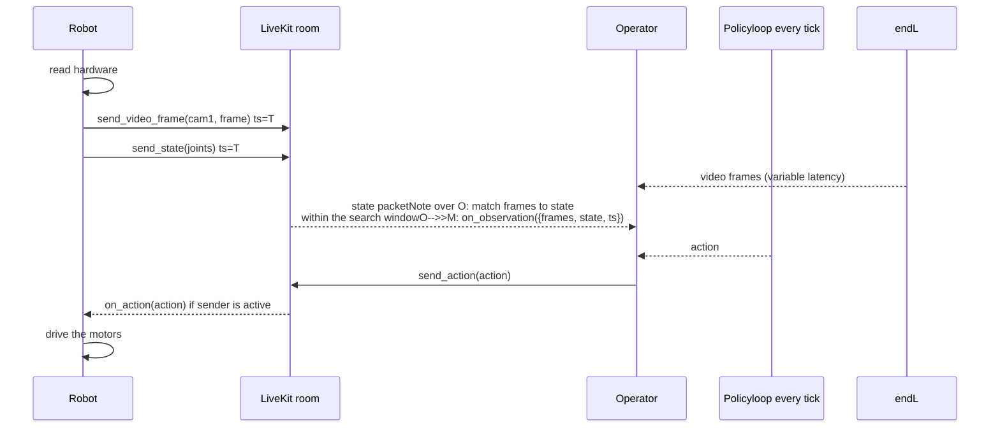

# Robotics & Teleoperation

Robotics use cases, high-performance low-latency video and data streaming, and ROS/Portal integrations.

- **Total pages in this section**: 33
- **Successful retrieves**: 33
- **API References / Placeholders**: 0

## Table of Contents

1. [robotics/](#page-1) (✓)
2. [robotics/media/](#page-2) (✓)
3. [robotics/teleop/](#page-3) (✓)
4. [robotics/integrations/](#page-4) (✓)
5. [robotics/start/use-cases/](#page-5) (✓)
6. [robotics/media/video/](#page-6) (✓)
7. [robotics/media/data/](#page-7) (✓)
8. [robotics/media/performance/](#page-8) (✓)
9. [robotics/teleop/robot/](#page-9) (✓)
10. [robotics/teleop/operator/](#page-10) (✓)
11. [robotics/integrations/ros-portal/](#page-11) (✓)
12. [robotics/integrations/portal/](#page-12) (✓)
13. [robotics/start/use-cases/teleoperation/](#page-13) (✓)
14. [robotics/start/use-cases/observability/](#page-14) (✓)
15. [robotics/start/use-cases/remote-inference/](#page-15) (✓)
16. [robotics/start/use-cases/voice/](#page-16) (✓)
17. [robotics/media/video/video-tracks/](#page-17) (✓)
18. [robotics/media/video/encoders/](#page-18) (✓)
19. [robotics/media/video/metadata/](#page-19) (✓)
20. [robotics/media/data/data-tracks/](#page-20) (✓)
21. [robotics/media/data/rpc/](#page-21) (✓)
22. [robotics/media/data/participant-attributes/](#page-22) (✓)
23. [robotics/media/performance/low-latency/](#page-23) (✓)
24. [robotics/media/performance/stats/](#page-24) (✓)
25. [robotics/integrations/ros-portal/quickstart/](#page-25) (✓)
26. [robotics/integrations/ros-portal/configuration/](#page-26) (✓)
27. [robotics/integrations/ros-portal/graph-access/](#page-27) (✓)
28. [robotics/integrations/ros-portal/diagnostics/](#page-28) (✓)
29. [robotics/integrations/portal/quickstart/](#page-29) (✓)
30. [robotics/integrations/portal/concepts/](#page-30) (✓)
31. [robotics/integrations/portal/examples/](#page-31) (✓)
32. [robotics/media/performance/low-latency/playout-delay/](#page-32) (✓)
33. [robotics/media/performance/low-latency/zero-jitter/](#page-33) (✓)

---

<a name="page-1"></a>
## Page 1: robotics/
**Original URL:** https://docs.livekit.io/robotics/  
**Source MD URL:** https://docs.livekit.io/robotics.md

LiveKit docs › Get Started › Introduction

---

# Introduction

> Build realtime robotics apps with LiveKit for streaming, teleoperation, remote inference, and voice interactions.

## Overview

LiveKit SDKs connect robots, vehicles, and other hardware devices for realtime multi-participant streaming of video, audio, and data from cameras and sensors, enabling remote operation, monitoring, and inference. Build voice interactions on top with the LiveKit Agents framework.

## Use cases

LiveKit supports a range of realtime robotics apps, including [teleoperation](https://docs.livekit.io/robotics/start/use-cases/teleoperation.md), [realtime observability](https://docs.livekit.io/robotics/start/use-cases/observability.md), [remote inference](https://docs.livekit.io/robotics/start/use-cases/remote-inference.md), and [voice interactions](https://docs.livekit.io/robotics/start/use-cases/voice.md).

## Supported platforms

LiveKit runs on a range of hardware platforms for robotics, from embedded Linux systems and Nvidia Jetson boards to low-cost [ESP32 microcontrollers](https://docs.livekit.io/frontends/build/hardware/esp32.md). It also integrates with common robotics frameworks like ROS and LeRobot through [LiveKit Portal](https://docs.livekit.io/robotics/integrations/portal.md).

### Hardware platforms

LiveKit SDKs run on the compute platforms most commonly used in robotics:

- **Embedded Linux systems**: Single-board computers and custom Linux hardware.
- **Nvidia Jetson**: GPU-accelerated modules with [hardware-accelerated video encoding](https://docs.livekit.io/robotics/media/video/encoders.md) for onboard inference and streaming.
- **ESP32 microcontrollers**: Low-cost, low-power devices for lightweight audio and data streaming.

### Robotics frameworks

Connect an existing robotics stack to the cloud with LiveKit Portal:

- **ROS**: Bridge a ROS graph to stream telemetry, run diagnostics, and control robots remotely. See [LiveKit Portal for ROS](https://docs.livekit.io/robotics/integrations/ros-portal.md).
- **LeRobot**: Run end-to-end policies in the cloud on realtime streams from the robot. See [LiveKit Portal](https://docs.livekit.io/robotics/integrations/portal.md).

## In this section

Learn how to build realtime robotics apps with LiveKit.

- **[Realtime media & data](https://docs.livekit.io/robotics/media/video.md)**: Publish video from cameras and data from sensors with hardware-accelerated encoding.

- **[Teleoperation](https://docs.livekit.io/robotics/teleop.md)**: Stream cameras to operators and send control data to machines in realtime.

- **[Integrations](https://docs.livekit.io/robotics/integrations.md)**: Connect LiveKit to ROS and other robotics tooling with the LiveKit Portal for ROS.

## Next steps

Explore runnable examples and starter apps for common robotics patterns:

- **[Examples & starter apps](https://docs.livekit.io/reference/recipes.md?tag=robotics)**: Runnable examples and starter apps for teleoperation, remote inference, and more.

---

This document was rendered at 2026-08-28T04:22:10.251Z.
For the latest version of this document, see [https://docs.livekit.io/robotics.md](https://docs.livekit.io/robotics.md).

To explore all LiveKit documentation, see [llms.txt](https://docs.livekit.io/llms.txt).

---

<a name="page-2"></a>
## Page 2: robotics/media/
**Original URL:** https://docs.livekit.io/robotics/media/  
**Source MD URL:** https://docs.livekit.io/robotics/media.md

LiveKit docs › Realtime Media & Data › Overview

---

# Media overview

> Publish video, exchange data, and tune performance for realtime robotics apps.

## Overview

Robotics apps move a continuous flow of video and data between robots and the cloud: camera views, sensor readings, control commands, and telemetry. This section covers how to publish that media and data with LiveKit, and how to tune the pipeline for the low latency that teleoperation and remote inference require.

## In this section

- **[Publishing video](https://docs.livekit.io/robotics/media/video.md)**: Publish camera views from a robot and subscribe to them from an operator app, with hardware-accelerated encoding and per-frame metadata.

- **[Publishing data](https://docs.livekit.io/robotics/media/data.md)**: Exchange sensor readings, control commands, and shared state between robots and operators.

- **[Performance](https://docs.livekit.io/robotics/media/performance.md)**: Tune LiveKit for the lowest possible latency with low latency mode and transport stats.

---

This document was rendered at 2026-08-28T04:22:10.462Z.
For the latest version of this document, see [https://docs.livekit.io/robotics/media.md](https://docs.livekit.io/robotics/media.md).

To explore all LiveKit documentation, see [llms.txt](https://docs.livekit.io/llms.txt).

---

<a name="page-3"></a>
## Page 3: robotics/teleop/
**Original URL:** https://docs.livekit.io/robotics/teleop/  
**Source MD URL:** https://docs.livekit.io/robotics/teleop.md

LiveKit docs › Teleoperation › Overview

---

# Teleoperation

> Control robots remotely with low latency.

## Overview

Teleoperation lets an operator see and control a robot from another location. Use [LiveKit server and client SDKs](https://docs.livekit.io/reference.md) to build low-latency teleoperation apps using [video tracks](https://docs.livekit.io/robotics/media/video.md) and [data tracks](https://docs.livekit.io/robotics/media/data/data-tracks.md).

A typical teleoperation app built with LiveKit has two [participants](https://docs.livekit.io/intro/basics/rooms-participants-tracks/participants.md):

- **Robot**: Captures video from its cameras, publishes video, receives commands, and applies them to the local control system.
- **Operator**: Renders the robot's video, reads input from a gamepad or control interface, and publishes commands.

```mermaid
graph LR
robot["Robot"]
livekit[LiveKit Server]
operator["Operator"]robot -.Video .-> livekit
livekit -.Controls.-> robotlivekit -.Video .-> operator
operator -.Controls.-> livekit
```

LiveKit transports video and data between the participants. Your app remains responsible for camera capture, the command format, actuator integration, and [safety behavior](https://docs.livekit.io/robotics/teleop/robot.md#apply-commands-safely).

## Build your teleoperation app

The following guides walk you through building example teleoperation apps for robot and operator participants with LiveKit.

- **[Build the operator participant](https://docs.livekit.io/robotics/teleop/operator.md)**: Define a control schema, render the robot's tracks, capture operator input, and publish commands.

- **[Build the robot participant](https://docs.livekit.io/robotics/teleop/robot.md)**: Publish camera and sensor tracks, receive control data, and connect LiveKit to the local control system.

## Next steps

Use the end-to-end teleoperation demos to explore the complete media and control path. For smaller, reusable components, see the [C++ example collection](https://github.com/livekit-examples/cpp-example-collection) for native apps.

- **[Rover teleop](https://github.com/livekit-examples/rover-teleop)**: Run an end-to-end Raspberry Pi rover with a published camera feed and a Flutter gamepad controller.

- **[Pan-tilt teleop](https://github.com/livekit-examples/teleop/tree/main/pan_tilt_demo)**: Use the LiveKit C++ SDK to publish RealSense video, send motor commands over a control data track, and acquire exclusive control with RPC.

- **[C++ video example](https://github.com/livekit-examples/cpp-example-collection/tree/main/simple_room)**: See how a native app captures, publishes, subscribes to, and renders video tracks.

- **[C++ data track example](https://github.com/livekit-examples/cpp-example-collection/tree/main/ping_pong)**: See two native participants publish and subscribe to named data tracks.

---

This document was rendered at 2026-08-28T04:22:10.464Z.
For the latest version of this document, see [https://docs.livekit.io/robotics/teleop.md](https://docs.livekit.io/robotics/teleop.md).

To explore all LiveKit documentation, see [llms.txt](https://docs.livekit.io/llms.txt).

---

<a name="page-4"></a>
## Page 4: robotics/integrations/
**Original URL:** https://docs.livekit.io/robotics/integrations/  
**Source MD URL:** https://docs.livekit.io/robotics/integrations.md

LiveKit docs › Integrations › Overview

---

# Integrations overview

> Connect LiveKit to ROS and other robotics tooling.

## Overview

LiveKit integrates with common robotics tooling so you can connect an existing stack to the cloud without building the transport layer yourself. Bridge a ROS graph with a LiveKit Portal for ROS, or stream synchronized observations and actions for teleoperation and remote inference with LiveKit Portal.

## In this section

Choose the integration that matches your stack:

- **[LiveKit Portal for ROS](https://docs.livekit.io/robotics/integrations/ros-portal.md)**: Access and control a remote ROS graph, stream telemetry, and run diagnostics.

- **[LiveKit Portal](https://docs.livekit.io/robotics/integrations/portal.md)**: Teleoperate robots, run remote policies, and record demonstrations with synchronized observations.

---

This document was rendered at 2026-08-28T04:22:10.466Z.
For the latest version of this document, see [https://docs.livekit.io/robotics/integrations.md](https://docs.livekit.io/robotics/integrations.md).

To explore all LiveKit documentation, see [llms.txt](https://docs.livekit.io/llms.txt).

---

<a name="page-5"></a>
## Page 5: robotics/start/use-cases/
**Original URL:** https://docs.livekit.io/robotics/start/use-cases/  
**Source MD URL:** https://docs.livekit.io/robotics/start/use-cases.md

LiveKit docs › Get Started › Use cases › Overview

---

# Use cases overview

> Realtime robotics apps you can build with LiveKit.

## Overview

LiveKit supports a range of realtime robotics apps, from teleoperating machines to monitoring fleets and running control policies in the cloud. Each use case builds on the same foundation: low-latency streaming of video, audio, and data between robots and the cloud.

These capabilities can be combined in a single app. For example, an app can teleoperate a robot, stream its cameras to a monitoring dashboard, and accept voice commands at the same time.

## Use cases

Each use case pairs LiveKit's realtime transport with a different part of your robotics stack:

| Use case | Description | Common scenarios |
| [Teleoperation](https://docs.livekit.io/robotics/start/use-cases/teleoperation.md) | Stream video and control commands between robots and operators with ultra-low latency. | Driving a rover, piloting a drone, or supervising a robot in the field. |
| [Observability](https://docs.livekit.io/robotics/start/use-cases/observability.md) | Monitor cameras and telemetry from robots in the field in realtime. | Fleet dashboards, anomaly detection, and incident review. |
| [Remote inference](https://docs.livekit.io/robotics/start/use-cases/remote-inference.md) | Control your robot with models running in the cloud. | Running end-to-end policies too large to run onboard. |
| [Voice interactions](https://docs.livekit.io/robotics/start/use-cases/voice.md) | Add natural voice control to a robot with the LiveKit Agents framework. | Spoken commands, status readouts, and conversational control. |

---

This document was rendered at 2026-08-28T04:22:11.730Z.
For the latest version of this document, see [https://docs.livekit.io/robotics/start/use-cases.md](https://docs.livekit.io/robotics/start/use-cases.md).

To explore all LiveKit documentation, see [llms.txt](https://docs.livekit.io/llms.txt).

---

<a name="page-6"></a>
## Page 6: robotics/media/video/
**Original URL:** https://docs.livekit.io/robotics/media/video/  
**Source MD URL:** https://docs.livekit.io/robotics/media/video.md

LiveKit docs › Realtime Media & Data › Publishing video › Overview

---

# Publishing video overview

> Publish camera views from a robot and subscribe to them from an operator app.

## Overview

LiveKit carries video as tracks. A robot publishes one track per camera view, and each operator subscribes to the views it needs. LiveKit encodes every frame, forwards it to each subscriber, and adapts the stream to the bandwidth available.

Publishing from a robot means capturing frames in your own code and pushing them into a video source. Your app controls the camera and the capture format. LiveKit handles encoding, simulcast, and delivery.

Video latency dictates how quickly an operator can react to what the robot sees. Encode in hardware where the platform provides it, and attach capture timestamps when you need to align frames with other sensor data.

## In this section

- **[Video tracks](https://docs.livekit.io/robotics/media/video/video-tracks.md)**: Publish frames from a camera or other local source, and subscribe to frames from another participant.

- **[Hardware encoder support](https://docs.livekit.io/robotics/media/video/encoders.md)**: Use hardware video encoders to minimize encoding latency on supported platforms.

- **[Timestamps and frame metadata](https://docs.livekit.io/robotics/media/video/metadata.md)**: Attach timestamps and metadata to published frames to correlate video with sensor data.

---

This document was rendered at 2026-08-28T04:22:11.698Z.
For the latest version of this document, see [https://docs.livekit.io/robotics/media/video.md](https://docs.livekit.io/robotics/media/video.md).

To explore all LiveKit documentation, see [llms.txt](https://docs.livekit.io/llms.txt).

---

<a name="page-7"></a>
## Page 7: robotics/media/data/
**Original URL:** https://docs.livekit.io/robotics/media/data/  
**Source MD URL:** https://docs.livekit.io/robotics/media/data.md

LiveKit docs › Realtime Media & Data › Publishing data › Overview

---

# Publishing data overview

> Send sensor readings and command and control data between robots and operators.

## Overview

LiveKit provides several APIs for exchanging realtime data between participants in a room. Each API is designed for a specific communication pattern, including continuous streaming, reliable message delivery, request-response interactions, and shared state synchronization.

## Realtime data components

Choose a data API based on how the robot and operator need to communicate.

| Component | Description | Use cases |
| **[Data tracks](https://docs.livekit.io/robotics/media/data/data-tracks.md)** | Stream continuous realtime binary data between participants. | Sensor streams, teleoperation control input, telemetry, and non-standard media such as MJPEG. |
| **[Remote procedure calls](https://docs.livekit.io/robotics/media/data/rpc.md)** | Invoke an operation on another participant and await the result. | Behaviors, policy execution, device queries. |
| **[Participant attributes](https://docs.livekit.io/robotics/media/data/participant-attributes.md)** | Synchronize participant state across the room. | Robot status, roles, permissions. |
| **[Reliable text & byte streams](https://docs.livekit.io/transport/data/byte-streams.md)** | Transfer large text or binary payloads reliably. | Files, logs, maps, LLM output. |

---

This document was rendered at 2026-08-28T04:22:11.922Z.
For the latest version of this document, see [https://docs.livekit.io/robotics/media/data.md](https://docs.livekit.io/robotics/media/data.md).

To explore all LiveKit documentation, see [llms.txt](https://docs.livekit.io/llms.txt).

---

<a name="page-8"></a>
## Page 8: robotics/media/performance/
**Original URL:** https://docs.livekit.io/robotics/media/performance/  
**Source MD URL:** https://docs.livekit.io/robotics/media/performance.md

LiveKit docs › Realtime Media & Data › Performance › Overview

---

# Performance

> Tune LiveKit for the lowest possible latency in robotics apps.

## Overview

LiveKit is optimized for the lowest possible latency, which is critical for robotics apps like teleoperation. Tune latency with low latency mode, and read transport stats to monitor connection health and verify your settings.

- **[Low latency](https://docs.livekit.io/robotics/media/performance/low-latency.md)**: Reduce latency with playout delay hints and zero jitter buffer mode.

- **[Transport stats](https://docs.livekit.io/robotics/media/performance/stats.md)**: Read WebRTC transport stats to monitor connection health and diagnose performance issues.

---

This document was rendered at 2026-08-28T04:22:11.743Z.
For the latest version of this document, see [https://docs.livekit.io/robotics/media/performance.md](https://docs.livekit.io/robotics/media/performance.md).

To explore all LiveKit documentation, see [llms.txt](https://docs.livekit.io/llms.txt).

---

<a name="page-9"></a>
## Page 9: robotics/teleop/robot/
**Original URL:** https://docs.livekit.io/robotics/teleop/robot/  
**Source MD URL:** https://docs.livekit.io/robotics/teleop/robot.md

LiveKit docs › Teleoperation › Robot

---

# Robot app

> Build the robot app for teleoperation.

## Overview

Teleoperation is not limited to any particular language, but this guide focuses on native and embedded robot apps built with [C++](https://github.com/livekit/client-sdk-cpp), [Rust](https://github.com/livekit/rust-sdks), or [Python](https://github.com/livekit/python-sdks).

Building a robot teleoperation app typically involves the following steps:

1. Publish camera views.
2. Receive control commands.
3. Apply commands safely.

## Publish camera views

Publish each camera view from the robot as a named [video track](https://docs.livekit.io/robotics/media/video.md). For example, a mobile robot might publish `front_camera` and `rear_camera` tracks. The operator subscribes to the views it needs and renders the frames in the control interface.

The client SDK accepts frames from your app, encodes them, and publishes them to the room. LiveKit then forwards each track to subscribed operators. Keeping camera views in separate tracks lets the operator select views independently and lets LiveKit manage each stream according to the subscriber's needs.

Video latency affects how quickly an operator can react. Use [hardware-accelerated encoding](https://docs.livekit.io/robotics/media/video/encoders.md) where available, and test your app with the [low-latency settings](https://docs.livekit.io/robotics/media/performance/low-latency.md) that match its network conditions and tolerance for jitter.

The following examples publish a `front_camera` video track and push RGBA frames captured by app code. Replace the `camera` calls with your camera driver, GStreamer pipeline, or another local capture source:

**C++**:

```cpp
#include "livekit/local_video_track.h"
#include "livekit/video_source.h"

constexpr int kWidth = 1280;
constexpr int kHeight = 720;

auto source = std::make_shared<livekit::VideoSource>(kWidth, kHeight);
auto track = livekit::LocalVideoTrack::createLocalVideoTrack("front_camera", source);

livekit::TrackPublishOptions options;
options.source = livekit::TrackSource::SOURCE_CAMERA;

if (auto local_participant = room->localParticipant().lock()) {
  local_participant->publishTrack(track, options);
}

while (camera.isRunning()) {
  auto frame = livekit::VideoFrame::create(kWidth, kHeight, livekit::VideoBufferType::RGBA);
  camera.readRgba(frame.data(), kWidth, kHeight); // Application-specific camera frame capture call below
  source->captureFrame(frame);
}

```

---

**Rust**:

```rust
use livekit::prelude::*;

let source = NativeVideoSource::new(
    VideoResolution {
        width: 1280,
        height: 720,
    },
    false,
);
let track =
    LocalVideoTrack::create_video_track("front_camera", RtcVideoSource::Native(source.clone()));

let options = TrackPublishOptions {
    source: TrackSource::Camera,
    video_encoding: VideoEncoding {
        max_bitrate: 3_000_000,
        max_framerate: 30.0,
    }
    .into(),
    ..Default::default()
};

room.local_participant()
    .publish_track(LocalTrack::Video(track), options)
    .await?;

while let Some(frame) = camera.next_rgba_frame().await { // Application-specific camera frame capture
    source.capture_frame(&frame);
}

```

---

**Python**:

```python
from livekit import rtc

WIDTH = 1280
HEIGHT = 720

source = rtc.VideoSource(WIDTH, HEIGHT)
track = rtc.LocalVideoTrack.create_video_track("front_camera", source)
options = rtc.TrackPublishOptions(
    source=rtc.TrackSource.SOURCE_CAMERA,
    simulcast=True,
    video_encoding=rtc.VideoEncoding(
        max_framerate=30,
        max_bitrate=3_000_000,
    ),
)

publication = await room.local_participant.publish_track(track, options)

async for frame_bytes, capture_time_us in camera.rgba_frames():
    frame = rtc.VideoFrame(WIDTH, HEIGHT, rtc.VideoBufferType.RGBA, frame_bytes)
    source.capture_frame(frame, timestamp_us=capture_time_us)

```

Publish another named track for each additional camera view. If the robot also streams telemetry, lidar, or diagnostics, use [data tracks](https://docs.livekit.io/robotics/media/data/data-tracks.md) for high-frequency structured data and [RPC](https://docs.livekit.io/transport/data/rpc.md) for discrete operations that need a response, such as operator control leasing or authentication.

## Receive control commands

Subscribe to the operator's [control data track](https://docs.livekit.io/robotics/media/data/data-tracks.md), deserialize each frame against the [control schema](https://docs.livekit.io/robotics/teleop/operator.md#control-schema), and translate the resulting command into the local control system. Because data tracks use lossy delivery, the robot should apply the latest valid command and tolerate missing frames.

Register data track handlers before connecting to the room. Otherwise, the client can miss already-published control tracks if events such as `DataTrackPublished` fire during the connection handshake.

The following examples subscribe to a `robot.control` data track from the expected operator identity. They decode each frame as UTF-8 JSON and pass decoded commands to your app code:

**C++**:

```cpp
const std::string kOperatorIdentity = "operator";
const std::string kControlTrackName = "robot.control";

const auto callback_id = room->addOnDataFrameCallback(
    kOperatorIdentity,
    kControlTrackName,
    [&](const std::vector<std::uint8_t>& payload,
        std::optional<std::uint64_t> /*user_timestamp*/) {
      auto command = decodeControlFrame(payload);
      if (!command) {
        return;
      }

      // Application-specific command handling below
      controller.applyLatest(*command);
    });

```

---

**Rust**:

```rust
use futures_util::StreamExt;
use livekit::prelude::*;

const OPERATOR_IDENTITY: &str = "operator";
const CONTROL_TRACK_NAME: &str = "robot.control";

while let Some(event) = room_events.recv().await {
    if let RoomEvent::DataTrackPublished(track) = event {
        if track.publisher_identity() != OPERATOR_IDENTITY
            || track.info().name() != CONTROL_TRACK_NAME
        {
            continue;
        }

        let controller = controller.clone();
        tokio::spawn(async move {
            let Ok(mut stream) = track
                .subscribe_with_options(
                    DataTrackSubscribeOptions::new().with_buffer_size(1),
                )
                .await
            else {
                return;
            };

            while let Some(frame) = stream.next().await {
                if let Ok(command) = decode_control_frame(frame.payload()) {
                    // Application-specific command handling below
                    controller.apply_latest(command).await;
                }
            }
        });
    }
}

```

---

**Python**:

```python
import asyncio
import json

from livekit import rtc

OPERATOR_IDENTITY = "operator"
CONTROL_TRACK_NAME = "robot.control"


@room.on("data_track_published")
def on_data_track_published(track: rtc.RemoteDataTrack):
    if (
        track.publisher_identity != OPERATOR_IDENTITY
        or track.info.name != CONTROL_TRACK_NAME
    ):
        return

    asyncio.create_task(read_control_track(track))


async def read_control_track(track: rtc.RemoteDataTrack):
    stream = track.subscribe(buffer_size=1)

    async for frame in stream:
        try:
            payload = json.loads(frame.payload.decode("utf-8"))
            command = validate_control_frame(payload)
        except (json.JSONDecodeError, UnicodeDecodeError, ValueError):
            continue

        # Application-specific command handling below
        await controller.apply_latest(command)

```

Keep the data track buffer small for control input. A larger buffer can preserve more frames, but stale commands are usually worse than dropped commands for continuous teleoperation input.

## Apply commands safely

Treat every command received from LiveKit as untrusted input before applying it to an actuator. These are general guidelines that don't all apply to every robot or control system. At a minimum, the robot app should do the following:

- **Authorize the operator**: Accept commands only from an expected participant identity and issue tokens with the minimum required [participant permissions](https://docs.livekit.io/frontends/reference/tokens-grants.md).
- **Enforce one controller**: Use an explicit control lease when more than one operator can join the room.
- **Validate every frame**: Reject malformed, out-of-range, expired, or out-of-order commands.
- **Stop on lost input**: Move to a safe state when the command deadline passes, the data track closes, or the controlling participant disconnects.
- **Clamp commands locally**: Apply the robot's position, velocity, and acceleration limits on the robot, not only in the operator interface.

These app-level safeguards complement the authentication, encryption, and transport provided by LiveKit. They don't replace the hardware interlocks and safety systems required for your robot.

After validation, translate normalized control values into the local control system. Keep this translation deterministic and local to the robot:

```python
def apply_drive_command(command: ControlCommand):
    steering = clamp(command.control_values["steering"], -1.0, 1.0)
    throttle = clamp(command.control_values["throttle"], -1.0, 1.0)

    left_velocity = clamp(throttle - steering, -1.0, 1.0) * MAX_WHEEL_VELOCITY
    right_velocity = clamp(throttle + steering, -1.0, 1.0) * MAX_WHEEL_VELOCITY

    motor_controller.set_velocity(left_velocity, right_velocity)

```

Drive the actuator only while valid commands are being received from the command app. Run it behind a watchdog so that if the latest valid command expires, the control track closes, or the controlling participant disconnects, the robot stops or moves to another safe state.

## Additional resources

Use these implementations as references for robot teleoperation apps.

- **[Rover teleop robot](https://github.com/livekit-examples/rover-teleop/tree/main/rover)**: Python robot participant for a Raspberry Pi rover that publishes camera video and applies remote drive commands.

- **[Pan-tilt teleop robot](https://github.com/livekit-examples/teleop/tree/main/pan_tilt_demo)**: C++ robot participant that publishes RealSense video, receives velocity commands, and gates control with RPC.

- **[C++ video example](https://github.com/livekit-examples/cpp-example-collection/tree/main/simple_room)**: Native example that creates local audio and video sources, publishes tracks, and captures frames.

- **[C++ data track example](https://github.com/livekit-examples/cpp-example-collection/tree/main/ping_pong)**: Native example that publishes and subscribes to named data tracks.

---

This document was rendered at 2026-08-28T04:22:11.744Z.
For the latest version of this document, see [https://docs.livekit.io/robotics/teleop/robot.md](https://docs.livekit.io/robotics/teleop/robot.md).

To explore all LiveKit documentation, see [llms.txt](https://docs.livekit.io/llms.txt).

---

<a name="page-10"></a>
## Page 10: robotics/teleop/operator/
**Original URL:** https://docs.livekit.io/robotics/teleop/operator/  
**Source MD URL:** https://docs.livekit.io/robotics/teleop/operator.md

LiveKit docs › Teleoperation › Operator

---

# Operator app

> Build the operator app for teleoperation.

## Overview

This guide walks you through building an operator app for teleoperation. It is scoped to simple human-interface apps built using [JavaScript](https://github.com/livekit/client-sdk-js) or [Flutter](https://docs.livekit.io/transport/sdk-platforms/flutter.md), but teleoperation is not limited to these languages.

Building a teleoperation app typically involves the following steps:

1. Define the control schema
2. Render the robot's video tracks
3. Capture operator input
4. Publish control commands

## Define the control schema

A control schema defines the structure and meaning of the control commands the operator sends to the robot. It's the data contract for the control channel.

Define a small control schema before implementing either participant. The operator serializes commands to this schema before publishing them on the control track. The robot deserializes each command against the same schema before applying it to the local control system.

A useful control frame typically contains the following data:

- **Sequence number**: Detects gaps or replayed frames.
- **Timestamp or expiration**: Prevents stale input from moving the robot.
- **Control values**: Carries normalized axes, velocities, or other app-specific commands.
- **Control lease ID**: Identifies the active control lease held by the operator.

The following example control schema follows this guidance:

```json
{
  "sequence_number": 1,
  "timestamp": 1717000000000,
  "control_values": {
    "steering": 0.5,
    "throttle": 0.5
  },
  "control_lease_id": "lease_7f3a"
}

```

Authentication and control leasing are out of scope for this guide. Use [RPC](https://docs.livekit.io/transport/data/rpc.md) for discrete actions that need a response, such as acquiring, renewing, or releasing exclusive control, changing operating mode, or starting calibration. Include the resulting control lease ID in each command frame when the robot enforces one active operator.

## Render the robot's video tracks

Use a named [video track](https://docs.livekit.io/robotics/media/video.md) for each camera view the robot publishes. The operator subscribes to the views it needs and renders the frames in the control interface.

For example, a mobile robot might publish `front_camera` and `rear_camera` tracks.

With [automatic subscription](https://docs.livekit.io/transport/media/subscribe.md) enabled, handle the track subscription event and attach each video track to a platform renderer:

**JavaScript**:

```javascript
import { RemoteVideoTrack, RoomEvent } from 'livekit-client';

const videoContainer = document.getElementById('robot-video');

room.on(RoomEvent.TrackSubscribed, (track, publication) => {
  if (!(track instanceof RemoteVideoTrack) || !videoContainer) {
    return;
  }

  const videoElement = track.attach();
  videoElement.dataset.trackName = publication.trackName;
  videoContainer.appendChild(videoElement);
});

room.on(RoomEvent.TrackUnsubscribed, (track) => {
  track.detach().forEach((element) => element.remove());
});

```

---

**Flutter**:

```dart
import 'package:flutter/widgets.dart';
import 'package:livekit_client/livekit_client.dart';

class RobotVideoView extends StatefulWidget {
  const RobotVideoView({required this.robot, super.key});

  final Participant robot;

  @override
  State<RobotVideoView> createState() => _RobotVideoViewState();
}

class _RobotVideoViewState extends State<RobotVideoView> {
  TrackPublication? videoPublication;

  @override
  void initState() {
    super.initState();
    widget.robot.addListener(_onParticipantChanged);
    _onParticipantChanged();
  }

  @override
  void dispose() {
    widget.robot.removeListener(_onParticipantChanged);
    super.dispose();
  }

  void _onParticipantChanged() {
    final subscribedVideos = widget.robot.videoTrackPublications.where((publication) {
      return publication.kind == TrackType.VIDEO &&
          !publication.isScreenShare &&
          publication.subscribed;
    });

    setState(() {
      videoPublication = subscribedVideos.isEmpty || subscribedVideos.first.muted
          ? null
          : subscribedVideos.first;
    });
  }

  @override
  Widget build(BuildContext context) {
    final track = videoPublication?.track;

    return track is VideoTrack
        ? VideoTrackRenderer(track)
        : const SizedBox.shrink();
  }
}

```

Create a renderer for each subscribed track when displaying multiple camera views at the same time. The examples follow these official SDK implementations:

- **JavaScript**: [Client SDK demo](https://github.com/livekit/client-sdk-js/blob/main/examples/demo/demo.ts).
- **Flutter**: [Video rendering example](https://github.com/livekit/client-sdk-flutter/blob/main/example/lib/widgets/participant.dart).

## Capture operator input

Capture operator input from a gamepad, keyboard, control interface, or other input device. The input mapping is app-specific, but it should produce a consistent control state that can be published at a regular interval.

Common control surfaces include:

- **Web**: Arrow or WASD keys, the browser Gamepad API, or on-screen controls.
- **Mobile**: Touch joysticks, buttons, sliders, device motion, or a Bluetooth controller.
- **VR and XR**: Headset controllers, hand tracking, or spatial input through the [Unity SDK](https://docs.livekit.io/transport/sdk-platforms/unity.md).
- **Desktop and industrial**: USB gamepads, joysticks, or purpose-built control panels.

Normalize input into a consistent control state and keep input capture independent from the publishing loop. Reset the state when the control surface disconnects or loses focus.

## Publish control commands

Publish the latest control state to the robot at a regular interval. Use a named [data track](https://docs.livekit.io/robotics/media/data/data-tracks.md) when the client SDK supports it. In Flutter, use lossy [data packets](https://docs.livekit.io/transport/data/packets.md) with a topic such as `robot.control`. Both approaches fit continuous, latency-sensitive commands such as steering, throttle, joint velocity, or pan and tilt.

The following examples encode the control frame as UTF-8 JSON and use lossy delivery so an old command isn't retransmitted ahead of newer input. This behavior fits continuously updated input, where the latest state matters more than receiving every intermediate value.

**JavaScript**:

```javascript
const encoder = new TextEncoder();
const controlTrack = await room.localParticipant.publishDataTrack({
  name: 'robot.control',
});

let sequenceNumber = 0;

function publishControlFrame(controlValues, controlLeaseId) {
  const frame = {
    sequence_number: ++sequenceNumber,
    timestamp: Date.now(),
    control_values: controlValues,
    control_lease_id: controlLeaseId,
  };

  controlTrack.tryPush({
    payload: encoder.encode(JSON.stringify(frame)),
  });
}

publishControlFrame(
  { steering: 0.5, throttle: 0.5 },
  'lease_7f3a',
);

```

---

**Flutter**:

```dart
import 'dart:convert';

import 'package:livekit_client/livekit_client.dart';

Future<void> publishControlFrame({
  required Room room,
  required int sequenceNumber,
  required Map<String, num> controlValues,
  required String controlLeaseId,
  required String robotIdentity,
}) async {
  final frame = {
    'sequence_number': sequenceNumber,
    'timestamp': DateTime.now().millisecondsSinceEpoch,
    'control_values': controlValues,
    'control_lease_id': controlLeaseId,
  };

  await room.localParticipant.publishData(
    utf8.encode(jsonEncode(frame)),
    reliable: false,
    destinationIdentities: [robotIdentity],
    topic: 'robot.control',
  );
}

await publishControlFrame(
  room: room,
  sequenceNumber: 1,
  controlValues: {'steering': 0.5, 'throttle': 0.5},
  controlLeaseId: 'lease_7f3a',
  robotIdentity: 'robot',
);

```

Update the sequence number, timestamp, and control values before each publish. If a lossy frame is dropped, continue with the next frame instead of retrying stale input. On the robot, validate each command and implement [safe control behavior](https://docs.livekit.io/robotics/teleop/robot.md#apply-commands-safely) before applying it to an actuator.

## Additional resources

Use these implementations as references for operator teleoperation patterns:

- **[Rover teleop controller](https://github.com/livekit-examples/rover-teleop/tree/main/controller)**: Flutter operator app that renders the rover camera feed and maps gamepad input to drive commands.

- **[Pan-tilt teleop web UI](https://github.com/livekit-examples/teleop/tree/main/web)**: Next.js operator interface with a fullscreen video viewport, joystick controls, and operator locking.

- **[Pan-tilt desktop controller](https://github.com/livekit-examples/teleop/tree/main/pan_tilt_demo)**: C++ operator participant that renders robot video in SDL and sends keyboard-driven velocity commands gated by RPC.

---

This document was rendered at 2026-08-28T04:22:11.755Z.
For the latest version of this document, see [https://docs.livekit.io/robotics/teleop/operator.md](https://docs.livekit.io/robotics/teleop/operator.md).

To explore all LiveKit documentation, see [llms.txt](https://docs.livekit.io/llms.txt).

---

<a name="page-11"></a>
## Page 11: robotics/integrations/ros-portal/
**Original URL:** https://docs.livekit.io/robotics/integrations/ros-portal/  
**Source MD URL:** https://docs.livekit.io/robotics/integrations/ros-portal.md

LiveKit docs › Integrations › LiveKit Portal for ROS › Overview

---

# LiveKit Portal for ROS overview

> Access and control a remote ROS graph over LiveKit with the LiveKit Portal for ROS.

## Overview

LiveKit Portal for ROS bridges a robot's [ROS](https://docs.ros.org/) graph to LiveKit, so you can access and operate it from anywhere over a single realtime connection. It runs as a ROS node alongside your stack, forwards the topics, services, and video you select, and exposes them to other participants in the same LiveKit room.

Some common use cases the LiveKit Portal for ROS supports include the following:

- Teleoperate a robot by publishing commands and calling services on its remote ROS graph.
- Stream telemetry and sensor data from the robot to operators and cloud services.
- Monitor and diagnose a running stack in the field.
- Run ROS components across the robot, cloud, and other participants in the room.


The LiveKit Portal for ROS supports the following ROS distributions and tags:

| ROS distribution | Docker tag | Platforms |
| Humble | `humble` | `linux/amd64`, `linux/arm64` |
| Jazzy | `jazzy` | `linux/amd64`, `linux/arm64` |
| Kilted | `kilted` | `linux/amd64`, `linux/arm64` |
| Lyrical | `lyrical` | `linux/amd64`, `linux/arm64` |

Each distribution tag is a multi-architecture image. Docker selects the native variant for your machine automatically. Use `<ros_distro>-<version>` to pin a specific LiveKit Portal for ROS release.

> ℹ️ **No ROS 1 support**
> 
> The LiveKit Portal for ROS doesn't support ROS 1.

## Additional resources

The following resources provide more information about LiveKit Portal for ROS.

- **[Quickstart](https://docs.livekit.io/robotics/integrations/ros-portal/quickstart.md)**: Build and run the LiveKit Portal for ROS with Docker or from source.

- **[Remote graph access](https://docs.livekit.io/robotics/integrations/ros-portal/graph-access.md)**: Access and control a remote ROS graph over LiveKit.

- **[Diagnostics](https://docs.livekit.io/robotics/integrations/ros-portal/diagnostics.md)**: Monitor and diagnose a running ROS stack remotely.

- **[Configuration](https://docs.livekit.io/robotics/integrations/ros-portal/configuration.md)**: Configure the LiveKit Portal for ROS topics, services, room options, and credentials.

---

This document was rendered at 2026-08-28T04:22:11.766Z.
For the latest version of this document, see [https://docs.livekit.io/robotics/integrations/ros-portal.md](https://docs.livekit.io/robotics/integrations/ros-portal.md).

To explore all LiveKit documentation, see [llms.txt](https://docs.livekit.io/llms.txt).

---

<a name="page-12"></a>
## Page 12: robotics/integrations/portal/
**Original URL:** https://docs.livekit.io/robotics/integrations/portal/  
**Source MD URL:** https://docs.livekit.io/robotics/integrations/portal.md

LiveKit docs › Integrations › LiveKit Portal › Overview

---

# LiveKit Portal overview

> Teleoperate robots, run remote policies, and record demonstrations with LiveKit Portal.

## Overview

[LiveKit Portal](https://github.com/livekit/portal) is a thin layer over LiveKit that transports camera streams, robot state, and control actions between a robot and one or more operators. It provides a consistent interface for local and remote robots, so the same control code works in either environment.

Portal addresses three common challenges in remote robotics apps:

- **Transport**: Streams camera data and robot state from the robot, and control actions back, in a LiveKit room.
- **Synchronization**: Aligns camera frames and robot state by timestamp, delivering a single observation for each control tick.
- **Control arbitration**: Coordinates control between participants such as teleoperators, policies, and recorders, allowing control to transfer with a single API call.

Portal works with any robotics stack. It does not depend on a specific perception, control, or learning framework, and includes an optional [LeRobot](https://github.com/huggingface/lerobot) integration for apps that already use it.

## When to use LiveKit Portal

Use Portal when robot observations and control actions need to cross a network, such as for [teleoperation](https://docs.livekit.io/robotics/teleop.md) or [remote inference](https://docs.livekit.io/robotics/start/use-cases/remote-inference.md). It handles transport, synchronization, and control coordination over both [LiveKit Cloud](https://cloud.livekit.io) and [self-hosted](https://docs.livekit.io/transport/self-hosting.md) LiveKit servers. The code is the same in either deployment.

If you need lower-level control over media and data transport, build directly on the LiveKit SDKs. See [Teleoperation](https://docs.livekit.io/robotics/teleop.md) for the underlying video and data track patterns.

## In this section

If you're new to Portal, start with the [LiveKit Portal quickstart](https://docs.livekit.io/robotics/integrations/portal/quickstart.md), which walks through connecting a robot and an operator without requiring physical hardware. The remaining topics cover the architecture, APIs, and example apps.

- **[Concepts](https://docs.livekit.io/robotics/integrations/portal/concepts.md)**: Roles, the observation model, control handoff, and frame format.

- **[LiveKit Portal API reference](https://docs.livekit.io/reference/robotics/portal-api.md)**: Configuration, the `Robot` and `Operator` classes, callbacks, send methods, and the control plane.

- **[Examples](https://docs.livekit.io/robotics/integrations/portal/examples.md)**: Runnable examples, from synthetic video to SO-101 arms and cloud inference on Modal.

---

This document was rendered at 2026-08-28T04:22:11.782Z.
For the latest version of this document, see [https://docs.livekit.io/robotics/integrations/portal.md](https://docs.livekit.io/robotics/integrations/portal.md).

To explore all LiveKit documentation, see [llms.txt](https://docs.livekit.io/llms.txt).

---

<a name="page-13"></a>
## Page 13: robotics/start/use-cases/teleoperation/
**Original URL:** https://docs.livekit.io/robotics/start/use-cases/teleoperation/  
**Source MD URL:** https://docs.livekit.io/robotics/start/use-cases/teleoperation.md

LiveKit docs › Get Started › Use cases › Teleoperation

---

# Teleoperation

> Stream video and control commands between robots and operators with ultra-low latency.

## Overview

Teleoperation lets a human operator see and control a robot, vehicle, or hardware system from another location. Use it when a person needs realtime situational awareness and continuous control, such as driving a rover, piloting a drone, positioning a camera, or supervising a robot in the field.

LiveKit provides the realtime media and data transport between the robot and the operator. The robot publishes cameras as [video tracks](https://docs.livekit.io/robotics/media/video.md), while the operator sends control input over [data tracks](https://docs.livekit.io/robotics/media/data/data-tracks.md). Your app defines the command format, connects to the robot's local control system, and implements the [safety behavior](https://docs.livekit.io/robotics/teleop/robot.md#apply-commands-safely) for your hardware.

## Common patterns

Teleoperation apps commonly combine several elements:

- **Low-latency video**: Provide video from one or more robot cameras.
- **Control commands**: Accept input from a joystick, gamepad, keyboard, touchscreen, or custom operator console.
- **Telemetry**: Display battery state, robot position, network status, or sensor readings.
- **Control coordination**: Ensure only the active operator can move the robot.

## Next steps

For implementation details, follow the teleoperation guide:

- **[Teleoperation](https://docs.livekit.io/robotics/teleop.md)**: Build robot and operator participants using LiveKit video tracks, data tracks, and control schemas.

- **[Low-latency media](https://docs.livekit.io/robotics/media/performance/low-latency.md)**: Tune video playback and buffering for latency-sensitive robot control.

---

This document was rendered at 2026-08-28T04:22:12.754Z.
For the latest version of this document, see [https://docs.livekit.io/robotics/start/use-cases/teleoperation.md](https://docs.livekit.io/robotics/start/use-cases/teleoperation.md).

To explore all LiveKit documentation, see [llms.txt](https://docs.livekit.io/llms.txt).

---

<a name="page-14"></a>
## Page 14: robotics/start/use-cases/observability/
**Original URL:** https://docs.livekit.io/robotics/start/use-cases/observability/  
**Source MD URL:** https://docs.livekit.io/robotics/start/use-cases/observability.md

LiveKit docs › Get Started › Use cases › Observability

---

# Observability

> Monitor cameras and telemetry from robots in the field in realtime.

## Overview

Monitor cameras and telemetry from your robots and vehicles in the field in realtime, streaming everything through LiveKit to a central dashboard or operator.

Robots publish video and sensor data to LiveKit, which delivers it to any number of downstream viewers. This lets you monitor an entire fleet from one place and spot anomalies as they happen.

## Common patterns

Observability apps commonly combine several elements:

- **Live camera feeds**: Display video from one or more robots or vehicles.
- **Telemetry**: Monitor battery state, location, network quality, or sensor readings.
- **Fleet-wide monitoring**: Monitor many robots from a shared interface.
- **Recording**: Capture data for later review of incidents or performance.

## Next steps

For implementation details, follow the media guides:

- **[Realtime video](https://docs.livekit.io/robotics/media/video.md)**: Publish camera streams from robots with hardware-accelerated encoding.

- **[Data tracks](https://docs.livekit.io/robotics/media/data/data-tracks.md)**: Stream telemetry and sensor readings alongside video.

---

This document was rendered at 2026-08-28T04:22:12.809Z.
For the latest version of this document, see [https://docs.livekit.io/robotics/start/use-cases/observability.md](https://docs.livekit.io/robotics/start/use-cases/observability.md).

To explore all LiveKit documentation, see [llms.txt](https://docs.livekit.io/llms.txt).

---

<a name="page-15"></a>
## Page 15: robotics/start/use-cases/remote-inference/
**Original URL:** https://docs.livekit.io/robotics/start/use-cases/remote-inference/  
**Source MD URL:** https://docs.livekit.io/robotics/start/use-cases/remote-inference.md

LiveKit docs › Get Started › Use cases › Remote inference

---

# Remote inference

> Control your robot with models running in the cloud.

## Overview

For robots driven by end-to-end policies, LiveKit SDKs and [LiveKit Portal](https://docs.livekit.io/robotics/integrations/portal.md) let you run the policy in the cloud instead of onboard. Video streams and joint positions are sent to the model running in the cloud, and the resulting actions are streamed back to the robot for execution.

Running inference in the cloud lets you deploy models larger than a robot can run locally, update policies without reflashing hardware, and share compute across a fleet.

## Common patterns

A remote inference loop runs in three stages:

- **Sensor input**: Camera frames and joint or sensor state stream from the robot to the cloud.
- **Cloud policy**: A model too large to run onboard computes the next action.
- **Action execution**: Commands stream back to the robot fast enough to close the control loop.

## Next steps

For implementation details, follow the inference guide:

- **[Portal](https://docs.livekit.io/robotics/integrations/portal.md)**: Run inference in the cloud on realtime streams from robots connected through Portal.

- **[Low-latency media](https://docs.livekit.io/robotics/media/performance/low-latency.md)**: Tune video and data transport for latency-sensitive control loops.

---

This document was rendered at 2026-08-28T04:22:12.817Z.
For the latest version of this document, see [https://docs.livekit.io/robotics/start/use-cases/remote-inference.md](https://docs.livekit.io/robotics/start/use-cases/remote-inference.md).

To explore all LiveKit documentation, see [llms.txt](https://docs.livekit.io/llms.txt).

---

<a name="page-16"></a>
## Page 16: robotics/start/use-cases/voice/
**Original URL:** https://docs.livekit.io/robotics/start/use-cases/voice/  
**Source MD URL:** https://docs.livekit.io/robotics/start/use-cases/voice.md

LiveKit docs › Get Started › Use cases › Voice interactions

---

# Voice interactions

> Add natural voice control to a robot with the LiveKit Agents framework.

## Overview

Enable natural voice commands and interactions between a robot and the people around it. With the [LiveKit Agents framework](https://docs.livekit.io/agents.md), you can add high-level voice control to any robot, so an operator or bystander can direct it in plain language.

## Common patterns

Voice apps commonly combine several capabilities:

- **Voice commands**: Tool calls from the agent trigger robot actions over RPC.
- **Conversational feedback**: The robot responds and reports status in natural language.
- **Long-running actions**: Run a robot action in the background using [async tools](https://docs.livekit.io/agents/logic/tools/async.md) so the agent keeps talking while the work completes.

## Next steps

For implementation details, follow the Agents guides:

- **[Voice AI quickstart](https://docs.livekit.io/agents/start/voice-ai.md)**: Build a voice agent that listens, responds, and calls tools.

- **[Agents overview](https://docs.livekit.io/agents.md)**: Learn how the LiveKit Agents framework connects voice models to your app.

---

This document was rendered at 2026-08-28T04:22:12.840Z.
For the latest version of this document, see [https://docs.livekit.io/robotics/start/use-cases/voice.md](https://docs.livekit.io/robotics/start/use-cases/voice.md).

To explore all LiveKit documentation, see [llms.txt](https://docs.livekit.io/llms.txt).

---

<a name="page-17"></a>
## Page 17: robotics/media/video/video-tracks/
**Original URL:** https://docs.livekit.io/robotics/media/video/video-tracks/  
**Source MD URL:** https://docs.livekit.io/robotics/media/video/video-tracks.md

LiveKit docs › Realtime Media & Data › Publishing video › Video tracks

---

# Video tracks

> Publish frames from a camera or other local source into a video track.

## Overview

A video track is a stream of video that one participant publishes and others subscribe to. Your app captures raw frames from a camera or another local source and pushes them into a video source. LiveKit encodes each frame and sends it to every subscriber.

## SDK comparison

LiveKit SDKs publish cameras through a high-level or a low-level API.

| API level | SDKs | Usage |
| **High-level** | Browser JavaScript, Swift, Android, Flutter, React Native | One call opens the camera, requests device permissions, and publishes the track. To learn more, see [Camera & microphone](https://docs.livekit.io/transport/media/publish.md). |
| **Low-level** | Rust, Python, C++, Node.js, Unity | Create a video source, publish a track that wraps it, then push each frame to the source. |

Some SDKs provide both. Swift, for example, also accepts app-produced frames through `BufferCapturer`.

This topic covers the low-level API.

## How publishing works

A camera publication uses three objects:

- **Video source**: Accepts raw frames from your app.
- **Local video track**: Wraps the video source so LiveKit can publish it.
- **Publication**: The result of the publish call.

Create the video source and publish the track before your capture loop. Then push frames to the video source for as long as the camera runs. Every subscribed participant receives the encoded track.

## Publish a video track

The following examples publish a `front_camera` video track, then push frames into the video source. Your app supplies the pixel data for each frame.

**Rust**:

```rust
use livekit::options::TrackPublishOptions;
use livekit::prelude::*;
use livekit::webrtc::video_frame::{
    I420Buffer, VideoFrame, VideoRotation,
};
use livekit::webrtc::video_source::native::NativeVideoSource;
use livekit::webrtc::video_source::{RtcVideoSource, VideoResolution};

const WIDTH: u32 = 1280;
const HEIGHT: u32 = 720;

let source = NativeVideoSource::new(
    VideoResolution { width: WIDTH, height: HEIGHT },
    false, // Camera content, not a screen share
);
let track = LocalVideoTrack::create_video_track(
    "front_camera",
    RtcVideoSource::Native(source.clone()),
);

let options = TrackPublishOptions {
    source: TrackSource::Camera,
    ..Default::default()
};

room.local_participant()
    .publish_track(LocalTrack::Video(track), options)
    .await?;

// Push one frame for every frame your camera produces.
loop {
    let mut frame = VideoFrame {
        rotation: VideoRotation::VideoRotation0,
        timestamp_us: 0, // Zero lets LiveKit set the timestamp
        frame_metadata: None,
        buffer: I420Buffer::new(WIDTH, HEIGHT),
    };

    let (stride_y, stride_u, stride_v) = frame.buffer.strides();
    let (data_y, data_u, data_v) = frame.buffer.data_mut();

    // Copy the Y, U, and V planes of the current camera frame
    // into data_y, data_u, and data_v. Each row is stride_y,
    // stride_u, or stride_v bytes.

    source.capture_frame(&frame);
}

```

Rust accepts the YUV buffer types only, which is why this example fills an `I420Buffer`. If your camera produces RGB, convert it first using the SDK's built-in `yuv_helper` conversions, such as `abgr_to_i420`.

---

**Python**:

```python
from livekit import rtc

WIDTH = 1280
HEIGHT = 720

source = rtc.VideoSource(WIDTH, HEIGHT)
track = rtc.LocalVideoTrack.create_video_track("front_camera", source)
options = rtc.TrackPublishOptions(
    source=rtc.TrackSource.SOURCE_CAMERA,
)

publication = await room.local_participant.publish_track(
    track, options
)

# Push one frame for every frame your camera produces.
while True:
    # WIDTH * HEIGHT * 4 bytes of RGBA pixels from the camera.
    buffer = ...

    frame = rtc.VideoFrame(
        WIDTH, HEIGHT, rtc.VideoBufferType.RGBA, buffer
    )
    source.capture_frame(frame)

```

Python accepts both the YUV and RGB buffer types. The SDK converts an RGB buffer to `I420` during `capture_frame`.

---

**C++**:

```cpp
#include "livekit/local_video_track.h"
#include "livekit/video_frame.h"
#include "livekit/video_source.h"

constexpr int kWidth = 1280;
constexpr int kHeight = 720;

auto source = std::make_shared<livekit::VideoSource>(kWidth, kHeight);
auto track = livekit::LocalVideoTrack::createLocalVideoTrack(
    "front_camera", source);

livekit::TrackPublishOptions options;
options.source = livekit::TrackSource::SOURCE_CAMERA;

if (auto local_participant = room->localParticipant().lock()) {
  local_participant->publishTrack(track, options);
}

// Push one frame for every frame your camera produces.
while (true) {
  auto frame = livekit::VideoFrame::create(
      kWidth, kHeight, livekit::VideoBufferType::RGBA);

  // Copy kWidth * kHeight * 4 bytes of RGBA pixels from the
  // current camera frame into frame.data().

  source->captureFrame(frame);
}

```

C++ accepts both the YUV and RGB buffer types. The SDK converts an RGB buffer to `I420` on capture.

---

**Node.js**:

```typescript
import {
  LocalVideoTrack,
  TrackPublishOptions,
  TrackSource,
  VideoBufferType,
  VideoFrame,
  VideoSource,
} from '@livekit/rtc-node';

const WIDTH = 1280;
const HEIGHT = 720;

const source = new VideoSource(WIDTH, HEIGHT);
const track = LocalVideoTrack.createVideoTrack(
  'front_camera',
  source,
);

const options = new TrackPublishOptions();
options.source = TrackSource.SOURCE_CAMERA;

await room.localParticipant.publishTrack(track, options);

// Push one frame for every frame your camera produces.
while (true) {
  // Fill data with WIDTH * HEIGHT * 4 bytes of RGBA pixels.
  const data = new Uint8Array(WIDTH * HEIGHT * 4);

  const frame = new VideoFrame(
    data,
    WIDTH,
    HEIGHT,
    VideoBufferType.RGBA,
  );
  source.captureFrame(frame);
}

```

Node.js accepts both the YUV and RGB buffer types. The SDK converts an RGB buffer to `I420` on capture.

---

**Unity**:

Unity publishes from a `Texture`. Write your camera frames into the texture, and `TextureVideoSource` reads it back each Unity update:

```cs
IEnumerator PublishCamera(Room room)
{
    const int width = 1280;
    const int height = 720;

    var texture = new Texture2D(
        width, height, TextureFormat.RGBA32, false);
    var source = new TextureVideoSource(texture);
    var track = LocalVideoTrack.CreateVideoTrack(
        "front_camera", source, room);

    var options = new TrackPublishOptions
    {
        Source = TrackSource.SourceCamera
    };

    var publish = room.LocalParticipant.PublishTrack(track, options);
    yield return publish;
    if (publish.IsError) yield break;

    // Fill texture with width * height * 4 bytes of RGBA pixels, then
    // call texture.Apply(). The source reads it on each update.
    source.Start();
    StartCoroutine(source.Update());
}

```

Unity accepts the RGB buffer types `RGBA`, `ARGB`, `BGRA`, and `RGB24`. It doesn't accept the YUV buffer types.

LiveKit converts any YUV buffer type it can't encode directly. Capture `I420` where your camera can produce it, to avoid a conversion on every frame.

## Subscribe to a video track

Other participants receive the track through a room event, then read decoded frames from a video stream.

**Rust**:

```rust
use futures_util::StreamExt;
use livekit::prelude::*;
use livekit::webrtc::video_stream::native::NativeVideoStream;

while let Some(event) = room_events.recv().await {
    let RoomEvent::TrackSubscribed {
        track: RemoteTrack::Video(track),
        ..
    } = event
    else {
        continue;
    };
    if track.name() != "front_camera" {
        continue;
    }
    tokio::spawn(async move {
        let rtc_track = track.rtc_track();
        let mut stream = NativeVideoStream::new(rtc_track);
        while let Some(frame) = stream.next().await {
            // Render the frame, run inference, or save it.
            // The pixels are in frame.buffer.
            let buffer = &frame.buffer;
            println!("{}x{}", buffer.width(), buffer.height());
        }
    });
}

```

Frames arrive in the buffer type the decoder produced, with no conversion. That includes `Native` on platforms with hardware decoding. Call `to_i420()` on `frame.buffer` when your code needs a known type.

---

**Python**:

```python
import asyncio

from livekit import rtc


@room.on("track_subscribed")
def on_track_subscribed(
    track: rtc.Track,
    publication: rtc.RemoteTrackPublication,
    participant: rtc.RemoteParticipant,
):
    if track.kind != rtc.TrackKind.KIND_VIDEO:
        return
    if track.name != "front_camera":
        return
    asyncio.create_task(handle_video_track(track))


async def handle_video_track(track: rtc.Track):
    stream = rtc.VideoStream(track)
    async for event in stream:
        frame = event.frame
        # Render the frame, run inference, or save it.
        # The pixels are in frame.data.
        print(f"{frame.width}x{frame.height}")
    await stream.aclose()

```

Frames arrive in the buffer type the decoder produced. Pass `format` to `VideoStream` to receive a specific type instead.

---

**C++**:

Use `setOnVideoFrameCallback`, which handles the subscription and callback threading for you. Pass the publisher identity and track name:

```cpp
room->setOnVideoFrameCallback(
    "robot", "front_camera",
    [](const livekit::VideoFrame& frame, std::int64_t timestamp_us) {
      // Render the frame, run inference, or save it.
      // The pixels are in frame.data().
      std::cout << frame.width() << "x" << frame.height() << "\n";
    });

// Later, when you no longer want frames from this track:
room->clearOnVideoFrameCallback("robot", "front_camera");

```

Frames arrive as `RGBA`, because `VideoStream::Options` defaults its `format` field to that type. Pass a different `format` to receive another type.

---

**Node.js**:

```typescript
import { RoomEvent, TrackKind, VideoStream } from '@livekit/rtc-node';

room.on(RoomEvent.TrackSubscribed, async (track) => {
  if (track.kind !== TrackKind.KIND_VIDEO) {
    return;
  }
  if (track.name !== 'front_camera') {
    return;
  }

  const stream = new VideoStream(track);
  for await (const event of stream) {
    // Render the frame, run inference, or save it.
    // The pixels are in event.frame.data.
    const frame = event.frame;
    console.log(`${frame.width}x${frame.height}`);
  }
});

```

Frames arrive in the buffer type the decoder produced. Call `frame.convert()` to get a specific type.

---

**Unity**:

`VideoStream` decodes frames into a `RenderTexture`, which you can assign to a material or a `RawImage`:

```cs
room.TrackSubscribed += (track, publication, participant) =>
{
    if (track is not RemoteVideoTrack video) return;
    if (video.Name != "front_camera") return;

    var stream = new VideoStream(video);
    stream.TextureReceived += texture =>
    {
        // Render the frame, run inference, or save it.
        Debug.Log($"{texture.width}x{texture.height}");
    };

    stream.Start();
    StartCoroutine(stream.Update());
};

```

`VideoStream` requests `I420`, then converts each frame into a `RenderTexture`.

Subscribe only while the video is in use, such as when an operator has the view on screen. Each subscription consumes bandwidth and decoding time. To control what each participant receives, see [Subscribing to tracks](https://docs.livekit.io/transport/media/subscribe.md).

## Frame requirements

Your capture loop controls the rate, buffer type, and resolution of the frames you push. Each one affects how LiveKit encodes and delivers those frames.

### Frame rate and buffering

The video source doesn't buffer frames. Each call to `capture_frame` submits one frame for encoding. Your capture loop sets the publish rate.

Even when the image doesn't change, push frames continuously. A participant who joins after the last frame has nothing to render until the next frame arrives.

Before the first `capture_frame` call, the video source sends a black frame 10 times per second. This behavior stops after your first captured frame.

### Color format

Video codecs work in YUV, also known as YCbCr. A YUV frame keeps brightness in the Y plane and color in the U and V planes. Each plane is a separate region of memory with its own stride. `NV12` is the exception, with one Y plane and a second plane that interleaves U and V. RGB keeps all channels interleaved in a single buffer.

Each buffer type belongs to one of the two color models:

| Color model | Buffer types |
| YUV | `I420`, `I420A`, `I422`, `I444`, `I010`, `NV12` |
| RGB | `RGBA`, `ABGR`, `ARGB`, `BGRA`, `RGB24` |

Each SDK differs in the buffer types it accepts and the ones it delivers. See the note under each example in [Publish a video track](#publish-a-video-track) and [Subscribe to a video track](#subscribe-to-a-video-track).

### Resolution

Set the video source resolution to the resolution your camera produces. LiveKit reads this value at publish time and uses it for:

- The track width and height it reports to the server.
- The simulcast layers it computes and advertises.

Pushing a frame of a different size doesn't raise an error, so a mismatch is easy to miss. LiveKit advertises simulcast layers for a size you never send and rescales every frame to the declared resolution, adding per-frame processing.

## Next steps

- **[Hardware encoder support](https://docs.livekit.io/robotics/media/video/encoders.md)**: Use hardware video encoders to minimize encoding latency on supported platforms.

- **[Timestamps and frame metadata](https://docs.livekit.io/robotics/media/video/metadata.md)**: Attach timestamps and metadata to published frames to correlate video with sensor data.

- **[Low latency](https://docs.livekit.io/robotics/media/performance/low-latency.md)**: Tune the pipeline for the network conditions and jitter tolerance of your app.

- **[Local video example](https://github.com/livekit/rust-sdks/tree/main/examples/local_video)**: Rust app that captures from a local camera and publishes it as a video track.

---

This document was rendered at 2026-08-28T04:22:12.847Z.
For the latest version of this document, see [https://docs.livekit.io/robotics/media/video/video-tracks.md](https://docs.livekit.io/robotics/media/video/video-tracks.md).

To explore all LiveKit documentation, see [llms.txt](https://docs.livekit.io/llms.txt).

---

<a name="page-18"></a>
## Page 18: robotics/media/video/encoders/
**Original URL:** https://docs.livekit.io/robotics/media/video/encoders/  
**Source MD URL:** https://docs.livekit.io/robotics/media/video/encoders.md

LiveKit docs › Realtime Media & Data › Publishing video › Hardware encoder support

---

# Hardware encoder support

> Use hardware video encoders to minimize encoding latency on supported platforms.

## Overview

Encoding video in software adds latency and consumes CPU cycles a robot often needs for perception, control, and other realtime work. To avoid this, the LiveKit Rust and Python SDKs use a platform's dedicated hardware video encoder whenever one is available, which lowers encoding latency and frees the CPU.

Encoder selection is automatic: the SDK uses a hardware encoder when the platform provides one for the negotiated codec, and falls back to software encoding otherwise. No configuration is required.

## Supported encoders

The following platforms have hardware encoder support:

| Platform | Encoder API | Codecs |
| AMD CPUs and GPUs | VAAPI | H.264 |
| Intel CPUs | VAAPI | H.264 |
| Nvidia discrete GPUs | NVENC | H.264, H.265, AV1 |
| Nvidia Jetson | Jetson MMAPI | H.264, H.265, AV1 |
| Apple Silicon | VideoToolbox | H.264, H.265 |

Some codecs depend on the specific hardware:

- **NVENC AV1** requires an Nvidia GPU with hardware AV1 encoding support.
- **Jetson AV1** requires Orin-class hardware.

---

This document was rendered at 2026-08-28T04:22:12.858Z.
For the latest version of this document, see [https://docs.livekit.io/robotics/media/video/encoders.md](https://docs.livekit.io/robotics/media/video/encoders.md).

To explore all LiveKit documentation, see [llms.txt](https://docs.livekit.io/llms.txt).

---

<a name="page-19"></a>
## Page 19: robotics/media/video/metadata/
**Original URL:** https://docs.livekit.io/robotics/media/video/metadata/  
**Source MD URL:** https://docs.livekit.io/robotics/media/video/metadata.md

LiveKit docs › Realtime Media & Data › Publishing video › Timestamps & metadata

---

# Timestamps and frame metadata

> Attach a capture timestamp, frame ID, or custom data to every published video frame.

## Overview

Frame metadata provides optional per-frame fields for a video track, including a capture timestamp from your own clock, a frame ID, and a small binary payload. WebRTC's RTP timestamp is used for playback synchronization; it doesn't record when your sensor captured a frame or correspond to a ground-truth clock such as GPS or PTP. Frame metadata lets you correlate video frames with other data in your robotics system.

For how it works, the available fields, SDK support, and publish and subscribe examples in every SDK, see [Frame metadata](https://docs.livekit.io/transport/media/frame-metadata.md).

## Use cases

Frame metadata supports robotics workflows that depend on per-frame correlation:

- **Sensor alignment:** Stamp each frame with a ground-truth timestamp so video can be aligned with LiDAR, IMU, and other sensor streams on a shared timeline.
- **Glass-to-glass latency:** Stamp each frame with its exposure time to measure latency across capture, encoding, network transmission, decoding, and rendering.
- **Frame-accurate correlation:** Include a frame ID so consumers can match a frame to inference results produced elsewhere without maintaining a separate synchronization channel.
- **Device state:** Attach per-frame state, such as the joint positions of the arm holding the camera, so it stays associated with the frame instead of requiring correlation later.

## Additional resources

- **[Frame metadata](https://docs.livekit.io/transport/media/frame-metadata.md)**: Full frame metadata API, fields, SDK support, and publish and subscribe examples.

---

This document was rendered at 2026-08-28T04:22:12.867Z.
For the latest version of this document, see [https://docs.livekit.io/robotics/media/video/metadata.md](https://docs.livekit.io/robotics/media/video/metadata.md).

To explore all LiveKit documentation, see [llms.txt](https://docs.livekit.io/llms.txt).

---

<a name="page-20"></a>
## Page 20: robotics/media/data/data-tracks/
**Original URL:** https://docs.livekit.io/robotics/media/data/data-tracks/  
**Source MD URL:** https://docs.livekit.io/robotics/media/data/data-tracks.md

LiveKit docs › Realtime Media & Data › Publishing data › Data tracks

---

# Data tracks

> Send high-frequency data over a low-latency channel optimized for realtime delivery.

## Overview

Data tracks provide a publish/subscribe channel for streaming arbitrary binary data between participants, modeled on the same lifecycle as audio and video tracks. A participant publishes a named track, other participants subscribe to it, and the publisher pushes frames as data becomes available. Tracks are lightweight, so you can publish one per sensor or actuator and let each subscriber choose the streams it needs.

Delivery is in-order but lossy: frames aren't retransmitted, so under network pressure the channel drops older frames rather than delaying newer ones. This favors freshness over completeness, which suits continuous, high-frequency streams where the latest sensor reading or control command matters more than every intermediate value. Each frame carries a binary payload of any format, plus an optional 64-bit user timestamp to record capture time or measure end-to-end latency.

Use data tracks for continuous sensor streams (for example, IMU, LiDAR, RGBD), teleoperation control input, telemetry, and non-standard media such as MJPEG. When you need guaranteed delivery, use [text and byte streams](https://docs.livekit.io/transport/data/byte-streams.md) instead. For request-response interactions, use [remote procedure calls](https://docs.livekit.io/robotics/media/data/rpc.md).

[Video: Stream Any Data in Realtime with LiveKit Data Tracks](https://www.youtube.com/watch?v=Ju9Jz0oAHkY)

## Example: Continuous sensor data

This example publishes continuous sensor readings over a data track. A participant with access to an RGB color sensor publishes one reading per frame at a fixed rate. Because the sensor samples a single color value rather than an image, each frame contains one byte per color channel.

**Rust**:

```rust
let track = room
    .local_participant()
    .publish_data_track("rgb_sensor").await?;

let sensor = MyRgbSensor::new(sensor_config)?;

// Maintain ~30 FPS publish rate. Using tokio:
let mut interval = time::interval(Duration::from_secs_f64(1.0 / 30.0));
interval.set_missed_tick_behavior(MissedTickBehavior::Skip);

while track.is_published() {
    interval.tick().await;
    let reading = sensor.latest_reading();

    let frame = DataTrackFrame::new(reading.value.into()) // [u8; 3]
        .with_user_timestamp(reading.timestamp);

    track.try_push(frame).ok();
}

```

---

**Python**:

```python
track = await room.local_participant.publish_data_track(
    name="rgb_sensor"
)

sensor = MyRgbSensor(sensor_config)

# Maintain ~30 FPS publish rate.
while track.is_published():
    await asyncio.sleep(1 / 30)
    reading = sensor.latest_reading()

    frame = rtc.DataTrackFrame(
        payload=reading.value,  # 3 bytes
        user_timestamp=reading.timestamp,
    )
    track.try_push(frame)

```

---

**C++**:

```cpp
std::shared_ptr<livekit::LocalDataTrack> track;
if (auto lp = room->localParticipant().lock()) {
  auto publish_result = lp->publishDataTrack("rgb_sensor");
  if (!publish_result) {
    std::cerr << "Failed to publish data track: "
              << publish_result.error().message << "\n";
    return;
  }
  track = publish_result.value();
} else {
  std::cerr << "Failed to get local participant\n";
  return;
}

MyRgbSensor sensor(sensor_config);

// Maintain ~30 FPS publish rate.
const auto period = std::chrono::microseconds(1'000'000 / 30);

while (track->isPublished()) {
  const auto next_push = std::chrono::steady_clock::now() + period;
  const auto reading = sensor.latestReading();

  livekit::DataTrackFrame frame;
  frame.payload = reading.value;  // 3 bytes
  frame.user_timestamp = reading.timestamp;

  track->tryPush(frame);
  std::this_thread::sleep_until(next_push);
}

```

---

**JavaScript**:

```typescript
const track = await room.localParticipant.publishDataTrack({
  name: 'rgb_sensor',
});

const sensor = new MyRgbSensor(sensorConfig);

// Maintain ~30 FPS publish rate.
while (track.isPublished()) {
  await new Promise((resolve) => setTimeout(resolve, 1000 / 30));
  const reading = sensor.latestReading();

  track.tryPush({
    payload: reading.value, // Uint8Array of 3 bytes
    userTimestamp: BigInt(reading.timestamp),
  });
}

```

---

**Unity**:

```cs
IEnumerator PublishSensor(Room room)
{
    var publish = room.LocalParticipant.PublishDataTrack(
        "rgb_sensor");
    yield return publish;
    if (publish.IsError) yield break;

    var track = publish.Track;
    var sensor = new MyRgbSensor(sensorConfig);

    // Maintain ~30 FPS publish rate.
    while (track.IsPublished())
    {
        yield return new WaitForSeconds(1f / 30f);
        var reading = sensor.LatestReading();

        track.TryPush(new DataTrackFrame(
            reading.Value, // 3 bytes
            reading.Timestamp));
    }
}

```

Other participants discover the published track through a room event and subscribe to receive sensor readings as they arrive.

**Rust**:

```rust
while let Some(event) = room_events.recv().await {
    let RoomEvent::DataTrackPublished(track) = event else {
        continue;
    };
    if track.info().name() != "rgb_sensor" {
        continue;
    }
    tokio::spawn(async move {
        if let Err(error) = handle_rgb_track(track).await {
            println!("Unable to handle track: {}", error);
        }
    });
}

async fn handle_rgb_track(track: RemoteDataTrack) -> Result<()> {
    let mut subscription = track.subscribe().await?;
    while let Some(frame) = subscription.next().await {
        let rgb: [u8; 3] = frame.payload().as_ref().try_into()
            .context("Unexpected frame format")?;
        let timestamp = frame.user_timestamp()
            .context("Expected timestamp")?;

        println!("Reading @ T{}: {:?}", timestamp, rgb);
        // Example output: "Reading @ T180000: [255, 36, 124]"
    }
    Ok(())
}

```

---

**Python**:

```python
@room.on("data_track_published")
def on_data_track_published(track: rtc.RemoteDataTrack):
    if track.info.name != "rgb_sensor":
        return
    asyncio.create_task(handle_rgb_track(track))


async def handle_rgb_track(track: rtc.RemoteDataTrack):
    stream = track.subscribe()
    async for frame in stream:
        if len(frame.payload) != 3 or frame.user_timestamp is None:
            print("Unexpected frame format")
            continue
        rgb = tuple(frame.payload)

        print(f"Reading @ T{frame.user_timestamp}: {rgb}")
        # Example output: "Reading @ T180000: (255, 36, 124)"

```

---

**C++**:

Use `addOnDataFrameCallback`, which handles the publish event, subscription, and callback threading for you. Pass the publisher identity and track name:

```cpp
const auto callback_id = room->addOnDataFrameCallback(
    "robot", "rgb_sensor",
    [](const std::vector<std::uint8_t>& payload,
       std::optional<std::uint64_t> user_timestamp) {
      if (payload.size() != 3 || !user_timestamp) {
        std::cerr << "Unexpected frame format\n";
        return;
      }

      std::cout << "Reading @ T" << *user_timestamp << ": ["
                << static_cast<int>(payload[0]) << ", "
                << static_cast<int>(payload[1]) << ", "
                << static_cast<int>(payload[2]) << "]\n";
      // Example output: "Reading @ T180000: [255, 36, 124]"
    });

// Later, when you no longer want frames from this data track:
room->removeOnDataFrameCallback(callback_id);

```

---

**JavaScript**:

```typescript
import { RoomEvent } from 'livekit-client';

room.on(RoomEvent.DataTrackPublished, async (track) => {
  if (track.info.name !== 'rgb_sensor') {
    return;
  }

  const stream = track.subscribe();
  for await (const frame of stream) {
    if (frame.payload.length !== 3 || !frame.userTimestamp) {
      console.error('Unexpected frame format');
      continue;
    }
    const rgb = Array.from(frame.payload);

    console.log(`Reading @ T${frame.userTimestamp}: [${rgb}]`);
    // Example output: "Reading @ T180000: [255,36,124]"
  }
});

```

---

**Unity**:

```cs
room.DataTrackPublished += track =>
{
    if (track.Info.Name != "rgb_sensor") return;
    StartCoroutine(HandleRgbTrack(track));
};

IEnumerator HandleRgbTrack(RemoteDataTrack track)
{
    var stream = track.Subscribe();

    while (!stream.IsEos)
    {
        var read = stream.ReadFrame();
        yield return read;
        if (!read.IsCurrentReadDone) continue;

        var frame = read.Frame;
        if (frame.Payload.Length != 3 || frame.UserTimestamp == null)
        {
            Debug.LogError("Unexpected frame format");
            continue;
        }
        var rgb = frame.Payload;

        Debug.Log($"Reading @ T{frame.UserTimestamp}: " +
                  $"[{rgb[0]}, {rgb[1]}, {rgb[2]}]");
        // Example output: "Reading @ T180000: [255, 36, 124]"
    }

    stream.Close();
}

```

Adapt this example to your app. For more complex readings, serialize the payload in a format such as JSON or Protobuf. Subscribe only while the data is in use, such as when plotting values on screen, to reduce bandwidth. This is especially important for larger payloads such as images or point clouds.

## Additional resources

- **[Data tracks](https://docs.livekit.io/transport/data/data-tracks.md)**: Full data tracks API and examples in every client SDK.

---

This document was rendered at 2026-08-28T04:22:12.858Z.
For the latest version of this document, see [https://docs.livekit.io/robotics/media/data/data-tracks.md](https://docs.livekit.io/robotics/media/data/data-tracks.md).

To explore all LiveKit documentation, see [llms.txt](https://docs.livekit.io/llms.txt).

---

<a name="page-21"></a>
## Page 21: robotics/media/data/rpc/
**Original URL:** https://docs.livekit.io/robotics/media/data/rpc/  
**Source MD URL:** https://docs.livekit.io/robotics/media/data/rpc.md

LiveKit docs › Realtime Media & Data › Publishing data › Remote procedure calls

---

# Remote procedure calls

> Use remote procedure calls (RPCs) to execute custom methods on other participants in the room and await a response.

## Overview

RPCs let one participant invoke a named method on another participant and await the result. The target participant registers a handler for the method, the caller invokes it with a request payload, and the handler runs and returns a response. The call resolves on the caller only once the handler completes, so it maps naturally to actions that need confirmation or a return value.

Delivery is reliable: the request and response are guaranteed to arrive, or the call fails with a timeout or an app error code the handler defines. Each call targets a single participant by identity, and the request and response payloads are strings, so serialize structured data as JSON or another text format. Because the caller waits for the handler to finish, use RPC for discrete operations rather than continuous, high-frequency data.

Use RPC to trigger robot behaviors or policy execution, request an on-demand sensor reading, manage devices, or query status and capabilities. For continuous streaming, use [data tracks](https://docs.livekit.io/robotics/media/data/data-tracks.md). For shared state that every participant should see, use [participant attributes](https://docs.livekit.io/robotics/media/data/participant-attributes.md).

## Example: Run control policy

The robot registers an RPC handler for the `move_to` method. The handler receives a string describing the target object, passes it to a model (for example, a vision-language-action model) that performs the action, and waits for the action to complete before returning a response or error.

**Rust**:

```rust
async fn move_to(data: RpcInvocationData) -> Result<String, RpcError> {
    let description = data.payload;
    println!(
        "'{}' invoked move_to with '{}'",
        data.caller_identity,
        description
    );
    my_model.move_to(description).await.map_err(|err| RpcError {
        code: RpcErrorCode::ApplicationError as u32,
        message: err.to_string(),
        data: None,
    })?;
    Ok(String::new())
}

room.local_participant()
    .register_rpc_method("move_to".to_string(), |data|
        Box::pin(move_to(data))
    );

```

---

**Python**:

```python
@room.local_participant.register_rpc_method("move_to")
async def move_to(data: RpcInvocationData):
    description = data.payload
    print(
        f"'{data.caller_identity}' invoked move_to "
        f"with '{description}'"
    )
    # An exception raised here reaches the caller as an
    # app error.
    await my_model.move_to(description)

    # No response payload is needed. Returning signals completion.
    return ""

```

---

**C++**:

```cpp
if (auto lp = room->localParticipant().lock()) {
  lp->registerRpcMethod(
      "move_to",
      [](const livekit::RpcInvocationData& data)
          -> std::optional<std::string> {
        std::cout << "'" << data.caller_identity
                  << "' invoked move_to with '"
                  << data.payload << "'\n";

        if (!my_model.moveTo(data.payload)) {
          return std::nullopt;
        }

        // No response payload is needed.
        return "";
      });
} else {
  std::cerr << "Failed to get local participant\n";
  return;
}

```

---

**JavaScript**:

```typescript
room.registerRpcMethod(
  'move_to',
  async (data: RpcInvocationData) => {
    const description = data.payload;
    console.log(
      `'${data.callerIdentity}' invoked move_to with '${description}'`
    );
    try {
      await myModel.moveTo(description);
    } catch (error) {
      throw new RpcError(1, String(error));
    }
    // No response payload is needed. Returning signals completion.
    return '';
  }
);

```

---

**Node.js**:

```typescript
room.localParticipant?.registerRpcMethod(
  'move_to',
  async (data: RpcInvocationData) => {
    const description = data.payload;
    console.log(
      `'${data.callerIdentity}' invoked move_to with '${description}'`
    );
    try {
      await myModel.moveTo(description);
    } catch (error) {
      throw new RpcError(1, String(error));
    }
    // No response payload is needed. Returning signals completion.
    return '';
  }
);

```

A teleoperator can invoke the RPC method when a policy action is needed:

**Rust**:

```rust
let data = PerformRpcData::new("robot", "move_to")
    .with_payload("red bouncy ball");

// Resolves only once the robot's handler returns, meaning the robot has
// finished moving to the ball or failed trying.
match room.local_participant().perform_rpc(data).await {
    Ok(_) => println!("Policy executed successfully"),
    Err(err) => println!("Failed to execute policy: {}", err)
}

```

---

**Python**:

```python
try:
    # Resolves only once the robot's handler returns, meaning the
    # robot has finished moving to the ball or failed trying.
    await room.local_participant.perform_rpc(
        destination_identity="robot",
        method="move_to",
        payload="red bouncy ball",
    )
    print("Policy executed successfully")
except Exception as e:
    print(f"Failed to execute policy: {e}")

```

---

**C++**:

```cpp
try {
  if (auto lp = room->localParticipant().lock()) {
    // Returns only once the robot's handler returns, meaning the
    // robot has finished moving to the ball or failed trying.
    lp->performRpc("robot", "move_to", "red bouncy ball");
    std::cout << "Policy executed successfully\n";
  }
} catch (const livekit::RpcError& error) {
  std::cerr << "Failed to execute policy: " << error.what() << "\n";
}

```

---

**JavaScript**:

```typescript
try {
  // Resolves only once the robot's handler returns, meaning the
  // robot has finished moving to the ball or failed trying.
  await room.localParticipant.performRpc({
    destinationIdentity: 'robot',
    method: 'move_to',
    payload: 'red bouncy ball',
  });
  console.log('Policy executed successfully');
} catch (error) {
  console.error('Failed to execute policy:', error);
}

```

---

**Node.js**:

```typescript
try {
  // Resolves only once the robot's handler returns, meaning the
  // robot has finished moving to the ball or failed trying.
  await room.localParticipant?.performRpc({
    destinationIdentity: 'robot',
    method: 'move_to',
    payload: 'red bouncy ball',
  });
  console.log('Policy executed successfully');
} catch (error) {
  console.error('Failed to execute policy:', error);
}

```

## Additional resources

- **[Remote procedure calls](https://docs.livekit.io/transport/data/rpc.md)**: Full RPC API and examples in every client SDK.

---

This document was rendered at 2026-08-28T04:22:12.870Z.
For the latest version of this document, see [https://docs.livekit.io/robotics/media/data/rpc.md](https://docs.livekit.io/robotics/media/data/rpc.md).

To explore all LiveKit documentation, see [llms.txt](https://docs.livekit.io/llms.txt).

---

<a name="page-22"></a>
## Page 22: robotics/media/data/participant-attributes/
**Original URL:** https://docs.livekit.io/robotics/media/data/participant-attributes/  
**Source MD URL:** https://docs.livekit.io/robotics/media/data/participant-attributes.md

LiveKit docs › Realtime Media & Data › Publishing data › Participant attributes

---

# Participant attributes

> Attach state such as robot status or operator permissions to a participant and keep it synchronized across the room.

## Overview

Participant attributes are key-value state attached to a participant and synchronized to everyone in the room. A participant sets its own attributes, LiveKit propagates each change to the other participants, and late joiners receive the current state when they connect. Other participants read the values directly or react to a room event when they change.

Delivery is reliable, so every participant converges on the same state. Keys and values are strings, up to 64 KiB total per participant, set when the participant's token is generated or updated at runtime. Update attributes at a low frequency, no more than once every few seconds, since they carry coarse state rather than high-frequency data.

Use participant attributes for participant roles, coarse robot state such as idle, navigating, or charging, and permissions. For continuous, high-frequency data, use [data tracks](https://docs.livekit.io/robotics/media/data/data-tracks.md). For request-response interactions, use [remote procedure calls](https://docs.livekit.io/robotics/media/data/rpc.md).

## Examples

The following examples show two common uses of participant attributes in a teleoperation app: publishing the robot's coarse state to the room, and gating which participants can take control.

### Robot state

A teleoperation frontend needs the robot's high-level state (for example, idle, navigating, charging) to reflect it in the UI for operators and viewers.

The robot participant can update a custom `operation_state` attribute to reflect its current state:

**Rust**:

```rust
// Updating attribute when state changes.
let mut new_attributes = room
    .local_participant()
    .attributes();
new_attributes.insert("operation_state".into(), "charging".into());

room.local_participant()
    .set_attributes(new_attributes)
    .await?;

```

---

**Python**:

```python
# Updating attribute when state changes.
new_attributes = dict(room.local_participant.attributes)
new_attributes["operation_state"] = "charging"

await room.local_participant.set_attributes(new_attributes)

```

---

**C++**:

```cpp
// Updating attribute when state changes.
if (auto lp = room->localParticipant().lock()) {
  lp->setAttributes({{"operation_state", "charging"}});
} else {
  std::cerr << "Failed to get local participant\n";
  return;
}

```

---

**JavaScript**:

```typescript
// Updating attribute when state changes.
await room.localParticipant.setAttributes({
  ...room.localParticipant.attributes,
  operation_state: 'charging',
});

```

---

**Node.js**:

```typescript
// Updating attribute when state changes.
await room.localParticipant?.setAttributes({
  ...room.localParticipant?.attributes,
  operation_state: 'charging',
});

```

> ❗ **Permission to update own metadata**
> 
> The robot participant must have the `canUpdateOwnMetadata` permission in its access token or else the call to update its attributes fails. To learn more about token generation and available fields, see [access tokens & grants](https://docs.livekit.io/frontends/reference/tokens-grants.md).

From the frontend, access the attribute on the remote participant object for the robot:

**Rust**:

```rust
let robot_identity = ParticipantIdentity("robot-1".to_string());

let robot = room
    .remote_participants()
    .get(&robot_identity)
    .context("Robot has not joined the room")?;

let attributes = robot.attributes();
let state = attributes
    .get("operation_state")
    .context("Robot has not published its state")?;

println!("Initial robot state: {state}");

```

---

**Python**:

```python
robot = room.remote_participants.get("robot-1")
if robot is None:
    raise RuntimeError("Robot has not joined the room")

state = robot.attributes.get("operation_state")
if state is None:
    raise RuntimeError("Robot has not published its state")

print(f"Initial robot state: {state}")

```

---

**C++**:

```cpp
auto robot = room->remoteParticipant("robot-1").lock();
if (!robot) {
  std::cerr << "Robot has not joined the room\n";
  return;
}

const auto& attributes = robot->attributes();
auto state = attributes.find("operation_state");
if (state == attributes.end()) {
  std::cerr << "Robot has not published its state\n";
  return;
}

std::cout << "Initial robot state: " << state->second << "\n";

```

---

**JavaScript**:

```typescript
const robot = room.remoteParticipants.get('robot-1');
if (!robot) {
  throw new Error('Robot has not joined the room');
}

const state = robot.attributes['operation_state'];
if (!state) {
  throw new Error('Robot has not published its state');
}

console.log(`Initial robot state: ${state}`);

```

---

**Node.js**:

```typescript
const robot = room.remoteParticipants.get('robot-1');
if (!robot) {
  throw new Error('Robot has not joined the room');
}

const state = robot.attributes['operation_state'];
if (!state) {
  throw new Error('Robot has not published its state');
}

console.log(`Initial robot state: ${state}`);

```

Detect subsequent changes via the participant attributes changed room event:

**Rust**:

```rust
let robot_identity = ParticipantIdentity("robot-1".to_string());

while let Some(event) = room_events.recv().await {
    let RoomEvent::ParticipantAttributesChanged {
        participant,
        changed_attributes,
    } = event else { continue };

    if let Participant::Remote(participant) = participant
        && participant.identity() == robot_identity
        && let Some(state) = changed_attributes.get("operation_state")
    {
        println!("Robot state changed to {state}");
    }
}

```

---

**Python**:

```python
@room.on("participant_attributes_changed")
def on_attributes_changed(
    changed_attributes: dict[str, str],
    participant: rtc.Participant,
):
    if participant.identity != "robot-1":
        return
    state = changed_attributes.get("operation_state")
    if state is not None:
        print(f"Robot state changed to {state}")

```

---

**C++**:

```cpp
class MyRoomDelegate : public livekit::RoomDelegate {
  void onParticipantAttributesChanged(
      livekit::Room&,
      const livekit::ParticipantAttributesChangedEvent& event) override {
    if (!event.participant || event.participant->identity() != "robot-1") {
      return;
    }
    for (const auto& entry : event.changed_attributes) {
      if (entry.key == "operation_state") {
        std::cout << "Robot state changed to " << entry.value << "\n";
      }
    }
  }
};

// The delegate must remain valid for the lifetime of the room.
MyRoomDelegate delegate;
room->setDelegate(&delegate);

```

---

**JavaScript**:

```typescript
room.on(
  RoomEvent.ParticipantAttributesChanged,
  (changed: Record<string, string>, participant: Participant) => {
    if (participant.identity !== 'robot-1') {
      return;
    }
    const state = changed['operation_state'];
    if (state) {
      console.log(`Robot state changed to ${state}`);
    }
  }
);

```

---

**Node.js**:

```typescript
room.on(
  RoomEvent.ParticipantAttributesChanged,
  (changed: Record<string, string>, participant: Participant) => {
    if (participant.identity !== 'robot-1') {
      return;
    }
    const state = changed['operation_state'];
    if (state) {
      console.log(`Robot state changed to ${state}`);
    }
  }
);

```

### Teleop permission

In a teleoperation app, you might want some participants to join as viewers that can see robot status and video streams, but can't take control.

Generate the participant's token with a custom `can_teleop` attribute indicating whether that participant is allowed to teleoperate the robot:

```json
{
  "exp": 1621657263,
  "iss": "APIMmxiL8rquKztZEoZJV9Fb",
  "sub": "someviewer@example.com",
  "nbf": 1619065263,
  "video": {
    "room": "robot-1",
    "roomJoin": true
  },
  "attributes": {
    "can_teleop": "false"
  }
}

```

Since your backend is responsible for [token generation](https://docs.livekit.io/frontends/reference/tokens-grants.md), your own authentication mechanism can set this flag based on the user's identity and role.

> 🔥 **Use proper grants**
> 
> When using participant attributes to define permissions, the participant must not have `canUpdateOwnMetadata` or `roomAdmin` in its video grant otherwise it could update its own attributes to claim arbitrary permissions.

The robot participant can decide whether or not to allow a particular participant to acquire control based on the value of the `can_teleop` attribute when they request to do so (for example, via an [RPC](https://docs.livekit.io/robotics/media/data/rpc.md) call to the robot):

**Rust**:

```rust
fn is_teleop_allowed(participant: &RemoteParticipant) -> Result<bool> {
    let attributes = participant.attributes();
    let can_teleop = attributes.get("can_teleop")
        .context("Missing permission attribute")?;

    match can_teleop.as_str() {
        "true" => Ok(true),
        "false" => Ok(false),
        other => Err(anyhow!("Unsupported attribute value '{other}'")),
    }
}

```

---

**Python**:

```python
def is_teleop_allowed(participant: rtc.RemoteParticipant) -> bool:
    can_teleop = participant.attributes.get("can_teleop")

    if can_teleop is None:
        raise RuntimeError("Missing permission attribute")
    if can_teleop == "true":
        return True
    if can_teleop == "false":
        return False
    raise RuntimeError(
        f"Unsupported attribute value '{can_teleop}'"
    )

```

---

**C++**:

```cpp
bool isTeleopAllowed(const livekit::RemoteParticipant& participant) {
  const auto& attributes = participant.attributes();
  auto can_teleop = attributes.find("can_teleop");

  if (can_teleop == attributes.end()) {
    throw std::runtime_error("Missing permission attribute");
  }
  if (can_teleop->second == "true") {
    return true;
  }
  if (can_teleop->second == "false") {
    return false;
  }
  throw std::runtime_error(
      "Unsupported attribute value '" + can_teleop->second + "'");
}

```

---

**JavaScript**:

```typescript
function isTeleopAllowed(participant: RemoteParticipant): boolean {
  const canTeleop = participant.attributes['can_teleop'];

  switch (canTeleop) {
    case 'true':
      return true;
    case 'false':
      return false;
    case undefined:
      throw new Error('Missing permission attribute');
    default:
      throw new Error(
        `Unsupported attribute value '${canTeleop}'`
      );
  }
}

```

---

**Node.js**:

```typescript
function isTeleopAllowed(participant: RemoteParticipant): boolean {
  const canTeleop = participant.attributes['can_teleop'];

  switch (canTeleop) {
    case 'true':
      return true;
    case 'false':
      return false;
    case undefined:
      throw new Error('Missing permission attribute');
    default:
      throw new Error(
        `Unsupported attribute value '${canTeleop}'`
      );
  }
}

```

## Additional resources

- **[State synchronization](https://docs.livekit.io/transport/data/state.md)**: Full state synchronization API, other state synchronization options, and examples.

---

This document was rendered at 2026-08-28T04:22:12.897Z.
For the latest version of this document, see [https://docs.livekit.io/robotics/media/data/participant-attributes.md](https://docs.livekit.io/robotics/media/data/participant-attributes.md).

To explore all LiveKit documentation, see [llms.txt](https://docs.livekit.io/llms.txt).

---

<a name="page-23"></a>
## Page 23: robotics/media/performance/low-latency/
**Original URL:** https://docs.livekit.io/robotics/media/performance/low-latency/  
**Source MD URL:** https://docs.livekit.io/robotics/media/performance/low-latency.md

LiveKit docs › Realtime Media & Data › Performance › Low latency › Overview

---

# Low latency

> Reduce end-to-end latency with playout delay hints and zero jitter buffer mode.

## Overview

Every subscriber buffers incoming video in a jitter buffer before playing it. The buffer absorbs network jitter and packet loss to keep playback smooth, but adds latency because each frame is held briefly before it's shown. For most media, this trade-off is worthwhile. For teleoperation and remote inference, it often isn't: an operator needs to see what the robot sees now, and a model needs to run inference on current frames.

LiveKit provides two ways to reduce video buffering:

- **Playout delay hints** set the minimum and maximum playout delay, in milliseconds, for every subscriber in a room. Use them to reduce latency while retaining some buffering for smoother playback. They are supported through the server SDKs and the LiveKit CLI.
- **Zero jitter buffer mode** disables the subscriber's jitter buffer entirely on the client, providing the lowest possible latency. Frames are shown as soon as they decode, at the cost of less smooth playback on poor networks. Enable it globally in a supported client SDK.

Both approaches apply to video only; audio buffering is unaffected. See the following guides for details on how each works and how to configure it.

- **[Playout delay hints](https://docs.livekit.io/robotics/media/performance/low-latency/playout-delay.md)**: Set a room-level hint for how long subscribers buffer media before playback.

- **[Zero jitter buffer mode](https://docs.livekit.io/robotics/media/performance/low-latency/zero-jitter.md)**: Disable the subscriber jitter buffer to minimize playback latency.

---

This document was rendered at 2026-08-28T04:22:12.930Z.
For the latest version of this document, see [https://docs.livekit.io/robotics/media/performance/low-latency.md](https://docs.livekit.io/robotics/media/performance/low-latency.md).

To explore all LiveKit documentation, see [llms.txt](https://docs.livekit.io/llms.txt).

---

<a name="page-24"></a>
## Page 24: robotics/media/performance/stats/
**Original URL:** https://docs.livekit.io/robotics/media/performance/stats/  
**Source MD URL:** https://docs.livekit.io/robotics/media/performance/stats.md

LiveKit docs › Realtime Media & Data › Performance › Transport stats

---

# Transport stats

> Read WebRTC transport stats to monitor connection health and diagnose performance issues.

## Overview

Access statistics from the underlying WebRTC transport to observe connection health and understand performance issues. Read statistics at the room level for an overall view of the connection, or per media track to inspect a single stream.

### Room level statistics

Call the room's stats method to read transport statistics for the whole connection:

**Rust**:

```rust
let stats = room.get_stats().await?;

```

---

**Python**:

```python
stats = await room.get_rtc_stats()

```

---

**C++**:

```cpp
auto stats = room.getStats().get();

```

---

**JavaScript**:

Room level stats aren't currently supported for JavaScript, access per-track stats instead.

### Per media track statistics

Call a track's stats method to read statistics for a single published or subscribed stream:

**Rust**:

```rust
let stats = track.get_stats().await?;

```

---

**Python**:

```python
stats = await track.get_stats()

```

---

**C++**:

```cpp
auto stats = track->getStats().get();

```

---

**JavaScript**:

```typescript
const report = await track.getRTCStatsReport();

```

## Examples

The following examples read stats from a subscribed video track to monitor common performance signals.

### Log packet loss

Log inbound RTP packet loss for a subscribed video track:

**Rust**:

```rust
let stats = track.get_stats().await?;
for stat in &stats {
    let RtcStats::InboundRtp(inbound) = stat else { continue };
    println!("Packets lost: {}", inbound.received.packets_lost);
}

```

---

**Python**:

```python
stats = await track.get_stats()
for stat in stats:
    if stat.WhichOneof("stats") != "inbound_rtp":
        continue
    print("Packets lost: ", stat.inbound_rtp.received.packets_lost)

```

---

**C++**:

```cpp
std::vector<RtcStats> stats = track->getStats().get();
for (const RtcStats& stat : stats) {
  const auto* inbound = std::get_if<RtcInboundRtpStats>(&stat.stats);
  if (!inbound) continue;
  std::cout << "Packets lost: " << inbound->received.packets_lost << "\n";
}

```

---

**JavaScript**:

```typescript
const stats = await track.getReceiverStats();
console.log('Packets lost: ', stats?.packetsLost);

```

The count includes all packets lost since the subscription started. To measure one interval, compare two readings. If the count increases, the network drops data between the server and this subscriber.

### Measure buffering delay

Measure the average time each video frame waits in the receive buffer before display. This is the delay that [playout delay hints](https://docs.livekit.io/robotics/media/performance/low-latency/playout-delay.md) and [zero jitter buffer mode](https://docs.livekit.io/robotics/media/performance/low-latency/zero-jitter.md) control, so use it to verify your settings take effect:

**Rust**:

```rust
let stats = track.get_stats().await?;
for stat in &stats {
    let RtcStats::InboundRtp(inbound) = stat else { continue };
    if inbound.inbound.jitter_buffer_emitted_count == 0 { continue };

    let avg_delay_ms = 1000.0 * inbound.inbound.jitter_buffer_delay
        / inbound.inbound.jitter_buffer_emitted_count as f64;
    println!("Average buffering delay: {avg_delay_ms:.1} ms");
}

```

---

**Python**:

```python
stats = await track.get_stats()
for stat in stats:
    if stat.WhichOneof("stats") != "inbound_rtp":
        continue
    inbound = stat.inbound_rtp.inbound
    if inbound.jitter_buffer_emitted_count == 0:
        continue

    avg_delay_ms = 1000 * inbound.jitter_buffer_delay / inbound.jitter_buffer_emitted_count
    print(f"Average buffering delay: {avg_delay_ms:.1f} ms")

```

---

**C++**:

```cpp
std::vector<RtcStats> stats = track->getStats().get();
for (const RtcStats& stat : stats) {
  const auto* inbound = std::get_if<RtcInboundRtpStats>(&stat.stats);
  if (!inbound || inbound->inbound.jitter_buffer_emitted_count == 0) continue;

  double avg_delay_ms = 1000.0 * inbound->inbound.jitter_buffer_delay /
                        inbound->inbound.jitter_buffer_emitted_count;
  std::cout << "Average buffering delay: " << avg_delay_ms << " ms\n";
}

```

---

**JavaScript**:

```typescript
const report = await track.getRTCStatsReport();
report?.forEach((stat) => {
  if (stat.type !== 'inbound-rtp' || !stat.jitterBufferEmittedCount) {
    return;
  }
  const avgDelayMs = (1000 * stat.jitterBufferDelay) / stat.jitterBufferEmittedCount;
  console.log(`Average buffering delay: ${avgDelayMs.toFixed(1)} ms`);
});

```

The delay counter is the total time all frames spent in the buffer, in seconds. Divide it by the emitted frame count to get the average delay per frame since the subscription started. On a good network, expect a value near your minimum playout delay. Both values are cumulative. To measure one interval, subtract the previous reading from each counter before you divide.

### Log video freezes

Log how often video rendering stalls. A freeze is a gap in rendering long enough for a viewer to notice, so this stat measures the smoothness cost of a low playout delay:

**Rust**:

```rust
let stats = track.get_stats().await?;
for stat in &stats {
    let RtcStats::InboundRtp(inbound) = stat else { continue };
    println!(
        "Freezes: {} ({:.1} s total)",
        inbound.inbound.freeze_count,
        inbound.inbound.total_freeze_duration,
    );
}

```

---

**Python**:

```python
stats = await track.get_stats()
for stat in stats:
    if stat.WhichOneof("stats") != "inbound_rtp":
        continue
    inbound = stat.inbound_rtp.inbound
    print(f"Freezes: {inbound.freeze_count} ({inbound.total_freeze_duration:.1f} s total)")

```

---

**C++**:

```cpp
std::vector<RtcStats> stats = track->getStats().get();
for (const RtcStats& stat : stats) {
  const auto* inbound = std::get_if<RtcInboundRtpStats>(&stat.stats);
  if (!inbound) continue;
  std::cout << "Freezes: " << inbound->inbound.freeze_count << " ("
            << inbound->inbound.total_freeze_duration << " s total)\n";
}

```

---

**JavaScript**:

```typescript
const report = await track.getRTCStatsReport();
report?.forEach((stat) => {
  if (stat.type !== 'inbound-rtp') {
    return;
  }
  console.log(`Freezes: ${stat.freezeCount} (${stat.totalFreezesDuration} s total)`);
});

```

Both values are cumulative since the subscription started. In a low-latency room, a rising freeze count usually means the network needs more buffer than your maximum playout delay allows. If freezes are frequent, consider increasing the maximum playout delay to favor smoother playback over lower latency.

## Available stats

The previous examples demonstrate a small subset of the available stats. For a full list, see the [W3C WebRTC statistics specification](https://www.w3.org/TR/webrtc-stats/), documented on [MDN](https://developer.mozilla.org/en-US/docs/Web/API/RTCStatsReport). Not all stats are available in all SDKs, and field names follow the conventions of each language: `jitterBufferDelay` in JavaScript is `jitter_buffer_delay` in the native SDKs.

---

This document was rendered at 2026-08-28T04:22:12.884Z.
For the latest version of this document, see [https://docs.livekit.io/robotics/media/performance/stats.md](https://docs.livekit.io/robotics/media/performance/stats.md).

To explore all LiveKit documentation, see [llms.txt](https://docs.livekit.io/llms.txt).

---

<a name="page-25"></a>
## Page 25: robotics/integrations/ros-portal/quickstart/
**Original URL:** https://docs.livekit.io/robotics/integrations/ros-portal/quickstart/  
**Source MD URL:** https://docs.livekit.io/robotics/integrations/ros-portal/quickstart.md

LiveKit docs › Integrations › LiveKit Portal for ROS › Quickstart

---

# LiveKit Portal for ROS quickstart

> Build and run the LiveKit Portal for ROS with Docker or from source.

## Overview

Run the LiveKit Portal for ROS with the Docker image or build it from source. Both options require a LiveKit URL and a token. A [LiveKit Portal for ROS configuration file](https://docs.livekit.io/robotics/integrations/ros-portal/configuration.md) is optional: if you don't provide one, the LiveKit Portal for ROS forwards all ROS topics bidirectionally between the local ROS graph and the LiveKit room.

### Create an all-topics configuration

The following config is equivalent to the default behavior. Create `/tmp/all_topics.yaml` if you want an explicit starting point to edit.

```shell
echo 'ros_portal:
  version: "0.0.1"

  topics:
    - topic: ".*"
      direction: "bidirectional"' > /tmp/all_topics.yaml

```

For production, configure only the topics and directions your app needs.

## Run with Docker

The Docker command uses host networking so DDS can discover the host ROS graph on Linux:

```shell
docker pull livekit/ros-portal:<ros_distro>

docker run --rm \
  --network host \
  --env LIVEKIT_URL=<url> \
  --env LIVEKIT_TOKEN=<token> \
  --volume /tmp/all_topics.yaml:/config/ros_portal.yaml:ro \
  livekit/ros-portal:<ros_distro> \
  ros2 launch ros_portal ros_portal.launch.py \
  config_path:=/config/ros_portal.yaml

```

## Build and run from source

To build the LiveKit Portal for ROS from source, install [ROS 2](https://docs.ros.org/en/lyrical/Installation), [colcon](https://colcon.readthedocs.io/en/released/), and [vcstool](https://wiki.ros.org/vcstool).

Clone the repository, import its external dependencies, and build:

```shell
git clone https://github.com/livekit/ros-portal.git
cd ros-portal
mkdir -p src/externals/
vcs import --recursive --skip-existing src/externals < external.repos
colcon build --packages-up-to ros_portal

```

Source the workspace, set the LiveKit connection environment variables, and launch the LiveKit Portal for ROS:

```shell
source install/setup.bash
export LIVEKIT_URL=<url>
export LIVEKIT_TOKEN=<token>
ros2 launch ros_portal ros_portal.launch.py config_path:=/tmp/all_topics.yaml

```

## Additional resources

The following resources provide more information about configuring and operating LiveKit Portal for ROS.

- **[LiveKit Portal for ROS Configuration](https://docs.livekit.io/robotics/integrations/ros-portal/configuration.md)**: Configure the LiveKit Portal for ROS topics, services, room options, and credentials.

- **[ROS Diagnostics](https://docs.livekit.io/robotics/integrations/ros-portal/diagnostics.md)**: Monitor and diagnose a running LiveKit Portal for ROS.

- **[Remote Graph Access](https://docs.livekit.io/robotics/integrations/ros-portal/graph-access.md)**: Access and control a remote ROS graph over LiveKit.

---

This document was rendered at 2026-08-28T04:22:12.889Z.
For the latest version of this document, see [https://docs.livekit.io/robotics/integrations/ros-portal/quickstart.md](https://docs.livekit.io/robotics/integrations/ros-portal/quickstart.md).

To explore all LiveKit documentation, see [llms.txt](https://docs.livekit.io/llms.txt).

---

<a name="page-26"></a>
## Page 26: robotics/integrations/ros-portal/configuration/
**Original URL:** https://docs.livekit.io/robotics/integrations/ros-portal/configuration/  
**Source MD URL:** https://docs.livekit.io/robotics/integrations/ros-portal/configuration.md

LiveKit docs › Integrations › LiveKit Portal for ROS › Configuration

---

# LiveKit Portal for ROS configuration

> Configure the LiveKit Portal for ROS topics, services, and video sources.

## Overview

The YAML configuration file defines how the LiveKit Portal for ROS bridges your ROS graph to and from a LiveKit room. It sets which topics and services to expose and how to stream video. LiveKit Portal for ROS loads the file when the node starts. Specify the file path with the node's `config_path` ROS parameter. Changes to the file are applied when the node restarts.

The configuration file is optional. Without one, the LiveKit Portal for ROS forwards all topics bidirectionally, which is convenient for development but not recommended for production: declare only the routes your app needs.

The file declares **routes**, along with the connection options for the room. There are two kinds of routes:

- **Topic routes** bridge ROS topics to LiveKit [DataTracks](https://docs.livekit.io/transport/data/data-tracks.md). The `direction` controls the flow: `out` publishes a local topic into the room, `in` subscribes to a remote topic and republishes it on the local graph, and `bidirectional` does both.
- **Service routes** expose a local ROS service that forwards each call to a specific LiveKit participant. Service routes are always `out`.

Declare only the topics and services you need, and only in the direction you need them: every route adds traffic to the LiveKit connection, so a narrow configuration keeps bandwidth and latency down. For outbound topics, `max_rate_hz` throttles how often samples are forwarded, and `encoding` selects how each message is serialized on the DataTrack.

## Example configuration

This example configures three topic routes and one service route:

- Send and receive all topics in the `/test/` namespace.
- Send out a rate-limited `/imu/data_raw` topic as JSON Schema.
- Receive `/remote/cmd_vel` commands.
- Expose a service for `robot-a` to navigate to a pose.

```yaml
ros_portal:
  version: "0.0.1"
  topic_polling_period_ms: 500

  topics:
    - topic: "/test/.*"
      direction: "bidirectional"

    - topic: "/imu/data_raw"
      direction: "out"
      max_rate_hz: 10
      encoding: "jsonschema"

    - topic: "/remote/cmd_vel"
      direction: "in"

  services:
    - service: "/navigate_to_pose"
      direction: "out"
      participant: "robot-a"
      msg_type: "nav2_msgs/srv/NavigateToPose"

```

## Credentials

LiveKit credentials are not read from the configuration file. Set `LIVEKIT_URL` and `LIVEKIT_TOKEN` in the node environment. The LiveKit room name comes from the active room connection (via the token grant), not from this configuration.

## Top-level fields

Every field below is nested under a single top-level `ros_portal` key, as shown in the example above.

| Field | Type | Required | Default | Description |
| `version` | string | yes |  | Must be `"0.0.1"`. |
| `topic_polling_period_ms` | integer |  | `500` | ROS graph polling interval in milliseconds. Must be positive. |
| `ros_threads` | integer |  | `0` | ROS executor thread count. The default `0` uses the number of available CPU cores. |
| `room_options` | map |  | `{}` | LiveKit room connection options. |
| `services` | list |  | `[]` | Service route declarations. |
| `topics` | list |  | `[]` | Topic route declarations. |
| `video_sources` | list |  | `[]` | Capture sources published as LiveKit video tracks. |

## Topics

Each entry in the `topics` list declares a topic route with the following fields:

| Field | Type | Required | Default | Description |
| `topic` | string | yes |  | ROS topic pattern. Must be non-empty. Treated as an ECMAScript regex for the [DataTrack](https://docs.livekit.io/transport/data/data-tracks.md) path; matched as a literal name for `max_rate_hz`, `latched`, and `encoding`. |
| `direction` | string | yes |  | Valid values are: `in`, `out`, or `bidirectional`. |
| `preserve_id` | boolean |  | `false` | Inbound topics only. Prefix the republished ROS topic with the publishing participant's identity. |
| `max_rate_hz` | number |  |  | Outbound topics only. Cap (in Hz) on the rate samples are forwarded to LiveKit; samples arriving within one period of the last forwarded one are dropped (like `topic_tools throttle messages`). Literal topic names only. |
| `latched` | boolean |  | `false` | Treat the topic as latched (see below). Literal topic names only. |
| `encoding` | string |  | `ros2msg` | Selects how data is encoded on the DataTrack. Outbound topics only. Literal topic names only. Valid values are: `ros2msg`, `ros2idl`, or `jsonschema`. |
| `video_options` | map |  |  | Optional video publish settings. |

Topic patterns are ECMAScript regular expressions matched against the full topic name. Only forwarding the streams you actually need (and only in the required direction) keeps unnecessary traffic off the LiveKit connection.

## Services

Each entry in the `services` list declares a service route with the following fields:

| Field | Type | Required | Default | Description |
| `service` | string | yes |  | ROS service name. Must be non-empty. |
| `direction` | string | yes |  | Valid value: `out` |
| `participant` | string | yes |  | LiveKit participant identity. Must be non-empty. |
| `msg_type` | string | yes |  | ROS service type, such as `std_srvs/srv/SetBool`. Must be non-empty. |

Setting `direction: "out"` creates a local ROS service server that forwards calls to the configured LiveKit participant using `msg_type`. Services support only `out`: a service route always exposes a local ROS server that proxies calls to a remote participant, so unlike topics, there's no inbound or bidirectional direction.

## Video sources

> ℹ️ **Version requirement**
> 
> Video sources require [`v1.0.0-rc3`](https://github.com/livekit/ros-portal/releases/tag/v1.0.0-rc3) or later of LiveKit Portal for ROS.

Each entry in `video_sources` publishes one independent LiveKit video track. The source can use GStreamer, a camera device, or a built-in test pattern.

| Field | Type | Required | Default | Description |
| `track_name` | string | yes |  | Non-empty LiveKit video track name. |
| `source` | map | yes |  | Source configuration. Its `type` is `gstreamer`, `device`, or `pattern`. |
| `simulcast` | boolean |  | `false` | Enables simulcast for `device` and `pattern` sources. GStreamer sources ignore this field. |
| `publish_options` | map |  |  | Optional `max_bitrate_bps` and `max_framerate` limits. Both values must be positive integers. |

### GStreamer source

A GStreamer source publishes pre-encoded video. The pipeline must end in `appsink name=lk_appsink` or leave one encoded video source pad unlinked.

The optional `rate_control` block connects WebRTC bitrate targets to a writable encoder property. Set `unit` to `bps` or `kbps` to match that property.

```yaml
ros_portal:
  version: "0.0.1"
  video_sources:
    - track_name: "demo_camera"
      source:
        type: "gstreamer"
        # videotestsrc pattern=smpte is the classic SMPTE 100% color bars with
        # the television-snow block in the bottom right — an instantly
        # recognizable reference for checking colors, scaling and tearing.
        # clockoverlay stamps wall-clock date + time on every frame so uplink
        # latency and frozen/stale video are obvious at a glance.
        pipeline: >-
          videotestsrc is-live=true do-timestamp=true pattern=smpte
          ! video/x-raw,width=640,height=480,framerate=30/1
          ! clockoverlay time-format="%Y-%m-%d %H:%M:%S" halignment=center
          valignment=top shaded-background=true font-desc="Sans Bold 20"
          ! videoconvert ! video/x-raw,format=I420
          ! vp8enc name=lk_encoder deadline=1 cpu-used=8 keyframe-max-dist=30
          lag-in-frames=0 target-bitrate=2500000
          ! video/x-vp8
          ! appsink name=lk_appsink sync=false max-buffers=2 drop=true
        codec: "vp8"
        resolution:
          width: 640
          height: 480
        rate_control:
          element: "lk_encoder"
          property: "target-bitrate"
          unit: "bps"
      publish_options:
        max_bitrate_bps: 2500000
        max_framerate: 30

```

Valid codecs are `h264`, `h265`, `vp8`, `vp9`, and `av1`. The LiveKit Portal for ROS infers the codec and resolution from negotiated caps when you omit them.

### Device source

A device source uses AVFoundation on macOS or V4L2 on Linux. List available devices before you select an `id` or `index`:

```bash
ros2 run ros_portal capture_devices

```

Prefer `id` because device indexes can change. The `id` and `index` fields are mutually exclusive. On Linux, the identifier is the `/dev/videoN` node number.

```yaml
ros_portal:
  version: "0.0.1"
  video_sources:
    - track_name: "front_camera"
      source:
        type: "device"
        device:
          id: "0x8020000005ac8514"
          format:
            strategy: "closest"
            resolution:
              width: 1280
              height: 720
            framerate_fps: 30
      publish_options:
        max_framerate: 30

```

Omit `device.format` to use the device default. The `strategy` value can be `exact`, `closest`, `highest_framerate`, or `highest_resolution`.

For `exact` and `closest`, specify both `resolution` and `framerate_fps`.

`highest_framerate` accepts an optional resolution constraint. `highest_resolution` accepts an optional frame-rate constraint.

### Test pattern source

Use a pattern source to replace camera hardware during debugging or demonstrations. It's built in and works on any platform, requiring no capture backend such as GStreamer, V4L2, or AVFoundation. Reuse the `track_name` of the source you're replacing so subscribers don't need any configuration changes.

```yaml
ros_portal:
  version: "0.0.1"
  video_sources:
    - track_name: "front_camera"
      source:
        type: "pattern"
        pattern:
          pattern: "logo"
          resolution:
            width: 1280
            height: 720
          framerate_fps: 30

```

Choose `gradient` for an animated color gradient or `logo` for a bouncing LiveKit logo. The defaults are `gradient`, 640x480, and 30 fps.

## Additional resources

The following resource provides more information about configuration.

- **[LiveKit Portal for ROS configuration guide](https://github.com/livekit/ros-portal/blob/main/docs/configuration.md)**: The complete configuration reference in the LiveKit Portal for ROS repository, covering every field, room options, and full example configs.

---

This document was rendered at 2026-08-28T04:22:12.902Z.
For the latest version of this document, see [https://docs.livekit.io/robotics/integrations/ros-portal/configuration.md](https://docs.livekit.io/robotics/integrations/ros-portal/configuration.md).

To explore all LiveKit documentation, see [llms.txt](https://docs.livekit.io/llms.txt).

---

<a name="page-27"></a>
## Page 27: robotics/integrations/ros-portal/graph-access/
**Original URL:** https://docs.livekit.io/robotics/integrations/ros-portal/graph-access/  
**Source MD URL:** https://docs.livekit.io/robotics/integrations/ros-portal/graph-access.md

LiveKit docs › Integrations › LiveKit Portal for ROS › Remote graph access

---

# Remote graph access

> Inspect and control a remote ROS graph over LiveKit with LiveKit Portal for ROS.

## Overview

The LiveKit Portal for ROS lets you drive a remote ROS graph with the same `ros2` commands you already use locally. It works by proxying CLI operations between two ROS Portal nodes in the same LiveKit room.

Each LiveKit Portal for ROS node exposes a set of local `/ros_portal/*` services. When you call one, you pass the `participant_id` of the remote node you want to reach. That node runs the requested operation against its own ROS graph and returns the result over LiveKit, including the native ROS CLI text in the response. To your tooling, reaching a remote graph looks like an ordinary local service call.

Access is scoped by the robot. A remote node only publishes to topics and forwards to services that its LiveKit-to-ROS rules permit, so a node in the field controls exactly what a remote operator can reach.

The LiveKit Portal for ROS forwards the following CLI operations:

- `ros2 topic list`: list all topics on the ROS graph.
- `ros2 service list`: list all services on the ROS graph.
- `ros2 interface show`: inspect the interface of a topic.
- `ros2 topic pub`: publish a message to a topic.
- `ros2 service call`: call a service.

## Inspect the remote ROS graph

List all topics on the ROS graph of `robot-01` with message types:

```shell
ros2 service call /ros_portal/ros2_topic_list \
  ros_portal_msgs/srv/Ros2TopicList \
  "{participant_id: 'robot-01', show_types: true}"

```

List all services on the ROS graph of `robot-01` with message types:

```shell
ros2 service call /ros_portal/ros2_service_list \
  ros_portal_msgs/srv/Ros2ServiceList \
  "{participant_id: 'robot-01', show_types: true}"

```

Inspect the `geometry_msgs/msg/Twist` interface on the ROS graph of `robot-01`:

```shell
ros2 service call /ros_portal/ros2_interface_show \
  ros_portal_msgs/srv/Ros2InterfaceShow \
  "{participant_id: 'robot-01', type: 'geometry_msgs/msg/Twist'}"

```

Topic and service listings also support counting and including hidden names. Interface inspection can include all comments or remove them.

## Publish to the remote graph

Publish a `/cmd_vel` message on the ROS graph of `robot-01`:

```shell
ros2 service call /ros_portal/ros2_topic_pub \
  ros_portal_msgs/srv/Ros2TopicPub \
  "{participant_id: 'robot-01',
    topic: '/cmd_vel',
    msg_type: 'geometry_msgs/msg/Twist',
    payload: '{linear: {x: 0.5}}'}"

```

## Service call the remote graph

Call the `/set_bool` service on the ROS graph of `robot-01`:

```shell
ros2 service call /ros_portal/ros2_service_call \
  ros_portal_msgs/srv/Ros2ServiceCall \
  "{participant_id: 'robot-01',
    service: '/set_bool',
    msg_type: 'std_srvs/srv/SetBool',
    payload: '{data: true}'}"

```

Publishing is limited to topics allowed by the remote LiveKit Portal for ROS node's LiveKit-to-ROS rules. Calls use a 10-second timeout by default; set `timeout_sec` to override it. Every response contains `success`, `err_msg`, and the native ROS CLI text in `output`.

## Additional resources

The following resource provides more information about remote ROS graph access.

- **[LiveKit Portal for ROS CLI calls guide](https://github.com/livekit/ros-portal/blob/main/docs/ros2_cli_calls.md)**: The full reference for the ros2 CLI calls the LiveKit Portal for ROS forwards, with every request field and response.

---

This document was rendered at 2026-08-28T04:22:12.901Z.
For the latest version of this document, see [https://docs.livekit.io/robotics/integrations/ros-portal/graph-access.md](https://docs.livekit.io/robotics/integrations/ros-portal/graph-access.md).

To explore all LiveKit documentation, see [llms.txt](https://docs.livekit.io/llms.txt).

---

<a name="page-28"></a>
## Page 28: robotics/integrations/ros-portal/diagnostics/
**Original URL:** https://docs.livekit.io/robotics/integrations/ros-portal/diagnostics/  
**Source MD URL:** https://docs.livekit.io/robotics/integrations/ros-portal/diagnostics.md

LiveKit docs › Integrations › LiveKit Portal for ROS › Diagnostics

---

# Diagnostics

> Monitor and diagnose a running LiveKit Portal for ROS.

## Overview

The LiveKit Portal for ROS publishes standard ROS diagnostics on topic `/diagnostics`. Use them to confirm that a node initialized, is connected to its LiveKit room, and can forward topics, services, video, and remote ROS CLI calls. Diagnostics publish periodically and they help you identify connection instability or growing failure counts, as well as other issues, while a robot is in the field. See the [diagnostics ROS wiki](https://wiki.ros.org/diagnostics) for more information.

Inspect the latest diagnostic array with:

```shell
ros2 topic echo /diagnostics --once

```

Each status is named `ros_portal: <task>` and uses the standard ROS diagnostic levels: `OK`, `WARN`, and `ERROR`.

## Troubleshooting fields

Start with these statuses and fields when troubleshooting:

| Status | Check | Indicates |
| `ros_portal_status` | `initialized`, `components_inactive` | Whether LiveKit Portal for ROS started successfully and all expected components are active. |
| `ros_portal_status` | `config_path`, `local_identity` | Which configuration the node loaded and its LiveKit participant identity. |
| `connection_health` | `state`, `room_name`, `num_peers` | Whether the node is connected to the expected room and can see remote participants. |
| `connection_health` | `reconnect_count`, `connection_loss_count` | Whether an otherwise connected node has experienced unstable connectivity. |
| `connection_health` | `rtc.transport.current_round_trip_time_ms`, `rtc.traffic.packets_lost`, `rtc.traffic.max_jitter_ms` | Network quality signals that can help explain delayed or unreliable realtime traffic. |
| `topic_forwarder` | `inbound_schemas_incorrect` | Whether received topic data uses an unexpected ROS message schema. |
| `cli_manager` | `topic_pub_cache_full_rejections`, `service_call_cache_full_rejections` | Whether remote publish or service-call requests are being rejected because a cache is full. |
| `cli_manager` | `remote_participant_not_found`, `remote_transport_failures`, `remote_malformed_responses` | Why remote ROS CLI requests fail. |

The `build_info` status reports the LiveKit Portal for ROS, LiveKit SDK, and ROS distribution versions. Include it when collecting diagnostic output for support or when comparing environments.

## Aggregate diagnostics

The LiveKit Portal for ROS publishes raw diagnostics. To group them under a single LiveKit Portal for ROS tree on `/diagnostics_agg`, run the standard [`diagnostic_aggregator`](https://github.com/ros/diagnostics) node alongside it.

For example, save this configuration as `ros_portal_diagnostics_aggregator.yaml`:

```yaml
/**:
  ros__parameters:
    path: ROS Portal
    connection_health:
      type: diagnostic_aggregator/GenericAnalyzer
      path: Connection Health
      contains: ['connection_health']
    ros_portal_status:
      type: diagnostic_aggregator/GenericAnalyzer
      path: Node Status
      contains: ['ros_portal_status']

```

Then start the aggregator and inspect its output:

```shell
ros2 run diagnostic_aggregator aggregator_node \
  --ros-args --params-file ros_portal_diagnostics_aggregator.yaml

ros2 topic echo /diagnostics_agg --once

```

Add analyzers for `topic_forwarder`, `cli_manager`, or `build_info` when those statuses are relevant to your deployment.

## Additional resources

The following resources provide more information about diagnostics.

- **[LiveKit Portal for ROS diagnostics reference](https://github.com/livekit/ros-portal/blob/main/docs/diagnostics.md)**: The complete diagnostic task and field reference, including status-level behavior and aggregation configuration.

- **[ROS Diagnostics](https://wiki.ros.org/diagnostics)**: The ROS Diagnostics wiki page.

---

This document was rendered at 2026-08-28T04:22:12.911Z.
For the latest version of this document, see [https://docs.livekit.io/robotics/integrations/ros-portal/diagnostics.md](https://docs.livekit.io/robotics/integrations/ros-portal/diagnostics.md).

To explore all LiveKit documentation, see [llms.txt](https://docs.livekit.io/llms.txt).

---

<a name="page-29"></a>
## Page 29: robotics/integrations/portal/quickstart/
**Original URL:** https://docs.livekit.io/robotics/integrations/portal/quickstart/  
**Source MD URL:** https://docs.livekit.io/robotics/integrations/portal/quickstart.md

LiveKit docs › Integrations › LiveKit Portal › Quickstart

---

# LiveKit Portal quickstart

> Run a LiveKit Portal robot and operator connected over LiveKit in about five minutes.

## Overview

This guide builds a minimal LiveKit Portal app from scratch: two Python scripts that connect through a running LiveKit server and exchange a full observation-and-action loop. `robot.py` publishes video and joint state, and `operator_app.py` receives them as synchronized observations and sends actions back. It takes about five minutes and runs entirely on your own machine.

You don't need a physical robot. The robot script publishes a synthetic test pattern.

> 💡 **Start from a working example**
> 
> To run a finished version instead of building it yourself, clone the [`basic` example](https://docs.livekit.io/robotics/integrations/portal/examples.md#basic) from the Portal repository. This guide builds the same two-file setup step by step.

## Requirements

You need the following to run the quickstart:

- **Python 3.12**: Prebuilt wheels target 3.12. The library supports 3.10 and later, but older versions need a [source build](#build-from-source).
- **A package manager**: This guide uses `pip`, with [uv](https://docs.astral.sh/uv/) shown as an alternative.
- **A LiveKit server**: [LiveKit Cloud](https://cloud.livekit.io) or a [local development server](https://docs.livekit.io/transport/self-hosting/local.md).
- **Your LiveKit project credentials**: `LIVEKIT_URL`, `LIVEKIT_API_KEY`, and `LIVEKIT_API_SECRET`.

## Install LiveKit Portal

```bash
pip install livekit-portal livekit-api numpy

```

Or with [uv](https://docs.astral.sh/uv/):

```bash
uv add livekit-portal livekit-api numpy

```

Each package plays a distinct role: `livekit-portal` is the library, `livekit-api` creates access tokens (normally a server-side task), and `numpy` provides the array type for the frames.

Prebuilt wheels cover CPython 3.12 on Linux x86_64 and aarch64 (glibc 2.35 or later) and macOS Apple Silicon. Any other platform needs a [source build](#build-from-source).

## Set your credentials

```bash
export LIVEKIT_URL="wss://your-project.livekit.cloud"
export LIVEKIT_API_KEY="APIxxxxxxxx"
export LIVEKIT_API_SECRET="xxxxxxxxxxxx"

```

## Create tokens

Both scripts need a JWT for the same LiveKit room. Save this as `portal_token.py`.

> ℹ️ **Avoid shadowing standard library modules**
> 
> Do not name these files `token.py` or `operator.py`. A module in your working directory takes precedence over the standard library, and shadowing either of those breaks imports across the interpreter.

```python
# portal_token.py
import datetime
import os

from livekit import api
from livekit.protocol.room import RoomConfiguration

ROOM = "portal-quickstart"


def create_token(identity: str) -> str:
    grants = api.VideoGrants(
        room_join=True,
        room=ROOM,
        can_publish=True,
        can_subscribe=True,
        # Required. Robot and Operator each set an lk.portal.role attribute
        # on connect. Without this grant, connect fails.
        can_update_own_metadata=True,
    )
    return (
        api.AccessToken(os.environ["LIVEKIT_API_KEY"], os.environ["LIVEKIT_API_SECRET"])
        .with_identity(identity)
        .with_grants(grants)
        # Low playout delay bounds reduce teleoperation latency.
        .with_room_config(
            RoomConfiguration(name=ROOM, min_playout_delay=0, max_playout_delay=10)
        )
        .with_ttl(datetime.timedelta(hours=6))
        .to_jwt()
    )

```

Identities must be unique inside a room. There is one robot per session, so `"robot"` works. Operators choose their own name, such as `"policy-v1"` or `"human-teleop"`.

> 🔥 **Create tokens on a server in production**
> 
> Creating tokens with your API secret belongs on a server, not in a robot or a browser. It is inline here to keep the quickstart to two files. See [Authentication](https://docs.livekit.io/frontends/build/authentication.md) for production token generation.

## Write the robot

This runs next to the hardware. It declares what it publishes (one camera and five state fields) and what it accepts (the same five as actions), then sends frames and state at 30 fps.

Save it as `robot.py`.

```python
# robot.py
import asyncio
import math
import os
import time

import numpy as np
from livekit.portal import DType, Robot, RobotConfig

from portal_token import ROOM, create_token

FPS = 30
WIDTH, HEIGHT = 320, 240

# Both sides must declare the same fields, in the same order, with the
# same dtypes. Mixed dtypes are supported: floats for joints, a bool for
# the gripper, a small int for the control mode.
SCHEMA = [
    ("j1", DType.F32),
    ("j2", DType.F32),
    ("j3", DType.F32),
    ("gripper", DType.BOOL),
    ("mode", DType.I8),
]


def make_frame(phase: float) -> np.ndarray:
    """A moving test pattern. Returns (H, W, 3) uint8 RGB."""
    x = np.arange(WIDTH, dtype=np.float32) / WIDTH
    y = np.arange(HEIGHT, dtype=np.float32)[:, None] / HEIGHT
    r = np.broadcast_to((0.5 + 0.5 * np.sin(2 * math.pi * (x + phase))) * 255, (HEIGHT, WIDTH))
    g = np.broadcast_to((0.5 + 0.5 * np.sin(2 * math.pi * (y + phase))) * 255, (HEIGHT, WIDTH))
    b = np.full((HEIGHT, WIDTH), 128, dtype=np.float32)
    return np.stack([r, g, b], axis=-1).astype(np.uint8)


async def main() -> None:
    cfg = RobotConfig(ROOM)
    cfg.add_video("cam1")
    cfg.add_state_typed(SCHEMA)
    cfg.add_action_typed(SCHEMA)
    cfg.set_fps(FPS)

    robot = Robot(cfg)

    # Actions arrive from the operator that currently holds control.
    # Actions from other operators are dropped before this callback runs.
    def on_action(action) -> None:
        print(f"[robot] action from {action.sender}: {action.values}")

    robot.on_action(on_action)

    # A single request. Either side can register or invoke it.
    robot.register_rpc_method("home", lambda data: "homed")

    await robot.connect(os.environ["LIVEKIT_URL"], create_token("robot"))
    print("[robot] connected")

    try:
        for i in range(FPS * 60):
            phase = i / FPS
            # Use one clock for both the frame and the state so the operator
            # can match them.
            ts = int(time.time() * 1_000_000)
            robot.send_video_frame("cam1", make_frame(phase), timestamp_us=ts)
            robot.send_state(
                {
                    "j1": math.sin(phase),
                    "j2": math.cos(phase),
                    "j3": 0.1 * phase,
                    "gripper": int(phase) % 2 == 0,
                    "mode": int(phase) % 3,
                },
                timestamp_us=ts,
            )
            await asyncio.sleep(1 / FPS)
    finally:
        await robot.disconnect()
        robot.close()


if __name__ == "__main__":
    asyncio.run(main())

```

Frames must be `uint8` NumPy arrays of shape `(H, W, 3)` in RGB order, and both dimensions must be even. See [Concepts](https://docs.livekit.io/robotics/integrations/portal/concepts.md#frame-format).

## Write the operator

This runs alongside your policy or teleoperation UI. It declares the same schema, consumes synchronized observations, and publishes actions.

Save it as `operator_app.py`.

```python
# operator_app.py
import asyncio
import os

from livekit.portal import DType, Operator, OperatorConfig, frame_bytes_to_numpy_rgb

from portal_token import ROOM, create_token

FPS = 30

# Identical to the robot's schema. Same fields, same order, same dtypes.
SCHEMA = [
    ("j1", DType.F32),
    ("j2", DType.F32),
    ("j3", DType.F32),
    ("gripper", DType.BOOL),
    ("mode", DType.I8),
]


async def main() -> None:
    cfg = OperatorConfig(ROOM)
    cfg.add_video("cam1")
    cfg.add_state_typed(SCHEMA)
    cfg.add_action_typed(SCHEMA)
    cfg.set_fps(FPS)

    op = Operator(cfg)
    seen = 0

    def on_observation(obs) -> None:
        nonlocal seen
        seen += 1

        # obs.frames["cam1"] is a VideoFrameData holding packed RGB24 bytes.
        frame = obs.frames["cam1"]
        rgb = frame_bytes_to_numpy_rgb(bytes(frame.data), frame.width, frame.height)

        if seen % FPS == 0:
            print(f"[operator] obs #{seen} frame={rgb.shape} state={obs.state}")

        # Your policy goes here. This example returns the state unchanged.
        action = dict(obs.state)

        # in_reply_to_ts_us identifies the observation this action answers,
        # which makes metrics.policy.e2e_us_* a true latency measurement
        # rather than a network round trip.
        op.send_action(action, in_reply_to_ts_us=obs.timestamp_us)

    op.on_observation(on_observation)

    await op.connect(os.environ["LIVEKIT_URL"], create_token("policy-v1"))
    print("[operator] connected")

    # The robot starts with no active operator and drops every action.
    # Claim control so this operator's actions are accepted.
    await op.set_active_operator(op.local_identity())

    print("[operator] home ->", await op.perform_rpc("home"))

    try:
        await asyncio.sleep(60)
    finally:
        await op.disconnect()
        op.close()


if __name__ == "__main__":
    asyncio.run(main())

```

## Run both sides

Use two terminals in the same directory.

```bash
python robot.py           # terminal 1

```

```bash
python operator_app.py    # terminal 2

```

The operator prints an observation about once a second and the robot prints the actions coming back:

```text
[operator] connected
[operator] home -> homed
[operator] obs #30 frame=(240, 320, 3) state={'j1': 0.84, 'j2': 0.54, 'j3': 0.1, 'gripper': False, 'mode': 1}

```

If you see this output, your credentials, the native library, and synchronization are all working.

A `[state-overflow]` and a `[sync-drop]` warning in the first second are expected. State begins flowing before the video track is ready, so the earliest states have no frames to match against. The warnings stop once the video track is running.

## How it works

The robot stamps every frame and every state packet with a single clock. The operator buffers both streams, matches them by that timestamp, and invokes `on_observation` once per matched pair. Actions travel back on a separate reliable channel, gated so that only the active operator's actions arrive.

This gate is why the operator calls `set_active_operator`. Without it, the robot drops all actions, which is the most common first-run mistake. See [Concepts](https://docs.livekit.io/robotics/integrations/portal/concepts.md#set-active-operator).

## Build from source

Build from source when no prebuilt wheel exists for your platform (Windows, Intel macOS, Python 3.10 or 3.11) or when you are modifying the Rust core. You need a [Rust toolchain](https://rustup.rs/) and [uv](https://docs.astral.sh/uv/).

```bash
git clone https://github.com/livekit/portal.git
cd portal

bash scripts/build_ffi_python.sh release
cd python && uv sync

```

The `build_ffi_python.sh` script runs `cargo build -p livekit-portal-ffi`, places the platform cdylib next to the Python package, and generates the UniFFI bindings. The first build takes a few minutes and later builds are incremental. Rerun it whenever the Rust code changes.

To depend on that build from another project, install it by path:

```bash
uv add --editable /abs/path/to/portal/python/packages/livekit-portal
# or
pip install -e /abs/path/to/portal/python/packages/livekit-portal

```

If the cdylib is located elsewhere, set `LIVEKIT_PORTAL_FFI_LIB` to its path.

## LeRobot plugins

Two optional plugin packages wrap the code shown above. You pass in your existing LeRobot `Robot` or `Teleoperator`, and the remote arm appears as a local LeRobot device.

```bash
pip install lerobot-teleoperator-livekit   # robot side
pip install lerobot-robot-livekit          # operator side

```

The package names are intentionally inverted. The robot host is missing a source of actions, which LeRobot models as a `Teleoperator`, while the operator host is missing the robot itself. These plugins require Python 3.12 or later, because LeRobot does.

The plugins are a convenience layer over the API on this page, not a replacement for it. Read [Concepts](https://docs.livekit.io/robotics/integrations/portal/concepts.md) first, then the [LeRobot plugin reference](https://github.com/livekit/portal/blob/main/docs/reference/lerobot.md).

## Next steps

The following resources help you build on the Portal quickstart.

- **[Concepts](https://docs.livekit.io/robotics/integrations/portal/concepts.md)**: Roles, the observation model, control handoff, and the frame format.

- **[LiveKit Portal API reference](https://docs.livekit.io/reference/robotics/portal-api.md)**: Config, the `Robot` and `Operator` classes, callbacks, send methods, and the control plane.

- **[Examples](https://docs.livekit.io/robotics/integrations/portal/examples.md)**: Runnable projects, from synthetic video to physical SO-101 arms and cloud inference on Modal.

- **[Full LiveKit Portal documentation](https://github.com/livekit/portal/tree/main/docs)**: Tuning, frame video codecs, RPC, metrics, troubleshooting, and the wire protocol.

---

This document was rendered at 2026-08-28T04:22:12.912Z.
For the latest version of this document, see [https://docs.livekit.io/robotics/integrations/portal/quickstart.md](https://docs.livekit.io/robotics/integrations/portal/quickstart.md).

To explore all LiveKit documentation, see [llms.txt](https://docs.livekit.io/llms.txt).

---

<a name="page-30"></a>
## Page 30: robotics/integrations/portal/concepts/
**Original URL:** https://docs.livekit.io/robotics/integrations/portal/concepts/  
**Source MD URL:** https://docs.livekit.io/robotics/integrations/portal/concepts.md

LiveKit docs › Integrations › LiveKit Portal › Concepts

---

# Concepts

> How LiveKit Portal roles, observations, and control handoff work.

## Overview

LiveKit Portal is a toolkit for building robotics apps that run in LiveKit rooms. It provides classes and APIs for building robots and operators, along with tools for managing rooms and the data exchanged between them. It is built around four core concepts:

1. Robots and operators have distinct roles.
2. Robots publish data while operators subscribe to it.
3. Camera frames and robot state are synchronized into observations.
4. One operator controls the robot at a time.

## Roles

LiveKit Portal defines two roles, selected by the class you construct.

| Class | Publishes | Subscribes to |
| `Robot` | Video frames, state | Actions |
| `Operator` | Actions | Video frames and state, synchronized into observations |

Each session contains one robot and any number of operators. A human teleoperator, an inference policy, a recorder, and a supervisory controller can all participate as operators in the same LiveKit room.

Both roles declare the same observation and action schema using `add_video`, `add_state_typed`, and `add_action_typed`. Camera names, field names, field order, and data types must match. If the schemas differ, Portal rejects the data, making schema mismatches the first thing to check when observations or actions don't arrive.

A participant's role is fixed when it is constructed. The `Robot` and `Operator` facades expose only their role's methods. The `send_action` method doesn't exist on a `Robot`, so calling it raises an `AttributeError`:

```python
robot = Robot(cfg)
robot.send_action({"j1": 1.0})
# AttributeError: 'Robot' object has no attribute 'send_action'

```

The unified `Portal`, on the other hand, exposes every method regardless of role. If you invoke the `send_action()` method on a `Portal` constructed with `Role.ROBOT`, it raises `PortalError.WrongRole` at runtime:

```python
portal = Portal(PortalConfig("session-1", Role.ROBOT))
portal.send_action({"j1": 1.0})
# PortalError.WrongRole: operation not available for role Robot

```

## Schema and data validation

LiveKit Portal validates data against the declared schema and handles mismatches predictably:

- **Schema mismatches are dropped, not raised.** Each packet carries a fingerprint of the ordered field names and data types. A peer whose schema does not match has its packets dropped, with a single warning per mismatched fingerprint. The other side continues running.
- **Unknown fields are ignored.** Values sent for fields that are not in the declared schema are dropped, with a single warning per field name.
- **Out-of-range values are limited to the type's range.** A value outside the range of its data type is replaced with the nearest value the type can represent, with a single warning per field. For example, `9999` sent into an `I8` field becomes `127`. A `NaN` value becomes `0` in an integer field and `false` in a `BOOL` field.
- **Type mismatches raise immediately.** Sending a value whose Python type does not match its declared data type raises `PortalError.DtypeMismatch` before any packet is sent. An `int` is accepted for a float field, but a `bool` is rejected everywhere except a `BOOL` field.

Because most of these behaviors are silent, check the schema and field names first when observations or actions don't arrive.

## The observation model

Most robotics apps process a single observation for each control step: camera frames and robot state captured at the same point in time.

Video and state are transported independently and typically arrive with different latencies. Video passes through encoding, transport, and decoding, while state travels over a data channel. As a result, the two streams arrive out of sync even when they were captured simultaneously.

LiveKit Portal synchronizes these streams using timestamps attached by the sender. On the operator, frames and state with matching timestamps are combined into a single observation:

```python
Observation(
    frames={"cam1": VideoFrameData, "wrist": VideoFrameData},
    state={"j1": 0.1, "j2": -0.3, "gripper": True},
    timestamp_us=1717171717000000,
)

```

An observation is delivered only after every declared camera has produced a matching frame. State that cannot be matched is reported through `on_drop`.

The `obs.state` dictionary contains native Python values based on the declared schema. For example, `BOOL` fields become `bool`, and integer fields become `int`. The `obs.raw_state` dictionary exposes the same values as floating-point numbers for apps that write directly into NumPy arrays.

Each `VideoFrameData` has four attributes: `data`, the packed RGB24 image bytes; `width` and `height` in pixels; and `timestamp_us`, the sender's capture timestamp. Convert the frame with the provided helper:

```python
from livekit.portal import frame_bytes_to_numpy_rgb

rgb = frame_bytes_to_numpy_rgb(bytes(frame.data), frame.width, frame.height)
# rgb is uint8, shape (H, W, 3), RGB order.

```

> ℹ️ **Copy before mutating frame bytes**
> 
> The helper returns a zero-copy view over the frame bytes. Call `.copy()` before modifying the array.

### How matching works

For a state with timestamp `S`, a frame with timestamp `F` is considered a candidate when `|S - F|` falls within the synchronization window. Portal selects the closest matching frame from each camera, then takes one of three actions:

- **Match**: Every camera has a matching frame, so an observation is delivered.
- **Wait**: One or more cameras don't yet have a matching frame, but future frames could still satisfy the window. It continues buffering the state.
- **Drop**: At least one camera has advanced beyond the synchronization window, making a match impossible. It discards the state and invokes `on_drop`.

The synchronization window is determined by the `fps` and `tolerance` settings and defaults to 50 ms. See [Tuning](https://github.com/livekit/portal/blob/main/docs/04-tuning.md) for configuration guidance and [Synchronization](https://github.com/livekit/portal/blob/main/docs/reference/synchronization.md) for the complete matching algorithm.

### Handling drops

The `on_drop` callback receives a list of state dictionaries. Each dictionary has the same structure as `obs.state` but does not include a timestamp.

```python
def on_drop(dropped):
    # dropped is List[Dict[str, bool | int | float]]
    print(f"lost {len(dropped)} states")

op.on_drop(on_drop)

```

A small number of dropped states during startup is expected while video streams begin producing frames. If drops continue during normal operation, increase the synchronization window or investigate delayed camera streams.

## Set the active operator

The robot accepts actions from only one operator at a time. The **active operator** is a piece of robot state that identifies which operator can control the robot.

The following diagram shows how actions are delivered based on the active operator. In this example, `policy-v1` is the active operator.

```mermaid
flowchart TD
P["operator<br/><b>policy-v1</b>"]
H["operator<br/><b>human-id</b>"]G{"gate:<br/>sender active?"}P -- actions --> G
H -- actions --> GG -- "yes" --> OK["on_action fires"]
G -- "no" --> DROP["dropped silently"]OK --> M["motors"]subgraph R["robot   active_operator = policy-v1"]
G
OK
DROP
M
endstyle DROP stroke-dasharray: 4 4
```

LiveKit Portal stores the active operator as an attribute on the robot's participant, and LiveKit mirrors it to every participant in the room. Any participant can read or change this value, but the robot's copy is the source of truth: it is what the control gate uses to decide whose actions to accept. Transferring control requires a single API call:

```python
# A human preempts the policy.
await human.set_active_operator(human.local_identity())

# ... teleoperate for a while ...

# Hand control back.
await human.set_active_operator("policy-v1")

```

Changing the active operator does not interrupt the action stream. The robot continues receiving actions without reconnecting or renegotiating the session.

### Behavior and state

Keep the following behaviors in mind:

- **The active operator is initially unset.** A newly connected robot drops all incoming actions until an operator claims control with `set_active_operator()`.
- **Inactive operators receive no indication that their actions were ignored.** A call to `send_action()` succeeds even when the robot drops the action because another operator has control. Use `active_operator()` to determine whether your actions are currently accepted.
- **The active operator persists across disconnects.** If the active operator disconnects, the robot continues to reference that identity. Reconnecting with the same identity resumes control. To transfer control elsewhere, another participant must call `set_active_operator()`.

For the complete control-plane API and callback reference, see the [LiveKit Portal API reference](https://docs.livekit.io/reference/robotics/portal-api.md#active-operator).

## Multi-operator patterns

Because operators are ordinary room participants, several patterns are available without additional APIs:

| Pattern | Participants | Mechanism |
| **Single operator** | Robot and one operator | The operator claims control at startup. |
| **Human in the loop** | Robot, policy, and human | Either operator calls `set_active_operator()`. Executed actions remain continuous across the handoff. |
| **Data recording** | Robot, policy, human, and recorder | The recorder enables action subscription and logs every executed action, labeled by `action.sender`. |
| **Shadow evaluation** | Robot, active policy, and candidate policy | The candidate streams actions that the gate drops. Both streams are recorded for offline comparison. |
| **Supervisor** | Robot, multiple operators, and a supervisor | The supervisor never claims control. It calls `set_active_operator()` only to route control between operators. |

Recorders, shadow policies, and monitoring interfaces need to observe the actions the robot actually executed. By default, an operator only sends actions and does not receive them. Enable action subscription to receive the executed actions:

```python
cfg = OperatorConfig("session-1")
cfg.add_action_typed([("joint1", DType.F32)])   # required to deserialize actions
cfg.set_action_subscription(True)

op = Operator(cfg)
op.on_action(lambda action: log.append(action))

```

With action subscription enabled, the operator applies the same control gate as the robot: `on_action` and `on_action_chunk` fire only for the active operator's actions. An operator also receives its own actions, because LiveKit does not deliver a publisher's own data packets back to it and Portal delivers them locally instead. Label recorded actions with `action.sender`, which is set when the action passes the gate, rather than with `active_operator()`, which can change between sending an action and receiving it.

## Putting it together

```mermaid
flowchart LR
subgraph Robot["Robot host"]
H[Hardware<br/>cameras + motors]
RP[Robot<br/>publish frames/state<br/>subscribe actions]
H --> RP
endsubgraph Cloud["LiveKit room"]
V[(Video tracks)]
S[(State stream)]
A[(Action stream)]
endsubgraph Operator["Operator host"]
OP[Operator<br/>subscribe + match<br/>publish actions]
M[Policy /<br/>teleop / recorder]
OP --> M
M --> OP
endRP -- stamped frames --> V
RP -- stamped state --> S
A --> RPV --> OP
S --> OP
OP -- actions --> A
```

The following sequence shows one control cycle from sensor capture through action execution:



## Video frame format

The `send_video_frame()` method accepts packed RGB24 image data. Pixels are stored in `R`, `G`, `B` byte order with no alpha channel. The image is tightly packed in row-major order, so `stride = width * 3` and the buffer size is exactly `width * height * 3` bytes.

This corresponds to a NumPy `uint8` array with shape `(H, W, 3)` in RGB order, which is the output of `PIL.Image.convert("RGB")` and OpenCV's `cvtColor(frame, COLOR_BGR2RGB)`.

> 🔥 **Frame dimensions must be even**
> 
> Frame width and height must both be even. I420 chroma subsampling requires even dimensions, and odd values raise `PortalError.InvalidFrameDimensions`.

On the default WebRTC transport, LiveKit Portal converts RGB frames to I420 using libyuv before passing them to WebRTC. Typical conversion costs are:

| Resolution | Per frame | At 30 fps |
| 640x480 | 0.3 to 0.9 ms | 1 to 3% of a core |
| 1280x720 | 1 to 3 ms | 3 to 10% |
| 1920x1080 | 2 to 6 ms | 6 to 20% |

If your camera already produces I420 or NV12 frames, this conversion is unnecessary. For RGB and BGR sources, which include most cameras and Python image pipelines, the built-in conversion is typically the most efficient option.

Applications that require lossless image data should use a byte-stream codec such as MJPEG, PNG, or RAW instead of the default WebRTC video path. See [LiveKit Portal API reference](https://docs.livekit.io/reference/robotics/portal-api.md#codecs).

### Frames must carry a timestamp

Every frame processed by LiveKit Portal must include `user_timestamp` in its LiveKit packet trailer metadata. It sets this automatically for the tracks it publishes.

Portal cannot synchronize frames from publishers that don't provide timestamps. Republish those streams through it or configure the upstream publisher to include user timestamp trailers. For more information, see [Timestamps and frame metadata](https://docs.livekit.io/robotics/media/video/metadata.md) and the [wire protocol](https://github.com/livekit/portal/blob/main/docs/reference/wire-protocol.md).

## Callbacks and threading

Callbacks registered with `on_observation()`, `on_action()`, and related APIs execute on the asyncio event loop that was active when they were registered. They don't execute on LiveKit Portal's internal Tokio worker threads.

Long-running callbacks block your app's event loop and can cause frame drops if processing falls behind. Keep callbacks lightweight and move computationally intensive work to separate tasks or threads.

If a callback raises an exception, Portal logs the traceback and continues running. Exceptions don't terminate the session, so monitor app logs to detect callback failures.

## Next steps

The following resources build on these concepts:

- **[LiveKit Portal API reference](https://docs.livekit.io/reference/robotics/portal-api.md)**: Configuration, classes, callbacks, and control-plane APIs.

- **[Examples](https://docs.livekit.io/robotics/integrations/portal/examples.md)**: Runnable examples using synthetic and physical robots.

- **[Full LiveKit Portal documentation](https://github.com/livekit/portal/tree/main/docs)**: Tuning, metrics, troubleshooting, and the wire protocol.

---

This document was rendered at 2026-08-28T04:22:12.938Z.
For the latest version of this document, see [https://docs.livekit.io/robotics/integrations/portal/concepts.md](https://docs.livekit.io/robotics/integrations/portal/concepts.md).

To explore all LiveKit documentation, see [llms.txt](https://docs.livekit.io/llms.txt).

---

<a name="page-31"></a>
## Page 31: robotics/integrations/portal/examples/
**Original URL:** https://docs.livekit.io/robotics/integrations/portal/examples/  
**Source MD URL:** https://docs.livekit.io/robotics/integrations/portal/examples.md

LiveKit docs › Integrations › LiveKit Portal › Examples

---

# Examples

> Runnable LiveKit Portal examples, from synthetic video to physical SO-101 arms and cloud inference.

## Overview

LiveKit Portal ships several examples, most in the Portal repository under [`examples/python/`](https://github.com/livekit/portal/tree/main/examples/python). Each uses the API described in the [LiveKit Portal API reference](https://docs.livekit.io/reference/robotics/portal-api.md).

The SO-101 and human-in-the-loop examples require robot hardware. The others run locally against [LiveKit Cloud](https://cloud.livekit.io) or a local `livekit-server --dev`.

## Repository examples

| Example | Hardware | Description |
| [`basic/`](https://github.com/livekit/portal/tree/main/examples/python/basic) | None | Demonstrates the complete API end to end with synthetic video, including a YAML-configuration variant. The recommended starting point. |
| [`inference/`](https://github.com/livekit/portal/tree/main/examples/python/inference) | None | A VLA-style inference loop that uses action chunks and reports true end-to-end latency metrics. |
| [`modal-mock-inference/`](https://github.com/livekit/portal/tree/main/examples/python/modal-mock-inference) | None | Runs the policy on [Modal](https://modal.com) and measures glass-to-glass latency using a QR clock. |
| [`so101/`](https://github.com/livekit/portal/tree/main/examples/python/so101) | 2x SO-101 | A physical SO-101 follower arm driven by a remote SO-101 leader arm, visualized in [rerun](https://rerun.io). |
| [`portal-hitl`](https://github.com/livekit-examples/portal-hitl) | 2x reBot arms | A human operator and a trained ACT policy driving the same robot, with mid-session control handoff. |

Each example directory includes its own `README.md` with the exact setup steps. The general workflow is the same:

```bash
cd examples/python/basic
cp .env.example .env            # fill in LIVEKIT_URL / API_KEY / API_SECRET
uv sync
uv run robot.py                 # terminal 1
uv run teleoperator.py          # terminal 2

```

### The basic example

The `basic/` example is the one to run first. It publishes a synthetic test pattern instead of a camera, so no hardware is required. It runs an entire Portal session from end to end, declaring the schema, receiving synchronized observations, sending actions back through the control gate, making an RPC call, and printing live metrics. It also includes a variant that loads the schema from a shared `portal.yaml` file instead of declaring it in code, which is the recommended way to keep both sides consistent in a production deployment.

### Cloud inference with Modal

The `modal-mock-inference/` example runs the policy as a [Modal](https://modal.com) function instead of a local process, which reflects a common deployment: the robot runs at the edge and the policy runs on cloud compute. The robot publishes synthetic frames that carry a QR clock, and the mock policy reads the code rather than running a model, so the measurement is round-trip glass-to-glass latency, from a pixel leaving the robot to the matching action returning. A production policy uses the same structure.

The results are a demonstration rather than a benchmark. The QR code travels over lossy H.264, so some frames fail to decode, and most of the latency is network distance, because the loop crosses the network twice. The example shows whether your control rate can tolerate the round trip before you commit to a deployment topology.

### Physical hardware with SO-101

The `so101/` example is the only one in the repository that requires hardware: two SO-101 arms with Feetech STS3215 motors and one camera on the robot side. The `robot.py` script runs next to the follower arm, and `teleoperator.py` runs on the operator's computer with the leader arm attached. Synchronized joint state and the camera feed stream back for visualization in [rerun](https://rerun.io), so you can observe how observations and commands align. It is built on the LeRobot plugins, which makes it the reference for integrating Portal into a physical control loop.

### Human in the loop

[`portal-hitl`](https://github.com/livekit-examples/portal-hitl) is a standalone example in which a human operator and a trained ACT policy drive the same robot in a single session. The human teleoperates with a leader arm by default, control hands off to the policy mid-session, and every executed action is recorded alongside the observation it answered, regardless of which operator produced it. This closes the loop from teleoperation data collection through training and inference and back, following the DAgger approach.

It runs on a Seeed reBot Arm B601-DM follower with dual cameras, driven by a reBot 102 leader arm.

- **[Human-in-the-loop example](https://github.com/livekit-examples/portal-hitl)**: Run a human teleoperator and an ACT policy on the same robot, with mid-session control handoff.

- **[LiveKit Portal repository](https://github.com/livekit/portal)**: Source, all four Python examples, and the full documentation set.

For the mechanics behind the handoff, see [Set the active operator](https://docs.livekit.io/robotics/integrations/portal/concepts.md#set-active-operator) and the [multi-operator patterns](https://docs.livekit.io/robotics/integrations/portal/concepts.md#multi-operator) table.

## Other robotics examples

For a complete list of robotics examples, see the [Recipes](https://docs.livekit.io/reference/recipes.md?tag=robotics) page.

## Next steps

The following resources build on these examples:

- **[LiveKit Portal quickstart](https://docs.livekit.io/robotics/integrations/portal/quickstart.md)**: Build the two-file version yourself.

- **[Concepts](https://docs.livekit.io/robotics/integrations/portal/concepts.md)**: The model the examples are built on.

- **[Full LiveKit Portal documentation](https://github.com/livekit/portal/tree/main/docs)**: Tuning, metrics, troubleshooting, and the wire protocol.

---

This document was rendered at 2026-08-28T04:22:12.944Z.
For the latest version of this document, see [https://docs.livekit.io/robotics/integrations/portal/examples.md](https://docs.livekit.io/robotics/integrations/portal/examples.md).

To explore all LiveKit documentation, see [llms.txt](https://docs.livekit.io/llms.txt).

---

<a name="page-32"></a>
## Page 32: robotics/media/performance/low-latency/playout-delay/
**Original URL:** https://docs.livekit.io/robotics/media/performance/low-latency/playout-delay/  
**Source MD URL:** https://docs.livekit.io/robotics/media/performance/low-latency/playout-delay.md

LiveKit docs › Realtime Media & Data › Performance › Low latency › Playout delay hints

---

# Playout delay hints

> Set a room-level hint for how long subscribers buffer media before playback.

## Overview

Playout delay is a room-level setting that controls how subscribers buffer video before playback. It applies to all subscribers in the room and sets the trade-off between low latency and smooth playback.

## Value selection

Each subscriber buffers incoming video for a short time before playback. A large buffer absorbs network jitter and packet loss. Playback is smooth, but the delay is higher and the first frame appears later. A small buffer shows video sooner, but playback can become choppy on a bad network.

You set a minimum and a maximum delay in milliseconds for the room. Every subscriber in the room then buffers video within this range. A value of 0 means "not set." When both values are 0, playout delay is off. Each subscriber then uses the default buffer behavior of its platform. This default gives smooth, synchronized playback. When you set only the minimum, a maximum of 10,000 ms applies.

For most robotics apps, use the recommended low-latency values below.

### Get the lowest latency

> ❗ **Consider zero jitter buffer mode**
> 
> For the lowest possible latency, subscribers using supported SDKs can use [zero jitter buffer mode](https://docs.livekit.io/robotics/media/performance/low-latency/zero-jitter.md) instead of setting playout delay hints. Zero jitter buffer mode is equivalent to setting both the minimum and maximum playout delay to `0 ms`, which isn't supported when using playout delay hints.

For teleoperation and remote vision inference, late video is worse than choppy video. An operator must see what the robot sees now, and a model must run inference on current frames. A low playout delay shows each frame as soon as it arrives. Video also appears quickly after a subscription starts.

**Values**: minimum 0 ms, maximum 10 ms.

### Get smooth playback

In a video conference or a one-way broadcast, viewers accept a small delay but notice each stutter. Set a higher minimum. The extra buffer gives lost packets time to arrive again before their frame is due. Playback stays smooth on a bad network.

**Values**: minimum 400 ms, maximum 2,000 ms.

### Let the network decide

A wide range gives the choice to each subscriber. Playback stays near the minimum on a good network. When the network becomes worse, the buffer grows.

**Values**: minimum 0 ms, maximum 2,000 ms.

## Apply to room

With a minimum and maximum selected, apply the values to the room when it is created.

### Explicit room creation

If your app explicitly creates rooms using the LiveKit CLI or server SDKs, specify playout delay hints in options:

**LiveKit CLI**:

```shell
lk room create \
   --name my-robot \
   --min-playout-delay 0 \
   --max-playout-delay 10

```

---

**Rust**:

```rust
use livekit_api::services::room::CreateRoomOptions;

let room = api.room().create_room_with_playout_delay(
    "my-robot",
    CreateRoomOptions::default(),
    0,   // min
    10, // max
).await?;

```

---

**Go**:

```go
room, err := api.Room().CreateRoom(context.Background(), &livekit.CreateRoomRequest{
  Name:            "my-robot",
  MinPlayoutDelay: 0,
  MaxPlayoutDelay: 10,
})

```

---

**Python**:

```python
from livekit.api import CreateRoomRequest

room = await lkapi.room.create_room(CreateRoomRequest(
  name="my-robot",
  min_playout_delay=0,
  max_playout_delay=10,
))

```

---

**Node.js**:

```typescript
const room = await api.room.createRoom({
  name: 'my-robot',
  minPlayoutDelay: 0,
  maxPlayoutDelay: 10,
});

```

### Rooms created on join

If your app doesn't create rooms explicitly, LiveKit creates the room when the first participant joins. To set playout delay hints for these rooms, include a [room configuration](https://docs.livekit.io/frontends/reference/tokens-grants.md#room-configuration) in the participant's access token. The [`RoomConfiguration`](https://docs.livekit.io/reference/server/server-apis.md#roomconfiguration) object accepts the same minimum and maximum playout delay fields as explicit room creation.

The configuration in a token applies only when the room is first created. If the room already exists, LiveKit ignores it. Playout delay hints from participants who join later have no effect.

## Trade-offs and limitations

Playout delay lets you trade playback smoothness and synchronization for lower latency. Keep the following trade-offs and limitations in mind when configuring it.

### Applies to the full room

The values apply to all subscribers in the room. You can't set different values for one subscriber.

### Audio and video synchronization

A subscriber can't deliver fast video and synchronized audio at the same time. When you set a low playout delay, a subscriber shows video as soon as it arrives. The subscriber doesn't hold the video to match the audio. Lip-sync can drift. If exact synchronization is more important than speed, don't set playout delay.

### A low maximum limits recovery

A subscriber doesn't buffer more than the maximum, even on a bad network. If your users often have a bad network, set a low minimum and a high maximum.

### Video only

These values apply only to video. Audio buffering is automatic and doesn't change.

### Hints, not guarantees

Each platform applies the values within its own limits. The values apply in steps of 10 ms, rounded down: a value of 15 ms becomes 10 ms. Playback adapts within your range as network conditions change.

---

This document was rendered at 2026-08-28T04:22:15.633Z.
For the latest version of this document, see [https://docs.livekit.io/robotics/media/performance/low-latency/playout-delay.md](https://docs.livekit.io/robotics/media/performance/low-latency/playout-delay.md).

To explore all LiveKit documentation, see [llms.txt](https://docs.livekit.io/llms.txt).

---

<a name="page-33"></a>
## Page 33: robotics/media/performance/low-latency/zero-jitter/
**Original URL:** https://docs.livekit.io/robotics/media/performance/low-latency/zero-jitter/  
**Source MD URL:** https://docs.livekit.io/robotics/media/performance/low-latency/zero-jitter.md

LiveKit docs › Realtime Media & Data › Performance › Low latency › Zero jitter buffer mode

---

# Zero jitter buffer mode

> Disable the subscriber jitter buffer to minimize playback latency.

## Overview

Zero jitter buffer mode disables the subscriber-side jitter buffer to minimize playback latency, for apps that prioritize the lowest possible latency over smoothing out network jitter.

## Usage

Zero jitter buffer mode is currently available in the Rust SDK only. Before creating any rooms, activate it once globally:

**Rust**:

```rust
livekit::webrtc::enable_zero_playout_delay()
    .inspect_err(|err| println!("Failed to activate: {}", err));

```

Once enabled, zero jitter buffer mode applies to all subscribed video tracks.

## When to use

Your app can benefit from zero jitter buffer mode when frame freshness is more important than smooth playback, such as for teleoperation. When enabled, frames are displayed immediately after decoding instead of being delayed to smooth out network jitter. Under less-than-ideal network conditions, this can result in uneven frame pacing or visible stutter in exchange for lower end-to-end latency.

---

This document was rendered at 2026-08-28T04:22:15.659Z.
For the latest version of this document, see [https://docs.livekit.io/robotics/media/performance/low-latency/zero-jitter.md](https://docs.livekit.io/robotics/media/performance/low-latency/zero-jitter.md).

To explore all LiveKit documentation, see [llms.txt](https://docs.livekit.io/llms.txt).

---

