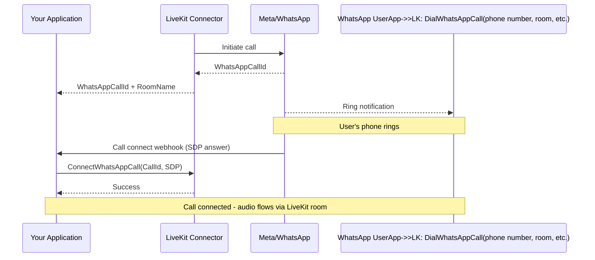
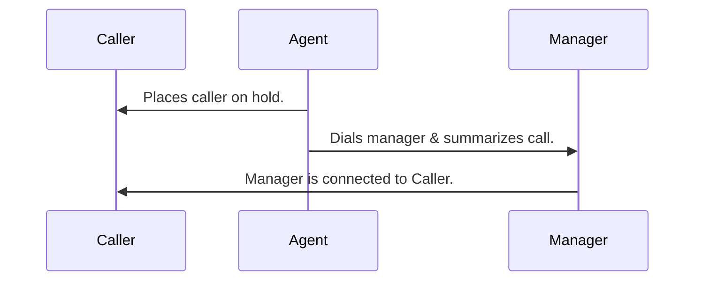
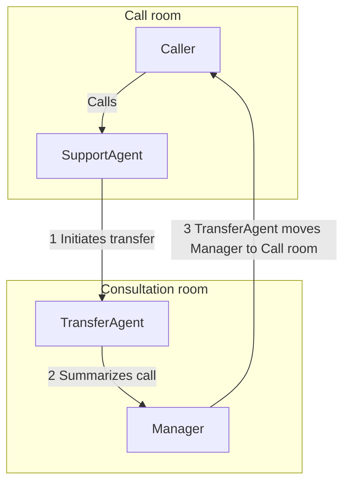

# Telephony & SIP Integration

Phone number provisioning, SIP trunking, providers (Twilio, Telnyx, Plivo), call transfers, and inbound/outbound call routing.

- **Total pages in this section**: 32
- **Successful retrieves**: 32
- **API References / Placeholders**: 0

## Table of Contents

1. [telephony/](#page-1) (✓)
2. [telephony/connectors/](#page-2) (✓)
3. [telephony/features/](#page-3) (✓)
4. [telephony/accepting-calls/](#page-4) (✓)
5. [telephony/making-calls/](#page-5) (✓)
6. [telephony/testing/](#page-6) (✓)
7. [telephony/accepting-calls/inbound-twilio](#page-7) (✓)
8. [telephony/features/secure-trunking/](#page-8) (✓)
9. [telephony/features/region-pinning/](#page-9) (✓)
10. [telephony/start/phone-numbers](#page-10) (✓)
11. [telephony/start/sip-trunk-setup/](#page-11) (✓)
12. [telephony/start/providers/](#page-12) (✓)
13. [telephony/connectors/whatsapp](#page-13) (✓)
14. [telephony/connectors/twilio](#page-14) (✓)
15. [telephony/features/dtmf/](#page-15) (✓)
16. [telephony/features/answering-machine-detection/](#page-16) (✓)
17. [telephony/features/transfers/](#page-17) (✓)
18. [telephony/features/hd-voice/](#page-18) (✓)
19. [telephony/accepting-calls/workflow-setup/](#page-19) (✓)
20. [telephony/accepting-calls/inbound-trunk/](#page-20) (✓)
21. [telephony/accepting-calls/dispatch-rule/](#page-21) (✓)
22. [telephony/making-calls/workflow-setup/](#page-22) (✓)
23. [telephony/making-calls/outbound-trunk/](#page-23) (✓)
24. [telephony/making-calls/outbound-calls/](#page-24) (✓)
25. [telephony/features/transfers/warm](#page-25) (✓)
26. [telephony/features/transfers/cold](#page-26) (✓)
27. [telephony/start/providers/twilio/](#page-27) (✓)
28. [telephony/start/providers/telnyx/](#page-28) (✓)
29. [telephony/start/providers/plivo/](#page-29) (✓)
30. [telephony/start/providers/wavix/](#page-30) (✓)
31. [telephony/start/providers/sinch/](#page-31) (✓)
32. [telephony/start/providers/didlogic/](#page-32) (✓)

---

<a name="page-1"></a>
## Page 1: telephony/
**Original URL:** https://docs.livekit.io/telephony/  
**Source MD URL:** https://docs.livekit.io/telephony.md

LiveKit docs › Telephony › Get Started › Introduction

---

# Telephony introduction

> LiveKit's telephony services enable seamless integration between traditional phone networks and LiveKit's realtime platform.

## Overview

LiveKit telephony lets you build AI-powered voice apps that handle inbound and outbound calls. It includes LiveKit Phone Numbers for purchasing and managing phone numbers, and supports integration with third-party SIP providers. Together, these features bridge traditional telephony with LiveKit's modern, realtime communication platform.

### LiveKit Phone Numbers

Purchase and manage phone numbers for your telephony apps directly through LiveKit. LiveKit Phone Numbers provides access to local and toll-free numbers in the United States, and is available in LiveKit Cloud. To learn more, see [LiveKit Phone Numbers](https://docs.livekit.io/telephony/start/phone-numbers.md).

### Telephony components

LiveKit telephony extends the [core primitives](https://docs.livekit.io/intro/basics/rooms-participants-tracks.md) — participant, room, and track — to include two additional components specific to telephony: trunks and dispatch rules. These components are represented by objects created through the [API](https://docs.livekit.io/reference/telephony/sip-api.md) and control how calls are handled.

#### Session Initiation Protocol (SIP) participant

A SIP participant is a LiveKit participant that represents a caller or callee in a call. SIP participants are the same as any other participant and are managed using the [participant APIs](https://docs.livekit.io/intro/basics/rooms-participants-tracks/participants.md). They have the same [attributes and metadata](https://docs.livekit.io/transport/data/state/participant-attributes.md) as other participants, and have additional [SIP specific attributes](https://docs.livekit.io/reference/telephony/sip-participant.md).

For inbound calls, a SIP participant is automatically created for each caller. For outbound calls, you need to explicitly create a SIP participant using the [`CreateSIPParticipant`](https://docs.livekit.io/reference/telephony/sip-api.md#createsipparticipant) API to make a call.

#### Trunks

LiveKit trunks bridge your third-party SIP provider and LiveKit. To use LiveKit, you must configure your SIP provider's trunking service to work with LiveKit. The setup depends on your use case — whether you're handling incoming calls, making outgoing calls, or both.

- [Inbound trunks](https://docs.livekit.io/telephony/accepting-calls/inbound-trunk.md) handle incoming calls and can be restricted to specific IP addresses or phone numbers.
- [Outbound trunks](https://docs.livekit.io/telephony/making-calls/outbound-trunk.md) are used to place outgoing calls. Outbound trunk configuration can be stored ahead of time or [passed inline](https://docs.livekit.io/telephony/making-calls/outbound-calls.md#inline-trunk) with each call.

Trunks can be region restricted to meet local telephony regulations.

> ℹ️ **Note**
> 
> The same SIP provider trunk can be associated with both an inbound and an outbound trunk in LiveKit. You only need to create an inbound trunk _once_. Outbound trunk configuration can also be stored once and reused, or passed inline per call.

#### Dispatch rules

[Dispatch Rules](https://docs.livekit.io/telephony/accepting-calls/dispatch-rule.md) are associated with a specific trunk and control how inbound calls are dispatched to LiveKit rooms. All callers can be placed in the same room or different rooms based on the dispatch rules. Multiple dispatch rules can be associated with the same trunk as long as each rule has a different pin.

Dispatch rules can also be used to add custom participant attributes to [SIP participants](https://docs.livekit.io/reference/telephony/sip-participant.md).

#### Connectors

Connectors bridge LiveKit rooms with external voice platforms such as WhatsApp Business and Twilio. They handle bidirectional audio, media processing, and codec translation so you can route voice from those platforms into LiveKit without configuring SIP trunks. Use connectors for WhatsApp voice, Twilio calls over websockets, or other supported integrations. See [Connectors](https://docs.livekit.io/telephony/connectors.md) for an overview and provider-specific setup.

## LiveKit supported SIP features

LiveKit telephony supports the following SIP features and protocols:

| SIP Feature | Status | Notes |
| SIP over UDP | ✅ Supported | Transport protocol for SIP signaling. |
| SIP over TCP | ✅ Supported | Transport protocol for SIP signaling. |
| SIP over TLS | ✅ Supported | Transport protocol for SIP signaling. |
| SIP Registration (REGISTER) | ❌ Not Supported |  |
| SIPRECT (SRS) | ❌ Not Supported |  |
| DTMF (RFC 2833 / RFC 4733) | ✅ Supported | To learn more, see [DTMF](https://docs.livekit.io/telephony/features/dtmf.md). |
| Video over SIP | ❌ Not Supported |  |
| Call Transfer (cold transfer) (REFER) | ✅ Supported | To learn more, see [Call forwarding](https://docs.livekit.io/telephony/features/transfers/cold.md). |
| Warm Transfer | ✅ Supported | To learn more, see [Agent-assisted transfer](https://docs.livekit.io/telephony/features/transfers/warm.md). |
| Caller ID (From header) | ✅ Supported |  |
| SIP OPTIONS | ✅ Supported |  |
| Realtime Transfer Protocol (RTP) | ✅ Supported | Network protocol for delivering audio and video media. |
| Secure RTP (SRTP) | ✅ Supported | Network protocol for delivering encrypted audio and video media. To learn more, see [Secure trunking](https://docs.livekit.io/telephony/features/secure-trunking.md). |

## Key concepts

Understand these core concepts to build effective telephony applications with LiveKit.

### Features

LiveKit telephony includes support for DTMF, call transfers, secure trunking, HD voice, region pinning, and noise cancellation. These features enable you to build production-ready telephony applications with advanced capabilities.

- **[Features overview](https://docs.livekit.io/telephony/features.md)**: Learn about the telephony features available in LiveKit.

### Accepting calls

Handle inbound calls by setting up inbound trunks, configuring dispatch rules, and integrating with your SIP provider. Inbound calls automatically create SIP participants that join LiveKit rooms.

- **[Accepting calls overview](https://docs.livekit.io/telephony/accepting-calls.md)**: Learn how to accept and handle inbound phone calls.

### Making calls

Place outbound calls using the SIP API to create SIP participants. You can pass trunk configuration inline with each call or use a stored outbound trunk. Outbound calls enable your applications to initiate phone calls programmatically.

- **[Making calls overview](https://docs.livekit.io/telephony/making-calls.md)**: Learn how to make outbound phone calls with LiveKit.

### Connectors

Connect LiveKit to external voice platforms such as WhatsApp and Twilio without SIP. Connectors stream audio in and out of LiveKit rooms and handle platform-specific media and codecs, so you can run agents or other realtime logic on calls from those services.

- **[Connectors overview](https://docs.livekit.io/telephony/connectors.md)**: Connect WhatsApp, Twilio, and other platforms to LiveKit rooms.

## Service architecture

LiveKit telephony relies on the following services:

- A Direct Inward Dialing (DID) number provided by LiveKit Phone Numbers or a third-party SIP provider. LiveKit supports most SIP providers out of the box.
- LiveKit server (part of LiveKit Cloud) for API requests, managing and verifying SIP trunks and dispatch rules, and creating participants and rooms for calls.
- LiveKit SIP (part of LiveKit Cloud) to respond to SIP requests, mediate trunk authentication, and match dispatch rules.

If you use LiveKit Cloud, LiveKit SIP is ready to use with your project without any additional configuration. If you're self hosting LiveKit, the SIP service needs to be deployed separately. To learn more about self hosting, see [SIP server](https://docs.livekit.io/transport/self-hosting/sip-server.md).


## Using LiveKit SIP

The LiveKit SIP SDK is available in multiple languages. To learn more, see [SIP API](https://docs.livekit.io/reference/telephony/sip-api.md).

LiveKit SIP has been tested with the following SIP providers:

- [Twilio](https://www.twilio.com/)
- [Telnyx](https://telnyx.com/)
- [Exotel](https://exotel.com)

- [Plivo](https://www.plivo.com)
- [Wavix](https://docs.wavix.com/sip-trunking/guides/livekit)
- [didlogic](https://didlogic.com)

> ℹ️ **Note**
> 
> LiveKit SIP is designed to work with all SIP providers. However, compatibility testing is limited to the providers below.

### Noise cancellation for calls

[Krisp](https://krisp.ai) noise cancellation uses AI models to identify and remove background noise in realtime. This improves the quality of calls that occur in noisy environments. For LiveKit telephony apps that use agents, noise cancellation improves the quality and clarity of user speech for turn detection, transcriptions, and recordings.

For incoming calls, see the [inbound trunks documentation](https://docs.livekit.io/telephony/accepting-calls/inbound-trunk.md) for the `krisp_enabled` attribute. For outgoing calls, see the [`CreateSIPParticipant`](https://docs.livekit.io/reference/telephony/sip-api.md#createsipparticipant) documentation for the `krisp_enabled` attribute used during [outbound call creation](https://docs.livekit.io/telephony/making-calls/outbound-calls.md).

## Getting started

See the following guides to get started with LiveKit telephony:

- **[SIP primer](https://docs.livekit.io/reference/telephony/sip-primer.md)**: Learn how SIP integrates with LiveKit to enable seamless call routing between telephony systems and LiveKit rooms.

- **[LiveKit Phone Numbers](https://docs.livekit.io/telephony/start/phone-numbers.md)**: Purchase a phone number through LiveKit Phone Numbers for inbound calls.

- **[SIP trunk setup](https://docs.livekit.io/telephony/start/sip-trunk-setup.md)**: Purchase a phone number and configure your SIP trunking provider for LiveKit.

- **[Accepting inbound calls](https://docs.livekit.io/sip/accepting-calls.md)**: Learn how to accept inbound calls with LiveKit.

- **[Making outbound calls](https://docs.livekit.io/sip/making-calls.md)**: Learn how to make outbound calls with LiveKit.

- **[Voice AI quickstart](https://docs.livekit.io/agents/start/voice-ai.md)**: Create an AI agent integrated with telephony.

- **[Testing your telephony setup](https://docs.livekit.io/telephony/testing.md)**: Place a test call and verify the room, SIP participant, and agent logs end to end.

## Recipes

The following recipes are particularly helpful to learn more about building telephony-based voice AI apps.

- **[Company Directory](https://docs.livekit.io/reference/recipes/company-directory.md)**: Build a AI company directory agent. The agent can respond to DTMF tones and voice prompts, then redirect callers.

- **[SIP Lifecycle](https://docs.livekit.io/reference/recipes/sip_lifecycle.md)**: Complete lifecycle management for SIP calls.

- **[Survey Caller](https://docs.livekit.io/reference/recipes/survey_caller.md)**: Automated survey calling system.

---

This document was rendered at 2026-08-28T04:22:10.307Z.
For the latest version of this document, see [https://docs.livekit.io/telephony.md](https://docs.livekit.io/telephony.md).

To explore all LiveKit documentation, see [llms.txt](https://docs.livekit.io/llms.txt).

---

<a name="page-2"></a>
## Page 2: telephony/connectors/
**Original URL:** https://docs.livekit.io/telephony/connectors/  
**Source MD URL:** https://docs.livekit.io/telephony/connectors.md

LiveKit docs › Telephony › Connectors › Overview

---

# Connectors

> Connect LiveKit to external voice communication platforms.

Available in (BETA):
- [ ] Node.js
- [ ] Python

## Overview

Connectors bridge LiveKit rooms with external voice communication platforms, enabling seamless integration between LiveKit and services like WhatsApp Business and Twilio. Each connector handles bidirectional audio streaming, media processing, mixing, and codec translations required for the specific platform.

All connector operations use LiveKit Server SDKs, providing a consistent API for managing calls across different platforms.

## Available connectors

LiveKit currently supports the following connectors:

| Connector | Description | Use cases |
| **WhatsApp** | Connect WhatsApp voice calls to LiveKit rooms. | Customer support with AI voice agents, outbound marketing campaigns, and multi-channel communication using voice and text. |
| **Twilio** | Connect Twilio phone calls to LiveKit rooms using websocket connections instead of traditional SIP. | Alternative to SIP for handling phone calls. |

## In this section

- **[WhatsApp connector](https://docs.livekit.io/telephony/connectors/whatsapp.md)**: Connect WhatsApp voice calls to LiveKit rooms.

- **[Twilio connector](https://docs.livekit.io/telephony/connectors/twilio.md)**: Connect Twilio phone calls to LiveKit rooms.

---

This document was rendered at 2026-08-28T04:22:10.165Z.
For the latest version of this document, see [https://docs.livekit.io/telephony/connectors.md](https://docs.livekit.io/telephony/connectors.md).

To explore all LiveKit documentation, see [llms.txt](https://docs.livekit.io/llms.txt).

---

<a name="page-3"></a>
## Page 3: telephony/features/
**Original URL:** https://docs.livekit.io/telephony/features/  
**Source MD URL:** https://docs.livekit.io/telephony/features.md

LiveKit docs › Telephony › Features › Overview

---

# Telephony features overview

> An overview of telephony features for LiveKit.

## Overview

LiveKit telephony includes advanced features for call handling, audio quality, security, and compliance. Use these features to build production-ready telephony applications with enhanced call quality, secure communications, and regulatory compliance.

## Telephony features

Enhance your telephony applications with advanced call handling, audio quality, security, and compliance features.

| Feature | Description | Use cases |
| **DTMF** | Support for Dual-tone Multi-Frequency (DTMF) tones, enabling integration with legacy IVR systems and allowing agents to receive DTMF input from callers. | IVR system integration, menu navigation, and collecting numeric input from callers. |
| **Answering machine detection** | Classify whether an outbound call is answered by a person, voicemail, IVR, or unavailable line so your agent can respond accordingly. | Outbound voice agents, voicemail handling, and bypassing automated systems. |
| **Region pinning** | Restrict network traffic to specific geographical regions to comply with local telephony regulations or data residency requirements. | Regulatory compliance, data residency requirements, and regional data isolation. |
| **Transfers** | Transfer calls between end users and agents, including call forwarding and agent-assisted transfers for seamless call routing. | Call center workflows, call escalation, and transferring calls between agents or departments. |
| **HD voice** | Support for high-fidelity audio using wideband codecs for superior call quality compared to traditional PSTN calls. | High-quality voice applications, professional call centers, and applications requiring clear audio. |
| **Secure trunking** | Encrypt signaling and media traffic using TLS and SRTP to protect calls from eavesdropping and man-in-the-middle attacks. | Secure communications, compliance requirements, and protecting sensitive call data. |

## In this section

Read more about each telephony feature.

- **[DTMF](https://docs.livekit.io/telephony/features/dtmf.md)**: Send and receive DTMF tones for integration with IVR systems.

- **[Answering machine detection](https://docs.livekit.io/telephony/features/answering-machine-detection.md)**: Classify outbound call answers as person, voicemail, IVR, or unavailable.

- **[Region pinning](https://docs.livekit.io/telephony/features/region-pinning.md)**: Isolate LiveKit traffic to specific regions for compliance.

- **[Transfers](https://docs.livekit.io/telephony/features/transfers.md)**: Transfer calls between end users and agents.

- **[HD voice](https://docs.livekit.io/telephony/features/hd-voice.md)**: Enable high-fidelity audio for superior call quality.

- **[Secure trunking](https://docs.livekit.io/telephony/features/secure-trunking.md)**: Encrypt signaling and media traffic for secure calls.

---

This document was rendered at 2026-08-28T04:22:10.255Z.
For the latest version of this document, see [https://docs.livekit.io/telephony/features.md](https://docs.livekit.io/telephony/features.md).

To explore all LiveKit documentation, see [llms.txt](https://docs.livekit.io/llms.txt).

---

<a name="page-4"></a>
## Page 4: telephony/accepting-calls/
**Original URL:** https://docs.livekit.io/telephony/accepting-calls/  
**Source MD URL:** https://docs.livekit.io/telephony/accepting-calls.md

LiveKit docs › Telephony › Accepting calls › Overview

---

# Accepting calls overview

> An overview of accepting inbound calls with LiveKit telephony.

## Overview

Accept inbound calls and route them to LiveKit rooms. Configure inbound trunks, dispatch rules, and workflows to handle incoming calls and connect callers with agents.

> ℹ️ **Simplified inbound calling**
> 
> LiveKit Phone Numbers provide a simple setup process that only requires purchasing a phone number and creating a dispatch rule. To learn more, see [LiveKit Phone Numbers](https://docs.livekit.io/telephony/start/phone-numbers.md).

## Accepting calls components

Set up inbound call handling with trunks, dispatch rules, and provider-specific configurations.

| Component | Description | Use cases |
| **Workflow & setup** | Overview of the inbound call workflow, from receiving an INVITE request to creating SIP participants and routing to rooms. | Understanding call flow, setting up inbound call handling, and learning how dispatch rules route calls to rooms. |
| **Inbound trunk** | Configure inbound trunks to accept incoming calls from SIP providers, with options to restrict calls by IP address or phone number. | Accepting calls from SIP providers, restricting inbound calls to specific sources, and configuring trunk authentication. |
| **Dispatch rule** | Create dispatch rules that control how callers are added as SIP participants and routed to rooms, including agent dispatch configuration. | Routing calls to specific rooms, configuring agent dispatch, and customizing how SIP participants join rooms. |
| **Twilio Voice integration** | Accept inbound calls using Twilio programmable voice with TwiML and Twilio conferencing integration. | Twilio Voice integration, TwiML-based call routing, and Twilio conferencing features. |

## In this section

Read more about accepting calls.

- **[Workflow & setup](https://docs.livekit.io/telephony/accepting-calls/workflow-setup.md)**: Overview of the inbound call workflow and setup process.

- **[Inbound trunk](https://docs.livekit.io/telephony/accepting-calls/inbound-trunk.md)**: Create and configure inbound trunks to accept incoming calls from SIP providers.

- **[Dispatch rule](https://docs.livekit.io/telephony/accepting-calls/dispatch-rule.md)**: Configure dispatch rules to route calls to rooms.

- **[Twilio Voice integration](https://docs.livekit.io/telephony/accepting-calls/inbound-twilio.md)**: Accept inbound calls using Twilio programmable voice.

---

This document was rendered at 2026-08-28T04:22:10.257Z.
For the latest version of this document, see [https://docs.livekit.io/telephony/accepting-calls.md](https://docs.livekit.io/telephony/accepting-calls.md).

To explore all LiveKit documentation, see [llms.txt](https://docs.livekit.io/llms.txt).

---

<a name="page-5"></a>
## Page 5: telephony/making-calls/
**Original URL:** https://docs.livekit.io/telephony/making-calls/  
**Source MD URL:** https://docs.livekit.io/telephony/making-calls.md

LiveKit docs › Telephony › Making calls › Overview

---

# Making calls overview

> An overview of making outbound calls with LiveKit telephony.

## Overview

Make outbound calls from LiveKit rooms to phone numbers using SIP providers. Pass trunk configuration [inline](https://docs.livekit.io/telephony/making-calls/outbound-calls.md#inline-trunk) with each call or use a stored [outbound trunk](https://docs.livekit.io/telephony/making-calls/outbound-trunk.md). Create SIP participants and set up workflows to initiate calls and connect participants with external phone numbers.

## Making calls components

Set up outbound call handling with trunks, SIP participant creation, and call configuration.

| Component | Description | Use cases |
| **Workflow & setup** | Overview of the outbound call workflow, from creating a SIP participant to connecting to external phone numbers and routing to rooms. | Understanding outbound call flow, setting up outbound call handling, and learning how SIP participants initiate calls. |
| **Outbound trunk** | Store reusable outbound trunk configuration for making outgoing calls through SIP providers. You can also pass trunk configuration [inline](https://docs.livekit.io/telephony/making-calls/outbound-calls.md#inline-trunk) with each call instead of creating a stored trunk. | Reusing trunk configuration across calls, configuring trunk authentication, and setting up region pinning for outbound calls. |
| **Outbound calls** | Create SIP participants to make outbound calls, configure call settings, and connect participants to external phone numbers. | Initiating outbound calls, creating SIP participants programmatically, and connecting agents to phone numbers. |
| **Answering machine detection** | Classify whether an outbound call reaches a person, voicemail, IVR, or unavailable line so your agent can respond accordingly. | Outbound voice agents, voicemail handling, and bypassing automated systems. |

## In this section

Read more about making calls.

- **[Workflow & setup](https://docs.livekit.io/telephony/making-calls/workflow-setup.md)**: Overview of the outbound call workflow and setup process.

- **[Outbound trunk](https://docs.livekit.io/telephony/making-calls/outbound-trunk.md)**: Store reusable outbound trunk configuration for outgoing calls.

- **[Outbound calls](https://docs.livekit.io/telephony/making-calls/outbound-calls.md)**: Create SIP participants to make outbound calls.

- **[Answering machine detection](https://docs.livekit.io/telephony/features/answering-machine-detection.md)**: Detect whether a person, voicemail, or IVR system answered an outbound call.

---

This document was rendered at 2026-08-28T04:22:10.207Z.
For the latest version of this document, see [https://docs.livekit.io/telephony/making-calls.md](https://docs.livekit.io/telephony/making-calls.md).

To explore all LiveKit documentation, see [llms.txt](https://docs.livekit.io/llms.txt).

---

<a name="page-6"></a>
## Page 6: telephony/testing/
**Original URL:** https://docs.livekit.io/telephony/testing/  
**Source MD URL:** https://docs.livekit.io/telephony/testing.md

LiveKit docs › Telephony › Testing › Testing your setup

---

# Testing your telephony setup

> Place a test call and inspect the resulting room, SIP participant, and logs.

## Overview

After you configure your trunks, dispatch rules, and agent, place a test call to validate the setup. A successful call confirms that LiveKit and your caller or callee can reach each other, that a SIP participant is created with the expected attributes, and that your agent joins the room and responds. When a call fails, the same checks help you isolate where it broke down. The verifications in this topic apply to both inbound and outbound calls.

The exact setup you validate depends on how you provisioned your number:

- **[LiveKit Phone Numbers](https://docs.livekit.io/telephony/start/phone-numbers.md):** Inbound calls only require a dispatch rule. There are no third-party SIP trunks or trunk credentials to verify, so you can skip the trunk-specific and provider-side steps below.
- **Third-party SIP provider (Twilio, Telnyx, Plivo, Wavix, Exotel, and others):** Inbound calls require both an inbound trunk and a dispatch rule. Outbound calls require trunk configuration, either [inline](https://docs.livekit.io/telephony/making-calls/outbound-calls.md#inline-trunk) with each call or via a stored [outbound trunk](https://docs.livekit.io/telephony/making-calls/outbound-trunk.md).

## Pre-call checks

Before placing a test call, confirm the following prerequisites:

- The phone number is provisioned and assigned:

- For [LiveKit Phone Numbers](https://docs.livekit.io/telephony/start/phone-numbers.md), run `lk number list` or review [Phone numbers](https://cloud.livekit.io/projects/p_/telephony/phone-numbers) to list the phone numbers you own.
- For third-party providers, run `lk sip inbound list` or `lk sip outbound list`, or review [SIP trunks](https://cloud.livekit.io/projects/p_/telephony/trunks) and confirm there is a trunk associated with the correct phone number.
- A dispatch rule exists (for inbound calls):

- For LiveKit Phone Numbers, run `lk number list` and verify there is an assigned dispatch rule in the **SIP Dispatch Rules** column for the phone number you want to test.
- For third-party providers, run `lk sip dispatch list` or review [Dispatch rules](https://cloud.livekit.io/projects/p_/telephony/dispatch) for all dispatch rules. A dispatch rule must match the inbound trunk (for example, via the `trunks` parameter, or by omitting the parameter to match all trunks).
- An agent worker is running, connected to LiveKit, and available for dispatch with the expected `agent_name`. Verify the worker is up by hitting its [health check endpoint](https://docs.livekit.io/agents/server/options.md#health-check), or check the [Agents dashboard](https://cloud.livekit.io/projects/p_/agents) in LiveKit Cloud. When using explicit agent dispatch through `roomConfig.agents`, the `agent_name` in the dispatch rule must match the name your agent worker registers with. If you don't have an agent, see [Create a test agent](#test-agent).
- For third-party providers: trunk credentials match between LiveKit and the SIP provider. A mismatch returns [403 Forbidden](https://docs.livekit.io/reference/telephony/troubleshooting.md#403-error). LiveKit Phone Numbers don't require trunk credentials.

### Create a test agent

If you don't already have an agent to test with, follow the [Voice AI quickstart](https://docs.livekit.io/agents/start/voice-ai.md) to create a base agent. Add a way for the agent to end the call when the conversation is complete:

- **Prebuilt tool:** add the [`EndCallTool`](https://docs.livekit.io/agents/prebuilt/tools/end-call-tool.md) to your agent's tools.
- **Custom implementations:** use the `delete_room` pattern shown in [Hang up](https://docs.livekit.io/telephony/making-calls/outbound-calls.md#hangup).

> ℹ️ **Agent names must match**
> 
> For inbound calls, configure the dispatch rule to send calls to your agent, and ensure the `agent_name` matches in both the rule and your code. If you're using the quickstart, the default is `my-agent`. For details, see [Dispatch to an agent](https://docs.livekit.io/telephony/accepting-calls/dispatch-rule.md#dispatch-to-an-agent).

## Place a test call

Test your telephony setup with a phone call.

### Test inbound calls

Dial the phone number from any phone. Your agent should answer the call. If the phone rings but the agent doesn't respond, confirm the agent is running and registered with the expected `agent_name`. To learn more, see [Call rings, but agent doesn't answer](https://docs.livekit.io/reference/telephony/troubleshooting.md#agent-never-answers).

After the caller and the agent are connected and in the same room, continue verifying the call with [Verify the room](#verify-the-room).

If the call doesn't connect:

- **LiveKit Phone Numbers:** review the call logs in the LiveKit Cloud [Telephony dashboard](https://cloud.livekit.io/projects/p_/telephony).
- **Third-party SIP provider:** review provider-side logs first (see [Provider-side verification](#provider-side-verification)), then the call logs in the LiveKit Cloud [Telephony dashboard](https://cloud.livekit.io/projects/p_/telephony).
- **Review agent logs:** review the [agent worker logs](#logs) to confirm the agent didn't encounter any errors while trying to start a session.

For additional troubleshooting, see the [SIP troubleshooting guide](https://docs.livekit.io/reference/telephony/troubleshooting.md) for common issues and solutions. For deeper context, see the [SIP primer](https://docs.livekit.io/reference/telephony/sip-primer.md) for an overview of how SIP calls flow in LiveKit, and the [SIP handshake](https://docs.livekit.io/reference/telephony/sip-handshake.md) guide for details on the handshake process.

### Test outbound calls

Outbound calls require a third-party SIP provider. LiveKit Phone Numbers do not currently support outbound calling. You can configure trunk settings [inline](https://docs.livekit.io/telephony/making-calls/outbound-calls.md#inline-trunk) with each call or use a stored [outbound trunk](https://docs.livekit.io/telephony/making-calls/outbound-trunk.md).

Place an outgoing call using the [`CreateSIPParticipant`](https://docs.livekit.io/reference/telephony/sip-api.md#createsipparticipant) API. The destination phone should ring. If your agent initiates the call, your agent is already in the room when the callee answers. This is the typical setup for outbound calls. To learn more, see [Agent initiated outbound calls](https://docs.livekit.io/telephony/making-calls/outbound-calls.md#agent-calls).

If you initiate the call using the server API or CLI, you must [dispatch an agent](https://docs.livekit.io/agents/server/agent-dispatch.md#via-api) to the room.

#### Outbound call flow

If an outbound call doesn't go through, work through the following checkpoints in order to isolate where it failed:

- **`CreateSIPParticipant` request:** the API call succeeds and returns a `SIPParticipantInfo` object. A `ServerError` here means the request itself was rejected before any SIP traffic was sent. Verify `sip_call_to` and `room_name` are valid, and that you've provided either `sip_trunk_id` or inline `trunk` configuration. For details, see [Creating a SIP participant](https://docs.livekit.io/telephony/making-calls/outbound-calls.md#creating-a-sip-participant).
- **Outbound trunk resolution:** LiveKit resolves the trunk configuration, either from `sip_trunk_id` or from the inline `trunk` parameter. If using a stored trunk, run `lk sip outbound list` and confirm the trunk exists, the `address` points to the provider's SIP endpoint (no subdomain or extra path), and the `transport` is correct. If using inline config, verify the `hostname` is correct. A 503 response often indicates a wrong address. See [503 - Service Unavailable](https://docs.livekit.io/reference/telephony/troubleshooting.md#503-solution). For details, see [SIP outbound trunk](https://docs.livekit.io/telephony/making-calls/outbound-trunk.md).
- **INVITE to the SIP provider:** LiveKit sends a SIP INVITE to the trunk's `address`. The trunk's `auth_username` and `auth_password` must match what the provider expects. A credential mismatch returns [403 Forbidden](https://docs.livekit.io/reference/telephony/troubleshooting.md#403-error).
- **Provider or downstream response:** if the INVITE is accepted by the provider but the call fails, inspect the final SIP response code (for example, 404, 486, 603) in provider logs.

If you can't isolate the step from API errors and participant attributes alone, download the [PCAP](https://docs.livekit.io/reference/telephony/troubleshooting.md#pcaps) of the call and walk the [SIP handshake](https://docs.livekit.io/reference/telephony/sip-handshake.md) to find the first non-success response.

## Verify the room

Each call creates a LiveKit room. Confirm the room was created with the name configured by the dispatch rule:

```shell
lk room list

```

For an individual dispatch rule with `roomPrefix: "call-"`, the room name follows the pattern `call-<random_suffix>`. For a direct dispatch rule, the room name matches `roomName` exactly.

### Verification criteria

- **Room exists:** indicates the dispatch rule matched and LiveKit attempted to create a room for the call.
- **Correct room name or prefix:** confirms the intended dispatch rule matched. If the name is incorrect, multiple dispatch rules might be competing. Rules without a `trunks` filter match all trunks.
- **Agent participant present:** confirms [agent dispatch](https://docs.livekit.io/agents/server/agent-dispatch.md). If the agent is missing, review the agent worker [logs](#logs) and verify that its `agent_name` matches an entry in `roomConfig.agents[]` on the dispatch rule.

## Verify the SIP participant

Every caller joins as a [SIP participant](https://docs.livekit.io/reference/telephony/sip-participant.md) with attributes that describe the call. List participants in the test room:

```shell
lk room participants list <ROOM_NAME>

```

Retrieve full details, including attributes, for the SIP participant:

```shell
lk room participants get --room <ROOM_NAME> <PARTICIPANT_ID>

```

Confirm the following attributes are set as expected:

| Attribute | Expected value |
| `kind` | Equals `SIP`. Any other value indicates the wrong participant is being inspected. |
| `sip.trunkPhoneNumber` | For inbound calls, the number that was dialed. For outbound calls, the caller ID presented via the trunk. |
| `sip.phoneNumber` | Matches the caller's phone number (inbound) or the dialed destination (outbound). Not present if `HidePhoneNumber` is set on the dispatch rule. |
| `sip.trunkID` | For third-party providers, matches the trunk ID created during setup. A different value indicates that another trunk matched the call. For LiveKit Phone Numbers, this references a LiveKit-managed trunk and does not need to be verified. |
| `sip.ruleID` | Matches the dispatch rule ID (inbound only). Confirms that the expected rule matched. |
| `sip.callID` and `sip.callIDFull` | Present and non-empty. Use these values to [cross-reference calls](https://docs.livekit.io/reference/telephony/troubleshooting.md#call-ids) against provider logs. |
| Provider-specific attributes | For Twilio trunks, `sip.twilio.callSid` and `sip.twilio.accountSid` are populated. Use the call SID to locate the call in the Twilio Console. |
| Custom attributes | Any attributes configured through the dispatch rule or `headers_to_attributes` appear alongside the standard SIP attributes. |

For the full list of attributes, see [SIP participant](https://docs.livekit.io/reference/telephony/sip-participant.md).

## Inspect LiveKit and agent logs

With the SIP participant in the room, the agent should log the join and begin responding. Review the following log sources:

- **Agent worker logs:** confirm the agent received the job, connected to the room, and started publishing audio. Log the participant `kind` and SIP attributes at the start of the entrypoint to verify what the agent observes. See [Identifying SIP callers](https://docs.livekit.io/telephony/accepting-calls/workflow-setup.md#identifying-sip-callers).

You can view agent worker logs in the LiveKit Cloud [Agents dashboard](https://cloud.livekit.io/projects/p_/agents). To learn more about viewing runtime logs, see [Log collection](https://docs.livekit.io/deploy/agents/logs.md).
- **LiveKit Cloud Sessions:** open the [session](https://cloud.livekit.io/projects/p_/sessions) for the test call to review participant join and leave events, published tracks, and timing.
- **Call ID cross-reference:** use `sip.callID` or `sip.callIDFull` to correlate agent logs with LiveKit Cloud and the SIP provider. See [Cross-referencing calls with Call IDs](https://docs.livekit.io/reference/telephony/troubleshooting.md#call-ids).

## Provider-side verification

This section applies to third-party SIP providers only. If you're using LiveKit Phone Numbers, the inbound path is fully managed by LiveKit and there is no provider-side dashboard to inspect. Use the LiveKit Cloud [Telephony dashboard](https://cloud.livekit.io/projects/p_/telephony) instead.

When a call fails before reaching LiveKit, the SIP provider's logs are the primary diagnostic source. The following list includes some common locations:

- **Twilio:** Call logs. Sign in to the [Twilio console](https://console.twilio.com/) and select **Products & Services** » **Voice** » **Logs**. Use the Twilio call SID from `sip.twilio.callSid` to locate the call.
- **Telnyx:** [Generate CDR reports](https://portal.telnyx.com/#/reporting/detailed-records).
- **Plivo:** [Voice logs](https://cx.plivo.com/logs).
- **Wavix:** [Call history logs](https://app.wavix.com/logs).

For other providers, each offers a call detail record (CDR) or SIP debug view in its portal. Review SIP response codes and the trunk that handled the call.

Verify the following on the provider side:

- The call reached the correct trunk or endpoint.
- The transport on the call matches what the trunk is configured for: `transport=udp`, `transport=tcp`, or `transport=tls` (for [secure trunking](https://docs.livekit.io/telephony/features/secure-trunking.md)):

- For inbound calls, the provider directs the call to the LiveKit SIP URI using the configured transport.
- For outbound calls, the provider receives the INVITE from LiveKit on the configured transport.
- Check the final SIP response code on the call. A non-200 response (for example, 403 or 404) indicates a [specific troubleshooting path](https://docs.livekit.io/reference/telephony/troubleshooting.md):

- For inbound calls, this is LiveKit's response to the provider's INVITE.
- For outbound calls, this is the provider's (or downstream PSTN's) response to LiveKit's INVITE.

## Test hangups and failure paths

In addition to verifying successful call connections, test hangups and failure scenarios.

- Confirm the agent handles hangups cleanly and ends the session. To learn more, see [Hang up](https://docs.livekit.io/telephony/making-calls/outbound-calls.md#hangup).
- Test pre-answer failure paths for outbound calls. Use `wait_until_answered=True` (Python) or `waitUntilAnswered: true` (Node.js) and call a number that rejects the call (`USER_REJECTED`) or one that doesn't answer (`USER_UNAVAILABLE`). Confirm your code catches the `SipCallError` and reads its SIP status code. See [Catching call failures](https://docs.livekit.io/telephony/making-calls/outbound-calls.md#catch-failures).
- Test mid-call disconnections. After the call connects, have the caller or callee hang up. The SIP participant disconnects with `CLIENT_INITIATED`, and by default `AgentSession` (via `RoomIO`) automatically closes the session for that reason. If you need custom logic, register a `participant_disconnected` handler and inspect [`disconnect_reason`](https://docs.livekit.io/reference/telephony/sip-participant.md#disconnect-reasons). See [Handling mid-call disconnections](https://docs.livekit.io/telephony/making-calls/outbound-calls.md#mid-call-disconnections).

To learn more, see [Handling call outcomes](https://docs.livekit.io/telephony/making-calls/outbound-calls.md#call-outcomes).

## Additional resources

The following resources provide additional details about the topics covered in this guide.

- **[SIP primer](https://docs.livekit.io/reference/telephony/sip-primer.md)**: Learn how SIP integrates with LiveKit to enable seamless call routing between telephony systems and LiveKit rooms.

- **[SIP troubleshooting](https://docs.livekit.io/reference/telephony/troubleshooting.md)**: Troubleshoot SIP issues and common error codes.

---

This document was rendered at 2026-08-28T04:22:10.272Z.
For the latest version of this document, see [https://docs.livekit.io/telephony/testing.md](https://docs.livekit.io/telephony/testing.md).

To explore all LiveKit documentation, see [llms.txt](https://docs.livekit.io/llms.txt).

---

<a name="page-7"></a>
## Page 7: telephony/accepting-calls/inbound-twilio
**Original URL:** https://docs.livekit.io/telephony/accepting-calls/inbound-twilio  
**Source MD URL:** https://docs.livekit.io/telephony/accepting-calls/inbound-twilio.md

LiveKit docs › Telephony › Accepting calls › Twilio Voice integration

---

# Twilio Voice integration

> How to use LiveKit SIP with TwiML and Twilio conferencing.

## Inbound calls with Twilio programmable voice

Accept inbound calls using Twilio programmable voice. You need an inbound trunk and a dispatch rule created using the LiveKit CLI (or SDK) to accept calls and route callers to LiveKit rooms. The following steps guide you through the process.

> ℹ️ **Unsupported features**
> 
> This method doesn't support [SIP REFER](https://docs.livekit.io/telephony/features/transfers/cold.md) or outbound calls. To use these features, switch to Elastic SIP Trunking. For details, see the [Configuring Twilio SIP trunks](https://docs.livekit.io/telephony/start/providers/twilio.md) quickstart.

### Step 1. Purchase a phone number from Twilio

If you don't already have a phone number, see [How to Search for and Buy a Twilio Phone Number From Console](https://help.twilio.com/articles/223135247-How-to-Search-for-and-Buy-a-Twilio-Phone-Number-from-Console).

### Step 2. Set up a TwiML Bin

> ℹ️ **Other approaches**
> 
> This guide uses TwiML Bins, but you can also return TwiML via another mechanism, such as a webhook.

TwiML Bins are a simple way to test TwiML responses. Use a TwiML Bin to redirect an inbound call to LiveKit.

To create a TwiML Bin, follow these steps:

1. Sign in to the [Twilio console](https://console.twilio.com/).
2. Select **Develop** » **TwiML Bins**.
3. Create a TwiML Bin and add the following contents:

```xml
<?xml version="1.0" encoding="UTF-8"?>
<Response>
  <Dial>
    <Sip username="<sip_trunk_username>" password="<sip_trunk_password>">
      sip:<your_phone_number>@%{sipHost}%;transport=tcp
    </Sip>
  </Dial>
</Response>

```

### Step 3. Direct phone number to the TwiML Bin

Configure incoming calls to a specific phone number to use the TwiML Bin you just created:

1. Sign in to the [Twilio console](https://console.twilio.com/).
2. Select **Products & Services** » **Numbers & Senders** » **Overview**.
3. In the **Phone Numbers** section, select the purchased phone number.
4. In the **Configuration details** section, select **Voice and emergency calling** » select **Edit voice configuration**.
5. In the **How do you want to configur this number?** section, for **Select a method**, select **Webhook, TwiML Bin, Function, Studio Flow, Proxy Service**.
6. In the **How do you want to set up your primary method?**, for **Select your primary method**, select **Use TwiML Bins**.
7. Select the TwiML Bin you just created for **Select a TwiML Bin**.
8. Select **Save**.

### Step 4. Create a LiveKit inbound trunk

Use the LiveKit CLI to create an [inbound trunk](https://docs.livekit.io/telephony/accepting-calls/inbound-trunk.md) for the purchased phone number.

1. Create an `inbound-trunk.json` file with the following contents. Replace the phone number with the one purchased from Twilio:

```json
{
  "trunk": {
    "name": "My inbound trunk",
    "numbers": ["<your_phone_number>"]
  }
}

```
2. Use the CLI to create an inbound trunk. Pass the same username and password that you specified in the TwiML Bin using the `--auth-user` and `--auth-pass` flags:

```shell
lk sip inbound create inbound-trunk.json \
  --auth-user <sip_trunk_username> \
  --auth-pass <sip_trunk_password>

```

### Step 5. Create a dispatch rule to place each caller into their own room.

Use the LiveKit CLI to create a [dispatch rule](https://docs.livekit.io/telephony/accepting-calls/dispatch-rule.md) that places each caller into individual rooms named with the prefix `call`.

1. Create a `dispatch-rule.json` file with the following contents:

```json
{
  "dispatch_rule":
   {
     "rule": {
       "dispatchRuleIndividual": {
         "roomPrefix": "call-"
       }
     }
   }
}

```
2. Create the dispatch rule using the CLI:

```shell
lk sip dispatch create dispatch-rule.json

```

If you already have a default [caller dispatch rule](https://docs.livekit.io/telephony/accepting-calls/dispatch-rule.md#individual-dispatch-rule) and want to match a specific trunk, create the dispatch rule using the `trunks` flag with the ID of the trunk you just created:

```shell
lk sip dispatch create dispatch-rule.json --trunks "<trunk-id>"

```

### Testing with an agent

Follow the [Voice AI quickstart](https://docs.livekit.io/agents/start/voice-ai.md) to create an agent that responds to incoming calls. Add the prebuilt [EndCallTool](https://docs.livekit.io/agents/prebuilt/tools/end-call-tool.md) to your agent's tools so the agent can hang up the call when the conversation is complete. For a custom implementation, see [Hang up](https://docs.livekit.io/telephony/accepting-calls/workflow-setup.md#hangup). Then call the phone number and your agent should pick up the call.

After your agent answers, validate the setup end to end by following the [Testing your telephony setup](https://docs.livekit.io/telephony/testing.md) checklist to confirm the room, SIP participant attributes, and agent dispatch all match what you expect.

## Multi-number routing

To route calls from different phone numbers to different agents (for example, one number for English support and another for Spanish), create a separate inbound trunk and dispatch rule for each number.

### Step 1. Set up a TwiML Bin for each number

Create a [TwiML Bin](#step-2-set-up-a-twiml-bin) for each phone number. Each TwiML Bin uses the same LiveKit SIP host but includes the specific phone number in the SIP URI.

> ℹ️ **Differentiating trunks**
> 
> Each TwiML Bin uses a different phone number, username, and password.

**English number TwiML Bin:**

```xml
<?xml version="1.0" encoding="UTF-8"?>
<Response>
  <Dial>
    <Sip username="<english_trunk_username>" password="<english_trunk_password>">
      sip:<english_phone_number>@%{sipHost}%;transport=tcp
    </Sip>
  </Dial>
</Response>

```

**Spanish number TwiML Bin:**

```xml
<?xml version="1.0" encoding="UTF-8"?>
<Response>
  <Dial>
    <Sip username="<spanish_trunk_username>" password="<spanish_trunk_password>">
      sip:<spanish_phone_number>@%{sipHost}%;transport=tcp
    </Sip>
  </Dial>
</Response>

```

[Direct each Twilio phone number](#step-3-direct-phone-number-to-the-twiml-bin) to its corresponding TwiML Bin.

### Step 2. Create a LiveKit inbound trunk for each number

Create an [inbound trunk](https://docs.livekit.io/telephony/accepting-calls/inbound-trunk.md) for each phone number. Use the credentials from the corresponding TwiML Bin.

**english-trunk.json:**

```json
{
  "trunk": {
    "name": "English support trunk",
    "numbers": ["<english_phone_number>"]
  }
}

```

**spanish-trunk.json:**

```json
{
  "trunk": {
    "name": "Spanish support trunk",
    "numbers": ["<spanish_phone_number>"]
  }
}

```

Create both trunks using the CLI. Pass the credentials from each TwiML Bin using the `--auth-user` and `--auth-pass` flags:

```shell
lk sip inbound create english-trunk.json \
  --auth-user <english_trunk_username> \
  --auth-pass <english_trunk_password>
lk sip inbound create spanish-trunk.json \
  --auth-user <spanish_trunk_username> \
  --auth-pass <spanish_trunk_password>

```

Note the trunk IDs returned by each command.

### Step 3. Create a dispatch rule for each trunk

Create a [dispatch rule](https://docs.livekit.io/telephony/accepting-calls/dispatch-rule.md) for each trunk. Use the `trunks` flag to bind each rule to a specific trunk, and use `roomConfig` to [dispatch a different agent](https://docs.livekit.io/agents/server/agent-dispatch.md) for each number:

**english-dispatch.json:**

```json
{
  "dispatch_rule": {
    "rule": {
      "dispatchRuleIndividual": {
        "roomPrefix": "english-"
      }
    },
    "name": "English dispatch rule",
    "roomConfig": {
      "agents": [{
        "agentName": "english-agent"
      }]
    }
  }
}

```

**spanish-dispatch.json:**

```json
{
  "dispatch_rule": {
    "rule": {
      "dispatchRuleIndividual": {
        "roomPrefix": "spanish-"
      }
    },
    "name": "Spanish dispatch rule",
    "roomConfig": {
      "agents": [{
        "agentName": "spanish-agent"
      }]
    }
  }
}

```

Create both dispatch rules with their corresponding trunk IDs:

```shell
lk sip dispatch create english-dispatch.json --trunks "<english-trunk-id>"
lk sip dispatch create spanish-dispatch.json --trunks "<spanish-trunk-id>"

```

Now calls to the English number route to the `english-agent` and calls to the Spanish number route to the `spanish-agent`.

## Connecting to a Twilio phone conference

You can bridge Twilio conferencing to LiveKit via SIP, allowing you to add agents and other LiveKit clients to an existing Twilio conference. This requires the following setup:

- [Twilio conferencing](https://www.twilio.com/docs/voice/conference).
- LiveKit [inbound trunk](https://docs.livekit.io/telephony/accepting-calls/inbound-trunk.md).
- LiveKit [voice AI agent](https://docs.livekit.io/agents/start/voice-ai.md).

The example in this section uses [Node](https://nodejs.org) and the [Twilio Node SDK](https://www.twilio.com/docs/libraries).

### Step 1. Set Twilio environment variables

You can find these values in your [Twilio Console](https://console.twilio.com/):

```shell
export TWILIO_ACCOUNT_SID=<twilio_account_sid>
export TWILIO_AUTH_TOKEN=<twilio_auth_token>

```

### Step 2. Bridge a Twilio conference and LiveKit SIP

Create a `bridge.js` file and update the `twilioPhoneNumber`, `conferenceSid`, `sipHost`, and `from` field for the API call in the following code:

```typescript
import twilio from 'twilio';

const accountSid = process.env.TWILIO_ACCOUNT_SID;
const authToken = process.env.TWILIO_AUTH_TOKEN;

const twilioClient = twilio(accountSid, authToken);

/**
 * Phone number bought from Twilio that is associated with a LiveKit trunk.
 * For example, +14155550100.
 * See https://docs.livekit.io/sip/quickstarts/configuring-twilio-trunk/
 */
const twilioPhoneNumber = '<sip_trunk_phone_number>';

/**
 * SIP host is available in your LiveKit Cloud project settings.
 * This is your project domain without the leading "sip:".
 */
const sipHost = '%{sipHost}%';

/**
 * The conference SID from Twilio that you want to add the agent to. You
 * likely want to obtain this from your conference status callback webhook handler.
 * The from field must contain the phone number, client identifier, or username
 * portion of the SIP address that made this call.
 * See https://www.twilio.com/docs/voice/api/conference-participant-resource#request-body-parameters
 */
const conferenceSid = '<twilio_conference_sid>';
await twilioClient.conferences(conferenceSid).participants.create({
    from: '<valid_from_value>',
    to: `sip:${twilioPhoneNumber}@${sipHost};transport=tcp`,
});

```

### Step 3. Execute the file

When you run the file, it bridges the Twilio conference to a new LiveKit session using the previously configured dispatch rule. This allows you to automatically [dispatch an agent](https://docs.livekit.io/agents/server/agent-dispatch.md) to the Twilio conference.

```shell
node bridge.js

```

---

This document was rendered at 2026-08-28T04:22:10.724Z.
For the latest version of this document, see [https://docs.livekit.io/telephony/accepting-calls/inbound-twilio.md](https://docs.livekit.io/telephony/accepting-calls/inbound-twilio.md).

To explore all LiveKit documentation, see [llms.txt](https://docs.livekit.io/llms.txt).

---

<a name="page-8"></a>
## Page 8: telephony/features/secure-trunking/
**Original URL:** https://docs.livekit.io/telephony/features/secure-trunking/  
**Source MD URL:** https://docs.livekit.io/telephony/features/secure-trunking.md

LiveKit docs › Telephony › Features › Secure trunking

---

# Secure trunking

> How to enable secure trunking for LiveKit SIP.

LiveKit SIP supports secure trunking using Transport Layer Security (TLS) to encrypt signaling traffic, and Secure Real-time Transport (SRTP) to encrypt media traffic. Encryption ensures that an Internet Service Provider (ISP) or an eavesdropping attacker (man-in-the-middle) cannot listen in on the conversation.

## Configure secure trunking for SIP calls

Setting up secure trunking requires multiple steps and includes enabling SRTP and TLS on your SIP trunking provider side, and enabling media encryption on your LiveKit trunks or on a per-call basis. The following sections provide instructions for enabling secure trunking with Twilio, Telnyx, and Plivo and setting up your LiveKit SIP trunks.

To secure calls you must complete all of the following steps:

1. Enable secure trunking with your SIP trunking provider.
2. Update your SIP URIs to use TLS for transport.
3. Enable media encryption for your LiveKit SIP trunks.

## Prerequisites

The following instructions assume you have already configured trunking with your SIP provider. If you haven't, see the [SIP trunk setup](https://docs.livekit.io/telephony/start/sip-trunk-setup.md) quickstart or select your provider-specific instructions from the navigation menu.

## Step 1: Enable secure trunking with your SIP trunking provider

Depending on your SIP trunking provider, you might need to explicitly enable secure trunking.

### Enable secure trunking with Twilio, Telnyx, and Plivo

**Twilio**:

1. Sign in to the [Twilio Console](https://console.twilio.com/).
2. Select **Develop** tab → **Elastic SIP Trunking** → **Manage** → **Trunks**.
3. Select the trunk you want to edit.
4. On the **General Settings** page, under **Features**, enable **Secure Trunking**.
5. Save your changes.

---

**Telnyx**:

1. Sign in to the [Telnyx Portal](https://portal.telnyx.com/).
2. Select **Real-Time Communications** → **Voice** → **SIP Trunking**.
3. Select the trunk you want to edit.
4. Select the **Inbound** tab.
5. For **SIP transport protocol**, select **TLS**.
6. For **Encrypted media**, select **SRTP**.
7. Save your changes.

---

**Plivo**:

1. Sign in to the [Plivo Console](https://cx.plivo.com/).
2. Navigate to **SIP Trunking** → [**Outbound Trunks**](https://cx.plivo.com/zentrunk/outbound-trunks/).
3. Select the trunk you want to edit.
4. For secure trunking, select the switch next to **Secure Trunking**.
5. Save your changes.

### Enable secure trunking for other providers

If you're using a different provider, check with them to see if you need to enable secure trunking.

## Step 2: Update your SIP URIs to use TLS

Enable TLS to encrypt signaling traffic.

### Update the origination URI in Twilio, Telnyx, or Plivo

The following instructions apply to inbound calls for Twilio, Telnyx, or Plivo.

**Twilio**:

1. Sign in to the [Twilio Console](https://console.twilio.com/).
2. Select the **Develop** tab → **Elastic SIP Trunking** → **Manage** → **Trunks**.
3. Select the trunk you want to edit → **Origination**.
4. Update the **Origination URI** to include `;transport=tls`.
5. Save your changes.

---

**Telnyx**:

1. Sign in to the [Telnyx Portal](https://portal.telnyx.com/).
2. Select **Real-Time Communications** → **Voice** → **SIP Trunking**.
3. Select the edit icon for your trunk → **Inbound settings**.
4. Select **Authentication and routing**.
5. In the **FQDN** section, select **Add FQDN**.
6. Add your SIP domain and port `5061` for TLS and save.
7. In the **Inbound calls routing** section, select the option you just added with port `5061`.
8. Save your changes.

---

**Plivo**:

1. Sign in to the [Plivo Console](https://cx.plivo.com/).
2. Navigate to **SIP Trunking** → [**Inbound Trunks**](https://cx.plivo.com/sip-trunking/inbound).
3. Select your inbound (origination) trunk.
4. Update the origination URI to use `;transport=tls` instead of `;transport=tcp`.
5. Save your changes.

### Update the origination URI for other providers

For other providers, set the origination URI to your SIP URI with `;transport=tls` appended to it. For example, if your SIP URI is:

`sip:bwwn08a2m4o.sip.livekit.cloud`

Set the origination URI to:

`sip:bwwn08a2m4o.sip.livekit.cloud;transport=tls`.

You can find your SIP URI on your LiveKit Cloud [project settings](https://cloud.livekit.io/projects/p_/settings) page.

If your provider doesn't support a SIP URI with URI parameters, you must enable TLS another way:

- Enable TLS in the trunk settings (required).
- If supported, set the port to `5061`, the default port for SIP over TLS.

> ℹ️ **TLS must be enabled**
> 
> Changing only the port number without enabling TLS is not enough. Some providers might treat port `5061` as a non-standard port for insecure UDP or TCP traffic.

Check your provider's documentation for exact steps.

## Step 3: Enable media encryption for your SIP trunks

Set the `media_encryption` parameter for your inbound or outbound trunks to either allow or require encryption. Valid values are as follows:

- `SIP_MEDIA_ENCRYPT_ALLOW`: Use media encryption if available.
- `SIP_MEDIA_ENCRYPT_REQUIRE`: Require media encryption.

By default, media encryption is turned off. To see all options, see the [API reference](https://docs.livekit.io/reference/telephony/sip-api.md#sipmediaencryption).

### Create an inbound trunk

Create an inbound trunk with media encryption enabled. To edit a trunk instead, see [Edit an existing trunk](#edit-trunk).

1. Sign in to your [Telephony → SIP trunks](https://cloud.livekit.io/projects/p_/telephony/trunks) dashboard.
2. Select **Create new trunk**.
3. Select the **JSON editor** tab and copy and paste the following contents. Replace the phone number with the one purchased from your SIP trunking provider.

```json
{
    "name": "My trunk",
    "numbers": [
      "+15105550100"
    ],
    "mediaEncryption": "SIP_MEDIA_ENCRYPT_ALLOW"
}

```
4. Select **Create**.

### Create an outbound trunk

For outbound calls, you can create a stored outbound trunk with media encryption enabled and [transport](https://docs.livekit.io/reference/telephony/sip-api.md#siptransport) protocol set to `SIP_TRANSPORT_TLS`. All calls made using this trunk use TLS and SRTP. You can also pass trunk configuration [inline](https://docs.livekit.io/telephony/making-calls/outbound-calls.md#inline-trunk) with each call or enable media encryption on a [call-by-call basis](#per-call-encryption).

Use the following instructions to create a new wildcard outbound trunk with SRTP and TLS enabled. The wildcard allows all calls to be routed to the same trunk. To edit a trunk instead, see [Edit an existing trunk](#edit-trunk).

1. Sign in to your [Telephony → SIP trunks](https://cloud.livekit.io/projects/p_/telephony/trunks) dashboard.
2. Select **Create new trunk**.
3. Select the **JSON editor** → select **Outbound** for **Trunk direction**.
4. Copy and paste the following contents. Replace the SIP trunking provider endpoint, and username and password for authentication.

```json
{
"name": "My outbound trunk",
"address": "<sip-trunking-provider-endpoint>",
"transport": "SIP_TRANSPORT_TLS",
"numbers": [
   "*"
],
"authUsername": "<username>",
"authPassword": "<password>",
"mediaEncryption": "SIP_MEDIA_ENCRYPT_ALLOW"
}

```
5. Select **Create**.

### Edit an existing trunk

Edit an existing inbound or outbound trunk to enable media encryption using the LiveKit Cloud dashboard.

- Sign in to your [Telephony → SIP trunks](https://cloud.livekit.io/projects/p_/telephony/trunks) dashboard.
- Navigate to the **Inbound** or **Outbound** section on the page.
- Select the more menu (**⋮**) next to the trunk you want to edit → **Configure trunk**.
- For _outbound_ trunks, for **Transport** select **TLS**.
- Expand the **Optional settings** section. Select either **Media encryption enabled** or **Media encryption required**.
- Select **Update**.

### Enable media encryption per call

You can enable media encryption on a per-call basis by setting the `media_encryption` parameter in the `CreateSIPParticipant` request. Valid values are as follows:

- `SIP_MEDIA_ENCRYPT_ALLOW`: Use media encryption if available.
- `SIP_MEDIA_ENCRYPT_REQUIRE`: Require media encryption.

> ℹ️ **SRTP must be enabled**
> 
> You must also enable SRTP on the SIP trunking provider side. If you haven't already enabled this, see [Step 1: Enable secure trunking with your SIP trunking provider](#enable-secure-trunking).

1. Create a `sip-participant.json` file with the following participant details:

```json
{
  "trunk": {
    "hostname": "<SIP server>",
    "auth_username": "<username>",
    "auth_password": "<password>",
    "transport": "SIP_TRANSPORT_TLS"
  },
  "sip_number": "<SIP provider number>",
  "sip_call_to": "<phone-number-to-dial>",
  "room_name": "my-sip-room",
  "participant_identity": "sip-test",
  "participant_name": "Test Caller",
  "wait_until_answered": true,
  "media_encryption": "SIP_MEDIA_ENCRYPT_ALLOW"
}

```

> ℹ️ **Stored outbound trunk**
> 
> You can also use a stored outbound trunk by passing `sip_trunk_id` instead of `trunk`. For details, see [Outbound trunk](https://docs.livekit.io/telephony/making-calls/outbound-trunk.md).
2. Create the SIP participant using the CLI. After you run this command, a call is made to the `<phone-number-to-dial>` number.

```shell
lk sip participant create sip-participant.json

```

## Supported cipher suites

A _cipher suite_ is a set of cryptographic algorithms used to secure network connections. Each cipher suite defines how data is encrypted, how message integrity is verified, and how keys are exchanged between parties. When establishing a secure connection, both sides negotiate which cipher suite to use based on mutual support and security preferences.

The following sections describe the TLS and SRTP cipher suites supported by LiveKit.

### Supported TLS cipher suites

All secure suites listed in [Go's crypto/tls package](https://go.dev/src/crypto/tls/cipher_suites.go).

### Supported SRTP cipher suites

The following SRTP cipher suites are supported:

- AES_CM_128_HMAC_SHA1_80
- AES_CM_128_HMAC_SHA1_32
- AES_256_CM_HMAC_SHA1_80
- AES_256_CM_HMAC_SHA1_32

---

This document was rendered at 2026-08-28T04:22:10.773Z.
For the latest version of this document, see [https://docs.livekit.io/telephony/features/secure-trunking.md](https://docs.livekit.io/telephony/features/secure-trunking.md).

To explore all LiveKit documentation, see [llms.txt](https://docs.livekit.io/llms.txt).

---

<a name="page-9"></a>
## Page 9: telephony/features/region-pinning/
**Original URL:** https://docs.livekit.io/telephony/features/region-pinning/  
**Source MD URL:** https://docs.livekit.io/telephony/features/region-pinning.md

LiveKit docs › Telephony › Features › Region pinning

---

# Region pinning for telephony

> Learn how to isolate LiveKit telephony traffic to a specific region.

## Overview

LiveKit SIP is part of LiveKit Cloud and runs as a globally distributed service, providing redundancy and high availability. By default, SIP endpoints are global, and calls are routed through the region closest to the origination point. Incoming calls are routed to the region closest to the SIP trunking provider's endpoint. Outgoing calls originate from the same region where the `CreateSIPParticipant` API call is made.

In most cases, using the global endpoint is the recommended approach. However, if you need to exercise more control over call routing — for example, to comply with local telephony regulations — LiveKit SIP supports region pinning. This allows you to restrict both incoming and outgoing calls to a specific region.

## Region pinning

Region pinning allows you to restrict calls to a specific region to comply with local telephony regulations. The following sections describe how to enable region pinning for inbound and outbound calls.

> ℹ️ **Protocol-based region pinning**
> 
> For realtime SDKs, you can use protocol-based region pinning to restrict traffic to a specific region. To learn more, see [Region pinning](https://docs.livekit.io/deploy/admin/regions/region-pinning.md).

### Inbound calls

To enable region pinning for incoming calls, configure your SIP trunking provider to use a region-based endpoint. A region-based endpoint is configured to direct traffic only to nodes within a specific region.

#### Region-based endpoint format

The endpoint format is as follows:

```
{sip_subdomain}.{region_name}.sip.livekit.cloud

```

Where:

- `{sip_subdomain}` is your LiveKit SIP URI subdomain. This is also your project ID without the `p_` prefix. You can find your SIP URI on the [Project settings](https://cloud.livekit.io/projects/p_/settings/project) page.

For example, if your SIP URI is `sip:bwwn08a2m4o.sip.livekit.cloud`, your SIP subdomain is `bwwn08a2m4o`.
- `{region_name}` is one of the following [regions](https://docs.livekit.io/deploy/admin/regions/endpoints.md#region-based-endpoints):

`aus`, `eu`, `india`, `japan`, `sa`, `uk`, `us`

For example to create a SIP endpoint for India, update `<your SIP subdomain>` in the following string:

```shell
<your SIP subdomain>.india.sip.livekit.cloud

```

For the current list of available regions, see [Region-based endpoints for SIP](https://docs.livekit.io/deploy/admin/regions/endpoints.md#region-based-endpoints).

Use the region-based endpoint to configure your SIP trunking provider. Follow the instructions for external provider setup in [SIP trunk setup](https://docs.livekit.io/telephony/start/sip-trunk-setup.md).

### Outbound calls

To originate calls from the same region as the destination phone number, set the `destination_country` parameter on your trunk configuration. This works with both [inline trunk configuration](https://docs.livekit.io/telephony/making-calls/outbound-calls.md#inline-trunk) and stored [outbound trunks](https://docs.livekit.io/telephony/making-calls/outbound-trunk.md). When `destination_country` is set, outbound calls originate from a server within the specified country. If the country code doesn't match any supported region, the parameter has no effect and calls are routed using default behavior.

In the unlikely event that the preferred region is non-operational or offline, calls originate from another region nearby. For the current list of supported regions, see [Destination country for outbound calls](https://docs.livekit.io/deploy/admin/regions/endpoints.md#destination-country).

For a full list of parameters for outbound trunks, see [CreateSIPOutboundTrunk](https://docs.livekit.io/reference/telephony/sip-api.md#createsipoutboundtrunk).

#### Example: inline trunk with region pinning

Pass `destination_country` in the [inline trunk configuration](https://docs.livekit.io/telephony/making-calls/outbound-calls.md#inline-trunk) when creating a SIP participant. The following example sets the destination country to India.

1. Create a file named `sip-participant.json` with the inline trunk configuration and `destination_country` set to `in`:

```json
 {
   "trunk": {
     "hostname": "<SIP server>",
     "auth_username": "<username>",
     "auth_password": "<password>",
     "destination_country": "in"
   },
   "sip_number": "+15105550100",
   "sip_call_to": "<phone-number-to-dial>",
   "room_name": "my-sip-room",
   "participant_identity": "sip-test"
 }

```
2. Create the SIP participant using the CLI:

```shell
lk sip participant create sip-participant.json

```

#### Example: stored outbound trunk with region pinning

You can also set `destination_country` on a stored [outbound trunk](https://docs.livekit.io/telephony/making-calls/outbound-trunk.md) to apply region pinning to all calls made through the trunk. The following example creates an outbound trunk that originates calls from India.

1. Create a file named `outbound-trunk.json`:

```json
{
  "trunk": {
    "name": "My outbound trunk",
    "address": "<my-trunk>.pstn.twilio.com",
    "numbers": ["+15105550100"],
    "auth_username": "myusername",
    "auth_password": "mypassword",
    "destination_country": "in"
  }
}

```
2. Create the outbound trunk using the CLI:

```shell
lk sip outbound create outbound-trunk.json

```

## Inbound call fallbacks

Region pinning restricts inbound calls to a single region. If instead you want to keep using the global endpoint but add redundancy, you can configure your SIP trunking provider with fallback endpoints.

By default, inbound calls use your global SIP endpoint, and LiveKit Cloud routes each call to the nearest available region. If a region becomes unavailable, LiveKit Cloud fails over to the next-nearest region automatically, so most applications don't need extra configuration for regional redundancy.

For more control over failover, most SIP trunking providers let you configure multiple endpoints on a single trunk and set the order in which they're tried. You can add one or more [region-based endpoints](#region-based-endpoint) as fallbacks behind your global endpoint. The provider tries the global endpoint first, then fails over to a specific region if the global endpoint doesn't respond.

To configure provider-side fallbacks, follow the instructions for your provider:

- Twilio: [Configure inbound fallbacks](https://docs.livekit.io/telephony/start/providers/twilio.md#inbound-fallbacks).
- Telnyx: [Configure inbound fallbacks](https://docs.livekit.io/telephony/start/providers/telnyx.md#inbound-fallbacks).

## Additional resources

The following additional topics provide more information about regions and region pinning.

- **[Region pinning](https://docs.livekit.io/deploy/admin/regions/region-pinning.md)**: Restrict network traffic to specific regions with protocol-based region pinning and realtime SDKs.

- **[Regions, regional endpoints, static IPs](https://docs.livekit.io/deploy/admin/regions/endpoints.md)**: Regions, endpoints, and static IP addresses for connecting to LiveKit Cloud.

- **[Agent deployment](https://docs.livekit.io/deploy/admin/regions/agent-deployment.md)**: Deploy agents to specific regions to optimize latency and manage regional deployments.

---

This document was rendered at 2026-08-28T04:22:10.778Z.
For the latest version of this document, see [https://docs.livekit.io/telephony/features/region-pinning.md](https://docs.livekit.io/telephony/features/region-pinning.md).

To explore all LiveKit documentation, see [llms.txt](https://docs.livekit.io/llms.txt).

---

<a name="page-10"></a>
## Page 10: telephony/start/phone-numbers
**Original URL:** https://docs.livekit.io/telephony/start/phone-numbers  
**Source MD URL:** https://docs.livekit.io/telephony/start/phone-numbers.md

LiveKit docs › Telephony › Get Started › Phone numbers

---

# LiveKit Phone Numbers

> How to purchase and configure phone numbers directly through LiveKit.

## Overview

LiveKit Phone Numbers lets you purchase and manage US phone numbers for voice applications. It provides the telephony infrastructure and phone number inventory, without requiring separate SIP trunk configuration. Buy local or toll-free numbers directly through LiveKit and assign them to voice agents using dispatch rules.

[Video: LiveKit Phone Numbers](https://www.youtube.com/watch?v=KJ1CgZ0iZbY)

> ℹ️ **Inbound calling only**
> 
> LiveKit Phone Numbers currently only supports inbound calling. Support for outbound calls is coming soon.

- **Buy numbers directly**: Select local or toll-free US numbers for inbound calling with your preferred area code.
- **Streamlined setup**: Purchase phone numbers and configure voice agents without SIP trunk complexity.
- **High-definition (HD) voice**: Ensure clear, professional audio quality on all calls, from agent dialogue to hold music.
- **Unified management**: Use LiveKit Cloud to procure and manage numbers, configure dispatch rules, and review call metrics and logs.

You can manage your phone numbers using the [LiveKit Cloud dashboard](https://cloud.livekit.io/projects/p_/telephony/phone-numbers), [LiveKit CLI](#cli-reference), or the [Phone Numbers APIs](https://docs.livekit.io/reference/telephony/phone-numbers-api.md).

## Setting up a LiveKit phone number

To set up a LiveKit phone number, you need to purchase a phone number and assign it to a dispatch rule. The following steps guide you through the process.

### Step 1: Search for an available number

Search for available phone numbers by country and area code.

**LiveKit Cloud**:

Search for available numbers by area code:

1. Sign in to the **LiveKit Cloud** [dashboard](https://cloud.livekit.io/).
2. Select **Telephony** → [**Phone Numbers**](https://cloud.livekit.io/projects/p_/telephony/phone-numbers).
3. Select **Rent a number**.
4. Select the search icon and enter an area code.

---

**LiveKit CLI**:

Search for phone numbers in the United States with area code 415:

```shell
lk number search --country-code US --area-code 415

```

### Step 2: Rent a number

Select an available phone number and rent it.

> ℹ️ **Free number included**
> 
> All LiveKit Cloud plans include 1 free US local phone number. The Build plan also includes 50 free inbound minutes. For details on pricing, see [LiveKit Telephony pricing](https://livekit.com/pricing#telephony).

**LiveKit Cloud**:

After you [search for available numbers](#search), rent the number by clicking **Rent** in the row with the number you want:

1. Select **Rent** for the number you want.
2. Select **Confirm rental**.

---

**LiveKit CLI**:

To buy the number `+14155550100`, run the following command:

```shell
lk number purchase --numbers +14155550100

```

### Step 3: Assign the number to a dispatch rule

Assign the number to a dispatch rule. LiveKit recommends using [explicit dispatch](https://docs.livekit.io/agents/server/agent-dispatch.md) for agents that receive inbound calls. Define the agent you want to respond to calls to a number in the dispatch rule. To learn more, see [Dispatch from inbound SIP calls](https://docs.livekit.io/agents/server/agent-dispatch.md#dispatch-from-inbound-sip-calls).

**LiveKit Cloud**:

After you successfully purchase a phone number, you can select **Options** to assign or create a dispatch rule for the number. Otherwise, use the following steps to assign a dispatch rule:

1. Navigate to the [Phone Numbers page](https://cloud.livekit.io/projects/p_/telephony/phone-numbers) and find the number you want to assign a dispatch rule to.
2. Select the more menu (**⋮**) and select **Assign dispatch rule**.
3. Select the dispatch rule you want to assign to the number.
4. Select **Save**.

---

**LiveKit CLI**:

For example, to assign a phone number to a dispatch rule, replace the `<PHONE_NUMBER_ID>` and `<DISPATCH_RULE_ID>` placeholders, and run the following command:

```shell
lk number update --id <PHONE_NUMBER_ID> --sip-dispatch-rule-id <DISPATCH_RULE_ID>

```

> ℹ️ **Find your phone number ID**
> 
> You can find your phone number ID by listing all phone numbers using the `lk number list` command.

### Create an agent that responds to inbound calls

Follow the [Voice AI quickstart](https://docs.livekit.io/agents/start/voice-ai.md) to create an agent. Start your agent and call your phone number.

## Considerations

The following limitations and considerations apply to LiveKit Phone Numbers:

- Available only in the US. Support for additional countries is coming in a future release.
- Only inbound calling is supported. Support for outbound calling is coming in a future release.
- Forwarding calls using the `TransferSIPParticipant` API is not yet supported.
- If you release a phone number before the end of the month, you are still billed for the entirety of the month. For details on pricing, see [LiveKit Telephony pricing](https://livekit.com/pricing#telephony).

## CLI reference

The LiveKit CLI provides phone number management commands for searching, purchasing, and managing phone numbers for your SIP applications. Prefix all phone number commands with `lk number`.

For instructions on installing the CLI, see the LiveKit CLI [Setup](https://docs.livekit.io/reference/developer-tools/livekit-cli.md) guide.

```shell
lk number [command] [command options]

```

> 🔥 **CLI version requirement**
> 
> Update the CLI regularly to ensure you have the latest version. You must have an up-to-date CLI to manage phone numbers. See [Update the CLI](https://docs.livekit.io/reference/developer-tools/livekit-cli.md#updates) for instructions.

### Search

Search available phone numbers in inventory for purchase.

```shell
lk number search [options]

```

Options for `search`:

- `--country-code STRING`: Filter by country code (for example, "US," "CA"). Required.
- `--area-code STRING`: Filter by area code (for example, "415").
- `--limit INT`: Maximum number of results. Default: 50.
- `--json, -j`: Output as JSON. Default: false.

#### Examples

Search for phone numbers in the US with area code 415:

```shell
lk number search --country-code US --area-code 415 --limit 10

```

Search for phone numbers with JSON output:

```shell
lk number search --country-code US --area-code 415 --json

```

### Purchase

Purchase phone numbers from inventory.

```shell
lk number purchase [options]

```

Options for `purchase`:

- `--numbers STRING`: Phone numbers to purchase (for example, "+16505550010"). Required.
- `--sip-dispatch-rule-id STRING`: SIP dispatch rule ID to apply to all purchased numbers.

#### Examples

Purchase a single phone number:

```shell
lk number purchase --numbers +16505550010

```

### List

List phone numbers for a project.

```shell
lk number list [options]

```

Options for `list`:

- `--limit INT`: Maximum number of results. Default: 50.
- `--offset INT`: Offset for pagination. Default: 0.
- `--status STRING`: Filter by statuses: `active`, `pending`, `released`, `offline`. You can specify multiple statuses by repeating the flag.
- `--sip-dispatch-rule-id STRING`: Filter by SIP dispatch rule ID.
- `--json, -j`: Output as JSON. Default: false.

#### Examples

List all `active` phone numbers:

```shell
lk number list

```

List `active` and `released` phone numbers:

```shell
lk number list --status active --status released

```

List `offline` phone numbers:

```shell
lk number list --status offline

```

### Get

Get details for a specific phone number.

```shell
lk number get [options]

```

Options for `get`:

- `--id STRING`: Phone number ID for direct lookup.
- `--number STRING`: Phone number string for lookup (for example, "+16505550010").

**Note**: you must specify either `--id` or `--number`.

#### Examples

Get phone number by ID:

```shell
lk number get --id <PHONE_NUMBER_ID>

```

Get phone number by number string:

```shell
lk number get --number +16505550010

```

### Update

Update a phone number configuration.

```shell
lk number update [options]

```

Options for `update`:

- `--id STRING`: Phone number ID for direct lookup.
- `--number STRING`: Phone number string for lookup.
- `--sip-dispatch-rule-id STRING`: SIP dispatch rule ID to assign to the phone number.

**Note**: you must specify either `--id` or `--number`.

#### Examples

Update phone number dispatch rule by ID:

```shell
lk number update --id <PHONE_NUMBER_ID> --sip-dispatch-rule-id <DISPATCH_RULE_ID>

```

Update phone number dispatch rule by number:

```shell
lk number update \
  --number +16505550010 \
  --sip-dispatch-rule-id <DISPATCH_RULE_ID>

```

### Release

Release phone numbers by ID or phone number string.

```shell
lk number release [options]

```

Options for `release`:

- `--ids STRING`: Phone number ID for direct lookup.
- `--numbers STRING`: Phone number string for lookup.

**Note**: you must specify either `--ids` or `--numbers`.

#### Examples

Release phone numbers by ID:

```shell
lk number release --ids <PHONE_NUMBER_ID>

```

Release phone numbers by number strings:

```shell
lk number release --numbers +16505550010

```

## Additional resources

The following topics provide more information on managing LiveKit Phone Numbers and LiveKit SIP.

- **[Dispatch rules](https://docs.livekit.io/telephony/accepting-calls/dispatch-rule.md)**: Create dispatch rules to determine how callers to your LiveKit Phone Number are dispatched to rooms.

- **[Phone Number APIs](https://docs.livekit.io/reference/telephony/phone-numbers-api.md)**: Reference for the phone number management commands in the LiveKit CLI.

- **[Testing your telephony setup](https://docs.livekit.io/telephony/testing.md)**: Validate the setup with a test call and verify the resulting room, SIP participant, and logs.

---

This document was rendered at 2026-08-28T04:22:11.000Z.
For the latest version of this document, see [https://docs.livekit.io/telephony/start/phone-numbers.md](https://docs.livekit.io/telephony/start/phone-numbers.md).

To explore all LiveKit documentation, see [llms.txt](https://docs.livekit.io/llms.txt).

---

<a name="page-11"></a>
## Page 11: telephony/start/sip-trunk-setup/
**Original URL:** https://docs.livekit.io/telephony/start/sip-trunk-setup/  
**Source MD URL:** https://docs.livekit.io/telephony/start/sip-trunk-setup.md

LiveKit docs › Telephony › Get Started › SIP trunk setup

---

# SIP trunk setup

> Guide to integrating SIP trunks with LiveKit telephony.

## Overview

LiveKit's telephony features support integration with third-party SIP trunking providers (for example, Telnyx, Twilio, Plivo). When linked, these trunks allow you to route calls between traditional phone networks and LiveKit rooms for processing, recording, or interaction with agents and voice AI apps.

This guide walks you through configuring a SIP trunk and associating it with your LiveKit Cloud project to enable inbound and outbound calls.

## External provider setup

The usual steps to create a SIP trunk are as follows:

1. Create a SIP trunk with your provider.
2. Add authentication or limit trunk usage by phone numbers or IP addresses.
3. Purchase a phone number and associate it with your SIP trunk.
4. Add your [LiveKit SIP endpoint](#sip-endpoint) to the SIP trunk.

### SIP endpoint

Depending on your SIP trunking provider, you might need to use a _SIP endpoint_ to configure inbound calls instead of your SIP URI. The SIP endpoint is your LiveKit SIP URI without the `sip:` prefix. You can find your SIP URI on the [**Project settings**](https://cloud.livekit.io/projects/p_/settings/project) page or generate it from the CLI.

For example, if your SIP URI is `sip:vjnxecm0tjk.sip.livekit.cloud`, your SIP endpoint is `vjnxecm0tjk.sip.livekit.cloud`.

#### Find your SIP URI using the CLI

Your SIP URI is based on your project ID. To find it, list your projects with the LiveKit CLI:

```shell
lk project list --json

```

The output includes a `ProjectId` field for each project (for example, `p_vjnxecm0tjk`). Remove the `p_` prefix to get your SIP subdomain, then construct the SIP URI:

```
sip:{subdomain}.sip.livekit.cloud

```

For example, a project with ID `p_vjnxecm0tjk` has the SIP URI `sip:vjnxecm0tjk.sip.livekit.cloud`.

> ℹ️ **Region-based endpoints**
> 
> To restrict calls to a specific region, replace your global LiveKit SIP endpoint with a [region-based endpoint](https://docs.livekit.io/telephony/features/region-pinning.md).

## Provider-specific instructions

For step-by-step instructions for Telnyx, Twilio, Plivo, or Wavix, see the following quickstarts:

- **[Twilio Setup](https://docs.livekit.io/sip/quickstarts/configuring-twilio-trunk.md)**: Step-by-step instructions for setting up a SIP trunk with Twilio.

- **[Telnyx Setup](https://docs.livekit.io/sip/quickstarts/configuring-telnyx-trunk.md)**: Step-by-step instructions for setting up a SIP trunk with Telnyx.

- **[Plivo Setup](https://docs.livekit.io/sip/quickstarts/configuring-plivo-trunk.md)**: Step-by-step instructions for setting up a SIP trunk with Plivo.

- **[Wavix Setup](https://docs.livekit.io/sip/quickstarts/configuring-wavix-trunk.md)**: Step-by-step instructions for setting up a SIP trunk with Wavix.

## LiveKit setup

Now you are ready to configure your LiveKit Cloud project to use the SIP trunk.

The following steps are common to all SIP trunking providers.

> ℹ️ **LiveKit CLI**
> 
> These examples use the [LiveKit Cloud](https://cloud.livekit.io/). For additional examples and full documentation, see the linked documentation for each component.

### Inbound trunk setup

An [inbound trunk](https://docs.livekit.io/telephony/accepting-calls/inbound-trunk.md) allows you to accept incoming phone calls.

Create an inbound trunk using the LiveKit Cloud dashboard.

1. Sign in to the **Telephony** → [**SIP trunks**](https://cloud.livekit.io/projects/p_/telephony/trunks) page.
2. Select **Create new trunk**.
3. Select the **JSON editor** tab.
4. Select **Inbound** for **Trunk direction**.
5. Copy and paste the following text into the editor, replacing the phone number with the number you purchased from your SIP trunk provider:

```json
{
  "name": "My inbound trunk",
  "numbers": ["+15105550123"]
}

```
6. Select **Create**.

### Create a dispatch rule

You must set up at least one [dispatch rule](https://docs.livekit.io/telephony/accepting-calls/dispatch-rule.md) to accept incoming calls into a LiveKit room.

This example creates a dispatch rule that puts each caller into a randomly generated unique room using the name prefix `call-`. For many applications, this is the only configuration you need.

1. Sign in to the **Telephony** → [**Dispatch rules**](https://cloud.livekit.io/projects/p_/telephony/dispatch) page.
2. Select **Create new dispatch rule**.
3. Select the **JSON editor** tab.
4. Copy and paste the following text into the editor:

```json
{
   "name": "My dispatch rule",
   "rule": {
      "dispatchRuleIndividual": {
         "roomPrefix": "call-"
      }
   }
}

```
5. Select **Create**.

After you create an inbound trunk and dispatch rule, you can create an agent to answer incoming calls. To learn more, see the resources in the [Next steps](#next-steps) section.

### Create an outbound trunk

Create an [outbound trunk](https://docs.livekit.io/telephony/making-calls/outbound-trunk.md) to make outgoing phone calls with LiveKit.

This example creates a username and password authenticated outbound trunk with the phone number `+15105550123` and the trunk domain name `my-trunk-domain-name`.

1. Sign in to the **Telephony** → [**SIP trunks**](https://cloud.livekit.io/projects/p_/telephony/trunks) page.
2. Select **Create new trunk**.
3. Select the **JSON editor** tab.
4. Select **Outbound** for **Trunk direction**.
5. Copy and paste the following text into the editor:

```json
{
  "name": "My outbound trunk",
  "address": "<my-trunk-domain-name>",
  "numbers": [
    "+15105550123"
  ],
  "authUsername": "<username>",
  "authPassword": "<password>"
}

```
6. Select **Create**.

Now you are ready to [place outgoing calls](https://docs.livekit.io/telephony/making-calls/outbound-calls.md).

## Next steps

See the following guides to continue building your telephony app.

- **[Voice AI quickstart](https://docs.livekit.io/agents/start/voice-ai.md)**: Build an agent for your telephony-based voice AI app.

- **[Make outbound calls](https://docs.livekit.io/sip/outbound-calls.md)**: Detailed instructions for making outbound calls.

## Additional documentation

See the following documentation for more details on the topics covered in this guide.

- **[Inbound trunk](https://docs.livekit.io/sip/trunk-inbound.md)**: Detailed instructions for setting up inbound trunks.

- **[Dispatch rule](https://docs.livekit.io/telephony/accepting-calls/dispatch-rule.md)**: Detailed instructions for setting up dispatch rules.

- **[Outbound trunk](https://docs.livekit.io/sip/trunk-outbound.md)**: Detailed instructions for setting up outbound trunks.

- **[Testing your telephony setup](https://docs.livekit.io/telephony/testing.md)**: Validate the setup with a test call and verify the resulting room, SIP participant, and logs.

---

This document was rendered at 2026-08-28T04:22:10.985Z.
For the latest version of this document, see [https://docs.livekit.io/telephony/start/sip-trunk-setup.md](https://docs.livekit.io/telephony/start/sip-trunk-setup.md).

To explore all LiveKit documentation, see [llms.txt](https://docs.livekit.io/llms.txt).

---

<a name="page-12"></a>
## Page 12: telephony/start/providers/
**Original URL:** https://docs.livekit.io/telephony/start/providers/  
**Source MD URL:** https://docs.livekit.io/telephony/start/providers.md

LiveKit docs › Telephony › Get Started › Provider-specific quickstarts › Overview

---

# Provider-specific quickstarts

> Configure SIP trunks with popular telephony providers using step-by-step quickstart guides. Each provider guide includes instructions for setting up inbound and outbound trunks, authentication, and integration with LiveKit telephony.

After you complete the quickstart guide, go to the [LiveKit setup](https://docs.livekit.io/telephony/start/sip-trunk-setup.md#livekit-setup) section to finish connecting your SIP trunk to LiveKit.

> ℹ️ **Supported telephony providers**
> 
> LiveKit is designed to work with all SIP providers. If your SIP provider doesn't have a step-by-step quickstart, follow the general guidelines in the [SIP trunk setup](https://docs.livekit.io/telephony/start/sip-trunk-setup.md) guide.

## Telephony providers

Supported telephony providers.

- [Twilio](https://docs.livekit.io/telephony/start/providers/twilio.md)
- [Telnyx](https://docs.livekit.io/telephony/start/providers/telnyx.md)
- [Plivo](https://docs.livekit.io/telephony/start/providers/plivo.md)
- [Wavix](https://docs.livekit.io/telephony/start/providers/wavix.md)
- [Sinch](https://docs.livekit.io/telephony/start/providers/sinch.md)
- [didlogic](https://docs.livekit.io/telephony/start/providers/didlogic.md)

---

This document was rendered at 2026-08-28T04:22:10.994Z.
For the latest version of this document, see [https://docs.livekit.io/telephony/start/providers.md](https://docs.livekit.io/telephony/start/providers.md).

To explore all LiveKit documentation, see [llms.txt](https://docs.livekit.io/llms.txt).

---

<a name="page-13"></a>
## Page 13: telephony/connectors/whatsapp
**Original URL:** https://docs.livekit.io/telephony/connectors/whatsapp  
**Source MD URL:** https://docs.livekit.io/telephony/connectors/whatsapp.md

LiveKit docs › Telephony › Connectors › WhatsApp

---

# WhatsApp Connector

> Connect LiveKit to a WhatsApp Business phone number for voice calls.

Available in (BETA):
- [ ] Node.js
- [ ] Python

## Overview

The WhatsApp Connector bridges LiveKit with the WhatsApp communication platform, providing bidirectional audio streaming and media processing—including resampling, mixing, and codec translation. It manages all API calls needed to initiate, connect, and control the call lifecycle. The connector lets you bring WhatsApp calls directly into a LiveKit room, where you can optionally dispatch LiveKit Agents to handle the interaction.

WhatsApp participants can be identified using the `kind` field, which identifies the [type of participant](https://docs.livekit.io/intro/basics/rooms-participants-tracks/participants.md#types-of-participants) in a LiveKit room. For WhatsApp participants, this is `CONNECTOR`.

### Use cases

Use the WhatsApp Connector to build customer support workflows, triage systems, appointment and reminder flows, or outbound engagement experiences. For example, an agent can speak with a user during a call, then immediately send an invoice or follow-up information as a text message without switching channels.

## Prerequisites

To use the WhatsApp Connector, you need the following:

- A phone number registered with a [WhatsApp Business account](https://developers.facebook.com/docs/whatsapp).
- A [WhatsApp Cloud API](https://developers.facebook.com/docs/whatsapp/cloud-api) access token.
- A [Meta Developer Account](https://developers.facebook.com) to create and manage your app.
- An app capable of receiving and handling [WhatsApp webhooks](https://developers.facebook.com/docs/whatsapp/cloud-api/guides/set-up-webhooks).
- Call permissions enabled on the Meta platform:- **Inbound calls**: Configure available call hours for your business. To learn more, see [User-initiated calls](https://developers.facebook.com/docs/whatsapp/cloud-api/calling/user-initiated-calls).
- **Outbound calls**: Available only in certain regions. You must be in a supported region and obtain explicit permission from the user before initiating a call. To learn more, see [Business-initiated calls](https://developers.facebook.com/docs/whatsapp/cloud-api/calling/business-initiated-calls).

The WhatsApp Connector works with WhatsApp Cloud API v23.0, v24.0, or v25.0.

## Key concepts

The WhatsApp Connector relies on webhooks and SDP negotiation to establish and manage calls.

### Webhooks

Webhooks are automated, realtime notifications that one application sends to another when specific events occur. They work by delivering an HTTP POST request to a designated URL. WhatsApp uses webhooks to notify your app whenever something happens, such as an incoming call or message.

For both inbound and outbound calls, WhatsApp sends a call connect webhook that includes the [Session Description Protocol (SDP)](#sdp) offer or answer needed to establish the connection. Your app must receive this webhook, extract the SDP, and pass it to a LiveKit Connector API to complete the connection.

Configuring a webhook endpoint is required to use the connector. Without it, your app cannot detect when a call is ready to connect or retrieve the SDP offer or answer needed to complete the setup.

To set up webhooks for your WhatsApp Business account, see the [webhook configuration guide](https://developers.facebook.com/docs/whatsapp/cloud-api/guides/set-up-webhooks).

### SDP

SDP is a standardized format used in multimedia communications to describe the parameters of a media session, such as media types, codecs, and transport protocols. WhatsApp uses SDP offer and answer negotiation to establish a media connection with LiveKit. For inbound calls, WhatsApp sends an SDP offer; for outbound calls, it sends an SDP answer.

## Making outbound calls

An outbound call is a WhatsApp call initiated from a WhatsApp Business account to a user's WhatsApp number. Outbound calling is not available in all regions. Check for feature [availability](https://developers.facebook.com/docs/whatsapp/cloud-api/calling#availability).

### Workflow

The flow for a business-initiated (outbound) call is as follows:

1. Your app calls the `DialWhatsAppCall` API to initiate an outbound call.

- This API call delegates to the WhatsApp Cloud API to [initiate the call](https://developers.facebook.com/docs/whatsapp/cloud-api/calling/business-initiated-calls#part-2--your-business-initiates-a-new-call-to-the-whatsapp-user) and returns a `WhatsAppCallId`.
- Meta begins dialing the user's WhatsApp number.
2. When the call is ready to connect, Meta sends a `call connect` [webhook](https://developers.facebook.com/docs/whatsapp/cloud-api/calling/business-initiated-calls#call-connect-webhook) containing the SDP answer.
3. Your app calls the `ConnectWhatsAppCall` API with the `WhatsAppCallId` and the [SDP](#sdp) answer to complete the connection.

The following diagram illustrates the outbound WhatsApp call flow:



### Required webhooks

For outbound calls, WhatsApp sends a `call connect` webhook that includes the SDP answer. Your app must receive this webhook and pass the SDP to `ConnectWhatsAppCall` to complete the connection.

### Example

Completing an outbound call is a multi-step process:

1. Use the `DialWhatsAppCall` API to initiate an outbound call with the following parameters:

| Parameter | Required | Description |
| `WhatsAppPhoneNumberId` | Yes | Your WhatsApp Business [phone number](https://developers.facebook.com/docs/whatsapp/business-management-api/manage-phone-numbers) ID. |
| `WhatsAppToPhoneNumber` | Yes | The user's WhatsApp number to call. Must include the country code without the leading `+` sign. |
| `WhatsAppApiKey` | Yes | Your WhatsApp API access token. To learn more, see [Generate an access token](https://developers.facebook.com/docs/whatsapp/cloud-api/get-started/#step-2--generate-an-access-token). |
| `WhatsAppCloudApiVersion` | Yes | The WhatsApp Cloud API version (for example, `23.0`, `24.0`, or `25.0`). |
| `DestinationCountry` | No | Optional two letter country code for the country where the call terminates. See [Regional routing](#regional-routing). |

Other optional fields include: `Agents`, `ParticipantMetadata`, `ParticipantAttributes`, and `RingingTimeout`.

For a full list of parameters and their descriptions, see the [DialWhatsAppCall](https://docs.livekit.io/reference/telephony/connectors-api.md#dialwhatsappcall) API reference.

**Node.js**:

```typescript
import { LiveKitAPI, RoomAgentDispatch } from 'livekit-server-sdk';

const api = new LiveKitAPI();

const res = await api.connector.dialWhatsAppCall({
  whatsappPhoneNumberId: 'whatsapp-business-phone-number-id',
  whatsappToPhoneNumber: 'user-number-to-dial',
  whatsappCloudApiVersion: '25.0',
  whatsappApiKey: 'your-meta-access-token',
  destinationCountry: 'US', // optional
  roomName: 'whatsapp-connector-test', // optional
  participantIdentity: 'test-identity', // optional
  participantName: 'test-user', // optional
  agents: [new RoomAgentDispatch({ agentName: 'my-agent' })],
});

```

---

**Python**:

```python
from livekit import api
from livekit.protocol.agent_dispatch import RoomAgentDispatch

lkapi = api.LiveKitAPI()

res = await lkapi.connector.dial_whatsapp_call(
    api.DialWhatsAppCallRequest(
        whatsapp_phone_number_id="whatsapp-business-phone-number-id",
        whatsapp_to_phone_number="user-number-to-dial",
        whatsapp_cloud_api_version="25.0",
        whatsapp_api_key="your-meta-access-token",
        destination_country="US",  # optional
        room_name="whatsapp-connector-test",  # optional
        participant_identity="test-identity",  # optional
        participant_name="test-user",  # optional
        agents=[RoomAgentDispatch(agent_name="my-agent")],
    )
)

```

---

**Ruby**:

```ruby
require 'livekit'

lkapi = LiveKit::LiveKitAPI.new

res = lkapi.connector.dial_whatsapp_call(
  LiveKit::Proto::DialWhatsAppCallRequest.new(
    whatsapp_phone_number_id: 'whatsapp-business-phone-number-id',
    whatsapp_to_phone_number: 'user-number-to-dial',
    whatsapp_cloud_api_version: '25.0',
    whatsapp_api_key: 'your-meta-access-token',
    destination_country: 'US', # optional
    room_name: 'whatsapp-connector-test', # optional
    participant_identity: 'test-identity', # optional
    participant_name: 'test-user', # optional
    agents: [LiveKit::Proto::RoomAgentDispatch.new(agent_name: 'my-agent')],
  ),
)

```

---

**Go**:

```go
api, err := lksdk.NewLiveKitAPI()
if err != nil {
    // Handle error
}

res, err := api.Connector().DialWhatsAppCall(ctx, &livekit.DialWhatsAppCallRequest{
    WhatsappPhoneNumberId:   "whatsapp-business-phone-number-id",
    WhatsappToPhoneNumber:   "user-number-to-dial",
    WhatsappCloudApiVersion: "25.0",
    WhatsappApiKey:          "your-meta-access-token",
    DestinationCountry:      "US", // optional
    RoomName:                "whatsapp-connector-test", // optional
    ParticipantIdentity:     "test-identity", // optional
    ParticipantName:         "test-user", // optional
    Agents: []*livekit.RoomAgentDispatch{
        {
            AgentName: "my-agent",
        },
    },
})

```

---

**Kotlin**:

```kotlin
import io.livekit.server.LiveKitAPI
import io.livekit.server.WhatsAppCallOptions
import livekit.LivekitAgentDispatch.RoomAgentDispatch

val api = LiveKitAPI.createClient(
  host = System.getenv("LIVEKIT_URL"),
  apiKey = System.getenv("LIVEKIT_API_KEY"),
  secret = System.getenv("LIVEKIT_API_SECRET"),
)

val res = api.connector.dialWhatsAppCall(
    whatsappPhoneNumberId = "whatsapp-business-phone-number-id",
    whatsappToPhoneNumber = "user-number-to-dial",
    whatsappApiKey = "your-meta-access-token",
    whatsappCloudApiVersion = "25.0",
    options = WhatsAppCallOptions(
        destinationCountry = "US", // optional
        roomName = "whatsapp-connector-test", // optional
        participantIdentity = "test-identity", // optional
        participantName = "test-user", // optional
        agents = listOf(
            RoomAgentDispatch.newBuilder()
                .setAgentName("my-agent")
                .build(),
        ),
    ),
).execute()

```

---

**Rust**:

```rust
use livekit_api::services::connector::DialWhatsAppCallOptions;
use livekit_api::services::LiveKitApi;
use livekit_protocol::RoomAgentDispatch;

let api = LiveKitApi::with_api_key(host, api_key, api_secret);

let res = api
    .connector()
    .dial_whatsapp_call(
        "whatsapp-business-phone-number-id",
        "user-number-to-dial",
        "your-meta-access-token",
        "25.0",
        DialWhatsAppCallOptions {
            destination_country: Some("US".into()), // optional
            room_name: Some("whatsapp-connector-test".into()), // optional
            participant_identity: Some("test-identity".into()), // optional
            participant_name: Some("test-user".into()), // optional
            agents: Some(vec![RoomAgentDispatch {
                agent_name: "my-agent".into(),
                ..Default::default()
            }]),
            ..Default::default()
        },
    )
    .await?;

```

The response includes a `WhatsAppCallId` from Meta and a `RoomName` (either provided using the `RoomName` parameter or auto-generated).

1. Meta then sends a `call connect` [webhook](https://developers.facebook.com/docs/whatsapp/cloud-api/calling/business-initiated-calls#call-connect-webhook) containing the SDP answer.

Upon receiving the webhook, call `ConnectWhatsAppCall` immediately with the `WhatsAppCallId` and the SDP answer from the webhook to complete the connection:

**Node.js**:

```typescript
const res = await api.connector.connectWhatsAppCall(call.id, {
  type: 'answer',
  sdp: call.session.sdp,
});

```

---

**Python**:

```python
from livekit.protocol.rtc import SessionDescription

res = await lkapi.connector.connect_whatsapp_call(
    api.ConnectWhatsAppCallRequest(
        whatsapp_call_id=call.id,
        sdp=SessionDescription(type="answer", sdp=call.session.sdp),
    )
)

```

---

**Ruby**:

```ruby
res = lkapi.connector.connect_whatsapp_call(
  LiveKit::Proto::ConnectWhatsAppCallRequest.new(
    whatsapp_call_id: call.id,
    sdp: LiveKit::Proto::SessionDescription.new(type: 'answer', sdp: call.session.sdp),
  ),
)

```

---

**Go**:

```go
res, err := api.Connector().ConnectWhatsAppCall(ctx, &livekit.ConnectWhatsAppCallRequest{
    WhatsappCallId: call.ID,
    Sdp: &livekit.SessionDescription{
        Type: "answer",
        Sdp:  call.Session.SDP,
    },
})

```

---

**Kotlin**:

```kotlin
import livekit.LivekitRtc.SessionDescription

val res = api.connector.connectWhatsAppCall(
    whatsappCallId = call.id,
    sdp = SessionDescription.newBuilder()
        .setType("answer")
        .setSdp(call.session.sdp)
        .build(),
).execute()

```

---

**Rust**:

```rust
use livekit_protocol::SessionDescription;

let res = api
    .connector()
    .connect_whatsapp_call(
        &call.id,
        SessionDescription {
            r#type: "answer".into(),
            sdp: call.session.sdp.clone(),
            ..Default::default()
        },
    )
    .await?;

```

> ❗ **Delayed connection can result in silence**
> 
> Because the user's phone starts ringing when the `DialWhatsAppCall` call is processed, delays in calling `ConnectWhatsAppCall` after the webhook is received can result in silence and eventual disconnection.

### Disconnecting calls

Use `DisconnectWhatsAppCall` to end an active WhatsApp call. You must call this API for both business-initiated and user-initiated disconnects. When a user hangs up, Meta sends a [call terminate webhook](https://developers.facebook.com/docs/whatsapp/cloud-api/calling/user-initiated-calls#call-terminate-webhook) to your app. Your webhook handler must then call `DisconnectWhatsAppCall` with `USER_INITIATED` so LiveKit can clean up the connector session and room resources.

> ℹ️ **Automatic cleanup after 30 seconds**
> 
> If you don't call `DisconnectWhatsAppCall` after a user hangs up, LiveKit automatically cleans up the call after 30 seconds. During this window, any agents, egress, or other services running in the room continue to run unnecessarily. Always call the API promptly to avoid wasted resources.

#### Parameters

| Parameter | Required | Description |
| `whatsapp_call_id` | Yes | The call ID provided by Meta. |
| `whatsapp_api_key` | Conditional | Your Meta API key. Required when `disconnect_reason` is `BUSINESS_INITIATED`. Optional for `USER_INITIATED` because no API call to WhatsApp is needed. |
| `disconnect_reason` | No | The reason for disconnecting the call. Defaults to `BUSINESS_INITIATED`. |

The `disconnect_reason` field accepts one of the following values:

- `BUSINESS_INITIATED`: The business is ending the call. Requires `whatsapp_api_key`.
- `USER_INITIATED`: The user ended the call. Use this when you receive a [call terminate webhook](https://developers.facebook.com/docs/whatsapp/cloud-api/calling/user-initiated-calls#call-terminate-webhook) from Meta. Note that Meta also sends this webhook when the business disconnects, so calling the API twice results in an error.
#### Business-initiated disconnect example

**Node.js**:

```typescript
import { DisconnectWhatsAppCallRequest_DisconnectReason } from '@livekit/protocol';

await api.connector.disconnectWhatsAppCall(
  'call-id-from-meta',
  'your-meta-access-token',
  DisconnectWhatsAppCallRequest_DisconnectReason.BUSINESS_INITIATED,
);

```

---

**Python**:

```python
await lkapi.connector.disconnect_whatsapp_call(
    api.DisconnectWhatsAppCallRequest(
        whatsapp_call_id="call-id-from-meta",
        whatsapp_api_key="your-meta-access-token",
        disconnect_reason=api.DisconnectWhatsAppCallRequest.BUSINESS_INITIATED,
    )
)

```

---

**Ruby**:

```ruby
lkapi.connector.disconnect_whatsapp_call(
  LiveKit::Proto::DisconnectWhatsAppCallRequest.new(
    whatsapp_call_id: 'call-id-from-meta',
    whatsapp_api_key: 'your-meta-access-token',
    disconnect_reason: LiveKit::Proto::DisconnectWhatsAppCallRequest::DisconnectReason::BUSINESS_INITIATED,
  ),
)

```

---

**Go**:

```go
_, err := api.Connector().DisconnectWhatsAppCall(context.Background(), &livekit.DisconnectWhatsAppCallRequest{
    WhatsappCallId:   "call-id-from-meta",
    WhatsappApiKey:   "your-meta-access-token",
    DisconnectReason: livekit.DisconnectWhatsAppCallRequest_BUSINESS_INITIATED,
})

if err != nil {
    // Handle error
}

```

---

**Kotlin**:

```kotlin
import livekit.LivekitConnectorWhatsapp.DisconnectWhatsAppCallRequest.DisconnectReason

val response = api.connector.disconnectWhatsAppCall(
    whatsappCallId = "call-id-from-meta",
    whatsappApiKey = "your-meta-access-token",
    disconnectReason = DisconnectReason.BUSINESS_INITIATED,
).execute()

```

---

**Rust**:

```rust
use livekit_protocol as proto;

api.connector()
    .disconnect_whatsapp_call(
        "call-id-from-meta",
        "your-meta-access-token",
        proto::disconnect_whats_app_call_request::DisconnectReason::BusinessInitiated,
    )
    .await?;

```

#### User-initiated disconnect example

When you receive a call terminate webhook from Meta indicating the user hung up, call `DisconnectWhatsAppCall` with `USER_INITIATED` to clean up the connector session. No API key is needed because no call to WhatsApp is made:

**Node.js**:

```typescript
import { DisconnectWhatsAppCallRequest_DisconnectReason } from '@livekit/protocol';

await api.connector.disconnectWhatsAppCall(
  'call-id-from-meta',
  '', // no API key needed
  DisconnectWhatsAppCallRequest_DisconnectReason.USER_INITIATED,
);

```

---

**Python**:

```python
await lkapi.connector.disconnect_whatsapp_call(
    api.DisconnectWhatsAppCallRequest(
        whatsapp_call_id="call-id-from-meta",
        disconnect_reason=api.DisconnectWhatsAppCallRequest.USER_INITIATED,
    )
)

```

---

**Ruby**:

```ruby
lkapi.connector.disconnect_whatsapp_call(
  LiveKit::Proto::DisconnectWhatsAppCallRequest.new(
    whatsapp_call_id: 'call-id-from-meta',
    disconnect_reason: LiveKit::Proto::DisconnectWhatsAppCallRequest::DisconnectReason::USER_INITIATED,
  ),
)

```

---

**Go**:

```go
_, err := api.Connector().DisconnectWhatsAppCall(context.Background(), &livekit.DisconnectWhatsAppCallRequest{
    WhatsappCallId:   "call-id-from-meta",
    DisconnectReason: livekit.DisconnectWhatsAppCallRequest_USER_INITIATED,
})

```

---

**Kotlin**:

```kotlin
import livekit.LivekitConnectorWhatsapp.DisconnectWhatsAppCallRequest.DisconnectReason

val response = api.connector.disconnectWhatsAppCall(
    whatsappCallId = "call-id-from-meta",
    whatsappApiKey = "",
    disconnectReason = DisconnectReason.USER_INITIATED,
).execute()

```

---

**Rust**:

```rust
use livekit_protocol as proto;

api.connector()
    .disconnect_whatsapp_call(
        "call-id-from-meta",
        "", // no API key needed
        proto::disconnect_whats_app_call_request::DisconnectReason::UserInitiated,
    )
    .await?;

```

## Accepting inbound calls

To accept inbound WhatsApp calls, you must handle webhooks from Meta and call the `AcceptWhatsAppCall` API.

### Workflow

1. A user calls your WhatsApp Business number.
2. Meta sends a `call connect` webhook containing call details and the SDP offer.
3. Your app calls `AcceptWhatsAppCall` with the information from the webhook to accept the call.
4. The API returns the `RoomName` for the call. If the API doesn't return an error, the call is connected.
### Required webhooks

For inbound calls, WhatsApp sends a `call connect` webhook that includes the SDP offer. Your app must receive this webhook and pass the SDP offer to the `AcceptWhatsAppCall` API to complete the connection.

### Example

The following webhook handler example processes the `call connect` webhook and calls the `AcceptWhatsAppCall` API with the following parameters:

| Parameter | Required | Description |
| `WhatsAppPhoneNumberId` | Yes | Your WhatsApp Business [phone number](https://developers.facebook.com/docs/whatsapp/business-management-api/manage-phone-numbers) ID. |
| `WhatsAppApiKey` | Yes | Your Meta API key. To learn more, see [Generate an access token](https://developers.facebook.com/docs/whatsapp/cloud-api/get-started/#step-2--generate-an-access-token). |
| `WhatsAppCloudApiVersion` | Yes | WhatsApp [Cloud API](https://developers.facebook.com/docs/whatsapp/cloud-api/) version (for example, `23.0`, `24.0`, or `25.0`). |
| `WhatsAppCallId` | Yes | WhatsApp call ID provided by Meta in the webhook. |
| `Sdp` | Yes | The [SDP](#sdp) offer provided by Meta in the webhook. |

The webhook handler creates a room named `whatsapp-connector-room` and dispatches the agent named `whatsapp-agent` to the room after the connection is established:

**Node.js**:

```typescript
import { ServerError } from 'livekit-server-sdk';

// In your webhook handler
async function handleWhatsAppCallWebhook(webhookData: WhatsAppCallWebhook) {
  try {
    const response = await connectorClient.acceptWhatsAppCall({
      whatsappPhoneNumberId: '<whatsapp-business-phone-number-id>',
      whatsappApiKey: '<meta-access-token>',
      whatsappCloudApiVersion: '25.0',
      whatsappCallId: webhookData.callId,
      sdp: webhookData.sdp,
      roomName: 'whatsapp-connector-room',
      agents: [{ agentName: 'whatsapp-agent' }],
      // Block until the inbound party (your agent) joins the room before returning.
      waitUntilAnswered: true,
    });
  } catch (e) {
    if (e instanceof ServerError) {
      // The agent did not join the conversation.
      console.error('Failed to accept WhatsApp call:', e.message);
    }
  }
}

```

---

**Python**:

```python
from livekit.protocol.agent_dispatch import RoomAgentDispatch

# In your webhook handler
async def handle_whatsapp_call_webhook(webhook_data):
    try:
        response = await lkapi.connector.accept_whatsapp_call(
            api.AcceptWhatsAppCallRequest(
                whatsapp_phone_number_id="<whatsapp-business-phone-number-id>",
                whatsapp_api_key="<meta-access-token>",
                whatsapp_cloud_api_version="25.0",
                whatsapp_call_id=webhook_data.call_id,
                sdp=webhook_data.sdp,
                room_name="whatsapp-connector-room",
                agents=[RoomAgentDispatch(agent_name="whatsapp-agent")],
                # Block until the inbound party (your agent) joins the room before returning.
                wait_until_answered=True,
            )
        )
    except api.ServerError as e:
        # The agent did not join the conversation.
        print(f"Failed to accept WhatsApp call: {e.message}")

```

---

**Ruby**:

```ruby
# In your webhook handler
def handle_whatsapp_call_webhook(webhook_data)
  request = LiveKit::Proto::AcceptWhatsAppCallRequest.new(
    whatsapp_phone_number_id: '<whatsapp-business-phone-number-id>',
    whatsapp_api_key: '<meta-access-token>',
    whatsapp_cloud_api_version: '25.0',
    whatsapp_call_id: webhook_data.call_id,
    sdp: webhook_data.sdp,
    room_name: 'whatsapp-connector-room',
    agents: [LiveKit::Proto::RoomAgentDispatch.new(agent_name: 'whatsapp-agent')],
    # Block until the inbound party (your agent) joins the room before returning.
    wait_until_answered: true
  )
  begin
    response = lkapi.connector.accept_whatsapp_call(request)
  rescue LiveKit::ServerError => e
    # The agent did not join the conversation.
    puts "Failed to accept WhatsApp call: #{e.message}"
  end
end

```

---

**Go**:

```go
// In your webhook handler
func handleWhatsAppCallWebhook(w http.ResponseWriter, r *http.Request) {
    // Parse webhook payload from Meta
    var webhookData WhatsAppCallWebhook
    json.NewDecoder(r.Body).Decode(&webhookData)

    // Accept the call
    response, err := connectorClient.AcceptWhatsAppCall(context.Background(), &livekit.AcceptWhatsAppCallRequest{
        WhatsappPhoneNumberId:   "<whatsapp-business-phone-number-id>",
        WhatsappApiKey:          "<meta-access-token>",
        WhatsappCloudApiVersion: "25.0",
        WhatsappCallId:          webhookData.CallId,
        Sdp:                     webhookData.Sdp,
        RoomName:                "whatsapp-connector-room",
        Agents: []*livekit.RoomAgentDispatch{
            {
                AgentName: "whatsapp-agent",
            },
        },
        // Block until the inbound party (your agent) joins the room before returning.
        WaitUntilAnswered: true,
    })

    if err != nil {
        // The agent did not join the conversation.
        w.WriteHeader(http.StatusInternalServerError)
        return
    }

    w.WriteHeader(http.StatusOK)
}

```

---

**Kotlin**:

```kotlin
import io.livekit.server.ServerError
import io.livekit.server.WhatsAppCallOptions
import livekit.LivekitAgentDispatch.RoomAgentDispatch
import livekit.LivekitRtc.SessionDescription

// In your webhook handler
fun handleWhatsAppCallWebhook(webhookData: WhatsAppCallWebhook) {
    val response = connectorClient.acceptWhatsAppCall(
        whatsappPhoneNumberId = "<whatsapp-business-phone-number-id>",
        whatsappApiKey = "<meta-access-token>",
        whatsappCloudApiVersion = "25.0",
        whatsappCallId = webhookData.callId,
        sdp = webhookData.sdp,
        // Block until the inbound party (your agent) joins the room before returning.
        waitUntilAnswered = true,
        options = WhatsAppCallOptions(
            roomName = "whatsapp-connector-room",
            agents = listOf(
                RoomAgentDispatch.newBuilder()
                    .setAgentName("whatsapp-agent")
                    .build(),
            ),
        ),
    ).execute()

    if (!response.isSuccessful) {
        // The agent did not join the conversation.
        val error = ServerError.from(response)
        println("Failed to accept WhatsApp call: ${error?.message}")
    }
}

```

---

**Rust**:

```rust
use livekit_api::services::connector::{ConnectorClient, AcceptWhatsAppCallOptions};
use livekit_protocol::RoomAgentDispatch;

// In your webhook handler
async fn handle_whatsapp_call_webhook(
    connector_client: &ConnectorClient,
    webhook_data: &WhatsAppCallWebhook,
) {
    let result = connector_client
        .accept_whatsapp_call(
            "<whatsapp-business-phone-number-id>",
            "<meta-access-token>",
            "25.0",
            &webhook_data.call_id,
            webhook_data.sdp.clone(),
            AcceptWhatsAppCallOptions {
                room_name: Some("whatsapp-connector-room".into()),
                agents: Some(vec![RoomAgentDispatch {
                    agent_name: "whatsapp-agent".into(),
                    ..Default::default()
                }]),
                // Block until the inbound party (your agent) joins the room before returning.
                wait_until_answered: Some(true),
                ..Default::default()
            },
        )
        .await;

    if let Err(e) = result {
        // The agent did not join the conversation.
        eprintln!("Failed to accept WhatsApp call: {e}");
    }
}

```

The same optional parameters as for outbound calls are available for customizing the participant and room. For explicit agent dispatch, make sure to include the `Agents` parameter.

`AcceptWhatsAppCall` handles an _inbound_ call, so `WaitUntilAnswered` has a different meaning than it does when placing an outbound call. Here it blocks the response until the other inbound party — typically your agent — joins the room, rather than waiting for a callee to pick up. Leave it unset to return as soon as the call is accepted.

For a full list of parameters and their descriptions, see the [AcceptWhatsAppCall](https://docs.livekit.io/reference/telephony/connectors-api.md#acceptwhatsappcall) API reference.

## Setting up webhooks

This section covers the required configuration steps in the Meta Developer Console. To learn more about implementing a webhook handler, see the [WhatsApp webhook configuration guide](https://developers.facebook.com/docs/whatsapp/cloud-api/guides/set-up-webhooks).

To configure WhatsApp call webhooks:

1. Sign in to the [**Meta Developer Console**](https://developers.facebook.com/apps/) and select your app.
2. Select **WhatsApp** → **Configuration**.
3. Enter the webhook URL in **Callback URL**.
4. Enter any string for **Verify token**. Save it for your webhook handler.
5. Subscribe to the events you want to receive. At a minimum, enable the `calls` event.
6. Select the same **Version** for all subscribed webhooks: **v23.0**, **v24.0**, or **v25.0**.
## Agent dispatch

You can automatically dispatch LiveKit Agents to WhatsApp calls by including agent dispatch rules in your call requests, enabling your AI agents to interact with WhatsApp callers.

To explicitly dispatch a specific agent to an inbound or outbound call, use the `Agents` parameter in the `AcceptWhatsAppCall` or `DialWhatsAppCall` API:

**Node.js**:

```typescript
// ... other parameters
agents: [
  {
    agentName: 'whatsapp-agent',
    metadata: '{"language": "en", "department": "sales"}',
  },
],

```

---

**Python**:

```python
from livekit.protocol.agent_dispatch import RoomAgentDispatch

# ... other parameters
agents=[
    RoomAgentDispatch(
        agent_name="whatsapp-agent",
        metadata='{"language": "en", "department": "sales"}',
    ),
],

```

---

**Ruby**:

```ruby
# ... other parameters
agents: [
  LiveKit::Proto::RoomAgentDispatch.new(
    agent_name: 'whatsapp-agent',
    metadata: '{"language": "en", "department": "sales"}',
  ),
],

```

---

**Go**:

```go
// ... other parameters
Agents: []*livekit.RoomAgentDispatch{
    {
        AgentName: "whatsapp-agent",
        Metadata:  `{"language": "en", "department": "sales"}`,
    },
},

```

---

**Kotlin**:

```kotlin
import livekit.LivekitAgentDispatch.RoomAgentDispatch

// ... other parameters
agents = listOf(
    RoomAgentDispatch.newBuilder()
        .setAgentName("whatsapp-agent")
        .setMetadata("""{"language": "en", "department": "sales"}""")
        .build(),
),

```

---

**Rust**:

```rust
use livekit_protocol::RoomAgentDispatch;

// ... other parameters
agents: Some(vec![RoomAgentDispatch {
    agent_name: "whatsapp-agent".into(),
    metadata: r#"{"language": "en", "department": "sales"}"#.into(),
}]),

```

For more information on creating voice agents, see the [LiveKit Agents documentation](https://docs.livekit.io/agents/overview.md).

## Regional routing

Use the `destination_country` parameter to optimize call routing based on the caller's location. Provide an ISO 3166-1 alpha-2 code (for example, `US`, `GB`, `IN`).

**Node.js**:

```typescript
const response = await api.connector.dialWhatsAppCall({
  // ... other parameters
  destinationCountry: 'US',
});

```

---

**Python**:

```python
response = await lkapi.connector.dial_whatsapp_call(
    api.DialWhatsAppCallRequest(
        # ... other parameters
        destination_country="US",
    )
)

```

---

**Ruby**:

```ruby
response = lkapi.connector.dial_whatsapp_call(
  LiveKit::Proto::DialWhatsAppCallRequest.new(
    # ... other parameters
    destination_country: 'US',
  ),
)

```

---

**Go**:

```go
response, err := api.Connector().DialWhatsAppCall(context.Background(), &livekit.DialWhatsAppCallRequest{
    // ... other parameters
    DestinationCountry: "US",
})

```

---

**Kotlin**:

```kotlin
val response = api.connector.dialWhatsAppCall(
    // ... other required parameters
    options = WhatsAppCallOptions(
        destinationCountry = "US",
    ),
).execute()

```

---

**Rust**:

```rust
let response = api
    .connector()
    .dial_whatsapp_call(
        // ... other required parameters
        DialWhatsAppCallOptions {
            destination_country: Some("US".into()),
            ..Default::default()
        },
    )
    .await?;

```

## Troubleshooting

The following troubleshooting steps can help you resolve common issues with the WhatsApp Connector.

### Call not connecting

- Verify your WhatsApp API key permissions.
- Ensure your phone number is registered and verified.
- Confirm the correct Cloud API version.
- Check webhook URL accessibility from Meta.
### Audio quality issues

- Check network connectivity between LiveKit and Meta.
- Confirm that media tracks are being published correctly.
- Use `destination_country` to optimize routing.
### Webhook not receiving events

- Verify the webhook URL.
- Ensure the endpoint is publicly accessible.
- Check event subscriptions.
- Validate webhook signatures if enabled.
## Next steps

- **[LiveKit Agents](https://docs.livekit.io/agents/overview.md)**: Build AI voice agents to handle WhatsApp calls.
- **[Participant APIs](https://docs.livekit.io/home/server/managing-participants.md)**: Learn how to manage participants in LiveKit rooms.

---

This document was rendered at 2026-08-28T04:22:11.020Z.
For the latest version of this document, see [https://docs.livekit.io/telephony/connectors/whatsapp.md](https://docs.livekit.io/telephony/connectors/whatsapp.md).

To explore all LiveKit documentation, see [llms.txt](https://docs.livekit.io/llms.txt).

---

<a name="page-14"></a>
## Page 14: telephony/connectors/twilio
**Original URL:** https://docs.livekit.io/telephony/connectors/twilio  
**Source MD URL:** https://docs.livekit.io/telephony/connectors/twilio.md

LiveKit docs › Telephony › Connectors › Twilio

---

# Twilio Connector

> Connect LiveKit to Twilio phone calls using WebSocket connections.

Available in (BETA):
- [ ] Node.js
- [ ] Python

## Overview

The Twilio Connector uses [Twilio Media Streams](https://www.twilio.com/docs/voice/media-streams#bidirectional-media-streams) to connect phone calls to LiveKit rooms over WebSockets instead of SIP. You can use it to connect inbound and outbound phone calls to LiveKit rooms. When combined with LiveKit Agents, you can deploy AI voice agents to handle phone calls.

For each Twilio call, the connector creates a dedicated LiveKit participant—referred to as the _connector participant_ in this topic—which communicates with other participants in the room. You can identify these participants by their `kind` field which is set to `CONNECTOR`. To learn more, see [Types of participants](https://docs.livekit.io/intro/basics/rooms-participants-tracks/participants.md#types-of-participants).

> ℹ️ **Note**
> 
> There are several ways to connect Twilio calls to LiveKit. [Elastic SIP Trunking](https://docs.livekit.io/telephony/start/providers/twilio.md) is the recommended approach because it provides the most flexibility and feature support. Use the Twilio Connector if you already have Twilio workflows and want to integrate LiveKit with minimal changes.

## Prerequisites

To use the Twilio Connector, you need the following:

- [Twilio Account](https://console.twilio.com): Required to access Twilio's programmable voice APIs.
- [Twilio Phone Number](https://www.twilio.com/console/phone-numbers/search): A verified phone number registered with Twilio.
- [Twilio Credentials](https://www.twilio.com/console/project/settings): Account SID and Auth Token from your Twilio console.
- [LiveKit Project](https://cloud.livekit.io/projects/p_/settings/project): Either LiveKit Cloud or a self-hosted LiveKit server.

## Making outbound calls

The following sections outline the workflow for making outbound calls.

### Step 1: Create a connector session

Call the `ConnectTwilioCall` API to create a connector session. This API generates a WebSocket URL that Twilio uses to stream audio to and from LiveKit. It also creates a [hidden](https://docs.livekit.io/intro/basics/rooms-participants-tracks/participants.md#hidden-participants) connector participant in the LiveKit room.

**Node.js**:

```typescript
import { LiveKitAPI, RoomAgentDispatch } from 'livekit-server-sdk';
import { ConnectTwilioCallRequest_TwilioCallDirection } from '@livekit/protocol';

const api = new LiveKitAPI();

const res = await api.connector.connectTwilioCall({
  twilioCallDirection: ConnectTwilioCallRequest_TwilioCallDirection.OUTBOUND,
  roomName: 'twilio-connector-test',
  destinationCountry: 'US', // optional
  participantIdentity: 'test', // optional
  participantName: 'test', // optional
  agents: [new RoomAgentDispatch({ agentName: 'my-agent' })],
});

```

---

**Python**:

```python
from livekit import api

lkapi = api.LiveKitAPI()
res = await lkapi.connector.connect_twilio_call(
    api.ConnectTwilioCallRequest(
        twilio_call_direction=api.ConnectTwilioCallRequest.TWILIO_CALL_DIRECTION_OUTBOUND,
        destination_country="US",  # optional
        room_name="twilio-connector-test",
        participant_identity="test",  # optional
        participant_name="test",  # optional
        agents=[api.RoomAgentDispatch(agent_name="my-agent")],
    )
)

```

---

**Ruby**:

```ruby
require 'livekit'

lkapi = LiveKit::LiveKitAPI.new

res = lkapi.connector.connect_twilio_call(
  LiveKit::Proto::ConnectTwilioCallRequest.new(
    twilio_call_direction: LiveKit::Proto::ConnectTwilioCallRequest::TwilioCallDirection::TWILIO_CALL_DIRECTION_OUTBOUND,
    room_name: 'twilio-connector-test',
    destination_country: 'US', # optional
    participant_identity: 'test', # optional
    participant_name: 'test', # optional
    agents: [LiveKit::Proto::RoomAgentDispatch.new(agent_name: 'my-agent')],
  ),
)

```

---

**Go**:

```go
api, err := lksdk.NewLiveKitAPI()
if err != nil {
    // handle error
}

res, err := api.Connector().ConnectTwilioCall(ctx, &livekit.ConnectTwilioCallRequest{
    TwilioCallDirection: livekit.ConnectTwilioCallRequest_TWILIO_CALL_DIRECTION_OUTBOUND,
    DestinationCountry:  "US", // optional
    RoomName:            "twilio-connector-test",
    ParticipantIdentity: "test", // optional
    ParticipantName:     "test", // optional
    Agents: []*livekit.RoomAgentDispatch{
        {
            AgentName: "my-agent",
        },
    },
})

```

---

**Kotlin**:

```kotlin
import io.livekit.server.LiveKitAPI
import io.livekit.server.TwilioCallOptions
import livekit.LivekitAgentDispatch.RoomAgentDispatch
import livekit.LivekitConnectorTwilio.ConnectTwilioCallRequest.TwilioCallDirection

val api = LiveKitAPI.createClient(
    host = System.getenv("LIVEKIT_URL"),
    apiKey = System.getenv("LIVEKIT_API_KEY"),
    secret = System.getenv("LIVEKIT_API_SECRET"),
)

val response = api.connector.connectTwilioCall(
    twilioCallDirection = TwilioCallDirection.TWILIO_CALL_DIRECTION_OUTBOUND,
    options = TwilioCallOptions(
        roomName = "twilio-connector-test",
        destinationCountry = "US", // optional
        participantIdentity = "test", // optional
        participantName = "test", // optional
        agents = listOf(
            RoomAgentDispatch.newBuilder()
                .setAgentName("my-agent")
                .build(),
        ),
    ),
).execute()

```

---

**Rust**:

```rust
use livekit_api::services::{connector::ConnectTwilioCallOptions, LiveKitApi};
use livekit_protocol::connect_twilio_call_request::TwilioCallDirection;
use livekit_protocol::RoomAgentDispatch;

let api = LiveKitApi::with_api_key(host, api_key, api_secret);

let res = api
    .connector()
    .connect_twilio_call(
        TwilioCallDirection::Outbound,
        "twilio-connector-test",
        ConnectTwilioCallOptions {
            destination_country: Some("US".into()), // optional
            participant_identity: Some("test".into()), // optional
            participant_name: Some("test".into()), // optional
            agents: Some(vec![RoomAgentDispatch {
                agent_name: "my-agent".into(),
                ..Default::default()
            }]),
            ..Default::default()
        },
    )
    .await?;

```

The response contains the following:

`connect_url`: A WebSocket URL used by Twilio MediaStreams.

### Step 2: Establish bidirectional media stream

Use a webhook to generate Twilio Markup Language (TwiML) using the `connect_url` returned in the previous step. This TwiML response establishes the bidirectional media stream using the API in the [Twilio WebSocket message API](https://www.twilio.com/docs/voice/media-streams/websocket-messages):

The TwiML response should look like the following example. Replace `<connect_url>` with the actual WebSocket URL returned from the `ConnectTwilioCall` API:

```xml
<?xml version="1.0" encoding="UTF-8"?>
<Response>
<Connect>
    <Stream url="<connect_url>" />
</Connect>
<Say>This TwiML instruction is unreachable unless the Stream is ended by your WebSocket server.</Say>
</Response> 

```

### Step 3: Call the user

Call the user using the Twilio [create call](https://www.twilio.com/docs/voice/api/call-resource#create-a-call) API with the `url` parameter. The `<twiml_url>` in the following example is the HTTPS version of the `connect_url`. Simply replace `wss` with `https` in the `connect_url`.

Twilio offers a [CLI command](https://www.twilio.com/docs/twilio-cli/quickstart) to create a call. The `<from_phone>` is the phone number you purchased from Twilio, and the `<to_phone>` is the user you want to call:

```shell
twilio api:core:calls:create --from "<from_phone>" --to "<to_phone>" --url <twiml_url>

```

### Step 4: User accepts or declines the call

After the user answers the phone and hears **"This is LiveKit Twilio Connector"**, Twilio connects to the LiveKit connector service through the WebSocket URL returned from the `ConnectTwilioCall` API in the previous step, and the call is bridged into the LiveKit room. At this point, the connector participant becomes visible to other participants in the room.

When the WebSocket connection ends, the connector participant automatically leaves the room. If the connector service does not receive a WebSocket request before the default timeout (for example, the call failed or the user denied the call), it ends the connector session and leaves the LiveKit room.

### ConnectTwilioCall API parameters

The following parameters are required to connect a Twilio call:

- `twilio_call_direction`: Indicates the direction of the call. For outbound calls, the connector participant immediately joins the room as a _hidden_ participant, and becomes visible to other participants only after the Twilio call is accepted.
- `room_name`: The LiveKit room to place the participant in.

You can also specify the optional parameters to specify agent dispatch, and participant's identity, name, metadata, and attributes. For a full list of parameters see [ConnectTwilioCall](https://docs.livekit.io/reference/telephony/connectors-api.md#connecttwiliocall).

## Accepting inbound calls

The following sections outline the workflow for accepting incoming calls. Your Twilio phone number must be configured to use a webhook endpoint that returns TwiML containing the WebSocket connection details.

### Step 1: Implement webhook endpoint

Your webhook endpoint should do the following:

- Accept POST requests with Twilio call [request parameters](https://www.twilio.com/docs/voice/twiml#request-parameters).
- Call `ConnectTwilioCall` to get the WebSocket URL.
- Return TwiML with the `<Stream>` element that points to the WebSocket URL returned by `ConnectTwilioCall`.

#### TwiML example

The TwiML response should look like the following example. Replace `<connect_url>` with the actual WebSocket URL returned from the `ConnectTwilioCall` API:

```xml
<?xml version="1.0" encoding="UTF-8"?>
<Response>
    <Say>Connecting you to support.</Say>
    <Connect>
        <Stream url="<connect_url>" />
    </Connect>
</Response>

```

#### Example webhook handler

The following example webhook handler parses the Twilio webhook parameters and calls the `ConnectTwilioCall` API to get the WebSocket URL. It then returns TwiML with the `<Stream>` element that points to the WebSocket URL:

**Node.js**:

```typescript
import { LiveKitAPI, RoomAgentDispatch } from 'livekit-server-sdk';
import { ConnectTwilioCallRequest_TwilioCallDirection } from '@livekit/protocol';

const api = new LiveKitAPI();

// In your webhook handler
async function handleIncomingCall(from: string, callSid: string): Promise<string> {
  const response = await api.connector.connectTwilioCall({
    twilioCallDirection: ConnectTwilioCallRequest_TwilioCallDirection.INBOUND,
    roomName: `call-${callSid}`,
    participantIdentity: from,
    participantName: from,
    agents: [new RoomAgentDispatch({ agentName: 'support-agent' })],
  });

  // Return TwiML with the WebSocket URL
  return `<?xml version="1.0" encoding="UTF-8"?>
<Response>
    <Say>This is LiveKit Twilio Connector.</Say>
    <Connect>
        <Stream url="${response.connectUrl}" />
    </Connect>
</Response>`;
}

```

---

**Python**:

```python
from livekit import api

lkapi = api.LiveKitAPI()

# In your webhook handler
async def handle_incoming_call(from_number: str, call_sid: str) -> str:
    response = await lkapi.connector.connect_twilio_call(
        api.ConnectTwilioCallRequest(
            twilio_call_direction=api.ConnectTwilioCallRequest.TWILIO_CALL_DIRECTION_INBOUND,
            room_name=f"call-{call_sid}",
            participant_identity=from_number,
            participant_name=from_number,
            agents=[api.RoomAgentDispatch(agent_name="support-agent")],
        )
    )

    # Return TwiML with the WebSocket URL
    return f"""<?xml version="1.0" encoding="UTF-8"?>
<Response>
    <Say>This is LiveKit Twilio Connector.</Say>
    <Connect>
        <Stream url="{response.connect_url}" />
    </Connect>
</Response>"""

```

---

**Ruby**:

```ruby
require 'livekit'

lkapi = LiveKit::LiveKitAPI.new

# In your webhook handler
def handle_incoming_call(from, call_sid)
  response = lkapi.connector.connect_twilio_call(
    LiveKit::Proto::ConnectTwilioCallRequest.new(
      twilio_call_direction: LiveKit::Proto::ConnectTwilioCallRequest::TwilioCallDirection::TWILIO_CALL_DIRECTION_INBOUND,
      room_name: "call-#{call_sid}",
      participant_identity: from,
      participant_name: from,
      agents: [LiveKit::Proto::RoomAgentDispatch.new(agent_name: 'support-agent')],
    ),
  )

  # Return TwiML with the WebSocket URL
  <<~XML
    <?xml version="1.0" encoding="UTF-8"?>
    <Response>
        <Say>This is LiveKit Twilio Connector.</Say>
        <Connect>
            <Stream url="#{response.connect_url}" />
        </Connect>
    </Response>
  XML
end

```

---

**Go**:

```go
func handleIncomingCall(w http.ResponseWriter, r *http.Request) {
    // Parse Twilio webhook parameters
    from := r.FormValue("From")
    callSid := r.FormValue("CallSid")

    // Connect to LiveKit
    response, err := api.Connector().ConnectTwilioCall(context.Background(), &livekit.ConnectTwilioCallRequest{
        TwilioCallDirection: livekit.ConnectTwilioCallRequest_TWILIO_CALL_DIRECTION_INBOUND,
        RoomName:            fmt.Sprintf("call-%s", callSid),
        ParticipantIdentity: from,
        ParticipantName:     from,
        Agents: []*livekit.RoomAgentDispatch{
            {
                AgentName: "support-agent",
            },
        },
    })

    if err != nil {
        http.Error(w, "Failed to connect call", http.StatusInternalServerError)
        return
    }

    // Return TwiML with the WebSocket URL
    twiml := fmt.Sprintf(`<?xml version="1.0" encoding="UTF-8"?>
<Response>
    <Say>This is LiveKit Twilio Connector.</Say>
    <Connect>
        <Stream url="%s" />
    </Connect>
</Response>`, response.ConnectUrl)

    w.Header().Set("Content-Type", "application/xml")
    w.Write([]byte(twiml))
}

```

---

**Kotlin**:

```kotlin
import io.livekit.server.LiveKitAPI
import io.livekit.server.TwilioCallOptions
import livekit.LivekitAgentDispatch.RoomAgentDispatch
import livekit.LivekitConnectorTwilio.ConnectTwilioCallRequest.TwilioCallDirection

val api = LiveKitAPI.createClient(
    host = System.getenv("LIVEKIT_URL"),
    apiKey = System.getenv("LIVEKIT_API_KEY"),
    secret = System.getenv("LIVEKIT_API_SECRET"),
)

// In your webhook handler
fun handleIncomingCall(from: String, callSid: String): String {
    val response = api.connector.connectTwilioCall(
        twilioCallDirection = TwilioCallDirection.TWILIO_CALL_DIRECTION_INBOUND,
        options = TwilioCallOptions(
            roomName = "call-$callSid",
            participantIdentity = from,
            participantName = from,
            agents = listOf(
                RoomAgentDispatch.newBuilder()
                    .setAgentName("support-agent")
                    .build(),
            ),
        ),
    ).execute().body()!!

    // Return TwiML with the WebSocket URL
    return """<?xml version="1.0" encoding="UTF-8"?>
<Response>
    <Say>This is LiveKit Twilio Connector.</Say>
    <Connect>
        <Stream url="${response.connectUrl}" />
    </Connect>
</Response>"""
}

```

---

**Rust**:

```rust
use livekit_api::services::{connector::ConnectTwilioCallOptions, LiveKitApi};
use livekit_protocol::{connect_twilio_call_request::TwilioCallDirection, RoomAgentDispatch};

// In your webhook handler
async fn handle_incoming_call(
    api: &LiveKitApi,
    from: &str,
    call_sid: &str,
) -> Result<String, Box<dyn std::error::Error>> {
    let response = api
        .connector()
        .connect_twilio_call(
            TwilioCallDirection::Inbound,
            format!("call-{call_sid}"),
            ConnectTwilioCallOptions {
                participant_identity: Some(from.into()),
                participant_name: Some(from.into()),
                agents: Some(vec![RoomAgentDispatch {
                    agent_name: "support-agent".into(),
                    ..Default::default()
                }]),
                ..Default::default()
            },
        )
        .await?;

    // Return TwiML with the WebSocket URL
    Ok(format!(
        r#"<?xml version="1.0" encoding="UTF-8"?>
<Response>
    <Say>This is LiveKit Twilio Connector.</Say>
    <Connect>
        <Stream url="{}" />
    </Connect>
</Response>"#,
        response.connect_url
    ))
}

```

### Step 2: Configure Twilio phone number

To handle incoming Twilio calls, configure your Twilio phone number with a webhook URL that returns TwiML containing the WebSocket connection details.

1. Sign in to the [Twilio Console](https://console.twilio.com).
2. In the side navigation, select the **Develop** tab, then select **Phone Numbers** → **Manage** → **Active Numbers**.
3. Select the phone number you want to configure.
4. In the **Voice Configuration** section → **Configure with**, select **Webhook, TwiML Bin, Function, Studio Flow, Proxy Service**.
5. For **A call comes in**, select **Webhook**.
6. For **URL**, enter the URL of your webhook endpoint from the previous step.
7. For **HTTP**, select **HTTP POST**.
8. Select **Save configuration**.

### Step 3: Call is connected to LiveKit

After a user dials your number and the webhook returns the TwiML response, a bidirectional media stream is established between LiveKit and Twilio. At this point a participant is created in the LiveKit room with the identity and name specified in the `ConnectTwilioCall` API. Unlike for outbound calls, the participant is created as a _visible_ participant. The Twilio call is now bridged into the LiveKit room.

## Agent dispatch

You can automatically dispatch LiveKit Agents to Twilio calls by including agent dispatch rules in your call requests. This enables AI voice agents to interact with callers.

### Example with agent dispatch

The following example code shows how to connect a Twilio call to a LiveKit room and dispatch an agent named `customer-support-bot` to the call:

**Node.js**:

```typescript
const response = await api.connector.connectTwilioCall({
  twilioCallDirection: ConnectTwilioCallRequest_TwilioCallDirection.OUTBOUND,
  roomName: 'support-room',
  participantIdentity: 'caller-123',
  agents: [
    {
      agentName: 'customer-support-bot',
      metadata: '{"language": "en", "queue": "technical"}',
    },
  ],
});

```

---

**Python**:

```python
response = await lkapi.connector.connect_twilio_call(
    api.ConnectTwilioCallRequest(
        twilio_call_direction=api.ConnectTwilioCallRequest.TWILIO_CALL_DIRECTION_OUTBOUND,
        room_name="support-room",
        participant_identity="caller-123",
        agents=[
            api.RoomAgentDispatch(
                agent_name="customer-support-bot",
                metadata='{"language": "en", "queue": "technical"}',
            ),
        ],
    )
)

```

---

**Ruby**:

```ruby
response = lkapi.connector.connect_twilio_call(
  LiveKit::Proto::ConnectTwilioCallRequest.new(
    twilio_call_direction: LiveKit::Proto::ConnectTwilioCallRequest::TwilioCallDirection::TWILIO_CALL_DIRECTION_OUTBOUND,
    room_name: 'support-room',
    participant_identity: 'caller-123',
    agents: [
      LiveKit::Proto::RoomAgentDispatch.new(
        agent_name: 'customer-support-bot',
        metadata: '{"language": "en", "queue": "technical"}',
      ),
    ],
  ),
)

```

---

**Go**:

```go
response, err := api.Connector().ConnectTwilioCall(context.Background(), &livekit.ConnectTwilioCallRequest{
    TwilioCallDirection: livekit.ConnectTwilioCallRequest_TWILIO_CALL_DIRECTION_OUTBOUND,
    RoomName:            "support-room",
    ParticipantIdentity: "caller-123",
    Agents: []*livekit.RoomAgentDispatch{
        {
            AgentName: "customer-support-bot",
            Metadata:  `{"language": "en", "queue": "technical"}`,
        },
    },
})

```

---

**Kotlin**:

```kotlin
import livekit.LivekitAgentDispatch.RoomAgentDispatch
import livekit.LivekitConnectorTwilio.ConnectTwilioCallRequest.TwilioCallDirection

val response = api.connector.connectTwilioCall(
    twilioCallDirection = TwilioCallDirection.TWILIO_CALL_DIRECTION_OUTBOUND,
    options = TwilioCallOptions(
        roomName = "support-room",
        participantIdentity = "caller-123",
        agents = listOf(
            RoomAgentDispatch.newBuilder()
                .setAgentName("customer-support-bot")
                .setMetadata("""{"language": "en", "queue": "technical"}""")
                .build(),
        ),
    ),
).execute()

```

---

**Rust**:

```rust
use livekit_protocol::RoomAgentDispatch;

let response = api
    .connector()
    .connect_twilio_call(
        TwilioCallDirection::Outbound,
        "support-room",
        ConnectTwilioCallOptions {
            participant_identity: Some("caller-123".into()),
            agents: Some(vec![RoomAgentDispatch {
                agent_name: "customer-support-bot".into(),
                metadata: r#"{"language": "en", "queue": "technical"}"#.into(),
                ..Default::default()
            }]),
            ..Default::default()
        },
    )
    .await?;

```

For more information on creating voice agents, see the [LiveKit Agents documentation](https://docs.livekit.io/agents/overview.md).

## Monitoring calls

Monitor Twilio call status using LiveKit's participant [events](https://docs.livekit.io/intro/basics/rooms-participants-tracks/webhooks-events.md#sdk-events):

- Listen for participant connection events to know when a call is established.
- Listen for participant disconnection events to know when a call ends.
- Use participant attributes to track call-specific metadata.

### Example

The following example logs the identity of the participant when they connect or disconnect:

**Node.js**:

```typescript
room.on('participantConnected', (participant) => {
  console.log(`Twilio participant connected: ${participant.identity}`);
});

room.on('participantDisconnected', (participant) => {
  console.log(`Twilio participant disconnected: ${participant.identity}`);
});

```

---

**Python**:

```python
@room.on("participant_connected")
def on_participant_connected(participant):
    print(f"Twilio participant connected: {participant.identity}")

@room.on("participant_disconnected")
def on_participant_disconnected(participant):
    print(f"Twilio participant disconnected: {participant.identity}")

```

---

**Go**:

```go
room.Callback.OnParticipantConnected(func(participant *lksdk.RemoteParticipant) {
    log.Printf("Twilio participant connected: %s", participant.Identity())
})

room.Callback.OnParticipantDisconnected(func(participant *lksdk.RemoteParticipant) {
    log.Printf("Twilio participant disconnected: %s", participant.Identity())
})

```

---

**Kotlin**:

```kotlin
room.listener = object : RoomListener {
    override fun onParticipantConnected(room: Room, participant: RemoteParticipant) {
        println("Twilio participant connected: ${participant.identity}")
    }

    override fun onParticipantDisconnected(room: Room, participant: RemoteParticipant) {
        println("Twilio participant disconnected: ${participant.identity}")
    }
}

```

---

**Rust**:

```rust
room.on_participant_connected(|participant| {
    println!("Twilio participant connected: {}", participant.identity());
});

room.on_participant_disconnected(|participant| {
    println!("Twilio participant disconnected: {}", participant.identity());
});

```

## Troubleshooting

The following troubleshooting steps can help you resolve common issues with the Twilio Connector.

### Call not connecting

- Verify your Twilio credentials are correct.
- Ensure your webhook URL is publicly accessible from Twilio's servers.
- Check that the WebSocket URL is properly included in your TwiML response.
- Verify your LiveKit server is running and accessible.

### Audio quality issues

- Check network connectivity between LiveKit and Twilio's infrastructure.
- Verify media tracks are being published correctly in the LiveKit room.
- Ensure your LiveKit server has sufficient resources to handle media processing.

### TwiML errors

- Verify your TwiML is well-formed XML.
- Ensure the WebSocket URL uses the `wss://` protocol.
- Check Twilio debugger logs in your Twilio Console for detailed error messages.

### Webhook not receiving requests

- Verify webhook URL is correct in Twilio Console.
- Ensure webhook endpoint is publicly accessible.
- Check that your server is returning HTTP 200 responses.
- Verify webhook signature validation if enabled.

## Next steps

- **[LiveKit Agents](https://docs.livekit.io/agents/overview.md)**: Build AI voice agents to handle Twilio calls.

- **[Participant APIs](https://docs.livekit.io/home/server/managing-participants.md)**: Learn how to manage participants in LiveKit rooms.

---

This document was rendered at 2026-08-28T04:22:11.053Z.
For the latest version of this document, see [https://docs.livekit.io/telephony/connectors/twilio.md](https://docs.livekit.io/telephony/connectors/twilio.md).

To explore all LiveKit documentation, see [llms.txt](https://docs.livekit.io/llms.txt).

---

<a name="page-15"></a>
## Page 15: telephony/features/dtmf/
**Original URL:** https://docs.livekit.io/telephony/features/dtmf/  
**Source MD URL:** https://docs.livekit.io/telephony/features/dtmf.md

LiveKit docs › Telephony › Features › DTMF

---

# Handling DTMF

> Sending and receiving DTMF tones.

## Overview

LiveKit’s telephony stack fully supports Dual-tone Multi-Frequency (DTMF) tones, enabling integration with legacy Interactive Voice Response (IVR) systems and allowing agents to receive keypad input from telephone users. DTMF tones — the sounds produced when pressing phone keypad digits — are transmitted over RTP using the `telephone-event/8000` payload format, which ensures reliable signaling across codecs by sending event codes, durations, and volumes rather than the audio signal itself.

## Agents framework support

If you're building telephony apps with the LiveKit Agents framework, there are additional features that provide support for DTMF:

- The `ivr_detection` option for [`AgentSession`](https://docs.livekit.io/agents/logic/sessions.md#session-options). When set to `True`, this automatically makes use of built-in tools to detect IVR systems and relay DTMF tones from the user back to the telephony provider.

To enable IVR detection, set `ivr_detection=True` in the `AgentSession` constructor:

```python
session = AgentSession(
  ivr_detection=True,
  # ... stt, llm, vad, turn_detection, etc.
)

```
- A prebuilt task for collecting DTMF inputs. It can be used to collect any number of digits from a caller, including, for example, a phone number or credit card number. The task supports both DTMF tones and spoken digits. To learn more, see [GetDtmfTask](https://docs.livekit.io/agents/prebuilt/tasks/get-dtmf.md).
- For outbound calls, [answering machine detection](https://docs.livekit.io/telephony/features/answering-machine-detection.md) classifies whether a person, voicemail, IVR menu, or unavailable line answered. When the result is `machine-ivr`, Python's AMD automatically hands off to IVR navigation.

## Sending DTMF using the API

To send DTMF tones, use the `publishDtmf` API on the `localParticipant`.

Any participant in the room can use the `publishDtmf` API to transmit DTMF tones to the room. SIP participants in the room receive the tones and relay them to the telephone user.

The `publishDtmf` API requires two parameters:

- `code`: DTMF code
- `digit`: DTMF digit

The following examples publish the DTMF tones `1`, `2`, `3`, and `#` in sequence.

**Node.js**:

```typescript
// publishes 123# in DTMF
await localParticipant.publishDtmf(1, '1');
await localParticipant.publishDtmf(2, '2');
await localParticipant.publishDtmf(3, '3');
await localParticipant.publishDtmf(11, '#');

```

---

**Python**:

```python
# publishes 123# in DTMF
await local_participant.publish_dtmf(code=1, digit='1')
await local_participant.publish_dtmf(code=2, digit='2')
await local_participant.publish_dtmf(code=3, digit='3')
await local_participant.publish_dtmf(code=11, digit='#')

```

---

**Go**:

```go
import (
  "github.com/livekit/protocol/livekit"
)

// publishes 123# in DTMF
localParticipant.PublishDataPacket(&livekit.SipDTMF{
  Code: 1,
  Digit: "1",
})
localParticipant.PublishDataPacket(&livekit.SipDTMF{
  Code: 2,
  Digit: "2",
})
localParticipant.PublishDataPacket(&livekit.SipDTMF{
  Code: 3,
  Digit: "3",
})
localParticipant.PublishDataPacket(&livekit.SipDTMF{
  Code: 11,
  Digit: "#",
})

```

> ℹ️ **Info**
> 
> Sending DTMF tones requires both a numeric code and a string representation to ensure compatibility with various SIP implementations.
> 
> Special characters like `*` and `#` are mapped to their respective numeric codes. See [RFC 4733](https://datatracker.ietf.org/doc/html/rfc4733#section-3.2) for details.

## Receiving DTMF by listening to events

When SIP receives DTMF tones, they are relayed to the room as events that participants can listen for.

**Node.js**:

```typescript
room.on(RoomEvent.DtmfReceived, (code, digit, participant) => {
  console.log('DTMF received from participant', participant.identity, code, digit);
});

```

---

**Python**:

```python
@room.on("sip_dtmf_received")
def dtmf_received(dtmf: rtc.SipDTMF):
    logging.info(f"DTMF received from {dtmf.participant.identity}: {dtmf.code} / {dtmf.digit}")

```

---

**Go**:

```go
import (
  "fmt"

  "github.com/livekit/protocol/livekit"
  lksdk "github.com/livekit/server-sdk-go/v2"
)

func DTMFCallbackExample() {
  // Create a new callback handler
	cb := lksdk.NewRoomCallback()

	// Handle data packets received from other participants
	cb.OnDataPacket = func(data lksdk.DataPacket, params lksdk.DataReceiveParams) {
		// handle DTMF
		switch val := data.(type) {
		case *livekit.SipDTMF:
			fmt.Printf("Received DTMF from %s: %s (%d)\n", params.SenderIdentity, val.Digit, val.Code)
		}
	}

  room := lksdk.NewRoom(cb)
  ...
}

```

---

This document was rendered at 2026-08-28T04:22:11.024Z.
For the latest version of this document, see [https://docs.livekit.io/telephony/features/dtmf.md](https://docs.livekit.io/telephony/features/dtmf.md).

To explore all LiveKit documentation, see [llms.txt](https://docs.livekit.io/llms.txt).

---

<a name="page-16"></a>
## Page 16: telephony/features/answering-machine-detection/
**Original URL:** https://docs.livekit.io/telephony/features/answering-machine-detection/  
**Source MD URL:** https://docs.livekit.io/telephony/features/answering-machine-detection.md

LiveKit docs › Telephony › Features › Answering machine detection

---

# Answering machine detection

> Classify whether a real person, voicemail, or IVR system answered an outbound call.

## Overview

An outbound call can reach a person, voicemail, an IVR menu, or a number that can't accept messages. Answering machine detection (AMD) listens to the start of the call, classifies it with an LLM, and returns a result so your agent can respond appropriately.

## How AMD works

AMD runs once at the start of the call, on the first user utterance. It doesn't monitor continuously. While AMD is running, the agent's speech is paused so it doesn't talk over a voicemail greeting before classification completes.

AMD classifies the call into one of five categories. Your agent uses the result to decide the next step: continue the conversation, leave a voicemail, navigate an IVR, or hang up.

| Category | Description |
| `human` | A real person answered. Proceed with normal conversation. |
| `machine-ivr` | An IVR or DTMF menu was detected. In Python, the session automatically starts [IVR navigation](https://docs.livekit.io/telephony/features/dtmf.md) when `ivr_detection` is enabled (the default). The Node.js SDK doesn't support IVR navigation, so the agent should handle `machine-ivr` the same as `human` and let the main agent respond. |
| `machine-vm` | A voicemail greeting where leaving a message is possible. |
| `machine-unavailable` | The mailbox is full, not set up, or the callee is unreachable. Leaving a message isn't possible. |
| `uncertain` | The greeting can't be classified with confidence, or no speech is detected at all (for example, the callee answers but stays silent). Treat as a human and proceed with normal conversation. |

AMD runs two paths in parallel: a fast-path heuristic for short greetings followed by silence, and an LLM classifier for transcripts that need more reasoning. The first path to reach a conclusion produces the result.


## Usage

Initialize AMD before creating the SIP participant so detection is ready before audio starts arriving. The detector pauses agent speech until a result is available.

**Python**:

Open the async context manager, then create the SIP participant inside it. Pass `participant_identity` so AMD's timers wait for that specific participant's audio track:

```python
import os

from livekit.agents import AMD
from livekit.protocol.sip import SIPOutboundConfig

async with AMD(session, participant_identity=participant_identity) as detector:
    await ctx.api.sip.create_sip_participant(
        api.CreateSIPParticipantRequest(
            trunk=SIPOutboundConfig(
                hostname=os.getenv("SIP_TRUNK_HOSTNAME"),
                auth_username=os.getenv("SIP_AUTH_USERNAME"),
                auth_password=os.getenv("SIP_AUTH_PASSWORD"),
            ),
            sip_number="<SIP provider number>",
            room_name=ctx.room.name,
            sip_call_to=phone_number,
            participant_identity=participant_identity,
            wait_until_answered=True,
        )
    )
    await ctx.wait_for_participant(identity=participant_identity)

    result = await detector.execute()

    if result.category == "human" or result.category == "uncertain":
        logger.info(
            "human answered the call or amd is uncertain, proceeding with normal conversation",
            extra={"transcript": result.transcript},
        )
    elif result.category == "machine-ivr":
        logger.info("ivr menu detected, starting navigation")
    elif result.category == "machine-vm":
        logger.info("voicemail detected, leaving a message")
        speech_handle = session.generate_reply(
            instructions=(
                "You've reached voicemail. Leave a brief message asking "
                "the customer to call back."
            ),
        )
        await speech_handle.wait_for_playout()
        ctx.shutdown("voicemail detected")
    elif result.category == "machine-unavailable":
        logger.info("mailbox unavailable, ending call")
        ctx.shutdown("mailbox unavailable")

```

---

**Node.js**:

Instantiate the detector before creating the SIP participant. Pass `participantIdentity` so AMD's timers wait for that participant's audio track. Wrap the run in `try`/`finally` so `detector.aclose()` runs even on error:

```typescript
import { voice } from '@livekit/agents';
import { LiveKitAPI } from 'livekit-server-sdk';
import { SIPOutboundConfig } from '@livekit/protocol';

session._roomIO.setParticipant(participantIdentity);
const detector = new voice.AMD(session, { participantIdentity });

try {
  const api = new LiveKitAPI();
  await api.sip.createSipParticipant(
    '', // Empty string when using inline trunk config
    phoneNumber,
    ctx.room.name,
    {
      participantIdentity,
      fromNumber: '<SIP provider number>',
      waitUntilAnswered: true,
    },
    new SIPOutboundConfig({ // Inline trunk configuration
      hostname: process.env.SIP_TRUNK_HOSTNAME,
      authUsername: process.env.SIP_AUTH_USERNAME,
      authPassword: process.env.SIP_AUTH_PASSWORD,
    }),
  );
  await ctx.waitForParticipant(participantIdentity);

  const result = await detector.execute();

  if (
    result.category === voice.AMDCategory.HUMAN ||
    result.category === voice.AMDCategory.UNCERTAIN ||
    result.category === voice.AMDCategory.MACHINE_IVR
  ) {
    logger.info(
      { amd: result },
      'human or ivr menu detected, proceeding with normal conversation',
    );
  } else if (result.category === voice.AMDCategory.MACHINE_VM) {
    logger.info({ amd: result }, 'voicemail detected, leaving a message');
    const speechHandle = session.generateReply({
      instructions:
        "You've reached voicemail. Leave a brief message asking the customer to call back.",
    });
    await speechHandle.waitForPlayout();
    session.shutdown({ reason: 'amd:machine-vm' });
  } else if (result.category === voice.AMDCategory.MACHINE_UNAVAILABLE) {
    logger.info({ amd: result }, 'mailbox unavailable, ending call');
    session.shutdown({ reason: 'amd:machine-unavailable' });
  }
} finally {
  await detector.aclose();
}

```

> ℹ️ **Stored outbound trunk**
> 
> You can also use a stored outbound trunk by passing `sip_trunk_id` (Python) or `sipTrunkId` (Node.js) instead of [inline trunk configuration](https://docs.livekit.io/telephony/making-calls/outbound-calls.md#inline-trunk). For details, see [Outbound trunk](https://docs.livekit.io/telephony/making-calls/outbound-trunk.md).

## Recommended models

AMD has been evaluated against a small set of LLMs and STT models on [LiveKit Inference](https://docs.livekit.io/agents/models/inference.md).

Behavior on unevaluated models isn't guaranteed, so AMD logs a compatibility warning when you pass an unevaluated model. Once you've validated your own choice, set `suppress_compatibility_warning=True` (Python) or `suppressCompatibilityWarning: true` (Node.js) to silence the warning.

### Evaluated LLMs

- `google/gemini-3.1-flash-lite` (default)
- `google/gemini-3-flash-preview`
- `google/gemini-2.5-flash-lite`
- `openai/gpt-4o`
- `openai/gpt-4.1`
- `openai/gpt-4.1-mini`
- `openai/gpt-4.1-nano`
- `openai/gpt-5.1`
- `openai/gpt-5.1-chat-latest`
- `openai/gpt-5.2`
- `openai/gpt-5.2-chat-latest`
- `openai/gpt-5.4`

### Evaluated STT models

- `cartesia/ink-whisper` (default)
- `assemblyai/universal-streaming-multilingual`
- `deepgram/nova-3`

## Parameters

Defaults are calibrated for typical outbound calls. Override them when you need different timing thresholds or a different classification prompt.

**Python**:

- **`llm`** _(LLM | str)_ (optional): LLM used for greeting classification. Accepts an `LLM` instance or a [LiveKit Inference](https://docs.livekit.io/agents/models/llm.md) model ID string. If not set, AMD uses `google/gemini-3.1-flash-lite` via LiveKit Inference when available, and otherwise falls back to the session's own LLM. See [recommended models](#models) for the evaluated set.

- **`stt`** _(STT | str)_ (optional): STT used to transcribe the greeting. Accepts an `STT` instance or a [LiveKit Inference](https://docs.livekit.io/agents/models/stt.md) model ID string. If not set, AMD uses `cartesia/ink-whisper` via LiveKit Inference when available, and otherwise reuses the session's existing STT transcripts. AMD runs its own STT pipeline so it can listen even when the session uses a realtime model with no separate STT.

- **`interrupt_on_machine`** _(bool)_ (optional) - Default: `True`: Interrupt any pending agent speech when a machine is detected.

- **`participant_identity`** _(str)_ (optional): Identity of the SIP participant whose audio AMD listens to. When omitted, AMD binds to the first remote participant that publishes an audio track. Set this in rooms with other participants so AMD listens to the caller instead of whichever track is subscribed first.

- **`ivr_detection`** _(bool)_ (optional) - Default: `True`: Automatically start [IVR navigation](https://docs.livekit.io/telephony/features/dtmf.md) when the result is `machine-ivr`. When `False`, AMD returns the `machine-ivr` result without starting navigation, and your agent decides how to handle it.

- **`detection_options`** _(DetectionOptions)_ (optional): Tune the detection timing and classification prompt. Pass a dict with any of these keys, with times in seconds:

- `human_speech_threshold` (default `2.5`): Maximum length of a "short greeting." Shorter speech takes the fast-path human heuristic; longer speech is treated as machine-like and defers to the LLM.
- `human_silence_threshold` (default `0.5`): Silence after a short greeting before AMD settles as `human`. Shorter values commit faster on quick "Hello?" greetings.
- `machine_silence_threshold` (default `1.5`): Silence after machine-like speech before AMD emits a verdict. Longer values give the LLM more time to review the transcript.
- `no_speech_threshold` (default `10.0`): Maximum time to wait for any speech before AMD settles as `uncertain`. The clock starts when the call is answered, so ringback and early media don't count against it.
- `timeout` (default `20.0`): Caps the entire detection, but only when `wait_until_finished` is `False`; with the default `True`, a long greeting can run past it (see `wait_until_finished`). The timer starts when AMD begins and resets once the participant's audio track is subscribed, so the effective ceiling can reach roughly twice this value.
- `max_endpointing_delay` (default `3.0`): How long AMD keeps waiting for the greeting to end while `wait_until_finished` is set, if the turn detector never signals the end. After this, AMD treats the turn as ended and classifies. Defaults to the session's endpointing delay, then `3.0`.
- `prompt`: Override the classification prompt passed to the LLM.
Unset keys use the defaults.

- **`wait_until_finished`** _(bool)_ (optional) - Default: `True`: Wait for the greeting to finish before classifying, so the agent doesn't talk over a voicemail. With the default `True`, once AMD hears speech it waits for post-speech silence and either a confirmed end of turn or the `max_endpointing_delay` before emitting, instead of forcing a result at `timeout`. A long greeting can therefore run past `timeout`. Set `False` to make `timeout` a hard cap regardless of speech. The `no_speech_threshold` still applies.

- **`suppress_compatibility_warning`** _(bool)_ (optional) - Default: `False`: Silence the warning that fires when `llm` or `stt` isn't among the evaluated models. Has no effect on classification behavior.

---

**Node.js**:

The Node.js SDK doesn't support IVR navigation, so treat `machine-ivr` results as a human conversation and let the main agent respond.

- **`llm`** _(LLM | string)_ (optional): LLM used for greeting classification. Accepts an `LLM` instance or a [LiveKit Inference](https://docs.livekit.io/agents/models/llm.md) model ID string. If not set, AMD uses `google/gemini-3.1-flash-lite` via LiveKit Inference when available, and otherwise falls back to the session's own LLM. See [recommended models](#models) for the evaluated set.

- **`stt`** _(STT | string)_ (optional): STT used to transcribe the greeting. Accepts an `STT` instance or a [LiveKit Inference](https://docs.livekit.io/agents/models/stt.md) model ID string. If not set, AMD uses `cartesia/ink-whisper` via LiveKit Inference when available, and otherwise listens to session-level transcripts instead. AMD runs its own STT pipeline so it can listen even when the session uses a realtime model with no separate STT.

- **`interruptOnMachine`** _(boolean)_ (optional) - Default: `true`: Interrupt any pending agent speech when a machine is detected.

- **`participantIdentity`** _(string)_ (optional): Identity of the SIP participant whose audio AMD should listen to. When omitted, AMD attaches to the session's linked participant or the first remote audio track in the room. Set this when the room might have other participants so AMD timers don't start on the wrong track.

- **`humanSpeechThresholdMs`** _(number)_ (optional) - Default: `2500`: Maximum length in milliseconds of a "short greeting." Shorter speech takes the fast-path human heuristic; longer speech is treated as machine-like and defers to the LLM.

- **`humanSilenceThresholdMs`** _(number)_ (optional) - Default: `500`: Silence in milliseconds after a short greeting before AMD settles as `human`. Shorter values commit faster on quick "Hello?" greetings.

- **`machineSilenceThresholdMs`** _(number)_ (optional) - Default: `1500`: Silence in milliseconds after machine-like speech before AMD emits a verdict. Longer values give the LLM more time to review the transcript.

- **`noSpeechTimeoutMs`** _(number)_ (optional) - Default: `10000`: Maximum time in milliseconds to wait for any speech before AMD settles as `uncertain`. The clock starts when the call is answered, so ringback and early media don't count against it.

- **`detectionTimeoutMs`** _(number)_ (optional) - Default: `20000`: Caps the entire detection, but only when `waitUntilFinished` is `false`; with the default `true`, a long greeting can run past it (see `waitUntilFinished`). The timer starts when AMD begins and resets once the participant's audio track is subscribed, so the effective ceiling can reach roughly twice this value.

- **`waitUntilFinished`** _(boolean)_ (optional) - Default: `true`: Wait for the greeting to finish before classifying, so the agent doesn't talk over a voicemail. With the default `true`, once speech is heard AMD waits for post-speech silence and either a confirmed end of turn or the `maxEndpointingDelayMs` before emitting, instead of forcing a result at `detectionTimeoutMs`. A long greeting can therefore run past `detectionTimeoutMs`. Set `false` to keep `detectionTimeoutMs` a hard cap. `noSpeechTimeoutMs` still applies.

- **`maxEndpointingDelayMs`** _(number)_ (optional): How long in milliseconds AMD keeps waiting for the greeting to end while `waitUntilFinished` is set, if the turn detector never signals the end. After this, AMD treats the turn as ended and classifies. Defaults to the session's endpointing delay, or `3000` when none is available.

- **`prompt`** _(string)_ (optional): Override the default classification prompt passed to the LLM. Use this to bias detection toward your domain (for example, recognizing region-specific voicemail phrasing) or to translate the prompt into another language.

- **`suppressCompatibilityWarning`** _(boolean)_ (optional) - Default: `false`: Silence the warning that fires when `llm` or `stt` isn't among the evaluated models. Has no effect on classification behavior.

## Additional resources

- **[AMD example (Python)](https://github.com/livekit/agents/blob/main/examples/telephony/amd.py)**: Outbound voice agent that runs AMD before responding and branches on the classification result.

- **[AMD example (Node.js)](https://github.com/livekit/agents-js/blob/main/examples/src/telephony_amd.ts)**: Outbound voice agent that runs AMD before responding and branches on the classification result.

- **[DTMF and IVR navigation](https://docs.livekit.io/telephony/features/dtmf.md)**: Send and receive DTMF tones, and navigate IVR systems after AMD detection.

- **[Outbound calls](https://docs.livekit.io/telephony/making-calls/outbound-calls.md)**: Create SIP participants and place outbound calls that AMD can classify.

---

This document was rendered at 2026-08-28T04:22:11.021Z.
For the latest version of this document, see [https://docs.livekit.io/telephony/features/answering-machine-detection.md](https://docs.livekit.io/telephony/features/answering-machine-detection.md).

To explore all LiveKit documentation, see [llms.txt](https://docs.livekit.io/llms.txt).

---

<a name="page-17"></a>
## Page 17: telephony/features/transfers/
**Original URL:** https://docs.livekit.io/telephony/features/transfers/  
**Source MD URL:** https://docs.livekit.io/telephony/features/transfers.md

LiveKit docs › Telephony › Features › Transfers › Overview

---

# Transfers overview

> An overview of call transfer features for LiveKit telephony.

## Overview

Transfer calls between participants, phone numbers, and SIP endpoints. Use cold transfers to forward calls directly, or warm transfers with agent assistance to provide context and handle transfer failures gracefully.

## Transfer types

Transfer calls using different methods depending on your use case and whether you need agent assistance.

| Transfer type | Description | Use cases |
| **Call forwarding** (cold transfer) | Forward calls to another phone number or SIP endpoint using SIP REFER, closing the caller's LiveKit session. | Direct call forwarding, transferring to external numbers, and simple call routing without agent involvement. |
| **Agent-assisted transfer** (warm transfer) | Transfer calls with agent assistance, allowing the agent to provide context, handle transfer failures, and return to the caller if needed. | Escalating to human operators, providing call summaries during transfer, and handling transfer failures gracefully. |

## In this section

Read more about each transfer type.

- **[Call forwarding](https://docs.livekit.io/telephony/features/transfers/cold.md)**: Transfer calls to another number or SIP endpoint using SIP REFER.

- **[Agent-assisted transfer](https://docs.livekit.io/telephony/features/transfers/warm.md)**: Transfer calls with agent assistance and context.

---

This document was rendered at 2026-08-28T04:22:11.039Z.
For the latest version of this document, see [https://docs.livekit.io/telephony/features/transfers.md](https://docs.livekit.io/telephony/features/transfers.md).

To explore all LiveKit documentation, see [llms.txt](https://docs.livekit.io/llms.txt).

---

<a name="page-18"></a>
## Page 18: telephony/features/hd-voice/
**Original URL:** https://docs.livekit.io/telephony/features/hd-voice/  
**Source MD URL:** https://docs.livekit.io/telephony/features/hd-voice.md

LiveKit docs › Telephony › Features › HD voice

---

# HD voice for SIP

> LiveKit SIP supports high fidelity calls by enabling HD voice.

## Overview

Telephone calls have traditionally been routed through the Public Switched Telephone Network (PSTN), a technology for landlines dating back over a century. PSTN calls are limited to an 8kHz sample rate using a narrowband audio codec, resulting in audio that typically sounds muffled or lacks range.

Modern cell phones can use VoIP for calls when connected via Wi-Fi or mobile data. VoIP can leverage wideband audio codecs that transmit audio at a higher sample rate, resulting in much higher quality audio, often referred to as HD Voice.

LiveKit SIP supports wideband audio codecs such as G.722 out of the box, providing higher quality audio when used with HD Voice-capable SIP trunks or endpoints.

## HD voice support

Support for HD voice is dependent on your SIP trunking provider. Currently, Telnyx is the only SIP provider that supports HD voice. To configure Telnyx for HD voice, see [Configure HD voice](https://docs.livekit.io/telephony/start/providers/telnyx.md#hd-voice).

> 💡 **Use LiveKit Phone Numbers**
> 
> [LiveKit Phone Numbers](https://docs.livekit.io/telephony/start/phone-numbers.md) supports HD voice out-of-the-box.

---

This document was rendered at 2026-08-28T04:22:11.024Z.
For the latest version of this document, see [https://docs.livekit.io/telephony/features/hd-voice.md](https://docs.livekit.io/telephony/features/hd-voice.md).

To explore all LiveKit documentation, see [llms.txt](https://docs.livekit.io/llms.txt).

---

<a name="page-19"></a>
## Page 19: telephony/accepting-calls/workflow-setup/
**Original URL:** https://docs.livekit.io/telephony/accepting-calls/workflow-setup/  
**Source MD URL:** https://docs.livekit.io/telephony/accepting-calls/workflow-setup.md

LiveKit docs › Telephony › Accepting calls › Workflow & setup

---

# Workflow & setup

> Workflow and setup guide for accepting inbound calls.

## Inbound call workflow

When an inbound call is received, LiveKit SIP receives a text-based [INVITE](https://docs.livekit.io/reference/telephony/sip-handshake.md) request. This can come from either your SIP trunking provider or through a LiveKit phone number. For third-party SIP providers, the SIP service first verifies authorization to use the trunk. This can vary based on the LiveKit trunk configuration. If you're using LiveKit Phone Numbers, no inbound trunk configuration or verification is required.

The SIP service then looks for a matching dispatch rule. If there's a matching dispatch rule, a SIP participant is created for the caller and added to a LiveKit room. Depending on the dispatch rule, other participants (for example, a voice agent or other users) might also join the room.

The following diagram shows the inbound call workflow.


1. User dials the SIP trunking provider phone number or a LiveKit Phone Number.
2. LiveKit SIP receives the INVITE request:

- For third-party SIP providers: Authenticates trunk credentials and checks if the call is allowed based on the inbound trunk configuration.
- For LiveKit Phone Numbers: Skip to the next step.
3. LiveKit SIP finds a matching dispatch rule.
4. LiveKit server creates a SIP participant for the caller and places them in a LiveKit room (per the dispatch rule).
5. User hears dial tone until LiveKit SIP responds to the call:

- If the dispatch rule has a pin, prompts the user with "Please enter room pin and press hash to confirm." If the pin is incorrect, the call is disconnected with a tone. If the pin is correct, the user is prompted to enter the room.
- User continues to hear a dial tone until another participant publishes tracks to the room.

## Setup for accepting calls

LiveKit Phone Numbers provide a simple setup process that only requires purchasing a phone number and creating a dispatch rule.

1. **Purchase a LiveKit Phone Number**

Purchase a phone number through [LiveKit Phone Numbers](https://docs.livekit.io/telephony/start/phone-numbers.md).
2. **Create a dispatch rule**

Create a [dispatch rule](https://docs.livekit.io/telephony/accepting-calls/dispatch-rule.md). The dispatch rules dictate how SIP participants and LiveKit rooms are created for incoming calls. The rules can include whether a caller needs to enter a pin code to join a room and any custom metadata or attributes to be added to SIP participants.

### Using a third-party SIP provider

Third-party SIP providers require both an inbound trunk and a dispatch rule for proper authentication and call routing. To set up a third-party SIP provider, see the [SIP trunk setup](https://docs.livekit.io/telephony/start/sip-trunk-setup.md) guide.

## Identifying SIP callers

A LiveKit room can contain a mix of [participant types](https://docs.livekit.io/intro/basics/rooms-participants-tracks/participants.md#types-of-participants), including regular WebRTC clients, AI voice agents, and SIP participants. You can inspect the `kind` field on a participant to determine whether they joined over SIP and branch your logic accordingly.

The following example identifies SIP callers using the participant `kind` field:

**Python**:

```python
from livekit import rtc

# Wait for any participant to join the room
participant = await ctx.wait_for_participant()

if participant.kind == rtc.ParticipantKind.PARTICIPANT_KIND_SIP:
    # Caller joined via SIP (phone call)
    phone_number = participant.attributes.get('sip.phoneNumber', 'unknown')
    logger.info(f"SIP caller joined from phone number: {phone_number}")

    # Add SIP-specific logic here, for example:
    # - Look up customer records using their phone number
    # - Select a phone-optimised STT model
    # - Route the call to a specific agent workflow
else:
    # Caller joined via a regular WebRTC client (browser, native app, etc.)
    logger.info(f"Non-SIP participant joined: {participant.identity}")


```

---

**Node.js**:

```typescript
import { ParticipantKind } from '@livekit/rtc-node';

// Wait for any participant to join the room
const participant = await ctx.waitForParticipant();

if (participant.kind === ParticipantKind.SIP) {
  // Caller joined via SIP (phone call)
  const phoneNumber = participant.attributes['sip.phoneNumber'] ?? 'unknown';
  console.log(`SIP caller joined from phone number: ${phoneNumber}`);

  // Add SIP-specific logic here, for example:
  // - Look up customer records using their phone number
  // - Select a phone-optimised STT model
  // - Route the call to a specific agent workflow
} else {
  // Caller joined via a regular WebRTC client (browser, native app, etc.)
  console.log(`Non-SIP participant joined: ${participant.identity}`);
}

```

SIP participants also include a set of standard attributes (such as `sip.callID`, `sip.trunkID`, and `sip.trunkPhoneNumber`) that you can use to build routing or lookup logic. For the full list of available attributes and more advanced examples, see the [SIP participant reference](https://docs.livekit.io/reference/telephony/sip-participant.md).

## Retrieving SIP headers

Depending on how your SIP trunk and provider are configured, the inbound [INVITE](https://docs.livekit.io/reference/telephony/sip-handshake.md) request might include SIP headers that carry call metadata your agent needs at the start of a call, such as an account number, caller ID, or routing details. You can access these headers in two ways:

- Map individual headers to participant attributes using `headers_to_attributes` on the trunk. Each header must be configured on the trunk in advance, you can only map `X-*` headers, and attributes arrive asynchronously. To learn more, see [Custom attributes](https://docs.livekit.io/reference/telephony/sip-participant.md#custom-attributes).
- Call the `lk.sip.GetRemoteHeaders` RPC to read remote SIP headers directly, in a single call as soon as the SIP participant joins. Using the RPC doesn't require configuring header mappings in advance, returns every header in one place instead of waiting for attribute updates to arrive, and can read headers beyond the `X-*` set.

To read remote SIP headers directly, call the RPC from your agent using [`perform_rpc`](https://docs.livekit.io/transport/data/rpc.md#calling-a-method), targeting the SIP participant's identity. The method returns a JSON string with a `headers` object that maps each header name to its value.

**Python**:

```python
import json

from livekit import rtc

# Wait for the caller to join, then confirm they're a SIP participant
participant = await ctx.wait_for_participant()

if participant.kind == rtc.ParticipantKind.PARTICIPANT_KIND_SIP:
    try:
        response = await ctx.room.local_participant.perform_rpc(
            destination_identity=participant.identity,
            method="lk.sip.GetRemoteHeaders",
            # Fetch all remote SIP headers. See "Filtering headers" note for details.
            payload=json.dumps({}),
        )

        # The response is a JSON string: {"headers": {"<name>": "<value>", ...}}
        headers = json.loads(response)["headers"]
        logger.info(f"SIP headers: {headers}")
    except Exception as e:
        logger.error(f"Failed to get SIP headers: {e}")

```

---

**Node.js**:

```typescript
import { ParticipantKind } from '@livekit/rtc-node';

// Wait for the caller to join, then confirm they're a SIP participant
const participant = await ctx.waitForParticipant();

if (participant.kind === ParticipantKind.SIP) {
  try {
    const response = await ctx.room.localParticipant!.performRpc({
      destinationIdentity: participant.identity,
      method: 'lk.sip.GetRemoteHeaders',
      // Fetch all remote SIP headers. See "Filtering headers" note for details.
      payload: JSON.stringify({}),
    });

    // The response is a JSON string: {"headers": {"<name>": "<value>", ...}}
    const headers = JSON.parse(response).headers;
    console.log('SIP headers:', headers);
  } catch (error) {
    console.error('Failed to get SIP headers:', error);
  }
}

```

> 💡 **Filtering headers**
> 
> An empty payload returns every header except low-level transport headers such as `Via`, `Route`, `CSeq`, and `Content-Type`, which are always excluded. To narrow the result further, set `payload` to a JSON object with an `include` or `exclude` list of header names, matched case-insensitively. For example, pass `payload=json.dumps({"include": ["X-Account-Id"]})` in Python.

## Agents answering calls

Your agent answers calls when they are dispatched to the caller's room. To learn more, see [Automatically dispatch agents to rooms](https://docs.livekit.io/telephony/accepting-calls/dispatch-rule.md#agent-dispatch).

### Greet the caller

Call the `generate_reply` method of your `AgentSession` to greet the caller after picking up. This code goes after `session.start`:

** Filename: `agent.py`**

```python
await session.generate_reply(
    instructions="Greet the user and offer your assistance."
)

```

** Filename: `agent.ts`**

```typescript
session.generateReply({
  instructions: 'Greet the user and offer your assistance.',
});


```

### Hang up

To let your agent end the call for all participants, add the prebuilt [EndCallTool](https://docs.livekit.io/agents/prebuilt/tools/end-call-tool.md) to your agent's tools. The tool shuts down the session and can delete the room to disconnect everyone. For programmatic hang up without the agent, use the `delete_room` API. To learn more and see sample code, see [Hang up](https://docs.livekit.io/telephony/making-calls/outbound-calls.md#hangup).

## Additional resources

The following resources provide additional details about the topics covered in this guide.

- **[SIP primer](https://docs.livekit.io/reference/telephony/sip-primer.md)**: Learn how SIP integrates with LiveKit to enable seamless call routing between telephony systems and LiveKit rooms.

- **[SIP handshake](https://docs.livekit.io/reference/telephony/sip-handshake.md)**: Detailed steps in the SIP handshake process.

- **[Codecs negotiation & support](https://docs.livekit.io/reference/telephony/codecs-negotiation.md)**: Learn how audio codecs are negotiated during SIP call setup and which codecs LiveKit supports.

## Next steps

See the following guides to create an AI agent and validate the setup.

- **[Voice AI quickstart](https://docs.livekit.io/agents/start/voice-ai.md)**: Create an AI agent to receive inbound calls.

- **[Testing your telephony setup](https://docs.livekit.io/telephony/testing.md)**: Place a test call and verify the room, SIP participant, and agent logs.

---

This document was rendered at 2026-08-28T04:22:11.048Z.
For the latest version of this document, see [https://docs.livekit.io/telephony/accepting-calls/workflow-setup.md](https://docs.livekit.io/telephony/accepting-calls/workflow-setup.md).

To explore all LiveKit documentation, see [llms.txt](https://docs.livekit.io/llms.txt).

---

<a name="page-20"></a>
## Page 20: telephony/accepting-calls/inbound-trunk/
**Original URL:** https://docs.livekit.io/telephony/accepting-calls/inbound-trunk/  
**Source MD URL:** https://docs.livekit.io/telephony/accepting-calls/inbound-trunk.md

LiveKit docs › Telephony › Accepting calls › Inbound trunk

---

# Inbound trunk

> How to create and configure an inbound trunk to accept incoming calls using a SIP provider.

## Overview

After you purchase a phone number and [configure your SIP trunking provider](https://docs.livekit.io/telephony/start/sip-trunk-setup.md), you must create an inbound trunk and [dispatch rule](https://docs.livekit.io/telephony/accepting-calls/dispatch-rule.md) to accept incoming calls. The inbound trunk allows you to limit incoming calls to those coming from your SIP trunking provider.

You can also configure additional properties for all incoming calls that match the trunk including SIP headers, participant metadata and attributes, and session properties. For a full list of available parameters, see [`CreateSIPInboundTrunk`](https://docs.livekit.io/reference/telephony/sip-api.md#createsipinboundtrunk).

If you're using [LiveKit Phone Numbers](https://docs.livekit.io/telephony/start/phone-numbers.md), you **do not** need to create an inbound trunk.

> ❗ **Reuse trunks across calls**
> 
> Trunks are long-lived configuration objects that LiveKit caches and reuses. Create an inbound trunk once and reuse it for every call, typically one trunk per phone number. Creating a new trunk for each call bypasses this caching and can degrade reliability at scale. To place each caller in a separate room, use a [dispatch rule](https://docs.livekit.io/telephony/accepting-calls/dispatch-rule.md#individual-dispatch-rule).

> ℹ️ **Username and password support varies**
> 
> LiveKit supports username and password authentication for inbound trunks, but your SIP trunking provider must also support it. Support varies by provider. For example, Twilio Elastic SIP Trunking doesn’t support it, though you can use username and password authentication with [TwiML](https://docs.livekit.io/telephony/accepting-calls/inbound-twilio.md). Check with your provider to confirm.

To learn more about LiveKit SIP, see [SIP overview](https://docs.livekit.io/telephony.md). To learn more about SIP API endpoints and types, see [SIP API](https://docs.livekit.io/reference/telephony/sip-api.md).

## Restricting calls to a region

When you configure your SIP trunking provider for inbound calls, you need to specify the LiveKit SIP endpoint to use. By default, this is a global endpoint and incoming calls are routed to the region closest to the call's origination point — typically the region where your telephony provider initiated the call. You can limit calls to a specific region using [region pinning](https://docs.livekit.io/telephony/features/region-pinning.md).

## Inbound trunk example

The following examples create an inbound trunk that accepts calls made to the number `+1-510-555-0100`. This phone number is the number purchased from your SIP trunking provider.

**LiveKit CLI**:

1. Create a file named `inbound-trunk.json` with the following content:

```json
{
  "trunk": {
    "name": "My trunk",
    "numbers": [
      "+15105550100"
    ]
  }
}

```

> ❗ **Important**
> 
> If you're using Telnyx, the leading `+` in the phone number assumes the `Destination Number Format` is set to `+E.164` for your number.
2. Create the inbound trunk using `lk`:

```shell
lk sip inbound create inbound-trunk.json

```

---

**Node.js**:

```typescript
import { LiveKitAPI } from 'livekit-server-sdk';

const api = new LiveKitAPI();

// An array of one or more provider phone numbers associated with the trunk.
const numbers = ['+15105550100'];

const name = 'My trunk';

const trunk = await api.sip.createSipInboundTrunk(name, numbers);

console.log(trunk);

```

---

**Python**:

```python
import asyncio

from livekit import api

async def main():
  lkapi = api.LiveKitAPI()

  trunk = api.SIPInboundTrunkInfo(
    name = "My trunk",
    numbers = ["+15105550100"],
  )

  request = api.CreateSIPInboundTrunkRequest(
    trunk = trunk
  )

  trunk = await lkapi.sip.create_sip_inbound_trunk(request)

  print(trunk)

  await lkapi.aclose()

asyncio.run(main())

```

---

**Ruby**:

```ruby
require 'livekit'

name = "My trunk"
numbers = ["+15105550100"]

lkapi = LiveKit::LiveKitAPI.new

trunk = lkapi.sip.create_sip_inbound_trunk(
    name,
    numbers
)

puts trunk

```

---

**Go**:

```go
package main

import (
  "context"
  "fmt"

  lksdk "github.com/livekit/server-sdk-go/v2"
  "github.com/livekit/protocol/livekit"
)

func main() {
  trunkName := "My inbound trunk"
  numbers := []string{"+15105550100"}

  trunkInfo := &livekit.SIPInboundTrunkInfo{
    Name: trunkName,
    Numbers: numbers,
  }

  // Create a request
  request := &livekit.CreateSIPInboundTrunkRequest{
    Trunk: trunkInfo,
  }

  api, err := lksdk.NewLiveKitAPI()
  if err != nil {
    fmt.Println(err)
    return
  }

  // Create trunk
  trunk, err := api.SIP().CreateSIPInboundTrunk(context.Background(), request)

  if err != nil {
    fmt.Println(err)
  } else {
    fmt.Println(trunk)
  }
}

```

---

**Kotlin**:

```kotlin
import io.livekit.server.LiveKitAPI

val api = LiveKitAPI.createClient()

val response = api.sip.createSipInboundTrunk(
    name = "My inbound trunk",
    numbers = listOf("+15105550100"),
).execute()

if (!response.isSuccessful) {
    println(response.errorBody())
} else {
    val trunk = response.body()

    if (trunk != null) {
        println("Created inbound trunk: ${trunk.sipTrunkId}")
    }
}

```

---

**Rust**:

```rust
use livekit_api::services::LiveKitApi;

#[tokio::main]
async fn main() {
    let api = LiveKitApi::new("https://my-project.livekit.cloud").unwrap();

    let trunk = api
        .sip()
        .create_sip_inbound_trunk(
            "My trunk".to_string(),
            vec!["+15105550100".to_string()],
            Default::default(),
        )
        .await
        .unwrap();

    println!("Created inbound trunk: {:?}", trunk);
}

```

---

**LiveKit Cloud**:

1. Sign in to the **LiveKit Cloud** [dashboard](https://cloud.livekit.io/).
2. Select **Telephony** → [**SIP trunks**](https://cloud.livekit.io/projects/p_/telephony/trunks).
3. Select **Create new trunk**.
4. Select the **JSON editor** tab.

> ℹ️ **Note**
> 
> You can also use the **Trunk details** tab to create a basic trunk. However, the JSON editor allows you to configure all available [parameters](https://docs.livekit.io/reference/telephony/sip-api.md#createsipinboundtrunk). For example, the `krispEnabled` parameter is only available in the JSON editor.
5. Select **Inbound** for **Trunk direction**.
6. Copy and paste the following text into the editor:

```json
{
  "name": "My trunk",
  "numbers": [
    "+15105550100"
  ],
  "krispEnabled": true
}

```
7. Select **Create**.

## Accepting calls to any phone number

You can configure an inbound trunk to accept incoming calls to any phone number by setting the `numbers` parameter to an empty array. This is useful if you want to use the same inbound trunk for incoming calls to all your phone numbers.

> ❗ **Requires additional fields**
> 
> When you use an empty `numbers` parameter, you must set either a username and password for authentication or the `allowed_addresses` parameter. See [CreateSIPInboundTrunk](https://docs.livekit.io/reference/telephony/sip-api.md#createsipinboundtrunk) for parameter details.

> ℹ️ **allowed_addresses requires enablement**
> 
> The `allowed_addresses` field must be enabled for your project before you can use it. Contact LiveKit support to request access.

## Accepting calls from specific phone numbers

You can configure an inbound trunk to accept phone calls only from specific numbers. The following example configuration accepts inbound calls to the number `+1-510-555-0100` from caller numbers `+1-310-555-1100` and `+1-714-555-0100`.

> ❗ **Replace phone numbers**
> 
> Remember to replace the numbers in the example with actual phone numbers when creating your trunks.

> 💡 **Tip**
> 
> You can also filter allowed caller numbers with a [Dispatch Rule](https://docs.livekit.io/telephony/accepting-calls/dispatch-rule.md).

**LiveKit CLI**:

1. Create a file named `inbound-trunk.json` with the following content:

```json
{
   "trunk": {
     "name": "My trunk",
     "numbers": [
       "+15105550100"
     ],
     "allowedNumbers": [
       "+13105550100",
       "+17145550100"
     ]
   }
}

```

> ❗ **Important**
> 
> If you're using Telnyx, the leading `+` in the phone number assumes the `Destination Number Format` is set to `+E.164` for your number.
2. Create the inbound trunk using `lk`:

```shell
lk sip inbound create inbound-trunk.json

```

---

**Node.js**:

For an executable example, replace the `trunk` in the [Inbound trunk example](#inbound-trunk-example) to include the following `trunkOptions`:

```typescript
// Trunk options
const trunkOptions = {
  allowedNumbers: ['+13105550100', '+17145550100'],
};

const trunk = await api.sip.createSipInboundTrunk(name, numbers, trunkOptions);

```

---

**Python**:

For an executable example, replace the `trunk` in the [Inbound trunk example](#inbound-trunk-example) with the following:

```python
  trunk = api.SIPInboundTrunkInfo(
    name = "My trunk",
    numbers = ["+15105550100"],
    allowed_numbers = ["+13105550100", "+17145550100"]
  )

```

---

**Ruby**:

For an executable example, replace `trunk` in the [Inbound trunk example](#inbound-trunk-example) with the following:

```ruby
trunk = lkapi.sip.create_sip_inbound_trunk(
    name,
    numbers,
    allowed_numbers: ["+13105550100", "+17145550100"]
)

```

---

**Go**:

For an executable example, replace `trunkInfo` in the [Inbound trunk example](#inbound-trunk-example) with the following:

```go
allowedNumbers := []string{"+13105550100", "+17145550100"}

trunkInfo := &livekit.SIPInboundTrunkInfo{
  Name: trunkName,
  Numbers: numbers,
  AllowedNumbers: allowedNumbers,
}

```

---

**Kotlin**:

```kotlin
import io.livekit.server.LiveKitAPI
import io.livekit.server.CreateSipInboundTrunkOptions

val api = LiveKitAPI.createClient()

val response = api.sip.createSipInboundTrunk(
  name = "My inbound trunk",
  numbers = listOf("+15105550100"),
  options = CreateSipInboundTrunkOptions(
    allowedNumbers = listOf("+13105550100", "+17145550100")
  )
).execute()

if (!response.isSuccessful) {
  println(response.errorBody())
} else {
  val trunk = response.body()

  if (trunk != null) {
    println("Created inbound trunk: ${trunk.sipTrunkId}")
  }
}

```

---

**Rust**:

For an executable example, replace the `options` in the [Inbound trunk example](#inbound-trunk-example) with the following:

```rust
let options = CreateSIPInboundTrunkOptions {
    allowed_numbers: Some(vec![
        "+13105550100".to_string(),
        "+17145550100".to_string(),
    ]),
    ..Default::default()
};

```

---

**LiveKit Cloud**:

1. Sign in to the **LiveKit Cloud** [dashboard](https://cloud.livekit.io/).
2. Select **Telephony** → [**SIP trunks**](https://cloud.livekit.io/projects/p_/telephony/trunks).
3. Select **Create new trunk**.
4. Select the **JSON editor** tab.

> ℹ️ **Note**
> 
> The `krispEnabled` and `allowedNumbers` parameters are only available in the **JSON editor** tab.
5. Select **Inbound** for **Trunk direction**.
6. Copy and paste the following text into the editor:

```json
{
  "name": "My trunk",
  "numbers": [
    "+15105550100"
  ],
  "krispEnabled": true,
  "allowedNumbers": [
    "+13105550100",
    "+17145550100"
  ]
}

```
7. Select **Create**.

## List inbound trunks

Use the [`ListSIPInboundTrunk`](https://docs.livekit.io/reference/telephony/sip-api.md#listsipinboundtrunk) API to list all inbound trunks and trunk parameters.

**LiveKit CLI**:

```shell
lk sip inbound list

```

---

**Node.js**:

```typescript
import { LiveKitAPI } from 'livekit-server-sdk';

const api = new LiveKitAPI();

const trunks = await api.sip.listSipInboundTrunk();

console.log(trunks);

```

---

**Python**:

```python
import asyncio

from livekit import api

async def main():
  lkapi = api.LiveKitAPI()

  trunks = await lkapi.sip.list_sip_inbound_trunk(
    api.ListSIPInboundTrunkRequest()
  )
  print(f"{trunks}")

  await lkapi.aclose()

asyncio.run(main())

```

---

**Ruby**:

```ruby
require 'livekit'

lkapi = LiveKit::LiveKitAPI.new

trunks = lkapi.sip.list_sip_inbound_trunk()

puts trunks

```

---

**Go**:

```go
package main

import (
  "context"
  "fmt"

  lksdk "github.com/livekit/server-sdk-go/v2"
  "github.com/livekit/protocol/livekit"
)

func main() {
  api, err := lksdk.NewLiveKitAPI()
  if err != nil {
    fmt.Println(err)
    return
  }

  // List inbound trunks
  trunks, err := api.SIP().ListSIPInboundTrunk(
    context.Background(), &livekit.ListSIPInboundTrunkRequest{})

  if err != nil {
    fmt.Println(err)
  } else {
    fmt.Println(trunks)
  }
}

```

---

**Kotlin**:

```kotlin
import io.livekit.server.LiveKitAPI

val api = LiveKitAPI.createClient()

val response = api.sip.listSipInboundTrunk().execute()

if (!response.isSuccessful) {
  println(response.errorBody())
} else {
  val trunks = response.body()

  if (trunks != null) {
    println("Inbound trunks: ${trunks}")
  }
}

```

---

**Rust**:

```rust
use livekit_api::services::sip::ListSIPInboundTrunkFilter;
use livekit_api::services::LiveKitApi;

#[tokio::main]
async fn main() {
    let api = LiveKitApi::new("https://my-project.livekit.cloud").unwrap();

    let trunks = api
        .sip()
        .list_sip_inbound_trunk(ListSIPInboundTrunkFilter::All)
        .await
        .unwrap();

    println!("Inbound trunks: {:?}", trunks);
}

```

---

**LiveKit Cloud**:

1. Sign in to the **LiveKit Cloud** [dashboard](https://cloud.livekit.io/).
2. Select **Telephony** → [**SIP trunks**](https://cloud.livekit.io/projects/p_/telephony/trunks).
3. The **Inbound** section lists all inbound trunks.

## Update inbound trunk

Use the [`UpdateSIPInboundTrunk`](https://docs.livekit.io/reference/telephony/sip-api.md#updatesipinboundtrunk) API to update specific fields of an inbound trunk or [replace](#replace-inbound-trunk) an inbound trunk with a new one.

### Update specific fields of an inbound trunk

The `UpdateSIPInboundTrunkFields` API allows you to update specific fields of an inbound trunk without affecting other fields.

**LiveKit CLI**:

1. Create a file named `inbound-trunk.json` with the following content:

```json
{
  "name": "My trunk",
  "numbers": [
    "+15105550100"
  ]
}

```

> ❗ **Important**
> 
> If you're using Telnyx, the leading `+` in the phone number assumes the `Destination Number Format` is set to `+E.164` for your number.

Update the inbound trunk using `lk`:

```shell
lk sip inbound update --id <trunk-id> inbound-trunk.json

```

---

**Node.js**:

```typescript
import { ListUpdate } from '@livekit/protocol';
import { LiveKitAPI } from 'livekit-server-sdk';

const api = new LiveKitAPI();

async function main() {
  const updatedTrunkFields = {
    numbers: new ListUpdate({ set: ['+15105550100'] }), // Replace existing list
    allowedNumbers: new ListUpdate({ add: ['+14155550100'] }), // Add to existing list
    name: 'My updated trunk',
  };

  const trunk = await api.sip.updateSipInboundTrunkFields('<inbound-trunk-id>', updatedTrunkFields);

  console.log('updated trunk ', trunk);
}

await main();

```

---

**Python**:

```python
import asyncio

from livekit import api
from livekit.protocol.models import ListUpdate


async def main():
  livekit_api = api.LiveKitAPI()
  
  # To update specific trunk fields, use the update_inbound_trunk_fields method.
  trunk = await livekit_api.sip.update_inbound_trunk_fields(
    trunk_id = "<sip-trunk-id>",
    numbers = ListUpdate(add=['+15105550100']),         # Add to existing list
    allowed_numbers = ["+13105550100", "+17145550100"], # Replace existing list
    name = "My updated trunk",
  )
  
  print(f"Successfully updated trunk {trunk}")

  await livekit_api.aclose()

asyncio.run(main())

```

---

**Ruby**:

```ruby
require 'livekit'

lkapi = LiveKit::LiveKitAPI.new

update = LiveKit::Proto::SIPInboundTrunkUpdate.new(
  name: "My updated trunk",
  numbers: LiveKit::Proto::ListUpdate.new(set: ["+15105550100"]),        # Replace existing list
  allowed_numbers: LiveKit::Proto::ListUpdate.new(add: ["+14155550100"]) # Add to existing list
)

trunk = lkapi.sip.update_sip_inbound_trunk_fields("<sip-trunk-id>", update)

puts trunk

```

---

**Go**:

```go
package main

import (
  "context"
  "fmt"

  lksdk "github.com/livekit/server-sdk-go/v2"
  "github.com/livekit/protocol/livekit"
)

func main() {
  trunkName := "My updated inbound trunk"
  numbers := &livekit.ListUpdate{Set: []string{"+16265550100"}}                        // Replace existing list
  allowedNumbers := &livekit.ListUpdate{Add: []string{"+13105550100", "+17145550100"}} // Add to existing list

  trunkId := "<sip-trunk-id>"

  trunkInfo := &livekit.SIPInboundTrunkUpdate{
    Name: &trunkName,
    Numbers: numbers,
    AllowedNumbers: allowedNumbers,
  }

  // Create a request
  request := &livekit.UpdateSIPInboundTrunkRequest{
    SipTrunkId: trunkId,
    Action: &livekit.UpdateSIPInboundTrunkRequest_Update{
      Update: trunkInfo,
    },
  }

  api, err := lksdk.NewLiveKitAPI()
  if err != nil {
    fmt.Println(err)
    return
  }

  // Update trunk
  trunk, err := api.SIP().UpdateSIPInboundTrunk(context.Background(), request)

  if err != nil {
    fmt.Println(err)
  } else {
    fmt.Println(trunk)
  }
}

```

---

**Kotlin**:

```kotlin
import io.livekit.server.LiveKitAPI
import io.livekit.server.UpdateSipInboundTrunkOptions

val api = LiveKitAPI.createClient()

val response = api.sip.updateSipInboundTrunk(
    sipTrunkId = trunkId,
    options = UpdateSipInboundTrunkOptions(
        name = "My updated trunk",
        numbers = listOf("+15105550123")
    )
).execute()

if (!response.isSuccessful) {
    println(response.errorBody())
} else {
    val trunk = response.body()

    if (trunk != null) {
        println("Updated inbound trunk: ${trunk}")
    }
}

```

---

**Rust**:

```rust
use livekit_api::services::LiveKitApi;
use livekit_protocol as proto;

#[tokio::main]
async fn main() {
    let api = LiveKitApi::new("https://my-project.livekit.cloud").unwrap();

    let update = proto::SipInboundTrunkUpdate {
        name: Some("My updated inbound trunk".to_owned()),
        numbers: Some(proto::ListUpdate { set: vec!["+16265550100".to_owned()], ..Default::default() }),
        allowed_numbers: Some(proto::ListUpdate {
            add: vec!["+13105550100".to_owned(), "+17145550100".to_owned()],
            ..Default::default()
        }),
        ..Default::default()
    };

    let trunk = api
        .sip()
        .update_sip_inbound_trunk("<sip-trunk-id>".to_owned(), update)
        .await
        .unwrap();

    println!("Updated inbound trunk: {:?}", trunk);
}

```

---

**LiveKit Cloud**:

Update and replace functions are the same in the LiveKit Cloud dashboard. For an example, see the [replace inbound trunk](#replace-inbound-trunk) section.

### Replace inbound trunk

The `UpdateSIPInboundTrunk` API allows you to replace an existing inbound trunk with a new one using the same trunk ID.

**LiveKit CLI**:

The CLI doesn't support replacing inbound trunks.

---

**Node.js**:

```typescript
import { LiveKitAPI, SIPInboundTrunkInfo } from 'livekit-server-sdk';

const api = new LiveKitAPI();

async function main() {
  // Replace an inbound trunk entirely.
  const trunk = new SIPInboundTrunkInfo({
    name: 'My replaced trunk',
    numbers: ['+17025550100'],
    metadata: 'Replaced metadata',
    allowedAddresses: ['192.168.254.10'],
    allowedNumbers: ['+14155550100', '+17145550100'],
  });

  const updatedTrunk = await api.sip.updateSipInboundTrunk(trunkId, trunk);

  console.log('replaced trunk ', updatedTrunk);
}

await main();

```

---

**Python**:

To replace an existing trunk, edit the previous example by adding the import line,`trunk` and calling the `update_inbound_trunk` function:

```python
async def main():
  livekit_api = api.LiveKitAPI()

  trunk = api.SIPInboundTrunkInfo(
      numbers = ['+15105550100'],
      allowed_numbers = ["+13105550100", "+17145550100"],
      name = "My replaced inbound trunk",
  )

  # This takes positional parameters
  trunk = await livekit_api.sip.update_inbound_trunk("<sip-trunk-id>", trunk)

```

---

**Ruby**:

```ruby
require 'livekit'

lkapi = LiveKit::LiveKitAPI.new

# Replace an inbound trunk entirely.
trunk = LiveKit::Proto::SIPInboundTrunkInfo.new(
  name: "My replaced inbound trunk",
  numbers: ["+15105550100"],
  allowed_numbers: ["+13105550100", "+17145550100"],
)

updated_trunk = lkapi.sip.update_sip_inbound_trunk("<sip-trunk-id>", trunk)

puts updated_trunk

```

---

**Go**:

To replace the trunk, update the previous example with the following `trunkInfo` and `request` objects:

```go
  // To replace the trunk, use the SIPInboundTrunkInfo object.
  trunkInfo := &livekit.SIPInboundTrunkInfo{
      Numbers: numbers,
      AllowedNumbers: allowedNumbers,
      Name: trunkName,
  }

  // Create a request.
  request := &livekit.UpdateSIPInboundTrunkRequest{
    SipTrunkId: trunkId,
    // To replace the trunk, use the Replace action instead of Update.
    Action: &livekit.UpdateSIPInboundTrunkRequest_Replace{
      Replace: trunkInfo,
    },  
  }

```

---

**Kotlin**:

```kotlin
import io.livekit.server.LiveKitAPI
import livekit.LivekitSip

val api = LiveKitAPI.createClient()

// Replace an inbound trunk entirely.
val trunk = LivekitSip.SIPInboundTrunkInfo.newBuilder()
    .setName("My replaced inbound trunk")
    .addAllNumbers(listOf("+15105550100"))
    .addAllAllowedNumbers(listOf("+13105550100", "+17145550100"))
    .build()

val response = api.sip.updateSipInboundTrunk(trunkId, trunk).execute()

if (!response.isSuccessful) {
    println(response.errorBody())
} else {
    val updatedTrunk = response.body()

    if (updatedTrunk != null) {
        println("Replaced inbound trunk: ${updatedTrunk}")
    }
}

```

---

**Rust**:

```rust
use livekit_api::services::LiveKitApi;
use livekit_protocol as proto;

#[tokio::main]
async fn main() {
    let api = LiveKitApi::new("https://my-project.livekit.cloud").unwrap();

    // Replace an inbound trunk entirely.
    let trunk = proto::SipInboundTrunkInfo {
        name: "My replaced inbound trunk".to_owned(),
        numbers: vec!["+15105550100".to_owned()],
        allowed_numbers: vec!["+13105550100".to_owned(), "+17145550100".to_owned()],
        ..Default::default()
    };

    let trunk = api
        .sip()
        .update_sip_inbound_trunk_replace("<sip-trunk-id>".to_owned(), trunk)
        .await
        .unwrap();

    println!("Replaced inbound trunk: {:?}", trunk);
}

```

---

**LiveKit Cloud**:

1. Sign in to the **Telephony** → [**SIP trunks**](https://cloud.livekit.io/projects/p_/telephony/trunks) page.
2. Navigate to the **Inbound** section.
3. Find the inbound trunk you want to replace → select the more (**⋮**) menu → select **Configure trunk**.
4. Copy and paste the following text into the editor:

```json
{
  "name": "My replaced trunk",
  "numbers": [
    "+17025550100"
  ],
  "metadata": "Replaced metadata",
  "allowedAddresses": ["192.168.254.10"],
  "allowedNumbers": [
    "+14155550100",
    "+17145550100"
  ]
}

```
5. Select **Update**.

---

This document was rendered at 2026-08-28T04:22:11.054Z.
For the latest version of this document, see [https://docs.livekit.io/telephony/accepting-calls/inbound-trunk.md](https://docs.livekit.io/telephony/accepting-calls/inbound-trunk.md).

To explore all LiveKit documentation, see [llms.txt](https://docs.livekit.io/llms.txt).

---

<a name="page-21"></a>
## Page 21: telephony/accepting-calls/dispatch-rule/
**Original URL:** https://docs.livekit.io/telephony/accepting-calls/dispatch-rule/  
**Source MD URL:** https://docs.livekit.io/telephony/accepting-calls/dispatch-rule.md

LiveKit docs › Telephony › Accepting calls › Dispatch rule

---

# Dispatch rule

> How to create and configure a dispatch rule.

## Overview

A _dispatch rule_ determines which room each inbound SIP caller joins. You can send each caller to a dedicated room, put all callers in one room, or route them to a specific room by name or other criteria. When an inbound call reaches your SIP trunk and is handed off to LiveKit, the SIP service finds a matching dispatch rule and uses it to add the caller as a SIP participant to the appropriate room (creating the room if needed).

Create a dispatch rule using the `CreateSIPDispatchRule` API. By default, a dispatch rule matches all your trunks and makes a caller's phone number visible to others in the room. You can modify these defaults with dispatch rule options. For a full list of available options, see the [`CreateSIPDispatchRule`](https://docs.livekit.io/reference/telephony/sip-api.md#createsipdispatchrule) API reference.

> ❗ **Reuse dispatch rules across calls**
> 
> Dispatch rules are long-lived configuration objects meant to be reused. Create your dispatch rules once and reuse them for every call. Creating a new rule for each call adds unnecessary load and can degrade reliability at scale. To give each caller a unique room, rely on room naming within a single rule: an [individual dispatch rule](#individual-dispatch-rule) adds a random suffix per caller, and a [callee dispatch rule](#callee-dispatch-rule) names the room after the number that was dialed. To send each call to a specific, predetermined room, see [Route each call to a specific room with a unique ID](#route-to-specific-room).

## Dispatch to an agent

Use an individual dispatch rule to place each caller in their own room, and include the `roomConfig` option so your agent joins those rooms. See [Agent dispatch](#agent-dispatch) for `roomConfig` parameters.

### Individual dispatch rule

An `SIPDispatchRuleIndividual` rule creates a new room for each caller. The name of the created room is the phone number of the caller plus a random suffix. You can optionally add a specific prefix to the room name by using the `roomPrefix` option.

> 🔥 **Room names include the caller's phone number**
> 
> An individual dispatch rule names each room after the caller's phone number, which is personally identifiable information. Room names are recorded in logs and traces throughout LiveKit and aren't removed by [PII redaction](https://docs.livekit.io/deploy/observability/pii-redaction.md). To keep the phone number out of the room name, route each call to a predetermined room instead. See [Route each call to a specific room with a unique ID](#route-to-specific-room).

The following examples dispatch callers into individual rooms prefixed with `call-`, and [dispatches an agent](https://docs.livekit.io/agents/server/agent-dispatch.md) named `inbound-agent` to newly created rooms:

**LiveKit CLI**:

```json
{
  "dispatch_rule":
    {   
      "rule": {
        "dispatchRuleIndividual": {
          "roomPrefix": "call-"
        }   
      },  
      "name": "My dispatch rule",
      "roomConfig": {
        "agents": [{
          "agentName": "inbound-agent",
          "metadata": "job dispatch metadata"
        }]  
      }   
    }   
}

```

---

**Node.js**:

```typescript
import {
  LiveKitAPI,
  SipDispatchRuleIndividual,
  CreateSipDispatchRuleOptions,
} from 'livekit-server-sdk';
import { RoomConfiguration, RoomAgentDispatch } from '@livekit/protocol';

const api = new LiveKitAPI();

const rule: SipDispatchRuleIndividual = {
  roomPrefix: 'call-',
  type: 'individual',
};
const options: CreateSipDispatchRuleOptions = {
  name: 'My dispatch rule',
  roomConfig: new RoomConfiguration({
    agents: [
      new RoomAgentDispatch({
        agentName: 'inbound-agent',
        metadata: 'job dispatch metadata',
      }),
    ],
  }),
};

const dispatchRule = await api.sip.createSipDispatchRule(rule, options);
console.log('created dispatch rule', dispatchRule);

```

---

**Python**:

```python
from livekit import api

lkapi = api.LiveKitAPI()

# Create a dispatch rule to place each caller in a separate room
rule = api.SIPDispatchRule(
  dispatch_rule_individual = api.SIPDispatchRuleIndividual(
    room_prefix = 'call-',
  )
)

request = api.CreateSIPDispatchRuleRequest(
  dispatch_rule = api.SIPDispatchRuleInfo(
    rule = rule,
    name = 'My dispatch rule',
    trunk_ids = [],
    room_config=api.RoomConfiguration(
        agents=[api.RoomAgentDispatch(
            agent_name="inbound-agent",
            metadata="job dispatch metadata",
        )]
    )
  )
)

dispatch = await lkapi.sip.create_sip_dispatch_rule(request)
print("created dispatch", dispatch)
await lkapi.aclose()

```

---

**Ruby**:

```ruby
require 'livekit'

lkapi = LiveKit::LiveKitAPI.new

rule = LiveKit::Proto::SIPDispatchRule.new(
  dispatch_rule_individual: LiveKit::Proto::SIPDispatchRuleIndividual.new(
    room_prefix: "call-",
  )
)

resp = lkapi.sip.create_sip_dispatch_rule(
  rule,
  name: "My dispatch rule",
  room_config: LiveKit::Proto::RoomConfiguration.new(
    agents: [
      LiveKit::Proto::RoomAgentDispatch.new(
        agent_name: "inbound-agent",
        metadata: "job dispatch metadata",
      )
    ]
  )
)

puts resp

```

---

**Go**:

```go
package main

import (
  "context"
  "fmt"

  "github.com/livekit/protocol/livekit"
  lksdk "github.com/livekit/server-sdk-go/v2"
)

func main() {
  rule := &livekit.SIPDispatchRule{
    Rule: &livekit.SIPDispatchRule_DispatchRuleIndividual{
      DispatchRuleIndividual: &livekit.SIPDispatchRuleIndividual{
        RoomPrefix: "call-",
      },
    },
  }

  request := &livekit.CreateSIPDispatchRuleRequest{
    DispatchRule: &livekit.SIPDispatchRuleInfo{
      Name: "My dispatch rule",
      Rule: rule,
      RoomConfig: &livekit.RoomConfiguration{
        Agents: []*livekit.RoomAgentDispatch{
          {
            AgentName: "inbound-agent",
            Metadata:  "job dispatch metadata",
          },
        },
      },
    },
  }

  api, err := lksdk.NewLiveKitAPI()
  if err != nil {
    fmt.Println(err)
    return
  }

  // Execute the request
  dispatchRule, err := api.SIP().CreateSIPDispatchRule(context.Background(), request)
  if err != nil {
    fmt.Println(err)
  } else {
    fmt.Println(dispatchRule)
  }
}

```

---

**Kotlin**:

```kotlin
import io.livekit.server.LiveKitAPI
import io.livekit.server.SipDispatchRuleIndividual
import io.livekit.server.CreateSipDispatchRuleOptions
import livekit.LivekitRoom.RoomConfiguration
import livekit.LivekitAgentDispatch

val api = LiveKitAPI.createClient(
  host = System.getenv("LIVEKIT_URL"),
  apiKey = System.getenv("LIVEKIT_API_KEY"),
  secret = System.getenv("LIVEKIT_API_SECRET")
)

val rule = SipDispatchRuleIndividual(
    roomPrefix = "call-"
)

val roomConfig = RoomConfiguration.newBuilder()
    .addAgents(
        LivekitAgentDispatch.RoomAgentDispatch.newBuilder()
            .setAgentName("inbound-agent")
            .setMetadata("job dispatch metadata")
            .build()
    )
    .build()

val response = api.sip.createSipDispatchRule(
    rule = rule,
    options = CreateSipDispatchRuleOptions(
      name = "My dispatch rule",
      roomConfig = roomConfig
    )
).execute()

if (response.isSuccessful) {
    val dispatchRule = response.body()
    println("Dispatch rule created: ${dispatchRule}")
}

```

---

**Rust**:

```rust
use livekit_api::services::sip::CreateSIPDispatchRuleOptions;
use livekit_api::services::LiveKitApi;
use livekit_protocol as proto;

#[tokio::main]
async fn main() -> Result<(), Box<dyn std::error::Error>> {
    // host is required; API key and secret are read from
    // LIVEKIT_API_KEY and LIVEKIT_API_SECRET.
    let api = LiveKitApi::new("https://<your-subdomain>.livekit.cloud")?;

    let rule = proto::sip_dispatch_rule::Rule::DispatchRuleIndividual(
        proto::SipDispatchRuleIndividual {
            room_prefix: "call-".to_owned(),
            ..Default::default()
        },
    );

    let options = CreateSIPDispatchRuleOptions {
        name: "My dispatch rule".to_owned(),
        // Dispatch an agent into each room created by this rule.
        room_config: Some(proto::RoomConfiguration {
            agents: vec![proto::RoomAgentDispatch {
                agent_name: "inbound-agent".to_owned(),
                metadata: "job dispatch metadata".to_owned(),
                ..Default::default()
            }],
            ..Default::default()
        }),
        ..Default::default()
    };

    let dispatch_rule = api.sip().create_sip_dispatch_rule(rule, options).await?;
    println!("created dispatch rule {:?}", dispatch_rule);
    Ok(())
}

```

---

**LiveKit Cloud**:

1. Sign in to the **LiveKit Cloud** [dashboard](https://cloud.livekit.io/).
2. Select **Telephony** → [**Dispatch rules**](https://cloud.livekit.io/projects/p_/telephony/dispatch).
3. Select **Create new dispatch rule**.
4. Select the **JSON editor** tab.

> ℹ️ **Full parameter access**
> 
> You can also use the **Dispatch rule details** tab to create a dispatch rule. However, the JSON editor allows you to configure all available [parameters](https://docs.livekit.io/reference/telephony/sip-api.md#createsipdispatchrule).
5. Copy and paste the following JSON:

```json
 {
   "rule": {
     "dispatchRuleIndividual": {
       "roomPrefix": "call-"
     }
   },
   "name": "My dispatch rule",
   "roomConfig": {
     "agents": [{
       "agentName": "inbound-agent",
       "metadata": "job dispatch metadata"
     }]
   }
 }

```
6. Select **Create**.

> ℹ️ **Wildcard dispatch rule**
> 
> When you omit the `trunk_ids` field, the dispatch rule matches calls from all inbound trunks.

### Agent dispatch

Use the `roomConfig` parameter on a dispatch rule to specify which agents are dispatched to a room when it's created. The `agents` parameter for `roomConfig` is an array of agent dispatch entries. Each entry can include the following fields:

- `agentName`: Name of the agent to dispatch (required).
- `metadata`: Optional string metadata passed to the agent job.

Your agent receives the `metadata` string as job metadata. Access it in the entrypoint function using `ctx.job.metadata`. This is useful for routing or customizing agent behavior based on the dispatch rule. For example, you can route calls to different data stores or workflows:

**Python**:

```python
import json

@server.rtc_session(agent_name="inbound-agent")
async def my_agent(ctx: JobContext):
    metadata = json.loads(ctx.job.metadata)
    store_id = metadata.get("store_id")
    # Route to the correct store based on dispatch metadata

```

---

**Node.js**:

```typescript
export default {
  async entry(ctx: JobContext) {
    const metadata = JSON.parse(ctx.job.metadata);
    const storeId = metadata.storeId;
    // Route to the correct store based on dispatch metadata
  },
};

```

To learn more, see [Job metadata](https://docs.livekit.io/agents/server/job.md#metadata).

For the full set of room configuration options, see [`RoomConfiguration`](https://docs.livekit.io/reference/telephony/sip-api.md#roomconfiguration) in the SIP API reference. For agent dispatch behavior and configuration, see [Agent dispatch](https://docs.livekit.io/agents/server/agent-dispatch.md).

## Dispatch to rooms

The following rule types dispatch callers to shared rooms. Use them when you want all callers in the same room or when room assignment is based on the called number.

> ℹ️ **Shared rooms**
> 
> A direct dispatch rule with a static `roomName`, or a callee dispatch rule with `randomize` set to `false`, routes unrelated callers into the same room, where they can hear each other. For production telephony where each caller should be isolated, use an [individual dispatch rule](#individual-dispatch-rule) or a callee rule with the default `randomize=true` so each call gets a unique room.

### Direct dispatch rule

A direct dispatch rule places all callers into a specified room. You can optionally protect room access by adding a pin in the `pin` field:

In the following examples, all calls are immediately connected to room `open-room` on LiveKit.

**LiveKit CLI**:

1. Create a file named `dispatch-rule.json` and add the following:

```json
 {
   "dispatch_rule":
     {   
       "rule": {
         "dispatchRuleDirect": {
           "roomName": "open-room"
         }   
       },  
       "name": "My dispatch rule"
     }   
 }

```
2. Create the dispatch rule using `lk`:

```shell
lk sip dispatch create dispatch-rule.json

```

---

**Node.js**:

```typescript
import {
  LiveKitAPI,
  SipDispatchRuleDirect,
  CreateSipDispatchRuleOptions,
  ServerError,
} from 'livekit-server-sdk';

const api = new LiveKitAPI();

// Dispatch all callers to the same room
const rule: SipDispatchRuleDirect = {
  roomName: 'open-room',
  type: 'direct',
};

const options: CreateSipDispatchRuleOptions = {
  name: 'My dispatch rule',
};

try {
  const dispatchRule = await api.sip.createSipDispatchRule(rule, options);
  console.log(dispatchRule);
} catch (e) {
  if (e instanceof ServerError) {
    console.error(`${e.code} error: ${e.message}`);
  } else {
    throw e;
  }
}

```

---

**Python**:

```python
import asyncio

from livekit import api

async def main():
  livekit_api = api.LiveKitAPI()

  # Create a dispatch rule to place all callers in the same room
  rule = api.SIPDispatchRule(
    dispatch_rule_direct = api.SIPDispatchRuleDirect(
      room_name = 'open-room',
    )
  )

  request = api.CreateSIPDispatchRuleRequest(
    dispatch_rule = api.SIPDispatchRuleInfo(
      rule = rule,
      name = 'My dispatch rule',
    )
  )

  try:
    dispatchRule = await livekit_api.sip.create_sip_dispatch_rule(request)
    print(f"Successfully created {dispatchRule}")
  except api.ServerError as e:
    print(f"{e.code} error: {e.message}")

  await livekit_api.aclose()

asyncio.run(main())

```

---

**Ruby**:

```ruby
require 'livekit'

name = "My dispatch rule"
room_name = "open-room"

lkapi = LiveKit::LiveKitAPI.new

rule = LiveKit::Proto::SIPDispatchRule.new(
  dispatch_rule_direct: LiveKit::Proto::SIPDispatchRuleDirect.new(
    room_name: room_name,
  )
)

begin
  resp = lkapi.sip.create_sip_dispatch_rule(
    rule,
    name: name,
  )
  puts resp
rescue LiveKit::ServerError => e
  puts "#{e.code} error: #{e.message}"
end

```

---

**Go**:

```go
package main

import (
  "context"
  "errors"
  "fmt"

  "github.com/livekit/protocol/livekit"
  lksdk "github.com/livekit/server-sdk-go/v2"
)

func main() {

  // Specify rule type and options
  rule := &livekit.SIPDispatchRule{
    Rule: &livekit.SIPDispatchRule_DispatchRuleDirect{
      DispatchRuleDirect: &livekit.SIPDispatchRuleDirect{
        RoomName: "open-room",
      },
    },
  }

  // Create request
  request := &livekit.CreateSIPDispatchRuleRequest{
    DispatchRule: &livekit.SIPDispatchRuleInfo{
      Rule: rule,
      Name: "My dispatch rule",
    },
  }

  api, err := lksdk.NewLiveKitAPI()
  if err != nil {
    fmt.Println(err)
    return
  }

  // Execute the request
  dispatchRule, err := api.SIP().CreateSIPDispatchRule(context.Background(), request)

  if err != nil {
    var se lksdk.ServerError
    if errors.As(err, &se) {
      fmt.Printf("%s error: %s\n", se.Code(), se.Msg())
    } else {
      fmt.Println(err)
    }
  } else {
    fmt.Println(dispatchRule)
  }
}

```

---

**Kotlin**:

```kotlin
import io.livekit.server.LiveKitAPI
import io.livekit.server.SipDispatchRuleDirect
import io.livekit.server.CreateSipDispatchRuleOptions
import io.livekit.server.ServerError

val api = LiveKitAPI.createClient(
  host = System.getenv("LIVEKIT_URL"),
  apiKey = System.getenv("LIVEKIT_API_KEY"),
  secret = System.getenv("LIVEKIT_API_SECRET")
)

val rule = SipDispatchRuleDirect(
    roomName = "open-room"
)

val response = api.sip.createSipDispatchRule(
    rule = rule,
    options = CreateSipDispatchRuleOptions(
      name = "My dispatch rule"
    )
).execute()

if (response.isSuccessful) {
    val dispatchRule = response.body()
    println("Dispatch rule created: ${dispatchRule}")
} else {
    val error = ServerError.from(response)
    println("${error?.code} error: ${error?.message}")
}

```

---

**Rust**:

```rust
use livekit_api::services::sip::CreateSIPDispatchRuleOptions;
use livekit_api::services::LiveKitApi;
use livekit_protocol as proto;

#[tokio::main]
async fn main() -> Result<(), Box<dyn std::error::Error>> {
    // host is required; API key and secret are read from
    // LIVEKIT_API_KEY and LIVEKIT_API_SECRET.
    let api = LiveKitApi::new("https://<your-subdomain>.livekit.cloud")?;

    // Dispatch all callers to the same room
    let rule = proto::sip_dispatch_rule::Rule::DispatchRuleDirect(proto::SipDispatchRuleDirect {
        room_name: "open-room".to_owned(),
        ..Default::default()
    });

    let options = CreateSIPDispatchRuleOptions {
        name: "My dispatch rule".to_owned(),
        ..Default::default()
    };

    match api.sip().create_sip_dispatch_rule(rule, options).await {
        Ok(dispatch_rule) => println!("{:?}", dispatch_rule),
        Err(e) => eprintln!("failed to create dispatch rule: {e}"),
    }
    Ok(())
}

```

---

**LiveKit Cloud**:

1. Sign in to the **LiveKit Cloud** [dashboard](https://cloud.livekit.io/).
2. Select **Telephony** → [**Dispatch rules**](https://cloud.livekit.io/projects/p_/telephony/dispatch).
3. Select **Create new dispatch rule**.
4. Select the **JSON editor** tab.

> ℹ️ **Form editor**
> 
> You can also use the **Dispatch rule details** tab for this example by selecting **Direct** for **Rule type**.
5. Copy and paste the following JSON:

```json
 {
   "rule": {
     "dispatchRuleDirect": {
       "roomName": "open-room"
     }
   },
   "name": "My dispatch rule"
 }

```
6. Select **Create**.

#### Pin-protected room

Add a `pin` to a room to require callers to enter a pin to connect to a room in LiveKit. The following example requires callers to enter `12345#` on the phone to enter `safe-room`:

```json
{
  "dispatch_rule":
    {
      "trunk_ids": [],
      "rule": {
        "dispatchRuleDirect": {
          "roomName": "safe-room",
          "pin": "12345"
        }
      },
      "name": "My dispatch rule"
    }
}

```

### Callee dispatch rule

This creates a dispatch rule that puts callers into rooms based on the called number. The name of the room is the called phone number plus an optional prefix (if `roomPrefix` is set). You can optionally add a random suffix for each caller by setting `randomize` to true, making a separate room per caller.

**LiveKit CLI**:

```json
{
  "dispatch_rule":
    {
      "rule": {
        "dispatchRuleCallee": {
          "roomPrefix": "number-",
          "randomize": false
        }
      },
      "name": "My dispatch rule"
    }
}

```

---

**Node.js**:

For an executable example, replace the rule in the [Direct dispatch rule](#direct-dispatch-rule) example with the following rule:

```typescript
import { SipDispatchRuleCallee } from 'livekit-server-sdk';

// Create a dispatch rule to place callers to the same phone number in the same room
const rule: SipDispatchRuleCallee = {
  roomPrefix: 'number-',
  randomize: false,
  type: 'callee',
};

```

---

**Python**:

For an executable example, replace the rule in the [Direct dispatch rule](#direct-dispatch-rule) example with the following rule:

```python
from livekit import api

# Create a dispatch rule to place callers to the same phone number in the same room
rule = api.SIPDispatchRule(
  dispatch_rule_callee = api.SIPDispatchRuleCallee(
    room_prefix = 'number-',
    randomize = False,
  )
)

```

---

**Ruby**:

For an executable example, replace the rule in the [Direct dispatch rule](#direct-dispatch-rule) example with the following rule:

```ruby
rule = LiveKit::Proto::SIPDispatchRule.new(
  dispatch_rule_callee: LiveKit::Proto::SIPDispatchRuleCallee.new(
    room_prefix: 'number-',
    randomize: false,
  )
)

```

---

**Go**:

For an executable example, replace the rule in the [Direct dispatch rule](#direct-dispatch-rule) example with the following rule:

```go
  rule := &livekit.SIPDispatchRule{
    Rule: &livekit.SIPDispatchRule_DispatchRuleCallee{
      DispatchRuleCallee: &livekit.SIPDispatchRuleCallee{
        RoomPrefix: "number-",
        Randomize: false,
      },
    },
  }

```

---

**Kotlin**:

For an executable example, replace the rule in the [Direct dispatch rule](#direct-dispatch-rule) example with the following rule:

```kotlin
import io.livekit.server.SipDispatchRuleCallee

// Create a dispatch rule to place callers to the same phone number in the same room
val rule = SipDispatchRuleCallee(
    roomPrefix = "number-",
    randomize = false,
)

```

---

**Rust**:

For an executable example, replace the rule in the [Direct dispatch rule](#direct-dispatch-rule) example with the following rule:

```rust
let rule = proto::sip_dispatch_rule::Rule::DispatchRuleCallee(proto::SipDispatchRuleCallee {
    room_prefix: "number-".to_owned(),
    randomize: false,
    ..Default::default()
});

```

---

**LiveKit Cloud**:

1. Sign in to the **LiveKit Cloud** [dashboard](https://cloud.livekit.io/).
2. Select **Telephony** → [**Dispatch rules**](https://cloud.livekit.io/projects/p_/telephony/dispatch).
3. Select **Create new dispatch rule**.
4. Select the **JSON editor** tab.

> ℹ️ **Form editor**
> 
> You can also use the **Dispatch rule details** tab for this example by selecting **Callee** for **Rule type**.
5. Copy and paste the following JSON:

```json
 {
   "rule": {
     "dispatchRuleCallee": {
       "roomPrefix": "number-",
       "randomize": false
     }
   },
   "name": "My dispatch rule"
 }

```
6. Select **Create**.

### Route each call to a specific room with a unique ID

To route each inbound call to a specific room, use a single callee dispatch rule and control the SIP `To` header. This lets you route every call to a specific room without creating separate trunks or dispatch rules for individual destinations. It keeps the configuration simple and reusable.

A callee dispatch rule names the room after the _called_ destination, that is, the user part of the SIP `To` header. When `randomize` is `false` and `roomPrefix` is unset, the room name is set to that value, with no random suffix or prefix. The destination SIP username accepts alphanumeric characters and dashes, so you can use a UUID or other unique identifier as the destination and create a room with the same name.

> ❗ **Requires control of the SIP To header**
> 
> This pattern requires control of the destination SIP username in the `To` header, such as when using Twilio TwiML or your own SIP infrastructure. It doesn't apply to calls placed to a fixed LiveKit phone number, where the destination is the phone number itself.

#### Step 1. Create a wildcard inbound trunk

Create a single inbound trunk with no `numbers` set so it accepts calls to any destination. Secure the trunk with authentication, and note the trunk ID that the command returns.

1. Create an `inbound-trunk.json` file with the following contents:

```json
{
  "trunk": {
    "name": "Wildcard inbound trunk"
  }
}

```
2. Create the trunk with the CLI, passing the same username and password your caller uses to authenticate:

```shell
lk sip inbound create inbound-trunk.json \
  --auth-user <sip_trunk_username> \
  --auth-pass <sip_trunk_password>

```

Save the trunk ID in the output for use in the next step.

#### Step 2. Create a callee dispatch rule

Create a single callee dispatch rule bound to the trunk from the previous step. Set `randomize` to `false` and omit `roomPrefix` so the room name matches the destination exactly. Use `roomConfig` to dispatch your agent to each room the rule creates.

1. Create a `dispatch-rule.json` file with the following contents. Replace `<trunk-id>` with the ID from the previous step:

```json
{
  "dispatch_rule": {
    "rule": {
      "dispatchRuleCallee": {
        "randomize": false
      }
    },
    "name": "Route by ID",
    "trunk_ids": ["<trunk-id>"],
    "roomConfig": {
      "agents": [{
        "agentName": "inbound-agent"
      }]
    }
  }
}

```

This example dispatches the agent `inbound-agent` to the room after the SIP participant joins the room. To create the room and have the agent ready ahead of time, see [Pre-warm the room and agent](#pre-warm).
2. Create the dispatch rule with the CLI:

```shell
lk sip dispatch create dispatch-rule.json

```

#### Step 3. Set the destination to your unique ID

Generate a unique ID for the call and place it in the destination SIP username. The following [Twilio TwiML Bin](https://docs.livekit.io/telephony/accepting-calls/inbound-twilio.md) routes an inbound call to LiveKit with a UUID as the destination:

```xml
<?xml version="1.0" encoding="UTF-8"?>
<Response>
  <Dial>
    <Sip username="<sip_trunk_username>" password="<sip_trunk_password>">
      sip:123e4567-e89b-12d3-a456-426614174000@<your SIP endpoint>;transport=tcp
    </Sip>
  </Dial>
</Response>

```

Replace the UUID with an ID your app generates for each call, and `<your SIP endpoint>` with your project's [SIP endpoint](https://docs.livekit.io/telephony/start/sip-trunk-setup.md#sip-endpoint). Generate a fresh ID per call, typically from the webhook or app that returns the TwiML.

#### Step 4. Read the ID in your agent

The room name matches the ID you set. Your agent can read the ID and use it to load per-call context from a database or API that you control. The same value is also available as the `sip.trunkPhoneNumber` [participant attribute](https://docs.livekit.io/reference/telephony/sip-participant.md#sip-attributes).

**Python**:

```python
@server.rtc_session(agent_name="inbound-agent")
async def my_agent(ctx: JobContext):
    # The room name matches the unique ID set in the SIP `To` header
    call_id = ctx.room.name

    # Define a function named load_call_context that loads
    # per-call context that your application controls
    context = await load_call_context(call_id)

```

---

**Node.js**:

```typescript
export default {
  async entry(ctx: JobContext) {
    // The room name matches the unique ID set in the SIP `To` header
    const callId = ctx.room.name;

    // Define a function named loadCallContext that loads
    // per-call context that your application controls
    const context = await loadCallContext(callId);
  },
};

```

#### Pre-warm the room and agent

Because you choose the ID before the call connects, you can dispatch your agent to a room with that name ahead of time using the [`AgentDispatchService`](https://docs.livekit.io/agents/server/agent-dispatch.md#via-api) API. The agent dispatch creates the room if it doesn't already exist. When the call arrives, the SIP participant joins the existing room and the agent is ready immediately.

## Setting custom attributes on inbound SIP participants

LiveKit participants have an `attributes` field that stores key-value pairs. You can add custom attributes for SIP participants in the dispatch rule. These attributes are inherited by all SIP participants created by the dispatch rule.

To learn more, see [SIP participant attributes](https://docs.livekit.io/reference/telephony/sip-participant.md#sip-participant-attributes).

The following examples add two attributes to SIP participants created by this dispatch rule:

**LiveKit CLI**:

```json
{
  "dispatch_rule":
    {
      "attributes": {
        "<key_name1>": "<value1>",
        "<key_name2>": "<value2>"
      },
      "rule": {
        "dispatchRuleIndividual": {
          "roomPrefix": "call-"
        }
      },
      "name": "My dispatch rule"
    }
}

```

---

**Node.js**:

For an executable example, replace `options` in the [Direct dispatch rule](#direct-dispatch-rule) example with the following options:

```typescript
const options: CreateSipDispatchRuleOptions = {
  name: 'My dispatch rule',
  attributes: {
    "<key_name1>": "<value1>",
    "<key_name2>": "<value2>"
  },
};

```

---

**Python**:

For an executable example, replace `request` in the [Direct dispatch rule](#direct-dispatch-rule) example with the following options:

```python
request = api.CreateSIPDispatchRuleRequest(
  dispatch_rule = api.SIPDispatchRuleInfo(
    rule = rule,
    name = 'My dispatch rule',
    attributes = {
      "<key_name1>": "<value1>",
      "<key_name2>": "<value2>",
    }
  )
)

```

---

**Ruby**:

For an executable example, use the [Direct dispatch rule](#direct-dispatch-rule) example with the following options:

```ruby
resp = lkapi.sip.create_sip_dispatch_rule(
  rule,
  name: name,
  attributes: {
    "<key_name1>" => "<value1>",
    "<key_name2>" => "<value2>",
  },
)

```

---

**Go**:

For an executable example, replace `request` in the [Direct dispatch rule](#direct-dispatch-rule) example with the following code:

```go
  // Create a request
  request := &livekit.CreateSIPDispatchRuleRequest{
    DispatchRule: &livekit.SIPDispatchRuleInfo{
      Rule: rule,
      Name: "My dispatch rule",
      Attributes: map[string]string{
        "<key_name1>": "<value1>",
        "<key_name2>": "<value2>",
      },
    },
  }

```

---

**Kotlin**:

For an executable example, modify the parameters for `CreateSipDispatchRuleOptions` in the [Direct dispatch rule](#direct-dispatch-rule) example to include the `attributes` parameter:

```kotlin
val response = api.sip.createSipDispatchRule(
    rule = rule,
    options = CreateSipDispatchRuleOptions(
      name = "My dispatch rule",
      attributes = mapOf(
        "<key_name1>" to "<value1>",
        "<key_name2>" to "<value2>"
      )
    )
).execute()

```

---

**Rust**:

For an executable example, replace `options` in the [Direct dispatch rule](#direct-dispatch-rule) example with the following options:

```rust
use std::collections::HashMap;

let options = CreateSIPDispatchRuleOptions {
    name: "My dispatch rule".to_owned(),
    attributes: HashMap::from([
        ("<key_name1>".to_owned(), "<value1>".to_owned()),
        ("<key_name2>".to_owned(), "<value2>".to_owned()),
    ]),
    ..Default::default()
};

```

---

**LiveKit Cloud**:

1. Sign in to the **LiveKit Cloud** [dashboard](https://cloud.livekit.io/).
2. Select **Telephony** → [**Dispatch rules**](https://cloud.livekit.io/projects/p_/telephony/dispatch).
3. Select **Create new dispatch rule**.
4. Select the **JSON editor** tab.

> ℹ️ **Attributes parameter availability**
> 
> The `attributes` parameter is only available in the **JSON editor** tab.
5. Copy and paste the following text into the editor:

```json
{
  "name": "My dispatchrule",
  "attributes": {
    "<key_name1>": "<value1>",
    "<key_name2>": "<value2>"
  },
  "rule": {
    "dispatchRuleIndividual": {
      "roomPrefix": "call-"
    }
  }
}

```
6. Select **Create**.

## Setting custom metadata on inbound SIP participants

LiveKit participants have a `metadata` field that can store arbitrary data for your application (typically JSON). It can also be set on SIP participants created by a dispatch rule. Specifically, `metadata` set on a dispatch rule will be inherited by all SIP participants created by it.

The following examples add the metadata, `{"is_internal": true}`, to all SIP participants created from an inbound call by this dispatch rule:

**LiveKit CLI**:

```json
{
  "dispatch_rule": {
    "metadata": "{\"is_internal\": true}",
    "rule": {
      "dispatchRuleIndividual": {
        "roomPrefix": "call-"
      }
    },
    "name": "My dispatch rule"
  }
}

```

---

**Node.js**:

For an executable example, replace `options` in the [Direct dispatch rule](#direct-dispatch-rule) example with the following options:

```typescript
const options: CreateSipDispatchRuleOptions = {
  name: 'My dispatch rule',
  metadata: "{\"is_internal\": true}",
};

```

---

**Python**:

For an executable example, replace `request` in the [Direct dispatch rule](#direct-dispatch-rule) example with the following options:

```python
  request = api.CreateSIPDispatchRuleRequest(
    dispatch_rule = api.SIPDispatchRuleInfo(
      rule = rule,
      name = 'My dispatch rule',
      metadata = "{\"is_internal\": true}",
    )
  )

```

---

**Ruby**:

For an executable example, use the [Direct dispatch rule](#direct-dispatch-rule) example with the following options:

```ruby
resp = lkapi.sip.create_sip_dispatch_rule(
  rule,
  name: name,
  metadata: "{\"is_internal\": true}",
)

```

---

**Go**:

For an executable example, replace `request` in the [Direct dispatch rule](#direct-dispatch-rule) example with the following options:

```go
  // Create a request
  request := &livekit.CreateSIPDispatchRuleRequest{
    DispatchRule: &livekit.SIPDispatchRuleInfo{
      Rule: rule,
      Name: "My dispatch rule",
      Metadata: "{\"is_internal\": true}",
    },
  }

```

---

**Kotlin**:

For an executable example, modify the parameters for `CreateSipDispatchRuleOptions` in the [Direct dispatch rule](#direct-dispatch-rule) example to include the `metadata` parameter:

```kotlin
val response = api.sip.createSipDispatchRule(
    rule = rule,
    options = CreateSipDispatchRuleOptions(
      name = "My dispatch rule",
      metadata = "{\"is_internal\": true}"
    )
).execute()

```

---

**Rust**:

For an executable example, replace `options` in the [Direct dispatch rule](#direct-dispatch-rule) example with the following options:

```rust
let options = CreateSIPDispatchRuleOptions {
    name: "My dispatch rule".to_owned(),
    metadata: "{\"is_internal\": true}".to_owned(),
    ..Default::default()
};

```

---

**LiveKit Cloud**:

1. Sign in to the **LiveKit Cloud** [dashboard](https://cloud.livekit.io/).
2. Select **Telephony** → [**Dispatch rules**](https://cloud.livekit.io/projects/p_/telephony/dispatch).
3. Select **Create new dispatch rule**.
4. Select the **JSON editor** tab.

> ℹ️ **Metadata parameter availability**
> 
> The `metadata` parameter is only available in the **JSON editor** tab.
5. Copy and paste the following text into the editor:

```json
{
  "name": "My dispatch rule",
  "metadata": "{\"is_internal\": true}",
  "rule": {
    "dispatchRuleIndividual": {
      "roomPrefix": "call-"
    }
  }
}

```
6. Select **Create**.

## Update dispatch rule

Use the [`UpdateSIPDispatchRule`](https://docs.livekit.io/reference/telephony/sip-api.md#updatesipdispatchrule) API to update specific fields of a dispatch rule or [replace](#replace-dispatch-rule) a dispatch rule with a new one.

### Update specific fields of a dispatch rule

The `UpdateSIPDispatchRuleFields` API allows you to update specific fields of a dispatch rule without affecting other fields.

**LiveKit CLI**:

Create a file named `dispatch-rule.json` with the following content:

```json
{
  "name": "My updated dispatch rule",
  "rule": {
    "dispatchRuleCallee": {
      "roomPrefix": "number-",
      "randomize": false,
      "pin": "1234"
    }
  }
}

```

Update the dispatch rule using `lk`. You can update the `trunks` parameter to a comma-separated string of trunks IDs if the rule matches specific trunks.

```shell
lk sip dispatch update --id <dispatch-rule-id> \
  --trunks "[]" \
  dispatch-rule.json

```

---

**Node.js**:

```typescript
import { LiveKitAPI } from 'livekit-server-sdk';
import { ListUpdate } from '@livekit/protocol';

const api = new LiveKitAPI();

const ruleId = '<dispatch-rule-id>';

const updatedRuleFields = {
  name: 'My updated dispatch rule',
  trunkIds: new ListUpdate({ add: ["<trunk-id1>", "<trunk-id2>"] }), // Add trunk IDs to the dispatch rule
  metadata: "{\"is_internal\": false}",
};

const rule = await api.sip.updateSipDispatchRuleFields(
  ruleId,
  updatedRuleFields,
);

console.log(rule);

```

---

**Python**:

```python
import asyncio

from livekit import api
from livekit.protocol.models import ListUpdate


async def main():
  """Use the update_sip_dispatch_rule_fields method to update specific fields of a dispatch rule."""

  rule_id = '<dispatch-rule-id>'

  livekit_api = api.LiveKitAPI()
  dispatchRule = None

  try:
    dispatchRule = await livekit_api.sip.update_sip_dispatch_rule_fields(
        rule_id=rule_id,
        trunk_ids=ListUpdate(add=["<trunk-id1>", "<trunk-id2>"]), # Add trunk IDs to the dispatch rule
        metadata="{\"is_internal\": false}",
        attributes={
          "<updated_key1>": "<updated_value1>",
          "<updated_key2>": "<updated_value2>",
        }
    )
    print(f"Successfully updated {dispatchRule}")

  except api.ServerError as e:
    print(f"{e.code} error: {e.message}")

  await livekit_api.aclose()
  return dispatchRule

asyncio.run(main())

```

---

**Ruby**:

```ruby
require 'livekit'

lkapi = LiveKit::LiveKitAPI.new

rule_id = "<dispatch-rule-id>"

update = LiveKit::Proto::SIPDispatchRuleUpdate.new(
  name: "My updated dispatch rule",
  trunk_ids: LiveKit::Proto::ListUpdate.new(
    set: ["<trunk-id1>", "<trunk-id2>"]
  ),
  metadata: "{\"is_internal\": false}"
)

resp = lkapi.sip.update_sip_dispatch_rule_fields(rule_id, update)

puts resp

```

---

**Go**:

```go
package main

import (
  "context"
  "fmt"

  "github.com/livekit/protocol/livekit"
  lksdk "github.com/livekit/server-sdk-go/v2"
)

func main() {

  ruleId := "<dispatch-rule-id>"

  // Update dispatch rule
  name2 := "My updated dispatch rule"
  request := &livekit.UpdateSIPDispatchRuleRequest{
    SipDispatchRuleId: ruleId,
    Action: &livekit.UpdateSIPDispatchRuleRequest_Update{
      Update: &livekit.SIPDispatchRuleUpdate{
        Name: &name2,
        TrunkIds: &livekit.ListUpdate{
          Set: []string{"<trunk-id1>", "<trunk-id2>"},
        },
      },
    },
  }

  api, err := lksdk.NewLiveKitAPI()
  if err != nil {
    fmt.Println(err)
    return
  }

  updated, err := api.SIP().UpdateSIPDispatchRule(context.Background(), request)

  if err != nil {
    fmt.Println(err)
  } else {
    fmt.Println(updated)
  }
}

```

---

**Kotlin**:

The following updates the dispatch rule created in the [Direct dispatch rule](#direct-dispatch-rule) example. To update an individual dispatch rule, pass in a `SipDispatchRuleIndividual` object instead of a `SipDispatchRuleDirect` object.

```kotlin
import io.livekit.server.LiveKitAPI
import io.livekit.server.SipDispatchRuleDirect
import io.livekit.server.UpdateSipDispatchRuleOptions

val api = LiveKitAPI.createClient(
  host = System.getenv("LIVEKIT_URL"),
  apiKey = System.getenv("LIVEKIT_API_KEY"),
  secret = System.getenv("LIVEKIT_API_SECRET")
)

val response = api.sip.updateSipDispatchRule(
    sipDispatchRuleId = "<rule-id>",
    options = UpdateSipDispatchRuleOptions(
        name = "My updated dispatch rule",
        metadata = "{'key1': 'value1', 'key2': 'value2'}",
        rule = SipDispatchRuleDirect(
            roomName = "new-room"
        )
    )).execute()

if (response.isSuccessful) {
    val dispatchRule = response.body()
    println("Dispatch rule updated: ${dispatchRule}")
}

```

---

**Rust**:

```rust
use livekit_api::services::LiveKitApi;
use livekit_protocol as proto;

#[tokio::main]
async fn main() -> Result<(), Box<dyn std::error::Error>> {
    // host is required; API key and secret are read from
    // LIVEKIT_API_KEY and LIVEKIT_API_SECRET.
    let api = LiveKitApi::new("https://<your-subdomain>.livekit.cloud")?;

    let update = proto::SipDispatchRuleUpdate {
        name: Some("My updated dispatch rule".to_owned()),
        metadata: Some("{\"key1\": \"value1\", \"key2\": \"value2\"}".to_owned()),
        rule: Some(proto::SipDispatchRule {
            rule: Some(proto::sip_dispatch_rule::Rule::DispatchRuleDirect(
                proto::SipDispatchRuleDirect { room_name: "new-room".to_owned(), ..Default::default() },
            )),
        }),
        ..Default::default()
    };

    let dispatch_rule =
        api.sip().update_sip_dispatch_rule("<rule-id>".to_owned(), update).await?;

    println!("Dispatch rule updated: {:?}", dispatch_rule);
    Ok(())
}

```

---

**LiveKit Cloud**:

Update and replace functions are the same in the LiveKit Cloud dashboard. For an example, see the [replace dispatch rule](#replace-dispatch-rule) section.

### Replace dispatch rule

The `UpdateSIPDispatchRule` API allows you to replace an existing dispatch rule with a new one using the same dispatch rule ID.

**LiveKit CLI**:

The instructions for replacing a dispatch rule are the same as for [updating a dispatch rule](#update-specific-fields-of-a-dispatch-rule).

---

**Node.js**:

```typescript
import { LiveKitAPI } from 'livekit-server-sdk';
import {
  SIPDispatchRule,
  SIPDispatchRuleDirect,
  SIPDispatchRuleInfo,
} from '@livekit/protocol';

const api = new LiveKitAPI();

async function replaceDispatchRule(ruleId: string) {
  const ruleInfo = new SIPDispatchRuleInfo({
    name: 'My replaced dispatch rule',
    trunkIds: ['<trunk-id1>', '<trunk-id2>'],
    hidePhoneNumber: false,
    metadata: '{"is_internal": true}',
    rule: new SIPDispatchRule({
      rule: {
        case: 'dispatchRuleDirect',
        value: new SIPDispatchRuleDirect({ roomName: 'caller-room', pin: '1212' }),
      },
    }),
  });

  const updatedRule = await api.sip.updateSipDispatchRule(ruleId, ruleInfo);
  return updatedRule;
}

await replaceDispatchRule('<dispatch-rule-id>');

```

---

**Python**:

```python
import asyncio

from livekit import api


async def main():
  """Use the update_sip_dispatch_rule function to replace a dispatch rule."""

  livekit_api = api.LiveKitAPI()

  # Dispatch rule ID of rule to replace.
  rule_id = '<dispatch-rule-id>'

  # Dispatch rule type.
  rule = api.SIPDispatchRule(
    dispatch_rule_direct = api.SIPDispatchRuleDirect(
      room_name = "caller-room",
      pin = '1212'
    )
  )

  ruleInfo = api.SIPDispatchRuleInfo(
    rule = rule,
    name = 'My replaced dispatch rule',
    trunk_ids = ["<trunk-id1>", "<trunk-id2>"],
    hide_phone_number = True,
    metadata = "{\"is_internal\": false}",
    attributes = {
      "<replaced_key_name1>": "<replaced_value1>",
      "<replaced_key_name2>": "<replaced_value2>",
    },
  )

  dispatchRule = None
  try:
    dispatchRule = await livekit_api.sip.update_sip_dispatch_rule(
      rule_id,
      ruleInfo
    )
    print(f"Successfully replaced {dispatchRule}")

  except api.ServerError as e:
    print(f"{e.code} error: {e.message}")

  await livekit_api.aclose()
  return dispatchRule

asyncio.run(main())

```

---

**Ruby**:

```ruby
require 'livekit'

lkapi = LiveKit::LiveKitAPI.new

rule_id = "<dispatch-rule-id>"

rule = LiveKit::Proto::SIPDispatchRuleInfo.new(
  name: "My replaced dispatch rule",
  trunk_ids: ["<trunk-id1>", "<trunk-id2>"],
  hide_phone_number: false,
  metadata: "{\"is_internal\": true}",
  rule: LiveKit::Proto::SIPDispatchRule.new(
    dispatch_rule_direct: LiveKit::Proto::SIPDispatchRuleDirect.new(
      room_name: "caller-room",
      pin: "1212"
    )
  )
)

resp = lkapi.sip.update_sip_dispatch_rule(rule_id, rule)

puts resp

```

---

**Go**:

```go
package main

import (
  "context"
  "fmt"

  "github.com/livekit/protocol/livekit"
  lksdk "github.com/livekit/server-sdk-go/v2"
)

func main() {

  ruleId := "<dispatch-rule-id>"

  // Replace dispatch rule
  rule := &livekit.SIPDispatchRuleInfo{
    Name:     "My replaced dispatch rule",
    TrunkIds: []string{"<trunk-id1>", "<trunk-id2>"},
    Rule: &livekit.SIPDispatchRule{
      Rule: &livekit.SIPDispatchRule_DispatchRuleDirect{
        DispatchRuleDirect: &livekit.SIPDispatchRuleDirect{
          RoomName: "my-room",
        },
      },
    },
  }

  request := &livekit.UpdateSIPDispatchRuleRequest{
    SipDispatchRuleId: ruleId,
    Action: &livekit.UpdateSIPDispatchRuleRequest_Replace{
      Replace: rule,
    },
  }

  api, err := lksdk.NewLiveKitAPI()
  if err != nil {
    fmt.Println(err)
    return
  }

  updated, err := api.SIP().UpdateSIPDispatchRule(context.Background(), request)

  if err != nil {
    fmt.Println(err)
  } else {
    fmt.Println(updated)
  }
}

```

---

**Kotlin**:

Use `updateSipDispatchRule` with a new `rule` to replace an existing dispatch rule:

```kotlin
import io.livekit.server.LiveKitAPI
import io.livekit.server.SipDispatchRuleDirect
import io.livekit.server.UpdateSipDispatchRuleOptions

val api = LiveKitAPI.createClient(
  host = System.getenv("LIVEKIT_URL"),
  apiKey = System.getenv("LIVEKIT_API_KEY"),
  secret = System.getenv("LIVEKIT_API_SECRET")
)

val response = api.sip.updateSipDispatchRule(
    sipDispatchRuleId = "<dispatch-rule-id>",
    options = UpdateSipDispatchRuleOptions(
        name = "My replaced dispatch rule",
        trunkIds = listOf("<trunk-id1>", "<trunk-id2>"),
        metadata = "{\"is_internal\": true}",
        rule = SipDispatchRuleDirect(
            roomName = "caller-room"
        )
    )).execute()

if (response.isSuccessful) {
    val dispatchRule = response.body()
    println("Dispatch rule replaced: ${dispatchRule}")
}

```

---

**Rust**:

```rust
use livekit_api::services::LiveKitApi;
use livekit_protocol as proto;

#[tokio::main]
async fn main() -> Result<(), Box<dyn std::error::Error>> {
    // host is required; API key and secret are read from
    // LIVEKIT_API_KEY and LIVEKIT_API_SECRET.
    let api = LiveKitApi::new("https://<your-subdomain>.livekit.cloud")?;

    // Replace a dispatch rule entirely.
    let rule = proto::SipDispatchRuleInfo {
        name: "My replaced dispatch rule".to_owned(),
        trunk_ids: vec!["<trunk-id1>".to_owned(), "<trunk-id2>".to_owned()],
        hide_phone_number: false,
        metadata: "{\"is_internal\": true}".to_owned(),
        rule: Some(proto::SipDispatchRule {
            rule: Some(proto::sip_dispatch_rule::Rule::DispatchRuleDirect(
                proto::SipDispatchRuleDirect { room_name: "caller-room".to_owned(), ..Default::default() },
            )),
        }),
        ..Default::default()
    };

    let dispatch_rule = api
        .sip()
        .update_sip_dispatch_rule_replace("<dispatch-rule-id>".to_owned(), rule)
        .await?;

    println!("Dispatch rule replaced: {:?}", dispatch_rule);
    Ok(())
}

```

---

**LiveKit Cloud**:

1. Sign in to the **LiveKit Cloud** [dashboard](https://cloud.livekit.io/).
2. Select **Telephony** → [**Dispatch rules**](https://cloud.livekit.io/projects/p_/telephony/dispatch).
3. Navigate to the **Dispatch rules** section and find the dispatch rule you want to update.
4. Select the more (**⋮**) menu → select **Edit**.
5. Select the **JSON editor** tab and copy and paste the following text into the editor:

```json
 {
   "name": "My replaced dispatch rule",
   "rule": {
     "dispatchRuleIndividual": {
       "roomPrefix": "caller-room"
     }
   },
   "trunkIds": ["<trunk-id1>", "<trunk-id2>"],
   "hidePhoneNumber": false,
   "metadata": "{\"is_internal\": true}",
   "attributes": {
     "<replaced_key_name1>": "<replaced_value1>",
     "<replaced_key_name2>": "<replaced_value2>",
   }
 }

```
6. Select **Update**.

## List dispatch rules

Use the [`ListSIPDispatchRule`](https://docs.livekit.io/reference/telephony/sip-api.md#listsipdispatchrule) API to list all dispatch rules.

**LiveKit CLI**:

```shell
lk sip dispatch list

```

---

**Node.js**:

```typescript
import { LiveKitAPI } from 'livekit-server-sdk';

const api = new LiveKitAPI();

const rules = await api.sip.listSipDispatchRule();

console.log(rules);

```

---

**Python**:

```python
import asyncio

from livekit import api

async def main():
  livekit_api = api.LiveKitAPI()

  rules = await livekit_api.sip.list_sip_dispatch_rule(
    api.ListSIPDispatchRuleRequest()
  )
  print(f"{rules}")

  await livekit_api.aclose()

asyncio.run(main())

```

---

**Ruby**:

```ruby
require 'livekit'

lkapi = LiveKit::LiveKitAPI.new

resp = lkapi.sip.list_sip_dispatch_rule()

puts resp.items

```

---

**Go**:

```go
package main

import (
  "context"
  "fmt"

  "github.com/livekit/protocol/livekit"
  lksdk "github.com/livekit/server-sdk-go/v2"
)

func main() {

  api, err := lksdk.NewLiveKitAPI()
  if err != nil {
    fmt.Println(err)
    return
  }

  // List dispatch rules
  dispatchRules, err := api.SIP().ListSIPDispatchRule(
    context.Background(), &livekit.ListSIPDispatchRuleRequest{})

  if err != nil {
    fmt.Println(err)
  } else {
    fmt.Println(dispatchRules)
  }
}

```

---

**Kotlin**:

```kotlin
import io.livekit.server.LiveKitAPI

val api = LiveKitAPI.createClient(
  host = System.getenv("LIVEKIT_URL"),
  apiKey = System.getenv("LIVEKIT_API_KEY"),
  secret = System.getenv("LIVEKIT_API_SECRET")
)

val response = api.sip.listSipDispatchRule().execute()
if (response.isSuccessful) {
    val dispatchRules = response.body()
    println("Number of dispatch rules: ${dispatchRules?.size}")
}

```

---

**Rust**:

```rust
use livekit_api::services::sip::ListSIPDispatchRuleFilter;
use livekit_api::services::LiveKitApi;

#[tokio::main]
async fn main() -> Result<(), Box<dyn std::error::Error>> {
    // host is required; API key and secret are read from
    // LIVEKIT_API_KEY and LIVEKIT_API_SECRET.
    let api = LiveKitApi::new("https://<your-subdomain>.livekit.cloud")?;

    let rules = api.sip().list_sip_dispatch_rule(ListSIPDispatchRuleFilter::All).await?;
    println!("{:?}", rules);
    Ok(())
}

```

---

**LiveKit Cloud**:

1. Sign in to the **LiveKit Cloud** [dashboard](https://cloud.livekit.io/).
2. Select **Telephony** → [**Dispatch rules**](https://cloud.livekit.io/projects/p_/telephony/dispatch).
3. The **Dispatch rules** section lists all dispatch rules.

## Additional resources

The following resources provide additional details about the topics covered in this guide.

- **[Telephony overview](https://docs.livekit.io/telephony.md)**: Overview of LiveKit telephony features for inbound and outbound calling.

- **[Voice AI quickstart](https://docs.livekit.io/agents/start/voice-ai.md)**: Create an agent to test inbound calling end to end.

---

This document was rendered at 2026-08-28T04:22:11.096Z.
For the latest version of this document, see [https://docs.livekit.io/telephony/accepting-calls/dispatch-rule.md](https://docs.livekit.io/telephony/accepting-calls/dispatch-rule.md).

To explore all LiveKit documentation, see [llms.txt](https://docs.livekit.io/llms.txt).

---

<a name="page-22"></a>
## Page 22: telephony/making-calls/workflow-setup/
**Original URL:** https://docs.livekit.io/telephony/making-calls/workflow-setup/  
**Source MD URL:** https://docs.livekit.io/telephony/making-calls/workflow-setup.md

LiveKit docs › Telephony › Making calls › Workflow & setup

---

# Workflow & setup

> Workflow and setup for making outbound calls.

## Outbound call workflow

To make an outbound call, you create a [SIP participant](https://docs.livekit.io/reference/telephony/sip-participant.md) with the user's phone number. When you execute the [`CreateSIPParticipant`](https://docs.livekit.io/reference/telephony/sip-api.md#createsipparticipant) request, LiveKit SIP sends an [INVITE](https://docs.livekit.io/reference/telephony/sip-handshake.md) request to your SIP provider. If the SIP provider accepts the call, the SIP participant is added to the LiveKit room.


1. Call the `CreateSIPParticipant` API to create a SIP participant.
2. LiveKit SIP sends an INVITE request to the SIP trunking provider.
3. SIP trunking provider validates trunk credentials and accepts the call.
4. LiveKit server places SIP participant in the LiveKit room specified in the `CreateSIPParticipant` request.

## Setup for making calls

The following sections outline the steps required to make an outbound SIP call.

### SIP trunking provider setup

1. Purchase a phone number from a SIP Provider.

For a list of tested providers, see the table in [Using LiveKit SIP](https://docs.livekit.io/telephony.md#using-livekit-sip).
2. Configure the SIP Trunk on the provider to accept SIP traffic from the LiveKit SIP service.

For instructions for setting up a SIP trunk, see [Configuring a SIP provider trunk](https://docs.livekit.io/telephony/start/sip-trunk-setup.md).

### LiveKit SIP configuration

Configure your outbound trunk settings. You can either pass trunk configuration [inline](https://docs.livekit.io/telephony/making-calls/outbound-calls.md#inline-trunk) with each `CreateSIPParticipant` request or create a stored [outbound trunk](https://docs.livekit.io/telephony/making-calls/outbound-trunk.md) associated with your SIP provider phone number. Include the authentication credentials required by your SIP trunking provider to make calls.

### Make an outbound call

Create a SIP participant. When the `CreateSIPParticipant` request is executed, a SIP call is initiated:

1. An INVITE request is sent to the SIP trunk provider. The provider checks authentication credentials and returns a response to LiveKit.
2. If the call is accepted, LiveKit dials the user and creates a SIP participant in the LiveKit room.

If the call is not accepted by the SIP trunk provider, the `CreateSIPParticipant` request fails.

After the call starts ringing, you can check the call status by listening to [participant events](https://docs.livekit.io/intro/basics/rooms-participants-tracks/webhooks-events.md#handling-events):

- If the `sip.callStatus` participant attribute is updated to `active`, the call has connected.
- If the call fails, the participant is disconnected and leaves the room.

### Agent outbound calls

To have your agent make an outbound call, dispatch the agent and then create a SIP participant. To learn more, see [Agents and outbound calls](https://docs.livekit.io/telephony/making-calls/outbound-calls.md#agent-calls).

## Additional resources

The following resources provide additional details about the topics covered in this guide.

- **[SIP primer](https://docs.livekit.io/reference/telephony/sip-primer.md)**: Learn how SIP integrates with LiveKit to enable seamless call routing between telephony systems and LiveKit rooms.

- **[SIP handshake](https://docs.livekit.io/reference/telephony/sip-handshake.md)**: Detailed steps in the SIP handshake process.

- **[Codecs negotiation & support](https://docs.livekit.io/reference/telephony/codecs-negotiation.md)**: Learn how audio codecs are negotiated during SIP call setup and which codecs LiveKit supports.

## Next steps

See the following guides to create an AI agent and validate the setup.

- **[Voice AI quickstart](https://docs.livekit.io/agents/start/voice-ai.md)**: Create an AI agent to make outbound calls.

- **[Testing your telephony setup](https://docs.livekit.io/telephony/testing.md)**: Place a test call and walk the outbound flow checkpoints to isolate any failures.

---

This document was rendered at 2026-08-28T04:22:11.099Z.
For the latest version of this document, see [https://docs.livekit.io/telephony/making-calls/workflow-setup.md](https://docs.livekit.io/telephony/making-calls/workflow-setup.md).

To explore all LiveKit documentation, see [llms.txt](https://docs.livekit.io/llms.txt).

---

<a name="page-23"></a>
## Page 23: telephony/making-calls/outbound-trunk/
**Original URL:** https://docs.livekit.io/telephony/making-calls/outbound-trunk/  
**Source MD URL:** https://docs.livekit.io/telephony/making-calls/outbound-trunk.md

LiveKit docs › Telephony › Making calls › Outbound trunk

---

# SIP outbound trunk

> How to create and configure an outbound trunk to make outgoing calls.

## Overview

After you purchase a phone number and [configure your SIP trunking provider](https://docs.livekit.io/telephony/start/sip-trunk-setup.md), you can create a stored outbound trunk to make outgoing calls. The outbound trunk includes the authentication credentials and the provider's endpoint to use to verify authorization to make calls using the SIP trunking provider's phone number.

> ℹ️ **Inline trunk configuration**
> 
> A stored outbound trunk isn't required. You can pass trunk configuration [inline](https://docs.livekit.io/telephony/making-calls/outbound-calls.md#inline-trunk) with each `CreateSIPParticipant` request instead. Inline configuration is useful for quick setup or when trunk settings vary per call.

> ❗ **Reuse trunks across calls**
> 
> Trunks are long-lived configuration objects that LiveKit caches and reuses. Create one outbound trunk and reuse it for every call. Creating a new trunk for each call bypasses this caching and can degrade reliability at scale. To vary the caller ID per call, set `sip_number` on the [`CreateSIPParticipant`](https://docs.livekit.io/reference/telephony/sip-api.md#createsipparticipant) request instead of creating a separate trunk. See [Calls from any phone number](#calls-from-any-phone-number).

To provision an outbound trunk with the SIP Service, use the [`CreateSIPOutboundTrunk`](https://docs.livekit.io/reference/telephony/sip-api.md#createsipoutboundtrunk) API. It returns an `SIPOutboundTrunkInfo` object that describes the created SIP trunk. You can query these parameters any time using the `ListSIPOutboundTrunk` API.

## Restricting calls to a region

To originate calls from the same region as the destination phone number, set the `destination_country` parameter for an outbound trunk. To learn more about outbound region pinning, including supported country codes and an example, see [Outbound calls](https://docs.livekit.io/telephony/features/region-pinning.md#outbound-calls).

## Create an outbound trunk

The following creates a SIP outbound trunk with username and password authentication. It makes outbound calls from number `+15105550100`.

> ℹ️ **Authentication credentials**
> 
> All the examples in this section assume the SIP_AUTH_USERNAME and SIP_AUTH_PASSWORD environment variables are set. Use the `--auth-user` and `--auth-pass` flags to pass your SIP trunk credentials instead of including them in the JSON file.

**LiveKit CLI**:

1. Create a file named `outbound-trunk.json` using your phone number and trunk domain name:

**Twilio**:

```json
{
  "trunk": {
    "name": "My outbound trunk",
    "address": "<my-trunk>.pstn.twilio.com",
    "numbers": ["+15105550100"]
  }
}

```

---

**Telnyx**:

```json
{
  "trunk": {
    "name": "My outbound trunk",
    "address": "sip.telnyx.com",
    "numbers": ["+15105550100"]
  }
}

```

> ℹ️ **Use regional SIP proxy addresses**
> 
> Use a regional SIP Signaling Address from [Telnyx SIP Signaling Addresses](https://sip.telnyx.com/#signaling-addresses) for the `address` field. This example config uses the US SIP proxy, `sip.telnyx.com`.

---

**Plivo**:

```json
{
  "trunk": {
    "name": "My outbound trunk",
    "address": "<trunk-id>.zt.plivo.com",
    "numbers": ["+15105550100"]
  }
}

```

> ℹ️ **Plivo outbound trunk authentication**
> 
> Plivo recommends using username and password authentication for outbound trunks. To create credentials, see [Create and configure a Plivo SIP trunk](https://docs.livekit.io/telephony/start/providers/plivo.md).
2. Create the outbound trunk using the CLI. Pass your SIP trunk credentials using the `--auth-user` and `--auth-pass` flags:

```shell
lk sip outbound create outbound-trunk.json \
  --auth-user "$SIP_AUTH_USERNAME" \
  --auth-pass "$SIP_AUTH_PASSWORD"

```

The output of the command returns the trunk ID. Copy it for the next step:

```text
SIPTrunkID: <your-trunk-id>

```

---

**Node.js**:

```typescript
import { LiveKitAPI } from 'livekit-server-sdk';
import { SIPTransport } from '@livekit/protocol';

const api = new LiveKitAPI();

// SIP address is the hostname or IP the SIP INVITE is sent to.
// Address format for Twilio: <trunk-name>.pstn.twilio.com
// Address format for Telnyx: sip.telnyx.com
// Address format for Plivo: <trunk-id>.zt.plivo.com
const address = 'sip.telnyx.com';

// An array of one or more provider phone numbers associated with the trunk.
const numbers = ['+12135550100'];

// Trunk options
const trunkOptions = {
  transport: SIPTransport.SIP_TRANSPORT_AUTO,
  authUsername: process.env.SIP_AUTH_USERNAME,
  authPassword: process.env.SIP_AUTH_PASSWORD,
};

const trunk = await api.sip.createSipOutboundTrunk('My trunk', address, numbers, trunkOptions);

console.log(trunk);

```

---

**Python**:

```python
import asyncio
import os

from livekit import api
from livekit.protocol.sip import CreateSIPOutboundTrunkRequest, SIPOutboundTrunkInfo

async def main():
  lkapi = api.LiveKitAPI()

  trunk = SIPOutboundTrunkInfo(
    name = "My trunk",
    address = "sip.telnyx.com",
    numbers = ['+12135550100'],
    auth_username = os.getenv("SIP_AUTH_USERNAME"),
    auth_password = os.getenv("SIP_AUTH_PASSWORD"),
  )

  request = CreateSIPOutboundTrunkRequest(
    trunk = trunk
  )

  trunk = await lkapi.sip.create_sip_outbound_trunk(request)

  print(f"Successfully created {trunk}")

  await lkapi.aclose()

asyncio.run(main())

```

---

**Ruby**:

```ruby
require 'livekit'

name = "My trunk"
address = "sip.telnyx.com"
numbers = ["+12135550100"]
auth_username = ENV['SIP_AUTH_USERNAME']
auth_password = ENV['SIP_AUTH_PASSWORD']

lkapi = LiveKit::LiveKitAPI.new

trunk = lkapi.sip.create_sip_outbound_trunk(
    name,
    address,
    numbers,
    auth_username: auth_username,
    auth_password: auth_password
)

puts trunk

```

---

**Go**:

```go
package main

import (
  "context"
  "fmt"

  lksdk "github.com/livekit/server-sdk-go/v2"
  "github.com/livekit/protocol/livekit"
)

func main() {
  trunkName := "My trunk"
  address := "sip.telnyx.com"
  numbers := []string{"+16265550100"}

  trunkInfo := &livekit.SIPOutboundTrunkInfo{
    Name: trunkName,
    Address: address,
    Numbers: numbers,
  }

  // Create a request
  request := &livekit.CreateSIPOutboundTrunkRequest{
    Trunk: trunkInfo,
  }

  api, err := lksdk.NewLiveKitAPI()
  if err != nil {
    fmt.Println(err)
    return
  }

  // Create trunk
  trunk, err := api.SIP().CreateSIPOutboundTrunk(context.Background(), request)

  if err != nil {
    fmt.Println(err)
  } else {
    fmt.Println(trunk)
  }
}

```

---

**Kotlin**:

```kotlin
import io.livekit.server.LiveKitAPI
import io.livekit.server.CreateSipOutboundTrunkOptions

val api = LiveKitAPI.createClient()

val response = api.sip.createSipOutboundTrunk(
    name = "My outbound trunk",
    address = "sip.telnyx.com",
    numbers = listOf("+16265550100"),
    options = CreateSipOutboundTrunkOptions(
        authUsername = System.getenv("SIP_AUTH_USERNAME") ?: "",
        authPassword = System.getenv("SIP_AUTH_PASSWORD") ?: "",
    )
).execute()

if (!response.isSuccessful) {
    println(response.errorBody())
} else {
    val trunk = response.body()

    if (trunk != null) {
        println("Created outbound trunk: ${trunk.sipTrunkId}")
    }
}

```

---

**Rust**:

```rust
use livekit_api::services::sip::CreateSIPOutboundTrunkOptions;
use livekit_api::services::LiveKitApi;

#[tokio::main]
async fn main() {
    let api = LiveKitApi::new("https://my-project.livekit.cloud").unwrap();

    let options = CreateSIPOutboundTrunkOptions {
        auth_username: std::env::var("SIP_AUTH_USERNAME").unwrap_or_default(),
        auth_password: std::env::var("SIP_AUTH_PASSWORD").unwrap_or_default(),
        ..Default::default()
    };

    let trunk = api
        .sip()
        .create_sip_outbound_trunk(
            "My trunk".to_string(),
            "sip.telnyx.com".to_string(),
            vec!["+12135550100".to_string()],
            options,
        )
        .await
        .unwrap();

    println!("Created outbound trunk: {:?}", trunk);
}

```

---

**LiveKit Cloud**:

1. Sign in to the **LiveKit Cloud** [dashboard](https://cloud.livekit.io/).
2. Select **Telephony** → [**SIP trunks**](https://cloud.livekit.io/projects/p_/telephony/trunks).
3. Select **Create new trunk**.
4. Select the **JSON editor** tab.

> ℹ️ **Note**
> 
> You can also use the **Trunk details** tab to create a trunk. However, the JSON editor allows you to configure all available [parameters](https://docs.livekit.io/reference/telephony/sip-api.md#createsipoutboundtrunk).
5. Select **Outbound** for **Trunk direction**.
6. Copy and paste the following text into the editor:

```json
{
  "name": "My outbound trunk",
  "address": "sip.telnyx.com",
  "numbers": [
    "+12135550100"
  ],
  "authUsername": "<username>",
  "authPassword": "<password>"
}

```
7. Select **Create**.

### Calls from any phone number

You can configure an outbound trunk to allow calls from any phone number by setting the `numbers` parameter to an empty string or wildcard character, for example, `*`. This is useful if you want to use the same outbound trunk for all calls or if you want to use a different phone number for each call.

Instead of setting the number on the trunk, you can set the phone number to call from using the `sip_number` parameter for the [CreateSIPParticipant](https://docs.livekit.io/reference/telephony/sip-api.md#createsipparticipant) API.

The following example creates an outbound trunk that allows calling from any number, then initiates a call using the outbound trunk.

1. Create an outbound trunk using the CLI.

Create a file named `outbound-trunk.json` and copy and paste the following content:

```json
  {
    "trunk": {
      "name": "My outbound trunk",
      "address": "<my-trunk>.pstn.twilio.com",
      "numbers": ["*"]
    }
  }

```

Create the outbound trunk using the CLI:

```shell
lk sip outbound create outbound-trunk.json \
  --auth-user "$SIP_AUTH_USERNAME" \
  --auth-pass "$SIP_AUTH_PASSWORD"

```
2. Initiate a call from the number `+15105550100` using the CLI. This number is the phone number configured with your SIP trunk provider. Use the <trunk-id> from the output of the previous step.

Create a file named `participant.json` and copy and paste the following content:

```json
{
  "sip_number": "+15105550100",
  "sip_trunk_id": "<trunk-id>",
  "sip_call_to": "+12135550100",
  "room_name": "open-room",
  "participant_identity": "sip-test",
  "participant_name": "Test call participant",
  "wait_until_answered": true
}

```

> ❗ **Important**
> 
> If you're using Telnyx, the leading `+` in the phone number assumes the `Destination Number Format` is set to `+E.164` for your number.

Initiate the call using the CLI:

```shell
lk sip participant create participant.json

```

After you run the command, a call from the number `+15105550100` to `+12135550100` is initiated. Output from the command returns when the call is answered.

## List outbound trunks

Use the [`ListSIPOutboundTrunk`](https://docs.livekit.io/reference/telephony/sip-api.md#listsipoutboundtrunk) API to list all outbound trunks and trunk parameters.

**LiveKit CLI**:

```shell
lk sip outbound list

```

---

**Node.js**:

```typescript
import { LiveKitAPI } from 'livekit-server-sdk';

const api = new LiveKitAPI();

const trunks = await api.sip.listSipOutboundTrunk();

console.log(trunks);

```

---

**Python**:

```python
import asyncio

from livekit import api
from livekit.protocol.sip import ListSIPOutboundTrunkRequest

async def main():
  lkapi = api.LiveKitAPI()

  trunks = await lkapi.sip.list_sip_outbound_trunk(
    ListSIPOutboundTrunkRequest()
  )
  print(f"{trunks}")

  await lkapi.aclose()

asyncio.run(main())

```

---

**Ruby**:

```ruby
require 'livekit'

lkapi = LiveKit::LiveKitAPI.new

trunks = lkapi.sip.list_sip_outbound_trunk()

puts trunks

```

---

**Go**:

```go
package main

import (
  "context"
  "fmt"

  lksdk "github.com/livekit/server-sdk-go/v2"
  "github.com/livekit/protocol/livekit"
)

func main() {
  api, err := lksdk.NewLiveKitAPI()
  if err != nil {
    fmt.Println(err)
    return
  }

  // List outbound trunks
  trunks, err := api.SIP().ListSIPOutboundTrunk(
    context.Background(), &livekit.ListSIPOutboundTrunkRequest{})

  if err != nil {
    fmt.Println(err)
  } else {
    fmt.Println(trunks)
  }
}

```

---

**Kotlin**:

```kotlin
import io.livekit.server.LiveKitAPI

val api = LiveKitAPI.createClient()

val response = api.sip.listSipOutboundTrunk().execute()

if (!response.isSuccessful) {
  println(response.errorBody())
} else {
  val trunks = response.body()

  if (trunks != null) {
    println("Outbound trunks: ${trunks}")
  }
}

```

---

**Rust**:

```rust
use livekit_api::services::sip::ListSIPOutboundTrunkFilter;
use livekit_api::services::LiveKitApi;

#[tokio::main]
async fn main() {
    let api = LiveKitApi::new("https://my-project.livekit.cloud").unwrap();

    let trunks = api
        .sip()
        .list_sip_outbound_trunk(ListSIPOutboundTrunkFilter::All)
        .await
        .unwrap();

    println!("Outbound trunks: {:?}", trunks);
}

```

---

**LiveKit Cloud**:

1. Sign in to the **LiveKit Cloud** [dashboard](https://cloud.livekit.io/).
2. Select **Telephony** → [**SIP trunks**](https://cloud.livekit.io/projects/p_/telephony/trunks).
3. The **Outbound** section lists all outbound trunks.

## Update an outbound trunk

The [`UpdateSIPOutboundTrunk`](https://docs.livekit.io/reference/telephony/sip-api.md#updatesipoutboundtrunk) API allows you to update specific fields of an outbound trunk or [replace](#replace-sip-outbound-trunk) an outbound trunk with a new one.

### Update specific fields of an outbound trunk

The `UpdateSIPOutboundTrunkFields` API allows you to update specific fields of an outbound trunk without affecting other fields.

**LiveKit CLI**:

1. Create a file named `outbound-trunk.json` with the fields you want to update. The following example updates the name and phone numbers for the trunk:

**Twilio**:

```json
{
   "name": "My updated outbound trunk",
   "address": "<my-trunk>.pstn.twilio.com",
   "numbers": ["+15105550100"]
}

```

---

**Telnyx**:

```json
{
   "name": "My updated outbound trunk",
   "address": "sip.telnyx.com",
   "numbers": ["+15105550100"]
}

```

> ℹ️ **Note**
> 
> Use a regional SIP Signaling Address from [Telnyx SIP Signaling Addresses](https://sip.telnyx.com/#signaling-addresses) for the `address` field. This example config uses the US SIP proxy, `sip.telnyx.com`.

---

**Plivo**:

```json
{
   "name": "My updated outbound trunk",
   "address": "<trunk-id>.zt.plivo.com",
   "numbers": ["+15105550100"]
}

```
2. Update the outbound trunk using the CLI:

```shell
lk sip outbound update --id <sip-trunk-id> outbound-trunk.json

```

The output of the command returns the trunk ID:

```text
SIPTrunkID: <your-trunk-id>

```

---

**Node.js**:

```typescript
import { ListUpdate } from '@livekit/protocol';
import { LiveKitAPI } from 'livekit-server-sdk';

const api = new LiveKitAPI();

/**
 * Update fields of an outbound trunk.
 * @param {string} trunkId The ID of the trunk to update.
 * @returns {Object} The result of the update operation.
 */
async function updateTrunk(trunkId) {
  const updatedTrunkFields = {
    name: 'My updated trunk',
    address: 'my-trunk.pstn.twilio.com',
    numbers: new ListUpdate({
      add: ['+15220501011'], // Add specific numbers to the trunk
      remove: ['+15105550100'], // Remove specific numbers from the trunk
    }),
  };

  const trunk = await api.sip.updateSipOutboundTrunkFields(trunkId, updatedTrunkFields);

  return trunk;
}

updateTrunk('<outbound-trunk-id>');

```

---

**Python**:

```python
import asyncio

from livekit import api
from livekit.protocol.models import ListUpdate


async def main():
  lkapi = api.LiveKitAPI()

  trunk = await lkapi.sip.update_sip_outbound_trunk_fields(
    trunk_id = "<sip-trunk-id>",
    name = "My updated outbound trunk",
    address = "sip.telnyx.com",
    numbers = ListUpdate(
      add=['+15225550101'],
      remove=['+15105550100'],
    ) # Add and remove specific numbers from the trunk
  )

  print(f"Successfully updated {trunk}")

  await lkapi.aclose()

asyncio.run(main())

```

---

**Ruby**:

```ruby
require 'livekit'

lkapi = LiveKit::LiveKitAPI.new

update = LiveKit::Proto::SIPOutboundTrunkUpdate.new(
  name: "My updated outbound trunk",
  numbers: LiveKit::Proto::ListUpdate.new(
    add: ["+15220501011"],    # Add specific numbers to the trunk
    remove: ["+15105550100"], # Remove specific numbers from the trunk
  )
)

trunk = lkapi.sip.update_sip_outbound_trunk_fields("<sip-trunk-id>", update)

puts trunk

```

---

**Go**:

```go
package main

import (
  "context"
  "fmt"

  lksdk "github.com/livekit/server-sdk-go/v2"
  "github.com/livekit/protocol/livekit"
)

func main() {
  trunkName := "My updated outbound trunk"
  numbers := &livekit.ListUpdate{Set: []string{"+16265550100"}}
  transport := livekit.SIPTransport_SIP_TRANSPORT_UDP

  trunkId := "<sip-trunk-id>"

  trunkInfo := &livekit.SIPOutboundTrunkUpdate{
    Name: &trunkName,
    Numbers: numbers,
    Transport: &transport,
  }

  // Create a request
  request := &livekit.UpdateSIPOutboundTrunkRequest{
    SipTrunkId: trunkId,
    Action: &livekit.UpdateSIPOutboundTrunkRequest_Update{
      Update: trunkInfo,
    },
  }

  api, err := lksdk.NewLiveKitAPI()
  if err != nil {
    fmt.Println(err)
    return
  }

  // Update trunk
  trunk, err := api.SIP().UpdateSIPOutboundTrunk(context.Background(), request)

  if err != nil {
    fmt.Println(err)
  } else {
    fmt.Println(trunk)
  }
}

```

---

**Kotlin**:

```kotlin
import io.livekit.server.LiveKitAPI
import io.livekit.server.UpdateSipOutboundTrunkOptions

val api = LiveKitAPI.createClient()

val response = api.sip.updateSipOutboundTrunk(
    sipTrunkId = trunkId,
    options = UpdateSipOutboundTrunkOptions(
        name = "My updated outbound trunk",
        numbers = listOf("+16265550100"),
        metadata = "{'key1': 'value1', 'key2': 'value2'}",
        authUsername = System.getenv("SIP_AUTH_USERNAME") ?: "",
        authPassword = System.getenv("SIP_AUTH_PASSWORD") ?: "",
    )
).execute()

if (!response.isSuccessful) {
    println(response.errorBody())
} else {
    val trunk = response.body()

    if (trunk != null) {
        println("Updated outbound trunk: ${trunk}")
    }
}

```

---

**Rust**:

```rust
use livekit_api::services::LiveKitApi;
use livekit_protocol as proto;

#[tokio::main]
async fn main() {
    let api = LiveKitApi::new("https://my-project.livekit.cloud").unwrap();

    let update = proto::SipOutboundTrunkUpdate {
        name: Some("My updated outbound trunk".to_owned()),
        numbers: Some(proto::ListUpdate { set: vec!["+16265550100".to_owned()], ..Default::default() }),
        ..Default::default()
    };

    let trunk = api
        .sip()
        .update_sip_outbound_trunk("<sip-trunk-id>".to_owned(), update)
        .await
        .unwrap();

    println!("Updated outbound trunk: {:?}", trunk);
}

```

---

**LiveKit Cloud**:

Update and replace functions are the same in the LiveKit Cloud dashboard. For an example, see the [replace an outbound trunk](#replace-trunk) section.

### Replace an outbound trunk

The `UpdateSIPOutboundTrunk` API allows you to replace an existing outbound trunk with a new one using the same trunk ID.

**LiveKit CLI**:

The CLI doesn't support replacing outbound trunks.

---

**Node.js**:

```typescript
import { LiveKitAPI, SIPOutboundTrunkInfo } from 'livekit-server-sdk';

const api = new LiveKitAPI();

async function replaceTrunk(trunkId) {
  // Replace an outbound trunk entirely.
  const trunk = new SIPOutboundTrunkInfo({
    name: 'My replaced trunk',
    address: 'sip.telnyx.com',
    numbers: ['+17025550100'],
    metadata: '{"is_internal": true}',
    authUsername: process.env.SIP_AUTH_USERNAME,
    authPassword: process.env.SIP_AUTH_PASSWORD,
  });

  const updatedTrunk = await api.sip.updateSipOutboundTrunk(trunkId, trunk);

  return updatedTrunk;
}

replaceTrunk('<outbound-trunk-id>');

```

---

**Python**:

To replace a trunk, edit the previous example by adding the following import, `trunk`, and call the `update_outbound_trunk` function:

```python
import os
from livekit.protocol.sip import SIPOutboundTrunkInfo, SIPTransport

trunk = SIPOutboundTrunkInfo(
    address = "sip.telnyx.com",
    numbers = ['+15105550100'],
    name = "My replaced outbound trunk",
    transport = SIPTransport.SIP_TRANSPORT_AUTO,
    auth_username = os.getenv("SIP_AUTH_USERNAME"),
    auth_password = os.getenv("SIP_AUTH_PASSWORD"),
)

trunk = await lkapi.sip.update_outbound_trunk(
    "<sip-trunk-id>",
    trunk
)

```

---

**Ruby**:

```ruby
require 'livekit'

lkapi = LiveKit::LiveKitAPI.new

# Replace an outbound trunk entirely.
trunk = LiveKit::Proto::SIPOutboundTrunkInfo.new(
  name: "My replaced outbound trunk",
  address: "sip.telnyx.com",
  numbers: ["+15105550100"],
  transport: LiveKit::Proto::SIPTransport::SIP_TRANSPORT_AUTO,
  auth_username: ENV['SIP_AUTH_USERNAME'],
  auth_password: ENV['SIP_AUTH_PASSWORD'],
)

updated_trunk = lkapi.sip.update_sip_outbound_trunk("<sip-trunk-id>", trunk)

puts updated_trunk

```

---

**Go**:

To replace a trunk, use the previous example with the following `trunkInfo` and `request` values:

```go
  // Create a SIPOutboundTrunkInfo object
  trunkInfo := &livekit.SIPOutboundTrunkInfo{
    Name: "My replaced outbound trunk",
    Address: "sip.telnyx.com",
    Numbers: []string{"+16265550100"},
    Transport: livekit.SIPTransport_SIP_TRANSPORT_AUTO,
    AuthUsername: os.Getenv("SIP_AUTH_USERNAME"),
    AuthPassword: os.Getenv("SIP_AUTH_PASSWORD"),
  }

  // Create a request
  request := &livekit.UpdateSIPOutboundTrunkRequest{
    SipTrunkId: trunkId,
    Action: &livekit.UpdateSIPOutboundTrunkRequest_Replace{
      Replace: trunkInfo,
    },  
  }

```

---

**Kotlin**:

```kotlin
import io.livekit.server.LiveKitAPI
import livekit.LivekitSip

val api = LiveKitAPI.createClient()

// Replace an outbound trunk entirely.
val trunk = LivekitSip.SIPOutboundTrunkInfo.newBuilder()
    .setName("My replaced outbound trunk")
    .setAddress("sip.telnyx.com")
    .addAllNumbers(listOf("+16265550100"))
    .setTransport(LivekitSip.SIPTransport.SIP_TRANSPORT_AUTO)
    .setAuthUsername(System.getenv("SIP_AUTH_USERNAME") ?: "")
    .setAuthPassword(System.getenv("SIP_AUTH_PASSWORD") ?: "")
    .build()

val response = api.sip.updateSipOutboundTrunk(trunkId, trunk).execute()

if (!response.isSuccessful) {
    println(response.errorBody())
} else {
    val updatedTrunk = response.body()

    if (updatedTrunk != null) {
        println("Replaced outbound trunk: ${updatedTrunk}")
    }
}

```

---

**Rust**:

```rust
use livekit_api::services::LiveKitApi;
use livekit_protocol as proto;

#[tokio::main]
async fn main() {
    let api = LiveKitApi::new("https://my-project.livekit.cloud").unwrap();

    // Replace an outbound trunk entirely.
    let trunk = proto::SipOutboundTrunkInfo {
        name: "My replaced outbound trunk".to_owned(),
        address: "sip.telnyx.com".to_owned(),
        numbers: vec!["+16265550100".to_owned()],
        transport: proto::SipTransport::Auto as i32,
        auth_username: std::env::var("SIP_AUTH_USERNAME").unwrap_or_default(),
        auth_password: std::env::var("SIP_AUTH_PASSWORD").unwrap_or_default(),
        ..Default::default()
    };

    let trunk = api
        .sip()
        .update_sip_outbound_trunk_replace("<sip-trunk-id>".to_owned(), trunk)
        .await
        .unwrap();

    println!("Replaced outbound trunk: {:?}", trunk);
}

```

---

**LiveKit Cloud**:

1. Sign in to the **Telephony** → [**SIP trunks**](https://cloud.livekit.io/projects/p_/telephony/trunks) page.
2. Navigate to the **Outbound** section.
3. Find the outbound trunk you want to replace → select the more (**⋮**) menu → select **Configure trunk**.
4. Copy and paste the following text into the editor:

```json
{
  "name": "My replaced trunk",
  "address": "sip.telnyx.com",
  "numbers": [
    "+17025550100"
  ],
  "metadata": "{\"is_internal\": true}",
  "authUsername": "<updated-username>",
  "authPassword": "<updated-password>"
}

```
5. Select **Update**.

## IP address range for LiveKit Cloud SIP

LiveKit Cloud provides static IP ranges for the Canada, EU, India, Japan, and US regions, and these ranges apply to SIP signaling and media. For the ranges, the services they cover, and how regional endpoints work, see [Static IPs](https://docs.livekit.io/deploy/admin/regions/endpoints.md#static-ips).

For all other regions, LiveKit Cloud doesn't provide a static IP range. In that case, prefer username and password authentication on your SIP trunk provider.

If your provider requires an IP range in addition to (or instead of) credentials, and you can't use the static ranges above, set ranges that include all IPs, such as `0.0.0.0/0` or `0.0.0.0/1` and `128.0.0.0/1`.

---

This document was rendered at 2026-08-28T04:22:11.125Z.
For the latest version of this document, see [https://docs.livekit.io/telephony/making-calls/outbound-trunk.md](https://docs.livekit.io/telephony/making-calls/outbound-trunk.md).

To explore all LiveKit documentation, see [llms.txt](https://docs.livekit.io/llms.txt).

---

<a name="page-24"></a>
## Page 24: telephony/making-calls/outbound-calls/
**Original URL:** https://docs.livekit.io/telephony/making-calls/outbound-calls/  
**Source MD URL:** https://docs.livekit.io/telephony/making-calls/outbound-calls.md

LiveKit docs › Telephony › Making calls › Outbound calls

---

# Make outbound calls

> Create a LiveKit SIP participant to make outbound calls.

## Overview

Make outbound calls from LiveKit rooms to phone numbers by creating SIP participants. When you create a SIP participant, LiveKit uses an outbound trunk to initiate a call to the specified phone number and connects the callee to the room as a SIP participant. Once connected, the callee can interact with other participants in the room, including AI agents and regular participants.

You can configure the trunk in two ways:

- **Inline trunk configuration:** Pass trunk settings directly in the `CreateSIPParticipant` request.
- **Stored outbound trunk:** [Create an outbound trunk](https://docs.livekit.io/telephony/making-calls/outbound-trunk.md) ahead of time and reference it by ID.

You can customize outbound calls with features like custom caller ID, DTMF tones for extension codes, and dial tone playback while the call connects.

To create an AI agent to make outbound calls on your behalf, see the [Voice AI quickstart](https://docs.livekit.io/agents/start/voice-ai.md).

## Creating a SIP participant

To make outbound calls with SIP Service, create a SIP participant with the [`CreateSIPParticipant`](https://docs.livekit.io/reference/telephony/sip-api.md#createsipparticipant) API. It returns an `SIPParticipantInfo` object that describes the participant.

### Inline trunk configuration

Use inline configuration when each call needs different trunk settings, for example with multi-tenant platforms that have a separate SIP provider per customer or when routing to arbitrary SIP endpoints. Pass the trunk configuration directly in the `CreateSIPParticipant` request using the `trunk` parameter.

When using inline trunk configuration, set the following required parameters:

- `trunk.hostname`: SIP provider hostname or IP address (for example, `<my-trunk>.pstn.twilio.com`, `sip.telnyx.com`, or `<trunk-id>.zt.plivo.com`).
- `sip_number`: The phone number to call from. This is required because inline trunk configuration has no `numbers[]` field to pick a default from.

For a full list of trunk configuration fields, see [`SIPOutboundConfig`](https://docs.livekit.io/reference/telephony/sip-api.md#sipoutboundconfig).

**LiveKit CLI**:

1. Create a `sip-participant.json` file with the following participant details:

```json
{
  "trunk": {
    "hostname": "<SIP server>",
    "destination_country": "US",
    "auth_username": "<username>",
    "auth_password": "<password>"
  },
  "sip_number": "<SIP provider number>",
  "sip_call_to": "<phone-number-to-dial>",
  "room_name": "my-sip-room",
  "participant_identity": "sip-test",
  "participant_name": "Test Caller",
  "wait_until_answered": true
}

```
2. Create the SIP participant using the CLI:

```shell
lk sip participant create sip-participant.json

```

---

**Node.js**:

```typescript
import { LiveKitAPI } from 'livekit-server-sdk';
import { SIPOutboundConfig } from '@livekit/protocol';

const api = new LiveKitAPI({
  host: process.env.LIVEKIT_URL,
  apiKey: process.env.LIVEKIT_API_KEY,
  secret: process.env.LIVEKIT_API_SECRET,
});

const trunkConfig = new SIPOutboundConfig({
  hostname: process.env.SIP_TRUNK_HOSTNAME, // For example, <my-trunk>.pstn.twilio.com or <trunk-id>.zt.plivo.com
  destinationCountry: 'US',
  authUsername: process.env.SIP_AUTH_USERNAME,
  authPassword: process.env.SIP_AUTH_PASSWORD,
});

const participant = await api.sip.createSipParticipant(
  '', // Empty string when using inline trunk config
  '<phone-number-to-dial>',
  'my-sip-room',
  {
    participantIdentity: 'sip-test',
    participantName: 'Test Caller',
    fromNumber: '<SIP provider number>', // Required when using inline trunk config
    waitUntilAnswered: true,
  },
  trunkConfig, // SIPOutboundConfig as 5th parameter
);

```

---

**Python**:

```python
import asyncio
import os

from livekit import api
from livekit.protocol.sip import CreateSIPParticipantRequest, SIPOutboundConfig

async def main():
    livekit_api = api.LiveKitAPI()

    trunk_config = SIPOutboundConfig(
        hostname=os.getenv("SIP_TRUNK_HOSTNAME"), # For example, <my-trunk>.pstn.twilio.com, sip.telnyx.com, or <trunk-id>.zt.plivo.com
        destination_country="US",
        auth_username=os.getenv("SIP_AUTH_USERNAME"),
        auth_password=os.getenv("SIP_AUTH_PASSWORD"),
    )

    request = CreateSIPParticipantRequest(
        trunk=trunk_config,
        sip_number="<SIP provider number>", # Required when using inline trunk config
        sip_call_to="<phone-number-to-dial>",
        room_name="my-sip-room",
        participant_identity="sip-test",
        participant_name="Test Caller",
        wait_until_answered=True,
    )

    try:
        participant = await livekit_api.sip.create_sip_participant(request)
        print(f"Successfully created {participant}")
    except Exception as e:
        print(f"Error creating SIP participant: {e}")
    finally:
        await livekit_api.aclose()

asyncio.run(main())

```

---

**Ruby**:

```ruby
require 'livekit'

# Reads LIVEKIT_URL, LIVEKIT_API_KEY, and LIVEKIT_API_SECRET from the environment.
lkapi = LiveKit::LiveKitAPI.new

trunk = LiveKit::Proto::SIPOutboundConfig.new(
  hostname: ENV['SIP_TRUNK_HOSTNAME'], # For example, <my-trunk>.pstn.twilio.com or <trunk-id>.zt.plivo.com
  destination_country: 'US',
  auth_username: ENV['SIP_AUTH_USERNAME'],
  auth_password: ENV['SIP_AUTH_PASSWORD']
)

lkapi.sip.create_sip_participant(
  '', # Empty when using inline trunk config
  '<phone-number-to-dial>',
  'my-sip-room',
  trunk: trunk,
  from_number: '<SIP provider number>', # Required when using inline trunk config
  participant_identity: 'sip-test',
  participant_name: 'Test Caller',
  wait_until_answered: true
)

```

---

**Go**:

```go
package main

import (
  "context"
  "fmt"
  "os"

  lksdk "github.com/livekit/server-sdk-go/v2"
  "github.com/livekit/protocol/livekit"
)

func main() {
  request := &livekit.CreateSIPParticipantRequest{
    Trunk: &livekit.SIPOutboundConfig{
      Hostname:           os.Getenv("SIP_TRUNK_HOSTNAME"), // For example, <my-trunk>.pstn.twilio.com, sip.telnyx.com, or <trunk-id>.zt.plivo.com
      DestinationCountry: "US",
      AuthUsername:       os.Getenv("SIP_AUTH_USERNAME"),
      AuthPassword:       os.Getenv("SIP_AUTH_PASSWORD"),
    },
    SipNumber:           "<SIP provider number>", // Required when using inline trunk config
    SipCallTo:           "<phone-number-to-dial>",
    RoomName:            "my-sip-room",
    ParticipantIdentity: "sip-test",
    ParticipantName:     "Test Caller",
    WaitUntilAnswered:   true,
  }

  api, err := lksdk.NewLiveKitAPI(lksdk.WithURL(os.Getenv("LIVEKIT_URL")),
    lksdk.WithAPIKey(os.Getenv("LIVEKIT_API_KEY"), os.Getenv("LIVEKIT_API_SECRET")))
  if err != nil {
    fmt.Println(err)
    return
  }

  participant, err := api.SIP().CreateSIPParticipant(context.Background(), request)

  if err != nil {
    fmt.Println(err)
  } else {
    fmt.Println(participant)
  }
}

```

---

**Kotlin**:

```kotlin
import io.livekit.server.CreateSipParticipantOptions
import io.livekit.server.LiveKitAPI
import livekit.LivekitSip.SIPOutboundConfig

val api = LiveKitAPI.createClient(
    System.getenv("LIVEKIT_URL") ?: "",
    System.getenv("LIVEKIT_API_KEY") ?: "",
    System.getenv("LIVEKIT_API_SECRET") ?: ""
)

val trunk = SIPOutboundConfig.newBuilder()
    .setHostname(System.getenv("SIP_TRUNK_HOSTNAME")) // For example, <my-trunk>.pstn.twilio.com or <trunk-id>.zt.plivo.com
    .setDestinationCountry("US")
    .setAuthUsername(System.getenv("SIP_AUTH_USERNAME"))
    .setAuthPassword(System.getenv("SIP_AUTH_PASSWORD"))
    .build()

val options = CreateSipParticipantOptions(
    participantIdentity = "sip-test",
    participantName = "Test Caller",
    outboundConfig = trunk,
    fromNumber = "<SIP provider number>", // Required when using inline trunk config
    waitUntilAnswered = true,
)

api.sip.createSipParticipant("", "<phone-number-to-dial>", "my-sip-room", options).execute()

```

---

**Rust**:

```rust
use livekit_api::services::sip::CreateSIPParticipantOptions;
use livekit_api::services::LiveKitApi;
use livekit_protocol::SipOutboundConfig;

let api = LiveKitApi::with_api_key(
    &std::env::var("LIVEKIT_URL")?,
    &std::env::var("LIVEKIT_API_KEY")?,
    &std::env::var("LIVEKIT_API_SECRET")?,
);

let trunk_config = SipOutboundConfig {
    hostname: std::env::var("SIP_TRUNK_HOSTNAME")?, // For example, <my-trunk>.pstn.twilio.com or <trunk-id>.zt.plivo.com
    destination_country: "US".to_owned(),
    auth_username: std::env::var("SIP_AUTH_USERNAME")?,
    auth_password: std::env::var("SIP_AUTH_PASSWORD")?,
    ..Default::default()
};

let participant = api
    .sip()
    .create_sip_participant(
        "".to_owned(), // Empty when using inline trunk config
        "<phone-number-to-dial>".to_owned(),
        "my-sip-room".to_owned(),
        CreateSIPParticipantOptions {
            participant_identity: "sip-test".to_owned(),
            participant_name: Some("Test Caller".to_owned()),
            sip_number: Some("<SIP provider number>".to_owned()), // Required with inline trunk config
            wait_until_answered: Some(true),
            ..Default::default()
        },
        Some(trunk_config), // SipOutboundConfig as the 5th argument
    )
    .await?;

```

Once the user picks up, they are connected to `my-sip-room`.

### Stored outbound trunk

If you use the same trunk configuration across multiple calls, you can [create an outbound trunk](https://docs.livekit.io/telephony/making-calls/outbound-trunk.md) ahead of time and reference it by ID. This avoids repeating the trunk configuration in every request.

**LiveKit CLI**:

1. Create a `sip-participant.json` file with the following participant details:

```json
{
  "sip_trunk_id": "<your-trunk-id>",
  "sip_call_to": "<phone-number-to-dial>",
  "room_name": "my-sip-room",
  "participant_identity": "sip-test",
  "participant_name": "Test Caller",
  "wait_until_answered": true
}

```
2. Create the SIP Participant using the CLI. After you run this command, the participant makes a call to the `sip_call_to` number configured in your outbound trunk. When you set `wait_until_answered` to `true`, the command waits until the callee picks up the call before returning. You can also monitor the call status using the [SIP participant attributes](https://docs.livekit.io/reference/telephony/sip-participant.md#sip-attributes). When the callee picks up the call, the `sip.callStatus` attribute is `active`.

```shell
lk sip participant create sip-participant.json

```

---

**Node.js**:

```typescript
import { LiveKitAPI, SipCallError } from 'livekit-server-sdk';

const api = new LiveKitAPI({
  host: process.env.LIVEKIT_URL,
  apiKey: process.env.LIVEKIT_API_KEY,
  secret: process.env.LIVEKIT_API_SECRET,
});

// Outbound trunk to use for the call
const trunkId = '<your-trunk-id>';

// Phone number to dial
const phoneNumber = '<phone-number-to-dial>';

// Name of the room to attach the call to
const roomName = 'my-sip-room';

const sipParticipantOptions = {
  participantIdentity: 'sip-test',
  participantName: 'Test Caller',
  // Block until the callee picks up; throws a SipCallError if the call fails.
  waitUntilAnswered: true,
};

async function main() {
  try {
    const participant = await api.sip.createSipParticipant(
      trunkId,
      phoneNumber,
      roomName,
      sipParticipantOptions,
    );

    console.log('Participant created:', participant);
  } catch (error) {
    if (error instanceof SipCallError) {
      // sipStatusCode / sipStatus carry the status from the upstream carrier
      console.error(`SIP call failed: ${error.sipStatusCode} ${error.sipStatus}`);
    } else {
      console.error('Error creating SIP participant:', error);
    }
  }
}

main();

```

---

**Python**:

```python
import asyncio

from livekit import api
from livekit.protocol.sip import CreateSIPParticipantRequest

async def main():
    lkapi = api.LiveKitAPI()

    request = CreateSIPParticipantRequest(
        sip_trunk_id = "<trunk_id>",
        sip_call_to = "<phone_number>",
        room_name = "my-sip-room",
        participant_identity = "sip-test",
        participant_name = "Test Caller",
        # Block until the callee picks up; raises a SipCallError if the call fails.
        wait_until_answered = True
    )

    try:
        participant = await lkapi.sip.create_sip_participant(request)
        print(f"Successfully created {participant}")
    except api.SipCallError as e:
        # sip_status_code / sip_status carry the status from the upstream carrier
        print(f"SIP call failed: {e.sip_status_code} {e.sip_status}")
    finally:
        await lkapi.aclose()

asyncio.run(main())

```

---

**Ruby**:

```ruby
require 'livekit'

lkapi = LiveKit::LiveKitAPI.new(
  ENV['LIVEKIT_URL'],
  api_key: ENV['LIVEKIT_API_KEY'],
  api_secret: ENV['LIVEKIT_API_SECRET']
)

begin
  participant = lkapi.sip.create_sip_participant(
    '<trunk_id>',
    '<phone_number>',
    'my-sip-room',
    participant_identity: 'sip-test',
    participant_name: 'Test Caller',
    # Block until the callee picks up; raises a SipCallError if the call fails.
    wait_until_answered: true
  )
  puts participant
rescue LiveKit::SipCallError => e
  puts "SIP call failed: #{e.sip_status_code} #{e.sip_status}"
end

```

---

**Go**:

```go
package main

import (
  "context"
  "fmt"
  "os"

  lksdk "github.com/livekit/server-sdk-go/v2"
  "github.com/livekit/protocol/livekit"
)

func main() {
  request := &livekit.CreateSIPParticipantRequest{
    SipTrunkId:          "<trunk_id>",
    SipCallTo:           "<phone_number>",
    RoomName:            "my-sip-room",
    ParticipantIdentity: "sip-test",
    ParticipantName:     "Test Caller",
    // Block until the callee picks up.
    WaitUntilAnswered:   true,
  }

  api, err := lksdk.NewLiveKitAPI(lksdk.WithURL(os.Getenv("LIVEKIT_URL")),
    lksdk.WithAPIKey(os.Getenv("LIVEKIT_API_KEY"), os.Getenv("LIVEKIT_API_SECRET")))
  if err != nil {
    fmt.Println(err)
    return
  }

  participant, err := api.SIP().CreateSIPParticipant(context.Background(), request)
  if err != nil {
    // SIPStatusFrom extracts the upstream carrier's SIP status, if any.
    if status := lksdk.SIPStatusFrom(err); status != nil {
      fmt.Printf("SIP call failed: %d %s\n", status.Code, status.Status)
    } else {
      fmt.Println(err)
    }
    return
  }
  fmt.Println(participant)
}

```

---

**Kotlin**:

```kotlin
import io.livekit.server.CreateSipParticipantOptions
import io.livekit.server.LiveKitAPI
import io.livekit.server.SipCallError

val api = LiveKitAPI.createClient(
    System.getenv("LIVEKIT_URL") ?: "",
    System.getenv("LIVEKIT_API_KEY") ?: "",
    System.getenv("LIVEKIT_API_SECRET") ?: ""
)

val options = CreateSipParticipantOptions(
    participantIdentity = "sip-test",
    participantName = "Test Caller",
    // Block until the callee picks up.
    waitUntilAnswered = true
)

val response = api.sip.createSipParticipant("<trunk_id>", "<phone_number>", "my-sip-room", options).execute()
if (response.isSuccessful) {
    println(response.body())
} else {
    // A SIP dial failure decodes to a SipCallError with the carrier's status.
    val error = SipCallError.from(response)
    println("SIP call failed: ${error?.sipStatusCode} ${error?.sipStatus}")
}

```

---

**Rust**:

```rust
use livekit_api::services::sip::CreateSIPParticipantOptions;
use livekit_api::services::{LiveKitApi, SipCallError};

let api = LiveKitApi::with_api_key(
    &std::env::var("LIVEKIT_URL")?,
    &std::env::var("LIVEKIT_API_KEY")?,
    &std::env::var("LIVEKIT_API_SECRET")?,
);

let result = api
    .sip()
    .create_sip_participant(
        "<trunk_id>".to_owned(),
        "<phone_number>".to_owned(),
        "my-sip-room".to_owned(),
        CreateSIPParticipantOptions {
            participant_identity: "sip-test".to_owned(),
            participant_name: Some("Test Caller".to_owned()),
            // Block until the callee picks up.
            wait_until_answered: Some(true),
            ..Default::default()
        },
        None,
    )
    .await;

match result {
    Ok(participant) => println!("{participant:?}"),
    Err(e) => match SipCallError::from_error(&e) {
        // sip_status_code / sip_status carry the status from the upstream carrier
        Some(sip) => println!("SIP call failed: {:?} {:?}", sip.sip_status_code(), sip.sip_status()),
        None => eprintln!("{e}"),
    },
}

```

Once the user picks up, they are connected to `my-sip-room`.

### Agent initiated outbound calls

To have your agent make an outbound call, dispatch the agent and then create a SIP participant. This section describes how to modify the [voice AI quickstart](https://docs.livekit.io/agents/start/voice-ai.md) for outbound calling. Alternatively, see the following complete example on GitHub:

- **[Outbound caller example](https://github.com/livekit-examples/outbound-caller-python)**: Complete example of an outbound calling agent.

#### Dialing a number

Add the following code to the agent code from the [voice AI quickstart](https://docs.livekit.io/agents/start/voice-ai.md). Your agent reads the phone number passed in the `metadata` field of the agent dispatch request and places an outbound call by creating a SIP participant.

You should also remove the initial greeting or place it behind an `if` statement to ensure the agent waits for the user to speak first when placing an outbound call.

> ℹ️ **SIP trunk ID**
> 
> You must add a valid [outbound trunk](https://docs.livekit.io/telephony/making-calls/outbound-trunk.md) ID to successfully make a phone call. To see a list of your outbound trunks use the LiveKit CLI: `lk sip outbound list`.

**Python**:

Add the following code to the `agent.py` file from the Voice AI quickstart:

```python
# add these imports at the top of your file
from livekit import agents, api
import json

# ... AgentServer, Assistant class, and AgentSession config from the voice AI quickstart ...

@server.rtc_session(agent_name="my-telephony-agent")
async def my_agent(ctx: agents.JobContext):
    # If a phone number was provided, then place an outbound call
    # By having a condition like this, you can use the same agent for inbound/outbound telephony as well as web/mobile/etc.
    dial_info = json.loads(ctx.job.metadata)
    phone_number = dial_info.get("phone_number")

    # The participant's identity can be anything you want, but this example uses the phone number itself
    sip_participant_identity = phone_number
    if phone_number is not None:
        # The outbound call will be placed after this method is executed
        try:
            await ctx.api.sip.create_sip_participant(api.CreateSIPParticipantRequest(
                # This ensures the participant joins the correct room
                room_name=ctx.room.name,

                # This is the outbound trunk ID to use
                # You can get this from LiveKit CLI with `lk sip outbound list`
                sip_trunk_id='ST_xxxx',

                # The outbound phone number to dial and identity to use
                sip_call_to=phone_number,
                participant_identity=sip_participant_identity,

                # This waits until the call is answered before returning
                wait_until_answered=True,
            ))

            print("call picked up successfully")
        except api.SipCallError as e:
            # sip_status_code / sip_status carry the status from the upstream carrier
            print(f"call failed: {e.sip_status_code} {e.sip_status}")
            ctx.shutdown()
            return

    # Wait for the SIP participant to fully join the room before starting the session
    participant = await ctx.wait_for_participant(identity=sip_participant_identity)

    # Create and start your AgentSession
    # session = AgentSession(...)
    # await session.start(room=ctx.room, participant=participant, agent=Assistant(), ...)

    # When placing an outbound call, let the callee speak first.
    if phone_number is None:
        await session.generate_reply(
            instructions="Greet the user and offer your assistance."
        )

```

---

**Node.js**:

Install `livekit-server-sdk`:

```
pnpm add livekit-server-sdk

```

Then, edit the `main.ts` file from the [voice AI quickstart](https://docs.livekit.io/agents/start/voice-ai.md). Add the outbound dial logic at the top of `entry`, before creating the session. Make sure to use a valid ID for the `outboundTrunkId`. Run `lk sip outbound list` to get a list of outbound trunks.

```typescript
import { LiveKitAPI, SipCallError } from 'livekit-server-sdk';
// ... any existing code / imports ...

const outboundTrunkId = '<outbound-trunk-id>';
const sipRoom = 'new-room';

export default defineAgent({
  entry: async (ctx: JobContext) => {
    // If a phone number was provided, place an outbound call.
    const dialInfo = JSON.parse(ctx.job.metadata || '{}');
    const phoneNumber = dialInfo.phone_number;

    if (phoneNumber) {
      const api = new LiveKitAPI({
        host: process.env.LIVEKIT_URL,
        apiKey: process.env.LIVEKIT_API_KEY,
        secret: process.env.LIVEKIT_API_SECRET,
      });
      try {
        await api.sip.createSipParticipant(
          outboundTrunkId,
          phoneNumber,
          sipRoom,
          {
            participantIdentity: phoneNumber,
            participantName: 'Test callee',
            waitUntilAnswered: true,
          },
        );
        console.log('Call picked up successfully');
      } catch (error) {
        if (error instanceof SipCallError) {
          console.error(`Call failed: ${error.sipStatusCode} ${error.sipStatus}`);
        }
        ctx.shutdown();
        return;
      }
    }

    // Wait for the SIP participant to fully join the room before starting the session
    const participant = await ctx.waitForParticipant({ identity: phoneNumber });

    // Create and start your AgentSession (use your existing STT, LLM, TTS config from the quickstart)

    // Only greet first on inbound; on outbound, the recipient speaks first and the agent responds after their turn.
    if (!phoneNumber) {
      session.generateReply({
        instructions: 'Greet the user and offer your assistance.',
      });
    }
  },
});

// Update the agentName from the quickstart to "my-telephony-agent"
cli.runApp(new ServerOptions({ agent: fileURLToPath(import.meta.url), agentName: 'my-telephony-agent' }));

```

> 🔥 **Wait for the callee to answer**
> 
> Call `session.start()` _after_ the callee picks up. If the session starts while the call is still ringing, the initial greeting plays before the callee joins the room. When they answer, they hear the tail end of the greeting or silence.

Start the agent and follow the instructions in the next section to call your agent.

#### Make a call with your agent

Use either the LiveKit CLI or the Python API to instruct your agent to place an outbound phone call.

In this example, the job's metadata includes the phone number to call. You can extend this to include more information if needed for your use case.

The agent name must match the name you assigned to your agent. If you set it earlier in the [agent dispatch](#agent-dispatch) section, this is `my-telephony-agent`.

> ❗ **Verify values to dispatch agents**
> 
> Make sure to verify or update the values in the following examples:
> 
> - Room name: The examples use `new-room`.
> - Agent name: Must match the name you assigned to your agent.
> - Phone number: Provide a valid phone number to dial.

**LiveKit CLI**:

The following command creates a new room and dispatches your agent to it with the phone number to call.

```shell
lk dispatch create \
    --new-room \
    --agent-name my-telephony-agent \
    --metadata '{"phone_number": "+15105550123"}' # insert your own phone number here

```

---

**Node.js**:

```typescript
import { LiveKitAPI } from 'livekit-server-sdk';

// Reads LIVEKIT_URL, LIVEKIT_API_KEY, and LIVEKIT_API_SECRET from the environment.
const api = new LiveKitAPI();

// Use the agent name you set in ServerOptions.agentName. Room must match the name used for CreateSIPParticipant (e.g. new-room).
await api.agentDispatch.createDispatch(
  'new-room', // must match the room name used when creating the SIP participant
  'my-telephony-agent',
  { metadata: '{"phone_number": "+15105550123"}' },
);

```

---

**Python**:

```python
from livekit import api

# Reads LIVEKIT_URL, LIVEKIT_API_KEY, and LIVEKIT_API_SECRET from the environment.
async with api.LiveKitAPI() as lkapi:
    await lkapi.agent_dispatch.create_dispatch(
        api.CreateAgentDispatchRequest(
            agent_name="my-telephony-agent",  # matches the rtc_session decorator
            room="new-room",
            metadata='{"phone_number": "+15105550123"}',
        )
    )

```

---

**Ruby**:

```ruby
require 'livekit'

# Reads LIVEKIT_URL, LIVEKIT_API_KEY, and LIVEKIT_API_SECRET from the environment.
lkapi = LiveKit::LiveKitAPI.new

lkapi.agent_dispatch.create_dispatch(
  'new-room',
  'my-telephony-agent',
  metadata: '{"phone_number": "+15105550123"}'
)

```

---

**Go**:

```go
import (
  "context"
  "fmt"

  lksdk "github.com/livekit/server-sdk-go/v2"
  "github.com/livekit/protocol/livekit"
)

// Reads LIVEKIT_URL, LIVEKIT_API_KEY, and LIVEKIT_API_SECRET from the environment.
api, err := lksdk.NewLiveKitAPI()
if err != nil {
  fmt.Println(err)
  return
}

_, err = api.AgentDispatch().CreateDispatch(context.Background(), &livekit.CreateAgentDispatchRequest{
  Room:      "new-room",
  AgentName: "my-telephony-agent",
  Metadata:  `{"phone_number": "+15105550123"}`,
})

```

---

**Kotlin**:

```kotlin
import io.livekit.server.LiveKitAPI

val api = LiveKitAPI.createClient(
    System.getenv("LIVEKIT_URL") ?: "",
    System.getenv("LIVEKIT_API_KEY") ?: "",
    System.getenv("LIVEKIT_API_SECRET") ?: ""
)

api.agentDispatch.createDispatch(
    room = "new-room",
    agentName = "my-telephony-agent",
    metadata = """{"phone_number": "+15105550123"}""",
).execute()

```

---

**Rust**:

```rust
use livekit_api::services::LiveKitApi;
use livekit_protocol::CreateAgentDispatchRequest;

// Reads LIVEKIT_API_KEY and LIVEKIT_API_SECRET from the environment.
let api = LiveKitApi::new(&std::env::var("LIVEKIT_URL")?)?;

api.agent_dispatch()
    .create_dispatch(CreateAgentDispatchRequest {
        room: "new-room".to_owned(),
        agent_name: "my-telephony-agent".to_owned(),
        metadata: r#"{"phone_number": "+15105550123"}"#.to_owned(),
        ..Default::default()
    })
    .await?;

```

#### Answering machine detection

Use [answering machine detection](https://docs.livekit.io/telephony/features/answering-machine-detection.md) to classify whether a real person, voicemail, or IVR system answered the call, and respond appropriately.

## Handling call outcomes

A successful call outcome means either the callee is speaking with your agent or an automated system (like voicemail) answered. A failure occurs when the callee doesn't answer or rejects the call. This section covers how to handle each scenario.

Use `wait_until_answered` to catch failures early. After the call connects, confirm the SIP participant joined using `JobContext.wait_for_participant`. For details, see [Catching call failures](#catch-failures).

To handle mid-call disconnections, listen for the `participant_disconnected` event. For details, see [Handling mid-call disconnections](#mid-call-disconnections).

The following table describes possible call outcomes and how to identify them:

| Outcome | SIP codes | Behavior | Indicators |
| Call answered | `200 OK` | `wait_until_answered` returns successfully. | `sip.callStatus = active` |
| Call rejected | `486 Busy Here`, `603 Decline` | `wait_until_answered` raises `SipCallError`. | `USER_REJECTED` in `disconnect_reason` |
| No answer / timeout | `408 Request Timeout`, `480 Temporarily Unavailable` | `wait_until_answered` raises `SipCallError`. | `USER_UNAVAILABLE` in `disconnect_reason` |
| SIP protocol failure | `5xx` Server Failure Responses | `wait_until_answered` raises `SipCallError`. | `SIP_TRUNK_FAILURE` in `disconnect_reason` |
| Voicemail | `200 OK` | Call answered | `sip.callStatus = active`, agent speaks to voicemail |

> 🔥 **Voicemail is not a failure**
> 
> Voicemail systems answer the call at the SIP layer with a `200 OK`, so `wait_until_answered` returns successfully and no `SipCallError` is raised. To handle voicemail, use [answering machine detection](https://docs.livekit.io/telephony/features/answering-machine-detection.md) instead of error handling.

### Catching call failures

To catch failures early, use the `CreateSIPParticipant` API with the `wait_until_answered` option. When a failure occurs, a `SipCallError` is raised exposing the SIP status code and reason from the upstream carrier. Use this information to determine the cause and handle it accordingly (for example, retry the call or notify the user).

The dial can run inside an agent or from any backend. The following example catches failures early with `wait_until_answered` and inspects the SIP status code to determine the cause:

**Node.js**:

```typescript
import { LiveKitAPI, SipCallError } from 'livekit-server-sdk';

const api = new LiveKitAPI();

try {
  await api.sip.createSipParticipant('ST_xxxx', phoneNumber, roomName, {
    participantIdentity: phoneNumber,
    waitUntilAnswered: true,
  });
} catch (error) {
  if (error instanceof SipCallError) {
    // 486 = Busy Here, 603 = Decline — user actively rejected the call
    // 408/480 = no answer or unavailable
    // 5xx = SIP trunk/protocol failure
    console.error(`Call failed: ${error.sipStatusCode} ${error.sipStatus}`);
  }
}

```

---

**Python**:

```python
from livekit import api

async with api.LiveKitAPI() as lkapi:
    try:
        await lkapi.sip.create_sip_participant(api.CreateSIPParticipantRequest(
            sip_trunk_id="ST_xxxx",
            sip_call_to=phone_number,
            room_name=room_name,
            participant_identity=phone_number,
            wait_until_answered=True,
        ))
    except api.SipCallError as e:
        # 486 = Busy Here, 603 = Decline — user actively rejected the call
        # 408/480 = no answer or unavailable
        # 5xx = SIP trunk/protocol failure
        print(f"Call failed: {e.sip_status_code} {e.sip_status}")

```

---

**Ruby**:

```ruby
require 'livekit'

lkapi = LiveKit::LiveKitAPI.new

begin
  lkapi.sip.create_sip_participant(
    'ST_xxxx', phone_number, room_name,
    participant_identity: phone_number,
    wait_until_answered: true
  )
rescue LiveKit::SipCallError => e
  # 486 = Busy Here, 603 = Decline — user actively rejected the call
  # 408/480 = no answer or unavailable; 5xx = SIP trunk/protocol failure
  puts "Call failed: #{e.sip_status_code} #{e.sip_status}"
end

```

---

**Go**:

```go
api, err := lksdk.NewLiveKitAPI()
if err != nil {
  fmt.Println(err)
  return
}

_, err = api.SIP().CreateSIPParticipant(context.Background(), &livekit.CreateSIPParticipantRequest{
  SipTrunkId:          "ST_xxxx",
  SipCallTo:           phoneNumber,
  RoomName:            roomName,
  ParticipantIdentity: phoneNumber,
  WaitUntilAnswered:   true,
})
if err != nil {
  // 486 = Busy Here, 603 = Decline — user actively rejected the call
  // 408/480 = no answer or unavailable; 5xx = SIP trunk/protocol failure
  if status := lksdk.SIPStatusFrom(err); status != nil {
    fmt.Printf("Call failed: %d %s\n", status.Code, status.Status)
  }
}

```

---

**Kotlin**:

```kotlin
import io.livekit.server.CreateSipParticipantOptions
import io.livekit.server.LiveKitAPI
import io.livekit.server.SipCallError

val api = LiveKitAPI.createClient(
    System.getenv("LIVEKIT_URL") ?: "",
    System.getenv("LIVEKIT_API_KEY") ?: "",
    System.getenv("LIVEKIT_API_SECRET") ?: ""
)

val options = CreateSipParticipantOptions(
    participantIdentity = phoneNumber,
    waitUntilAnswered = true,
)
val response = api.sip.createSipParticipant("ST_xxxx", phoneNumber, roomName, options).execute()
if (!response.isSuccessful) {
    // 486 = Busy Here, 603 = Decline — user actively rejected the call
    // 408/480 = no answer or unavailable; 5xx = SIP trunk/protocol failure
    val error = SipCallError.from(response)
    println("Call failed: ${error?.sipStatusCode} ${error?.sipStatus}")
}

```

---

**Rust**:

```rust
use livekit_api::services::sip::CreateSIPParticipantOptions;
use livekit_api::services::{LiveKitApi, SipCallError};

let api = LiveKitApi::new(&std::env::var("LIVEKIT_URL")?)?;

let result = api
    .sip()
    .create_sip_participant(
        "ST_xxxx".to_owned(),
        phone_number.clone(),
        room_name,
        CreateSIPParticipantOptions {
            participant_identity: phone_number,
            wait_until_answered: Some(true),
            ..Default::default()
        },
        None,
    )
    .await;

if let Err(e) = result {
    // 486 = Busy Here, 603 = Decline — user actively rejected the call
    // 408/480 = no answer or unavailable; 5xx = SIP trunk/protocol failure
    if let Some(sip) = SipCallError::from_error(&e) {
        eprintln!("Call failed: {:?} {:?}", sip.sip_status_code(), sip.sip_status());
    }
}

```

In an agent, dial through `ctx.api.sip` and, after the call is answered, confirm the SIP participant joined with `JobContext.wait_for_participant` (see [Agent initiated outbound calls](#agent-calls)). Call `ctx.shutdown()` on failure to release the job.

> ℹ️ **When ctx.shutdown() is required**
> 
> `AgentSession` automatically closes the session when a SIP participant disconnects with `USER_REJECTED`. If the disconnect reason is `USER_UNAVAILABLE` or `SIP_TRUNK_FAILURE`, you must explicitly call `ctx.shutdown()` to release the job. For more details, see [Disconnect reasons](https://docs.livekit.io/reference/telephony/sip-participant.md#disconnect-reasons).

### Handling mid-call disconnections

After a call connects, the callee might hang up or the connection might drop. Most mid-call hangups (either side ends the call cleanly with a SIP BYE) surface as `CLIENT_INITIATED`. The SIP-specific reasons (`USER_REJECTED`, `USER_UNAVAILABLE`, `SIP_TRUNK_FAILURE`) describe **outbound dial failures**: they are set during the dial attempt, not after a successful answer.

By default, `AgentSession` (via `RoomIO`) automatically closes the session when the SIP participant disconnects with `CLIENT_INITIATED`, `ROOM_DELETED`, or `USER_REJECTED`. For other reasons or for custom logic (for example, logging, metrics, follow-up actions), listen for the `participant_disconnected` event and inspect `disconnect_reason`:

**Python**:

```python
from livekit import rtc

@ctx.room.on("participant_disconnected")
def on_participant_disconnected(participant: rtc.RemoteParticipant):
    if participant.identity != sip_participant_identity:
        return
    reason = participant.disconnect_reason
    if reason == rtc.DisconnectReason.CLIENT_INITIATED:
        print("Callee hung up after the call was answered")
    elif reason == rtc.DisconnectReason.USER_REJECTED:
        print("Callee rejected the call before answering")
    elif reason == rtc.DisconnectReason.USER_UNAVAILABLE:
        print("Callee was unavailable")
    elif reason == rtc.DisconnectReason.SIP_TRUNK_FAILURE:
        print("SIP trunk or protocol failure")
    else:
        print(f"Callee disconnected: {rtc.DisconnectReason.Name(reason)}")

```

---

**Node.js**:

Install `@livekit/rtc-node` to get access to disconnect reasons:

```bash
pnpm add '@livekit/rtc-node'

```

Add a listener for the `participant_disconnected` event and inspect the `disconnectReason` property:

```typescript
import { DisconnectReason } from '@livekit/rtc-node';

ctx.room.on('participantDisconnected', (participant) => {
  if (participant.identity !== phoneNumber) return;

  switch (participant.disconnectReason) {
    case DisconnectReason.CLIENT_INITIATED:
      console.log('Callee hung up after the call was answered');
      break;
    case DisconnectReason.USER_REJECTED:
      console.log('Callee rejected the call before answering');
      break;
    case DisconnectReason.USER_UNAVAILABLE:
      console.log('Callee was unavailable');
      break;
    case DisconnectReason.SIP_TRUNK_FAILURE:
      console.log('SIP trunk or protocol failure');
      break;
    default:
      console.log(`Callee disconnected: ${DisconnectReason[participant.disconnectReason]}`);
  }
});

```

For more information on disconnect reasons, see [SIP participant attributes](https://docs.livekit.io/reference/telephony/sip-participant.md#sip-attributes).

## Custom caller ID

You can set a custom caller ID for outbound calls using the `display_name` field in the `CreateSIPParticipant` request. By default, if this field isn't included in the request, the phone number is used as the display name. If this field is set to an empty string, most SIP trunking providers issue a Caller ID Name (CNAM) lookup and use the result as the display name.

> ℹ️ **SIP provider support**
> 
> Your SIP provider must support custom caller ID for the `display_name` value to be used. Confirm with your specific provider to verify support.

**LiveKit CLI**:

```json
{
  "sip_trunk_id": "<your-trunk-id>",
  "sip_call_to": "<phone-number-to-dial>",
  "room_name": "my-sip-room",
  "participant_identity": "sip-test",
  "participant_name": "Test Caller",
  "display_name": "My Custom Display Name"
}

```

---

**Node.js**:

```typescript
const sipParticipantOptions = {
  participantIdentity: 'sip-test',
  participantName: 'Test Caller',
  displayName: 'My Custom Display Name'
};

```

---

**Python**:

```python
  request = CreateSIPParticipantRequest(
    sip_trunk_id = "<trunk_id>",
    sip_call_to = "<phone_number>",
    room_name = "my-sip-room",
    participant_identity = "sip-test",
    participant_name = "Test Caller",
    display_name = "My Custom Display Name"
  )

```

---

**Ruby**:

```ruby
lkapi.sip.create_sip_participant(
  trunk_id,
  number,
  room_name,
  participant_identity: 'sip-test',
  participant_name: 'Test Caller',
  display_name: 'My Custom Display Name'
)

```

---

**Go**:

```go
displayName := "My Custom Display Name"

request := &livekit.CreateSIPParticipantRequest {
  SipTrunkId: trunkId,
  SipCallTo: phoneNumber,
  RoomName: roomName,
  ParticipantIdentity: participantIdentity,
  ParticipantName: participantName,
  WaitUntilAnswered: true,
  DisplayName: &displayName,
}

```

---

**Kotlin**:

```kotlin
val options = CreateSipParticipantOptions(
    participantIdentity = "sip-test",
    participantName = "Test Caller",
    displayName = "My Custom Display Name"
)

```

---

**Rust**:

```rust
let options = CreateSIPParticipantOptions {
    participant_identity: "sip-test".to_owned(),
    participant_name: Some("Test Caller".to_owned()),
    display_name: Some("My Custom Display Name".to_owned()),
    ..Default::default()
};

```

## Making a call with extension codes (DTMF)

To make outbound calls with fixed extension codes (DTMF tones), set `dtmf` field in `CreateSIPParticipant` request:

**LiveKit CLI**:

```json
{
  "sip_trunk_id": "<your-trunk-id>",
  "sip_call_to": "<phone-number-to-dial>",
  "dtmf": "*123#ww456",
  "room_name": "my-sip-room",
  "participant_identity": "sip-test",
  "participant_name": "Test Caller"
}

```

---

**Node.js**:

```typescript
const sipParticipantOptions = {
  participantIdentity: 'sip-test',
  participantName: 'Test Caller',
  dtmf: '*123#ww456'
};

```

---

**Python**:

```python
  request = CreateSIPParticipantRequest(
    sip_trunk_id = "<trunk_id>",
    sip_call_to = "<phone_number>",
    room_name = "my-sip-room",
    participant_identity = "sip-test",
    participant_name = "Test Caller",
    dtmf = "*123#ww456"
  )

```

---

**Ruby**:

```ruby
resp = sip_service.create_sip_participant(
    trunk_id,
    number,
    room_name,
    participant_identity: participant_identity,
    participant_name: participant_name,
    dtmf: "*123#ww456"
)

```

---

**Go**:

```go
  request := &livekit.CreateSIPParticipantRequest{
    SipTrunkId: trunkId,
    SipCallTo: phoneNumber,
    RoomName: roomName,
    ParticipantIdentity: participantIdentity,
    ParticipantName: participantName,
    Dtmf: "*123#ww456",
  }

```

---

**Kotlin**:

```kotlin
val options = CreateSipParticipantOptions(
    participantIdentity = "sip-test",
    participantName = "Test Caller",
    dtmf = "*123#ww456"
)

api.sip.createSipParticipant(trunkId, phoneNumber, roomName, options).execute()

```

---

**Rust**:

```rust
let options = CreateSIPParticipantOptions {
    participant_identity: "sip-test".to_owned(),
    participant_name: Some("Test Caller".to_owned()),
    dtmf: Some("*123#ww456".to_owned()),
    ..Default::default()
};

api.sip()
    .create_sip_participant(trunk_id, phone_number, room_name, options, None)
    .await?;

```

> 💡 **Tip**
> 
> Character `w` can be used to delay DTMF by 0.5 sec.

This example dials a specified number and sends the following DTMF tones:

- `*123#`
- Wait 1 sec
- `456`

## Playing dial tone while the call is dialing

SIP participants emit no audio by default while the call connects. This can be changed by setting `play_dialtone` field in `CreateSIPParticipant` request:

**LiveKit CLI**:

```json
{
  "sip_trunk_id": "<your-trunk-id>",
  "sip_call_to": "<phone-number-to-dial>",
  "room_name": "my-sip-room",
  "participant_identity": "sip-test",
  "participant_name": "Test Caller",
  "play_dialtone": true
}

```

---

**Node.js**:

```typescript
const sipParticipantOptions = {
  participantIdentity: 'sip-test',
  participantName: 'Test Caller',
  playDialtone: true
};

```

---

**Python**:

```python
  request = CreateSIPParticipantRequest(
    sip_trunk_id = "<trunk_id>",
    sip_call_to = "<phone_number>",
    room_name = "my-sip-room",
    participant_identity = "sip-test",
    participant_name = "Test Caller",
    play_dialtone = True
  )

```

---

**Ruby**:

```ruby
resp = sip_service.create_sip_participant(
    trunk_id,
    number,
    room_name,
    participant_identity: participant_identity,
    participant_name: participant_name,
    play_dialtone: true
)

```

---

**Go**:

```go
  request := &livekit.CreateSIPParticipantRequest{
    SipTrunkId: trunkId,
    SipCallTo: phoneNumber,
    RoomName: roomName,
    ParticipantIdentity: participantIdentity,
    ParticipantName: participantName,
    PlayDialtone: true,
  }

```

---

**Kotlin**:

```kotlin
val options = CreateSipParticipantOptions(
    participantIdentity = "sip-test",
    participantName = "Test Caller",
    playDialtone = true
)

```

---

**Rust**:

```rust
let options = CreateSIPParticipantOptions {
    participant_identity: "sip-test".to_owned(),
    participant_name: Some("Test Caller".to_owned()),
    play_dialtone: Some(true),
    ..Default::default()
};

```

If `play_dialtone` is enabled, the SIP Participant plays a dial tone to the room until the phone is picked up.

## Hang up

To let your agent end the call for all participants, add the prebuilt [EndCallTool](https://docs.livekit.io/agents/prebuilt/tools/end-call-tool.md) to your agent's tools. The tool shuts down the session and can delete the room to disconnect everyone. If the agent session ends but the room is not deleted, the user continues to hear silence until they hang up.

For a custom implementation, use the `delete_room` API. The following example implements a basic `hangup_call` function you can use as a starting point:

**Python**:

```python
# Add this import at the top of your file
from livekit.agents import get_job_context

# Add this function definition anywhere
async def hangup_call():
    ctx = get_job_context()
    if ctx is None:
        # Not running in a job context
        return

    # deletes the current room; room name and API lifecycle are managed for you
    await ctx.delete_room()

class MyAgent(Agent):
    ...

    # to hang up the call as part of a function call
    @function_tool
    async def end_call(self, ctx: RunContext):
        """Called when the user wants to end the call"""
        await ctx.wait_for_playout() # let the agent finish speaking

        await hangup_call()

```

---

**Node.js**:

```typescript
import { LiveKitAPI } from 'livekit-server-sdk';
import { getJobContext } from '@livekit/agents';

const hangUpCall = async () => {
  const jobContext = getJobContext();
  if (!jobContext) {
    return;
  }

  // Reads LIVEKIT_URL, LIVEKIT_API_KEY, and LIVEKIT_API_SECRET from the environment.
  const api = new LiveKitAPI();

  if (jobContext.room.name) {
    await api.room.deleteRoom(
      jobContext.room.name,
    );
  }
}

class MyAgent extends voice.Agent {
  constructor() {
    super({
        instructions: 'You are a helpful voice AI assistant.',
        // ... existing code ...
        tools: {
          hangUpCall: llm.tool({
            description: 'Call this tool if the user wants to hang up the call.',
            execute: async (_, { ctx }: llm.ToolOptions<UserData>) => {
              await hangUpCall();
              return "Hung up the call";
            },
          }),
        },
    });
 }
}

```

---

This document was rendered at 2026-08-28T04:22:11.114Z.
For the latest version of this document, see [https://docs.livekit.io/telephony/making-calls/outbound-calls.md](https://docs.livekit.io/telephony/making-calls/outbound-calls.md).

To explore all LiveKit documentation, see [llms.txt](https://docs.livekit.io/llms.txt).

---

<a name="page-25"></a>
## Page 25: telephony/features/transfers/warm
**Original URL:** https://docs.livekit.io/telephony/features/transfers/warm  
**Source MD URL:** https://docs.livekit.io/telephony/features/transfers/warm.md

LiveKit docs › Telephony › Features › Transfers › Agent-assisted transfer

---

# Agent-assisted warm transfer

> How to transfer a call from an AI agent to a human operator while providing a contextual summary.

## Overview

A _warm transfer_ involves transferring a caller to another number or SIP endpoint, with an agent assisting in the process. During the transfer, the agent can provide a summary, pass along collected information, or other context about the call to the person the call is being transferred to. If the transferee is unavailable, the agent can return to the original caller, explain the situation, and either attempt another transfer or end the call. In this topic, the transferee is referred to as the _manager_ for example purposes.

## How it works

The following high-level steps occur during a warm transfer:

1. Caller is placed on hold.
2. Manager is dialed into a private consultation room.
3. Agent provides the manager with context about the call.
4. Manager is connected to the caller. The agent can optionally introduce them.
5. Agent leaves, and the caller and manager continue the call.

This simplified process reflects how the caller experiences the transfer, as shown in the following sequence diagram:



While the caller experiences one agent, it's best to use a workflow to orchestrate the different stages of the transfer while maintaining a clean user experience. The following sections describe the required setup for warm transfer in detail.

## Telephony setup

In order for your agent to transfer calls to another number, you need outbound trunk configuration — either [inline](https://docs.livekit.io/telephony/making-calls/outbound-calls.md#inline-trunk) or via a stored [outbound trunk](https://docs.livekit.io/telephony/making-calls/outbound-trunk.md). If you also want to receive calls, you need an [inbound trunk](https://docs.livekit.io/telephony/accepting-calls/inbound-trunk.md) and a [dispatch rule](https://docs.livekit.io/telephony/accepting-calls/dispatch-rule.md). For SIP trunking provider instructions, see [SIP trunk setup](https://docs.livekit.io/telephony/start/sip-trunk-setup.md).

> 💡 **Testing warm transfer**
> 
> You can test warm transfer functionality using the [Agent Console](https://docs.livekit.io/agents/start/console.md). Speak to your agent and request a transfer. Outbound trunk configuration is _required_ to make the call to the manager. However, inbound call support can be added at any time.

## Warm transfer task

Available in (BETA):
- [ ] Node.js
- [x] Python

The warm transfer task is a prebuilt agent task that automatically orchestrates the warm transfer [workflow](#how-it-works). To execute a warm transfer, call the task with the manager's phone number and trunk configuration. You can pass [inline trunk configuration](https://docs.livekit.io/telephony/making-calls/outbound-calls.md#inline-trunk) using `sip_connection` or reference a stored trunk by ID with `sip_trunk_id`.

```python
import os

from livekit.agents.beta.workflows import WarmTransferTask
from livekit.protocol.sip import SIPOutboundConfig

result = await WarmTransferTask(
    sip_call_to=<manager-phone-number>,   # Manager's phone number
    sip_connection=SIPOutboundConfig(      # Inline trunk configuration
        hostname=os.getenv("SIP_TRUNK_HOSTNAME"),
        auth_username=os.getenv("SIP_AUTH_USERNAME"),
        auth_password=os.getenv("SIP_AUTH_PASSWORD"),
    ),
    chat_ctx=self.chat_ctx,               # Conversation history
    dtmf="wwww1234#",                     # Dial extension 1234 after ~2s pause
    ringing_timeout=30.0,                 # Give up after 30s if no answer
)

```

> ℹ️ **Stored outbound trunk**
> 
> You can also use a stored outbound trunk by passing `sip_trunk_id` instead of `sip_connection`. For details, see [WarmTransferTask](https://docs.livekit.io/agents/prebuilt/tasks/warm-transfer.md).

To learn more about additional parameters and customization, see [WarmTransferTask](https://docs.livekit.io/agents/prebuilt/tasks/warm-transfer.md).

### Example

For a full Python example, see the following.

- **[Warm Transfer](https://github.com/livekit/agents/tree/main/examples/warm-transfer)**: Transfer calls from an AI agent to a human operator with context.

## Manual warm transfer workflow

LiveKit recommends using the [warm transfer task](#task) for most use cases. If you need more control over the transfer process, the following sections can help you implement warm transfer manually.

### Agent setup

You need two agent sessions to complete a warm transfer. For warm transfer, each session is a private [room](https://docs.livekit.io/intro/basics/rooms-participants-tracks/rooms.md) for communicating individually with the caller and the manager, before connecting them. This is different from the more common multi-agent use case, where different agents are coordinated within a single session.

The first session is the caller's session. This agent speaks with the caller and initiates the transfer. In the rest of this topic, this agent is referred to as `SupportAgent`. This agent is responsible for identifying when the caller wants to be transferred and initiating the transfer process.

The second session is the manager's session. This session is configured for a specific purpose: Providing a summary to the manager and connecting them with the caller. In this topic, an agent named `TransferAgent` is used for this purpose.

### Session management

A custom session management class is required to track state across calls and participants, and for methods for managing the transfer workflow.

The following are some example states that identify what is happening in the call for each user participant:

- Caller: `active`, `escalated`, `inactive`
- Manager: `inactive`, `summarizing`, `merged`, `failed`

Session management methods can be used by both agents and can include the following examples:

- Placing the caller on hold.
- Playing hold music.
- Creating a consultation room for the transfer agent.
- Moving the manager into the caller's room.
- Returning to the caller if the manager is unavailable.

### Warm transfer workflow

The following diagram shows the detailed workflow for a warm transfer.



1. Initiating the transfer process requires multiple steps:

- Place caller on hold.
- Create the consultation room
- Create `TransferAgent`, passing the conversation history.
- Call the manager.
2. `TransferAgent` summarizes the call to the manager. You can customize what information the agent provides about the call and caller for your specific use case.
3. After the manager is informed, the `TransferAgent` moves the manager to the call room. At this point, the `SupportAgent` can provide an introduction between the caller and manager.
4. The `TransferAgent` leaves the consultation room and the `SupportAgent` leaves the call room, leaving the caller and manager to continue the call.

#### Step 1: Initiate transfer process

Initiating the transfer involves multiple sub-steps:

- Place caller on hold.
- Generate a token for the `TransferAgent` to join the consultation room.
- Create the consultation room.
- Connect the `TransferAgent` to the consultation room.
- Dial the manager.

##### Place caller on hold

The first step in the transfer process is to place the caller on hold. This means disabling audio input and output for the caller, and optionally playing hold music.

**Python**:

```python
# customer_session is the AgentSession for the initial call
customer_session.input.set_audio_enabled(False)
customer_session.output.set_audio_enabled(False)

```

---

**Node.js**:

```typescript
// customerSession is the AgentSession for the initial call
customerSession.input.setAudioEnabled(false);
customerSession.output.setAudioEnabled(false);

```

To play hold music in Python, see [Background audio](https://docs.livekit.io/agents/multimodality/audio/background-audio.md). In Node.js, see [Publishing local audio files](https://docs.livekit.io/transport/media/raw-tracks.md#publishing-local-audio-files).

##### Token generation

The `TransferAgent` needs a token to join the consultation room. Generate a token with the appropriate permissions:

**Python**:

```python
from livekit import api

# Name of the room where the agent consults with the transferee.
consult_room_name = "consult-room"
# Transfer agent identity
transfer_agent_identity = "transfer-agent"

# Assumes the api_key and api_secret are set in environment variables
access_token = (
    api.AccessToken()
    .with_identity(transfer_agent_identity)
    .with_grants(
        api.VideoGrants(
            room_join=True,
            room=consult_room_name,
            can_update_own_metadata=True,
            can_publish=True,
            can_subscribe=True,
        )
    )
)
token = access_token.to_jwt()

```

---

**Node.js**:

```typescript
import { AccessToken, VideoGrant } from 'livekit-server-sdk';

// Name of the room where the agent consults with the transferee.   
const consultRoomName = 'consult-room';
// Transfer agent identity
const transferAgentIdentity = 'transfer-agent';

// Assumes the api_key and api_secret are set in environment variables
const accessToken = new AccessToken('','',
  { identity: transferAgentIdentity, }
);

const videoGrant: VideoGrant = { 
  room: consultRoomName,
  roomJoin: true,
  canPublish: true,
  canSubscribe: true,
  canUpdateOwnMetadata: true,
};

accessToken.addGrant(videoGrant);

const token = await accessToken.toJwt();

```

To learn more about authentication tokens, see [Authentication](https://docs.livekit.io/frontends/authentication.md).

##### Create the consultation room

Use `rtc.Room` to create the consultation room:

**Python**:

```python
from livekit import rtc

consult_room = rtc.Room()

```

---

**Node.js**:

Install the `@livekit/rtc-node` package:

```shell
pnpm add @livekit/rtc-node

```

Then import the `Room` module and create a room:

```typescript
import { Room } from '@livekit/rtc-node';

const consultRoom = new Room();

```

##### Connect the `TransferAgent` to the consultation room

Use the token you generated to connect the `TransferAgent` to the consultation room:

**Python**:

```python
import os

consult_room.connect(os.environ["LIVEKIT_URL"], token)

```

---

**Node.js**:

```typescript
import dotenv from 'dotenv';

dotenv.config();

consultRoom.connect(process.env.LIVEKIT_URL, token);

```

##### Call the manager

After you create the consultation room and connect the `TransferAgent` to it, call the manager to add them to the room. Use the `CreateSIPParticipant` API to dial the manager. The `room_name` is the name of the consultation room you used when you created the authentication token, and the `participant_identity` is the identity of the manager.

**Python**:

`ctx.api` in the following example is the `LiveKitAPI` object in the job context. This example uses [inline trunk configuration](https://docs.livekit.io/telephony/making-calls/outbound-calls.md#inline-trunk). You can also use `sip_trunk_id` with a stored outbound trunk ID instead.

```python
import os

from livekit import api
from livekit.protocol.sip import SIPOutboundConfig

MANAGER_CONTACT = "<manager-contact-number>"

await ctx.api.sip.create_sip_participant(
    api.CreateSIPParticipantRequest(
        trunk=SIPOutboundConfig(
            hostname=os.getenv("SIP_TRUNK_HOSTNAME"),
            auth_username=os.getenv("SIP_AUTH_USERNAME"),
            auth_password=os.getenv("SIP_AUTH_PASSWORD"),
        ),
        sip_number="<SIP provider number>", # Required when using inline trunk config
        sip_call_to=MANAGER_CONTACT,
        room_name=consult_room_name,
        participant_identity="Manager",
        wait_until_answered=True,
    )
)

```

---

**Node.js**:

The following example assumes the LiveKit URL, API key, and secret are set as environment variables. This example uses [inline trunk configuration](https://docs.livekit.io/telephony/making-calls/outbound-calls.md#inline-trunk). You can also pass a stored outbound trunk ID as the first argument instead.

```typescript
import { LiveKitAPI } from 'livekit-server-sdk';
import { SIPOutboundConfig } from '@livekit/protocol';

const managerContact = "<manager-contact-number>";

const api = new LiveKitAPI();

await api.sip.createSipParticipant(
    '', // Empty string when using inline trunk config
    managerContact,
    consultRoomName,
    {
        participantIdentity: 'Manager',
        fromNumber: '<SIP provider number>', // Required when using inline trunk config
        waitUntilAnswered: true,
    },
    new SIPOutboundConfig({ // Inline trunk configuration
        hostname: process.env.SIP_TRUNK_HOSTNAME,
        authUsername: process.env.SIP_AUTH_USERNAME,
        authPassword: process.env.SIP_AUTH_PASSWORD,
    }),
);

```

#### Step 2: Summarize the call

In order to summarize the call, the `TransferAgent` needs to get the conversation history from the `SupportAgent`. To do this, pass the conversation history when you create `TransferAgent`:

**Python**:

```python
class TransferAgent(Agent):
    def __init__(self, prev_ctx: llm.ChatContext) -> None:
        prev_convo = ""
        context_copy = prev_ctx.copy(
            exclude_empty_message=True, exclude_instructions=True, exclude_function_call=True
        )
        for msg in context_copy.items:
            if msg.role == "user":
                prev_convo += f"Customer: {msg.text_content}\n"
            else:
                prev_convo += f"Assistant: {msg.text_content}\n"

        # Include the conversation history in the instructions
        super().__init__(
            instructions=(
                f"You are a manager who can summarize the call. "
                f"Here is the conversation history: {prev_convo}"
            ),
            # ...
        )    
    # ...

```

---

**Node.js**:

```typescript
class TransferAgent extends voice.Agent {
  constructor(prevCtx: llm.ChatContext) {
    const ctxCopy = prevCtx.copy(
      excludeEmptyMessage: true,
      excludeInstructions: true,
      excludeFunctionCall: true
    );
    const prevConvo = "";
    try { 
    for (const msg of ctxCopy.items) {
      if (msg.role === "user") {
        prevConvo += `Customer: ${msg.text_content}\n`;
      } else {
        prevConvo += `Assistant: ${msg.text_content}\n`;
      }
    }
    } catch (error) {
      console.error("Error copying chat context:", error);

    }
    super({
      instructions: `You are a manager who can summarize the call. Here is the conversation history: ${prevConvo}`,
      // ...
    });
  }
}

```

Create the `TransferAgent` with the conversation history:

**Python**:

```python
manager_agent = TransferAgent(prev_ctx=self.customer_session.chat_ctx)

```

---

**Node.js**:

```typescript
manager_agent = new TransferAgent(prevCtx=self.customer_session.chatCtx);

```

#### Step 3: Move the manager to the call room

After the `TransferAgent` summarizes the call, and the manager is ready to talk to the customer, use the `MoveParticipant` API to move the manager to the call room where the caller is on hold.

**Python**:

```python
from livekit import api

await ctx.api.room.move_participant(
  api.MoveParticipantRequest(
    room="<CONSULT_ROOM_NAME>",
    identity="<MANAGER_IDENTITY>",
    destination_room="<CUSTOMER_ROOM_NAME>",
  )
)

```

---

**Node.js**:

```typescript
import { LiveKitAPI } from 'livekit-server-sdk';

const api = new LiveKitAPI();

await api.room.moveParticipant(consultRoomName, managerIdentity, customerRoomName);

```

After the manager is in the call room, the `SupportAgent` can provide an introduction between the caller and manager before disconnecting from the room.

#### Step 4: Disconnect agents from rooms

You can disconnect the `TransferAgent` before you move the manager to the call room. The `SupportAgent` can leave when the manager is moved into the call room, or after providing an introduction.

To learn more, see [Ending the session](https://docs.livekit.io/agents/server/job.md#session-shutdown).

### Server API references

To learn more about the server APIs used for a manually executed warm transfer, see the following reference topics:

- [Token creation](https://docs.livekit.io/frontends/authentication/tokens.md#token-creation)
- [Create a room](https://docs.livekit.io/intro/basics/rooms-participants-tracks/rooms.md#create-a-room)
- [CreateSIPParticipant](https://docs.livekit.io/reference/telephony/sip-api.md#createsipparticipant)
- [MoveParticipant](https://docs.livekit.io/intro/basics/rooms-participants-tracks/participants.md#moveparticipant)

## Additional workflow scenarios

You can customize a call's workflow based on the consultation with the manager. For example, the manager might decide not to take the escalation and provide a reason for the denial. The agent can then inform the caller the reason for the denial. Alternatively, the manager might inform the agent the caller should be transferred to a different manager or department. The agent can pass that information back to the caller and start a new transfer process.

You can choose to use both warm and [cold transfer](https://docs.livekit.io/telephony/features/transfers/cold.md) depending on the context of the call. If a caller requests to be transferred directly to a specific person or department, the agent can inform the caller they are initiating the transfer, then transfer the caller directly using the SIP REFER method. In that case, the agent isn't involved after they initiate the transfer.

---

This document was rendered at 2026-08-28T04:22:12.413Z.
For the latest version of this document, see [https://docs.livekit.io/telephony/features/transfers/warm.md](https://docs.livekit.io/telephony/features/transfers/warm.md).

To explore all LiveKit documentation, see [llms.txt](https://docs.livekit.io/llms.txt).

---

<a name="page-26"></a>
## Page 26: telephony/features/transfers/cold
**Original URL:** https://docs.livekit.io/telephony/features/transfers/cold  
**Source MD URL:** https://docs.livekit.io/telephony/features/transfers/cold.md

LiveKit docs › Telephony › Features › Transfers › Call forwarding

---

# Call forwarding

> Transfer calls to another number or SIP endpoint using SIP REFER.

A _cold transfer_ refers to forwarding a caller to another phone number or SIP endpoint. Performing a cold transfer closes the caller's LiveKit session.

For transfers that include an AI agent to provide context, see the [Agent-assisted transfer](https://docs.livekit.io/telephony/features/transfers/warm.md) guide.

## How it works

To transfer a caller out of a LiveKit room to another phone number, use the following steps:

1. Call the `TransferSIPParticipant` API.
2. LiveKit sends a SIP REFER through your trunk, instructing the provider to connect the caller to the new number or SIP endpoint.
3. The caller leaves the LiveKit room, ending the session.

## Transferring a SIP participant using SIP REFER

REFER is a SIP method that allows you to move an active session to another endpoint (that is, transfer a call). For LiveKit telephony apps, you can use the [`TransferSIPParticipant`](https://docs.livekit.io/reference/telephony/sip-api.md#transfersipparticipant) server API to transfer a caller to another phone number or SIP endpoint.

In order to successfully transfer calls, you must configure your provider trunks to allow call transfers.

### Enable call transfers for your Twilio SIP trunk

Enable call transfer and PSTN transfers for your Twilio SIP trunk. To learn more, see Twilio's [Call Transfer via SIP REFER](https://www.twilio.com/docs/sip-trunking/call-transfer) documentation.

When you transfer a call, you have the option to set the caller ID to display the phone number of the transferee (the caller) or the transferrer (the phone number associated with your LiveKit trunk). Caller ID is configured on the trunk and can't be set per-transfer through the `TransferSIPParticipant` API.

**CLI**:

The following command enables call transfers and sets the caller ID to display the number of the transferee:

> ℹ️ **Note**
> 
> - To list trunks, execute `twilio api trunking v1 trunks list`.
> - To set the caller ID to the transferor, set `transfer-caller-id` to `from-transferor`.

```shell
twilio api trunking v1 trunks update --sid <twilio-trunk-sid> \
--transfer-mode enable-all \
--transfer-caller-id from-transferee

```

---

**Console**:

1. Sign in to the [Twilio console](https://console.twilio.com).
2. Navigate to **Elastic SIP Trunking** » **Manage** » **Trunks**, and select a trunk.
3. In the **Features** » **Call Transfer (SIP REFER)** section, select **Enabled**.
4. In the **Caller ID for Transfer Target** field, select an option.
5. Select **Enable PSTN Transfer**.
6. Save your changes.

### Enable call transfers for your Plivo SIP trunk

Plivo SIP trunks support SIP REFER by default for both inbound and outbound calls. No additional configuration is required. To learn more, see Plivo's [SIP REFER](https://www.plivo.com/docs/sip-trunking/concepts/sip-refer) documentation.

The `transfer_to` field in the `TransferSIPParticipant` request becomes the `Refer-To` URI in the outgoing SIP REFER request.

For transfers through a Plivo trunk, set `transfer_to` to a SIP URI with the following format:

- User set to the transfer destination (that is, a valid E.164 phone number).
- Host set to your Plivo SIP trunk domain ending in `.zt.plivo.com`.

For example, if the transfer destination is `+14155551234`, the `transfer_to` value should be set to the following:

```
sip:+14155551234@<trunk-id>.zt.plivo.com

```

> ❗ **Transfer restrictions**
> 
> Transfers to external SIP domains and private IP addresses are blocked.

When you transfer a call, the caller ID displayed to the transfer target is set automatically. For inbound calls, the transfer target sees the phone number of the transferee (the caller). For outbound calls, the transfer target sees the Plivo number used as the caller ID on the original call. Caller ID can't be set per-transfer through the `TransferSIPParticipant` API.

### Control transfer timeout

When LiveKit starts a transfer with a SIP REFER, the REFER doesn't complete until the destination answers. Because SIP doesn't impose a timeout if the destination keeps ringing, LiveKit uses `ringing_timeout` to cap how long it waits. This field defaults to 30 seconds. If the destination doesn't answer before the timeout, the request returns an error and the caller stays in the room, letting you decide how to handle the failed transfer.

You can control this timeout by setting the `ringing_timeout` field on the [TransferSIPParticipant](https://docs.livekit.io/reference/telephony/sip-api.md#transfersipparticipant) request.

### Usage

Set up the following environment variables:

```shell
export LIVEKIT_URL=%{wsURL}%
export LIVEKIT_API_KEY=<YOUR_API_KEY>
export LIVEKIT_API_SECRET=<YOUR_API_SECRET>

```

**Node.js**:

This example reads the LiveKit URL, API key, and secret from environment variables.

```typescript
import { LiveKitAPI, ServerError, SipCallError } from 'livekit-server-sdk';

// ...

async function transferParticipant(participant) {
  console.log('transfer participant initiated');

  const api = new LiveKitAPI();
  const transferTo = 'tel:+15105550100';

  try {
    await api.sip.transferSipParticipant('open-room', participant.identity, transferTo, {
      playDialtone: false,
    });
    console.log('SIP participant transferred successfully');
  } catch (error) {
    if (error instanceof SipCallError) {
      console.error('SIP error code: ', error.sipStatusCode);
      console.error('SIP error message: ', error.sipStatus);
    } else if (error instanceof ServerError) {
      console.error('Error transferring SIP participant: ', error.code, error.message);
    } else {
      console.error('Error transferring SIP participant: ', error);
    }
  }
}

```

---

**Python**:

```python
import logging

from livekit import api

logger = logging.getLogger("transfer-logger")
logger.setLevel(logging.INFO)

async def transfer_call(participant_identity: str, room_name: str) -> None:
  async with api.LiveKitAPI() as livekit_api:
    transfer_to = 'tel:+14155550100'

    try:
      await livekit_api.sip.transfer_sip_participant(
          api.TransferSIPParticipantRequest(
              participant_identity=participant_identity,
              room_name=room_name,
              transfer_to=transfer_to,
              play_dialtone=False,
          )
      )
      print("SIP participant transferred successfully")
    except api.SipCallError as error:
      print(f"SIP error code: {error.sip_status_code}")
      print(f"SIP error message: {error.sip_status}")
    except api.ServerError as error:
      print(f"Error transferring SIP participant: {error.code} - {error.message}")

```

For a full example using a voice agent, DTMF, and SIP REFER, see the [phone assistant example](https://github.com/ShayneP/phone-assistant).

---

**Ruby**:

```ruby
require 'livekit'

room_name = 'open-room'
participant_identity = 'participant_identity'

def transferParticipant(room_name, participant_identity)
  lkapi = LiveKit::LiveKitAPI.new

  transfer_to = 'tel:+14155550100'

  begin
    lkapi.sip.transfer_sip_participant(
      room_name,
      participant_identity,
      transfer_to,
      play_dialtone: false
    )
    puts "SIP participant transferred successfully"
  rescue LiveKit::SipCallError => e
    puts "SIP error code: #{e.sip_status_code}"
    puts "SIP error message: #{e.sip_status}"
  rescue LiveKit::ServerError => e
    puts "Error transferring SIP participant: #{e.code}"
  end
end

```

---

**Go**:

```go
import (
	"context"
	"errors"
	"fmt"

	"github.com/livekit/protocol/livekit"
	lksdk "github.com/livekit/server-sdk-go/v2"
)

func transferParticipant(ctx context.Context, participantIdentity string) {
	roomName := "open-room"
	transferTo := "tel:+14155550100"

	// Reads LIVEKIT_URL, LIVEKIT_API_KEY, and LIVEKIT_API_SECRET from the environment.
	api, err := lksdk.NewLiveKitAPI()
	if err != nil {
		fmt.Println("Error:", err)
		return
	}

	transferRequest := &livekit.TransferSIPParticipantRequest{
		RoomName:            roomName,
		ParticipantIdentity: participantIdentity,
		TransferTo:          transferTo,
		PlayDialtone:        false,
	}

	_, err = api.SIP().TransferSIPParticipant(ctx, transferRequest)
	if err != nil {
		if s := lksdk.SIPStatusFrom(err); s != nil {
			fmt.Printf("SIP error: %d %s\n", s.Code, s.Status)
		} else {
			var se lksdk.ServerError
			if errors.As(err, &se) {
				fmt.Printf("Error transferring SIP participant: %s %s\n", se.Code(), se.Msg())
			} else {
				fmt.Println("Error:", err)
			}
		}
		return
	}

	fmt.Println("SIP participant transferred successfully")
}

```

---

**Kotlin**:

```kotlin
import io.livekit.server.LiveKitAPI
import io.livekit.server.SipCallError
import io.livekit.server.ServerError

fun transferParticipant(roomName: String, participantIdentity: String) {
    // Reads LIVEKIT_URL, LIVEKIT_API_KEY, and LIVEKIT_API_SECRET from the environment.
    val api = LiveKitAPI.createClient()

    val transferTo = "tel:+14155550100"

    val response = api.sip.transferSipParticipant(
        roomName,
        participantIdentity,
        transferTo,
        io.livekit.server.TransferSipParticipantOptions(playDialtone = false),
    ).execute()

    if (response.isSuccessful) {
        println("SIP participant transferred successfully")
    } else {
        val sipError = SipCallError.from(response)
        if (sipError != null) {
            println("SIP error code: ${sipError.sipStatusCode}")
            println("SIP error message: ${sipError.sipStatus}")
        } else {
            val error = ServerError.from(response)
            println("Error transferring SIP participant: ${error?.code}")
        }
    }
}

```

---

**Rust**:

```rust
use livekit_api::services::sip::TransferSIPParticipantOptions;
use livekit_api::services::LiveKitApi;

#[tokio::main]
async fn main() {
    let api = LiveKitApi::new("https://my-project.livekit.cloud").unwrap();

    let room_name = "open-room".to_owned();
    let participant_identity = "<participant-identity>".to_owned();
    let transfer_to = "tel:+14155550100".to_owned();

    api.sip()
        .transfer_sip_participant(
            room_name,
            participant_identity,
            transfer_to,
            TransferSIPParticipantOptions { play_dialtone: Some(false), ..Default::default() },
        )
        .await
        .unwrap();

    println!("SIP participant transferred successfully");
}

```

---

**CLI**:

```shell
lk sip participant transfer --room <CURRENT_ROOM> \
   --identity <PARTICIPANT_ID> \
  --to "<SIP_ENDPOINT>"

```

Where `<SIP_ENDPOINT>` is a valid SIP endpoint or telephone number. The following examples are valid formats:

- `tel:+15105550100`
- `sip:+15105550100@sip.telnyx.com`
- `sip:+15105550100@my-livekit-demo.pstn.twilio.com`
- `sip:+15105550100@<trunk-id>.zt.plivo.com`

## Forward calls with an agent tool

Your agent can use the `TransferSIPParticipant` API to transfer calls without staying on the line. The current session ends after the transfer is complete. The following example shows how to define a tool in your agent class that calls `TransferSIPParticipant`.

`TransferSIPParticipant` requires the `participant_identity` of the SIP caller in the room, which is assigned at dispatch time and might differ from the caller's phone number. To reliably find the active SIP caller, look up the participant in the `remote_participants` list and filter on `ParticipantKind.SIP`. To learn more, see [Identifying SIP callers](https://docs.livekit.io/telephony/accepting-calls/workflow-setup.md#identifying-sip-callers).

The following examples assume a single SIP caller per room, which is the typical inbound-agent setup. If your room can contain multiple SIP participants (for example, during a warm transfer or conference), track the target caller's identity explicitly instead of picking the first SIP participant.

**Python**:

```python
from livekit import api, rtc
from livekit.agents import Agent, RunContext, function_tool, get_job_context

class Assistant(Agent):
    ## ... existing init code ...

    @function_tool()
    async def transfer_call(self, ctx: RunContext):
        """Transfer the call to a human agent, called after confirming with the user"""

        transfer_to = "+15105550123"

        job_ctx = get_job_context()

        # Find the active SIP caller in the room. The identity is set at
        # dispatch time and might not match the caller's phone number.
        # Assumes a single SIP caller per room.
        sip_participant = next(
            (
                p for p in job_ctx.room.remote_participants.values()
                if p.kind == rtc.ParticipantKind.PARTICIPANT_KIND_SIP
            ),
            None,
        )
        if sip_participant is None:
            return "no active SIP caller to transfer"

        # let the message play fully before transferring
        await ctx.session.generate_reply(
            instructions="Inform the user that you're transferring them to a different agent."
        )

        try:
            await job_ctx.api.sip.transfer_sip_participant(
                api.TransferSIPParticipantRequest(
                    room_name=job_ctx.room.name,
                    participant_identity=sip_participant.identity,
                    # to use a sip destination, use `sip:user@host` format
                    transfer_to=f"tel:{transfer_to}",
                )
            )
        except Exception as e:
            print(f"error transferring call: {e}")
            # give the LLM that context
            return "could not transfer call"

```

---

**Node.js**:

To use the Node.js example, install the `livekit-server-sdk` package:

```shell
pnpm add livekit-server-sdk

```

Define the transfer tool on your agent class using `llm.tool`. The following example shows a complete `Agent` with a `transferCall` tool. Replace the `src/agent.ts` file in the [`agent-starter-node`](https://github.com/livekit-examples/agent-starter-node) project with the following code:

```typescript
import { voice, llm, getJobContext } from '@livekit/agents';
import { LiveKitAPI } from 'livekit-server-sdk';
import { ParticipantKind } from '@livekit/rtc-node';
import { z } from 'zod';

export class Agent extends voice.Agent {
  constructor() {
    super({
      instructions: 'You are a helpful assistant.',
      tools: {
        transferCall: llm.tool({
          description:
            'Transfer the call to a human agent, called after confirming with the user.',
          parameters: z.object({}),
          execute: async (_, { ctx }) => {
            const transferTo = 'tel:+15105550123';
            const jobCtx = getJobContext();
            const room = jobCtx.room;

            // Find the active SIP caller in the room. The identity is set at
            // dispatch time and might not match the caller's phone number.
            // Assumes a single SIP caller per room.
            const sipParticipant = Array.from(room.remoteParticipants.values()).find(
              (p) => p.kind === ParticipantKind.SIP,
            );
            if (!sipParticipant) {
              return 'no active SIP caller to transfer';
            }

            // Let the message play fully before transferring
            ctx.session.generateReply({
              instructions: "Inform the user that you're transferring them to a different agent.",
            });
            await ctx.waitForPlayout();

            const api = new LiveKitAPI();

            try {
              await api.sip.transferSipParticipant(
                room.name!,
                sipParticipant.identity,
                transferTo,
                { playDialtone: false },
              );
            } catch (e) {
              console.log(`error transferring call: ${e}`);
              return 'could not transfer call';
            }
          },
        }),
      },
    });
  }
}

```

## Additional resources

The following guides provide more information on building voice agents for telephony.

- **[Agent-assisted warm transfer](https://docs.livekit.io/telephony/features/transfers/warm.md)**: Transfer calls with agent assistance and context.

- **[Tool definition & use](https://docs.livekit.io/agents/build/tools.md)**: Extend your agent's capabilities with tools.

- **[Workflows](https://docs.livekit.io/agents/logic/workflows.md)**: Orchestrate detailed workflows such as collecting credit card information over the phone.

- **[Agent speech](https://docs.livekit.io/agents/build/audio.md)**: Customize and perfect your agent's verbal interactions.

---

This document was rendered at 2026-08-28T04:22:12.410Z.
For the latest version of this document, see [https://docs.livekit.io/telephony/features/transfers/cold.md](https://docs.livekit.io/telephony/features/transfers/cold.md).

To explore all LiveKit documentation, see [llms.txt](https://docs.livekit.io/llms.txt).

---

<a name="page-27"></a>
## Page 27: telephony/start/providers/twilio/
**Original URL:** https://docs.livekit.io/telephony/start/providers/twilio/  
**Source MD URL:** https://docs.livekit.io/telephony/start/providers/twilio.md

LiveKit docs › Telephony › Get Started › Provider-specific quickstarts › Twilio

---

# Create and configure a Twilio SIP trunk

> Step-by-step instructions for creating inbound and outbound SIP trunks using Twilio.

## Creating a SIP trunk for inbound and outbound calls

Create a Twilio SIP trunk for incoming or outgoing calls, or both, using the following steps. To use the Twilio console, see [Configure a SIP trunk using the Twilio UI](#configure-a-sip-trunk-using-the-twilio-ui).

> ℹ️ **Note**
> 
> For inbound calls, you can use TwiML for Programmable Voice instead of setting up Elastic SIP Trunking. To learn more, see [Inbound calls with Twilio Voice](https://docs.livekit.io/telephony/accepting-calls/inbound-twilio.md).

### Prerequisites

- [Purchase phone number](https://help.twilio.com/articles/223135247-How-to-Search-for-and-Buy-a-Twilio-Phone-Number-from-Console).
- [Install the Twilio CLI](https://www.twilio.com/docs/twilio-cli/getting-started/install).
- Create a [Twilio profile](https://www.twilio.com/docs/twilio-cli/general-usage/profiles) to use the CLI.

### Step 1. Create a SIP trunk

The domain name for your SIP trunk must end in `pstn.twilio.com`. For example, to create a trunk named `My test trunk` with the domain name `my-test-trunk.pstn.twilio.com`, run the following command:

```shell
twilio api trunking v1 trunks create \
--friendly-name "My test trunk" \
--domain-name "my-test-trunk.pstn.twilio.com"

```

The output includes the trunk SID. Copy it for use in the following steps.

### Step 2: Configure your trunk

Configure the trunk for inbound calls or outbound calls or both. To create a SIP trunk for both inbound and outbound calls, follow the steps in both tabs:

**Inbound**:

For inbound trunks, configure an [origination URI](https://www.twilio.com/docs/sip-trunking#origination).

```shell
twilio api trunking v1 trunks origination-urls create \
--trunk-sid <twilio_trunk_sid> \
--friendly-name "LiveKit SIP URI" \
--sip-url "sip:%{sipHost}%;transport=tcp" \
--weight 1 --priority 1 --enabled

```

> ℹ️ **Region-based endpoints**
> 
> To restrict calls to a specific region, replace your global LiveKit SIP endpoint with a [region-based endpoint](https://docs.livekit.io/telephony/features/region-pinning.md).

---

**Outbound**:

For outbound trunks, configure username and password authentication using a credentials list. Complete the following steps using the Twilio console.

**Step 1: Create a credential list**

1. Sign in to the [Twilio console](https://console.twilio.com).
2. Select **Voice** » **Credential lists**.
3. Create a new credential list with the username and password of your choice.

**Step 2: Associate the credential list with your SIP trunk**

1. Select **Elastic SIP Trunking** » **Manage** » **Trunks** and select the outbound trunk created in the previous steps.
2. Select **Termination** » **Authentication** » **Credential Lists** and select the credential list you just created.
3. Select **Save**.

### Step 3: Associate phone number and trunk

The Twilio trunk SID and phone number SID are included in the output of previous steps. If you didn't copy the SIDs, you can list them using the following commands:

- To list phone numbers: `twilio phone-numbers list`
- To list trunks: `twilio api trunking v1 trunks list`

```shell
twilio api trunking v1 trunks phone-numbers create \
--trunk-sid <twilio_trunk_sid> \
--phone-number-sid <twilio_phone_number_sid>

```

## Configure a SIP trunk using the Twilio UI

1. Sign in to the [Twilio console](https://console.twilio.com/).
2. [Purchase a phone number](https://help.twilio.com/articles/223135247-How-to-Search-for-and-Buy-a-Twilio-Phone-Number-from-Console).
3. [Create SIP Trunk](https://www.twilio.com/docs/sip-trunking#create-a-trunk) on Twilio:

- Select **Products & Services** » **Elastic SIP Trunking** » **Trunks**.
- Select **Create new SIP trunk**, enter a name for your trunk, and select **Create**.
4. For inbound calls:

- Select the **Origination** tab.
- In the **Origination URIs** section, select **Add new Origination URI**.
- In the **Origination SIP URI** field, enter your LiveKit SIP URI with `;transport=tcp` appended. For example, `sip:vjnxecm0tjk.sip.livekit.cloud;transport=tcp`. You can find your SIP URI on the [**Project settings**](https://cloud.livekit.io/projects/p_/settings/project) page or [generate it from the CLI](https://docs.livekit.io/telephony/start/sip-trunk-setup.md#find-sip-uri).

> ℹ️ **Region-based endpoints**
> 
> To restrict calls to a specific region, replace your global LiveKit SIP endpoint with a [region-based endpoint](https://docs.livekit.io/telephony/features/region-pinning.md).
- Select **Add**.
5. For outbound calls, configure termination and authentication:

- Select the **Termination** tab.
- For the **Termination SIP URI** field, enter a unique domain name to identify your termination URI for the trunk.

Copy this [Termination SIP URI](https://www.twilio.com/docs/sip-trunking#termination-uri) to use when you create an [outbound trunk](https://docs.livekit.io/telephony/making-calls/outbound-trunk.md) for LiveKit.
- Configure [Authentication](https://www.twilio.com/docs/sip-trunking#authentication):

Select or create a **Credential List** with a username and password of your choice. The username and password must match the username and password you use for your LiveKit outbound trunk.
6. Select **Save**.

## Configure inbound fallbacks

> ℹ️ **When to configure fallbacks**
> 
> LiveKit Cloud already fails over between regions automatically. Provider-side fallbacks are an advanced option. To learn when to use them, see [Inbound call fallbacks](https://docs.livekit.io/telephony/features/region-pinning.md#inbound-fallbacks).

To add redundancy, configure more than one origination URI on your trunk and let Twilio fail over between them. Twilio tries the URI with the lowest `priority` value first, then fails over to a higher-value URI if the first doesn't respond. The `weight` value only distributes load across URIs that share the same `priority`, so use `priority` (not `weight`) to control fallback order. To learn more about these properties, see [OriginationUrl Resource](https://www.twilio.com/docs/sip-trunking/api/originationurl-resource).

The following example adds a [region-based endpoint](https://docs.livekit.io/telephony/features/region-pinning.md#region-based-endpoint) as a fallback behind the global endpoint created in [Step 2](#step-2-configure-your-trunk). The global endpoint uses `priority 1` and the region endpoint uses `priority 2`, so Twilio tries the global endpoint first and falls back to the US region if it doesn't respond:

```shell
twilio api trunking v1 trunks origination-urls create \
--trunk-sid <twilio_trunk_sid> \
--friendly-name "LiveKit US region fallback" \
--sip-url "sip:%{regionalEndpointSubdomain}%.us.sip.livekit.cloud;transport=tcp" \
--weight 1 --priority 2 --enabled

```

To add more fallbacks, create additional origination URIs with higher `priority` values.

## Next steps

Head back to the main setup documentation to finish connecting your SIP trunk to LiveKit.

- **[SIP trunk setup](https://docs.livekit.io/telephony/start/sip-trunk-setup.md#livekit-setup)**: Configure your Twilio trunk in LiveKit.

---

This document was rendered at 2026-08-28T04:22:12.597Z.
For the latest version of this document, see [https://docs.livekit.io/telephony/start/providers/twilio.md](https://docs.livekit.io/telephony/start/providers/twilio.md).

To explore all LiveKit documentation, see [llms.txt](https://docs.livekit.io/llms.txt).

---

<a name="page-28"></a>
## Page 28: telephony/start/providers/telnyx/
**Original URL:** https://docs.livekit.io/telephony/start/providers/telnyx/  
**Source MD URL:** https://docs.livekit.io/telephony/start/providers/telnyx.md

LiveKit docs › Telephony › Get Started › Provider-specific quickstarts › Telnyx

---

# Create and configure Telnyx SIP trunk

> Step-by-step instructions for creating inbound and outbound SIP trunks using Telnyx.

## Creating a Telnyx SIP trunk using the API

> ❗ **Paid account required**
> 
> Using Telnyx with LiveKit requires a paid Telnyx account. For details on trial account limitations, see [Trial account privileges & limitations](https://developers.telnyx.com/docs/account-setup/levels-and-capabilities/trial) in the Telnyx developer documentation.

You can use `curl` command to make calls to the Telnyx API V2. The commands in the steps below use the example phone number, `+15105550100`. To use the Telnyx console, see [Creating a SIP trunk using the Telnyx UI](#creating-a-sip-trunk-using-the-telnyx-ui).

### Prerequisite

Purchase a [Telnyx phone number](https://telnyx.com/products/phone-numbers).

### Step 1: Create an environment variable for API key

If you don't have a Telnyx API V2 key, see the [Telnyx guide to create one](https://support.telnyx.com/en/articles/4305158-api-keys-and-how-to-use-them).

```shell
export TELNYX_API_KEY="<your_api_v2_key>"

```

### Step 2: Create an FQDN connection

The following inbound and outbound commands include the required configuration settings if you plan on using only an inbound or outbound trunk for your LiveKit telephony app. However, by default, an [FQDN connection](https://developers.telnyx.com/api-reference/fqdn-connections/create-an-fqdn-connection) creates both an inbound and outbound trunk.

1. Creating an FQDN connection. Depending on your use case, select **Inbound**, **Outbound**, or **Inbound and outbound** to accept calls, make calls, or both:

**Inbound**:

Set the caller's number format to `+E.164` for inbound calls (this identifies the caller's number with a leading `+`):

```shell
curl -L 'https://api.telnyx.com/v2/fqdn_connections' \
-H 'Content-Type: application/json' \
-H 'Accept: application/json' \
-H "Authorization: Bearer $TELNYX_API_KEY" \
-d '{
  "active": true,
  "anchorsite_override": "Latency",
  "connection_name": "My LiveKit trunk",
  "inbound": {
    "ani_number_format": "+E.164",
    "dnis_number_format": "+e164"
  },
  "transport_protocol": "TCP"
}'

```

---

**Outbound**:

For outbound trunks, complete the following items:

- Create a voice profile for outbound calls.
- Configure credential authentication with a username and password.
1. Creating a [voice profile](https://developers.telnyx.com/api-reference/outbound-voice-profiles/create-an-outbound-voice-profile):

```shell
curl -L 'https://api.telnyx.com/v2/outbound_voice_profiles' \
-H 'Content-Type: application/json' \
-H 'Accept: application/json' \
-H "Authorization: Bearer $TELNYX_API_KEY" \
-d '{
  "name": "My LiveKit outbound voice profile",
  "traffic_type": "conversational",
  "service_plan": "global"
}'

```
2. Creating an outbound FQDN connection:

```shell
curl -L 'https://api.telnyx.com/v2/fqdn_connections' \
-H 'Content-Type: application/json' \
-H 'Accept: application/json' \
-H "Authorization: Bearer $TELNYX_API_KEY" \
-d '{
  "active": true,
  "anchorsite_override": "Latency",
  "connection_name": "My LiveKit trunk",
  "user_name": "<username>",
  "password": "<password>",
  "outbound": {
    "outbound_voice_profile_id": "<voice_profile_id>"
  },
  "transport_protocol": "TCP"
}'

```

---

**Inbound and Outbound**:

To configure an FQDN trunk for both inbound and outbound calls:

- Create a voice profile for outbound calls.
- Set the caller's number format to `+E.164`.
- Configure credential authentication with a username and password.
1. Create a [voice profile](https://developers.telnyx.com/api-reference/outbound-voice-profiles/create-an-outbound-voice-profile):

```shell
curl -L 'https://api.telnyx.com/v2/outbound_voice_profiles' \
-H 'Content-Type: application/json' \
-H 'Accept: application/json' \
-H "Authorization: Bearer $TELNYX_API_KEY" \
-d '{
  "name": "My LiveKit outbound voice profile",
  "traffic_type": "conversational",
  "service_plan": "global"
}'

```
2. Create an inbound and outbound FQDN connection:

```shell
curl -L 'https://api.telnyx.com/v2/fqdn_connections' \
-H 'Content-Type: application/json' \
-H 'Accept: application/json' \
-H "Authorization: Bearer $TELNYX_API_KEY" \
-d '{
  "active": true,
  "anchorsite_override": "Latency",
  "connection_name": "My LiveKit trunk",
  "user_name": "<username>",
  "password": "<password>",
  "inbound": {
    "ani_number_format": "+E.164",
    "dnis_number_format": "+e164"
  },
  "outbound": {
    "outbound_voice_profile_id": "<voice_profile_id>"
  },
  "transport_protocol": "TCP"
}'

```
2. Copy the FQDN connection ID from the output:

```json
{
  "data": {
    "id":"<connection_id>",
    ...
  }
}

```
3. Create an FQDN with your [LiveKit SIP endpoint](https://docs.livekit.io/telephony/start/sip-trunk-setup.md#sip-endpoint) and your FQDN connection ID:

```shell
curl -L 'https://api.telnyx.com/v2/fqdns' \
-H 'Content-Type: application/json' \
-H 'Accept: application/json' \
-H "Authorization: Bearer $TELNYX_API_KEY" \
-d '{
  "connection_id": "<connection_id>",
  "fqdn": "%{sipHost}%",
  "port": 5060,
  "dns_record_type": "a"
}'

```

> ℹ️ **Region-based endpoints**
> 
> To restrict calls to a specific region, replace your global LiveKit SIP endpoint with a [region-based endpoint](https://docs.livekit.io/telephony/features/region-pinning.md).

### Step 3: Associate phone number and trunk

1. Get the phone number ID for phone number `5105550100`:

```shell
curl -L -g 'https://api.telnyx.com/v2/phone_numbers?filter[phone_number]=5105550100' \
-H 'Accept: application/json' \
-H "Authorization: Bearer $TELNYX_API_KEY"

```

Copy the phone number ID from the output:

```json
{
  "meta": {
    "total_pages": 1,
    "total_results": 1,
    "page_number": 1,
    "page_size": 100
  },
  "data": [
    {
      "id": "<phone_number_id>",
      ...
    }
  ]
}

```
2. Add the FQDN connection to the phone number:

```shell
curl -L -X PATCH 'https://api.telnyx.com/v2/phone_numbers/<phone_number_id>' \
-H 'Content-Type: application/json' \
-H 'Accept: application/json' \
-H "Authorization: Bearer $TELNYX_API_KEY" \
-d '{
  "id": "<phone_number_id>",
  "connection_id": "<connection_id>"
}'

```

### Step 4: Set custom headers in SIP INVITE

This step ensures outbound calls from LiveKit to Telnyx are properly authenticated.

Telnyx uses [SIP digest authentication](https://docs.livekit.io/reference/telephony/sip-handshake.md#optional-authentication-challenge):

1. LiveKit sends an INVITE to Telnyx with the username.
2. Telnyx responds with a `407 Proxy Authentication Required` and an encryption key.
3. LiveKit sends a second INVITE with the username and encrypted password.
4. Telnyx validates the username and decrypted password to authenticate the request.

To make this work reliably, LiveKit must include the username in the first INVITE message as a custom SIP header.

By default, LiveKit _doesn't_ include the username in the initial INVITE. When this happens, Telnyx normally returns a `407 Proxy Authentication Required` response. However, if Telnyx finds any existing SIP IP connection from the same source IP, it uses that connection as the authenticated user and skips the `407`. Because this lookup is based only on the source IP, the matched connection could belong to a different customer.

Configuring LiveKit to send the username in the first INVITE ensures Telnyx always replies with a `407` challenge to initiate SIP digest authentication.

To include a custom SIP header in INVITE messages, use the `headers_to_attributes` field for your outbound trunk. Add the key `X-Telnyx-Username` to the mapping with your username as the value:

```json
{
  "trunk": {
    "name": "My outbound trunk",
    "address": "sip.telnyx.com",
    "numbers": ["+15555555555"],
    "authUsername": "<username>",
    "authPassword": "<password>",

    "headers_to_attributes": {
      "X-Telnyx-Username": "<username>"
    }
  }
}

```

## Creating a SIP trunk using the Telnyx UI

Optionally, you can also create the Telnyx SIP trunk using the Telnyx Portal UI:

1. Sign in to the [Telnyx portal](https://portal.telnyx.com/).
2. [Purchase a phone number](https://portal.telnyx.com/#/numbers/buy-numbers).
3. Navigate to **Real-time Communications** » **Voice** » [**SIP Trunking**](https://portal.telnyx.com/#/voice/connections).
4. Select **Create SIP connection**:

- Enter a descriptive name for your SIP trunk.
- Select **FQDN** → select **Next**.
- Select **+ Add FQDN** and enter your [LiveKit SIP endpoint](https://docs.livekit.io/telephony/start/sip-trunk-setup.md#sip-endpoint) into the **FQDN** field and save.

For example, `vjnxecm0tjk.sip.livekit.cloud`.

> ℹ️ **Region-based endpoints**
> 
> To restrict calls to a specific region, replace your global LiveKit SIP endpoint with a [region-based endpoint](https://docs.livekit.io/telephony/features/region-pinning.md).
- In the **Outbound calls authentication** section, complete the **Username** and **Password** fields.
- Select **Next**.
- Select **Next** on the following page to skip the **Configuration** section.
- On the **Inbound settings** page, complete the following settings:

- For **Destination number format**, select `+E.164`.
- For **Origination number format**, select `+E.164`.
- For **SIP transport protocol**, select either **TCP** or **UDP**. **TCP** is recommended.
- For **SIP region**, select your region.
- Select **Next**.
- On the **Outbound settings** page, select a profile for the **Outbound voice profile** field.

If you don't have a profile, create one by navigating to **Real-Time Communications** » **Voice** » [**Settings**](https://portal.telnyx.com/#/outbound-profiles) and select **Create Profile**.
- Select **Next**.
- Select a phone number to associate with the SIP trunk by selecting the link icon.
- Select **Complete**.

## Configure HD voice

Telnyx supports [HD voice](https://docs.livekit.io/telephony/features/hd-voice.md) for customers in the US. To enable HD voice, configure the following settings in the Telnyx portal:

### Enable HD voice for a phone number

You must enable HD voice for the phone number before you can use it with HD voice:

1. Sign in to the [Telnyx portal](https://portal.telnyx.com/).
2. Navigate to **Real-Time Communications** » **Numbers** » [**Manage Numbers**](https://portal.telnyx.com/#/numbers/my-numbers).
3. Select the edit icon for the phone number you want to use.
4. Select the **Voice** tab and navigate to the **Services** section. Select **Enable HD Voice**.
5. Save your changes.

### Enable codecs for the SIP trunk

You must enable the _G.722_ codec for the SIP trunk associated with the phone number from the previous step:

1. Navigate to **Real-Time Communications** » **Voice** » [**SIP Trunking**](https://portal.telnyx.com/#/voice/connections).
2. Select the edit icon for the SIP trunk associated with the phone number.
3. Select the **Inbound** tab.
4. In the **Codecs** list, select **G.722**. Leave **G.711U** selected for compatibility.
5. Save your changes.

> ℹ️ **AMR-WB support**
> 
> In addition to G.722, LiveKit SIP also supports the AMR-WB codec for HD voice. To use it, select **AMR-WB** in the Telnyx **Codecs** list and enable it on the LiveKit side by adding it to the trunk's media configuration. AMR-WB must be enabled on both sides to take effect. To learn more, see [Configuring codecs](https://docs.livekit.io/reference/telephony/codecs-negotiation.md#configuring-codecs).

## Configure inbound fallbacks

> ℹ️ **When to configure fallbacks**
> 
> LiveKit Cloud already fails over between regions automatically. Provider-side fallbacks are an advanced option. To learn when to use them, see [Inbound call fallbacks](https://docs.livekit.io/telephony/features/region-pinning.md#inbound-fallbacks).

To add redundancy, associate more than one FQDN with your connection and let Telnyx fail over between them. Add a [region-based endpoint](https://docs.livekit.io/telephony/features/region-pinning.md#region-based-endpoint) as a fallback FQDN behind your global endpoint, then configure the connection to try them in order.

1. Add a region-based endpoint as a second FQDN on your connection. Copy the new FQDN `id` from the output. You also need the `id` of the global FQDN you [created in Step 2](#step-2-create-an-fqdn-connection):

```shell
curl -L 'https://api.telnyx.com/v2/fqdns' \
-H 'Content-Type: application/json' \
-H 'Accept: application/json' \
-H "Authorization: Bearer $TELNYX_API_KEY" \
-d '{
  "connection_id": "<connection_id>",
  "fqdn": "%{regionalEndpointSubdomain}%.us.sip.livekit.cloud",
  "port": 5060,
  "dns_record_type": "a"
}'

```
2. Configure the connection to try FQDNs in order, using your global endpoint as the primary and the region endpoint as the secondary:

```shell
curl -L -X PATCH 'https://api.telnyx.com/v2/fqdn_connections/<connection_id>' \
-H 'Content-Type: application/json' \
-H 'Accept: application/json' \
-H "Authorization: Bearer $TELNYX_API_KEY" \
-d '{
  "inbound": {
    "default_routing_method": "sequential",
    "default_primary_fqdn_id": "<global_fqdn_id>",
    "default_secondary_fqdn_id": "<region_fqdn_id>"
  }
}'

```

## Next steps

Head back to the main setup documentation to finish connecting your SIP trunk to LiveKit.

- **[SIP trunk setup](https://docs.livekit.io/telephony/start/sip-trunk-setup.md#livekit-setup)**: Configure your Telnyx trunk in LiveKit.

---

This document was rendered at 2026-08-28T04:22:12.602Z.
For the latest version of this document, see [https://docs.livekit.io/telephony/start/providers/telnyx.md](https://docs.livekit.io/telephony/start/providers/telnyx.md).

To explore all LiveKit documentation, see [llms.txt](https://docs.livekit.io/llms.txt).

---

<a name="page-29"></a>
## Page 29: telephony/start/providers/plivo/
**Original URL:** https://docs.livekit.io/telephony/start/providers/plivo/  
**Source MD URL:** https://docs.livekit.io/telephony/start/providers/plivo.md

LiveKit docs › Telephony › Get Started › Provider-specific quickstarts › Plivo

---

# Create and configure a Plivo SIP trunk

> Step-by-step instructions for creating inbound and outbound SIP trunks using Plivo.

Connect [Plivo's](https://plivo.com) SIP trunking with LiveKit for inbound and outbound calls. You can configure Plivo using the [Plivo SIP Trunking (Zentrunk) API](https://www.plivo.com/docs/sip-trunking/api/overview) or the [Plivo Console](https://cx.plivo.com/). Each step in this guide includes both options.

## Prerequisites

The following are required to complete the steps in this guide:

- [Plivo account](https://cx.plivo.com/)
- [LiveKit Cloud project](https://cloud.livekit.io/projects/p_/settings/project)

If you're using the Plivo API, you also need your Plivo **Auth ID** and **Auth Token**, available on the [Plivo Console home page](https://cx.plivo.com/home). The Plivo API uses HTTP Basic authentication. Export your credentials as environment variables to use with the code samples in this guide:

```shell
export PLIVO_AUTH_ID="<your_auth_id>"
export PLIVO_AUTH_TOKEN="<your_auth_token>"

```

## Inbound calling

To accept inbound calls with Plivo and LiveKit, complete the steps in the following sections.

### Create a SIP trunk

Create an inbound trunk in Plivo, setting your LiveKit SIP endpoint as the primary URI.

**API**:

1. Create an [origination URI](https://www.plivo.com/docs/sip-trunking/api/origination-uris) that points to your LiveKit [SIP endpoint](https://docs.livekit.io/telephony/start/sip-trunk-setup.md#sip-endpoint). Include `;transport=tcp` in the URI:

**cURL**:

```shell
curl "https://api.plivo.com/v1/Account/$PLIVO_AUTH_ID/Zentrunk/URI/" \
-u "$PLIVO_AUTH_ID:$PLIVO_AUTH_TOKEN" \
-H 'Content-Type: application/json' \
-H 'Accept: application/json' \
-d '{
  "name": "LiveKit SIP endpoint",
  "uri": "%{sipHost}%;transport=tcp"
}'

```

---

**Python**:

```python
import os
import requests

auth_id = os.environ["PLIVO_AUTH_ID"]
auth_token = os.environ["PLIVO_AUTH_TOKEN"]

response = requests.post(
    f"https://api.plivo.com/v1/Account/{auth_id}/Zentrunk/URI/",
    auth=(auth_id, auth_token),
    json={
        "name": "LiveKit SIP endpoint",
        "uri": "%{sipHost}%;transport=tcp",
    },
)
print(response.json())

```

---

**Node.js**:

```javascript
const authId = process.env.PLIVO_AUTH_ID;
const authToken = process.env.PLIVO_AUTH_TOKEN;
const authHeader = 'Basic ' + Buffer.from(`${authId}:${authToken}`).toString('base64');

const response = await fetch(`https://api.plivo.com/v1/Account/${authId}/Zentrunk/URI/`, {
  method: 'POST',
  headers: {
    'Authorization': authHeader,
    'Content-Type': 'application/json',
  },
  body: JSON.stringify({
    name: 'LiveKit SIP endpoint',
    uri: '%{sipHost}%;transport=tcp',
  }),
});
console.log(await response.json());

```

> ℹ️ **Secure trunking**
> 
> If you're setting up [secure trunking](https://docs.livekit.io/telephony/features/secure-trunking.md), use `;transport=tls` instead of `;transport=tcp`.

> ℹ️ **Region-based endpoints**
> 
> To restrict calls to a specific region, replace your global LiveKit SIP endpoint with a [region-based endpoint](https://docs.livekit.io/telephony/features/region-pinning.md).

Copy the `uri_uuid` from the output of the command for the next step:

```json
{
  "api_id": "<api_id>",
  "message": "Origination URI created successfully",
  "uri_uuid": "<uri_uuid>"
}

```
2. Create an [inbound trunk](https://www.plivo.com/docs/sip-trunking/api/trunks) using the origination URI as the primary URI:

**cURL**:

```shell
curl "https://api.plivo.com/v1/Account/$PLIVO_AUTH_ID/Zentrunk/Trunk/" \
-u "$PLIVO_AUTH_ID:$PLIVO_AUTH_TOKEN" \
-H 'Content-Type: application/json' \
-H 'Accept: application/json' \
-d '{
  "name": "My LiveKit inbound trunk",
  "trunk_direction": "inbound",
  "primary_uri_uuid": "<uri_uuid>"
}'

```

---

**Python**:

```python
import os
import requests

auth_id = os.environ["PLIVO_AUTH_ID"]
auth_token = os.environ["PLIVO_AUTH_TOKEN"]

response = requests.post(
    f"https://api.plivo.com/v1/Account/{auth_id}/Zentrunk/Trunk/",
    auth=(auth_id, auth_token),
    json={
        "name": "My LiveKit inbound trunk",
        "trunk_direction": "inbound",
        "primary_uri_uuid": "<uri_uuid>",
    },
)
print(response.json())

```

---

**Node.js**:

```javascript
const authId = process.env.PLIVO_AUTH_ID;
const authToken = process.env.PLIVO_AUTH_TOKEN;
const authHeader = 'Basic ' + Buffer.from(`${authId}:${authToken}`).toString('base64');

const response = await fetch(`https://api.plivo.com/v1/Account/${authId}/Zentrunk/Trunk/`, {
  method: 'POST',
  headers: {
    'Authorization': authHeader,
    'Content-Type': 'application/json',
  },
  body: JSON.stringify({
    name: 'My LiveKit inbound trunk',
    trunk_direction: 'inbound',
    primary_uri_uuid: '<uri_uuid>',
  }),
});
console.log(await response.json());

```

Copy the `trunk_id` from the output of the command. Use it to connect your phone number in the next step:

```json
{
  "api_id": "<api_id>",
  "message": "Trunk created successfully.",
  "trunk_id": "<trunk_id>"
}

```

---

**Console**:

1. Sign in to the [Plivo Console](https://cx.plivo.com/).
2. Navigate to **SIP Trunking** → [**Inbound Trunks**](https://cx.plivo.com/sip-trunking/inbound).
3. Select **Create Trunk** and provide a descriptive name for your trunk.
4. For **Primary URI**, select **Add New URI** and enter your LiveKit [SIP endpoint](https://docs.livekit.io/telephony/start/sip-trunk-setup.md#sip-endpoint). Include `;transport=tcp` in the URI. For example, `vjnxecm0tjk.sip.livekit.cloud;transport=tcp`.

> ℹ️ **Secure trunking**
> 
> If you're setting up [secure trunking](https://docs.livekit.io/telephony/features/secure-trunking.md), use `;transport=tls` instead of `;transport=tcp`.

> ℹ️ **Region-based endpoints**
> 
> To restrict calls to a specific region, replace your global LiveKit SIP endpoint with a [region-based endpoint](https://docs.livekit.io/telephony/features/region-pinning.md).
5. For **Link Numbers**, select your phone number from the dropdown menu. Or connect your phone number in the next step.
6. Select **Create Trunk**.

### Connect your phone number

Connect your Plivo phone number to the inbound trunk. You can skip this step if you connected your phone number when you created the inbound trunk.

**API**:

Assign the inbound trunk to your phone number using the [update a number](https://www.plivo.com/docs/numbers/api/account-phone-number#update-a-number) endpoint. In the endpoint URL, replace the example number with your Plivo phone number in E.164 format, without the leading `+`. For example, `15105550100`. Set the `app_id` field to the **trunk ID** of your inbound trunk:

**cURL**:

```shell
curl "https://api.plivo.com/v1/Account/$PLIVO_AUTH_ID/Number/15105550100/" \
-u "$PLIVO_AUTH_ID:$PLIVO_AUTH_TOKEN" \
-H 'Content-Type: application/json' \
-H 'Accept: application/json' \
-d '{
  "app_id": "<trunk_id>"
}'

```

---

**Python**:

```python
import os
import requests

auth_id = os.environ["PLIVO_AUTH_ID"]
auth_token = os.environ["PLIVO_AUTH_TOKEN"]
phone_number = "15105550100"

response = requests.post(
    f"https://api.plivo.com/v1/Account/{auth_id}/Number/{phone_number}/",
    auth=(auth_id, auth_token),
    json={
        "app_id": "<trunk_id>",
    },
)
print(response.json())

```

---

**Node.js**:

```javascript
const authId = process.env.PLIVO_AUTH_ID;
const authToken = process.env.PLIVO_AUTH_TOKEN;
const authHeader = 'Basic ' + Buffer.from(`${authId}:${authToken}`).toString('base64');
const phoneNumber = '15105550100';

const response = await fetch(`https://api.plivo.com/v1/Account/${authId}/Number/${phoneNumber}/`, {
  method: 'POST',
  headers: {
    'Authorization': authHeader,
    'Content-Type': 'application/json',
  },
  body: JSON.stringify({
    app_id: '<trunk_id>',
  }),
});
console.log(await response.json());

```

A successful response returns HTTP `202`:

```json
{
  "api_id": "<api_id>",
  "message": "changed"
}

```

To list your purchased numbers, run the following command:

**cURL**:

```shell
curl "https://api.plivo.com/v1/Account/$PLIVO_AUTH_ID/Number/" \
-u "$PLIVO_AUTH_ID:$PLIVO_AUTH_TOKEN" \
-H 'Accept: application/json'

```

---

**Python**:

```python
import os
import requests

auth_id = os.environ["PLIVO_AUTH_ID"]
auth_token = os.environ["PLIVO_AUTH_TOKEN"]

response = requests.get(
    f"https://api.plivo.com/v1/Account/{auth_id}/Number/",
    auth=(auth_id, auth_token),
)
print(response.json())

```

---

**Node.js**:

```javascript
const authId = process.env.PLIVO_AUTH_ID;
const authToken = process.env.PLIVO_AUTH_TOKEN;
const authHeader = 'Basic ' + Buffer.from(`${authId}:${authToken}`).toString('base64');

const response = await fetch(`https://api.plivo.com/v1/Account/${authId}/Number/`, {
  headers: { 'Authorization': authHeader },
});
console.log(await response.json());

```

---

**Console**:

1. Navigate to **Phone Numbers** → [**Purchased Numbers**](https://cx.plivo.com/phone-numbers/list).
2. Select the phone number to connect to the trunk.
3. For **Application Type**, select **SIP Trunk**.
4. For **Trunk**, select the trunk you created in the previous step.
5. Select **Save changes**.

### Configure LiveKit to accept calls

Set up an [inbound trunk](https://docs.livekit.io/telephony/accepting-calls/inbound-trunk.md) and [dispatch rule](https://docs.livekit.io/telephony/accepting-calls/dispatch-rule.md) in LiveKit to accept calls to your Plivo phone number.

### Test incoming calls

Start your LiveKit agent and call your Plivo phone number. Your agent should answer the call. If you don't have an agent, see the [Voice AI quickstart](https://docs.livekit.io/agents/start/voice-ai.md) to create one.

### Troubleshooting

For help troubleshooting inbound calls, check the following logs:

- First check the [Plivo logs](https://cx.plivo.com/logs/zentrunk).
- Then check the [call logs](https://cloud.livekit.io/projects/p_/telephony) in your LiveKit Cloud dashboard.

## Outbound calling

To make outbound calls with Plivo and LiveKit, complete the steps in the following sections.

### Create an outbound trunk in Plivo

Set up an outbound trunk with username and password authentication in Plivo.

**API**:

1. Create a [credential](https://www.plivo.com/docs/sip-trunking/api/credentials) with a username and strong password for outbound call authentication. The username must be 5 to 20 alphanumeric characters. The password must be 5 to 20 characters, using only alphanumeric characters and the special characters `~!@#$%^&*()_+`, and must include at least one special character. Make sure these values match the username and password you use for your LiveKit outbound trunk:

**cURL**:

```shell
curl "https://api.plivo.com/v1/Account/$PLIVO_AUTH_ID/Zentrunk/Credential/" \
-u "$PLIVO_AUTH_ID:$PLIVO_AUTH_TOKEN" \
-H 'Content-Type: application/json' \
-H 'Accept: application/json' \
-d '{
  "name": "LiveKit outbound credential",
  "username": "<username>",
  "password": "<password>"
}'

```

---

**Python**:

```python
import os
import requests

auth_id = os.environ["PLIVO_AUTH_ID"]
auth_token = os.environ["PLIVO_AUTH_TOKEN"]

response = requests.post(
    f"https://api.plivo.com/v1/Account/{auth_id}/Zentrunk/Credential/",
    auth=(auth_id, auth_token),
    json={
        "name": "LiveKit outbound credential",
        "username": "<username>",
        "password": "<password>",
    },
)
print(response.json())

```

---

**Node.js**:

```javascript
const authId = process.env.PLIVO_AUTH_ID;
const authToken = process.env.PLIVO_AUTH_TOKEN;
const authHeader = 'Basic ' + Buffer.from(`${authId}:${authToken}`).toString('base64');

const response = await fetch(`https://api.plivo.com/v1/Account/${authId}/Zentrunk/Credential/`, {
  method: 'POST',
  headers: {
    'Authorization': authHeader,
    'Content-Type': 'application/json',
  },
  body: JSON.stringify({
    name: 'LiveKit outbound credential',
    username: '<username>',
    password: '<password>',
  }),
});
console.log(await response.json());

```

Copy the `credential_uuid` from the output for the next step:

```json
{
  "api_id": "<api_id>",
  "message": "Credential created successfully",
  "credential_uuid": "<credential_uuid>"
}

```
2. Create an [outbound trunk](https://www.plivo.com/docs/sip-trunking/api/trunks) using the credential:

**cURL**:

```shell
curl "https://api.plivo.com/v1/Account/$PLIVO_AUTH_ID/Zentrunk/Trunk/" \
-u "$PLIVO_AUTH_ID:$PLIVO_AUTH_TOKEN" \
-H 'Content-Type: application/json' \
-H 'Accept: application/json' \
-d '{
  "name": "My LiveKit outbound trunk",
  "trunk_direction": "outbound",
  "credential_uuid": "<credential_uuid>",
  "secure": true
}'

```

---

**Python**:

```python
import os
import requests

auth_id = os.environ["PLIVO_AUTH_ID"]
auth_token = os.environ["PLIVO_AUTH_TOKEN"]

response = requests.post(
    f"https://api.plivo.com/v1/Account/{auth_id}/Zentrunk/Trunk/",
    auth=(auth_id, auth_token),
    json={
        "name": "My LiveKit outbound trunk",
        "trunk_direction": "outbound",
        "credential_uuid": "<credential_uuid>",
        "secure": True,
    },
)
print(response.json())

```

---

**Node.js**:

```javascript
const authId = process.env.PLIVO_AUTH_ID;
const authToken = process.env.PLIVO_AUTH_TOKEN;
const authHeader = 'Basic ' + Buffer.from(`${authId}:${authToken}`).toString('base64');

const response = await fetch(`https://api.plivo.com/v1/Account/${authId}/Zentrunk/Trunk/`, {
  method: 'POST',
  headers: {
    'Authorization': authHeader,
    'Content-Type': 'application/json',
  },
  body: JSON.stringify({
    name: 'My LiveKit outbound trunk',
    trunk_direction: 'outbound',
    credential_uuid: '<credential_uuid>',
    secure: true,
  }),
});
console.log(await response.json());

```

> 💡 **Secure trunking**
> 
> If you enable secure trunking in Plivo (`"secure": true`), you must also enable secure trunking in LiveKit. To learn more, see [Secure trunking](https://docs.livekit.io/telephony/features/secure-trunking.md).

Copy the `trunk_id` from the output:

```json
{
  "api_id": "<api_id>",
  "message": "Trunk created successfully.",
  "trunk_id": "<trunk_id>"
}

```
3. Retrieve the trunk to get your **Termination SIP Domain**. In the endpoint URL, replace `<trunk_id>` with the trunk ID from the previous step. The domain is returned in the `trunk_domain` field of the response. For example, `21784177241578.zt.plivo.com`:

**cURL**:

```shell
curl "https://api.plivo.com/v1/Account/$PLIVO_AUTH_ID/Zentrunk/Trunk/<trunk_id>/" \
-u "$PLIVO_AUTH_ID:$PLIVO_AUTH_TOKEN" \
-H 'Accept: application/json'

```

---

**Python**:

```python
import os
import requests

auth_id = os.environ["PLIVO_AUTH_ID"]
auth_token = os.environ["PLIVO_AUTH_TOKEN"]
trunk_id = "<trunk_id>"

response = requests.get(
    f"https://api.plivo.com/v1/Account/{auth_id}/Zentrunk/Trunk/{trunk_id}/",
    auth=(auth_id, auth_token),
)
print(response.json())

```

---

**Node.js**:

```javascript
const authId = process.env.PLIVO_AUTH_ID;
const authToken = process.env.PLIVO_AUTH_TOKEN;
const authHeader = 'Basic ' + Buffer.from(`${authId}:${authToken}`).toString('base64');
const trunkId = '<trunk_id>';

const response = await fetch(`https://api.plivo.com/v1/Account/${authId}/Zentrunk/Trunk/${trunkId}/`, {
  headers: { 'Authorization': authHeader },
});
console.log(await response.json());

```

A successful response returns the following output including the `trunk_domain` field:

```json
{
  "api_id": "<api_id>",
  "object": {
    "trunk_id": "<trunk_id>",
    "name": "My LiveKit outbound trunk",
    "trunk_status": "enabled",
    "secure": true,
    "trunk_domain": "<trunk_id>.zt.plivo.com",
    "trunk_direction": "outbound",
    "ipacl_uuid": null,
    "credential_uuid": "<credential_uuid>",
    "primary_uri_uuid": null,
    "fallback_uri_uuid": null
  }
}

```

Copy the **Termination SIP Domain** (`trunk_domain`) for the next step.

---

**Console**:

1. Sign in to the [Plivo Console](https://cx.plivo.com/).
2. Navigate to **SIP Trunking** → [**Outbound Trunks**](https://cx.plivo.com/zentrunk/outbound-trunks/).
3. Select **Create Trunk** and provide a descriptive name for your trunk.
4. In the **Trunk Authentication** section → **Credential**, select **Create new credential**.
5. Add a credential name, and a username and strong password for outbound call authentication. Make sure these values match the username and password you use for your LiveKit outbound trunk. Select **Create credential**.
6. For **Authentication**, select the credential you created in the previous step.
7. For secure trunking, select the switch next to **Secure Trunking**.

> 💡 **Secure trunking**
> 
> If you enable secure trunking in Plivo, you must also enable secure trunking in LiveKit. To learn more, see [Secure trunking](https://docs.livekit.io/telephony/features/secure-trunking.md).
8. Select **Create Trunk** to complete your outbound trunk configuration.

Copy the **Termination SIP Domain** for the next step.

### Configure LiveKit to make outbound calls

Create an [outbound trunk](https://docs.livekit.io/telephony/making-calls/outbound-trunk.md) in LiveKit using the **Termination SIP Domain**, and username and password from the previous section.

### Place an outbound call

Test your configuration by placing an outbound call with LiveKit using the `CreateSIPParticipant` API. To learn more, see [Creating a SIP participant](https://docs.livekit.io/telephony/making-calls/outbound-calls.md#creating-a-sip-participant).

### Troubleshooting

If the call fails to connect, check the following common issues:

- Verify your SIP URI. It must include `;transport=tcp`.
- Verify your Plivo phone number is associated with the correct trunk.

For outbound calls, check the following logs:

- First check the [call logs](https://cloud.livekit.io/projects/p_/telephony) in your LiveKit Cloud dashboard.
- Then check the [Plivo logs](https://cx.plivo.com/logs/zentrunk/).

For error codes, see the [Plivo hangup codes](https://www.plivo.com/docs/voice/troubleshooting/hangup-causes) reference.

## Regional restrictions

If your calls are made from a Plivo India phone number, or you're dialing numbers in India, you must enable [region pinning](https://docs.livekit.io/telephony/features/region-pinning.md) for your LiveKit project. This restricts calls to India to comply with local telephony regulations. Your calls will fail to connect if region pinning is not enabled.

For other countries, select the region closest to the location of your call traffic for optimal performance.

## Next steps

The following guides provide next steps for building your LiveKit telephony app.

- **[Voice AI quickstart](https://docs.livekit.io/agents/start/voice-ai.md)**: A quickstart guide to build a voice AI agent to answer incoming calls.

- **[Agents telephony integration](https://docs.livekit.io/agents/start/telephony.md)**: Learn how to receive and make calls with a voice AI agent

- **[Call forwarding using SIP REFER](https://docs.livekit.io/telephony/features/transfers/cold.md)**: How to forward calls to another number or SIP endpoint with SIP REFER.

- **[Agent-assisted warm transfer](https://docs.livekit.io/telephony/features/transfers/warm.md)**: A comprehensive guide to transferring calls using an AI agent to provide context.

- **[Secure trunking for SIP calls](https://docs.livekit.io/telephony/features/secure-trunking.md)**: How to enable secure trunking for LiveKit SIP.

- **[Region pinning for SIP](https://docs.livekit.io/telephony/features/region-pinning.md)**: Use region pinning to restrict calls to a specific region.

---

This document was rendered at 2026-08-28T04:22:12.599Z.
For the latest version of this document, see [https://docs.livekit.io/telephony/start/providers/plivo.md](https://docs.livekit.io/telephony/start/providers/plivo.md).

To explore all LiveKit documentation, see [llms.txt](https://docs.livekit.io/llms.txt).

---

<a name="page-30"></a>
## Page 30: telephony/start/providers/wavix/
**Original URL:** https://docs.livekit.io/telephony/start/providers/wavix/  
**Source MD URL:** https://docs.livekit.io/telephony/start/providers/wavix.md

LiveKit docs › Telephony › Get Started › Provider-specific quickstarts › Wavix

---

# Using Wavix to accept and make calls

> Step-by-step instructions for configuring inbound and outbound calls using Wavix and LiveKit.

## Prerequisites

The following are required to complete the steps in this guide:

- A [Wavix](https://app.wavix.com) account.
- A [purchased phone number](https://wavix.com) from Wavix.
- A project on [LiveKit Cloud](https://cloud.livekit.io/).

## Accepting inbound calls

Complete the following steps to accept inbound calls with Wavix and LiveKit.

### Step 1: Configure inbound call routing in Wavix

To receive calls with Wavix and LiveKit, you need to set up inbound call routing.

For this step, you need your LiveKit [SIP endpoint](https://docs.livekit.io/telephony/start/sip-trunk-setup.md#sip-endpoint). This is your LiveKit SIP URI without the `sip:` prefix. You can find your SIP URI on your [Project settings](https://cloud.livekit.io/projects/p_/settings/project) page.

1. Sign in to your [Wavix account](https://app.wavix.com).
2. Select **Numbers & trunks** → **My numbers**.
3. Select the more (**⋮**) menu and choose **Edit number**.
4. For **Destination** → **Configure inbound call routing**, select **SIP URI**.

Enter the destination in the format: `[did]@[LiveKit SIP endpoint];transport=tcp`, for example: `[did]@vjnxecm0tjk.sip.livekit.cloud;transport=tcp`.

> ℹ️ **Note**
> 
> The `[did]` placeholder in the destination string is automatically replaced with your Wavix phone number.
5. Select **Save**.

### Step 2: Create an inbound trunk in LiveKit

An [inbound trunk](https://docs.livekit.io/telephony/accepting-calls/inbound-trunk.md) allows you to accept incoming phone calls to your Wavix phone number. To create an inbound trunk in LiveKit, use the following steps:

1. Sign in to [LiveKit Cloud](https://cloud.livekit.io/).
2. Select **Telephony** → [**SIP trunks**](https://cloud.livekit.io/projects/p_/telephony/trunks).
3. Select the **+Create new trunk** button.
4. For **Trunk direction**, select **Inbound**.
5. Enter a comma-separated list of Wavix numbers to associate with the trunk.
6. Select **Create**.

### Step 3: Create a dispatch rule in LiveKit

In addition to an inbound trunk, you need a [dispatch rule](https://docs.livekit.io/telephony/accepting-calls/dispatch-rule.md) to determine how callers are dispatched to LiveKit rooms.

Create a dispatch rule using the following steps:

1. Navigate to the **Telephony** → [**Dispatch rules**](https://cloud.livekit.io/projects/p_/telephony/dispatch) page.
2. Select the **+Create new dispatch rule** button.
3. Complete the **Rule name** and **Room name** fields.
4. Select **Match trunks** and select the inbound trunk you created in the previous step.

> ℹ️ **Additional options**
> 
> - Selecting trunks to match a dispatch rule is optional. By default, a dispatch rule applies to all inbound calls for your LiveKit project.
> - The default **Rule type** is **Direct**. This means all callers are placed in the same room. For alternative rule types, see [SIP dispatch rule](https://docs.livekit.io/telephony/accepting-calls/dispatch-rule.md).

### Test inbound calls

After you complete the setup steps, start a voice AI agent and call your Wavix phone number. Your agent should answer the call. If you don't have an agent, see the [Voice AI quickstart](https://docs.livekit.io/agents/start/voice-ai.md) to create one.

## Making outbound calls

Complete the following steps to make outbound calls using LiveKit and Wavix.

### Step 1: Create a SIP trunk in Wavix

Create a Wavix SIP trunk for outgoing calls, using the following steps.

1. Sign in to your [Wavix account](https://app.wavix.com).
2. Navigate to **Numbers & Trunks** → **Trunks**.
3. Select the **Create new** button.
4. Enter a **SIP trunk name**.
5. In the **Caller ID** section, select one of the phone numbers you purchased.
6. Under **Authentication Method**, select **Digest** and complete the **Password** fields.
7. Select **Next**.
8. Optionally, configure additional limits:- **Max outbound call duration**
- **Max number of simultaneous calls via the SIP trunk**
- **Max call cost**
9. Select **Save**.

After the SIP trunk is successfully created, it appears in your account's SIP trunks list. Note the 5-digit SIP trunk ID that is generated automatically. Your SIP trunk ID is needed for the next step when you create an outbound trunk in LiveKit.

### Step 2: Configure outbound calls

For outbound calls, you need to create an outbound trunk in LiveKit using the Wavix SIP trunk credentials:

1. Sign in to [LiveKit Cloud](https://cloud.livekit.io/).
2. Select **Telephony** → [**SIP trunks**](https://cloud.livekit.io/projects/p_/telephony/trunks).
3. Select the **+ Create new trunk** button.
4. For **Trunk direction**, select **Outbound**.
5. Configure the outbound trunk with the following settings:- **Address**: Use the Wavix SIP gateway (e.g., `<country-code>.wavix.net`)
- **Numbers**: Enter your Wavix phone number.
- Select **Optional settings** and complete the following fields:- **Username**: Your 5-digit SIP trunk ID from Wavix.
- **Password**: The SIP trunk password you set in Wavix.
- Select **Create**.

> 💡 **Tip**
> 
> Choose the primary gateway closest to your location. A full list of Wavix regional gateways is available at the bottom of your [Wavix trunks page](https://app.wavix.com/trunks).

## Transfer calls

Wavix supports cold call transfers using the SIP REFER command. To transfer a call, you need two Wavix numbers — one for the incoming call and one to transfer calls to.

To transfer an active LiveKit call, use the `TransferSIPParticipant` server API. The following is a Node.js example. To learn more and for additional examples, see [Call forwarding](https://docs.livekit.io/telephony/features/transfers/cold.md).

```typescript
import { LiveKitAPI } from 'livekit-server-sdk';

async function transferParticipant(participant) {
  console.log('transfer participant initiated');

  const sipTransferOptions = {
    playDialtone: false,
  };

  const api = new LiveKitAPI();

  const transferTo = 'sip:+19495550100@us.wavix.net';

  await api.sip.transferSipParticipant(
    'open-room',
    participant.identity,
    transferTo,
    sipTransferOptions,
  );
  console.log('transfer participant');
}

```

Replace the `transferTo` value with your Wavix number using the format: `sip:+[YOUR_WAVIX_NUMBER]@[WAVIX_SIP_GATEWAY]`.

## Enable call encryption

You can choose to encrypt call media for enhanced security. Contact Wavix support to enable encryption for your Wavix numbers or trunks. After enabling encryption, see [Secure trunking](https://docs.livekit.io/telephony/features/secure-trunking.md) to configure encryption for LiveKit trunks.

## Troubleshooting outbound calls

The following table lists common issues with outbound calls.

| Issue | Cause |
| 603 Declined response | This might occur when calling a destination with a per-minute rate higher than the Max call rate set for your account. Contact Wavix support to request a change to your max call rate. |
| Registration issues | Check the registration status of your SIP trunk. |
| Wrong number format | Make sure you dial the full international number ([E.164](https://www.itu.int/rec/t-rec-e.164) format): For example, `+19085550100` (US), `+44946001218` (UK). Strip prefixes like `0`, `00`, or `011` before the dialed number. |

For additional troubleshooting help, see the [SIP troubleshooting guide](https://docs.livekit.io/reference/telephony/troubleshooting.md).

## Next steps

The following guides provide next steps for building your telephony app.

- **[Voice AI quickstart](https://docs.livekit.io/agents/start/voice-ai.md)**: A quickstart guide to build a voice AI agent to answer incoming calls.

- **[Agents telephony integration](https://docs.livekit.io/agents/start/telephony.md)**: Learn how to receive and make calls with a voice AI agent

- **[Call forwarding using SIP REFER](https://docs.livekit.io/telephony/features/transfers/cold.md)**: How to forward calls to another number or SIP endpoint with SIP REFER.

- **[Agent-assisted warm transfer](https://docs.livekit.io/telephony/features/transfers/warm.md)**: A comprehensive guide to transferring calls using an AI agent to provide context.

- **[Secure trunking for SIP calls](https://docs.livekit.io/telephony/features/secure-trunking.md)**: How to enable secure trunking for LiveKit SIP.

- **[Region pinning for SIP](https://docs.livekit.io/telephony/features/region-pinning.md)**: Use region pinning to restrict calls to a specific region.

---

This document was rendered at 2026-08-28T04:22:12.630Z.
For the latest version of this document, see [https://docs.livekit.io/telephony/start/providers/wavix.md](https://docs.livekit.io/telephony/start/providers/wavix.md).

To explore all LiveKit documentation, see [llms.txt](https://docs.livekit.io/llms.txt).

---

<a name="page-31"></a>
## Page 31: telephony/start/providers/sinch/
**Original URL:** https://docs.livekit.io/telephony/start/providers/sinch/  
**Source MD URL:** https://docs.livekit.io/telephony/start/providers/sinch.md

LiveKit docs › Telephony › Get Started › Provider-specific quickstarts › Sinch

---

# Create and configure a Sinch SIP trunk

> Step-by-step instructions for creating inbound and outbound SIP trunks using Sinch Elastic SIP Trunking.

Connect [Sinch Elastic SIP Trunking](https://developers.sinch.com/docs/est/) with LiveKit for inbound and outbound calls. Sinch Elastic SIP Trunking uses static endpoint routing for inbound calls and ACL-based or digest-based authentication for outbound calls.

## Prerequisites

The following are required to complete the steps in this guide:

- A [Sinch account](https://www.sinch.com/) with Elastic SIP Trunking access.
- A purchased [phone number (DID)](https://dashboard.sinch.com/numbers/your-numbers) from Sinch.
- A [LiveKit Cloud project](https://cloud.livekit.io/projects/p_/settings/project).

## Create and configure SIP trunk

Complete the following steps to create and configure your SIP trunk.

> ❗ **Wait for changes to propagate**
> 
> After changing endpoints, ACLs, or other routing settings in the Sinch dashboard, wait at least 60 seconds before testing to allow changes to propagate.

1. Sign in to the [Sinch dashboard](https://dashboard.sinch.com/).
2. Select **Voice** → **Elastic SIP Trunking** → **Trunks**.
3. Select **Create new SIP trunk**.
4. Complete the **SIP trunk Name** and **Domain name** fields.
5. Select **Create Trunk**.

Continue with the following sections to set up inbound and outbound calling.

### Inbound call settings

Add a static endpoint to your Elastic SIP Trunking trunk that routes inbound calls to your LiveKit SIP endpoint.

1. Sign in to the [Sinch dashboard](https://dashboard.sinch.com/).
2. Select **Elastic SIP Trunking** → [**Trunks**](https://dashboard.sinch.com/trunks/your-trunks) and select your trunk.
3. In the **SIP Endpoints** section, select **Add an Endpoint**.
4. Enter a **Name** for the endpoint. For example, "My LiveKit endpoint."
5. For **IP Address/FQDN**, enter your LiveKit [SIP endpoint](https://docs.livekit.io/telephony/start/sip-trunk-setup.md#sip-endpoint). For example, `vjnxecm0tjk.sip.livekit.cloud`.

> ℹ️ **Region-based endpoints**
> 
> To restrict calls to a specific region, replace your global LiveKit SIP endpoint with a [region-based endpoint](https://docs.livekit.io/telephony/features/region-pinning.md).
6. For **Port**, enter `5060`.
7. For **Protocol**, select `TCP`.

> ℹ️ **Secure trunking**
> 
> If you're setting up [secure trunking](https://docs.livekit.io/telephony/features/secure-trunking.md), use port `5061` and protocol `TLS` instead.
8. Select **Create**.

### Outbound call settings

Sinch Elastic SIP Trunking supports IP-based ACL authentication and digest-based authentication for outbound calls. Configure your preferred method in the Sinch dashboard:

1. Sign in to the [Sinch dashboard](https://dashboard.sinch.com/).
2. Select **Elastic SIP Trunking** → [**Trunks**](https://dashboard.sinch.com/trunks/your-trunks) and select your trunk.
3. In the **Outbound call settings** section, configure the authentication method for outbound calls:

- **ACL-based:** Add an ACL entry for the [LiveKit Cloud IP ranges](https://docs.livekit.io/deploy/admin/firewall.md#static-ips).
- **Digest-based:** Set up a username and password for SIP digest authentication.
> ℹ️ **Note**
> 
> For LiveKit Cloud IP ranges, check your [project settings](https://cloud.livekit.io/projects/p_/settings/project) or contact LiveKit support.

### Assign a phone number to the trunk

In the **Phone numbers** section, select **Assign Numbers** and select the phone number you want to assign to the trunk.

## Next steps: LiveKit setup

Finish connecting your SIP trunk to LiveKit using the main setup documentation.

- **[SIP trunk setup](https://docs.livekit.io/telephony/start/sip-trunk-setup.md#livekit-setup)**: Configure your Sinch trunk in LiveKit.

## Troubleshooting

If calls fail to connect, check the following common issues.

### Inbound calls don't reach LiveKit

- Verify the static endpoint in your Sinch trunk points to the correct LiveKit SIP endpoint and port. See [Inbound call settings](#inbound) for more information.
- Confirm the phone number is assigned to the trunk. See [Assign a phone number to the trunk](#assign-phone-number) for more information.
- Check that the endpoint hasn't been recently changed. Allow at least 60 seconds for changes to propagate.

### Outbound calls fail

- Verify the authentication method and configuration. If using ACL-based auth, confirm the ACL includes the correct LiveKit Cloud IP addresses. If using digest auth, verify the username and password credentials match. See [Outbound call settings](#outbound) for more information.
- Check that the caller ID is in E.164 format and that the phone number is assigned to your Sinch trunk. See [Assign a phone number to the trunk](#assign-phone-number) for more information.

### One-way audio

One-way audio is typically caused by NAT or firewall issues affecting RTP media. Verify your Sinch trunk configuration allows bidirectional media. See [Elastic SIP Trunking test plan](https://developers.sinch.com/docs/est/test-plan).

### Additional troubleshooting

For additional troubleshooting help, see the [SIP troubleshooting guide](https://docs.livekit.io/reference/telephony/troubleshooting.md) and the [Sinch Elastic SIP Trunking integration guide](https://developers.sinch.com/docs/est/integration-guides/livekit).

## Additional resources

The following guide provides validation instructions for Sinch Elastic SIP Trunking.

- **[Sinch Elastic SIP Trunking test plan](https://developers.sinch.com/docs/est/test-plan)**: Validation steps for your Sinch Elastic SIP Trunking inbound and outbound setup.

---

This document was rendered at 2026-08-28T04:22:12.612Z.
For the latest version of this document, see [https://docs.livekit.io/telephony/start/providers/sinch.md](https://docs.livekit.io/telephony/start/providers/sinch.md).

To explore all LiveKit documentation, see [llms.txt](https://docs.livekit.io/llms.txt).

---

<a name="page-32"></a>
## Page 32: telephony/start/providers/didlogic/
**Original URL:** https://docs.livekit.io/telephony/start/providers/didlogic/  
**Source MD URL:** https://docs.livekit.io/telephony/start/providers/didlogic.md

LiveKit docs › Telephony › Get Started › Provider-specific quickstarts › didlogic

---

# Create and configure a didlogic SIP trunk

> Step-by-step instructions for configuring inbound and outbound calls using didlogic and LiveKit.

## Prerequisites

The following are required to complete the steps in this guide:

- A [didlogic account](https://didlogic.com/get-started?utm_source=livekit_docs).
- A [purchased phone number](https://app.didlogic.com/app/purchases) from didlogic.
- A [SIP account](https://app.didlogic.com/sipaccounts) in didlogic.
- A project on [LiveKit Cloud](https://cloud.livekit.io/).

## Accepting inbound calls

Complete the following steps to accept inbound calls with didlogic and LiveKit.

### Step 1: Configure inbound call routing in didlogic

To receive calls with didlogic and LiveKit, configure your didlogic number to route calls to the LiveKit SIP gateway.

For this step, use your LiveKit [SIP endpoint](https://docs.livekit.io/telephony/start/sip-trunk-setup.md#sip-endpoint). This is your LiveKit SIP URI without the `sip:` prefix. You can find your SIP URI on the [Project settings](https://cloud.livekit.io/projects/p_/settings/project) page.

1. Sign in to your [didlogic account](https://app.didlogic.com).
2. Navigate to **Numbers** → **Purchased**.
3. Select **Edit** on the phone number you are integrating with LiveKit.
4. For **Forward to**, select **SIP URI**.
5. Enter the destination in the following format: `+[number]@[LiveKit SIP endpoint];transport=tcp`, for example: `+15105550100@vjnxecm0tjk.sip.livekit.cloud;transport=tcp`.

> ℹ️ **SIP endpoint format**
> 
> Use the host portion of your LiveKit SIP URI, excluding the `sip:` prefix.
6. Select **Add**. If multiple destinations are configured, make sure the LiveKit destination is at the top of the list.

### Step 2: Create an inbound trunk in LiveKit

An [inbound trunk](https://docs.livekit.io/telephony/accepting-calls/inbound-trunk.md) allows you to accept incoming phone calls to your didlogic phone number. To create an inbound trunk in LiveKit, use the following steps:

1. Sign in to [LiveKit Cloud](https://cloud.livekit.io/).
2. Select **Telephony** → [**SIP trunks**](https://cloud.livekit.io/projects/p_/telephony/trunks).
3. Select the **+ Create new trunk** button.
4. For **Trunk direction**, select **Inbound**.
5. Complete the following fields:- **Trunk name**: Enter a descriptive name for your trunk.
- **Numbers**: Enter your didlogic phone number in E.164 format, or enter `*` (wildcard) to allow the trunk to handle calls from any assigned number.
- **Media encryption (SRTP)**: Configure based on your security requirements.
- **Include headers**: Optionally attach SIP headers to participant attributes.
6. Select **Create**.

### Step 3: Create a dispatch rule in LiveKit

In addition to an inbound trunk, you need a [dispatch rule](https://docs.livekit.io/telephony/accepting-calls/dispatch-rule.md) to determine how callers are dispatched to LiveKit rooms.

Create a dispatch rule using the following steps:

1. Navigate to the **Telephony** → [**Dispatch rules**](https://cloud.livekit.io/projects/p_/telephony/dispatch) page.
2. Select the **+ Create new dispatch rule** button.
3. Complete the **Rule name** and **Room name** fields.
4. Select **Match trunks** and select the inbound trunk you created in the previous step.

> ℹ️ **Additional options**
> 
> Selecting trunks to match a dispatch rule is optional. By default, a dispatch rule applies to all inbound calls for your LiveKit project.
> 
> For more information on **Rule type**, see [SIP dispatch rule](https://docs.livekit.io/telephony/accepting-calls/dispatch-rule.md).

### Test inbound calls

After you complete the setup steps, start a voice AI agent and call your didlogic phone number. Your agent should answer the call. If you don't have an agent, see the [Voice AI quickstart](https://docs.livekit.io/agents/start/voice-ai.md) to create one.

## Making outbound calls

Complete the following steps to make outbound calls using LiveKit and didlogic.

### Step 1: Create an outbound trunk in LiveKit

To allow LiveKit to initiate outbound calls through the didlogic network, create an outbound trunk in LiveKit using your didlogic SIP credentials:

1. Sign in to [LiveKit Cloud](https://cloud.livekit.io/).
2. Select **Telephony** → [**SIP trunks**](https://cloud.livekit.io/projects/p_/telephony/trunks).
3. Select the **+ Create new trunk** button.
4. For **Trunk direction**, select **Outbound**.
5. Configure the outbound trunk with the following settings:- **Address**: Enter a [didlogic SIP gateway](https://docs.didlogic.com/docs/guides/getting-started/outbound-calling#our-sip-gateways) (e.g., `sip.nl.didlogic.net`).
- **Numbers**: Enter your purchased didlogic phone number in E.164 format.
- Select **Optional settings** and complete the following fields:- **Username**: Your 5-digit SIP login from didlogic.
- **Password**: Your SIP account password.
6. Select **Create**.

> 💡 **Choose the nearest gateway**
> 
> Choose the didlogic SIP gateway closest to your region for optimal performance. Use the domain instead of the IP address, as the IP can change dynamically.

### Place an outbound call

Test your configuration by placing an outbound call with LiveKit using the `CreateSIPParticipant` API. To learn more, see [Creating a SIP participant](https://docs.livekit.io/telephony/making-calls/outbound-calls.md#creating-a-sip-participant).

## Troubleshooting

The following table lists common issues when integrating didlogic with LiveKit.

| Issue | Cause | Solution |
| Call fails immediately | Invalid phone number formatting or destination setup. | Ensure the number is formatted in full [E.164](https://www.itu.int/rec/t-rec-e.164) format (e.g., `+15105550100`). Verify that the didlogic forwarding SIP URI destination is set as the top priority. |
| Unauthorized on outbound calls | Incorrect SIP credentials. | Verify that you are using your 5-digit SIP login (not your account login email) and the correct SIP password in the LiveKit outbound trunk settings. |
| 603 Declined response | This might occur when calling a destination with a per-minute rate higher than the max call rate set for your account. | Contact [didlogic support](https://app.didlogic.com/tickets/new) to request a change to your max call rate. |

For additional help, check the [call logs](https://cloud.livekit.io/projects/p_/telephony) in your LiveKit Cloud dashboard or contact [didlogic support](https://app.didlogic.com/tickets/new).

## Next steps

The following guides provide next steps for building your LiveKit telephony app.

- **[Voice AI quickstart](https://docs.livekit.io/agents/start/voice-ai.md)**: A quickstart guide to build a voice AI agent to answer incoming calls.

- **[Agents telephony integration](https://docs.livekit.io/agents/start/telephony.md)**: Learn how to receive and make calls with a voice AI agent

- **[Call forwarding using SIP REFER](https://docs.livekit.io/telephony/features/transfers/cold.md)**: How to forward calls to another number or SIP endpoint with SIP REFER.

- **[Agent-assisted warm transfer](https://docs.livekit.io/telephony/features/transfers/warm.md)**: A comprehensive guide to transferring calls using an AI agent to provide context.

- **[Secure trunking for SIP calls](https://docs.livekit.io/telephony/features/secure-trunking.md)**: How to enable secure trunking for LiveKit SIP.

- **[Region pinning for SIP](https://docs.livekit.io/telephony/features/region-pinning.md)**: Use region pinning to restrict calls to a specific region.

---

This document was rendered at 2026-08-28T04:22:12.628Z.
For the latest version of this document, see [https://docs.livekit.io/telephony/start/providers/didlogic.md](https://docs.livekit.io/telephony/start/providers/didlogic.md).

To explore all LiveKit documentation, see [llms.txt](https://docs.livekit.io/llms.txt).

---

