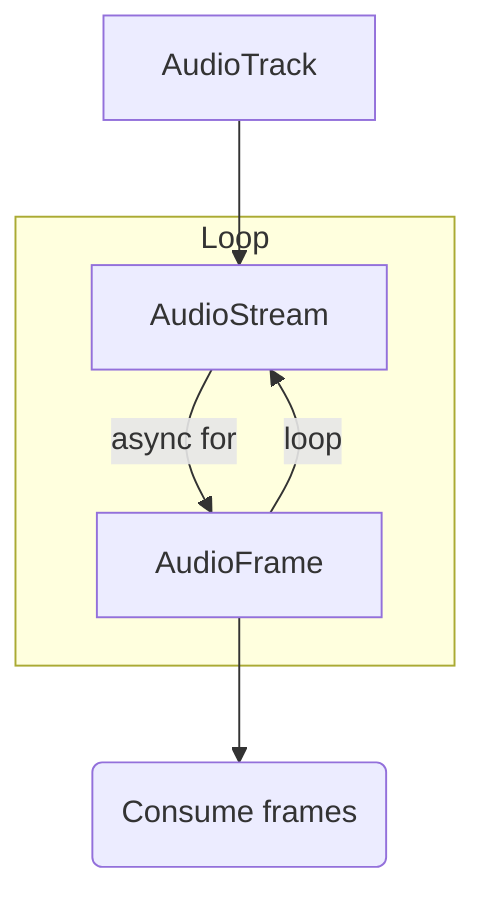
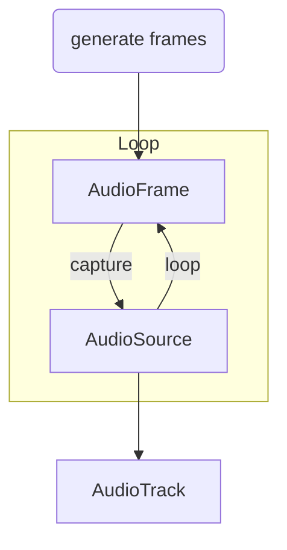

# Transport & Self-Hosting

Realtime media publishing/subscribing, data channels, end-to-end encryption, and local/Kubernetes/distributed server deployments.

- **Total pages in this section**: 54
- **Successful retrieves**: 54
- **API References / Placeholders**: 0

## Table of Contents

1. [transport/](#page-1) (✓)
2. [transport/sdk-platforms/](#page-2) (✓)
3. [transport/media/](#page-3) (✓)
4. [transport/data/](#page-4) (✓)
5. [transport/encryption/](#page-5) (✓)
6. [transport/self-hosting/](#page-6) (✓)
7. [transport/sdk-platforms/react/](#page-7) (✓)
8. [transport/sdk-platforms/unity/](#page-8) (✓)
9. [transport/sdk-platforms/unity-web/](#page-9) (✓)
10. [transport/sdk-platforms/swift/](#page-10) (✓)
11. [transport/sdk-platforms/android-compose/](#page-11) (✓)
12. [transport/sdk-platforms/android/](#page-12) (✓)
13. [transport/sdk-platforms/flutter/](#page-13) (✓)
14. [transport/sdk-platforms/react-native/](#page-14) (✓)
15. [transport/sdk-platforms/expo/](#page-15) (✓)
16. [transport/sdk-platforms/cpp/](#page-16) (✓)
17. [transport/media/publish/](#page-17) (✓)
18. [transport/media/screenshare/](#page-18) (✓)
19. [transport/media/subscribe/](#page-19) (✓)
20. [transport/media/raw-tracks/](#page-20) (✓)
21. [transport/media/frame-metadata/](#page-21) (✓)
22. [transport/media/noise-cancellation/](#page-22) (✓)
23. [transport/media/advanced/](#page-23) (✓)
24. [transport/media/ingress-egress/](#page-24) (✓)
25. [transport/data/text-streams/](#page-25) (✓)
26. [transport/data/byte-streams/](#page-26) (✓)
27. [transport/data/rpc/](#page-27) (✓)
28. [transport/data/data-tracks/](#page-28) (✓)
29. [transport/data/packets/](#page-29) (✓)
30. [transport/data/state/](#page-30) (✓)
31. [transport/encryption/start/](#page-31) (✓)
32. [transport/encryption/agents/](#page-32) (✓)
33. [transport/self-hosting/local/](#page-33) (✓)
34. [transport/self-hosting/deployment/](#page-34) (✓)
35. [transport/self-hosting/vm/](#page-35) (✓)
36. [transport/self-hosting/kubernetes/](#page-36) (✓)
37. [transport/self-hosting/distributed/](#page-37) (✓)
38. [transport/self-hosting/ports-firewall/](#page-38) (✓)
39. [transport/self-hosting/benchmark/](#page-39) (✓)
40. [transport/self-hosting/egress/](#page-40) (✓)
41. [transport/self-hosting/ingress/](#page-41) (✓)
42. [transport/self-hosting/sip-server/](#page-42) (✓)
43. [transport/media/ingress-egress/egress/](#page-43) (✓)
44. [transport/media/ingress-egress/ingress/](#page-44) (✓)
45. [transport/data/state/participant-attributes/](#page-45) (✓)
46. [transport/data/state/room-metadata/](#page-46) (✓)
47. [transport/media/ingress-egress/egress/composite-recording/](#page-47) (✓)
48. [transport/media/ingress-egress/egress/participant/](#page-48) (✓)
49. [transport/media/ingress-egress/egress/track/](#page-49) (✓)
50. [transport/media/ingress-egress/egress/autoegress/](#page-50) (✓)
51. [transport/media/ingress-egress/egress/outputs/](#page-51) (✓)
52. [transport/media/ingress-egress/egress/custom-template/](#page-52) (✓)
53. [transport/media/ingress-egress/ingress/encoders/](#page-53) (✓)
54. [transport/media/ingress-egress/ingress/transcode/](#page-54) (✓)

---

<a name="page-1"></a>
## Page 1: transport/
**Original URL:** https://docs.livekit.io/transport/  
**Source MD URL:** https://docs.livekit.io/transport.md

LiveKit docs › WebRTC Transport › Get Started › Introduction

---

# Introduction

> Build realtime applications with LiveKit's WebRTC transport layer, SDKs, and media handling capabilities.

## Overview

LiveKit transport provides the foundation for building realtime applications using WebRTC. It includes client and server SDKs for multiple platforms, comprehensive media and data handling, stream export and import services, and hardware integration capabilities. Together, these components enable you to build production-ready realtime applications that work across web, mobile, hardware, and embedded devices.

LiveKit's transport layer handles the complexity of WebRTC connections, media encoding and decoding, network adaptation, and state synchronization. The SDKs provide a unified API across all platforms, ensuring consistent behavior whether you're building for web browsers, mobile apps, or embedded devices.

## Key concepts

Understand these core concepts to build effective realtime applications with LiveKit.

### SDK platforms

LiveKit provides a comprehensive ecosystem of SDKs for building realtime applications, including [realtime SDKs](#realtime-sdks) for building user-facing applications, and [server-side SDKs](#server-side-sdks) for backend operations and media processing. The SDKs are designed to work together, and support multiple platforms and languages.

All SDKs provide consistent APIs and features across platforms, ensuring that your applications work reliably regardless of the target platform. These core capabilities are designed to handle the complexities of realtime communication while providing a simple, unified API.

These capabilities include:

- **Unified room model**: Same room concepts across all platforms.
- **Consistent track handling**: Standardized audio and video track management.
- **Shared data APIs**: Common data channel and messaging patterns.
- **Quality adaptation**: Automatic quality adjustment based on network conditions.

- **[SDK platform quickstarts](https://docs.livekit.io/transport/sdk-platforms.md)**: Get started with LiveKit SDKs for React, Swift, Android, Flutter, React Native, Expo, Unity, and more.

#### Realtime SDKs

Realtime SDKs let you build applications that connect to LiveKit rooms and participate in realtime communication. These SDKs handle WebRTC connections, media capture, and room management.

- **Media capture**: Camera, microphone, and screen sharing.
- **Room management**: Join, leave, and manage room participants.
- **Track handling**: Subscribe to and publish audio and video tracks.
- **Data channels**: Realtime messaging between participants.
- **Connection management**: Automatic reconnection and quality adaptation.

- **[JavaScript SDK](https://github.com/livekit/client-sdk-js)**: JavaScript/TypeScript SDK for web browsers. Supports all major browsers and provides React hooks for easy integration.

- **[iOS/macOS/visionOS](https://github.com/livekit/client-sdk-swift)**: Native Swift SDK for Apple platforms including iOS, macOS, and visionOS. Optimized for Apple's ecosystem.

- **[Android](https://github.com/livekit/client-sdk-android)**: Native Kotlin SDK for Android applications. Provides comprehensive media handling and room management.

- **[Flutter](https://github.com/livekit/client-sdk-flutter)**: Cross-platform SDK for Flutter applications. Write once, run on iOS, Android, web, and desktop.

- **[React Native](https://github.com/livekit/client-sdk-react-native)**: React Native SDK for building cross-platform mobile applications with JavaScript/TypeScript.

- **[Unity](https://github.com/livekit/client-sdk-unity)**: Unity SDK for game development and virtual reality applications. Supports both native and WebGL builds.

- **[C++](https://github.com/livekit/client-sdk-cpp)**: Native C++ SDK for realtime audio, video, data, and RPC.

LiveKit also supports specialized platforms and use cases beyond the main web and mobile platforms:

- **[Rust SDK](https://github.com/livekit/rust-sdks)**: For systems programming and embedded applications.
- **[Unity WebGL](https://github.com/livekit/client-sdk-unity-web)**: For web-based Unity applications.
- **[ESP32](https://github.com/livekit/client-sdk-esp32)**: For IoT and embedded devices.

#### Server-side SDKs

Server-side SDKs provide the infrastructure and control needed to manage LiveKit rooms and participants. These capabilities enable backend applications to orchestrate realtime sessions and process media streams.

- **Room control**: Create, manage, and monitor rooms.
- **Participant management**: Control participant permissions and behavior.
- **Media processing**: Subscribe to and process media streams.
- **Webhook handling**: Respond to room and participant events.
- **Recording**: Capture and store room sessions.

> ℹ️ **Info**
> 
> The Go SDK additionally offers client capabilities, allowing you to build automations that act like end users.

- **[Node.js](https://github.com/livekit/node-sdks)**: JavaScript SDK for Node.js applications. Includes room management, participant control, and webhook handling.

- **[Python](https://github.com/livekit/python-sdks)**: Python SDK for backend applications. Provides comprehensive media processing and room management capabilities.

- **[Golang](https://github.com/livekit/server-sdk-go)**: Go SDK for high-performance server applications. Optimized for scalability and low latency. Includes client capabilities.

- **[Ruby](https://github.com/livekit/server-sdk-ruby)**: Ruby SDK for Ruby on Rails and other Ruby applications. Full-featured server integration.

- **[Java/Kotlin](https://github.com/livekit/server-sdk-kotlin)**: Java and Kotlin SDK for JVM-based applications. Enterprise-ready with comprehensive features.

- **[Rust](https://github.com/livekit/rust-sdks)**: Rust SDK for systems programming and high-performance applications. Memory-safe and fast.

There are also community-maintained SDKs for other languages:

- **[PHP](https://github.com/agence104/livekit-server-sdk-php)**: Community-maintained SDK for PHP applications.
- **[.NET](https://github.com/pabloFuente/livekit-server-sdk-dotnet)**: Community-maintained SDK for .NET applications.

### Media

LiveKit enables realtime exchange of audio and video streams between participants. You can publish and subscribe to tracks, process raw media, apply noise cancellation, and export or import streams.

- **[Media overview](https://docs.livekit.io/transport/media.md)**: Learn how to handle realtime media tracks, screen sharing, and stream export/import in your applications.

### Data

LiveKit provides realtime data exchange between participants using text streams, byte streams, remote procedure calls, and data packets. You can also synchronize state across all participants in a room.

- **[Data overview](https://docs.livekit.io/transport/data.md)**: Learn how to send text, files, and custom data, and synchronize state between participants.

### Encryption

Secure your realtime media and data with end-to-end encryption. LiveKit provides built-in E2EE support for both media tracks and data channels.

- **[Encryption overview](https://docs.livekit.io/transport/encryption.md)**: Learn how to enable end-to-end encryption for media and data in your applications.

### Self-hosting

Self-host LiveKit servers for full control over your WebRTC infrastructure, data, and configuration. Deploy LiveKit servers on local development environments, virtual machines, Kubernetes clusters, or distributed multi-region setups.

- **[Self-hosting overview](https://docs.livekit.io/transport/self-hosting.md)**: Learn how to self-host LiveKit servers for full control over your infrastructure.

## Getting started

Choose your platform to get started building your application:

- **[SDK platform quickstarts](https://docs.livekit.io/transport/sdk-platforms.md)**: Get started with LiveKit SDKs for your target platform with step-by-step guides.

---

This document was rendered at 2026-08-28T04:22:10.257Z.
For the latest version of this document, see [https://docs.livekit.io/transport.md](https://docs.livekit.io/transport.md).

To explore all LiveKit documentation, see [llms.txt](https://docs.livekit.io/llms.txt).

---

<a name="page-2"></a>
## Page 2: transport/sdk-platforms/
**Original URL:** https://docs.livekit.io/transport/sdk-platforms/  
**Source MD URL:** https://docs.livekit.io/transport/sdk-platforms.md

LiveKit docs › WebRTC Transport › Get Started › SDK platform quickstarts › Overview

---

# Platform-specific quickstart guides

> LiveKit has SDKs for most major platforms and languages. Quickly integrate realtime AI, audio, or video into your app with a step-by-step guide.

## Web SDKs

For browser-based applications.

- [React](https://docs.livekit.io/transport/sdk-platforms/react.md)
- [Unity (WebGL)](https://docs.livekit.io/transport/sdk-platforms/unity-web.md)
## Native SDKs

For native applications on mobile, desktop, and more.

- [Swift](https://docs.livekit.io/transport/sdk-platforms/swift.md)
- [Android (Compose)](https://docs.livekit.io/transport/sdk-platforms/android-compose.md)
- [Android](https://docs.livekit.io/transport/sdk-platforms/android.md)
- [Flutter](https://docs.livekit.io/transport/sdk-platforms/flutter.md)
- [React Native](https://docs.livekit.io/transport/sdk-platforms/react-native.md)
- [C++](https://docs.livekit.io/transport/sdk-platforms/cpp.md)
- [Unity](https://docs.livekit.io/transport/sdk-platforms/unity.md)
- [Expo](https://docs.livekit.io/transport/sdk-platforms/expo.md)
## Other SDKs

Don't see your platform listed?

- View the full [list of supported SDKs](https://docs.livekit.io/reference.md).
- Integrate with a [telephone system using SIP](https://docs.livekit.io/telephony.md).
- Join the [LiveKit developer community](https://community.livekit.io) or [community Slack](https://livekit.io/join-slack) to share what you're building.

---

This document was rendered at 2026-08-28T04:22:10.421Z.
For the latest version of this document, see [https://docs.livekit.io/transport/sdk-platforms.md](https://docs.livekit.io/transport/sdk-platforms.md).

To explore all LiveKit documentation, see [llms.txt](https://docs.livekit.io/llms.txt).

---

<a name="page-3"></a>
## Page 3: transport/media/
**Original URL:** https://docs.livekit.io/transport/media/  
**Source MD URL:** https://docs.livekit.io/transport/media.md

LiveKit docs › WebRTC Transport › Media › Overview

---

# Media overview

> An overview of realtime media components for LiveKit.

## Overview

LiveKit provides realtime media exchange between participants using tracks. Each participant can [publish](https://docs.livekit.io/transport/media/publish.md) and [subscribe](https://docs.livekit.io/transport/media/subscribe.md) to as many tracks as makes sense for your application.

### Concepts

The following concepts and use cases are intended to help you understand how to model your application.

#### Audio tracks

Audio tracks are typically published from your microphone and played back on the other participants' speakers. You can also produce custom audio tracks, for instance to add background music or other audio effects.

AI agents can consume an audio track to perform speech-to-text, and can publish their own audio track with synthesized speech or other audio effects.

#### Video tracks

Video tracks are usually published from a webcam or other video source, and rendered on the other participants' screens within your application's UI. LiveKit also supports screen sharing, which commonly results in two video tracks from the same participant.

AI agents can subscribe to video tracks to perform vision-based tasks, and can publish their own video tracks with synthetic video or other visual effects.

### Sample use cases

The following examples demonstrate how to model your application for different use cases.

#### AI voice agent

Each room has two participants: an end-user and an AI agent. They can have a natural conversation with the following setup:

- **End-user**: publishes their microphone track and subscribes to the AI agent's audio track
- **AI agent**: subscribes to the user's microphone track and publishes its own audio track with synthesized speech

The UI may be a simple audio visualizer showing that the AI agent is speaking.

#### Video conference

Each room has multiple users. Each user publishes audio and/or video tracks and subscribes to all tracks published by others. In the UI, the room is typically displayed as a grid of video tiles.

#### Livestreaming

Each room has one broadcaster and a significant number of viewers. The broadcaster publishes audio and video tracks. The viewers subscribe to the broadcaster's tracks but do not publish their own. Interaction is typically performed with a chat component.

An AI agent may also join the room to publish live captions.

#### AI camera monitoring

Each room has one camera participant that publishes its video track, and one agent that monitors the camera feed and calls out to an external API to take action based on contents of the video feed (e.g. send an alert).

Alternatively, one room can have multiple cameras and an agent that monitors all of them, or an end-user could also optionally join the room to monitor the feeds alongside the agent.

## Realtime media components

The following components are available to help you build your application.

| Feature | Description | Use cases |
| **Camera & microphone** | Publish realtime audio and video from any device with automatic permission handling and device management. | Video conferencing, voice calls, and applications requiring camera and microphone access. |
| **Screen sharing** | Share your screen as a video track across all platforms, with browser audio support. | Presentations, remote assistance, and collaborative applications. |
| **Subscribing to tracks** | Play and render realtime media tracks with automatic subscription, adaptive streaming, and quality controls. | Video playback, audio rendering, and dynamic quality adjustment based on UI visibility. |
| **Processing raw tracks** | Read, process, and publish raw media tracks and files with frame-level control. | Media processing pipelines, custom effects, and file-based media publishing. |
| **Frame metadata** | Attach and read per-frame timestamps, IDs, and custom data on video tracks. | Frame-accurate timing, latency measurement, and per-frame application data. |
| **Noise & echo cancellation** | Default (WebRTC) noise and echo cancellation on all deployments; enhanced (Krisp/BVC) on LiveKit Cloud only. | Voice AI applications, video conferencing, and high-quality audio streaming. |
| **Codecs & more** | Configure video codecs, simulcast, dynacast, and hi-fi audio settings for optimal quality. | High-quality streaming, bandwidth optimization, and advanced video configurations. |
| **Stream export & import** | Export room content to files and streaming platforms or import external streams into LiveKit rooms. | Recording meetings, livestreaming to YouTube/Twitch, and integrating OBS Studio streams. |

## In this section

Learn how to work with realtime media tracks.

- **[Camera & microphone](https://docs.livekit.io/transport/media/publish.md)**: Publish realtime audio and video from any device.

- **[Screen sharing](https://docs.livekit.io/transport/media/screenshare.md)**: Publish your screen with LiveKit.

- **[Subscribing to tracks](https://docs.livekit.io/transport/media/subscribe.md)**: Play and render realtime media tracks in your application.

- **[Processing raw tracks](https://docs.livekit.io/transport/media/raw-tracks.md)**: How to read, process, and publish raw media tracks and files.

- **[Frame metadata](https://docs.livekit.io/transport/media/frame-metadata.md)**: Attach and read per-frame timestamps, IDs, and custom data on video tracks.

- **[Noise & echo cancellation](https://docs.livekit.io/transport/media/noise-cancellation.md)**: Default (WebRTC) and enhanced (LiveKit Cloud) noise and echo cancellation.

- **[Codecs & more](https://docs.livekit.io/transport/media/advanced.md)**: Advanced audio and video topics.

- **[Stream export & import](https://docs.livekit.io/transport/media/ingress-egress.md)**: Export and import streams to and from LiveKit rooms.

---

This document was rendered at 2026-08-28T04:22:10.435Z.
For the latest version of this document, see [https://docs.livekit.io/transport/media.md](https://docs.livekit.io/transport/media.md).

To explore all LiveKit documentation, see [llms.txt](https://docs.livekit.io/llms.txt).

---

<a name="page-4"></a>
## Page 4: transport/data/
**Original URL:** https://docs.livekit.io/transport/data/  
**Source MD URL:** https://docs.livekit.io/transport/data.md

LiveKit docs › WebRTC Transport › Data › Overview

---

# Data overview

> An overview of realtime text and data features for LiveKit.

## Overview

LiveKit provides several APIs for exchanging data between participants. Each is designed for a different interaction pattern — guaranteed delivery of text or files, request-response workflows, continuous low-latency streaming, or synchronized shared state.

## Choosing the right API

| Task | Recommended API | Pattern | Description |
| Send text (chat, LLM responses) | [Text streams](https://docs.livekit.io/transport/data/text-streams.md) | Guaranteed, message-based | Automatic chunking and topic-based routing. |
| Send files or binary data | [Byte streams](https://docs.livekit.io/transport/data/byte-streams.md) | Guaranteed, message-based | Transfer files, images, or any binary data with progress tracking. |
| Call a method on another participant | [RPC](https://docs.livekit.io/transport/data/rpc.md) | Guaranteed, message-based | Execute custom methods on other participants and await a response. |
| Stream continuous data (sensors, telemetry, game state) | [Data tracks](https://docs.livekit.io/transport/data/data-tracks.md) | Lossy, continuous | Prioritizes staying realtime over guaranteed delivery. Frames that can't be delivered in time are dropped. |
| Synchronize shared state | [State synchronization](https://docs.livekit.io/transport/data/state.md) | Guaranteed, message-based | Replicate participant attributes and room metadata across all participants. |
| Low-level control over individual packet delivery | [Data packets](https://docs.livekit.io/transport/data/packets.md) | Guaranteed or lossy, message-based | Advanced API for precise control over individual packet behavior. For lossy delivery, data tracks offer similar control when frame payloads fit in a single packet. |

## In this section

- **[Sending text](https://docs.livekit.io/transport/data/text-streams.md)**: Use text streams to send and receive text data, such as LLM responses or chat messages.

- **[Sending files & bytes](https://docs.livekit.io/transport/data/byte-streams.md)**: Use byte streams to transfer files, images, or any other binary data.

- **[Remote procedure calls](https://docs.livekit.io/transport/data/rpc.md)**: Use RPC to execute custom methods on other participants in the room and await a response.

- **[Data tracks](https://docs.livekit.io/transport/data/data-tracks.md)**: Stream continuous, low-latency data for robotics, IoT, and telemetry use cases.

- **[Data packets](https://docs.livekit.io/transport/data/packets.md)**: Low-level API for advanced control over individual packet delivery.

- **[State synchronization](https://docs.livekit.io/transport/data/state.md)**: Synchronize participant attributes and room metadata across all participants.

---

This document was rendered at 2026-08-28T04:22:10.446Z.
For the latest version of this document, see [https://docs.livekit.io/transport/data.md](https://docs.livekit.io/transport/data.md).

To explore all LiveKit documentation, see [llms.txt](https://docs.livekit.io/llms.txt).

---

<a name="page-5"></a>
## Page 5: transport/encryption/
**Original URL:** https://docs.livekit.io/transport/encryption/  
**Source MD URL:** https://docs.livekit.io/transport/encryption.md

LiveKit docs › WebRTC Transport › Encryption › Overview

---

# Encryption overview

> Secure your realtime media and data with end-to-end encryption.

## Overview

LiveKit includes built-in support for end-to-end encryption (E2EE) for both realtime media tracks (audio and video) and data channels (text and byte streams). With E2EE enabled, content remains fully encrypted from sender to receiver, ensuring that no intermediaries (including LiveKit servers) can access or modify the content. This feature is:

- Available for both self-hosted and LiveKit Cloud customers at no additional cost.
- Ideal for regulated industries and security-critical applications.
- Designed to provide an additional layer of protection beyond standard transport encryption.

> ℹ️ **Security is our highest priority**
> 
> Learn more about [our comprehensive approach to security](https://livekit.io/security).

## Encryption components

LiveKit provides end-to-end encryption for both media and data:

| Component | Description | Use cases |
| **Media encryption** | Encrypts all audio and video tracks from all participants in a room, ensuring no intermediaries can access the content. | Regulated industries, security-critical applications, and privacy-focused use cases. |
| **Data channel encryption** | Encrypts all text messages, byte streams, and data packets sent between participants. | Secure chat applications, private file sharing, and encrypted data exchange. |

## How E2EE works

E2EE is enabled at the room level and automatically applied to all media tracks and data channels from all participants in that room. You must enable it within the LiveKit SDK for each participant. In many cases you can use a built-in key provider with a single shared key for the whole room. If you require unique keys for each participant, or key rotation during the lifetime of a single room, you can implement your own key provider.

> 💡 **Tip**
> 
> If you're building an agent frontend, you can configure E2EE directly through the Session API. See [End-to-end encryption](https://docs.livekit.io/frontends/build/sessions.md#end-to-end-encryption) on the Session management page.

## Key distribution

It is your responsibility to securely generate, store, and distribute encryption keys to your application at runtime. LiveKit does not (and cannot) store or transport encryption keys for you.

If using a shared key, you would typically generate it on your server at the same time that you create a room and distribute it securely to participants alongside their access token for the room. When using unique keys per participant, you may need a more sophisticated method for distributing keys as new participants join the room. Remember that the key is needed for both encryption and decryption, so even when using per-participant keys, you must ensure that all participants have all keys.

## Media encryption

E2EE is enabled at the room level and automatically applied to all media tracks from all participants in that room. You must enable it within the LiveKit SDK for each participant.

## Data channel encryption

Realtime data and text are encrypted using the `encryption` field for `RoomOptions` when you create a room. When the `encryption` field is set, all outgoing data messages (including text and byte streams) are end-to-end encrypted.

End-to-end encryption for data channel messages is the default. However, for backwards compatibility, the `e2ee` field is still supported. If `encryption` is not set, data channel messages are _not_ encrypted.

> ℹ️ **e2ee field is deprecated**
> 
> The `e2ee` field is deprecated and will be removed in the next major version of each client SDK. Use the `encryption` field instead.

> ❗ **Signaling messages and APIs**
> 
> Signaling messages (control messages used to coordinate a WebRTC session) and API calls are _not_ end-to-end encrypted — they're encrypted in transit using TLS, but the LiveKit server can still read them.

## In this section

Learn how to implement end-to-end encryption in your applications.

- **[Get started](https://docs.livekit.io/transport/encryption/start.md)**: Learn how to implement E2EE with step-by-step guides and code examples for all platforms.

- **[E2EE with agents](https://docs.livekit.io/transport/encryption/agents.md)**: Enable end-to-end encryption for LiveKit Agents.

---

This document was rendered at 2026-08-28T04:22:10.452Z.
For the latest version of this document, see [https://docs.livekit.io/transport/encryption.md](https://docs.livekit.io/transport/encryption.md).

To explore all LiveKit documentation, see [llms.txt](https://docs.livekit.io/llms.txt).

---

<a name="page-6"></a>
## Page 6: transport/self-hosting/
**Original URL:** https://docs.livekit.io/transport/self-hosting/  
**Source MD URL:** https://docs.livekit.io/transport/self-hosting.md

LiveKit docs › WebRTC Transport › Self-hosting › Overview

---

# Self-hosting overview

> An overview of self-hosting options for LiveKit servers.

## Overview

Self-host LiveKit servers for full control over your infrastructure, data, and configuration. Self-hosting enables you to deploy LiveKit on your own infrastructure, whether for local development, production deployments on virtual machines or Kubernetes, or distributed multi-region setups.

Self-hosting gives you complete control over your deployment, allowing you to customize configuration, manage your own data, and scale according to your specific needs. You can deploy LiveKit servers on a variety of platforms, from local development environments to production-grade infrastructure. You can also deploy LiveKit Agents to your own infrastructure, connecting them to your self-hosted LiveKit server.

### Comparing self-hosted to LiveKit Cloud

When building with LiveKit, you can either self-host the open-source server or use the managed LiveKit Cloud service.

#### AI agents

|  | Self-hosted | LiveKit Cloud |
| [**Agents framework**](https://docs.livekit.io/agents.md) | Full support | Full support |
| **Managed agent hosting** | N/A, you run and scale agent servers yourself. | Included: [deploy agents](https://docs.livekit.io/deploy/agents.md) to LiveKit Cloud with automatic scaling, managed builds, and instant rollback. |
| [**Agent Builder**](https://docs.livekit.io/agents/start/builder.md) | N/A | Included |
| [**Built-in inference**](https://docs.livekit.io/agents/models/inference.md) | N/A, bring your own model provider API keys. | Included, with custom voice clones on paid plans. |
| [**Agent observability**](https://docs.livekit.io/deploy/observability/insights.md) | Custom / external, using OpenTelemetry data hooks. | Included: built-in observability stack with transcripts, traces, session recordings, and log drains. |
| [**Noise cancellation**](https://docs.livekit.io/transport/media/noise-cancellation.md) | Client-side WebRTC cancellation; ai-coustics supported with your own license key. | Client-side WebRTC cancellation, plus enhanced models (Krisp, ai-coustics). |

#### Telephony

|  | Self-hosted | LiveKit Cloud |
| [**SIP & telephony**](https://docs.livekit.io/telephony.md) | Full support, SIP service deployed as a separate service. | Full support |
| **Phone numbers** | Bring your own SIP trunking provider. | Native [LiveKit Phone Numbers](https://docs.livekit.io/telephony/start/phone-numbers.md), plus support for external SIP trunks. |
| **Noise cancellation** | N/A | [Krisp noise cancellation](https://docs.livekit.io/telephony.md#noise-cancellation-for-calls) applied at the SIP trunk for inbound and outbound calls. |

#### Media and transport

|  | Self-hosted | LiveKit Cloud |
| **[Realtime media](https://docs.livekit.io/transport.md) (audio, video, data)** | Full support | Full support |
| **[Egress](https://docs.livekit.io/transport/media/ingress-egress/egress.md) (recording, streaming)** | Full support, deployed as a separate service. | Full support, included with every project. |
| **[Ingress](https://docs.livekit.io/transport/media/ingress-egress/ingress.md) (RTMP, WHIP, SRT ingest)** | Full support, deployed as a separate service. | Full support, included with every project. |
| [**End-to-end encryption**](https://docs.livekit.io/transport/encryption.md) | Full support | Full support |
| [**Webhooks**](https://docs.livekit.io/intro/basics/rooms-participants-tracks/webhooks-events.md) | Full support | Full support |

#### Platform and operations

|  | Self-hosted | LiveKit Cloud |
| **Who manages it** | You | LiveKit |
| **Architecture** | Single-home SFU | Global mesh SFU |
| **Connection model** | Single server per room | Each user connects to the [nearest edge](https://docs.livekit.io/deploy/admin/regions.md). |
| **Max users per room** | Up to ~3,000 | No limit |
| **Regions & data residency** | Regions you deploy to | Global edge network, with [region pinning](https://docs.livekit.io/deploy/admin/regions/region-pinning.md) for data residency requirements. |
| **Analytics & telemetry** | Custom / external | LiveKit Cloud dashboard, plus [Analytics API](https://docs.livekit.io/deploy/admin/analytics-api.md) on Scale plans. |
| [**Access token revocation**](https://docs.livekit.io/frontends/reference/tokens-grants.md#token-revocation) | N/A | Included |
| **Uptime target** | N/A | 99.99% |

## Self-hosting topics

When self-hosting LiveKit, you can deploy agents to your own infrastructure alongside your LiveKit server. Agents connect to your self-hosted server and run on your own resources. See [Custom agent deployments](https://docs.livekit.io/deploy/custom/deployments.md) for details on deploying agents to Kubernetes, Render, or other container orchestration systems.

Manage your self-hosted LiveKit deployment with these topics.

| Topic | Description | Use cases |
| **Running locally** | Get LiveKit running locally for development and testing with minimal setup. | Local development, testing, and prototyping. |
| **Deployment** | Deploy LiveKit servers to production with SSL, load balancing, and TURN configuration. | Production deployments, secure configurations, and network setup. |
| **Virtual machines** | Deploy LiveKit servers on virtual machines for production use. | VM-based deployments, cloud infrastructure, and traditional server setups. |
| **Kubernetes** | Deploy LiveKit servers on Kubernetes clusters for scalable, containerized deployments. | Container orchestration, scalable deployments, and cloud-native infrastructure. |
| **Distributed multi-region** | Deploy LiveKit servers across multiple regions for global distribution. | Global deployments, low-latency access, and multi-region redundancy. |
| **Firewall configuration** | Configure firewalls and network settings for your LiveKit deployment. | Network security, port management, and access control. |
| **Benchmarks** | Measure and optimize performance of your self-hosted LiveKit deployment. | Performance testing, capacity planning, and optimization. |
| **Egress** | Set up egress services for recording and streaming from your self-hosted deployment. | Recording rooms, streaming to platforms, and media export. |
| **Ingress** | Set up ingress services to bring external media sources into your LiveKit rooms. | RTMP ingest, WHIP streams, and external media integration. |
| **SIP server** | Deploy and configure SIP servers for telephony integration with your self-hosted LiveKit. | Phone call integration, SIP trunking, and telephony features. |

## In this section

Learn how to self-host LiveKit servers:

- **[Running locally](https://docs.livekit.io/transport/self-hosting/local.md)**: Get LiveKit running locally for development and testing.

- **[Deployment](https://docs.livekit.io/transport/self-hosting/deployment.md)**: Deploy LiveKit servers to production with SSL, load balancing, and TURN configuration.

- **[Virtual machines](https://docs.livekit.io/transport/self-hosting/vm.md)**: Deploy LiveKit servers on virtual machines for production use.

- **[Kubernetes](https://docs.livekit.io/transport/self-hosting/kubernetes.md)**: Deploy LiveKit servers on Kubernetes clusters for scalable, containerized deployments.

- **[Distributed multi-region](https://docs.livekit.io/transport/self-hosting/distributed.md)**: Deploy LiveKit servers across multiple regions for global distribution.

- **[Firewall configuration](https://docs.livekit.io/transport/self-hosting/ports-firewall.md)**: Configure firewalls and network settings for your LiveKit deployment.

- **[Benchmarks](https://docs.livekit.io/transport/self-hosting/benchmark.md)**: Measure and optimize performance of your self-hosted LiveKit deployment.

- **[Egress](https://docs.livekit.io/transport/self-hosting/egress.md)**: Set up egress services for recording and streaming from your self-hosted deployment.

- **[Ingress](https://docs.livekit.io/transport/self-hosting/ingress.md)**: Set up ingress services to bring external media sources into your LiveKit rooms.

- **[SIP server](https://docs.livekit.io/transport/self-hosting/sip-server.md)**: Deploy and configure SIP servers for telephony integration with your self-hosted LiveKit.

---

This document was rendered at 2026-08-28T04:22:10.529Z.
For the latest version of this document, see [https://docs.livekit.io/transport/self-hosting.md](https://docs.livekit.io/transport/self-hosting.md).

To explore all LiveKit documentation, see [llms.txt](https://docs.livekit.io/llms.txt).

---

<a name="page-7"></a>
## Page 7: transport/sdk-platforms/react/
**Original URL:** https://docs.livekit.io/transport/sdk-platforms/react/  
**Source MD URL:** https://docs.livekit.io/transport/sdk-platforms/react.md

LiveKit docs › WebRTC Transport › Get Started › SDK platform quickstarts › React

---

# React quickstart

> Build a voice AI frontend with React in less than 10 minutes.

## Overview

This guide walks you through building a voice AI frontend using React and the LiveKit React components library. In less than 10 minutes, you'll have a working frontend that connects to your agent and allows users to have voice conversations through their browser.

## Starter project

The fastest way to get started with a full fledged agent experience is the React starter project. Click "Use this template" in the top right to create a new repo on GitHub, then follow the instructions in the project's README.

- **[Next.js Voice Agent](https://docs.livekit.io/frontends/start/starter-apps/react.md)**: A web voice AI assistant built with React and Next.js.

## Requirements

The following sections describe the minimum requirements to build a React frontend for your voice AI agent.

### LiveKit Cloud account

This guide assumes you have signed up for a free [LiveKit Cloud](https://cloud.livekit.io/) account. Create a free project to get started with your voice AI application.

### Agent backend

You need a LiveKit agent running on the backend that is configured for your LiveKit Cloud project. Follow the [Voice AI quickstart](https://docs.livekit.io/agents/start/voice-ai.md) to create and deploy your agent.

### Token server

You need a token server to generate authentication tokens for your users. For development and testing, this guide uses the LiveKit Cloud development token server for ease of use. See the [development token server](https://docs.livekit.io/frontends/build/authentication/development-token-server.md) guide to enable one for your project.

For production usage, you should set up a dedicated token server implementation. See the [endpoint token generation](https://docs.livekit.io/frontends/build/authentication/endpoint.md) guide for more details.

## Setup

Use the instructions in the following sections to set up your new React frontend project.

### Create React project

Create a new React project using your preferred method:

**pnpm**:

```shell
pnpm create vite@latest my-agent-app --template react-ts
cd my-agent-app

```

---

**npm**:

```shell
npm create vite@latest my-agent-app -- --template react-ts
cd my-agent-app

```

### Install packages

Install the LiveKit SDK and React components:

**pnpm**:

```shell
pnpm add @livekit/components-react @livekit/components-styles livekit-client

```

---

**npm**:

```shell
npm install @livekit/components-react @livekit/components-styles livekit-client --save

```

### Add agent frontend code

Replace the contents of your `src/App.tsx` file with the following code:

> ℹ️ **Note**
> 
> Update the `sandboxId` with your own token server ID from your project's [Settings](https://cloud.livekit.io/projects/p_/settings/project) page, and set the `agentName` to match your deployed agent's name.

** Filename: `src/App.tsx`**

```tsx
'use client';
import { useEffect, useRef } from 'react';
import {
  ControlBar,
  RoomAudioRenderer,
  useSession,
  SessionProvider,
  useAgent,
  BarVisualizer,
} from '@livekit/components-react';
import { TokenSource, TokenSourceConfigurable, TokenSourceFetchOptions } from 'livekit-client';
import '@livekit/components-styles';

const tokenSource = TokenSource.sandboxTokenServer('%{firstDevelopmentTokenServerName}%');

export default function App() {
  const session = useSession(tokenSource, { agentName: 'my-agent-name' });

  // Connect to session
  useEffect(() => {
    session.start();
    return () => {
      session.end();
    };
  }, []);

  return (
    <SessionProvider session={session}>
      <div data-lk-theme="default" style={{ height: '100vh' }}>
        {/* Your custom component with basic video agent functionality. */}
        <MyAgentView />
        {/* Controls for the user to start/stop audio and disconnect from the session */}
        <ControlBar controls={{ microphone: true, camera: false, screenShare: false }} />
        {/* The RoomAudioRenderer takes care of room-wide audio for you. */}
        <RoomAudioRenderer />
      </div>
    </SessionProvider>
  );
}

function MyAgentView() {
  const agent = useAgent();
  return (
    <div style={{ height: '350px' }}>
      <p>Agent state: {agent.state}</p>
      {/* Renders a visualizer for the agent's audio track */}
      {agent.canListen && (
        <BarVisualizer track={agent.microphoneTrack} state={agent.state} barCount={5} />
      )}
    </div>
  );
}

```

## Run your application

Start the development server:

**pnpm**:

```shell
pnpm dev

```

---

**npm**:

```shell
npm run dev

```

Open your browser to the URL shown in the terminal (typically `http://localhost:5173`). You should see your agent frontend with controls to enable your microphone and speak with your agent.

## Next steps

The following resources are useful for getting started with LiveKit on React.

- **[Endpoint token generation](https://docs.livekit.io/frontends/authentication/tokens.md#overview)**: Guide to generating authentication tokens for your users.

- **[Realtime media](https://docs.livekit.io/transport/media.md)**: Complete documentation for live video and audio tracks.

- **[Realtime data](https://docs.livekit.io/transport/data.md)**: Send and receive realtime data between clients.

- **[JavaScript SDK](https://github.com/livekit/client-sdk-js)**: LiveKit JavaScript SDK on GitHub.

- **[React components](https://github.com/livekit/components-js)**: LiveKit React components on GitHub.

- **[JavaScript SDK reference](https://docs.livekit.io/reference/client-sdk-js.md)**: LiveKit JavaScript SDK reference docs.

- **[React components reference](https://docs.livekit.io/reference/components/react.md)**: LiveKit React components reference docs.

---

This document was rendered at 2026-08-28T04:22:11.220Z.
For the latest version of this document, see [https://docs.livekit.io/transport/sdk-platforms/react.md](https://docs.livekit.io/transport/sdk-platforms/react.md).

To explore all LiveKit documentation, see [llms.txt](https://docs.livekit.io/llms.txt).

---

<a name="page-8"></a>
## Page 8: transport/sdk-platforms/unity/
**Original URL:** https://docs.livekit.io/transport/sdk-platforms/unity/  
**Source MD URL:** https://docs.livekit.io/transport/sdk-platforms/unity.md

LiveKit docs › WebRTC Transport › Get Started › SDK platform quickstarts › Unity

---

# Unity quickstart

> Get started with LiveKit on Unity.

## Voice AI quickstart

To build your first voice AI app for Unity, use the following quickstart and the agent sample project included in the LiveKit Unity package. Otherwise follow the getting started guide below.

> 🔥 **Building for WebGL**
> 
> This quickstart covers the LiveKit Unity SDK for native platforms (macOS, Windows, Linux, iOS, and Android). To build for WebGL, use the [Unity (WebGL) SDK](https://docs.livekit.io/transport/sdk-platforms/unity-web.md) instead.

- **[Voice AI quickstart](https://docs.livekit.io/agents/start/voice-ai.md)**: Create a voice AI agent in less than 10 minutes.

- **[Unity Voice Agent](https://docs.livekit.io/frontends/start/starter-apps/unity.md)**: A cross-platform voice AI assistant app built with Unity.

## Getting started guide

This guide covers installing the LiveKit Unity SDK, connecting to a room, and publishing media.

### Platform support

LiveKit officially supports Unity 2022.3 and later. Testing covers Unity 2022.3.62 and Unity 6000.3.10.

The supported platforms are:

- macOS
- Windows
- Linux
- iOS
- Android

### SDK installation

Install the LiveKit Unity SDK from a Git URL or the OpenUPM registry.

#### Install with Git

Click the Add **+** menu in the Package Manager toolbar, select **Add package from git URL**, and enter: `https://github.com/livekit/client-sdk-unity.git`

For more details, see the [Unity docs on installing packages from Git URLs](https://docs.unity3d.com/Manual/upm-ui-giturl.html).

#### Install with OpenUPM

The package is also available in the [OpenUPM package registry](https://openupm.com/packages/io.livekit.livekit-sdk/). To import it, follow the [manual installation instructions](https://openupm.com/packages/io.livekit.livekit-sdk/#modal-manualinstallation).

### Permissions

Microphone and camera capture require platform permissions:

| Platform | Required permissions |
| **iOS and macOS** | Set **Microphone Usage Description** (and **Camera Usage Description** for video) in **Project Settings** > **Player**. |
| **Android** | Declare `android.permission.RECORD_AUDIO` (and `android.permission.CAMERA` for video) in a custom `AndroidManifest.xml` under `Assets/Plugins/Android`, and request access at runtime with [`Permission.RequestUserPermission`](https://docs.unity3d.com/ScriptReference/Android.Permission.RequestUserPermission.html). |
| **Windows/Linux** | Device permissions are typically managed by the OS or user settings. |

The [Meet](https://github.com/livekit/client-sdk-unity/tree/main/Samples~/Meet) and [agents](https://github.com/livekit/client-sdk-unity/tree/main/Samples~/Agents) sample projects include a working Android manifest and runtime permission checks you can copy.

### Connecting to LiveKit

Add the following code to connect to a room:

```cs
IEnumerator ConnectToRoom()
{
    var serverUrl = "%{wsURL}%";
    var token = "%{token}%";

    var room = new Room();
    var connect = room.Connect(serverUrl, token, new RoomOptions());

    yield return connect;
}

```

In production, use a [token source](https://docs.livekit.io/frontends/build/authentication.md) to generate a token and connect to a room. For more details, see the [Meet sample app](https://github.com/livekit/client-sdk-unity/tree/main/Samples~/Meet).

### Publishing the microphone

The SDK offers two ways to capture and publish audio:

- **Platform audio** (recommended) routes audio through WebRTC's native audio device module. It provides echo cancellation, noise suppression, and automatic gain control, and it plays remote audio back automatically. This is the right choice for voice agents and calls.
- **Unity audio** routes audio through Unity's audio engine. Choose it when you need to run audio through Unity's mixer or apply your own processing. It does not provide echo cancellation.

#### Platform audio

Create the `PlatformAudio` instance before you connect. Automatic playback of remote audio is only enabled for a `PlatformAudio` that exists at connect time, so initializing it after `Connect` leaves remote audio silent.

```cs
// Create this before calling room.Connect
_platformAudio = new PlatformAudio();

IEnumerator PublishMicrophone(Room room)
{
    // Start capture. On Android, this awaits the microphone permission prompt.
    yield return _platformAudio.StartRecording();

    // Default options enable echo cancellation, noise suppression, and auto gain control.
    var source = new PlatformAudioSource(_platformAudio, AudioProcessingOptions.Default);
    var track = LocalAudioTrack.CreateAudioTrack("my-audio-track", source, room);

    var options = new TrackPublishOptions { Source = TrackSource.SourceMicrophone };
    var publish = room.LocalParticipant.PublishTrack(track, options);
    yield return publish;

    if (publish.IsError)
    {
        Debug.LogError("Failed to publish microphone track");
        source.Dispose();
    }
}

```

With platform audio, remote audio plays back automatically. You don't need to handle subscribed audio tracks yourself.

#### Unity audio

```cs
IEnumerator PublishMicrophone(Room room)
{
    // Warm up the microphone. On mobile, this triggers the permission prompt.
    Microphone.Start(null, true, 10, 44100);

    var audioObject = new GameObject("Microphone");
    var source = new MicrophoneSource(Microphone.devices[0], audioObject);
    var track = LocalAudioTrack.CreateAudioTrack("my-audio-track", source, room);

    var options = new TrackPublishOptions { Source = TrackSource.SourceMicrophone };
    var publish = room.LocalParticipant.PublishTrack(track, options);
    yield return publish;

    if (publish.IsError)
    {
        Object.Destroy(audioObject);
        yield break;
    }

    source.Start();
}

```

On the Unity audio path, you play remote audio yourself by attaching each subscribed audio track to an `AudioSource`. See [Subscribing to tracks](https://docs.livekit.io/transport/media/subscribe.md) for the receiving side.

### Publishing the camera

Add the following code to capture and publish a camera track:

```cs
IEnumerator PublishCamera(Room room)
{
    yield return Application.RequestUserAuthorization(UserAuthorization.WebCam);
    if (!Application.HasUserAuthorization(UserAuthorization.WebCam)) yield break;

    var webCamTexture = new WebCamTexture(WebCamTexture.devices[0].name, 1280, 720, 30);
    webCamTexture.Play();

    var source = new WebCameraSource(webCamTexture);
    var track = LocalVideoTrack.CreateVideoTrack("my-video-track", source, room);

    var options = new TrackPublishOptions
    {
        VideoCodec = VideoCodec.H264,
        Source = TrackSource.SourceCamera
    };
    var publish = room.LocalParticipant.PublishTrack(track, options);
    yield return publish;

    if (publish.IsError) yield break;

    // Start the source and pump frames on each Unity update.
    source.Start();
    StartCoroutine(source.Update());
}

```

## Next steps

The following resources are useful for getting started with LiveKit on Unity.

- **[LiveKit Unity SDK](https://github.com/livekit/client-sdk-unity)**: The LiveKit Unity SDK package.

- **[Unity Meet](https://github.com/livekit/client-sdk-unity/tree/main/Samples~/Meet)**: A video call sample app built with Unity.

- **[Unity Voice Agent](https://github.com/livekit/client-sdk-unity/tree/main/Samples~/Agents)**: A cross-platform voice AI assistant app built with Unity.

- **[Token generation](https://docs.livekit.io/frontends/build/authentication.md)**: Guide to generating tokens.

- **[Unity SDK reference](https://livekit.github.io/client-sdk-unity/api/LiveKit.html)**: LiveKit Unity SDK reference docs.

---

This document was rendered at 2026-08-28T04:22:11.234Z.
For the latest version of this document, see [https://docs.livekit.io/transport/sdk-platforms/unity.md](https://docs.livekit.io/transport/sdk-platforms/unity.md).

To explore all LiveKit documentation, see [llms.txt](https://docs.livekit.io/llms.txt).

---

<a name="page-9"></a>
## Page 9: transport/sdk-platforms/unity-web/
**Original URL:** https://docs.livekit.io/transport/sdk-platforms/unity-web/  
**Source MD URL:** https://docs.livekit.io/transport/sdk-platforms/unity-web.md

LiveKit docs › WebRTC Transport › Get Started › SDK platform quickstarts › Unity (WebGL)

---

# Unity quickstart (WebGL)

> Get started with LiveKit and Unity (WebGL)

> 🔥 **WebGL only**
> 
> This quickstart covers the Unity (WebGL) SDK, which supports only the WebGL target platform. To build for native platforms (macOS, Windows, Linux, iOS, and Android), use the [Unity SDK](https://docs.livekit.io/transport/sdk-platforms/unity.md) instead.

## 1. Install LiveKit SDK

Click the Add **+** menu in the Package Manager toolbar, select **Add package from git URL**, and enter: `https://github.com/livekit/client-sdk-unity-web.git`

For more details, see the [Unity docs on installing packages from Git URLs](https://docs.unity3d.com/Manual/upm-ui-giturl.html).

## 2. Connect to a room

Note that this example hardcodes a token. In a real app, you’ll need your server to generate a token for you.

```cs
public class MyObject : MonoBehaviour
{
    public Room Room;

    IEnumerator Start()
    {
        Room = new Room();
        var c = Room.Connect("%{wsURL}%", "%{token}%");
        yield return c;

        if (!c.IsError) {
            // Connected
        }
    }
}

```

## 3. Publish video & audio

```cs
yield return Room.LocalParticipant.EnableCameraAndMicrophone();

```

## 4. Display a video on a RawImage

```cs
RawImage image = GetComponent<RawImage>();

Room.TrackSubscribed += (track, publication, participant) =>
{
    if(track.Kind == TrackKind.Video)
    {
        var video = track.Attach() as HTMLVideoElement;
        video.VideoReceived += tex =>
        {
            // VideoReceived is called every time the video resolution changes
            image.texture = tex;
        };
    }
};

```

## 5. Next Steps

- Set up a server to generate tokens for your app at runtime by following this guide: [Token creation](https://docs.livekit.io/frontends/authentication/tokens.md).
- View the [full SDK reference](https://livekit.github.io/client-sdk-unity-web/) and [GitHub repository](https://github.com/livekit/client-sdk-unity-web) for more documentation and examples.

Happy coding!

---

This document was rendered at 2026-08-28T04:22:11.261Z.
For the latest version of this document, see [https://docs.livekit.io/transport/sdk-platforms/unity-web.md](https://docs.livekit.io/transport/sdk-platforms/unity-web.md).

To explore all LiveKit documentation, see [llms.txt](https://docs.livekit.io/llms.txt).

---

<a name="page-10"></a>
## Page 10: transport/sdk-platforms/swift/
**Original URL:** https://docs.livekit.io/transport/sdk-platforms/swift/  
**Source MD URL:** https://docs.livekit.io/transport/sdk-platforms/swift.md

LiveKit docs › WebRTC Transport › Get Started › SDK platform quickstarts › Swift

---

# Swift quickstart

> Get started with LiveKit on iOS using SwiftUI

## Voice AI quickstart

To build your first voice AI app for SwiftUI, use the following quickstart and the starter app. Otherwise follow the getting started guide below.

- **[Voice AI quickstart](https://docs.livekit.io/agents/start/voice-ai.md)**: Create a voice AI agent in less than 10 minutes.

- **[SwiftUI Voice Agent](https://docs.livekit.io/frontends/start/starter-apps/swiftui.md)**: A native iOS, macOS, and visionOS voice AI assistant built in SwiftUI.

## Getting started guide

This guide uses the Swift Components library for the easiest way to get started on iOS.

LiveKit also supports macOS, tvOS, and visionOS. More documentation for the core Swift SDK is [on GitHub](https://github.com/livekit/client-sdk-swift).

Otherwise follow this guide to build your first LiveKit app with SwiftUI.

### SDK installation

**Xcode**:

Go to _Project Settings_ > _Package Dependencies_.

Add a new package and enter the URL: `https://github.com/livekit/components-swift`.

See [Adding package dependencies to your app](https://developer.apple.com/documentation/xcode/adding-package-dependencies-to-your-app) for more details.

---

**Package.swift**:

```swift
let package = Package(
  ...
  dependencies: [
    .package(url: "https://github.com/livekit/client-sdk-swift.git", from: "2.5.0"), // Core SDK
    .package(url: "https://github.com/livekit/components-swift.git", from: "0.1.0"), // UI Components
  ],
  targets: [
    .target(
      name: "MyApp",
      dependencies: [
        .product(name: "LiveKitComponents", package: "components-swift"),
      ]
    )
  ]
)

```

### Permissions and entitlements

You must add privacy strings for both camera and microphone usage to your `Info.plist` file, even if you don't plan to use both in your app.

```xml
<dict>
...
<key>NSCameraUsageDescription</key>
<string>$(PRODUCT_NAME) uses your camera</string>
<key>NSMicrophoneUsageDescription</key>
<string>$(PRODUCT_NAME) uses your microphone</string>
...
</dict>

```

To continue audio sessions in the background add the **Audio, AirPlay, and Picture in Picture** background mode to the Capabilities tab of your app target in Xcode.

Your `Info.plist` should have the following entries:

```xml
<dict>
...
<key>UIBackgroundModes</key>
<array>
<string>audio</string>
</array>

```

### Connecting to LiveKit

This simple example uses a hardcoded token that expires in 2 hours. In a real app, you'll need to [generate a token](https://docs.livekit.io/frontends/authentication/tokens.md#overview) with your server.

** Filename: `ContentView.swift`**

```swift
// !! Note !!
// This sample hardcodes a token which expires in 2 hours.
let wsURL = "%{wsURL}%"
let token = "%{token}%"
// In production you should generate tokens on your server, and your client
// should request a token from your server.
@preconcurrency import LiveKit
import LiveKitComponents
import SwiftUI

struct ContentView: View {
    @StateObject private var room: Room

    init() {
        let room = Room()
        _room = StateObject(wrappedValue: room)
    }

    var body: some View {
        Group {
            if room.connectionState == .disconnected {
                Button("Connect") {
                    Task {
                        do {
                            try await room.connect(
                                url: wsURL,
                                token: token,
                                connectOptions: ConnectOptions(enableMicrophone: true)
                            )
                            try await room.localParticipant.setCamera(enabled: true)
                        } catch {
                            print("Failed to connect to LiveKit: \(error)")
                        }
                    }
                }
            } else {
                LazyVStack {
                    ForEachParticipant { _ in
                        VStack {
                            ForEachTrack(filter: .video) { trackReference in
                                VideoTrackView(trackReference: trackReference)
                                    .frame(width: 500, height: 500)
                            }
                        }
                    }
                }
            }
        }
        .padding()
        .environmentObject(room)
    }
}

```

For more details, you can reference [the components example app](https://github.com/livekit-examples/swift-components).

## Next steps

The following resources are useful for getting started with LiveKit on iOS.

- **[Endpoint token generation](https://docs.livekit.io/frontends/authentication/tokens.md#overview)**: Guide to generating authentication tokens for your users.

- **[Realtime media](https://docs.livekit.io/transport/media.md)**: Complete documentation for live video and audio tracks.

- **[Realtime data](https://docs.livekit.io/transport/data.md)**: Send and receive realtime data between clients.

- **[Swift SDK](https://github.com/livekit/client-sdk-swift)**: LiveKit Swift SDK on GitHub.

- **[SwiftUI Components](https://github.com/livekit/components-swift)**: LiveKit SwiftUI Components on GitHub.

- **[Swift SDK reference](https://docs.livekit.io/reference/client-sdk-swift.md)**: LiveKit Swift SDK reference docs.

- **[SwiftUI components reference](https://livekit.github.io/components-swift/documentation/livekitcomponents/)**: LiveKit SwiftUI components reference docs.

---

This document was rendered at 2026-08-28T04:22:11.244Z.
For the latest version of this document, see [https://docs.livekit.io/transport/sdk-platforms/swift.md](https://docs.livekit.io/transport/sdk-platforms/swift.md).

To explore all LiveKit documentation, see [llms.txt](https://docs.livekit.io/llms.txt).

---

<a name="page-11"></a>
## Page 11: transport/sdk-platforms/android-compose/
**Original URL:** https://docs.livekit.io/transport/sdk-platforms/android-compose/  
**Source MD URL:** https://docs.livekit.io/transport/sdk-platforms/android-compose.md

LiveKit docs › WebRTC Transport › Get Started › SDK platform quickstarts › Android (Compose)

---

# Android quickstart (Jetpack Compose)

> Get started with LiveKit and Android using Jetpack Compose

## Voice AI quickstart

To build your first voice AI app for Android, use the following quickstart and the starter app. Otherwise follow the getting started guide below.

- **[Voice AI quickstart](https://docs.livekit.io/agents/start/voice-ai.md)**: Create a voice AI agent in less than 10 minutes.

- **[Android Voice Agent](https://docs.livekit.io/frontends/start/starter-apps/android.md)**: A native Android voice AI assistant app built with Kotlin and Jetpack Compose.

## Getting started guide

This guide uses the Android Components library for the easiest way to get started on Android.

If you are using the traditional view-based system, check out the [Android quickstart](https://docs.livekit.io/transport/sdk-platforms/android.md).

Otherwise follow this guide to build your first LiveKit app with Android Compose.

### SDK installation

LiveKit Components for Android Compose is available as a Maven package.

```groovy
...
dependencies {
    implementation "io.livekit:livekit-android-compose-components:<current version>"
}

```

See the [releases page](https://github.com/livekit/components-android/releases) for information on the latest version of the SDK.

You'll also need JitPack as one of your repositories. In your `settings.gradle` file:

```groovy
dependencyResolutionManagement {
    repositories {
        google()
        mavenCentral()
        //...
        maven { url 'https://jitpack.io' }
    }
}

```

### Permissions

LiveKit relies on the `RECORD_AUDIO` and `CAMERA` permissions to use the microphone and camera. These permission must be requested at runtime, like so:

```kt
/**
 * Checks if the RECORD_AUDIO and CAMERA permissions are granted.
 *
 * If not granted, will request them. Will call onPermissionGranted if/when
 * the permissions are granted.
 */
fun ComponentActivity.requireNeededPermissions(onPermissionsGranted: (() -> Unit)? = null) {
    val requestPermissionLauncher =
        registerForActivityResult(
            ActivityResultContracts.RequestMultiplePermissions()
        ) { grants ->
            // Check if any permissions weren't granted.
            for (grant in grants.entries) {
                if (!grant.value) {
                    Toast.makeText(
                        this,
                        "Missing permission: ${grant.key}",
                        Toast.LENGTH_SHORT
                    )
                        .show()
                }
            }

            // If all granted, notify if needed.
            if (onPermissionsGranted != null && grants.all { it.value }) {
                onPermissionsGranted()
            }
        }

    val neededPermissions = listOf(Manifest.permission.RECORD_AUDIO, Manifest.permission.CAMERA)
        .filter { ContextCompat.checkSelfPermission(this, it) == PackageManager.PERMISSION_DENIED }
        .toTypedArray()

    if (neededPermissions.isNotEmpty()) {
        requestPermissionLauncher.launch(neededPermissions)
    } else {
        onPermissionsGranted?.invoke()
    }
}

```

### Connecting to LiveKit

Note that this example hardcodes a token we generated for you that expires in 2 hours. In a real app, you’ll need your server to generate a token for you.

```kt
// !! Note !!
// This sample hardcodes a token which expires in 2 hours.
const val wsURL = "%{wsURL}%"
const val token = "%{token}%"
// In production you should generate tokens on your server, and your frontend
// should request a token from your server.

class MainActivity : ComponentActivity() {
    override fun onCreate(savedInstanceState: Bundle?) {
        super.onCreate(savedInstanceState)

        requireNeededPermissions {
            setContent {
                RoomScope(
                    url = wsURL,
                    token = token,
                    audio = true,
                    video = true,
                    connect = true,
                ) {
                    // Get all the tracks in the room.
                    val trackRefs = rememberTracks()

                    // Display the video tracks.
                    // Audio tracks are automatically played.
                    LazyColumn(modifier = Modifier.fillMaxSize()) {
                        items(trackRefs.size) { index ->
                            VideoTrackView(
                                trackReference = trackRefs[index],
                                modifier = Modifier.fillParentMaxHeight(0.5f)
                            )
                        }
                    }
                }
            }
        }
    }
}

```

(For more details, you can reference the [Android Components SDK](https://github.com/livekit/components-android) and the [Meet example app](https://github.com/livekit-examples/android-components-meet).)

## Next steps

The following resources are useful for getting started with LiveKit on Android.

- **[Endpoint token generation](https://docs.livekit.io/frontends/build/authentication/endpoint.md)**: Guide to generating authentication tokens for your users.

- **[Realtime media](https://docs.livekit.io/transport/media.md)**: Complete documentation for live video and audio tracks.

- **[Realtime data](https://docs.livekit.io/transport/data.md)**: Send and receive realtime data between clients.

- **[Android SDK](https://github.com/livekit/client-sdk-android)**: LiveKit Android SDK on GitHub.

- **[Android components](https://github.com/livekit/components-android)**: LiveKit Android components on GitHub.

- **[Android SDK reference](https://docs.livekit.io/reference/client-sdk-android/index.html.md)**: LiveKit Android SDK reference docs.

- **[Android components reference](https://docs.livekit.io/reference/components/android.md)**: LiveKit Android components reference docs.

---

This document was rendered at 2026-08-28T04:22:11.278Z.
For the latest version of this document, see [https://docs.livekit.io/transport/sdk-platforms/android-compose.md](https://docs.livekit.io/transport/sdk-platforms/android-compose.md).

To explore all LiveKit documentation, see [llms.txt](https://docs.livekit.io/llms.txt).

---

<a name="page-12"></a>
## Page 12: transport/sdk-platforms/android/
**Original URL:** https://docs.livekit.io/transport/sdk-platforms/android/  
**Source MD URL:** https://docs.livekit.io/transport/sdk-platforms/android.md

LiveKit docs › WebRTC Transport › Get Started › SDK platform quickstarts › Android

---

# Android quickstart

> Get started with LiveKit and Android

## Voice AI quickstart

To build your first voice AI app for Android, use the following quickstart and the starter app. Otherwise follow the getting started guide below.

- **[Voice AI quickstart](https://docs.livekit.io/agents/start/voice-ai.md)**: Create a voice AI agent in less than 10 minutes.

- **[Android Voice Agent](https://docs.livekit.io/frontends/start/starter-apps/android.md)**: A native Android voice AI assistant app built with Kotlin and Jetpack Compose.

## Getting started guide

This guide is for Android apps using the traditional view-based system. If you are using Jetpack Compose, check out the [Compose quickstart guide](https://docs.livekit.io/transport/sdk-platforms/android-compose.md).

### Install LiveKit SDK

LiveKit for Android is available as a Maven package.

```groovy
...
dependencies {
  implementation "io.livekit:livekit-android:<current version>"
}

```

See the [releases page](https://github.com/livekit/client-sdk-android/releases) for information on the latest version of the SDK.

You'll also need JitPack as one of your repositories. In your `settings.gradle` file:

```groovy
dependencyResolutionManagement {
    repositories {
        google()
        mavenCentral()
        //...
        maven { url 'https://jitpack.io' }
    }
}

```

### Permissions

LiveKit relies on the `RECORD_AUDIO` and `CAMERA` permissions to use the microphone and camera. These permission must be requested at runtime, like so:

```kt
private fun requestPermissions() {
    val requestPermissionLauncher =
        registerForActivityResult(
            ActivityResultContracts.RequestMultiplePermissions()
        ) { grants ->
            for (grant in grants.entries) {
                if (!grant.value) {
                    Toast.makeText(
                        this,
                        "Missing permission: ${grant.key}",
                        Toast.LENGTH_SHORT
                    )
                        .show()
                }
            }
        }
    val neededPermissions = listOf(Manifest.permission.RECORD_AUDIO, Manifest.permission.CAMERA)
        .filter {
            ContextCompat.checkSelfPermission(
                this,
                it
            ) == PackageManager.PERMISSION_DENIED
        }
        .toTypedArray()
    if (neededPermissions.isNotEmpty()) {
        requestPermissionLauncher.launch(neededPermissions)
    }
}

```

### Connect to LiveKit

Use the following code to connect and publish audio/video to a room, while rendering the video from other connected participants.

LiveKit uses `SurfaceViewRenderer` to render video tracks. A `TextureView` implementation is also provided through `TextureViewRenderer`. Subscribed audio tracks are automatically played.

Note that this example hardcodes a token we generated for you that expires in 2 hours. In a real app, you’ll need your server to generate a token for you.

```kt
// !! Note !!
// This sample hardcodes a token which expires in 2 hours.
const val wsURL = "%{wsURL}%"
const val token = "%{token}%"
// In production you should generate tokens on your server, and your frontend
// should request a token from your server.

class MainActivity : AppCompatActivity() {

    lateinit var room: Room

    override fun onCreate(savedInstanceState: Bundle?) {
        super.onCreate(savedInstanceState)

        setContentView(R.layout.activity_main)

        // Create Room object.
        room = LiveKit.create(applicationContext)

        // Setup the video renderer
        room.initVideoRenderer(findViewById<SurfaceViewRenderer>(R.id.renderer))

        connectToRoom()
    }

    private fun connectToRoom() {

        lifecycleScope.launch {

            // Setup event handling.
            launch {
                room.events.collect { event ->
                    when (event) {
                        is RoomEvent.TrackSubscribed -> onTrackSubscribed(event)
                        else -> {}
                    }
                }
            }

            // Connect to server.
            room.connect(
                wsURL,
                token,
            )

            // Publish audio/video to the room
            val localParticipant = room.localParticipant
            localParticipant.setMicrophoneEnabled(true)
            localParticipant.setCameraEnabled(true)
        }
    }

    private fun onTrackSubscribed(event: RoomEvent.TrackSubscribed) {
        val track = event.track
        if (track is VideoTrack) {
            attachVideo(track)
        }
    }

    private fun attachVideo(videoTrack: VideoTrack) {
        videoTrack.addRenderer(findViewById<SurfaceViewRenderer>(R.id.renderer))
        findViewById<View>(R.id.progress).visibility = View.GONE
    }
}

```

(For more details, you can reference [the complete sample app](https://github.com/livekit/client-sdk-android/blob/d8c3b2c8ad8c129f061e953eae09fc543cc715bb/sample-app-basic/src/main/java/io/livekit/android/sample/basic/MainActivity.kt#L21).)

## Next steps

The following resources are useful for getting started with LiveKit on Android.

- **[Endpoint token generation](https://docs.livekit.io/frontends/build/authentication/endpoint.md)**: Guide to generating authentication tokens for your users.

- **[Realtime media](https://docs.livekit.io/transport/media.md)**: Complete documentation for live video and audio tracks.

- **[Realtime data](https://docs.livekit.io/transport/data.md)**: Send and receive realtime data between clients.

- **[Android SDK](https://github.com/livekit/client-sdk-android)**: LiveKit Android SDK on GitHub.

- **[Android components](https://github.com/livekit/components-android)**: LiveKit Android components on GitHub.

- **[Android SDK reference](https://docs.livekit.io/reference/client-sdk-android/index.html.md)**: LiveKit Android SDK reference docs.

- **[Android components reference](https://docs.livekit.io/reference/components/android.md)**: LiveKit Android components reference docs.

---

This document was rendered at 2026-08-28T04:22:11.278Z.
For the latest version of this document, see [https://docs.livekit.io/transport/sdk-platforms/android.md](https://docs.livekit.io/transport/sdk-platforms/android.md).

To explore all LiveKit documentation, see [llms.txt](https://docs.livekit.io/llms.txt).

---

<a name="page-13"></a>
## Page 13: transport/sdk-platforms/flutter/
**Original URL:** https://docs.livekit.io/transport/sdk-platforms/flutter/  
**Source MD URL:** https://docs.livekit.io/transport/sdk-platforms/flutter.md

LiveKit docs › WebRTC Transport › Get Started › SDK platform quickstarts › Flutter

---

# Flutter quickstart

> Get started with LiveKit and Flutter

## Voice AI quickstart

To build your first voice AI app for Flutter, use the following quickstart and the starter app. Otherwise follow the getting started guide below.

- **[Voice AI quickstart](https://docs.livekit.io/agents/start/voice-ai.md)**: Create a voice AI agent in less than 10 minutes.

- **[Flutter Voice Agent](https://docs.livekit.io/frontends/start/starter-apps/flutter.md)**: A cross-platform voice AI assistant app built with Flutter.

## Getting started guide

This guide covers the basic setup for a new Flutter app for iOS, Android, or web using LiveKit.

### Install LiveKit SDK

```shell
flutter pub add livekit_client

```

### Permissions and entitlements

You'll need to request camera and/or microphone permissions (depending on your use case). This must be done within your platform-specific code:

**iOS**:

Camera and microphone usage need to be declared in your `Info.plist` file.

```xml
<dict>
...
<key>NSCameraUsageDescription</key>
<string>$(PRODUCT_NAME) uses your camera</string>
<key>NSMicrophoneUsageDescription</key>
<string>$(PRODUCT_NAME) uses your microphone</string>
...
</dict>

```

Your application can still run a voice call when it is switched to the background if the background mode is enabled. Select the app target in Xcode, click the Capabilities tab, enable Background Modes, and check **Audio, AirPlay, and Picture in Picture**.

Your `Info.plist` should have the following entries:

```xml
<key>UIBackgroundModes</key>
<array>
<string>audio</string>
</array>

```

(LiveKit strongly recommends using Flutter 3.3.0+. If you are using Flutter 3.0.0 or below, please see [this note in the SDK README](https://github.com/livekit/client-sdk-flutter#notes).)

---

**Android**:

Permissions are configured in `AppManifest.xml`. In addition to camera and microphone, you may need to add networking and bluetooth permissions.

```xml
<uses-feature android:name="android.hardware.camera" />
<uses-feature android:name="android.hardware.camera.autofocus" />
<uses-permission android:name="android.permission.CAMERA" />
<uses-permission android:name="android.permission.RECORD_AUDIO" />
<uses-permission android:name="android.permission.ACCESS_NETWORK_STATE" />
<uses-permission android:name="android.permission.CHANGE_NETWORK_STATE" />
<uses-permission android:name="android.permission.MODIFY_AUDIO_SETTINGS" />
<uses-permission android:name="android.permission.BLUETOOTH" android:maxSdkVersion="30" />
<uses-permission android:name="android.permission.BLUETOOTH_ADMIN" android:maxSdkVersion="30" />

```

---

**macOS**:

Add the following entries to your `macos/Runner/Info.plist`:

```xml
<key>NSCameraUsageDescription</key>
<string>$(PRODUCT_NAME) uses your camera</string>
<key>NSMicrophoneUsageDescription</key>
<string>$(PRODUCT_NAME) uses your microphone</string>

```

You might also need the following entitlements, for both `DebugProfile.entitlements` and `Release.entitlements` (in `macos/Runner/`):

```xml
<key>com.apple.security.device.camera</key>
<true/>
<key>com.apple.security.device.microphone</key>
<true/>
<key>com.apple.security.device.audio-input</key>
<true/>
<key>com.apple.security.files.user-selected.read-only</key>
<true/>
<key>com.apple.security.network.client</key>
<true/>
<key>com.apple.security.network.server</key>
<true/>

```

---

**Windows**:

On Windows, [Visual Studio 2019](https://visualstudio.microsoft.com/thank-you-downloading-visual-studio/?sku=community&rel=16) is required (note that the link in Flutter docs may download VS 2022).

---

**Web**:

Add the following permissions to your `web/index.html` file:

```html
<meta name="permissions-policy" content="interest-cohort=(), microphone=*, camera=*">

```

### Connect to LiveKit

Add the following code to connect and publish audio/video to a room:

```dart
final roomOptions = RoomOptions(
  adaptiveStream: true,
  dynacast: true,
  // ... your room options
)

final room = Room();

await room.connect(url, token, roomOptions: roomOptions);
try {
  // video will fail when running in ios simulator
  await room.localParticipant.setCameraEnabled(true);
} catch (error) {
  print('Could not publish video, error: $error');
}

await room.localParticipant.setMicrophoneEnabled(true);

```

## Next steps

The following resources are useful for getting started with LiveKit on Flutter.

- **[Endpoint token generation](https://docs.livekit.io/frontends/authentication/tokens.md#overview)**: Guide to generating authentication tokens for your users.

- **[Realtime media](https://docs.livekit.io/transport/media.md)**: Complete documentation for live video and audio tracks.

- **[Realtime data](https://docs.livekit.io/transport/data.md)**: Send and receive realtime data between clients.

- **[Flutter SDK](https://github.com/livekit/client-sdk-flutter)**: LiveKit Flutter SDK on GitHub.

- **[Flutter components](https://github.com/livekit/components-flutter)**: LiveKit Flutter components on GitHub.

- **[Flutter SDK reference](https://docs.livekit.io/reference/client-sdk-flutter/index.html.md)**: LiveKit Flutter SDK reference docs.

---

This document was rendered at 2026-08-28T04:22:11.262Z.
For the latest version of this document, see [https://docs.livekit.io/transport/sdk-platforms/flutter.md](https://docs.livekit.io/transport/sdk-platforms/flutter.md).

To explore all LiveKit documentation, see [llms.txt](https://docs.livekit.io/llms.txt).

---

<a name="page-14"></a>
## Page 14: transport/sdk-platforms/react-native/
**Original URL:** https://docs.livekit.io/transport/sdk-platforms/react-native/  
**Source MD URL:** https://docs.livekit.io/transport/sdk-platforms/react-native.md

LiveKit docs › WebRTC Transport › Get Started › SDK platform quickstarts › React Native

---

# React Native quickstart

> Get started with LiveKit and React Native

> ℹ️ **Note**
> 
> If you're planning to integrate LiveKit into an Expo app, see the [quickstart guide for Expo instead](https://docs.livekit.io/transport/sdk-platforms/expo.md).

## Voice AI quickstart

To build your first voice AI app for React Native, use the following quickstart and the starter app. Otherwise follow the getting started guide below.

- **[Voice AI quickstart](https://docs.livekit.io/agents/start/voice-ai.md)**: Create a voice AI agent in less than 10 minutes.

- **[React Native Voice Agent](https://docs.livekit.io/frontends/start/starter-apps/react-native.md)**: A native voice AI assistant app built with React Native and Expo.

## Getting started guide

The following guide walks you through the steps to build a video-conferencing application using React Native. It uses the [LiveKit React Native SDK](https://github.com/livekit/client-sdk-react-native) to render the UI and communicate with LiveKit servers via WebRTC. By the end, you will have a basic video-conferencing application you can run with multiple participants.

### Install LiveKit SDK

Install the LiveKit SDK:

```shell
npm install @livekit/react-native @livekit/react-native-webrtc livekit-client

```

### Integrate into your project

**Android**:

This library depends on @livekit/react-native-webrtc, which has additional installation instructions for [Android](https://github.com/livekit/react-native-webrtc/blob/master/Documentation/AndroidInstallation.md).

Once the @livekit/react-native-webrtc dependency is installed, one last step is required. In your MainApplication.java file:

```java
import com.livekit.reactnative.LiveKitReactNative;
import com.livekit.reactnative.audio.AudioType;

public class MainApplication extends Application implements ReactApplication {

  @Override
  public void onCreate() {
    // Place this above any other RN related initialization
    // When the AudioType is omitted, it'll default to CommunicationAudioType.
    // Use AudioType.MediaAudioType if user is only consuming audio, and not publishing
    LiveKitReactNative.setup(this, new AudioType.CommunicationAudioType());

    //...
  }
}

```

---

**Swift**:

This library depends on `@livekit/react-native-webrtc`, which has additional installation instructions for [iOS](https://github.com/livekit/react-native-webrtc/blob/master/Documentation/iOSInstallation.md).

Once the `@livekit/react-native-webrtc` dependency is installed, one last step is required. In your `AppDelegate.m` file:

```objc
#import "LivekitReactNative.h"

@implementation AppDelegate

- (BOOL)application:(UIApplication *)application didFinishLaunchingWithOptions:(NSDictionary *)launchOptions
{
  // Place this above any other RN related initialization
  [LivekitReactNative setup];

  //...
}

```

If you are using Expo, LiveKit is available on Expo through development builds. [See the instructions found here](https://github.com/livekit/client-sdk-react-native/wiki/Expo-Development-Build-Instructions).

Finally, in your index.js file, setup the LiveKit SDK by calling `registerGlobals()`. This sets up the required WebRTC libraries for use in Javascript, and is needed for LiveKit to work.

```jsx
import { registerGlobals } from '@livekit/react-native';

// ...

registerGlobals();

```

### Connect to a room, publish video & audio

```jsx
import * as React from 'react';
import {
  StyleSheet,
  View,
  FlatList,
  ListRenderItem,
} from 'react-native';
import { useEffect } from 'react';
import {
  AudioSession,
  LiveKitRoom,
  useTracks,
  TrackReferenceOrPlaceholder,
  VideoTrack,
  isTrackReference,
  registerGlobals,
} from '@livekit/react-native';
import { Track } from 'livekit-client';

// !! Note !!
// This sample hardcodes a token which expires in 2 hours.
const wsURL = "%{wsURL}%"
const token = "%{token}%"

export default function App() {
  // Start the audio session first.
  useEffect(() => {
    let start = async () => {
      await AudioSession.startAudioSession();
    };

    start();
    return () => {
      AudioSession.stopAudioSession();
    };
  }, []);

  return (
    <LiveKitRoom
      serverUrl={wsURL}
      token={token}
      connect={true}
      options={{
        // Use screen pixel density to handle screens with differing densities.
        adaptiveStream: { pixelDensity: 'screen' },
      }}
      audio={true}
      video={true}
    >
      <RoomView />
    </LiveKitRoom>
  );
};

const RoomView = () => {
  // Get all camera tracks.
  const tracks = useTracks([Track.Source.Camera]);

  const renderTrack: ListRenderItem<TrackReferenceOrPlaceholder> = ({item}) => {
    // Render using the VideoTrack component.
    if(isTrackReference(item)) {
      return (<VideoTrack trackRef={item} style={styles.participantView} />)
    } else {
      return (<View style={styles.participantView} />)
    }
  };

  return (
    <View style={styles.container}>
      <FlatList
        data={tracks}
        renderItem={renderTrack}
      />
    </View>
  );
};

const styles = StyleSheet.create({
  container: {
    flex: 1,
    alignItems: 'stretch',
    justifyContent: 'center',
  },
  participantView: {
    height: 300,
  },
});

```

### Create a backend server to generate tokens

Set up a server to generate tokens for your app at runtime by following this guide: [Endpoint token generation](https://docs.livekit.io/frontends/build/authentication/endpoint.md).

## Next steps

The following resources are useful for getting started with LiveKit on React Native.

- **[Endpoint token generation](https://docs.livekit.io/frontends/authentication/tokens.md#overview)**: Guide to generating authentication tokens for your users.

- **[Realtime media](https://docs.livekit.io/transport/media.md)**: Complete documentation for live video and audio tracks.

- **[Realtime data](https://docs.livekit.io/transport/data.md)**: Send and receive realtime data between clients.

- **[React Native SDK](https://github.com/livekit/client-sdk-react-native)**: LiveKit React Native SDK on GitHub.

- **[React Native SDK reference](https://htmlpreview.github.io/?https://raw.githubusercontent.com/livekit/client-sdk-react-native/main/docs/modules.html)**: LiveKit React Native SDK reference docs.

---

This document was rendered at 2026-08-28T04:22:11.303Z.
For the latest version of this document, see [https://docs.livekit.io/transport/sdk-platforms/react-native.md](https://docs.livekit.io/transport/sdk-platforms/react-native.md).

To explore all LiveKit documentation, see [llms.txt](https://docs.livekit.io/llms.txt).

---

<a name="page-15"></a>
## Page 15: transport/sdk-platforms/expo/
**Original URL:** https://docs.livekit.io/transport/sdk-platforms/expo/  
**Source MD URL:** https://docs.livekit.io/transport/sdk-platforms/expo.md

LiveKit docs › WebRTC Transport › Get Started › SDK platform quickstarts › Expo

---

# Expo quickstart

> Get started with LiveKit and Expo on React Native

## Voice AI quickstart

To build your first voice AI app for Expo, use the following quickstart and the starter app. Otherwise follow the getting started guide below.

- **[Voice AI quickstart](https://docs.livekit.io/agents/start/voice-ai.md)**: Create a voice AI agent in less than 10 minutes.

- **[React Native Voice Agent](https://docs.livekit.io/frontends/start/starter-apps/react-native.md)**: A native voice AI assistant app built with React Native and Expo.

## Getting started guide

The following guide walks you through the steps to build a video-conferencing application using Expo. It uses the [LiveKit React Native SDK](https://github.com/livekit/client-sdk-react-native) to render the UI and communicate with LiveKit servers via WebRTC. By the end, you will have a basic video-conferencing application you can run with multiple participants.

### Install LiveKit SDK

LiveKit provides a [React Native SDK](https://github.com/livekit/client-sdk-react-native) and corresponding Expo config plugin. Install the packages and dependencies with:

```shell
npm install @livekit/react-native @livekit/react-native-expo-plugin @livekit/react-native-webrtc @config-plugins/react-native-webrtc livekit-client

```

> ℹ️ **Note**
> 
> The LiveKit SDK is not compatible with the Expo Go app due to the native code required. Using `expo-dev-client` and [building locally](https://docs.expo.dev/guides/local-app-development/) will allow you to create development builds compatible with LiveKit.

### Configure Expo

In your root folder, add the Expo plugins to the `app.json` file:

```json
{
  "expo": {
    "plugins": ["@livekit/react-native-expo-plugin", "@config-plugins/react-native-webrtc"]
  }
}

```

Finally, in your App.js file, setup the LiveKit SDK by calling `registerGlobals()`. This sets up the required WebRTC libraries for use in Javascript, and is needed for LiveKit to work.

```jsx
import { registerGlobals } from '@livekit/react-native';

registerGlobals();

```

### Connect to a room, publish video & audio

```jsx
import * as React from 'react';
import {
  StyleSheet,
  View,
  FlatList,
  ListRenderItem,
} from 'react-native';
import { useEffect } from 'react';
import {
  AudioSession,
  LiveKitRoom,
  useTracks,
  TrackReferenceOrPlaceholder,
  VideoTrack,
  isTrackReference,
  registerGlobals,
} from '@livekit/react-native';
import { Track } from 'livekit-client';

registerGlobals();

// !! Note !!
// This sample hardcodes a token which expires in 2 hours.
const wsURL = "%{wsURL}%"
const token = "%{token}%"

export default function App() {
  // Start the audio session first.
  useEffect(() => {
    let start = async () => {
      await AudioSession.startAudioSession();
    };

    start();
    return () => {
      AudioSession.stopAudioSession();
    };
  }, []);

  return (
    <LiveKitRoom
      serverUrl={wsURL}
      token={token}
      connect={true}
      options={{
        // Use screen pixel density to handle screens with differing densities.
        adaptiveStream: { pixelDensity: 'screen' },
      }}
      audio={true}
      video={true}
    >
      <RoomView />
    </LiveKitRoom>
  );
};

const RoomView = () => {
  // Get all camera tracks.
  const tracks = useTracks([Track.Source.Camera]);

  const renderTrack: ListRenderItem<TrackReferenceOrPlaceholder> = ({item}) => {
    // Render using the VideoTrack component.
    if(isTrackReference(item)) {
      return (<VideoTrack trackRef={item} style={styles.participantView} />)
    } else {
      return (<View style={styles.participantView} />)
    }
  };

  return (
    <View style={styles.container}>
      <FlatList
        data={tracks}
        renderItem={renderTrack}
      />
    </View>
  );
};

const styles = StyleSheet.create({
  container: {
    flex: 1,
    alignItems: 'stretch',
    justifyContent: 'center',
  },
  participantView: {
    height: 300,
  },
});

```

See the [quickstart example repo](https://github.com/livekit-examples/react-native-expo-quickstart) for a fully configured app using Expo.

### Create a backend server to generate tokens

Set up a server to generate tokens for your app at runtime by following this guide: [Endpoint token generation](https://docs.livekit.io/frontends/build/authentication/endpoint.md).

## Next steps

The following resources are useful for getting started with LiveKit on React Native and Expo.

- **[Endpoint token generation](https://docs.livekit.io/frontends/authentication/tokens.md#overview)**: Guide to generating authentication tokens for your users.

- **[Realtime media](https://docs.livekit.io/transport/media.md)**: Complete documentation for live video and audio tracks.

- **[Realtime data](https://docs.livekit.io/transport/data.md)**: Send and receive realtime data between clients.

- **[React Native SDK](https://github.com/livekit/client-sdk-react-native)**: LiveKit React Native SDK on GitHub.

- **[React Native SDK reference](https://htmlpreview.github.io/?https://raw.githubusercontent.com/livekit/client-sdk-react-native/main/docs/modules.html)**: LiveKit React Native SDK reference docs.

---

This document was rendered at 2026-08-28T04:22:11.313Z.
For the latest version of this document, see [https://docs.livekit.io/transport/sdk-platforms/expo.md](https://docs.livekit.io/transport/sdk-platforms/expo.md).

To explore all LiveKit documentation, see [llms.txt](https://docs.livekit.io/llms.txt).

---

<a name="page-16"></a>
## Page 16: transport/sdk-platforms/cpp/
**Original URL:** https://docs.livekit.io/transport/sdk-platforms/cpp/  
**Source MD URL:** https://docs.livekit.io/transport/sdk-platforms/cpp.md

LiveKit docs › WebRTC Transport › Get Started › SDK platform quickstarts › C++

---

# C++ quickstart

> Get started with LiveKit using the C++ SDK.

## Overview

The C++ SDK connects native desktop, server, robotics, and embedded applications to LiveKit rooms.

### Supported platforms

The SDK is built and released for the following platforms:

| Platform | Architecture |
| Windows | x64 |
| Linux | x86_64 and ARM |
| macOS | x86_64 and ARM |
| Nvidia Jetson | ARM |
| Raspberry Pi | ARM |

If no prebuilt release asset matches your platform, `LiveKitSDK.cmake` fails during CMake configure. In that case, build the SDK from source and use `LIVEKIT_LOCAL_SDK_DIR`.

## Install the C++ SDK

The easiest way to consume the SDK is to use a prebuilt release. The [C++ example collection](https://github.com/livekit-examples/cpp-example-collection) includes a [CMake helper](https://github.com/livekit-examples/cpp-example-collection/blob/main/cmake/LiveKitSDK.cmake) that downloads the matching prebuilt SDK archive during CMake configure and makes `find_package(LiveKit CONFIG REQUIRED)` work. It also lets you point at a local C++ SDK install.

1. Copy [`cmake/LiveKitSDK.cmake`](https://github.com/livekit-examples/cpp-example-collection/blob/main/cmake/LiveKitSDK.cmake) into your project's `cmake/` directory.
2. Include the helper in your app's `CMakeLists.txt` file:

```cmake
cmake_minimum_required(VERSION 3.20)
project(livekit_cpp_quickstart LANGUAGES CXX)

set(CMAKE_CXX_STANDARD 17)
set(CMAKE_CXX_STANDARD_REQUIRED ON)

list(APPEND CMAKE_MODULE_PATH "${CMAKE_CURRENT_SOURCE_DIR}/cmake")

if(LIVEKIT_LOCAL_SDK_DIR)
  list(PREPEND CMAKE_PREFIX_PATH "${LIVEKIT_LOCAL_SDK_DIR}")
else()
  include(LiveKitSDK)
  livekit_sdk_setup(
    VERSION "${LIVEKIT_SDK_VERSION}"
    SDK_DIR "${CMAKE_BINARY_DIR}/_deps/livekit-sdk"
    GITHUB_TOKEN "$ENV{GITHUB_TOKEN}"
  )
endif()

find_package(LiveKit CONFIG REQUIRED)

add_executable(example example.cpp)
target_link_libraries(example PRIVATE LiveKit::livekit)

```
3. Configure and build your project:

```bash
cmake -S . -B build -DLIVEKIT_SDK_VERSION=latest
cmake --build build

```

> 💡 **Pin SDK versions**
> 
> Use a fixed version from the official [C++ SDK releases page](https://github.com/livekit/client-sdk-cpp/releases) for reproducible builds. The `latest` option queries the GitHub API and may need `GITHUB_TOKEN` in CI to avoid rate limits.

### Use a local SDK build

You may want to use a local SDK build to use a specific version of the SDK that is not yet released, or to test local changes to the SDK. To build the SDK from source, clone the [C++ SDK repository](https://github.com/livekit/client-sdk-cpp) with submodules and install it to a local prefix:

```bash
git clone --recurse-submodules https://github.com/livekit/client-sdk-cpp.git
cd client-sdk-cpp

# Build the SDK:
# --bundle installs the SDK bundle using 'cmake --install'
# --prefix specifies where to install the SDK
./build.sh release --bundle --prefix "$HOME/livekit-sdk"

```

Then configure your app with the local install prefix:

```bash
cmake -S . -B build -DLIVEKIT_LOCAL_SDK_DIR="$HOME/livekit-sdk"
cmake --build build

```

## Connecting to LiveKit

The following example connects to a room and publishes synthetic audio and video tracks. It generates a sine wave and a moving color pattern so you can verify publishing without device capture.

For a production app, make the following changes:

- [Generate tokens](https://docs.livekit.io/frontends/build/authentication/endpoint.md) on your server instead of embedding tokens in the app.
- Replace synthetic media generation with your own camera and microphone capture. For a complete SDL-based example, see [`simple_room`](https://github.com/livekit-examples/cpp-example-collection/tree/main/simple_room).

### Run an example

1. **Create a file** named `example.cpp` with the following content:

```cpp
#include <atomic>
#include <chrono>
#include <cmath>
#include <csignal>
#include <cstdint>
#include <cstdlib>
#include <exception>
#include <iostream>
#include <memory>
#include <thread>
#include <vector>

#include "livekit/livekit.h"

namespace {

std::atomic<bool> g_running{true};

void handleSignal(int) { g_running.store(false); }

void generateAudio(const std::shared_ptr<livekit::AudioSource>& audio_source) {
  constexpr int kSampleRate = 48000;
  constexpr int kChannels = 1;
  constexpr int kSamplesPer10Ms = kSampleRate / 100;
  constexpr double kFrequencyHz = 440.0;
  constexpr double kPi = 3.14159265358979323846;

  std::uint64_t sample_index = 0;

  while (g_running.load()) {
    std::vector<std::int16_t> samples(kSamplesPer10Ms * kChannels);
    for (int i = 0; i < kSamplesPer10Ms; ++i) {
      const double t = static_cast<double>(sample_index++) / kSampleRate;
      const double value = std::sin(2.0 * kPi * kFrequencyHz * t);
      samples[i] = static_cast<std::int16_t>(value * 16000.0);
    }

    livekit::AudioFrame frame(std::move(samples), kSampleRate, kChannels, kSamplesPer10Ms);
    audio_source->captureFrame(frame);
    std::this_thread::sleep_for(std::chrono::milliseconds(10));
  }
}

void generateVideo(const std::shared_ptr<livekit::VideoSource>& video_source) {
  constexpr int kWidth = 1280;
  constexpr int kHeight = 720;
  constexpr int kFps = 30;

  int frame_count = 0;

  while (g_running.load()) {
    auto frame = livekit::VideoFrame::create(kWidth, kHeight, livekit::VideoBufferType::RGBA);
    std::uint8_t* pixels = frame.data();
    const auto hue = static_cast<std::uint8_t>((frame_count * 2) % 256);

    for (int y = 0; y < kHeight; ++y) {
      for (int x = 0; x < kWidth; ++x) {
        const int offset = (y * kWidth + x) * 4;
        pixels[offset] = static_cast<std::uint8_t>((x * 255) / kWidth);
        pixels[offset + 1] = static_cast<std::uint8_t>((y * 255) / kHeight);
        pixels[offset + 2] = hue;
        pixels[offset + 3] = 255;
      }
    }

    video_source->captureFrame(frame);
    ++frame_count;
    std::this_thread::sleep_for(std::chrono::milliseconds(1000 / kFps));
  }
}

} // namespace

int main() {
  const char* url = std::getenv("LIVEKIT_URL");
  const char* token = std::getenv("LIVEKIT_TOKEN");
  if (url == nullptr || token == nullptr) {
    std::cerr << "Set LIVEKIT_URL and LIVEKIT_TOKEN environment variables\n";
    return 1;
  }

  std::signal(SIGINT, handleSignal);

  livekit::initialize(livekit::LogLevel::Info);

  auto room = std::make_unique<livekit::Room>();
  livekit::RoomOptions room_options;
  room_options.auto_subscribe = true;

  if (!room->connect(url, token, room_options)) {
    std::cerr << "Failed to connect\n";
    livekit::shutdown();
    return 1;
  }

  std::cout << "Connected to room\n";

  auto audio_source = std::make_shared<livekit::AudioSource>(48000, 1);
  auto audio_track = livekit::LocalAudioTrack::createLocalAudioTrack("audio", audio_source);

  livekit::TrackPublishOptions audio_options;
  audio_options.source = livekit::TrackSource::SOURCE_MICROPHONE;

  try {
    if (auto lp = room->localParticipant().lock()) {
      lp->publishTrack(audio_track, audio_options);
    }
    else
    {
      std::cerr << "Failed to get local participant\n";
      return 1;
    }
    std::cout << "Published audio track\n";
  } catch (const std::exception& error) {
    std::cerr << "Failed to publish audio: " << error.what() << "\n";
    return 1;
  }

  auto video_source = std::make_shared<livekit::VideoSource>(1280, 720);
  auto video_track = livekit::LocalVideoTrack::createLocalVideoTrack("video", video_source);

  livekit::TrackPublishOptions video_options;
  video_options.source = livekit::TrackSource::SOURCE_CAMERA;

  try {
    if (auto lp = room->localParticipant().lock()) {
      lp->publishTrack(video_track, video_options);
    }
    else
    {
      std::cerr << "Failed to get local participant\n";
      return 1;
    }
    std::cout << "Published video track\n";
  } catch (const std::exception& error) {
    std::cerr << "Failed to publish video: " << error.what() << "\n";
    return 1;
  }

  std::thread audio_thread(generateAudio, audio_source);
  std::thread video_thread(generateVideo, video_source);

  std::cout << "Streaming synthetic audio and video. Press Ctrl+C to stop.\n";
  while (g_running.load()) {
    std::this_thread::sleep_for(std::chrono::milliseconds(100));
  }

  if (audio_thread.joinable()) {
    audio_thread.join();
  }
  if (video_thread.joinable()) {
    video_thread.join();
  }

  room.reset();
  livekit::shutdown();
  return 0;
}

```
2. **Set environment variables** with your LiveKit server URL and access token:

```bash
export LIVEKIT_URL=wss://your-livekit-server.com
export LIVEKIT_TOKEN=your-access-token

```
3. **Run the example**:

```bash
./build/example

```

The program connects to a LiveKit room and streams a 440 Hz sine wave audio tone and an animated color gradient video. Press `Ctrl+C` to stop.

> ℹ️ **Capturing real media**
> 
> The SDK accepts raw audio and video frames from your application. It doesn't open the camera or microphone for you. For physical device capture, see the [`simple_room`](https://github.com/livekit-examples/cpp-example-collection/tree/main/simple_room) example, which uses SDL3.

## Permissions and entitlements

Most C++ applications don't need operating system permission prompts unless the app accesses physical microphones, cameras, screens, or other devices. Headless or synthetic sources don't require special device permissions.

Microphone or camera capture:

| Operating system | Required permissions |
| **macOS** | Add `NSMicrophoneUsageDescription` and `NSCameraUsageDescription` to your app bundle when applicable. |
| **Windows/Linux** | Device permissions are typically managed by the OS, desktop session, container runtime, or user group membership. |

Screen capture:

| Operating system | Required permissions |
| **macOS** | Add Screen Recording permission for your app in System Settings. |
| **Windows/Linux** | Screen capture permissions are typically managed by the OS, desktop session, display server, or portal implementation. |

## Next steps

The following resources are useful for getting started with LiveKit on C++.

- **[Generating tokens](https://docs.livekit.io/frontends/build/authentication/endpoint.md)**: Guide to generating authentication tokens for your users.

- **[Basic room example](https://github.com/livekit-examples/cpp-example-collection/tree/main/basic_room)**: Minimal C++ example for connecting and publishing synthetic audio and video.

- **[Simple room example](https://github.com/livekit-examples/cpp-example-collection/tree/main/simple_room)**: SDL-based C++ example with real microphone and camera capture.

- **[RPC example](https://github.com/livekit-examples/cpp-example-collection/tree/main/simple_rpc)**: C++ example for registering RPC handlers and calling remote participants.

- **[Data streams example](https://github.com/livekit-examples/cpp-example-collection/tree/main/simple_data_stream)**: C++ example for text and byte streams with topics, metadata, and chunked payloads.

- **[C++ SDK](https://github.com/livekit/client-sdk-cpp)**: LiveKit C++ SDK source code and releases.

- **[C++ SDK reference](https://docs.livekit.io/reference/client-sdk-cpp.md)**: LiveKit C++ SDK reference docs.

---

This document was rendered at 2026-08-28T04:22:11.339Z.
For the latest version of this document, see [https://docs.livekit.io/transport/sdk-platforms/cpp.md](https://docs.livekit.io/transport/sdk-platforms/cpp.md).

To explore all LiveKit documentation, see [llms.txt](https://docs.livekit.io/llms.txt).

---

<a name="page-17"></a>
## Page 17: transport/media/publish/
**Original URL:** https://docs.livekit.io/transport/media/publish/  
**Source MD URL:** https://docs.livekit.io/transport/media/publish.md

LiveKit docs › WebRTC Transport › Media › Camera & microphone

---

# Camera & microphone

> Publish realtime audio and video from any device.

## Overview

LiveKit includes a simple and consistent method to publish the user's camera and microphone, regardless of the device or browser they are using. In all cases, LiveKit displays the correct indicators when recording is active and acquires the necessary permissions from the user.

```typescript
// Enables the camera and publishes it to a new video track
room.localParticipant.setCameraEnabled(true);

// Enables the microphone and publishes it to a new audio track
room.localParticipant.setMicrophoneEnabled(true);

```

## Device permissions

In native and mobile apps, you typically need to acquire consent from the user to access the microphone or camera. LiveKit integrates with the system privacy settings to request permission and display the correct indicators when audio or video capture is active.

For web browsers, the user is automatically prompted to grant camera and microphone permissions the first time your app attempts to access them and no additional configuration is required.

**Swift**:

Add these entries to your `Info.plist`:

```xml
<key>NSCameraUsageDescription</key>
<string>$(PRODUCT_NAME) uses your camera</string>
<key>NSMicrophoneUsageDescription</key>
<string>$(PRODUCT_NAME) uses your microphone</string>

```

To enable background audio, you must also add the "Background Modes" capability with "Audio, AirPlay, and Picture in Picture" selected.

Your `Info.plist` should have:

```xml
<key>UIBackgroundModes</key>
<array>
<string>audio</string>
</array>

```

---

**Android**:

Add these permissions to your `AndroidManifest.xml`:

```xml
<uses-feature android:name="android.hardware.camera" />
<uses-feature android:name="android.hardware.camera.autofocus" />
<uses-permission android:name="android.permission.CAMERA" />
<uses-permission android:name="android.permission.RECORD_AUDIO" />
<uses-permission android:name="android.permission.MODIFY_AUDIO_SETTINGS" />

```

Request permissions at runtime:

```kotlin
private fun requestPermissions() {
    val requestPermissionLauncher =
        registerForActivityResult(
            ActivityResultContracts.RequestMultiplePermissions()
        ) { grants ->
            for (grant in grants.entries) {
                if (!grant.value) {
                    Toast.makeText(
                        this,
                        "Missing permission: ${grant.key}",
                        Toast.LENGTH_SHORT
                    ).show()
                }
            }
        }

    val neededPermissions = listOf(
        Manifest.permission.RECORD_AUDIO,
        Manifest.permission.CAMERA
    ).filter {
        ContextCompat.checkSelfPermission(
            this,
            it
        ) == PackageManager.PERMISSION_DENIED
    }.toTypedArray()

    if (neededPermissions.isNotEmpty()) {
        requestPermissionLauncher.launch(neededPermissions)
    }
}

```

---

**React Native**:

For iOS, add to `Info.plist`:

```xml
<key>NSCameraUsageDescription</key>
<string>$(PRODUCT_NAME) uses your camera</string>
<key>NSMicrophoneUsageDescription</key>
<string>$(PRODUCT_NAME) uses your microphone</string>

```

For Android, add to `AndroidManifest.xml`:

```xml
<uses-permission android:name="android.permission.CAMERA" />
<uses-permission android:name="android.permission.RECORD_AUDIO" />
<uses-permission android:name="android.permission.MODIFY_AUDIO_SETTINGS" />

```

You'll need to request permissions at runtime using a permissions library like `react-native-permissions`.

---

**Flutter**:

For iOS, add to `Info.plist`:

```xml
<key>NSCameraUsageDescription</key>
<string>$(PRODUCT_NAME) uses your camera</string>
<key>NSMicrophoneUsageDescription</key>
<string>$(PRODUCT_NAME) uses your microphone</string>

```

For Android, add to `AndroidManifest.xml`:

```xml
<uses-permission android:name="android.permission.CAMERA" />
<uses-permission android:name="android.permission.RECORD_AUDIO" />
<uses-permission android:name="android.permission.MODIFY_AUDIO_SETTINGS" />

```

Request permissions using the `permission_handler` package:

```dart
import 'package:permission_handler/permission_handler.dart';

// Request permissions
await Permission.camera.request();
await Permission.microphone.request();

```

---

**Unity**:

Set the **Microphone Usage Description** and **Camera Usage Description** in **Project Settings** > **Player** for iOS and macOS.

For Android, declare the permissions in a custom `AndroidManifest.xml` under `Assets/Plugins/Android`:

```xml
<uses-permission android:name="android.permission.RECORD_AUDIO" />
<uses-permission android:name="android.permission.CAMERA" />

```

Then request them at runtime with `Permission.RequestUserPermission`. For the publishing APIs, see the [Unity quickstart](https://docs.livekit.io/transport/sdk-platforms/unity.md#publishing-the-microphone).

## Mute and unmute

You can mute any track to stop it from sending data to the server. When a track is muted, LiveKit will trigger a `TrackMuted` event on all participants in the room. You can use this event to update your app's UI and reflect the correct state to all users in the room.

Mute/unmute a track using its corresponding `LocalTrackPublication` object.

## Track permissions

By default, any published track can be subscribed to by all participants. However, publishers can restrict who can subscribe to their tracks using Track Subscription Permissions:

**JavaScript**:

```typescript
localParticipant.setTrackSubscriptionPermissions(false, [
  {
    participantIdentity: 'allowed-identity',
    allowAll: true,
  },
]);

```

---

**Swift**:

```swift
localParticipant.setTrackSubscriptionPermissions(
    allParticipantsAllowed: false,
    trackPermissions: [
        ParticipantTrackPermission(participantSid: "allowed-sid", allTracksAllowed: true)
    ]
)

```

---

**Android**:

```kotlin
localParticipant.setTrackSubscriptionPermissions(false, listOf(
    ParticipantTrackPermission(participantIdentity = "allowed-identity", allTracksAllowed = true),
))

```

---

**Flutter**:

```dart
localParticipant.setTrackSubscriptionPermissions(
  allParticipantsAllowed: false,
  trackPermissions: [
    const ParticipantTrackPermission('allowed-identity', true, null)
  ],
);

```

---

**Python**:

```python
from livekit import rtc

local_participant.set_track_subscription_permissions(
    all_participants_allowed=False,
    participant_permissions=[
        rtc.ParticipantTrackPermission(
            participant_identity="allowed-identity",
            allow_all=True,
        ),
    ],
)

```

---

**Rust**:

```rust
room.local_participant()
    .set_track_subscription_permissions(false, vec![
        ParticipantTrackPermission {
            participant_identity: "allowed-identity".into(),
            allow_all: true,
            allowed_track_sids: vec![],
        },
    ])
    .await?;

```

---

**C++**:

```cpp
livekit::ParticipantTrackPermission permission;
permission.participant_identity = "allowed-identity";
permission.allow_all = true;

if (auto lp = room->localParticipant().lock()) {
  lp->setTrackSubscriptionPermissions(false, {permission});
}
else
{
  std::cerr << "Failed to get local participant\n";
  return;
}

```

## Publishing from backend

You may also publish audio and video tracks from a backend process, which can be consumed just like any camera or microphone track. The [LiveKit Agents](https://docs.livekit.io/agents.md) framework makes it easy to add a programmable participant to any room, and publish media such as synthesized speech or video.

LiveKit also includes complete SDKs for server environments in [Go](https://github.com/livekit/server-sdk-go), [Rust](https://github.com/livekit/rust-sdks), [Python](https://github.com/livekit/python-sdks), and [Node.js](https://github.com/livekit/node-sdks).

You can also publish media using the [LiveKit CLI](https://github.com/livekit/livekit-cli?tab=readme-ov-file#publishing-to-a-room).

### Publishing audio tracks

You can publish audio by creating an `AudioSource` and publishing it as a track.

Audio streams carry raw PCM data at a specified sample rate and channel count. Publishing audio involves splitting the stream into audio frames of a configurable length. An internal buffer holds 50 ms of queued audio to send to the realtime stack. The `capture_frame` method, used to send new frames, is blocking and doesn't return control until the buffer has taken in the entire frame. This allows for easier interruption handling.

In order to publish an audio track, you need to determine the sample rate and number of channels beforehand, as well as the length (number of samples) of each frame. In the following example, the agent transmits a constant 16-bit sine wave at 48kHz in 10 ms long frames:

**Python**:

```python
import numpy as np

from livekit import agents,rtc
from livekit.agents import AgentServer

SAMPLE_RATE = 48000
NUM_CHANNELS = 1 # mono audio
AMPLITUDE = 2 ** 8 - 1
SAMPLES_PER_CHANNEL = 480 # 10 ms at 48kHz

server = AgentServer()

@server.rtc_session(agent_name="my-agent")
async def my_agent(ctx: agents.JobContext):

    source = rtc.AudioSource(SAMPLE_RATE, NUM_CHANNELS)
    track = rtc.LocalAudioTrack.create_audio_track("example-track", source)
    # since the agent is a participant, our audio I/O is its "microphone"
    options = rtc.TrackPublishOptions(source=rtc.TrackSource.SOURCE_MICROPHONE)
    # ctx.agent is an alias for ctx.room.local_participant
    publication = await ctx.agent.publish_track(track, options)

    frequency = 440
    async def _sinewave():
        audio_frame = rtc.AudioFrame.create(SAMPLE_RATE, NUM_CHANNELS, SAMPLES_PER_CHANNEL)
        audio_data = np.frombuffer(audio_frame.data, dtype=np.int16)

        time = np.arange(SAMPLES_PER_CHANNEL) / SAMPLE_RATE
        total_samples = 0
        while True:
            time = (total_samples + np.arange(SAMPLES_PER_CHANNEL)) / SAMPLE_RATE
            sinewave = (AMPLITUDE * np.sin(2 * np.pi * frequency * time)).astype(np.int16)
            np.copyto(audio_data, sinewave)

            # send this frame to the track
            await source.capture_frame(audio_frame)
            total_samples += SAMPLES_PER_CHANNEL

    await _sinewave()

```

> ⚠️ **Frame length for finite audio**
> 
> When streaming finite audio (for example, from a file), make sure the frame length isn't longer than the number of samples left to stream, otherwise the end of the buffer consists of noise.

#### Audio examples

For an audio example using the LiveKit SDK, see the following in the GitHub repository:

- **[Echo Agent](https://github.com/livekit/agents/blob/main/examples/primitives/echo-agent.py)**: Echo user audio back to them.

### Publishing video tracks

Agents publish data to their tracks as a continuous live feed. Video streams can transmit data in any of [11 buffer encodings](https://github.com/livekit/python-sdks/blob/main/livekit-rtc/livekit/rtc/_proto/video_frame_pb2.pyi#L93). When publishing video tracks, you need to establish the frame rate and buffer encoding of the video beforehand.

In this example, the agent connects to the room and starts publishing a solid color frame at 10 frames per second (FPS). Copy the following code into your entrypoint function:

**Python**:

```python
from livekit import rtc
from livekit.agents import JobContext

WIDTH = 640
HEIGHT = 480

source = rtc.VideoSource(WIDTH, HEIGHT)
track = rtc.LocalVideoTrack.create_video_track("example-track", source)
options = rtc.TrackPublishOptions(
    # since the agent is a participant, our video I/O is its "camera"
    source=rtc.TrackSource.SOURCE_CAMERA,
    simulcast=True,
    # when modifying encoding options, max_framerate and max_bitrate must both be set
    video_encoding=rtc.VideoEncoding(
        max_framerate=30,
        max_bitrate=3_000_000,
    ),
    video_codec=rtc.VideoCodec.H264,
)
publication = await ctx.agent.publish_track(track, options)

# this color is encoded as ARGB. when passed to VideoFrame it gets re-encoded.
COLOR = [255, 255, 0, 0]; # FFFF0000 RED

async def _draw_color():
    argb_frame = bytearray(WIDTH * HEIGHT * 4)
    while True:
        await asyncio.sleep(0.1) # 10 fps
        argb_frame[:] = COLOR * WIDTH * HEIGHT
        frame = rtc.VideoFrame(WIDTH, HEIGHT, rtc.VideoBufferType.RGBA, argb_frame)

        # send this frame to the track
        source.capture_frame(frame)

asyncio.create_task(_draw_color())

```

> ℹ️ **Publishing static frames**
> 
> - Although the published frame is static, it's still necessary to stream it continuously for the benefit of participants joining the room after the initial frame is sent.
> - Unlike audio, video `capture_frame` doesn't keep an internal buffer.

LiveKit can translate between video buffer encodings automatically. `VideoFrame` provides the current video buffer type and a method to convert it to any of the other encodings:

**Python**:

```python

async def handle_video(track: rtc.Track):
    video_stream = rtc.VideoStream(track)
    async for event in video_stream:
        video_frame = event.frame
        current_type = video_frame.type
        frame_as_bgra = video_frame.convert(rtc.VideoBufferType.BGRA)
        # [...]
    await video_stream.aclose()

@ctx.room.on("track_subscribed")
def on_track_subscribed(
    track: rtc.Track,
    publication: rtc.TrackPublication,
    participant: rtc.RemoteParticipant,
):
    if track.kind == rtc.TrackKind.KIND_VIDEO:
        asyncio.create_task(handle_video(track))

```

### Audio and video synchronization

> ℹ️ **Python only**
> 
> `AVSynchronizer` is currently only available in Python.

While WebRTC handles A/V sync natively, some scenarios require manual synchronization - for example, when synchronizing generated video with voice output.

The [`AVSynchronizer`](https://docs.livekit.io/reference/python/livekit/rtc/index.html.md#livekit.rtc.AVSynchronizer) utility helps maintain synchronization by aligning the first audio and video frames. Subsequent frames are automatically synchronized based on configured video FPS and audio sample rate.

- **[Audio and video synchronization](https://github.com/livekit/python-sdks/tree/main/examples/video-stream)**: Examples that demonstrate how to synchronize video and audio streams using the `AVSynchronizer` utility.

---

This document was rendered at 2026-08-28T04:22:11.295Z.
For the latest version of this document, see [https://docs.livekit.io/transport/media/publish.md](https://docs.livekit.io/transport/media/publish.md).

To explore all LiveKit documentation, see [llms.txt](https://docs.livekit.io/llms.txt).

---

<a name="page-18"></a>
## Page 18: transport/media/screenshare/
**Original URL:** https://docs.livekit.io/transport/media/screenshare/  
**Source MD URL:** https://docs.livekit.io/transport/media/screenshare.md

LiveKit docs › WebRTC Transport › Media › Screen sharing

---

# Screen sharing

> Publish your screen with LiveKit.

## Overview

LiveKit supports screen sharing natively across all platforms. Your screen is published as a video track, just like your camera. Some platforms support local audio sharing as well.

The steps are somewhat different for each platform:

**JavaScript**:

```typescript
// The browser will prompt the user for access and offer a choice of screen, window, or tab 
await room.localParticipant.setScreenShareEnabled(true);

```

---

**Swift**:

On iOS, LiveKit integrates with ReplayKit in two modes:

1. **In-app capture (default)**: For sharing content within your app
2. **Broadcast capture**: For sharing screen content even when users switch to other apps

#### In-app capture

The default in-app capture mode requires no additional configuration, but shares only the current application.

```swift
localParticipant.setScreenShare(enabled: true)

```

#### Broadcast capture

To share the full screen while your app is running in the background, you'll need to set up a Broadcast Extension. This will allow the user to "Start Broadcast". You can prompt this from your app or the user can start it from the control center.

The full steps are described in our [iOS screen sharing guide](https://github.com/livekit/client-sdk-swift/blob/main/Docs/ios-screen-sharing.md), but a summary is included below:

1. Add a new "Broadcast Upload Extension" target with the bundle identifier `<your-app-bundle-identifier>.broadcast`.
2. Replace the default `SampleHandler.swift` with the following:

```swift
import LiveKit

#if os(iOS)
@available(macCatalyst 13.1, *)
class SampleHandler: LKSampleHandler {
    override var enableLogging: Bool { true }
}
#endif

```

1. Add both your main app and broadcast extension to a common App Group, named `group.<your-app-bundle-identifier>`.
2. Present the broadcast dialog from your app:

```swift
localParticipant.setScreenShare(enabled: true)

```

---

**Android**:

On Android, screen capture is performed using `MediaProjectionManager`:

```kotlin
// Create an intent launcher for screen capture
// This *must* be registered prior to onCreate(), ideally as an instance val
val screenCaptureIntentLauncher = registerForActivityResult(
    ActivityResultContracts.StartActivityForResult()
) { result ->
    val resultCode = result.resultCode
    val data = result.data
    if (resultCode != Activity.RESULT_OK || data == null) {
        return@registerForActivityResult
    }
    lifecycleScope.launch {
        room.localParticipant.setScreenShareEnabled(true, data)
    }
}

// When it's time to enable the screen share, perform the following
val mediaProjectionManager =
    getSystemService(MEDIA_PROJECTION_SERVICE) as MediaProjectionManager
screenCaptureIntentLauncher.launch(mediaProjectionManager.createScreenCaptureIntent())

```

---

**Flutter**:

```dart
room.localParticipant.setScreenShareEnabled(true);

```

On Android, you would have to define a foreground service in your AndroidManifest.xml:

```xml
<manifest xmlns:android="http://schemas.android.com/apk/res/android">
  <application>
    ...
    <service
        android:name="de.julianassmann.flutter_background.IsolateHolderService"
        android:enabled="true"
        android:exported="false"
        android:foregroundServiceType="mediaProjection" />
  </application>
</manifest>

```

On iOS, follow [this guide](https://github.com/flutter-webrtc/flutter-webrtc/wiki/iOS-Screen-Sharing#broadcast-extension-quick-setup) to set up a Broadcast Extension.

---

**Unity (WebGL)**:

```csharp
yield return currentRoom.LocalParticipant.SetScreenShareEnabled(true);

```

---

**Unity**:

```cs
IEnumerator PublishScreenShare(Room room)
{
    var source = new ScreenVideoSource();
    var track = LocalVideoTrack.CreateVideoTrack("my-video-track", source, room);

    var publish = room.LocalParticipant.PublishTrack(track, new TrackPublishOptions());
    yield return publish;

    if (publish.IsError)
    {
        Debug.LogError("Failed to publish screen share track");
        yield break;
    }

    Debug.Log("Track published!");
    // Start the source and pump frames on each Unity update.
    source.Start();
    StartCoroutine(source.Update());
}

```

## Sharing browser audio

> ℹ️ **Browser support**
> 
> Audio sharing is only possible in certain browsers. Check browser support on the [MDN compatibility table](https://developer.mozilla.org/en-US/docs/Web/API/Screen_Capture_API/Using_Screen_Capture#browser_compatibility).

To share audio from a browser tab, you can use the `createScreenTracks` method with the audio option enabled:

```js
const tracks = await localParticipant.createScreenTracks({
  audio: true,
});

tracks.forEach((track) => {
  localParticipant.publishTrack(track);
});

```

### Testing audio sharing

#### Publisher

When sharing audio, make sure you select a **Browser Tab** (not a Window) and ☑️ Share tab audio, otherwise no audio track will be generated when calling `createScreenTracks`:


#### Subscriber

On the receiving side, you can use [`RoomAudioRenderer`](https://github.com/livekit/components-js/blob/main/packages/react/src/components/RoomAudioRenderer.tsx) to play all audio tracks of the room automatically, [`AudioTrack`](https://github.com/livekit/components-js/blob/main/packages/react/src/components/participant/AudioTrack.tsx) or your own custom `<audio>` tag to add the track to the page. If you don't hear any sound, check you're receiving the track from the server:

**JavaScript**:

```javascript
room.getParticipantByIdentity('<participant_id>').getTrackPublication('screen_share_audio');

```

---

This document was rendered at 2026-08-28T04:22:12.189Z.
For the latest version of this document, see [https://docs.livekit.io/transport/media/screenshare.md](https://docs.livekit.io/transport/media/screenshare.md).

To explore all LiveKit documentation, see [llms.txt](https://docs.livekit.io/llms.txt).

---

<a name="page-19"></a>
## Page 19: transport/media/subscribe/
**Original URL:** https://docs.livekit.io/transport/media/subscribe/  
**Source MD URL:** https://docs.livekit.io/transport/media/subscribe.md

LiveKit docs › WebRTC Transport › Media › Subscribing to tracks

---

# Subscribing to tracks

> Play and render realtime media tracks in your application.

## Overview

While connected to a room, a participant can receive and render any tracks published to the room. When `autoSubscribe` is enabled (default), the server automatically delivers new tracks to participants, making them ready for rendering.

## Track subscription

Rendering media tracks starts with a subscription to receive the track data from the server.

As mentioned in the guide on [rooms, participants, and tracks](https://docs.livekit.io/intro/basics/rooms-participants-tracks.md), LiveKit models tracks with two constructs: `TrackPublication` and `Track`. Think of a `TrackPublication` as metadata for a track registered with the server and `Track` as the raw media stream. Track publications are always available to the client, even when the track is not subscribed to.

Track subscription callbacks provide your app with both the `Track` and `TrackPublication` objects.

Subscribed callbacks fire on both `Room` and `RemoteParticipant` objects.

**JavaScript**:

```typescript
import { connect, RoomEvent } from 'livekit-client';

room.on(RoomEvent.TrackSubscribed, handleTrackSubscribed);

function handleTrackSubscribed(
  track: RemoteTrack,
  publication: RemoteTrackPublication,
  participant: RemoteParticipant,
) {
  /* Do things with track, publication or participant */
}

```

---

**React**:

```typescript
import { useTracks } from '@livekit/components-react';

export const MyPage = () => {
  return (
    <SessionProvider session={/* ... */}>
      <MyComponent />
    </SessionProvider>
  )
}

export const MyComponent = () => {
  const cameraTracks = useTracks([Track.Source.Camera], {onlySubscribed: true});
  return (
    <>
      {cameraTracks.map((trackReference) => {
        return (
          <VideoTrack {...trackReference} />
        )
      })}
    </>
  )
}

```

---

**Swift**:

```swift
  let room = LiveKit.connect(options: ConnectOptions(url: url, token: token), delegate: self)
  ...
  func room(_ room: Room,
            participant: RemoteParticipant,
            didSubscribe publication: RemoteTrackPublication,
            track: Track) {

    /* Do things with track, publication or participant */
  }

```

---

**Android**:

```kotlin
coroutineScope.launch {
  room.events.collect { event ->
    when(event) {
      is RoomEvent.TrackSubscribed -> {
        /* Do things with track, publication or participant */
      }
      else -> {}
    }
  }
}

```

---

**Flutter**:

```dart
class ParticipantWidget extends StatefulWidget {
  final Participant participant;

  ParticipantWidget(this.participant);

  @override
  State<StatefulWidget> createState() {
    return _ParticipantState();
  }
}

class _ParticipantState extends State<ParticipantWidget> {
  TrackPublication? videoPub;

  @override
  void initState() {
    super.initState();
    // When track subscriptions change, Participant notifies listeners
    // Uses the built-in ChangeNotifier API
    widget.participant.addListener(_onChange);
  }

  @override
  void dispose() {
    super.dispose();
    widget.participant.removeListener(_onChange);
  }

  void _onChange() {
    TrackPublication? pub;
    var visibleVideos = widget.participant.videoTracks.values.where((pub) {
      return pub.kind == TrackType.VIDEO && pub.subscribed && !pub.muted;
    });
    if (visibleVideos.isNotEmpty) {
      pub = visibleVideos.first;
    }
    // setState will trigger a build
    setState(() {
      // Your updates here
      videoPub = pub;
    });
  }

  @override
  Widget build(BuildContext context) {
    // Your build function
  }
}

```

---

**Python**:

```python
@room.on("track_subscribed")
def on_track_subscribed(track: rtc.Track, publication: rtc.RemoteTrackPublication, participant: rtc.RemoteParticipant):
    if track.kind == rtc.TrackKind.KIND_VIDEO:
        video_stream = rtc.VideoStream(track)
        async for frame in video_stream:
            # Received a video frame from the track, process it here
            pass
        await video_stream.aclose()

```

---

**Rust**:

```rust
while let Some(event) = room_events.recv().await {
    let RoomEvent::TrackSubscribed { track, .. } = event else { continue };
    let RemoteTrack::Audio(audio_track) = track else { continue };

    let rtc_track = audio_track.rtc_track();
    let mut audio_stream = NativeAudioStream::new(rtc_track, 48_000, 1);
    while let Some(frame) = audio_stream.next().await {
        // do something with audio frame
    }
    break;
}

```

---

**Unity**:

```csharp
Room.TrackSubscribed += (track, publication, participant) =>
{
    // Do things with track, publication or participant
};

```

---

**C++**:

```cpp
class TrackDelegate : public livekit::RoomDelegate {
public:
  void onTrackSubscribed(livekit::Room&, const livekit::TrackSubscribedEvent& event) override {
    if (event.track == nullptr || event.publication == nullptr || event.participant == nullptr) {
      return;
    }

    std::cout << "Subscribed to " << event.publication->name() << " from " << event.participant->identity() << "\n";
  }
};

TrackDelegate delegate;
room.setDelegate(&delegate);

```

> ℹ️ **Backend applications**
> 
> This guide is focused on frontend applications. To consume media in your backend, use the [LiveKit Agents framework](https://docs.livekit.io/agents.md) or SDKs for [Go](https://github.com/livekit/server-sdk-go), [Rust](https://github.com/livekit/rust-sdks), [Python](https://github.com/livekit/python-sdks), or [Node.js](https://github.com/livekit/node-sdks).

## Media playback

Once subscribed to an audio or video track, it's ready to be played in your application.

**JavaScript**:

```typescript
function handleTrackSubscribed(
  track: RemoteTrack,
  publication: RemoteTrackPublication,
  participant: RemoteParticipant,
) {
  // Attach track to a new HTMLVideoElement or HTMLAudioElement
  const element = track.attach();
  parentElement.appendChild(element);
  // Or attach to existing element
  // track.attach(element)
}

```

---

**React**:

```tsx
export const MyComponent = ({ audioTrack, videoTrack }) => {
  return (
    <div>
      <VideoTrack trackRef={videoTrack} />
      <AudioTrack trackRef={audioTrack} />
    </div>
  );
};

```

---

**React Native**:

Audio playback begins automatically after track subscription. Video playback requires the `VideoTrack` component:

```tsx
export const MyComponent = ({ videoTrack }) => {
  return <VideoTrack trackRef={videoTrack} />;
};

```

---

**Swift**:

Audio playback begins automatically after track subscription. Video playback requires the `VideoView` component:

```swift
func room(_ room: Room,
          participant: RemoteParticipant,
          didSubscribe publication: RemoteTrackPublication,
          track: Track) {

  // Audio tracks are automatically played.
  if let videoTrack = track as? VideoTrack {
    DispatchQueue.main.async {
      // VideoView is compatible with both iOS and MacOS
      let videoView = VideoView(frame: .zero)
      videoView.translatesAutoresizingMaskIntoConstraints = false
      self.view.addSubview(videoView)

      /* Add any app-specific layout constraints */

      videoView.track = videoTrack
    }
  }
}

```

---

**Android**:

Audio playback begins automatically after track subscription. Video playback requires the `VideoTrack` component:

```kotlin
coroutineScope.launch {
  room.events.collect { event ->
    when(event) {
      is RoomEvent.TrackSubscribed -> {
        // Audio tracks are automatically played.
        val videoTrack = event.track as? VideoTrack ?: return@collect
        videoTrack.addRenderer(videoRenderer)
      }
      else -> {}
    }
  }
}

```

---

**Flutter**:

Audio playback begins automatically after track subscription. Video playback requires the `VideoTrackRenderer` component:

```dart
class _ParticipantState extends State<ParticipantWidget> {
  TrackPublication? videoPub;
  ...
  @override
  Widget build(BuildContext context) {
    // Audio tracks are automatically played.
    var videoPub = this.videoPub;
    if (videoPub != null) {
      return VideoTrackRenderer(videoPub.track as VideoTrack);
    } else {
      return Container(
        color: Colors.grey,
      );
    }
  }
}

```

---

**Unity (WebGL)**:

Audio playback begins automatically after track subscription. Video playback requires an `HTMLVideoElement`:

```csharp
Room.TrackSubscribed += (track, publication, participant) =>
{
    var element = track.Attach();

    if (element is HTMLVideoElement video)
    {
        video.VideoReceived += tex =>
        {
            // Do things with tex
        };
    }
};

```

---

**C++**:

C++ apps consume decoded audio and video frames directly. Register frame callbacks with the publisher's identity and the published track name:

```cpp
room.setOnAudioFrameCallback("participant-identity", "microphone-track",
                             [](const livekit::AudioFrame& frame) {
                               // Process PCM samples from frame.
                             });

room.setOnVideoFrameCallback("participant-identity", "camera-track",
                             [](const livekit::VideoFrame& frame, std::int64_t timestamp_us) {
                               // Render or process the decoded video frame.
                             });

```

---

**Unity**:

With platform audio, remote audio plays back automatically and needs no extra handling. When using the Unity audio path, attach each remote audio track to an `AudioSource`:

```cs
void OnRoomConnected(Room room)
{
    room.TrackSubscribed += OnTrackSubscribed;
}

private void OnTrackSubscribed(IRemoteTrack track, RemoteTrackPublication publication, RemoteParticipant participant)
{
    switch (track)
    {
        case RemoteVideoTrack video: AddRemoteVideoTrack(video); break;
        case RemoteAudioTrack audio: AddRemoteAudioTrack(audio); break;
    }
}

private void AddRemoteVideoTrack(RemoteVideoTrack videoTrack)
{
    var image = GetComponent<RawImage>();
    var stream = new VideoStream(videoTrack);
    stream.TextureReceived += tex => image.texture = tex;

    stream.Start();
    StartCoroutine(stream.Update());
}

// Keep a reference to each AudioStream so you can Dispose() it when the track unsubscribes.
private readonly Dictionary<string, AudioStream> _audioStreams = new();

private void AddRemoteAudioTrack(RemoteAudioTrack audioTrack)
{
    var audioObject = new GameObject();
    var source = audioObject.AddComponent<AudioSource>();
    _audioStreams[audioTrack.Sid] = new AudioStream(audioTrack, source);
}

```

### Volume control

Audio tracks support a volume between 0 and 1.0, with a default value of 1.0. You can adjust the volume if necessary by setting the volume property on the track.

**JavaScript**:

```typescript
track.setVolume(0.5);

```

---

**Swift**:

```swift
track.volume = 0.5

```

---

**Android**:

```kotlin
track.setVolume(0.5)

```

---

**Flutter**:

```dart
track.setVolume(0.5)

```

## Active speaker identification

LiveKit can automatically detect participants who are actively speaking and send updates when their speaking status changes. Speaker updates are sent for both local and remote participants. These events fire on both Room and Participant objects, allowing you to identify active speakers in your UI.

**JavaScript**:

```typescript
room.on(RoomEvent.ActiveSpeakersChanged, (speakers: Participant[]) => {
  // Speakers contain all of the current active speakers
});

participant.on(ParticipantEvent.IsSpeakingChanged, (speaking: boolean) => {
  console.log(
    `${participant.identity} is ${speaking ? 'now' : 'no longer'} speaking. audio level: ${participant.audioLevel}`,
  );
});

```

---

**React**:

```tsx
export const MyComponent = ({ participant }) => {
  const { isSpeaking } = useParticipant(participant);

  return <div>{isSpeaking ? 'speaking' : 'not speaking'}</div>;
};

```

---

**React Native**:

```tsx
export const MyComponent = ({ participant }) => {
  const { isSpeaking } = useParticipant(participant);

  return <Text>{isSpeaking ? 'speaking' : 'not speaking'}</Text>;
};

```

---

**Swift**:

```swift
extension MyRoomHandler : RoomDelegate {
  func didUpdateSpeakingParticipants(speakers: [Participant], room _: Room) {
    // Do something with the active speakers
  }
}

extension ParticipantHandler : ParticipantDelegate {
  /// The isSpeaking status of the participant has changed
  func didUpdateIsSpeaking(participant: Participant) {
    print("\(participant.identity) is now speaking: \(participant.isSpeaking), audioLevel: \(participant.audioLevel)")
  }
}

```

---

**Android**:

```kotlin
coroutineScope.launch {
  room::activeSpeakers.flow.collect { currentActiveSpeakers ->
    // Manage speaker changes across the room
  }
}

coroutineScope.launch {
  remoteParticipant::isSpeaking.flow.collect { isSpeaking ->
    // Handle a certain participant speaker status change
  }
}

```

---

**Flutter**:

```dart
class _ParticipantState extends State<ParticipantWidget> {
  late final _listener = widget.participant.createListener()

  @override
  void initState() {
    super.initState();
    _listener.on<SpeakingChangedEvent>((e) {
      // Handle isSpeaking change
    })
  }
}

```

---

**Rust**:

```rust
while let Some(event) = room_events.recv().await {
    let RoomEvent::ActiveSpeakersChanged { speakers } = event else { continue };
    for speaker in speakers {
        log::info!("{} is speaking (audio level: {})", speaker.identity(), speaker.audio_level());
    }
}

```

---

**Unity (WebGL)**:

```csharp
Room.ActiveSpeakersChanged += speakers =>
{
    // Do something with the active speakers
};

participant.IsSpeakingChanged += speaking =>
{
    Debug.Log($"{participant.Identity} is {(speaking ? "now" : "no longer")} speaking. Audio level {participant.AudioLevel}");
};

```

---

**C++**:

```cpp
class SpeakerDelegate : public livekit::RoomDelegate {
public:
  void onActiveSpeakersChanged(livekit::Room&, const livekit::ActiveSpeakersChangedEvent& event) override {
    for (const auto* speaker : event.speakers) {
      std::cout << speaker->identity() << " is speaking\n";
    }
  }
};

SpeakerDelegate delegate;
room.setDelegate(&delegate);

```

---

**Unity**:

```cs
room.ActiveSpeakersChanged += (speakers) =>
{
    foreach (var speaker in speakers)
    {
        Debug.Log($"{speaker.Identity} is speaking");
    }
};

```

## Selective subscription

Disable `autoSubscribe` to take manual control over which tracks the participant should subscribe to. This is appropriate for spatial applications and/or applications that require precise control over what each participant receives.

Both LiveKit's SDKs and server APIs have controls for selective subscription. Once configured, only explicitly subscribed tracks are delivered to the participant.

### From frontend

**JavaScript**:

```typescript
let room = await room.connect(url, token, {
  autoSubscribe: false,
});

room.on(RoomEvent.TrackPublished, (publication, participant) => {
  publication.setSubscribed(true);
});

// Also subscribe to tracks published before participant joined
room.remoteParticipants.forEach((participant) => {
  participant.trackPublications.forEach((publication) => {
    publication.setSubscribed(true);
  });
});

```

---

**Swift**:

```swift
let connectOptions = ConnectOptions(
  url: "ws://<your_host>",
  token: "<your_token>",
  autoSubscribe: false
)
let room = LiveKit.connect(options: connectOptions, delegate: self)

func didPublishRemoteTrack(publication: RemoteTrackPublication, participant: RemoteParticipant) {
    publication.set(subscribed: true)
}

// Also subscribe to tracks published before participant joined
for participant in roomCtx.room.room.remoteParticipants {
    for publication in participant.tracks {
        publication.set(subscribed: true)
    }
}

```

---

**Android**:

```kotlin
class ViewModel(...) {
  suspend fun connect() {
    val room = LiveKit.create(appContext = application)
    room.connect(
        url = url,
        token = token,
        options = ConnectOptions(autoSubscribe = false)
    )

    // Also subscribe to tracks published before participant joined
    for (participant in room.remoteParticipants.values) {
      for (publication in participant.trackPublications.values) {
        val remotePub = publication as RemoteTrackPublication
        remotePub.setSubscribed(true)
      }
    }
    viewModelScope.launch {
      room.events.collect { event ->
        if(event is RoomEvent.TrackPublished) {
          val remotePub = event.publication as RemoteTrackPublication
          remotePub.setSubscribed(true)
        }
      }
    }
  }
}

```

---

**Flutter**:

```dart
const roomOptions = RoomOptions(
      adaptiveStream: true,
      dynacast: true);
const connectOptions = ConnectOptions(
      autoSubscribe: false);

final room = Room();
await room.connect(url, token, connectOptions: connectOptions, roomOptions: roomOptions);
// If necessary, we can listen to room events here
final listener = room.createListener();

class RoomHandler {
  Room room;
  late EventsListener<RoomEvent> _listener;

  RoomHandler(this.room) {
    _listener = room.createListener();
    _listener.on<TrackPublishedEvent>((e) {
      unawaited(e.publication.subscribe());
    });

    // Also subscribe to tracks published before participant joined
    for (RemoteParticipant participant in room.remoteParticipants.values) {
      for (RemoteTrackPublication publication
          in participant.trackPublications.values) {
        unawaited(publication.subscribe());
      }
    }
  }
}

```

---

**Python**:

```python
@room.on("track_published")
    def on_track_published(
        publication: rtc.RemoteTrackPublication, participant: rtc.RemoteParticipant
    ):
        publication.set_subscribed(True)

await room.connect(url, token, rtc.RoomOptions(auto_subscribe=False))

# Also subscribe to tracks published before participant joined
for p in room.remote_participants.values():
  for pub in p.track_publications.values():
    pub.set_subscribed(True)

```

---

**Rust**:

```rust
let mut options = RoomOptions::default();
options.auto_subscribe = false;
let (room, mut room_events) = Room::connect(url, token, options).await?;

// Subscribe to tracks published before this participant joined
for (_, participant) in room.remote_participants() {
    for (_, publication) in participant.track_publications() {
        publication.set_subscribed(true);
    }
}

// Subscribe to tracks as they are published
while let Some(event) = room_events.recv().await {
    let RoomEvent::TrackPublished { publication, .. } = event else { continue };
    publication.set_subscribed(true);
}

```

---

**Unity (WebGL)**:

```csharp
yield return room.Connect(url, token, new RoomConnectOptions()
{
    AutoSubscribe = false
});

room.TrackPublished += (publication, participant) =>
{
    publication.SetSubscribed(true);
};

```

---

**C++**:

```cpp
class SubscriptionDelegate : public livekit::RoomDelegate {
public:
  void onTrackPublished(livekit::Room&, const livekit::TrackPublishedEvent& event) override {
    if (event.publication != nullptr) {
      event.publication->setSubscribed(true);
    }
  }
};

livekit::RoomOptions options;
options.auto_subscribe = false;

livekit::Room room;
SubscriptionDelegate delegate;
room.setDelegate(&delegate);
room.connect(ws_url, token, options);

// Also subscribe to tracks published before participant joined.
for (const auto& weak_participant : room.remoteParticipants()) {
  if (auto participant = weak_participant.lock()) {
    for (const auto& [sid, publication] : participant->trackPublications()) {
      publication->setSubscribed(true);
    }
  }
  else
  {
    std::cerr << "Failed to get remote participant\n";
    return;
  }
}

```

---

**Unity**:

```cs
IEnumerator ConnectAndSubscribe()
{
    var room = new Room();

    // Subscribe to newly published tracks
    room.TrackPublished += (publication, participant) => publication.SetSubscribed(true);

    var connect = room.Connect(serverUrl, token, new RoomOptions { AutoSubscribe = false });
    yield return connect;

    // Also subscribe to tracks published before the participant joined
    foreach (var remoteParticipant in room.RemoteParticipants.Values)
        foreach (var trackPublication in remoteParticipant.Tracks.Values)
            trackPublication.SetSubscribed(true);
}

```

### From server API

These controls are also available with the server APIs. The `api` object in the following examples is a [`LiveKitAPI`](https://docs.livekit.io/intro/basics/rooms-participants-tracks/participants.md#initialize-livekitapi) instance (`lkapi` in Python and Ruby).

**Node.js**:

```typescript
// Subscribe to new track
await api.room.updateSubscriptions('myroom', 'receiving-participant-identity', ['TR_TRACKID'], true);

// Unsubscribe from existing track
await api.room.updateSubscriptions('myroom', 'receiving-participant-identity', ['TR_TRACKID'], false);

```

---

**Python**:

```python
from livekit.api import UpdateSubscriptionsRequest

await lkapi.room.update_subscriptions(UpdateSubscriptionsRequest(
    room="myroom",
    identity="receiving-participant-identity",
    track_sids=["TR_TRACKID"],
    subscribe=True,
))

```

---

**Ruby**:

```ruby
lkapi.room.update_subscriptions(
  room: 'myroom',
  identity: 'receiving-participant-identity',
  track_sids: ['TR_TRACKID'],
  subscribe: true,
)

```

---

**Go**:

```go
_, err := api.Room().UpdateSubscriptions(context.Background(), &livekit.UpdateSubscriptionsRequest{
  Room:      "myroom",
  Identity:  "receiving-participant-identity",
  TrackSids: []string{"TR_TRACKID"},
  Subscribe: true,
})

```

---

**Kotlin**:

```kotlin
api.room.updateSubscriptions(
    roomName = "myroom",
    identity = "receiving-participant-identity",
    trackSids = listOf("TR_TRACKID"),
    subscribe = true,
).execute()

```

---

**Rust**:

```rust
api.room().update_subscriptions(
    "myroom",
    "receiving-participant-identity",
    vec!["TR_TRACKID".to_string()],
    true,
).await?;

```

## Adaptive stream

Video elements in your app can vary in size, and some might be hidden. Fetching high-resolution video only to render it in a 150×150 element wastes bandwidth.

Adaptive stream lets you build dynamic video applications without worrying about how interface design or user interaction might impact video quality. It fetches the minimum bits necessary for high-quality rendering and scales to very large sessions.

When adaptive stream is enabled, the LiveKit SDK monitors both size and visibility of the UI elements that the tracks are attached to. It then automatically coordinates with the server to send back the simulcast layer that best matches the UI element. If the element is hidden, the SDK automatically pauses the associated track on the server side until the element becomes visible.

> ℹ️ **Adaptive stream in JavaScript**
> 
> With JS SDK, you must use `Track.attach()` in order for adaptive stream to be effective.


## Enabling/disabling tracks

Implementations seeking fine-grained control can enable or disable tracks at their discretion. This could be used to implement subscriber-side mute (for example, muting a publisher in the room, but only for the current user).

When disabled, the participant doesn't receive any new data for that track. If a disabled track is subsequently enabled, new data is received again.

The `disable` action is useful when optimizing for a participant's bandwidth consumption. For example, if a particular user's video track is offscreen, disabling this track stops the LiveKit server from sending bytes until the track's data is needed again. Adaptive stream handles this automatically.

**JavaScript**:

```typescript
import { connect, RoomEvent } from 'livekit-client';

room.on(RoomEvent.TrackSubscribed, handleTrackSubscribed);

function handleTrackSubscribed(
  track: RemoteTrack,
  publication: RemoteTrackPublication,
  participant: RemoteParticipant,
) {
  publication.setEnabled(false);
}

```

---

**Swift**:

```swift
let room = LiveKit.connect(options: ConnectOptions(url: url, token: token), delegate: self)
...
func room(_ room: Room,
          participant: RemoteParticipant,
          didSubscribe publication: RemoteTrackPublication,
          track: Track) {

  publication.setEnabled(false)
}

```

---

**Android**:

```kotlin
coroutineScope.launch {
  room.events.collect { event ->
    when(event) {
      is RoomEvent.TrackSubscribed -> {
        event.publication.setEnabled(false)
      }
      else -> {}
    }
  }
}

```

---

**Flutter**:

```dart
void disableTrack(RemoteTrackPublication publication) {
  publication.enabled = false;
}

```

---

**Rust**:

```rust
while let Some(event) = room_events.recv().await {
    let RoomEvent::TrackSubscribed { publication, .. } = event else { continue };
    publication.set_enabled(false);
}

```

---

**Unity (WebGL)**:

```csharp
room.TrackSubscribed += (track, publication, participant) =>
{
    publication.SetEnabled(false);
};

```

> ℹ️ **Subscribe and unsubscribe vs. enable and disable**
> 
> subscribe and unsubscribe differ from enable and disable. A track must be subscribed to and enabled for data to be received by the participant. If a track isn't subscribed to, is unsubscribed from, or is disabled, the participant performing these actions doesn't receive that track's data.
> 
> The difference between these two actions is negotiation. Subscribing requires a negotiation handshake with the LiveKit server, while enable and disable don't. Depending on the use case, this can make enable/disable more efficient, especially when a track might be turned on or off frequently.

## Simulcast controls

If a video track has simulcast enabled, a receiving participant may want to manually specify the maximum receivable quality. This reduces quality and bandwidth for the target track. This might come in handy, for instance, when an application's user interface is displaying a small thumbnail for a particular user's video track.

**JavaScript**:

```typescript
import { connect, RoomEvent } from 'livekit-client';

connect('ws://your_host', token, {
  audio: true,
  video: true,
}).then((room) => {
  room.on(RoomEvent.TrackSubscribed, handleTrackSubscribed);
});

function handleTrackSubscribed(
  track: RemoteTrack,
  publication: RemoteTrackPublication,
  participant: RemoteParticipant,
) {
  if (track.kind === Track.Kind.Video) {
    publication.setVideoQuality(VideoQuality.LOW);
  }
}

```

---

**Swift**:

```swift
let room = LiveKit.connect(url, token, delegate: self)
...
func room(_ room: Room,
          participant: RemoteParticipant,
          didSubscribe publication: RemoteTrackPublication,
          track: Track) {

  if let _ = track as? VideoTrack {
    publication.setVideoQuality(.low)
  }
}

```

---

**Android**:

```kotlin
coroutineScope.launch {
  room.events.collect { event ->
    when(event) {
      is RoomEvent.TrackSubscribed -> {
        event.publication.setVideoQuality(VideoQuality.LOW)
      }
      else -> {}
    }
  }
}

```

---

**Flutter**:

```dart
var listener = room.createListener();
listener.on<TrackSubscribedEvent>((e) {
  if (e.publication.kind == TrackType.VIDEO) {
    e.publication.videoQuality = VideoQuality.LOW;
  }
})

```

---

**Rust**:

```rust
while let Some(event) = room_events.recv().await {
    let RoomEvent::TrackSubscribed { publication, .. } = event else { continue };
    if publication.kind() == TrackKind::Video {
        publication.set_video_quality(VideoQuality::Low);
    }
}

```

---

**Unity (WebGL)**:

```csharp
room.TrackSubscribed += (track, publication, participant) =>
{
    if(publication.Kind == TrackKind.Video)
        publication.SetVideoQuality(VideoQuality.LOW);
};

```

---

This document was rendered at 2026-08-28T04:22:11.298Z.
For the latest version of this document, see [https://docs.livekit.io/transport/media/subscribe.md](https://docs.livekit.io/transport/media/subscribe.md).

To explore all LiveKit documentation, see [llms.txt](https://docs.livekit.io/llms.txt).

---

<a name="page-20"></a>
## Page 20: transport/media/raw-tracks/
**Original URL:** https://docs.livekit.io/transport/media/raw-tracks/  
**Source MD URL:** https://docs.livekit.io/transport/media/raw-tracks.md

LiveKit docs › WebRTC Transport › Media › Processing raw tracks

---

# Processing raw media tracks

> How to read, process, and publish raw media tracks and files.

## Overview

LiveKit's [server-side SDKs](https://docs.livekit.io/transport.md#server-side-sdks) give you full control over how media is processed and published. You can work directly with participant tracks or media files to apply custom processing.

A typical media-processing workflow involves three steps:

1. Iterate over frames from a stream or file.
2. Apply processing logic to each frame.
3. Publish or save the processed output.

## Subscribing to participant tracks

When you subscribe to participant tracks, the SDK handles frame segmentation automatically. You can construct an `AudioStream` or `VideoStream` from any participant track. The media streams are asynchronous iterators that deliver individual audio or video frames. You can process these frames and either publish them back to the room or save them.

The diagram below shows the process of subscribing to a participant track. The same applies to video.



For example, iterate through an audio stream:

**Python**:

```python
stream = rtc.AudioStream(track, sample_rate=SAMPLE_RATE, num_channels=NUM_CHANNELS)
async for frame_event in stream:
   frame = frame_event.frame
   # ... do something with frame.data ...

```

---

**Rust**:

```rust
let mut stream = NativeAudioStream::new(track.rtc_track(), SAMPLE_RATE, NUM_CHANNELS);
while let Some(frame) = stream.next().await {
    // ... do something with frame.data ...
}

```

The following example demonstrates how to iterate through audio frames from a participant track and publish them back to the room. The same principles apply to video tracks.

- **[Local audio device example](https://github.com/livekit-examples/local-audio-python)**: Python app that demonstrates how to publish microphone audio, and receive and play back audio from other participants.

## Publishing local audio files

When reading a local audio file, you must manually handle chunking and resampling before processing or output. For audio files, determine the number of channels and sample rate; this information is required to produce correct output audio. Split the audio into fixed-size chunks (WebRTC commonly uses 20 ms chunks) and create an audio frame for each chunk.

The input and output sample rates must match to ensure correct playback speed and fidelity. When subscribing to a participant track, LiveKit automatically handles any required resampling. However, when reading from a local file, you are responsible for resampling if needed.

See the following for a detailed example.

- **[Read and write audio files](https://github.com/livekit-examples/noise-canceller)**: This tool allows you to read a local audio file, process it with noise filtering, and save the output to a local file.

## Publishing media

Publishing audio or video to a room requires creating a local track and an audio or video source. For audio, push audio frames to the `AudioSource`. The `LocalAudioTrack` object is used to publish the audio source as a track. All subscribed participants hear the published track

For example, publish audio from a microphone:

**Python**:

```python
self.source = rtc.AudioSource(SAMPLE_RATE, NUM_CHANNELS)
track = rtc.LocalAudioTrack.create_audio_track("mic", source)
options = rtc.TrackPublishOptions()
options.source = rtc.TrackSource.SOURCE_MICROPHONE
publication = await room.local_participant.publish_track(track, options)

```

---

**Rust**:

```rust
let source = NativeAudioSource::new(AudioSourceOptions::default(), SAMPLE_RATE, NUM_CHANNELS, 1000);
let track = LocalAudioTrack::create_audio_track("mic", RtcAudioSource::Native(source));
let options = TrackPublishOptions { source: TrackSource::Microphone, ..Default::default() };
let publication = room.local_participant().publish_track(LocalTrack::Audio(track), options).await?;

```

The diagram below shows the process of publishing audio to a room. The same applies to video.



### Saving media to a file

You can save audio or video to a file by pushing frames to an array and then writing the array to a file. For example, to create a `WAV` file from an audio stream, you can use the following code:

**Python**:

```python
import wave

output_file = "output.wav"

# Create a list to store processed audio frames
processed_frames = []

# Push audio frames to the list
async for audio_event in stream:
    processed_frames.append(audio_event.frame)

# Write the audio frames to the file
with wave.open(output_file, "wb") as wav_file:
    wav_file.setnchannels(CHANNELS)
    wav_file.setsampwidth(2)  # 16-bit
    wav_file.setframerate(SAMPLERATE)

    for frame_data in processed_frames:
        wav_file.writeframes(frame_data)

```

---

**Rust**:

This example uses [`hound`](https://crates.io/crates/hound), a third-party crate, for WAV file encoding.

```rust
use hound::{WavSpec, WavWriter, SampleFormat};

let mut stream = NativeAudioStream::new(track.rtc_track(), SAMPLE_RATE, NUM_CHANNELS);
let spec = WavSpec {
    channels: NUM_CHANNELS as u16,
    sample_rate: SAMPLE_RATE as u32,
    bits_per_sample: 16,
    sample_format: SampleFormat::Int,
};
let mut writer = WavWriter::create("output.wav", spec)?;

while let Some(frame) = stream.next().await {
    for sample in frame.data.iter() {
        writer.write_sample(*sample)?;
    }
}
writer.finalize()?;

```

## Process media with the Agents Framework

You can build and dispatch a programmatic participant with the Agents Framework. You can use the framework to create the following:

- An AI agent that can be automatically or explicitly dispatched to rooms.
- A programmatic participant that's automatically dispatched to rooms.

Use the Agents Framework [entrypoint](https://docs.livekit.io/agents/server/job.md#entrypoint) function for your audio processing logic.

To learn more, see the following links.

- **[Agents Framework](https://docs.livekit.io/agents.md)**: Build voice AI agents and programmatic participants to process and publish media from the backend.

- **[Echo Agent](https://github.com/livekit/agents/blob/main/examples/primitives/echo-agent.py)**: An example that uses the entrypoint function to echo back audio from a participant track.

---

This document was rendered at 2026-08-28T04:22:11.296Z.
For the latest version of this document, see [https://docs.livekit.io/transport/media/raw-tracks.md](https://docs.livekit.io/transport/media/raw-tracks.md).

To explore all LiveKit documentation, see [llms.txt](https://docs.livekit.io/llms.txt).

---

<a name="page-21"></a>
## Page 21: transport/media/frame-metadata/
**Original URL:** https://docs.livekit.io/transport/media/frame-metadata/  
**Source MD URL:** https://docs.livekit.io/transport/media/frame-metadata.md

LiveKit docs › WebRTC Transport › Media › Frame metadata

---

# Frame metadata

> Attach and read per-frame metadata on video tracks.

## Overview

Frame metadata is a set of optional fields associated with individual video frames. Subscribers receive the metadata together with the frame it describes. You can use it for frame-accurate timing, latency measurement, and per-frame application data.

Each field is negotiated independently when the track is published, so a track includes only the fields you enable:

- **User timestamp**: Wall-clock capture time in microseconds. Use it to measure end-to-end latency or align frames with an external clock.
- **Frame ID**: A user-defined numeric identifier associated with a frame. For example, use a monotonically increasing value to detect dropped frames or correlate a frame with state computed elsewhere.
- **User data**: Bytes defined by your application. Use this field to attach small, per-frame binary payloads that are relevant to each video frame. For example, you might send a list of numbers representing a robot arm's joint positions.

> ℹ️ **Video frames only**
> 
> Frame metadata applies to video frames only. Audio frames don't carry frame metadata.

> ℹ️ **SDK support**
> 
> The user timestamp and frame ID fields are available in the Rust, C++, Python, JavaScript, and Unity SDKs. The user data field is currently supported by the Rust SDK (publish and read) and the browser JavaScript SDK (read only).

## Publishing frame metadata

Publishing frame metadata is a two-step process: enable the features you want when publishing the track so they're negotiated with the server, then provide the matching fields for each frame. A field is only serialized onto the wire if its feature was enabled at publish time.

How the fields are provided depends on the SDK. SDKs that publish from a backend raw video source (Rust, C++, Python, and Unity) can attach metadata to each captured frame. The browser JavaScript SDK captures frames itself, so it derives the timestamp and frame ID automatically after the feature is enabled.

**Rust**:

Enable the features you need on `TrackPublishOptions` when publishing the track:

```rust
use livekit::options::{FrameMetadataFeatures, TrackPublishOptions};
use livekit::prelude::*;

let mut features = FrameMetadataFeatures::default();
features.user_timestamp = true;
features.frame_id = true;
features.user_data = true;

let options = TrackPublishOptions {
    source: TrackSource::Camera,
    frame_metadata_features: features,
    ..Default::default()
};

room.local_participant()
    .publish_track(LocalTrack::Video(track), options)
    .await?;

```

Then attach metadata to each frame before capturing it on the video source:

```rust
use livekit::webrtc::video_frame::{FrameMetadata, VideoFrame, VideoRotation};

let mut frame = VideoFrame {
    rotation: VideoRotation::VideoRotation0,
    timestamp_us: 0,
    frame_metadata: None,
    buffer, // your filled I420 (or other) buffer
};

// Every field is optional; set `None` to omit it for this frame.
frame.frame_metadata = Some(FrameMetadata {
    user_timestamp: Some(capture_time_us),
    frame_id: Some(frame_id),
    user_data: Some(payload_bytes),
});

source.capture_frame(&frame);

```

---

**C++**:

Enable the features you need on `TrackPublishOptions`, then publish the track:

```cpp
#include "livekit/local_video_track.h"
#include "livekit/video_source.h"

auto source = std::make_shared<livekit::VideoSource>(width, height);
auto track = livekit::LocalVideoTrack::createLocalVideoTrack("camera", source);

livekit::TrackPublishOptions options;
options.source = livekit::TrackSource::SOURCE_CAMERA;
options.frame_metadata_features.emplace();
options.frame_metadata_features->user_timestamp = true;
options.frame_metadata_features->frame_id = true;

room->localParticipant().lock()->publishTrack(track, options);

```

Then attach metadata to each frame through `VideoCaptureOptions` when you capture it:

```cpp
livekit::VideoCaptureOptions capture_options;
capture_options.timestamp_us = capture_time_us;
capture_options.metadata = livekit::VideoFrameMetadata{};
capture_options.metadata->user_timestamp_us = capture_time_us;
capture_options.metadata->frame_id = frame_id;

source->captureFrame(frame, capture_options);

```

---

**Python**:

Enable the features you need on `TrackPublishOptions`, then publish the track:

```python
from livekit import rtc

source = rtc.VideoSource(width, height)
track = rtc.LocalVideoTrack.create_video_track("camera", source)

options = rtc.TrackPublishOptions(
    source=rtc.TrackSource.SOURCE_CAMERA,
    frame_metadata_features=[
        rtc.FrameMetadataFeature.FMF_USER_TIMESTAMP,
        rtc.FrameMetadataFeature.FMF_FRAME_ID,
    ],
)

publication = await room.local_participant.publish_track(track, options)

```

Then build a `FrameMetadata` for each frame and pass it to `capture_frame`:

```python
metadata = rtc.FrameMetadata()
metadata.user_timestamp = capture_time_us  # wall-clock microseconds
metadata.frame_id = frame_id               # numeric identifier

source.capture_frame(frame, timestamp_us=timestamp_us, metadata=metadata)

```

---

**Unity**:

Enable the features with `WithFrameMetadataFeatures` on `TrackPublishOptions`, and set a `MetadataProvider` on the source to supply the fields for each outgoing frame:

```csharp
using LiveKit;
using LiveKit.Proto;

// Negotiate the per-frame fields you want with the server.
var options = new TrackPublishOptions
{
    Source = TrackSource.SourceCamera,
}.WithFrameMetadataFeatures(
    FrameMetadataFeature.FmfUserTimestamp,
    FrameMetadataFeature.FmfFrameId);

// Invoked once per outgoing frame. Return null to send no metadata.
source.MetadataProvider = () => new FrameMetadata
{
    UserTimestamp = captureTimeUs,  // wall-clock microseconds
    FrameId = frameId,              // numeric identifier
};

var track = LocalVideoTrack.CreateVideoTrack("camera", source, room);
yield return room.LocalParticipant.PublishTrack(track, options);

```

## Reading frame metadata

On the subscribing side, metadata arrives attached to each received frame. Fields are present only when the publisher enabled the corresponding feature and set a value for that frame, so check each field before using it. Some SDKs also expose the negotiated feature set on the track publication.

The browser JavaScript SDK delivers frames through the browser video pipeline rather than a frame iterator. Instead of reading metadata off a frame object, applications look it up by RTP timestamp as frames are rendered. See the JavaScript tab for details.

**Rust**:

```rust
use futures::StreamExt;
use livekit::webrtc::video_stream::native::NativeVideoStream;

// Inspect the features negotiated for this publication.
let features = publication.frame_metadata_features();

let mut stream = NativeVideoStream::new(video_track.rtc_track());
while let Some(frame) = stream.next().await {
    if let Some(metadata) = &frame.frame_metadata {
        if let Some(user_timestamp) = metadata.user_timestamp {
            // Compare against the local clock to measure latency.
        }
        if let Some(frame_id) = metadata.frame_id {
            // Detect gaps in the frame sequence.
        }
        if let Some(user_data) = metadata.user_data.as_deref() {
            // Decode your per-frame payload.
        }
    }
}

```

---

**C++**:

Read frames from a `VideoStream`. Each `VideoFrameEvent` carries an optional `VideoFrameMetadata`:

```cpp
#include "livekit/video_stream.h"

auto stream = livekit::VideoStream::fromTrack(video_track, {});

livekit::VideoFrameEvent event;
while (stream->read(event)) {
    if (!event.metadata) {
        continue;
    }
    if (event.metadata->user_timestamp_us) {
        // Compare against the local clock to measure latency.
    }
    if (event.metadata->frame_id) {
        // Detect gaps in the frame sequence.
    }
}

```

---

**Python**:

Iterate a `VideoStream`. Each `VideoFrameEvent` exposes an optional `metadata` field:

```python
from livekit import rtc

# Inspect the features negotiated for this publication.
features = publication.frame_metadata_features

stream = rtc.VideoStream.from_track(video_track)
async for event in stream:
    metadata = event.metadata
    if metadata is None:
        continue
    if metadata.HasField("user_timestamp"):
        # Compare against the local clock to measure latency.
        ...
    if metadata.HasField("frame_id"):
        # Detect gaps in the frame sequence.
        ...

```

---

**Unity**:

Subscribe to a `VideoStream` and read the optional `Metadata` off each received frame:

```csharp
using LiveKit;

var stream = new VideoStream(remoteVideoTrack);
stream.FrameReceived += frame =>
{
    var metadata = frame.Metadata;
    if (metadata == null) return;
    if (metadata.HasUserTimestamp)
    {
        // Compare against the local clock to measure latency.
    }
    if (metadata.HasFrameId)
    {
        // Detect gaps in the frame sequence.
    }
};
stream.Start();

// Pump the stream from a MonoBehaviour. Update() processes at most one frame
// per Unity tick, so FrameReceived only fires while this coroutine runs.
StartCoroutine(stream.Update());

```

---

**JavaScript**:

To read metadata, configure the room to use the frame metadata worker. It runs an encoded transform that extracts metadata from each incoming frame:

```ts
import { Room } from 'livekit-client';

const room = new Room({
  frameMetadata: {
    worker: new Worker(new URL('livekit-client/frame-metadata-worker', import.meta.url)),
  },
});

```

As frames are rendered, the track emits `TimeSyncUpdate` with the RTP timestamp of the frame on screen. Use it to look up the metadata for that frame:

```ts
import { RemoteVideoTrack, RoomEvent, TrackEvent } from 'livekit-client';

room.on(RoomEvent.TrackSubscribed, (track) => {
  if (!(track instanceof RemoteVideoTrack)) return;

  track.on(TrackEvent.TimeSyncUpdate, ({ rtpTimestamp }) => {
    const metadata = track.lookupFrameMetadata({ rtpTimestamp });
    if (!metadata) return;

    // metadata.userTimestamp is a bigint of microseconds; compare to measure latency.
    // metadata.frameId is a number; use it to detect gaps in the frame sequence.
    // metadata.userData is an optional Uint8Array. The browser SDK can read it
    // but not publish it, so it's only present when a publisher sends it.
    // Currently only supported by the Rust SDK.
  });
});

```

## Constraints

Keep the following limits in mind when designing around frame metadata:

- **Video only.** Frame metadata is carried alongside video frames. Audio frames don't support it.
- **Size limit.** All enabled metadata fields share a budget of approximately 232 bytes per frame. The fixed fields (`user_timestamp` and `frame_id`) consume part of this budget, reducing the space available for `user_data` when they're enabled.
- **Oversize metadata is dropped, not truncated.** If `user_data` causes the frame metadata to exceed the size limit, the entire metadata payload is dropped before transmission rather than being truncated. Keep payloads small and fixed-size where possible.

---

This document was rendered at 2026-08-28T04:22:11.327Z.
For the latest version of this document, see [https://docs.livekit.io/transport/media/frame-metadata.md](https://docs.livekit.io/transport/media/frame-metadata.md).

To explore all LiveKit documentation, see [llms.txt](https://docs.livekit.io/llms.txt).

---

<a name="page-22"></a>
## Page 22: transport/media/noise-cancellation/
**Original URL:** https://docs.livekit.io/transport/media/noise-cancellation/  
**Source MD URL:** https://docs.livekit.io/transport/media/noise-cancellation.md

LiveKit docs › WebRTC Transport › Media › Noise & echo cancellation

---

# Noise & echo cancellation

> Achieve crystal-clear audio for video conferencing and voice AI.

## Overview

User microphones can capture unwanted audio such as background noise (traffic, music) and even echoes from their own speakers. This degrades the experience for other participants in a call. In voice AI apps, it can also interfere with turn detection and reduce transcription quality.

**LiveKit Cloud** includes access to advanced noise cancellation models (Krisp and ai-coustics) so agents receive crystal-clear audio. Audio sent through LiveKit Cloud can use these models regardless of where your agent runs. See [Agents](#agents) for setup. For pricing details, see the [AI voice and video agents](https://livekit.com/pricing#agents) and [Media transport](https://livekit.com/pricing#media-transport) sections of the pricing page.

**LiveKit SDKs** support WebRTC noise and echo cancellation for conferencing apps via [`echoCancellation`](https://developer.mozilla.org/en-US/docs/Web/API/MediaTrackSettings/echoCancellation) and [`noiseSuppression`](https://developer.mozilla.org/en-US/docs/Web/API/MediaTrackSettings/noiseSuppression) in any deployment. WebRTC cancellation runs in the client only, so it applies to conferencing. For agents and telephony (where there is no browser frontend), use the LiveKit Cloud models above. Adjust WebRTC settings with the `AudioCaptureOptions` type during connection. See [WebRTC noise and echo cancellation](#webrtc-noise-and-echo-cancellation) in the Frontend section for more information.

To hear the effect of enhanced noise cancellation, play the samples below:

**Audio comparison** (audio-only, not available in text):

- Original
- [LiveKit Cloud enhanced (Krisp)](/transport/media/noise-cancellation#agents)

## Agents

Enhanced noise cancellation is available when you use LiveKit Cloud for realtime transport. This applies noise cancellation to inbound audio and is the recommended approach for most voice AI use cases. There are two types of noise cancellation:

- [Voice isolation](#agents-voice-isolation): Emphasizes the primary speaker and reduces competing speech or noise.
- [Background noise suppression](#agents-background-noise-suppression): Reduces non-speech noise like traffic, fans, and music.

Voice isolation works well when there is a single speaker, while background noise suppression is better for multiple speakers and [diarization](https://docs.livekit.io/agents/models/stt.md#speaker-diarization). LiveKit supports two providers for enhanced noise cancellation: Krisp and ai-coustics.

> 💡 **Tip**
> 
> The ai-coustics plugin is built for use in the Python and Node.js agents SDK only, and is not supported on clients for video conferencing.

Try the free [noise canceller tool](https://github.com/livekit-examples/noise-canceller) with your LiveKit Cloud account to test your own audio samples.

> 💡 **Tip**
> 
> When using noise or background voice cancellation in the agent code, do not enable noise cancellation models in the frontend. Noise cancellation models are trained on raw audio and might produce unexpected results if the input has already been processed by a noise cancellation model in the frontend.
> 
> Standard noise cancellation and the separate echo cancellation feature can be left enabled.

### Installation

Install the package for your chosen provider (Krisp or ai-coustics):

**Python**:

```shell
# Krisp voice isolation (VIVA)
uv add "livekit-plugins-krisp"

# Krisp background noise suppression (NC)
uv add "livekit-plugins-noise-cancellation~=0.2"

# ai-coustics
uv add "livekit-plugins-ai-coustics"

```

---

**Node.js**:

```shell
# Krisp voice isolation (VIVA)
pnpm add @livekit/agents-plugin-krisp

# Krisp background noise suppression (NC)
pnpm add @livekit/noise-cancellation-node

# ai-coustics
pnpm add @livekit/plugins-ai-coustics

```

### Voice isolation

Voice isolation emphasizes the primary speaker and suppresses competing speech and background noise. It improves clarity for the agent when multiple people or noise are present.

#### Available models

All voice isolation models incur an additional cost. See the [Voice isolation row](https://livekit.com/pricing#speaker-isolation) on the pricing page for details.

| Model | Additional cost | Description |
| Krisp VIVA | [Yes](https://livekit.com/pricing#speaker-isolation) | Removes competing voices and background noise, emphasizing the primary speaker. Optimized for single-speaker scenarios where cross-talk from nearby people could confuse transcriptions or turn detection. Exposes a [runtime-adjustable noise suppression level](#noise-suppression-level). In Python, use `krisp.voice_isolation()`, and in Node.js, `krisp.voiceIsolation()`. |
| Krisp VIVA (telephony) | [Yes](https://livekit.com/pricing#speaker-isolation) | Voice isolation tuned for telephony audio. Use for SIP participants. In Python, use `krisp.voice_isolation_telephony()` or a [selector](#selectors) to apply the telephony variant per participant. In Node.js, use `krisp.voiceIsolationTelephony()`. |
| ai-coustics Voice Focus 2.1 S (QUAIL_VF_S) | [Yes](https://livekit.com/pricing#speaker-isolation) | Voice Focus mode with realtime audio enhancement and speaker isolation. Optimized for agent pipelines to improve STT accuracy and turn detection, and tuned for near-field microphones such as headsets or earbuds where the speaker's voice is the dominant signal. Lightweight variant for compute-constrained deployments. |
| ai-coustics Voice Focus 2.1 L (QUAIL_VF_L) | [Yes](https://livekit.com/pricing#speaker-isolation) | Voice Focus mode with realtime audio enhancement and speaker isolation. Optimized for agent pipelines to improve STT accuracy and turn detection, and tuned for near-field microphones such as headsets or earbuds where the speaker's voice is the dominant signal. More compute-intensive variant. |

Listen to the same gym membership sample with original audio, Krisp VIVA, and ai-coustics Voice Focus 2.1 (S and L). Transcripts are from [Deepgram Nova 3](https://docs.livekit.io/agents/models/stt/deepgram.md). Segments marked with a strikethrough indicate unwanted content that would confuse the agent.

**Audio comparison:**

- Original: [Can I get you the] How peaceful [Okay? Did you catch the halftime show? I think about that it was a Spanish] Yes. I've just received an email that my gym membership is canceled.
- Krisp VIVA: How peaceful. Okay. Yes. I've just received an email that my gym membership is canceled.
- ai-coustics Voice Focus 2.1 S (QUAIL_VF_S): How peaceful. Okay. I've just received an email that my gym membership is canceled.
- ai-coustics Voice Focus 2.1 L (QUAIL_VF_L): How peaceful Okay. Yes. I just received an email that my gym membership is canceled.

The following table compares word error rate (WER) for the original audio and each model. WER is the percentage of errors (insertions, deletions, and substitutions) relative to the total words in a reference transcript:

| Model | WER |
| Original | 117.6% |
| Krisp VIVA | 11.8% |
| ai-coustics Voice Focus 2.1 S (QUAIL_VF_S) | 7.1% |
| ai-coustics Voice Focus 2.1 L (QUAIL_VF_L) | 14.3% |

#### Basic implementation

Include the filter in the room input options when starting your agent session:

**Python**:

```python
from livekit.agents import room_io
from livekit.plugins import ai_coustics  # or krisp

# ...
await session.start(
    # ...,
    room_options=room_io.RoomOptions(
        audio_input=room_io.AudioInputOptions(
            noise_cancellation=ai_coustics.audio_enhancement(model=ai_coustics.EnhancerModel.QUAIL_VF_S),
            # or ai_coustics.audio_enhancement(model=ai_coustics.EnhancerModel.QUAIL_VF_L)
            # or krisp.voice_isolation()
            # or krisp.voice_isolation_telephony()  # tuned for SIP participants
        ),
    ),
)
# ...

```

---

**Node.js**:

```typescript
import * as aiCoustics from '@livekit/plugins-ai-coustics';
// import * as krisp from '@livekit/agents-plugin-krisp';

// ...
await session.start({
  // ...,
  inputOptions: {
    noiseCancellation: aiCoustics.audioEnhancement({ model: 'quailVfS' }),
    // or aiCoustics.audioEnhancement({ model: 'quailVfL' })
    // or krisp.voiceIsolation()
    // or krisp.voiceIsolationTelephony() // tuned for SIP participants
  },
});
// ...

```

#### Custom implementation

Use this when you create an `AudioStream` from a track yourself. Apply the filter when constructing the stream so that the frames you read are already filtered:

**Python**:

```python
from livekit.rtc import AudioStream
from livekit.plugins import ai_coustics  # or krisp

stream = AudioStream.from_track(
    track=track,
    noise_cancellation=ai_coustics.audio_enhancement(model=ai_coustics.EnhancerModel.QUAIL_VF_S),
    # or ai_coustics.audio_enhancement(model=ai_coustics.EnhancerModel.QUAIL_VF_L)
    # or krisp.voice_isolation()
    # or krisp.voice_isolation_telephony()  # tuned for SIP participants
)

```

---

**Node.js**:

```typescript
import { AudioStream } from '@livekit/rtc-node';
import * as aiCoustics from '@livekit/plugins-ai-coustics';
// import * as krisp from '@livekit/agents-plugin-krisp';

const stream = new AudioStream(track, {
  noiseCancellation: aiCoustics.audioEnhancement({ model: 'quailVfS' }),
  // or aiCoustics.audioEnhancement({ model: 'quailVfL' })
  // or krisp.voiceIsolation()
  // or krisp.voiceIsolationTelephony()  // tuned for SIP participants
});

```

### Background noise suppression

Background noise suppression reduces non-speech noise such as traffic, fans, and music. Use it when the main challenge is environmental noise rather than competing speakers. For voice removal, see [Voice isolation](#agents-voice-isolation).

#### Available models

Background noise suppression models are included with LiveKit Cloud. See the [Background noise suppression row](https://livekit.com/pricing#audio-enhancement) on the pricing page for details.

| Model | Additional cost | Description |
| Krisp NC | None | Removes environmental background noise such as traffic, fans, and music while preserving all speech. |
| ai-coustics QUAIL_L | None | Machine-optimized audio enhancement for agent performance. |

Listen to the same gym membership sample with original audio, Krisp NC, and ai-coustics Quail (QUAIL_L). Transcripts are from [Deepgram Nova 3](https://docs.livekit.io/agents/models/stt/deepgram.md). Segments marked with a strikethrough indicate unwanted content that would confuse the agent.

**Audio comparison:**

- Original: [Can I get you the] How peaceful [Okay? Did you catch the halftime show? I think about that it was a Spanish] Yes. I've just received an email that my gym membership is canceled.
- Krisp NC: [Oh,] peaceful. Okay. [That's an off time show? I just] received an email that my gym membership is canceled.
- ai-coustics Quail (QUAIL_L): How peaceful? [Okay. I buy that with] Yes. I've just received an email that my gym membership is canceled.

#### Basic implementation

Include the filter in the room input options when starting your agent session:

**Python**:

```python
from livekit.agents import room_io
from livekit.plugins import ai_coustics  # or noise_cancellation

# ...
await session.start(
    # ...,
    room_options=room_io.RoomOptions(
        audio_input=room_io.AudioInputOptions(
            noise_cancellation=ai_coustics.audio_enhancement(model=ai_coustics.EnhancerModel.QUAIL_L),
            # or noise_cancellation.NC()
        ),
    ),
)
# ...

```

---

**Node.js**:

```typescript
import * as aiCoustics from '@livekit/plugins-ai-coustics';
// or NoiseCancellation from '@livekit/noise-cancellation-node'

// ...
await session.start({
  // ...,
  inputOptions: {
    noiseCancellation: aiCoustics.audioEnhancement({ model: 'quailL' }),
  },
});
// ...

```

#### Custom implementation

Use this when you create an `AudioStream` from a track yourself. Apply the filter when constructing the stream so that the frames you read are already filtered:

**Python**:

```python
from livekit.rtc import AudioStream
from livekit.plugins import ai_coustics  # or noise_cancellation

stream = AudioStream.from_track(
    track=track,
    noise_cancellation=ai_coustics.audio_enhancement(model=ai_coustics.EnhancerModel.QUAIL_L),
    # or noise_cancellation.NC()
)

```

---

**Node.js**:

```typescript
import { AudioStream } from '@livekit/rtc-node';
import * as aiCoustics from '@livekit/plugins-ai-coustics';
// or NoiseCancellation from '@livekit/noise-cancellation-node'

const stream = new AudioStream(track, {
  noiseCancellation: aiCoustics.audioEnhancement({ model: 'quailL' }),
});

```

### Additional options

The following options apply on top of the voice isolation or background noise suppression setup above.

#### Selectors

Available in:
- [ ] Node.js
- [x] Python

When you pass a fixed model, every participant in the session receives the same noise cancellation. A selector lets the SDK call your function for each new participant and track, so different participants can receive different models in the same session without additional routing logic.

The following example applies ai-coustics enhancement to human participants and skips it for other agents in the room.

```python
from livekit import rtc
from livekit.plugins import ai_coustics

# Pass as the noise_cancellation argument in AudioInputOptions:
noise_cancellation=lambda params: None
    if params.participant.kind == rtc.ParticipantKind.PARTICIPANT_KIND_AGENT
    else ai_coustics.audio_enhancement(
        model=ai_coustics.EnhancerModel.QUAIL_L
    ),

```

#### Noise suppression level (Krisp)

The Krisp VIVA plugin exposes a noise suppression level parameter (`noise_suppression_level` in Python, `noiseSuppressionLevel` in Node.js) that controls how aggressively the model reduces noise. The value ranges from `0` (minimal processing) to `100` (maximum suppression). When omitted, it defaults to `75`.

You can adjust the level after the processor starts. This is useful for responding to changes in the conversation, such as raising it when background noise increases. In Python, set the `noise_suppression_level` property, and in Node.js, call `setNoiseSuppressionLevel`:

**Python**:

```python
from livekit.plugins import krisp

processor = krisp.voice_isolation()

# ...

processor.noise_suppression_level = 100

```

---

**Node.js**:

```typescript
import * as krisp from '@livekit/agents-plugin-krisp';

const noiseCancellation = krisp.voiceIsolation();

// ...

noiseCancellation.setNoiseSuppressionLevel(100);

```

#### Enhancement level (ai-coustics)

The ai-coustics plugin exposes an enhancement level parameter (`enhancement_level` in Python, `enhancementLevel` in Node.js) to control how aggressively the model processes audio. The value ranges from `0.0` (minimal processing) to `1.0` (maximum enhancement). When omitted, the model applies its built-in default.

The ai-coustics audio samples on this page use an enhancement level of 0.8.

**Python**:

```python
from livekit.plugins import ai_coustics

ai_coustics.audio_enhancement(
    model=ai_coustics.EnhancerModel.QUAIL_L,
    model_parameters=ai_coustics.ModelParameters(
        enhancement_level=0.8,
    ),
)

```

---

**Node.js**:

```typescript
import * as aiCoustics from '@livekit/plugins-ai-coustics';

aiCoustics.audioEnhancement({
  model: 'quailL',
  modelParameters: {
    enhancementLevel: 0.8,
  },
})

```

You can also adjust the enhancement level after the plugin starts by calling `update_model_parameters` (Python) or `updateModelParameters` (Node.js) on the plugin instance. This is useful when you want to respond to changes in the conversation, such as raising the level when background noise increases.

**Python**:

```python
aic.update_model_parameters(ai_coustics.ModelParameters(enhancement_level=1.0))

```

---

**Node.js**:

```typescript
aic.updateModelParameters({ enhancementLevel: 1.0 });

```

#### VAD adapter (ai-coustics)

The ai-coustics plugin includes a built-in VAD adapter for turn detection. Because VAD runs inside the ai-coustics model, you can skip running a separate VAD (such as Silero) entirely. Pass `VAD()` to `AgentSession` and the noise cancellation filter in `room_options` (Python) or `inputOptions` (Node.js) when calling `session.start()`:

**Python**:

```python
from livekit.agents import AgentSession, room_io
from livekit.plugins.ai_coustics import audio_enhancement, VAD, EnhancerModel

session = AgentSession(
    vad=VAD(),
    # ...
)

await session.start(
    # ...,
    room_options=room_io.RoomOptions(
        audio_input=room_io.AudioInputOptions(
            noise_cancellation=audio_enhancement(model=EnhancerModel.QUAIL_L),
        ),
    ),
)

```

---

**Node.js**:

```typescript
import { voice } from '@livekit/agents';
import * as aic from '@livekit/plugins-ai-coustics';

const session = new voice.AgentSession({
  vad: aic.vad(),
  // ...
});

await session.start({
  // ...,
  inputOptions: {
    noiseCancellation: aic.audioEnhancement(),
  },
});

```

#### Self-hosted authentication (ai-coustics)

By default the ai-coustics plugin authenticates and meters usage through LiveKit Cloud. If you self-host your SFU instead of using LiveKit Cloud, you can authenticate directly against ai-coustics by passing your own license key with the `auth` parameter. Usage is then billed by ai-coustics, not LiveKit. Generate an ai-coustics API key at [developers.ai-coustics.io](https://developers.ai-coustics.io).

**Python**:

```python
import os
from livekit.plugins.ai_coustics import audio_enhancement, Auth, EnhancerModel

audio_enhancement(
    model=EnhancerModel.QUAIL_VF_S,
    auth=Auth.ai_coustics_api(
        license_key=os.environ["AI_COUSTICS_API_KEY"],
    ),
)

```

---

**Node.js**:

```typescript
import { Auth, audioEnhancement } from '@livekit/plugins-ai-coustics';

audioEnhancement({
  model: 'quailVfS',
  auth: Auth.aiCousticsApi(process.env.AI_COUSTICS_API_KEY!),
});

```

## Telephony

Krisp noise cancellation can be applied directly at your SIP trunk for inbound or outbound calls. This uses the standard Krisp noise cancellation (NC) model. Other models are not available for SIP.

> 💡 **Tip**
> 
> If a LiveKit Agent handles the call, we recommend applying noise cancellation on the [agent](#agents) instead of the SIP trunk. Agent-side cancellation gives you access to more models—including Krisp's enhanced models and [ai-coustics](#agents)—and keeps noise cancellation configuration alongside your agent logic.

### Inbound

Include `krisp_enabled: true` in the inbound trunk configuration.

```json
{
  "trunk": {
    "name": "My trunk",
    "numbers": ["+15105550100"],
    "krisp_enabled": true
  }
}

```

See the full [inbound trunk docs](https://docs.livekit.io/telephony/accepting-calls/inbound-trunk.md) for more information.

### Outbound

Include `krisp_enabled: true` in the [`CreateSipParticipant`](https://docs.livekit.io/reference/telephony/sip-api.md#createsipparticipant) request.

```python
request = CreateSIPParticipantRequest(
  sip_trunk_id = "<trunk_id>",
  sip_call_to = "<phone_number>",
  room_name = "my-sip-room",
  participant_identity = "sip-test",
  participant_name = "Test Caller",
  krisp_enabled = True,
  wait_until_answered = True
)

```

See the full [outbound call docs](https://docs.livekit.io/telephony/making-calls.md) for more information.

## Frontend

Noise cancellation in the frontend applies to outbound audio before it is sent to the room.

### Krisp

The following examples show how to set up noise cancellation in the frontend using Krisp. This applies noise cancellation to outbound audio. The BVC model is available in the JavaScript frontend; other frontend SDKs support the NC model only.

| Platform | Outbound | BVC | Package |
| Web | ✅ | ✅ | [@livekit/krisp-noise-filter](https://www.npmjs.com/package/@livekit/krisp-noise-filter) |
| Swift | ✅ | ❌ | [LiveKitKrispNoiseFilter](https://github.com/livekit/swift-krisp-noise-filter) |
| Android | ✅ | ❌ | [io.livekit:krisp-noise-filter](https://central.sonatype.com/artifact/io.livekit/krisp-noise-filter) |
| Flutter | ✅ | ❌ | [livekit_noise_filter](https://pub.dev/packages/livekit_noise_filter) |
| React Native | ✅ | ❌ | [@livekit/react-native-krisp-noise-filter](https://www.npmjs.com/package/@livekit/react-native-krisp-noise-filter) |
| Unity | ❌ | ❌ | N/A |

> 💡 **Tip**
> 
> When using noise or background voice cancellation in the frontend, do not enable Krisp noise cancellation in the agent code. Standard noise cancellation and the separate echo cancellation feature can be left enabled.

**JavaScript**:

#### Installation

```shell
npm install @livekit/krisp-noise-filter

```

This package includes the Krisp SDK but not the models, which download at runtime to minimize the impact on your application's bundle size.

#### React components usage

LiveKit Components includes a convenient [`useKrispNoiseFilter`](https://docs.livekit.io/reference/components/react/hook/usekrispnoisefilter.md) hook to easily integrate Krisp into your React app:

```tsx
import { useKrispNoiseFilter } from '@livekit/components-react/krisp';

function MyKrispSetting() {
  const krisp = useKrispNoiseFilter();
  return (
    <input
      type="checkbox"
      onChange={(ev) => krisp.setNoiseFilterEnabled(ev.target.checked)}
      checked={krisp.isNoiseFilterEnabled}
      disabled={krisp.isNoiseFilterPending}
    />
  );
}

```

#### Base JS SDK usage

For other frameworks or advanced use cases, use the `KrispNoiseFilter` class directly:

```ts
import { type LocalAudioTrack, Room, RoomEvent, Track } from 'livekit-client';

const room = new Room();

// We recommend a dynamic import to only load the required resources when you enable the plugin
const { KrispNoiseFilter } = await import('@livekit/krisp-noise-filter');

room.on(RoomEvent.LocalTrackPublished, async (trackPublication) => {
  if (
    trackPublication.source === Track.Source.Microphone &&
    trackPublication.track instanceof LocalAudioTrack
  ) {
    if (!isKrispNoiseFilterSupported()) {
      console.warn('Krisp noise filter is currently not supported on this browser');
      return;
    }
    // Once instantiated, the filter will begin initializing and will download additional resources
    const krispProcessor = KrispNoiseFilter();
    console.log('Enabling LiveKit Krisp noise filter');
    await trackPublication.track.setProcessor(krispProcessor);

    // To enable/disable the noise filter, use setEnabled()
    await krispProcessor.setEnabled(true);

    // To check the current status use:
    // krispProcessor.isEnabled()

    // To stop and dispose of the Krisp processor, simply call:
    // await trackPublication.track.stopProcessor()
  }
});

```

#### Available models

The JavaScript noise filter supports the standard Krisp noise cancellation (NC) and background voice cancellation (BVC) models.

#### Compatibility

Not all browsers support the underlying Krisp SDK (including Safari <`17.4`). Use `isKrispNoiseFilterSupported()` to check if the current browser is supported.

---

**Android**:

#### Installation

Add the package to your `build.gradle` file:

```groovy
dependencies {
  implementation "io.livekit:krisp-noise-filter:0.0.10"
}

```

Get the latest SDK version number from [Maven Central](https://central.sonatype.com/artifact/io.livekit/krisp-noise-filter).

#### Usage

```kotlin
val krisp = KrispAudioProcessor.getInstance(getApplication())

coroutineScope.launch(Dispatchers.IO) {
    // Only needs to be done once.
    // This should be executed on the background thread to avoid UI freezes.
    krisp.init()
}

// Pass the KrispAudioProcessor into the Room creation
room = LiveKit.create(
    getApplication(),
    overrides = LiveKitOverrides(
        audioOptions = AudioOptions(
            audioProcessorOptions = AudioProcessorOptions(
                capturePostProcessor = krisp,
            )
        ),
    ),
)

// Or to set after Room creation
room.audioProcessingController.setCapturePostProcessing(krisp)

```

#### Available models

The Android noise filter supports only the standard Krisp noise cancellation (NC) model.

---

**Swift**:

#### Installation

Add a new [package dependency](https://developer.apple.com/documentation/xcode/adding-package-dependencies-to-your-app) to your app by URL:

```
https://github.com/livekit/swift-krisp-noise-filter

```

Or in your `Package.swift` file:

```swift
.package(url: "https://github.com/livekit/swift-krisp-noise-filter.git", from: "0.0.7"),

```

#### Usage

Here is a simple example of a SwiftUI app that uses Krisp in its root view:

```swift
import LiveKit
import SwiftUI
import LiveKitKrispNoiseFilter

// Keep this as a global variable or somewhere that won't be deallocated
let krispProcessor = LiveKitKrispNoiseFilter()

struct ContentView: View {
    @StateObject private var room = Room()

    var body: some View {
        MyOtherView()
        .environmentObject(room)
        .onAppear {
            // Attach the processor
            AudioManager.shared.capturePostProcessingDelegate = krispProcessor
            // This must be done before calling `room.connect()`
            room.add(delegate: krispProcessor)

            // You are now ready to connect to the room from this view or any child view
        }
    }
}

```

For a complete example, view the [Krisp sample project](https://github.com/livekit-examples/swift-example-collection/tree/main/krisp-minimal).

#### Available models

The Swift noise filter supports only the standard Krisp noise cancellation (NC) model.

#### Compatibility

- The Krisp SDK requires iOS 13+ or macOS 10.15+.
- If your app also targets visionOS or tvOS, you'll need to wrap your Krisp code in `#if os(iOS) || os(macOS)` and [add a filter to the library linking step in Xcode](https://developer.apple.com/documentation/xcode/customizing-the-build-phases-of-a-target#Link-against-additional-frameworks-and-libraries).

---

**React Native**:

#### Installation

```shell
npm install @livekit/react-native-krisp-noise-filter

```

This package includes both the Krisp SDK and the required models.

#### Usage

```tsx
import { KrispNoiseFilter } from '@livekit/react-native-krisp-noise-filter';
import { useLocalParticipant } from '@livekit/components-react';
import { useMemo, useEffect } from 'react';

function MyComponent() {
  let { microphoneTrack } = useLocalParticipant();
  const krisp = useMemo(() => KrispNoiseFilter(), []);

  useEffect(() => {
    const localAudioTrack = microphoneTrack?.audioTrack;
    if (!localAudioTrack) {
      return;
    }
    localAudioTrack?.setProcessor(krisp);
  }, [microphoneTrack, krisp]);
}

```

#### Available models

The React Native noise filter supports only the standard Krisp noise cancellation (NC) model.

---

**Flutter**:

#### Installation

Add the package to your `pubspec.yaml` file:

```yaml
dependencies:
  livekit_noise_filter: ^0.1.0

```

#### Usage

```dart
import 'package:livekit_client/livekit_client.dart';
import 'package:livekit_noise_filter/livekit_noise_filter.dart';

// Create the noise filter instance
final liveKitNoiseFilter = LiveKitNoiseFilter();

// Configure room with the noise filter
final room = Room(
  roomOptions: RoomOptions(
    defaultAudioCaptureOptions: AudioCaptureOptions(
      processor: liveKitNoiseFilter,
    ),
  ),
);

// Connect to room and enable microphone
await room.connect(url, token);
await room.localParticipant?.setMicrophoneEnabled(true);

// You can also enable/disable the filter at runtime
// liveKitNoiseFilter.setBypass(true);  // Disables noise cancellation
// liveKitNoiseFilter.setBypass(false); // Enables noise cancellation

```

#### Available models

The Flutter noise filter supports only the standard Krisp noise cancellation (NC) model.

#### Compatibility

The Flutter noise filter is currently supported only on iOS, macOS, and Android platforms.

### WebRTC noise and echo cancellation

As an alternative to Krisp, the LiveKit SDKs support built-in outbound noise and echo cancellation based on the WebRTC implementations of [`echoCancellation`](https://developer.mozilla.org/en-US/docs/Web/API/MediaTrackSettings/echoCancellation) and [`noiseSuppression`](https://developer.mozilla.org/en-US/docs/Web/API/MediaTrackSettings/noiseSuppression). You can adjust these settings with the `AudioCaptureOptions` type in the LiveKit SDKs during connection. Leaving these WebRTC settings on is strongly recommended when you are not using enhanced noise cancellation (Krisp or ai-coustics).

**Audio comparison** (audio-only, not available in text):

- Original
- WebRTC noiseSuppression

---

This document was rendered at 2026-08-28T04:22:11.329Z.
For the latest version of this document, see [https://docs.livekit.io/transport/media/noise-cancellation.md](https://docs.livekit.io/transport/media/noise-cancellation.md).

To explore all LiveKit documentation, see [llms.txt](https://docs.livekit.io/llms.txt).

---

<a name="page-23"></a>
## Page 23: transport/media/advanced/
**Original URL:** https://docs.livekit.io/transport/media/advanced/  
**Source MD URL:** https://docs.livekit.io/transport/media/advanced.md

LiveKit docs › WebRTC Transport › Media › Codecs & more

---

# Codecs and more

> Advanced audio and video topics.

## Video codec support

LiveKit supports multiple video codecs to suit different application needs:

- H.264
- VP8
- VP9 (including SVC)
- AV1 (including SVC)

Scalable Video Coding (SVC) is a feature of newer codecs like VP9 and AV1 that provides the following benefits:

- Improves bitrate efficiency by letting higher quality layers leverage information from lower quality layers.
- Enables instant layer switching without waiting for keyframes.
- Incorporates multiple spatial (resolution) and temporal (frame rate) layers in a single stream.

When using VP9 or AV1, SVC is automatically activated with L3T3_KEY `scalabilityMode` (three spatial and temporal layers).

You can specify which codec to use when connecting to a room. To learn more, see the examples in the following sections.

## Video quality presets

LiveKit provides preset resolutions when creating video tracks. These presets include common resolutions and aspect ratios:

- h720 (1280x720)
- h540 (960x540)
- h360 (640x360)
- h180 (320x180)

The presets also include recommended bitrates and framerates for optimal quality. You can use these presets or define custom parameters based on your needs.

**React**:

```js
const localParticipant = useLocalParticipant();

const audioTrack = await createLocalAudioTrack();
const audioPublication = await localParticipant.publishTrack(audioTrack, {
  red: false,
});

```

---

**JavaScript**:

```js
const audioTrack = await createLocalAudioTrack();
const audioPublication = await room.localParticipant.publishTrack(audioTrack, {
  red: false,
});

```

---

**C++**:

```cpp
auto source = std::make_shared<livekit::AudioSource>(48000, 1);
auto audio_track = livekit::LocalAudioTrack::createLocalAudioTrack("audio", source);

livekit::TrackPublishOptions options;
options.source = livekit::TrackSource::SOURCE_MICROPHONE;
options.red = false;

if (auto lp = room->localParticipant().lock()) {
  lp->publishTrack(audio_track, options);
}
else
{
  std::cerr << "Failed to get local participant\n";
  return;
}

```

## Video track configuration

LiveKit provides extensive control over video track settings through two categories:

- Capture settings: Device selection and capabilities (resolution, framerate, facing mode).
- Publish settings: Encoding parameters (bitrate, framerate, simulcast layers).

Here's how to configure these settings:

**JavaScript**:

```typescript
// Room defaults
const room = new Room({
  videoCaptureDefaults: {
    deviceId: '',
    facingMode: 'user',
    resolution: {
      width: 1280,
      height: 720,
      frameRate: 30,
    },
  },
  publishDefaults: {
    videoEncoding: {
      maxBitrate: 1_500_000,
      maxFramerate: 30,
    },
    videoSimulcastLayers: [
      {
        width: 640,
        height: 360,
        encoding: {
          maxBitrate: 500_000,
          maxFramerate: 20,
        },
      },
      {
        width: 320,
        height: 180,
        encoding: {
          maxBitrate: 150_000,
          maxFramerate: 15,
        },
      },
    ],
  },
});

// Individual track settings
const videoTrack = await createLocalVideoTrack({
  facingMode: 'user',
  resolution: VideoPresets.h720,
});
const publication = await room.localParticipant.publishTrack(videoTrack);

```

---

**Swift**:

```swift
// Room defaults
var room = Room(
  delegate: self,
  roomOptions: RoomOptions(
    defaultCameraCaptureOptions: CameraCaptureOptions(
      position: .front,
      dimensions: .h720_169,
      fps: 30,
    ),
    defaultVideoPublishOptions: VideoPublishOptions(
      encoding: VideoEncoding(
        maxBitrate: 1_500_000,
        maxFps: 30,
      ),
      simulcastLayers: [
        VideoParameters.presetH180_169,
        VideoParameters.presetH360_169,
      ]
    ),
  )
)

// Individual track
let videoTrack = try LocalVideoTrack.createCameraTrack(options: CameraCaptureOptions(
  position: .front,
  dimensions: .h720_169,
  fps: 30,
))
let publication = localParticipant.publishVideoTrack(track: videoTrack)

```

---

**Rust**:

```rust
let source = NativeVideoSource::new(VideoResolution { width: 1280, height: 720 }, false);
let track = LocalVideoTrack::create_video_track("camera", RtcVideoSource::Native(source));

let options = TrackPublishOptions {
    video_encoding: VideoEncoding { max_bitrate: 1_500_000, max_framerate: 30.0 }.into(),
    simulcast_layers: vec![video::H180, video::H360].into(),
    source: TrackSource::Camera,
    ..Default::default()
};
room.local_participant()
    .publish_track(LocalTrack::Video(track), options)
    .await?;

```

## Video simulcast

Simulcast enables publishing multiple versions of the same video track with different bitrate profiles. This allows LiveKit to dynamically forward the most suitable stream based on each recipient's bandwidth and preferred resolution.

LiveKit will automatically select appropriate layers when it detects bandwidth constraints, upgrading to higher resolutions as conditions improve.

Simulcast is enabled by default in all LiveKit SDKs and can be disabled in publish settings if needed.

## Dynacast

Dynamic broadcasting (Dynacast) automatically pauses video layer publications when they aren't being consumed by subscribers. For simulcasted video, if subscribers only use medium and low-resolution layers, the high-resolution publication is paused.

To enable this bandwidth optimization:

**JavaScript**:

```typescript
const room = new Room({
  dynacast: true
});

```

---

**Swift**:

```swift
let room = Room(
  delegate: self,
  roomOptions: RoomOptions(
    dynacast: true
  )
)

```

---

**Rust**:

```rust
let mut options = RoomOptions::default();
options.dynacast = true;

let (room, room_events) = Room::connect(url, token, options).await?;

```

---

**Android**:

```kotlin
val options = RoomOptions(
  dynacast = true
)
var room = LiveKit.create(
  options = options
)

```

---

**Flutter**:

```dart
var room = Room(
  roomOptions: RoomOptions(
    dynacast: true
  ),
)

```

---

**C++**:

```cpp
livekit::RoomOptions options;
options.dynacast = true;

livekit::Room room;
room.connect(ws_url, token, options);

```

With SVC codecs (VP9 and AV1), Dynacast can only pause entire streams, not individual layers, due to SVC encoding characteristics.

## Hi-fi audio

For high-quality audio streaming, LiveKit provides several configuration options to optimize audio quality.

#### Recommended hi-fi settings

For high-quality audio, we provide a preset with our recommended settings:

**React**:

```js
const localParticipant = useLocalParticipant();

const audioTrack = await createLocalAudioTrack({
  channelCount: 2,
  echoCancellation: false,
  noiseSuppression: false,
});
const audioPublication = await localParticipant.publishTrack(audioTrack, {
  audioPreset: AudioPresets.musicHighQualityStereo,
  dtx: false,
  red: false,
});

```

---

**JavaScript**:

```js
const audioTrack = await createLocalAudioTrack({
  channelCount: 2,
  echoCancellation: false,
  noiseSuppression: false,
});

const audioPublication = await room.localParticipant.publishTrack(audioTrack, {
  audioPreset: AudioPresets.musicHighQualityStereo,
  dtx: false,
  red: false,
});

```

---

**Rust**:

```rust
let source = NativeAudioSource::new(AudioSourceOptions::default(), 48_000, 2, 1000);
let track = LocalAudioTrack::create_audio_track("microphone", RtcAudioSource::Native(source));

let options = TrackPublishOptions {
    audio_encoding: audio::MUSIC_HIGH_QUALITY_STEREO.encoding.clone().into(),
    dtx: false,
    red: false,
    source: TrackSource::Microphone,
    ..Default::default()
};
room.local_participant()
    .publish_track(LocalTrack::Audio(track), options)
    .await?;

```

#### Maximum quality settings

LiveKit supports audio tracks up to 510kbps stereo - the highest theoretical quality possible. Note that the listener's playback stack may resample the audio, so actual playback quality may be lower than published quality. For comparison, 256kbps AAC-encoded audio is considered high quality for music streaming services like Spotify.

**React**:

```js
const localParticipant = useLocalParticipant();

const audioTrack = await createLocalAudioTrack({
  channelCount: 2,
  echoCancellation: false,
  noiseSuppression: false,
});
const audioPublication = await localParticipant.publishTrack(audioTrack, {
  audioBitrate: 510000,
  dtx: false,
  red: false,
});

```

---

**JavaScript**:

```js
const audioTrack = await createLocalAudioTrack({
  channelCount: 2,
  echoCancellation: false,
  noiseSuppression: false,
});

const audioPublication = await room.localParticipant.publishTrack(audioTrack, {
  audioBitrate: 510000,
  dtx: false,
  red: false,
});

```

---

**Rust**:

```rust
let source = NativeAudioSource::new(AudioSourceOptions::default(), 48_000, 2, 1000);
let track = LocalAudioTrack::create_audio_track("microphone", RtcAudioSource::Native(source));

let options = TrackPublishOptions {
    audio_encoding: AudioEncoding { max_bitrate: 510_000 }.into(),
    dtx: false,
    red: false,
    source: TrackSource::Microphone,
    ..Default::default()
};
room.local_participant()
    .publish_track(LocalTrack::Audio(track), options).await?;

```

If you configure a high bitrate, we recommend testing under real-world conditions to find what settings work best for your use case.

## Audio RED

REDundant Encoding is a technique to improve audio quality by sending multiple copies of the same audio data in different packets. This is useful in lossy networks where packets may be dropped. The receiver can then use the redundant packets to reconstruct the original audio packet.

Redundant encoding increases bandwidth usage in order to achieve higher audio quality. LiveKit recommends enabling this feature because audio glitches are so distracting that the tradeoff is almost always worth it. If your use case prioritizes bandwidth and can tolerate audio glitches, you can disable RED.

#### Disabling Audio RED when publishing

You can disable Audio RED when publishing new audio tracks:

**React**:

```js
const localParticipant = useLocalParticipant();

const audioTrack = await createLocalAudioTrack();
const audioPublication = await localParticipant.publishTrack(audioTrack, {
  red: false,
});

```

---

**JavaScript**:

```js
const audioTrack = await createLocalAudioTrack();
const audioPublication = await room.localParticipant.publishTrack(audioTrack, {
  red: false,
});

```

---

**Swift**:

```swift
let audioTrack = LocalAudioTrack.createTrack()
let audioPublication = room.localParticipant.publish(audioTrack: audioTrack, options: AudioPublishOptions(red: false))

```

---

**Rust**:

```rust
let source = NativeAudioSource::new(AudioSourceOptions::default(), 48_000, 1, 1000);
let track = LocalAudioTrack::create_audio_track("microphone", RtcAudioSource::Native(source));

let options = TrackPublishOptions {
    red: false,
    source: TrackSource::Microphone,
    ..Default::default()
};
room.local_participant()
    .publish_track(LocalTrack::Audio(track), options)
    .await?;

```

---

**Android**:

```kotlin
val audioTrack = localParticipant.createAudioTrack()
coroutineScope.launch {
  val publication = localParticipant.publishAudioTrack(
      track = localAudioTrack,
      red = false
  )
}

```

---

**C++**:

```cpp
auto source = std::make_shared<livekit::AudioSource>(48000, 1);
auto audio_track = livekit::LocalAudioTrack::createLocalAudioTrack("audio", source);

livekit::TrackPublishOptions options;
options.source = livekit::TrackSource::SOURCE_MICROPHONE;
options.red = false;

if (auto lp = room->localParticipant().lock()) {
  lp->publishTrack(audio_track, options);
}
else
{
  std::cerr << "Failed to get local participant\n";
  return;
}

```

---

This document was rendered at 2026-08-28T04:22:11.351Z.
For the latest version of this document, see [https://docs.livekit.io/transport/media/advanced.md](https://docs.livekit.io/transport/media/advanced.md).

To explore all LiveKit documentation, see [llms.txt](https://docs.livekit.io/llms.txt).

---

<a name="page-24"></a>
## Page 24: transport/media/ingress-egress/
**Original URL:** https://docs.livekit.io/transport/media/ingress-egress/  
**Source MD URL:** https://docs.livekit.io/transport/media/ingress-egress.md

LiveKit docs › WebRTC Transport › Media › Stream export & import › Overview

---

# Stream export & import overview

> An overview of stream export and import components for LiveKit.

## Overview

LiveKit provides export and import services to export content to external platforms and import streams from other sources.

## Stream export & import components

Export room content to files and streaming platforms or import external streams into LiveKit rooms.

| Component | Description | Use cases |
| **Egress** | Export and record rooms or individual tracks to MP4 files, HLS segments, or livestreaming platforms via RTMP. | Recording meetings, exporting individual participant tracks, and livestreaming to YouTube/Twitch. |
| **Ingress** | Import live video streams from RTMP, WHIP, HTTP media files, or SRT sources into LiveKit rooms with automatic transcoding. | Integrating OBS Studio streams, importing media files, and bringing non-WebRTC sources into rooms. |

## In this section

Learn how to export and import streams.

- **[Egress](https://docs.livekit.io/transport/media/ingress-egress/egress.md)**: Use LiveKit's egress service to record or livestream a room.

- **[Ingress](https://docs.livekit.io/transport/media/ingress-egress/ingress.md)**: Use LiveKit's ingress service to bring live streams from non-WebRTC sources into LiveKit rooms.

---

This document was rendered at 2026-08-28T04:22:11.386Z.
For the latest version of this document, see [https://docs.livekit.io/transport/media/ingress-egress.md](https://docs.livekit.io/transport/media/ingress-egress.md).

To explore all LiveKit documentation, see [llms.txt](https://docs.livekit.io/llms.txt).

---

<a name="page-25"></a>
## Page 25: transport/data/text-streams/
**Original URL:** https://docs.livekit.io/transport/data/text-streams/  
**Source MD URL:** https://docs.livekit.io/transport/data/text-streams.md

LiveKit docs › WebRTC Transport › Data › Sending text

---

# Sending text

> Use text streams to send any amount of text between participants.

## Overview

Text streams provide a simple way to send text between participants in realtime, supporting use cases such as chat, streamed LLM responses, and more. Each individual stream is associated with a topic, and you must register a handler to receive incoming streams for that topic. Streams can target specific participants or the entire room.

To send other kinds of data, use [byte streams](https://docs.livekit.io/transport/data/byte-streams.md) instead.

## Sending all at once

Use the `sendText` method when the whole string is available up front. The input string is automatically chunked and streamed so there is no limit on string size.

**JavaScript**:

```typescript
const text = 'Lorem ipsum dolor sit amet...';
const info = await room.localParticipant.sendText(text, {
  topic: 'my-topic',
});

console.log(`Sent text with stream ID: ${info.id}`);

```

---

**Swift**:

```swift
let text = "Lorem ipsum dolor sit amet..."
let info = try await room.localParticipant
    .sendText(text, for: "my-topic")

print("Sent text with stream ID: \(info.id)")

```

---

**Python**:

```python
text = 'Lorem ipsum dolor sit amet...'
info = await room.local_participant.send_text(text, 
  topic='my-topic'
)
print(f"Sent text with stream ID: {info.stream_id}")

```

---

**Rust**:

```rust
let text = "Lorem ipsum dolor sit amet...";
let options = StreamTextOptions {
    topic: "my-topic".to_string(),
    ..Default::default()
};
let info = room.local_participant()
    .send_text(&text, options).await?;

println!("Sent text with stream ID: {}", info.id);

```

---

**Node.js**:

```typescript
const text = 'Lorem ipsum dolor sit amet...';
const info = await room.localParticipant.sendText(text, {
  topic: 'my-topic',
});

console.log(`Sent text with stream ID: ${info.id}`);

```

---

**Go**:

```go
text := "Lorem ipsum dolor sit amet..."
info := room.LocalParticipant.SendText(text, livekit.StreamTextOptions{
  Topic: "my-topic",
})

fmt.Printf("Sent text with stream ID: %s\n", info.ID)

```

---

**Android**:

```kotlin
val text = "Lorem ipsum dolor sit amet..."
val result = room.localParticipant.sendText(text, StreamTextOptions(topic = "my-topic"))

result.onSuccess { info ->
  Log.i("Datastream", "sent text id: ${info.id}")
}

```

---

**Flutter**:

```dart
var info = await room.localParticipant?.sendText('Lorem ipsum dolor sit amet...',
    options: SendTextOptions(
      topic: 'chat',
    ));

```

---

**C++**:

```cpp
const std::string text = "Lorem ipsum dolor sit amet...";
auto lp = room->localParticipant().lock();
if (!lp) {
  std::cerr << "Failed to get local participant\n";
  return;
}
livekit::TextStreamWriter writer(*lp, /* topic= */ "my-topic");

// release to reduce unneeded scope
lp.reset();

writer.write(text);
writer.close();

std::cout << "Sent text with stream ID: " << writer.info().stream_id << "\n";

```

---

**Unity**:

```cs
IEnumerator SendText(Room room)
{
    var text = "Lorem ipsum dolor sit amet...";
    Debug.Log($"Sending {text}");
    var sendTextInstruction = room.LocalParticipant.SendText(text, "my-topic");
    yield return sendTextInstruction;
}

```

## Streaming incrementally

If your text is generated incrementally, use `streamText` to open a stream writer. You must explicitly close the stream when you are done sending data.

**JavaScript**:

```typescript
const streamWriter = await room.localParticipant.streamText({
  topic: 'my-topic',
});   

console.log(`Opened text stream with ID: ${streamWriter.info.id}`);

// In a real app, you would generate this text asynchronously / incrementally as well
const textChunks = ["Lorem ", "ipsum ", "dolor ", "sit ", "amet..."]
for (const chunk of textChunks) {
  await streamWriter.write(chunk)
}

// The stream must be explicitly closed when done
await streamWriter.close(); 

console.log(`Closed text stream with ID: ${streamWriter.info.id}`);

```

---

**Swift**:

```swift
let writer = try await room.localParticipant
    .streamText(for: "my-topic")

print("Opened text stream with ID: \(writer.info.id)")

// In a real application, you might receive chunks of text from an LLM or other source
let textChunks = ["Lorem ", "ipsum ", "dolor ", "sit ", "amet..."]
for chunk in textChunks {
    try await writer.write(chunk)
}

// The stream must be explicitly closed when done
try await writer.close()

print("Closed text stream with ID: \(writer.info.id)")

```

---

**Python**:

```python
writer = await room.local_participant.stream_text(
    topic="my-topic",
)

print(f"Opened text stream with ID: {writer.stream_id}")

# In a real application, you might receive chunks of text from an LLM or other source
text_chunks = ["Lorem ", "ipsum ", "dolor ", "sit ", "amet..."]
for chunk in text_chunks:
    await writer.write(chunk)

await writer.close()

print(f"Closed text stream with ID: {writer.stream_id}")

```

---

**Rust**:

```rust
let options = StreamTextOptions {
    topic: "my-topic".to_string(),
    ..Default::default()
};
let stream_writer = room.local_participant()
    .stream_text(options).await?;

let id = stream_writer.info().id.clone();
println!("Opened text stream with ID: {}", id);

let text_chunks = ["Lorem ", "ipsum ", "dolor ", "sit ", "amet..."];
for chunk in text_chunks {
    stream_writer.write(&chunk).await?;
}
// The stream can be closed explicitly or will be closed implicitly
// when the last writer is dropped
stream_writer.close().await?;

println!("Closed text stream with ID: {}", id);

```

---

**Node.js**:

```typescript
const streamWriter = await room.localParticipant.streamText({
  topic: 'my-topic',
});   

console.log(`Opened text stream with ID: ${streamWriter.info.id}`);

// In a real app, you would generate this text asynchronously / incrementally as well
const textChunks = ["Lorem ", "ipsum ", "dolor ", "sit ", "amet..."]
for (const chunk of textChunks) {
  await streamWriter.write(chunk)
}

// The stream must be explicitly closed when done
await streamWriter.close(); 

console.log(`Closed text stream with ID: ${streamWriter.info.id}`);

```

---

**Go**:

```go
// In a real application, you would generate this text asynchronously / incrementally as well
textChunks := []string{"Lorem ", "ipsum ", "dolor ", "sit ", "amet..."}

writer := room.LocalParticipant.SendText(livekit.StreamTextOptions{
  Topic: "my-topic",
})

for i, chunk := range textChunks {
  // Close the stream when the last chunk is sent
  onDone := func() {
    if i == len(textChunks) - 1 {
      writer.Close()
    }
  } 
  writer.Write(chunk, onDone)
}

fmt.Printf("Closed text stream with ID: %s\n", writer.Info.ID)

```

---

**Android**:

```kotlin
val streamWriter = room.localParticipant.streamText(StreamTextOptions(topic = "my-topic"))
val textChunks = listOf("Lorem ", "ipsum ", "dolor ", "sit ", "amet...")
for (chunk in textChunks) {
    streamWriter.write(chunk)
}
streamWriter.close()

```

---

**Flutter**:

```dart
var stream = await room.localParticipant?.streamText(StreamTextOptions(
    topic: 'my-topic',
  ));

var chunks = ['Lorem ', 'ipsum ', 'dolor ', 'sit ', 'amet...'];
for (var chunk in chunks) {
   write each chunk to the stream
  await stream?.write(chunk);
}

// close the stream to signal that no more data will be sent
await stream?.close();

```

---

**C++**:

```cpp

auto lp = room->localParticipant().lock();
if (!lp) {
  std::cerr << "Failed to get local participant\n";
  return;
}
livekit::TextStreamWriter writer(*lp, /* topic= */ "my-topic");

// release to reduce unneeded scope
lp.reset();

std::cout << "Opened text stream with ID: " << writer.info().stream_id << "\n";

const std::vector<std::string> text_chunks = {"Lorem ", "ipsum ", "dolor ", "sit ", "amet..."};
for (const auto& chunk : text_chunks) {
  writer.write(chunk);
}

writer.close();

std::cout << "Closed text stream with ID: " << writer.info().stream_id << "\n";

```

---

**Unity**:

```cs
IEnumerator StreamText(Room room)
{
    var streamTextCall = room.LocalParticipant.StreamText("my-topic");
    yield return streamTextCall;

    if (streamTextCall.IsError)
    {
        Debug.LogError("Failed to open text stream");
        yield break;
    }

    var writer = streamTextCall.Writer;
    string[] textChunks = {"Lorem ", "ipsum ", "dolor ", "sit ", "amet..."};
    foreach (var textChunk in textChunks)
    {
        Debug.Log($"Sending {textChunk}");
        yield return writer.Write(textChunk);
    }
    yield return writer.Close();
}

```

## Handling incoming streams

Whether the data was sent with `sendText` or `streamText`, it is always received as a stream. You must register a handler to receive it.

**JavaScript**:

```typescript
room.registerTextStreamHandler('my-topic', (reader, participantInfo) => {
  const info = reader.info;
  console.log(
    `Received text stream from ${participantInfo.identity}\n` +
    `  Topic: ${info.topic}\n` +
    `  Timestamp: ${info.timestamp}\n` +
    `  ID: ${info.id}\n` +
    `  Size: ${info.size}` // Optional, only available if the stream was sent with `sendText`
  );  

  // Option 1: Process the stream incrementally using a for-await loop.
  for await (const chunk of reader) {
    console.log(`Next chunk: ${chunk}`);
  }

  // Option 2: Get the entire text after the stream completes.
  const text = await reader.readAll();
  console.log(`Received text: ${text}`);
});

```

---

**Swift**:

```swift
try await room.localParticipant
    .registerTextStreamHandler(for: "my-topic") { reader, participantIdentity in
        let info = reader.info

        print("""
            Text stream received from \(participantIdentity)
            Topic: \(info.topic)
            Timestamp: \(info.timestamp)
            ID: \(info.id)
            Size: \(info.size) (only available if the stream was sent with `sendText`)
            """)

        // Option 1: Process the stream incrementally using a for-await loop
        for try await chunk in reader {
            print("Next chunk: \(chunk)")
        }

        // Option 2: Get the entire text after the stream completes
        let text = try await reader.readAll()
        print("Received text: \(text)")
    }

```

---

**Python**:

```python
import asyncio

# Store active tasks to prevent garbage collection
_active_tasks = set()

async def async_handle_text_stream(reader, participant_identity):
    info = reader.info

    print(
        f'Text stream received from {participant_identity}\n'
        f'  Topic: {info.topic}\n'
        f'  Timestamp: {info.timestamp}\n'
        f'  ID: {info.id}\n'
        f'  Size: {info.size}'  # Optional, only available if the stream was sent with `send_text`
    )

    # Option 1: Process the stream incrementally using an async for loop.
    async for chunk in reader:
        print(f"Next chunk: {chunk}")

    # Option 2: Get the entire text after the stream completes.
    text = await reader.read_all()
    print(f"Received text: {text}")
  
def handle_text_stream(reader, participant_identity):
    task = asyncio.create_task(async_handle_text_stream(reader, participant_identity))
    _active_tasks.add(task)
    task.add_done_callback(lambda t: _active_tasks.remove(t))

room.register_text_stream_handler(
    "my-topic",
    handle_text_stream
)

```

---

**Rust**:

The Rust API differs slightly from the other SDKs. Instead of registering a topic handler, you handle the `TextStreamOpened` room event and take the reader from the event if you wish to handle the stream.

```rust
while let Some(event) = room.subscribe().recv().await {
    match event {
        RoomEvent::TextStreamOpened { reader, topic, participant_identity } => {
            if topic != "my-topic" { continue };
            let Some(mut reader) = reader.take() else { continue };
            let info = reader.info();

            println!("Text stream received from {participant_identity}");
            println!("  Topic: {}", info.topic);
            println!("  Timestamp: {}", info.timestamp);
            println!("  ID: {}", info.id);
            println!("  Size: {:?}", info.total_length);

            // Option 1: Process the stream incrementally as a Stream
            //           using `TryStreamExt` from the `futures_util` crate
            while let Some(chunk) = reader.try_next().await? {
                println!("Next chunk: {chunk}");
            }

            // Option 2: Get the entire text after the stream completes
            let text = reader.read_all().await?;
            println!("Received text: {text}");
        }
        _ => {}
    }
}

```

---

**Node.js**:

```typescript
room.registerTextStreamHandler('my-topic', (reader, participantInfo) => {
  const info = reader.info;
  console.log(
    `Received text stream from ${participantInfo.identity}\n` +
    `  Topic: ${info.topic}\n` +
    `  Timestamp: ${info.timestamp}\n` +
    `  ID: ${info.id}\n` +
    `  Size: ${info.size}` // Optional, only available if the stream was sent with `sendText`
  );  

  // Option 1: Process the stream incrementally using a for-await loop.
  for await (const chunk of reader) {
    console.log(`Next chunk: ${chunk}`);
  }

  // Option 2: Get the entire text after the stream completes.
  const text = await reader.readAll();
  console.log(`Received text: ${text}`);
});

```

---

**Go**:

```go
room.RegisterTextStreamHandler(
  "my-topic",
  func(reader livekit.TextStreamReader, participantIdentity livekit.ParticipantIdentity) {
    fmt.Printf("Text stream received from %s\n", participantIdentity)

    // Option 1: Process the stream incrementally
    res := ""
		for {
      // ReadString takes a delimiter
			word, err := reader.ReadString(' ')
			fmt.Printf("read word: %s\n", word)
			res += word
			if err != nil {
				// EOF represents the end of the stream
				if err == io.EOF {
					break
				} else {
					fmt.Printf("failed to read text stream: %v\n", err)
					break
				}
			}
		}
    // Similar to ReadString, there is Read(p []bytes), ReadByte(), ReadBytes(delim byte) and ReadRune() as well
    // All of these methods return io.EOF when the stream is closed
    // If the stream has no data, it will block until there is data or the stream is closed
    // If the stream has data, but not as much as requested, it will return what is available without any error

    // Option 2: Get the entire text after the stream completes
    text := reader.ReadAll()
    fmt.Printf("received text: %s\n", text)
  },
)

```

---

**Android**:

```kotlin
room.registerTextStreamHandler("my-topic") { reader, info ->
  myCoroutineScope.launch {
      val info = reader.info
      Log.i("Datastream", "info stuff")
      // Option 1: process incrementally
      reader.flow.collect { chunk ->
          Log.i("Datastream", "Next chunk: $chunk")
      }
      // Option 2
      val text = reader.readAll()
      Log.i("DataStream", "Received text ${text.joinToString()}")
  }
}

```

---

**Flutter**:

```dart
room.registerTextStreamHandler('chat',
    (TextStreamReader reader, String participantIdentity) async {
  var text = await reader.readAll();
  print('received chat message from $participantIdentity: $text');
});

```

---

**C++**:

```cpp
room->registerTextStreamHandler("my-topic", [](std::shared_ptr<livekit::TextStreamReader> reader,
                                              const std::string& participant_identity) {
  std::thread([reader = std::move(reader), participant_identity] {
    const auto& info = reader->info();
    std::cout << "Text stream received from " << participant_identity << "\n  Topic: " << info.topic
              << "\n  Timestamp: " << info.timestamp << "\n  ID: " << info.stream_id << "\n";

    const std::string text = reader->readAll();
    std::cout << "Received text: " << text << "\n";
  }).detach();
});

```

---

**Unity**:

```cs
void OnRoomConnected(Room room)
{
    // Each reader can only be consumed once. Register whichever of the
    // following handlers fits your use case.
    room.RegisterTextStreamHandler("my-topic", (reader, identity) => StartCoroutine(HandleTextStreamIncremental(reader, identity)));
}

// Option 1: Process the stream incrementally
IEnumerator HandleTextStreamIncremental(TextStreamReader reader, string identity)
{
    var read = reader.ReadIncremental();
    while (true)
    {
        yield return read;
        if (read.IsEos) break;
        Debug.Log(read.Text);
        read.Reset();
    }
}

// Option 2: Get the entire text after the stream completes
IEnumerator HandleTextStream(TextStreamReader reader, string identity)
{
    var readAllCall = reader.ReadAll();
    yield return readAllCall;
    Debug.Log($"Received text: {readAllCall.Text}");
}

```

## Stream properties

These are all of the properties available on a text stream, and can be set from the send/stream methods or read from the handler.

| Property | Description | Type |
| `id` | Unique identifier for this stream. | string |
| `topic` | Topic name used to route the stream to the appropriate handler. | string |
| `timestamp` | When the stream was created. | number |
| `size` | Total expected size in bytes (UTF-8), if known. | number |
| `attributes` | Additional attributes as needed for your application. | string dict |
| `destinationIdentities` | Identities of the participants to send the stream to. If empty, is sent to all. | array |

## Concurrency

Multiple streams can be written or read concurrently. If you call `sendText` or `streamText` multiple times on the same topic, the recipient's handler will be invoked multiple times, once for each stream. These invocations will occur in the same order as the streams were opened by the sender, and the stream readers will be closed in the same order in which the streams were closed by the sender.

## Joining mid-stream

Participants who join a room after a stream has been initiated will not receive any of it. Only participants connected at the time the stream is opened are eligible to receive it.

## No message persistence

LiveKit does not include long-term persistence for text streams. All data is transmitted in realtime between connected participants only. If you need message history, you'll need to implement storage yourself using a database or other persistence layer.

## Chat components

LiveKit provides prebuilt React components for common text streaming use cases like chat. For details, see the [Chat component](https://docs.livekit.io/reference/components/react/component/chat.md) and [useChat hook](https://docs.livekit.io/reference/components/react/hook/usechat.md).

> ℹ️ **Lower-level data packets**
> 
> Streams are a simple and powerful way to send text, but if you need precise control over individual packet behavior, the lower-level [data packets](https://docs.livekit.io/transport/data/packets.md) API may be more appropriate.

---

This document was rendered at 2026-08-28T04:22:11.360Z.
For the latest version of this document, see [https://docs.livekit.io/transport/data/text-streams.md](https://docs.livekit.io/transport/data/text-streams.md).

To explore all LiveKit documentation, see [llms.txt](https://docs.livekit.io/llms.txt).

---

<a name="page-26"></a>
## Page 26: transport/data/byte-streams/
**Original URL:** https://docs.livekit.io/transport/data/byte-streams/  
**Source MD URL:** https://docs.livekit.io/transport/data/byte-streams.md

LiveKit docs › WebRTC Transport › Data › Sending files & bytes

---

# Sending files & bytes

> Use byte streams to send files, images, or any other kind of data between participants.

## Overview

Byte streams provide a simple way to send files, images, or other binary data between participants in realtime. Each individual stream is associated with a topic, and you must register a handler to receive incoming streams for that topic. Streams can target specific participants or the entire room.

To send text data, use [text streams](https://docs.livekit.io/transport/data/text-streams.md) instead.

## Sending files

To send a file or an image, use the `sendFile` method. Precise support varies by SDK, as this is integrated with the platform's own file APIs.

**JavaScript**:

```typescript
// Send a `File` object
const file = ($('file') as HTMLInputElement).files?.[0]!; 
const info = await room.localParticipant.sendFile(file, {
  mimeType: file.type,
  topic: 'my-topic',

  // Optional, allows progress to be shown to the user
  onProgress: (progress) => console.log('sending file, progress', Math.ceil(progress * 100)), 
});
console.log(`Sent file with stream ID: ${info.id}`);

```

---

**Swift**:

```swift
// Send a file from disk by specifying its path
let fileURL = URL(filePath: "path/to/file.jpg")
let info = try await room.localParticipant
    .sendFile(fileURL, for: "my-topic")

print("Sent file with stream ID: \(info.id)")

```

---

**Python**:

```python
# Send a file from disk by specifying its path
info = await room.local_participant.send_file(
  file_path="path/to/file.jpg",
  topic="my-topic",
)
print(f"Sent file with stream ID: {info.stream_id}")

```

---

**Rust**:

```rust
let options = StreamByteOptions {
    topic: "my-topic".to_string(),
    ..Default::default()
};
let info = room.local_participant()
    .send_file("path/to/file.jpg", options).await?;

println!("Sent file with stream ID: {}", info.id);

```

---

**Node.js**:

```typescript
// Send a file from disk by specifying its path
const info = await room.localParticipant.sendFile("path/to/file.jpg", {
  topic: "my-topic",
});
console.log(`Sent file with stream ID: ${info.id}`);

```

---

**Go**:

```go
filePath := "path/to/file.jpg"
info, err := room.LocalParticipant.SendFile(filePath, livekit.StreamBytesOptions{
  Topic: "my-topic",
  FileName: &filePath,
})
if err != nil {
  fmt.Printf("failed to send file: %v\n", err)
}
fmt.Printf("Sent file with stream ID: %s\n", info.ID)

```

---

**Android**:

```kotlin
val file = File("path/to/file.jpg")
val result = room.localParticipant.sendFile(file, StreamBytesOptions(topic = "my-topic"))
result.onSuccess { info ->
    Log.i("Datastream", "sent file id: ${info.id}")
}

```

---

**Flutter**:

```dart
final fileToSend = File('path/to/file.jpg');
var info = await room.localParticipant?.sendFile(fileToSend,
    options: SendFileOptions(
      topic: 'my-topic',
      onProgress: (p0) {
        // progress is a value between 0 and 1
        // it indicates the progress of the file transfer
        print('progress: ${p0 * 100} %');
      },
    )
);
print('Sent file with stream ID: ${info['id']}');

```

---

**C++**:

```cpp
std::ifstream file("path/to/file.jpg", std::ios::binary);
std::vector<std::uint8_t> data((std::istreambuf_iterator<char>(file)), std::istreambuf_iterator<char>());

if (auto lp = room->localParticipant().lock()) {
  livekit::ByteStreamWriter writer(
    *lp,
    /* name= */ "file.jpg",
    /* topic= */ "my-topic",
    /* attributes= */ {},
    /* stream_id= */ "",
    /* total_size= */ data.size(),
    /* mime_type= */ "image/jpeg"
  );
  writer.write(data);
  writer.close();

  std::cout << "Sent file with stream ID: " << writer.info().stream_id << "\n";
}

```

---

**Unity**:

```cs
IEnumerator SendFile(Room room)
{
    var filePath = "path/to/file.jpg";
    Debug.Log($"Sending file {filePath}");
    var sendFileCall = room.LocalParticipant.SendFile(filePath, "my-topic");
    yield return sendFileCall;

    if (sendFileCall.IsError)
    {
        Debug.LogError($"Error sending file: {sendFileCall.Error}");
    }
}

```

## Streaming bytes

To stream any kind of binary data, open a stream writer with the `streamBytes` method. You must explicitly close the stream when you are done sending data.

**Swift**:

```swift
let writer = try await room.localParticipant
    .streamBytes(for: "my-topic")

print("Opened byte stream with ID: \(writer.info.id)")

// Example sending arbitrary binary data
// For sending files, use `sendFile` instead
let dataChunks = [Data([0x00, 0x01]), Data([0x03, 0x04])]
for chunk in dataChunks {
    try await writer.write(chunk)
}

// The stream must be explicitly closed when done
try await writer.close()

print("Closed byte stream with ID: \(writer.info.id)")

```

---

**Python**:

```python
writer = await self.stream_bytes(
    # All byte streams must have a name, which is like a filename
    name="my-byte-stream",

    # The topic must match the topic used in the receiver's `register_byte_stream_handler`
    topic="my-topic",
)

print(f"Opened byte stream with ID: {writer.stream_id}")

chunk_size = 15000 # 15KB, a recommended max chunk size

# This an example to send a file, but you can send any kind of binary data
async with aiofiles.open(file_path, "rb") as f:
    while bytes := await f.read(chunk_size):
        await writer.write(bytes)

await writer.aclose()

```

---

**Rust**:

```rust
let options = StreamByteOptions {
    topic: "my-topic".to_string(),
    ..Default::default()
};
let stream_writer = room.local_participant()
    .stream_bytes(options).await?;

let id = stream_writer.info().id.clone();
println!("Opened byte stream with ID: {}", id);

// Example sending arbitrary binary data
// For sending files, use `send_file` instead
let data_chunks = [[0x00, 0x01], [0x03, 0x04]];
for chunk in data_chunks {
    stream_writer.write(&chunk).await?;
}
// The stream can be closed explicitly or will be closed implicitly
// when the last writer is dropped
stream_writer.close().await?;

println!("Closed byte stream with ID: {}", id);

```

---

**Node.js**:

```typescript
const writer = await room.localParticipant.streamBytes({
  // All byte streams must have a name, which is like a filename
  name: "my-byte-stream",

  // The topic must match the topic used in the receiver's `registerByteStreamHandler`
  topic: "my-topic",
});

console.log(`Opened byte stream with ID: ${writer.info.id}`);

const chunkSize = 15000; // 15KB, a recommended max chunk size

// This is an example to send a file, but you can send any kind of binary data
const fileStream = fs.createReadStream(filePath, { highWaterMark: chunkSize });

for await (const chunk of fileStream) {
  await writer.write(chunk);
}

await writer.close();

```

---

**Go**:

```go
writer := room.LocalParticipant.StreamBytes(livekit.StreamBytesOptions{
  Topic: "my-topic",
})

// Use the writer to send data
// onDone is called when a chunk is sent
// writer can be closed in onDone of the last chunk
writer.Write(data, onDone)

// Close the writer when done, if you haven't already
writer.Close()

```

---

**Android**:

```kotlin
val writer = room.localParticipant.streamBytes(StreamBytesOptions(topic = "my-topic"))
Log.i("Datastream", "id: ${writer.info.id}")
val dataChunks = listOf(byteArrayOf(0x00, 0x01), byteArrayOf(0x02, 0x03))
for (chunk in dataChunks) {
    writer.write(chunk)
}
writer.close()

```

---

**Flutter**:

```dart
var stream = await room.localParticipant?.streamText(StreamTextOptions(
  topic: 'my-topic',
));

var chunks = ['Lorem ', 'ipsum ', 'dolor ', 'sit ', 'amet...'];
for (var chunk in chunks) {
  // write each chunk to the stream
  await stream?.write(chunk);
}

// close the stream to signal that no more data will be sent
await stream?.close();

```

---

**C++**:

```cpp
if (auto lp = room->localParticipant().lock()) {
  livekit::ByteStreamWriter writer(
    *lp,
    /* name= */ "my-byte-stream",
    /* topic= */ "my-topic"
  );

  std::cout << "Opened byte stream with ID: " << writer.info().stream_id << "\n";

  const std::vector<std::vector<std::uint8_t>> data_chunks = {
      {0x00, 0x01},
      {0x02, 0x03},
  };
  for (const auto& chunk : data_chunks) {
    writer.write(chunk);
  }

  writer.close();
  std::cout << "Closed byte stream with ID: " << writer.info().stream_id << "\n";
}

```

---

**Unity**:

```cs
IEnumerator StreamBytes(Room room)
{
    var streamBytesCall = room.LocalParticipant.StreamBytes("my-topic");
    yield return streamBytesCall;

    if (streamBytesCall.IsError)
    {
        Debug.LogError("Failed to open byte stream");
        yield break;
    }

    var writer = streamBytesCall.Writer;
    Debug.Log($"Opened byte stream with ID: {writer.Info.Id}");

    var dataChunks = new[]
    {
        new byte[] { 0x00, 0x01 },
        new byte[] { 0x02, 0x03 }
    };

    foreach (var chunk in dataChunks)
    {
        yield return writer.Write(chunk);
    }

    yield return writer.Close();
}

```

## Handling incoming streams

Whether the data was sent as a file or a stream, it is always received as a stream. You must register a handler to receive it.

**JavaScript**:

```typescript
room.registerByteStreamHandler('my-topic', (reader, participantInfo) => {
  const info = reader.info;

  // Optional, allows you to display progress information if the stream was sent with `sendFile`
  reader.onProgress = (progress) => {
    console.log(`"progress ${progress ? (progress * 100).toFixed(0) : 'undefined'}%`);
  };

  // Option 1: Process the stream incrementally using a for-await loop.
  for await (const chunk of reader) {
    // Collect these however you want. 
    console.log(`Next chunk: ${chunk}`); 
  }

  // Option 2: Get the entire file after the stream completes.
  const result = new Blob(await reader.readAll(), { type: info.mimeType });

  console.log(
    `File "${info.name}" received from ${participantInfo.identity}\n` +
    `  Topic: ${info.topic}\n` +
    `  Timestamp: ${info.timestamp}\n` +
    `  ID: ${info.id}\n` +
    `  Size: ${info.size}` // Optional, only available if the stream was sent with `sendFile`
  );
});

```

---

**Swift**:

```swift
try await room.localParticipant
    .registerByteStreamHandler(for: "my-topic") { reader, participantIdentity in
        let info = reader.info

        // Option 1: Process the stream incrementally using a for-await loop
        for try await chunk in reader {
            // Collect these however you want
            print("Next chunk received: \(chunk.count) bytes")
        }

        // Option 2: Get the entire file after the stream completes
        let data = try await reader.readAll()

        // Option 3: Write the stream to a local file on disk as it arrives
        let fileURL = try await reader.writeToFile()
        print("Wrote file to: \(fileURL)")

        print("""
            File "\(info.name ?? "unnamed")" received from \(participantIdentity)
            Topic: \(info.topic)
            Timestamp: \(info.timestamp)
            ID: \(info.id)
            Size: \(info.size) (only available if the stream was sent with `sendFile`)
            """)
    }

```

---

**Python**:

```python
import asyncio

# Store active tasks to prevent garbage collection
_active_tasks = []

async def async_handle_byte_stream(reader, participant_identity):
    info = reader.info

    # Read the stream to a file
    with open(reader.info["name"], mode="wb") as f:
        async for chunk in reader:
            f.write(chunk)

        f.close()

    print(
        f'File "{info.name}" received from {participant_identity}\n'
        f'  Topic: {info.topic}\n'
        f'  Timestamp: {info.timestamp}\n'
        f'  ID: {info.id}\n'
        f'  Size: {info.size}'  # Optional, only available if the stream was sent with `send_file`
    )

def handle_byte_stream(reader, participant_identity):
    task = asyncio.create_task(async_handle_byte_stream(reader, participant_identity))
    _active_tasks.append(task)
    task.add_done_callback(lambda t: _active_tasks.remove(t))

room.register_byte_stream_handler(
    "my-topic",
    handle_byte_stream
)

```

---

**Rust**:

The Rust API differs slightly from the other SDKs. Instead of registering a topic handler, you handle the `ByteStreamOpened` room event and take the reader from the event if you wish to handle the stream.

```rust
while let Some(event) = room.subscribe().recv().await {
    match event {
        RoomEvent::ByteStreamOpened { reader, topic, participant_identity } => {
            if topic != "my-topic" { continue };
            let Some(mut reader) = reader.take() else { continue };
            let info = reader.info();

            // Option 1: Process the stream incrementally as a Stream
            //           using `TryStreamExt` from the `futures_util` crate
            while let Some(chunk) = reader.try_next().await? {
                println!("Next chunk: {:?}", chunk);
            }

            // Option 2: Get the entire file after the stream completes
            let data = reader.read_all().await?;

            // Option 3: Write the stream to a local file on disk as it arrives
            let file_path = reader.write_to_file().await?;
            println!("Wrote file to: {}", file_path.display());

            println!("File '{}' received from {}", info.name, participant_identity);
            println!("  Topic: {}", info.topic);
            println!("  Timestamp: {}", info.timestamp);
            println!("  ID: {}", info.id);
            println!("  Size: {:?}", info.total_length); // Only available when sent with `send_file`
        }
        _ => {}
    }
}

```

---

**Node.js**:

```typescript
room.registerByteStreamHandler('my-topic', (reader, participantInfo) => {
  const info = reader.info;

  // Option 1: Process the stream incrementally using a for-await loop.
  for await (const chunk of reader) {
    // Collect these however you want. 
    console.log(`Next chunk: ${chunk}`); 
  }

  // Option 2: Get the entire file after the stream completes.
  const result = new Blob(await reader.readAll(), { type: info.mimeType });

  console.log(
    `File "${info.name}" received from ${participantInfo.identity}\n` +
    `  Topic: ${info.topic}\n` +
    `  Timestamp: ${info.timestamp}\n` +
    `  ID: ${info.id}\n` +
    `  Size: ${info.size}` // Optional, only available if the stream was sent with `sendFile`
  );
});

```

---

**Go**:

```go
room.RegisterByteStreamHandler(
  "my-topic",
  func(reader livekit.ByteStreamReader, participantIdentity livekit.ParticipantIdentity) {
    fmt.Printf("Byte stream received from %s\n", participantIdentity)

    // Option 1: Process the stream incrementally
    res := []byte{}
    for {
      chunk := make([]byte, 1024)
      n, err := reader.Read(chunk)
      res = append(res, chunk[:n]...)
      if err != nil {
        if err == io.EOF {
          break
        } else {
          fmt.Printf("failed to read byte stream: %v\n", err)
          break
        }
      }
    }
    // Similar to Read, there is ReadByte(), ReadBytes(delim byte)

    // Option 2: Get the entire stream after it completes
    data := reader.ReadAll()
    fmt.Printf("received data: %v\n", data)
  },
)

```

---

**Android**:

```kotlin
room.registerByteStreamHandler("my-topic") { reader, info ->
  myCoroutineScope.launch {
      val info = reader.info
      Log.i("Datastream", "info stuff")
      // Option 1: process incrementally
      reader.flow.collect { chunk ->
          Log.i("Datastream", "Next chunk received: ${chunk.size} bytes")
      }
      // Option 2
      val data = reader.readAll()
      val dataSize = data.fold(0) { sum, next -> sum + next.size }
      Log.i("DataStream", "Received data: total $dataSize bytes")
  }
}

```

---

**Flutter**:

```dart
// for incoming text streams 
room.registerTextStreamHandler('my-topic',
    (TextStreamReader reader, String participantIdentity) async {
  var text = await reader.readAll();
  print('Received text: $text');
});

// for receiving files
room.registerByteStreamHandler('my-topic',
        (ByteStreamReader reader, String participantIdentity) async {
    // Get the entire file after the stream completes.
    var file = await reader.readAll();

    // Write a file to local path
    var writeFile = File('path/to/copy-${reader.info!.name}');
      
    // Merge all chunks to content
    var content = file.expand((element) => element).toList();

    // Write content to the file.
    writeFile.writeAsBytesSync(content);
  });

```

---

**C++**:

```cpp
room.registerByteStreamHandler("my-topic", [](std::shared_ptr<livekit::ByteStreamReader> reader,
                                              const std::string& participant_identity) {
  std::thread([reader = std::move(reader), participant_identity] {
    const auto& info = reader->info();
    std::vector<std::uint8_t> data;
    std::vector<std::uint8_t> chunk;

    while (reader->readNext(chunk)) {
      data.insert(data.end(), chunk.begin(), chunk.end());
    }

    std::cout << "File " << info.name << " received from " << participant_identity << "\n"
              << "  Topic: " << info.topic << "\n"
              << "  ID: " << info.stream_id << "\n"
              << "  Size: " << data.size() << "\n";
  }).detach();
});

```

---

**Unity**:

```cs
void OnRoomConnected(Room room)
{
    // Each reader can only be consumed once. Register whichever of the
    // following handlers fits your use case.
    room.RegisterByteStreamHandler("my-topic", (reader, identity) => StartCoroutine(HandleByteStreamIncremental(reader, identity)));
}

// Option 1: Process the stream incrementally
IEnumerator HandleByteStreamIncremental(ByteStreamReader reader, string participantIdentity)
{
    var read = reader.ReadIncremental();
    while (true)
    {
        yield return read;
        if (read.IsEos) break;
        foreach (var dataByte in read.Bytes)
            Debug.Log($"Received {dataByte}");
        read.Reset();
    }
}

// Option 2: Get the entire payload after the stream completes
IEnumerator HandleByteStream(ByteStreamReader reader, string participantIdentity)
{
    var readAllCall = reader.ReadAll();
    yield return readAllCall;
    foreach (var dataByte in readAllCall.Bytes)
        Debug.Log($"Received {dataByte}");

    var info = reader.Info;
    Debug.Log($@"
    Byte stream received from {participantIdentity}
    Topic: {info.Topic}
    Timestamp: {info.Timestamp}
    ID: {info.Id}
    Size: {info.TotalLength} (set automatically by `SendFile`, otherwise only if the sender provided it)
    ");
}

// Option 3: Write the stream to a local file on disk
IEnumerator HandleByteStreamToFile(ByteStreamReader reader, string participantIdentity)
{
    var writeToFileCall = reader.WriteToFile();
    yield return writeToFileCall;
    Debug.Log($"Wrote to file: {writeToFileCall.FilePath}");
}

```

## Stream properties

These are all of the properties available on a byte stream, and can be set from the send/stream methods or read from the handler.

| Property | Description | Type |
| `id` | Unique identifier for this stream. | string |
| `topic` | Topic name used to route the stream to the appropriate handler. | string |
| `timestamp` | When the stream was created. | number |
| `mimeType` | The MIME type of the stream data. Auto-detected for files, otherwise defaults to `application/octet-stream`. | string |
| `name` | The name of the file being sent. | string |
| `size` | Total expected size in bytes, if known. | number |
| `attributes` | Additional attributes as needed for your application. | string dict |
| `destinationIdentities` | Identities of the participants to send the stream to. If empty, will be sent to all. | array |

## Concurrency

Multiple streams can be written or read concurrently. If you call `sendFile` or `streamBytes` multiple times on the same topic, the recipient's handler will be invoked multiple times, once for each stream. These invocations will occur in the same order as the streams were opened by the sender, and the stream readers will be closed in the same order in which the streams were closed by the sender.

## Joining mid-stream

Participants who join a room after a stream has been initiated will not receive any of it. Only participants connected at the time the stream is opened are eligible to receive it.

## Chunk sizes

The processes for writing and reading streams are optimized separately. This means the number and size of chunks sent may not match the number and size of those received. However, the full data received is guaranteed to be complete and in order. Chunks are generally smaller than 15kB.

> ℹ️ **Lower-level data packets**
> 
> Streams are a simple and powerful way to send data, but if you need precise control over individual packet behavior, the lower-level [data packets](https://docs.livekit.io/transport/data/packets.md) API may be more appropriate.

---

This document was rendered at 2026-08-28T04:22:11.405Z.
For the latest version of this document, see [https://docs.livekit.io/transport/data/byte-streams.md](https://docs.livekit.io/transport/data/byte-streams.md).

To explore all LiveKit documentation, see [llms.txt](https://docs.livekit.io/llms.txt).

---

<a name="page-27"></a>
## Page 27: transport/data/rpc/
**Original URL:** https://docs.livekit.io/transport/data/rpc/  
**Source MD URL:** https://docs.livekit.io/transport/data/rpc.md

LiveKit docs › WebRTC Transport › Data › Remote procedure calls

---

# Remote procedure calls

> Use remote procedure calls (RPCs) to execute custom methods on other participants in the room and await a response.

## Overview

An RPC method can be used to request data, coordinate app-specific state, and more. When used to [forward tool calls](https://docs.livekit.io/agents/build/tools.md#forwarding) from an AI agent, your LLM can directly access data or manipulate the UI in your app's frontend.

Your app can pre-register any number of RPC methods before joining a LiveKit room so they are available to call as soon as another participant joins. Participants can remotely call RPC methods on other participants in the same room.

## Method registration

First register the method on the room with `room.registerRpcMethod` and provide the method's name and a handler function. Any number of methods can be registered on a room.

**JavaScript**:

```typescript
room.registerRpcMethod(
  'greet',
  async (data: RpcInvocationData) => {
    console.log(`Received greeting from ${data.callerIdentity}: ${data.payload}`);
    return `Hello, ${data.callerIdentity}!`;
  }
);

```

---

**Swift**:

```swift
room.registerRpcMethod("greet") { data in
    print("Received greeting from \(data.callerIdentity): \(data.payload)")
    return "Hello, \(data.callerIdentity)!"
}

```

---

**Python**:

Pre-registration is not available in all SDKs. Use `local_participant.register_rpc_method` to register an RPC method on the local participant instead.

```python
@room.local_participant.register_rpc_method("greet")
async def handle_greet(data: RpcInvocationData):
    print(f"Received greeting from {data.caller_identity}: {data.payload}")
    return f"Hello, {data.caller_identity}!"

```

---

**Node.js**:

```typescript
room.registerRpcMethod(
  'greet',
  async (data: RpcInvocationData) => {
    console.log(`Received greeting from ${data.callerIdentity}: ${data.payload}`);
    return `Hello, ${data.callerIdentity}!`;
  }
);

```

---

**Rust**:

Pre-registration is not available in all SDKs. Use `local_participant.register_rpc_method` to register an RPC method on the local participant instead.

```rust
room.local_participant().register_rpc_method(
    "greet".to_string(),
    |data| {
        Box::pin(async move {
            println!(
                "Received greeting from {}: {}",
                data.caller_identity,
                data.payload
            );
            Ok(format!("Hello, {}", data.caller_identity))
        })
    },
);

```

---

**Android**:

```kotlin
room.registerRpcMethod(
    "greet"
) { data ->
    println("Received greeting from ${data.callerIdentity}: ${data.payload}")
    "Hello, ${data.callerIdentity}!"
}

```

---

**Go**:

```go
greetHandler := func(data livekit.RpcInvocationData) (string, error) {
  fmt.Printf("Received greeting from %s: %s\n", data.CallerIdentity, data.Payload)
  return "Hello, " + data.CallerIdentity + "!", nil
}
room.RegisterRpcMethod("greet", greetHandler)

```

---

**C++**:

```cpp
if (auto lp = room->localParticipant().lock()) {
  lp->registerRpcMethod(
      "greet",
      [](const livekit::RpcInvocationData& data) -> std::optional<std::string> {
        std::cout << "Received greeting from " << data.caller_identity << ": " << data.payload << "\n";

        if (data.payload.empty()) {
          return std::nullopt;
        }

        return "Hello, " + data.caller_identity + "!";
      });
}
else
{
  std::cerr << "Failed to get local participant\n";
  return;
}

```

---

**Unity**:

```cs
void OnRoomConnected(Room room)
{
    room.LocalParticipant.RegisterRpcMethod("greet", HandleGreeting);
}

async Task<string> HandleGreeting(RpcInvocationData data)
{
    Debug.Log($"Received greeting from {data.CallerIdentity}: {data.Payload}");
    return $"Hello, {data.CallerIdentity}!";
}

```

## Calling a method

Use `LocalParticipant::performRpc` to call the registered RPC method on a remote participant by providing the destination participant's identity, method name, and payload. This is an asynchronous operation that returns a string, and might raise an error.

> ℹ️ **Hidden participants**
> 
> [Hidden participants](https://docs.livekit.io/intro/basics/rooms-participants-tracks/participants.md#hidden-participants) cannot call RPC methods. Any RPC attempt by a hidden participant fails with an error.

**JavaScript**:

```typescript
try {
  const response = await localParticipant.performRpc({
    destinationIdentity: 'recipient-identity',
    method: 'greet',
    payload: 'Hello from RPC!',
  });
  console.log('RPC response:', response);
} catch (error) {
  console.error('RPC call failed:', error);
}

```

---

**Swift**:

```swift
do {
    let response = try await localParticipant.performRpc(
      destinationIdentity: "recipient-identity",
      method: "greet",
      payload: "Hello from RPC!"
    )
    print("RPC response: \(response)")
} catch let error as RpcError {
    print("RPC call failed: \(error)")
}

```

---

**Python**:

```python
try:
  response = await room.local_participant.perform_rpc(
    destination_identity='recipient-identity',
    method='greet',
    payload='Hello from RPC!'
  )
  print(f"RPC response: {response}")
except Exception as e:
  print(f"RPC call failed: {e}")

```

---

**Node.js**:

```typescript
try {
  const response = await localParticipant.performRpc({
    destinationIdentity: 'recipient-identity',
    method: 'greet',
    payload: 'Hello from RPC!',
  });
  console.log('RPC response:', response);
} catch (error) {
  console.error('RPC call failed:', error);
}

```

---

**Rust**:

```rust
match room
    .local_participant()
    .perform_rpc(
        PerformRpcData::new("recipient-identity", "greet")
            .with_payload("Hello from RPC!"),
    )
    .await
{
    Ok(response) => {
        println!("RPC response: {}", response);
    }
    Err(e) => log::error!("RPC call failed: {:?}", e),
}

```

---

**Android**:

```kotlin
try {
    val response = localParticipant.performRpc(
        destinationIdentity = "recipient-identity",
        method = "greet",
        payload = "Hello from RPC!"
    ).await()
    println("RPC response: $response")
} catch (e: RpcError) {
    println("RPC call failed: $e")
}

```

---

**Go**:

```go
res, err := room.LocalParticipant.PerformRpc(livekit.PerformRpcParams{
  DestinationIdentity: "recipient-identity",
  Method: "greet",
  Payload: "Hello from RPC!",
})
if err != nil {
  fmt.Printf("RPC call failed: %v\n", err)
}
fmt.Printf("RPC response: %s\n", res)

```

---

**C++**:

```cpp
try {
  if (auto lp = room->localParticipant().lock()) {
    const std::string response = lp->performRpc("recipient-identity", "greet", "Hello from RPC!");
    std::cout << "RPC response: " << response << "\n";
  }
  else
  {
    std::cerr << "Failed to get local participant\n";
    return;
  }
} catch (const livekit::RpcError& error) {
  std::cerr << "RPC call failed: " << error.what() << "\n";
}

```

---

**Unity**:

```cs
IEnumerator PerformRpcCoroutine(Room room)
{
    var rpcCall = room.LocalParticipant.PerformRpc(new PerformRpcParams
    {
        DestinationIdentity = "recipient-identity",
        Method = "greet",
        Payload = "Hello from RPC!"
    });

    yield return rpcCall;

    if (rpcCall.IsError)
    {
        Debug.Log($"RPC call failed: {rpcCall.Error}");
    }
    else
    {
        Debug.Log($"RPC response: {rpcCall.Payload}");
    }
}

```

## Method names

Method names can be any string, up to 64 bytes long (UTF-8).

## Payload format

RPC requests and responses both support a string payload, with a maximum size of 15KiB (UTF-8). You may use any format that makes sense, such as JSON or base64-encoded data.

## Response timeout

`performRpc` uses a timeout to hang up automatically if the response takes too long. The default timeout is 10 seconds, but you are free to change it as needed in your `performRpc` call. In general, you should set a timeout that is as short as possible while still satisfying your use case.

The timeout you set is used for the entire duration of the request, including network latency. This means the timeout the handler is provided will be shorter than the overall timeout.

## Errors

`performRpc` will return certain built-in errors (detailed below), or your own custom errors generated in your remote method handler.

To return a custom error to the caller, handlers should throw an error of the type `RpcError` with the following properties:

- `code`: A number that indicates the type of error. Codes 1001-1999 are reserved for LiveKit internal errors.
- `message`: A string that provides a readable description of the error.
- `data`: An optional string that provides even more context about the error, with the same format and limitations as request/response payloads.

Any other error thrown in a handler will be caught and the caller will receive a generic `1500 Application Error`.

#### Built-in error types

| Code | Name | Description |
| 1400 | UNSUPPORTED_METHOD | Method not supported at destination |
| 1401 | RECIPIENT_NOT_FOUND | Recipient not found |
| 1402 | REQUEST_PAYLOAD_TOO_LARGE | Request payload too large |
| 1403 | UNSUPPORTED_SERVER | RPC not supported by server |
| 1404 | UNSUPPORTED_VERSION | Unsupported RPC version |
| 1500 | APPLICATION_ERROR | Application error in method handler |
| 1501 | CONNECTION_TIMEOUT | Connection timeout |
| 1502 | RESPONSE_TIMEOUT | Response timeout |
| 1503 | RECIPIENT_DISCONNECTED | Recipient disconnected |
| 1504 | RESPONSE_PAYLOAD_TOO_LARGE | Response payload too large |
| 1505 | SEND_FAILED | Failed to send |

## Examples

The following SDKs have full RPC examples.

- **[RPC in Go](https://github.com/livekit/server-sdk-go/blob/main/examples/rpc/main.go)**: Example showing how to register and call RPC methods in Go.

- **[RPC in JavaScript](https://github.com/livekit/client-sdk-js/tree/main/examples/rpc)**: Example showing how to register and call RPC methods in JavaScript.

- **[RPC in Flutter](https://github.com/livekit-examples/flutter-examples/blob/main/packages/rpc-demo/lib/main.dart)**: Example showing how to register and call RPC methods in Flutter.

- **[RPC in Python](https://github.com/livekit/python-sdks/blob/main/examples/rpc.py)**: Example showing how to register and call RPC methods in Python.

- **[RPC in Rust](https://github.com/livekit/rust-sdks/tree/main/examples/rpc)**: Example showing how to register and call RPC methods in Rust.

- **[RPC in Node.js](https://github.com/livekit/node-sdks/tree/main/examples/rpc)**: Example showing how to register and call RPC methods in Node.js.

- **[RPC in C++](https://github.com/livekit-examples/cpp-example-collection/tree/main/simple_rpc)**: Example showing how to register and call RPC methods in C++.

---

This document was rendered at 2026-08-28T04:22:11.413Z.
For the latest version of this document, see [https://docs.livekit.io/transport/data/rpc.md](https://docs.livekit.io/transport/data/rpc.md).

To explore all LiveKit documentation, see [llms.txt](https://docs.livekit.io/llms.txt).

---

<a name="page-28"></a>
## Page 28: transport/data/data-tracks/
**Original URL:** https://docs.livekit.io/transport/data/data-tracks/  
**Source MD URL:** https://docs.livekit.io/transport/data/data-tracks.md

LiveKit docs › WebRTC Transport › Data › Data tracks

---

# Data tracks

> Use data tracks to send low-latency, high-bandwidth data between participants.

## Overview

Data tracks provide low-latency, lossy transport for continuous data between participants in a LiveKit room. They're designed for use cases where staying realtime matters more than guaranteed delivery, such as streaming sensor readings, robot teleoperation commands, or realtime telemetry.

Data tracks prioritize realtime delivery, where each frame is sent once with no retransmission. Frames are reordered on the subscriber side, so they're delivered in the order they're published. For low-level control over individual packet delivery, use [data packets](https://docs.livekit.io/transport/data/packets.md).

Data tracks are more lightweight than media tracks to publish and subscribe to. There's no codec or processing overhead, so you can publish many data tracks per participant, such as one track per sensor or actuator. Once published, a data track is visible to all participants in the room, including those who connect after the track is published.

Data tracks support [end-to-end encryption](https://docs.livekit.io/transport/encryption.md). If E2EE is enabled for the room, data track frames are encrypted and decrypted automatically. Data tracks are also automatically re-published and re-subscribed to after a reconnection.

## Publishing data tracks

A participant must have the `canPublishData` [grant](https://docs.livekit.io/frontends/reference/tokens-grants.md) to publish data tracks.

A participant publishes a data track by providing a `name`. The name must be 1–256 characters and unique among that participant's published data tracks. After publishing, the participant receives a local data track object that can be used to push frames. LiveKit Server selectively forwards frames only to participants that subscribe, so bandwidth isn't wasted broadcasting to uninterested consumers.

**JavaScript**:

```typescript
const track = await room.localParticipant.publishDataTrack({
  name: 'my_sensor_data',
});

// Push data using the returned LocalDataTrack
const payload = new Uint8Array(256).fill(0xFA);
track.tryPush({ payload });

```

---

**Python**:

```python
track = await room
    .local_participant
    .publish_data_track(name="my_sensor_data")

payload = bytes([0xFA] * 256)
track.try_push(rtc.DataTrackFrame(payload=payload))

```

---

**Rust**:

```rust
let track = room
    .local_participant()
    .publish_data_track("my_sensor_data")
    .await?;

track.try_push(DataTrackFrame::new(vec![0xFA; 256]))?;

```

---

**C++**:

```cpp
std::shared_ptr<livekit::LocalDataTrack> track;
if (auto lp = room->localParticipant().lock()) {
  auto publish_result = lp->publishDataTrack("my_sensor_data");
  if (!publish_result) {
    const auto& error = publish_result.error();
    std::cerr << "Failed to publish data track: code=" << static_cast<std::uint32_t>(error.code)
              << " message=" << error.message << "\n";
    return;
  }

  track = publish_result.value();
}
else
{
  std::cerr << "Failed to get local participant\n";
  return;
}

livekit::DataTrackFrame frame;
frame.payload = std::vector<std::uint8_t>(256, 0xFA);

auto push_result = track->tryPush(frame);
if (!push_result) {
  const auto& error = push_result.error();
  std::cerr << "Failed to push data frame: code=" << static_cast<std::uint32_t>(error.code)
            << " message=" << error.message << "\n";
}

```

---

**Unity**:

```csharp
var publishInstruction = room.LocalParticipant.PublishDataTrack("my_sensor_data");
yield return publishInstruction;

if (publishInstruction.IsError) {
    Debug.LogError($"Failed to publish track: {publishInstruction.Error}");
    yield break;
}
var track = publishInstruction.Track;

var payload = new byte[256];
Array.Fill(payload, (byte)0xFA);
var frame = new DataTrackFrame(payload);
try {
    track.TryPush(frame);
} catch (PushFrameError e) {
    Debug.LogError($"Failed to push frame! {e.Message}");
}

```

### Unpublishing a data track

When a data track is no longer needed, unpublish it to notify other participants and release resources:

**JavaScript**:

```typescript
await track.unpublish();

```

---

**Python**:

```python
track.unpublish()

```

---

**Rust**:

```rust
track.unpublish();

```

---

**C++**:

```cpp
track->unpublishDataTrack();

```

---

**Unity**:

```csharp
track.Unpublish();

```

### Flushing before unpublish

> ℹ️ **Available in JavaScript**
> 
> Flushing is available only in the JavaScript SDK.

Flushing waits for the frames pushed on a local track to finish sending. When you call `tryPush`, it returns immediately and queues the frame as one or more packets in an outgoing buffer that sends in the background. Use `flush` to wait until every packet in that buffer is sent before you unpublish a track or disconnect. Calling `flush` is optional. Without it, the final packets queued in the outgoing buffer can be discarded as the track tears down.

```typescript
await track.flush();
await track.unpublish();

```

`flush` returns a `Promise<void>` that resolves once every packet from prior `tryPush` calls is sent to the underlying data channel. It resolves immediately if no packets are in flight, and resolves (rather than rejects) if the room disconnects mid-flush, so you don't need a defensive `try`/`catch`.

> 🔥 **Avoid flushing on every push**
> 
> Awaiting `flush` between pushes serializes the send path and slows throughput, so use it only around teardown (for example, before `unpublish` or disconnect), not on every push in a normal send loop. To improve delivery rates under load, raise `maxPartialFrames` on the receiver instead. To learn more, see [Increasing concurrent frame reassembly](#maxpartialframes).

### User timestamps

Each frame can carry an optional 64-bit user timestamp, which is an application-defined value set by the publisher. This is useful for measuring end-to-end latency and correlating frames with real-world events, which is especially important for robotics and telemetry use cases. In embedded applications, the timestamp can reflect when a sensor actually sampled the value rather than when the frame was sent.

Set the timestamp when pushing a frame on the publisher side:

**JavaScript**:

```typescript
track.tryPush({
  payload: sensorData,
  userTimestamp: BigInt(Date.now()),
});

```

---

**Python**:

```python
frame = rtc.DataTrackFrame(
    payload=sensor_data,
    user_timestamp=int(time.time() * 1000),
)
track.try_push(frame)

```

---

**Rust**:

```rust
let frame = DataTrackFrame::new(sensor_data).with_user_timestamp_now();
track.try_push(frame)?;

```

---

**C++**:

```cpp
auto user_timestamp = static_cast<std::uint64_t>(
    std::chrono::duration_cast<std::chrono::microseconds>(std::chrono::system_clock::now().time_since_epoch()).count());

livekit::DataTrackFrame frame;
frame.payload = sensor_data;
frame.user_timestamp = user_timestamp;

auto push_result = track->tryPush(frame);
if (!push_result) {
  const auto& error = push_result.error();
  std::cerr << "Failed to push data frame: code=" << static_cast<std::uint32_t>(error.code)
            << " message=" << error.message << "\n";
}

```

---

**Unity**:

```csharp
var frame = new DataTrackFrame(sensor_data)
    .WithUserTimestampNow();
track.TryPush(frame);

```

On the subscriber side, read the timestamp from the received frame to calculate latency:

**JavaScript**:

```typescript
for await (const frame of stream) {
  if (frame.userTimestamp) {
    const latencyMs = Date.now() - Number(frame.userTimestamp);
    console.log(`Latency: ${latencyMs}ms`);
  }
}

```

---

**Python**:

```python
async for frame in subscription:
    if frame.user_timestamp is not None:
        latency_ms = int(time.time() * 1000) - frame.user_timestamp
        print(f"Latency: {latency_ms}ms")

```

---

**Rust**:

```rust
while let Some(frame) = stream.next().await {
    if let Some(latency) = frame.duration_since_timestamp() {
        println!("Latency: {:?}", latency);
    }
}

```

---

**C++**:

```cpp
const auto callback_id = room->addOnDataFrameCallback(
    "sensor-publisher", "my_sensor_data",
    [](const std::vector<std::uint8_t>& /*payload*/, std::optional<std::uint64_t> user_timestamp) {
      if (!user_timestamp) {
        return;
      }

      const auto now_us = static_cast<std::uint64_t>(
          std::chrono::duration_cast<std::chrono::microseconds>(std::chrono::system_clock::now().time_since_epoch())
              .count());
      std::cout << "Latency: " << (now_us - *user_timestamp) << "us\n";
    });

// Later, when you no longer want frames:
room->removeOnDataFrameCallback(callback_id);

```

---

**Unity**:

```csharp
while (!subscription.IsEos) {
    var frameInstruction = subscription.ReadFrame();
    yield return frameInstruction;

    if (frameInstruction.IsCurrentReadDone) {
        var frame = frameInstruction.Frame;
        Debug.Log($"Latency: {frame.DurationSinceTimestamp()}ms");
    }
}

```

> ℹ️ **Timestamp considerations**
> 
> User timestamps rely on synchronized clocks between publisher and subscriber. The calculated latency is only as accurate as the clock synchronization between the two participants. For application-specific round-trip metrics, consider storing timestamps directly in the payload and matching request and response IDs.

### Handling push errors

`tryPush` is a non-blocking call that can fail in two cases:

- **Track unpublished**: The track has been unpublished or the room has disconnected.
- **Frame dropped**: The outgoing buffer is full and the frame can't be queued.

Because data tracks use lossy delivery, occasional dropped frames are expected under high load. Design your application to tolerate gaps rather than treating every drop as an error.

### Choosing a frame size

Frames can be any size, but larger frames are split into multiple WebRTC data channel packets for transmission. Because data tracks use lossy delivery, if any packet in a multi-packet frame is lost, the entire frame is lost. Smaller frames are more resilient to packet loss.

For best reliability, keep frame payloads under 1200 bytes to fit within a single data channel packet. If your data is larger, consider whether occasional frame loss is acceptable for your use case.

## Subscribing to data tracks

Any participant in a room can subscribe to data tracks published by other participants. Subscribe to a remote data track to receive its frames as they arrive.

> ℹ️ **Register handlers before connecting**
> 
> Register room event handlers _before_ calling `room.connect()`. Events like `DataTrackPublished` can fire during the connection handshake, and handlers registered afterward miss them.

### Listening for published tracks

When a remote participant publishes a data track, your client is notified through a room event. In some SDKs, you can also query existing data track publications on a remote participant directly.

**JavaScript**:

```typescript
import { RoomEvent } from 'livekit-client';

room.on(RoomEvent.DataTrackPublished, (track) => {
  console.log(`${track.publisherIdentity} published "${track.info.name}"`);
});

room.on(RoomEvent.DataTrackUnpublished, (sid) => {
  console.log(`Data track ${sid} was unpublished`);
});

```

Each remote participant also exposes a `dataTracks` map you can use to look up tracks by name:

```typescript
// Get a track that's already published
const track = remoteParticipant.dataTracks.get('my_sensor_data');

// Or wait for it to be published
const track = await remoteParticipant.dataTracks.getDeferred('my_sensor_data');

```

---

**Python**:

```python
@room.on("data_track_published")
def on_data_track_published(track: rtc.RemoteDataTrack):
    print(f"{track.publisher_identity} published '{track.info.name}'")

@room.on("data_track_unpublished")
def on_data_track_unpublished(sid: str):
    print(f"Data track {sid} was unpublished")

```

---

**Rust**:

```rust
while let Some(event) = room_events.recv().await {
    match event {
        RoomEvent::DataTrackPublished(track) => {
            println!(
                "{} published '{}'",
                track.publisher_identity(),
                track.info().name()
            );
        }
        RoomEvent::DataTrackUnpublished(sid) => {
            println!("Data track {sid} was unpublished");
        }
        _ => {}
    }
}

```

---

**C++**:

```cpp
class DataTrackRoomDelegate : public livekit::RoomDelegate {
public:
  void onDataTrackPublished(livekit::Room&, const livekit::DataTrackPublishedEvent& event) override {
    std::cout << event.track->publisherIdentity() << " published '" << event.track->info().name << "'\n";
  }

  void onDataTrackUnpublished(livekit::Room&, const livekit::DataTrackUnpublishedEvent& event) override {
    std::cout << "Data track " << event.sid << " was unpublished\n";
  }
};

DataTrackRoomDelegate delegate;
room->setDelegate(&delegate);

```

---

**Unity**:

```csharp
room.DataTrackPublished += (track) => {
    Debug.Log($"{track.PublisherIdentity} published '{track.Info.Name}'");
};

room.DataTrackUnpublished += (sid) => {
    Debug.Log($"Data track {sid} was unpublished");
};

```

### Reading frames

Once you have a reference to a `RemoteDataTrack`, call `subscribe()` to begin receiving frames. This returns a stream that yields `DataTrackFrame` objects. In C++, `RemoteDataTrack::subscribe()` returns a blocking `DataTrackStream`, so read it from an application-owned background thread.

For convenience, C++ also supports Room::addOnDataFrameCallback(), which handles track publish events, subscription, and callback threading for you. Pass the publisher identity and data track name and LiveKit manages the rest. For example, the [`ping_pong_ping`](https://github.com/livekit-examples/cpp-example-collection/tree/main/ping_pong/ping) and [`ping_pong_pong`](https://github.com/livekit-examples/cpp-example-collection/tree/main/ping_pong/pong) examples use this callback-based approach.

**JavaScript**:

```typescript
const stream = track.subscribe();

for await (const frame of stream) {
  console.log('Received frame:', frame.payload);
}

```

---

**React**:

```typescript
// Assuming `track` is a `RemoteDataTrack`:

useEffect(() => {
  const controller = new AbortController();
  const stream = track.subscribe({ signal: controller.signal });

  (async () => {
    for await (const frame of stream) {
      console.log('Received frame:', frame.payload);
    }
  })();

  return () => {
    controller.abort();
  };
}, [track]);

```

---

**Python**:

```python
stream = track.subscribe()
async for frame in stream:
    print(f"Received frame: {frame.payload}")

```

---

**Rust**:

```rust
let mut stream = track.subscribe().await?;

while let Some(frame) = stream.next().await {
    println!("Received frame: {:?}", frame.payload());
}

```

Dropping the `stream` closes that subscription. If no other subscriptions remain on the same track, the underlying connection to the server is also closed.

---

**C++**:

```cpp
const auto callback_id = room->addOnDataFrameCallback(
    "sensor-publisher", "my_sensor_data",
    [](const std::vector<std::uint8_t>& payload, std::optional<std::uint64_t> /*user_timestamp*/) {
      std::cout << "Received frame with " << payload.size() << " bytes\n";
    });

// Later, when you no longer want frames from this data track:
room->removeOnDataFrameCallback(callback_id);

```

---

**Unity**:

```csharp
var stream = track.Subscribe();
while (!stream.IsEos) {
    var frameInstruction = stream.ReadFrame();
    yield return frameInstruction;

    if (frameInstruction.IsCurrentReadDone) {
        var frame = frameInstruction.Frame;
        Debug.Log($"Received frame: {BitConverter.ToString(frame.Payload)}");
    }
}

```

### Handling multiple subscriptions

You can call `subscribe()` more than once on the same track to fan out frames to multiple consumers. For example, one task could log data while another renders it. Internally, only the first call triggers server signaling, while subsequent calls reuse the existing subscription pipeline.

New subscriptions only receive frames published _after_ the subscription is established.

In C++, each room-level callback registered with `addOnDataFrameCallback()` creates an independent subscription and reader thread for that callback. Remove the callback with `removeOnDataFrameCallback()` when you no longer need it.

### Configuring buffer size

Each data track subscription independently maintains an internal buffer of frames. When frames arrive faster than they're consumed, the buffer fills up and additional frames are dropped. In C++, this option applies to `RemoteDataTrack::subscribe(...)`.

Choosing the right buffer size depends on your use case:

- A buffer that's too small drops frames frequently, even during brief processing pauses. This can cause gaps in sensor data or missed commands.
- A buffer that's too large allows memory usage to grow without limit if the consumer can't keep up. This is especially dangerous for long-running applications on lower-memory devices like robots or IoT hardware.

The default buffer size is 16 frames. This is reasonable for low- or moderate-frequency data, but for high-frequency use cases (hundreds of frames per second or more) it's likely not sufficient. Measure your publisher's data rate and your subscriber's consumption rate under realistic conditions, then choose a buffer size that absorbs normal jitter without growing indefinitely.

> ℹ️ **C++ reader threads**
> 
> In C++, audio, video, and data subscription callbacks use per-subscription reader threads. The SDK allows up to 20 active reader threads across audio, video, and data subscriptions. If you exceed this limit, the SDK will ignore the new subscription request. This is not currently configurable.

**JavaScript**:

```typescript
const stream = track.subscribe({ bufferSize: 64 });

```

---

**Python**:

```python
stream = track.subscribe(buffer_size=64)

```

---

**Rust**:

```rust
let mut stream = track
    .subscribe_with_options(DataTrackSubscribeOptions::new().with_buffer_size(64))
    .await?;

```

---

**C++**:

```cpp
livekit::DataTrackStream::Options options;
options.buffer_size = 64;

auto sub_result = track->subscribe(options);
if (!sub_result) {
  const auto& error = sub_result.error();
  std::cerr << "Subscribe failed: code=" << static_cast<std::uint32_t>(error.code) << " message=" << error.message
            << "\n";
  return;
}

std::shared_ptr<livekit::DataTrackStream> stream = sub_result.value();

```

---

**Unity**:

```csharp
var options = new DataTrackSubscribeOptions { BufferSize = 64 };
var stream = track.Subscribe(options);

```

### Increasing concurrent frame reassembly

If a subscriber receives fewer frames than were published, especially when payloads are large or high-frequency, you might need to increase `maxPartialFrames`.

Internally, large frames are split across multiple packets and reassembled by the receiver's depacketizer. By default, the depacketizer tracks only one partial frame at a time. If packets for the next frame arrive before the previous frame is fully received, the in-progress frame can be dropped before reassembly completes.

Increasing `maxPartialFrames` lets the depacketizer track up to the number set as `maxPartialFrames` concurrently, allowing it to reassemble multiple frames even when packets arrive interleaved or out of order. The main trade-off is increased memory usage, which grows roughly in proportion to `maxPartialFrames × average frame size`.

Use `setPipelineOptions` after `subscribe` to set `maxPartialFrames`. The new value takes effect when the next packet is received. The setting is track-level, so it applies to every subscription for the same `RemoteDataTrack`.

**JavaScript**:

```typescript
track.setPipelineOptions({ maxPartialFrames: 4 });

```

---

**Python**:

```python
track.set_pipeline_options(max_partial_frames=4)

```

---

**Rust**:

```rust
let options = RemoteDataTrackPipelineOptions::new()
    .with_max_partial_frames(4);
track.set_pipeline_options(options);

```

---

**C++**:

```cpp
track->setPipelineOptions({ .max_partial_frames = 4 });

```

---

**Unity**:

```csharp
var options = new RemoteDataTrackPipelineOptions { MaxPartialFrames = 4 };
track.SetPipelineOptions(options);

```

---

This document was rendered at 2026-08-28T04:22:11.404Z.
For the latest version of this document, see [https://docs.livekit.io/transport/data/data-tracks.md](https://docs.livekit.io/transport/data/data-tracks.md).

To explore all LiveKit documentation, see [llms.txt](https://docs.livekit.io/llms.txt).

---

<a name="page-29"></a>
## Page 29: transport/data/packets/
**Original URL:** https://docs.livekit.io/transport/data/packets/  
**Source MD URL:** https://docs.livekit.io/transport/data/packets.md

LiveKit docs › WebRTC Transport › Data › Data packets

---

# Data packets

> Low-level API for high frequency or advanced use cases.

## Overview

Data packets are a low-level API for sending individual packets of data to one or more participants in a room using `LocalParticipant.publishData` or [RoomService.SendData](https://docs.livekit.io/reference/server/server-apis.md#senddata). This gives you direct control over packet behavior, such as sending to specific participants without requiring subscriptions or managing packetization directly.

For most use cases, one of the following higher-level APIs is a better starting point:

- [Data tracks](https://docs.livekit.io/transport/data/data-tracks.md) for low-latency unreliable delivery.
- [Text streams](https://docs.livekit.io/transport/data/text-streams.md) or [byte streams](https://docs.livekit.io/transport/data/byte-streams.md) for reliable delivery.
- [RPC](https://docs.livekit.io/transport/data/rpc.md) for request-response workflows.

### Delivery options

LiveKit offers two forms of packet delivery:

- **Reliable**: Packets are delivered in order, with automatic retransmission in the case of packet loss. This is preferable for scenarios where delivery is prioritized over latency, such as in-room chat.
- **Lossy**: Each packet is sent once, with no ordering guarantee. This is ideal for realtime updates where speed of delivery is a priority.

> ℹ️ **Note**
> 
> Reliable delivery indicates "best-effort" delivery. It cannot fully guarantee the packet will be delivered in all cases. For instance, a receiver that is temporarily disconnected at the moment the packet is sent will not receive it. Packets are not buffered on the server and only a limited number of retransmissions are attempted.

### Size limits

In the **reliable** delivery mode, each packet can be up to 15KiB in size. The protocol limit is 16KiB for the entire data packet, but LiveKit adds various headers to properly route the packets which reduces the space available for user data.

While some platforms might support larger packet sizes without returning an error, LiveKit recommends this 16KiB limit to maximize compatibility across platforms and address limitations of the Stream Control Transmission Protocol (SCTP).  To learn more, see [Understanding message size limits](https://developer.mozilla.org/en-US/docs/Web/API/WebRTC_API/Using_data_channels#understanding_message_size_limits).

In the **lossy** delivery mode, LiveKit recommends even smaller data packets - just 1300 bytes maximum - to stay within the network Maximum Transmit Unit (MTU) of 1400 bytes. Larger packets are fragmented into multiple packets and if any single packet is lost, the whole packet is lost with it.

### Selective delivery

Packets can be sent either to the entire room or to a subset of participants with the `destinationIdentities` parameter on the `publishData` call. To send to the entire room, leave `destinationIdentities` blank.

### Topic

You may have different types and purposes of data packets. To easily differentiate, set the `topic` field to any string that makes sense for your application.

For example, in a realtime multiplayer game, you might use different topics for chat messages, character position updates, and environment updates.

## Usage

**JavaScript**:

```typescript
const strData = JSON.stringify({some: "data"})
const encoder = new TextEncoder()
const decoder = new TextDecoder()

// publishData takes in a Uint8Array, so we need to convert it
const data = encoder.encode(strData);

// Publish lossy data to the entire room
room.localParticipant.publishData(data, {reliable: false})

// Publish reliable data to a set of participants
room.localParticipant.publishData(data, {reliable: true, destinationIdentities: ['my-participant-identity']})

// Receive data from other participants
room.on(RoomEvent.DataReceived, (payload: Uint8Array, participant: Participant, kind: DataPacket_Kind) => {
  const strData = decoder.decode(payload)
  ...
})

```

---

**Swift**:

```swift
import LiveKit

public class DataExample {
  func publishData(localParticipant: LocalParticipant, destinationIdentities: [Participant.Identity]) async throws {
    let someVal = "your value"

    // Publish lossy data to the entire room
    let options1 = DataPublishOptions(reliable: false)
    try await localParticipant.publish(data: someVal.data(using: .utf8), options: options1)

    // Publish reliable data to a set of participants
    let options2 = DataPublishOptions(reliable: true, destinationIdentities: destinationIdentities)
    try await localParticipant.publish(data: someVal.data(using: .utf8), options: options2)
  }
}

extension DataExample: RoomDelegate {
  func room(_ room: Room, participant: RemoteParticipant?, didReceiveData data: Data, forTopic topic: String) {
    // Received data
  }
}

```

---

**Python**:

```python
@room.on("data_received")
def on_data_received(data: rtc.DataPacket):
  logging.info("received data from %s: %s", data.participant.identity, data.data)

# string payload will be encoded to bytes with UTF-8
await room.local_participant \
  .publish_data("my payload",
                reliable=True,
                destination_identities=["identity1", "identity2"],
                topic="topic1")

```

---

**Rust**:

```rust
// Publish lossy data to the entire room
let packet = DataPacket {
    payload: b"my payload".to_vec(),
    reliable: false,
    ..Default::default()
};
room.local_participant()
    .publish_data(packet)
    .await?;

// Publish reliable data to a set of participants
let packet = DataPacket {
    payload: b"my payload".to_vec(),
    reliable: true,
    destination_identities: vec!["identity1".into(), "identity2".into()],
    topic: "topic1".to_string().into(),
    ..Default::default()
};
room.local_participant()
    .publish_data(packet)
    .await?;

// Receive data from other participants
while let Some(event) = room_events.recv().await {
    let RoomEvent::DataReceived { payload, .. } = event else { continue };
    // Handle received data...
}

```

---

**Kotlin**:

```kotlin
// Publishing data
coroutineScope.launch {
  val data: ByteArray = //...

  // Publish lossy data to the entire room
  room.localParticipant.publishData(data, DataPublishReliability.LOSSY)

  // Publish reliable data to a set of participants
  val identities = listOf(
    Participant.Identity("alice"),
    Participant.Identity("bob"),
  )
  room.localParticipant.publishData(data, DataPublishReliability.RELIABLE, identities)
}

// Processing received data
coroutineScope.launch {
  room.events.collect { event ->
    if(event is RoomEvent.DataReceived) {
        // Process data
    }
  }
}

```

---

**Flutter**:

```dart
class DataExample {
  Room room;
  late final _listener = room.createListener();

  DataExample() {
    _listener.on<DataReceivedEvent>((e) {
      // Process received data: e.data
    })
  }

  void publishData() {
    // publish lossy data to the entire room
    room.localParticipant.publishData(data, reliable: false);

    // publish reliable data to a set of participants with a specific topic
    room.localParticipant.publishData(data,
            reliable: true,
            destinationIdentities: ["identity1", "identity2"],
            topic: "topic1");
  }

  void dispose() {
    _listener.dispose();
  }
}

```

---

**Go**:

```go
room := lksdk.ConnectToRoom(
	url,
	info,
	&lksdk.RoomCallback{
		OnDataReceived: func(data []byte, rp *lksdk.RemoteParticipant) {
			// Process received data
		},
	},
)

// Publish lossy data to the entire room
room.LocalParticipant.PublishDataPacket(lksdk.UserData(data))

// Publish reliable data to a set of participants
room.LocalParticipant.PublishDataPacket(
    lksdk.UserData(data),
    lksdk.WithDataPublishReliable(true),
    lksdk.WithDataPublishDestination([]string{"alice", "bob"}),
)

```

---

**Unity**:

```csharp
yield return room.LocalParticipant.PublishData(data, DataPacketKind.RELIABLE, participant1, participant2);

room.DataReceived += (data, participant, kind) =>
{
    // Process received data
};

```

---

**C++**:

```cpp
class DataDelegate : public livekit::RoomDelegate {
public:
  void onUserPacketReceived(livekit::Room&, const livekit::UserDataPacketEvent& event) override {
    std::string payload(event.data.begin(), event.data.end());
    std::cout << "Received data on topic " << event.topic << ": " << payload << "\n";
  }
};

DataDelegate delegate;
room.setDelegate(&delegate);

std::string message = R"({"some":"data"})";
std::vector<std::uint8_t> data(message.begin(), message.end());

if (auto lp = room->localParticipant().lock()) {

  // Publish lossy data to the entire room.
  lp->publishData(data, /* reliable= */ false);

  // Publish reliable data to a set of participants.
  lp->publishData(data,
                  /* reliable= */ true,
                  /* destination_identities= */ {"alice", "bob"},
                  /* topic= */ "topic1");
}
else
{
  std::cerr << "Failed to get local participant\n";
  return;
}

```

---

This document was rendered at 2026-08-28T04:22:11.399Z.
For the latest version of this document, see [https://docs.livekit.io/transport/data/packets.md](https://docs.livekit.io/transport/data/packets.md).

To explore all LiveKit documentation, see [llms.txt](https://docs.livekit.io/llms.txt).

---

<a name="page-30"></a>
## Page 30: transport/data/state/
**Original URL:** https://docs.livekit.io/transport/data/state/  
**Source MD URL:** https://docs.livekit.io/transport/data/state.md

LiveKit docs › WebRTC Transport › Data › State synchronization › Overview

---

# State synchronization overview

> An overview of state synchronization components for LiveKit.

## Overview

LiveKit includes multiple methods for synchronizing state within a room. Use participant attributes and room metadata to manage online status, user preferences, room configuration, and shared settings.

## State synchronization components

Synchronize participant-level and room-level state across all participants in a room.

| Component | Description | Use cases |
| **Participant attributes** | A key-value store for every participant that can be used for managing online status, user preferences, and more. | Online status indicators, user preferences, participant metadata, and per-participant configuration. |
| **Room metadata** | A freeform string for room-wide state, ideal for room configuration and shared settings. | Room configuration, shared settings, game state, and room-level data that applies to all participants. |

## In this section

Learn how to manage state synchronization.

- **[Participant attributes](https://docs.livekit.io/transport/data/state/participant-attributes.md)**: A key-value store for every participant that can be used for managing online status, user preferences, and more.

- **[Room metadata](https://docs.livekit.io/transport/data/state/room-metadata.md)**: A freeform string for room-wide state, ideal for room configuration and shared settings.

---

This document was rendered at 2026-08-28T04:22:11.406Z.
For the latest version of this document, see [https://docs.livekit.io/transport/data/state.md](https://docs.livekit.io/transport/data/state.md).

To explore all LiveKit documentation, see [llms.txt](https://docs.livekit.io/llms.txt).

---

<a name="page-31"></a>
## Page 31: transport/encryption/start/
**Original URL:** https://docs.livekit.io/transport/encryption/start/  
**Source MD URL:** https://docs.livekit.io/transport/encryption/start.md

LiveKit docs › WebRTC Transport › Encryption › Get started

---

# Get started with encryption

> Learn how to implement end-to-end encryption in your LiveKit applications.

## Overview

This guide shows you how to implement end-to-end encryption (E2EE) in your LiveKit applications. E2EE encrypts both media tracks (audio and video) and data channels (text and byte streams), ensuring that no intermediaries can access your content.

For more information about how E2EE works and what it covers, see the [Encryption overview](https://docs.livekit.io/transport/encryption.md).

## Implementation guide

The following implementation examples use the `encryption` field. To learn more about data channel encryption, see the [Encryption overview](https://docs.livekit.io/transport/encryption.md#data-channel).

These examples show how to use the built-in key provider with a shared key. If you need to use a custom key provider, see the [Using a custom key provider](#custom-key-provider) section.

> ℹ️ **Key distribution**
> 
> The shared key is generated in your application and distributed to participants through your own secure channel. For per-participant keys, key rotation, or protocols like MLS or MEGOLM, see [Using a custom key provider](#custom-key-provider).

**JavaScript**:

```typescript
// 1. Initialize the external key provider
const keyProvider = new ExternalE2EEKeyProvider();

// 2. Configure room options
const roomOptions: RoomOptions = {
  encryption: {
    keyProvider: keyProvider,
    // Required for web implementations
    worker: new Worker(new URL('livekit-client/e2ee-worker', import.meta.url)),
  },
};

// 3. Create and configure the room
const room = new Room(roomOptions);

// 4. Set your externally distributed encryption key
await keyProvider.setKey(yourSecureKey);

// 5. Enable E2EE for all local tracks
await room.setE2EEEnabled(true);

// 6. Connect to the room
await room.connect(url, token);

```

---

**iOS**:

```swift
// 1. Initialize the key provider with options
let keyProvider = BaseKeyProvider(isSharedKey: true, sharedKey: "yourSecureKey")

// 2. Configure room options with E2EE
let roomOptions = RoomOptions(encryptionOptions: E2EEOptions(keyProvider: keyProvider))

// 3. Create the room
let room = Room(roomOptions: roomOptions)

// 4. Connect to the room
try await room.connect(url: url, token: token)

```

---

**Android**:

```kotlin
// 1. Initialize the key provider
val keyProvider = BaseKeyProvider()

// 2. Configure room options
val roomOptions = RoomOptions(
    encryptionOptions = E2EEOptions(
        keyProvider = keyProvider
    )
)
// 3. Create and configure the room
val room = LiveKit.create(context, options = roomOptions)

// 4. Set your externally distributed encryption key
keyProvider.setSharedKey(yourSecureKey)

// 5. Connect to the room
room.connect(url, token)

```

---

**Flutter**:

```dart
// 1. Initialize the key provider
final keyProvider = await BaseKeyProvider.create();

// 2. Configure room options
final roomOptions = RoomOptions(
  encryption: E2EEOptions(
    keyProvider: keyProvider,
  ),
);

// 3. Create and configure the room
final room = Room(options: roomOptions);

// 4. Set your externally distributed encryption key
await keyProvider.setSharedKey(yourSecureKey);

// 5. Connect to the room
await room.connect(url, token);

```

---

**React Native**:

```jsx
// 1. Use the hook to create an RNE2EEManager 
//    with your externally distributed shared key
// (Note: if you need a custom key provider, then you'll need 
//        to create the key provider and `RNE2EEManager` directly)
const { e2eeManager } = useRNE2EEManager({
  sharedKey: yourSecureKey,
  dataChannelEncryption: true,
});

// 2. Provide the e2eeManager in your room options
const roomOptions = {
  encryption: {
    e2eeManager,
  },
};

// 3. Pass the room options when creating your room
<LiveKitRoom
  serverUrl={url}
  token={token}
  connect={true}
  options={roomOptions}
  audio={true}
  video={true}
>
</LiveKitRoom>

```

---

**Python**:

```python
# 1. Initialize key provider options with a shared key
e2ee_options = rtc.E2EEOptions()
e2ee_options.key_provider_options.shared_key = YOUR_SHARED_KEY

# 2. Configure room options with E2EE
room_options = RoomOptions(
    auto_subscribe=True,
    encryption=e2ee_options
)

# 3. Create and connect to the room
room = Room()
await room.connect(url, token, options=room_options)

```

---

**Rust**:

```rust
// 1. Initialize the key provider with your externally distributed shared key
let key_provider = KeyProvider::with_shared_key(
    KeyProviderOptions::default(),
    YOUR_SHARED_KEY
);

// 2. Configure room options with E2EE
let mut options = RoomOptions::default();
options.encryption = E2eeOptions {
    key_provider,
    encryption_type: EncryptionType::Gcm
}.into();

// 3. Connect to the room
let (room, _) = Room::connect(url, token, options).await?;

// 4. Enable E2EE for all local tracks
room.e2ee_manager().set_enabled(true);

```

---

**Node.js**:

```javascript
// 1. Initialize the key provider with options
const keyProviderOptions = {
  sharedKey: yourSecureKey, // Your externally distributed encryption key
};

// 2. Configure E2EE options
const e2eeOptions = {
  keyProviderOptions,
};

// 3. Create and configure the room
const room = new Room();

// 4. Connect to the room with E2EE enabled
await room.connect(url, token, {
    encryption: e2eeOptions,
  }
);

```

---

**C++**:

```cpp
// 1. Initialize key provider options with a shared key.
const std::string your_secure_key = "yourSecureKey";

livekit::KeyProviderOptions key_provider_options;
key_provider_options.shared_key = std::vector<std::uint8_t>(your_secure_key.begin(), your_secure_key.end());

// 2. Configure room options with E2EE.
livekit::E2EEOptions e2ee_options;
e2ee_options.key_provider_options = key_provider_options;

livekit::RoomOptions room_options;
room_options.encryption = e2ee_options;

// 3. Create the room.
livekit::Room room;

// 4. Connect to the room with E2EE options.
if (!room.connect(url, token, room_options)) {
  std::cerr << "Failed to connect to the LiveKit room\n";
  throw std::runtime_error("failed to connect to LiveKit room");
}

// 5. Enable E2EE for all local tracks.
if (auto e2ee_manager = room.e2eeManager().lock()) {
  e2ee_manager->setEnabled(true);
}
else
{
  std::cerr << "Failed to initialize E2EE manager\n";
  throw std::runtime_error("failed to initialize E2EE manager");
}

```

## Examples

The following examples include full implementations of E2EE.

- **[Meet example app](https://github.com/livekit-examples/meet)**: E2EE in a production-grade JavaScript app using the `ExternalE2EEKeyProvider`.

- **[Python example app](https://github.com/livekit/python-sdks/blob/main/examples/e2ee.py)**: A simple example app using E2EE with a shared key.

- **[Android example app](https://github.com/livekit/client-sdk-android/tree/main/sample-app)**: An example implementation of E2EE using the built-in key provider.

- **[Multi-platform Flutter example](https://github.com/livekit/client-sdk-flutter/tree/main/example)**: A complete multi-platform example implementation with E2EE support using a shared key.

- **[React Native example](https://github.com/livekit/client-sdk-react-native/tree/main/example)**: A complete example app demonstrating how to use the `useRNE2EEManager` hook and a shared key.

## Using a custom key provider

If your application requires key rotation during the lifetime of a single room or unique keys per participant (such as when implementing the [MEGOLM](https://gitlab.matrix.org/matrix-org/olm/blob/master/docs/megolm.html) or [MLS](https://messaginglayersecurity.rocks/mls-architecture/draft-ietf-mls-architecture.html) protocol), you'll need to implement your own key provider.  The full details of that are beyond the scope of this guide, but a brief outline for the JS SDK is provided below (the process is similar in the other SDKs as well):

1. Extend the `BaseKeyProvider` class.
2. Call `onSetEncryptionKey` with each key/identity pair
3. Set appropriate ratcheting options (`ratchetSalt`, `ratchetWindowSize`, `failureTolerance`, `keyringSize`).
4. Implement the `onKeyRatcheted` method to handle key updates.
5. Call `ratchetKey()` when key rotation is needed.
6. Pass your custom key provider in the room options, in place of the built-in key provider.

---

This document was rendered at 2026-08-28T04:22:11.424Z.
For the latest version of this document, see [https://docs.livekit.io/transport/encryption/start.md](https://docs.livekit.io/transport/encryption/start.md).

To explore all LiveKit documentation, see [llms.txt](https://docs.livekit.io/llms.txt).

---

<a name="page-32"></a>
## Page 32: transport/encryption/agents/
**Original URL:** https://docs.livekit.io/transport/encryption/agents/  
**Source MD URL:** https://docs.livekit.io/transport/encryption/agents.md

LiveKit docs › WebRTC Transport › Encryption › E2EE with agents

---

# E2EE with agents

> Enable end-to-end encryption for LiveKit Agents.

## Overview

A LiveKit agent is just another participant in the room, so it needs the shared encryption key to publish and subscribe to encrypted media. The same key encrypts the agent's outbound audio (such as TTS) and decrypts inbound media from clients (such as user speech for STT). Pass an `E2EEOptions` to `ctx.connect` inside your job entrypoint, using the same shared key the clients use.

See [Key distribution](https://docs.livekit.io/transport/encryption.md#key-distribution) for guidance on delivering the shared key to your agent and clients securely.

## Enable E2EE in your agent

Connect to the room with `ctx.connect` _before_ starting your `AgentSession`. If you let `AgentSession.start` connect for you, there's no place to pass encryption options.

**Python**:

```python
import os

from livekit import rtc
from livekit.agents import JobContext, AgentSession

@server.rtc_session(agent_name="my-agent")
async def entrypoint(ctx: JobContext):
    # Connect with E2EE before starting the session
    await ctx.connect(
        encryption=rtc.E2EEOptions(
            key_provider_options=rtc.KeyProviderOptions(
                shared_key=os.environ["LIVEKIT_E2EE_KEY"].encode(),
            ),
        ),
    )

    session = AgentSession(
        # ... configure your session ...
    )
    await session.start(agent=MyAgent(), room=ctx.room)

```

---

**Node.js**:

```typescript
import { JobContext, defineAgent, voice } from '@livekit/agents';
import type { E2EEOptions } from '@livekit/rtc-node';

export default defineAgent({
  entry: async (ctx: JobContext) => {
    const e2ee: E2EEOptions = {
      keyProviderOptions: {
        sharedKey: new TextEncoder().encode(process.env.LIVEKIT_E2EE_KEY!),
      },
    };

    // Connect with E2EE before starting the session
    await ctx.connect(e2ee);

    const session = new voice.AgentSession({ /* ... configure your session ... */ });
    await session.start({ agent: new MyAgent(), room: ctx.room });
  },
});

```

> 🔥 **Missing or mismatched key**
> 
> If the agent connects to a room with E2EE enabled but doesn't pass a matching key, it can't decrypt inbound media. The agent joins, but STT never produces transcripts, so the LLM never receives input and the agent never speaks. Check the agent logs for decryption errors and confirm the shared key matches the one used by clients.

## Distributing the key to your agent

Treat the shared key like any other secret. Common patterns:

- Load it from an environment variable or secret manager at worker startup.
- Pass it through job metadata when dispatching the agent, so different rooms can use different keys.
- Don't hardcode keys in source.

## Per-participant keys and key rotation

This page only covers the shared-key case. If your application requires unique keys per participant or key rotation during a room's lifetime, you'll need a custom key provider. See [Using a custom key provider](https://docs.livekit.io/transport/encryption/start.md#custom-key-provider) for details.

---

This document was rendered at 2026-08-28T04:22:11.435Z.
For the latest version of this document, see [https://docs.livekit.io/transport/encryption/agents.md](https://docs.livekit.io/transport/encryption/agents.md).

To explore all LiveKit documentation, see [llms.txt](https://docs.livekit.io/llms.txt).

---

<a name="page-33"></a>
## Page 33: transport/self-hosting/local/
**Original URL:** https://docs.livekit.io/transport/self-hosting/local/  
**Source MD URL:** https://docs.livekit.io/transport/self-hosting/local.md

LiveKit docs › WebRTC Transport › Self-hosting › Running locally

---

# Running LiveKit locally

> This will get a LiveKit instance up and running, ready to receive audio and video streams from participants.

### Install LiveKit Server

**macOS**:

```text
brew update && brew install livekit

```

---

**Linux**:

```text
curl -sSL https://get.livekit.io | bash

```

---

**Windows**:

Download the latest release [here](https://github.com/livekit/livekit/releases/latest).

### Start the server in dev mode

You can start LiveKit in development mode by running:

```text
livekit-server --dev

```

This will start an instance using the following API key/secret pair:

```text
API key: devkey
API secret: secret

```

To customize your setup for production, refer to our [deployment guides](https://docs.livekit.io/transport/self-hosting/deployment.md).

> 💡 **Tip**
> 
> By default LiveKit's signal server binds to `127.0.0.1:7880`. If you'd like to access it from other devices on your network, pass in `--bind 0.0.0.0`

---

This document was rendered at 2026-08-28T04:22:11.475Z.
For the latest version of this document, see [https://docs.livekit.io/transport/self-hosting/local.md](https://docs.livekit.io/transport/self-hosting/local.md).

To explore all LiveKit documentation, see [llms.txt](https://docs.livekit.io/llms.txt).

---

<a name="page-34"></a>
## Page 34: transport/self-hosting/deployment/
**Original URL:** https://docs.livekit.io/transport/self-hosting/deployment/  
**Source MD URL:** https://docs.livekit.io/transport/self-hosting/deployment.md

LiveKit docs › WebRTC Transport › Self-hosting › Deployment

---

# Deploying LiveKit

> WebRTC servers can be tricky to deploy because of their use of UDP ports and having to know their own public IP address. This guide will help you get a secure LiveKit deployment up and running.

## Domain, SSL certificates, and load balancer

In order to have a secure LiveKit deployment, you will need a domain as well as a SSL certificate for that domain. This domain will be used as the primary endpoint for LiveKit SDKs, for example: `wss://livekit.yourhost.com`. The SSL certificate must be signed by a trusted certificate authority; self-signed certs do not work here.

You will also need to set up HTTPS/SSL termination with a load balancer or reverse proxy.

If you are using TURN, then a separate TURN domain and SSL cert will be needed, as well.

## Improving connectivity with TURN

Certain corporate firewalls block not only UDP traffic, but non-secure TCP traffic, as well. In those cases, it's helpful to use a TURN server. [Here's](https://bloggeek.me/webrtc-turn/) a good resource if you're interested in reading more about how TURN is used.

The good news is LiveKit includes an embedded TURN server. It's a secure TURN implementation that has integrated authentication with the rest of LiveKit. The authentication layer ensures that only clients that have already established a signal connection could connect to our TURN server.

### TURN/TLS

To firewalls, TLS traffic looks no different from regular HTTPS traffic to websites. Enabling TURN/TLS gives you the broadest coverage in client connectivity, including those behind corporate firewalls. TURN/TLS can be enabled with:

```yaml
turn:
  enabled: true
  tls_port: 5349
  domain: turn.myhost.com
  cert_file: /path/to/turn.crt
  key_file: /path/to/turn.key

```

LiveKit will perform TLS termination, so you will have to specify the certificates in the config. When running multiple LiveKit instances, you can place a layer 4 load balancer in front of the TCP port.

If you are not using a load balancer, `turn.tls_port` needs to be set to 443, as that will be the port that's advertised to clients.

### TURN/UDP

As QUIC (HTTP/3) gains adoption, some firewalls started allowing UDP traffic to pass through port 443. In those cases, it helps to use TURN/UDP on port 443. UDP is preferred over TCP for WebRTC traffic, as it has better control over congestion and latency. TURN/UDP can be enabled with:

```yaml
turn:
  enabled: true
  udp_port: 443

```

## Configuration

For production deploys, we recommend using a config file. The config file can be passed in via `--config` flag, or the body of the YAML can be set with a `LIVEKIT_CONFIG` environment variable.

Below is a recommended config for a production deploy. To view other customization options, see [config-sample.yaml](https://github.com/livekit/livekit/blob/master/config-sample.yaml)

```yaml
port: 7880
log_level: info
rtc:
  tcp_port: 7881
  port_range_start: 50000
  port_range_end: 60000
  # use_external_ip should be set to true for most cloud environments where
  # the host has a public IP address, but is not exposed to the process.
  # LiveKit will attempt to use STUN to discover the true IP, and advertise
  # that IP with its clients
  use_external_ip: true
redis:
  # redis is recommended for production deploys
  address: my-redis-server.name:6379
keys:
  # key-value pairs
  # your_api_key: <your_api_secret>
# When enabled, LiveKit will expose prometheus metrics on :6789/metrics
#prometheus_port: 6789
turn:
  enabled: true
  # domain must match tls certificate
  domain: <turn.myhost.com>
  # defaults to 3478. If not using a load balancer, must be set to 443.
  tls_port: 3478

```

## Resources

The scalability of LiveKit is bound by CPU and bandwidth. We recommend running production setups on 10Gbps ethernet or faster.

When deploying to cloud providers, compute-optimized instance types are the most suitable for LiveKit.

If running in a Dockerized environment, host networking should be used for optimal performance.

---

This document was rendered at 2026-08-28T04:22:11.479Z.
For the latest version of this document, see [https://docs.livekit.io/transport/self-hosting/deployment.md](https://docs.livekit.io/transport/self-hosting/deployment.md).

To explore all LiveKit documentation, see [llms.txt](https://docs.livekit.io/llms.txt).

---

<a name="page-35"></a>
## Page 35: transport/self-hosting/vm/
**Original URL:** https://docs.livekit.io/transport/self-hosting/vm/  
**Source MD URL:** https://docs.livekit.io/transport/self-hosting/vm.md

LiveKit docs › WebRTC Transport › Self-hosting › Virtual machines

---

# Virtual machines

> This guide helps you to set up a production-ready LiveKit server on a cloud virtual machine.

This configuration utilizes Docker Compose and Caddy. Your LiveKit server will support a broad spectrum of connectivity options, including those behind VPN and firewalls (via TURN/TLS)

You do not need separate SSL certificates for this set up, we will provision them automatically with Caddy. (by using Let's Encrypt or ZeroSSL)

If desired, the generator can also assist with setting up LiveKit [Ingress](https://docs.livekit.io/transport/media/ingress-egress/ingress.md) and [Egress](https://docs.livekit.io/transport/media/ingress-egress/egress.md). This gives you the ability to ingest media from other sources, as well as enabling recording capabilities.

## Pre-requisites

To start, you'll need:

- A domain that you own
- The ability to add DNS records for subdomains for your new LiveKit server

## Generate configuration

Use our configuration generation tool to create a customized configuration for your domain. This script should be run on your development machine:

```shell
docker pull livekit/generate
docker run --rm -it -v$PWD:/output livekit/generate

```

It creates a folder with the name of domain you provided, containing the following files:

- `caddy.yaml`
- `docker-compose.yaml`
- `livekit.yaml`
- `redis.conf`
- `init_script.sh` OR `cloud_init.xxxx.yaml`

## Deploy to a VM

Depending on your cloud provider, there are a couple of options:

**Cloud Init**:

This is the easiest method for deploying LiveKit Server. AWS, Azure, Digital Ocean, and others support [cloud-init](https://docs.cloud-init.io/).

We have tested our scripts on Ubuntu and Amazon Linux, but it's possible the same scripts may work on other platforms. (Please let us know in our developer community or open a PR!)

When starting a VM, paste the contents of the file `cloud-init.xxxx.yaml` into the `User data` field.

That's it! When the machine starts up, it'll execute the cloud-init protocol and install LiveKit.

---

**Startup Script**:

We can also generate a startup script which may be copied onto any Linux VM.

This has been tested with Linode and Google Cloud.

1. Start a VM as usual
2. Copy the file `init_script.sh` to the VM
3. ssh into the instance
4. Run `sudo ./init_script.sh` to perform installation

When the install script is finished, your instance should be set up. It will have installed:

- `docker`
- `docker-compose`
- generated configuration to `/opt/livekit`
- systemd service `livekit-docker`

To start/stop the service via systemctl:

```shell
systemctl stop livekit-docker

systemctl start livekit-docker

```

## Firewall

Ensure that the following ports are open on your firewall and accessible on the instance:

- `443` - primary HTTPS and TURN/TLS
- `80` - TLS issuance
- `7881` - WebRTC over TCP
- `3478/UDP` - TURN/UDP
- `50000-60000/UDP` - WebRTC over UDP

And if Ingress is desired

- `1935` - RTMP Ingress
- `7885/UDP` - WebRTC for WHIP Ingress

## DNS

Both primary and TURN domains must point to the IP address of your instance.

This is required for Caddy to start provisioning your TLS certificates.

## Upgrading

To upgrade your install to new LiveKit releases, edit the docker compose file: `/opt/livekit/docker-compose.yaml`

Change the image field under `livekit` to `livekit/livekit-server:v<version>`

Alternatively, to always run the latest version, set the image field to `livekit/livekit-server:latest` and run:

```shell
docker pull livekit/livekit-server

```

## Troubleshooting

If something is not working as expected, SSH in to your server and use the following commands to investigate:

```shell
systemctl status livekit-docker
cd /opt/livekit
sudo docker-compose logs

```

### Checking TLS certificates

If certificate acquisition process has been successful, you should see the following log entry:

```shell
livekit-caddy-1    | {"level":"info","ts":1642786068.3883107,"logger":"tls.obtain","msg":"certificate obtained successfully","identifier":"<yourhost>"}

```

If you don't see these messages, it means your server could not be reached from the internet.

### Ensure DNS is pointed at your domain

Running `host <yourdomain>` should show the IP address of your server. Ensure that it matches the IP address of your server.

### Instance started before networking

When using cloud-init, it's possible that the instance started up before networking was available to the machine. This is commonly the case on EC2 instances. When this happens, your cloud-init scripts will be stuck in a bad state. To fix this, you can SSH into the machine and trigger a re-run:

```shell
sudo cloud-init clean --logs
sudo reboot now

```

### Instance firewall

Certain Linux distributions ship with an instance-specific firewall enabled. To check if this is the case, run:

```shell
sudo firewall-cmd --list-all

```

If firewall is enabled, you could add the following rules to it and restart the firewall:

```shell
sudo firewall-cmd --zone public --permanent --add-port 80/tcp
sudo firewall-cmd --zone public --permanent --add-port 443/tcp
sudo firewall-cmd --zone public --permanent --add-port 7881/tcp
sudo firewall-cmd --zone public --permanent --add-port 443/udp
sudo firewall-cmd --zone public --permanent --add-port 50000-60000/udp
sudo firewall-cmd --reload

```

When the ports are successfully opened, running `curl http://<yourdomain>` should return a 404 response. (instead of hanging)

---

This document was rendered at 2026-08-28T04:22:11.488Z.
For the latest version of this document, see [https://docs.livekit.io/transport/self-hosting/vm.md](https://docs.livekit.io/transport/self-hosting/vm.md).

To explore all LiveKit documentation, see [llms.txt](https://docs.livekit.io/llms.txt).

---

<a name="page-36"></a>
## Page 36: transport/self-hosting/kubernetes/
**Original URL:** https://docs.livekit.io/transport/self-hosting/kubernetes/  
**Source MD URL:** https://docs.livekit.io/transport/self-hosting/kubernetes.md

LiveKit docs › WebRTC Transport › Self-hosting › Kubernetes

---

# Kubernetes

> Deploy LiveKit to Kubernetes.

LiveKit streamlines deployment to Kubernetes. We publish a [Helm chart](https://github.com/livekit/livekit-helm) that helps you set up a distributed deployment of LiveKit, along with a Service and Ingress to correctly route traffic. Our Helm chart supports Google GKE, Amazon EKS, and Digital Ocean DOKS out of the box, and can serve as a guide on your custom Kubernetes installations.

> ❗ **Important**
> 
> LiveKit does not support deployment to serverless and/or private clusters. Private clusters have additional layers of NAT that make it unsuitable for WebRTC traffic.

## Understanding the deployment

LiveKit pods requires direct access to the network with host networking. This means that the rtc.udp/tcp ports that are open on those nodes are directly handled by LiveKit server. With that direct requirement of specific ports, it means we'll be limited to one LiveKit pod per node. It's possible to run other workload on those nodes.

Termination of TLS/SSL is left as a responsibility of the Ingress. Our Helm chart will configure TLS termination for GKE and ALB load balancers. To use ALB on EKS, AWS Load Balancer Controller needs to be [installed separately](https://docs.aws.amazon.com/eks/latest/userguide/aws-load-balancer-controller.html).


### Graceful restarts

During an upgrade deployment, older pods need to be terminated. This could be extremely disruptive if there are active sessions running on those pods. LiveKit handles this by allowing that instance to drain prior to shutting down.

The `terminationGracePeriodSeconds` is set to 5 hours in the helm chart, ensuring Kubernetes gives sufficient time for the pod to gracefully shut down.

## Using the Helm Chart

The following sections describe how to use the LiveKit [Helm chart](https://github.com/livekit/livekit-helm).

## Prerequisites

To deploy a multi-node cluster that autoscales, you need the following:

- a Redis instance
- SSL certificates for primary domain and TURN/TLS
- a Kubernetes cluster on AWS, GCloud, or DO
- [Helm](https://helm.sh/docs/intro/install/) is installed on your machine.

Then add the LiveKit repo

```shell
$ helm repo add livekit https://helm.livekit.io

```

Depending on your cloud provider, the following additional prerequisites might be required:

**AWS**:

On AWS, it's recommended to use ALB Ingress Controller as the main load balancer for LiveKit's signal connection. You can find installation instructions [here](https://docs.aws.amazon.com/eks/latest/userguide/aws-load-balancer-controller.html).

With ALB, you could also used ACM to handle TLS termination for the primary domain. However, a SSL certificate is still needed in order to use the embedded TURN/TLS server.

---

**Digital Ocean**:

Digital Ocean requires Nginx Ingress Controller and Cert Manager to be installed.

**Nginx Ingress Controller**

```shell
$ helm repo add ingress-nginx https://kubernetes.github.io/ingress-nginx
$ helm repo update
$ helm install nginx-ingress ingress-nginx/ingress-nginx --set controller.publishService.enabled=true

```

**Cert Manager**

```shell
$ kubectl create namespace cert-manager
$ helm repo add jetstack https://charts.jetstack.io
$ helm repo update
$ helm install cert-manager jetstack/cert-manager --namespace cert-manager --version v1.8.0 --set installCRDs=true

```

Then create a YAML file `cluster_issuer.yaml` with content below to configure it to use LetsEncrypt.

```yaml
apiVersion: cert-manager.io/v1
kind: ClusterIssuer
metadata:
  name: letsencrypt-prod
spec:
  acme:
    # Email address used for ACME registration
    email: <your-email-address>
    server: https://acme-v02.api.letsencrypt.org/directory
    privateKeySecretRef:
      name: letsencrypt-prod-private-key
    # Add a single challenge solver, HTTP01 using nginx
    solvers:
      - http01:
          ingress:
            class: nginx

```

Then create the `ClusterIssuer` object

```shell
kubectl apply -f cluster_issuer.yaml

```

Create a values.yaml for your deployment, using [server-sample.yaml](https://github.com/livekit/livekit-helm/blob/master/server-sample.yaml) as a template.

Checkout [Helm examples](https://github.com/livekit/livekit-helm/tree/master/examples) for AWS, Google Cloud, and Digital Ocean.

### Importing SSL Certificates

In order to set up TURN/TLS and HTTPS on the load balancer, you might need to import your SSL certificates into Kubernetes as `Secret` objects. This can be done with:

```shell
kubectl create secret tls <NAME> --cert <CERT-FILE> --key <KEY-FILE> --namespace <NAMESPACE>

```

> ℹ️ **Namespace**
> 
> The secret must be created in the same namespace as the deployment.

### Install and upgrade

```shell
helm install <INSTANCE_NAME> livekit/livekit-server --namespace <NAMESPACE> --values values.yaml

```

Publish a new version of the chart with new server releases. To fetch these updates and upgrade your installation, run the following commands:

```shell
helm repo update
helm upgrade <INSTANCE_NAME> livekit/livekit-server --namespace <NAMESPACE> --values values.yaml

```

If any configuration has changed, you might need to trigger a restart of the deployment. Kubernetes triggers a restart only when the pod itself has changed, but does not when the changes took place in the ConfigMap.

### Firewall

Ensure that your [firewall](https://docs.livekit.io/transport/self-hosting/ports-firewall.md#firewall) is configured properly to allow traffic into LiveKit ports.

---

This document was rendered at 2026-08-28T04:22:11.507Z.
For the latest version of this document, see [https://docs.livekit.io/transport/self-hosting/kubernetes.md](https://docs.livekit.io/transport/self-hosting/kubernetes.md).

To explore all LiveKit documentation, see [llms.txt](https://docs.livekit.io/llms.txt).

---

<a name="page-37"></a>
## Page 37: transport/self-hosting/distributed/
**Original URL:** https://docs.livekit.io/transport/self-hosting/distributed/  
**Source MD URL:** https://docs.livekit.io/transport/self-hosting/distributed.md

LiveKit docs › WebRTC Transport › Self-hosting › Distributed multi-region

---

# Distributed multi-region

> LiveKit is architected to be distributed, with homogeneous instances running across many servers. In distributed mode, Redis is required as shared data store and message bus.

## Multi-node routing

When Redis is configured, LiveKit automatically switches to a distributed setup by using Redis for room data as well as a message bus. In this mode, each node periodically reports their stats to Redis; this enables them to be aware of the entire cluster and make routing decisions based on availability and load. We recommend this setup for a redundant deployment.

When a new room is created, the node that received this request is able to choose an available node from the cluster to host the room.

When a client establishes a signal connection to LiveKit, it creates a persistent WebSocket connection with one of the instances. That instance then acts as a signaling bridge, proxying messages between the node where the room is hosted and the client.

In a multi-node setup, LiveKit can support a large number of concurrent rooms. However, there are limits to the number of participants in a room since, for now, a room must fit on a single node.

## Downscaling and draining

It's simple to scale up instances, but what about scaling down? Terminating an instance while it's hosting active sessions would be extremely disruptive to the end user.

LiveKit solves this problem by providing connection draining natively. When it receives a request to terminate (via `SIGTERM`, `SIGINT`, or `SIGQUIT`) and there are participants currently connected, it will put itself into draining mode. While draining, the instance would:

- allow active rooms to run as usual
- accept traffic for new participants to active rooms
- reject participants trying to join new rooms

When all participants have disconnected, the server will complete draining and shut down.

## Multi-region support

It's possible to deploy LiveKit to multiple data centers, allowing users located in different regions to connect to a server that's closest to them.

LiveKit supports this via a [region-aware, load aware node selector](https://github.com/livekit/livekit/blob/master/pkg/routing/selector/regionaware.go). It's designed to be used in conjunction with region-aware load balancing of the signal connection.

Here's how it works:

1. Geo or latency aware DNS service (such as Route53 or Cloudflare) returns IP of load balancer closest to the user
2. User connects load balancer in that region
3. Then connects to an instance of LiveKit in that region
4. If the room doesn't already exist, LiveKit will use node selector to choose an available node
5. The selection criteria is- node must have lower utilization than `sysload_limit`
- nodes are in the region closest to the signaling instance
- a node satisfying the above is chosen at random

### Configuration

```yaml
node_selector:
  kind: regionaware
  sysload_limit: 0.5
  # List of regions and their lat/lon coordinates
  regions:
    - name: us-west-2
      lat: 37.64046607830567
      lon: -120.88026233189062
    - name: us-east
      lat: 40.68914362140307
      lon: -74.04445748616385

```

---

This document was rendered at 2026-08-28T04:22:11.512Z.
For the latest version of this document, see [https://docs.livekit.io/transport/self-hosting/distributed.md](https://docs.livekit.io/transport/self-hosting/distributed.md).

To explore all LiveKit documentation, see [llms.txt](https://docs.livekit.io/llms.txt).

---

<a name="page-38"></a>
## Page 38: transport/self-hosting/ports-firewall/
**Original URL:** https://docs.livekit.io/transport/self-hosting/ports-firewall/  
**Source MD URL:** https://docs.livekit.io/transport/self-hosting/ports-firewall.md

LiveKit docs › WebRTC Transport › Self-hosting › Firewall configuration

---

# Ports and firewall

> Reference for ports and suggested firewall rules for LiveKit.

## Ports

LiveKit uses several ports to communicate with clients. Exposed ports below need to be open on the firewall.

| Port | Default | Config | Exposed | Description |
| API, WebSocket | 7880 | `port` | no | This port should be placed behind a load balancer that can terminate SSL. LiveKit APIs are homogenous: any client could connect to any backend instance, regardless of the room they are in. |
| ICE/UDP | 50000-60000 | `rtc.port_range_start`, `rtc.port_range_end` | yes | LiveKit advertises these ports as WebRTC host candidates (each participant in the room will use two ports) |
| ICE/TCP | 7881 | `rtc.tcp_port` | yes | Used when the client could not connect via UDP (e.g. VPN, corporate firewalls) |
| ICE/UDP Mux | 7882 | `rtc.udp_port` | yes | (optional) It's possible to handle all UDP traffic on a single port. When this is set, rtc.port_range_start/end are not used |
| TURN/TLS | 5349 | `turn.tls_port` | when not using LB | (optional) For a distributed setup, use a network load balancer in front of the port. If not using LB, this port needs to be set to 443. |
| TURN/UDP | 3478 | `turn.udp_port` | yes | (optional) To use the embedded TURN/UDP server. When enabled, it also serves as a STUN server. |
| SIP/UDP | 5060 | `sip_port` | yes | (optional) UDP signaling port for LiveKit SIP. Available in  `sip/config.yml`. |
| SIP/TCP | 5060 | `sip_port` | yes | (optional) TCP signaling port for LiveKit SIP. Available in  `sip/config.yml`. |
| SIP/TLS | 5061 | `tls.port` | yes | (optional) TLS signaling port for LiveKit SIP. Available in  `sip/config.yml`. |
| SIP RTP/UDP | 10000-20000 | `rtp_port` | yes | (optional) RTP media port range for LiveKit SIP. Available in  `sip/config.yml`. |

## Firewall

When hosting in cloud environments, the ports configured above will have to be opened in the firewall.

**AWS**:

Navigate to the VPC dashboard, choose `Security Groups`, and select the security group that LiveKit is deployed to. Open the `Inbound rules` tab and select `Edit Inbound Rules`


Then add the following rules (assuming use of default ports):


---

**Digital Ocean**:

By default, Droplets are not placed behind a firewall, as long as they have a public IP address.

If using a firewall, ensure the inbound rules are edited to match the required ports


---

**Google Cloud**:

Navigate to VPC network, then select `Firewall` on the left. Then select `Create Firewall Rule` in the top menu.

The firewall rule should look something like this:


---

This document was rendered at 2026-08-28T04:22:11.531Z.
For the latest version of this document, see [https://docs.livekit.io/transport/self-hosting/ports-firewall.md](https://docs.livekit.io/transport/self-hosting/ports-firewall.md).

To explore all LiveKit documentation, see [llms.txt](https://docs.livekit.io/llms.txt).

---

<a name="page-39"></a>
## Page 39: transport/self-hosting/benchmark/
**Original URL:** https://docs.livekit.io/transport/self-hosting/benchmark/  
**Source MD URL:** https://docs.livekit.io/transport/self-hosting/benchmark.md

LiveKit docs › WebRTC Transport › Self-hosting › Benchmarks

---

# Benchmarking

> Guide to load-testing and benchmarking your LiveKit installation.

## Measuring performance

LiveKit can scale to many simultaneous rooms by running a distributed setup across multiple nodes. However, each room must fit within a single node. For this reason, benchmarks below will be focused on stressing the number of concurrent users in a room.

With WebRTC SFUs, a few factors determine the amount of work a server could perform:

- Number of tracks published
- Number of subscribers
- Amount of data sent to each subscriber

An SFU needs to perform work to receive every track - this means receiving tens of packets per second. It then needs to forward that received data to every subscriber. That adds up to a significant amount of work in decryption and encryption, packet processing, and data forwarding.

Due to these variations, it can be difficult to understand the capacity of the SFU for a specific application. We provide tooling that help with simulating workload according to your specifications.

## Load testing

The LiveKit [CLI](https://github.com/livekit/livekit-cli) includes the `lk load-test` subcommand, which can simulate real-world loading conditions for various scenarios. It uses the Go SDK to simulate publishers and subscribers in a room.

When publishing, it could send both video and audio tracks:

- video: looping video clips at 720p, with keyframes every ~3s (simulcast enabled)
- audio: sends blank packets that aren't audible, but would simulate a target bitrate.

As a subscriber, it can simulate an application that takes advantage of adaptive stream, rendering a specified number of remote streams on-screen.

When benchmarking with the load tester, be sure to run it on a machine with plenty of CPU and bandwidth, and ensure it has sufficient file handles (`ulimit -n 65535`). You can also run the load tester from multiple machines.

> 🔥 **Caution**
> 
> Load testing traffic on your cloud instance _will_ count toward your [included allowances](https://docs.livekit.io/deploy/admin/quotas-and-limits.md#metered-resources), and is subject to the limits of your plan.

## Benchmarks

We've run benchmarks for a few common scenarios to give a general understanding of performance. All benchmarks below are to demonstrate max number of participants supported in a single room.

All benchmarks were ran with the server running on a 16-core, compute optimized instance on Google Cloud. ( `c2-standard-16`)

In the tables below:

- `Pubs` - Number of publishers
- `Subs` - Number of subscribers

### Audio only

This simulates an audio only experience with a large number of listeners in the room. It uses an average audio bitrate of 3kbps. In large audio sessions, only a small number of people are usually speaking (while everyone is on mute). We use 10 as the approximate number of speakers here.

| Use case | Pubs | Subs | Bytes/s in/out | Packets/s in/out | CPU utilization |
| Large audio rooms | 10 | 3000 | 7.3 kBps / 23 MBps | 305 / 959,156 | 80% |

Command:

```shell
lk load-test \
  --url <YOUR-SERVER-URL> \
  --api-key <YOUR-KEY> \
  --api-secret <YOUR-SECRET> \
  --room load-test \
  --audio-publishers 10 \
  --subscribers 1000

```

### Video room

Default video resolution of 720p was used in the load tests.

| Use case | Pubs | Subs | Bytes/s in/out | Packets/s in/out | CPU utilization |
| Large meeting | 150 | 150 | 50 MBps / 93 MBps | 51,068 / 762,749 | 85% |
| Livestreaming | 1 | 3000 | 233 kBps / 531 MBps | 246 / 560,962 | 92% |

To simulate large meeting:

```shell
lk load-test \
  --url <YOUR-SERVER-URL> \
  --api-key <YOUR-KEY> \
  --api-secret <YOUR-SECRET> \
  --room load-test \
  --video-publishers 150 \
  --subscribers 150

```

To simulate livestreaming:

```shell
lk load-test \
  --url <YOUR-SERVER-URL> \
  --api-key <YOUR-KEY> \
  --api-secret <YOUR-SECRET> \
  --room load-test \
  --video-publishers 1 \
  --subscribers 3000 \

```

---

This document was rendered at 2026-08-28T04:22:11.543Z.
For the latest version of this document, see [https://docs.livekit.io/transport/self-hosting/benchmark.md](https://docs.livekit.io/transport/self-hosting/benchmark.md).

To explore all LiveKit documentation, see [llms.txt](https://docs.livekit.io/llms.txt).

---

<a name="page-40"></a>
## Page 40: transport/self-hosting/egress/
**Original URL:** https://docs.livekit.io/transport/self-hosting/egress/  
**Source MD URL:** https://docs.livekit.io/transport/self-hosting/egress.md

LiveKit docs › WebRTC Transport › Self-hosting › Egress

---

# Egress service

> The Egress service uses Redis messaging queues to load balance and communicate with your LiveKit server.

## Overview

LiveKit Egress gives you a powerful and consistent set of APIs to export any room or individual tracks from a LiveKit session. It supports recording to an MP4 file or HLS segments, as well as exporting to live streaming services like YouTube Live, Twitch, and Facebook via RTMP.

For LiveKit Cloud customers, egress is available for your project without any additional configuration. If you're self-hosting LiveKit, egress must be deployed separately.

> ℹ️ **Info**
> 
> This page covers self-hosting the Egress service. For information about using egress, including egress types, configuration, and API usage, see the [Egress overview](https://docs.livekit.io/transport/media/ingress-egress/egress.md).

## Service architecture


When multiple egress workers are deployed, they will automatically load-balance and ensure requests are distributed across worker instances.

## Requirements

Certain kinds of egress operations can be resource-intensive. We recommend giving each Egress instance at least **4 CPUs** and **4 GB** of memory.

An egress worker may process one or more jobs at once, depending on their resource requirements. For example, a TrackEgress job consumes minimal resources because it doesn't need to transcode. Consequently, hundreds of simultaneous TrackEgress jobs can run on a single instance.

> ℹ️ **Note**
> 
> As of **v1.7.6**, Chrome sandboxing is enabled for increased security. This means the service is no longer run as the `root` user inside docker, and all egress deployments (even local deployments) require adding `--cap-add=SYS_ADMIN` to your `docker run` command. Without it, all web and room composite egress requests fail with a `chrome failed to start` error.

## Configuration

The Egress service takes a YAML config file:

```yaml
# Required fields
api_key: livekit server api key. LIVEKIT_API_KEY env can be used instead
api_secret: livekit server api secret. LIVEKIT_API_SECRET env can be used instead
ws_url: livekit server websocket url. LIVEKIT_WS_URL can be used instead
redis:
  address: must be the same redis address used by your livekit server
  username: redis username
  password: redis password
  db: redis db

# Optional fields
health_port: if used, will open an http port for health checks
template_port: port used to host default templates (default 7980)
prometheus_port: port used to collect prometheus metrics. Used for autoscaling
log_level: debug, info, warn, or error (default info)
template_base: can be used to host custom templates (default http://localhost:<template_port>/)
enable_chrome_sandbox: if true, egress will run Chrome with sandboxing enabled. This requires a specific Docker setup, see below.
insecure: can be used to connect to an insecure websocket (default false)

# File upload config - only one of the following. Can be overridden per-request
s3:
  access_key: AWS_ACCESS_KEY_ID env can be used instead
  secret: AWS_SECRET_ACCESS_KEY env can be used instead
  region: AWS_DEFAULT_REGION env can be used instead
  endpoint: optional custom endpoint
  bucket: bucket to upload files to
azure:
  account_name: AZURE_STORAGE_ACCOUNT env can be used instead
  account_key: AZURE_STORAGE_KEY env can be used instead
  container_name: container to upload files to
gcp:
  credentials_json: GOOGLE_APPLICATION_CREDENTIALS env can be used instead
  bucket: bucket to upload files to

```

The config file can be added to a mounted volume with its location passed in the EGRESS_CONFIG_FILE env var, or its body can be passed in the EGRESS_CONFIG_BODY env var.

## Running locally

To run against a local LiveKit server, make the following updates.

> ❗ **Important**
> 
> These changes are **not** recommended for a production setup.

- Open the `/usr/local/etc/redis.conf` file and make the following edits:

- Comment out the line that says `bind 127.0.0.1`.
- Change `protected-mode yes` to `protected-mode no`.
- Set `ws_url` to the IP address as Docker sees it:

- On linux, this should be `172.17.0.1`.
- On mac or windows, run the following command:

```bash
docker run -it --rm alpine nslookup host.docker.internal

```

It should return an IP address like this:

`Name:	host.docker.internal Address: 192.168.65.2`

These changes allow the service to connect to your local redis instance from inside the docker container.

Create a directory to mount. In this example, use `~/livekit-egress`.

Create a `config.yaml` file in the above directory.

- `redis` and `ws_url` should use the above IP address instead of `localhost`
- `insecure` should be set to true

```yaml
log_level: debug
api_key: your-api-key
api_secret: your-api-secret
ws_url: ws://192.168.65.2:7880
insecure: true
redis:
  address: 192.168.65.2:6379

```

To run the service, run the following command:

```shell
docker run --rm \
  --cap-add SYS_ADMIN \
  -e EGRESS_CONFIG_FILE=/out/config.yaml \
  -v ~/livekit-egress:/out \
  livekit/egress

```

Use the [CLI](https://github.com/livekit/livekit-cli) to submit recording requests to your server.

## Helm

If you have already deployed the server using a LiveKit [Helm chart](https://github.com/livekit/livekit-helm), jump to `helm install` below.

1. Ensure [Helm](https://helm.sh/docs/intro/install/) is installed on your machine.
2. Add the LiveKit repo:

```shell
helm repo add livekit https://helm.livekit.io

```
3. Create a `values.yaml` file for your deployment, using [egress-sample.yaml](https://github.com/livekit/livekit-helm/blob/master/egress-sample.yaml) as a template. Each instance can record one room at a time, so be sure to either enable autoscaling, or set `replicaCount` >= the number of rooms you need to simultaneously record.
4. Install the chart:

```shell
helm install <INSTANCE_NAME> livekit/egress --namespace <NAMESPACE> --values values.yaml

```
5. To fetch new chart versions, run the following commands:

```shell
helm repo update
helm upgrade <INSTANCE_NAME> livekit/egress --namespace <NAMESPACE> --values values.yaml

```

## Ensuring availability

RoomComposite egress can use anywhere between 2-6 CPUs. For this reason, it is recommended to use pods with 4 CPUs if you're using RoomComposite egress.

The `livekit_egress_available` Prometheus metric is also provided to support autoscaling. `prometheus_port` must be defined in your config. With this metric, each instance looks at its own CPU utilization and decides whether it is available to accept incoming requests. This can be more accurate than using average CPU or memory utilization, because requests are long-running and are resource intensive.

To keep at least 3 instances available:

```
sum(livekit_egress_available) > 3

```

To keep at least 30% of your egress instances available:

```
sum(livekit_egress_available)/sum(kube_pod_labels{label_project=~"^.*egress.*"}) > 0.3

```

### Autoscaling with Helm

There are 3 options for autoscaling: `targetCPUUtilizationPercentage`, `targetMemoryUtilizationPercentage`, and `custom`.

```yaml
autoscaling:
  enabled: false
  minReplicas: 1
  maxReplicas: 5
#  targetCPUUtilizationPercentage: 60
#  targetMemoryUtilizationPercentage: 60
#  custom:
#    metricName: my_metric_name
#    targetAverageValue: 70

```

To use `custom`, you must install the prometheus adapter. You can then create a Kubernetes custom metric based off the `livekit_egress_available` Prometheus metric.

## Chrome sandboxing

By default, RoomComposite and web egresses run with Chrome sandboxing disabled. This is because the default docker security settings prevent Chrome from switching to a different kernel namespace, which is needed by Chrome to setup its sandbox.

Chrome sandboxing within egress can be reenabled by setting the `enable_chrome_sandbox` option to `true` in the egress configuration, and launching docker using the [provided seccomp security profile](https://github.com/livekit/egress/blob/main/chrome-sandboxing-seccomp-profile.json):

```shell
docker run --rm \
  -e EGRESS_CONFIG_FILE=/out/config.yaml \
  -v ~/egress-test:/out \
  --security-opt seccomp=chrome-sandboxing-seccomp-profile.json \
  livekit/egress

```

This profile is based on the [default Docker seccomp security profile](https://github.com/moby/profiles/blob/main/seccomp/default.json) and allows the 2 extra system calls (`clone` and `unshare`) that Chrome needs to set up the sandbox.

Note that Kubernetes disables `seccomp` entirely by default, which means that running with Chrome sandboxing enabled is possible on a Kubernetes cluster with the default security settings.

---

This document was rendered at 2026-08-28T04:22:11.553Z.
For the latest version of this document, see [https://docs.livekit.io/transport/self-hosting/egress.md](https://docs.livekit.io/transport/self-hosting/egress.md).

To explore all LiveKit documentation, see [llms.txt](https://docs.livekit.io/llms.txt).

---

<a name="page-41"></a>
## Page 41: transport/self-hosting/ingress/
**Original URL:** https://docs.livekit.io/transport/self-hosting/ingress/  
**Source MD URL:** https://docs.livekit.io/transport/self-hosting/ingress.md

LiveKit docs › WebRTC Transport › Self-hosting › Ingress

---

# Ingress service

> The Ingress service uses Redis messaging queues to communicate with your LiveKit server.

## Overview

LiveKit Ingress provides a public RTMP and WHIP endpoint for streamers to connect to. It validates the incoming request and retrieves the corresponding ingress metadata, including what LiveKit room the stream belongs to. The ingress server then sets up a GStreamer-based media processing pipeline to transcode the incoming media to a format compatible with LiveKit WebRTC clients, publishing the resulting media to the LiveKit room.

For LiveKit Cloud customers, ingress is available for your project without any additional configuration. If you're self-hosting LiveKit, ingress must be deployed separately.

> ℹ️ **Info**
> 
> This page covers self-hosting the Ingress service. For information about using ingress, including ingress types, configuration, and API usage, see the [Ingress overview](https://docs.livekit.io/transport/media/ingress-egress/ingress.md).

## Service architecture


## Requirements

If more than one ingress worker is needed, the service must be setup behind a TCP load balancer (or HTTP reverse proxy for WHIP) to assign an incoming RTMP or WHIP request to an available instance. The load balancer is also responsible for TLS termination and performing ingress node health checks.

Certain kinds of ingress operations can be resource-intensive. We recommend giving each ingress instance at least **4 CPUs** and **4 GB** of memory.

If WHIP support is enabled, the instance also needs access to UDP port 7885.

An ingress worker may process one or more jobs at once, depending on their resource requirements. For example, a WHIP session with transcoding bypassed consumes minimal resources. For ingress with transcoding enabled, such as RTMP or WHIP with transcoding bypass disabled, the amount of required resources depend on the video resolution and amount of video layers configured in the ingress video settings.

## Configuration

This section explains LiveKit Ingress configuration for self-hosting.

### Ingress service

The Ingress service takes a YAML config file:

```yaml
# Required fields
api_key: livekit server api key. LIVEKIT_API_KEY env can be used instead
api_secret: livekit server api secret. LIVEKIT_API_SECRET env can be used instead
ws_url: livekit server websocket url. LIVEKIT_WS_URL can be used instead
redis:
  address: must be the same redis address used by your livekit server
  username: redis username
  password: redis password
  db: redis db

# Optional fields
health_port: if used, will open an http port for health checks
prometheus_port: port used to collect Prometheus metrics. Used for autoscaling
rtmp_port: TCP port to listen for RTMP connections on (default 1935)
whip_port: TCP port to listen for WHIP connections on (default 8080)
http_relay_port: TCP port for communication between the main service process and session handler processes, on localhost (default 9090)
logging:
  level: debug, info, warn, or error (default info)
rtc_config:
  tcp_port: TCP port to use for ICE connections on (default disabled)
  udp_port: UDP port to use for ICE connections on (default 7885)
  use_external_ip: whether to use advertise the server public facing IP address for ICE connections
  # use_external_ip should be set to true for most cloud environments where
  # the host has a public IP address, but is not exposed to the process.
  # LiveKit will attempt to use STUN to discover the true IP, and advertise
  # that IP with its clients
cpu_cost:
  rtmp_cpu_cost: cpu resources to reserve when accepting RTMP sessions, in fraction of core count
  whip_cpu_cost: cpu resources to reserve when accepting WHIP sessions, in fraction of core count
  whip_bypass_transcoding_cpu_cost: cpu resources to reserve when accepting WHIP sessions with transcoding disabled, in fraction of core count

```

The location of the config file can be passed in the INGRESS_CONFIG_FILE env var, or its body can be passed in the INGRESS_CONFIG_BODY env var.

### LiveKit server

LiveKit Server serves as the API endpoint for the CreateIngress API calls. Therefore, it needs to know the location of the Ingress service to provide the ingress URL to clients.

To achieve this, include the following in the LiveKit server's configuration:

```yaml
ingress:
  rtmp_base_url: 'rtmps://my.domain.com/live'
  whip_base_url: 'https://my.domain.com/whip'

```

## Health checks

The Ingress service provides HTTP endpoints for both health and availability checks. The health check endpoint always returns a 200 status code if the Ingress service is running. The availability endpoint only returns a 200 status code if the server load is low enough that a new request with the maximum cost, as defined in the `cpu_cost` section of the configuration file, can still be handled.

Health and availability check endpoints are exposed in two different ways:

- A dedicated HTTP server that can be enabled by setting the `health_port` configuration entry. The health check endpoint is running at the root of the HTTP server (`/`), while the availability endpoint is available at `/availability`
- If enabled, the WHIP server also exposes a health check endpoint at `/health` and an availability endpoint at `/availability`

## Running natively on a host

This documents how to run the Ingress service natively on a host server. This setup is convenient for testing and development, but not advised in production.

### Prerequisites

The Ingress service can be run natively on any platform supported by GStreamer.

The Ingress service is built in Go. Go >= 1.18 is needed. The following [GStreamer](https://gstreamer.freedesktop.org/) libraries and headers must be installed:

- `gstreamer`
- `gst-plugins-base`
- `gst-plugins-good`
- `gst-plugins-bad`
- `gst-plugins-ugly`
- `gst-libav`

On MacOS, these can be installed using [Homebrew](https://brew.sh/) by running `mage bootstrap`.

In order to run ingress against a local LiveKit server, a Redis server must be running on the host.

##### Building

Build the Ingress service by running:

```shell
mage build

```

### Configuration

All servers must be configured to communicate over localhost. Create a file named `config.yaml` with the following content:

```yaml
logging:
  level: debug
api_key: <YOUR_API_KEY>
api_secret: <YOUR_API_SECRET>
ws_url: ws://localhost:7880
redis:
  address: localhost:6379

```

### Running the service

On MacOS, if GStreamer was installed using Homebrew, the following environment must be set:

```shell
export GST_PLUGIN_PATH=/opt/homebrew/Cellar/gst-plugins-base:/opt/homebrew/Cellar/gst-plugins-good:/opt/homebrew/Cellar/gst-plugins-bad:/opt/homebrew/Cellar/gst-plugins-ugly:/opt/homebrew/Cellar/gst-plugins-bad:/opt/homebrew/Cellar/gst-libav 

```

Then to run the service:

```shell
ingress --config config.yaml

```

## Running with Docker

To run against a local LiveKit server, a Redis server must be running locally. The Ingress service must be instructed to connect to LiveKit server and Redis on the host. The host network is accessible from within the container on IP:

- `host.docker.internal` on MacOS and Windows
- `172.17.0.1` on linux

Create a file named `config.yaml` with the following content:

```yaml
log_level: debug
api_key: <YOUR_API_KEY>
api_secret: <YOUR_API_SECRET>
ws_url: ws://host.docker.internal:7880 (or ws://172.17.0.1:7880 on linux)
redis:
  address: host.docker.internal:6379 (or 172.17.0.1:6379 on linux)

```

In order to establish WHIP sessions over UDP, the container must be run with host networking enabled.

Then to run the service:

```shell
docker run --rm \
  -e INGRESS_CONFIG_BODY="`cat config.yaml`" \
  -p 1935:1935 \
  -p 8080:8080 \
  --network host \
  livekit/ingress

```

## Helm

If you have already deployed the server using a LiveKit [Helm chart](https://github.com/livekit/livekit-helm), jump to `helm install` below.

1. Ensure [Helm](https://helm.sh/docs/intro/install/) is installed on your machine.
2. Add the LiveKit repo:

```shell
helm repo add livekit https://helm.livekit.io

```
3. Create a `values.yaml` file for your deployment, using [ingress-sample.yaml](https://github.com/livekit/livekit-helm/blob/master/ingress-sample.yaml) as a template. Each instance can handle a few transcoding-enabled ingress at a time, so be sure to either enable autoscaling, or set replicaCount accordingly.
4. Install the chart:

```shell
helm install <INSTANCE_NAME> livekit/ingress --namespace <NAMESPACE> --values values.yaml

```
5. To fetch new chart versions, run the following commands:

```shell
helm repo update
helm upgrade <INSTANCE_NAME> livekit/ingress --namespace <NAMESPACE> --values values.yaml

```

## Ensuring availability

An ingress with transcoding enabled can use anywhere between 2-6 CPU cores. For this reason, LiveKit recommends using pods with 4 CPUs if you need to transcode incoming media.

The `livekit_ingress_available` Prometheus metric is also provided to support autoscaling. `prometheus_port` must be defined in your config file. With this metric, each instance looks at its own CPU utilization and decides whether it is available to accept incoming requests. This can be more accurate than using average CPU or memory utilization, because requests are long-running and are resource intensive.

To keep at least 3 instances available:

```
sum(livekit_ingress_available) > 3

```

To keep at least 30% of your ingress instances available:

```
sum(livekit_ingress_available)/sum(kube_pod_labels{label_project=~"^.*ingress.*"}) > 0.3

```

### Autoscaling with Helm

There are 3 options for autoscaling: `targetCPUUtilizationPercentage`, `targetMemoryUtilizationPercentage`, and `custom`.

```yaml
autoscaling:
  enabled: false
  minReplicas: 1
  maxReplicas: 5
#  targetCPUUtilizationPercentage: 60
#  targetMemoryUtilizationPercentage: 60
#  custom:
#    metricName: my_metric_name
#    targetAverageValue: 70

```

To use `custom`, you must install the Prometheus adapter. You can then create a Kubernetes custom metric based off the `livekit_ingress_available` Prometheus metric.

You can find an example on how to do this [here](https://towardsdatascience.com/kubernetes-hpa-with-custom-metrics-from-prometheus-9ffc201991e).

---

This document was rendered at 2026-08-28T04:22:11.547Z.
For the latest version of this document, see [https://docs.livekit.io/transport/self-hosting/ingress.md](https://docs.livekit.io/transport/self-hosting/ingress.md).

To explore all LiveKit documentation, see [llms.txt](https://docs.livekit.io/llms.txt).

---

<a name="page-42"></a>
## Page 42: transport/self-hosting/sip-server/
**Original URL:** https://docs.livekit.io/transport/self-hosting/sip-server/  
**Source MD URL:** https://docs.livekit.io/transport/self-hosting/sip-server.md

LiveKit docs › WebRTC Transport › Self-hosting › SIP server

---

# SIP server

> Setting up and configuring a self-hosted SIP server for LiveKit telephony apps.

## Overview

LiveKit SIP server allows you to make and receive phone calls using your LiveKit deployment. It's a self-hosted solution that allows you to deploy a SIP server on your own infrastructure.

> 🔥 **Caution**
> 
> Both SIP signaling port (`5060`) and media port range (`10000-20000`) must be accessible from the Internet. See [Firewall configuration](https://docs.livekit.io/transport/self-hosting/ports-firewall.md) for details.

## Docker Compose

The easiest way to run SIP Server is by using Docker Compose:

```shell
wget https://raw.githubusercontent.com/livekit/sip/main/docker-compose.yaml
docker compose up

```

This starts a local LiveKit server and SIP server connected to Redis.

## Running natively

You can also run SIP server natively without Docker.

1. Install SIP server by following the [Running locally](https://github.com/livekit/sip/#running-locally) instructions.
2. Create the `config.yaml` file with the following contents:

```yaml
api_key: <your-api-key>
api_secret: <your-api-secret>
ws_url: ws://localhost:7880
redis:
  address: localhost:6379
sip_port: 5060
rtp_port: 10000-20000
use_external_ip: true
logging:
  level: debug

```
3. Run the SIP server:

```shell
livekit-sip --config=config.yaml

```
4. Determine your SIP URI. Once your SIP server is running, you would have to determine the public IP address of the machine. Then your SIP URI should be in the format of `<public-ip-address>:5060`.

---

This document was rendered at 2026-08-28T04:22:11.561Z.
For the latest version of this document, see [https://docs.livekit.io/transport/self-hosting/sip-server.md](https://docs.livekit.io/transport/self-hosting/sip-server.md).

To explore all LiveKit documentation, see [llms.txt](https://docs.livekit.io/llms.txt).

---

<a name="page-43"></a>
## Page 43: transport/media/ingress-egress/egress/
**Original URL:** https://docs.livekit.io/transport/media/ingress-egress/egress/  
**Source MD URL:** https://docs.livekit.io/transport/media/ingress-egress/egress.md

LiveKit docs › WebRTC Transport › Media › Stream export & import › Egress › Overview

---

# Egress overview

> Use LiveKit's Egress service to record or livestream a room.

## Overview

LiveKit Egress gives you a powerful and consistent set of APIs to export any room or individual tracks from a LiveKit session. It supports recording to an MP4 file or HLS segments, as well as exporting to live streaming services like YouTube Live, Twitch, and Facebook via RTMP.

For LiveKit Cloud customers, egress is available for your project without any additional configuration. If you're self-hosting LiveKit, egress must be [deployed](https://docs.livekit.io/transport/self-hosting/egress.md) separately.

## Egress types

The Egress service supports multiple types of exports for different use cases. The table below lists the different egress components and their descriptions.

| Egress type | Description | Use cases |
| **RoomComposite egress** | Export an entire room's video and/or audio using a web layout rendered by Chrome. Tied to a room's lifecycle and stops automatically when the room ends. Composition templates are customizable web pages that can be hosted anywhere. | Recording meetings for team members to watch later, capturing all participants and interactions in a room. |
| **Web egress** | Record and export any web page. Similar to room composite egress, but isn't tied to a LiveKit room and can record non-LiveKit content. | Restreaming content from a third-party source to YouTube and Twitch, recording external web applications. |
| **Participant egress** | Export a participant's video and audio together. A newer API designed to be easier to use than Track Composite Egress. | Recording individual participants in online classes, capturing a specific speaker's video and audio. |
| **TrackComposite egress** | Sync and export one audio and one video track together. Transcoding and multiplexing happen automatically. | Exporting audio and video from multiple cameras during production for post-production use, combining specific tracks. |
| **Track egress** | Export individual tracks directly without transcoding. Video tracks are exported as-is. | Streaming audio tracks to captioning services via WebSocket, exporting raw track data for processing. |
| **Auto egress** | Automatically start recording when a room is created. Configure the `egress` field in `CreateRoom` to record the room as a composite and each published track separately. | Recording all rooms automatically, capturing every track published to a room without manual intervention. |

## Audio-only recordings

Audio-only egress is [billed at a lower rate](https://livekit.com/pricing) than video, but requires using an egress type that supports audio-only processing.

There are two options:

- For a single mixed audio file from a room, use [RoomComposite egress](https://docs.livekit.io/transport/media/ingress-egress/egress/composite-recording.md#roomcomposite-egress) by setting `audio_only=true`. Don't set `layout` or `custom_base_url` as these parameters force the recording through the video pipeline.
- For separate audio files per participant track, use [Track egress](https://docs.livekit.io/transport/media/ingress-egress/egress/track.md), started once per track.

## Service architecture

Depending on your request type, the Egress service either launches a web template in Chrome and connects to the room (for example, for room composite requests), or it uses the SDK directly (for track and track composite requests). It uses GStreamer to encode, and can output to a file or to one or more streams.


## Server-side subscription management

When egress runs, it joins the room as a participant with `kind = EGRESS` and subscribes only to the tracks it needs to fulfill the request. For example, a `TrackEgress` started for an audio track subscribes to that single track. Calling [`UpdateSubscriptions`](https://docs.livekit.io/reference/other/roomservice-api.md#updatesubscriptions) against an egress participant overrides those subscriptions, so the egress records whatever tracks the API call subscribes it to (for example, video) instead of what was originally requested (that is, audio).

If you have a server-side subscription manager that adjusts subscriptions for participants in a room, filter on [`ParticipantInfo.kind`](https://docs.livekit.io/intro/basics/rooms-participants-tracks/participants.md#types-of-participants) and skip `EGRESS` participants. The same applies to other non-human participant kinds your subscription logic doesn't model — typically `INGRESS` and `AGENT`.

## Additional resources

The following topics provide more in-depth information about the various egress types.

- **[Room composite and web egress](https://docs.livekit.io/transport/media/ingress-egress/egress/composite-recording.md)**: Composite recording using a web-based recorder. Export an entire room or any web page.

- **[Participant and track composite egress](https://docs.livekit.io/transport/media/ingress-egress/egress/participant.md)**: Record a participant's audio and video tracks. Use TrackComposite egress for fine-grained control over tracks.

- **[Track egress](https://docs.livekit.io/transport/media/ingress-egress/egress/track.md)**: Export a single track without transcoding.

- **[Auto egress](https://docs.livekit.io/transport/media/ingress-egress/egress/autoegress.md)**: Automatically start recording when a room is created.

- **[Output and stream types](https://docs.livekit.io/transport/media/ingress-egress/egress/outputs.md)**: Sync and export one audio and one video track together. Transcoding and multiplexing happen automatically.

---

This document was rendered at 2026-08-28T04:22:12.633Z.
For the latest version of this document, see [https://docs.livekit.io/transport/media/ingress-egress/egress.md](https://docs.livekit.io/transport/media/ingress-egress/egress.md).

To explore all LiveKit documentation, see [llms.txt](https://docs.livekit.io/llms.txt).

---

<a name="page-44"></a>
## Page 44: transport/media/ingress-egress/ingress/
**Original URL:** https://docs.livekit.io/transport/media/ingress-egress/ingress/  
**Source MD URL:** https://docs.livekit.io/transport/media/ingress-egress/ingress.md

LiveKit docs › WebRTC Transport › Media › Stream export & import › Ingress › Overview

---

# Ingress overview

> Use LiveKit's Ingress service to bring live streams from non-WebRTC sources into LiveKit rooms.

## Overview

LiveKit Ingress lets you import video from another source into a LiveKit room. While WebRTC is a versatile and scalable transport protocol for both media ingestion and delivery, some applications require integrating with existing workflows or equipment that don't support WebRTC. LiveKit Ingress makes it easy to publish videos from OBS Studio or a dedicated hardware device.

LiveKit Ingress can automatically transcode the source media to ensure compatibility with LiveKit clients. It can publish multiple layers with [Simulcast](https://blog.livekit.io/an-introduction-to-webrtc-simulcast-6c5f1f6402eb/). The parameters of the different video layers can be defined at ingress creation time.

For LiveKit Cloud customers, ingress is ready to use with your project without additional configuration. When self-hosting LiveKit, ingress is deployed as a separate service.

## Supported sources

LiveKit Ingress supports the following input sources:

- RTMP/RTMPS
- WHIP
- Media files fetched from any HTTP server. The following media formats are supported:- HTTP Live Streaming (HLS)
- ISO MPEG-4 (MP4)
- Apple Quicktime (MOV)
- Matroska (MKV/WEBM)
- OGG audio
- MP3 audio
- M4A audio
- Media served by a SRT server

## Workflow & architecture

This section explains the LiveKit Ingress architecture and workflow.

### Service architecture

LiveKit Ingress exposes public RTMP and WHIP endpoints streamers can connect to. On initial handshake, the Ingress service validates the incoming request and retrieves the corresponding ingress metadata, including what LiveKit room the stream belongs to. The ingress server then sets up a GStreamer-based media processing pipeline to transcode the incoming media to a format compatible with LiveKit WebRTC clients, publishing the resulting media to the LiveKit room.


### Workflow

There are two main workflows for LiveKit Ingress:

- Pushing media to LiveKit Ingress using RTMP or WHIP.
- Pulling media from a HTTP or SRT server.

#### RTMP/WHIP

A typical push ingress goes like this:

1. Your app creates an Ingress with `CreateIngress` API, which returns a URL and stream key of the ingress.
2. Your user copies and pastes the URL and key into your streaming workflow.
3. Your user starts their stream.
4. The Ingress service starts transcoding their stream, or forwards media unchanged if transcoding is disabled.
5. The Ingress Service joins the LiveKit room and publishes the media for other participants.
6. When the stream source disconnects from the Ingress service, the Ingress service participant leaves the room.
7. The ingress remains valid, in a disconnected state, allowing it to be reused with the same stream key.

#### URL input

When pulling media from a HTTP or SRT server, ingress has a slightly different lifecycle: it starts immediately after calling CreateIngress.

1. Your app creates an ingress with `CreateIngress` API.
2. The Ingress service starts fetching the file or media and transcoding it.
3. The Ingress service joins the LiveKit room and publishes the transcoded media for other participants.
4. When the media is completely consumed, or if `DeleteIngress` is called, the Ingress service participant leaves the room.

## Ingress components

Configure ingress sources and transcoding settings for your LiveKit applications.

| Component | Description | Use cases |
| **Encoder configuration** | Configure external streaming software like OBS Studio, FFmpeg, and GStreamer to send media to LiveKit Ingress using RTMP or WHIP. | Setting up OBS Studio for streaming, configuring FFmpeg for media streaming, and integrating GStreamer pipelines with LiveKit. |
| **Transcoding configuration** | Configure video and audio encoding settings for LiveKit Ingress, including presets and custom encoding options for transcoding incoming media. | Customizing video quality and simulcast layers, configuring audio encoding settings, and enabling transcoding for WHIP sessions. |

## In this section

Learn how to configure and use LiveKit Ingress.

- **[Encoder configuration](https://docs.livekit.io/transport/media/ingress-egress/ingress/encoders.md)**: Configure external streaming software to send media to LiveKit Ingress.

- **[Transcoding configuration](https://docs.livekit.io/transport/media/ingress-egress/ingress/transcode.md)**: Configure video and audio encoding settings for LiveKit Ingress.

---

This document was rendered at 2026-08-28T04:22:12.640Z.
For the latest version of this document, see [https://docs.livekit.io/transport/media/ingress-egress/ingress.md](https://docs.livekit.io/transport/media/ingress-egress/ingress.md).

To explore all LiveKit documentation, see [llms.txt](https://docs.livekit.io/llms.txt).

---

<a name="page-45"></a>
## Page 45: transport/data/state/participant-attributes/
**Original URL:** https://docs.livekit.io/transport/data/state/participant-attributes/  
**Source MD URL:** https://docs.livekit.io/transport/data/state/participant-attributes.md

LiveKit docs › WebRTC Transport › Data › State synchronization › Participant attributes

---

# Participant attributes and metadata

> A key-value store for per-participant state.

## Overview

Each LiveKit participant has two fields for application-specific state:

- **Participant.attributes**: A string key-value store
- **Participant.metadata**: A single string that can store any data.

These fields are stored and managed by the LiveKit server, and are automatically synchronized to new participants who join the room later.

Initial values can be set in the participant's [access token](https://docs.livekit.io/frontends/authentication.md), ensuring the value is immediately available when the participant connects.

While the metadata field is a single string, the attributes field is a key-value store. This allows fine-grained updates to different parts of the state without affecting or transmitting the values of other keys.

## Deleting attributes

To delete an attribute key, set its value to an empty string (`''`).

## Update frequency

Attributes and metadata are not suitable for high-frequency updates (more than once every few seconds) due to synchronization overhead on the server. If you need to send updates more frequently, consider using [data packets](https://docs.livekit.io/transport/data/packets.md) instead.

## Size limits

Metadata is limited to 512 KiB. Attributes are limited to 64 KiB combined across all keys and values. For payloads that exceed these limits, see [Reference large data by ID](https://docs.livekit.io/transport/data/state/room-metadata.md#reference-large-data-by-id).

## Usage from LiveKit SDKs

The LiveKit SDKs receive events on attributes and metadata changes for both the local participant and any remote participants in the room. See [Handling events](https://docs.livekit.io/intro/basics/rooms-participants-tracks/webhooks-events.md#handling-events) for more information.

Participants must have the `canUpdateOwnMetadata` permission in their access token to update their own attributes or metadata.

**JavaScript**:

```typescript
// receiving changes
room.on(
  RoomEvent.ParticipantAttributesChanged,
  (changed: Record<string, string>, participant: Participant) => {
    console.log(
      'participant attributes changed',
      changed,
      'all attributes',
      participant.attributes,
    );
  },
);

room.on(
  RoomEvent.ParticipantMetadataChanged,
  (oldMetadata: string | undefined, participant: Participant) => {
    console.log('metadata changed from', oldMetadata, participant.metadata);
  },
);

// updating local participant
room.localParticipant.setAttributes({
  myKey: 'myValue',
  myOtherKey: 'otherValue',
});
room.localParticipant.setMetadata(
  JSON.stringify({
    some: 'values',
  }),
);

```

---

**React**:

Our React component library provides a few convenience hooks to work with participant attributes.

```jsx
function MyComponent() {
  // getting all attributes of a participant
  const { attributes } = useParticipantAttributes({ participant: participant });

  // getting a single attribute of a participant
  const myKey = useParticipantAttribute('myKey', { participant: participant });

  // setting attributes and metadata would be the same as in JS
}

```

---

**Swift**:

```swift
extension MyClass: RoomDelegate {
    // receiving participant attributes changes
    func room(_ room: Room, participant: Participant, didUpdateAttributes changedAttributes: [String: String]) {

    }

    // receiving room metadata changes
    func room(_ room: Room, didUpdateMetadata newMetadata: String?) {

    }
}

// updating participant attributes (from async function)
try await room.localParticipant.set(attributes: ["mykey" : "myvalue"])

// updating participant metadata
try await room.localParticipant.set(metadata: "some metadata")

```

---

**Kotlin**:

```kotlin
room.events.collect { event ->
    when (event) {
        is RoomEvent.ParticipantAttributesChanged -> {
        }
        is RoomEvent.ParticipantMetadataChanged -> {
        }
    }
}

localParticipant.updateAttributes(mapOf("myKey" to "myvalue"))

localParticipant.updateMetadata("mymetadata")

```

---

**Flutter**:

```dart
final listener = room.createListener();

listener
  ..on<ParticipantAttributesChanged>((event) {})
  ..on<ParticipantMetadataUpdatedEvent>((event) {});

room.localParticipant?.setAttributes({
  'myKey': 'myValue',
});

room.localParticipant?.setMetadata('myMetadata');

```

---

**Python**:

```python
@room.on("participant_attributes_changed")
def on_attributes_changed(
    changed_attributes: dict[str, str], participant: rtc.Participant
):
    logging.info(
        "participant attributes changed: %s %s",
        participant.attributes,
        changed_attributes,
    )

@room.on("participant_metadata_changed")
def on_metadata_changed(
    participant: rtc.Participant, old_metadata: str, new_metadata: str
):
    logging.info(
        "metadata changed from %s to %s",
        old_metadata,
        participant.metadata,
    )

# setting attributes & metadata are async functions
async def myfunc():
    await room.local_participant.set_attributes({"foo": "bar"})
    await room.local_participant.set_metadata("some metadata")

asyncio.run(myfunc())

```

---

**Rust**:

```rust
// Receiving changes
while let Some(event) = room_events.recv().await {
    match event {
        RoomEvent::ParticipantAttributesChanged { changed_attributes, .. } => {
            log::info!("participant attributes changed: {:?}", changed_attributes);
        }
        RoomEvent::ParticipantMetadataChanged { old_metadata, metadata, .. } => {
            log::info!("metadata changed from {} to {}", old_metadata, metadata);
        }
        _ => {}
    }
}

// Updating local participant
room.local_participant()
    .set_attributes(HashMap::from([
        ("myKey".into(), "myValue".into()),
        ("myOtherKey".into(), "otherValue".into()),
    ]))
    .await?;
room.local_participant().set_metadata("some metadata".to_string()).await?;

```

---

**C++**:

```cpp
class MetadataDelegate : public livekit::RoomDelegate {
public:
  void onParticipantAttributesChanged(livekit::Room&,
                                      const livekit::ParticipantAttributesChangedEvent& event) override {
    if (event.participant == nullptr) {
      return;
    }
    std::cout << "Attributes changed for " << event.participant->identity() << "\n";
  }

  void onParticipantMetadataChanged(livekit::Room&, const livekit::ParticipantMetadataChangedEvent& event) override {
    if (event.participant == nullptr) {
      return;
    }
    std::cout << "Metadata changed from " << event.old_metadata << " to " << event.new_metadata << "\n";
  }
};

MetadataDelegate delegate;
room->setDelegate(&delegate);

if (auto lp = room->localParticipant().lock()) {
  lp->setAttributes({
      {"myKey", "myValue"},
      {"myOtherKey", "otherValue"},
  });
  lp->setMetadata(R"({"some":"values"})");
}
else
{
  std::cerr << "Failed to get local participant\n";
  return;
}

```

---

**Unity**:

```cs
Room _room;

IEnumerator ConnectToRoom()
{
    // ...
    _room = new Room();

    _room.ParticipantAttributesChanged += OnParticipantAttributesChanged;
    _room.ParticipantMetadataChanged += OnParticipantMetadataChanged;

    var connect = _room.Connect(serverUrl, token, new RoomOptions());
    // ...
}

void OnParticipantAttributesChanged(Participant participant)
{
    if (participant == _room.LocalParticipant) return;
    foreach (var attribute in participant.Attributes)
    {
        Debug.Log($"{participant.Identity} {attribute.Key}: {attribute.Value}");
    }
}

void OnParticipantMetadataChanged(Participant participant)
{
    if (participant == _room.LocalParticipant) return;
    Debug.Log($"{participant.Identity} {participant.Metadata}");
}

// Updates on local participant
IEnumerator UpdateLocalParticipantAttributes(Room room)
{
    var instruction = room.LocalParticipant.SetAttributes(new Dictionary<string, string>{{"myKey", "myValue"}});
    yield return instruction;
}

IEnumerator UpdateLocalParticipantMetadata(Room room)
{
    var instruction = room.LocalParticipant.SetMetadata("myMetadata");
    yield return instruction;
}

```

## Usage from server APIs

From the server side, you can update attributes or metadata of any participant in the room using the [UpdateParticipant](https://docs.livekit.io/intro/basics/rooms-participants-tracks/participants.md#updateparticipant) API on the `room` service. The `api` object in the following examples is a [`LiveKitAPI`](https://docs.livekit.io/intro/basics/rooms-participants-tracks/participants.md#initialize-livekitapi) instance (`lkapi` in Python and Ruby).

**Node.js**:

```typescript
await api.room.updateParticipant('roomName', 'participantIdentity', {
  metadata: 'new metadata',
  attributes: {
    myKey: 'myValue',
  },
});

```

---

**Python**:

```python
from livekit.api import UpdateParticipantRequest

await lkapi.room.update_participant(UpdateParticipantRequest(
    room="roomName",
    identity="participantIdentity",
    metadata="new metadata",
    attributes={
        "myKey": "myValue",
    },
))

```

---

**Ruby**:

```ruby
lkapi.room.update_participant(
  room: 'roomName',
  identity: 'participantIdentity',
  metadata: 'new metadata',
  attributes: { 'myKey' => 'myValue' },
)

```

---

**Go**:

```go
_, err := api.Room().UpdateParticipant(context.Background(), &livekit.UpdateParticipantRequest{
  Room:     "roomName",
  Identity: "participantIdentity",
  Metadata: "new metadata",
  Attributes: map[string]string{
    "myKey": "myValue",
  },
})

```

---

**Kotlin**:

```kotlin
api.room.updateParticipant(
    roomName = "roomName",
    identity = "participantIdentity",
    metadata = "new metadata",
    attributes = mapOf("myKey" to "myValue"),
).execute()

```

---

**Rust**:

```rust
use std::collections::HashMap;
use livekit_api::services::room::UpdateParticipantOptions;

api.room().update_participant("roomName", "participantIdentity", UpdateParticipantOptions {
    metadata: "new metadata".to_string(),
    attributes: HashMap::from([("myKey".to_string(), "myValue".to_string())]),
    ..Default::default()
}).await?;

```

---

This document was rendered at 2026-08-28T04:22:12.661Z.
For the latest version of this document, see [https://docs.livekit.io/transport/data/state/participant-attributes.md](https://docs.livekit.io/transport/data/state/participant-attributes.md).

To explore all LiveKit documentation, see [llms.txt](https://docs.livekit.io/llms.txt).

---

<a name="page-46"></a>
## Page 46: transport/data/state/room-metadata/
**Original URL:** https://docs.livekit.io/transport/data/state/room-metadata/  
**Source MD URL:** https://docs.livekit.io/transport/data/state/room-metadata.md

LiveKit docs › WebRTC Transport › Data › State synchronization › Room metadata

---

# Room metadata

> Share application-specific state with all participants.

## Overview

Similar to [Participant metadata](https://docs.livekit.io/transport/data/state/participant-attributes.md), Rooms also feature a metadata field for application-specific data which is visible to all participants.

Room metadata can only be set using the server APIs, but can be accessed by all participants in the room using the LiveKit SDKs.

To set room metadata, use the [CreateRoom](https://docs.livekit.io/intro/basics/rooms-participants-tracks/rooms.md#create-a-room) and [UpdateRoomMetadata](https://docs.livekit.io/reference/other/roomservice-api.md#updateroommetadata) APIs.

To subscribe to updates, you must [handle](https://docs.livekit.io/intro/basics/rooms-participants-tracks/webhooks-events.md#sdk-events) the `RoomMetadataChanged` event.

## Size limits

Room metadata is limited to 512 KiB. The same limit applies to any metadata field in LiveKit, including [participant metadata](https://docs.livekit.io/transport/data/state/participant-attributes.md#size-limits) and [job metadata](https://docs.livekit.io/agents/server/job.md#metadata).

### Reference large data by ID

If your app needs to share data that exceeds the size limit, such as a large agent system prompt or tool configuration, store the payload in your own database and pass its row ID (or any other lookup key) in room metadata. Room metadata is a single string, so use a JSON object like `{"configId": "abc123"}` to pass one or more identifiers. Each participant or agent reads the metadata and uses that ID to fetch the payload from your database when they join the session.

---

This document was rendered at 2026-08-28T04:22:12.652Z.
For the latest version of this document, see [https://docs.livekit.io/transport/data/state/room-metadata.md](https://docs.livekit.io/transport/data/state/room-metadata.md).

To explore all LiveKit documentation, see [llms.txt](https://docs.livekit.io/llms.txt).

---

<a name="page-47"></a>
## Page 47: transport/media/ingress-egress/egress/composite-recording/
**Original URL:** https://docs.livekit.io/transport/media/ingress-egress/egress/composite-recording/  
**Source MD URL:** https://docs.livekit.io/transport/media/ingress-egress/egress/composite-recording.md

LiveKit docs › WebRTC Transport › Media › Stream export & import › Egress › RoomComposite & web egress

---

# RoomComposite & web egress

> LiveKit web-based recorder gives you flexible compositing options.

## Composite recording

Composite recordings use a web-based recorder to capture a composited view of a room, including all participants, interactions, and any customized UI elements from the application.

There are two options for composite recording:

- **RoomComposite**: A composite recording tied to a room's lifecycle. When all of the participants leave the room, the recording would stop automatically.
- **Web**: A standalone composite recording can be started and stopped independently of a room's lifecycle. Web Egress can be used to record any web-based content, even if it's not part of a LiveKit room.

## RoomComposite egress

One common requirement when recording a room is to capture all of the participants and interactions that take place. This can be challenging in a multi-user application, where different users may be joining, leaving, or turning their cameras on and off. You may also want the recording to look as close to the actual application experience as possible, capturing the richness and interactivity of your application.

A RoomComposite egress uses a web app to create the composited view, rendering the output with an instance of headless Chromium. In most cases, your existing LiveKit application can be used as a compositing template with few modifications.

### Default layouts

We provide a few default compositing layouts that work out of the box. They'll be used by default if a custom template URL is not passed in. These templates are deployed alongside and served by the Egress service ([source](https://github.com/livekit/egress/tree/main/template-default)).

While it's a great starting point, you can easily [create your own layout](https://docs.livekit.io/transport/media/ingress-egress/egress/custom-template.md) using standard web technologies that you are already familiar with.

| Layout | Preview |
| **grid** |  |
| **speaker** |  |
| **single-speaker** |  |

Additionally, you can use a `-light` suffix to change background color to white. i.e. `grid-light`.

### Output options

Composite recordings can output to a wide variety of formats and destinations. The options are described in detail in [Output options](https://docs.livekit.io/transport/media/ingress-egress/egress/outputs.md).

### Audio-only composite

If your application is audio-only, you can export a mixed audio file containing audio from all participants in the room. To start an audio-only composite, pass `audio_only=true` when starting an egress.

> 🔥 **Preserve audio-only billing**
> 
> Leave `layout` and `custom_base_url` parameters unset to preserve the audio-only billing rate. Setting either parameter routes the recording through the video pipeline.

When `audio_only` is true, you can also specify the [audio mixing mode](https://docs.livekit.io/reference/other/egress/api.md#audiomixing) to use. Use dual channel recording to separate the agent's audio from the other participants' audio, or alternate dual channel recording to alternate between left and right channels for each new audio track. By default, all users are mixed together.

If `audio_only` is not set or is otherwise set to false, the egress output includes video, even if there are no participants publishing video tracks.

## Web egress

Web egress allows you to record or stream any website. Similar to RoomComposite egress, it uses headless Chromium to render output. Unlike RoomComposite egress, you can supply any URL, and the lifecycle of web egress is not attached to a LiveKit room.

## Examples

For examples on using composite recordings, see [Egress examples](https://docs.livekit.io/reference/other/egress/examples.md).

---

This document was rendered at 2026-08-28T04:22:15.525Z.
For the latest version of this document, see [https://docs.livekit.io/transport/media/ingress-egress/egress/composite-recording.md](https://docs.livekit.io/transport/media/ingress-egress/egress/composite-recording.md).

To explore all LiveKit documentation, see [llms.txt](https://docs.livekit.io/llms.txt).

---

<a name="page-48"></a>
## Page 48: transport/media/ingress-egress/egress/participant/
**Original URL:** https://docs.livekit.io/transport/media/ingress-egress/egress/participant/  
**Source MD URL:** https://docs.livekit.io/transport/media/ingress-egress/egress/participant.md

LiveKit docs › WebRTC Transport › Media › Stream export & import › Egress › Participant & TrackComposite egress

---

# Participant & TrackComposite egress

> Record participants individually with the egress API.

Some use cases require participants to be recorded individually instead of compositing them. LiveKit offers two options for recording participants individually. Both options support a wide range of [output options](https://docs.livekit.io/transport/media/ingress-egress/egress/outputs.md).

See the [Egress examples](https://docs.livekit.io/reference/other/egress/examples.md) page for example usage.

## Participant egress

Participant egress allows you to record a participant's audio and video tracks by providing the participant's identity. Participant egress is designed to simplify the workflow of recording participants in a realtime session, and handles the changes in track state, such as when a track is muted.

When a participant egress is requested, the Egress service joins the room and waits for the participant to join and publish tracks. Recording begins as soon as either audio or video tracks are published. The service automatically handles muted or unpublished tracks and stops recording when the participant leaves the room.

You can also record a participant's screen share along with the screen share's audio. To enable this, pass `screen_share=true` when starting the Egress. The Egress service identifies tracks based on their `source` setting.

## TrackComposite egress

TrackComposite combines an audio and video track together for output. It allows for more precise control than participant egress because it allows you to specify which tracks to record using track IDs.

A key difference between TrackComposite and participant egress is that tracks must be published _before_ starting the egress. As a result, there may be a slight delay between when the track is published and when recording begins.

## Examples

For examples on using participant or TrackComposite egress, please reference [Egress examples](https://docs.livekit.io/reference/other/egress/examples.md).

---

This document was rendered at 2026-08-28T04:22:15.550Z.
For the latest version of this document, see [https://docs.livekit.io/transport/media/ingress-egress/egress/participant.md](https://docs.livekit.io/transport/media/ingress-egress/egress/participant.md).

To explore all LiveKit documentation, see [llms.txt](https://docs.livekit.io/llms.txt).

---

<a name="page-49"></a>
## Page 49: transport/media/ingress-egress/egress/track/
**Original URL:** https://docs.livekit.io/transport/media/ingress-egress/egress/track/  
**Source MD URL:** https://docs.livekit.io/transport/media/ingress-egress/egress/track.md

LiveKit docs › WebRTC Transport › Media › Stream export & import › Egress › Track egress

---

# Track egress

> Track egress allows you to export a single track without transcoding.

## Overview

Track egress is the simplest way to export individual tracks to cloud storage or a server via WebSocket.

> ℹ️ **One audio or video track**
> 
> Track egress exports one track, either video or audio. If you want to export video and audio together, use [TrackComposite egress](https://docs.livekit.io/transport/media/ingress-egress/egress/participant.md).

> 🔥 **Server-side subscription management**
> 
> If you use a server-side subscription manager, calling `UpdateSubscriptions` against the egress participant overrides the track that egress subscribed to and causes the recording to capture the wrong track. For details, see [Server-side subscription management](https://docs.livekit.io/transport/media/ingress-egress/egress.md#server-side-subscription-management).

Tracks are exported as is, without transcoding. The following containers are used depending on track codec:

- H.264: MP4
- VP8: WebM
- Opus: Ogg

- **[Export to Azure Blob Storage](https://docs.livekit.io/reference/other/egress/examples.md#exporting-individual-tracks-without-transcode)**: See an example of exporting individual tracks to Azure Blob Storage without transcoding.

## Stream audio to WebSocket

You can add custom stream processing by starting a TrackEgress to your WebSocket server. This will give you a realtime streaming export of your audio tracks. (WebSocket streaming is only available for audio tracks).

The tracks will be exported as raw PCM data. This format is compatible with most transcription services.

- Format: `pcm_s16le`
- Content type: `audio/x-raw`
- Sample rate: matches incoming, typically 48kHz

When a `TrackEgressRequest` is started with a WebSocket URL, we'll initiate a WebSocket session to the designated URL. We recommend using query parameters in the URL in order to help you identify the track. For example: `wss://your-server.com/egress?trackID=<trackID>&participant=<participantIdentity>`

We'll send a combination of binary and text frames. Binary frames would contain audio data. Text frames will contain end user events on the tracks. For example: if the track was muted, you will receive the following:

```json
{ "muted": true }

```

And when unmuted:

```json
{ "muted": false }

```

The WebSocket connection will terminate when the track is unpublished (or if the participant leaves the room).

**LiveKit CLI**:

```json
{
  "room_name": "my-room",
  "track_id": "TR_XXXXXXXXXXXX",
  "websocket_url": "wss://my-websocket-server.com"
}

```

```shell
lk egress start --type track request.json

```

```shell
Egress started. Egress ID: EG_XXXXXXXXXXXX

```

---

**Node.js**:

```typescript
import { LiveKitAPI } from 'livekit-server-sdk';

const api = new LiveKitAPI();
const info = await api.egress.startTrackEgress('my-room', 'wss://my-websocket-server.com', trackID);
const egressID = info.egressId;

```

---

**Python**:

```python
from livekit import api

async with api.LiveKitAPI() as lkapi:
    info = await lkapi.egress.start_track_egress(
        api.TrackEgressRequest(
            room_name="my-room",
            track_id="TR_XXXXXXXXXXXX",
            websocket_url="wss://my-websocket-server.com",
        )
    )
    egress_id = info.egress_id

```

---

**Ruby**:

```ruby
require 'livekit'

lkapi = LiveKit::LiveKitAPI.new
info = lkapi.egress.start_track_egress(
  'my-room',
  'wss://my-websocket-server.com',
  'TR_XXXXXXXXXXXX',
)
puts info

```

---

**Go**:

```go
api, err := lksdk.NewLiveKitAPI()
if err != nil {
  panic(err)
}

trackRequest := &livekit.TrackEgressRequest{
  RoomName: "my-room",
  TrackId:  "TR_XXXXXXXXXXXX",
  Output: &livekit.TrackEgressRequest_WebsocketUrl{
    WebsocketUrl: "wss://my-websocket-server.com",
  },
}

info, err := api.Egress().StartTrackEgress(ctx, trackRequest)
egressID := info.EgressId

```

---

**Kotlin**:

```kotlin
import io.livekit.server.LiveKitAPI

val api = LiveKitAPI.createClient()
val info = api.egress.startTrackEgress(
    "my-room",
    "wss://my-websocket-server.com",
    "TR_XXXXXXXXXXXX",
).execute().body()
val egressId = info?.egressId

```

---

**Rust**:

```rust
use livekit_api::services::egress::{EgressClient, TrackEgressOutput};
use livekit_api::services::LiveKitApi;

let api = LiveKitApi::new("https://my-livekit-host")?;
let info = api
    .egress()
    .start_track_egress(
        "my-room",
        TrackEgressOutput::WebSocket("wss://my-websocket-server.com".to_string()),
        "TR_XXXXXXXXXXXX",
    )
    .await?;
let egress_id = info.egress_id;

```

---

This document was rendered at 2026-08-28T04:22:15.543Z.
For the latest version of this document, see [https://docs.livekit.io/transport/media/ingress-egress/egress/track.md](https://docs.livekit.io/transport/media/ingress-egress/egress/track.md).

To explore all LiveKit documentation, see [llms.txt](https://docs.livekit.io/llms.txt).

---

<a name="page-50"></a>
## Page 50: transport/media/ingress-egress/egress/autoegress/
**Original URL:** https://docs.livekit.io/transport/media/ingress-egress/egress/autoegress/  
**Source MD URL:** https://docs.livekit.io/transport/media/ingress-egress/egress/autoegress.md

LiveKit docs › WebRTC Transport › Media › Stream export & import › Egress › Auto egress

---

# Auto egress

> Automatically start recording with a room.

## Start recordings automatically

To record every track published to the room or to start recording the room as soon as it's created, you can use auto egress.

Auto egress is designed to simplify these workflows. When a room is created with `CreateRoom`, you can set the `egress` field to have it automatically record the room as a composite as well as each published track separately.

## Examples

### Automatically record all tracks to S3

```shell
curl -X POST <your-host>/twirp/livekit.RoomService/CreateRoom \
	-H "Authorization: Bearer <token-with-roomCreate>" \
	-H 'Content-Type: application/json' \
	--data-binary @- << EOF
{
  "name": "my-room",
  "egress": {
    "tracks": {
      "filepath": "bucket-path/{room_name}-{publisher_identity}-{time}"
      "s3": {
        "access_key": "",
        "secret": "",
        "bucket": "mybucket",
        "region": "",
      }
    }
  }
}
EOF

```

### Record each room to HLS on GCP

```shell
curl -X POST <your-host>/twirp/livekit.RoomService/CreateRoom \
	-H "Authorization: Bearer <token-with-roomCreate>" \
	-H 'Content-Type: application/json' \
	--data-binary @- << EOF
{
  "name": "my-room",
  "egress": {
    "room": {
      "customBaseUrl": "https://your-template-url"
      "segments": {
        "filename_prefix": "path-in-bucket/myfile",
        "segment_duration": 3,
        "gcp": {
          "credentials": "<json-encoded-credentials>",
          "bucket": "mybucket"
        }
      }
    }
  }
}
EOF

```

---

This document was rendered at 2026-08-28T04:22:15.562Z.
For the latest version of this document, see [https://docs.livekit.io/transport/media/ingress-egress/egress/autoegress.md](https://docs.livekit.io/transport/media/ingress-egress/egress/autoegress.md).

To explore all LiveKit documentation, see [llms.txt](https://docs.livekit.io/llms.txt).

---

<a name="page-51"></a>
## Page 51: transport/media/ingress-egress/egress/outputs/
**Original URL:** https://docs.livekit.io/transport/media/ingress-egress/egress/outputs/  
**Source MD URL:** https://docs.livekit.io/transport/media/ingress-egress/egress/outputs.md

LiveKit docs › WebRTC Transport › Media › Stream export & import › Egress › Output & streaming options

---

# Output & streaming options

> Export content anywhere, in any format.

## Supported outputs

The following table shows the supported output types for each egress type.

| Egress Type | Transcoded | Pass-through (mp4, webm, ogg) | HLS Segments | RTMP stream | SRT stream | WebSocket stream |
| RoomComposite | ✅ |  | ✅ | ✅ | ✅ |  |
| Web | ✅ |  | ✅ | ✅ | ✅ |  |
| Participant | ✅ |  | ✅ | ✅ | ✅ |  |
| TrackComposite | ✅ |  | ✅ | ✅ | ✅ |  |
| Track |  | ✅ |  |  |  | ✅ (audio-only) |

> ℹ️ **Note**
> 
> Any very long-running egress may hit the [egress time limits](https://docs.livekit.io/deploy/admin/quotas-and-limits.md#egress-time-limits).

## Composite and Participant Egress Outputs

Since Composite and Participant Egress are transcoded, they can be output to a wide range of formats and destinations.

Egress is optimized to transcode once while sending output to multiple destinations. For example, from the same Egress you can simultaneously:

- Stream to one or more RTMP endpoints.
- Record as HLS.
- Record as MP4.
- Generate thumbnails.

When creating a new Egress, set one or more of the following configuration fields:

| Field | Description |
| `file_outputs` | Record to a MP4 file. |
| `stream_outputs` | Stream to RTMP or SRT server. |
| `segment_outputs` | Record as HLS segments. |
| `image_outputs` | Generate thumbnails. |

> ℹ️ **Note**
> 
> While each output type is a list (`*_outputs`), Egress supports only a single item per type. i.e. It's not possible to output to two different files, but it is possible to output to both a `file` and a HLS `segment`.

**LiveKit CLI**:

```json
{
  ... // source details
  "file_outputs": [
    {
      "filepath": "my-test-file.mp4",
      "s3": { ... },
      "gcp": { ... },
      "azure": { ... },
      "aliOSS": { ... }
    }
  ],
  "stream_outputs": [
    {
      "protocol": "rtmp",
      "urls": ["rtmp://my-rtmp-endpoint/path/stream-key"]
    }
  ],
  "segment_outputs": [
    {
      "filename_prefix": "my-output",
      "playlist_name": "my-output.m3u8",
      // when provided, we'll generate a playlist containing only the last few segments
      "live_playlist_name": "my-output-live.m3u8",
      "segment_duration": 2,
      "s3": { ... },
      "gcp": { ... },
      "azure": { ... },
      "aliOSS": { ... }
    }
  ],
  "image_outputs": [
    {
      "capture_interval": 5,
      "filename_prefix": "my-image",
      "filename_suffix": "IMAGE_SUFFIX_INDEX",
      "s3": { ... },
      "gcp": { ... },
      "azure": { ... },
      "aliOSS": { ... }
    }
  ]
}

```

---

**JavaScript**:

```typescript
const outputs = {
  file: new EncodedFileOutput({
    filepath: 'my-test-file.mp4',
    output: {
      case: 's3',
      value: { ... },
    },
  }),
  stream: new StreamOutput({
    protocol: StreamProtocol.SRT,
    urls: ['rtmps://my-server.com/live/stream-key'],
  }),
  segments: new SegmentedFileOutput({
    filenamePrefix: 'my-output',
    playlistName: 'my-output.m3u8',
    livePlaylistName: "my-output-live.m3u8",
    segmentDuration: 2,
    output: {
      case: "gcp",
      value: { ... },
    }
  }),
  images: new ImageOutput({
    captureInterval: 5,
    // width: 1920,
    // height: 1080,
    filenamePrefix: 'my-image',
    filenameSuffix: ImageFileSuffix.IMAGE_SUFFIX_TIMESTAMP,
    output: {
      case: "azure",
      value: { ... },
    }
  }),
};

```

---

**Go**:

```go
req := &livekit.RoomCompositeEgressRequest{}
//req := &livekit.WebEgressRequest{}
//req := &livekit.ParticipantEgressRequest{}
//req := &livekit.TrackCompositeEgressRequest{}
req.FileOutputs = []*livekit.EncodedFileOutput{
  {
    Filepath: "myfile.mp4",
    Output: &livekit.EncodedFileOutput_S3{
      S3: &livekit.S3Upload{
        ...
      },
    },
  },
}
req.StreamOutputs = []*livekit.StreamOutput{
  {
    Protocol: livekit.StreamProtocol_RTMP,
    Urls: []string{"rtmp://myserver.com/live/stream-key"},
  },
}
req.SegmentOutputs = []*livekit.SegmentedFileOutput{
  {
    FilenamePrefix: "my-output",
    PlaylistName: "my-output.m3u8",
    LivePlaylistName: "my-output-live.m3u8",
    SegmentDuration: 2,
    Output: &livekit.SegmentedFileOutput_Azure{
      Azure: &livekit.AzureBlobUpload{ ... },
    },
  },
}
req.ImageOutputs = []*livekit.ImageOutput{
  {
    CaptureInterval: 10,
    FilenamePrefix: "my-image",
    FilenameSuffix: livekit.ImageFileSuffix_IMAGE_SUFFIX_INDEX,
    Output: &livekit.ImageOutput_Gcp{
      Gcp: &livekit.GCPUpload{ ... },
    },
  },
}

```

---

**Ruby**:

```ruby
outputs = [
  LiveKit::Proto::EncodedFileOutput.new(
    filepath: "myfile.mp4",
    s3: LiveKit::Proto::S3Upload.new(
      ...
    )
  ),
  LiveKit::Proto::StreamOutput.new(
    protocol: LiveKit::Proto::StreamProtocol::RTMP,
    urls: ["rtmp://myserver.com/live/stream-key"]
  ),
  LiveKit::Proto::SegmentedFileOutput.new(
    filename_prefix: "my-output",
    playlist_name: "my-output.m3u8",
    live_playlist_name: "my-output-live.m3u8",
    segment_duration: 2,
    azure: LiveKit::Proto::AzureBlobUpload.new(
      ...
    )
  ),
  LiveKit::Proto::ImageOutput.new(
    capture_interval: 10,
    filename_prefix: "my-image",
    filename_suffix: LiveKit::Proto::ImageFileSuffix::IMAGE_SUFFIX_INDEX,
    azure: LiveKit::Proto::GCPUpload.new(
      ...
    )
  )
]


```

---

**Python**:

```python
# recording to a mp4 file
file_output = EncodedFileOutput(
    filepath="myfile.mp4",
    s3=S3Upload(...),
)

# outputting to a stream
stream_output =StreamOutput(
    protocol=StreamProtocol.RTMP,
    urls=["rtmps://myserver.com/live/stream-key"],
)

# outputting to HLS
segment_output = SegmentedFileOutput(
    filename_prefix="my-output",
    playlist_name="my-playlist.m3u8",
    live_playlist_name="my-live-playlist.m3u8",
    segment_duration=2,
    azure=AzureBlobUpload(...),
)

# saving image thumbnails
image_output = ImageOutput(
    capture_interval=10,
    filename_prefix="my-image",
    filename_suffix=ImageFileSuffix.IMAGE_SUFFIX_INDEX,
)

req = RoomCompositeEgressRequest(
  file_outputs=[file_output],
  # if stream output is needed later on, you can initialize it with empty array `[]`
  stream_outputs=[stream_output],
  segment_outputs=[segment_output],
  image_outputs=[image_output],
)
# req = WebEgressRequest()
# req = ParticipantEgressRequest()
# req = TrackCompositeEgressRequest()

```

---

**Java**:

```java
import io.livekit.server.EncodedOutputs;
import livekit.LivekitEgress;

LivekitEgress.EncodedFileOutput fileOutput = LivekitEgress.EncodedFileOutput.newBuilder().
        setFilepath("my-test-file.mp4").
        setS3(LivekitEgress.S3Upload.newBuilder()
                .setBucket("")
                .setAccessKey("")
                .setSecret("")
                .setForcePathStyle(true)).
        build();
LivekitEgress.StreamOutput streamOutput = LivekitEgress.StreamOutput.newBuilder().
        setProtocol(LivekitEgress.StreamProtocol.RTMP).
        addUrls("rtmp://my-rtmp-server").
        build();
LivekitEgress.SegmentedFileOutput segmentOutput = LivekitEgress.SegmentedFileOutput.newBuilder().
        setFilenamePrefix("my-segmented-file").
        setPlaylistName("my-playlist.m3u8").
        setLivePlaylistName("my-live-playlist.m3u8").
        setSegmentDuration(2).
        setGcp(LivekitEgress.GCPUpload.newBuilder()
                .setBucket("")
                .setCredentials("{...}")).
        build();
LivekitEgress.ImageOutput imageOutput = LivekitEgress.ImageOutput.newBuilder().
        setFilenamePrefix("my-file").
        setFilenameSuffix(LivekitEgress.ImageFileSuffix.IMAGE_SUFFIX_TIMESTAMP).
        setAzure(LivekitEgress.AzureBlobUpload.newBuilder()
                .setAccountName("")
                .setAccountKey("")
                .setContainerName("")).
        build();

EncodedOutputs outputs = new EncodedOutputs(
        fileOutput,
        streamOutput,
        segmentOutput,
        imageOutput
);

```

### RTMP/SRT Streaming

#### Choosing RTMP ingest endpoints

RTMP streams do not perform well over long distances. Some stream providers include a region or location as part of your stream url, while others might use region-based routing.

- When self-hosting, choose stream endpoints that are close to where your Egress servers are deployed.
- With LiveKit Cloud Egress, we will route your Egress request to a server closest to your RTMP endpoints.

#### Adding streams to non-streaming egress

Streams can be added and removed on the fly using the [UpdateStream API](https://docs.livekit.io/reference/other/egress/api.md#updatestream).

To use the UpdateStream API, your initial request must include a `StreamOutput`. If the stream will start later, include a `StreamOutput` in the initial request with the correct `protocol` and an empty `urls` array.

#### Integration with Mux

Mux is LiveKit's preferred partner for HLS streaming. To start a [Mux](https://www.mux.com) stream, all you need is your stream key. You can then use `mux://<stream_key>` as a url in your `StreamOutput`.

### File/Segment outputs

#### Filename templating

When outputting to files, the `filepath` and `filename_prefix` fields support templated variables. The below templates can be used in request filename/filepath parameters:

| Egress Type | {room_id} | {room_name} | {time} | {publisher_identity} | {track_id} | {track_type} | {track_source} |
| Room Composite | ✅ | ✅ | ✅ |  |  |  |  |
| Web |  |  | ✅ |  |  |  |  |
| Participant | ✅ | ✅ | ✅ | ✅ |  |  |  |
| Track Composite | ✅ | ✅ | ✅ | ✅ |  |  |  |
| Track | ✅ | ✅ | ✅ | ✅ | ✅ | ✅ | ✅ |

- If no filename is provided with a request, one will be generated in the form of `"{room_name}-{time}"`.
- If your filename ends with a `/`, a file will be generated in that directory.
- If your filename is missing an extension or includes the wrong extension, the correct one will be added.

Examples:

| Request filename | Output filename |
| "" | testroom-2022-10-04T011306.mp4 |
| "livekit-recordings/" | livekit-recordings/testroom-2022-10-04T011306.mp4 |
| "{room_name}/{time}" | testroom/2022-10-04T011306.mp4 |
| "{room_id}-{publisher_identity}.mp4" | 10719607-f7b0-4d82-afe1-06b77e91fe12-david.mp4 |
| "{track_type}-{track_source}-{track_id}" | audio-microphone-TR_SKasdXCVgHsei.ogg |

### Image output

Image output allows you to create periodic snapshots from a recording or stream, useful for generating thumbnails or running moderation workflows in your application.

The configuration options are:

| Field | Description |
| `capture_interval` | The interval in seconds between each snapshot. |
| `filename_prefix` | The prefix for each image file. |
| `filename_suffix` | The suffix for each image file. This can be a timestamp or an index. |
| `width` and `height` | The dimensions of the image. If not provided, the image is the same size as the video frame. |

## Cloud storage configurations

### S3

Egress supports any S3-compatible storage provider, including the following:

- MinIO
- Oracle Cloud
- CloudFlare R2
- Digital Ocean
- Akamai Linode
- Backblaze

When using non-AWS storage, set `force_path_style` to `true`. This ensures the bucket name is used in the path, rather than as a subdomain.

Configuration fields:

| Field | Description |
| `access_key` | The access key for your S3 account. |
| `secret` | The secret key for your S3 account. |
| `region` | The region where your S3 bucket is located (required when `endpoint` is not set). |
| `bucket` | The name of the bucket where the file will be stored. |
| `endpoint` | The endpoint for your S3-compatible storage provider (optional). Must start with `https://`. |
| `metadata` | Key/value pair to set as S3 metadata. |
| `content_disposition` | Content-Disposition header when the file is downloaded. |
| `proxy` | HTTP proxy to use when uploading files. {url: "", username: "", password: ""}. |

> ℹ️ **Note**
> 
> If the `endpoint` field is left empty, it uses AWS's regional endpoints. The `region` field is required when `endpoint` is not set.

### Google Cloud Storage

For Egress to upload to Google Cloud Storage, you'll need to provide credentials in JSON.

This can be obtained by first creating a [service account](https://cloud.google.com/iam/docs/creating-managing-service-accounts#iam-service-accounts-create-gcloud) that has permissions to create storage objects (i.e. `Storage Object Creator`). Then [create a key](https://cloud.google.com/iam/docs/creating-managing-service-account-keys#creating) for that account and export as a JSON file. We'll refer to this file as `credentials.json`.

Configuration fields:

| Field | Description |
| `credentials` | Service account credentials serialized in a JSON file named `credentials.json`. |
| `bucket` | The name of the bucket where the file will be stored. |
| `proxy` | HTTP proxy to use when uploading files. {url: "", username: "", password: ""}. |

### Azure

In order to upload to Azure Blob Storage, you'll need the account's shared access key.

Configuration fields:

| Field | Description |
| `account_name` | The name of the Azure account. |
| `account_key` | The shared access key for the Azure account. |
| `container_name` | The name of the container where the file will be stored. |

---

This document was rendered at 2026-08-28T04:22:15.592Z.
For the latest version of this document, see [https://docs.livekit.io/transport/media/ingress-egress/egress/outputs.md](https://docs.livekit.io/transport/media/ingress-egress/egress/outputs.md).

To explore all LiveKit documentation, see [llms.txt](https://docs.livekit.io/llms.txt).

---

<a name="page-52"></a>
## Page 52: transport/media/ingress-egress/egress/custom-template/
**Original URL:** https://docs.livekit.io/transport/media/ingress-egress/egress/custom-template/  
**Source MD URL:** https://docs.livekit.io/transport/media/ingress-egress/egress/custom-template.md

LiveKit docs › WebRTC Transport › Media › Stream export & import › Egress › Custom recording templates

---

# Custom recording templates

> Create your own recording layout to use with Room Composite Egress.

## Overview

LiveKit [RoomComposite egress](https://docs.livekit.io/transport/media/ingress-egress/egress/composite-recording.md#roomcomposite-egress) records all participants in a room by rendering a web app and capturing its output. The [default recording view](#default-view) works without any setup, but a custom template gives you full control over what the recording shows: which tracks appear, how they're arranged, and page layout.

## Default recording view

The default view uses LiveKit's [React Components](https://docs.livekit.io/reference/components/react.md). If you only need to customize the arrangement of participants, or audio and video quality, you can modify the following configuration options:

- [`Layout`](https://docs.livekit.io/transport/media/ingress-egress/egress/composite-recording.md#default-layouts): control the arrangement of participants in the view. You can set or change the layout using either [`StartRoomCompositeEgress()`](https://docs.livekit.io/reference/other/egress/api.md#startroomcompositeegress) or [`UpdateLayout()`](https://docs.livekit.io/reference/other/egress/api.md#updatelayout).
- [`EncodingOptions`](https://docs.livekit.io/reference/other/egress/api.md#encodingoptions): control the quality of the audio and video captured.

For more advanced customizations, build a custom template as described in the rest of this guide.

## How custom templates work

A custom template is a basic web app. You can build it with any framework, host it yourself, and pass its URL to the egress API.

Your template runs inside a headless Chrome instance controlled by the egress service, which passes connection details to your app as URL query parameters. Your app signals back by logging specific strings (`START_RECORDING`, `END_RECORDING`) to the browser console.

The workflow is as follows:

1. Your backend calls the [`StartRoomCompositeEgress()`](https://docs.livekit.io/reference/other/egress/api.md#startroomcompositeegress) API.
2. LiveKit assigns an available egress instance to handle the request.
3. The egress recorder constructs the web page URL, appending these query parameters:- `url`: URL of the LiveKit server.
- `token`: Access token for joining the room as a hidden recorder participant.
- `layout`: Layout name passed to `StartRoomCompositeEgress()`.
4. The egress recorder loads the constructed URL in a headless Chrome instance.
5. The recorder waits for the page to log `START_RECORDING` to the console, then begins recording.
6. The recorder waits for the page to log `END_RECORDING` to the console, then finalizes the recording.

No matter which framework you use, your template code must do the following:

- Connect to the room using the `url` and `token` query parameters.
- Render the view you want recorded.
- Log `START_RECORDING` when the view is ready and `END_RECORDING` when the session is over.

The [template SDK](#template-sdk) handles connection parameters and recording signals for you.

## Template SDK

The [template SDK](https://github.com/livekit/egress/tree/main/template-sdk) ([`@livekit/egress-sdk`](https://www.npmjs.com/package/@livekit/egress-sdk)) is a small library that reads the egress query parameters and emits the recording signals for you. Use it in any custom template, regardless of framework.

Import the `EgressHelper` default export:

```tsx
import EgressHelper from '@livekit/egress-sdk';

```

It provides the following methods:

| Method | Description |
| `getLiveKitURL()` | Returns the LiveKit server URL from the `url` query parameter. |
| `getAccessToken()` | Returns the recorder access token from the `token` query parameter. |
| `getLayout()` | Returns the current layout name. |
| `setRoom(room)` | Registers your connected `Room` instance. The SDK ends the recording automatically when the room disconnects. |
| `startRecording()` | Signals the recorder to begin recording. |
| `endRecording()` | Signals the recorder to stop and finalize the recording. |
| `onLayoutChanged(callback)` | Registers a callback that runs when the layout is changed with `UpdateLayout()`. |

## Build a custom recording view

You can use any web framework, but the easiest way to get started is with the default React template. Copy the source files from the [`template-default`](https://github.com/livekit/egress/tree/main/template-default/src) directory in the LiveKit egress repository.

The `src` directory includes the following files:

```text
template-default/src/
├── App.css                  # Styles for the recording view and layouts
├── App.tsx                  # Root component: reads the egress query parameters and renders the recording view
├── Room.tsx                 # Main recording view: selects tracks and chooses a layout
├── SingleSpeakerLayout.tsx  # Component used for the `single-speaker` layout
├── SpeakerLayout.tsx        # Component used for the `speaker` layout
├── index.css                # Global base styles for the app (body and font defaults)
└── index.tsx                # Entry point: mounts the React app into the page

```

### Example: Record only the screen share

This example shows how to modify the default view using [`template-default`](#custom-template) to record only the screen share. By default, `Room.tsx` composites every camera and screen share in the room. Some use cases are better suited to a narrower view. For example, during a coding exercise, an interview platform might record only the candidate's screen share while capturing audio from everyone in the room.

The default [`Room.tsx`](https://github.com/livekit/egress/blob/main/template-default/src/Room.tsx) selects camera, screen share, and unknown-source tracks:

** Filename: `Room.tsx`**

```tsx
const allTracks = useTracks(
  [Track.Source.Camera, Track.Source.ScreenShare, Track.Source.Unknown],
  {
    onlySubscribed: true,
  },
);

```

To record only the screen share, render `screenshareTracks` in a single `GridLayout`. `screenshareTracks` is an array of screen share tracks initialized in the `CompositeTemplate` function. Replace the layout selection logic in `Room.tsx`with the following code:

** Filename: `Room.tsx`**

```tsx
// Replace the layout selection logic with a single grid
if (room.state !== ConnectionState.Disconnected) {
  main = (
    <GridLayout tracks={screenshareTracks}>
      <ParticipantTile />
    </GridLayout>
  );
}

```

With a single screen share track in the room, `GridLayout` renders it at full size. `RoomAudioRenderer` plays audio from every participant, so voices remain in the recording even though camera feeds aren't shown.

> ℹ️ **Custom template or track egress**
> 
> If you only need the raw screen share track and nothing else, [track egress](https://docs.livekit.io/transport/media/ingress-egress/egress/track.md) exports it directly without compositing. A track egress exports a single track, so it can't include audio from other participants. Use a custom template when you need the screen share combined with room audio.

### Example: Move non-speaking participants to the right side of the speaker view

The default `Speaker` view in [`template-default`](#custom-template) shows the non-speaking participants on the left and the speaker on the right. To put the speaker on the left and the non-speaking participants on the right, make the following changes:

1. Edit the `SpeakerLayout.tsx` file to move the `FocusLayout` above the `CarouselLayout`:

** Filename: `SpeakerLayout.tsx`**

```tsx
return (
  <div className="lk-focus-layout">
    <FocusLayout trackRef={mainTrack as TrackReference} />

    <CarouselLayout tracks={remainingTracks}>
      <ParticipantTile />
    </CarouselLayout>
  </div>
);

```
2. Edit `App.css` to override the default `.lk-focus-layout` columns. The component library sets `1fr 5fr`; reverse them to `5fr 1fr`:

** Filename: `App.css`**

```css
.lk-focus-layout {
  height: 100%;
  grid-template-columns: 5fr 1fr;
}

```

Preview the changes with the `lk egress test-template` command. For details, see [Test your template](#test-your-template).

### Filter tracks and participants

The [screen share example](#screen-share-example) filters by track source, but the `useTracks` hook returns an array that you can use to select tracks based on any track or participant property. Common options include the following:

- **Track source**: select cameras, screen shares, or microphones with `Track.Source.Camera`, `Track.Source.ScreenShare`, and `Track.Source.Microphone`.
- **Participant identity**: record or exclude a specific participant with `tr.participant.identity`.
- **Participant kind**: record only the agent or human participants by checking `tr.participant.kind`.
- **Participant attributes or metadata**: filter on values you set yourself, such as a role on each participant, with `tr.participant.attributes`.

In the `Room.tsx` file, see `filteredTracks` for an example of how to filter tracks based on these properties. The following code filters out the egress recorder participant and audio tracks:

** Filename: `Room.tsx`**

```tsx
  const filteredTracks = allTracks.filter(
    (tr) =>
      // Filter only for video tracks and ignore the egress recorder participant
      // Audio is handled separately by RoomAudioRenderer
      tr.publication.kind === Track.Kind.Video &&
      tr.participant.identity !== room.localParticipant.identity,
  );

```

> ℹ️ **Egress participant is subscribe-only**
> 
> The egress recorder is a subscribe-only participant. It doesn't publish any tracks, so filtering out the egress participant is strictly a defensive guard.

### Test your template

The `lk egress test-template` CLI command previews a custom recording template in your browser, populated with simulated participants. This doesn't produce a recording: it opens your template the same way the egress recorder does, so you can check the layout before deploying.

> ℹ️ **No screen share simulation**
> 
> There is no screen share simulation. If you're testing the template from [Example: Record only the screen share](#screen-share-example), the layout preview in your browser is empty.

The following steps require [pnpm](https://pnpm.io/).

The `lk egress test-template` command uses your configured LiveKit project credentials to generate the recorder token. Set the `LIVEKIT_URL`, `LIVEKIT_API_KEY`, and `LIVEKIT_API_SECRET` environment variables, or authenticate with `lk cloud auth`.

1. Change directory to `template-default` and start the default template server:

```shell
cd /path/to/egress/template-default
pnpm install
pnpm dev

```

The server is available at `http://localhost:5173`. Use this as your `base-url` in the next step.
2. Use the `lk egress test-template` command to test your template:

```shell
lk egress test-template \
  --base-url http://localhost:5173 \
  --room my-room \
  --layout grid \
  --publishers 4

```

This `lk egress test-template` command creates a room named `my-room`, adds four virtual publishers who publish simulated video streams, and opens a browser instance to your app URL with the correct parameters: `http://localhost:5173?url=<LIVEKIT_URL>&layout=grid&token=<RECORDER_TOKEN>`.

For a full description of the available flags, see [Test template CLI reference](#test-template-reference).

### Deploy your custom template

Your custom template is a basic web app. For production, host your app on any static web host, such as [Vercel](https://vercel.com/).

After you deploy, use the public URL as the `custom_base_url` parameter for the `StartRoomCompositeEgress()` API.

For authentication, append query string parameters to the base URL. For example, `https://your-template-url.example.com/?yourparam={auth_info}` carries an `auth_info` value your template can use to authenticate the user. Set this as your `custom_base_url`.

## Test template CLI reference

Test an egress template with the `lk egress test-template` command. For an example, see [Test your template](#test-your-template).

The command adds the requested number of simulated publishers to a room, builds a recorder token, and opens your default browser at `<base-url>/?url=<server-url>&layout=<layout>&token=<token>`. It simulates active speakers until you stop it with Ctrl+C.

The following command line flags are available:

| Flag | Type | Required | Description |
| `--base-url` | string | yes | Base URL of your template, for example https://recorder.example.com. The command appends the `url`, `token`, and `layout` query parameters. |
| `--publishers` | int | yes | Number of simulated publishers to add to the room. Each one publishes a demo video track. |
| `--room` | string |  | Name of the room to create. Defaults to an auto-generated name if omitted. |
| `--layout` | string |  | Layout name passed to the template as the layout query parameter.

Valid values: `grid`, `speaker`, `single-speaker`.

You can optionally add the `-light` suffix to any layout type to change the background color to white. For example, `grid-light`. |

## Additional resources

The following resources provide more information about custom recording templates.

- **[React components](https://docs.livekit.io/reference/components/react.md)**: React components used in the default template.

- **[Default template GitHub repository](https://github.com/livekit/egress/tree/main/template-default)**: Source code for the default recording template.

- **[Template SDK GitHub repository](https://github.com/livekit/egress/tree/main/template-sdk)**: Lightweight SDK for building custom recording templates.

---

This document was rendered at 2026-08-28T04:22:15.609Z.
For the latest version of this document, see [https://docs.livekit.io/transport/media/ingress-egress/egress/custom-template.md](https://docs.livekit.io/transport/media/ingress-egress/egress/custom-template.md).

To explore all LiveKit documentation, see [llms.txt](https://docs.livekit.io/llms.txt).

---

<a name="page-53"></a>
## Page 53: transport/media/ingress-egress/ingress/encoders/
**Original URL:** https://docs.livekit.io/transport/media/ingress-egress/ingress/encoders/  
**Source MD URL:** https://docs.livekit.io/transport/media/ingress-egress/ingress/encoders.md

LiveKit docs › WebRTC Transport › Media › Stream export & import › Ingress › Encoder configuration

---

# Encoder configuration

> How to configure streaming software to work with LiveKit Ingress.

The `IngressInfo` object returned by most Ingress APIs contains a full list of the ingress parameters. In particular, the `url` and `stream_key` fields provide the settings required to configure encoders to send media to the Ingress service. Refer to the documentation of any RTMP or WHIP-capable streaming software for more information about how to provide these parameters. Two common examples are OBS and FFmpeg:

## OBS

The [OBS Project](https://obsproject.com/) releases OBS Studio, a powerful cross platform broadcasting software that can be fully configured through a graphical user interface, and capable of sending complex video compositions to LiveKit WebRTC via Ingress. In order to configure OBS for LiveKit, in the main window, select the `Settings` option, and then the `Stream` tab. In the window, select the `Custom...` Service and enter the URL from the `StreamInfo` in the `Server` field, and the stream key in the `Stream Key` field.


## FFmpeg

[FFmpeg](https://ffmpeg.org/) is a powerful media processing command-line tool that can be used to stream media to LiveKit Ingress. The following command can be used for that purpose:

```shell
% ffmpeg -re -i <input definition> -c:v libx254 -b:v 3M -preset veryfast -profile high -c:a libfdk_aac -b:a 128k -f flv "<url from the stream info>/<stream key>"

```

For instance:

```shell
% ffmpeg -re -i my_file.mp4 -c:v libx264 -b:v 3M -preset veryfast -profile:v high -c:a libfdk_aac -b:a 128k -f flv rtmps://my-project.livekit.cloud/x/1234567890ab

```

Refer to the [FFmpeg documentation](https://ffmpeg.org/ffmpeg.html) for a list of the supported inputs, and how to use them.

## GStreamer

[GStreamer](https://gstreamer.freedesktop.org/) is multi platform multimedia framework that can be used either directly using command line tools provided as part of the distribution, or integrated in other applications using their API. GStreamer supports streaming media to LiveKit Ingress both over RTMP and WHIP.

For RTMP, the following sample command and pipeline definition can be used:

```shell
% gst-launch-1.0 flvmux name=mux ! rtmp2sink location="<url from the stream info>/<stream key>" audiotestsrc wave=sine-table ! faac ! mux. videotestsrc is-live=true ! video/x-raw,width=1280,height=720 ! x264enc speed-preset=3 tune=zerolatency ! mux.

```

WHIP requires the following GStreamer plugins to be installed:

- nicesink
- webrtcbin
- whipsink

Some these plugins are distributed as part of [libnice](https://libnice.freedesktop.org) or the [Rust GStreamer plugins package](https://gitlab.freedesktop.org/gstreamer/gst-plugins-rs) and may not always be present. This can be verified using the `gst-inspect-1.0` command. LiveKit provides a Docker image based on Ubuntu that includes all the required GStreamer plugins at [livekit/gstreamer:1.22.8-prod-rs](https://hub.docker.com/layers/livekit/gstreamer/1.22.8-prod-rs/images/sha256-1a4d7ef428875550400430a57acf0759f1cb02771dbac2501b2d3fbe2f1ce74e?context=explore).

```shell
gst-launch-1.0 audiotestsrc wave=sine-table ! opusenc ! rtpopuspay ! 'application/x-rtp,media=audio,encoding-name=OPUS,payload=96,clock-rate=48000,encoding-params=(string)2' ! whip.sink_0 videotestsrc is-live=true ! video/x-raw,width=1280,height=720 ! x264enc speed-preset=3 tune=zerolatency ! rtph264pay ! 'application/x-rtp,media=video,encoding-name=H264,payload=97,clock-rate=90000' ! whip.sink_1 whipsink name=whip whip-endpoint="<url from the stream info>/<stream key>"

```

These 2 sample command lines use the `audiotestsrc` and `videotestsrc` sources to generate test audio and video pattern. These can be replaced with other GStreamer sources to stream any media supported by GStreamer.

---

This document was rendered at 2026-08-28T04:22:15.681Z.
For the latest version of this document, see [https://docs.livekit.io/transport/media/ingress-egress/ingress/encoders.md](https://docs.livekit.io/transport/media/ingress-egress/ingress/encoders.md).

To explore all LiveKit documentation, see [llms.txt](https://docs.livekit.io/llms.txt).

---

<a name="page-54"></a>
## Page 54: transport/media/ingress-egress/ingress/transcode/
**Original URL:** https://docs.livekit.io/transport/media/ingress-egress/ingress/transcode/  
**Source MD URL:** https://docs.livekit.io/transport/media/ingress-egress/ingress/transcode.md

LiveKit docs › WebRTC Transport › Media › Stream export & import › Ingress › Transcoding configuration

---

# Transcoding configuration

> Configure video and audio encoding settings for LiveKit Ingress, including presets and custom encoding options.

## Overview

The Ingress service can transcode the media being received. This is the only supported behavior for RTMP and URL inputs. WHIP ingresses are not transcoded by default, but transcoding can be enabled by setting the `enable_transcoding` parameter. When transcoding is enabled, the default settings enable [video simulcast](https://blog.livekit.io/an-introduction-to-webrtc-simulcast-6c5f1f6402eb/) to ensure media can be consumed by all viewers, and should be suitable for most use cases.

In some situations however, you may want to adjust these settings to match source content or the viewer conditions better. For this purpose, LiveKit Ingress defines several presets, both for audio and video. Presets define both the characteristics of the media (codec, dimensions, framerate, channel count, sample rate) and the bitrate. For video, a single preset defines the full set of simulcast layers.

## Using video presets

A preset can be chosen at Ingress creation time from the [constants in the Ingress protocol definition](https://github.com/livekit/protocol/blob/main/protobufs/livekit_ingress.proto):

**LiveKit CLI**:

Create a file at `ingress.json` with the following content:

```json
{
    "name": "Name of the egress goes here",
    "room_name": "Name of the room to connect to",
    "participant_identity": "Unique identity for the room participant the Ingress service will connect as",
    "participant_name": "Name displayed in the room for the participant"
    "video": {
        "name": "track name",
        "source": "SCREEN_SHARE",
        "preset": "Video preset enum value"
    },
    "audio": {
        "name": "track name",
        "source": "SCREEN_SHARE_AUDIO",
        "preset": "Audio preset enum value"
    }
}

```

Then create the ingress using `lk`:

```shell
lk ingress create ingress.json

```

---

**Node.js**:

```ts
import { IngressAudioOptions, IngressVideoOptions, LiveKitAPI } from 'livekit-server-sdk';
import {
  IngressAudioEncodingPreset,
  IngressInput,
  IngressVideoEncodingPreset,
  TrackSource,
} from '@livekit/protocol';

const api = new LiveKitAPI();

const ingress = {
  name: 'my-ingress',
  roomName: 'my-room',
  participantIdentity: 'my-participant',
  participantName: 'My Participant',
  video: new IngressVideoOptions({
    source: TrackSource.SCREEN_SHARE,
    encodingOptions: {
      case: 'preset',
      value: IngressVideoEncodingPreset.H264_1080P_30FPS_3_LAYERS,
    },
  }),
  audio: new IngressAudioOptions({
    source: TrackSource.SCREEN_SHARE_AUDIO,
    encodingOptions: {
      case: 'preset',
      value: IngressAudioEncodingPreset.OPUS_MONO_64KBS,
    },
  }),
};

await api.ingress.createIngress(IngressInput.RTMP_INPUT, ingress);

```

---

**Python**:

```python
from livekit import api

async with api.LiveKitAPI() as lkapi:
    info = await lkapi.ingress.create_ingress(
        api.CreateIngressRequest(
            input_type=api.IngressInput.RTMP_INPUT,
            name="my-ingress",
            room_name="my-room",
            participant_identity="my-participant",
            participant_name="My Participant",
            video=api.IngressVideoOptions(
                source=api.TrackSource.SCREEN_SHARE,
                preset=api.IngressVideoEncodingPreset.H264_1080P_30FPS_3_LAYERS,
            ),
            audio=api.IngressAudioOptions(
                source=api.TrackSource.SCREEN_SHARE_AUDIO,
                preset=api.IngressAudioEncodingPreset.OPUS_MONO_64KBS,
            ),
        )
    )
    print(info.ingress_id)

```

---

**Ruby**:

```ruby
require 'livekit'

lkapi = LiveKit::LiveKitAPI.new

video_options = LiveKit::Proto::IngressVideoOptions.new(
  name: "track name",
  source: :SCREEN_SHARE,
  preset: :H264_1080P_30FPS_3_LAYERS
)
audio_options = LiveKit::Proto::IngressAudioOptions.new(
  name: "track name",
  source: :SCREEN_SHARE_AUDIO,
  preset: :OPUS_STEREO_96KBPS
)
info = lkapi.ingress.create_ingress(:RTMP_INPUT,
  name: 'my-ingress',
  room_name: 'my-room',
  participant_identity: 'ingress',
  video: video_options,
  audio: audio_options,
)
puts info.ingress_id

```

---

**Go**:

```go
api, err := lksdk.NewLiveKitAPI()
if err != nil {
    panic(err)
}

ingressRequest := &livekit.CreateIngressRequest{
    Name:                "my-ingress",
    RoomName:            "my-room",
    ParticipantIdentity: "my-participant",
    ParticipantName:     "My Participant",
    Video: &livekit.IngressVideoOptions{
        EncodingOptions: &livekit.IngressVideoOptions_Preset{
            Preset: livekit.IngressVideoEncodingPreset_H264_1080P_30FPS_3_LAYERS,
        },
    },
    Audio: &livekit.IngressAudioOptions{
        EncodingOptions: &livekit.IngressAudioOptions_Preset{
            Preset: livekit.IngressAudioEncodingPreset_OPUS_MONO_64KBS,
        },
    },
}

info, err := api.Ingress().CreateIngress(ctx, ingressRequest)
ingressID := info.IngressId

```

---

**Kotlin**:

```kotlin
import io.livekit.server.LiveKitAPI
import livekit.LivekitIngress
import livekit.LivekitModels

val api = LiveKitAPI.createClient()

val videoOptions = LivekitIngress.IngressVideoOptions.newBuilder()
    .setSource(LivekitModels.TrackSource.SCREEN_SHARE)
    .setPreset(LivekitIngress.IngressVideoEncodingPreset.H264_1080P_30FPS_3_LAYERS)
    .build()
val audioOptions = LivekitIngress.IngressAudioOptions.newBuilder()
    .setSource(LivekitModels.TrackSource.SCREEN_SHARE_AUDIO)
    .setPreset(LivekitIngress.IngressAudioEncodingPreset.OPUS_MONO_64KBS)
    .build()

val info = api.ingress.createIngress(
    name = "my-ingress",
    roomName = "my-room",
    participantIdentity = "my-participant",
    participantName = "My Participant",
    inputType = LivekitIngress.IngressInput.RTMP_INPUT,
    videoOptions = videoOptions,
    audioOptions = audioOptions,
).execute().body()
val ingressId = info?.ingressId

```

---

**Rust**:

```rust
use livekit_api::services::ingress::CreateIngressOptions;
use livekit_api::services::LiveKitApi;
use livekit_protocol::{
    ingress_audio_options, ingress_video_options, IngressAudioEncodingPreset, IngressAudioOptions,
    IngressInput, IngressVideoEncodingPreset, IngressVideoOptions, TrackSource,
};

let api = LiveKitApi::new("https://my-livekit-host")?;
let info = api
    .ingress()
    .create_ingress(
        IngressInput::RtmpInput,
        CreateIngressOptions {
            name: "my-ingress".to_string(),
            room_name: "my-room".to_string(),
            participant_identity: "my-participant".to_string(),
            participant_name: "My Participant".to_string(),
            video: IngressVideoOptions {
                source: TrackSource::ScreenShare as i32,
                encoding_options: Some(ingress_video_options::EncodingOptions::Preset(
                    IngressVideoEncodingPreset::H2641080p30fps3Layers as i32,
                )),
                ..Default::default()
            },
            audio: IngressAudioOptions {
                source: TrackSource::ScreenShareAudio as i32,
                encoding_options: Some(ingress_audio_options::EncodingOptions::Preset(
                    IngressAudioEncodingPreset::OpusMono64kbs as i32,
                )),
                ..Default::default()
            },
            ..Default::default()
        },
    )
    .await?;
let ingress_id = info.ingress_id;

```

## Custom settings

For specialized use cases, it is also possible to specify fully custom encoding parameters. In this case, all video layers need to be defined if simulcast is desired.

**LiveKit CLI**:

Create a file at `ingress.json` with the following content:

```json
{
  "name": "Name of the egress goes here",
  "room_name": "Name of the room to connect to",
  "participant_identity": "Unique identity for the room participant the Ingress service will connect as",
  "participant_name": "Name displayed in the room for the participant",
  "video": {
    "options": {
"video_codec": "video codec ID from the [VideoCodec enum](https://github.com/livekit/protocol/blob/main/protobufs/livekit_models.proto)",
      "frame_rate": "desired framerate in frame per second",
      "layers": [
        {
          "quality": "ID for one of the LOW, MEDIUM or HIGH VideoQuality definitions",
          "width": "width of the layer in pixels",
          "height": "height of the layer in pixels",
          "bitrate": "video bitrate for the layer in bit per second"
        }
      ]
    }
  },
  "audio": {
    "options": {
"audio_codec": "audio codec ID from the [AudioCodec enum](https://github.com/livekit/protocol/blob/main/protobufs/livekit_models.proto)",
      "bitrate": "audio bitrate for the layer in bit per second",
      "channels": "audio channel count, 1 for mono, 2 for stereo",
      "disable_dtx": "whether to disable the [DTX feature](https://www.rfc-editor.org/rfc/rfc6716#section-2.1.9) for the OPUS codec"
    }
  }
}

```

Then create the ingress using `lk`:

```shell
lk ingress create ingress.json

```

---

**Node.js**:

```ts
import {
  IngressAudioOptions,
  IngressVideoOptions,
  IngressAudioEncodingOptions,
  IngressVideoEncodingOptions,
  LiveKitAPI,
} from 'livekit-server-sdk';
import { AudioCodec, IngressInput, TrackSource, VideoCodec, VideoQuality } from '@livekit/protocol';

const api = new LiveKitAPI();

const ingress = {
  name: 'my-ingress',
  roomName: 'my-room',
  participantIdentity: 'my-participant',
  participantName: 'My Participant',
  enableTranscoding: true,
  video: new IngressVideoOptions({
    name: 'my-video',
    source: TrackSource.CAMERA,
    encodingOptions: {
      case: 'options',
      value: new IngressVideoEncodingOptions({
        videoCodec: VideoCodec.H264_BASELINE,
        frameRate: 30,
        layers: [
          {
            quality: VideoQuality.HIGH,
            width: 1920,
            height: 1080,
            bitrate: 4500000,
          },
        ],
      }),
    },
  }),
  audio: new IngressAudioOptions({
    name: 'my-audio',
    source: TrackSource.MICROPHONE,
    encodingOptions: {
      case: 'options',
      value: new IngressAudioEncodingOptions({
        audioCodec: AudioCodec.OPUS,
        bitrate: 64000,
        channels: 1,
      }),
    },
  }),
};

await api.ingress.createIngress(IngressInput.RTMP_INPUT, ingress);

```

---

**Python**:

```python
from livekit import api

async with api.LiveKitAPI() as lkapi:
    info = await lkapi.ingress.create_ingress(
        api.CreateIngressRequest(
            input_type=api.IngressInput.RTMP_INPUT,
            name="my-ingress",
            room_name="my-room",
            participant_identity="my-participant",
            participant_name="My Participant",
            enable_transcoding=True,
            video=api.IngressVideoOptions(
                name="my-video",
                source=api.TrackSource.CAMERA,
                options=api.IngressVideoEncodingOptions(
                    video_codec=api.VideoCodec.H264_BASELINE,
                    frame_rate=30,
                    layers=[
                        api.VideoLayer(
                            quality=api.VideoQuality.HIGH,
                            width=1920,
                            height=1080,
                            bitrate=4_500_000,
                        ),
                    ],
                ),
            ),
            audio=api.IngressAudioOptions(
                name="my-audio",
                source=api.TrackSource.MICROPHONE,
                options=api.IngressAudioEncodingOptions(
                    audio_codec=api.AudioCodec.OPUS,
                    bitrate=64_000,
                    channels=1,
                ),
            ),
        )
    )
    print(info.ingress_id)

```

---

**Ruby**:

```ruby
require 'livekit'

lkapi = LiveKit::LiveKitAPI.new

video_encoding_opts = LiveKit::Proto::IngressVideoEncodingOptions.new(
  video_codec: :H264_BASELINE,
  frame_rate: 30,
)
# add layers as array
video_encoding_opts.layers += [
  LiveKit::Proto::VideoLayer.new(
    quality: :HIGH,
    width: 1920,
    height: 1080,
    bitrate: 4_500_000,
  )
]
video_options = LiveKit::Proto::IngressVideoOptions.new(
  name: "track name",
  source: :CAMERA,
  options: video_encoding_opts,
)
audio_options = LiveKit::Proto::IngressAudioOptions.new(
  name: "track name",
  source: :MICROPHONE,
  options: LiveKit::Proto::IngressAudioEncodingOptions.new(
    audio_codec: :OPUS,
    bitrate: 64000,
    channels: 1,
  )
)
info = lkapi.ingress.create_ingress(:RTMP_INPUT,
  name: 'my-ingress',
  room_name: 'my-room',
  participant_identity: 'ingress',
  enable_transcoding: true,
  video: video_options,
  audio: audio_options,
)
puts info.ingress_id

```

---

**Go**:

```go
api, err := lksdk.NewLiveKitAPI()
if err != nil {
    panic(err)
}

t := true
ingressRequest := &livekit.CreateIngressRequest{
    Name:                "my-ingress",
    RoomName:            "my-room",
    ParticipantIdentity: "my-participant",
    ParticipantName:     "My Participant",
    EnableTranscoding:   &t,
    Video: &livekit.IngressVideoOptions{
        EncodingOptions: &livekit.IngressVideoOptions_Options{
            Options: &livekit.IngressVideoEncodingOptions{
                VideoCodec: livekit.VideoCodec_H264_BASELINE,
                FrameRate:  30,
                Layers: []*livekit.VideoLayer{
                    {
                        Quality: livekit.VideoQuality_HIGH,
                        Width:   1920,
                        Height:  1080,
                        Bitrate: 4_500_000,
                    },
                },
            },
        },
    },
    Audio: &livekit.IngressAudioOptions{
        EncodingOptions: &livekit.IngressAudioOptions_Options{
            Options: &livekit.IngressAudioEncodingOptions{
                AudioCodec: livekit.AudioCodec_OPUS,
                Bitrate:    64_000,
                Channels:   1,
            },
        },
    },
}

info, err := api.Ingress().CreateIngress(ctx, ingressRequest)
ingressID := info.IngressId

```

---

**Kotlin**:

```kotlin
import io.livekit.server.LiveKitAPI
import livekit.LivekitIngress
import livekit.LivekitModels

val api = LiveKitAPI.createClient()

val videoOptions = LivekitIngress.IngressVideoOptions.newBuilder()
    .setName("my-video")
    .setSource(LivekitModels.TrackSource.CAMERA)
    .setOptions(
        LivekitIngress.IngressVideoEncodingOptions.newBuilder()
            .setVideoCodec(LivekitModels.VideoCodec.H264_BASELINE)
            .setFrameRate(30.0)
            .addLayers(
                LivekitModels.VideoLayer.newBuilder()
                    .setQuality(LivekitModels.VideoQuality.HIGH)
                    .setWidth(1920)
                    .setHeight(1080)
                    .setBitrate(4_500_000),
            ),
    )
    .build()
val audioOptions = LivekitIngress.IngressAudioOptions.newBuilder()
    .setName("my-audio")
    .setSource(LivekitModels.TrackSource.MICROPHONE)
    .setOptions(
        LivekitIngress.IngressAudioEncodingOptions.newBuilder()
            .setAudioCodec(LivekitModels.AudioCodec.OPUS)
            .setBitrate(64_000)
            .setChannels(1),
    )
    .build()

val info = api.ingress.createIngress(
    name = "my-ingress",
    roomName = "my-room",
    participantIdentity = "my-participant",
    participantName = "My Participant",
    inputType = LivekitIngress.IngressInput.RTMP_INPUT,
    enableTranscoding = true,
    videoOptions = videoOptions,
    audioOptions = audioOptions,
).execute().body()
val ingressId = info?.ingressId

```

---

**Rust**:

```rust
use livekit_api::services::ingress::CreateIngressOptions;
use livekit_api::services::LiveKitApi;
use livekit_protocol::{
    ingress_audio_options, ingress_video_options, AudioCodec, IngressAudioEncodingOptions,
    IngressAudioOptions, IngressInput, IngressVideoEncodingOptions, IngressVideoOptions,
    TrackSource, VideoCodec, VideoLayer, VideoQuality,
};

let api = LiveKitApi::new("https://my-livekit-host")?;
let info = api
    .ingress()
    .create_ingress(
        IngressInput::RtmpInput,
        CreateIngressOptions {
            name: "my-ingress".to_string(),
            room_name: "my-room".to_string(),
            participant_identity: "my-participant".to_string(),
            participant_name: "My Participant".to_string(),
            enable_transcoding: Some(true),
            video: IngressVideoOptions {
                name: "my-video".to_string(),
                source: TrackSource::Camera as i32,
                encoding_options: Some(ingress_video_options::EncodingOptions::Options(
                    IngressVideoEncodingOptions {
                        video_codec: VideoCodec::H264Baseline as i32,
                        frame_rate: 30.0,
                        layers: vec![VideoLayer {
                            quality: VideoQuality::High as i32,
                            width: 1920,
                            height: 1080,
                            bitrate: 4_500_000,
                            ..Default::default()
                        }],
                    },
                )),
            },
            audio: IngressAudioOptions {
                name: "my-audio".to_string(),
                source: TrackSource::Microphone as i32,
                encoding_options: Some(ingress_audio_options::EncodingOptions::Options(
                    IngressAudioEncodingOptions {
                        audio_codec: AudioCodec::Opus as i32,
                        bitrate: 64_000,
                        channels: 1,
                        ..Default::default()
                    },
                )),
            },
            ..Default::default()
        },
    )
    .await?;
let ingress_id = info.ingress_id;

```

## Enabling transcoding for WHIP sessions

By default, WHIP ingress sessions forward incoming audio and video media unmodified from the source to LiveKit clients. This behavior allows the lowest possible end to end latency between the media source and the viewers. This however requires the source encoder to be configured with settings that are compatible with all the subscribers, and ensure the right trade offs between quality and reach for clients with variable connection quality. This is best achieved when the source encoder is configured with simulcast enabled.

If the source encoder cannot be setup easily to achieve such tradeoffs, or if the available uplink bandwidth is insufficient to send all required simulcast layers, WHIP ingresses can be configured to transcode the source media similarly to other source types. This is done by setting the `enable_transcoding` option on the ingress. The encoder settings can then be configured in the `audio` and `video` settings in the same manner as for other inputs types.

**LiveKit CLI**:

Create a file at `ingress.json` with the following content:

```json
{
    "input_type": 1 (WHIP only)
    "name": "Name of the egress goes here",
    "room_name": "Name of the room to connect to",
    "participant_identity": "Unique identity for the room participant the Ingress service will connect as",
    "participant_name": "Name displayed in the room for the participant",
    "enable_transcoding": true
    "video": {
        "name": "track name",
        "source": "SCREEN_SHARE",
        "preset": "Video preset enum value"
    },
    "audio": {
        "name": "track name",
        "source": "SCREEN_SHARE_AUDIO",
        "preset": "Audio preset enum value"
    }
}

```

Then create the Ingress using `lk`:

```shell
lk ingress create ingress.json

```

---

**Node.js**:

```ts
import {
  IngressAudioOptions,
  IngressVideoOptions,
  IngressAudioEncodingOptions,
  IngressVideoEncodingOptions,
  LiveKitAPI,
} from 'livekit-server-sdk';
import { AudioCodec, IngressInput, TrackSource, VideoCodec, VideoQuality } from '@livekit/protocol';

const api = new LiveKitAPI();

const ingress = {
  name: 'my-ingress',
  roomName: 'my-room',
  participantIdentity: 'my-participant',
  participantName: 'My Participant',
  enableTranscoding: true,
  video: new IngressVideoOptions({
    source: TrackSource.SCREEN_SHARE,
    encodingOptions: {
      case: 'options',
      value: new IngressVideoEncodingOptions({
        videoCodec: VideoCodec.H264_BASELINE,
        frameRate: 30,
        layers: [
          {
            quality: VideoQuality.HIGH,
            width: 1920,
            height: 1080,
            bitrate: 4500000,
          },
        ],
      }),
    },
  }),
  audio: new IngressAudioOptions({
    source: TrackSource.MICROPHONE,
    encodingOptions: {
      case: 'options',
      value: new IngressAudioEncodingOptions({
        audioCodec: AudioCodec.OPUS,
        bitrate: 64000,
        channels: 1,
      }),
    },
  }),
};

await api.ingress.createIngress(IngressInput.WHIP_INPUT, ingress);

```

---

**Python**:

```python
from livekit import api

async with api.LiveKitAPI() as lkapi:
    info = await lkapi.ingress.create_ingress(
        api.CreateIngressRequest(
            input_type=api.IngressInput.WHIP_INPUT,
            name="my-ingress",
            room_name="my-room",
            participant_identity="my-participant",
            participant_name="My Participant",
            enable_transcoding=True,
            video=api.IngressVideoOptions(
                source=api.TrackSource.SCREEN_SHARE,
                options=api.IngressVideoEncodingOptions(
                    video_codec=api.VideoCodec.H264_BASELINE,
                    frame_rate=30,
                    layers=[
                        api.VideoLayer(
                            quality=api.VideoQuality.HIGH,
                            width=1920,
                            height=1080,
                            bitrate=4_500_000,
                        ),
                    ],
                ),
            ),
            audio=api.IngressAudioOptions(
                source=api.TrackSource.MICROPHONE,
                options=api.IngressAudioEncodingOptions(
                    audio_codec=api.AudioCodec.OPUS,
                    bitrate=64_000,
                    channels=1,
                ),
            ),
        )
    )
    print(info.ingress_id)

```

---

**Ruby**:

```ruby
require 'livekit'

lkapi = LiveKit::LiveKitAPI.new

video_encoding_opts = LiveKit::Proto::IngressVideoEncodingOptions.new(
  video_codec: :H264_BASELINE,
  frame_rate: 30,
)
# add layers as array
video_encoding_opts.layers += [
  LiveKit::Proto::VideoLayer.new(
    quality: :HIGH,
    width: 1920,
    height: 1080,
    bitrate: 4_500_000,
  )
]
video_options = LiveKit::Proto::IngressVideoOptions.new(
  name: "track name",
  source: :SCREEN_SHARE,
  options: video_encoding_opts,
)
audio_options = LiveKit::Proto::IngressAudioOptions.new(
  name: "track name",
  source: :MICROPHONE,
  options: LiveKit::Proto::IngressAudioEncodingOptions.new(
    audio_codec: :OPUS,
    bitrate: 64000,
    disable_dtx: true,
    channels: 1,
  )
)

info = lkapi.ingress.create_ingress(:WHIP_INPUT,
  name: 'my-ingress',
  room_name: 'my-room',
  participant_identity: 'ingress',
  enable_transcoding: true,
  video: video_options,
  audio: audio_options,
)
puts info.ingress_id

```

---

**Go**:

```go
api, err := lksdk.NewLiveKitAPI()
if err != nil {
    panic(err)
}

t := true
ingressRequest := &livekit.CreateIngressRequest{
    InputType:           livekit.IngressInput_WHIP_INPUT,
    Name:                "my-ingress",
    RoomName:            "my-room",
    ParticipantIdentity: "my-participant",
    ParticipantName:     "My Participant",
    EnableTranscoding:   &t,
    Video: &livekit.IngressVideoOptions{
        EncodingOptions: &livekit.IngressVideoOptions_Options{
            Options: &livekit.IngressVideoEncodingOptions{
                VideoCodec: livekit.VideoCodec_H264_BASELINE,
                FrameRate:  30,
                Layers: []*livekit.VideoLayer{
                    {
                        Quality: livekit.VideoQuality_HIGH,
                        Width:   1920,
                        Height:  1080,
                        Bitrate: 4_500_000,
                    },
                },
            },
        },
    },
    Audio: &livekit.IngressAudioOptions{
        EncodingOptions: &livekit.IngressAudioOptions_Options{
            Options: &livekit.IngressAudioEncodingOptions{
                AudioCodec: livekit.AudioCodec_OPUS,
                Bitrate:    64_000,
                Channels:   1,
            },
        },
    },
}

info, err := api.Ingress().CreateIngress(ctx, ingressRequest)
ingressID := info.IngressId

```

---

**Kotlin**:

```kotlin
import io.livekit.server.LiveKitAPI
import livekit.LivekitIngress
import livekit.LivekitModels

val api = LiveKitAPI.createClient()

val videoOptions = LivekitIngress.IngressVideoOptions.newBuilder()
    .setSource(LivekitModels.TrackSource.SCREEN_SHARE)
    .setOptions(
        LivekitIngress.IngressVideoEncodingOptions.newBuilder()
            .setVideoCodec(LivekitModels.VideoCodec.H264_BASELINE)
            .setFrameRate(30.0)
            .addLayers(
                LivekitModels.VideoLayer.newBuilder()
                    .setQuality(LivekitModels.VideoQuality.HIGH)
                    .setWidth(1920)
                    .setHeight(1080)
                    .setBitrate(4_500_000),
            ),
    )
    .build()
val audioOptions = LivekitIngress.IngressAudioOptions.newBuilder()
    .setSource(LivekitModels.TrackSource.MICROPHONE)
    .setOptions(
        LivekitIngress.IngressAudioEncodingOptions.newBuilder()
            .setAudioCodec(LivekitModels.AudioCodec.OPUS)
            .setBitrate(64_000)
            .setChannels(1),
    )
    .build()

val info = api.ingress.createIngress(
    name = "my-ingress",
    roomName = "my-room",
    participantIdentity = "my-participant",
    participantName = "My Participant",
    inputType = LivekitIngress.IngressInput.WHIP_INPUT,
    enableTranscoding = true,
    videoOptions = videoOptions,
    audioOptions = audioOptions,
).execute().body()
val ingressId = info?.ingressId

```

---

**Rust**:

```rust
use livekit_api::services::ingress::CreateIngressOptions;
use livekit_api::services::LiveKitApi;
use livekit_protocol::{
    ingress_audio_options, ingress_video_options, AudioCodec, IngressAudioEncodingOptions,
    IngressAudioOptions, IngressInput, IngressVideoEncodingOptions, IngressVideoOptions,
    TrackSource, VideoCodec, VideoLayer, VideoQuality,
};

let api = LiveKitApi::new("https://my-livekit-host")?;
let info = api
    .ingress()
    .create_ingress(
        IngressInput::WhipInput,
        CreateIngressOptions {
            name: "my-ingress".to_string(),
            room_name: "my-room".to_string(),
            participant_identity: "my-participant".to_string(),
            participant_name: "My Participant".to_string(),
            enable_transcoding: Some(true),
            video: IngressVideoOptions {
                source: TrackSource::ScreenShare as i32,
                encoding_options: Some(ingress_video_options::EncodingOptions::Options(
                    IngressVideoEncodingOptions {
                        video_codec: VideoCodec::H264Baseline as i32,
                        frame_rate: 30.0,
                        layers: vec![VideoLayer {
                            quality: VideoQuality::High as i32,
                            width: 1920,
                            height: 1080,
                            bitrate: 4_500_000,
                            ..Default::default()
                        }],
                    },
                )),
                ..Default::default()
            },
            audio: IngressAudioOptions {
                source: TrackSource::Microphone as i32,
                encoding_options: Some(ingress_audio_options::EncodingOptions::Options(
                    IngressAudioEncodingOptions {
                        audio_codec: AudioCodec::Opus as i32,
                        bitrate: 64_000,
                        channels: 1,
                        ..Default::default()
                    },
                )),
                ..Default::default()
            },
            ..Default::default()
        },
    )
    .await?;
let ingress_id = info.ingress_id;

```

---

This document was rendered at 2026-08-28T04:22:15.623Z.
For the latest version of this document, see [https://docs.livekit.io/transport/media/ingress-egress/ingress/transcode.md](https://docs.livekit.io/transport/media/ingress-egress/ingress/transcode.md).

To explore all LiveKit documentation, see [llms.txt](https://docs.livekit.io/llms.txt).

---

